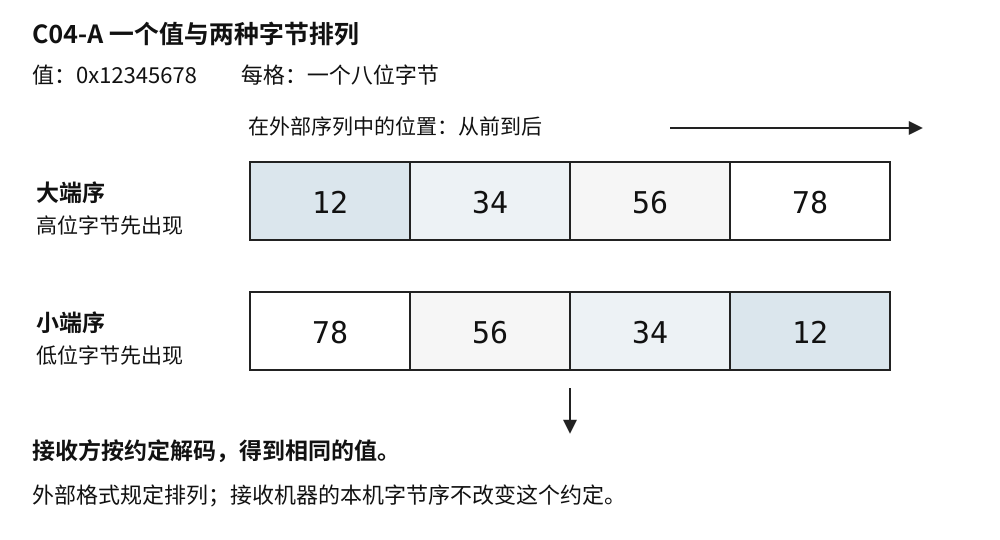
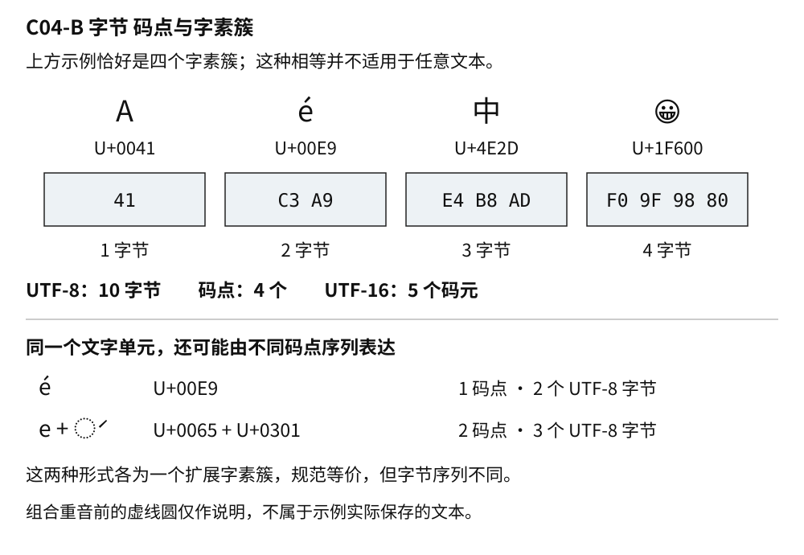
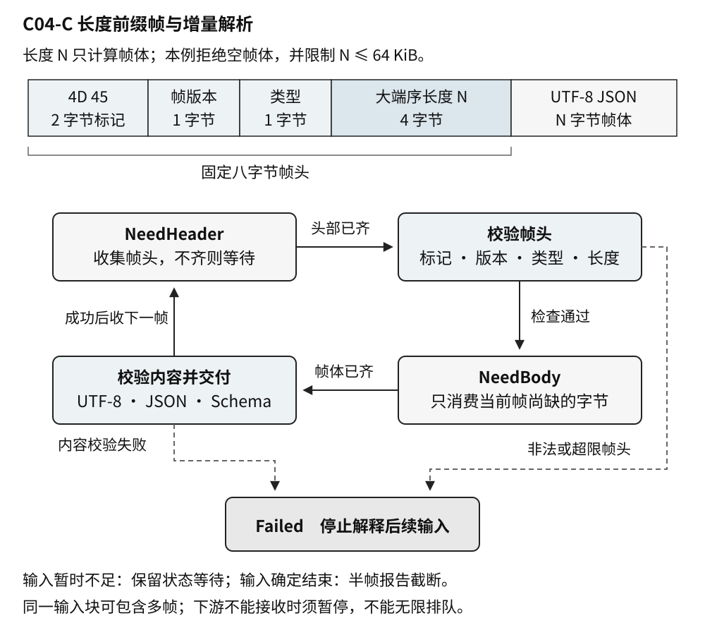

# C04 数据与协议的共同语言

第一批正文 v0.1 · 卷一 共享基础 · 2026-10-03

程序处理的是有含义的数据，文件、内存和通信接口保存的却是某种表示。温度 23.5、一条设备编号、一个预约时间，看起来都可以塞进变量或字符串，但接收者还需要知道数值范围、字符编码、计量单位和时间基准，才能还原原来的意思。

**数据表示**约定一个值如何写成可存储的形式；**协议**还约定参与者如何交换这些表示，哪些消息可以出现，以及收到不完整或不合法内容时怎么办。它们并不只用于网络。读取文件、连接串口设备、调用动态库、回放历史记录，都会经过类似的边界。

许多故障并不是某一方“算错了”，而是两边遵守了不同的约定：发送端写入毫秒，接收端按秒解释；一方把长度当字节数，另一方按字符计数；旧程序能够读懂新增字段的格式，却没有执行它要求的新行为。把这些约定显式地放进类型、字段和解析过程，才能让程序内部的值与外部世界保持一致。

本章从以下四个方面说明这些约定：

1. **C04.01 整数 浮点 字节序和溢出**：区分值、类型和字节表示，说明计算与转换如何受到范围、精度和排列规则的约束。
2. **C04.02 字符编码 Unicode 时间与单位**：解释文本的不同长度、时间点与时长、时区与偏移，使字段的计量对象和解释基准清楚可见。
3. **C04.03 序列化 Schema 演进与兼容**：把独立字段组织成记录契约，讨论缺失值、未知字段及不同版本之间如何保留业务含义。
4. **C04.04 状态机 协议解析与不可信输入**：把契约落实到分块输入的收集、验证和交付，处理消息边界、资源限制与错误状态。

## C04.01 整数 浮点 字节序和溢出

### 1.1 值 类型与字节是三件事

整数二百五十八是一个值。十进制的 `258` 和十六进制的 `0x0102` 是这个值的不同写法；把它放进某个 C++ 整数类型，又涉及该类型的范围和运算规则。C++ 把有类型、占用存储的数据实体称为**对象**，一个普通整数或一条复杂记录都可以是对象。对象保存到内存时，还涉及它占多少存储、各部分如何排列。换一种写法不改变值，换一种类型或编码却可能改变可表达的信息。

**位**只有 0 和 1 两种状态。把若干位按约定组合起来，才能表达整数、文字或其他内容。网络规范经常使用 **octet**，明确指八位。C++ 的 **byte** 则是 `sizeof` 使用的存储单位，`sizeof(char)` 等于 1，但一个这样的单位不必恰好八位；其位数由 `CHAR_BIT` 表示。[S1] 本章的文件与协议例子都以八位字节为单位，涉及 C++ 代码时也明确这个前提。

类型不仅决定能放多少信息，还决定程序怎样使用它。`unsigned int` 表达非负整数；`int` 可以表达负数。它们即使占用相同大小的存储，运算与转换也不能一概而论。普通 `char` 的有符号性由实现选择，不能把它默认为“小号无符号整数”。处理原始字节时，用 `unsigned char` 或 `std::byte` 表达意图，通常比借用普通文本字符类型清楚。

这里还要区分**对象表示**与**值表示**。对象占用的全部存储属于对象表示，其中实际参与表达值的位属于值表示；二者不一定完全重合。[S1] 后面讨论结构体时，还会遇到为布局而留下的填充空间。因此，“两个对象值相等”和“它们占用的每个字节都相同”不是通用的等价关系。

### 1.2 整数范围与运算边界

先用一个没有填充位的八位示意模型观察范围。无符号表示可以容纳 0 到 255；补码有符号表示可以容纳 −128 到 127。补码中，全部位为 1 表达 −1，而同一组位按无符号规则解释则是 255。这里的八位模型不表示 C++ 的 `int` 只有八位。

C++20 已规定有符号整数采用补码表示。实际以无符号类型进行的运算按模 2ᴺ 进行，其中 N 是类型宽度；有符号算术结果超出可表示范围，仍会产生未定义行为。[S2]、[S3] 窄整数在表达式中还可能先被提升，稍后会继续说明。**补码解决表示问题，没有把有符号溢出变成可依赖的回绕运算。**

未定义行为不是“结果未确定但程序还会照常执行”。它意味着语言没有为该执行规定行为，编译器也不必保留程序员想象的机器指令顺序。例如，不能先对最大的有符号整数加 1，再通过结果是否变小判断溢出。到判断时，前一步已经越过了规则边界。

无符号回绕虽然有定义，也不自动符合业务要求。长度从最大值加 1 回到 0，在语言层面有结果，在缓冲区分配中却可能把一个大请求变成小分配。选择无符号类型，只是选择了运算语义，没有代替范围检查。反过来，环形序号有时正需要模运算，但比较新旧顺序时还必须约定最大间隔，不能直接套用普通大小关系。

标准给内置整数类型规定最低能力，并不把 `int` 固定为 32 位，也不保证 `long` 与指针同宽。`std::uint32_t` 这样的精确宽度类型在实现提供时才存在；它适合表达“恰好 32 位”的要求，不能据此推出整台机器的所有类型都遵循同一宽度。[S1] 如果某个文件格式必须包含四个八位字节，就把它写成格式要求；程序支持哪些平台，再由平台检查和实现适配来保证。

### 1.3 表达式先计算 再赋给目标

看见左边有一个宽类型，容易以为右边也会用宽类型计算。实际需要先看右侧操作数的类型。

```cpp
// C++20 函数体片段，需包含 <cstdint>。
// 前提：int 至少 32 位，且实现提供 std::uint64_t。
// 未编译、未执行。
int width = 50000;
int height = 50000;

// 在 32 位 int 平台上，下面的乘法会发生有符号溢出。
// std::uint64_t wrong = width * height;

const auto area = static_cast<std::uint64_t>(width) *
                  static_cast<std::uint64_t>(height);
```

错误写法不是“赋值时装不下”，而是两个 `int` 已经先做乘法。把结果赋给更宽的变量，不能修复此前的错误。后一个写法在本例给定的正值下先扩大操作数，乘法结果 2,500,000,000 可以被该无符号 64 位类型表示；若输入来自外部，仍应先排除负数并检查业务上限。

混合有符号与无符号类型时，运算之前还会进行整数提升和通常算术转换。**不是只要出现一个无符号数，结果就一定无符号。** 转换需要比较类型等级以及有符号类型能否表示无符号类型的全部值。[S1] 不过，一个常见而确定的例子是 `-1 < 1u`：两边分别为 `int` 和 `unsigned int`，前者会转成无符号值，所以这个比较为假。

这种问题经常出现在外部输入与容器长度相遇的位置。输入中的 −1 可能表示“未设置”，容器的大小则使用无符号类型。没有先处理哨兵值，就把二者混着比较，结果可能与数学直觉相反。更合适的接口是把“缺失”和“有一个非负长度”分开表达；确实需要混合比较时，C++20 在 `<utility>` 中提供的 `std::cmp_less` 等整数比较函数可以帮助保留数值意义，但输入的业务合法性仍须单独检查。[S1]

转换本身也有边界。C++20 的普通整数到整数转换，除布尔相关特例外，按目标类型宽度取同余值；不能继续把超范围转为有符号整数笼统写成“由实现决定”。[S2] 但**浮点转整数不是这条规则**：小数部分被舍去，而舍去后的值若不能由目标类型表示，行为未定义，不能依赖饱和或回绕。[S1] 把收到的数字直接强制转换，既不等于验证范围，也不等于四舍五入。

### 1.4 在运算前建立可表示条件

协议里的 `offset` 与 `length` 都是非负整数。检查一段内容是否位于总长 `total` 内，看似可以写成 `offset + length <= total`。但若加法先回绕，比较就失去了原意。先确认起点存在，再比较剩余长度，能避免为验证而制造另一个溢出点。

```cpp
// C++20 完整函数，未编译、未执行。
#include <cstddef>

bool range_fits(std::size_t offset,
                std::size_t length,
                std::size_t total) noexcept {
    return offset <= total && length <= total - offset;
}
```

逻辑与运算从左向右判断；如果 `offset > total`，右边不会求值，因此减法在执行时已经有前提。这个函数只回答范围是否能容纳，允许位于末尾的空范围；它不证明底层真的存在一块这么大的可访问存储，也不决定业务是否允许空字段。

同样，对两个已处于同一无符号类型中的量 `count`、`element_size`，计算乘积前可以检查：`element_size == 0`，或者 `count <= limit / element_size`。这里 `limit` 应取相关机器范围与应用预算中更紧的上限，且先处理零，避免除零。用于分配时，还要核对容器容量限制及分配失败。一个数既可能在数学上合理、在机器类型里装得下，又可能远远超出当前服务愿意接受的资源量。

宽类型减少某些溢出风险，但“先转成最大的整数”不是普遍解法。两个 64 位输入的乘积仍可能超出 64 位，负数转无符号也不会保留“非法”的含义。真正需要保留的是操作前可说明的条件，以及超出条件时明确的结果。

### 1.5 字节序决定多字节值怎样排列

用四个八位字节保存整数 `0x12345678` 时，**大端序**先放高位字节，排列为 `12 34 56 78`；**小端序**先放低位字节，排列为 `78 56 34 12`。这里的“先”指内存低地址或文件中的靠前位置，必须结合具体上下文说明。字节序改变排列，不改变双方原本想表达的整数值。



图 C04-A 值与外部表示。图中每格恰好八位，箭头表示排列或解码关系，不表示程序必须按图中的存储步骤执行。

如果协议规定大端序，接收端应按这个规则解码，不必要求接收机器本身也是大端序。下面逐个组合四个字节，既没有把缓冲区假装成某个整数对象，也没有要求输入地址满足整数类型的对齐。

示例中的 `std::span` 是访问一段连续元素的非拥有视图：它提供访问入口和范围，不保存一份独立副本，也不负责保留底层数据。`std::span<const std::byte, 4>` 表示一个四字节视图，`const` 表示不能通过它修改这些字节。

```cpp
// C++20 完整函数，未编译、未执行。
// 前提：实现提供 std::uint32_t，且一个 C++ byte 恰好八位。
#include <climits>
#include <cstddef>
#include <cstdint>
#include <span>

static_assert(CHAR_BIT == 8);

std::uint32_t read_be_u32(std::span<const std::byte, 4> bytes) {
    return (std::to_integer<std::uint32_t>(bytes[0]) << 24) |
           (std::to_integer<std::uint32_t>(bytes[1]) << 16) |
           (std::to_integer<std::uint32_t>(bytes[2]) << 8)  |
            std::to_integer<std::uint32_t>(bytes[3]);
}
```

每个字节先转成目标无符号类型，再移位，避免在窄类型或有符号类型中先完成不合适的中间运算。固定长度的 `span` 表达函数需要四个元素；调用方仍有责任在建立这个视图前确认已有四个有效字节。数据视图的有效期属于另一类边界，C09 会继续讨论。

`std::endian` 可以描述实现的字节序情况，却不会替程序解码。`memcpy` 能避免某些对齐和别名访问问题，也不会自动交换字节。无论采取逐字节组合、成熟编解码库还是平台转换函数，最终都应兑现协议的表示约定。

### 1.6 浮点数的范围与精度各有含义

浮点数用有限的有效数字和指数表示数值，适合在较大范围内表示测量与计算结果。这里的“浮动”来自表示尺度可以改变，而不是每个数都拥有任意精度。

以常见 IEEE 二进制双精度格式为例，普通有限值使用 53 位有效精度，存储共 64 位，分为符号、指数和小数部分；它还定义了零、非正规数、无穷大与 NaN 等表示。[S4] 这些是指定浮点格式的性质，不能只凭 C++ 类型名 `double` 就断言任何实现都采用完全相同的布局。需要依赖时，应核对目标实现及 `std::numeric_limits` 提供的属性。[S1]

有限的二进制小数可以精确表示二分之一、四分之一，却不能精确表示十分之一。原因与十进制不能用有限位写完三分之一类似。于是，输入、计算或输出格式转换，都可能需要把理想值映射到附近的可表示值。这不是某个十进制字符串“写错了”，而是选定表示的能力有限。

数值越大，相邻可表示值的间隔也可能越大。对上述 53 位精度格式，0 到 2⁵³ 范围内的整数都能精确表示，但 2⁵³ 后面的每个相邻整数就未必能区分。因此，账号或消息 ID 即使从不参与计算，也不适合为了方便而统一转成浮点数。两条不同 ID 一旦在转换中合并成同一个值，后来再增加显示位数无法恢复丢掉的信息。

NaN 表示“不是一个数”，并不是业务缺失值的通用替代品。按常见 IEEE 比较语义，NaN 与自身比较相等也为假。[S4] 假如验证逻辑只拒绝“小于下限”和“大于上限”，没有另行处理 NaN，就可能漏过它。接收要求有限数值的接口时，应明确检查有限性；允许缺失时，则使用协议定义的缺失形式。

把钱、配额或离散刻度保存为整数，常能避免某些十进制表示问题，但还要写明最小单位、舍入规则与范围。把测量值保存为浮点数，则要明确精度需求和特殊值策略。怎样依据业务误差选择容差，属于 C01 的问题；数据表示这一层首先要回答的是：准备保存什么、哪些信息会在转换中消失，以及这种损失是否被允许。

## C04.02 字符编码 Unicode 时间与单位

### 2.1 文字先有编号 再有编码

一串字节没有自动附带“这是中文”的含义。**字符编码**定义字节或其他存储单元怎样对应文字。若写入时采用一种编码，读取时采用另一种，即使每个字节都完整保存，也可能得到乱码。

Unicode 为文字处理提供统一的编号空间。**码点**是其中的编号，例如 `U+0041` 对应拉丁大写字母 A。码点不等于某种固定大小的存储单元；**码元**是特定编码形式使用的基本单元。UTF-8 使用八位码元，UTF-16 使用十六位码元。Unicode 标量值则排除了代理码点，UTF 编码形式据此表达有效字符数据。[S5]

一个 Unicode 标量值在 UTF-8 中占一到四个字节；在 UTF-16 中占一个或两个码元。UTF-16 中的代理对是两个码元共同表示一个标量值，不能把其中一半作为完整字符交出去。[S5]、[S6] “Unicode 每个字两个字节”把编号体系、编码形式和字符边界混在了一起。

例如，`Aé中😀` 的四个码点，在 UTF-8 中分别使用 1、2、3、4 个字节，总共十个字节；在 UTF-16 中共使用五个码元。这是按编码规则推导的表示例子，不是某个字体的实际宽度测量。

### 2.2 长度要对应真实操作

**字素簇**是一组通常应作为整体处理的码点。Unicode 的扩展字素簇规则为光标移动、退格和截断等操作提供默认边界，但不承诺在所有语言与界面中都完全等同于用户心中的“一个字”。[S7] 字形则是字体和排版过程实际画出的形状，还属于另一层。

预组合的 `é` 可以用一个码点表示，`e` 后加组合重音则是两个码点；后者通常仍作为一个扩展字素簇。于是，按码点截取一个位置，虽然可能保留合法编码，仍可能把重音留在后面。部分 emoji 也由多个码点共同组成，不能用“遇到四字节编码就算一个完整表情”代替字素分段。



图 C04-B 文字长度有不同的计量对象。上半部的简单示例恰好也是四个扩展字素簇；这不意味着任意文本的码点数都等于字素簇数。

这几个长度都有用，只是用途不同：传输长度和缓冲区预算应按字节；编码遍历要识别码元序列；按文字单元移动或删除时，需要选择字素边界；界面能否放下标题，则还要看排版后的宽度。把接口命名为 `max_length` 却不说明单位，等于把关键设计留给下一位调用者猜测。

在八位字节平台上，用 `std::string` 保存 UTF-8 时，`size()` 给出其中 `char` 元素的数量，也就是编码字节数，不是码点数或字素簇数。`std::u8string` 的元素类型为 `char8_t`，有助于在接口上表达 UTF-8 意图；类型本身不会替任意运行时内容证明编码有效。

若数据库字段最多允许 64 字节，直接保留 UTF-8 文本的前 64 字节，可能切在多字节编码中间。更合适的过程是：先按明确规则验证文本，再寻找不超过字节预算的合法截断点。如果还要求“不切开用户看到的文字单元”，就进一步退到字素边界；有省略号时，也要把省略号的编码长度算进预算。这里的选择应来自产品契约，而不是在出错后临时补几个字符判断。

### 2.3 合法编码与文本相等

UTF-8 验证不仅是看后续字节是否以某种位模式开头。它还要排除过长表示、代理码点和超过 Unicode 范围的值，并检查序列是否完整。[S6] 一个增量读取器在块末尾看到三字节序列的前两个字节，可能只是需要更多输入；只有当字段或输入确定结束时，才能判定它是截断错误。这与本章后面的分帧状态机是同一种边界问题。

非法编码如何处理，也要先约定。展示一份受损日志时，用替代字符显示错误位置可能有价值；解析账号、路径或签名内容时，静默替换却可能使两个不同输入变成同一个名字。输入验证与展示修复可以使用不同策略，但不能让权限检查使用原文、实际访问使用另一份悄悄变换后的文本。

即使两份文本都是合法 UTF-8，字节不同也不必然意味着文字不同。Unicode 规范化定义了处理规范等价或兼容等价的形式，其中 NFC、NFD 处理规范等价关系，NFKC、NFKD 还涉及兼容分解。[S8] 前面两种 `é` 的写法，就是解释规范等价的常见例子。

是否规范化，要结合用途决定。搜索可能需要某种归一规则；保存原始证据时，可能还应保留输入形式；账号唯一性则必须让注册、查询与登录沿用一致策略。兼容规范化、大小写折叠和视觉相似字符处理是不同问题，不能把“做过 NFC”当成全部身份安全检查。对带签名的数据，先确认签名针对原始字节还是某种规范形式，再决定任何变换的位置。

### 2.4 时间点与时长需要不同的时钟

**时间点**回答“哪一刻”，**时长**回答“隔多久”。它们可以都存成整数，却不是同一种量。`1500` 可能表示等待 1500 毫秒，也可能表示某个纪元之后的第 1500 秒；缺少单位和基准，数字无法被可靠解释。

墙上时钟用于表达日期时间，可以与日志、人类日程及其他系统对照。它可能因校时而改变。单调时钟用于观察时间向前经过，适合本机耗时和超时预算。C++ 的 `system_clock` 表达系统实时时钟，`steady_clock` 承诺其时间点随物理时间前进不倒退，并以稳定速率推进。[S1]

```cpp
// C++20 函数体片段，需包含 <chrono>。
// 未编译、未执行；两次读取之间省略了待计时操作。
const auto begin = std::chrono::steady_clock::now();
// 在这里完成待计时操作。
const auto end = std::chrono::steady_clock::now();
const auto elapsed = end - begin;
const auto elapsed_ms =
    std::chrono::duration_cast<std::chrono::milliseconds>(elapsed);
```

`elapsed` 是时长，不是一个可直接当作日期显示的时间点。转换成整毫秒会丢掉更细的部分；如果原操作只用了不到一毫秒，得到 0 毫秒并不表示没有花时间。时钟分辨率、测量开销和执行噪声还会影响解释，因此代码只说明类型关系，没有给出测量结果。

不要把本机单调时钟的裸计数发送出去，让另一台机器与自己的计数直接相减。两者未必共享起点，重启后的值也不能据此直接比较。跨系统事件关联通常要使用约定的时间表示，并另外处理时钟误差；本机截止时间则可以由单调时钟维护。单调时钟在设备休眠期间怎样计时，也需要按实际平台需求核对，不能仅由名称推出。

C++20 的 `sys_time` 使用从 1970-01-01 00:00:00 UTC 起、排除闰秒的计时方式。[S1] “时间戳”本身却不是格式名称：协议仍应明确纪元、单位、精度和时间尺度，不能把任何长整数都默认成同一种 Unix 时间。

### 2.5 时区 偏移与单位契约

`2026-10-03T10:00:00Z` 与 `2026-10-03T18:00:00+08:00` 表达同一时刻。RFC 3339 为互联网时间戳定义了常用语法，`Z` 表示零 UTC 偏移；带数值偏移的表示也能定位到相应时刻。[S9] 但 `+08:00` 是偏移，不能替代一套地区时区规则。

地区时区，例如 `Asia/Shanghai`，包含与当地历史和政策相关的规则。IANA 时区数据库会随着规则变化而更新。[S10] 对“下个月每天当地上午九点”这样的安排，需要保留地区时区与日历意图；仅保存某一次的 UTC 偏移不够。采用夏令时的地区还可能出现不存在或重复的当地时间，应用需要明确拒绝、选择哪次或如何调整，而不是让不同组件自行猜测。

因此，“保存已经发生的事件”与“安排未来的当地活动”需要的字段可能不同。前者通常重点保存明确时间点及必要的原始来源；后者还关心当地日期、时区和规则变化后的行为。把所有时间都转为 UTC 可以方便某些存储与比较，却不会消除这些业务差异。

单位也不只是注释。距离中的米和毫米、角度中的度和弧度、吞吐中的字节每秒和位每秒，在数学上都可以用同一个浮点类型表示，混用却会改变计算含义。字段名、类型封装或单位库应尽可能保留这些区别。对内存预算，1 MiB 为 2²⁰ 字节，1 MB 为 10⁶ 字节；写明单位，才能让限制与观测结果对得上。[S11]

把时长转换为更细单位时，还要回到整数范围。例如，秒数在某个整数类型中装得下，乘以一千后的毫秒数未必装得下。单位转换既涉及比例，也涉及舍入和溢出，不能只在字段名后补一个 `_ms`。

## C04.03 序列化 Schema 演进与兼容

### 3.1 内存对象不是对外格式

**序列化**把程序中的值组织为可存储、传递的表示；反序列化则按约定从该表示构造值。它需要保存接收方应得到的信息，不必复制发送方的内存布局。

假设一条读数在程序里包含整数编号、温度和字符串备注。把结构体地址与 `sizeof` 交给写文件函数，保存的只是当前对象表示：成员之间可能有填充，整数与浮点布局依赖目标环境，字符串对象内部也可能只有管理信息与指向字符的地址。对方得到相同数量的字节，不等于得到原来的字符串和温度。

即使结构体只有简单整数，也仍要说明字段宽度、字节序和布局。把结构体强制压紧，只能影响部分布局问题，不能补上版本、单位、可选字段和错误处理。C++ 为某些可平凡复制对象提供的字节复制保证，也不等于“这份对象表示是跨平台协议”。[S1]

某些受控系统会明确设计与内存布局紧密对应的格式，但需要把布局、对齐、访问限制、版本和生命周期都纳入契约。那是一种专门设计，不能从“这个结构体今天正好能读”推导出来。

### 3.2 格式负责结构 Schema 负责约束

**Schema** 可以理解为一份数据契约：有哪些字段、各用什么类型、是否必需、允许哪些值，以及字段之间有什么关系。它可能由专门语言编写，也可能由接口文档和校验代码共同表达。序列化格式回答“如何写下来”，Schema 进一步回答“写下来的内容怎样才算一条有效记录”。

JSON 使用可读的文本结构表达对象、数组、字符串与数字等值，适合观察和调试，但它没有替每个业务规定字段。CBOR 是一种二进制数据格式，可以直接区分字节串等类型；它同样需要应用层约定含义。[S12]、[S13] “二进制”不自动意味着无歧义，“文本”也不自动意味着不需要 Schema。

下面是一份本章构造的温度读数，不对应现有设备协议：

```json
{
  "schema_version": 1,
  "sample_id": "9007199254740993",
  "observed_at": "2026-10-03T10:00:00.125Z",
  "temperature_milli_celsius": 23500,
  "quality": "measured"
}
```

只有例子还不够，接收方需要相应契约。本章为这份记录约定：

| 字段 | 类型与含义 | 本例的约束 |
|---|---|---|
| `schema_version` | 整数，记录语义版本 | 必需；当前接收者支持 1 |
| `sample_id` | 十进制数字组成的字符串 | 必需；1 至 20 个 ASCII 数字；除 `0` 外无前导零；只作为标识使用 |
| `observed_at` | 时间字符串 | 必需；本例采用 RFC 3339 的受限形式：`Z`、三位小数、秒为 00 至 59；日期必须有效 |
| `temperature_milli_celsius` | 整数，单位为千分之一摄氏度 | 必需；范围 −60 000 至 150 000；23500 表示 23.5 ℃ |
| `quality` | 字符串枚举 | 可省略；省略表示质量未知；已知值为 `measured`、`estimated` |

时间限制和温度范围是为了说明契约而选定的应用规则，不是 RFC 3339 或所有温度传感器的通用限制。RFC 3339 的完整语法还包含本例不接受的形式。接受一个格式的受限子集可以是合理设计，前提是明确说明，不能宣称实现了完整格式。

`sample_id` 特意使用字符串。JSON 数字语法不等于每种解析库都能无损保存任意整数，RFC 8259 也指出了常见双精度数值实现的互操作范围。[S12] 这条 ID 大于 2⁵³，经过某些浮点表示会丢失区分能力；既然业务只把它当标识，字符串能保留其原始数字序列。字符串仍要验证允许字符和长度，不能因此视为已经安全。

本例还规定：拒绝重复字段名，拒绝必需字段缺失，未知的普通附加字段可以跳过，但新版本或具有未知含义的操作要求不能静默执行。RFC 8259 建议对象成员名称唯一，并指出重复名称的接收行为存在差异；这里进一步选择“拒绝”，是为了让各层看到同一份记录。[S12] 如果校验器保留第一个值、业务库保留最后一个值，同一段输入就可能被两次解释成不同内容。

### 3.3 缺失 零和未知不能随意合并

温度为零是一条有效读数，缺失温度则表示没有这项数据；它们不能因为整数默认初始化为 0 就被合并。JSON 的字段缺失、显式 `null`、空字符串和数字 0，也不是天然等价的四种写法。Schema 应明确哪些允许，以及各自意味着什么。

这在“更新部分字段”的请求里尤其重要。缺失可能表示保留原值，`null` 可能表示清除，0 可能表示把值设为零。若反序列化之后只剩一个没有存在性信息的整数，业务代码就无法再知道调用方究竟表达了哪种意图。

Protocol Buffers 通过字段编号和 wire type（表示后续字段如何解码或跳过的编码类别）组织二进制内容，接收者可以按编码结构跳过不认识的字段。[S14] 它也区分不同的字段存在性策略。以 proto3 普通标量字段为例，未显式跟踪存在性时，默认值与“未设置”的区别不能从普通读取结果中恢复；使用支持显式存在性的字段声明，则可以查询该字段是否出现。[S15]

这里不能把某一格式的具体行为推广成“所有序列化都会自动处理缺失”。选择库时，需要看应用是否必须区分这些状态，再决定字段声明和内部表示。比如，`quality` 缺失表示未知，就不能在读取时默认升级为 `measured`。这样的默认值看似方便，却把“没有证据”变成了“有证据”。

### 3.4 兼容要说明方向和含义

**兼容**至少包含两个问题：旧接收者能否接受新写入者的数据，新接收者能否接受旧写入者的数据。还要再问，接受后是否做出了仍然正确的业务解释。不同团队对“向前”“向后”的命名习惯可能不同，直接写出读写双方版本更清楚。

假设新版本只增加可选的设备位置标签。旧接收者若允许跳过未知普通字段，就仍能使用原来的读数；新接收者读旧记录时，也可以把位置保留为未知。这是一个有希望平滑演进的变化。但如果新版本新增“该温度必须先按给定系数校准才可使用”，旧接收者即使成功跳过字段，拿未校准值去报警仍可能错。**编码兼容不能替代语义兼容。**

用本章记录比较几种改动，区别会更具体：

| 改动 | 解析层可能发生什么 | 仍需处理的语义 |
|---|---|---|
| 增加可选位置标签 | 旧接收者可按约定跳过 | 缺失必须有可接受含义 |
| 温度字段从毫摄氏度改为摄氏度，名称不变 | 仍可能读成合法数字 | 数值相差一千倍，不能这样原地改含义 |
| 增加一种 `quality` 值 | 字符串仍可读取 | 旧代码应按未知处理或拒绝，不能默认可信 |
| 把整数范围扩大 | 新程序可以写出更大值 | 旧程序、数据库或下游可能装不下 |
| 给旧记录新增必需字段 | 新解析器可能拒绝旧数据 | 必须考虑历史数据与迁移过程 |

字段编号也是持久契约。Protocol Buffers 的维护者文档明确要求不要改变已有字段编号；删除字段后，应保留其编号，避免后来复用为另一种含义。增加字段在其二进制格式规则下可以保持解析兼容，但不意味着任意改类型都安全。[S16] 即使 wire type 相同，不同类型也可能用不同解释规则，不能只看字节数量。

未知字段能否保留，还取决于经过了哪些中间组件。proto3 二进制消息通常会保留未知字段，但转换为 JSON、按已知字段逐个重建消息等操作可能丢掉它们。[S16] 所以“一头旧、一头新能通信”还不够，要把代理、持久化、回放和格式转换都放进兼容路径。

### 3.5 版本字段需要与发布过程配合

版本号告诉接收者应该采用哪套规则，却不会自己实现迁移。增加版本字段后，仍要规定未知版本是否拒绝、哪些能力可协商、旧数据如何读取、出问题时能否回滚。

一种常见的渐进方式，是先让接收者能够理解新旧形式，再让写入者开始产生新形式，最后在确认旧记录和旧客户端不再需要后移除旧支持。这只是发布策略，具体是否可用取决于系统拓扑与保留期限。离线设备、长期归档和用户可导入的旧文件，都会延长旧格式的生命。

兼容验证因此应覆盖多个方向：新读旧、新读新、旧读新，以及经过实际中间组件的往返。比较时不能只问“有没有报错”，还应比较字段存在性、单位、精度和业务结果。把旧记录读进来再写出去，如果丢掉未知字段或把缺失填成默认值，也可能是一次有损迁移。

最后，值相同不一定意味着序列化字节相同。字段顺序、数字写法或等价文本形式，都可能带来不同输出；Protocol Buffers 也明确说明其序列化不是跨环境的规范编码。[S17] 如果要把序列化结果用于签名、内容哈希或缓存键，必须明确处理的是原始字节还是语义值，并选用相应的规范化规则。某个实现中的“确定性输出”，不应被扩大为所有版本和所有语言实现之间永久一致的承诺。

## C04.04 状态机 协议解析与不可信输入

### 4.1 消息边界与输入块边界

有了字段格式，还需要知道一条消息从哪里开始、到哪里结束。**帧**是在连续输入中划出的一个可识别单元；帧头可以携带类型、版本和长度，帧体保存具体内容。长度前缀、分隔符和固定大小都是常见分帧方式，各自需要处理长度范围、转义或扩展问题。

本节构造一个简单帧，把上一节的 JSON 记录放进帧体。帧头固定八个八位字节：前两个字节为识别标记 `4D 45`，接着一个帧版本字节、一个消息类型字节，最后四个字节为大端序无符号长度。长度只计算帧体，不包含帧头。帧版本 1、消息类型 1 表示本例的读数消息；帧体采用 UTF-8 JSON。本例接收策略将帧体限制在 64 KiB 以内，并拒绝空读数帧。

这个 64 KiB 上限是示例预算，不是某种通用安全阈值。帧头版本描述外层封装，记录中的 `schema_version` 描述内容契约，二者不应因为都叫“版本”而混为一项。

输入读取接口可能先交来三个字节，下次交来剩余帧头和部分帧体，再下一次同时带来这一帧的尾部与下一帧的开头。**一次读取返回的块，不必是一条消息。** 这可以发生在分块读取文件、串口缓冲或流式传输中，不需要先假定具体使用 TCP。若底层接口保留消息边界，也仍应检查它是否可能截断，以及上层是否允许一个消息包含多个应用帧。

因此，解析器必须保存“已经读到哪里”，而不是每次有数据就从字节零重新解释一遍。它也必须允许一个输入块产出多帧，并保留尚未构成完整帧的尾部。

### 4.2 状态机表达下一步允许发生什么

**状态机**用有限的一组状态和受条件控制的转换表达处理过程。它的价值不是把代码画得复杂，而是让“现在缺什么”“何时能交付”“遇到错误还能否继续”都能被逐项说明。

对本例，可以先定义三个主要等待或终止状态，再把校验作为转换条件：

- `NeedHeader`：还在收集八字节帧头，只能使用已经到达的部分
- `NeedBody`：帧头已完整且通过检查，已经知道允许接收的帧体长度
- `Failed`：遇到本例不允许恢复的格式错误，停止解释后续输入

完整帧体经过文本、Schema 校验后，才形成一条可以提交给上层的记录。提交成功后回到 `NeedHeader`；提交失败或下游暂时不能接收时，则需要一个明确的错误或暂停路径，不能一边丢掉记录一边宣称处理完成。



图 C04-C 本章示例的分帧与解析状态。它展示一种保守的错误策略，不代表所有协议都必须断开或丢弃整个输入源；能否恢复应由具体协议定义。

这个过程有几条值得直接保存在代码结构中的关系：帧头未齐时不读长度；长度未验证时不按它申请帧体；已有帧体字节数不超过所需字节数；只有完整且通过验证的内容才能交给业务。它们是状态转换的条件，不是事后打印的提示语。

在 `NeedBody` 中，每次最多消费“当前输入剩余量”和“当前帧体尚缺量”中较小的一项。这样，同一输入块中下一帧的开头不会被吞进当前帧。若收齐后还有输入，就回到帧头状态继续处理；若输入用完而帧体未齐，就保留进度并返回“需要更多数据”。

解析循环还要避免没有进展的反复执行。一次迭代应消费输入、产生一个明确转换、交付结果，或者返回等待/错误；不能在相同状态与相同输入位置之间无限空转。若下游处理速度较慢，也不能只把“已完成消息”无限堆到输出队列，解析接口需要能暂停，等下游有容量再继续。

### 4.3 长度只是对方的声明

帧头中的四字节长度可以表达很大的值，但接收者没有义务接受它。完成长度解码之后，应先检查协议与应用上限，再检查本机容器和索引类型能否表示，最后决定如何取得存储。把外部长度直接转换成 `size_t` 再验证，在目标类型更窄的平台上可能已丢掉高位。

如果实现保存整帧，还要避免 `header_size + body_size` 先溢出。可以先确认预算至少覆盖帧头，再比较帧体长度是否不大于“总预算减帧头长度”。若按记录数分配数组，则使用前文的乘法检查思路。数值类型、业务预算和实际存储能力，是依次需要满足的条件。

限制单帧大小还不够。许多小帧可以填满总队列，深层嵌套可以耗尽解析栈，压缩后的短输入可以产生很大的输出，重复字段也可能触发昂贵处理。CBOR 的安全注意事项同样要求解码器管理长度、整数运算和嵌套等资源风险。[S13] 对本例的 JSON 帧，除字节上限外，还应为嵌套深度、字段数量、字符串长度和累计缓冲设置适合用途的限制。

这些限制应尽量在资源消耗前或消耗过程中执行。先无界解压再检查结果长度、先建立巨大对象树再数层数，都把保护放得太晚。流式解析能减少某些峰值占用，但如果下游又把全部对象保存起来，整条处理链仍然可能无界。

时间也属于资源。一个输入源可以声明一份合法长度，然后长时间只送来极少内容。是否设置接收期限、是否允许暂停、如何分配不同来源的预算，需要结合文件读取、设备通信或服务连接的实际语境。超时不应被混成“长度错误”，但同样需要有清理和终止路径。

### 4.4 等待 错误与结束是不同结果

“目前只有五个帧头字节”不是完整性错误，只是尚未收齐；“输入已经确定结束，仍只有五个帧头字节”才是截断。解析器最好让调用方显式告知输入结束，而不是把本次没有数据自动等同于永久结束。

对本例，结束时位于 `NeedHeader` 且没有暂存字节，可以表示完整帧序列正常结束；半个帧头或半个帧体则应报告截断。完整的帧体但非法 UTF-8、重复 JSON 字段或缺失必需内容，是不同的失败原因。区分它们有助于定位哪个边界上的约定没有兑现。

接口也需要区分“输入非法”和“接收端资源暂不可用”。否则，分配失败可能被记录成对方发送了坏数据，下游暂时繁忙可能被误写为协议违规。错误报告可以包含状态、字节偏移、预期长度、已收长度以及稳定错误类别；日志中是否能放原始内容，则要考虑隐私与密钥，不能为了排障把完整消息无差别写出。

本例遇到非法标记、未知帧版本、超限长度或内容错误后进入 `Failed`，不尝试随意扫描下一个 `4D 45`。这个短标记也可能出现在载荷里，盲目搜索会把中间内容误认为新帧。文件修复或专门通信协议可以设计重同步，但需要另外说明标记转义、候选帧验证和可接受的误判风险。

校验和也有类似边界。它可以帮助检测偶然损坏，却不必然阻止有意篡改；用于对抗攻击的认证机制需要另行设计。分帧正确、编码正确和来源可信，是不同问题。

### 4.5 解析成功之后还有业务状态

协议状态机回答字节序列怎样组成消息，业务状态机回答消息在当前情境下是否允许发生。一个“完成任务”消息可能结构完好、字段齐全，但对应任务尚未开始；一条有效读数可能来自未授权设备，或者所属会话已经结束。解析器不应通过“能读出对象”替业务层批准这些动作。

对需要改变外部状态的系统，可以先构造经过验证的记录，再由业务层核对身份、权限、当前状态以及重复消息策略，最后提交变更。不要在刚读到半个字段时就提前修改最终业务对象，随后才发现后半段非法。确实需要边读边处理大数据时，也要设计暂存、提交和失败清理边界。

这种分层不会要求每一步都部署成独立模块。一个小程序可以在一个函数里完成多项检查，只要检查顺序、失败结果和责任仍然清楚。它也不能保证消息只执行一次；重传、恢复和幂等是业务效果的问题，需要在相应章节继续处理。

### 4.6 沿解释过程定位故障

看到“收到的值不对”，可以沿数据被解释的顺序排查，而不是直接更换库。先保留一份受权限与脱敏限制的最小失败样本，并记下发送与接收两端实际使用的版本，再依次确认：

1. **字节是否一致。** 核对总长度、关键位置的十六进制内容、是否有截断或重复，以及抓取位置在压缩、转义、解密的哪一侧。两边日志看起来相同的文字，不一定是相同字节
2. **编码是否一致。** 确认字段按哪种字符编码解释，是否切断码元序列，是否经历规范化或替换。乱码先查解码边界，不把所有异常字符归为字体问题
3. **类型与范围是否一致。** 检查宽度、有符号性、整数提升、转换时机与浮点精度。错误集中在某个阈值以上，往往值得优先检查范围与缩窄
4. **单位与时间基准是否一致。** 固定的一千倍差异可以引导检查秒与毫秒或米与毫米；规律性的时差则引导检查 UTC 偏移、地区时区与重复转换。现象只提供线索，还需核对实际字段契约
5. **格式与版本是否一致。** 检查字段存在性、重复名称、未知字段、枚举以及中间格式转换。能反序列化成功，也要比较业务解释是否相同
6. **解析与业务状态是否一致。** 检查输入块如何拼帧，结束如何通知，错误后有没有继续使用旧状态，以及当前业务是否允许该消息生效

如果小消息正常、大消息失败，先看边界长度、整数计算、缓冲预算和输出积压；如果只有包含 emoji 的名称失败，先看字节预算与字符边界；如果只在升级后失败，沿读写版本与中间组件寻找语义变化。这样的顺序能够缩小搜索范围，但不能仅凭症状宣布原因已经确定。

代码验证时，应把正常记录、各个长度边界、非法编码、未知版本与截断位置纳入样本。对于同一份合法输入，改变分块位置后应得到相同消息；在任意位置宣布结束，结果也应与是否处于完整帧边界一致。还可以检查编码后再解码是否保留契约要求的值，但不能只依赖同一套编解码器相互验证，否则两端相同的错误可能彼此掩盖。独立样本和不同实现之间的对照仍有价值。

这些是验证思路，本章没有执行相关测试，也没有据此声称示例解析器已经通过安全验收。

### 4.7 面试里把边界问完整

**“两台机器都是 C++，为什么不能直接传结构体？”**

语言相同不表示对象布局、整数宽度、字节序和库对象表示相同。即使暂时相同，结构体也没有自动定义字段版本、单位和缺失值。可以在严格受控条件下设计布局绑定的格式，但要说出这些条件。更一般的回答是按协议编码字段，并把内存对象与外部表示分别设计。

**“那我把每个字段改成固定宽度整数，就解决了吗？”**

只解决了一部分范围与表示要求。还要规定字节序、单位、合法值、计算中间类型和溢出策略。如果长度保存为 32 位、分配时转到更窄类型，或者先算出一个已溢出的总长再检查，固定字段宽度仍然救不了程序。应顺着“解码、验证、转换、运算、使用”的实际顺序说明各步条件。

**“消息改成 JSON，是不是跨语言问题就消失了？”**

结构更容易观察，但数字精度、重复名称、字段存在性和编码处理仍可能因实现而异。大整数 ID 可以按契约保存为字符串；字段是否允许 `null`、是否拒绝重复名称、支持什么时间格式，都要写清。跨语言的目标是各方保留同一业务含义，不只是大家都能读入一棵对象树。

**“旧客户端会忽略未知字段，为什么加字段还可能破坏兼容？”**

因为新字段可能改变已知字段的解释，或者要求旧客户端执行它不会执行的动作。增加一个展示标签与增加一个必须先应用的校准参数，后果不同。需要比较旧接收者读新记录、新接收者读旧记录和经过代理后的记录，并确定未知语义应降级、拒绝还是通过能力协商解决。

**“读到一个合法长度，为何不能立即分配？”**

首先，“合法”必须同时包含协议允许、应用预算允许和本机可表示。其次，单帧上限不控制并发帧、嵌套深度、解压大小或下游积压。应说明在哪一步限制资源、如何处理分配失败、输入不继续时怎样释放，以及下游暂时接不住时如何停止继续吸收数据。

**“你怎样说明自己的流式解析没有把输入块当成消息？”**

先描述状态与消费数量：帧头未齐等待，长度通过检查后收帧体，收齐后只交付这一帧，并继续处理同块中剩下的输入。再给出验证方法：同一字节序列改变分块位置，结果应一致；半帧后结束要报截断，完整帧边界结束要成功；非法头部和超限长度不能触发无界分配。若没有执行过这些验证，就把它作为计划说明，不能用状态图代替测试证据。

数据从字节变成业务动作，经过的是一连串解释。把每一层的单位、范围、版本和状态都说清楚，才可能知道错误发生在哪里，也才可能让另一种语言、另一台机器或几年后的程序继续理解今天写下的数据。

## 来源与阅读边界

资料核验日为 2026-10-03。C++ 以内容对应 C++20 DIS 的固定公开草案 N4861 为规范参照，不以滚动草案回填主线；N4859 编辑报告说明该草案与 DIS 的内容关系。Unicode 固定引用 17.0.0 及对应附录；Protobuf 文档为核验时可见的维护者资料，未锁定编译器或运行库版本。下列规范事实、项目行为和本章设计建议各有范围。

本章的测量记录、64 KiB 限制、八字节帧头、状态名称、诊断顺序与插图均为原创说明设计，不是现成协议或性能结论。代码未编译、未执行；未进行模糊测试、兼容性测试、硬件实验或性能测量。

- **S1 C++20 规范参照。** [WG21 N4861][S1]，重点为 `[intro.memory]`、`[basic.types]`、`[basic.fundamental]`、`[conv.prom]`、`[conv.integral]`、`[conv.fpint]`、`[expr.arith.conv]`、`[cstdint.syn]`、`[numeric.limits]` 与 `[time.clock]`；版本身份参见 [N4859 编辑报告](https://www.open-std.org/jtc1/sc22/wg21/docs/papers/2020/n4859.html)
- **S2 整数表示的标准化背景。** [P1236R1][S2]。用于解释补码和转换措辞，最终 C++20 结论另与 N4861 核对；提案本身不替代规范
- **S3 有符号溢出的边界。** [P0907R4][S3]。说明补码变更没有为有符号算术溢出提供通用回绕保证
- **S4 指定二进制浮点格式。** Oracle [Numerical Computation Guide 第二章][S4]。维护者资料解释 IEEE 基础格式、精度和特殊值；其历史平台描述不推广为全部 C++ 实现保证
- **S5 Unicode 定义。** [Unicode 17.0.0 第三章][S5]，尤其 §3.9：码点、标量值、码元和编码形式
- **S6 UTF-8 字节规则。** [RFC 3629][S6] §§3、4、10：一至四字节编码、非法序列与安全边界
- **S7 文本分段。** [Unicode UAX #29 Revision 47][S7]：扩展字素簇和可定制的边界规则
- **S8 文本规范化。** [Unicode UAX #15 Revision 57][S8]：规范等价、兼容等价和规范化形式
- **S9 时间字符串。** [RFC 3339][S9] §§4、5：日期时间和 UTC 偏移；本章记录使用显式受限子集
- **S10 地区时区。** [IANA Time Zone Database][S10]：时区规则及更新；本章未锁定数据库版本，不提供未来偏移承诺
- **S11 二进制前缀。** [NIST Prefixes for binary multiples][S11]：MiB 等二进制倍数与十进制前缀的区别
- **S12 JSON 格式与互操作。** [RFC 8259][S12] §§4、6、8：重复名称、数字范围和文本编码。业务字段与拒绝策略是本章约定
- **S13 CBOR 格式与安全。** [RFC 8949][S13] §§3、10：类型表示与解码资源风险。本章没有实现 CBOR 解码器
- **S14 Protobuf 二进制表示。** [Encoding][S14]：字段编号、wire type 与未知字段跳过
- **S15 字段存在性。** [Application Note Field Presence][S15]：proto3 标量默认值与显式存在性的差别
- **S16 Protobuf 演进。** [Language Guide proto3][S16]：消息变更、字段编号与未知字段保留的条件
- **S17 序列化字节稳定性。** [Proto Serialization Is Not Canonical][S17]：确定性序列化与规范编码的区别

[S1]: https://www.open-std.org/jtc1/sc22/wg21/docs/papers/2020/n4861.pdf
[S2]: https://www.open-std.org/jtc1/sc22/wg21/docs/papers/2018/p1236r1.html
[S3]: https://www.open-std.org/jtc1/sc22/wg21/docs/papers/2018/p0907r4.html
[S4]: https://docs.oracle.com/cd/E19059-01/stud.10/819-0499/ncg_math.html
[S5]: https://www.unicode.org/versions/Unicode17.0.0/core-spec/chapter-3/
[S6]: https://www.rfc-editor.org/rfc/rfc3629.html
[S7]: https://www.unicode.org/reports/tr29/tr29-47.html
[S8]: https://www.unicode.org/reports/tr15/tr15-57.html
[S9]: https://www.rfc-editor.org/rfc/rfc3339.html
[S10]: https://www.iana.org/time-zones
[S11]: https://physics.nist.gov/cuu/Units/binary.html
[S12]: https://www.rfc-editor.org/rfc/rfc8259.html
[S13]: https://www.rfc-editor.org/rfc/rfc8949.html
[S14]: https://protobuf.dev/programming-guides/encoding/
[S15]: https://protobuf.dev/programming-guides/field_presence/
[S16]: https://protobuf.dev/programming-guides/proto3/
[S17]: https://protobuf.dev/programming-guides/serialization-not-canonical/
