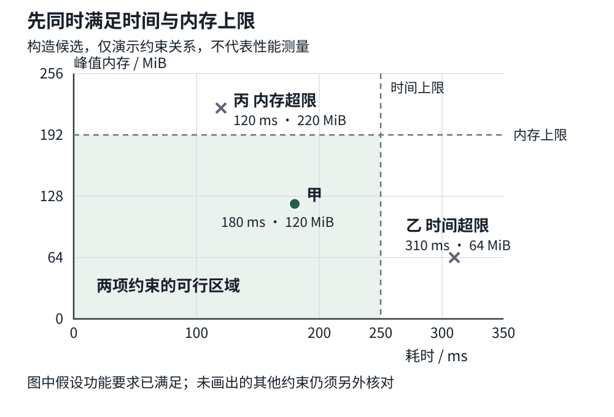
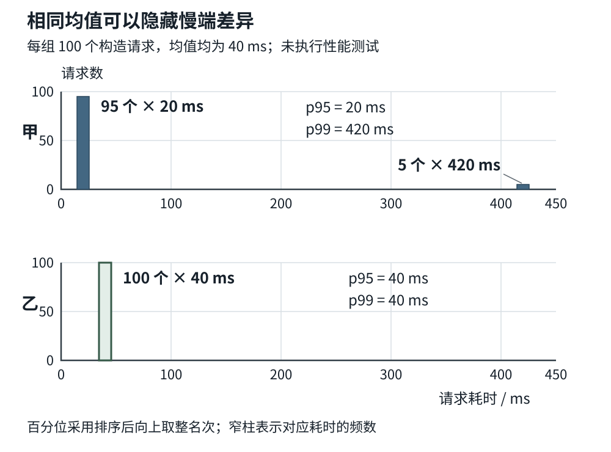

# 第一章 用约束描述工程问题

第一批正文 v0.2 · 卷一 共享基础 · 2026-10-03

工程问题是一项需要在具体条件下完成的任务。它既包括“算出什么、改变什么”，也包括“允许接收什么、必须保留什么、最多消耗多少资源”。这些条件称为**约束**。同一段程序，在十条记录上得到正确结果，在一百万条记录上耗尽内存，可能满足了计算规则，却没有完成实际任务。

约束把需求、实现和验收接在一起。输入输出说明任务边界，不变量描述处理过程中应保留的关系，资源预算限定可行的实现，实验则提供判断这些承诺是否兑现的证据。数学在这里是一种表达工具：有时需要数清操作次数，有时需要判断一组数据是否可比，有时需要说明一毫米的输入变化为何引起一米的结果变化。

本章从以下四个方面展开：

1. **输入输出与不变量**：把模糊要求写成可检查的行为条件，区分正常结果、失败和处理中的有效状态。
2. **复杂度和资源预算**：理解成本随规模怎样增长，再把它换成时间、内存、带宽和并发条件下的具体预算。
3. **概率统计与实验可信度**：从样本和分布解释均值、百分位与不确定性，判断一次比较能够支持多大的结论。
4. **按需补齐线性代数 数值误差与离散数学**：通过坐标变换、误差验收、集合和依赖关系，找到后续方向需要的数学入口。

## 1.1 输入输出与不变量

### 1.1.1 从任务边界写出输入输出

“把设备编号整理一下”还不足以交给程序实现。整理可能指排序、去重、检查格式，也可能指把编号与设备资料合并。它们的输入看起来一样，正确输出却不同。

假设需求进一步明确为：接收一列设备编号，删除重复项，保留每个编号首次出现的次序。输入是 `B、A、B、C、A`，输出应为 `B、A、C`。输出 `A、B、C` 虽然没有重复，却擅自改变了顺序；只输出 `B、A` 则遗漏了数据。“输出没有重复”只覆盖了一项条件，不能独立定义正确性。

还需要明确几个边界。空输入是否产生空输出？大小写不同的编号是否视为相同？含有非法编号时，是拒绝整批，还是返回有效部分并列出错误？输入会不会在处理期间被其他线程修改？如果编号只是用字符串保存，字符串类型不会替我们回答这些问题。

本例先采用简单约定：编号已经完成合法性检查，比较规则由接口固定，输入在处理期间保持不变；空输入合法，输出保留所有不同编号及其首次出现顺序。实际字节编码与比较规则放在 第四章，这里关注这些规则必须先确定，不能让不同调用者各猜一套。

程序的输入也不只有函数参数。读取配置、查询当前数据库、使用系统时间，都会引入影响结果的条件。若导出任务边读边遇到数据更新，“导出全部记录”还要说明对应哪个时刻的数据。忽略这些隐含输入，往往会出现单元测试通过、接入系统后结果却不稳定的情况。

输出同样不只有返回值。写入了哪些文件、修改了哪些记录、发送了哪些通知，都是外部可观察的效果。一个函数返回“失败”，却已经覆盖半个文件，这与完全没有修改文件是两种不同结果。描述任务时，要把使用者真正依赖的效果一并纳入。

### 1.1.2 前置条件与后置条件

**前置条件**是在开始一次操作之前必须满足的条件；**后置条件**是在约定的结束方式下，操作完成后必须满足的条件。两者连同失败行为，构成接口的**契约**，也就是调用方与实现方对责任的共同约定。C++ Core Guidelines 的 I.5、I.7 分别建议明确前置条件和后置条件；这些思想并不依赖某种新语法。[S1]

对刚才的去重操作，可以把成功契约写成几条完整的判断：

- 调用前，输入编号合法，数量在接口允许的范围内，处理期间输入不变
- 成功后，输出中的编号都来自输入，输入中的每个不同编号都出现在输出中
- 成功后，每个编号只出现一次，输出次序与这些编号在输入中首次出现的次序一致
- 操作不修改原输入

这些条件没有规定必须用哪一种容器，也没有要求一边读取一边输出。实现可以改变，调用者依赖的含义保持一致。反过来，如果优化把“保留首次次序”改成了任意次序，那就是接口行为改变，不能只以运行更快来解释。

前置条件需要放在恰当的边界上。接收网络数据的入口，面对非法编号是正常情况，应检查并按接口规则拒绝。检查通过后，内部整理函数才可以以“编号已经合法”为前提。不能把面向不可信输入的验证删掉，再在注释里补一句“调用者保证合法”。那会把本应由系统承担的工作推给无法控制的外部来源。

契约也不等于检查语句。对排序结果逐项检查，也许能发现顺序错误，却不能证明没有丢失元素；一个断言可能只在特定构建模式启用。哪些条件由类型表达，哪些在入口验证，哪些通过实现推理与测试保障，需要分别安排。书面条件的价值首先是让所有人知道究竟要保证什么。

### 1.1.3 不变量描述变化中保留的关系

**不变量**是在指定观察位置或指定操作边界上，一直应当成立的性质。它不要求数据数值不变，而是要求数据之间的某种关系保持成立。例如，一个最多保存 100 项的队列，其元素数量可以从 20 变成 21，但在允许观察的有效状态中，应始终满足“数量在 0 到 100 之间”。

对去重操作，设已经处理了前 i 个编号。我们可以保留一条循环不变量：当前输出恰好是这 i 个编号去重后的结果，且保留首次出现次序。这里的 i 表示处理进度，初始为 0。

开始时，尚未处理编号，输出为空，性质成立。每处理一个新编号，有两种情况：它已经出现过，就保留输出；它首次出现，就把它加到末尾。两种情况下，处理完前 i+1 项后，性质仍成立。等到 i 等于输入总数 n，循环不变量就给出了整批输入所需的后置条件。

这段推理还隐藏着一个实现要求：用于判断“已经出现”的记录，必须与实际输出一致。假如先登记“已经出现”，随后追加输出失败，却又继续处理，后面同名编号便可能被跳过，最终丢失数据。为加速查找而增加一份辅助结构，也就增加了一项要共同维护的关系。

不变量需要明确检查时机。一个对象把两个相关字段分两步更新，中间可能短暂不一致；如果中间状态对外不可见，接口边界上的保证仍可能成立。若此时调用外部回调，或者另一个线程能够看到半更新状态，就必须重新分析。不能把“函数结束时会恢复”当成任意时刻都可以访问的理由。类的不变量与公开操作边界的关系，也在 Core Guidelines 中有明确讨论。[S1]

另一个常见例子是固定库存。在没有补货、退货或报废的一个业务阶段，假设共有十件物品，则“可用数量 + 已预留数量 = 10，且两者非负”可以作为状态约束。预留三件会改变两个数量，却保留总量。开始处理补货以后，右边的 10 就不再适用，必须把新增库存纳入模型。不变量总有适用范围，范围改变时要一起修订。

不变量主要约束“不能进入什么坏状态”，并不自动证明工作会结束。一个循环即使永远停在原地，也可能一直保持输出正确。去重例子还依赖一条进展理由：每一步都会多处理一个编号，未处理数量 n−i 持续减少且不能小于零。把有效状态与推进条件分别说清，才能解释程序为什么既不做错，也不会无限等待。MIT 的离散数学教材把不变量与终止性分别处理，原因正是在此。[S2]

### 1.1.4 失败也应有可检查的含义

成功路径容易形成共识，失败路径则经常只剩一个错误码。对批量任务来说，至少要区分以下情况。

**输入被拒绝。** 系统已确认请求不符合要求。例如第七个编号非法，整批尚未开始修改外部状态。结果应让调用者知道需要修正什么；反复发送相同内容不会使它自动合法。

**执行失败且状态已知。** 例如创建输出缓冲区失败，接口保证原输入与既有输出均未改变。这里真正有价值的是“失败后保留什么”，而不仅是“发生了内存错误”。并非所有接口都有同样的恢复保证，应逐项查看。

**完成了一部分。** 例如一百个独立文件中有八十个已转换。如果契约允许部分完成，就应返回成功集合、失败集合以及必要的对应关系；如果契约要求整批一起生效，实现就要额外设计提交方式。把局部结果藏进一个笼统的失败，会让后续重试无法判断从哪里继续。

**结果尚不确定。** 例如远端已经收到写入请求，但响应丢失。本地观察到超时，只能证明没有及时拿到响应，不能直接证明远端没有完成。如何核查和恢复属于后续分布式与 Agent 章节；在这里，首先要给“未知”留出表达位置。

这些结果会改变验收方法。检查返回值不够，还要检查失败后的数据、资源和已产生的外部效果。与此同时，应区分必须满足的**硬约束**和希望改善的**优化目标**。不能遗漏编号是一项硬约束；在此基础上减少耗时是一项目标。方案再快，只要遗漏了合法编号，就没有满足原任务。

## 1.2 复杂度和资源预算

### 1.2.1 先说明规模和计数对象

**复杂度**描述成本随问题规模怎样增长。成本可以是比较次数、访问次数、额外存储量，也可以是某种明确定义的基本操作数量。常用的大 O 记号给出忽略常数因子后的渐近上界，讨论的是规模足够大时的增长关系。[S3]

例如，逐项检查 n 条定长记录，每条做固定数量的工作，成本按 n 增长，通常写为 O(n)。若需要比较每一对不同记录，且每对只比较一次，比较次数是 n(n−1)/2。当 n=1 000 时，有 499 500 对；当 n=10 000 时，有 49 995 000 对。输入扩大十倍，成对比较的数量接近扩大一百倍。这是按公式计算的工作量，没有换算成任何机器的运行时间。

规模不一定只有一个变量。记录数是 n，每条字符串最长为 k，仅说“遍历一次，所以 O(n)”可能漏掉每条记录的处理成本。若每次都完整扫描字符串，粗略上界会包含 n×k；若文件里有很多短记录和少数超长记录，总字节数有时比记录数更直接。讨论图时，顶点数和边数也不能总合并成一个 n。

大 O 不负责表达所有细节。O(n) 可以包含每项一次运算，也可以包含每项几千次运算；它通常不计入某台机器的缓存行为、磁盘等待和调度延迟。它还是上界记号，不意味着这个上界一定最紧，更不自带“最坏情况”的含义。必须说明所分析的成本函数是最坏、平均还是其他口径。需要同时表达同阶上界和下界时，可以使用 Θ 记号；本书大多数初步判断只需先把口径写清。[S3]

因此，复杂度适合回答“规模再增长时，哪一种方案可能先撑不住”。它不能单独回答“这批数据是否能在 250 毫秒内处理完”。后一个问题需要具体预算和测量。

### 1.2.2 最坏 平均与摊还的区别

**最坏情况分析**考察给定规模下最昂贵的合法输入。**平均情况分析**则依赖输入或随机选择的概率分布，计算该分布下的期望成本。所谓期望，可以理解为按各情况发生的概率加权平均。若分布假设不适用于真实输入，平均结论就可能失去解释力。[S3]

例如，在无序列表中从头查找目标，若目标保证存在，且等概率位于 n 个位置，平均检查数量为 (n+1)/2；最坏要检查 n 项。若生产中大多数查询查不到目标，每次都需要看完整个列表，这个“目标一定存在”的平均模型就不合适。公式本身没有错，错的是把它用在不同条件下。

**摊还分析**关注一串操作的总成本，再把总成本分摊到操作上。它可以不作任何随机分布假设；某一次昂贵操作的成本，可能由前面许多便宜操作积累的结构条件来限制。Cornell 的课程用操作序列解释这一点，并强调分摊后的成本不是某次调用真实经过的时间。[S4]

用一个简单例子就能看清区别。栈是一种后放入、先取出的结构。设从空栈开始，支持放入一项，以及一次取出若干项。取出 k 项要做与 k 成比例的工作，所以单次调用可能很贵。但在总共 m 次操作中，放入的项数至多为 m；每个放进去的项又至多被取出一次。因此，忽略固定调用开销后，全部放入和取出的工作总量至多与 2m 成比例。即使输入由人精心安排，这个总量约束仍成立。

这个结论允许某次操作一口气取出很多项。若实时控制要求每次调用都在一个很短的期限内完成，摊还常数成本便不足以满足要求。动态数组的尾部增长也有类似区别，第十三章 会结合元素迁移进一步展开。判断性能承诺时，要先问它覆盖单次、整批，还是一个假定分布下的平均。

### 1.2.3 把数量级换成带单位的预算

**资源预算**为具体任务划定可使用的数量。写“内存不能太多”没有办法验收；写“此进程在规定负载下的峰值内存不得超过 192 MiB”就有了对象、时点和上限。这里 1 MiB 表示 2²⁰ 字节，1 GiB 表示 2³⁰ 字节；不能与十进制 MB、GB 混用。

下面是一份构造的内存账目，用来演示估算方法，并非真实进程的测量。假设有 1 048 576 条记录，每条固定占 64 字节，处理时保留完整输入和完整输出；索引每项占 8 字节，八个工作线程各有 8 MiB 私有缓冲区，进程的其余内存占用暂按 32 MiB 估计。

|同时存活的内容|计算依据|预算占用|
|---|---|---:|
|输入记录|2²⁰ × 64 字节|64 MiB|
|完整输出|与输入同样大小|64 MiB|
|索引|2²⁰ × 8 字节|8 MiB|
|线程私有缓冲区|8 × 8 MiB|64 MiB|
|进程其余内存|本例假设|32 MiB|
|合计|以上内容在同一时刻存活|232 MiB|

在这些假设下，192 MiB 的上限已经不满足，不需要先写完程序再寻找原因。减少线程数、分块输出、改变索引，或提高允许的内存上限，都可能改变可行性；它们还会影响时间、实现复杂度或输出方式，需要回到完整任务比较。

账目中最容易漏掉的是“同时存活”。两个阶段分别需要 64 MiB，若能够安全复用同一块内存，峰值未必增加 128 MiB；若异步任务尚未结束，下一批又开始准备，两份缓冲区就可能重叠。容器预留容量、分配器管理开销、线程栈和外部库内存也会使实际占用高于简化账目。估算用来发现风险，最后仍需用与部署限制一致的指标核对。

时间也可以分配预算。假设一条不能重叠的处理路径，为读取、转换、保存及其他开销分别预留 45、70、30、20 毫秒，总额为 165 毫秒，相对 250 毫秒目标还留有 85 毫秒余量。这些数是设计分配，不是四项已经测得的保证。若其中一项必须等待外部服务，等待也要计入；若阶段可以并行，经过时间又不能简单把所有线程的工作时间相加。

资源之间还可以相互校验。假定一次处理必须经同一个带宽受限环节读取 64 MiB、写出 64 MiB，并假定该环节可持续提供 1 GiB/s，那么仅这 128 MiB 的传输就需要至少 0.125 秒，即 125 毫秒。这里假定读写共享该总带宽，尚未加入其他流量。若这个条件也适用于前面的串行路径，读取与保存合计 75 毫秒的预算就不够，需要重新分配。它是模型下的下界；设备宣传的峰值带宽不能直接充当模型中的可持续带宽。

图 1-1 两项硬约束必须同时满足。图中只画时间和内存，且假设三个候选均满足功能要求；实际选择还要加入正确性、负载和风险等条件。靠近边界的方案，也需要考虑估计误差与运行波动。

### 1.2.4 负载与并发会改变预算

单次任务能装进内存，不代表同时运行十次也能装进去。把每请求的占用乘以并发请求数，通常是第一次容量检查；共享部分与私有部分再分别细化。线程数、连接数、排队长度和同时在途的数据，都是预算里的变量。

**吞吐量**表示单位时间内完成的工作数量；**延迟**表示一次工作从约定起点到终点经过的时间。完成量为每秒四百项，不能推出每项只需 1/400 秒，因为许多项可能同时进行，也可能在队列里等待。

用一个流量守恒的简化模型：任务持续以每秒五百项进入，系统只能以每秒四百项完成，又不拒绝、不丢弃，则积压会以每秒一百项增长。能容纳五千项的空队列，大约五十秒就会填满。计算只基于本例设定的固定速率；真实流量还会波动，但平均进入量长期大于可完成量时，扩大队列无法永久解决问题。

这时要重新决定系统承诺：限制接收速度、给队列设上限、增加处理能力，或者允许明确的降级与拒绝。哪一种合理取决于任务后果。预算因此不仅指导优化，也迫使接口说明超限时怎么办。具体数据结构、调度和性能工具会在后续章节展开，本章先把判断依据留完整。

## 1.3 概率统计与实验可信度

### 1.3.1 样本代表谁

程序的耗时会随输入和环境变化。统计的第一步，是明确想了解的**总体**，也就是结论准备覆盖的那一类对象；实际观察到的部分则是**样本**。想评价某服务所有真实请求，却只测本机缓存命中的短请求，样本再多，也没有覆盖原来的总体。

样本单位也要选对。可以把一个请求当作一项观察，也可以把一轮完整测试当作一项观察。后一种情况下，一轮里的一千个请求受到同一机器状态影响，不能自动当成一千轮独立重复。同一次故障产生的一万条报错，更不等于发现了一万种独立故障。

一组数值如何分布，描述的是数值出现的位置和频率。**均值**把总量除以样本数量；**中位数**描述有序数据的中间位置；**百分位数**则描述排序后某个比例所在的位置。p95 是第 95 百分位，p99 是第 99 百分位。有限样本的具体插值规则存在差异，报告和比较时应使用一致定义。[S5]

下面人为构造两组各一百个请求的耗时，仅用于计算说明：

- 方案甲：95 个请求各用 20 毫秒，5 个请求各用 420 毫秒
- 方案乙：100 个请求都用 40 毫秒

甲的总耗时是 95×20 + 5×420 = 4 000 毫秒，乙的总耗时也是 4 000 毫秒，所以两组的均值均为 40 毫秒。这里的“总耗时”是所有请求各自耗时之和，不是并发测试从开始到结束实际经过的时间。

本例将样本从小到大排序，并取向上取整后的第 p×n 项作为 p 分位，其中 0<p≤1，例如 p95 对应 p=0.95。按这条规则，甲的 p95 为 20 毫秒，p99 为 420 毫秒；乙的两项均为 40 毫秒。甲让多数请求更快，也让一小部分请求慢很多。只报一个均值，会把这个差异完全隐藏。

图 1-2 相同均值可以对应很不同的耗时分布。横轴为请求耗时，纵轴为对应请求数；窄柱表示本例中的离散取值，不表示耗时区间，也不能用来推断到达次序或并发关系。所有数值均为构造数据，未执行性能测试。

选择指标，要回到用户的要求。离线处理可能关心一整批何时完成，交互任务可能关心慢请求，控制环节还可能要求每次都满足截止期。p99 在目标之内，不等于每一次都满足目标；一轮测试中的最大值，也只是在这一轮观察到的最大值。

### 1.3.2 统计口径会改变结论

多台机器各报一个均值时，如果请求量不同，直接把这些均值再平均，会让低流量机器拥有过大的权重。合并均值需要总耗时与总样本数。百分位数的合并更加严格：把各机器的 p99 平均，即使按流量加权，也一般得不到整体 p99，因为局部分位数已经丢失了其他位置的分布信息。

Prometheus 官方文档明确说明，预先算好的分位数无法直接聚合成整体分位数；直方图则保留区间计数，使符合条件的分布汇总成为可能。直方图会把观察值按区间计数，其分位估计精度又受区间边界或分辨率影响。[S6] 因而一个看起来精确到小数点后三位的 p99，不一定有相应的测量或估计精度。

分母尤其值得检查。假设一千个发起的请求中，九百个成功，另有一百个超时；报告“成功请求平均 30 毫秒”并非错误，但它没有描述全部请求体验。如果新版本更早拒绝慢请求，成功请求的平均耗时甚至可能改善，同时整体完成比例下降。

超时还带来一个观察边界：若在 500 毫秒停止等待，只知道该请求在观察窗口内没有完成，未必知道它的完整耗时。可以分别报告成功请求延迟、错误与超时比例，以及截止时尚未完成的数量。不能悄悄删掉它们，也不应没有说明就把每个超时的实际耗时写成恰好 500 毫秒。

### 1.3.3 比较实验需要保持可比

“新版快了 15%”包含两项不同判断：观察到了数值差异，以及差异由这次改动造成。若旧版在忙碌机器上测试，新版在空闲机器上测试，就无法把两者轻易连在一起。

比较首先要固定任务含义。输出一致、错误处理一致，才有同一目标下的性能比较。若新版少做了校验，或者使用较低精度结果，应把这些变化纳入评估，而不是仅保留提速比例。输入规模、数据组成、并发度、开始计时的位置和结束条件，也应保持一致或明确说明差异。

一些环境因素无法完全消除，可以在设计中加以控制。例如，同一批输入分别运行旧版和新版，用同一机器的一组比较形成一个**区组**，也就是一组环境尽量相近的试验；再在组内随机安排版本先后，降低时间变化与版本顺序重合的风险。不同机器或不同数据集可以形成不同区组，分别保留结果。NIST 对区组设计与随机化的讨论提供了这种思路；具体软件测试仍需根据缓存、热状态和系统负载调整。[S7]

“全部旧版跑完，再跑全部新版”有时会把温度变化、后台任务或缓存状态与版本混在一起。反过来，简单交替也不自动消除前一次运行留下的影响。应该先说明测量的是冷启动还是稳定运行，哪些状态需要重置，哪些状态恰好就是生产工作的一部分。

重复测量需要保留其组织方式。先做多轮独立启动，再观察轮内请求，和只在一个进程里连续循环很久，能够回答的问题不同。相邻观测值若存在关联，称为**自相关**；它提示我们不能无条件套用把每项都当独立样本的计算。NIST 的自相关材料专门强调了这一假设边界。[S8]

工程记录不必堆满所有环境信息，但至少应留下能解释结果的版本、输入、运行环境、负载、计时边界、重复方式、原始数据和排除规则。先约定主要指标与停止条件，也能减少只挑有利轮次、删掉最慢结果或看到满意数字就结束的倾向。具体计时与性能工具留给 第二十章；工具输出之前，实验问题应已经明确。

### 1.3.4 用不确定性限制结论

**标准差**描述样本数值围绕均值的分散程度，其平方称为方差。它回答的是各次观察波动多大。均值估计本身有多不确定，则是另一件事：在观察相互独立、来自同一分布且总体方差有限的基本模型下，样本均值的标准误可用样本标准差除以样本数平方根来估计。增加合适的独立样本，可以提高均值估计的精度，却不会使每次请求的波动自动消失。

**置信区间**用一段范围表达估计的不确定性。以经典均值 t 区间为例，它适用于独立正态样本，或在其他条件允许时作为近似。正态分布是一种常见的对称钟形分布模型，不能因为手里有一个均值和标准差，就默认数据符合它。NIST 给出的区间形式是“样本均值 ± t 系数 × 样本标准差 / √样本数”；t 系数根据所选置信水平与样本数确定。[S9]

设有一组假想的 25 次独立运行摘要，均值为 100 毫秒，样本标准差为 10 毫秒，并假定上述区间模型适用。95% 双侧区间所用的 t 系数约为 2.064，则半宽约为 2.064×10/5 = 4.128 毫秒，区间约为 95.9 到 104.1 毫秒。这是代入假定摘要的计算，没有对应本书实际运行过的测试。

这里的 95% 描述的是区间构造方法在重复抽样中的覆盖表现，不是说未来 95% 的请求都落在这个范围，也不是说单次请求一定接近 100 毫秒。若目标是比较两个版本，应直接围绕差值或比值建立与实验设计相配的分析，不能仅凭两个单独区间是否重叠下结论。

还需要区分“有差异”和“值得采用”。一个很小的改进，在大量数据下可能被清楚地区分出来，却不够抵消维护成本；一个看上去很大的改进，也可能因为样本太少而不稳定。应同时交代改变量、估计不确定性，以及业务认为多大变化才有价值。

失败率尤其容易被过度解释。假设每次试验彼此独立，失败概率固定为 p，那么 n 次全部不失败的概率是 (1−p)ⁿ，这是二项模型的一种特殊情况。[S10] 若真实失败率为 1%，三百次全部通过的概率约为 0.99³⁰⁰ ≈ 4.9%。因此，三百次零失败仍然不能证明失败率为零。

进一步按这个模型计算，三百次零失败对应的 95% 单侧精确置信上限约为 1−0.05^(1/300)，即 0.994%。这个上限依赖独立性、固定失败概率与样本代表性；连续重放同一个容易样本三百次，不能拿来说明所有输入都同样可靠。

统计方法能描述抽样误差，不能补齐没有测到的场景。样本完全缺少超大文件、弱网络或某类设备时，再窄的置信区间也不会自动覆盖它们。报告中一句清楚的适用范围，往往比多保留几位小数更有用。

## 1.4 按需补齐线性代数 数值误差与离散数学

### 1.4.1 用向量和矩阵表达变换

线性代数把一组数及其相互变换组织起来。**向量**可以表示二维位置、三维速度，或一组特征；**矩阵**把一组系数排成行和列，用来表示线性关系。在选定坐标表达之后，矩阵乘向量可以把输入转换成输出。MIT 的线性代数课程以线性变换组织这一含义。[S11]

本节采用列向量约定，即把向量的分量竖着排列。一个 m 行 n 列的矩阵，可以乘一个有 n 个分量的列向量，得到 m 个分量的结果。维度匹配只是第一项条件，分量的含义、单位和坐标系也必须匹配。两个长度相同的向量，可能分别表示位置和速度，不能因为形状一样就任意代入。

在二维平面中，设点的位置为 p=(2,1)。矩阵 R 的第一行为 `(0,−1)`，第二行为 `(1,0)`。按行与向量对应相乘再相加，可得：第一项为 0×2−1×1=−1，第二项为 1×2+0×1=2，因此 Rp=(−1,2)。在通常的右手二维坐标约定下，这是绕原点逆时针旋转 90 度。

如果还要平移 t=(10,0)，先旋转再平移的结果是 Rp+t=(9,2)。若先平移再旋转，结果是 R(p+t)=R(12,1)=(−1,12)。同样的点、同样的两个动作，因为次序不同而到达不同位置。这是按公式手算的结果，不涉及任何图形库的默认约定。

这里的平移不能单独由同一二维空间中的 2×2 线性变换表达，因为线性变换必须把零向量映到零向量。旋转加平移属于仿射变换；图形和机器人系统常用增加一维的齐次坐标统一表示，后续方向章再展开。眼下最重要的是写明变换从哪个坐标系到哪个坐标系、作用次序是什么，以及采用行向量还是列向量约定。

数学还可以提供简单的正确性检查。上述旋转前后，向量的欧几里得长度都是 √5；欧几里得长度就是各分量平方和再开平方。旋转保持长度，而一般矩阵未必保持长度。若任务要求刚性旋转，却发现结果随方向被拉伸，就应检查变换矩阵和坐标约定。

学习入口应随任务深入。图形与机器人要继续理解基、坐标变换和旋转；科学计算与模型计算要理解矩阵乘法、线性方程组及相应误差。后面遇到的张量，可以先看作带有多个索引维度的数据组织。会核对形状只是入口，还需要知道每个轴表示什么、操作在数学上做了什么。

### 1.4.2 结果误差需要领域尺度

工程计算经常无法只用“完全相等”判断结果。输入可能来自带误差的传感器，模型可能省略一部分物理过程，算法可能用有限步逼近，计算机表示和运算也会发生舍入。LAPACK 的误差说明区分了输入误差和运算舍入误差；具体任务还要另外考虑建模与近似造成的差异。[S12]

**绝对误差**表示计算值与参考值相差多少，单位与原数值相同。**相对误差**表示这个差异相对于参考量级有多大，通常是无单位的比例。例如参考距离为 10 米，结果为 10.0015 米，绝对误差为 0.0015 米，即 1.5 毫米，相对误差为 0.015%。是否可接受，要看这段距离服务于什么任务。

一种常见的有限数值比较规则是：

`|计算值 − 参考值| ≤ 绝对容差 + 相对容差 × |参考值|`

竖线表示绝对值。绝对容差给接近零的数值留下合适尺度，相对容差让允许差异随数值量级变化。NumPy 的 `isclose` 就采用这一形式，并明确提醒默认绝对容差不适合所有小量级数值；以参考值为基准的规则也不一定对称。[S13]

设本例明确选择绝对容差 0.001 米、相对容差 0.0001。在参考值为 10 米时，允许差异为 0.001+0.0001×10=0.002 米，前面的 1.5 毫米差异满足这条规则。参考值接近零时，则主要由 1 毫米的绝对容差决定。换成微小器件测量，这个尺度可能完全不合适，不能沿用。

容差表达接受标准，也需要验证来源。可根据传感器精度、算法误差分析和下游允许偏差来选择，而不是把失败样本调到“刚好能通过”。参考值也未必是真值，应交代它来自解析结果、更高精度计算、可信实现还是实际标定，以及它自身的不确定性。非有限结果、缺失值和业务无效值应有明确处理规则，不能藏进一个宽松容差。

对一整幅图像或一万个计算结果，还要说明是每项都满足、最大误差受限，还是整体平均误差较小。平均误差可能掩盖局部的大偏差。选哪一项仍由后果决定：边缘一个点的误差可能不影响预览，却可能影响碰撞判断。

### 1.4.3 区分问题敏感性与算法稳定性

提高计算精度并不总能解决结果不稳定。有的问题本身就会把很小的输入变化放大。

考虑两条线性方程：

`x + y = 2`

`x + 1.0001y = 2.0001`

两式相减，得到 0.0001y=0.0001，所以 y=1、x=1。现在只把第二条方程右侧改为 2.0002，两式相减便得到 0.0001y=0.0002，于是 y=2、x=0。右侧只变化了 0.0001，解却明显移动。这个变化在精确数学里就存在，不能归咎于浮点实现。

从几何上看，两条直线几乎平行，稍微移动其中一条，交点便可能移动很远。**条件性**描述问题的解对输入扰动有多敏感，**条件数**是在给定误差度量下量化这种敏感性的工具；条件数很大时，问题被称为病态。**算法稳定性**则关心求解过程是否额外引入了不合理的误差放大。[S14]

其中一种常用标准是后向稳定：算法算出的结果，可以解释为原问题在很小输入扰动下的精确解。若问题本身敏感，小输入扰动仍然可能对应较大的输出差异。因此，稳定算法与准确输出之间，还隔着输入质量和问题条件性。[S14]

这也解释了为何“把结果代回去，误差很小”有时仍不够。代回方程后左右两侧的差称为残差；残差小表示结果近似满足方程，病态问题中却未必表示结果接近原方程的精确解。LAPACK 的线性方程误差说明把残差、后向误差和条件估计结合起来，而不只报告一个代回误差。[S15]

排查时可以先问：输入变化是否已经足以解释输出变化？问题是否接近退化条件？若换精度，变化是否明显？若换一种稳定求解方法，是否仍然敏感？有时需要改善传感器布置或重新设计模型，而不仅是把数值类型换得更大。第四章 解释数值如何表示，第四十三章、第四十六章 和 第四十八章 会分别把误差分析放进科学计算、算子与估计问题。

### 1.4.4 用集合 逻辑与图明确离散关系

离散数学研究一个个可区分的对象及其关系。它不只出现在算法题里，也出现在权限检查、配置依赖、数据覆盖和任务调度中。集合、逻辑、图与归纳推理是本书最常用的入口。[S2]

**集合**只关心哪些元素属于其中，不保留重复次数和排列顺序。第一节的输入是一个有序序列，去重后的“编号集合正确”还不足以证明输出次序正确。若任务本来是统计每个编号出现了几次，用集合代替序列又会丢掉计数信息。选择数学对象，本身就是选择保留哪些信息。

集合关系可以直接表达检查条件。设请求访问的资源集合为 R，当前允许访问的集合为 A，那么“请求的每一项都已获准”可以写成 R 是 A 的子集。仅检查 R 与 A 有交集，表达的却是“至少有一项获准”。当请求包含三项，其中只有一项可访问时，这两个条件给出完全不同的结果。

这涉及逻辑中的两个常用词：**所有**要求每个对象都满足条件，**存在**只要求至少一个对象满足。对于空集合，“每个元素都满足条件”在逻辑上为真，因为没有反例；若业务要求至少选择一项，还应单独检查非空。许多边界错误来自漏掉这样一个条件，而非循环写错。

**图**用顶点表示对象，用边表示关系。若边有方向，就称为有向图。例如，任务“读取”必须在“解析”之前，“解析”必须在“汇总”之前，可以用有向边记录依赖。没有方向环的有向图称为有向无环图；它允许按依赖安排任务，却不保证只有一种合法次序。

如果两份文件的解析互不依赖，它们可以交换次序，也可能并行；汇总仍要等两者完成。沿依赖路径累计必须等待的工作，有助于理解总时间为什么不能简单除以线程数。但图只表达已经写进去的依赖，两个任务争用同一设备或可变数据，还要额外纳入约束。第三章 会进一步讨论图上的具体算法。

逻辑推理还能说明测试覆盖的边界。十个相互独立、每个只有开关两种取值的配置项，完整组合就有 2¹⁰=1 024 种。这只是组合计数；加入输入数据、执行次序与故障位置后，实际情况还会增加。抽取代表性组合很有价值，但通过有限样本与证明全部合法情况满足性质，是不同强度的证据。

不必等学完一整套数学课程才开始做工程。先把当前问题的对象、关系、单位和误差写清，再补足决定判断的那部分数学；当结果涉及高风险后果或复杂模型时，也要知道这个入口远远不够。

## 沿条件 指标与证据排查

程序出现问题时，先确定哪一项承诺没有兑现，再决定去哪里观察。若只说“处理失败”或“性能很差”，很容易在无关细节上花时间。

结果丢失或次序错乱，先核对后置条件是否完整，再沿处理进度检查不变量。去重例子中，输出无重复却缺了一项，应同时检查输入覆盖和辅助记录的一致性；仅增加“重复检测”不能解决遗漏。若失败只出现在中途报错后，更要核对错误路径留下的状态。

大输入才出问题，先找出真正增长的变量。是记录数、总字节数、重复率、图的边数，还是同时在途的批次数？把这些量代回成本和内存账目，能帮助判断是增长模型不合适，还是实现额外保留了资源。用一百条记录的结果外推一百万条之前，应先检查是否跨过了容量、缓存或外部存储的边界。

平均耗时改善但用户更常遇到卡顿，检查慢端、错误率和排队时间。若系统只统计成功响应，或者从真正开始执行才计时，等待最久的部分可能根本没有进入数据。改统计口径后数字变差，未必意味着系统刚刚退化，也可能是以前没有看到问题。

两个方案的名次随测试顺序改变，先查看运行环境与试验设计。检查是否一组使用冷数据、一组已经预热，是否共享同一后台负载，是否把有明显关联的请求当成独立重复。此时继续增加循环次数，可能只会更精确地测量一个有偏比较。

数值结果偶尔偏离，则把输入误差、变换约定、问题敏感性与算法误差分开。记录单位和参考值，既比较绝对差，也查看合适的相对尺度。发现某些输入接近退化条件时，保留这些输入并解释边界，比统一调大容差更有价值。

每条排查路径最后都应回到可验证的判断：原先哪条条件不成立，改动改变了什么，新的证据覆盖哪些情况。没有运行的设计推导、运行过的测试结果、以及可由规范直接确定的保证，应在记录中各自保持清楚。

## 面试中的一条追问链

**接到“把这批数据处理得更快”时，你先问什么？**

先确定处理的含义与不可改变的结果，包括输入范围、顺序、重复项、失败后的状态，再问数据规模、时间起止点和资源上限。否则把校验删掉、把慢请求拒绝掉，也可能得到更好的计时数字，却改变了任务。

**两个实现都是 O(n)，是否已经没有比较的必要？**

仍然需要比较。先核对 n 指什么、每项的工作是否相同，再看实际字节访问、分配、同步和外部等待。复杂度说明规模增长的某一层关系，不提供真实耗时，也不保证同样的内存峰值。我会先做带单位的预算，再在目标负载下检验。

**接口声称摊还 O(1)，能否放进有严格截止期的循环？**

仅凭这一条不能决定。它约束操作序列的总成本，允许其中一次操作很贵。需要继续检查单次最坏路径、可能的分配与阻塞，以及超限处理。若期限是每次都必须满足，就要为整个相关路径建立相应保证，平均或百分位都不足以替代。

**新版本平均快了，p99 却变差，你怎样选？**

先确认数据可比、分位定义一致，错误和超时没有被排除，再回到业务目标。若 p99 是硬约束，越界方案不能仅靠均值收益补偿；若允许取舍，应同时呈现影响范围、改变量、资源成本与不确定性。还要判断慢端来自正常负载还是此前遗漏的失败条件。

**跑了三百次都成功，可以说可靠性达到 100% 吗？**

可以如实说这三百次没有观察到失败，不能外推为所有情况不会失败。先说明样本覆盖与独立性；即使采用固定失败概率的独立试验模型，零失败也仍有非零的失败率置信上限。若三百次只是相同输入的重复，它对其他输入的证据更弱。

**数值结果与参考值不一致，直接改用更高精度是否合理？**

它可以作为诊断手段，但应先排除单位、坐标和操作次序错误，再核对参考值与容差。若问题本身对输入很敏感，更高精度无法恢复输入里原本缺失的信息。我会同时检查残差与条件性，并根据任务选择改进计算、改善输入或限制适用范围。

**最后怎样证明优化完成？**

用原契约检查正常与失败结果，在约定规模和负载下验证时间、内存等硬约束，再报告优化目标的变化与剩余风险。设计估算先说明为什么方案可能可行，实验说明在什么条件下观察到了什么，规范或数学推理说明哪些结论不依赖某一次运行。三者对齐后，结论才有清楚的适用范围。

## 来源与阅读边界

资料核验日为 2026-10-03。本章的设备编号、内存账目、资源候选、请求耗时、置信区间摘要与数学数值均为原创构造或手算说明，没有执行代码、性能基准或故障实验。图 1-1、第一章-B 为原创图，不含第三方测量结果。数学定义与教学资料、项目工具的具体行为、工程建议分别使用，不能把后一类建议当成规范保证。

- **S1 接口工程建议。** [C++ Core Guidelines](https://isocpp.github.io/CppCoreGuidelines/CppCoreGuidelines#Ri-pre)，I.5、I.7 与 C.2；核验时页面标注 2026-06-14。用于前后条件、不变量与接口责任，不涉及 C++26 契约语法或语言强制保证
- **S2 离散数学。** [MIT Mathematics for Computer Science](https://ocw.mit.edu/courses/6-042j-mathematics-for-computer-science-spring-2015/mit6_042js15_textbook.pdf)，2015-05-18 版，逻辑、集合、归纳、不变量与有向图相关章节。作为数学依据与延伸入口；不复制其例题、插图或证明正文
- **S3 渐近分析。** [Cornell Asymptotic complexity](https://www.cs.cornell.edu/courses/cs3110/2014fa/lectures/24/lec24.html)，2014 年课程材料。复杂度记号、最坏和平均情况、常数因素的边界
- **S4 摊还分析。** [Cornell Amortized Analysis](https://www.cs.cornell.edu/courses/cs3110/2014sp/lectures/22/amortized-analysis.html)，2014 年课程材料。操作序列总成本与单次成本的区别；正文栈例为自行组织
- **S5 百分位。** [NIST Percentiles](https://www.itl.nist.gov/div898/handbook/prc/section2/prc262.htm)。百分位含义与有限样本计算规则的差异；正文构造数据采用明确给出的向上取整名次规则
- **S6 指标聚合。** [Prometheus Histograms and summaries](https://prometheus.io/docs/practices/histograms/)。分位数聚合限制、直方图与估计分辨率；滚动文档，不据此承诺任何部署的测量精度
- **S7 实验设计。** [NIST Randomized block designs](https://www.itl.nist.gov/div898/handbook/pri/section3/pri332.htm)。区组与随机化的作用；软件测试安排是本章的工程应用建议
- **S8 样本相关性。** [NIST Autocorrelation](https://www.itl.nist.gov/div898/handbook/eda/section3/eda35c.htm)。自相关与随机性假设；本章未对任何实际时序数据检验独立性
- **S9 均值不确定性。** [NIST Confidence Limits for the Mean](https://www.itl.nist.gov/div898/handbook/eda/section3/eda352.htm)。均值 t 区间与重复抽样解释；本章示范的运行摘要是假设值
- **S10 失败概率模型。** [NIST Binomial Distribution](https://www.itl.nist.gov/div898/handbook/eda/section3/eda366i.htm)。固定概率二项模型；零失败概率及上限由正文条件下的公式推导
- **S11 线性变换。** [MIT Linear Transformations and their Matrices](https://ocw.mit.edu/courses/18-06sc-linear-algebra-fall-2011/pages/positive-definite-matrices-and-applications/linear-transformations-and-their-matrices/)，2011 年课程。矩阵与线性变换的关系；正文坐标和变换次序由本章明确约定
- **S12 误差来源。** [LAPACK Sources of Error in Numerical Calculations](https://www.netlib.org/lapack/lug/node73.html)，1999 年用户指南。输入误差与舍入误差，不据此评价未运行的实现
- **S13 容差比较接口。** [NumPy isclose](https://numpy.org/doc/stable/reference/generated/numpy.isclose.html)，核验时文档显示 v2.5。有限值比较公式、非对称性与默认容差警示；不是对所有领域合适的验收标准
- **S14 稳定性与条件性。** [LAPACK Standard Error Analysis](https://www.netlib.org/lapack/lug/node78.html)，1999 年用户指南。后向稳定、条件数与误差传播的区分
- **S15 方程残差。** [LAPACK Error Bounds for Linear Equation Solving](https://www.netlib.org/lapack/lug/node81.html)，1999 年用户指南。残差、后向误差和解误差的联系

[S1]: https://isocpp.github.io/CppCoreGuidelines/CppCoreGuidelines#Ri-pre
[S2]: https://ocw.mit.edu/courses/6-042j-mathematics-for-computer-science-spring-2015/mit6_042js15_textbook.pdf
[S3]: https://www.cs.cornell.edu/courses/cs3110/2014fa/lectures/24/lec24.html
[S4]: https://www.cs.cornell.edu/courses/cs3110/2014sp/lectures/22/amortized-analysis.html
[S5]: https://www.itl.nist.gov/div898/handbook/prc/section2/prc262.htm
[S6]: https://prometheus.io/docs/practices/histograms/
[S7]: https://www.itl.nist.gov/div898/handbook/pri/section3/pri332.htm
[S8]: https://www.itl.nist.gov/div898/handbook/eda/section3/eda35c.htm
[S9]: https://www.itl.nist.gov/div898/handbook/eda/section3/eda352.htm
[S10]: https://www.itl.nist.gov/div898/handbook/eda/section3/eda366i.htm
[S11]: https://ocw.mit.edu/courses/18-06sc-linear-algebra-fall-2011/pages/positive-definite-matrices-and-applications/linear-transformations-and-their-matrices/
[S12]: https://www.netlib.org/lapack/lug/node73.html
[S13]: https://numpy.org/doc/stable/reference/generated/numpy.isclose.html
[S14]: https://www.netlib.org/lapack/lug/node78.html
[S15]: https://www.netlib.org/lapack/lug/node81.html
