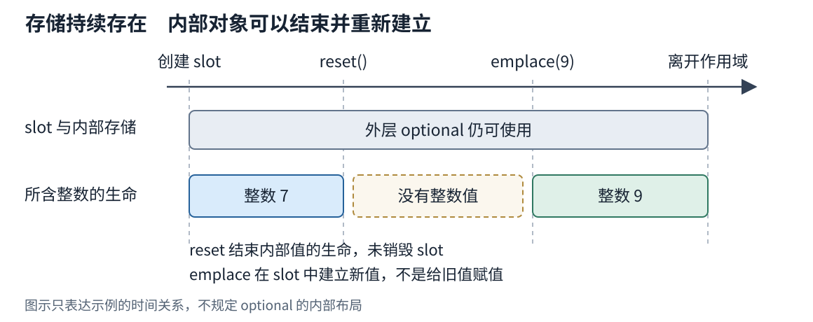
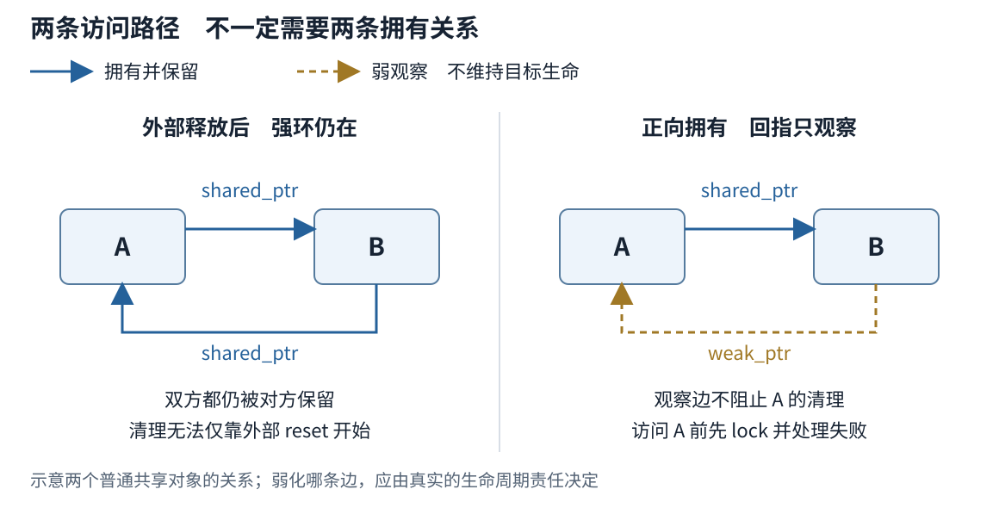
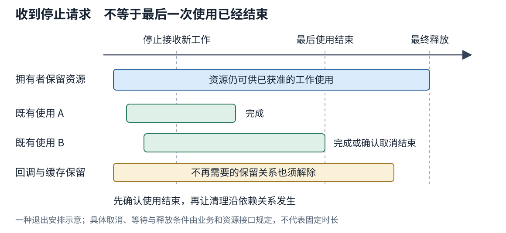

# 第九章 对象生命周期与资源所有权

第一批正文 v0.2 · 卷一 共享基础 · 2026-10-03

C++ 程序中的一个整数、一条记录、一个文件流，都是需要在合适时刻建立和结束的对象。程序还会把它们交给其他函数，保存地址，或安排稍后使用。理解对象生命周期，就是分清对象什么时候存在、什么时候可以访问；理解资源所有权，则是明确谁负责保留资源，以及何时、以什么方式释放它。

这两件事经常交织在一起。函数拿到一个地址，并不意味着它有权释放对象，也不意味着对象会一直存在。一个对象已经销毁，承载它的存储仍可能保留；一个文件已经关闭，磁盘上的文件内容却不会因此消失。把“看得见”“还能用”和“负责清理”区分开，才能设计可靠的接口和退出过程。

本章分为以下几部分：

1. **存储期 对象生命周期与初始化**：从整数和简单记录认识对象，区分存储、初始化、存续和销毁。
2. **Pointer Reference 悬空与别名**：说明指针和引用怎样访问原对象，以及借用为何需要有效期约定。
3. **RAII unique_ptr shared_ptr weak_ptr**：把释放责任交给对象，再按独占、共享和观察关系选择表达方式。
4. **所有权图 循环引用与资源退出路径**：把对象之间的关系连起来，检查回调、缓存和关闭过程为何可能让资源过早或过晚释放。

## 9.1 存储期 对象生命周期与初始化

### 9.1.1 对象不只包括类的实例

在这里，**对象**是有类型、占用存储的数据实体。`int` 类型的整数是对象，`std::string` 类型的字符串也是对象，不必先写一个复杂的类才会遇到对象问题。类型决定了可以怎样解释和操作它；**存储**则是承载它所需的内存空间。空间的大小和对齐方式必须适合相应类型。[S1]

先看一段只有整数和记录的代码：

```cpp
// C++20 说明示例，未编译、未执行。
struct Reading {
    int value;
};

int main() {
    int count{0};
    Reading reading{24};
    count = 1;
    reading.value = 25;
    return count == 1 && reading.value == 25 ? 0 : 1;
}
```

`int count{0}` 创建一个整数，并将初始值设为 0；`Reading reading{24}` 创建一条记录，其中的 `value` 成员也是对象。建立初始状态的过程叫**初始化**。后面的 `count = 1` 则是给已经存在的对象赋新值，不会因此开始另一个 `count` 的生命。

**生命周期**描述对象从生命开始到结束的时间。对于这里的普通对象，可以先按“取得合适存储并完成初始化，随后使用，最后销毁”理解。类可以通过**构造函数**建立初始状态，通过**析构函数**处理结束时的清理；整数没有需要手写的构造和析构函数，也仍然有生命周期。[S1]

这套顺序不意味着“对象存在，就一定有可读取的初值”。在函数里单写 `int count;`，并不会自动把它设成 0。按本章的 C++20 基线，在尚未赋予确定值时读取这个整数，通常会造成未定义行为。**未定义行为**表示语言标准不再为该行为规定结果；它不是“会随机得到一个数”的使用许可。`int count{};` 在这里才会把整数初始化为 0。对象生命、值是否已准备好，是两项相关但不同的条件。[S1]

类的生命周期还有一个值得提前说明的精确边界：通常在初始化完成后开始，在析构函数调用开始时结束。构造和析构期间仍有专门的对象访问规则，不能把普通使用阶段的规则机械套进去。日常代码应让构造函数完成对象需要的不变量，再交给外部使用；析构开始后，也不应让外部继续把它当作一个正常工作的对象。[S1]

### 9.1.2 存储期与名字所在的作用域

**存储期**说明承载对象的存储按什么规则持续存在。C++ 区分自动、静态、线程和动态四种存储期。它们是语言层面的分类，不能直接改名为操作系统的“栈”和“堆”。常见实现会把许多局部对象安排在调用栈附近，但寄存器分配、优化以及其他实现安排，都不是由这四个名称逐一规定的。[S1]

- **自动存储期**常见于普通局部变量。进入相应执行路径时建立对象，正常离开所在块时结束它的生命
- **静态存储期**的存储覆盖程序运行期间，例如命名空间作用域变量和以 `static` 声明的局部变量；对象何时初始化、何时析构还要遵守各自规则
- **线程存储期**用于 `thread_local` 对象，每个线程有相应实例，其存储与该线程关联
- **动态存储期**常见于通过 `new` 表达式创建的对象，其生存不能只看创建语句所在的花括号，需要另外安排销毁与释放

这里还要区分**作用域**：它首先回答一个名字在源码的哪些位置可被使用。函数里的 `static` 局部变量，名字仍是局部的，却不会在每次函数返回时销毁。相反，一个普通局部指针可以指向动态对象；局部指针离开作用域，不会因为它曾保存过地址，就自动替那个动态对象执行 `delete`。

稍后介绍的智能指针正是用来弥合这类责任空隙的：管理者可以是自动存储期的局部对象，它管理的目标却具有动态存储期。两者各有自己的生命周期，通过明确的清理规则联系起来。

### 9.1.3 存储仍在与对象仍在

若每次只看一个局部整数，存储与对象生命很容易混在一起。标准库的 `std::optional<T>` 提供了一个更直观的区分：它表示“可能有一个 T，也可能没有”。optional 对象自身保存容纳值所需的空间，并管理内部值的生命周期，不必让内部值与外层对象同时存在。[S1]

```cpp
// C++20 函数体片段，需包含 <optional>。
// 未编译、未执行。
std::optional<int> slot{7}; // slot 中现在有一个值为 7 的整数
slot.reset();              // 结束这个整数的生命，slot 自身仍存在
// 此处不能通过 *slot 读取一个整数。
slot.emplace(9);           // 在 slot 中建立一个值为 9 的整数
const int result = *slot;
```

`reset()` 之后，外层 `slot` 仍是一个可正常使用的对象，可以检查它有没有值，也可以重新放入值；但原来的内部整数已经不存在。`emplace(9)` 在这里建立新整数，而不是给仍然存活的旧整数赋值。这一段不需要手工管理原始内存，已经能展示存储与对象生命的差别。



图 9-1 外层对象仍在，不表示内部值一直存在。时间线仅对应这段 optional 示例，不规定 optional 的字段布局。

内存池、容器和原地构造会更频繁地遇到这种分离：先准备存储，再在其中建立对象，结束对象生命后继续保留空间。C++20 对某些类型和操作还规定了隐式对象创建规则，不能笼统地说“只要拿到字节就已有任意类型的对象”，也不能把所有对象创建都简化成显式调用构造函数。本章先使用普通声明和标准库管理接口；涉及原始存储重用时，需要按具体类型和操作另查条款。[S1]

这个区别会直接影响访问方式。一个曾经正确的地址，可以在对象结束后变成不再允许访问原对象的入口。下一节关心的正是：谁保存着这个入口，它打算用到什么时候。

## 9.2 Pointer Reference 悬空与别名

### 9.2.1 访问原对象与保存独立的值

**指针（pointer）**可以保存指向对象的地址。`int* p` 声明指向整数的指针，`&value` 取得对象的地址，`*p` 通过指针访问目标。**引用（reference）**可以理解为已有对象的另一个名字；本节主要讨论以 `T&` 表示的左值引用。它们都能让函数使用原对象，避免为了访问而复制一份完整数据。

```cpp
// C++20 函数体片段，未编译、未执行。
int value{24};
int copy = value;
int& alias = value;
int* pointer = &value;

alias = 25;    // 修改 value
*pointer = 26; // 仍然修改 value
// 此时 value 为 26，copy 仍为 24。
```

`copy` 有自己的整数值。`alias` 和 `pointer` 则都能到达原来的 `value`，形成了**别名关系**：几条访问路径对应同一对象。原对象经一条路径被修改，其他路径随后读到的也是修改后的值。

引用建立后不能改为引用另一个对象。写 `alias = other` 是把 `other` 的值赋给原对象，不是重新绑定引用。指针本身则是对象，可以改存另一个地址，也可以保存空指针值 `nullptr`，表示当前没有指向对象。正常的引用没有对应的“空引用”状态；这不代表引用永远不会悬空。[S1]

传递指针或引用，如果接收方只获准使用对象、并不接管保留和释放责任，本章称之为**借用**。这是接口设计里的责任约定，不是 C++ 为所有裸指针自动实施的一套借用检查。旧接口中的 `T*` 也可能表示调用方必须释放的资源，仅看类型往往分不清。因此新接口应尽量清楚表达责任，阅读旧接口时则必须查契约。Core Guidelines 对裸指针和引用采用非拥有的约定，是工程建议，不能误读成语言禁止裸指针承担所有权。[S3]

### 9.2.2 非空不能证明目标仍然存在

一个指针或引用曾指向对象，目标的生命已经结束，这条访问关系就可能成为**悬空**。C++ 不会自动找到所有保留地址的变量，再把它们改成空值。

```cpp
// C++20 函数体片段，未编译、未执行。
int* borrowed = nullptr;
int snapshot{0};
{
    int local{24};
    borrowed = &local;
    snapshot = *borrowed; // 这里 local 仍然存在
}
// local 已结束生命；不能再通过 borrowed 读取它。
borrowed = nullptr;      // 覆盖这一个变量，不会修复其他借用
```

`snapshot` 保存了自己的值，可以继续使用。`borrowed` 没有保存一份整数，也没有保留 `local` 的生命。若改成从函数返回 `&local`，问题同样存在：返回的是访问入口，函数退出却结束了目标的生命。返回局部对象的引用也不能解决问题。

因此，`if (p)` 只适合在指针值本身可合法使用的前提下判断它是否为空，不是通用的存活检查。对悬空指针做一次空值判断，并不能恢复访问资格；存储释放后的某些指针值操作本身还有语言限制。更可靠的判断来自对象的创建、销毁和借用契约，而不是地址看上去是否仍有一个数值。[S1]

同样，原地址里的字节暂时没有变化，也不足以证明访问有效。调试时偶尔“还能读出 24”，不能推翻对象已经结束生命的事实。地址以后被新对象复用，还可能让错误表现为读到另一个合理的值，而不是立即崩溃。

### 9.2.3 只读限制与使用期限

`const T&` 和 `const T*` 常用于只读借用，表达不能通过这条入口执行通常的修改。但它们没有生成快照，也不会阻止其他非 const 别名修改原对象。

```cpp
// C++20 函数体片段，未编译、未执行。
int reading{24};
const int& observed = reading;
reading = 30;
const int later = observed; // 这里读到 30，不是保留的旧值 24
```

这里的 `const` 约束的是这条访问路径。它也没有负责延长 `reading` 的生命。某些引用绑定临时对象的语法确实会延长临时对象生命周期，但有明确条件，不能推广成“加 const 引用就保活”；相关规则在 第十章 继续展开。

还可以区分 `const int*` 与 `int* const`：前者限制通过指针修改整数，后者限制指针变量改指向。它们都不说明谁拥有整数，也都不是线程同步机制。即使一个接口只读，若别处同时无保护地写入同一数据，仍要另行满足并发访问规则。

接口除了写明“能不能改”，还需要写明“用到什么时候”。同步读取函数可以约定只在本次调用期间使用，不保存借用。若函数把地址存入成员或排入任务队列，调用返回就不再是借用结束点；所有者必须覆盖真正的最后一次使用，还必须避免期间发生使访问失效的操作。

例如，容器本身还在，不表示它曾交出的元素地址仍有效。vector 重新分配、删除等操作的具体失效规则见 第十三章。本章只保留这一层关系：**所有者存活是重要条件，却不总是足够条件；借用目标及其访问约定也必须保持有效。**

这也解释了为什么不应为了“保险”把每个引用都改成智能指针。一个函数只在调用期间读一条记录，普通引用往往准确表达了需求；真正需要跨越调用保留对象时，才需要讨论接管、共享，或复制所需数据。

## 9.3 RAII unique_ptr shared_ptr weak_ptr

### 9.3.1 把资源释放交给对象

**资源**不只包括动态内存，还包括打开的文件、连接、设备句柄，以及需要成对取得和释放的其他东西。**所有权**在这里指管理资源存续和释放的责任，并不等同于“能访问它”，也不等同于“它的业务数据归谁”。两个模块都能读取同一文件，不表示两者都应该关闭同一个句柄。

**RAII** 是 Resource Acquisition Is Initialization 的缩写，常译为“资源获取即初始化”。实用的理解是：把资源放进有明确生命周期的管理对象，让建立、接管和释放遵守这个对象的规则；管理对象析构时处理它仍负责的资源。这样，清理责任不必散落在每个 `return` 和错误分支里。[S3]

标准库文件流已经使用这种方式：

```cpp
// C++20 函数示例，未编译、未执行。
#include <fstream>
#include <stdexcept>
#include <string>

int read_first_value(const std::string& path) {
    std::ifstream input{path};
    if (!input) {
        throw std::runtime_error("cannot open input");
    }

    int value{};
    if (!(input >> value)) {
        return 0; // 本例约定：读不到整数时返回 0
    }
    if (value < 0) {
        throw std::runtime_error("negative input");
    }
    return value;
}
```

`input` 管理打开的文件资源，`>>` 尝试读取整数。正常返回和提前返回都会离开函数作用域，销毁已构造的局部对象。若异常传播到匹配的处理器，传播过程会清理沿途已构造且尚未销毁的自动对象，通常称为**栈展开**。因此，成功打开的文件不需要在这三个出口分别手写关闭；文件流中的缓冲对象负责在析构时调用关闭操作。[S1]

例子把“没有整数”映射为 0，只为保持代码简短。实际接口应按业务区分合法的 0、格式错误和读取失败，不能把这种返回约定当作 RAII 的组成部分。

RAII 的关键边界是管理对象确实进入了正确的销毁路径。它不承诺在进程被强行终止、系统崩溃或断电时执行析构；未捕获异常导致终止时，也不能普遍保证完整栈展开。直接调用某些终止函数与正常从函数返回并不是同一条退出路径。[S1]

即便析构发生，资源清理也不自动等于业务成功。关闭写入流可能涉及缓冲输出和错误，远端连接释放不证明对端已经完成请求。需要向调用者报告的提交、刷新或关闭结果，应设计可显式检查的操作；析构负责最终清理，通常不应让异常逃出。若析构函数在异常展开期间让另一异常逃出，会调用 `std::terminate` 终止程序。[S1]

### 9.3.2 先使用值 再表达独占所有权

一条记录只需随当前作用域存在，直接写 `Reading reading{24}` 通常就足够。记录里有字符串或容器时，这些成员也会按自身规则清理。RAII 不要求把所有东西都动态分配，更不要求每个类都手写析构函数。

当对象需要独立的动态存续，例如工厂创建对象后交给调用方管理，可以使用 **`std::unique_ptr<T>`** 表达独占所有权。它是一个管理对象：在约定被正确遵守时，同一资源只有一个这样的所有者；管理者结束或重置时，按删除器规则释放目标。默认删除器适合通过相应 `new` 方式取得的对象。[S1]

```cpp
// C++20 说明示例，未编译、未执行。
#include <memory>
#include <utility>

struct Reading {
    int value;
};

int main() {
    auto producer = std::make_unique<Reading>(Reading{24});
    Reading* borrowed = producer.get();

    auto consumer = std::move(producer);
    // producer 现在为空；consumer 接管同一个 Reading。
    const int result = borrowed->value; // 目标尚存，地址未因这次转移改变

    consumer.reset(); // 销毁 Reading 并释放相应存储
    // borrowed 此后不能继续访问目标。
    return result == 24 ? 0 : 1;
}
```

`make_unique` 创建目标并返回拥有它的管理者。`get()` 只提供访问地址，不移交所有权。unique_ptr 不支持复制，不能通过普通复制再造一份独占责任；`std::move` 在这里允许 `consumer` 的移动构造接管资源，移动后的 `producer` 变为空。目标记录本身并没有因为管理者转移就搬到另一个地址。[S1]

这个例子也给出了移动的初步直觉：转移的是管理责任，未必是逐字节搬运对象。`std::move` 本身不是一次通用的资源搬运，它让后续操作能够选择相应的移动语义；不同类型移动后的状态也不相同。第十章 会进一步解释值类别、特殊成员函数和接口选择，本章不把 unique_ptr 的“移后为空”推广到所有类型。

独占不表示只能有一个访问者。`consumer` 独占拥有记录时，仍可在有效期内把引用借给若干同步函数。禁止的是无协调地安排多个释放者，而不是禁止一切别名。反过来，unique_ptr 也不能阻止程序把 `get()` 得到的地址错误地交给第二个独占管理者；类型提供了表达责任的工具，调用方仍须遵守接管契约。

`reset()` 与 `release()` 尤其容易混淆。前者释放当前拥有的目标，并可接管新目标；后者把地址交出来，让原管理者不再负责，**不会代替调用方销毁资源**。`release()` 通常只用于明确接管责任的接口衔接。若返回的地址再无人管理，资源就可能泄漏；若只想临时访问，应该用 `get()` 或引用。[S1]

外部库的资源还必须匹配正确的释放方式。通过某库的创建函数取得的句柄，可能必须由该库的关闭函数释放，不能因为装进了 `unique_ptr` 就一律使用 `delete`。可以提供合适的删除器，或编写专门的 RAII 包装。删除器本身也有有效期和不抛异常等要求，不能在资源还没释放时先销毁它依赖的上下文。

### 9.3.3 共享所有权要有真实需求

一个后台处理模块和一个显示模块，都需要独立保留同一份结果，而它们完成的先后无法由单一调用层确定时，**`std::shared_ptr<T>`** 可以表达共享所有权。复制这个管理对象，会加入同一组所有者；在普通的 `make_shared<T>` 用法中，最后一个共享所有者释放其份额时，目标对象被销毁。[S1]

```cpp
// C++20 函数体片段，需包含 <memory>。
// 未编译、未执行。
auto result = std::make_shared<int>(24);
auto display = result;
auto archive = result;

result.reset(); // display 和 archive 仍保留目标
display.reset();
const int saved = *archive; // 目标仍存在
archive.reset();            // 这里释放最后一份所有权
```

这不是复制三个整数，而是三个管理者先后指向并共同维持同一个整数。实现需要维护共享管理信息，通常称为**控制块**，其中记录所有者数量、如何释放资源等信息。控制块是理解共享关系的有用模型，但它的具体布局、大小以及分配方式不由这里的示意规定。

要延续这组共享关系，应复制已有的 shared_ptr。不要从 `p.get()` 再建立一个独立的拥有型 shared_ptr。后者不是“自动找到同一个引用计数”，可能形成两个彼此不知道的释放责任，最终重复销毁目标。需要对象向外提供自己所属的共享关系时，有专门的 `enable_shared_from_this` 机制，且需满足已进入共享管理等前提；不能用 `shared_ptr(this)` 代替。

共享所有权也不意味着所有指针行为都被统一了。shared_ptr 有别名构造等进阶用法，可以共享某个对象的所有权，却保存指向其子对象等位置的访问指针。因此，严格讨论时仍要区分“管理什么”和“通过 `get()` 访问什么”。本章的整数示例没有使用这些进阶接口。

共享会把结束时机交给最后一份所有权。某次复制被藏进缓存或回调后，原调用方执行 `reset()` 并不能保证立即销毁对象。复制管理者还涉及共享状态维护，最终释放可能执行一整串析构和自定义清理。不能只看 shared_ptr 的局部操作很短，就假定它在延迟敏感路径上没有成本。

Core Guidelines 因而建议在不需要共享所有权时优先 unique_ptr；这是减少责任复杂度的工程起点，不是对每个项目的性能测量结论。[S3] 如果仅为函数参数借用，把 `const T&` 改成 `shared_ptr<T>` 还会把共享机制强加给调用方。接口应表达接收方是否真的要保留一份所有权。

最后要划清一条常见边界：**引用计数的安全，不等于目标对象的线程安全。**不同 shared_ptr 实例共享同一管理关系，并不因此使目标的成员读写得到保护；对同一个 shared_ptr 变量的并发修改也要另行处理。把对象改成 shared_ptr，不能修复两个线程无同步地修改同一整数的问题。[S1] 本章只确定存续责任，并发访问方式需要独立设计。

### 9.3.4 weak_ptr 表达可消失的观察关系

有些使用者希望在对象仍然存在时访问它，却不希望单凭自己的存在就让对象一直保留。例如缓存只想复用仍被业务使用的结果，界面回调只在窗口尚在时刷新。这种关系可以用 **`std::weak_ptr<T>`** 表达：它关联已有的共享管理关系，但不增加维持目标生命的强所有权。

weak_ptr 不能直接当作目标使用。需要访问时调用 `lock()`，尝试取得一份 shared_ptr；成功则在这份共享所有权保留期间使用，失败则处理目标已经不可取得的情况。取得与过期判断作为一个原子操作完成，避免“先判断还在，随后才尝试持有”的间隙；这里的原子性仍不涉及目标成员的业务读写。[S1]

```cpp
// C++20 函数体片段，需包含 <memory>。
// 未编译、未执行。
auto owner = std::make_shared<int>(24);
std::weak_ptr<int> observed = owner;

if (auto keep_alive = observed.lock()) {
    owner.reset();
    const int value = *keep_alive; // 本次访问有自己的保留责任
}
// 本例已无强所有者；再次 lock() 得到空 shared_ptr。
```

`expired()` 可以观察是否已经没有强所有者，但不能代替一次成功的 `lock()` 为随后访问保活。取得 `keep_alive` 后，还要把它保留到实际使用结束。若仅取出 `keep_alive.get()` 存起来，再立即丢掉 `keep_alive`，原来的悬空风险又会回来。

weak_ptr 也不是可以套到任意裸指针上的存活探针。它依赖已有的共享管理关系，不能仅凭一个普通局部对象的地址就追踪其销毁。它更不能复活已经结束生命的目标；`lock()` 失败应成为明确的业务分支，例如跳过不再需要的刷新，或重新加载缓存内容。

独占、共享和观察至此都有了表达工具。真正困难的设计往往出现在它们互相连接以后：每条边单看合理，整个结构却可能没有退出路径。

## 9.4 所有权图 循环引用与资源退出路径

### 9.4.1 先区分拥有边与观察边

**所有权图**把对象或资源画成节点，把它们之间的责任关系画成边。实线可以表示“负责保留并最终释放”，虚线表示“只访问或观察”。图上的节点应包括藏在容器、回调和缓存中的管理对象，而不只是业务类的名称。

例如，编辑器的一份文档拥有若干段落，段落需要回看所属文档。若文档本来就决定段落的生命，可以让文档直接包含段落或独占管理段落，回指只表达借用，并保证使用段落期间文档仍在。只有段落可能被外部单独保留、而文档允许先消失时，才需要重新考虑回指方式和失效处理，不能只凭“双向可访问”决定双向共享。

若 A 和 B 各保存一份拥有对方的 shared_ptr，外部所有者离开以后，A 仍被 B 保留，B 仍被 A 保留。它们的计数都无法降到触发清理的状态，形成**强所有权环**。引用计数不会自动识别“这组对象已经没有外部用途”。[S3]



图 9-2 可访问关系可以成环，持续的强所有权不必成环。把哪一条边改成观察，需要根据谁应决定生命结束来选择。

用 weak_ptr 打断回指是一种常见修复，但不能机械地把所有环边都改成 weak_ptr。如果某一方确实承担保证对方完成任务的责任，弱化后对象可能过早消失。应先找出生命周期的根，再决定哪些关系是长期拥有，哪些只是需要时尝试访问。对复杂图，也可以由独立的管理者统一拥有节点，节点之间保存有校验机制的句柄；不一定每条边都使用智能指针。

### 9.4.2 回调与缓存里的隐含保留

**回调**是先保存起来、稍后再调用的函数。lambda 表达式可以把它需要的数据保存在生成的函数对象里，这叫捕获。于是，一个看起来只是“注册处理函数”的动作，也可能新增一条所有权边。

例如 `Panel` 对象把一个回调保存在自己的成员中，而回调按值捕获指向这个 Panel 的 shared_ptr。关系就变成 Panel 拥有回调，回调拥有 Panel。即使没有两个显式互相引用的业务类，也已经形成了环。更糟的是，若计划在 Panel 析构时清空回调，析构恰好又被回调保留的所有权阻止，清理就不会开始。

如果回调只应在 Panel 仍存在时工作，可以改成弱观察：

```cpp
// C++20 说明示例，未编译、未执行。
#include <functional>
#include <memory>

struct Panel {
    int refreshes{};
    std::function<void()> refresh;
};

int main() {
    auto panel = std::make_shared<Panel>();
    panel->refresh = [weak = std::weak_ptr<Panel>{panel}] {
        if (auto current = weak.lock()) {
            ++current->refreshes;
        }
    };

    auto queued = panel->refresh; // 模拟另一处保存了一份回调
    panel.reset();               // 回调没有强行保留 Panel
    queued();                    // lock 失败，跳过刷新
}
```

`std::function<void()>` 保存一个可调用、没有参数和返回值的函数对象。捕获里的 `weak` 是回调自己的 weak_ptr；`current` 只在本次执行成功取得对象后，临时承担保留责任。示例是单线程的，没有模拟任务调度或并发调用。

这里选择“对象已消失就跳过”，是刷新场景的业务约定。若回调代表必须完成的归档，跳过可能不合要求。这时可以让任务拥有所需数据，或让调度者在明确的完成点释放任务，而不是简单套用同一段 weak_ptr 写法。

反方向的错误也很常见：回调只捕获裸 `this`，却比对象活得更久。它没有形成强环，但也没有保留目标。解决方法取决于回调契约：可以确保注销后不会再有执行、在销毁前等待已开始的调用完成，也可以采用合适的弱观察或数据快照。仅仅把回调从注册表删除，不必然证明已经排队或正在执行的副本也消失了。

缓存需要类似判断。保存 shared_ptr 的缓存会主动保留目标，即使其他业务使用者都已离开；这可能正是缓存的目的，但必须有容量、淘汰或清空规则。保存 weak_ptr 的缓存则允许目标消失，下次查找可能需要重新加载。两者对应不同的保留策略，不能只按“哪种更省内存”命名为正确和错误。weak_ptr 条目本身及相关管理信息也仍可能占用空间，需要清理过期索引。

### 9.4.3 构造失败与依赖资源的释放顺序

一个对象常常管理多项资源，而且资源之间存在依赖。假设会话先打开连接，再创建需要使用该连接的请求队列。关闭时就应先停止队列对连接的使用，再关闭连接；只保证每个资源最终都释放，还不足以保证顺序正确。

类的非静态数据成员按**声明顺序**初始化，不按构造函数初始化列表中书写的先后顺序初始化；成员析构则按相应的逆序进行。[S1] 因此，用资源管理成员表达依赖时，声明顺序也是设计的一部分。

```cpp
// C++20 结构示意，未编译、未执行。
// Connection、Queue 为业务类型；这里仅说明依赖与声明顺序。
// 假定 Queue 析构完成全部停用工作后，不再访问 Connection。
class Session {
    Connection connection_; // 先建立，后销毁
    Queue queue_;           // 使用 connection_，先销毁
public:
    Session() : connection_{}, queue_{connection_} {}
};
```

这个片段不是可独立编译的实现，`Queue` 是否真的停止了全部使用，仍取决于它的契约。如果队列析构只是发出取消请求就立即返回，声明顺序虽然正确，仍可能让后台工作访问已经关闭的连接。

构造失败时，资源管理成员还有另一项好处。若 `connection_` 已成功构造，而 `queue_` 构造抛出，已经完成构造的成员会被清理；整个 Session 未完成构造，不能依赖 Session 自己的析构函数来补救。[S1] 这正是应尽早把取得的资源交给完整 RAII 成员的原因。如果构造函数先把裸句柄塞进普通整数或裸指针，随后失败，那个普通成员的销毁不会自动调用外部资源的关闭函数。

自定义析构函数的函数体执行后，成员才按规则继续销毁。如果在 Session 析构函数体里先手动关闭连接，再等待 queue_ 的成员析构，就可能反而破坏了原本正确的成员顺序。需要显式关闭协议时，应让它与成员责任一致，并保证重复调用和部分失败不会造成重复释放。

### 9.4.4 退出路径需要覆盖最后一次使用

退出过程可以分成几个可核查的阶段。先阻止新的使用者进入，再处理已经排队或正在使用资源的工作，确认最后一次访问结束，随后断开不再需要的回调和缓存保留，最后释放拥有者。具体顺序取决于系统；例如取消某项工作可能仍需连接，因此不能提前关闭它所依赖的资源。



图 9-3 一条资源退出路径。阶段边界来自实际完成条件，不由“已请求停止”或“函数已返回”自动代替；图中不规定具体并发原语。

RAII 适合把最终清理落到对象上，但不负责替应用决定“工作已经结束”的业务条件。文件读取结束、任务确已不再访问缓冲区、设备不再使用提交的数据，分别需要其接口提供证据。只要还存在真实使用者，就需要有人承担存续责任；反之，业务已经完成却仍被缓存保留，资源也可能迟迟不释放。

共享所有权把这个问题进一步变成“最后一份强引用在哪里”。对于本章使用的普通 shared_ptr 管理方式，最后一次释放可能就在当前调用里触发目标析构。若目标析构会关闭大批子对象、等待工作或调用外部库，释放位置本身就会影响响应时间。可以选择更明确的关闭阶段，或设计专门的延迟回收机制；这些都是额外的机制和成本，不能凭引用计数自动获得。

跨模块、跨线程乃至跨库边界时，还需要检查释放操作允许在哪个执行环境发生。例如某些库要求资源回到指定线程或上下文中销毁，这是相应库的契约，不是所有 C++ 对象的统一要求。自定义删除器可以参与实现，但删除器依赖的执行器若先退出，仍会留下新的所有权问题。

至此，一张完整的所有权图需要与一条时间线共同使用：图说明谁负责谁，时间线说明这些责任何时建立、移交和结束。单看其中一个，容易漏掉“关系正确，但释放太早”或“永远有人保留，清理到不了”的错误。

## 沿创建到最后一次使用排查

遇到崩溃、乱码、重复释放或资源不降时，先确定具体目标，而不是先把所有指针换一种类型。目标可能是一个对象、它的某个成员、它拥有的缓冲区，或外部库的一项句柄。持有这个目标的外层对象仍然存在，不足以证明目标本身仍然有效。

可以沿五个问题重建经过：它在哪里创建，谁最初接管了资源，哪些地方取得或保存了借用，哪个操作结束了对象或资源，最后一次使用实际上发生在哪里。这条链中的“哪里”不仅是源码行，也包括回调副本、缓存条目和任务完成点。

**过早结束**通常表现为释放后使用，但需要找到先后关系。若故障出现在一个回调里，追查注册时捕获的究竟是值、裸地址、强所有权还是弱观察；再核对销毁和注销是否覆盖已经排队的副本。若跨过容器修改，继续检查目标的失效规则，而不是只检查容器变量有没有析构。

**重复释放**要寻找彼此独立的释放责任。两个 shared_ptr 是否从同一个裸地址分别构造？外部库是否已经接管句柄，而本地包装仍会再次关闭？移动或 `release()` 之后，旧路径有没有继续执行清理？报错发生在第二次释放，不代表错误最初就在这行。

**一直不释放**则沿强拥有边反向查找。循环引用是一种原因，缓存没有淘汰、队列尚未消费、回调捕获了不必要的大对象，也是原因。`use_count()` 可以提供有限线索，却不会列出所有者位置，也不计算普通裸指针借用；不能把某个计数值当作整个使用关系的证明。

还要分清“对象未销毁”与“进程占用内存未立即下降”。对象可能已经析构，而分配器仍保留可复用的存储，操作系统看到的进程内存并不必然立刻下降。排查时分别记录业务对象数、资源打开与关闭、实际析构以及内存统计，避免只凭一个总体数字判定泄漏。具体内存回收行为需要结合分配器和平台核查。

AddressSanitizer 可以帮助发现已执行路径中的多类释放后使用、越界和其他内存错误，其检测范围与配置、平台及实际覆盖有关。[S4] 它不能证明未执行的路径没有悬空，也不会代替外部设备句柄或业务退出协议的检查。生命周期日志同样只是证据，应记录稳定标识和必要事件，不把对象地址永远当作业务身份。

修复后应覆盖正常结束、提前返回、构造中途失败、显式重置、回调延迟执行和缓存淘汰等真实路径。分别检查是否还有使用者、是否只由正确的责任方释放，以及释放是否发生在允许的顺序和环境中。本版只有代码与关系推演，未执行这些测试。

## 面试中的一条追问链

**局部变量离开作用域，保存它地址的指针为什么不会继续保留它？**

裸指针保存的是访问入口，没有自动承担目标存续责任。普通局部对象在相应退出路径上结束生命，外层指针变量还在不改变这件事。我会先区分指针自身和目标对象，再看函数需要返回独立的值、转移拥有者，还是由调用方提供更长寿的对象供其借用。

**那把返回类型换成 const 引用，或者先判断非空呢？**

const 引用约束通过它修改目标，不会普遍延长已有局部对象的生命；它也可能悬空。非空判断不提供目标存活证据，尤其不能把已失效地址重新变成合法借用。要修复的是目标与使用者的时间关系，而不是访问表达式的外观。

**改成 unique_ptr 返回以后，其他函数还可以借用吗？移动时借用是否必然失效？**

独占所有权允许多个有效期受控的借用者，只保留一份释放责任。对本章普通 unique_ptr 的移动构造，接管者取得同一目标，目标地址没有因此改变，原裸指针不会仅因这次移动就失效。但它接下来依赖新所有者的存续；若新所有者马上 reset，借用仍然不能继续。移动整个容器或某种业务对象时，要重新看具体操作，不能照搬这一结论。

**为了让每个使用者都放心，统一改成 shared_ptr 是否更简单？**

只有使用者确实需要独立保留同一对象时，共享所有权才匹配问题。同步借用可以保留简单接口；跨越调用使用也可能只需要复制少量字段。shared_ptr 增加管理成本，还会把结束时机推迟到最后一份强所有权释放。它不保护目标成员的并发读写，也不会自动处理缓存和回调形成的环。

**对象拥有回调，回调捕获对象；在析构里清空回调为什么可能无效？**

如果捕获的是 shared_ptr，回调本身就阻止对象进入析构，清空动作没有机会开始。可以由明确的外部关闭动作断开关系，或在业务允许目标消失时采用 weak_ptr 捕获。选择弱观察后，还要回答 lock 失败怎么办；必须完成的任务不能悄悄丢弃。

**weak_ptr 检查没过期以后，能否把取得的裸指针交给后台长期保存？**

不能只保留检查结果。应通过 lock 取得一份共享所有权，并让它覆盖后台的实际使用期；否则原拥有者可能在检查后释放目标。即使成功保活，也仍要满足目标访问和业务状态的约定。对象活着不代表可以在任何线程做任何操作。

**现在没有悬空和循环引用，RAII 能否保证关闭必定完成？**

仍要看退出条件与失败边界。RAII 负责在相应销毁路径上调用清理，不能保证崩溃后执行析构，也不能把取消请求变成所有工作已经停止。需要检查依赖顺序、尚在执行的使用者、允许的释放环境，以及哪些关闭错误必须显式报告。最后再用正常与异常路径的证据验证，不能只凭析构函数存在就声称方案可靠。

## 来源与阅读边界

资料核验日为 2026-10-03。本章以 C++20 为主线，N4861 作为公开固定规范参照；正文、说明代码和三幅 SVG 图由本项目原创组织。代码均未编译、未执行，没有资源泄漏测试、崩溃复现或性能测量结果。本章不规定任何编译器 ABI、智能指针字节大小或控制块布局。

- **S1 语言与标准库规则。** WG21 [N4861 公开工作草案](https://www.open-std.org/jtc1/sc22/wg21/docs/papers/2020/n4861.pdf)。对象与存储重点见 `[intro.object]`、`[basic.life]`、`[basic.indet]`、`[basic.stc]`、`[dcl.init]`；引用与退出见 `[dcl.ref]`、`[stmt.jump]`、`[class.base.init]`、`[class.dtor]`、`[except.ctor]`、`[except.terminate]`；库接口见 `[optional.general]`、`[optional.mod]`、`[unique.ptr]`、`[util.smartptr.shared]`、`[util.smartptr.weak]` 和 `[filebuf.cons]`
- **S2 版本身份。** WG21 [N4859 编辑报告](https://www.open-std.org/jtc1/sc22/wg21/docs/papers/2020/n4859.html)说明 N4861 与 C++20 DIS N4860 的内容对应关系。公开草案不替代正式出版文本和后续缺陷报告分析。本章的 unique_ptr、shared_ptr、weak_ptr 可追溯至 C++11，make_unique 需要 C++14，optional 需要 C++17；旧项目应按实际标准模式选用，不能仅复制 C++20 示例便宣称兼容
- **S3 工程建议。** [C++ Core Guidelines 资源管理章节](https://isocpp.github.io/CppCoreGuidelines/CppCoreGuidelines#S-resource)，重点为 R.1、R.3、R.4、R.5、R.20、R.21、R.24 与 R.30。它是滚动维护的工程指南，用于责任表达和设计取舍，不是 ISO 规范，也不是任何性能结论的实测依据
- **S4 内存错误诊断。** LLVM [AddressSanitizer 文档](https://clang.llvm.org/docs/AddressSanitizer.html)。支持的诊断种类、运行平台及启用条件应按实际工具版本核对，工具无报告不构成生命周期正确性的完整证明

[S1]: https://www.open-std.org/jtc1/sc22/wg21/docs/papers/2020/n4861.pdf
[S2]: https://www.open-std.org/jtc1/sc22/wg21/docs/papers/2020/n4859.html
[S3]: https://isocpp.github.io/CppCoreGuidelines/CppCoreGuidelines#S-resource
[S4]: https://clang.llvm.org/docs/AddressSanitizer.html
