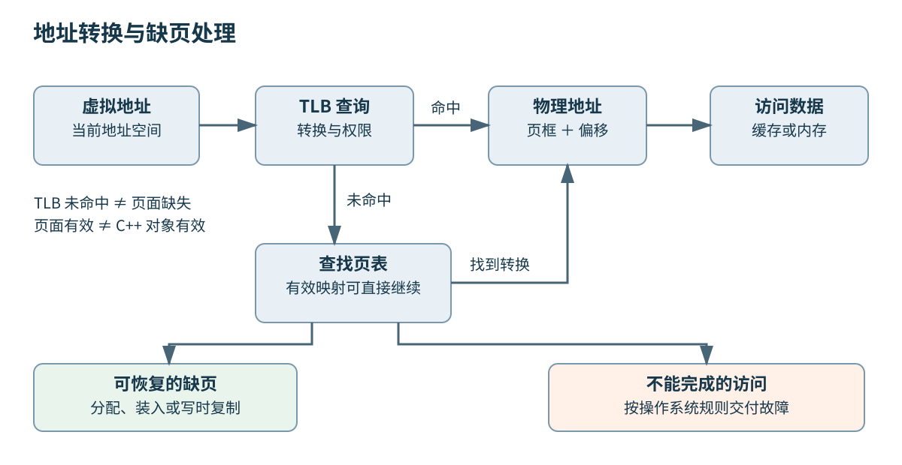
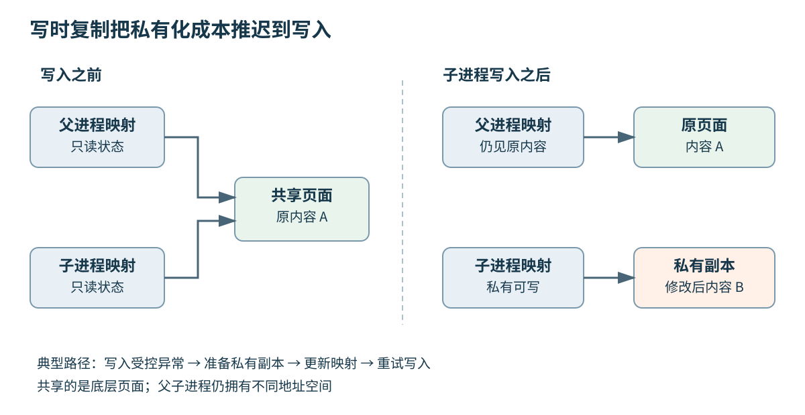
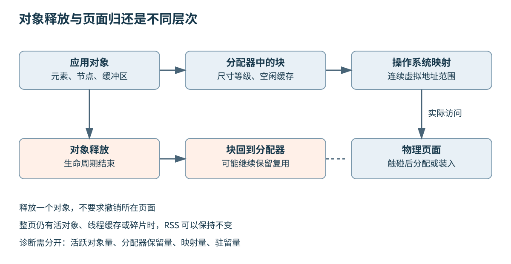

# 第六章 地址空间与虚拟内存

全书正文初稿 · 第二篇 从源码到机器运行 · 2026-10-03

**地址空间**是一个执行环境能够使用的地址集合及其解释规则。程序拿到一个指针时，通常拿到的是当前进程中的虚拟地址，而不是内存条上的位置。**虚拟内存**把这些地址与实际存储分开管理，使不同程序可以拥有独立的视图，也使同一份文件内容能够出现在多个地址空间里。

这层间接关系解决了三个实际问题：程序无需自行协调物理地址，操作系统可以检查访问权限，尚未使用的地址范围也不必立刻占用对应的物理内存。它同时引入了新的成本与故障形式。一个分配请求成功，不代表所有页面已经驻留；两段连续的虚拟地址，不代表物理页面连续；一次访问变慢，也可能发生在地址转换与缺页处理阶段，而不只是第五章讨论的数据缓存中。

理解虚拟内存的关键，是始终分开四件事：地址范围是否存在，访问是否获得许可，内容当前是否驻留，以及语言层面的对象是否仍然有效。本章以常见的分页系统建立模型，具体接口主要使用 Linux；Windows 对应概念会单独注明。没有内存管理单元的微控制器不必具有这里的进程地址空间模型，不能把通用操作系统的结论直接套到所有嵌入式设备上。

## 6.1 地址空间 页表 TLB 地址转换缓存与缺页

### 6.1.1 同一个地址数值可以指向不同内容

假设两个独立进程都打印出地址 `0x400000`。这并不表示它们正在访问同一块物理存储，因为地址的含义还取决于当前使用的地址空间。就像两个文件各自的第十个字节没有必要相同，两个进程中的同一虚拟地址也可以有完全不同的映射。

相反，不同虚拟地址可以映射到同一份底层内容。一个只读共享库可以出现在多个进程中；同一个共享内存对象也可以在两个进程里被映射到不同起点。因此，跨进程传递原始指针数值通常没有意义。即使两边偶然映射到相同数值，指针指向对象的生命周期、布局和同步条件仍然需要额外协议。

**虚拟地址**是程序发出访问时使用的地址；**物理地址**是地址转换后用于访问物理存储系统的地址。后者也不应简单等同于“某条内存条上的编号”，因为设备映射、内存控制器和平台互连仍参与解释。普通应用程序主要依赖操作系统提供的虚拟地址，不应通过猜测数值推断物理拓扑。

Windows 官方文档同样把进程虚拟地址空间与物理存储区分开。可用地址范围受到处理器模式、操作系统和进程配置影响；“64 位指针”不意味着实现把全部 2⁶⁴ 个地址都开放给用户程序。[S1] 地址空间布局随机化还会使同一程序多次运行时的映射位置变化。持久化文件、网络协议和共享内存格式应保存稳定标识或偏移，而不是一次运行得到的地址。

### 6.1.2 页面把映射与保护变成可管理的单位

**页**是虚拟内存管理的一种基本粒度；**页框**是物理内存中对应粒度的存储单元。把虚拟地址分为虚拟页号与页内偏移后，转换过程主要寻找虚拟页号对应哪个页框，页内偏移保持不变。这使操作系统可以把相邻虚拟页放到不相邻的物理位置，程序仍然看到连续地址。

为说明运算，下面暂用页大小为 4096 字节的教学模型，不把它当成所有平台的规定。虚拟地址 `0x12345` 的页号为 `0x12`，页内偏移为 `0x345`。若该页映射到页框号 `0xAB`，物理地址就是 `0xAB000 + 0x345 = 0xAB345`。如果下一虚拟页映射到另一个远处页框，跨页访问仍然按各自映射完成。

页内偏移没有改变，不代表访问可以跨越任何边界。一项读取若横跨两页，必须同时满足两页的可访问条件。前半段位于有效页面，后半段落到未映射页，整个语言表达式不会因为“起始地址有效”就变得安全。协议解析中的长度检查、数组界限与映射长度检查必须覆盖完整范围。

页大小还影响保护粒度。若两个小对象位于同一页，普通页面权限不能只把其中一个设为只读。把缓冲区末尾紧贴不可访问页，能够帮助发现部分越界；没有跨到保护页的越界仍可能悄悄破坏相邻对象。硬件页面保护和语言对象边界是两层不同的检查。

### 6.1.3 页表记录映射 也记录访问条件

**页表**是操作系统和硬件用来描述地址转换的一组数据结构。一个页表项除了指定物理页框，还可能包含存在状态、读写与执行权限，以及硬件或软件维护的访问、修改信息。具体位布局由体系结构规定，不能把某个平台的一张位图当成通用标准。

如果给每个可能虚拟页都预留一个表项，大地址空间需要的元数据会非常大，而且其中多数范围可能从未使用。多级页表把页号再分成若干索引，只为实际使用的分支分配下级表。未映射的大范围可以在较高一级直接表示为空，无需为其中每个页都建立末级项。

Linux 的通用内存管理代码使用多级抽象，实际硬件不需要的层级可以折叠；这不等于每款 Linux 机器都执行相同次数的内存读取。[S2] 有的转换在较高层以大页结束，有的相关信息已经被缓存。用“某系统支持几级页表”估计一次访问延迟之前，必须先检查实际页面类型与转换缓存行为。

映射还存在一个软件视图。Linux 用虚拟内存区域描述一段地址范围的用途与访问属性，页表则描述较细粒度的当前转换状态。建立一个区域后，其中很多页表项可能尚未建立。看到映射列表里存在一段范围，并不意味着该范围每页都已有物理页框。



图 6-1 地址转换与数据访问是相互关联的不同环节。图中省略具体处理器的页表遍历缓存、多级 TLB 和缓存并行访问细节。权限故障也可能在 TLB 命中时识别；下方展开的是未命中后的处理分支。

### 6.1.4 TLB 缓存转换结果 不缓存程序数据

**TLB** 的全称是 Translation Lookaside Buffer，通常译为地址转换后备缓冲器，可以直接理解为地址转换缓存。它保存近期使用的转换及相应属性，避免每次访问都从页表根部重新查找。第五章的数据缓存回答“这份内容在哪里”，TLB 回答“这个虚拟地址应该如何转换、允许怎样访问”。

TLB 命中时，不代表数据一定在某级数据缓存中；数据缓存命中与转换缓存命中也不是可以互换的指标。一个程序反复访问分散页面中的少量字节，可能使用的数据总量不大，却需要覆盖很多转换项。分析这种程序时，应同时观察工作集大小、跨页分布与访问顺序。

假设一个简化 TLB 能同时保留 64 个普通页的转换，页面为 4 KiB，那么相应覆盖量是 256 KiB。这个乘法说明的是教学模型的 **TLB reach**，即转换缓存可覆盖的地址量，不是现实处理器的保证。真实硬件可能有多级结构、不同页大小的独立容量、组相联冲突与指令和数据侧差异；访问 65 个页面也不意味着每次访问都必然失败。

当映射被删除或权限被收紧时，旧的转换不能继续被处理器使用。操作系统需要按体系结构要求使相关 TLB 状态失效；若同一地址空间正在多个核上运行，还可能需要跨核协调。这类操作通常被称为 TLB shootdown。[S3] 因而高频创建、撤销映射或改变权限可能产生成本，不能只计算分配到的字节数。

### 6.1.5 TLB 未命中不等于缺页

一次 TLB 未命中，最普通的结果是从有效页表中找到转换，补充缓存，然后继续访问。这个过程可以完全不需要操作系统为本次访问分配新页。若把每一次 TLB 未命中都当成磁盘读取，就会把硬件转换开销与系统缺页处理混为一谈。

**缺页异常**发生在当前转换或访问条件无法直接满足指令要求时。异常原因可能是页面尚未驻留，也可能是写入只读映射、访问根本不存在的地址，或者操作系统有意把页面设为需要进一步处理的状态。名称里有“缺页”，并不表示物理内存一定不足。

处理异常后，有些访问可以重试并成功。首次写入按需分配的匿名页、触发写时复制，都是常见的正常路径。有些访问不应继续，例如写入真正只读的代码页，或解引用已经撤销映射的地址。内核需要结合地址范围、访问类型和映射策略判断，不能只看异常本身就把它归为程序错误。

还应区分硬件异常与最终交付给程序的故障。Linux 上无效内存访问可能最终以 `SIGSEGV` 等信号表现；有效文件映射遭遇特定后备存储问题也可能产生 `SIGBUS`。这些是操作系统处理后的结果，不能把“页面不在内存”“发生缺页异常”“进程收到段错误”写成同义句。[S2]、[S4]

### 6.1.6 按需分配把成本推迟到首次访问

申请一大片地址范围时，操作系统可以先记录意图，而在实际访问时再准备页面。这样，程序保留很大的稀疏结构，却只使用其中一小部分时，不必立即占用全部物理内存。匿名映射承诺的初始零值也可以通过共享零页等实现策略延迟物理分配，而不是马上为整个范围逐字节写零。

这种延迟改变了成本出现的位置。一个容量扩展操作很快完成，稍后真正写入新区域时却逐页产生异常、分配和初始化工作。只给申请函数计时，会漏掉这部分实际使用成本。服务在初始化阶段建立对象池，却到首次请求才逐页触碰，也可能把本应可预测的准备工作留在尾延迟路径上。

提前触碰页面可以让一部分成本提前发生，但要说明触碰方式。只读访问与写入访问未必建立相同的私有物理页；编译器也可能删除没有可观察效果的无用读写。预热还会改变缓存、NUMA 放置和内存压力，不能把预热后的数字与冷启动数字混成一个结论。

若系统需要避免某段关键路径上的换出和缺页，可以研究预分配与锁页接口，但锁页受权限和限额约束，也不解决所有实时性问题。Linux 的 `mlock` 成功后提供相应驻留保证，调用及后续分配仍可能失败；锁住过多内存还会把压力转移给其他任务。[S5] “用了锁页”不能代替完整的资源预算。

### 6.1.7 大页减少转换数量 也改变分配与回收成本

把一个大范围用较大页面表示，可以减少页表项与转换缓存项的需求。对连续访问的大工作集，这有机会减轻地址转换开销。代价是粒度变粗：只使用大页中的少量内容可能浪费内存，获得合适物理范围可能需要整理，写时复制、拆分和回收路径也会改变。

Linux 的显式 HugeTLB 与透明大页机制不是同一种接口。前者涉及专门的资源管理方式，后者尝试在适合时自动使用较大粒度；截至本章核验日期，透明大页还存在多尺寸支持与不同策略，不能简单概括成“系统只有 4 KiB 和 2 MiB 两种选择”。支持的大小和实际行为必须看体系结构、内核版本与配置。[S6]

假设一个索引在 1 GiB 范围内均匀访问，普通页转换成为明显热点，大页可能减少转换压力。若另一个索引同样保留 1 GiB 地址，却只写入几个分散的小块，大页策略可能增加实际内存成本。二者虚拟范围相同，稠密程度不同，工程判断也不同。

是否启用某策略，应通过代表性负载比较尾延迟、实际驻留量、页表成本、缺页与整理事件。不能根据吞吐平均值独立决定：一次较慢的页面整理可能只影响少量请求，却足以突破延迟预算。页面机制是可验证的候选原因，不是一个见到内存性能问题就打开的万能开关。

### 6.1.8 从一次访问回答连续追问

**“读一个地址究竟发生了什么？”** 首先要有语言意义上有效的访问；机器发出的虚拟地址在当前地址空间中接受转换与权限检查，成功后访问对应内容。TLB、页表遍历缓存和数据缓存影响成本；遇到无法直接完成的条件，才进入相应异常处理路径。这个顺序是概念分层，不宣称真实硬件所有步骤都串行执行。

**“TLB 未命中，为什么程序没有报错？”** 因为未命中只是缓存没有这条转换，页表仍可能完整有效。正如数据缓存未命中不等于数据不存在，转换缓存未命中也不是地址非法。

**“页表有效，指针就一定合法吗？”** 不是。页表只约束页级访问。指向已释放对象的地址可能仍落在可读写映射内，数组越界也可能没有跨页；语言层面已经无效的访问不会因此获得许可。内存检查器所维护的对象边界与生命周期信息，正是在补充页面保护无法表达的细节。

**“为什么把全部页面提前准备好仍可能慢？”** 因为地址转换只是成本之一。线程可能被调度出去，数据缓存可能未命中，页面可能位于远端 NUMA 节点，内存带宽也可能饱和。先明确想消除哪类等待，才能选择有针对性的机制。

## 6.2 mmap Copy on Write 与文件映射

### 6.2.1 映射把一段地址与后备对象关联

Linux 的 `mmap` 在进程地址空间中建立映射。匿名映射没有普通文件作为内容来源；文件映射把某段文件偏移与地址范围联系起来。所谓“把文件映射到内存”，不要求调用返回前把整个文件复制到进程私有缓冲区，也不意味着整个文件始终驻留。

这里的**后备对象**是页面内容可以从何处获得、修改后如何处理的依据。普通文件映射的未修改页面可以从文件重新取得；某些匿名页面在允许换出时可以进入交换后备存储。干净文件页与脏匿名页的回收条件不同，不能只按“这一页属于哪个进程”判断回收成本。

文件映射要求处理偏移与页粒度之间的关系。若想读取文件偏移 5000 开始的 100 字节，在页面大小为 4096 字节的示意系统中，可从文件偏移 4096 建立长度至少 1004 字节的映射，再从返回地址偏移 904 的位置访问。对齐下界、计算差值、检查加法范围，缺一不可。实际页面大小必须通过平台接口获得。[S4]

映射是一种资源。成功建立后，要保留实际返回的起点与映射长度，最终用对应接口解除；不能把调整后的数据指针误当映射起点。错误返回值也必须按接口检查：`mmap` 使用 `MAP_FAILED` 表示失败，不能把检查空指针的习惯原样套过来。

### 6.2.2 共享与私有回答修改的去向

`MAP_SHARED` 使修改能够通过共同后备对象与其他相应映射关联；`MAP_PRIVATE` 为本映射提供私有修改语义，修改不会写回原文件。名称里的“共享”不意味着自动加锁，名称里的“私有”也不意味着建立时已经完整复制一份文件。[S4]

例如两个进程把同一文件区域映射为可写共享区域，它们可以访问同一份内容，但如果同时更新多字段记录，读者仍可能观察到更新中间状态。虚拟内存决定它们能看到哪些存储，同步协议决定何时可以把这些字节作为一个完整版本使用。第七章将把这两件事放回进程间通信中讨论。

私有映射适合在不修改原文件的条件下使用或调整内容，但不能自动当成文件的稳定快照。对于映射建立后通过其他途径对底层文件进行的修改，接口存在明确的可见性边界；不能假定私有映射冻结了映射时刻的文件版本。需要稳定快照时，应使用受控版本、不可变文件或文件系统提供的适当机制。

同一文件还可能以不同权限、不同偏移、多次映射到同一个进程。调试时只看文件名并不足以判断两处地址是否对应同一内容，需要核对映射起点、文件偏移、长度和共享属性。链接装载中的代码与数据段就是这种思路的一项重要应用，第八章会继续解释。

### 6.2.3 写时复制推迟复制 但没有消除复制

**写时复制**，即 Copy on Write，简称 COW，是先共享内容、在需要私有修改时再分离的策略。两个使用者只读时可以共享物理页面；一方准备写入时，操作系统使该写入触发受控处理，为其建立可独立修改的内容，然后让写入继续。

COW 的正确性关键不在“先共享”三个字，而在写入必须被可靠截获。仅仅让两个可写指针指向同一页，然后约定写前复制，不是操作系统提供的 COW。页表权限、内核元数据与并发更新共同保证，原本承诺私有修改的一方不会直接改坏另一方的视图。

复制通常按页面或相关管理粒度进行，不是只复制被修改的一个字段。假设教学模型中的页面为 4096 字节，一页包含 64 个各占 64 字节的小对象。只修改其中一个计数器，也可能需要分离整页。由此可以理解，数据布局与写入分布会影响 COW 放大：很少的业务字节修改，可能触发大量页面成本。

但不能反过来宣称“每次 COW 异常都必然复制整页”。如果内核确认页面已可被当前使用者独占，某些路径可能只改变映射状态；大页、页面拆分以及不同后备对象也会改变细节。应把 COW 理解为维护隔离语义的机制，再根据实际实现解释某次是否复制。[S7]



图 6-2 写时复制的一条典型路径。该图省略页表复制、引用计数与无需实际复制的优化情形。

### 6.2.4 fork 的便宜与昂贵发生在不同阶段

Linux 的 `fork` 创建子进程时，父子进程具有分离的地址空间视图，常见私有页面通过 COW 延迟复制。调用本身仍然需要创建进程相关结构，并承担页表等管理开销；“没有立即复制全部数据页”不等于操作没有成本。[S7]

这种策略使“创建子进程后很快装载另一程序”的路径避免大量无用数据复制，也适合某些需要暂时保留旧视图的工作。但如果父子很快都写入大部分页面，延迟的复制最终仍要发生，还叠加了异常处理、分配和带宽需求。系统需要为最坏写入量留出空间，不能只按 `fork` 刚完成时的驻留统计做容量判断。

一个常见问题是后台快照期间的内存突增。假设服务有 6 GiB 私有数据，子进程读取旧视图，父进程继续更新。快照期间父进程实际修改了覆盖 2 GiB 的页面，那么分离后的物理使用量可能显著增加，即使每项更新只改几个字节。这个数字是页面覆盖的教学估算，不包含页表、分配器与其他运行时成本，不能直接当作测量值。

判断风险时，应估计快照持续时间、更新速率、页面级写入分布及内存上限。缩短快照窗口、把热点可变字段与冷数据分开布局、采用增量机制，都可能比盲目增加交换空间更贴近原因。COW 把时间与空间联系起来：共享维持得越久，同时保留多个版本的代价就越值得关注。

### 6.2.5 文件映射的生命周期独立于描述符

建立成功的映射会维护它需要的后备对象关系。Linux 上关闭创建映射时的文件描述符，不会自动使映射失效；解除映射也不是关闭描述符的替代操作。[S4] 因此，一个资源包装类如果同时拥有描述符和映射，需要分别管理两种生命周期。

文件名、打开的文件对象和映射又是三件事。路径被改名或移除后，已有引用未必立刻消失。对版本文件使用“写新文件，再切换名称”的策略时，旧映射可以继续引用旧对象，新读者通过新路径得到新对象；具体持久化与并发协议还要遵守文件系统规则，不能仅靠名称变化推断所有读者已经更新。

更危险的情况是其他参与者把已映射文件截短。应用此前检查过文件长度，并不能阻止后续截短；访问不再有后备内容的区域可能收到 `SIGBUS`。仅在映射前调用一次文件状态查询，无法解决这个竞态。需要保证文件在映射有效期间不可变，或者用双方认可的协调方式控制尺寸变化。

读取可能变化的文件时，普通 `read` 接口会在调用结果中报告一些错误或短读；映射访问则可能在某条普通加载指令处遇到故障。这不是说映射一定更危险，而是错误交付位置不同。选择接口时，应考虑库边界能否处理这种失败模式，而不只比较少了几次函数调用。

### 6.2.6 一个只读映射包装需要明确哪些条件

下面的例子只演示“已知非空范围的只读映射”与释放责任。调用者保证描述符指向普通文件，文件长度至少为指定大小，而且映射存活期间不会被截短；它不是面向不可信并发文件的完整读取器。大小上限、文件类型验证与记录解析应在更外层建立。

```cpp
// C++20 与 Linux/POSIX 接口示例，未编译、未执行。
#include <sys/mman.h>
#include <cerrno>
#include <cstddef>
#include <stdexcept>
#include <system_error>

class ReadOnlyMapping {
public:
    ReadOnlyMapping(int fd, std::size_t length) : length_(length) {
        if (length == 0) {
            throw std::invalid_argument("empty mapping");
        }
        base_ = ::mmap(nullptr, length, PROT_READ, MAP_PRIVATE, fd, 0);
        if (base_ == MAP_FAILED) {
            const int error = errno;
            throw std::system_error(error, std::generic_category(), "mmap");
        }
    }

    ReadOnlyMapping(const ReadOnlyMapping&) = delete;
    ReadOnlyMapping& operator=(const ReadOnlyMapping&) = delete;

    ~ReadOnlyMapping() noexcept {
        // 本例保持映射起点与长度不变；析构函数不抛异常。
        // 需要观测解除失败的系统应另设显式关闭和错误报告接口。
        (void)::munmap(base_, length_);
    }

    const std::byte* data() const noexcept {
        return static_cast<const std::byte*>(base_);
    }
    std::size_t size() const noexcept { return length_; }

private:
    void* base_ = MAP_FAILED;
    std::size_t length_ = 0;
};
```

构造失败时对象尚未完成构造，因此不会调用这个对象的析构函数；成功后则恰好拥有一份映射责任。禁止复制避免两个对象重复解除同一映射，示例也没有提供移动功能，以免把生命周期细节藏在教学代码之外。实际库可以加入明确的移动语义与显式关闭接口。

即使包装完全正确，使用者仍不能在包装析构后继续保留 `data()` 返回的指针，也不能在另一个线程解除映射的同时读取。映射中的字节还不是可任意解释的 C++ 复杂对象：直接把文件内容强制转换成含指针、虚函数或不合适对齐的类型，仍会触及对象模型与格式兼容问题。第四章的数据解析原则没有因 `mmap` 而失效。

### 6.2.7 映射不自动等于零成本与持久化

**页缓存**是操作系统在内存中保留的文件内容缓存。文件映射通常利用页缓存，使应用以加载和存储指令访问相关内容。它可能省去某些从内核缓冲区到用户缓冲区的显式复制，却仍有缺页、页表、缓存失效、存储读取与同步成本。访问方式稀疏、数据已缓存、并发规模不同，结果都可能改变。

对大文件随机读，映射让按需访问表达简洁；对需要精确控制异步请求、取消和错误返回的系统，显式 I/O 可能更合适。顺序扫描时，操作系统预读与应用分块策略也会影响性能。“映射更快”不是接口规范，而是一个需要定义工作负载的测量结论。

对共享可写映射，处理器看到了新值与掉电后仍能恢复该值，是两个不同要求。`msync` 提供映射内容同步接口，但完整的文件更新协议还要考虑文件元数据、目录项、多个记录之间的顺序，以及底层存储的保证。[S8] 第七章讨论 `fsync` 与原子替换时会继续区分这些层次。

`madvise` 一类接口可以告诉内核顺序访问、随机访问或内容不再需要等信息，但建议与强制保证要逐项区分；某些操作还会改变内容语义。[S9] 不能把任意建议标志当成无副作用的性能开关。生产环境调整前，应先确认作用范围、失败处理与可回退方式。

### 6.2.8 从文件索引回答连续追问

**“我有一个很大的只读索引，是否应该全部读入内存？”** 先问实际访问比例与时延要求。映射可以保留大范围而只把被访问页面带入内存；主动读取可以让初始化成本与失败更显式。若热区远小于文件，按需方式有吸引力；若第一次请求不能承受冷页读取，则需要可验证的预热策略。

**“私有映射修改了数据，为什么原文件没有变化？”** 因为私有映射的契约就是不把这些修改写回原文件。需要写回时，应选择适当的共享映射或显式写入路径，并重新考虑同步与持久化协议，不能简单换一个标志后假定其他设计都不变。

**“关闭文件描述符后还能读，是不是资源泄漏？”** 不一定。描述符已经释放，映射仍然是独立持有的资源。真正需要检查的是何时解除映射、是否还有使用者，以及地址范围与后备存储是否持续增长。

**“读取前检查文件大小，为什么仍然出现总线错误？”** 因为检查只反映某个时刻，其他参与者可能随后截短文件。解决方案应消除或协调变化，而不是在每次解引用之前再做一次无法覆盖竞态窗口的检查。

## 6.3 Stack Heap 与分配器到页面的关系

### 6.3.1 存储期不等于某种物理区域

C++ 用**存储期**描述存储持续存在的规则，常见类别包括自动、静态、线程和动态存储期。**对象生命周期**进一步规定对象何时已经开始存在、何时结束。这些是语言概念；栈、堆、匿名映射与物理页框是实现层概念。它们有联系，却不是逐项一一对应。[S10]

普通局部对象经常利用调用栈保存，但优化器可能把值放在寄存器里，可能消除对象，也可能把不同时间使用的存储位置复用。一个自动存储期的 `std::vector` 对象本身可能位于栈帧中，它拥有的元素缓冲区则通常来自动态分配。问“这个 vector 在栈还是堆”时，必须先说明在问容器对象还是元素。

同样，`new` 表达式不仅是“向操作系统要内存”。通常需要取得合适存储并初始化对象；释放时又要区分析构与存储归还。用户自定义分配函数、容器分配器和已有缓冲区上的构造，都可能改变具体来源。操作系统并不知道每次构造了哪个 C++ 对象，只看到更粗粒度的映射与页面活动。

这个区分有助于定位错误。析构执行了，不能推出页面已归还系统；页面仍可读，也不能推出对象还活着；地址与前一个对象相同，也不能自动沿用前一个对象的所有指针与引用。用内存地图解释语言生命周期，只能提供环境证据，不能代替语言规则。

### 6.3.2 调用栈保存执行需要的临时状态

**调用栈**通常保存函数调用过程需要的返回信息、寄存器保存区、部分参数和局部存储。具体内容与顺序由应用二进制接口（ABI）和编译结果决定；ABI 是编译后代码之间关于调用、数据布局等关系的约定，第八章会展开。不能从一段源码中局部变量的声明顺序，可靠推断它们在栈里的排列。

每个执行线程通常需要自己的调用栈，因为线程具有独立的调用进度。增加线程数时，除了调度元数据，还会增加栈地址范围与实际触碰页面的成本。一个线程预留了较大栈范围，并不等于全部范围都已成为驻留内存；大量线程即使大多等待，也可能因为深调用与局部缓冲区曾被触碰而保留较多驻留页面。

栈并非没有大小限制的自动增长容器。线程创建属性、进程资源限制、保护页与运行时实现都会影响可用范围。Linux 的线程栈大小可通过相应 pthread 属性设置，但最小值、对齐约束与主线程增长行为需要按具体实现核对。[S11] 把某个平台常见默认值写成“C++ 的栈大小”，属于层次错误。

递归深度必须与每层实际栈消耗一起分析。尾调用优化不能作为所有构建都具备的安全保证；调试、插桩、异常处理与不同编译器选项都可能改变栈帧。处理不可信树形输入时，与其让递归深度由输入无限决定，不如设定深度预算或改用有明确容量控制的显式工作栈。

### 6.3.3 保护页只能捕获一部分栈错误

**保护页**是有意保留为不可访问或特殊保护状态的页面，用于把某些越界转换成可观测故障。线程栈附近的保护区域可以帮助发现栈增长越过边界。它依赖页面级检查，因此不能保证所有栈内越界都会立刻触发异常。

例如，一个局部数组后面还有其他可写局部数据。写过数组末尾但仍留在同一个已映射页面内，可能破坏返回相关状态或其他对象，而没有任何缺页异常。另一个很大的栈指针调整还可能跨过预期的保护区域，编译器与系统需要用探测等机制应对；具体防护属于工具链与平台组合的责任。

大型局部缓冲区是否合适，应结合调用深度、线程数量和失败处理判断。把缓冲区改成动态分配可以改变栈压力，但同时引入分配失败与生命周期管理问题。把它改成静态变量又会改变共享与重入语义。三个写法不是只有“存在哪儿”这一个差别。

诊断栈溢出时，应核对故障地址与栈映射边界、调用深度、近期代码变化及构建选项。如果已经破坏了栈，回溯可能不完整；最后显示的函数不一定是最早越界的函数。保留符号、构建身份和相关线程信息，比仅凭一个错误名称猜测更有价值。

### 6.3.4 堆分配器在对象请求与系统页面之间工作

**堆分配器**接收不同大小与对齐要求的请求，把较大的存储区域分割为可用块，并在释放后尝试复用。若每个 24 字节对象都单独向内核建立映射，系统调用、页面浪费与元数据成本通常很高，所以分配器把许多小请求汇集起来处理。

一个典型层次是：应用需要对象，容器或 `new` 请求存储，运行时分配器从自己的空闲结构取出块，不足时才向操作系统取得更多地址范围，随后实际访问触发物理页面准备。某次小分配可能只操作线程本地缓存，完全没有系统调用；某次大分配或回收却可能跨越多个层次。

glibc 分配器可以使用传统堆扩展与匿名映射，也具有 arena（分别管理部分内存区域的分配状态）、线程缓存及可调阈值。其阈值可能动态调整，分配器实现与版本还会变化；不能用一个固定大小把所有请求机械分成“必走堆”和“必走 mmap”。[S12]、[S13] 其他分配器有不同的组织方式，诊断必须先确定实际链接和运行的是哪一个实现。

分配器线程安全只意味着其内部状态能够按接口要求被并发使用，并不使被分配对象自动线程安全。两个线程拿着同一个对象指针并发修改普通字段，仍要遵守对象自己的同步协议。底层设施的安全边界不能沿着调用链无限向上传递。



图 6-3 对象、分配块、映射和物理页面具有不同的生命周期。向下取得资源与向上交付资源，并不要求每次请求都穿过全部层次。

### 6.3.5 内部碎片与外部碎片影响不同账本

**内部碎片**是分配单位内部未被有效使用的空间。请求 33 字节却得到更大的尺寸等级，差额属于这一类；对齐填充和分配器元数据也会使实际成本高于有效载荷。用“对象数乘以结构体大小”估算内存时，可能漏掉这些部分。

**外部碎片**是空闲空间分散在已占用区域之间，使其难以满足更大请求或难以整片归还。假设一页里放了多个小对象，绝大部分已经释放，只剩一个长期对象。分配器也许能复用空闲块，却不能直接撤销整页映射，否则剩下的对象会失效。很多页面各剩一个小对象，可能保留远高于活跃字节数的驻留量。

碎片有多个观察尺度。用户分配器中的空闲块碎片，不等于物理内存无法找到连续大页；虚拟地址空间中缺少足够连续范围，又是另一种问题。普通分页可以把连续虚拟区域映射到不连续物理页，但不能凭空消除受限地址空间里的孔洞，也不能满足所有物理连续要求。

一个实用的设计原则是按相近生命周期组织对象。请求结束后可以整批销毁的临时数据，适合放进可整体重置的区域；长期对象不宜随意混进同一批短期区域。但区域分配也容易把“只剩少量活对象”变成“整块无法释放”，必须明确批次何时结束，不能仅凭分配速度选用。

### 6.3.6 free 为什么没有让驻留量下降

`free` 的承诺是把这块存储归还给分配器管理，不是立即让操作系统的驻留计数减少。分配器可以保留它，用于下一次同类请求；含有其他活对象的页面也无法整体撤销。这是复用策略，不自动构成泄漏。[S12]

可以把账本分为四层：应用仍然需要的有效载荷，分配器交给应用但尚未释放的容量，分配器保留的底层区域，以及操作系统当前为这些区域驻留的页面。容器预留容量、分配器缓存和页面回收分别影响不同层。只观察其中一个数字，很难推断另外三个。

例如一次批处理峰值之后，活跃对象回到 200 MiB，分配器仍保留 700 MiB，其中 550 MiB 当前驻留。下一次同类批处理可能直接复用这部分空间；如果系统存在内存压力，某些策略又可能更积极归还。判断是否需要优化，应看长期上限与受约束环境，而不是要求每次请求结束后曲线回到零。

真正的泄漏是已经不再需要的资源持续无法释放或失去管理路径。它可能表现为活跃分配持续增长，也可能存在于映射、线程栈或外部库缓存中。需要结合分配栈、对象数量、重复负载后的稳态以及映射差异判断。直接换一个分配器可能改变曲线，却不一定消除失去所有权的根因。

### 6.3.7 容器容量与对象池会放大峰值

`std::vector` 的大小表示当前元素数量，容量表示无需重新分配能够容纳的元素数量。清空元素并不等于要求释放缓冲区；即使调用收缩相关接口，也要核对标准规定是否只是请求，以及实现最终如何处理。第十三章会系统说明容器语义，这里关注它如何进入内存账本。

假设一个服务为每个连接保留一个可增长缓冲区。大多数消息很小，但每个连接曾经各收到一次大消息，之后容量长期保留。内存占用便可能由历史峰值与连接数量共同决定，而不是当前排队字节数。应用指标如果只统计有效数据长度，就会误以为“没有数据却占很多内存”。

对象池也有类似问题。固定池把分配延迟与上限显式化，有利于可预测性；无限增长、永不缩小的池则可能把每一次异常高峰都转化为长期保留。池的设计至少要说明最大对象数、满时策略、闲置回收、所有权归还和异常路径，而不是只提供一个快速取出函数。

为了降低重新分配成本而缓存资源，是时间与空间之间的选择。有效的比较需要固定负载分布，并记录吞吐、尾延迟与峰值驻留量。对严格限额的部署容器，保留过多缓存可能比偶尔多一次分配更危险；对延迟敏感且容量充足的任务，取舍可能相反。

### 6.3.8 从分配失败回答连续追问

**“机器还有内存，为什么分配失败？”** 可能触及进程地址空间或数据限制，可能耗尽映射数量，也可能受到部署容器限额、提交策略或连续地址范围约束。先记录请求大小和接口返回，再区分全机空闲量、当前进程范围与所属资源域，不能把所有失败归为物理内存归零。[S12]

**“new 成功后为什么后来仍被终止？”** 语言层分配成功与系统对未来所有页面访问的保障并非同一个概念。在允许过量承诺的系统中，真正使用页面时可能出现无法满足的压力；另一个任务或资源限额也可能改变环境。异常处理能应对 `new` 报告的分配失败，却不能保证捕获所有系统层终止。

**“把堆对象改成栈对象一定更快吗？”** 栈上取得短期存储通常很轻，但对象初始化、拷贝、析构和实际页面触碰仍有成本。大对象增加栈风险，逃出作用域的指针又会失效。优化对象所有权和重复工作，往往比机械搬动存储位置更重要。

**“内存复用了，悬空指针为什么还能读出看似正确的值？”** 因为释放通常不会马上撤销所在页，旧内容也可能暂时保留。这解释了现象，却不能赋予它合法性。真正危险之处恰恰在于错误可能长期不崩溃，直到地址被复用才以远离原错误的形式出现。

## 6.4 内存压力 缺页与映射错误诊断

### 6.4.1 先确定每个内存数字在数什么

**虚拟内存大小**反映地址范围规模，不直接等于物理占用。**RSS**，即 Resident Set Size，反映某种统计口径下当前驻留的进程页面；共享页面可能在多个进程的 RSS 中分别计入。直接把所有进程 RSS 相加，可能重复计算共享内容。

**PSS**，即 Proportional Set Size，把共享页面的成本按共享者分摊，可用于估计一组进程的相对内存贡献。Linux 的 `smaps` 还区分私有与共享、干净与脏等信息。[S14] 它比单一总数更有解释力，但读取有成本，而且系统在读取期间仍会变化，不能把不同时间采集的数据当成严格同步快照。

提交量、工作集与驻留量也不能混用。Windows 把页面状态区分为空闲、保留和提交：保留主要占据地址范围，提交则涉及系统为存储提供后备保障，实际物理页面仍可在访问时才分配。[S15] Windows 的工作集指标与 Linux RSS 有相似观察目的，但接口和口径不必完全相同。

选择指标时，应先写清问题。如果问题是“进程是否逼近地址上限”，看虚拟范围；如果问题是“哪个进程占用了物理页面”，看驻留和共享关系；如果问题是“资源域会不会触发内存上限”，看该域的计费口径。对着不同账本争论哪个数字“才是真的内存”，通常没有结果。

### 6.4.2 缺页计数需要结合时间与原因

Linux 的资源统计区分不需要从磁盘装入页面的 minor faults 与需要相应 I/O 的 major faults。[S16] 这有助于区分一些路径，但 minor 绝不等于免费：页面分配、清零、页表建立与 COW 都可能耗费 CPU 时间。major 也不是所有存储 I/O 的完整统计，应用显式读取文件有自己的路径。

看缺页计数应计算观察窗口中的增量，并与请求数、运行阶段和数据规模对应。一个刚启动、正在加载索引的进程产生大量缺页很正常；稳态服务在每个请求中重新映射同样数据，可能产生可避免的重复成本。累计运行时间不同的两个进程，不能只比较绝对计数。

如果尾延迟尖峰与 major fault 增量同时出现，可以提出冷页或回收后的重新装入假设。还需要核对存储延迟、文件页热度、同机负载和请求访问范围。如果只有 minor fault 增加，则重点检查首次触碰、写时复制与地址范围频繁变化，而不是先升级磁盘。

一个瞬时驻留查询也不是未来保证。`mincore` 能报告指定范围当前的驻留状态，但结果可能很快过时；它不会自动固定页面，也不保证下一次访问没有其他等待。[S17] 诊断工具回答的是限定时刻与口径的问题，工程结论必须保留这些限定。

### 6.4.3 回收尝试在终止进程之前发生

当可用页面紧张时，内核可能回收可重新获取的干净文件页，把脏页写回，或者在允许时换出匿名页面。页面是否容易回收，与后备内容、脏状态、锁定状态和使用情况有关。一个很大的文件缓存不一定是坏事，它可能代表可在需要时让出的空间。[S18]

但回收并非总能赶上需求。活跃工作集持续大于可用内存时，系统可能反复回收又重新装入同一批页面，形成抖动。处理器在等待内存与 I/O，业务吞吐下降，积压又让更多请求同时占用资源，于是形成正反馈。只看“CPU 没有满”容易误以为还有大量余量。

过量承诺是另一项独立策略。Linux 提供不同的 overcommit 模式，用于决定何时接受潜在的内存请求；它不是简单的“开或关交换分区”。[S19] 选择严格模式也不会消除所有资源失败，选择宽松模式则更需要对实际使用峰值建立预算。

内存预算应包含服务本身、运行时、线程、页表、文件缓存计费以及故障期间的额外副本。只用平均活跃对象大小乘请求数，容易漏掉扩容时新旧缓冲区同时存在、COW 快照、压缩临时空间和重试请求重叠。这些短期重叠常常决定峰值，而平均值只决定长期成本。

### 6.4.4 容器上限使全机余量不再是充分条件

Linux cgroup v2 把相关进程归入资源域，并提供内存统计与控制。`memory.high` 主要用于施加回收压力和节制使用，`memory.max` 是更强的上限约束；具体事件可通过相应统计文件观察。[S20] 一个资源域可能在主机仍有可用内存时遇到自身上限。

因此，部署容器里看到分配失败或被内存耗尽（Out Of Memory，OOM）处理，不能只查主机剩余内存。要同时确定进程属于哪个层级，父级与子级有哪些有效限制，哪些内存项目被计入，以及事件发生前是否已经进入回收压力。单看应用进程 RSS，也可能漏掉同一资源域内其他进程与相关内核、缓存费用。

假设一个服务限制为 2 GiB，稳定时应用活跃对象占 1.2 GiB。团队认为还有 0.8 GiB 安全余量，但线程栈、分配器保留、文件缓存和批处理临时副本又占去大部分空间。一轮快照触发 COW 后越过限额。修复不应只把活跃对象降到 1.1 GiB，还应把全部峰值贡献与发生时间列入预算。

限额本身也是隔离的一部分，不能在故障时未经评估无限提高。提高上限可能让服务恢复，却把风险转移给主机上其他任务。更完整的方案通常包括有界并发、背压、缓存上限与负载降级，让资源增长在业务层就有明确停止条件。

### 6.4.5 用压力指标判断资源是否正在阻塞工作

资源用量说明“用了多少”，压力说明“因为拿不到资源而等了多久”。Linux PSI，即 Pressure Stall Information，提供 CPU、内存和 I/O 压力的时间信息，可用于观察任务因资源不足而停顿的情况。[S21] 两台机器具有相似内存使用率，却可能一个运行平稳、另一个持续等待回收。

分析时应把压力与业务延迟放在同一时间轴上。内存压力先上升，随后请求积压与尾延迟增大，支持资源等待的假设；若压力很低，应用却持续变慢，则应检查锁竞争、算法复杂度与外部服务等待。相关性帮助缩小范围，但不独立证明因果。

指标还需要采样间隔。平均窗口太长，会把短时剧烈停顿平滑掉；太短，则可能被正常启动和偶发活动扰动。应同时保留窗口、单位和累计值的定义。生产问题中的“内存利用率 95%”若没有说明包括哪些缓存、属于哪个资源域、持续多久，几乎无法直接指导操作。

当压力确实来自并发峰值时，有界队列和背压往往比继续增加并发更有效。更多请求同时进入会分摊已有资源，也可能增加缓存和临时对象，进一步降低完成速度。先限制在途工作，让旧请求能够完成并释放资源，才有机会恢复稳定状态。

### 6.4.6 从故障地址回到映射与对象

发生内存访问故障时，先保留故障指令、访问类型、地址、相关线程和精确构建版本。接着判断地址是否属于当前映射，以及该映射权限是否允许本次操作。Linux 的 `/proc/<pid>/maps` 提供范围、权限、文件偏移与后备对象等信息。[S22]

若地址完全不在映射内，候选原因包括空指针相关偏移、悬空指针、过大索引与已经解除的映射。若地址在映射内但写入被拒绝，检查只读文件映射、权限变更、执行保护与 COW 处理失败等上下文。若是文件映射相关总线错误，应核对文件尺寸变化、后备对象状态和存储错误，而不是立即把它归为“指针为空”。

映射检查之后，还需要回到对象边界。地址位于一个合法堆区域，却可能已经越过某个分配块；分配块仍存在，却可能包含已结束生命周期的对象。调试器、地址消毒器、分配追踪和崩溃转储分别补充不同层的证据。一个页面级地图无法解释全部对象错误。

对外部文件与共享内存，故障还可能来自协议版本不一致。生产者改变了记录大小，消费者仍按旧步长计算地址，最终在远处越界。此时映射机制只是报告结果，根因仍是第四章讨论的格式契约。修复最后一条加载指令旁边的检查，可能掩盖而没有解决版本不匹配。

### 6.4.7 两个案例把证据连成解释

第一个案例是“批处理结束后 RSS 没有下降”。先比较应用活跃对象与分配器已用量：如果两者都下降，而底层保留区域不变，就优先研究缓存与碎片。如果活跃对象仍随批次数量增长，则追踪所有权与生命周期。若堆统计稳定而映射数量持续增加，方向应转向映射或线程资源泄漏，而不是继续调整小对象分配阈值。

可以安排一组相同规模的批次，观察每批结束后的稳定点。曲线前几轮上涨后稳定，与每轮线性增加，代表不同假设；但实验数据在本章没有实际执行，不能把这种预期趋势当作已经测得的结果。改变分配器策略前，先建立能重复解释增长来源的证据链。

第二个案例是“部署后首批请求变慢，之后恢复”。检查慢请求是否集中访问此前未触碰的索引页，再对照缺页增量与存储读取。若初始化只保留映射而没有读取，按需装入可以解释首次成本；若数据已驻留却仍慢，应继续检查指令缓存、动态链接、连接建立与即时编译（JIT）等其他初始化工作。

有效修复可以是在健康就绪之前进行有代表性的预热，并把预热失败作为启动失败处理。但预热范围要有预算，不能为了消除少量冷访问而读遍远大于内存的全部文件，引发相反的回收压力。修复后的验收应同时检查冷启动时长、首批尾延迟与稳态内存，而不是只报告其中一个数字改善。

### 6.4.8 一套可复核的诊断顺序

第一步固定问题窗口：是启动、某次快照、流量峰值、批处理结束，还是长时间稳态。第二步固定资源边界：单个进程、整个容器、父级资源域还是主机。第三步列出同时增长或等待的账本：活对象、分配器保留、地址范围、驻留、缺页、回收、I/O 与压力。

然后为每个候选原因寻找能区分它的证据。泄漏需要持续未释放的对象或资源证据；碎片需要活跃量与底层保留之间的差额及布局解释；COW 需要共享关系与写入窗口；冷页需要访问范围、驻留变化和缺页关联。不要用同一张 RSS 曲线同时“证明”这四种原因。

最后选择最小可验证改动，并保留反例。若降低并发让内存压力与尾延迟同时改善，继续检查吞吐是否仍满足要求；若大页降低转换事件却增加峰值停顿，则不能仅凭平均吞吐宣布成功。每次改动都应说明它改变哪一层机制，以及什么结果会推翻原假设。

地址空间提供隔离与灵活布局，页表和 TLB 把它落实为可执行的转换，分配器再把页面能力组织成对象需要的存储。工程诊断要沿着这些层次来回核对：先理解应用仍拥有什么，再理解运行时保留什么，最后理解操作系统当前为它准备了什么。只在一个层面寻找所有答案，往往正是内存问题难以解释的原因。

## 参考资料

以下一手资料核验于 2026-10-03。内核、运行时和 Windows 文档会持续更新；接口细节应与目标部署版本对应。教学地址、页大小、容量和案例数字均为显式假设，不是实测结果。

- [S1] Microsoft Learn，[Virtual Address Space](https://learn.microsoft.com/en-us/windows/win32/memory/virtual-address-space)
- [S2] Linux kernel documentation，[Page Tables](https://docs.kernel.org/mm/page_tables.html)
- [S3] Linux kernel documentation，[Cache and TLB Flushing Under Linux](https://docs.kernel.org/core-api/cachetlb.html)
- [S4] Linux man-pages，[mmap(2)](https://man7.org/linux/man-pages/man2/mmap.2.html)
- [S5] Linux man-pages，[mlock(2)](https://man7.org/linux/man-pages/man2/mlock.2.html)
- [S6] Linux kernel documentation，[Transparent Hugepage Support](https://docs.kernel.org/admin-guide/mm/transhuge.html)
- [S7] Linux man-pages，[fork(2)](https://man7.org/linux/man-pages/man2/fork.2.html)
- [S8] Linux man-pages，[msync(2)](https://man7.org/linux/man-pages/man2/msync.2.html)
- [S9] Linux man-pages，[madvise(2)](https://man7.org/linux/man-pages/man2/madvise.2.html)
- [S10] ISO C++ 工作草案 N4861，[basic.stc、basic.life 与 expr.new](https://www.open-std.org/jtc1/sc22/wg21/docs/papers/2020/n4861.pdf)。本章采用 C++20 基线，工作草案是公开可核查材料，不代替正式标准文本
- [S11] Linux man-pages，[pthread_attr_setstacksize(3)](https://man7.org/linux/man-pages/man3/pthread_attr_setstacksize.3.html)
- [S12] Linux man-pages，[malloc(3)](https://man7.org/linux/man-pages/man3/malloc.3.html)
- [S13] GNU C Library manual，[Memory Allocation Tunables](https://sourceware.org/glibc/manual/latest/html_node/Memory-Allocation-Tunables.html)。仅采用机制与可调性，不把在线最新文档的默认值推广为所有版本的常量
- [S14] Linux man-pages，[proc_pid_smaps(5)](https://man7.org/linux/man-pages/man5/proc_pid_smaps.5.html)
- [S15] Microsoft Learn，[Page State](https://learn.microsoft.com/en-us/windows/win32/memory/page-state)
- [S16] Linux man-pages，[getrusage(2)](https://man7.org/linux/man-pages/man2/getrusage.2.html)
- [S17] Linux man-pages，[mincore(2)](https://man7.org/linux/man-pages/man2/mincore.2.html)
- [S18] Linux kernel documentation，[Concepts overview](https://docs.kernel.org/admin-guide/mm/concepts.html)
- [S19] Linux kernel documentation，[Overcommit Accounting](https://docs.kernel.org/mm/overcommit-accounting.html)
- [S20] Linux kernel documentation，[Control Group v2](https://docs.kernel.org/admin-guide/cgroup-v2.html)
- [S21] Linux kernel documentation，[PSI Pressure Stall Information](https://docs.kernel.org/accounting/psi.html)
- [S22] Linux man-pages，[proc_pid_maps(5)](https://man7.org/linux/man-pages/man5/proc_pid_maps.5.html)

[S1]: https://learn.microsoft.com/en-us/windows/win32/memory/virtual-address-space
[S2]: https://docs.kernel.org/mm/page_tables.html
[S3]: https://docs.kernel.org/core-api/cachetlb.html
[S4]: https://man7.org/linux/man-pages/man2/mmap.2.html
[S5]: https://man7.org/linux/man-pages/man2/mlock.2.html
[S6]: https://docs.kernel.org/admin-guide/mm/transhuge.html
[S7]: https://man7.org/linux/man-pages/man2/fork.2.html
[S8]: https://man7.org/linux/man-pages/man2/msync.2.html
[S9]: https://man7.org/linux/man-pages/man2/madvise.2.html
[S10]: https://www.open-std.org/jtc1/sc22/wg21/docs/papers/2020/n4861.pdf
[S11]: https://man7.org/linux/man-pages/man3/pthread_attr_setstacksize.3.html
[S12]: https://man7.org/linux/man-pages/man3/malloc.3.html
[S13]: https://sourceware.org/glibc/manual/latest/html_node/Memory-Allocation-Tunables.html
[S14]: https://man7.org/linux/man-pages/man5/proc_pid_smaps.5.html
[S15]: https://learn.microsoft.com/en-us/windows/win32/memory/page-state
[S16]: https://man7.org/linux/man-pages/man2/getrusage.2.html
[S17]: https://man7.org/linux/man-pages/man2/mincore.2.html
[S18]: https://docs.kernel.org/admin-guide/mm/concepts.html
[S19]: https://docs.kernel.org/mm/overcommit-accounting.html
[S20]: https://docs.kernel.org/admin-guide/cgroup-v2.html
[S21]: https://docs.kernel.org/accounting/psi.html
[S22]: https://man7.org/linux/man-pages/man5/proc_pid_maps.5.html
