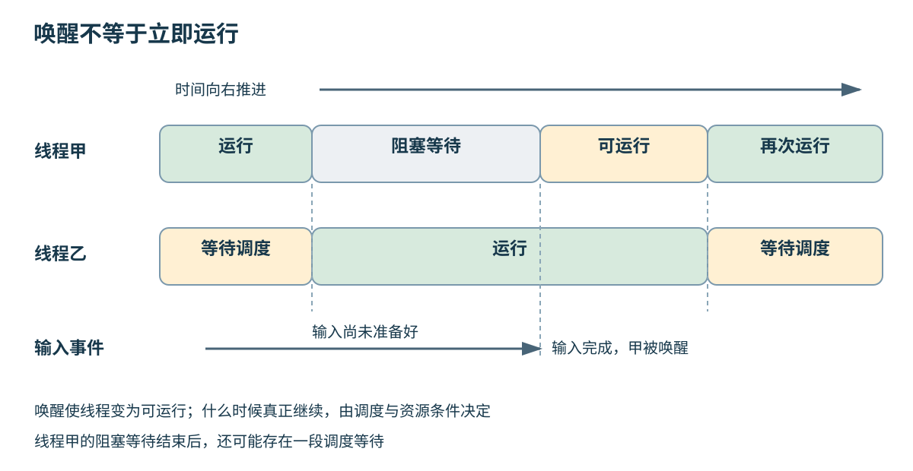
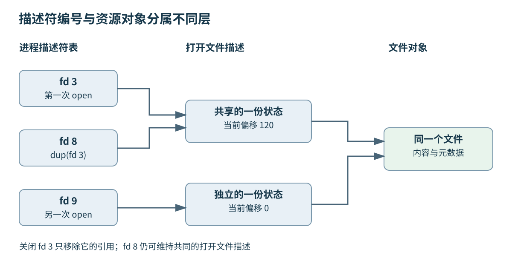
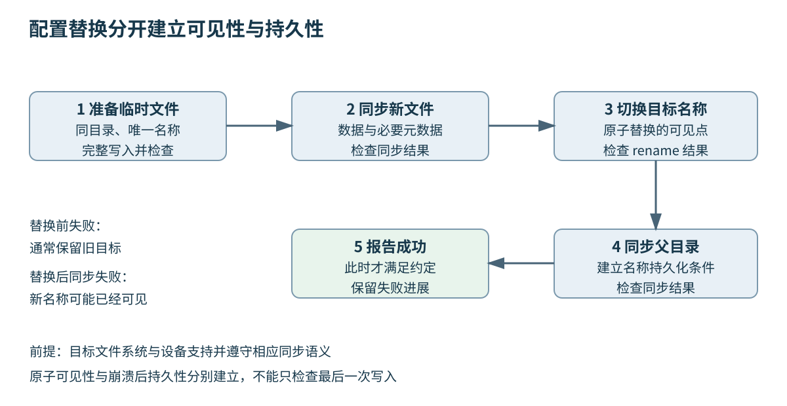

# 第七章 操作系统提供的执行与资源模型

全书正文初稿 · 第二篇 从源码到机器运行 · 2026-10-03

**操作系统**在程序与硬件之间管理执行、存储、设备和访问权限。应用程序不需要自行决定下一毫秒由谁使用处理器，也不需要知道一个文件的内容具体位于哪组存储块；它通过进程、线程、文件和通信接口表达需求，操作系统负责在多个参与者之间落实这些需求及其边界。

这些抽象既提供便利，也规定失败方式。线程已经准备好，不表示立即获得处理器；数据交给内核，不表示接收者已经处理；文件写入返回成功，不表示断电之后仍能恢复。设计可靠系统，必须知道一个接口承诺完成到了哪一步，以及剩余责任属于谁。

第六章解释了程序如何拥有地址空间。本章把它放回完整运行环境：谁在执行，执行时能使用哪些资源，多个执行者如何交换信息，以及资源变化怎样成为可观察、可恢复的结果。主要实例基于 Linux 和 POSIX（可移植操作系统接口规范），Windows 概念单独标明。这里的 I/O 指输入与输出。操作系统内部算法可能随版本变化，接口契约与实现策略在行文中分开讨论。

## 7.1 进程 线程 Scheduler 与 Context Switch

### 7.1.1 进程组织资源 线程表达执行进度

**进程**可以理解为一个受操作系统管理的运行实例，拥有地址空间、资源引用和安全上下文等状态。**线程**是其中一条执行路径，具有自己的指令位置、寄存器状态和调用栈。一个进程可以有多个线程，它们共享部分资源，却分别走到不同的执行位置。

POSIX 线程共享进程地址空间和打开的文件描述符等状态，同时具有各自的线程标识、信号屏蔽字和 `errno` 等线程相关状态。[S1] 共享不意味着每份状态都完全相同，独立调用栈也不意味着栈中的数据天然禁止其他线程访问。只要合法传递地址，另一个线程可以访问仍然有效的对象，正确性取决于生命周期与同步。

Windows 也以进程组织虚拟地址空间与资源，以线程作为可调度的执行实体，同时提供自身的访问令牌、句柄和线程机制。[S2] 两个平台在总体目的上相似，但不能把某个 POSIX 函数的继承和错误语义直接套给 Win32 接口。

“进程是资源分配单位，线程是调度单位”是一句有用的入门概括，却不完整。资源可以跨进程共享，限额可以作用于进程组或容器，Linux 内核还有更细致的任务与共享属性。工程判断应说明具体哪个资源由谁拥有、哪些执行者共享，而不是只给两个名词贴标签。

### 7.1.2 程序文件 运行实例与业务任务不是同一件事

磁盘上的可执行文件是一份程序表示；启动它得到一个运行实例；实例又可能处理很多业务任务。一个图像转换服务可以只有几个工作进程，却同时接受数千个请求；每个请求不需要对应一个新进程或一条长期线程。

业务任务还可以通过线程池、事件循环、协程或其他运行时调度。协程保存的是可恢复的程序状态，不自动增加处理器核心，也不必对应内核线程。一千个等待网络的协程可以由少数内核线程承载；一个执行长时间阻塞调用的协程，也可能阻塞承载它的线程，除非运行时明确提供了其他处理机制。

操作系统看到的可调度实体与应用看到的任务数量因此可能相差很大。分析并发时，应分别记录在途业务请求、用户态任务、内核线程和可用处理器资源。把所有这些都叫“并发数”，容易让容量讨论失去对象。

选择执行模型主要看隔离、阻塞、共享数据与调度成本。多进程加强某些故障和地址空间边界，但通信更显式；多线程共享更方便，也更容易让一个内存错误影响整个进程；事件模型能以较少线程承载大量等待，却要求避免在关键事件线程里执行长时间阻塞工作。

### 7.1.3 可运行与正在运行之间还有排队

一个线程可能正在运行，可能已经具备执行条件但等待处理器，也可能在等待 I/O、锁、定时器或其他事件。**可运行**表示具备被调度的条件；**运行中**表示此刻实际占用执行资源。把两者分开，才能理解为什么线程已经收到通知却仍有明显延迟。

**调度器**从可运行任务中选择接下来执行谁，并结合调度策略、优先级、处理器亲和性和资源控制等条件安排执行。等待事件的线程通常不会因为“优先级很高”就凭空得到尚未准备好的输入；事件完成以后，它也需要重新获得处理器才会继续。

**抢占**意味着当前线程可以在没有主动让出的情况下被暂停，让其他合适的任务运行。线程真正进入阻塞等待后会让出处理器，忙等则继续占用执行机会。如果等待时间很短且资源充足，有限自旋可能降低睡眠唤醒成本；如果等待很长或持锁者无法运行，持续自旋会浪费资源并放大竞争。

睡眠一个时间间隔，也不保证精确在该时刻恢复。定时条件满足之后，还可能有调度延迟。需要周期性工作的程序应以单调时钟建立时间基准，并区分期望触发时刻、实际开始时刻和完成时刻。用每轮“工作后再睡固定时间”的方式，可能把处理时间逐轮累加到周期中。

### 7.1.4 公平性 吞吐与实时性是不同目标

公平调度希望合理分配处理器时间；低延迟希望某些工作尽快响应；高吞吐希望资源持续完成有用任务；实时系统还要在明确条件下满足时间约束。这些目标相关，却不总是一致。给每个任务很短的执行片段可能改善响应，也可能增加切换与缓存成本。

Linux 提供普通调度与不同实时调度策略，具体参数、权限和饥饿风险各不相同。[S3] 提高优先级不等于建立实时保证：任务还可能等待锁、存储、缺页和设备。一个高优先级线程依赖低优先级线程持有的资源时，还会遇到优先级反转问题，需要相应协议和系统支持。

截至 2026-10-03，Linux 官方文档已专门说明 EEVDF（最早合格虚拟截止期优先）公平调度机制，使用可运行任务的服务欠额与虚拟截止期等概念组织选择。[S4] 这不应改写为“Linux 永远使用某一种固定算法”。部署内核的版本、配置和调度类别仍需确认，旧版本资料里的 CFS（完全公平调度器）解释也不应未经核对直接当成当前实现。

面试或设计评审中，重要的是能说明调度决策想优化什么，以及不能保证什么。若需求是某控制回路必须在限定时间内完成，需要分析最坏执行时间、抢占关系、锁协议与外部等待；仅回答“把线程设成最高优先级”没有建立这些条件。

### 7.1.5 上下文切换保存继续执行所需的状态

**上下文切换**是系统从一个执行上下文转到另一个执行上下文的过程。需要保存和恢复的内容可能包括寄存器、栈位置及体系结构相关状态；跨地址空间切换还涉及相应内存上下文。具体成本取决于硬件、操作系统、状态规模和切换后的工作集。

不要把上下文切换与所有用户态到内核态的转换混为一谈。一个线程执行系统调用，进入内核完成工作后马上返回，期间未必换成另一个线程。反过来，线程因等待被挂起，调度器选择其他线程运行，就出现了调度切换。**特权级转换**回答执行权限变了没有，**任务切换**回答谁在执行变了没有。

成本还分直接与间接两部分。保存恢复状态是直接成本；切换后缓存热度下降、转换缓存状态变化和处理器迁移造成的局部性损失，是间接成本。两个短小线程共享热数据，与两个大工作集进程轮流运行，不能用同一个固定纳秒数字概括。

自愿切换与非自愿切换统计有助于提出假设，但不能单独判定问题。大量自愿切换可能来自正常 I/O 等待，也可能来自锁竞争；非自愿切换增加可能意味着处理器争用，也可能是正常的调度行为。必须把切换增量、线程状态与业务耗时联系起来。



图 7-1 阻塞、唤醒与重新运行的教学时序。时间格不代表固定时间片或某种内核算法。

### 7.1.6 线程数量必须服从资源和等待结构

如果工作主要消耗 CPU，线程远多于可用处理器资源，通常只会增加排队与管理成本，而不会使同一时刻可执行的指令无限增长。如果工作经常等待外部事件，增加适量并发可以覆盖等待，但还要受到内存、描述符、连接池与下游容量限制。

一个简单估算是把每项工作的 CPU 时间与等待时间分开。假设教学负载每项需要 2 毫秒 CPU 和 8 毫秒外部等待，允许多项交错可能提高 CPU 利用率；但这个比例并不直接给出安全线程数。等待可能随并发增加而变长，线程可能共享锁，资源域的 CPU 配额也可能小于可见核心数。

亲和性可以限制线程在哪些处理器上执行，有机会改善缓存与 NUMA 局部性，也可能造成不均衡。把一个忙线程固定到拥挤核心，而其他核心空闲，并不自动比自由迁移更好。任何绑核策略都应结合硬件拓扑、资源域约束和实际负载验证。

在服务中，更稳定的起点通常是有界工作队列和有界执行资源。队列满时明确拒绝、降级或向上游施加背压，避免把无限等待变成无限对象和线程。资源边界不应只在“创建线程失败”那一刻才第一次出现。

### 7.1.7 创建 装载 退出与回收组成生命周期

在典型 POSIX 路径中，`fork` 创建子进程，`execve` 用新的程序映像替换当前进程中的程序。`execve` 成功后不返回原调用位置，也不是创建另一个新 PID 的同义词。[S5] 第八章将解释替换之后的二进制装载过程。

多线程进程执行 `fork` 时，子进程只包含调用线程，但继承了当时的地址空间状态。其他线程持有的锁可能以已锁状态留下，而持锁线程在子进程中不存在。按照相应接口约束，子进程在装载新程序之前只能安全调用受限的异步信号安全函数，不能随意记录复杂日志、分配内存或继续运行一般 C++ 业务逻辑。[S6]

进程退出后，部分状态仍需留给父进程读取。父进程通过等待接口取得子进程终止信息并完成相应回收；僵尸进程保留的是这种终止状态，不是仍在后台执行全部业务的进程。[S7] 如果服务持续创建子进程却不回收，进程表相关资源仍可能耗尽。

线程也有对应的完成责任。可连接线程需要由合适的使用者等待完成并回收；分离线程则改变回收方式，但不会让应用自动知道它是否成功。生命周期设计应明确谁创建、谁请求停止、谁等待、谁收集错误，避免用“进程退出时系统会清理”替代运行期间的管理。

### 7.1.8 从低 CPU 利用率回答连续追问

**“服务很慢，CPU 却不忙，为什么？”** 先确定统计范围。线程可能等待网络、锁、磁盘或内存回收，也可能受到资源域配额限制。还可能只有一个串行瓶颈线程满载，而整机平均利用率很低。先检查关键请求路径上的等待位置，再考虑增加线程。

**“上下文切换很多，是不是一定要改成协程？”** 不是。需要知道切换由什么引起，协程是否真的减少相关等待成本。若根因是一个共享锁，把任务换成协程仍可能在同一资源上串行；若根因是大量空闲连接各占线程，事件模型可能更合适。

**“进程隔离能让一个插件崩溃不影响主程序吗？”** 独立地址空间可以限制某些内存破坏的传播，但共享文件、共享内存和外部服务仍是共同故障面。主程序还必须处理插件退出、超时、部分结果和资源回收。隔离提供边界，恢复协议决定边界失效后能否继续工作。

**“实时线程会不会被普通程序影响？”** 仍可能通过共享锁、缓存、内存带宽、中断、设备与内核路径受到影响。实时性需要在明确系统假设下论证，不能从一个优先级字段推出整个请求的最坏完成时间。

## 7.2 系统调用 权限 文件描述符与句柄

### 7.2.1 系统调用跨越受控权限边界

**系统调用**是用户程序请求内核服务的一种受控入口。读取文件、创建映射、等待事件等操作可能需要内核检查参数、权限和资源状态，并执行普通用户代码不能直接完成的动作。它不是任意跳进内核某个函数，而是遵循平台规定的入口与参数约定。

源码中的库函数与系统调用不是一一对应。一个库函数可以只在用户态操作缓冲区，也可以调用一个或多个系统调用；某些服务还可能通过用户态辅助机制完成。Linux 的原始系统调用约定因体系结构而异，日常代码通常通过 libc 等受支持的接口访问。[S8]

进入内核并不会让用户指针自动变得可信。内核必须处理地址无效、权限不足、长度不合理以及调用期间状态变化等情况。对应用开发者而言，传入“看起来有效”的指针也不意味着调用一定成功；内存状态、设备状态和资源限额都可能影响结果。

系统调用有固定路径开销，也可能发生长时间等待。优化时可以合并小操作、减少不必要往返，但必须保留错误处理和事务边界。把一百次写入合成一次，可能改变延迟与失败粒度；不能只按调用次数减少百分比判断整体收益。

### 7.2.2 返回值说明进展 错误码说明限定原因

许多 POSIX 接口以负返回值报告失败并设置 `errno`，但不是所有 API 都遵循这一规则。许多 pthread 函数直接返回错误编号。[S1] 读接口规范比套用“只要失败就看 errno”的模板可靠。

I/O 返回成功还可能只完成一部分。一次写入请求 8192 字节，返回 3000，就表示前 3000 字节已被接口接受；后续需要从正确偏移继续。错误发生在部分进展之后时，上层必须知道已完成多少，不能把整个操作当成完全没发生而盲目重试。

`EINTR` 表示调用受信号影响而中断，但是否自动重启、是否已有进展以及能否直接重试，都要看接口。`EAGAIN` 或 `EWOULDBLOCK` 常用于非阻塞操作当前无法继续的情况，它们通常意味着稍后等待条件变化，不是让同一个线程无休止空转。

错误码也需要上下文。例如“权限不足”可能来自文件权限、安全策略或能力限制；“资源不足”可能来自当前进程限额，也可能来自系统范围。日志应同时保留操作、目标、参数摘要与已完成进度，同时避免泄露机密路径或敏感内容。单独记录一个数字，往往无法支持事后重建。

### 7.2.3 权限检查回答谁能对哪个对象做什么

操作系统的安全上下文描述执行者身份与权限。Linux 进程具有用户与组身份等凭据，访问检查还可能受到 ACL（访问控制列表）、能力、安全模块及挂载选项等影响。[S9] “当前用户名是某个管理员”不是所有操作都可成功的充分条件。

Linux capabilities 把传统超级用户权限拆为较细的能力集合，用于限制进程可以完成的特权操作。[S10] 能力的有效范围还与命名空间和具体检查有关。一个容器内的 root 与主机上拥有全部权限的进程，不能只根据数字用户 ID 相同就视为等价。

**最小权限**要求执行者只持有完成任务需要的权力。一个只读取配置的服务，不需要写入整个系统目录；一个插件只需访问某个已打开对象时，可以考虑传递受限资源引用，而不是给它任意路径访问能力。权限设计与资源生命周期常常是同一问题的两面。

检查与使用之间还可能出现竞态。先用路径检查“这个文件安全”，再用同一路径打开，期间路径可能被替换。安全设计应尽量把检查与取得对象绑定到同一受控操作，并在取得之后核对实际对象，而不是相信一个较早时刻的名称判断。

### 7.2.4 描述符是表项编号 不是文件本身

Linux/POSIX 的**文件描述符**通常是进程描述符表中的一个小整数，用来引用打开的资源。这个资源可以是普通文件、管道、套接字或其他支持相应接口的对象。整数值只在相应进程和有效生命周期中有意义，不是系统范围的永久资源编号。

打开普通文件时，还会建立内核中的 **open file description**，可译为打开文件描述，包含当前文件偏移和状态标志等信息。描述符表项指向它，它再关联实际文件对象。区分这几层，才能理解复制描述符、进程继承与共享偏移。[S11]

假设 `fd1` 通过 `open` 得到，`fd2` 通过 `dup(fd1)` 得到。两者是不同表项，却引用同一个打开文件描述，因此共享文件偏移。通过 `fd1` 读取推进了偏移，随后通过 `fd2` 读取会从新的位置继续。相反，分别调用两次 `open` 打开同一路径，通常会得到独立的打开文件描述及独立偏移。[S12]

描述符标志与打开文件状态标志也不完全位于同一层。例如关闭时机相关的 close-on-exec 属性属于描述符管理，而某些非阻塞状态属于共享的打开文件描述。复制与继承时若只记住“复制了一个整数”，就容易意外改变其他使用者的行为。



图 7-2 描述符、打开文件描述与文件对象。图中名称按 POSIX/Linux 使用，不将 Windows 句柄的全部语义等同于文件描述符。

### 7.2.5 关闭与继承是资源所有权问题

`close` 释放的是某个描述符引用。若其他描述符或进程仍持有相关引用，底层资源未必立即消失；文件映射也有自己的生命周期。描述符编号可以很快被下一次打开复用，因此已经关闭的整数不能继续充当旧资源的有效身份。

这会造成一种危险竞态：线程甲保存着编号 7，线程乙关闭 7，线程丙打开另一资源又得到 7，甲随后对 7 执行关闭或写入，影响的已经是新资源。解决方向是明确独占所有权、借用时长和并发关闭协议，而不是认为“整数没变，所以资源没变”。

Linux 的 `close` 错误处理还有特别边界。除无效描述符等情况外，内核可能在报告后续错误前已释放编号；盲目重试可能关闭已复用的其他资源。因此不能把所有 `EINTR` 都套进同一个重试循环，跨平台代码应按目标平台的关闭语义设计。[S13] Linux man-pages 6.19 还明确指出，Linux 的这一行为与 POSIX.1-2024 对相关 `EINTR` 情形的规定不同。因此规范版本与实际平台都要核对，不能把最新规范文字直接当成所有部署系统已经实现的行为。

新进程装载时继承了不该继承的描述符，可能造成信息暴露或资源一直不释放。Linux 提供在创建时设置 `O_CLOEXEC` 等方式，避免先打开再设置属性之间的多线程竞态。[S11] 子进程确实需要的资源应显式安排，其他引用应尽早关闭。

### 7.2.6 Windows 句柄延续同样的问题意识

**句柄**是 Windows 等接口中常见的间接资源引用。不同种类句柄对应不同对象与关闭方式，并带有访问权限等语义。复制句柄是通过系统接口建立另一个有效引用，不是把数值随意传给另一进程就完成共享。[S14]

这与文件描述符体现了相同的设计思想：把程序可持有的标识与内核对象分开，使权限检查和生命周期可由系统控制。但具体错误返回、可等待状态、继承规则和关闭函数不能互换。`HANDLE`、套接字和其他专用资源还可能要求不同释放接口。

资源包装类因此应按资源种类表达所有权。一个泛化包装器可以接收适当的释放策略，但不能只根据“都是整数或指针大小”就统一调用一个函数。借用句柄与拥有句柄也应明确区分，避免借用方销毁调用者仍需使用的资源。

在跨平台库中，可以把业务契约统一成“打开只读对象”“读取某个范围”“等待完成”，而把不同系统的具体资源保留在实现层。抽象不应抹去重要差异，例如取消是否保证完成、关闭能否报告延迟写入错误、等待是否可以被打断；这些会直接影响上层正确性。

### 7.2.7 路径不是稳定身份

路径解析需要沿目录结构查找，处理符号链接、挂载点和权限。相对路径还依赖当前目录或指定目录对象。[S15] 同一个字符串在不同进程、容器或不同时刻可以指向不同对象；一个对象也可以通过多个名称到达。

对不可信路径，简单删除字符串中的 `..` 并不一定建立安全边界。符号链接、目录替换和挂载关系都可能改变解析结果。Linux 的目录描述符相关接口以及 `openat2` 的解析约束，可以帮助把查找限制到预期范围，但需要按目标内核支持与标志语义使用。[S16]

一个稳健的上传服务可以先持有受控目录的引用，再相对于它创建文件，限制允许的解析行为，并核对实际打开的对象。这样比“拼接一个看起来安全的绝对路径”更容易建立不变量。文件名的业务校验仍然需要做，但它不是全部操作系统安全检查。

路径安全也与资源权限相连。读取者持有一个已打开的只读文件描述符后，路径后来改名通常不会把该引用自动转成另一文件。利用这种稳定引用，可以减少名称变化带来的歧义；但底层文件内容是否允许变化，仍然是另一项需要明确的契约。

### 7.2.8 从描述符泄漏回答连续追问

**“进程内存稳定，为什么仍然无法接受新连接？”** 它可能已经耗尽描述符、连接相关资源或进程限制。资源泄漏不只发生在堆上。需要检查打开资源数量及其类型，特别是异常路径、超时和重复重连是否都释放了责任。

**“两个线程读同一个文件，为什么位置互相影响？”** 如果它们共享同一个打开文件描述，普通基于当前位置的操作会共享偏移。可以考虑显式偏移的读取接口、独立打开或按应用协议协调，但同时更新同一文件内容的逻辑一致性仍须另行处理。

**“调用系统函数成功，为什么业务还是失败？”** 系统函数只完成它声明的那一步。把数据写进管道，不表示消费者已经处理；取得描述符，不表示文件格式合法；启动进程，也不表示服务已经就绪。每一层应有自己明确的成功条件。

**“用 RAII 包装所有资源后，还会泄漏吗？”** RAII 是利用对象生命周期管理资源的方式，名称来自 Resource Acquisition Is Initialization。它能把所有权与对象生命周期关联，但前提是所有权设计正确。引用环、无限缓存、永不结束的对象、错误的借用约定和跨线程关闭，仍可能留下资源。包装机制减少遗漏，不代替对资源何时不再需要的判断。

## 7.3 IPC Signal 共享内存与同步边界

### 7.3.1 进程间通信需要数据通道与控制协议

**IPC** 是 Interprocess Communication，即进程间通信。它使不同地址空间中的参与者交换信息或共同使用某些资源。管道、套接字、消息队列和共享内存都能参与通信，但它们给出的边界、缓冲与失败方式不同。

选择通道之前，先说明消息是什么，谁拥有它，何时算被接收，以及接收者消失后怎么办。一个生产者把消息放入系统缓冲区，只能说明通道接受了相应数据；若业务要求确认处理完成，仍需要应用层应答。确认丢失后是否重试，又涉及重复处理与幂等性。

本机通信也需要协议。消息长度、版本、单位和错误码不会因为两个进程位于同一主机就自动一致。不同进程可能来自不同构建版本，也可能在不同时间重启。第四章的边界检查与格式演进原则，同样适用于 Unix 域套接字和共享内存。

通信中的**控制面**负责建立连接、分配槽位、通知完成与回收资源；**数据面**承载实际内容。两者可以使用不同机制，例如通过套接字协商一个共享区域，再通过通知事件告知新数据已经就绪。分开设计有助于优化，但也增加了需要一致管理的生命周期。

### 7.3.2 管道提供字节流 不是自动分包器

普通管道包含读端与写端，提供有容量限制的字节流。写入者可能因为缓冲区满而等待，读取者可能因为没有数据而等待；非阻塞模式则让相应操作返回当前无法继续的状态。管道没有自动保留应用消息边界的承诺。[S17]

例如发送者写入一段 100 字节记录，接收者一次读取可能只得到部分内容，也可能一次取得多条相邻记录。应用需要固定长度、分隔符或长度字段等分帧规则，并对未收齐的部分保留状态。一次读取的返回长度是本次取得多少字节，不是协议层记录天然有多长。

管道的小写入原子性还容易被误解。`PIPE_BUF` 相关保证用于限制多个写入者的数据交错，不意味着接收者必须用一次读取获得完整记录，也不意味着这个常量就是管道总容量。具体阻塞模式、写入大小与多个写入者共同决定行为。[S17]

结束信号也由引用关系决定。只有所有写端引用都关闭之后，读取者才会在已缓冲数据读完后看到结束。父进程忘记关闭自己不再使用的写端，子进程可能一直等待结束，而真正业务写入者早已退出。诊断这类挂起，应追踪所有继承与复制出来的引用。

### 7.3.3 本地套接字提供更丰富的连接与身份能力

Unix 域套接字服务于同机进程通信，可以采用字节流，也可以采用保留消息边界的适当类型。它还支持传递描述符与凭据信息等辅助数据，具体能力要按平台和套接字类型核对。[S18] 这使它适合把一个已打开资源交给受控的工作进程。

传递描述符并不是发送整数值。接收者得到的是系统为它建立的有效引用，编号可以与发送者不同，仍可能关联同一个打开文件描述。协议应说明接收者是否取得所有权、何时关闭、是否允许进一步转交，以及消息失败时发送者是否继续持有原资源。

身份验证仍然重要。一个可被其他本机用户访问的通信端点，不能仅凭“请求来自本机”就信任内容。路径权限、连接凭据与应用认证各有作用；Linux 的抽象命名空间套接字又不等同于普通文件路径权限模型。实际部署要明确哪一层限制访问。

选择消息型通道可以减少自行处理分帧的工作，却不能省去消息大小上限、版本与部分业务失败。一个完整收到的消息仍可能引用已经过期的共享区域，或者要求执行超过预算的操作。通道完整性与业务合法性必须分别验证。

### 7.3.4 共享内存只建立共同存储

**共享内存**让多个进程把同一底层区域映射进各自地址空间。这样可以减少反复复制大块数据的需要，但参与者仍要协商创建、尺寸、权限、初始化与销毁。POSIX 共享内存通常结合共享内存对象与映射接口使用。[S19]

两边映射起点可以不同，所以共享格式应保存相对于区域起点的偏移或稳定标识，而不是进程内原始指针。一个包含 `std::string` 或普通堆指针的结构体，不能仅通过放入共享映射就成为可跨进程理解的数据结构。内部指针、分配器状态和对象生命周期都可能属于原进程。

共享内容还需要发布协议。生产者写完载荷后，以约定的同步方式宣布记录有效；消费者确认有效后才能读取；消费完成以后，生产者才可复用相关槽位。这三个时刻必须可区分，否则“生产者已经开始覆盖，消费者还在读取”的竞态会破坏数据。

缓存一致性不自动提供这个协议。第五章解释的硬件一致性维持某些存储观察规则，第十七章将解释语言内存模型，但跨进程方案还必须依赖具体平台支持。不能仅凭 `std::atomic` 在某台机器上无锁，就宣称任意 C++ 实现都标准化支持把它放入跨进程共享内存。

### 7.3.5 同步原语必须支持使用范围与故障模型

**互斥量**用于限制某段受保护操作在同一时刻由谁执行；**条件变量**用于在某个谓词尚不成立时等待；**信号量**通过计数协调资源或通知。这些概念不等于某个唯一系统调用，也不保证任何实例都可以跨进程共享。

POSIX 互斥量需要合适的进程共享属性，并位于双方都能访问的共享区域，才能用于相应跨进程场景。[S20] 仅把普通进程内互斥量的字节复制到共享区域，并没有完成正确初始化。初始化本身也要有唯一负责者与发布顺序，避免两个进程同时把同一对象当成未初始化状态。

若持锁进程在修改到一半时崩溃，普通互斥量不会自动修复受保护数据。robust mutex 可以向后续获取者报告持有者死亡，使其有机会检查和恢复一致性；后续获取者仍必须依据业务格式决定怎样恢复，不能把错误码清除当成修复完成。[S21]

因此，跨进程共享结构应先定义故障模型：参与者可能在任意位置退出吗，更新能否通过版本或日志识别，谁负责回收废弃槽位，重启后如何区分旧状态。减少一次复制获得的性能收益，必须与这些恢复责任一起评估。

### 7.3.6 futex 连接用户态状态与内核等待

Linux 的 **futex** 是 fast userspace mutex 的缩写，但它本身不是一个可直接替代所有互斥量的完整高级锁。它提供围绕用户空间整数状态进行等待与唤醒的底层机制，使无竞争路径可以留在用户态，竞争时才请求内核挂起线程。[S22]

其关键思想之一，是把“检查值是否仍为预期”与“进入等待”按接口语义结合起来，避免状态在检查和睡眠之间改变而丢失通知。唤醒只是让等待者有机会重新检查条件，不表示它自动获得应用资源。等待循环仍要重新判断谓词。

自制锁不仅要处理正常竞争，还要处理内存顺序、虚假唤醒、超时、取消、持有者终止和对象销毁。共享地址在等待期间被解除或复用，也会影响正确性。除非有明确需求和完整验证，工程代码通常应使用经过实现与平台适配的同步设施，而不是把几次原子操作和 futex 调用拼成未经证明的新锁。

理解 futex 的价值，是能够解释“没有竞争时互斥量为什么可能没有系统调用”以及“竞争时为什么会看到等待与唤醒”。看到跟踪里出现 futex，也不能直接断言业务正在争用哪一把锁；运行时条件变量、线程等待与其他同步结构都可能使用它。

### 7.3.7 信号处理发生在受限的执行环境中

**信号**是 POSIX 系统向进程或线程报告某类事件的机制。它可以来自外部请求，也可以由当前执行触发，例如某些内存访问故障。信号的处置方式、线程屏蔽字与待处理状态是不同概念；某些信号不能被捕获或忽略。[S23]

异步信号处理函数可能打断正在执行的库函数，而该函数可能正持有内部锁或修改数据结构。因此，一般日志、内存分配和普通互斥操作不能未经核对就在处理函数中调用。**异步信号安全**是比普通线程安全更严格、适用场景不同的要求，必须检查允许函数清单与对象访问限制。[S24]

对正常终止、重载配置等控制事件，一个常见方案是在相关线程中统一屏蔽信号，再由专门线程通过同步等待接口接收，把事件转交给普通程序逻辑。另一类方案利用受支持的事件描述符机制接入事件循环。选哪种方案，都要把线程创建时的屏蔽继承与退出流程设计完整。

普通信号也不是可靠的无限消息队列。同一种标准信号重复到来可能合并，不能把收到次数直接当成业务事件总数。若要传递每条任务和处理结果，应使用适合的消息机制。信号更适合表达“有某种状态值得检查”，具体状态由受控的数据结构保存。

### 7.3.8 一个处理部分写入的函数说明责任边界

下面的函数尝试把给定字节写入阻塞型描述符，并保留失败前已经完成的进度。前提是数据缓冲区在调用期间有效，调用者已按通道类型处理 `SIGPIPE` 策略，且接受该函数可能长时间等待。它不提供超时、取消或应用应答，也不保证多个写入者的消息不交错。

```cpp
// C++20 与 Linux/POSIX 接口示例，未编译、未执行。
#include <unistd.h>
#include <cerrno>
#include <cstddef>
#include <limits>
#include <span>
#include <algorithm>

struct WriteProgress {
    std::size_t accepted = 0;
    int error = 0;
};

WriteProgress write_all_blocking(int fd,
                                std::span<const std::byte> bytes) {
    std::size_t done = 0;
    while (done < bytes.size()) {
        const std::size_t request = std::min(
            bytes.size() - done,
            static_cast<std::size_t>(
                std::numeric_limits<ssize_t>::max()));
        const ssize_t n = ::write(fd, bytes.data() + done, request);
        if (n > 0) {
            done += static_cast<std::size_t>(n);
            continue;
        }
        if (n == -1 && errno == EINTR) {
            continue;
        }
        // 对本例非空请求，零进展作为失败交给上层，避免空转。
        return {done, n == -1 ? errno : EIO};
    }
    return {done, 0};
}
```

这个返回值故意叫 `accepted`，因为写入普通文件可能只到达缓存，写入管道可能只到达内核队列。对方处理完成、事务提交或掉电持久化，都需要更高层的证据。[S25] 错误后把整个消息重新发送，可能重复已经交付的前缀；对于无法继续的流式连接，可能需要关闭并重建状态，或使用能够识别重试的应用协议；仍可继续时，也应从已确认进度出发处理。

**“既然写循环已经补齐了，接收端还要处理半包吗？”** 要。发送端接口调用次数与接收端读取边界没有一一对应关系。**“共享内存是否就没有半包？”** 同样没有这种保证；若缺少发布协议，消费者甚至可能读到更新一半的字段。两种通道需要不同实现，却都需要明确完整性条件。

## 7.4 文件系统 I/O 持久化与资源隔离

### 7.4.1 文件系统把名称 内容与元数据组织起来

**文件系统**管理文件内容、目录关系和相关元数据，使程序能够通过名称或已取得的对象引用访问存储。普通文件的字节内容只是其中一部分；大小、权限、时间戳和链接关系也属于重要状态。在 Linux 常见模型中，inode 记录文件相关元数据，目录项把名称关联到相应对象。[S26]

**硬链接**让多个目录项指向同一文件对象；**符号链接**保存另一个路径，在解析时继续查找。删除一个名字并不总意味着立即销毁对象：如果还有其他硬链接或打开引用，内容可能继续存在。[S27] 这解释了为什么日志文件已经从目录中移除，磁盘空间却还没有按预期释放。

对文件的打开引用与路径更新也不同。程序持续写入一个已打开日志，而运维把该路径改名并创建新文件，程序可能仍在写旧对象。轮转协议需要让程序重新打开或使用双方认可的方式切换，不能只看目录里新文件已经出现就认定所有写入者都更新了目标。

这些区别与第六章的文件映射生命周期一致。内存映射和打开描述符都可能延长对对象的引用；名字是找到对象的入口，不是对象存在的唯一依据。排查磁盘空间与文件更新问题时，应同时看名称关系和仍然活跃的引用。

### 7.4.2 缓冲 I/O 把完成分成多个阶段

应用常常先把数据写入用户态缓冲，例如 C 标准 I/O 或语言流；刷新后再交给内核。内核又可能先把数据放入页缓存，再安排设备写入。设备控制器和存储本身还可能有缓存。每一层的“写完”都需要说明完成到了哪一层。

因此，输出函数返回、用户态刷新成功、系统 `write` 成功与持久化同步成功，不是同一个事件。程序如果只刷新语言运行时缓冲，就不能据此声称断电安全；如果只在退出时关闭文件，也可能在崩溃之前根本没有机会执行那段代码。

缓冲并非错误，它用于合并小写入、提高吞吐并减少设备操作。问题在于应用何时向用户承诺成功。对可重建缓存，允许丢失近期内容可能合理；对已经确认的交易记录，承诺边界通常更严格。业务语义应决定同步策略，而不是反过来让默认缓冲行为决定业务保证。

直接 I/O 也不是通用捷径。它可能绕过某些缓存路径，但通常有对齐、尺寸和文件系统支持条件，并不自动提供事务原子性或全部持久化保证。是否使用，应围绕缓存控制、并发与设备特性设计，不能把“direct”翻译成“所有层都直达稳定介质”。

### 7.4.3 阻塞 非阻塞 就绪与完成要分开

**阻塞 I/O**允许调用在条件尚未满足时等待；**非阻塞 I/O**让调用及时返回当前能完成的进度或暂时无法继续的状态。**就绪通知**说明某种操作此时有机会取得进展；**完成通知**报告已经提交的操作结果。这些维度不能仅用“同步还是异步”两个词含混代替。

Linux `epoll` 关注描述符的就绪事件。可读通知并不保证一次就能读出完整业务记录；读取之后仍要处理实际返回值。边缘触发模式通常要求使用非阻塞接口并持续处理到暂时无数据等条件，否则可能留下未处理内容却等不到预期的新边缘。[S28]

异步提交接口把提交与取得完成结果分开，但不必承诺内部完全没有工作线程。例如 POSIX AIO 的实际实现路径需要按库与系统核对。[S29] 应用观察到异步 API，只能知道调用约定，不能据此猜测所有设备工作都由某种统一硬件机制完成。

不论哪一种模型，都要跟踪缓冲区何时可以复用。若操作仍在使用缓冲区，提前释放或覆盖会导致错误。取消请求也未必意味着操作从未发生或缓冲区已经可回收；必须等待接口定义的终态。异步 I/O 的复杂性主要来自多个生命周期同时展开，而不只是多一个回调函数。

### 7.4.4 持久化同步与原子可见性是两种保证

Linux 的 `fsync` 用于同步文件内容及相关元数据，`fdatasync` 对非必要元数据有不同要求。同步文件本身，不自动保证包含它的目录项已经持久化；在需要保证名称变化时，还可能需要同步相应目录。[S30] 同步调用本身也必须检查错误。

**原子可见性**回答并发观察者是否会看到半完成的替换；**持久性**回答系统崩溃或掉电之后能够恢复什么。`rename` 在其适用条件下可以提供名称替换的原子性，但不因此独立完成数据和目录的持久化，也不把跨文件系统移动变成同样的原子操作。[S31]

Windows 提供 `FlushFileBuffers` 等对应同步能力，具体句柄类型、打开方式与文件系统仍影响语义。[S32] 跨平台库应把“需要稳定保存”作为清楚的契约，再分别实现与验证，而不是把某个 Linux 函数名替换成另一平台的近似名称便认为语义完全相同。

还必须声明故障边界。进程崩溃、操作系统崩溃、突然断电、设备故障和存储系统虚假报告完成，是不同情形。文件系统与设备提供的保证有边界；应用需要选择能够满足故障模型的设施，并通过故障测试验证恢复过程。普通成功路径测试不会自动覆盖这些问题。

### 7.4.5 安全更新一个配置文件的推理过程

设目标是替换一个小型配置文件，读者应看到完整旧版本或完整新版本，成功报告后还要求相应内容和名称在支持这些同步语义的本地文件系统上具有预期持久性。一个常见设计是在同一目录中创建唯一临时文件，完整写入内容并检查进度，设置所需元数据，同步临时文件，再原子替换目标名称，最后同步父目录。

这些步骤各自排除不同风险。先写临时文件，避免读者看到正在改写的目标；同步临时文件，使后续名称切换不会只指向尚未完成相应同步的内容；同目录替换避免无意跨文件系统；同步目录处理名称变化的持久化。创建临时文件还要避免名称碰撞和不可信参与者抢占，不能使用可预测文件名然后盲目覆盖。

错误处理应保留操作进展。替换之前失败，通常可以保留旧目标并清理临时文件；替换成功、目录同步失败时，新名字可能已经可见，但崩溃后保证尚未建立。此时不能向调用者说“什么都没改变”，也不能盲目重做一次并把所有结果合并成成功。

这个流程仍有前提：文件系统和设备遵守相关契约，目录同步受支持，目标权限、所有权及其他元数据已经被明确考虑。它不是适用于任意网络文件系统的无条件事务，也不能同时原子替换多个互相依赖文件。若配置由多文件组成，应考虑清单版本、目录切换或专门事务机制。



图 7-3 文件原子替换与持久化的不同阶段。图示为有明确文件系统前提的设计协议，未实际执行。

### 7.4.6 日志与校验让恢复状态可判断

如果应用需要在文件中连续追加记录，崩溃可能留下未完整写入的尾部。记录格式可以包含长度、版本、序号和校验信息，使恢复过程有依据地区分完整记录与可忽略尾部。校验帮助检测损坏，不自动决定遇到损坏后应该保留哪些业务结果。

**日志协议**的作用，是让某些中间状态也能够被解释。先记录准备，再执行更新，最后记录提交，与只写一个最终对象具有不同恢复能力；具体顺序还必须与同步边界结合。写出了“commit”几个字节，并不等于这些字节和它所依赖的内容已按正确顺序稳定保存。

恢复需要幂等性。重放同一条记录两次不应意外重复扣款或重复发布结果，或者系统必须能够识别它已经应用。序号与唯一业务标识可以帮助建立这个条件，但必须考虑重启、截断与版本变化后的含义。数据库章节会进一步讨论事务与日志，本章先明确操作系统接口没有替应用完成这套协议。

故障测试应覆盖每个关键步骤之间的中断，而不只是函数入口和成功返回。测试可以在隔离环境中模拟进程终止、写入错误与恢复路径；本章没有执行这些测试，所有时序图都是设计说明。发布时应记录实际验证的文件系统、挂载配置与存储环境，避免把局部证据扩展成无限保证。

### 7.4.7 命名空间与资源控制解决不同问题

Linux **命名空间**改变一组进程看到的某类系统资源视图，例如进程编号、挂载关系或网络环境。[S33] **cgroup** 则提供资源归组、计费与控制能力，例如 CPU、内存、进程数量与 I/O 的相关限制。[S34] 二者经常共同用于部署容器，但不是彼此替代品。

看不见其他进程，不等于已经限制了本进程的 CPU 或内存；有资源上限，也不等于文件与网络访问已经充分隔离。完整隔离还会涉及用户身份、能力、安全策略与系统调用约束等机制。一个容器共享宿主机内核的典型事实，也使其安全边界与独立虚拟机不同。

CPU 配额尤其容易造成统计误解。容器可能看见多个处理器，却只被允许在一定窗口内消耗有限 CPU 时间；可运行线程达到配额后受到节制，主机整体仍可能空闲。线程池若只根据可见逻辑 CPU 数扩张，就可能在有限预算中制造更多竞争与尾延迟。

资源控制还存在层级关系。子域的配置不能脱离父域理解；服务的一次异常增长可能首先碰到上层总预算。第六章已经说明内存限额，本章把同一思路扩展到 CPU、描述符、线程与 I/O：每种资源都要知道计费边界、上限、等待或失败行为，以及谁负责作出业务层降级。

### 7.4.8 限额是正常接口的一部分

进程可用的描述符、地址空间、栈、CPU 时间等资源可能受限制。Linux `getrlimit` 等接口描述了相关软硬限制及不同资源的具体规则。[S35] 创建失败不总意味着操作系统损坏，可能只是程序到达了事先配置的边界。

应用应在设计时为资源耗尽定义路径。连接达到上限时怎样拒绝新请求，日志写入失败时是否继续服务，磁盘满时怎样保留恢复信息，线程创建失败时是否降低并发，都应有明确策略。错误路径本身也要避免再申请大量同类资源，否则在资源最紧张时反而最容易失效。

例如一个服务在描述符耗尽后尝试打开新日志文件记录错误，这条记录也可能失败。更稳健的观测方案会提前建立必要通道，并限制错误风暴带来的额外工作。这里的原则不是“所有资源永久预留”，而是识别故障期间仍必须可用的最小设施，并验证它们的余量。

资源限额还可以帮助及时暴露增长问题。如果没有边界，一个缓存泄漏可能慢慢影响整台机器；有合理边界和告警，故障更有机会局限于单个服务。限额不能修复泄漏，但能成为控制故障影响与提供诊断证据的一部分。

### 7.4.9 一个上传服务故障如何跨越四个层次

考虑一个上传服务在高峰期同时出现“请求超时、CPU 不高、偶尔文件缺失”。先不要把三个现象强行归为同一原因。执行层可能有大量工作线程阻塞在文件写入；资源层可能达到描述符或 I/O 限额；持久化层则可能在名称切换后、目录同步前就报告成功。

先固定一条请求的阶段时间：接收完成、进入工作队列、开始写入、内容同步完成、名称替换、目录同步与业务响应。队列等待占主要部分，说明增加同步调用速度未必是首要问题；文件写入本身慢，则要对照设备与资源域；响应早于要求的持久化点，则属于成功条件设计错误，即使平均性能很好也必须修正。

再看资源随并发增长的方式。每个请求保留一个连接、一个临时文件和一个缓冲区时，在途请求数同时放大三种资源。下游磁盘慢使请求完成变慢，上游仍无限接收，就会把存储瓶颈转化为描述符与内存耗尽。给入口施加背压、限制在途写入，并在超时后正确回收临时资源，比单独把线程池翻倍更合理。

最后验证恢复。服务在每个持久化边界附近退出后，重启应能够区分未提交临时文件与已发布文件，不把残留临时对象当成成功上传。测试还要检查客户端重试是否产生重复文件或覆盖错误目标。操作系统提供原语，业务系统负责把这些原语组合成可以解释的状态机。

### 7.4.10 从成功返回回答连续追问

**“write 成功，断电为什么还会丢？”** 因为写入返回可能只表示数据被当前接口接受，没有跨过业务要求的持久化边界。应检查用户态缓冲、文件同步、目录同步与设备保证，而不是只看最后一次写入的返回值。

**“rename 是原子的，为什么还要同步？”** 原子性主要限制并发可见的中间状态，持久性处理崩溃后恢复。一个名称切换可以对当前读者原子可见，却仍需要相关同步才能获得要求的崩溃恢复保证。

**“共享内存最快，为什么不把所有通信都改成它？”** 复制成本可能降低，但发布、版本、回收、持有者崩溃与跨进程同步的责任会增加。只有数据量、访问模式和故障模型支持这个取舍，复杂性才值得承担。控制消息通常没有必要为极少量字节引入复杂共享结构。

**“有容器隔离，为什么邻居服务仍会影响我？”** 隔离机制分别覆盖可见性、权限与资源预算；共享内核、设备、缓存和带宽仍可能形成联系。应检查实际启用的控制及其层级，不能从“运行在容器里”这一标签推出所有资源都已独占。

可靠程序并不需要重写操作系统，但必须准确理解它的承诺范围：线程获得的是执行机会，描述符获得的是有效资源引用，通信接口完成的是限定层次的数据传递，同步接口提供的是有前提的稳定存储保证。把这些边界写进资源所有权、错误返回和恢复流程，系统行为才会在高负载与故障时仍然可解释。

## 参考资料

以下一手资料核验于 2026-10-03。系统调用与库接口按 Linux/POSIX 使用，Windows 条目单独标记；内核调度策略与资源控制细节需对应实际部署版本。所有案例数据、代码和时序均未作为实测结果呈现。

- [S1] Linux man-pages，[pthreads(7)](https://man7.org/linux/man-pages/man7/pthreads.7.html)
- [S2] Microsoft Learn，[Processes and Threads](https://learn.microsoft.com/en-us/windows/win32/procthread/processes-and-threads)
- [S3] Linux man-pages，[sched(7)](https://man7.org/linux/man-pages/man7/sched.7.html)
- [S4] Linux kernel documentation，[EEVDF Scheduler](https://docs.kernel.org/scheduler/sched-eevdf.html)
- [S5] Linux man-pages，[execve(2)](https://man7.org/linux/man-pages/man2/execve.2.html)
- [S6] Linux man-pages，[fork(2)](https://man7.org/linux/man-pages/man2/fork.2.html)
- [S7] Linux man-pages，[wait(2)](https://man7.org/linux/man-pages/man2/wait.2.html)
- [S8] Linux man-pages，[syscall(2)](https://man7.org/linux/man-pages/man2/syscall.2.html)
- [S9] Linux man-pages，[credentials(7)](https://man7.org/linux/man-pages/man7/credentials.7.html)
- [S10] Linux man-pages，[capabilities(7)](https://man7.org/linux/man-pages/man7/capabilities.7.html)
- [S11] Linux man-pages，[open(2)](https://man7.org/linux/man-pages/man2/open.2.html)
- [S12] Linux man-pages，[dup(2)](https://man7.org/linux/man-pages/man2/dup.2.html)
- [S13] Linux man-pages，[close(2)](https://man7.org/linux/man-pages/man2/close.2.html)
- [S14] Microsoft Learn，[Kernel Objects](https://learn.microsoft.com/en-us/windows/win32/sysinfo/kernel-objects)
- [S15] Linux man-pages，[path_resolution(7)](https://man7.org/linux/man-pages/man7/path_resolution.7.html)
- [S16] Linux man-pages，[openat2(2)](https://man7.org/linux/man-pages/man2/openat2.2.html)
- [S17] Linux man-pages，[pipe(7)](https://man7.org/linux/man-pages/man7/pipe.7.html)
- [S18] Linux man-pages，[unix(7)](https://man7.org/linux/man-pages/man7/unix.7.html)
- [S19] Linux man-pages，[shm_overview(7)](https://man7.org/linux/man-pages/man7/shm_overview.7.html)
- [S20] Linux man-pages，[pthread_mutexattr_setpshared(3)](https://man7.org/linux/man-pages/man3/pthread_mutexattr_setpshared.3.html)
- [S21] Linux man-pages，[pthread_mutexattr_setrobust(3)](https://man7.org/linux/man-pages/man3/pthread_mutexattr_setrobust.3.html)
- [S22] Linux man-pages，[futex(2)](https://man7.org/linux/man-pages/man2/futex.2.html)
- [S23] Linux man-pages，[signal(7)](https://man7.org/linux/man-pages/man7/signal.7.html)
- [S24] Linux man-pages，[signal-safety(7)](https://man7.org/linux/man-pages/man7/signal-safety.7.html)
- [S25] Linux man-pages，[write(2)](https://man7.org/linux/man-pages/man2/write.2.html)
- [S26] Linux man-pages，[inode(7)](https://man7.org/linux/man-pages/man7/inode.7.html)
- [S27] Linux man-pages，[unlink(2)](https://man7.org/linux/man-pages/man2/unlink.2.html)
- [S28] Linux man-pages，[epoll(7)](https://man7.org/linux/man-pages/man7/epoll.7.html)
- [S29] Linux man-pages，[aio(7)](https://man7.org/linux/man-pages/man7/aio.7.html)
- [S30] Linux man-pages，[fsync(2)](https://man7.org/linux/man-pages/man2/fsync.2.html)
- [S31] Linux man-pages，[rename(2)](https://man7.org/linux/man-pages/man2/rename.2.html)
- [S32] Microsoft Learn，[FlushFileBuffers](https://learn.microsoft.com/en-us/windows/win32/api/fileapi/nf-fileapi-flushfilebuffers)
- [S33] Linux man-pages，[namespaces(7)](https://man7.org/linux/man-pages/man7/namespaces.7.html)
- [S34] Linux kernel documentation，[Control Group v2](https://docs.kernel.org/admin-guide/cgroup-v2.html)
- [S35] Linux man-pages，[getrlimit(2)](https://man7.org/linux/man-pages/man2/getrlimit.2.html)

[S1]: https://man7.org/linux/man-pages/man7/pthreads.7.html
[S2]: https://learn.microsoft.com/en-us/windows/win32/procthread/processes-and-threads
[S3]: https://man7.org/linux/man-pages/man7/sched.7.html
[S4]: https://docs.kernel.org/scheduler/sched-eevdf.html
[S5]: https://man7.org/linux/man-pages/man2/execve.2.html
[S6]: https://man7.org/linux/man-pages/man2/fork.2.html
[S7]: https://man7.org/linux/man-pages/man2/wait.2.html
[S8]: https://man7.org/linux/man-pages/man2/syscall.2.html
[S9]: https://man7.org/linux/man-pages/man7/credentials.7.html
[S10]: https://man7.org/linux/man-pages/man7/capabilities.7.html
[S11]: https://man7.org/linux/man-pages/man2/open.2.html
[S12]: https://man7.org/linux/man-pages/man2/dup.2.html
[S13]: https://man7.org/linux/man-pages/man2/close.2.html
[S14]: https://learn.microsoft.com/en-us/windows/win32/sysinfo/kernel-objects
[S15]: https://man7.org/linux/man-pages/man7/path_resolution.7.html
[S16]: https://man7.org/linux/man-pages/man2/openat2.2.html
[S17]: https://man7.org/linux/man-pages/man7/pipe.7.html
[S18]: https://man7.org/linux/man-pages/man7/unix.7.html
[S19]: https://man7.org/linux/man-pages/man7/shm_overview.7.html
[S20]: https://man7.org/linux/man-pages/man3/pthread_mutexattr_setpshared.3.html
[S21]: https://man7.org/linux/man-pages/man3/pthread_mutexattr_setrobust.3.html
[S22]: https://man7.org/linux/man-pages/man2/futex.2.html
[S23]: https://man7.org/linux/man-pages/man7/signal.7.html
[S24]: https://man7.org/linux/man-pages/man7/signal-safety.7.html
[S25]: https://man7.org/linux/man-pages/man2/write.2.html
[S26]: https://man7.org/linux/man-pages/man7/inode.7.html
[S27]: https://man7.org/linux/man-pages/man2/unlink.2.html
[S28]: https://man7.org/linux/man-pages/man7/epoll.7.html
[S29]: https://man7.org/linux/man-pages/man7/aio.7.html
[S30]: https://man7.org/linux/man-pages/man2/fsync.2.html
[S31]: https://man7.org/linux/man-pages/man2/rename.2.html
[S32]: https://learn.microsoft.com/en-us/windows/win32/api/fileapi/nf-fileapi-flushfilebuffers
[S33]: https://man7.org/linux/man-pages/man7/namespaces.7.html
[S34]: https://docs.kernel.org/admin-guide/cgroup-v2.html
[S35]: https://man7.org/linux/man-pages/man2/getrlimit.2.html
