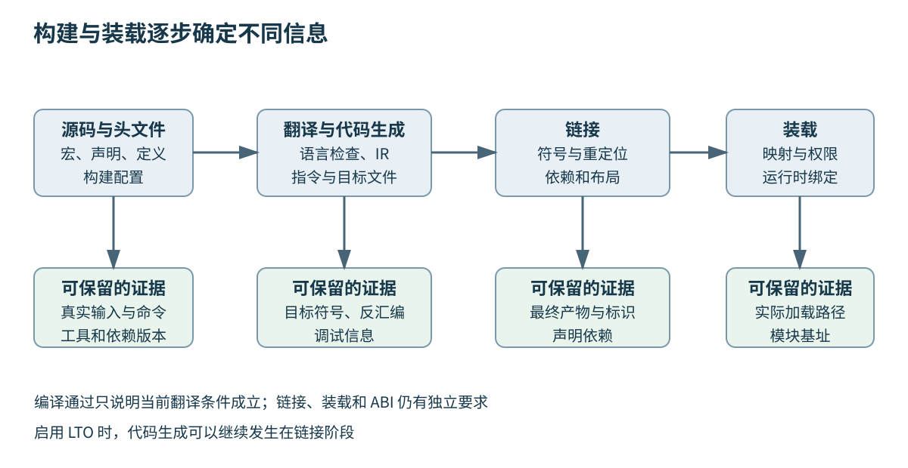
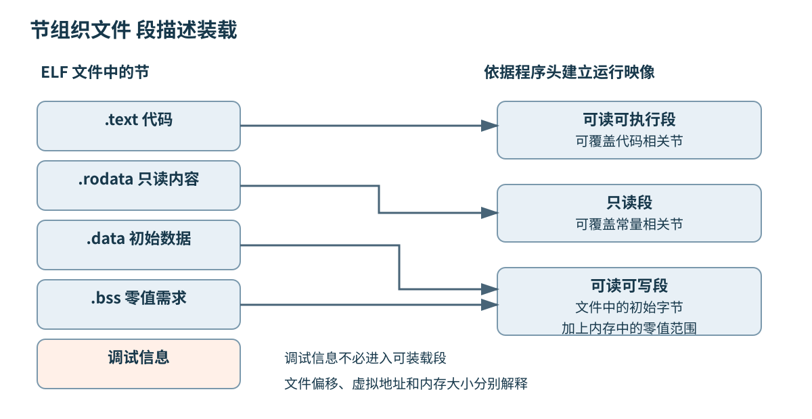
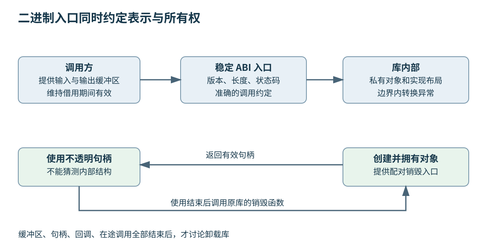

# 第八章 编译链接装载与二进制边界

全书正文初稿 · 第二篇 从源码到机器运行 · 2026-10-03

源文件描述程序希望执行的计算，处理器执行的却是机器指令。二者之间经过语言检查、代码生成、符号组合和运行环境准备。每一阶段掌握的信息不同，也能发现不同错误：编译器可能知道一个调用的参数类型，却不知道实现来自哪个库；链接器可能找到了同名符号，却没有证明调用双方理解同一种对象布局。

**API** 是源代码层面的应用程序接口，例如函数声明、类型和可调用操作；**ABI** 是应用二进制接口，规定已经编译的模块怎样交换参数、返回值和对象，以及如何识别符号和组织运行时状态。源代码还能重新编译，与旧二进制可以直接装载，是两种不同的兼容要求。

本章把一段程序从源码连接到进程映像，并沿途解释三类常见故障：构建阶段找不到实现，部署阶段找不到或装错依赖，模块调用时违反二进制契约。示例以 C++20 为语言基线；ELF 主要结合 Linux，PE/COFF 与 Microsoft x64 规则单独说明。工具选项、运行时和 ABI 扩展均以 2026-10-03 核验的一手资料为边界，不把一套平台惯例写成 C++ 语言的普遍保证。

## 8.1 从源码到可执行文件 编译 汇编与目标文件

### 8.1.1 构建链路是信息逐步确定的过程

典型本机编译链路包含预处理、编译、汇编和链接，之后由操作系统与装载器建立运行映像。**编译器驱动程序**负责按选项组织相关工具；命令名是 `c++` 或 `clang++`，不表示全部工作一定在一个独立“编译器步骤”里完成。[S1]、[S2]

预处理决定参与本次翻译的源文本，编译阶段检查语言规则并产生较低层表示，汇编阶段把指令与指示转换成目标格式，链接阶段组合多个输入并处理相互引用。现代工具链可以把部分步骤集成在同一个进程内，也可以在链接阶段继续进行代码生成。教学分层解释职责，不要求磁盘上必须出现每一种中间文件。

每个阶段都需要上下文。源文件内容相同，但头文件版本、宏定义、目标架构或优化选项不同，结果仍可能不同。构建输入不能只记录一组 `.cpp`；还包括生成代码、工具版本、标准库、链接脚本与关键环境配置。

所以，“在我机器上编译通过”提供的证据很有限。要复现问题，至少需要知道实际编译命令、目标平台、依赖版本与产物身份。第二十一章会讨论构建系统，本章先解释这些信息为什么会进入最终二进制，而不是把构建当成黑盒按钮。



图 8-1 从源码到运行映像的职责分层。实际工具可以集成步骤，启用链接时优化后，代码生成还可能延伸到链接阶段。

### 8.1.2 翻译单元是独立检查的重要边界

**翻译单元**是语言实现进行翻译时的一项基本输入。在常见头文件模型下，可以近似理解为一个源文件加上经过包含与条件处理得到的内容。两个 `.cpp` 分别编译时，不会自动互相读取对方的函数体；它们通过共同声明表达将来可以组合的契约。

头文件不是因为后缀叫 `.h` 就获得特殊链接能力。声明使编译器知道某个实体的类型与使用方式，定义提供需要的实体内容或实现。把函数声明放入头文件，可以让多个翻译单元采用一致接口；相应实现仍需进入最终链接输入。

条件编译会让“同一个头文件”产生不同结果。若一个宏在模块甲中加入某个成员，在模块乙中没有加入，双方可能各自通过编译，却对同名类型得到不同布局。问题不只是 include 路径错误，而是构建配置改变了双方共享的语言契约。

C++20 模块为声明组织与可达性提供了另一套机制，但没有消除目标平台、ABI 和链接责任。模块接口的编译产物还与工具链格式和构建依赖有关，不能当成通用、跨编译器、跨版本稳定的二进制交换文件。采用模块可以改善某些源码组织问题，却不是自动获得 ABI 稳定的捷径。

### 8.1.3 预处理改变参与编译的内容

预处理处理文件包含、宏替换与条件编译等内容。[S3] 它发生在后续语言分析所使用的输入形成过程中，因此宏可能改变一个表达式，也可能改变整个声明是否存在。调试宏相关问题时，查看预处理结果通常比只看原始源文件更直接。

例如平台头文件根据配置把一个类型别名定义成不同底层类型。调用位置看起来完全一样，实际编译器看到的参数宽度却已经不同。又如某个头文件被同名旧副本遮蔽，编辑器跳转到新声明，构建实际包含的却是旧声明。判断应以真实构建命令与预处理输入为准。

头文件防重复包含只能防止同一翻译单元中重复展开相应内容，并不意味着整个程序只会得到一个定义。把普通外部变量定义放在有 include guard 的头文件里，两个 `.cpp` 仍可能各自产生一份定义。链接和单一定义规则需要独立处理。

宏也不遵循普通变量的作用域与类型检查方式。能够用常量、函数或模板表达的接口，通常更容易检查；确实用于平台配置时，应把影响 ABI 的宏集中管理，并把它们纳入产物兼容条件。一个未记录的构建宏，足以让“同版本头文件”失去原本期待的意义。

### 8.1.4 编译器检查语义并形成中间表示

编译器前端处理语法、名称查找、类型与模板相关规则，再形成便于后续分析和转换的表示。**IR** 在这里指 Intermediate Representation，即中间表示。它可以把高级语言结构转成更明确的控制流、数据依赖与操作，供优化和目标代码生成使用。

LLVM IR 是一种具体工具链的表示，具有自己的类型、指令和语义约束。[S4] 它不是“尚未加地址的通用汇编”，也不保证任意版本、任意目标的 IR 可以无限互换。其他编译器还有不同中间表示，不能把一个项目的术语当成全部编译器内部都相同。

优化依赖语言允许的行为。常量传播、死代码删除、循环变换和内联，都必须在相应规则下保留程序所要求的可观察行为。未定义行为会破坏程序员据以推理的前提；调试构建中碰巧出现的指令序列，不能成为发布构建必须保留的契约。

“源代码有一次调用”也不保证二进制有一次调用指令。函数可能被内联，结果可能被预先算出，无用计算可能被删除。第五章讨论处理器性能时已经强调，要区分源表达式、最终机器码与实际运行，编译阶段正是其中的重要转换边界。

### 8.1.5 代码生成面对寄存器与目标约束

后端把较低层表示映射到目标机器：选择指令，安排寄存器，必要时把值暂存到栈，并遵守调用约定。目标 CPU 支持哪些指令、允许哪些对齐、采用哪种数据模型，都会影响结果。使用本机最激进指令选项构建的程序，未必能在较旧机器上运行。

**汇编语言**是机器指令和相关控制信息的人类可读表示，但一行汇编不总是一个固定大小的指令，也不是所有行都会变成执行指令。段切换、对齐、符号声明与调试指示都可能出现在汇编文件中。汇编器据此生成目标文件并记录尚不能确定的关系。[S5]

现代编译器可以使用集成汇编器，直接从内部表示生成目标文件，不必先落盘一份 `.s`。要求输出汇编是观察手段，不是程序必须经过某个可见文本文件的证明。反汇编又是从机器码解释指令，两者在注释、标签与原始结构上不会完全等价。

分析一个性能变化时，最终链接产物往往比单个源文件的汇编输出更可靠。链接时优化、符号可见性和链接器松弛可能继续改变代码。中间汇编可以定位局部决策，但不能未经比较就当成生产环境正在执行的全部事实。

### 8.1.6 目标文件保存代码 也保存尚待完成的关系

**目标文件**通常包含机器代码、数据、符号表、重定位信息以及可选调试信息。它不是必须能够直接运行的小程序，而是供后续链接或装载处理的结构化输入。ELF 是 Executable and Linkable Format，即可执行与可链接格式；它可以表示多种文件角色，而不只表示 Linux 可执行程序。[S6]

**节**，即 section，把用途相近的内容组织起来，例如代码、只读数据、可写数据、符号或调试信息。常见名称 `.text`、`.rodata`、`.data` 与 `.bss` 反映惯例，但名称不是语言标准规定的对象分类。编译选项和链接脚本都可能改变组织。

**符号**为函数、对象或其他位置提供链接层可识别的名字与属性。**重定位项**则记录“某个位置的值需要依据某个符号或基址进一步计算”。一个调用可以在目标文件里已经有指令形式，却仍需要链接器为其中的地址相关部分确定最终值。[S7]、[S8]

由此可以解释为什么单文件编译通过，链接仍会失败。编译器已经确认“这里调用的函数有某个声明”，目标文件把尚未找到定义的引用记录下来；链接器组合输入后仍找不到满足条件的定义，才会报告未解析引用。错误发生在不同阶段，要求的证据也不同。

### 8.1.7 一个三文件例子展示声明如何变成引用

下面三段分别是一个头文件、实现文件和调用文件，采用 C++20。函数把负值截为零，不产生整数溢出；它只用于观察构建关系，不是性能基准。三个文件均未编译、未执行。

```cpp
// clamp.h，C++20 头文件，未编译、未执行。
#ifndef ATLAS_CLAMP_H
#define ATLAS_CLAMP_H
int clamp_nonnegative(int value) noexcept;
#endif
```

```cpp
// clamp.cpp，C++20 翻译单元，未编译、未执行。
#include "clamp.h"
int clamp_nonnegative(int value) noexcept {
    return value < 0 ? 0 : value;
}
```

```cpp
// main.cpp，C++20 翻译单元，未编译、未执行。
#include "clamp.h"
int main() {
    return clamp_nonnegative(-3);
}
```

在普通分离编译模型下，调用单元知道函数类型，但看不到实现体；实现单元提供相应定义。下面是 GNU 风格工具链的观察命令示例，各行均未执行，也没有生成或运行示例产物。实际工具安装名和选项支持应在目标环境核对。[S1]

```sh
# 全部未执行；假设当前目录包含上述三个文件。
c++ -std=c++20 -O2 -E clamp.cpp -o clamp.ii
c++ -std=c++20 -O2 -S clamp.cpp -o clamp.s
c++ -std=c++20 -O2 -c clamp.cpp -o clamp.o
c++ -std=c++20 -O2 -c main.cpp -o main.o
c++ main.o clamp.o -o clamp_demo
```

这些命令不是必须顺序消费前一行产物：前三行分别从同一源文件停在不同观察点。最后一行将两个目标文件组合成程序。若故意省略 `clamp.o`，一般会在链接时缺少相应定义；启用其他优化或提供另外的库时，具体表现还要看实际输入，不能把本段当作已经捕获的工具输出。

### 8.1.8 用失败阶段缩小问题范围

编译时“找不到头文件”，先检查包含路径、生成步骤与依赖可用性；名称或类型错误，检查编译器实际看见的声明与语言版本；汇编阶段不认识指令，检查目标架构和汇编器能力。它们都不应该先通过随意增加链接库来解决。

链接时找不到符号，检查定义是否生成、是否进入输入、名字和属性是否匹配；程序启动时找不到库，检查运行时依赖与搜索路径；启动成功但调用崩溃，则继续核对 ABI、对象生命周期与版本契约。阶段划分能减少无关试错，但不能把所有崩溃都自动归因 ABI。

**“头文件里已经有声明，为什么还缺实现？”** 声明使编译器能够检查使用，不能凭空生成一个未提供的函数体。**“有目标文件，为什么还不能运行？”** 因为它可能仍包含待解析引用，也没有完整运行映像所需的组织与入口条件。

**“同一份源码重新构建，为什么问题消失？”** 重构建可能改变旧目标、头文件依赖、宏、工具和链接顺序。消失只说明某个输入状态变化了，尚未确定根因。保存原产物和构建信息，才能解释差异，而不是把删除整个目录当成唯一诊断方法。

## 8.2 符号 链接 ODR 动静态库与 LTO

### 8.2.1 符号解析把引用连接到定义

**链接**将多个输入中的内容组织成输出，并把符号引用连接到相应定义。一个符号可能在本文件定义，也可能标记为需要其他输入提供；还可能具有局部、全局、弱绑定及可见性属性。ELF 的符号表为这些信息规定了具体表示。[S7]

语言中的“这个名字能在何处表示同一实体”，与文件格式中的符号绑定相关，却不能直接画等号。C++ 的内部、外部和模块链接是语言规则；ELF 的 local、global、weak 是具体格式与工具链的表达方式。调试时需要先判断语言上期待的实体是什么，再看实现如何编码。

如果两个目标都定义了一个不允许重复的普通全局符号，链接器通常会报告多重定义。若一个引用没有可用定义，通常报告未解析引用。弱符号、可合并节与动态符号查找规则使实际情况更丰富，所以不能把“链接器没报错”当成整个程序满足所有语言规则的证明。

链接器还会根据输入关系决定内容布局，并可能丢弃未使用内容、合并适当内容或改写某些地址形式。这些功能解释了为什么同一组源代码在不同链接选项下体积不同，也解释了为什么通过静态初始化注册功能时，相关目标若未被选入，注册动作可能根本不存在。

### 8.2.2 名称修饰使重载能够出现在链接层

C++ 允许同一名字对应不同参数类型的函数，也有命名空间、模板与成员函数。链接层需要某种方式区分相关实体。**名称修饰**或 name mangling 按 ABI 规则把这些信息编码为符号名；**反修饰**或 demangling 则把名字转回较可读的形式。

具体编码由 ABI 与工具链规定。Itanium C++ ABI 描述了某套被多个非 Itanium 平台工具链采用的 C++ 名称与对象规则，名字中的 Itanium 不表示它只用于这种处理器；Microsoft 的 decorated names 又有自己的约定。[S9]、[S10]

名称中编码了某些类型信息，不意味着编码了全部契约。返回类型、异常相关属性、结构体成员和编译配置是否进入符号，要看具体规则。两个模块可能拥有能成功匹配的符号，却对对象布局或某个参数的含义理解不同。符号匹配只是调用成立的必要证据之一。

诊断时应同时保留原始符号和反修饰结果。反修饰便于人理解函数签名，原始符号便于精确比较链接器实际查找的对象。只搜索源代码中的短函数名，可能忽略命名空间、`const` 成员限定、模板参数或语言链接方式造成的区别。

### 8.2.3 单一定义规则约束整个程序的一致性

**ODR** 是 One Definition Rule，即单一定义规则。它约束某些实体的定义数量与一致性，不能简单背成“任何东西整个程序只能定义一次”。C++ 对类、模板以及符合条件的 inline 实体等允许特定的多翻译单元定义，同时要求满足相应一致条件。[S11]

普通外部函数通常应有一个适当定义，头文件提供声明。允许在多个翻译单元出现的定义，也不是“看起来功能相同”就足够：需要满足标准对记号序列、名称查找等方面的要求，并考虑模块相关限制。两个定义返回同样数值，不代表它们可以任意不同。

一个危险例子是头文件中的结构体受宏影响，某个翻译单元多了调试成员，另一个没有。双方调用的函数符号可能照样匹配，但字段偏移已经不同。某些跨翻译单元违规不要求实现一定给出诊断，因此链接成功不代表程序合法。

排查 ODR 问题，应比较真正参与编译的头文件和配置，而不是只比仓库里的文件名。统一生成配置、避免公开类型布局依赖隐蔽宏、完整记录工具链，并确保依赖变更触发重编译，都是维护一致定义的工程手段。

### 8.2.4 inline 与模板影响定义组织

`inline` 在现代 C++ 中的重要语言作用之一，是让相应实体在满足条件时可以于多个翻译单元定义；它不是命令编译器必须把每次调用展开。没有 `inline` 的函数也可能被优化器展开，标了 `inline` 的函数也可能保留真实调用。

模板通常需要在实例化所需的上下文中看到定义，因此常见模板库把定义放在头文件。也可以通过显式实例化等方式组织特定实例，减少重复工作或隐藏部分实现，但支持哪些类型与构建责任必须明确。把模板实现随意移到一个 `.cpp`，并不会让其他翻译单元自动生成所需实例。

链接器可能使用可合并内容的机制处理多个编译单元生成的相应实体，例如 ELF 节组中用于识别和处理可合并重复内容的 COMDAT 语义。[S12] 这是一种实现手段，不是绕过语言 ODR 的许可。工具最终选中了一份内容，并不能修复另一份定义在其他已内联位置产生的不一致代码。

头文件中的局部静态状态、inline 变量和模板实例还涉及实体身份。开发者若希望“每个模块有一份”或“整个程序只有一份”，必须用恰当的语言与动态链接设计表达，不能仅凭地址在一次运行中恰好相同或不同来判断契约。

### 8.2.5 静态库是输入集合 不是自动展开的全部程序

传统静态库通常是目标文件的归档，链接器按规则选择其中需要的成员。把某个库写到命令行上，不等于其中所有代码都必然进入最终程序。归档的组织粒度和链接选项会影响哪些内容被选入。[S13]

GNU 风格链接器对传统归档的搜索与输入顺序有关。通常应先出现产生未解析引用的输入，再出现提供这些定义的库；循环依赖可能需要重新组织库，或者使用链接器支持的分组重复搜索机制。不能把某一种工具链的处理方式推广为所有链接器，也不应把交换命令行顺序当成永远无需理解原因的仪式。

设 `main.o` 引用 `parse`，`libparse.a` 中的成员定义 `parse` 并引用 `decode`，`libcodec.a` 定义 `decode`。一个符合这种依赖方向的输入安排是先调用方，再 `libparse.a`，再 `libcodec.a`。若两个库互相引用，首先要判断接口依赖是否可以拆开，而不是无限复制同一组库名。

静态链接把选中的实现合入产物，有利于固定一部分部署依赖，但不意味着程序不再依赖操作系统、配置或运行时动态装载。某些库内部仍会读取外部数据或加载组件。安全更新也需要重新构建并部署包含旧实现的产物，而不是只替换主机上的共享库文件。

### 8.2.6 共享库把一部分组合工作留到运行环境

**共享库**是可由多个程序装载使用的二进制模块。链接阶段通常记录对它的依赖及所需符号，运行时再由动态装载机制建立实际联系。不同进程可以共享某些只读代码页面，但各自可写状态、重定位和运行时布局仍需按系统机制处理。

共享库并不等于“更新一个文件，所有旧程序立即使用新代码”。正在运行的进程可能继续持有旧映像，新进程可能按搜索规则找到不同版本；直接覆盖正在使用的文件还可能破坏可靠部署流程。版本化文件、受控名称切换与进程重启策略需要共同设计。

库的逻辑名称、磁盘文件名和版本身份也有区别。ELF 常用 SONAME（共享对象名）表达运行时依赖身份，具体版本管理仍由项目与部署规则保证。只把一个不兼容新库改成旧文件名，不会让旧程序突然学会新的 ABI。

静态与动态链接的选择涉及部署一致性、更新方式、体积、启动时间、符号隔离和授权许可等因素。不存在脱离产品约束的统一最优答案。需要的是明确依赖由谁固定、由谁更新，以及出现版本冲突时如何观察和恢复。

### 8.2.7 符号可见性是库边界的一部分

共享库内部有大量辅助函数，却不一定希望它们成为长期公开契约。**符号可见性**控制某些符号能否被外部查找或替换，也可能影响优化机会。GCC 等工具链提供相关可见性选项，具体效果应与目标格式和链接方式对应。[S14]

导出越多，不代表库越好用。把内部类、模板实例和辅助全局变量全部暴露，会增加意外依赖与未来兼容负担。更稳健的做法是设计少量明确入口，将内部实现保持私有，并在构建中检查导出集合是否符合预期。

某些 ELF 环境允许符号插入或替换，动态查找范围与装载顺序会影响最终绑定。这样可以支持特定扩展或调试机制，也可能让两个插件中的同名依赖互相干扰。若项目依赖某种替换行为，应把它作为明确的运行时条件，而不是偶然从一次查找结果中推断。

可见性还不是安全沙箱。代码已经进入同一进程时，隐藏符号主要限制约定的查找和链接行为，不会自动隔离地址空间或禁止所有内存访问。需要不可信插件隔离时，应回到第七章讨论的进程与权限边界。

### 8.2.8 链接时优化扩展编译器可见范围

**LTO** 是 Link Time Optimization，即链接时优化。编译阶段保留可供后续分析的表示，链接阶段获得跨翻译单元信息后，再进行内联、删除或其他优化。它改变的是优化可见范围与构建路径，不是取消链接器或 ABI 的作用。[S15]

普通分离编译时，调用方可能只看到函数声明；LTO 有机会看到函数体，发现调用参数恒定，进而删除一部分原本无法消除的工作。相应收益取决于程序结构，也可能受到代码增长、编译资源和公开符号边界限制。不能把启用 LTO 等同于固定百分比的加速。

ThinLTO 使用摘要与按需导入等机制，试图在跨模块优化与构建可扩展性之间取舍。[S16] 它与完整 LTO 在组织方式上不同，工具支持、缓存与链接器集成也需要对应版本。带有特定中间表示的对象不应当作任意编译器都能消费的稳定发行格式。

LTO 还可能让原有错误更容易暴露。优化器看到了更多真实关系，未定义行为、ODR 不一致或不正确的符号假设可能产生不同表现。遇到“关掉 LTO 就好了”，应先把它视为缩小条件的证据，再检查程序契约与工具问题，不能立即断言优化本身违反标准。

### 8.2.9 用符号证据诊断链接错误

遇到未解析符号，先确认定义所在源文件是否真正编译，目标文件是否真的出现在链接输入中。接着查看目标或归档中是否存在预期定义，比较原始符号与反修饰签名，再检查静态库选取、可见性与链接顺序。这个顺序能把“文件没有参与构建”与“参与了却定义成另一名字”分开。

下面是 GNU Binutils 的只读分析命令示例，全部未执行；输入文件假定为自己构建并可信的产物。`nm` 观察符号，`readelf` 观察 ELF 结构与重定位，`objdump` 可把反汇编与重定位关联起来。[S17]、[S18]、[S19]

```sh
# 全部未执行；仅展示各工具回答的问题。
nm -C clamp.o
nm -C --undefined-only main.o
readelf -h -S -s -r main.o
objdump -dr main.o
```

这些工具的输出形式随版本与平台变化，本章不伪造一份“实际输出”。诊断记录应保留真实命令与产物哈希或构建身份，而不是只截取一个函数名。若分析对象是不同版本留下的旧库，工具再精确也只能解释那份旧产物。

**“库里明明有这个函数，为什么仍找不到？”** 核对是否同一修饰名、同一架构、同一可见范围，是否选中了正确归档成员，以及运行时加载的是否是所检查的文件。**“多重定义直接允许链接器忽略可以吗？”** 只有在项目和 ABI 明确允许的机制中才可依赖这种选择；用宽松选项压住真正的 ODR 或所有权错误，往往把构建错误推迟成运行时错误。

## 8.3 Loader 重定位 ELF PE 与调试信息

### 8.3.1 装载把文件表示变成进程映像

**装载器**，即 loader，依据二进制格式与操作系统规则，准备程序运行所需的地址空间和初始状态。这个过程可能包括建立代码与数据映射、准备栈、设置权限、找到入口，以及安排动态链接器继续完成依赖和重定位工作。

ELF 的程序头描述面向运行时的布局。动态链接可执行文件可以通过 `PT_INTERP` 指定程序解释器，在常见 Linux 本机程序中通常就是相应动态链接器。内核与用户态动态链接器合作建立映像，随后把控制权交给程序的启动路径。[S20]、[S21]

这里的“解释器”不表示 C++ 机器码变成了脚本。它是 ELF 格式对启动参与者的术语。程序通常也不是直接从 C++ `main` 的第一条指令开始，启动代码需要完成运行时准备，并按语言与平台要求安排初始化，之后才进入用户入口。

装载与业务就绪必须分开。库已找到，程序已经开始执行，不表示配置读取、线程创建和外部连接都完成。第七章讨论的进程启动只是执行生命周期的一部分；可靠部署应使用明确的就绪条件，而不是把“进程存在”当成服务已经可用。

### 8.3.2 ELF 的节与段服务不同视角

**节**主要组织链接和分析所需内容；**段**，即 segment，主要描述运行时如何将文件内容映射成内存区域。一个可装载段可以覆盖多个节，调试节等内容则可能无需装入进程。二者都重要，但回答的问题不同。[S12]、[S20]

程序头中的文件偏移、虚拟地址、文件大小与内存大小不能混为一谈。文件里某个位置的字节，并不必然出现在“映射基址加文件偏移”的地址；需要根据它所属段的布局关系计算。对齐还可能让文件和内存中出现不同空隙。

常见 `.bss` 一类零初始化内容可以在文件里不保存一大串零字节，却在运行映像中占用相应大小。ELF 的 `SHT_NOBITS` 与可装载段中内存大小大于文件大小的关系支持这种表示。文件体积很小，不代表运行后不需要大量地址范围或实际页面。

权限也按装载布局建立。代码常见为可读可执行，数据常见为可读可写，具体结果取决于工具链、操作系统和硬件支持。不要把某个节名当成硬件权限本身；最终要检查程序头和进程映射，理解哪些页面真正获得哪些访问能力。



图 8-2 ELF 的文件组织与运行映像。图中段、节和大小均为教学示意，不表示某个工具链的固定排列。

### 8.3.3 重定位依据规则修正地址相关内容

**重定位**根据最终布局、符号地址或装载基址，计算需要写入特定位置的值。它可以在静态链接时完成，也可以留到装载或其他动态绑定时机。重定位项需要说明修改位置、计算类型、相关符号以及可能的附加值；具体类型由格式和目标 ABI 规定。[S8]

一个直观例子是相对跳转。若指令希望跳到目标位置，实际编码可能保存目标相对于某个基准位置的位移，而不是完整绝对地址。目标挪动之后，相关位移必须继续满足规则；若超出可编码范围，链接器可能报错，或者在支持的场景中使用其他组织方式。

为说明算术，假设某教学重定位采用 `S + A - P`：S 是目标地址，A 是附加值，P 是待修正字段地址。设 S 为 `0x401020`，P 为 `0x400FFC`，A 为 −4，则结果为 `0x20`。这里的 −4 是所选示意规则把基准调整到字段后方的结果，不是所有指令、所有架构都必须减四。

真实分析时，应先读取重定位类型，再查对应 ABI 的公式、位宽、符号扩展与溢出规则。只看到“地址差不多是这个数字”，不足以正确修补二进制。手工改一个地址字段还可能破坏校验、签名、指令编码或其他关联信息，通常应回到可信构建链路修复。

### 8.3.4 位置无关代码与地址随机化各有角色

**PIC** 是 Position Independent Code，即位置无关代码，目标是在允许的装载位置变化下仍能正确引用相关内容。**PIE** 是 Position Independent Executable，即位置无关可执行文件，结合相应构建与装载支持，使主程序也能采用位置变化的运行方式。GCC 的代码生成与链接选项分别涉及这些要求。[S14]、[S36]

**ASLR** 是 Address Space Layout Randomization，即地址空间布局随机化，是操作系统使某些映像与映射位置变化的一种防护机制。PIC/PIE 提供相应代码与文件条件，ASLR 决定运行时布局策略；它们不是同一个开关，也不能保证消除所有内存安全问题。

位置无关不意味着没有任何重定位。代码可能通过相对寻址访问本模块内容，通过间接表访问外部符号，而表项仍需要在装载时准备。程序中保存的某些指针、初始化数组或动态符号关系，也可能需要运行时处理。

因此，比较两个进程中的同一函数地址时，应先确认装载基址和符号相对位置。地址数值不同可能只是布局随机化，不能据此判断代码版本不同；地址恰好相同，也不能证明二进制相同。版本身份应由构建标识与产物内容确定。

### 8.3.5 GOT 与 PLT 让部分绑定通过间接层完成

在常见 ELF 动态链接实现中，**GOT** 是 Global Offset Table，即全局偏移表；**PLT** 是 Procedure Linkage Table，即过程链接表。它们参与某些地址与函数调用的间接绑定，使代码能够在装载位置与外部符号地址确定后继续正确工作。[S21]

可以把典型外部函数调用理解为先到一个受工具链安排的入口，再经保存地址的间接位置转到最终函数。某些模式允许第一次调用时才解析相应符号，之后复用结果，这称为延迟绑定；另一些模式会在启动时处理相关绑定。具体路径因架构、编译选项和运行时而变，不能把每次外部调用都画成固定三次跳转。

延迟绑定把一部分启动成本移到首次使用，有可能让错误依赖直到某条罕见路径才暴露。立即绑定可以更早发现相关未解析问题，但也改变启动工作量。选择时应结合启动预算、故障发现时机与安全加固要求，而不只是追求最短的启动数字。

分析间接调用开销时，要以最终机器码为证据。编译器和链接器可能使用直接调用、不同表访问形式或优化掉调用；符号可替换性也会影响允许的变换。GOT/PLT 是理解常见实现的工具，不是对全部 ABI 的普遍结构承诺。

### 8.3.6 PE COFF 与 ELF 的差异不能用改后缀消除

Windows 常见可执行映像使用 **PE**，即 Portable Executable，相关目标文件使用 COFF（Common Object File Format，公共目标文件格式）家族格式。PE 具有自身的头部、节表、导入导出、基址重定位和其他目录结构。[S23] `.exe` 或 `.dll` 后缀只是外部名称线索，不是格式本身的全部证明。

**RVA** 是 Relative Virtual Address，即相对虚拟地址，通常用于表达相对于映像基址的位置。它与文件偏移不是同一概念。把某个 RVA 转成文件中的位置，需要找到相应节并依据其虚拟与文件布局计算；不能直接把 RVA 当作文件偏移去读取。

动态库导入也有平台自己的组织。Windows 导入库可以在链接时提供与 DLL 导出关联所需的信息，但它不必包含 DLL 的完整实现。看到一个 `.lib` 文件时，应分辨它是静态代码归档还是导入库，不能只根据扩展名决定是否还需要部署 DLL。

PE 的导入地址表、ELF 的 GOT/PLT 都体现间接绑定思想，却不是字段名称、时机和查找规则完全相同的格式。跨平台分析应保留共同概念，再分别查格式规范。试图仅把一个平台工具输出中的名称替换成另一个平台术语，会遗漏真正影响兼容性的细节。

### 8.3.7 找到哪个动态库取决于运行环境

Linux 动态链接器根据依赖记录、相关路径信息、环境设置、缓存和系统规则寻找共享对象。`RPATH` 与 `RUNPATH` 的语义和传播范围存在差异，安全执行模式也可能忽略某些环境影响。[S22] 因此不能把运行时查找简单描述为“总是先看当前目录”或“总是按某个环境变量”。

Windows DLL 查找则受到应用打包方式、已加载模块、系统目录、显式装载选项等因素影响。为顶层 DLL 指定完整路径，也不自动让它所有传递依赖都按同一完整路径固定。[S24] 部署问题需要记录实际加载路径，而不只是开发者希望加载的位置。

可被不可信参与者写入的搜索目录，还可能把“找错版本”升级为加载不可信代码。安全部署应采用受控目录、明确依赖与适当装载选项，不把全局扩展搜索路径作为所有报错的默认修复。添加一个目录也可能改变其他程序或插件的查找结果。

诊断时把三件事分开：产物声明需要什么，文件系统中存在哪些候选，运行时实际选择了哪个。只有第三项与故障现场直接对应。检查完一个本地库之后，还需确认进程真的加载了它，尤其在容器、并行安装和多版本插件环境中。

### 8.3.8 显式动态装载还增加卸载责任

Linux 的 `dlopen` 可以在运行时显式装载共享对象，`dlsym` 查找相应符号。装载标志会影响解析时机与符号作用域，引用计数和运行时条件又影响卸载行为。[S25] 这些接口使插件架构成为可能，也把部分链接错误推迟到运行时。

使用 `dlsym` 时，错误判断应按文档配合 `dlerror`，不能仅把返回空值当成所有情况下都等价的查找失败。[S26] 找到地址后，还必须按平台支持的方式转换并使用正确函数类型。错一个参数类型、调用约定或返回方式，都可能使“成功找到符号”之后的第一次调用出错。

卸载比装载更难。只要仍有线程在库里执行，仍有对象的虚函数或析构逻辑依赖该库，或者还注册着指向库代码的回调，就不能简单释放装载引用后继续使用。插件框架需要停止新调用，等待在途调用结束，销毁相关对象并撤销回调，再进入卸载阶段。

初始化和卸载回调还可能在受限制的运行时环境中执行。例如 Windows 的 `DllMain` 受到装载锁等约束，官方建议保持工作简单，避免不安全的调用与等待。[S39] 复杂业务初始化最好通过明确的普通入口完成，使失败和重试可以被主程序正常管理。

### 8.3.9 调试信息把地址重新关联到源码

**调试信息**描述机器代码与源文件、行号、类型、变量和调用关系之间的联系。DWARF 是常见调试格式之一；Windows 工具链常使用 PDB，即 Program Database，保存相应调试信息。它们帮助调试器解释运行状态，不是程序一般执行逻辑本身。[S27]、[S28]、[S30]

优化构建可以保留调试信息，但某些源变量可能被消除，多个操作可能合并，调用可能内联，机器执行顺序也未必像逐行源码那样呈现。调试器显示“变量已优化掉”，不一定意味着调试文件丢失；单步跳行也不必然是编译器错误。

发布产物可以剥离部分调试内容，并将完整信息单独保存。GDB 支持通过调试链接或 build ID 等方式关联相应文件。[S29] **构建标识**用于将故障现场与准确产物联系起来；版本字符串相同但编译选项、依赖或代码不同，仍可能需要不同调试文件。

离线符号化时，还要考虑装载基址。崩溃地址属于运行时地址空间，符号文件中的位置可能需要结合模块映射关系解释。使用不匹配的符号文件，有时会得到看起来合理却完全错误的函数与行号，这比清楚显示“未知”更容易误导调查。

### 8.3.10 不执行未知程序也能先做结构检查

面对一个来历不明的可执行文件，先使用适当隔离下的静态工具读取格式、架构、程序头和声明依赖，比直接启动它更安全。`ldd` 在某些实现或情形下可能执行目标的相关代码，因此 Linux 文档明确提醒不要对不可信可执行文件直接使用它。[S31]

静态依赖列表仍不等于运行时全部依赖。程序可能根据配置调用动态装载接口，插件也可能继续装载自己的组件。静态检查回答“文件声明了什么”，受控运行观测回答“本次实际选择了什么”，二者应该互相补充。

**“文件明明存在，执行却提示找不到，为什么？”** 候选原因包括 ELF 指定的解释器不存在，脚本解释器路径错误，或者某个运行依赖缺失；还需核对具体错误来源。[S40] **“代码崩在 main 之前，是否还没执行我的代码？”** 不一定，静态初始化或库初始化已经可能执行项目代码。

**“符号化出了一个函数名，就能定责吗？”** 不能。先确认构建身份、映射基址和调试文件匹配，再检查回溯是否被栈破坏或优化影响。二进制证据的价值来自可追溯关系，而不是工具输出看起来足够具体。

## 8.4 ABI 调用约定 版本边界和跨语言 FFI

### 8.4.1 ABI 是已经编译好的双方必须共同遵守的契约

ABI 决定一个调用在机器层面如何成立。它包括参数与返回值位置、寄存器保存责任、栈规则、数据布局、符号命名，以及某些异常和运行时约定。操作系统、处理器架构、工具链与运行时共同影响具体契约，C++ 标准本身不规定一套适用于所有平台的二进制格式。

两段代码支持同一指令集，仍可能使用不同 ABI；同样是 64 位进程，也可能对 `long` 的宽度、结构体布局和参数分类采用不同规则。能够解码彼此的指令，只解决了处理器能力的一部分，不等于能够正确调用彼此的函数。

反过来，不同语言可以通过共同支持的 ABI 交互。C++ 调用一个 C 函数、Rust 或 Python 扩展调用一个本机库，都依赖某种明确的跨语言边界。双方没有必要共享全部内部对象模型，但必须在传递的那部分数据和控制流上达成一致。

因此，发行一个二进制库时，应说明支持的架构、操作系统、数据模型、编译器与运行时范围，并保留测试矩阵。只写“支持 C++20”说明了源码语言要求，尚未定义二进制互操作条件。

### 8.4.2 调用约定决定参数在哪里

**调用约定**规定调用者怎样交付参数，被调用者怎样返回，以及双方分别维护哪些机器状态。在 System V AMD64 的常见整数参数情形中，前面的参数使用 RDI、RSI、RDX、RCX、R8、R9 等寄存器序列；Microsoft x64 的对应常见情形使用 RCX、RDX、R8、R9，并规定调用者准备相应参数寄存器的栈上影子空间。[S32]、[S33]

这不是“一个平台最多传六个参数，另一个最多传四个”。更多参数可以按规则放到栈上，浮点、向量、聚合体和可变参数还有自己的分类方式。Microsoft x64 常规调用者准备的影子空间是该 ABI 的具体规定，不能搬到所有 x86-64 或 ARM 平台上使用。

AArch64 的 AAPCS64 又规定了另一套寄存器与参数传递规则，并对聚合体、向量和变体作出详细要求。[S34] 学习调用约定应先固定目标 ABI，再看函数的实际参数类型；只记住几组寄存器名称，不足以正确实现任意调用桥接。

可以想象调用者把整数 7 放进自己认定的第一个参数寄存器，而被调用者从另一个寄存器取数。函数地址完全正确，CPU 也能执行指令，结果仍然错误。这正是 ABI 不匹配常常表现为运行时异常而非“无法找到函数”的原因。

### 8.4.3 栈 对齐与返回方式同样属于契约

调用者保存与被调用者保存的寄存器集合，决定函数可以随意改动哪些寄存器，以及哪些状态必须恢复。栈指针对齐影响某些指令和被调用函数的前提。手写汇编或即时生成代码如果破坏这些规则，故障可能直到后续普通库函数使用相关状态时才出现。

返回一个小整数和返回一个复杂对象，也不必使用相同机制。某些值放在寄存器中返回，某些聚合体分散到多个寄存器，另一些通过调用者提供的隐藏存储地址返回。隐藏参数可能改变后续参数位置，因此“函数看起来只有两个显式参数”不表示机器调用只有两个输入。

栈上的临时区域也具有平台差异。System V AMD64 的用户态规则包含 **red zone**（红区）：栈指针下方的 128 字节区域可用于不需要跨函数调用保留的临时数据，符合该 ABI 的信号或中断处理不应破坏它。内核代码和其他 ABI 不必允许同样用法。[S32] Microsoft x64 还对展开信息及函数序言、尾声施加相关约束。[S33] 把一段汇编从一个环境复制到另一个环境时，除了指令语法，还必须重新核对这些条件。

编译器生成代码会处理大部分细节，但不正确的函数指针强制转换可以绕过类型检查，让调用者按错误约定发出调用。把 `void (*)(int)` 强行当成另一个不兼容函数类型调用，不能因为地址数值没变就变得正确。跨语言绑定应从准确声明生成或编写，而不是靠试错寻找“不崩溃的转换”。

### 8.4.4 对象布局使私有成员也可能影响二进制兼容

考虑一个有明确平台假设的结构：四字节整数后面跟一个八字节、八字节对齐的指针。在常见自然布局中，指针可能位于偏移 8，结构大小为 16；若某个编译单元通过紧凑打包改变对齐，指针可能移到偏移 4，整体大小也改变。这里的数字只描述这个假设，不能作为所有结构体的通用公式。

调用双方如果对同一结构采用不同布局，读取同一成员名就可能访问不同字节。即使所有成员都使用精确宽度整数，整体填充、对齐和嵌套布局仍需要一致。**标准布局类型**（standard-layout）是满足 C++ 一组成员、基类等限制的类型类别，并非程序员随意贴上的格式标签。即使结构体满足这些条件，也不等于它自动成为跨平台序列化格式。

C++ 对象还可能包含基类子对象、虚函数相关结构与实现需要的状态。Itanium C++ ABI 规定其适用实现的布局与相关调用机制，但其他 ABI 可以不同。[S9] 第十一章会从语言对象模型继续说明，不能把某个编译器生成的虚表布局当成 C++ 标准强制结构。

给公开类增加一个私有成员，源码使用者可能一行都不改，二进制却可能因为对象大小和成员偏移变化而不兼容。使用者可能在自己的栈或数组中按旧大小分配对象，库却按新大小读写。隐藏实现指针等设计可以减少某些布局暴露，但其自身的所有权、异常和运行时边界仍要管理。

### 8.4.5 源码兼容 二进制兼容与数据兼容分别判断

**源码兼容**表示旧源代码在约定环境下仍能重新构建；**二进制兼容**表示旧的已编译模块可以在约定条件下继续与新模块协作；**数据兼容**表示新旧参与者仍能理解保存或交换的数据。三者可能分别成立或分别失败。

例如给函数增加一个带默认值的参数，很多旧调用源码仍然可以重新编译，但实际函数签名已经改变，旧目标文件仍会引用旧符号或旧调用方式。默认实参通常在调用方编译时参与处理，不是在运行时由新库替旧调用者自动补齐。

又如类布局没有变化，库却把某个字段的单位从毫秒改成微秒。二进制层面可能仍能交换同样宽度的整数，业务含义却已经不兼容。第四章讨论的协议单位与版本条件，不能被 ABI 检查代替。

兼容承诺应写成具体关系：哪些旧版本调用者可以配哪些新库，是否需要重新编译，哪些文件格式仍可读取，哪些功能要通过能力查询启用。只发布一个“主版本没变”的数字，不能替代这些事实；版本号应表达已经验证的契约，而不是制造契约。

### 8.4.6 extern C 减少某些差异 但不消除 ABI

**FFI** 是 Foreign Function Interface，即跨语言函数接口。很多 FFI 使用 C 风格函数和数据，因为相应 ABI 比完整 C++ 对象模型更容易被多种语言实现支持。`extern "C"` 在 C++ 中表达相应语言链接，但不会把任意参数变成可跨语言理解的对象。[S11]

一个带 C 语言链接的函数若仍接受 `std::string`，调用者依然需要理解该标准库类型的布局、构造与销毁。它也没有自动统一结构体打包、调用约定、字符编码和运行时分配方式。C 风格边界的价值来自简化实际契约，不是给复杂函数套一个关键字。

更容易维护的边界通常使用明确宽度整数、指针与长度、简单有版本的结构，以及不透明句柄。**不透明句柄**让使用者能够引用对象，却不需要知道内部布局；内部实现可以继续使用 C++ 容器和类，只通过受控函数操作它们。

仍然需要明确长度单位、空指针是否允许、缓冲区是否可重叠、字符串编码和错误语义。`char*` 本身不说明是 UTF-8、系统代码页还是任意二进制，也不说明是否以零结尾。`size_t` 适合当前地址空间大小，却不自动成为跨位数协议字段；平台 ABI 与持久化格式应分别设计。

### 8.4.7 分配 释放与异常应在同一责任边界内闭合

库分配一个对象，再让调用方用自己的 `delete` 释放，可能要求双方采用兼容运行时、分配器和对象定义。Windows 的 CRT，即 C 运行时库，存在跨 DLL 传递相关对象或由不同运行时释放内存导致错误的官方说明。[S38] 类似问题也会出现在自定义分配器和其他平台运行时组合中。

一个常见设计是由创建者提供对应销毁函数：库创建句柄，调用方最终调用同一库导出的销毁入口。对于输出缓冲区，可以由调用方提供容量，或者由库提供配对释放函数。所有权何时转移、失败时谁负责释放，都应写进接口契约。

异常传播也是二进制边界。让 C++ 异常穿过不支持相同展开机制的语言或运行时，不能靠“大家都用 C 接口”解决。库应在边界内捕获允许处理的异常并转换成稳定错误结果；仅给函数加上 `noexcept` 而不处理异常，可能只是把异常逃逸变成终止进程。

错误结果还不能依赖即将失效的存储。例如返回指向临时字符串的错误文本，会在调用者读取之前失效。可以采用调用方缓冲区、受控生命周期的错误对象或线程相关错误状态，但必须说明有效期与并发行为。错误路径本身也属于 ABI，而不是完成正常返回设计后再补的一句说明。



图 8-3 ABI 既约定机器表示，也需要配套的资源所有权协议。该图表示接口设计，未展示或声称执行了某个实际库。

### 8.4.8 一个有版本的 C 风格接口如何写清边界

下面的头文件展示一个字节变换库的接口契约：版本 1 支持把 ASCII 小写字母转换成大写，其他字节原样保留。它只展示接口，没有实现库；声明不能独立运行。示例以 C++20 使用方为基线，保留 C 兼容声明形式，未编译、未执行。

```cpp
// atlas_transform.h，接口头文件，未编译、未执行。
#ifndef ATLAS_TRANSFORM_H
#define ATLAS_TRANSFORM_H
#include <stddef.h>
#include <stdint.h>

#if defined(_WIN32)
#  if defined(ATLAS_BUILDING_LIBRARY)
#    define ATLAS_API __declspec(dllexport)
#  else
#    define ATLAS_API __declspec(dllimport)
#  endif
#  define ATLAS_CALL __cdecl
#else
#  define ATLAS_API __attribute__((visibility("default")))
#  define ATLAS_CALL
#endif

#ifdef __cplusplus
#  define ATLAS_NOEXCEPT noexcept
extern "C" {
#else
#  define ATLAS_NOEXCEPT
#endif

typedef struct AtlasTransform AtlasTransform;

typedef struct AtlasTransformOptions {
    uint32_t struct_size;
    uint32_t abi_version;
    uint32_t flags;
    uint32_t reserved;
} AtlasTransformOptions;

#define ATLAS_ABI_V1 1u
#define ATLAS_ASCII_UPPER 1u
#define ATLAS_OK 0
#define ATLAS_INVALID_ARGUMENT 1
#define ATLAS_UNSUPPORTED_VERSION 2
#define ATLAS_BUFFER_TOO_SMALL 3
#define ATLAS_INTERNAL_ERROR 4

ATLAS_API int32_t ATLAS_CALL atlas_transform_create(
    const AtlasTransformOptions* options,
    AtlasTransform** out_handle) ATLAS_NOEXCEPT;

ATLAS_API int32_t ATLAS_CALL atlas_transform_apply(
    AtlasTransform* handle,
    const uint8_t* input, size_t input_size,
    uint8_t* output, size_t output_capacity,
    size_t* output_size) ATLAS_NOEXCEPT;

ATLAS_API void ATLAS_CALL atlas_transform_destroy(
    AtlasTransform* handle) ATLAS_NOEXCEPT;

#ifdef __cplusplus
}
#endif
#endif
```

这个示例只面向明确支持的 Windows/MSVC 风格与 ELF/GNU 风格工具链组合，不声称宏覆盖了所有平台。构建库与使用库时的导出宏含义不同；使用方和库必须约定相同位数、数据模型、默认结构对齐与调用约定。没有使用 `packed` 来试图掩盖平台差异。

版本 1 的创建协议要求：`options` 和 `out_handle` 有效，`struct_size` 至少覆盖版本 1 的完整前缀，`abi_version` 为 1，`reserved` 为零，只接受已知 flags：0 表示原样复制，`ATLAS_ASCII_UPPER` 表示 ASCII 大写变换。库在读取后续字段前先确认提供的长度，失败时将可写的输出句柄置空。未知版本或标志返回明确错误，不能默默当作支持某项新行为。

数据协议要求输入长度与输出容量以八位字节计；该示例支持的目标需提供 `uint8_t`。输入非空时必须有有效指针；零长度允许空输入。输出大小指针必须有效，成功时报告与输入相同的长度；容量不足时报告所需长度并不写输出。调用方可用空输出、零容量查询需要的空间，但仍必须提供有效输入条件；当输入非空且容量充足时，输出必须指向足够大的可写区域。零长度变换允许空输出。输出大小指针不得与输入、输出缓冲区重叠，输入与输出本身也不允许重叠；借用范围只持续到本次调用返回。

生命周期协议要求 apply 使用本库创建且尚未销毁的有效非空句柄，句柄由本库销毁，销毁空句柄无操作；同一句柄上的调用由调用者串行化，销毁不能与使用并发，所有句柄销毁前不能卸载库。实现必须在导出边界内处理可处理的 C++ 异常，不能把 `noexcept` 当作异常转换器。这样，声明之外的所有权、长度、失败进展与并发条件才共同形成真正可实现的接口。

### 8.4.9 结构扩展需要保留旧前缀的解释

`struct_size` 让库知道调用者提供了多大的结构，版本字段让双方协商语义，但二者不是自动兼容装置。新增字段通常应保留旧字段的位置和含义，并在读取新字段前检查长度；旧调用者缺少新字段时，新库需要提供明确默认行为。

若新功能不能用旧语义表达，就应拒绝不支持的组合，或者提供新入口。不能因为结构末尾还有空间，就偷偷改变旧字段单位、所有权或状态含义。保留布局只解决二进制读取位置，没有解决行为兼容。

ELF 工具链还提供符号版本等机制，使同一库可以为不同依赖保留不同符号版本关系。[S41] 这对维护特定二进制生态有价值，但属于平台机制；它不自动让函数内部对象模型兼容，也不替代跨平台 API 版本设计。

真正的兼容验证应保留旧调用者的已编译测试产物，而不是只把旧源码拿来重新编译。重新编译会采用新头文件和新调用约定相关信息，恰好可能掩盖希望测试的旧二进制边界。源码兼容测试与二进制兼容测试要有不同输入。

### 8.4.10 回调与异步接口还要约定谁在何时调用

回调是库在某个时刻调用使用者提供的函数。它反转了控制方向，因此回调函数自身也必须遵守准确 ABI，包括参数、返回值和调用约定。一个函数地址加一个用户上下文指针，只是接口形状，还没有说明线程与生命周期。

契约至少应回答：回调在哪个线程执行，能否重入库，能否阻塞，是否允许抛异常，取消后是否还会到来，以及上下文何时可以释放。若“取消成功”仅表示不再排队新回调，已经在途的回调仍可能访问旧上下文；调用方必须等待相应终态后才能销毁。

跨语言运行时还可能要求附加线程到运行时、持有解释器相关锁、固定移动式垃圾回收对象或保留引用。具体规则由所用 FFI 与语言实现决定，不能从 C 函数指针的形状推出。绑定层的责任正是把这些生命周期和执行条件接到本机库契约上。

一个更容易验证的设计是先从同步、调用方提供缓冲区的窄接口开始，确有需要再增加异步与回调。增加并发能力时，同时增加关闭和取消协议，而不是只多一个回调参数。性能优化越过语言边界时，最容易遗漏的常常是对象何时不再被别人使用。

### 8.4.11 运行时版本也会改变兼容判断

标准库类型的布局并非只由 `-std=c++20` 决定。libstdc++ 的 dual ABI 机制展示了同一个标准库中可能并存不同实现 ABI，相关选择由专门配置控制，不能与语言标准选项简单等同。[S35] 两个项目都声称使用 C++20，仍可能在传递标准库对象时不匹配。

Microsoft 对特定 Visual Studio 工具集提供有条件的二进制兼容承诺，同时对链接器版本、运行时以及某些整体程序优化产物有额外要求。[S37] 正确做法是引用适用于实际工具版本的官方兼容范围，不能概括为“不同版本 MSVC 永远不能混用”，也不能扩展为“任何年份的对象都能互换”。

调试迭代器、运行时检查、异常与 RTTI 配置也可能改变边界条件。RTTI 指运行时类型信息。即便符号最终能链接，跨模块对象仍可能依赖不同内部状态或类型身份。发行说明应把影响公共 ABI 的构建配置纳入支持范围，并尽量避免让使用者必须猜测。

升级工具链时，除了编译测试，还应验证旧产物装载、跨模块创建销毁、异常边界、回调、容器参数与多版本依赖。若公共接口已经收敛为简单值与不透明句柄，验证范围通常更清楚；如果整个标准库对象模型都跨越边界，兼容承诺就更依赖具体生态。

### 8.4.12 一个插件升级事故的完整诊断

假设旧主程序在装载新版插件后，第一次处理记录就崩溃。先确认实际装载路径和构建身份，排除“文件换了但进程仍用旧映像”或“搜索路径找到了另一副本”。然后确认导出入口与函数类型，不要仅凭 `dlsym` 返回非空就认为接口匹配。

若入口正确，比较公共结构的大小、对齐、字段偏移及版本条件。新版插件给公开结构增加字段，旧主程序仍按旧大小分配，可能在插件写入新增字段时破坏后续内存。这个错误不一定产生链接问题，因为函数接受的仍是同名指针类型，机器符号可能没有变化。

如果结构一致，继续核对所有权与运行时。插件创建了一个对象，主程序用自己的释放路径销毁；或者插件返回一个内部容器，主程序以不同标准库 ABI 解释，都可能使故障发生在看似无关的析构位置。最后崩溃的释放函数只是发现损坏的位置，不一定是首次违反契约的位置。

修复应恢复明确边界：采用匹配的旧 ABI 入口或升级双方，增加版本拒绝而非带病继续，使用配对销毁与稳定表示，并保留旧二进制兼容测试。把崩溃处加一个空指针判断，通常无法修复对象大小、调用约定或释放责任错误。

### 8.4.13 从链接成功回答连续追问

**“链接成功为什么仍可能不兼容？”** 链接器主要根据可见符号和格式规则组合输入，不一定验证结构成员、所有宏、运行时所有权和业务单位。ABI 与语言一致性包含更多条件。

**“换成 C 接口是否就永久稳定？”** 不是。C 风格能缩小需要共同理解的范围，稳定性仍依赖类型宽度、布局、调用约定、版本、错误与生命周期契约。一个返回裸指针却没有释放规则的 C 接口，仍然是不完整接口。

**“全量重新编译能否解决所有 ABI 问题？”** 它可以让一组受控源码采用一致的新配置，却不能修复仍在使用的第三方旧二进制、持久化旧数据或协议含义变化。先确认哪些边界参与重新构建，哪些仍必须向后兼容。

**“为什么需要同时保留源码版本、二进制和调试信息？”** 源码说明意图，二进制说明实际生成了什么，调试信息建立二者之间的映射。三者连同构建配置和装载路径，才能把一次故障从地址返回到可修复的原因。

编译、链接和装载把局部源码逐步组合成可执行的系统，ABI 则让这些已经独立处理的模块仍能准确协作。工程上最稳固的边界，不是那些“在一次测试中成功调用”的边界，而是类型、布局、所有权、版本和失败方式都能够被双方独立解释并验证的边界。

## 参考资料

以下一手资料核验于 2026-10-03。C++ 语言讨论采用 C++20 基线；公开工作草案供核查，正式标准为规范依据。在线 GCC、LLVM、Microsoft 和 ABI 文档可能继续演进，具体选项与兼容范围应重新对应实际工具版本。

- [S1] GCC manual，[Overall Options](https://gcc.gnu.org/onlinedocs/gcc/Overall-Options.html)
- [S2] Clang documentation，[Assembling a Complete Toolchain](https://clang.llvm.org/docs/Toolchain.html)
- [S3] GNU C Preprocessor manual，[The C Preprocessor](https://gcc.gnu.org/onlinedocs/cpp/)
- [S4] LLVM documentation，[LLVM Language Reference Manual](https://llvm.org/docs/LangRef.html)
- [S5] GNU Binutils，[Using as](https://sourceware.org/binutils/docs/as/)
- [S6] System V gABI，[ELF Object File Format](https://gabi.xinuos.com/elf/)
- [S7] System V gABI，[Symbol Table](https://gabi.xinuos.com/elf/05-symtab.html)
- [S8] System V gABI，[Relocation](https://gabi.xinuos.com/elf/06-reloc.html)
- [S9] ABI 维护者文档，[Itanium C++ ABI](https://itanium-cxx-abi.github.io/cxx-abi/abi.html)
- [S10] Microsoft Learn，[Decorated names](https://learn.microsoft.com/en-us/cpp/build/reference/decorated-names?view=msvc-170)
- [S11] ISO C++ 工作草案 N4861，[basic.def.odr、dcl.inline、dcl.link 等条款](https://www.open-std.org/jtc1/sc22/wg21/docs/papers/2020/n4861.pdf)
- [S12] System V gABI，[Sections](https://gabi.xinuos.com/elf/03-sheader.html)
- [S13] GNU linker manual，[Options](https://sourceware.org/binutils/docs/ld/Options.html)
- [S14] GCC manual，[Code Gen Options](https://gcc.gnu.org/onlinedocs/gcc/Code-Gen-Options.html)
- [S15] GCC manual，[Optimize Options 与 LTO](https://gcc.gnu.org/onlinedocs/gcc/Optimize-Options.html)
- [S16] Clang documentation，[ThinLTO](https://clang.llvm.org/docs/ThinLTO.html)
- [S17] GNU Binutils，[nm](https://sourceware.org/binutils/docs/binutils/nm.html)
- [S18] GNU Binutils，[readelf](https://sourceware.org/binutils/docs/binutils/readelf.html)
- [S19] GNU Binutils，[objdump](https://sourceware.org/binutils/docs/binutils/objdump.html)
- [S20] System V gABI，[Program Loading](https://gabi.xinuos.com/elf/07-pheader.html)
- [S21] System V gABI，[Dynamic Linking](https://gabi.xinuos.com/elf/08-dynamic.html)
- [S22] Linux man-pages，[ld.so(8)](https://man7.org/linux/man-pages/man8/ld.so.8.html)
- [S23] Microsoft Learn，[PE Format](https://learn.microsoft.com/en-us/windows/win32/debug/pe-format)
- [S24] Microsoft Learn，[Dynamic-link library search order](https://learn.microsoft.com/en-us/windows/win32/dlls/dynamic-link-library-search-order)
- [S25] Linux man-pages，[dlopen(3)](https://man7.org/linux/man-pages/man3/dlopen.3.html)
- [S26] Linux man-pages，[dlsym(3)](https://man7.org/linux/man-pages/man3/dlsym.3.html)
- [S27] GCC manual，[Debugging Options](https://gcc.gnu.org/onlinedocs/gcc/Debugging-Options.html)
- [S28] DWARF 标准维护者，[DWARF Version 5](https://dwarfstd.org/dwarf5std.html)
- [S29] GDB manual，[Separate Debug Files](https://sourceware.org/gdb/current/onlinedocs/gdb.html/Separate-Debug-Files.html)
- [S30] Microsoft Learn，[/PDB Use Program Database](https://learn.microsoft.com/en-us/cpp/build/reference/pdb-use-program-database?view=msvc-170)
- [S31] Linux man-pages，[ldd(1) 及不可信输入警告](https://man7.org/linux/man-pages/man1/ldd.1.html)
- [S32] x86-64 psABI 维护仓库，[Low Level System Information](https://gitlab.com/x86-psABIs/x86-64-ABI/-/raw/master/x86-64-ABI/low-level-sys-info.tex)。参数传递与栈规则以规范正文为准
- [S33] Microsoft Learn，[x64 Calling Convention](https://learn.microsoft.com/en-us/cpp/build/x64-calling-convention?view=msvc-170)
- [S34] Arm 官方 ABI 仓库，[AAPCS64](https://github.com/ARM-software/abi-aa/blob/main/aapcs64/aapcs64.rst)
- [S35] libstdc++ manual，[Dual ABI](https://gcc.gnu.org/onlinedocs/libstdc++/manual/using_dual_abi.html)
- [S36] GCC manual，[Link Options](https://gcc.gnu.org/onlinedocs/gcc/Link-Options.html)
- [S37] Microsoft Learn，[C++ binary compatibility](https://learn.microsoft.com/en-us/cpp/porting/binary-compat-2015-2017?view=msvc-170)。兼容承诺带有工具版本、链接器与运行时条件
- [S38] Microsoft Learn，[Potential Errors Passing CRT Objects Across DLL Boundaries](https://learn.microsoft.com/en-us/cpp/c-runtime-library/potential-errors-passing-crt-objects-across-dll-boundaries?view=msvc-170)
- [S39] Microsoft Learn，[DllMain entry point](https://learn.microsoft.com/en-us/windows/win32/dlls/dllmain)
- [S40] Linux man-pages，[execve(2)](https://man7.org/linux/man-pages/man2/execve.2.html)
- [S41] GNU linker manual，[VERSION 与符号版本](https://sourceware.org/binutils/docs/ld/VERSION.html)

[S1]: https://gcc.gnu.org/onlinedocs/gcc/Overall-Options.html
[S2]: https://clang.llvm.org/docs/Toolchain.html
[S3]: https://gcc.gnu.org/onlinedocs/cpp/
[S4]: https://llvm.org/docs/LangRef.html
[S5]: https://sourceware.org/binutils/docs/as/
[S6]: https://gabi.xinuos.com/elf/
[S7]: https://gabi.xinuos.com/elf/05-symtab.html
[S8]: https://gabi.xinuos.com/elf/06-reloc.html
[S9]: https://itanium-cxx-abi.github.io/cxx-abi/abi.html
[S10]: https://learn.microsoft.com/en-us/cpp/build/reference/decorated-names?view=msvc-170
[S11]: https://www.open-std.org/jtc1/sc22/wg21/docs/papers/2020/n4861.pdf
[S12]: https://gabi.xinuos.com/elf/03-sheader.html
[S13]: https://sourceware.org/binutils/docs/ld/Options.html
[S14]: https://gcc.gnu.org/onlinedocs/gcc/Code-Gen-Options.html
[S15]: https://gcc.gnu.org/onlinedocs/gcc/Optimize-Options.html
[S16]: https://clang.llvm.org/docs/ThinLTO.html
[S17]: https://sourceware.org/binutils/docs/binutils/nm.html
[S18]: https://sourceware.org/binutils/docs/binutils/readelf.html
[S19]: https://sourceware.org/binutils/docs/binutils/objdump.html
[S20]: https://gabi.xinuos.com/elf/07-pheader.html
[S21]: https://gabi.xinuos.com/elf/08-dynamic.html
[S22]: https://man7.org/linux/man-pages/man8/ld.so.8.html
[S23]: https://learn.microsoft.com/en-us/windows/win32/debug/pe-format
[S24]: https://learn.microsoft.com/en-us/windows/win32/dlls/dynamic-link-library-search-order
[S25]: https://man7.org/linux/man-pages/man3/dlopen.3.html
[S26]: https://man7.org/linux/man-pages/man3/dlsym.3.html
[S27]: https://gcc.gnu.org/onlinedocs/gcc/Debugging-Options.html
[S28]: https://dwarfstd.org/dwarf5std.html
[S29]: https://sourceware.org/gdb/current/onlinedocs/gdb.html/Separate-Debug-Files.html
[S30]: https://learn.microsoft.com/en-us/cpp/build/reference/pdb-use-program-database?view=msvc-170
[S31]: https://man7.org/linux/man-pages/man1/ldd.1.html
[S32]: https://gitlab.com/x86-psABIs/x86-64-ABI/-/raw/master/x86-64-ABI/low-level-sys-info.tex
[S33]: https://learn.microsoft.com/en-us/cpp/build/x64-calling-convention?view=msvc-170
[S34]: https://github.com/ARM-software/abi-aa/blob/main/aapcs64/aapcs64.rst
[S35]: https://gcc.gnu.org/onlinedocs/libstdc++/manual/using_dual_abi.html
[S36]: https://gcc.gnu.org/onlinedocs/gcc/Link-Options.html
[S37]: https://learn.microsoft.com/en-us/cpp/porting/binary-compat-2015-2017?view=msvc-170
[S38]: https://learn.microsoft.com/en-us/cpp/c-runtime-library/potential-errors-passing-crt-objects-across-dll-boundaries?view=msvc-170
[S39]: https://learn.microsoft.com/en-us/windows/win32/dlls/dllmain
[S40]: https://man7.org/linux/man-pages/man2/execve.2.html
[S41]: https://sourceware.org/binutils/docs/ld/VERSION.html
