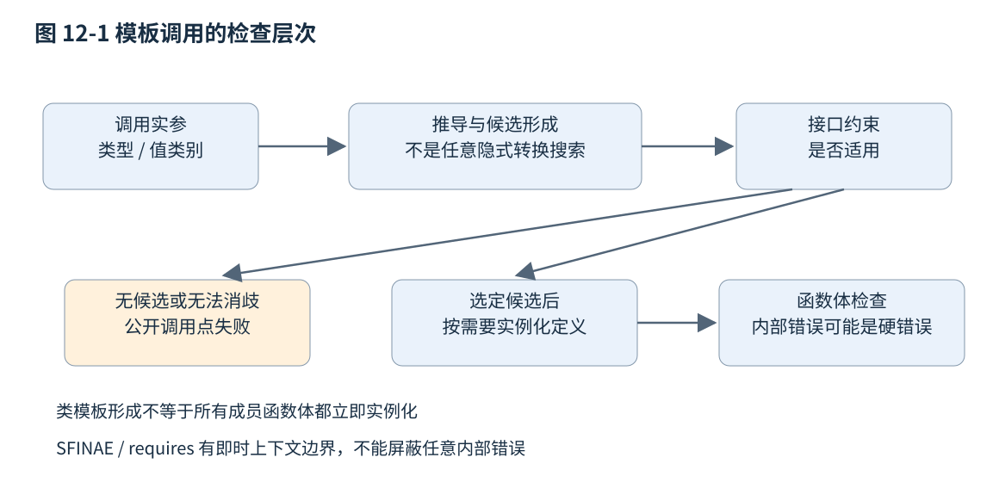
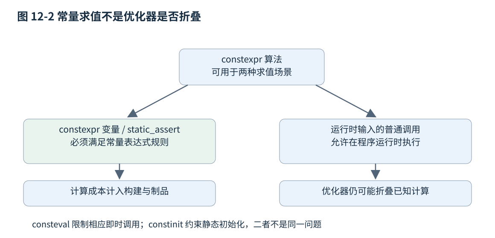

# 第十二章 泛型编程与编译期表达

泛型编程把一个算法对数据的要求，与数据的具体类型分开。排序需要元素能按某种关系比较，复制需要能够读取来源并写入目标，日志适配器需要目标提供某组操作。模板让这些关系在类型层面表达；约束让接口提前说明它接受什么；常量求值则让部分计算在必须满足编译期规则的语境中完成。

这些机制的共同价值是把正确的关系写清楚。把所有函数都改成模板，不会自动得到好接口；把计算搬到编译期，也不会让总成本消失。实例化数量、错误信息、构建时间、二进制尺寸与版本兼容都属于工程成本。本章以 C++20 固定草案 N4861 为语义基线，涉及后续版本时单独注明。所有代码未编译、未执行；静态断言是示例的一部分，不表示已经运行过编译验证。[S1]

## 12.1 Template 推导 特化与实例化

### 12.1.1 模板参数化的是哪些东西

**模板（template）**描述一族相关实体。函数模板可以按类型生成相应函数，类模板可以描述一族类型，变量模板可以表示随模板实参改变的值。模板参数不只限于类型，也可以是非类型参数，或模板本身。一个固定长度数组可以同时由元素类型和元素数量决定，两个维度都参与形成具体类型。

```cpp
// C++20 类模板与函数模板示例，未编译、未执行。
#include <array>
#include <cstddef>

template<class T, std::size_t N>
struct Block {
    std::array<T, N> values;
};

template<class T>
T smaller(T a, T b) {
    return b < a ? b : a;
}
```

`Block<int,4>` 与 `Block<int,8>` 是不同类型，长度不是只能在运行时读取的成员。`smaller<int>` 与 `smaller<double>` 则使用不同的参数和返回类型。编译器可能共享或消除部分机器代码，但源码层面的类型与语义仍分别成立；不能把“模板实例化”直接解释成每次调用都动态生成代码。

泛型参数应该对应真正需要变化的维度。图像尺寸若由摄像头运行时报告，就不能因为模板能表示常量尺寸而强迫全部尺寸进入模板参数；否则每种组合可能产生独立类型与代码路径。相反，小型固定维矩阵的维度若本来是编译期契约，类型参数可以帮助在乘法接口处发现维度不匹配。泛型设计首先是建模决定。

### 12.1.2 从实参到模板实参的推导

**模板实参推导**将形参中的模式与调用实参进行匹配。按值模式 T、引用模式 T& 和转发引用模式 T&& 对信息的保留方式不同。第十章解释移动和转发时使用了最小模型，这里把推导步骤展开。[S1]

**替换（substitution）**则把已经显式给出、推导出或取自默认值的模板实参，代入相应的类型和表达式。它会在函数模板候选形成的多个步骤发生，不是等整个函数体实例化后才做一次文本替换。推导回答“实参是什么”，替换检查代入后的相关形式，而函数体的按需实例化还有自己的检查边界；12.2 会进一步说明哪些替换失败只淘汰候选。[S1]

```cpp
// C++20 推导声明与调用，未编译、未执行。
template<class T> void value(T);
template<class T> void reference(T&);
template<class T> void forwarding(T&&);

void call_patterns() {
    int n = 4;
    const int fixed = 5;
    int sequence[3]{};
    value(fixed);          // T=int，忽略顶层const
    reference(fixed);      // T=const int
    value(sequence);       // T=int*，数组退化
    reference(sequence);   // T=int[3]，保留数组类型
    forwarding(n);         // T=int&，参数折叠为int&
    forwarding(4);         // T=int，参数为int&&
}
```

“顶层 const 被忽略”不能简化成“const 都丢了”。一个指向 const int 的指针按值传递，指针本身可以复制，但其所指对象的 const 仍属于指针目标类型。要逐层拆开对象、指针与引用，不能只看声明最左边有无 const。

普通模板推导也不会为冲突的形参随意选择共同类型。`smaller(1, 2.5)` 让同一个 T 从不同位置得到 int 与 double，通常推导失败；显式写 `smaller<double>(1, 2.5)` 则把类型选择交给调用方，随后按普通规则进行参数转换。若算法确实应允许不同类型，应把它设计成两个模板参数，并明确结果类型、转换和比较语义，而不是只修复这一处调用。

有些位置属于**非推导上下文**，不能用来从实参反求相应模板参数。例如只出现于嵌套类型名中的 T，通常不能靠一个结果对象倒推出所属类。函数调用的目标返回类型一般也不用于普通函数模板实参推导；写一个左侧类型并不会自动把全部模板参数补齐。错误信息中的“无法推导”与“类型不能转换”是不同阶段的问题。

花括号列表没有一个普通统一类型，接收 T 的模板与接收 `initializer_list<T>` 的模板所能推导的情况不同。重载函数集合、默认参数、参数包位置也可能造成非推导或歧义。库接口若频繁要求用户理解这些规则才能完成普通调用，可以提供更明确的重载或命名工厂，而不是把所有失败归咎于调用方不懂模板。

### 12.1.3 类模板实参推导与 auto 的边界

**类模板实参推导（CTAD）**允许在某些对象声明中省略类模板参数，由构造候选及推导指引确定它们。它不是把类变成动态类型，也不意味着所有类模板在任何语法位置都能省略参数。推导完成后，对象仍具有一个确定的静态类型。[S1]

```cpp
// C++20 推导指引示例，未编译、未执行。
#include <utility>

template<class T>
struct Holder {
    T value;
    explicit Holder(T v) : value(std::move(v)) {}
};
template<class T> Holder(T) -> Holder<T>;
// Holder h{42}; 推导为 Holder<int>。
```

推导指引只参与确定类模板实参，本身不是在运行时调用的工厂函数，也不替代构造函数。若指引推导出了一个无法由给定实参构造的特化，后续初始化仍会失败。对于保存引用或视图的类型，指引还可能决定是否衰变类型、是否保留借用，因此不是纯粹的语法糖装饰。

`auto` 的许多推导规则与模板推导有关，但仍有语法上的专门情况；`decltype(auto)` 则按 decltype 规则保留类型，尤其可能保留引用。`decltype(name)` 与 `decltype((name))` 对一个变量名常有不同结果：前者采用声明类型，后者根据括号表达式的值类别产生相应引用类型。泛型返回值如果无意保留局部对象引用，会造成悬空；第十章已从参数传递角度说明这个风险。

### 12.1.4 特化 重载与实例化不能混用名称

**实例化**依据模板和具体实参形成相应特化的过程；**显式特化**则由程序员为某组实参提供专门定义；**偏特化**为一类满足某种参数模式的实参提供定义。这些都与普通函数重载不同。[S1]

类模板可以偏特化。例如主模板表示普通类型，T* 的偏特化为指针类别选择另一套实现；函数模板不能直接偏特化，类似需求通常用重载、受约束重载或类模板辅助实现。把函数重载叫作“函数偏特化”，会在理解候选选择顺序时带来错误。

```cpp
// C++20 类模板偏特化与函数重载，未编译、未执行。
template<class T> struct Category {
    static constexpr bool is_pointer = false;
};
template<class T> struct Category<T*> {
    static constexpr bool is_pointer = true;
};

template<class T> int rank_of(const T&) { return 0; }
template<class T> int rank_of(T*) { return 1; } // 重载，不是函数偏特化
```

特化不是一个可任意插入的补丁点。它需要出现在适当命名空间和可见位置，避免在使用已经触发隐式实例化后才突然改变定义。跨翻译单元若看到不同定义或不同特化可见性，可能违反单一定义规则或其他要求，错误不一定在最方便的位置诊断出来。扩展标准库模板还受专门规则约束，不能在 std 命名空间里任意加重载或特化来“修复库行为”。

显式实例化定义可以要求为某组实参产生相应实例；显式实例化声明 `extern template` 可用于减少某些重复隐式实例化工作。它们不改变模板代表的接口，也不保证所有解析、约束检查或内联工作都消失。若公共库只支持有限的一组类型，可以把支持集和实例化责任集中管理；若承诺接受用户自定义类型，定义可见性与构建成本就必须另行安排。[S1]

### 12.1.5 模板何时真正检查函数体

模板定义时就要进行语法分析和可立即确定的检查；依赖模板参数的部分会在适当实例化阶段进一步检查。不能把模板当成一个完全未检查的文本宏，也不能认为声明一个类模板对象就会立刻实例化它的所有成员函数体。[S1]

```cpp
// C++20 延迟成员实例化示例，未编译、未执行。
template<class T>
struct Box {
    void create() { T value{}; (void)value; }
};
Box<void> box; // 这里不要求create的函数体实例化
// box.create(); // 若要求该定义，T=void时函数体无效。
```

这个机制允许一个类模板的某些成员只对支持相应操作的类型使用，但也可能把错误推迟到深层调用。设计现代库时，适合用约束明确说明成员何时可用，而不是让调用方在内部 `T value` 一类位置才看到失败。

**依赖名**涉及模板参数，其查找需要遵守模板名称查找规则。某些类型位置需要 typename 告诉解析器后面的依赖名是类型，调用依赖对象上的成员模板时可能需要 template 消除语法歧义。这些关键字不是提升性能的修饰符，而是让语法与依赖查找含义明确。

参数相关查找（ADL）会根据实参关联的类型与命名空间寻找函数，使用户定义类型可以参与某些泛型操作。例如交换对象时常采用引入标准 swap 后再进行非限定调用的模式，让合适的自定义交换通过 ADL 参与。与此同时，未限定名字也可能引入意外候选；泛型库应在希望扩展的点使用明确协议，不把每个内部调用都变成无控制的扩展点。



图 12-1 一个简化的模板调用检查过程。真实规则还有名称查找、候选排序与语义依赖，图中重点是把接口失败和函数体失败分开。 单个候选约束不满足不等于整个调用失败；其他候选仍可参与选择。

**面试追问：“模板是不是每个类型都复制一份机器代码？”** 语言形成不同特化，但最终机器代码可被内联、合并或删除，具体情况由实现与构建决定。源码实例化成本、目标文件重复和最终二进制体积应分别测量，不能用一句“都会膨胀”或“链接器全会消掉”概括。

**面试追问：“为什么模板定义通常放在头文件？”** 调用方隐式实例化通常需要看到相应定义。可通过显式实例化等方法把支持类型集集中到实现文件，但那会影响开放扩展能力。模块可以改变分发与解析方式，不取消模板对可达定义和语义信息的需求。

## 12.2 Concepts Constraints 与可诊断接口

### 12.2.1 从函数体失败转到接口要求

一个泛型求和函数如果只写 `total += value`，读者需要进入函数体才知道元素类型必须支持什么。**约束（constraints）**让候选接口在选取前说明适用条件；**概念（concept）**给一组约束取一个可以复用的名字。它们可以缩短错误路径，也帮助不同重载表达能力层次。[S1]

```cpp
// C++20 约束示例，未编译、未执行。
#include <concepts>

template<class T>
concept Addable = requires(T a, T b) {
    { a + b } -> std::same_as<T>;
};

template<Addable T>
T add(T a, T b) {
    return a + b;
}
```

这个 Addable 检查表达式存在，并且结果类型恰为 T。它故意很窄：某些短整数相加会经历整型提升，结果类型不是原类型，因此即使“可以做加法”也不满足此概念。概念名和实际语义应该一致；如果真实需求只要求可转换回 T，就要明确承担转换、窄化和信息损失的后果，不能为了让更多类型通过而不断放宽直到失去意义。

约束也不证明加法满足结合律、交换律或无溢出。一个类型可以提供签名正确的 operator+，实际却修改隐藏全局状态或返回错误值。语言能检查部分结构条件，算法需要的数学与行为性质仍要通过文档、类型设计和测试保证。

### 12.2.2 requires 表达式能检查什么

requires 表达式允许描述局部参数和一组要求。**简单要求**检查表达式是否有效；**类型要求**检查某个名字是否表示类型；**复合要求**可以附带 noexcept 与返回类型约束；**嵌套要求**表达进一步的约束条件。这些是编译期语义查询，不会为了检查而真正执行业务操作。[S1]

```cpp
// C++20 多种要求示例，未编译、未执行。
#include <concepts>
#include <cstddef>

template<class T>
concept BufferLike = requires(T& buffer, const T& constant) {
    typename T::value_type;                         // 类型要求
    buffer.clear();                                 // 简单要求
    { constant.size() } -> std::convertible_to<std::size_t>;
    { buffer.swap(buffer) } noexcept;                // 复合要求
    requires std::destructible<T>;                   // 嵌套要求
};
```

示例检查的是所写表达式的上下文。`constant.size()` 通过，不表示非 const 和 volatile 等所有形式都通过；`buffer.swap(buffer)` 不抛，也不自动证明任意两个对象交换都满足业务不变量。若概念用于真实算法，要求要与算法实际使用的表达式、值类别和 const 情况一致。

在模板化语境中，适当的要求替换失败可使 requires 表达式为 false，而不是立即产生硬错误。但这不是隔离任意错误的通用容器：如果检查触发了某个类模板实例化，而其内部出现超出即时上下文的错误，仍可能得到诊断。若某个要求对所有可能模板实参都无效，还涉及不良构、不要求诊断等规则。不能承诺“放进 requires 就永远只返回 false”。[S1]

requires 子句与 requires 表达式也不同。前者附着于声明，限制该声明的候选适用性；后者本身是可参与约束组合的布尔表达式。源码有时会连续出现 `requires requires(...)`，分别承担这两项角色。为复杂要求命名一个 concept，常比把两层语法都塞到每个函数声明中更易读。

### 12.2.3 满足约束与建模概念之间的距离

标准库概念常同时包含可检查的句法条件与语义条件。某个类型在编译器的布尔检查中满足概念表达式，不等于它在所有语义上真正**建模（model）**该概念。相等保持、稳定性、严格弱序以及迭代器多遍历保证等，通常不能仅凭函数签名证明。[S1] 若程序的有效性或含义依赖某组实参建模一个标准库概念，而它只满足句法约束却未满足语义要求，标准规定的后果可能是不良构且不要求诊断，不能把“编译通过”当作使用这些算法的许可。

例如排序比较器若使用 `a <= b`，它可以返回 bool，也可能满足某些调用形式检查，却违反严格弱序中对等值元素的相关要求。随机访问迭代器若把常量时间跳转实现成线性扫描，也可能通过部分语法检查，但违反相应复杂度契约。概念让要求更显式，不会把语义测试与复杂度审查变成多余工作。

编写自己的概念时，应避免只起一个宏大名称，如 Safe 或 Fast，却仅检查一个方法存在。更有帮助的是把它命名为可解释的能力，并在附近记录无法由编译器检查的条件。例如“可重复读取范围”不仅需要 begin/end 形式，还要说明迭代是否会消费外部流。第十三章的输入范围与前向范围正体现了这种差异。

### 12.2.4 约束排序不是任意逻辑证明

受约束重载可以表达“基本能力”和“更强能力”两种实现。编译器在适用规则下利用约束的**包含关系（subsumption）**排序，但它不是一个能证明任意布尔公式等价的定理证明器。原子约束的来源与参数映射会影响它是否识别为同一要求。[S1]

```cpp
// C++20 复用概念以建立清晰层次，未编译、未执行。
#include <concepts>

template<class T>
concept HasSize = requires(const T& value) { value.size(); };
template<class T>
concept HasSizeAndEmpty = HasSize<T> && requires(const T& value) {
    { value.empty() } -> std::convertible_to<bool>;
};

template<HasSize T> int inspect(const T&) { return 1; }
template<HasSizeAndEmpty T> int inspect(const T&) { return 2; }
```

第二个概念明确复用 HasSize，使能力层次既对读者也对约束规范化可见。若在每个地方重新拼写一个看似等价的 size 表达式，它可能形成不同原子约束，导致预期的“更强重载”关系无法建立。正确做法不是继续增加复杂布尔表达式直到某个编译器接受，而是让共享要求本来就共享定义。

C++20 对约束规范化与折叠表达式有其版本规则，后续标准可能扩展排序能力。维护多标准库时，要按最低支持版本设计重载集，不能用当前编译器已实现的新规则说明旧标准必然无歧义。第十五章会把语言特性与工具链实际支持分开管理。

### 12.2.5 SFINAE 与约束各自解决什么问题

SFINAE 是“替换失败不是错误”的缩写，描述函数模板候选形成中某些即时上下文的替换失败如何移除候选，而不使整个程序立即报错。它并不意味着模板函数体内部所有错误都可以静默忽略。早期库常使用 enable_if、void_t 和检测惯用法，把类型能力折叠到返回类型或额外模板参数中。[S1]

concepts 把很多这类接口条件放到专门的语法位置，通常更易读、更容易复用与诊断。但旧技巧并未全部失去意义，尤其是支持 C++17 及更早版本的库、需要特定类型变换的元函数，或者某些不由重载参与解决的问题。迁移应保持原来的可调用集合、优先级与错误语义，而不只是把 enable_if 文本替换成 requires。

static_assert 也与候选约束不同：它适合在选定的实现中报告必须满足的不变量，或说明一个明确不支持的配置；通常不会像 SFINAE 那样把该候选安静移出集合。若接口本来允许另一重载处理该类型，把检查放在函数体 static_assert 中可能已经太晚。

**面试追问：“用了 concept 以后模板错误一定短吗？”** 不一定。接口约束有机会把错误提早，但错误也可能来自约束本身的复杂实例化、多个歧义候选或内部硬错误。概念应表达实际能力，拆出可理解名称，并配合最小类型用例检查错误入口。

**面试追问：“编译器接受 strict_weak_order，就证明比较器正确吗？”** 不能。编译器检查可表达的调用形式和类型条件，不穷举值域证明传递性等性质。算法正确性仍依赖语义契约，需通过设计论证、性质测试与实际数据边界核验。

## 12.3 constexpr consteval 类型萃取与编译期算法

### 12.3.1 常量表达式是一套语义规则

**常量表达式**是在规定语境下满足一组求值限制的表达式。数组边界的某些形式、模板非类型实参、static_assert 条件以及 constexpr 变量初始化等会要求相应的常量表达式。编译器愿意把普通代码优化成常量，与语言要求这段表达式成为常量表达式，是两回事。[S1]

`constexpr` 函数表示它在条件满足时可用于常量求值，并不保证每次调用都在编译期完成。如果实参只能在运行时取得，普通调用仍可以在运行时执行。`const` 主要约束对象的修改能力，也不自动意味着初始化发生在编译期。

```cpp
// C++20 常量求值与运行时调用，未编译、未执行。
constexpr unsigned square(unsigned x) { return x * x; }
constexpr unsigned sixteen = square(4); // 此初始化需要常量表达式
unsigned runtime_square(unsigned input) { return square(input); }
```

这里 unsigned 运算按其模运算规则处理溢出，并不因此适合所有业务；若业务需要“超范围即错误”，必须显式检查。改成有符号类型后，越界乘法在要求常量表达式的调用里会使相应求值不满足条件，而不是在编译期神奇产生任意精度结果。编译期程序同样受类型范围和算法正确性约束。

编译器也可能在优化阶段把 runtime_square 的某次调用折叠成常量，但那是具体构建选择。用汇编里没有乘法来证明 constexpr 的语言义务，或用低优化构建里存在乘法来证明 constexpr 失效，都会混淆两层规则。

### 12.3.2 consteval 表达必须即时求值的接口

C++20 的 `consteval` 声明即时函数，在相应即时调用语境中要求求值得到常量表达式。它适合把某些配置解析、固定表生成或格式检查明确放到编译期，而不允许调用方把不确定输入留到普通运行阶段。[S1]

```cpp
// C++20 即时函数示例，未编译、未执行。
consteval unsigned checked_port(unsigned value) {
    if (value == 0 || value > 65535) {
        throw "port out of range";
    }
    return value;
}
constexpr unsigned service_port = checked_port(8080);
// checked_port(70000) 无法产生所需常量表达式。
```

这里 throw 分支用于让不符合条件的求值无法成为常量表达式，不是在编译期间启动一个运行时异常处理流程。诊断文字的具体形式由工具链决定，本章没有提供虚构编译输出。若环境禁用异常语法，即使分支只用于常量求值，也要核实该工具链配置是否接受；不能把语言版本与异常构建模式视为同一件事。

`constinit` 是另一种工具，它要求具有静态或线程存储期的相应变量满足静态初始化要求，但不把对象变成 const。一个 constinit 计数器可以随后改变，只是初始化阶段不能悄悄变成需要运行时动态初始化的路径。它不提供原子性或线程同步，不能用来修复多线程读写数据竞争。

```cpp
// C++20 初始化阶段约束，未编译、未执行。
constinit int requests = 0; // 要求静态初始化，之后仍可修改
// 多线程修改 requests 仍需同步；constinit 不等于 atomic。
```

### 12.3.3 类型萃取让类型性质进入分支

**类型萃取（type traits）**提供类型性质查询与类型变换。例如 is_integral 判断整数类型，remove_reference 去除引用，remove_cvref 同时去除顶层 cv 与引用，is_nothrow_move_constructible 查询相应构造表达式的异常性质。`_v` 形式通常给出布尔值等查询结果，`_t` 形式通常给出变换后的类型。[S1]

这些查询应服务于需要的操作。一个类型是整数，不代表值一定在所需范围内；is_trivially_copyable 不代表可作为网络编码；is_move_constructible 为真，也不保证调用某个显式移动构造，因为复制可能接受右值。名称提供方便入口，准确意义仍由查询对应的表达式或类型条件决定。

`decltype` 与 `std::declval<T>()` 常用于在不求值语境中描述操作结果。declval 不创建一个可供运行时使用的 T，它只是让作者描述“如果有这样一个值或引用，表达式类型是什么”。把它放到实际求值路径中使用，不能得到一个凭空构造的对象。

```cpp
// C++20 类型查询，未编译、未执行。
#include <type_traits>
#include <utility>

template<class T>
using dereference_result_t = decltype(*std::declval<T&>());
static_assert(std::is_same_v<dereference_result_t<int*>, int&>);
```

某些类型特征要求类型完整，或者对不满足前提的使用有特别限制。不能在类只做前向声明时，无差别查询所有构造、析构和布局性质，再假定编译器一定给出“以后补全时仍然正确”的结果。公共模板库应把类型完整性要求放在合适边界，避免因包括头文件顺序不同而改变诊断。

### 12.3.4 if constexpr 丢弃的是特定实例化分支

C++17 引入的 if constexpr 在条件可判定的适用模板实例化中，使未选分支成为弃置语句，避免实例化其中与该类型不相容的代码。它适合根据类型能力选择实现，而不要求所有类型都能通过普通 if 的两个分支。[S1]

```cpp
// C++20 依赖分支示例，未编译、未执行。
#include <type_traits>

template<class T>
constexpr auto value_or_dereference(T value) {
    if constexpr (std::is_pointer_v<T>) {
        return *value; // 调用方仍需保证指针可解引用
    } else {
        return value;
    }
}
```

这里 if constexpr 根据类型是否是指针选择分支，不会检查指针是否为空。类型选择解决“这项操作对这种类型是否适用”，运行时前提仍需另行保证。返回类型 auto 也会按所选返回语句推导，示例返回值而非保留所有引用；如果业务需要借用，必须明确改写并检查生命周期。

弃置分支仍需要语法正确，且不能据此把任意非依赖的错误藏起来。在非模板语境中，if constexpr 也不等同于预处理器把另一分支文本删掉。以本章固定 C++20 文本为基线，无条件 static_assert(false) 放在模板弃置分支中还涉及模板有效性规则，不能按后续缺陷修订后的编译器行为倒推所有旧配置都支持。

```cpp
// C++20 可移植教学形式，未编译、未执行。
#include <type_traits>
template<class> inline constexpr bool dependent_false = false;

template<class T>
void require_integer(T) {
    if constexpr (std::is_integral_v<T>) {
        // 对整数类型的实现。
    } else {
        static_assert(dependent_false<T>, "an integral type is required");
    }
}
```

这个例子故意用依赖条件表达失败；对于真正的重载接口，前一节的 std::integral 约束往往更适合。选择 if constexpr、约束或特化，应看是在已有算法内部选路、决定候选是否可用，还是要改变整个类型结构，不能因为三个工具都“在编译期判断”就混为一谈。

### 12.3.5 编译期算法仍需复杂度与资源预算

常量求值可以使用循环、局部变量和许多标准库操作，不必把所有算法写成递归模板。对一个固定大小表，用普通 constexpr 函数生成数据，通常比几十层类型递归更容易阅读，也能减少对诊断深度的依赖。

```cpp
// C++20 固定表生成示例，未编译、未执行。
#include <array>
#include <cstddef>

constexpr std::array<unsigned, 16> make_bit_counts() {
    std::array<unsigned, 16> result{};
    for (std::size_t i = 1; i < result.size(); ++i) {
        result[i] = result[i / 2] + static_cast<unsigned>(i % 2);
    }
    return result;
}
constexpr auto bit_counts = make_bit_counts();
static_assert(bit_counts[15] == 4);
```

表中每项使用更小索引的既有结果，循环从 1 开始，数组大小固定为 16；因此索引范围和依赖方向都可以直接检查。这里不需要模板递归，也没有把 16 个数写成不可核查的“预先算好结果”。示例 static_assert 检查一个性质，但不代表它验证了完整算法，更不代表本章已经执行编译器。

C++20 放宽了常量求值中的部分动态分配与库能力，例如允许满足规定条件的求值过程内部临时分配并在该求值过程中释放。它不意味着可以把任意动态存储指针从编译期计算中带到运行时，也不意味着 constexpr vector 能以任意非空堆存储形式成为持久常量对象。能在常量求值里用某容器做中间工作，与容器的所有结果都能逃出求值，是不同条件。[S1]



图 12-2 常量求值要求与普通运行时调用。优化器折叠普通调用属于实现选择，不改变图中的语言要求。

大型编译期查找表可能缩短启动时间，也可能增加编译时间、对象文件体积、链接与缓存压力。若输入经常变化，把表嵌入二进制还会增加重新发布成本。真实选择应比较运行时生成、离线生成制品和编译期生成三种责任安排，并记录数据来源、校验方式和升级流程。

`std::is_constant_evaluated()` 可帮助在常量求值与普通求值中选择适用实现，但它不是“优化器有没有常量折叠”的探针。若两条路径实现同一公开操作，应保持承诺的可观察语义，尤其是浮点误差、错误处理和边界条件。不能让编译期版本悄悄接受运行时版本拒绝的数据，再把差异称为性能优化。

**面试追问：“constexpr 与 consteval 差在哪里？”** constexpr 函数可以用于满足条件的常量求值，也可普通运行时调用；consteval 对相应即时调用要求常量表达式。两者都不提供任意精度、不自动证明算法正确，constinit 则约束变量初始化阶段，解决的是第三个问题。

**面试追问：“编译期计算是不是免费？”** 它把部分成本移到构建阶段，并可能增加制品尺寸。需要统计完整构建与增量构建、编译器内存、链接时间、最终体积和运行收益。对热点且稳定的小表很有价值，对快速变化的大数据可能不合适。

## 12.4 编译成本 错误消息和泛型库边界

### 12.4.1 编译器处理的工作比函数调用多

一个模板库的构建成本可能来自头文件解析、名称查找、模板实参推导、约束检查、递归实例化、常量求值和后端优化。最终可执行文件很小，不代表编译器没有反复做过大量前端工作；链接时合并重复机器代码，也不能倒退消除此前每个翻译单元的解析成本。

参数组合会放大实例数量。例如算法同时以元素类型、比较器类型、分配器类型和若干布尔策略参数化，理论组合可能很快增长。闭包表达式通常具有各自的类型，几个看起来相同的 lambda 可能让同一算法形成不同实例。是否值得保留这些类型信息，要看内联收益和实际调用分布。

优化编译时间应先定位热点。Clang 的时间跟踪能力、GCC 的报告和模板诊断选项可以帮助区分解析、实例化与优化工作；具体选项和输出格式随工具链版本核实。本章未运行这些工具，也没有宣称某种改写能缩短固定百分比的构建时间。[S2]、[S3]

一种常见办法是缩小公共模板表面：外层只做类型检查和必要适配，内部把与类型无关的重工作交给普通函数；另一种是在稳定边界采用类型擦除，限制实例扩散。也可以对有限支持类型集中显式实例化。每种办法都可能影响内联、ABI、异常与错误消息，不能只以“少模板”作为唯一目标。

### 12.4.2 把错误信息变成调用方能采取行动的说明

好的泛型诊断应该尽量回答三件事：哪一个公开接口不能接受这次调用，缺少哪项能力，调用方可以怎样修正。若错误从内部几百行展开后才显示“没有某个嵌套类型”，说明接口边界没有把需求显式表达出来，或者内部辅助类型泄露得太多。

可以先用小概念定义公开能力，再用受约束入口限制参数，必要时在已选实现中给出与业务相关的 static_assert。不要把标准库整个概念体系都堆到一个接口上：算法只需要单遍读取，就不该要求随机访问；只需要可移动，就不该为了实现方便要求可复制。过强约束会排除合法高效的类型，也会迫使调用方进行多余转换。

反过来，约束过弱也有代价。一个函数宣称接受任意 range，却在实现里无条件调用下标，会使接口与实现不一致。审核时可以逐项记录实现真正使用的操作、复杂度要求、生命周期要求、异常前提和并发前提，再把可机器检查部分放入约束，其余写进契约。

错误信息不是越短越好。对库作者而言，完整实例化链有助于追踪问题；对使用者而言，第一条指向公开接口的诊断更重要。可以提供精简说明，同时保留工具可输出的完整链路。不能为了让一个错误“消失”，无边界增加默认分支或把失败转换为一个看似有效的结果。

### 12.4.3 泛型接口仍须承担所有权与异常契约

类型约束只能表达一部分可用性。一个 range 可以合法遍历，却只借用即将销毁的存储；一个可调用对象可以按签名调用，却保存着悬空引用；一个 move_constructible 类型可以从右值构造，却在失败前修改来源。泛型接口仍需说明输入借用多久、输出拥有何物、是否保留回调、发生失败后谁还有效。

```cpp
// C++20 有意展示约束与实现错位的反例，未编译、未执行。
#include <concepts>
#include <ranges>

template<std::ranges::input_range R, class F>
requires std::invocable<F&, std::ranges::range_reference_t<R>>
void for_each_now(R&& range, F function) {
    for (auto&& value : range) {
        function(value); // 反例：命名变量是左值，且此语法不覆盖全部 invoke 形式
    }
}
```

这个名称与函数体表达同步消费，但还不能从签名得出全部保证。若 function 抛出，前面已处理的元素可能已经产生外部效果；它按值复制或移动进参数是否合适，要看回调语义；传入范围的解引用可能返回代理对象，简单的 `function(value)` 也需要与约束检查的表达式完全对齐。为了避免示例暗中承诺通用算法完整性，应进一步收紧或修正实际调用形式。

对这个具体示例，`range_reference_t<R>` 可能不是普通左值引用，例如某些代理或纯值解引用结果。循环变量 value 取名后是左值，和直接解引用表达式的值类别可能不同。若目标是保持范围实际解引用的调用形式，更直接的实现是通过迭代器取值并调用 `std::invoke(function, *it)`，约束与表达式一致；std::invoke 还覆盖成员指针等可调用形式。

```cpp
// C++20 改进后的同步泛型消费示例，未编译、未执行。
#include <concepts>
#include <functional>
#include <ranges>

template<std::ranges::input_range R, class F>
requires std::invocable<F&, std::ranges::range_reference_t<R>>
void visit_now(R&& range, F function) {
    auto it = std::ranges::begin(range);
    const auto end = std::ranges::end(range);
    for (; it != end; ++it) {
        std::invoke(function, *it);
    }
}
```

这仍不是声称复制标准库算法的全部契约，而是展示一项可核查改进：检查什么，就实际调用什么。回调是否保留元素借用、是否修改影响迭代有效性的容器、是否需要取消，仍须明示。第十三章的迭代器规则与第十四章的失败保证不能被一个 concepts 头文件替代。

### 12.4.4 跨库与二进制边界应控制模板泄露

把模板类型直接暴露在公共 API 中，可能把标准库实现、分配器、异常说明和布局依赖一起暴露出去。客户端升级一个头文件后，可能需要重新实例化并重新编译；提供方仅替换一个动态库，不能保证客户端已有实例理解新实现。模板与 ABI 的关系因此不同于纯粹隐藏在实现文件中的普通函数。

对长期稳定插件接口，可以在边界使用明确定义的数据结构、句柄和版本化函数，再在各自实现内部采用模板。对同一代码库内可统一重编译的库，暴露受约束模板可能更自然。没有一种边界适合全部项目，关键是清楚谁负责重新编译、谁控制编译器与标准库，以及哪些类型必须跨边界销毁。

模块能减少某些文本包含问题并改善封装形式，但不能自动提供跨编译器通用的二进制模板格式。模块制品的兼容范围、宏配置、构建依赖扫描与缓存键都需要工具链支持。第十五章和第二十一章会把这一点放入迁移与构建矩阵。

### 12.4.5 用代表类型检验泛型承诺

泛型库测试不能只用 int。至少需要与接口承诺相关的代表类型：不可默认构造类型、仅移动类型、移动可能抛出的类型、重载取址或带代理引用的类型、带 const 的借用、大小较大或对齐严格的对象，以及能计数或故障注入的操作。目的不是堆砌刁钻技巧，而是确认实现没有偷偷依赖未声明能力。

应把编译成功用例、预期拒绝用例与运行时行为测试分开。预期拒绝用例可以验证错误确实发生在公开约束位置；运行时测试检查排序语义、资源释放、异常后不变量和输入边界；性能与构建实验分别评价运行成本和模板成本。一个 static_assert 成功不能代替所有这些层次。

当概念或特化规则改变时，还要复查重载选择。新增一个更宽泛的重载可能让旧调用选到不同实现；放宽约束也可能制造歧义。兼容性不仅是“旧代码还能编译”，还包括结果、异常、复杂度和诊断预期是否保持。为公共模板库记录这种行为变化，比只记录新增了几个头文件更有价值。

**面试追问：“如何减少模板膨胀？”** 先分别度量编译时间、目标文件与最终代码体积，再定位组合数和重工作。可考虑把非类型相关部分下沉、共享具名策略、集中显式实例化或在边界类型擦除；每项改动都应复查运行时内联收益和接口兼容，不保证一种技巧包治百病。

**面试追问：“一个泛型库怎样才算设计完整？”** 它需要可解释的能力约束、明确的所有权与失败保证、与实际调用一致的表达式检查、受控扩展点、代表类型测试，以及可承受的编译和版本成本。能在演示里同时接收 int 和 double，只是最初的一步。

## 来源与阅读边界

核验日期为 2026-10-03。正文、示例与插图均为原创组织，未编译或执行任何示例，未收集构建时间数据。

- S1：WG21 N4861，重点为 `[temp.param]`、`[temp.deduct.call]`、`[temp.deduct.type]`、`[temp.class.spec]`、`[temp.inst]`、`[temp.explicit]`、`[temp.dep]`、`[temp.constr]`、`[expr.prim.req]`、`[res.on.requirements]`、`[concepts.equality]`、`[dcl.constexpr]`、`[dcl.constinit]`、`[expr.const]`、`[stmt.if]`、`[meta]`
- S2：Clang Compiler User's Manual，构建与诊断观测能力；具体配置需对应选定版本核实
- S3：GCC C++ Dialect Options，模板深度、常量求值和诊断相关选项；不作为项目当前构建结果

[S1]: https://www.open-std.org/jtc1/sc22/wg21/docs/papers/2020/n4861.pdf
[S2]: https://clang.llvm.org/docs/UsersManual.html
[S3]: https://gcc.gnu.org/onlinedocs/gcc/C_002b_002b-Dialect-Options.html
