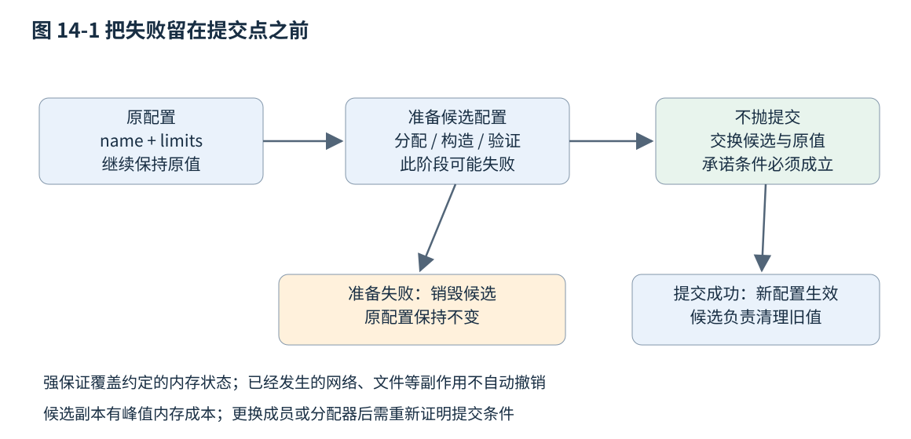
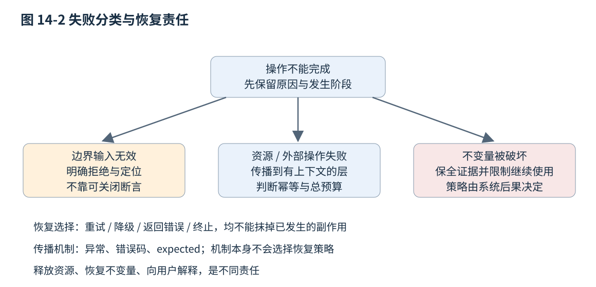

# 第十四章 错误处理与健壮的库接口

一个接口的承诺不只包括成功时返回什么，还包括失败怎样被发现、失败以后哪些状态仍可使用，以及谁有足够上下文决定下一步。磁盘写入失败、输入格式错误、资源不足和程序违反不变量，并不适合统一变成一个布尔值。错误表示太贫乏，调用方无法恢复；错误传播太随意，系统又可能重复处理、吞掉证据或把不完整状态当成成功。

健壮接口把失败纳入正常设计：先定义状态与责任，再选择异常、错误码或结果类型。C++20 是本章主线，固定草案 N4861 用于异常与库规则；std::expected 属于 C++23，按 N4950 单独说明，不能直接放进仅支持 C++20 的项目。全部示例未编译、未执行；本章提供机制分析与验证方法，不提供已经完成的故障注入结果。[S1]、[S2]、[S6]

## 14.1 Exception 安全级别和栈展开

### 14.1.1 失败来源与恢复责任

**异常（exception）**是一种把失败从检测位置传播到适当处理位置的语言机制。被调用函数可以用 throw 表达无法完成约定操作，控制流寻找匹配的 handler，沿途按规则销毁已建立的自动对象。它让成功路径不必逐层携带显式状态检查，但并不替程序选择恢复策略。[S1]

判断是否使用异常，不能只问“发生概率低不低”。缺少可选配置文件可能频繁却完全正常，内部必须存在的对象突然缺失可能罕见却代表程序错误；一个高频解析器也可能有意把格式不匹配表达为普通结果。更重要的问题是：失败是否属于接口定义的结果集合，调用层能否立即处理，传播时需要多少上下文，系统是否允许异常运行时。

恢复责任通常分层。底层知道操作为何失败，中层知道这次操作属于哪项业务，上层知道是否重试、降级或向用户解释。把完整恢复策略塞进最低层，会让库悄悄等待、重试或弹窗；只往上抛一个没有上下文的通用错误，又迫使上层猜测。合理接口保留机器可判断原因，同时在恰当层补充操作对象与阶段。

异常也不等于硬件故障、进程信号或所有运行时崩溃。除非特定平台扩展明确规定，不能期待 catch(...) 捕获任意非法内存访问或数据竞争造成的问题。第十一章的未定义行为不属于“正常抛出的某种异常”，第二十二章的崩溃证据仍需要专门保全。

### 14.1.2 栈展开负责销毁 不负责撤销业务

**栈展开（stack unwinding）**是异常传播到处理器过程中，对适用的已构造自动对象执行销毁的过程。销毁顺序与完成构造的顺序相反。RAII 因此可以使文件、锁和内存的释放随控制流退出执行，而不必在每个失败分支手写相同清理代码。[S1]

```cpp
// C++20 RAII与异常传播示例，未编译、未执行。
#include <fstream>
#include <istream>
#include <stdexcept>
#include <string>
#include <vector>

std::vector<int> read_numbers(const std::string& path) {
    std::ifstream input(path);
    if (!input) {
        throw std::runtime_error("cannot open number file");
    }
    std::vector<int> values;
    int value{};
    for (;;) {
        input >> std::ws;
        if (input.eof()) { break; }
        if (!(input >> value)) {
            throw std::runtime_error("invalid number sequence");
        }
        values.push_back(value);
    }
    if (input.bad()) {
        throw std::runtime_error("number file read failed");
    }
    return values;
}
```

若 push_back 在适用路径抛出，已经建立的 vector 和文件流对象会按退出规则清理。这里仍有格式层面的设计选择：示例先跳过空白，再区分输入结束与一次整数解析失败，数值超范围即使恰好到 EOF 也不能当作成功，不支持注释，也没有大小限制或详细行列号，不能当作完整不可信文件解析器。RAII 解决资源退出，输入限制和错误定位需要继续设计。

栈展开不会自动撤销已经发出的网络请求、写入外部文件的字节、发送的邮件或修改的全局业务状态。一个锁的析构只负责解锁，不会把锁保护的数据恢复到操作前。若数据在抛出前被改到不满足不变量，自动释放锁反而会把坏状态暴露给其他线程。

因此，“没有泄漏”只是健壮性的一个维度。要保持业务一致性，需要先准备后提交、事务、可证明的回滚或补偿协议。对于不可逆外部动作，还要区分“本地没有收到成功响应”和“对方实际上没有执行”，这个问题会在第三十四章的部分失败与幂等中继续展开。

### 14.1.3 构造失败时谁被析构

若普通构造函数在对象整体尚未构造完成时抛出，完整对象的析构函数不会作为这个未完成对象的清理步骤被调用；已完成构造的基类和成员子对象会按规定清理。把资源先放进 RAII 成员，可以使构造中途失败时仍有正确退出路径。若资源只是存在一个尚未交给管理者的裸句柄里，则不会因为外层构造失败就自动被释放。[S1]

```cpp
// C++20 组合成员的构造失败路径，未编译、未执行。
#include <cstddef>
#include <memory>
#include <stdexcept>
#include <vector>

class Session {
    std::unique_ptr<int> token_;
    std::vector<int> buffer_;
public:
    explicit Session(std::size_t count)
        : token_(std::make_unique<int>(7)), buffer_(count) {
        if (count == 0) {
            throw std::invalid_argument("empty session buffer");
        }
    }
};
```

若 buffer_ 构造失败，token_ 已经完成构造，会负责释放其资源；若函数体因 count 为零抛出，两个成员均已建立，会分别退出。此例有意展示顺序，实际接口可以在更合适的位置提前验证 count，避免先做无用工作。成员声明顺序决定初始化顺序，不能靠初始化列表重新排序来改变它。

委托构造还存在专门规则：目标构造函数已经完成对象构造后，委托构造函数体再抛出，异常清理会调用完整对象的析构。因而“构造抛出永远不调用析构”不是准确的普遍陈述。工程上应坚持让已取得资源立即由已构造的管理对象负责，而不依赖一个过度简化口号。[S1]

### 14.1.4 基本 强 与不抛保证

**基本保证**通常指失败后仍保持组件不变量且不泄漏资源，但业务值可能改变。**强保证**要求失败时，约定保护的可观察状态保持原样，成功时才完成操作。**不抛保证**表示操作不会以异常逃出。它们是讨论异常安全的常用术语，具体标准库操作的实际保证仍须查各自条件与例外。[S3]

强保证不是全世界状态都回到过去。为了定位错误记录了一条日志，时钟向前走了，或者尝试分配让分配器统计变化了，都需要在承诺的观察范围内解释。设计接口时，应写明受保护的是当前对象的值、某一组内存结构、数据库事务，还是外部文件。范围不清楚的“绝对事务性”无法验证。

不抛也不等于操作必定成功。一个 noexcept 的查询可以返回错误码；一个析构函数可以记录关闭失败；一个系统可能在不可恢复错误时终止。若把所有失败都藏在内部而继续假装成功，形式上不抛并不代表接口健壮。需要区分不以异常退出与完成业务目标。



图 14-1 准备与提交分离。图中的强保证仅覆盖约定的内存状态，不能自动涵盖外部副作用。

### 14.1.5 用候选状态换取可证明的提交点

一个配置更新同时改变名称与数值集合。若先改名称，再建立新集合，后者分配失败时配置可能只改了一半。可以先在独立对象中准备并验证完整候选，最后用满足不抛条件的交换提交。

```cpp
// C++20 强保证示例，未编译、未执行。
#include <algorithm>
#include <span>
#include <stdexcept>
#include <string>
#include <string_view>
#include <vector>

struct Configuration {
    std::string name;
    std::vector<int> limits;
    void swap(Configuration& other) noexcept {
        name.swap(other.name);
        limits.swap(other.limits);
    }
};

void replace_configuration(Configuration& current,
                           std::string_view name,
                           std::span<const int> limits) {
    Configuration candidate{
        std::string(name), std::vector<int>(limits.begin(), limits.end())};
    if (candidate.name.empty() || candidate.limits.empty() ||
        std::any_of(candidate.limits.begin(), candidate.limits.end(),
                    [](int x) { return x < 0; })) {
        throw std::invalid_argument("invalid configuration");
    }
    current.swap(candidate);
}
```

候选的字符串或 vector 建立失败，current 尚未改变；验证失败也只销毁 candidate。最后的 swap 使用本例默认标准分配器的 string 与 vector，不引入自定义不相等资源交换等额外问题；随后 candidate 持有旧值并负责销毁。若改用其他成员或分配器，必须重新证明交换和析构符合所需条件，不能保留 noexcept 声明就认为证明仍成立。[S1]

这个实现付出一份候选状态的峰值存储，并可能无法重用 current 已有容量。对高频大对象更新，这个成本需要测量；如果基本保证已足够，可以选择更直接的原地更新。异常安全等级应来自业务对失败后状态的需求，而不是统一要求每个操作都复制全部数据。

### 14.1.6 捕获 重抛与终止

异常通常按 const 引用捕获，避免不必要复制，也避免按基类值捕获导致切片。多个 handler 按源码顺序匹配，应把需要专门处理的派生异常放在更一般的基类处理之前。`throw;` 重抛当前处理的异常；`throw e;` 则是抛出一个由表达式 e 建立的新异常对象，可能丢失原始动态类型。[S1]

```cpp
// C++20 边界补充上下文的框架，未编译、未执行。
#include <exception>
#include <stdexcept>

void load_document();
void load_workspace() {
    try {
        load_document();
    } catch (...) {
        std::throw_with_nested(std::runtime_error("workspace load failed"));
    }
}
```

嵌套异常可以保留原因链，但调用方还需有遍历与呈现策略。每层都重新生成同一条日志会产生重复告警；每层都改成“内部错误”则会丢掉根因。通常在负责用户反馈或操作边界的层统一记录，并让中间层只在增加有用上下文时包装。

析构函数应避免异常逃出。栈展开中为清理对象调用的析构若又以异常退出，会导致 std::terminate；普通 noexcept 函数也会在异常越界时触发终止。找不到匹配处理器或违反不抛边界时，终止前是否以及如何展开有专门实现定义边界，不能承诺 RAII 一定完成所有清理。进程被强制终止、掉电等情况更不在普通析构保证内。[S1]

**面试追问：“强异常保证是不是加一个 try/catch 就有了？”** 不是。catch 可以观察失败，不能自动把已修改的对象或外部系统还原。需要明确受保护状态，安排可失败准备阶段与可靠提交，或者证明回滚本身不会再次失败。

**面试追问：“析构中的关闭失败怎么处理？”** 通常提供显式 close、commit 或 flush，让需要确认成功的调用方在对象仍可使用时检查结果；析构做不抛的兜底清理。是否记录失败、标记资源状态或终止，取决于领域后果，不能既吞掉失败又承诺持久化成功。

## 14.2 错误码 expected 与故障传播

### 14.2.1 错误码必须保留可行动的含义

**错误码**把失败作为显式值返回，适合调用方需要立即分支、失败属于常规结果集合，或环境不允许异常传播的接口。一个裸 int 如果没有稳定枚举、来源与成功约定，很容易被误读。布尔值只能表达二分状态，不能区分“不存在”“权限不足”“输入损坏”和“暂时不可用”。

`std::error_code` 将整数值与错误类别组合，类别负责解释其来源与意义；`std::error_condition` 还可用于抽象的条件比较。不同类别里的相同整数不必代表同一错误，不能把 value 单独送到上层再丢掉 category。把一个平台原始错误映射为稳定业务分类时，也应保留必要的原始诊断信息。[S1]

errno 一类传统接口还有额外约定：只有被调用接口在指定失败情况下才保证它有相关含义，成功后遗留的旧 errno 不代表本次失败。应在失败发生后尽快保存相关状态，避免随后日志或其他调用覆盖它。线程局部机制解决的是不同线程之间的一部分干扰，不解决同线程后续调用覆盖的问题。

错误文本与错误分类应分离。文本方便人理解，可能本地化或改变措辞；代码用于稳定分支，不应靠搜索文本里的“timeout”决定重试。错误还可以携带阶段、位置、重试提示与关联标识，但不应无边界复制用户输入、凭据或巨大缓冲到日志。

### 14.2.2 expected 把成功值与错误放进同一类型

C++23 的 `std::expected<T,E>` 表示一个对象当前保存成功值 T 或错误 E。调用方从类型就能看出这项操作可能返回错误，成功与失败的信息不必分散在返回值、输出参数和全局变量中。`std::unexpected<E>` 用于明确构造错误分支。[S2]

```cpp
// C++23 完整解析示例，未编译、未执行。
#include <charconv>
#include <cstddef>
#include <expected>
#include <string_view>
#include <system_error>

enum class ParseCode { empty, invalid, out_of_range, trailing };
struct ParseError {
    ParseCode code;
    std::size_t offset;
};

std::expected<unsigned, ParseError> parse_count(std::string_view input) {
    if (input.empty()) {
        return std::unexpected(ParseError{ParseCode::empty, 0});
    }
    unsigned value{};
    const char* begin = input.data();
    const char* end = begin + input.size();
    auto result = std::from_chars(begin, end, value);
    if (result.ec == std::errc::invalid_argument) {
        return std::unexpected(ParseError{ParseCode::invalid, 0});
    }
    if (result.ec == std::errc::result_out_of_range) {
        return std::unexpected(ParseError{ParseCode::out_of_range,
                              static_cast<std::size_t>(result.ptr - begin)});
    }
    if (result.ptr != end) {
        return std::unexpected(ParseError{ParseCode::trailing,
                              static_cast<std::size_t>(result.ptr - begin)});
    }
    return value;
}
```

这个接口拒绝空输入、不可解析输入、超范围数值及尾随字符；它不自动跳过空白，也不接受本例没有定义的单位后缀。成功值 0 与失败状态不同，不必占用某个 unsigned 值作为哨兵。offset 是便于定位的字节位置，不是 Unicode 字符列号；如果错误用于图形界面，还需按编码规则转换。

调用方先检查是否有值，再取值或错误。`value()` 在错误状态下按规则抛出 bad_expected_access；普通 `operator*` 与 `error()` 各自有正确状态的前提，不能把它们当作自动验证输入的分支。expected 并不强迫使用者检查，也不能仅靠类型名避免误用。[S2]

```cpp
// C++23 使用片段，未编译、未执行；接上例parse_count。
// auto result = parse_count("120");
// if (!result) {
//     report_parse_error(result.error()); // 业务层提供的呈现函数
//     return;
// }
// consume_count(*result);                 // 在有值分支中取值
```

### 14.2.3 expected 不等于绝对不抛

expected 对象的成功值或错误值在构造、复制、移动时可能调用用户类型操作；这些操作能否抛出，取决于 T、E 与具体成员函数的约束和异常说明。调用 value 本身也可能抛出。因此“返回 expected 就可以把整个函数标成 noexcept”没有依据。[S2]

同样，带 error_code 参数的标准库接口也不能不查声明就一概认定不抛。某个重载可能仅把特定操作系统错误写入 error_code，而其他失败路径依旧由类型操作决定。真正需要无异常边界时，要逐条核查函数及其内部调用、错误构造和日志路径。

expected 的一个价值是把错误处理组合成显式流。and_then 适合继续调用返回 expected 的下一步，transform 适合转换成功值，or_else 与 transform_error 处理错误侧。这些名称并不替业务确定是否应该恢复；如果只是增加上下文，不能意外把失败变成成功。C++23 的具体库实现还可能分阶段提供这些成员，部署前要核对标准库版本与特性宏。[S2]

结果链很长时，也应关注可读性。三步短链可能比重复 if 更清楚；包含重试、补偿和多种副作用的复杂链可能反而隐藏控制流。适当拆成具名函数，保留每一步的阶段和错误类型，比追求“整段只有一个表达式”更利于故障定位。

### 14.2.4 optional 与 expected 分别表达什么

`optional<T>` 只有有值或无值，适合“没有结果”本身就是完整含义的查询。`expected<T,E>` 让错误原因成为接口的一部分，适合调用方需要根据失败类型作不同动作。异常则可在不改动每层返回类型的情况下跨多层传播。三者都不能靠语法自动决定业务语义。[S1]、[S2]

一次缓存查找无命中可以自然返回 optional；读取必须存在的配置却发现权限不足，若也只返回 nullopt，就抹掉了运维需要的信息。相反，一个穷举解析器把“这个分支不匹配”视为普通搜索结果，未必应该每次抛异常。需要区分正常缺失、可恢复操作失败和违反调用契约。

同一库也不必只使用一种机制。内部算法可以用 expected 表示高频解析结果，最外层应用入口把未处理异常转成统一状态；某些构造函数通过异常表示无法建立不变量，而普通查询用 optional。混合机制必须有明确转换边界，避免同一个错误一会儿返回码、一会儿抛异常、一会儿写日志后假装成功。

### 14.2.5 传播需要保存原因 转换需要说明损失

从底层错误映射为业务错误时，至少保留上层决策所需分类。例如“连接失败”可能包含认证失败、地址不可达和超时；认证失败通常不该通过重复相同凭据立即重试，暂时不可达可能适合带总预算的重试。若转换只剩“unknown”，上层无法作正确选择。

也不应该毫无筛选地把内部堆栈、路径和数据库详情暴露给外部用户。可以对外返回稳定错误分类和关联标识，在受控日志中保存适量内部上下文。可诊断性与最小披露不矛盾，关键是明确不同读者能看到什么。

错误跨线程时不会自动沿创建线程的调用栈传播。可用 exception_ptr、future/promise 或任务系统结果通道转交异常或结果，再在接收线程决定处理。取消也需要单独定义：它可能是预期完成状态，可能与截止时间区分，还可能发生在部分结果已经产生以后。第十六章和第十九章会把传播与关闭协议联系起来。

**面试追问：“错误码一定比异常快吗？”** 不能脱离成功率、调用层数、代码布局、错误构造和 ABI 实现回答。错误码可能增加每层分支，异常可能增加表与失败路径成本；硬实时项目还关心最坏时间。应测量相应负载并遵守平台限制，不拿一种机制的名称替代性能证据。

**面试追问：“为什么 expected 的错误类型不直接用 string？”** 可以用，但字符串只适合人的描述，未必提供稳定分类，还可能分配。一个小枚举加必要位置或上下文可以更适合机器决策，文本由呈现层生成。若确实需要丰富诊断，则要说明其成本与隐私边界。

## 14.3 契约 断言 不变量与 API 可用性

### 14.3.1 前置条件 后置条件与不变量

**契约**说明调用方与实现各自承担什么。前置条件是调用前必须满足的要求，后置条件是正常或失败返回后接口承诺的状态，不变量则是在约定的可观察边界应始终成立的对象关系。例如一个缓冲区的长度不能超过容量，一条打开连接的句柄必须有效，一份配置中各字段必须互相匹配。

契约可以存在于类型、约束、文档、检查或测试里。span 同时携带位置与长度，比一对无说明的裸指针更清楚；非空类型可以减少空值分支；只允许由验证工厂构造的标识符可以把格式检查集中到入口。但类型不能表达全部动态条件，仍需检查长度、权限、版本和状态转换。

设计时要说清“不满足前置条件”如何处理。某些底层接口把它定义为调用错误并不提供恢复；公共服务接口则应把不可信输入验证失败作为可处理结果。把外部数据直接交给有严格前提的内部函数，再说“用户违反契约”，并不能替代边界防护。

### 14.3.2 assert 不能承担输入验证

C++20 的 assert 宏用于表达程序员希望在检查开启时验证的条件，受 NDEBUG 等配置影响。检查被禁用时，表达式可能根本不求值，因此不能把必要副作用写在断言里。断言失败的处理也不是普通业务错误返回，不能拿它替代所有用户输入检查。[S1]

```cpp
// C++20 断言与检查分工示例，未编译、未执行。
#include <cassert>
#include <cstddef>
#include <stdexcept>
#include <vector>

int checked_at(const std::vector<int>& values, std::size_t index) {
    if (index >= values.size()) {
        throw std::out_of_range("index outside values");
    }
    assert(index < values.size()); // 可作内部事实说明，不承担必要验证
    return values[index];
}
// 不应写 assert(open_resource()); 再依赖其副作用完成打开。
```

实际代码里重复断言可能没有必要，示例只是展示责任分开：必须执行的验证在普通控制流中，断言用于内部假设。若接口已经通过类型和此前逻辑保证索引有效，可以选择内部前提检查；若接收外部索引，则应持续验证，不因发布构建关闭断言而失去防线。

本章所说契约主要是设计概念，不把 C++26 的语言契约特性写成 C++20 已有语法。第十五章会按固定 C++26 草案说明新机制与实现成熟度；即使采用语言支持，也仍需定义外部输入错误、内部违反和运行策略之间的关系。

### 14.3.3 不变量应该在发布前恢复

一个对象可以在成员函数内部短暂调整多个字段，但在向外返回、触发回调、释放锁或把对象交给其他线程之前，应重新建立承诺的不变量。异常路径也属于离开边界。若在中间状态调用用户回调，回调可能读取对象、重入同一函数或抛出，把原本局部的更新过程暴露出去。

例如，队列先增加元素计数再完成元素构造，若构造失败且计数未回滚，析构时可能把未构造存储当作对象处理。更合理的提交点是在元素建立成功以后更新可见计数，或用清理守卫可靠回退。容器实现反复出现的“已构造数量”变量，正是在记录哪些对象真的需要销毁，不能只看预留空间大小。

不变量也应区分业务状态。一个已关闭连接不是无效内存，它可以是合法状态，只允许查询和重新打开；一个移动后的对象可以是有效但内容未指明；一个解析失败的结果可以正常保存错误。把所有“不再拥有成功值”的状态都叫作“坏对象”，会迫使接口使用者进行不必要的规避。

### 14.3.4 让错误难以被忽略 但不要制造假安全

`[[nodiscard]]` 可提示调用方不要随意丢弃重要结果，但通常只是请求诊断，不是强制调用方处理每种错误的证明。调用方仍可有意忽略或错误解释结果。为返回状态的函数加它有帮助，真正的保护还来自清楚的命名、类型和代码审查。[S1]

输出参数常隐藏“失败时保留旧值还是写入部分值”的问题。若必须使用输出参数，应明确规定失败后的内容、是否允许与输入别名，以及在何时写入。用返回值封装成功结果，常能减少这种状态组合；但跨 C ABI 或大缓冲区接口仍可能需要输出指针，此时不能省略约定。

默认值也要谨慎。把所有失败映射成 0、空列表或“匿名用户”会让调用方继续处理一个看似合法的值。只有当默认行为本来就在业务契约内，并且不会掩盖应采取行动的错误时，才适合作为降级。日志里记录了错误也不能抵消错误结果继续传播造成的损害。

API 可用性包括让调用顺序容易正确。必须先 init 再 open 再 start 的可变对象，可能产生大量无效中间状态；工厂返回一个已经满足不变量的对象，或用不同类型表达已打开与已关闭状态，常能减少误用。不过类型状态也会增加接口和编译复杂度，应针对真正重要的协议约束使用。

### 14.3.5 重试 取消与降级也是接口契约

“暂时失败就重试”不完整。需要知道操作是否幂等、失败后对方是否可能已经执行、剩余总时间与次数预算、退避策略以及是否需要去重标识。无限重试可能把一个局部错误变成线程耗尽或请求风暴。重试层还应避免与下层已经存在的重试相乘。

取消不是把任意函数中断在任意机器指令。协作取消通常在安全点检查请求，按契约结束当前步骤并清理资源。若取消发生在提交之后，结果可能已经生效；接口应返回“已取消且未提交”“已完成”或能解释的阶段状态，不能只以一个 canceled 标签抹掉实际后果。

降级也必须保持最基本安全和正确性要求。缓存数据可以在明示新鲜度限制内继续服务，不代表权限验证失败时允许绕过认证；为了可用性忽略校验和错误，可能把损坏数据传播到更多系统。错误处理策略不能只优化“返回成功率”，还要守住数据与安全不变量。



图 14-2 失败分类与处理责任。箭头是设计决策关系，不代表某一种异常类型固定对应某一种恢复动作。

**面试追问：“断言和异常如何分工？”** 断言常用于内部假设与程序错误证据，异常或显式错误结果用于按接口传播无法完成的操作。不可信输入要有始终执行的验证；是否终止、记录或恢复，需要根据错误后果和系统策略决定。

**面试追问：“加 nodiscard 是否就不会吞错？”** 不能。它能帮助发现丢弃结果，却不保证分支逻辑正确，也不防止有意丢弃。应配合结果类型、清楚的后置条件和测试，让错误路径与成功路径都可检查。

## 14.4 异常禁用环境 跨 DLL 边界和长期兼容

### 14.4.1 禁用异常是整条调用链的配置决定

嵌入式、硬实时、游戏或特定基础设施项目可能禁用异常，原因包括运行时支持、最坏执行时间、制品大小或项目约定。这通常是工具链配置，不是“选用 C++20”便能自动推导出的语言子集。所有依赖的分配、容器、库包装与回调都需要按实际配置检查。[S4]

`-fno-exceptions` 一类选项不意味着标准库本来可能失败的操作都会自动返回 error_code。某些实现会把原来抛出的失败路径改为终止，某些代码含 try/throw 就不能编译，跨异常配置边界的行为还受工具链约定限制。应阅读具体实现文档并建立允许使用的库接口清单，不能只在业务层删掉 catch。

不抛设计仍可充分使用 RAII。析构在正常作用域退出时照样管理资源，错误码路径也可以通过 return 自动清理。真正需要调整的是失败怎样返回、对象如何建立不变量，以及资源获取失败时是否有明确结果。例如工厂返回“对象或错误”，而不是默认构造一个半初始化对象，再要求每个成员函数反复检查内部 flag。

动态分配也是独立问题。禁用异常不等于禁止堆，不使用堆也不等于程序不可能失败。实时接口需要同时约束分配策略、最坏时间、锁等待、缓冲容量和错误报告成本；仅选择错误码不能证明执行时间可界定。

### 14.4.2 不让异常穿过没有共同约定的边界

跨 DLL 或共享库传播 C++ 异常，要求边界两侧有兼容的异常 ABI、运行时、类型信息和构建配置。在同一受控工具链生态内可能可行，但不能作为跨编译器、跨语言或长期插件接口的默认假设。`extern "C"` 改变语言链接，并不会自动把函数体里的 C++ 异常翻译成 C 错误码。[S1]、[S5]

一个稳定外部边界可以在内部调用 C++ 实现，在出口捕获预期异常与兜底异常，转换为明确状态；成功结果仅在计算完成后写入调用方缓冲。兜底捕获不能恢复已经发生的 UB，也不能保证捕获块内的格式化或分配永远成功。

```cpp
// C++20 C链接边界示例，未编译、未执行。
#include <new>
#include <stdexcept>

enum ResultCode { ok = 0, invalid_input = 1, no_memory = 2, internal_error = 3 };
int calculate_inside(int input); // 内部实现可以抛出约定异常

extern "C" int calculate_value(int input, int* output) noexcept {
    if (output == nullptr) {
        return invalid_input;
    }
    try {
        int candidate = calculate_inside(input);
        *output = candidate; // 只在成功后写入；指针有效性仍是调用前提
        return ok;
    } catch (const std::invalid_argument&) {
        return invalid_input;
    } catch (const std::bad_alloc&) {
        return no_memory;
    } catch (...) {
        return internal_error;
    }
}
```

这是边界策略示例，不是完整跨平台 C 头文件：正式导出还需规定调用约定、符号可见性、整数宽度、头文件 C/C++ 兼容写法、线程安全和版本。检查 output 非空只排除空值，不证明地址可写或生命周期有效；原始指针接口无法靠一个 if 完成全部验证。

异常映射也会损失信息。invalid_argument 可能代表内部错误而非外部输入错误，只有 calculate_inside 的契约确实如此，映射才合理。实际库应定义稳定错误分类与诊断查询方式，而不是把全部 std::exception 都归成“用户参数错误”。错误对象跨边界的创建和释放责任同样需要明确。

### 14.4.3 谁分配 谁释放需要跨模块约定

一个模块分配内存，另一个模块通过不兼容运行时释放，可能造成堆损坏。Microsoft 的 CRT 文档明确讨论了跨 DLL 传递 CRT 对象与不同运行时实例的风险。即便现代构建存在某些兼容保障，也必须遵守其适用版本和条件，不能概括成“所有 MSVC 构建都可任意互释放”。[S5]

常见接口策略是让创建方提供配套 destroy 或 release 操作，把分配与释放留在同一责任边界；或者由调用方提供缓冲及长度，被调用方仅填充并返回所需大小。前者要处理句柄生命和库卸载，后者要处理缓冲不足、编码、重入与两次查询之间数据变化。

返回 std::string、std::vector、exception_ptr 或自定义多态对象给任意外部插件，可能把布局、分配器、异常和生命周期依赖都泄露出去。并非一律禁止，而是需要明确支持矩阵和共同升级策略。第八章的 ABI 和第十一章的对象布局为这种风险提供了具体解释。

模块卸载还可能让保存的函数指针、虚表、删除器和异常类型相关代码失效。一个 shared_ptr 让对象资源延长生命，不代表所属动态库一定保持已加载。插件管理器必须协调在途调用、回调撤销、对象销毁和卸载顺序，不能只统计“主对象的引用计数变成零”。

### 14.4.4 长期错误协议要允许演进

错误枚举增加新值时，旧客户端如何处理未知值，应从第一版就说明。可以保留稳定的大类与可扩展细节，要求未知值安全降级为未识别错误，而不误判成功。错误码不应被重新赋予另一种含义；文本可以改进，但机器分类需要版本纪律。

接口还应规定失败后输出参数是否改变、部分结果是否可用、资源是否仍打开、是否允许重试以及调用是否可重入。若旧版保证失败时不改变目标，新版为了性能只保留基本保证，这是一项行为兼容变化，即使函数签名完全相同。异常类型与 noexcept 的变化也可能影响源代码、泛型选择和二进制关系，应单独审查。

日志格式与错误协议不要无限耦合。日志需要帮助定位，结构化字段可以演进；客户端不能靠某条英语消息的精确措辞解析机器状态。为故障设置关联标识有助于连接用户反馈与内部证据，但要控制采样、重复记录和敏感字段，避免一次错误产生不可控的日志洪水。

### 14.4.5 验证失败路径不能只测试抛出发生了

异常安全测试的核心是验证失败以后状态。可以在第若干次分配、复制或外部调用处注入失败，检查资源计数、不变量、原值是否按承诺保留，以及下一次合法操作是否仍可执行。测试应覆盖准备前、准备中、提交边界和清理过程，而不仅是给一个函数套 catch 看它“能捕获”。

故障注入要保持现实约束。真实不抛析构被测试桩强行改成抛出，会改变所验证接口的前提；真实系统会出现的磁盘满、连接断开和超时，则不能只用一个统一 runtime_error 模拟后宣称全部覆盖。应分开语言层失败、资源层失败和分布式部分失败。

对无异常构建与 DLL 边界，还应建立独立构建矩阵，确认禁用选项、运行时链接、架构和导出设置一致；验证未知错误码、缓冲不足、对象销毁与模块卸载；在允许的环境里检查异常没有越过约定边界。第二十三章会把这些检查组织成发布门禁。

**面试追问：“关闭异常是不是就不需要异常安全？”** 仍需要失败安全与资源正确性，只是传播方式改变。分配可能终止或以其他方式失败，系统调用仍返回错误，部分更新仍可能破坏不变量。准备、提交、RAII和清楚的后置条件依然重要。

**面试追问：“跨 DLL 返回一个错误字符串有什么问题？”** 要看谁分配、谁释放、字符串布局和运行时是否兼容、字符编码及有效期如何规定。稳定接口可用调用方缓冲或配套释放函数，也可以在严格受控工具链内约定共同类型；不能只因为两边都写 C++ 就省掉协议。

**面试追问：“怎样评价一个库的错误处理是否健壮？”** 看错误分类能否指导行动、传播是否保留必要原因、失败后状态是否明确、外部副作用是否被正确解释、资源退出是否可靠，以及失败路径是否有证据验证。机制选得再现代，如果调用方仍不知道失败后能做什么，接口就还没有设计完。

## 来源与阅读边界

核验日期为 2026-10-03。所有文字、代码和图为原创组织；未执行异常注入、编译矩阵或运行时实验。C++20 与 C++23 内容分开标记。

- S1：WG21 N4861，重点 `[except.ctor]`、`[except.handle]`、`[except.spec]`、`[except.terminate]`、`[syserr]`、`[cassert.syn]`、`[dcl.attr.nodiscard]` 与相关容器交换条款
- S2：WG21 N4950，`[expected]`、访问器与组合操作；版本身份见 N4951 编辑报告
- S3：WG21 N2855 的异常安全讨论，作为工程术语和设计背景，不覆盖具体容器例外
- S4：GCC libstdc++ 官方异常配置说明，展示禁用异常是实现与依赖配置问题
- S5：Microsoft Learn 的跨 DLL 传递 CRT 对象风险，支持内存与运行时责任边界

[S1]: https://www.open-std.org/jtc1/sc22/wg21/docs/papers/2020/n4861.pdf
[S2]: https://www.open-std.org/jtc1/sc22/wg21/docs/papers/2023/n4950.pdf
[S3]: https://www.open-std.org/jtc1/sc22/wg21/docs/papers/2009/n2855.html
[S4]: https://gcc.gnu.org/onlinedocs/libstdc++/manual/using_exceptions.html
[S5]: https://learn.microsoft.com/en-us/cpp/c-runtime-library/potential-errors-passing-crt-objects-across-dll-boundaries?view=msvc-170
[S6]: https://www.open-std.org/jtc1/sc22/wg21/docs/papers/2023/n4951.html
