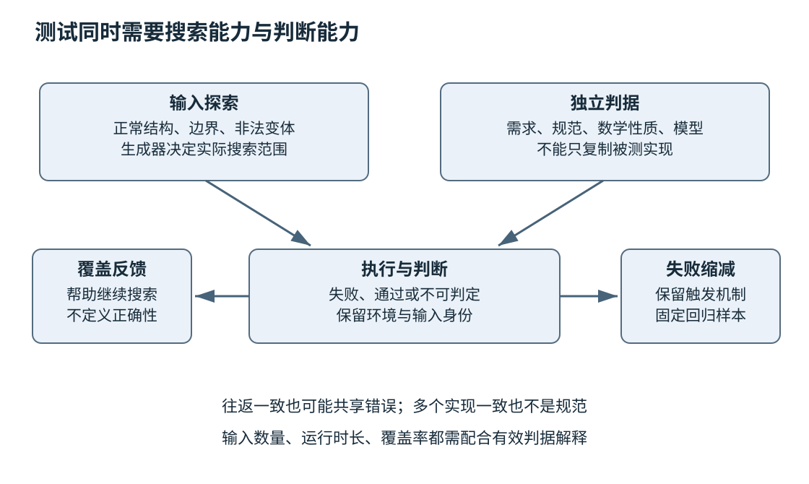
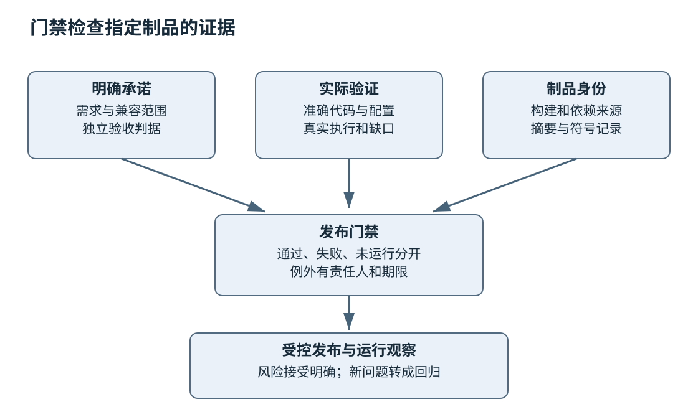

# 第二十三章 从测试到可信验证

全书正文初稿 · 第五篇 可交付可维护的软件工程 · 核验日期 2026-10-03

测试不是让程序尽可能多地运行，而是用有判断力的观察检验承诺。一个程序处理一百万个输入没有崩溃，仍可能把每个结果都算错；一个测试执行了所有代码行，仍可能从未检查输出；一个新实现与旧实现完全一致，仍可能共同继承同一个错误。验证的可信程度取决于输入、判据、环境与证据之间的关系。

**测试判据**说明怎样区分正确与错误，常被称为 oracle；它可以来自需求、数学性质、独立模型、协议规范或经过核验的样例。**覆盖**描述哪些空间被观察过，空间可能是代码、输入、状态、配置或故障类型。测试数量与代码覆盖率都只是其中一个侧面，不能替代判据。

本章将单元、集成和系统验证连接到性质测试、模糊测试、并发调度及发布门禁。第二十二章负责解释已经发生的失败，本章则把这些失败及更早的风险变成可重复检验。所有程序、命令和测试片段均未编译、未执行；示例给出设计与静态推理，不虚构通过记录、覆盖率或缺陷发现数量。工具事实核验于 2026-10-03。

## 23.1 Unit Integration System与契约测试

### 23.1.1 测试层级由边界与责任决定

**单元测试**在受控边界内检验较小模块，力求快速定位逻辑错误；**集成测试**检验真实组件组合，关注接口、配置与资源交互；**系统测试**从较完整的产品入口观察用户可见行为。三者不是简单按文件大小命名，一个几千行库的纯函数测试仍可能比跨网络的小函数测试更隔离。

划分的关键是哪些依赖真实存在、哪些被替代，以及失败能说明什么。测试解析函数的长度检查时，可以使用内存输入，不必启动数据库；验证客户端是否正确处理服务器返回的编码和错误时，则需要足以代表协议的交互。选择较低层级可以减少成本，但不能因此漏掉跨边界事实。

所谓测试金字塔是帮助讨论成本与反馈速度的模型，不是所有工程都必须遵守的固定比例。编译器、驱动、GUI、数据管道和云服务有不同风险。合理组合从失败后果出发：哪些错误在纯逻辑中可检验，哪些只能由真实硬件或多组件环境揭示，哪些上线后仍需要观测。[S1]

### 23.1.2 一个测试应讲清前提 动作与可观察结果

好的测试首先建立明确前提，然后执行目标行为，最后检查承诺。名字和失败信息应说明违反了什么，而不是只标成 test1。对于有状态对象，还要检查失败后的状态与资源，不能只验证返回一个错误码。

例如“无效配置不得覆盖当前有效配置”包含至少两个观察：调用报告失败，原配置仍能正常使用。只测试抛出了异常，可能遗漏对象已被部分修改；只比较一个字段，又可能遗漏资源泄漏。第十四章的基本保证和强保证在测试中需要落到具体可观察后置条件。

```cpp
// GoogleTest 教学片段，未编译、未执行；不是完整测试工程。
// 前提：工程提供 Config、load_config 与其公开观察接口，已链接 GoogleTest。
#include <gtest/gtest.h>
#include "config.hpp"

TEST(ConfigLoad, RejectsInvalidInputWithoutReplacingActiveConfig) {
    Config active = Config::valid_for_test();
    const auto before = active.snapshot();
    const auto result = load_config("port=-1", active);
    EXPECT_FALSE(result.ok());
    EXPECT_EQ(active.snapshot(), before);
}
```

这里的 `snapshot` 必须覆盖契约相关状态，并具有稳定、可比较的语义；若它遗漏内部资源，则还需其他观察。`valid_for_test` 只是工程应提供的测试构造入口，本章没有给出实现。片段选择框架断言，避免把关键测试检查写成可能因 `NDEBUG` 而消失的标准 `assert`。

GoogleTest 的致命与非致命断言会影响失败后是否继续执行。若后续访问要求容器非空，应先用能停止该测试函数后续执行的检查，不能在长度检查失败后继续越界。致命断言退出的是它所在的当前函数；若检查位于辅助函数中，不能假定外层调用者也会自动停止，需显式传播失败。测试代码本身也需要遵守生命周期、异常和线程规则，不能因为“只是测试”就忽略未定义行为。[S2]

### 23.1.3 替身要替代依赖行为 而不是复制实现

**测试替身**包括预设返回值的 stub、具有简化真实行为的 fake、记录交互的 spy，以及验证调用预期的 mock。名称在框架间可能略有差异，实际重要的是替身承诺什么。一个总返回成功的存储替身无法验证磁盘满，一个立即执行回调的替身无法充分覆盖真实异步生命期。

过度模拟内部调用会把实现细节冻结成测试契约。若合法重构只是合并两次查询，却让数十个“必须调用两次”的测试失败，测试可能检查了错误层级。应优先验证外部可观察结果，只有调用顺序、次数或资源交互本来就是契约时，才把它们写成严格预期。[S3]

替身与真实实现还会漂移。内存存储可能区分大小写，真实数据库按另一排序规则工作；假时钟允许任意倒退，真实接口却只提供单调时间；假网络一次返回完整消息，真实 TCP 会分段。应为依赖抽象建立一组共同契约测试，同时对关键真实组合保留集成测试。

### 23.1.4 测试隔离使失败可以被解释

测试不应无意依赖执行顺序、前一个测试残留的文件、固定端口或全局随机状态。每个测试需要拥有可识别的临时资源，并在结束时按规则清理。并行执行会放大隐藏共享：同一个临时文件名、同一数据库记录或共同环境变量，都可能使无关测试互相污染。

隔离并不意味着必须重建整个系统。可以共享不可变材料或成本较高的只读环境，但要明确每个用例的状态边界。对数据库测试，可采用独立命名空间、事务或一次性实例；选择哪一种取决于它是否保留真实提交、约束和并发行为。事务回滚测试不能替代需要验证提交后可见性的场景。

时间也应被抽象到适当边界。为了验证十分钟后过期，测试不必真的等待十分钟，可以注入受控时钟并推进时间；但定时器和事件循环集成仍需少量真实时间测试。直接用长时间 sleep 等待后台任务，是慢且不稳定的同步替代品，最好等待明确事件并设置合理失败期限。

### 23.1.5 契约测试检验组件共同理解

**契约测试**检查组件对交互的共同约定，例如请求字段、响应语义、错误分类和版本兼容。消费者认为某字段总存在，提供者却在部分状态省略，是典型契约缺口。单独验证服务符合一个 schema，还不能证明所有消费者使用方式正确。

Pact 的消费者驱动方式以消费者测试记录交互，再由提供者验证对应预期。它强调真实消费代码与提供者行为之间的联系，而不是人工编一个与双方代码都脱节的样例文件。具体工具只覆盖所记录的交互与匹配规则，不自动覆盖完整业务状态空间。[S4]

契约应避免过度限定无关字段。消费者只依赖某个字段时，把响应中所有排序与装饰字段逐字固定，会无谓阻碍提供者演进；反过来，只检查状态码 200 又可能漏掉真正使用的内容。匹配精度应对应消费者实际依赖，未知字段、缺省值和错误响应也应明确。

对于同进程 C++ 库，契约测试不一定需要网络工具。可以对公开接口检查所有权、错误保证、线程安全边界、安装后消费和 ABI 支持矩阵。第二十一章的独立消费者就是构建层契约测试的一种体现。

### 23.1.6 系统测试关注完整用户承诺

用户关心的是“导入文件后数据正确可用”“断线重连不会重复扣减”“升级以后旧文档仍能打开”，不只是某个函数返回真。系统测试应选择有代表性的端到端路径，检查结果、错误体验、持久状态及必要资源指标。

完整环境昂贵，失败定位也较难，因此不宜把所有细小边界都推到系统层。一个合理做法是在较低层覆盖大量数据与状态组合，用少量系统路径验证真实接线、配置、权限和部署。若系统测试发现逻辑缺陷，可以补一个较低层回归，让下次更快发现；原系统路径仍可能保留以防集成回归。

**面试追问：“Mock越多，单元测试越好吗？”** 不一定。替身减少外部依赖，也可能模拟错行为或冻结内部实现。应看它是否让目标契约更容易检验，并用真实集成和共同契约校验替身的假设。

**面试追问：“契约测试能否替代端到端测试？”** 它能更早发现交互不兼容，但不完整验证部署、鉴权、路由、数据迁移和全链路业务结果。应按风险保留必要系统验证，而不是把工具能力推广成全部产品保证。

## 23.2 Property Based Fuzzing 差分测试与边界

### 23.2.1 性质把大量样例压缩为可检查的承诺

**基于性质的测试**先描述在一类输入上应成立的关系，再由生成器探索输入。排序结果应有序、元素多重集合应保持；编码后解码应恢复允许范围内的语义；重复应用规范化应与应用一次相同。这些性质往往比人工列出几个普通值更能暴露结构性错误。

性质必须足够强。只检查排序结果有序，返回空数组也可能通过；只比较元素集合，会忽略重复元素数量。组合“长度不变、每种元素出现次数不变、顺序符合比较关系”，才能排除更多错误。浮点排序还要明确 NaN 等特殊值的比较规则，不能把整数直觉直接套用。

Hypothesis 是 Python 生态的性质测试工具，提供输入生成、失败保存和缩减等能力。本章借其官方说明解释方法，不意味着 C++ 工程必须引入 Python；其他语言可以使用相应框架，也可以在受控测试驱动中实现生成与检查。[S5] [S6]

### 23.2.2 生成器决定实际探索的输入空间

“随机生成整数”没有回答范围、分布和有效约束。若长度上限是 65535，均匀生成常见小值可能很少触及边界；若解析器要求校验和，任意随机字节可能几乎都在入口被拒绝，深层逻辑长期没有被执行。生成器需要同时覆盖合法结构、非法变体与关键边界。

一种方法是先生成合法对象，再序列化成输入，并有针对性地破坏一个约束，例如截断最后一个字节、扩大声明长度、重复禁止字段或替换编码。另一种方法使用结构感知变异，使输入仍能穿过浅层验证。两者都应保留直接随机字节的入口，以检查解析器对完全无结构输入的防御。

约束太强也会隐藏缺陷。若生成器永远不产生空字符串，测试就无法支持“接受任意字符串”的承诺。应把生成域写进测试说明，并检查被过滤输入的比例和被遗漏类别。生成器与被测实现共享同一个错误解析器，也可能让非法输入被悄悄排除。

### 23.2.3 缩减应保留失败的语义

发现一个长输入失败以后，**缩减**尝试删去或简化无关部分，得到更容易解释的反例。它与第二十二章的最小复现原则一致：缩减器必须持续检查同一失败判据，而不是只追求字节数更少。

对状态机，最小反例可能是三次操作，而不只是一段数据。缓存的错误可能需要“插入、淘汰、读取”，资源错误可能需要“启动、取消、完成”。状态化性质测试可以用独立模型检验这样的操作序列。[S15] 删除初始化步骤以后出现另一种错误，不代表已经找到了原缺陷的最小原因。

应保存最终反例、原始种子或生成信息、工具版本和配置。只保存种子可能不足以跨工具版本重建同一输入，因为生成算法会变化；直接保存最小输入更利于长期回归。对外部时序或线程交错，还需要对应事件记录，单一随机种子不能控制操作系统的一切行为。

### 23.2.4 往返性质需要语义等价关系

编码后解码相等，看似自然，却需要说明什么是相等。浮点文本格式可能不保留原始拼写，JSON 对象字段顺序可能无意义，路径规范化可能改变冗余分隔符。应比较协议允许的语义，而不是无条件比较所有字节。

反向往返“解析后重新编码等于原输入”通常只对规范编码成立。若解析器允许多种等价写法，重新编码可能统一成一种；如果格式要求保留未知字段，则又要检查不能在往返中丢掉它们。性质来自规范，不应为了让现有实现通过而临时放宽。

更重要的是，编码器与解码器可能共享同一个错误。双方都把大端写成小端，往返仍然成功，跨系统通信却失败。因此还需要独立规范样例、外部兼容实现或手工推导的边界值。往返是一种强关系，但不是协议正确性的完整证明。

### 23.2.5 模糊测试将输入探索与失败检测连接起来

**模糊测试**持续产生或变异输入，寻找崩溃、超时、资源异常或性质违反。覆盖引导工具利用执行反馈保留有助于探索新路径的输入。libFuzzer 提供进程内目标函数形式，AFL++ 提供多种插桩与执行工作方式；它们的配置和适用范围应按所用版本核对。核验日的 LLVM 文档说明，libFuzzer 仍维护重要缺陷，但原作者已转向 Centipede，不应预期持续增加重大新功能；本章用它讲解稳定的目标函数模式，不把它当作唯一工具选择。[S7] [S8]

```cpp
// libFuzzer 目标教学片段，未编译、未执行；不是完整工程。
// 前提：parse_frame 在 parser.hpp 中定义，接受任意字节视图并返回显式结果。
#include <cstddef>
#include <cstdint>
#include <span>
#include "parser.hpp"

extern "C" int LLVMFuzzerTestOneInput(const std::uint8_t* data,
                                    std::size_t size) {
    constexpr std::size_t test_input_limit = 1U << 20;
    if (size > test_input_limit) {
        return 0;
    }
    const auto result = parse_frame(std::span<const std::uint8_t>(data, size));
    verify_parser_postconditions(result, size); // 工程需实现独立的始终启用检查
    return 0;
}
```

上限是这个教学驱动主动限制的探索范围，不是已证明产品应接受的最大消息。`verify_parser_postconditions` 必须在违反性质时可靠使测试失败，不能只是一个在发布模式被移除的断言；本章没有提供其实现。解析失败是预期结果之一，应按契约处理，不能把所有非法输入都误判成漏洞。

驱动应尽量可重复、无外部副作用并在每轮恢复状态。把异常全部吞掉再返回成功，可能掩盖真实缺陷；把解析失败直接当崩溃，又会淹没有效信号。持续进程模式尤其要检查全局缓存、随机状态和残留资源，否则第十万个输入的失败可能无法由单个文件复现。

### 23.2.6 语料质量比运行时长更能说明探索范围

**语料库**保存有代表性的输入与已发现反例。合法短消息、最大边界、不同版本、特殊编码和历史缺陷都可以成为起点。只堆积大量重复文件，会增加成本而不一定扩展行为覆盖。可以按工具反馈与语义类别精简，但历史安全回归样本应保留明确身份。

运行了多久只是预算记录。更有解释力的报告包括目标入口、构建配置、检查器、输入大小范围、语料来源、代码与状态覆盖、发现问题的处置以及未触及区域。执行次数很高，但全部在魔数检查前被拒绝，仍是浅覆盖。

超时和内存峰值也是需要判断的信号。一个输入触发深度递归或指数回溯，可能构成资源耗尽风险，即使没有越界。测试应给出受控资源预算，避免将实验拖垮共享环境；限制触发以后，还需区分工具开销、合理的大输入成本和算法问题。

### 23.2.7 差分测试的分歧是调查入口

**差分测试**把同一输入交给多个实现、版本或算法，对比结果。一个简单但慢的参考实现可以检验优化实现，一个旧版本可以帮助发现行为变化，不同库可以发现协议解释分歧。差分不要求其中一个永远正确，但要求有办法解释差异。

多数表决不是规范。多个实现可能复制相同算法、共享依赖或接受同一种扩展。出现分歧时应回到需求、标准、已知有效输入与允许误差；对格式未规定的行为，不应随意判定唯一正确答案。未定义行为输入也不能用于证明编译器必须输出相同结果。

浮点差分需要绝对误差、相对误差、特殊值与数值稳定性的共同判据。仅设置一个很大的 epsilon 可以让所有差异消失，却失去检验意义。应根据算法误差模型与业务后果选择标准，并针对接近零、极大值和条件数差的输入补充分析。

### 23.2.8 边界来自表示和状态转换

边界不只有最小值和最大值，还包括空与非空、恰好够与少一个、对象有效与失效、版本已知与未知、操作提交前与提交后。长度 N 的缓冲区，应检查 0、1、N−1、N 和 N+1 等与契约相关值，并注意 N+1 本身是否可表示。

编码和单位转换也是边界。字节数与元素数混用、毫秒与秒混用、无符号长度转成有符号整数，都可能在普通样例中看起来正常。生成器应有意识地穿过转换阈值，测试判据则要明确拒绝、截断或饱和是否被允许。

**面试追问：“随机测试和性质测试有什么不同？”** 随机描述输入选择方式，性质描述判断关系，两者可以结合。没有有效判据的随机运行只能观察有限症状；有性质但生成域太窄，也可能遗漏重要输入。

**面试追问：“两个解析器结果相同，就证明协议实现正确了吗？”** 不能。它们可能共享错误或实现同一扩展。应结合独立规范样例、边界推导和错误输入契约，差分用于发现分歧，规范用于解释分歧。



图 23-1 输入探索与正确性判据是两条责任。覆盖反馈决定往哪里继续找，不能决定结果在业务上是否正确。

## 23.3 并发测试 故障注入 确定性回放

### 23.3.1 并发错误来自合法操作的危险交错

两个线程分别正确调用接口，组合起来仍可能违反不变量。一个线程读取容量后暂停，另一个线程扩容并移动缓冲，第一个线程继续使用旧地址；取消与完成都试图交付结果；关闭与注册交错导致事件指向已回收对象。问题不在某个输入值，而在事件顺序与生命周期。

压力测试增加执行机会，但操作系统调度并不均匀遍历所有交错。重复运行同一负载一万次，也可能一直没有触及一个短窗口。应结合状态机分析，列出关键竞争边界，在可控制的测试接口处安排暂停、恢复与事件顺序。

系统化调度探索会在约定的调度点和模型内搜索交错，并保存可重放路径。Microsoft Research 的 CHESS 工作展示了这种思路的重要性；它不是证明任意现实并发系统的通用按钮，模型、边界和环境假设仍决定可得结论。[S9]

### 23.3.2 并发测试要检查历史而不仅是最终数值

一个并发队列最终取出了所有元素，仍可能在中途违反顺序或重复交付后又被测试清理掉。应记录操作开始、完成、参数与结果，检查是否能解释为满足契约的合法历史。第十八章的线性化概念提供一种判据：每个操作仿佛在调用与返回之间的某个时刻原子发生，并尊重不重叠操作的先后关系。

线性化检查并非所有对象都需要或都适用。弱一致缓存、近似计数和最终一致服务可能有不同契约，测试应按其承诺构造模型。把本来允许近似的结果强行判成错误，会产生噪声；把要求精确的对象用“最终差不多”检查，则会漏掉缺陷。

记录本身也可能影响调度。高频同步日志会改变竞争窗口，测试驱动最好采用受控、低干扰的记录方式，并对记录丢失给出明确处理。若轨迹不完整，不能把检查器无法找到反例写成通过，应标为不可判定或无效试验。

### 23.3.3 取消与完成适合用状态机枚举

以异步操作为例，至少考虑未提交、在途、终态确定、结果交付和资源可回收。取消请求不是终态，也不意味着外部执行者立即停止使用缓冲。测试应让完成先于取消、取消先于完成、两者同时竞争，以及关闭发生在不同阶段。

每条路径都要检查相同不变量：结果最多交付一次，所有在途访问结束后才释放资源，计数最终归零，等待者不会永久挂起。仅检查回调次数等于一还不够，因为回调可能引用已失效内存；仅检查没有崩溃也不够，因为资源可能永远不释放。

测试接口可以提供“已完成提交但尚未派发完成”的屏障点，使竞态稳定重现。这样的接口应限制在测试或明确诊断边界，避免生产逻辑依赖它。测试调度器必须保持真实接口允许的顺序，不能制造被底层契约明确禁止的情况后指责上层不健壮。

### 23.3.4 故障注入验证失败后的行为

**故障注入**在受控位置制造失败，用来检查系统是否按预期恢复或安全终止。可以让某次分配失败、文件读取只返回部分内容、连接在提交后断开、下游响应延迟或依赖暂时不可用。重点不是制造混乱，而是检验一个明确假设。

假设配置更新承诺失败不改变旧值，可以在读取、解析、验证和提交前的每个可失败点注入错误，检查旧值仍有效，临时资源被释放。提交后的外部副作用则可能不能回滚，需要另一套补偿或幂等契约。把所有失败统一模拟成入口返回错误，会漏掉部分完成状态。

资源故障必须符合现实语义。短读不是 EOF，超时不证明服务端未执行，连接关闭不保证磁盘事务回滚。测试替身若把这些关系简化错了，会验证出一种现实中不存在的“可靠性”。第二十四章的发布回滚与第三十四章的分布式失败会继续使用这些区别。

### 23.3.5 故障实验需要安全边界与停止条件

在隔离环境中注入失败通常风险较低，但仍可能占满磁盘、影响共享服务或意外触发外部请求。实验前应说明目标、授权范围、受影响资源、预期现象、停止条件与恢复动作。高风险场景应先在更小环境验证，不能以“混沌工程”为名绕过变更管理。

Microsoft 的混沌工程文档将故障实验与韧性假设联系起来；本章只采用这种受控实验思想，不鼓励对未经授权的服务或设备制造故障。生产实验若确有必要，需由相应责任人批准，严格限制影响范围并具备独立停止路径。[S10]

停止条件应以用户影响或安全指标表达，例如错误率超限、关键队列持续增长、恢复流程未按时完成。实验控制系统自身也可能受被注入故障影响，因此停止机制不能完全依赖已经被切断的同一条控制链路。恢复以后还应验证配置和资源确实回到预期状态。

### 23.3.6 确定性需要控制影响结果的输入

固定随机种子只是确定性的一部分。时钟、线程调度、文件枚举、网络响应、进程 ID、外部数据库状态和浮点环境都可能改变结果。若测试把这些隐式输入保留在外部，再给出一个 seed，就不能承诺完整回放。

可以在适当抽象边界注入时钟、随机源、执行器和外部响应，并记录事件序列。回放时按相同语义驱动状态机，而不一定重复每一条机器指令。进程级记录工具则采用另一层机制，其平台和副作用约束见第二十二章。不同回放层级解决不同问题。

确定性测试也有盲区。一个完全串行的模拟调度器可以验证状态机某些顺序，却可能看不到真实弱内存行为、锁实现和系统调用竞争。因此应将模型测试、原生并发压力、动态竞争检查与平台测试结合，明确每项证据覆盖什么。

### 23.3.7 不稳定测试需要被诊断 而不是反复重跑掩盖

**不稳定测试**在代码和预期相同的条件下产生不一致结果，常见原因包括真实竞态、时间假设、资源竞争、外部服务、顺序依赖或测试自身缺陷。自动重试能减少偶发阻塞，但也可能把真实问题隐藏为绿色。

报告应保留首次失败与重试结果，而不是只展示最终成功。可以临时隔离已知不稳定项，前提是明确责任人、修复期限和覆盖损失；不能让隔离区成为永久垃圾桶。高风险测试若不可靠，说明门禁证据不足，不能因为“它经常乱报”就忽略真实失败。

超时阈值应根据环境和目标设置。把阈值从一秒改为一分钟可能消除偶发失败，却掩盖性能回归。先区分功能等待上限、调度余量和业务 SLO，再决定如何调整。第二十七章会解释用户目标与测试阈值之间的关系。

**面试追问：“并发测试跑了很久没出错，能否上线？”** 运行时长是证据之一，还要有不变量、危险交错覆盖、平台与检查器范围、已知风险和回滚措施。不能用时长替代并发契约证明。

**面试追问：“如何让取消竞态稳定重现？”** 在提交、完成到达、结果交付和回收边界设置受控调度点，枚举允许顺序并检查一次完成和生命周期不变量。测试必须遵守真实底层契约，避免制造不存在的事件顺序。

## 23.4 静态分析 覆盖率 AI生成代码独立验收与发布门禁

### 23.4.1 静态分析把未执行路径纳入检查

**静态分析**不依赖实际运行某个输入，而是根据源码、类型、控制流和数据流推断潜在问题。编译器警告、规则检查和路径敏感分析具有不同深度。Clang Static Analyzer 与 clang-tidy 的定位不同，后者也包含多种检查类别，不能把所有报告都当成同一种证明。[S11] [S12]

静态分析需要正确构建上下文。缺少宏、头文件路径、语言模式或目标平台，会使分析与真实产品不同；分析成功解析了一份代码，也不代表它看到了所有配置分支。第二十一章的编译数据库与工具链记录帮助建立这一联系。

误报与漏报是实际工程需要管理的问题。应按错误后果、规则可靠性和可修复性分级，将高置信严重问题作为门禁，对例外保留依据。简单追求“零告警”可能诱导大面积关闭规则；更好的目标是新增问题不失控，旧债有清楚责任，重要风险有证据处理。

### 23.4.2 覆盖率描述执行到哪里 不说明检查得多好

行覆盖看某行是否执行，分支覆盖看分支结果是否出现，区域覆盖可以更细地对应源码结构。工具对模板、宏和优化的映射也有具体规则。Clang 的源码覆盖文档说明了其计数与报告机制，项目需要说明自己使用哪一种口径。[S13]

一个函数所有行都执行了，如果测试没有验证返回值，覆盖率仍可很好看。一个条件的真假都出现，也不保证所有条件组合、循环次数和状态迁移都被检查。覆盖缺口可以提示未探索区域，高覆盖则只是减少某类未知，不能证明需求正确。

可以用**变异测试**评估测试敏感性：人为引入受控小错误，例如反转比较或删去边界检查，观察测试能否失败。未被发现的变异提示判据可能太弱，但等价变异和工具限制需要人工解释。变异分数也不应成为新的唯一指标，尤其不能为了杀死变异而写死实现细节。

需求覆盖与代码覆盖需要互相对照。权限检查、失败后不改变状态、旧版本兼容等承诺可能跨越多处代码；代码多出一条分支也不一定对应新需求。用需求到测试的可追踪关系解释关键保证，比单独展示一个百分比更有价值。

### 23.4.3 AI生成代码也需要独立判据

AI可以生成实现、测试和审查建议，但同一上下文下生成的实现与测试可能共享同一个误解。若需求是“失败不改变旧状态”，模型却把它理解为“失败返回 false”，它可能同时生成会部分修改对象的实现和只检查 false 的测试，两者相互印证却都没有满足需求。

独立验收首先要让判据来自人确认的需求、协议或可靠模型，而不是从实现反推“它做了什么就应该是什么”。可以让另一位工程师在不依赖实现细节的情况下编写关键验收样例，或者使用独立参考算法和保留样本。换一个模型有时能增加差异，但模型名字不同不构成统计或逻辑独立性的保证。

GitHub 的负责任使用资料明确要求审查和验证生成内容，并把自动代码审查作为人工审查的补充。这里引用其限制说明，不采用任何未经验证的准确率或生产收益数字，也不把某产品版本的界面能力作为本章结论。[S14]

### 23.4.4 独立验收要覆盖生成过程容易遗漏的部分

生成代码常在一个可见函数上表现完整，却遗漏构建集成、错误路径、资源释放、平台限制和安全边界。验收应查看实际差异及周边契约：是否引入新依赖，是否改变权限，是否扩大输入接受范围，是否把异常吞掉，是否绕过检查，是否留下只返回固定值的替代实现。

测试结果必须由真实执行记录支持。模型写“测试通过”不是测试证据，终端里只成功运行格式检查也不是功能测试。应保存命令、环境、退出状态和必要日志，区分编译、静态分析、单元、集成与目标运行。未执行就明确标记未执行，不应把计划语句变成完成记录。

还要检查测试是否被改弱。为通过门禁而删除断言、放大误差、跳过失败用例或把期望值改成当前错误结果，是任何作者都可能犯的问题，AI快速批量修改会放大它。评审应同时看实现与测试的变化，要求说明每个期望变化对应哪一条已批准需求。

生成过程接触的外部文本也可能包含错误或恶意指令。仓库文件、日志和网页是待分析材料，不自动获得修改权限。测试环境应限制秘密和外部写权限，避免“运行测试”实际上触发未经批准的数据传输或系统更改。第二十六章与第五十五章会进一步讨论信任边界。

### 23.4.5 发布门禁应与风险及制品身份绑定

**发布门禁**是一组必须满足的证据条件，例如构建矩阵通过、关键契约回归通过、严重安全问题已处理、迁移验证完成和回滚路径可用。门禁的对象应是实际待发布制品及其来源，不能只证明某个相近提交曾经通过测试。

不同风险可以采用不同深度。纯文本修正不需要重新跑所有硬件压力测试，但涉及内存回收、认证、持久数据格式或金额计算的变更，应有更强验证。基于变更范围选择测试可以加快反馈，但选择逻辑本身有漏选风险，应保留定期完整验证与保守回退。

门禁结果至少区分通过、失败、未运行和基础设施错误。测试机失联不能记为通过，超时也不能自动被解释为产品失败或无关噪声，需要诊断。被允许的例外应写明风险接受者、范围和期限；一个无人负责的跳过标记会长期侵蚀可信度。

### 23.4.6 从快速反馈到发布证据分层组织

本地和提交前适合运行快速、确定、定位清楚的检查；合并阶段可以扩大到多配置构建、集成和关键性质；夜间或专门任务可以投入更长模糊测试、压力和兼容矩阵；发布前则确认迁移、制品与恢复证据。这是按成本组织反馈，不意味着慢测试失败可以等到下次再说。

失败应能回到明确责任边界。报告里最好有测试身份、对应需求、构建与平台、最小反例以及如何复现。一个只有“job failed”的红灯会迫使工程师重新发现证据；过多无上下文日志则同样难用。第二十二章的故障记录格式可以直接用于测试失败。

测试基础设施也是软件，需要版本、资源预算、隔离和监控。缓存污染、共享环境漂移和权限配置错误都可能让门禁失真。对关键流水线，可以定期用已知会失败的受控样例检查它真的会阻断，而不是所有脚本忽略退出状态后仍然显示成功。



图 23-2 门禁不是一排绿色按钮，而是对指定制品的证据检查。生成者、测试作者和批准者可以协作，但正确性依据不能循环引用。

### 23.4.7 验证计划要诚实说明剩余风险

一个可靠报告可以说“在列出的平台与输入范围内，关键契约测试通过；某硬件路径尚未验证；模糊测试覆盖入口A但未覆盖压缩插件；迁移只验证了两个旧版本”。这样的结论比“全面测试完成”更有决策价值，因为它告诉发布者哪些风险已经降低，哪些仍然存在。

验证也不是一次性终点。用户反馈、事故和依赖变化会发现新的状态空间，应把它们转成回归、生成器类别或契约补充。补测试之前先确认根因，否则可能保存一个与原问题无关的脆弱样例。测试套件长期价值在于保存产品承诺和历史教训，同时仍允许正确重构。

**面试追问：“覆盖率达到百分之百为什么还会出错？”** 覆盖率只说明特定结构被执行，未证明判据强度、输入组合、并发交错、平台配置和需求完整性。应结合独立判据、边界和状态覆盖解释质量。

**面试追问：“让AI写代码，再让AI写测试是否足够？”** 不足。共享误解可能让两者一致犯错。关键验收应源于确认过的需求和独立证据，检查实际执行记录、测试是否被弱化，并由有责任的工程人员评估剩余风险。

**面试追问：“如何判断发布门禁值得信任？”** 它必须对准确制品运行正确配置的检查，失败与未运行不会被隐藏，例外可追踪，关键判据独立于实现，并且已有证据表明门禁确实能捕获所声称阻止的问题。

## 来源与阅读边界

官方资料核验于2026-10-03。测试方法、场景推理和图为原创组织；本章未运行任何测试、故障实验或生成代码验收，未提供虚构覆盖率和性能结论。

- S1：Google SRE Testing for Reliability，测试组合与系统可靠性背景
- S2：GoogleTest Primer，测试组织及致命/非致命断言
- S3：gMock Cookbook，行为预期与替身使用边界
- S4：Pact How Pact works，消费者测试与提供者验证
- S5：Hypothesis 官方入口，性质与输入生成
- S6：Hypothesis Replaying failed tests，失败保存与回放范围
- S7：LLVM libFuzzer，覆盖引导目标与驱动约束
- S8：AFL++ 官方深度指南，语料与模糊测试配置
- S9：Microsoft Research Finding and Reproducing Heisenbugs in Concurrent Programs，系统化调度探索
- S10：Microsoft Chaos engineering and resilience，受控故障实验
- S11：Clang Static Analyzer，静态路径分析定位
- S12：clang-tidy 官方说明，检查类别与构建上下文
- S13：Clang Source-based Code Coverage，覆盖口径
- S14：GitHub Copilot Agents 负责任使用说明，生成内容与自动审查的验证责任
- S15：Hypothesis Stateful tests，操作序列与模型对照方法

[S1]: https://sre.google/sre-book/testing-reliability/
[S2]: https://google.github.io/googletest/primer.html
[S3]: https://google.github.io/googletest/gmock_cook_book.html
[S4]: https://docs.pact.io/getting_started/how_pact_works
[S5]: https://hypothesis.readthedocs.io/en/latest/
[S6]: https://hypothesis.readthedocs.io/en/latest/tutorial/replaying-failures.html
[S7]: https://llvm.org/docs/LibFuzzer.html
[S8]: https://github.com/AFLplusplus/AFLplusplus/blob/stable/docs/fuzzing_in_depth.md
[S9]: https://www.microsoft.com/en-us/research/publication/finding-and-reproducing-heisenbugs-in-concurrent-programs/
[S10]: https://learn.microsoft.com/en-us/azure/chaos-studio/chaos-studio-chaos-engineering-overview
[S11]: https://clang.llvm.org/docs/ClangStaticAnalyzer.html
[S12]: https://clang.llvm.org/extra/clang-tidy/
[S13]: https://clang.llvm.org/docs/SourceBasedCodeCoverage.html
[S14]: https://docs.github.com/en/copilot/responsible-use/agents
[S15]: https://hypothesis.readthedocs.io/en/latest/stateful.html
