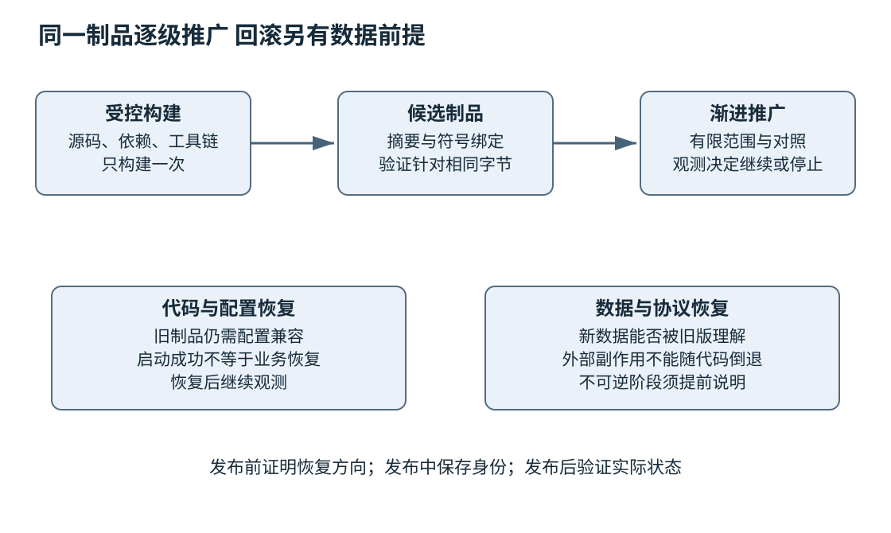
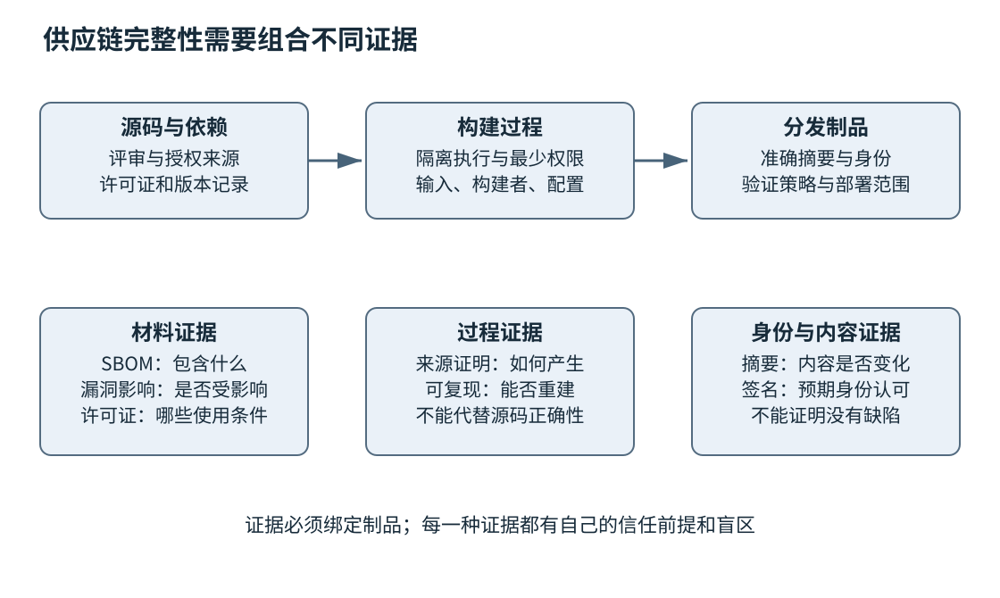

# 第二十四章 协作版本与发布工程

全书正文初稿 · 第五篇 可交付可维护的软件工程 · 核验日期 2026-10-03

软件交付不是把最新代码复制到服务器。团队必须知道变更为何产生、谁理解过它、哪些验证适用于它、最终制品包含什么，以及出问题时怎样恢复。多人协作使这些问题更加重要：每个人局部正确的修改，组合起来仍可能不兼容；一个看似简单的回退，可能遇到已经改变的数据格式。

版本控制保存可追踪的历史，代码评审保存技术判断，持续集成建立及时反馈，发布工程把经过验证的制品送到使用环境，供应链管理解释制品从哪里来。这些机制共同形成交付责任，而不是某一个平台的按钮集合。

本章不假定一种分支模型适合所有团队，也不把自动发布等同于无条件发布。示例中的 Git 命令均未执行，没有对任何仓库提交、推送、改写历史或发布。许可证段落解释工程识别与核查方法，不构成具体项目的法律结论。工具与规范资料按 2026-10-03 核验。

## 24.1 Git提交 分支 合并 Rebase和恢复

### 24.1.1 Git历史是快照关系而不是文件名清单

Git 的提交记录一个项目快照及其父提交等元数据，分支是指向提交的可移动引用。日常操作经常显示差异，但理解历史时要记得：一条提交不只是聊天式的“修改说明”，它还处在一个明确的祖先关系中。

工作区保存正在编辑的文件，暂存区表示下一次提交准备记录的内容，当前提交提供已有快照。三者可以不同。只看编辑器里的文件，不一定知道将要提交什么；只看提交差异，也可能漏掉未跟踪文件。提交前应检查暂存内容与工作区剩余差异，避免把本地调试配置、生成物或秘密混进去。

一个有意义的提交应尽量包含一个可解释的逻辑变化。它不一定只有几行，但应能说明目的、前提、行为变化与验证方式。把格式化、依赖升级和行为重构塞进同一巨大提交，会让评审、二分和回退同时变难。过碎而无法独立理解的提交也有成本，关键是保存有用的因果边界。

### 24.1.2 分支策略服务集成频率与发布约束

短期功能分支便于集中评审，长期维护分支支持多个产品版本，主干开发强调频繁集成与快速反馈。它们解决不同约束，不应按“先进”与“落后”简单排序。嵌入式设备发布周期、企业离线客户和持续在线服务，可能需要不同支持策略。

分支越久不集成，与主线的语义距离通常越大。即使文本没有冲突，接口假设、数据库结构和配置也可能分歧。频繁同步有助于提前发现问题，但必须保留可运行状态与清楚责任，不能为了每天合并而把未受控功能直接暴露给用户。

功能开关可以将代码集成与用户启用分开，但开关会增加配置组合和长期维护成本。每个开关应说明默认值、作用域、清理条件和是否影响安全。权限校验不能因为某个实验开关关闭就失效；一个紧急开关也应有可观测状态，避免运维人员不知道实际走哪条路径。

### 24.1.3 Merge与Rebase保存不同的历史关系

**Merge** 将不同历史合并。若一条分支只是另一条的后代，可能直接快进引用；若双方都有独立提交，则通常产生保留多个父关系的合并提交。**Rebase** 把一组提交的变化重新应用到新的基线，形成新的提交身份。两者都需要处理语义冲突，不能靠历史图形判断最终代码正确。[S1] [S2]

在个人尚未共享的工作中，rebase 可以整理基线与提交结构；对于别人已基于其继续工作的共享历史，改写会影响协作者的引用和后续合并。是否允许重写、怎样协调与恢复，应遵守团队明确规则。不能因为工具允许强制推送，就把它当作普通同步手段。

文本冲突只是 Git 无法自动合并某些位置的提示。没有冲突也可能错误：一方把参数单位从秒改成毫秒，另一方新增调用却仍传秒；一方改变返回值语义，另一方把旧语义写进条件。合并后需要针对组合结果重新验证，而不只是相信两个分支分别测试通过。

### 24.1.4 冲突解决是在恢复共同契约

处理冲突前先理解双方目的、共同祖先和相关测试。简单选择“全部保留我的版本”或“全部接受对方版本”，可能丢掉另一方必要修复。应把冲突放回接口和状态不变量中，决定最终应当是什么，再构造代码。

生成文件与源码冲突的处理也不同。若锁文件或生成代码由明确输入产生，应先确定输入的正确合并，再按受控流程重新生成并审查结果。手工拼接一个复杂锁文件可能形成工具从未产生过的无效状态；完全删除重算则可能引入未经评审的依赖变化。

合并提交的说明应记录非显然决策。例如两个修复都保留，但某个旧分支调用点改用新单位；或者某项迁移暂缓，因为消费者还未升级。这些信息对以后回归与回退比一句“resolve conflicts”更有价值。

### 24.1.5 恢复操作先区分要恢复哪一层

**Restore** 主要用于把文件内容恢复到指定来源，**reset** 可以移动引用并按模式影响暂存区与工作区，**revert** 通过新提交抵消既有提交的变化。它们不是同义的“撤销”。选择前应明确：要丢弃未提交编辑、调整暂存、移动本地分支，还是在共享历史中公开撤回某个变更。[S3] [S4] [S5]

```bash
# Git 只读检查示意，未执行；前提：位于已授权检查的仓库。
# 这些命令用于判断当前状态，不包含恢复或推送动作。
git status --short
git diff
git diff --cached
git log --oneline --decorate -n 12
git reflog -n 12
```

这里不列一个可以随手复制的破坏性恢复序列，因为正确动作取决于工作区与共享状态。尤其是会覆盖工作区或清理未跟踪文件的操作，应先保留所需材料并获得相应授权。把“我只是修复 Git”当作删除工作成果的理由，是协作事故而不是技术能力。

Revert 保留原历史与撤回记录，常适合共享分支，但它只抵消代码层变化。已经执行的数据库迁移、外部消息和用户数据不会自动倒流。回退合并提交还涉及选择相对于哪个父提交解释变化，影响后续再次合并；必须理解历史，不能把一个数字参数当作通用答案。[S5]

### 24.1.6 Reflog是恢复线索 不是永久备份

Reflog 记录本地引用的移动，常用于寻找 rebase 或 reset 前的位置。它有保留与过期机制，也不是天然同步到所有远程的完整审计日志。对象被清理后，某些历史可能不再可恢复，因此不能拿 reflog 代替正式备份和共享仓库策略。[S6]

恢复时应先找到可能的提交并检查内容，再建立保留引用或按安全流程取回需要的变化。若只是丢失一段未暂存、未提交也未被其他机制保存的编辑，Git 未必曾经拥有它。诚实解释恢复范围，比承诺“一切都能找回”更重要。

提交作者字段也不自动证明真实身份。签名可以增加来源验证，但还要知道信任哪个密钥或身份、签名对应哪些字节以及密钥管理是否可靠。版本历史提供结构化材料，组织仍需要权限、审查与审计策略。

### 24.1.7 历史应帮助定位与迁移

Git bisect 用好坏判据缩小引入变化的范围，适合第二十二章的回归定位。它依赖可重复测试和可解释候选版本，无法构建的版本需要区分处理。找到首个坏提交是调查入口，不能直接证明其中所有修改或作者承担全部原因。[S7]

Cherry-pick 可以把某个变更应用到另一条历史，但它可能依赖原分支上的前置修改。安全补丁回移到旧维护版时，要检查 API、数据结构、配置与测试是否仍成立。成功应用补丁只说明文本可合并，不说明语义已适配。

**面试追问：“Merge和Rebase哪个更好？”** 取决于是否需要保留分支拓扑、历史是否已共享，以及团队如何组织审查。二者都不能替代合并后测试。回答应说明影响的提交身份与协作成本，而不只是偏好线性图。

**面试追问：“线上有问题，revert代码就完成回滚了吗？”** 没有。还要检查实际部署制品、配置、数据迁移和外部副作用。代码历史恢复只是运行恢复的一部分。

### 24.1.8 用单位变化理解语义冲突

设旧接口接受整数超时，约定单位为秒。甲分支把接口内部改为毫秒，并同步修改了当时已经存在的调用点；乙分支基于旧接口新增一个调用，传入30，意图等待30秒。两条分支修改的文本位置不同，Git完全可能自动合并，但组合结果只等待30毫秒。

正确评审先恢复共同契约：参数究竟是什么单位，旧调用是否还允许，新增调用应该如何表达。可以引入有类型的持续时间，让调用者显式提供秒或毫秒，并由受控转换处理范围。这比在新增调用处随手乘1000更能减少后续误用，但转换本身也需检查溢出和截断。

测试应至少包含乙分支真实需要的等待语义、甲分支迁移的已有路径，以及边界值和错误输入。若只分别重跑两条分支原来的测试，很可能都不覆盖它们组合后的这个调用。合并验证的价值正在于检查新形成的关系，而不是把已有绿色标记相加。

回退也要看组合。若后来只revert甲的接口变更，却保留按毫秒改过的消费者，可能把30秒变成更长等待。撤回的逻辑单位可能跨越多个提交，需要先确定想恢复的契约，再选择安全变更。提交粒度清楚可以帮助判断，但不能完全消除语义分析。

这个例子还说明类型和文档的协作作用。强类型减少单位歧义，接口文档说明范围与超时语义，测试检查实际承诺，评审连接分支上下文。任何一个机制单独存在，都可能留下另一种缺口。

## 24.2 代码评审 文档 架构决策记录与需求追踪

### 24.2.1 评审首先建立共同理解

代码评审不是寻找尽可能多的格式问题，也不是让作者证明自己没有失误。它让另一位有责任的工程师理解变化是否满足需求、保持契约，并能由团队长期维护。自动格式与静态检查可以先处理机械问题，把人的注意力留给语义、风险和设计。

作者应提供足够上下文：为什么改、影响哪些接口、哪些选择被放弃、如何验证、哪些部分未验证，以及怎样发布或回退。评审者不应被迫从几百行差异反推需求。对于较大变更，可以先评审设计与迁移路径，再评审实现细节，减少方向错误后的返工。

有效评论应指出可检验的问题及后果，例如“失败路径仍发布了部分配置，违反旧值不变保证”，而不只是“这样不好”。纯偏好可以明确标为建议；阻断项则应说明对应契约或风险。把风格喜好伪装成正确性要求，会降低团队对真正风险的注意。

### 24.2.2 评审要看到差异之外的边界

一个补丁只改两行，也可能改变整个系统的错误语义。评审应跟踪调用者、数据生命周期、并发访问、配置和测试；涉及安全或持久数据时，还要看信任边界与迁移路径。小差异不等于低风险，大差异也可能只是机械生成，需要按内容分配关注。

测试变化必须与实现一起审查。作者修复失败时，究竟修了代码，还是删掉断言、扩大超时、接受新的错误输出？若需求确实改变，应该有对应说明；若只是让门禁变绿，则验证证据已经被削弱。第二十三章的独立判据在评审中需要由人守住。

对生成代码和第三方更新，人工不一定逐行审查全部字节，但应检查来源、生成输入、版本差异、配置和可重复生成关系。不能把“自动生成，请忽略”变成任意逻辑进入产品的通道。大体量内容需要不同审查策略，而不是没有审查。

### 24.2.3 小批量变更降低理解与恢复成本

把一项大型迁移拆成兼容准备、接口引入、消费者迁移和旧路径删除，通常比一次性替换更容易验证。每个阶段应保持系统可解释，并具有明确退出条件。拆分不是为了制造更多工单，而是让每次判断范围受控。

但拆分也可能创造危险中间态。若新旧逻辑要求同时存在，必须说明它们怎样共享数据、如何避免双重写入，以及哪些阶段不能长期停留。一个看起来独立的“清理提交”如果提前删除了回退路径，就不应与功能迁移脱离考虑。

评审延迟也是成本。若变更等待数周，上下文会过期，分支距离增加。可以约定清楚的评审责任、优先级和响应方式，但不应以速度指标迫使评审者忽略风险。高风险事项需要适当专家，机械问题则可以尽量自动化。

### 24.2.4 文档记录稳定契约与操作知识

代码能说明当前实现，却不总能说明为什么这么做、哪些行为是承诺、哪些异常可恢复。接口文档应解释前后置条件、所有权、错误、线程安全和版本；运行手册应解释如何识别状态、恢复服务、验证结果及操作风险；入门文档应帮助新成员建立正确构建与测试环境。

文档越接近相关变更并纳入同一评审，越容易保持一致。若接口改了而说明没有变，使用者可能按过时契约调用；若恢复命令只存在个人聊天中，值班人员也无法可靠执行。不是所有知识都适合塞进 README，应按使用场景安排位置并链接到权威来源。

注释最有价值的是解释非显然约束。重复代码“将i加一”通常帮助不大，说明“这里不能提前释放，因为完成事件仍可能到达”则保存关键推理。注释中的承诺也会过期，涉及实现变更时应同步检查，不能把旧注释当作永远正确的规范。

### 24.2.5 ADR保存当时的决策环境

**架构决策记录**，常简称 ADR，保存一个重要决定的背景、候选方案、选择与后果。Michael Nygard 对这种轻量记录方式的原始介绍强调短小、围绕具体决定，并保留状态变化。它不是把整个架构写成一份永远不更新的大文档。[S8]

一条有用 ADR 可以说明：为什么当前采用进程内模块而不是独立服务，约束是团队规模、事务边界与部署成本；什么变化会促使重新考虑；接受了哪些限制。以后条件变化时，团队可以有理由地替换决定，而不是争论“当年的人为什么这么写”。

ADR 不应只记录最终选项而省略代价。选择更强隔离可能增加网络失败和运维成本，选择共享数据库可能减轻初期开发却限制独立演进。把后果写出来，才便于后续验证这些成本是否仍可接受。被替代的记录应保留并指向新决定，避免历史背景消失。

### 24.2.6 需求追踪连接承诺与证据

需求可以来自用户问题、产品计划、法规约束或内部可靠性目标。无论来源如何，重要承诺都应能追到设计、实现、测试与发布。追踪不要求每行代码绑定一张表，而是让团队能够回答“这个保证由什么证据支持，改动它会影响谁”。

例如“升级后旧格式仍可读取”应链接到兼容范围、格式设计、历史样本测试和迁移说明；“请求超时不重复扣款”应链接到幂等协议、重试策略和故障验证。只有任务状态显示完成，没有对应证据，不足以支持交付承诺。

追踪也帮助识别需求冲突。产品要求即时一致、低延迟、跨地域和低成本时，可能需要明确取舍。工程师应把冲突转成可讨论的质量属性和情景，而不是在代码里偷偷选择一个。第二十五章将继续解释这些架构决策。

**面试追问：“代码已经有测试，还需要评审吗？”** 需要。测试只覆盖已写判据和执行范围，评审可以发现需求误解、设计与权限问题、遗漏路径和测试被弱化等风险。评审也不是替代测试，两者提供不同证据。

**面试追问：“ADR什么时候值得写？”** 当决定影响长期边界、依赖、数据或运行方式，且以后的人可能需要知道当时约束时。日常变量命名通常不需要，跨服务拆分、兼容策略或关键技术选择则值得保存背景与代价。

## 24.3 CI CD制品 版本号 发布回滚与变更审计

### 24.3.1 持续集成要让组合错误尽早出现

**持续集成**强调频繁把变化整合到共同基线，并快速验证组合结果。仅安装一个每晚跑任务的服务器，不自动实现这种工作方式。若各分支长期隔离，最后仍会一次性承担大量集成风险。

**持续交付**通常指让软件保持可按需发布的状态；**持续部署**进一步自动将符合条件的变更部署到目标环境。不同组织可能对术语有约定差异，应先说明审批与实际部署边界。自动化可以执行检查和推广，但发布权限与风险接受仍需明确。

流水线应记录它验证的是哪一个提交、哪套依赖与配置、什么制品。测试后又从可变分支重新构建一个包，再把它当作已测产物，会切断证据链。较稳健的方式是构建一次，按身份保存并在后续环境推广同一制品，环境差异通过受控配置注入。

### 24.3.2 制品是发布的基本单位

**制品**可以是可执行文件、库、容器镜像、安装包或固件。它应有不可混淆的身份、摘要、来源和验证记录。同一个版本标签指向不同字节，会让用户反馈、缓存、符号和回滚都产生歧义。

制品仓库应区分候选、已发布和撤回状态，不应悄悄覆盖已发布内容。若发现错误，可以发布新身份并记录替代关系，或按流程撤回有问题版本。撤回也不意味着已下载或已安装的副本自动消失，仍需面向实际部署范围处理。

配置同样属于运行版本的一部分。相同二进制配上不同功能开关、限额、证书或依赖地址，行为可能完全不同。审计记录应能说明哪个制品与哪版配置在什么时间作用于哪些实例。秘密值本身不应进入普通日志，但秘密版本或引用身份可以受控记录。

### 24.3.3 版本号表达兼容承诺 不是正确性证书

Semantic Versioning 2.0.0 以公开 API 为前提，用主、次、补丁版本表达不兼容变化、向后兼容功能与修复等关系。它是一项需要团队遵守的约定，不能靠三个数字自动保证兼容，也不能替代测试。[S9]

对 C++ 库，源代码兼容、二进制兼容和行为兼容可能不同。为函数新增一个带默认值的形参，可能让普通旧调用仍能重新编译，却会改变函数签名，不能据此宣称保留 ABI；改变错误类型或时间复杂度也可能影响使用者。版本策略应说明公开 API 包括什么，哪些配置组合受支持，以及弃用周期如何安排。

服务端接口、数据格式、客户端应用和部署制品可以拥有不同版本轴。把它们硬塞成一个数字，有时会造成无意义的同步升级；完全不关联又让排障困难。可以分别管理，并通过发布记录说明兼容组合。第二十五章将讨论多阶段迁移如何利用这种分离。

### 24.3.4 灰度发布检验真实环境中的差异

**灰度发布**先让有限范围使用新版本，再根据证据决定扩大、暂停或恢复。范围可以是实例、地域、租户或流量比例，但必须与风险对应。若所有关键用户都落在第一批，即使只占百分之一流量，也可能不是低风险。

观察指标应能识别新版本影响，并与对照范围可比。错误率、延迟、资源、业务完成和关键安全信号都可能重要；仅看到进程存活不代表功能正确。低流量下没有错误也可能只是样本不足，灰度时间应覆盖相关行为周期，而不只是机械等待几分钟。[S10]

配置与数据可能使新旧版本相互影响。例如新版本写入旧版本不认识的数据，即使只在一个实例灰度，也能通过共享存储影响全体。因此灰度需要兼容设计，不是简单把新二进制启动少一点。隔离范围、共享依赖与回退条件应一起评估。

### 24.3.5 回滚必须包含数据与协议的方向

应用代码可以切回旧版本，数据却可能已经被新版本重写。若旧程序不能理解新字段或新含义，回滚反而扩大故障。发布前应明确哪些步骤可逆，哪些需要前向修复、补偿或数据恢复，不能把“有旧镜像”当作完整回滚方案。

一种常见迁移思路是先扩展兼容能力，再迁移使用者和数据，最后收缩旧接口。新增字段先允许旧读者忽略，新写入保持旧路径可理解，等所有消费者升级并验证后才删除旧结构。具体实现仍取决于数据一致性和业务语义，不能把双写当作自动正确的万能阶段。

回滚触发条件应提前定义，执行者需要知道怎样识别完成。恢复部署以后还要观察错误率、积压、数据一致性和依赖状态；控制台显示旧版本已启动，只证明部署动作到达某阶段。若恢复失败，应有后续升级路径和责任人，而不是反复执行同一按钮。



图 24-1 发布证据随同一制品流转。数据与配置在发布之外仍可能持续变化，因此回滚要单独证明兼容方向。

### 24.3.6 数据恢复与回滚演练不能只看文件存在

备份文件存在不等于能够恢复。需要验证备份完整、解密材料可用、恢复过程有足够容量与权限，并确认应用能在恢复状态上正确启动。恢复点目标描述可接受的数据损失范围，恢复时间目标描述期望恢复时长；两者应由业务约束决定，不是看到工具默认值就接受。

演练应使用授权的隔离环境与适当脱敏数据，避免覆盖真实生产状态。恢复以后检查的应是可用性、数据关系与关键业务，不只是数据库进程成功启动。若应用写入过多个系统，还需考虑它们恢复到不同时间点时的协调。

并非所有事故都适合恢复旧备份。数据损坏范围、期间新增合法数据和外部副作用会影响方案。工程师应提供清楚证据与选择，由相应责任人决定，不应在不理解后果时执行不可逆的数据替换。

### 24.3.7 CI本身是一条高权限执行路径

构建脚本能够读取源码、运行依赖安装步骤并产生正式制品。若流水线还持有发布凭证，未受信任代码就可能借它接触敏感权限。应区分外部贡献验证与受信任发布，给任务最少权限，避免把秘密暴露给任意分支或拉取请求。

第三方 action、插件或脚本也属于依赖。使用可变标签会让实际执行内容在未修改仓库时变化；固定不可变身份能降低这一类风险，但还需审查来源、权限和升级。GitHub 的安全使用文档讨论了这类工作流加固原则，具体平台需按其事件与权限语义配置。[S11]

日志不应打印秘密，构建缓存也不能被不同信任级别任意污染。能写入后续发布任务读取的缓存，可能形成间接影响。隔离执行环境、验证输入与制品、限制网络和凭证作用域，都是供应链的一部分，而不是部署完成后才考虑的安全附加项。

### 24.3.8 变更审计保存谁在什么依据下做了什么

审计应关联变更请求、评审、测试、批准、制品、配置和实际部署结果。它不需要保存所有聊天细节，但应能解释重要决策和操作。时间、身份和目标必须可靠，秘密与个人数据则应最小化。

紧急修复可能采用更短流程，但仍应留下原因、验证范围、批准者和后续补充事项。把紧急通道作为日常捷径，会使团队长期失去证据。反过来，流程若慢到迫使人们绕过，也说明设计需要改进，应把可提前自动化的步骤前移。

**面试追问：“为什么强调构建一次、推广同一制品？”** 因为重新构建可能改变依赖、时间和环境输入，测试证据不再准确对应发布字节。推广同一身份能保持链路，但配置和环境差异仍需验证。

**面试追问：“灰度没有报错能否立刻全量？”** 要看样本、业务周期、对照和共享数据影响。没有事件可能是样本不足，关键路径未使用，或指标无法识别错误。扩大范围应依据预设判据与风险，而不是只看绿色状态。

### 24.3.9 用字段迁移推导回退窗口

设账户状态原来只有字符串字段status，新版希望拆为state与reason两个字段。最危险的做法是新程序上线时直接删除status，再写新字段：旧实例尚未退出或需要回滚时，已没有它认识的数据。即使部署工具能在几秒内切换镜像，数据方向仍然断了。

第一阶段可以让存储结构同时容纳新旧表示，新读者优先理解新字段但能读取旧字段，旧读者仍使用status。这个阶段还必须定义谁是写入权威，以及两种表示怎样保持一致。若两条独立写请求各自成功或失败，双写并不自动构成原子更新；可以使用同一事务、事件派生或其他经过证明的同步机制，选择取决于实际存储能力。

第二阶段迁移存量数据。迁移任务应可重入，能识别已经完成的记录，分批推进并检查业务等价关系。简单比较记录数不能证明每条映射都正确，例如某些旧状态无法唯一推导reason，需要明确默认或人工处理策略。迁移进度、失败样本和版本范围都应可观察。

第三阶段逐步切换消费者与写入路径，确认所有受支持旧版本都已退出，或者仍有兼容适配。此时才讨论停止维护旧字段。正式删除以前，应核对备份、离线客户端、后台作业和分析任务，它们可能不在在线服务的版本看板里，却仍然依赖旧表示。

回退窗口随阶段变化。前期两种表示都维护，切回旧程序可能可行；后期停止更新旧字段以后，旧程序读到的可能是过时状态；删除旧字段以后，恢复旧程序则通常需要额外数据动作。发布说明应把这些条件写清楚，不能一直沿用“任何时候一键回滚”的旧承诺。

这个场景没有提供可直接运行的数据库迁移脚本，也没有假定某一种数据库具备跨系统事务。它展示的是推导方法：逐阶段列出读者、写者、权威数据、不变量和恢复方向，再选择具体技术。第二十五章的长期演进会在架构层继续使用这套分析。

## 24.4 许可证 SBOM 依赖漏洞与供应链完整性

### 24.4.1 开源组件同时带来技术与使用条件

获取源码容易，不代表没有使用条件。工程引入组件时，应识别准确版本、许可证文本、来源和是否有本地修改。仓库首页的一个徽标可能不足以说明所有子目录、捆绑资产或生成文件的许可，依赖还可能包含不同来源的材料。

MIT 与 Apache License 2.0 的官方文本可以作为阅读例子：前者包含保留相关声明的条件，后者还具有更详细的再分发、通知和专利相关条款。这里仅指出应阅读哪些条件，不替具体链接方式、分发模式或法域作法律判断。正式合规决策应由组织相应专业人员依据实际材料核定。[S12] [S13]

“公司内部使用”“动态链接”“没有收费”都不能脱离具体许可证和使用方式，直接推导没有义务。工程师的责任是准确提供组件、修改、分发形态和使用边界，使审查有事实基础，而不是凭传闻给出法律结论。

### 24.4.2 许可证信息要跟着制品走

依赖清单中的许可证字段有助于自动检查，但可能缺失、过时或只描述包的一部分。应保留实际许可文本与所需通知，检查它们是否进入最终分发物。源码仓库里放了一个 notices 文件，不代表安装包或固件交付已经包含它。

本地补丁、复制的小段代码、字体、图标、模型和数据集也可能带使用条件。它们未必经过常规包管理器，因此更容易被自动扫描漏掉。来源记录应覆盖实际交付材料，而不只统计某个清单中的软件包。

AI生成内容同样需要来源与许可风险审查。不能因为文本由模型输出，就推定没有任何第三方材料问题；也不应未经证据宣称所有生成代码必然侵权。可操作的做法是审查来源线索、相似材料和组织政策，对不明确部分寻求专业判断，避免把不确定性隐藏在“自动生成”标签后面。

### 24.4.3 SBOM说明有什么 不自动说明安全

**软件物料清单**，即 SBOM，记录软件组件及其关系、身份和相关元数据。SPDX 与 CycloneDX 提供相应规范和生态，具体版本支持的表达能力不同。一个有用 SBOM 应与实际制品绑定，说明生成方式、范围和已知缺口。[S14] [S15]

从源码清单生成的 SBOM 可以知道声明依赖，却可能漏掉最终打包阶段加入的系统库；从二进制扫描生成的清单可以发现实际材料，却可能无法还原精确来源或静态链接版本。两种证据可以互补，不应把某种扫描结果当作永远完整的真相。

组件标识需要足够精确。名称相同不代表同一个项目，版本字符串相同也可能有发行版补丁或本地修改。记录包生态、来源、版本、摘要和依赖关系，有助于判断漏洞或许可证究竟适用于什么。只列一列“openssl、zlib、sqlite”不足以支持追踪。

### 24.4.4 漏洞匹配之后还需要影响判断

漏洞数据库将某些组件版本与已知问题关联，扫描器据此发出候选告警。工程团队还需核对组件身份、修复补丁、受影响功能、暴露路径和运行配置。版本匹配不是完整可利用性判断，但也不能因“我们好像没用那个函数”就随意关闭。

优先级应结合后果、实际暴露、利用条件、已有利用证据和修复成本。严重度分数提供通用参考，业务环境决定具体风险。一个分数不最高但公开入口可达的问题，可能比只存在于离线构建工具、没有相关输入路径的问题更急；判断必须保存依据与复核条件。

**漏洞可利用性交换信息**（Vulnerability Exploitability eXchange，VEX）用于表达特定产品对漏洞的影响状态及理由。它可以帮助减少误解，但声明必须有证据，并在配置、代码或依赖变化后重新评估。VEX不是一句“安全团队看过了”就永久免除责任，也不是替代修复的通行证。[S16]

### 24.4.5 修复要覆盖所有实际部署副本

更新主分支依赖，不代表已发布客户端、旧维护分支、容器基础层和离线设备都已修复。需要从物料身份追到实际产品版本，再追到部署范围。若无法知道哪些设备仍运行旧版本，漏洞处理会停在代码仓库而到不了用户。

修复记录应包含受影响范围、缓解、补丁版本、验证和分发状态。紧急情况下可以暂时禁用受影响功能或收紧输入，但要说明剩余风险与最终升级计划。修复也可能引入兼容变化，仍需第二十三章的关键验证与本章的发布策略。

向外报告问题时，应遵守授权的漏洞响应流程，避免在修复前公开敏感利用细节或用户数据。第二十六章会进一步说明安全沟通与秘密处理，本章只强调供应链记录必须能支持有责任的响应。

### 24.4.6 来源证明连接源码 构建与输出

**构建来源证明**描述制品由什么构建过程、输入和执行身份产生。SLSA v1.0 将供应链保障与 provenance 等概念组织成规范；本章固定引用这一版本解释机制，不把它当作所有后续版本的完整要求，也不声称获得某个等级就消除了全部风险。[S17] [S18]

来源证明应绑定产物摘要，并由验证策略检查构建者、材料和过程是否符合预期。只有一份声明文件，没有可信签名或可信产生环境，攻击者可以与恶意产物一起伪造它。反过来，即使证明来自可信构建者，也仍可能构建了含缺陷或恶意变更的源码，评审与测试不可省略。

签名证明某个受信身份认可了特定内容，摘要检验内容是否改变，SBOM说明材料，可复现构建帮助核对声明输入能否产生相同输出。四者回答不同问题。把任何一个单独写成“已安全”，都会遗漏其他信任环节。

### 24.4.7 签名验证需要预期身份与策略

验证签名不只是看数学运算成功，还要确认签名者或证书身份是否是允许的发布者，签名绑定的摘要是否正是待运行制品，以及相关证明是否满足时间和策略要求。Sigstore 的官方验证文档展示了签名、身份和声明验证的对应关系。[S19]

如果从下载页面同时取得二进制与一个未认证的哈希，哈希可以帮助发现传输错误，却不能单独抵御同一来源被整体替换。需要从可信渠道建立预期身份或签名验证策略。信任不能由下载包自己声明“相信我”而产生。

密钥或工作流身份受损时，需要撤销、轮换、重新验证受影响制品并处理已经分发的版本。签名系统也要有事故计划。供应链完整性不是部署一个工具就结束，而是对输入、执行权限、输出和验证策略持续负责。



图 24-2 供应链信任由多种证据组合。每种证据都要绑定准确制品，并清楚说明它不能证明的部分。

### 24.4.8 把合规与安全检查放在交付早期

若在发布前一晚才发现依赖许可证不适用、没有来源材料或旧设备无法升级，团队已经没有便宜的选择。引入依赖时就记录来源、许可、维护状态、替代方案和更新路径，可以把问题留在仍容易调整的阶段。

这并不意味着每个小库都需要冗长审批。可以按数据敏感度、运行权限、暴露面与分发范围分级，自动收集基础事实，把人工关注集中在高影响决策。关键是流程能够解释为什么允许这个组件进入这个产品，以及条件变化后谁负责复核。

中国市场与全球交付都可能面对供应商审查、离线环境、不同客户的许可与安全要求。工程应以实际合同、法规和组织政策为准，不把某一家企业的做法推广成通用法律义务。清楚的物料、版本和证据记录，是跨团队协作的共同基础。

**面试追问：“有SBOM是否就能证明没有漏洞？”** 不能。SBOM主要说明材料与关系，完整性本身也需核验。漏洞识别、可达性判断、修复和部署跟踪是后续工作，未知漏洞更不可能由清单排除。

**面试追问：“签名通过为什么还要代码评审？”** 签名验证来源和内容绑定，不验证业务逻辑正确或没有恶意。可信发布者也可能发布有缺陷软件，所以来源、评审、测试和运行观察必须组合。

**面试追问：“一个依赖可以免费商用吗？”** 不能仅凭开源标签回答。应识别准确许可证、版本、修改和分发方式，阅读相关条件并由有资格的人员作具体判断。工程师先把事实准备完整，而不是给出没有依据的法律保证。

## 来源与阅读边界

以下主要来源于2026-10-03打开核验。所有Git与发布流程为教学解释，未实际执行恢复、推送、签名、漏洞扫描或部署；许可证讨论仅作工程识别方法。

- S1：Git merge 官方手册，快进与合并关系
- S2：Git rebase 官方手册，重新应用与历史改写
- S3：Git restore 官方手册，文件恢复范围
- S4：Git reset 官方手册，引用、暂存与工作区的不同模式
- S5：Git revert 官方手册，以新提交撤回及合并父关系
- S6：Git reflog 官方手册，本地引用记录与过期
- S7：Git bisect 官方手册，好坏判据与跳过
- S8：Michael Nygard，Documenting Architecture Decisions，ADR原始说明
- S9：Semantic Versioning 2.0.0，公开API与版本语义
- S10：Google SRE Workbook Canarying Releases，渐进发布与判据
- S11：GitHub Secure use reference，工作流权限与第三方执行风险
- S12：Open Source Initiative MIT License，许可原文
- S13：Apache Software Foundation Apache License 2.0，许可原文
- S14：SPDX Overview，物料与相关信息表达
- S15：CycloneDX SBOM，组件关系与物料清单
- S16：CycloneDX VEX，产品漏洞影响状态表达
- S17：SLSA v1.0 About，供应链保障概念
- S18：SLSA v1.0 Provenance，来源证明结构与语义
- S19：Sigstore Verifying Signatures，签名与身份验证

[S1]: https://git-scm.com/docs/git-merge
[S2]: https://git-scm.com/docs/git-rebase
[S3]: https://git-scm.com/docs/git-restore
[S4]: https://git-scm.com/docs/git-reset
[S5]: https://git-scm.com/docs/git-revert
[S6]: https://git-scm.com/docs/git-reflog
[S7]: https://git-scm.com/docs/git-bisect
[S8]: https://cognitect.com/blog/2011/11/15/documenting-architecture-decisions
[S9]: https://semver.org/
[S10]: https://sre.google/workbook/canarying-releases/
[S11]: https://docs.github.com/en/actions/reference/security/secure-use
[S12]: https://opensource.org/license/mit
[S13]: https://www.apache.org/licenses/LICENSE-2.0
[S14]: https://spdx.dev/learn/overview/
[S15]: https://cyclonedx.org/capabilities/sbom/
[S16]: https://cyclonedx.org/capabilities/vex/
[S17]: https://slsa.dev/spec/v1.0/about
[S18]: https://slsa.dev/spec/v1.0/provenance
[S19]: https://docs.sigstore.dev/cosign/verifying/verify/
