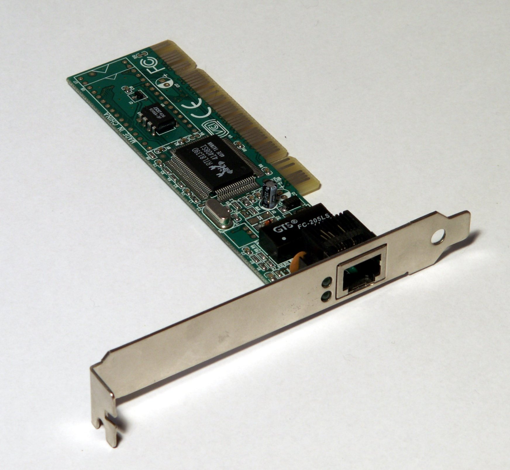
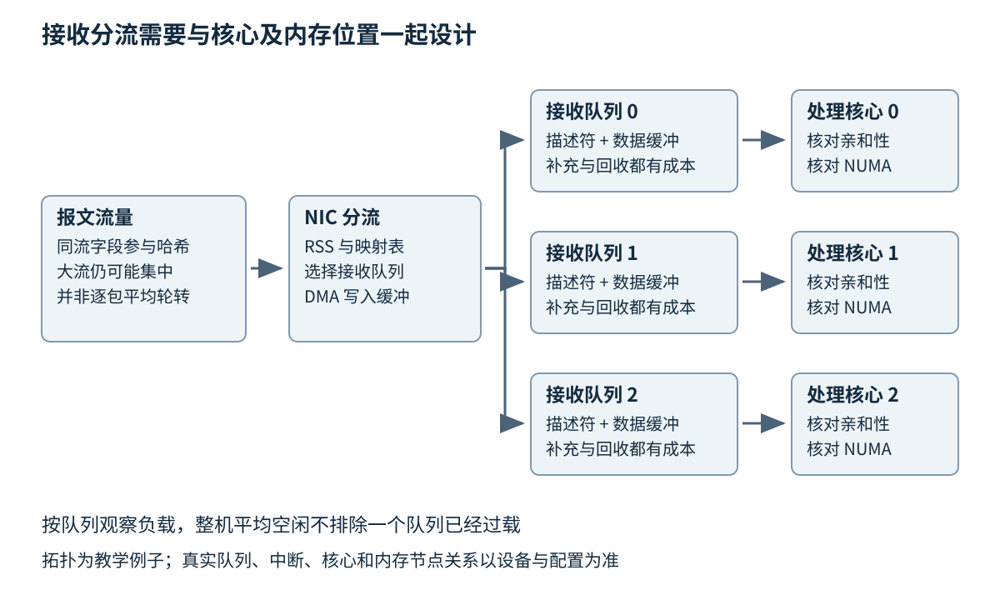
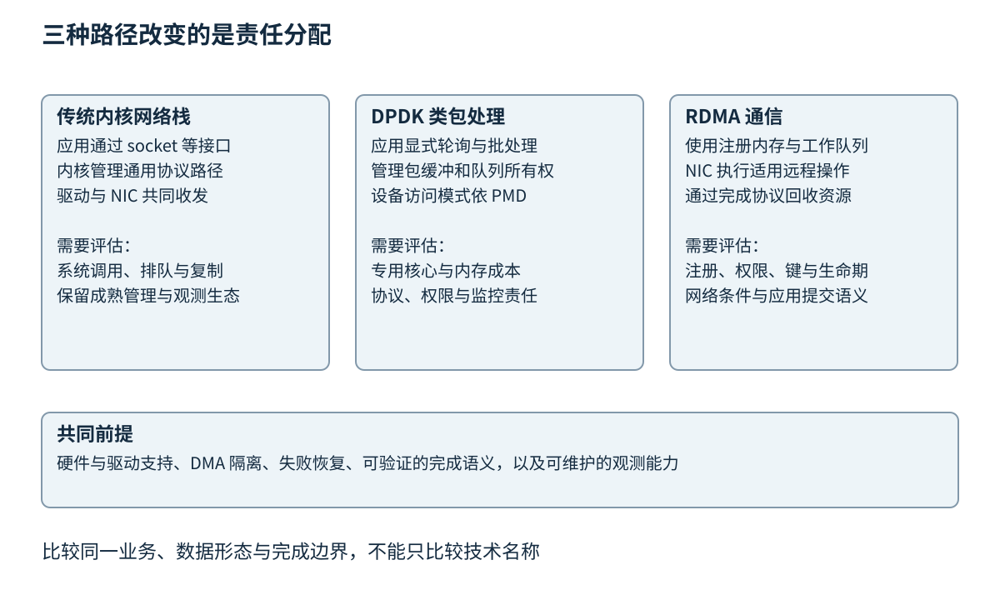

# 第三十二章 网络设备与高性能数据平面

全书正文初稿 · 第六篇 设备系统与交互软件 · 核验日期 2026-10-03

**数据平面**是系统中持续处理实际数据流的部分，例如收包、分类、查表、修改与转发；**控制平面**负责形成规则和状态，例如配置端口、更新路由或决定策略。两者分离的目的，是让频繁的数据处理拥有清楚的资源预算，同时让较少发生的控制变化不破坏正在运行的路径。

高性能网络不能只用链路上的 Gbit/s 描述。小包会增加每秒包数，大量连接会增加状态访问，跨 NUMA 访存会改变缓存行为，突发会使队列与尾延迟骤增。同样一张网卡，在不同包长、流量分布、卸载设置和 CPU 预算下，可能呈现完全不同的瓶颈。

第五章《处理器与内存层次》提供局部性与带宽基础，第三十章《Linux 内核驱动与系统软件》解释了 DMA 与内核路径。本章继续讨论 NIC 队列、内核旁路、网络虚拟化和时限预算。主要平台参照为 Linux 6.12 与 DPDK 24.11 系列，均不宣称当前最新；RDMA 和 TSN 来源逐项注明。没有运行压测、抓取真实业务流量、修改 NIC、绑定 VFIO 或配置交换机，所有吞吐与时延数字都是明示假设下的教学计算。

## 32.1 NIC队列 中断合并 RSS与DMA

### 32.1.1 网卡是带处理与存储能力的设备

**网络接口控制器**（Network Interface Controller，NIC）连接主机与网络介质。它可能集成在主板，也可能做成扩展卡，包含接口控制、DMA、队列、过滤与部分协议卸载能力。网络插座只是其外部连接点，不等于整张 NIC。

图 32-1 一张传统 PCI 以太网扩展卡。外部网络连接器、金属安装挡板、板上器件与插入主板的金手指共同构成设备。照片用于辨认 NIC 的实体层次，不代表图中旧式卡具备本章讨论的现代多队列、RDMA 或 TSN 能力；PCI 与 PCIe 也不是同一种插槽。照片：Sub，Ethernet pci card，2007-10-03；[原始文件和作者公有领域声明](https://commons.wikimedia.org/wiki/File:Ethernet_pci_card.jpg#Licensing)。原图未修改，仅等比例显示。[S1]

现代高速网卡还可能使用光模块、直连铜缆或其他介质。接口形状、模块类型、速率、编码与散热需求必须共同匹配。安装扩展卡要遵守主机断电、防静电和厂商要求；光口不能直视，PoE 与工业以太网涉及额外供电条件。本章不提供任何带电插拔、光功率测量或未知网络接线操作。

一个端口、一个 PCI 功能、一个操作系统网络接口和一个硬件队列之间并不是固定一一对应。虚拟化与多端口设计会改变关系。排查时应先建立拓扑：哪个物理端口属于哪个功能，哪个驱动负责它，哪些队列和中断用于哪类流量，再讨论 CPU 配置。

### 32.1.2 收发环保存描述符而不只是包数据

**描述符**是主机与设备共享的元数据，通常记录缓冲地址、长度和状态。**环形队列**让固定数量描述符反复使用，生产者与消费者通过头尾索引、所有权位或相应机制交接。实际包内容一般放在独立缓冲中，不要把描述符数量直接等同为可容纳字节数。

接收方向，软件准备可供设备写入的缓冲并发布描述符，NIC 把数据 DMA 到相应内存，再报告完成；软件取走数据后补充新缓冲。发送方向，软件准备数据与描述符，设备读取并发出，完成回收后缓冲才可复用。第三十章对 DMA 地址、缓存与排序的约束在这里全部适用。

一个包可能占用多个描述符，例如分散缓冲或分段布局；不同卸载也可能改变描述符需求。若简单用“队列有 1024 项，所以能缓存 1024 个任意大小包”做容量承诺，就忽略了驱动和硬件格式。应分别核对描述符容量、缓冲池容量和最大包长。

图 32-2 接收分流、DMA 缓冲与 CPU 处理路径。每条箭头都可能消耗带宽或形成排队；同流分配、队列与 CPU 亲和性需要一起考虑。

缓冲不足不一定表现为普通内存分配失败。NIC 可能发现没有可用接收描述符而丢包，用户态数据平面可能从池中拿不到 mbuf，应用也可能因持有旧缓冲太久而间接让接收端枯竭。诊断需要观察补充与回收速率，而不是只看系统剩余内存。

### 32.1.3 包率比字节率更直接约束处理预算

设链路为 10 Gbit/s，采用不含额外封装的以太网教学模型。最小 64 字节介质访问控制（MAC）帧之外，还计入 8 字节前导码与帧开始分隔符，以及等效 12 字节帧间隙，则每帧占用 84 字节的线路时间。理论包率约为 10¹⁰/(84×8)=14.88 百万包/秒，未再计物理编码等平台细节。

若一个处理核心理想地持续提供 3 GHz 周期，并承担全部这些包，则平均只有约 201.6 个周期/包。这个预算还要支付收包、解析、查表、计数、转发和回收，不只是业务判断。数字不是性能测量，也不表示任何 3 GHz 核心都有相同指令吞吐。

若 MAC 帧长变为 1518 字节，同样加上 20 字节线路时间开销，理论包率约为 0.813 百万包/秒。字节速率相同，每包固定成本却发生巨大变化。因此只报告“大包达到线速”不能推断小包也达到线速，压测报告必须说明包长分布与封装。

包率还不能代表全部工作。一种流量每个包查一次热缓存表，另一种流量需要随机访问大型状态、解密或重组，周期成本不同。所谓“每包多少周期”必须绑定数据路径、命中率、工作集、丢弃比例和功能集合，不应脱离语境比较。

### 32.1.4 中断合并交换了通知成本与等待

若每个包都触发一次 CPU 中断，高包率会让入口与退出开销过大。**中断合并**让设备根据时间、包数或自适应策略把多项完成合并通知。CPU 可以一次处理更多工作，但第一个到达的包可能等待更久才被软件发现。

例如教学模型中，每批平均处理 32 个包，固定每次通知成本可以被这些包分摊；如果低流量时等到 32 个包才通知，延迟可能很大，所以实现通常还需要时间条件。具体计时从何处开始、阈值怎样组合、是否自动调节，都依赖 NIC 与驱动，不能把某个 ethtool 字段在所有设备上解释为同一个算法。

NAPI 等机制进一步把中断与预算化轮询组合起来。高负载时减少频繁中断，处理一定预算后让其他工作有机会运行；低负载时仍利用通知避免永久空转。Linux 6.12 的 NAPI 文档提供相应完成与预算契约，它与纯忙轮询是不同调度方式。[S2]

把中断合并全部关闭，有时降低轻负载延迟，却可能在高负载下让 CPU 陷入过多中断，反而加重尾延迟和丢包。把合并设置很大，有时提高吞吐，却让交互请求迟到。正确选择需要同时测轻载、峰值与突发，并保留服务目标，而不是只追求单一图表更好看。

### 32.1.5 RSS 分流的是流 而不是平均字节数

**接收端扩展**（Receive Side Scaling，RSS）根据报文的某些字段计算哈希，再通过映射把流量分到多个接收队列。它让不同队列可以由不同 CPU 处理，通常尽量让同一流保持一致路径。Linux 官方 scaling 文档还区分软件分流 RPS、贴近应用 CPU 的 RFS 与发送侧选择 XPS。[S3]

哈希分布均匀不意味着负载均匀。若一条大流占据大部分包率，它仍可能集中到一个队列，其他队列闲着。增加接收队列数不能自动把单一有序流拆开并保持状态一致。可以根据业务选择更多独立连接、应用分片或专门流处理方案，但每种都改变上层协议与排序责任。

修改 RSS 映射时，正在处理的包可能跨队列迁移，状态归属与顺序需要关注。防火墙、连接跟踪或其他双向状态系统还关心同一连接两个方向是否落到共同处理位置。对称哈希可能有帮助，也可能改变哈希熵与攻击面，不能仅从平均负载选择。

队列数不必越多越好。每个队列需要描述符、缓冲、计数和中断资源，更多队列也可能增加调度与缓存开销。应找到能够满足吞吐和延迟的合理数量，并结合实际物理核心、超线程、NUMA 与其他业务共享情况，而不是机械设置为逻辑 CPU 数量。

### 32.1.6 NUMA 与亲和性决定包在机器内部走多远

如果 NIC 挂在某个 NUMA 节点，描述符和数据却分配在另一节点，DMA 与 CPU 处理可能发生额外跨节点流量。即使包没有经过任何额外网络跳数，也已经在主机内部多走了一段路。第五章的局部性在数据平面中常体现为队列、核心与缓冲池对齐。

中断亲和性、轮询线程绑核、内存分配位置和应用消费位置应共同规划。只把接收中断移到某个核，却让应用在另一个远端核持续读取，可能把瓶颈从中断入口转移到缓存迁移。调度守护进程或容器配置也可能改变亲和性，必须核对实际生效状态。

每包多次触碰共享计数器，会让看似简单的统计成为缓存一致性热点。使用每核计数并周期聚合，可以降低竞争，但聚合得到的快照未必是所有核心同一瞬间的全局精确值。需要精确财务计数或协议序列时，不能把近似性能统计直接拿来替代业务状态。

深入追问“网卡还有带宽，CPU 也没满，为什么仍丢包”，可以回答：整机平均值会掩盖单队列、单核或特定缓存行瓶颈；微突发可能在平均采样之前填满队列；缓冲回收、远端内存或设备内部资源也可能受限。需要按队列和时间尺度找第一个不能继续接纳工作的地方。

## 32.2 DPDK RDMA内核旁路适用条件

### 32.2.1 旁路描述的是绕过哪一段路径

**内核旁路**指某类数据操作不再每次经过传统内核协议栈或系统调用路径，而由用户态与设备直接协作处理。它没有让操作系统消失：内存管理、设备权限、DMA 映射、进程调度和故障隔离仍由系统参与，很多控制操作仍然进入内核。

旁路的潜在收益来自减少特定复制、调度切换、通用协议处理和每包管理成本。代价则可能是专用 CPU、固定内存、自己承担协议与运维责任，以及更严格的设备支持条件。不能只看“少了内核”就推断延迟必然更低或安全性自动更高。

有些应用通过更好的批处理、缓冲复用和内核配置就能满足目标，保留成熟网络栈的路由、过滤与工具生态更有价值。旁路应从已观察瓶颈与明确预算出发，而不是作为高性能项目的身份标签。

### 32.2.2 DPDK 把数据路径变成显式队列处理

**数据平面开发套件**（Data Plane Development Kit，DPDK）提供面向快速包处理的库与驱动接口。其轮询模式驱动（PMD）允许应用以批量方式获取和发送包，常见组织包括一个核从接收到转发完成全部处理，以及多个阶段通过队列组成流水线。DPDK 24.11 文档对这些模型、队列与核的关系有明确说明。[S4]

一次完整处理留在同一核心，有利于局部性与简单所有权；流水线可以让不同阶段独立扩展，却增加跨核队列、缓存迁移和排队。把一个五步函数拆成五个线程，不意味着吞吐就变成五倍，最慢阶段仍限制整体，还会产生额外交接。

批量 API 返回实际处理数量。接收本次只取得少量包不是错误；发送本次只接受部分包时，应用必须按 API 语义继续持有未接受的部分，选择有限重试或丢弃并正确回收。把请求发送数量当作已发送数量，会造成丢包计数错误、提前释放或内存泄漏。

图 32-3 内核栈、DPDK 类旁路与 RDMA 分别改变不同部分的责任。它们不是同一条“更快”阶梯，实际选择取决于协议需求、设备和运维约束。

### 32.2.3 mbuf 和内存池把分配成本提前组织

DPDK 的 mbuf 保存包的元数据并关联数据缓冲，内存池提供可重复使用的对象。一个包可能分为多个段，也可能共享某些数据，引用与回收都必须遵守接口契约。内存池减少高频通用分配成本，但不消除容量约束与对象生命期。[S5]

容量预算要覆盖接收环、发送在途、阶段间队列、各核缓存、控制路径与突发余量。假设四个阶段每个都允许积压大量包，单独看各队列都没满，整体却可能耗尽池。应画出同一 mbuf 在每个状态中归谁所有，并给总在途量设界限。

大页有助于减少某些地址转换与映射管理成本，但需要配置和资源预留，可能限制部署灵活性。它不是所有 DPDK 场景的无条件必要前提，具体 PMD、内存模式和平台能力要按固定版本核查。不能通过关闭 IOMMU 或放宽权限来掩盖资源配置错误。

### 32.2.4 设备绑定不是无害的启动准备

某些 DPDK PMD 需要设备从普通内核网络驱动切换到 VFIO 等访问路径，另一些 bifurcated 驱动则保留内核驱动协同。官方 Linux drivers 文档特别区分两类，不能把“解绑网卡”当作所有 DPDK 应用统一步骤。[S6]

解绑承载远程管理的接口可能立刻中断访问，错误 IOMMU 组操作可能影响同组设备。VFIO 的正常隔离能力依赖相应硬件与配置，而 no-IOMMU 模式缺少关键保护，不能作为教学默认捷径。本章只解释风险，不提供或执行绑定、解绑与安全配置修改命令。

旁路后，操作系统原有抓包、防火墙或网络管理工具可能不再看到同一数据路径。产品必须补充相应访问控制、统计、抓包与故障恢复方式；不能在原内核接口计数为零时就认定没有流量，也不能假设原防火墙规则仍保护全部旁路流量。

AF_XDP 提供另一类 Linux 用户态高性能收发接口，围绕 XDP、UMEM 和相应环组织数据交付。复制与零拷贝模式支持取决于内核、驱动与配置，不能从使用 AF_XDP 名字就断言已经零拷贝。它与 DPDK 的设备管理方式、生态和功能边界也不同。[S7]

### 32.2.5 RDMA 提供受权限约束的远程内存操作

**远程直接内存访问**（Remote Direct Memory Access，RDMA）让支持该能力的网络设备按协议访问已注册的内存，减少对端 CPU 对某些数据搬运的直接参与。常见对象包括队列对、完成队列、内存区域和保护域。它既可以提供发送接收式通信，也可以提供某些单边读写操作。[S8]

**队列对**（QP）组织发送与接收工作请求，**完成队列**（CQ）报告规定层次的完成结果。**内存注册**让一段内存与设备访问能力、范围和权限关联，产生相应本地或远程访问键。**保护域**帮助约束哪些对象可以共同使用。应用并不是把任意进程指针发给对方，对方就能合法读取。

注册有成本，也可能消耗固定内存与 NIC 资源。复用注册可以降低成本，但必须正确跟踪内存释放和地址复用；否则缓存中的注册记录可能指向已经属于另一对象的存储。第十八章《无锁结构与安全回收》的生命期思路，在这里扩展到远程参与者和设备访问。

远程键需要与访问范围和连接安全共同管理，不应写进普通日志或无限期分发。撤销与重新注册也要考虑对端仍在途的请求。RDMA 降低对端 CPU 搬运负担，并没有让访问授权和对象回收变简单。

### 32.2.6 完成队列不等于远端业务提交

一项 RDMA 写完成的意义取决于操作、传输与设备契约。它不应被无条件解释为远端应用线程已经读取该数据、完成事务或将其持久化。发送接收与单边写入对远端通知的需求也不同，应设计明确的应用协议。

若使用远端内存保存消息，可以将数据区与发布标志分开，并根据 RDMA 与 CPU 平台规定建立顺序和可见性。这里不能直接用 ISO C++ 的 acquire/release 证明所有设备与远端访问，因为 RDMA 不是标准中的普通线程操作。需要具体硬件、verbs 和应用同步规则共同支持。

本地发送缓冲也不能在提交工作请求后立即复用。libibverbs 的 ibv_post_send 文档说明了工作请求与缓冲使用的相关责任，并对 inline 等情形有不同约束。简单规则是按实际操作契约取得可以回收的证据，而不是假设函数返回就已发完。[S9]

错误完成必须得到处理。连接断开或设备错误可能让一批工作进入失败状态，应用需要逐项回收并让上层知道哪些操作结果未知。只处理成功 CQE 的快路径，会让最需要可靠性的故障时刻留下资源和状态混乱。

### 32.2.7 选择 RDMA 要把网络条件一起算进去

InfiniBand、RoCE 与其他 RDMA 传输方案的网络要求并不完全一样。RoCE 部署常结合优先级流控与拥塞控制，具体设备也可能支持不同的有损或无损运行策略。不能笼统地说“RDMA 就是在普通网络上更快地调用 memcpy”，也不能把某厂商配置指南的要求推广为所有实现的规范定义。

低延迟可能来自专用资源、预注册内存和特定网络条件。一旦控制面复杂、消息很小且数量少，注册与连接管理成本可能主导；需要成熟 TCP 语义、广泛互通和简单运维时，普通 socket 可能更合适。应比较完整应用，包括故障恢复、可观测性与安全边界。

深入追问“DPDK 和 RDMA 哪个更快”，不宜给单一排名。DPDK 主要让应用自己快速处理包，RDMA 提供特定远程内存与通信语义；一个网络功能可能需要深度报文处理，另一个分布式存储需要大块数据与远端操作。比较前先固定要完成的工作、消息模式与完成语义，否则数字没有共同分母。

## 32.3 网络虚拟化 流控和可观测性

### 32.3.1 虚拟网卡仍然需要有人处理队列

虚拟机可以使用模拟网卡、半虚拟化接口或直接分配的设备能力。模拟传统设备强调兼容，半虚拟化接口让客体与宿主通过专门设计的队列协议协作，直通或硬件虚拟功能则把更多数据路径交给设备。它们改变了开销位置，也改变可迁移性与管理方式。

virtio-net 与相关后端让客体使用面向虚拟化的网络接口；vhost 等机制可以改变后端处理位置。队列仍需由客体、宿主或用户态后端消费，宿主 CPU 饱和、队列配置不匹配和跨 NUMA 都可能限制性能。给客体增加 vCPU 不等于后端队列会自动增加有效处理能力。

容器网络的 veth、桥、路由与隧道同样是真实数据路径。每一跳可能增加查表、封装、复制或队列；但某些路径也能通过合适卸载优化。不能仅凭逻辑拓扑图里多画了一条线就估计准确成本，需要观测实际内核与硬件执行路径。

### 32.3.2 SR-IOV 把硬件能力分成多个功能

**单根 IO 虚拟化**（SR-IOV）允许支持的 PCIe 设备提供物理功能（PF）与多个虚拟功能（VF）。物理功能通常承担更完整的管理职责，虚拟功能提供可分配给特定使用者的部分能力。Linux 官方文档说明了 PF 与 VF 的组织及配置入口；正文不执行这些配置。[S10]

VF 的存在不意味着所有硬件资源完全独立。端口带宽、队列、缓存、固件和某些复位域可能共享。一个租户制造突发流量，仍可能通过共享资源影响另一个租户。硬件隔离、IOMMU、速率策略和设备固件能力都要进入威胁与性能模型。

直通 VF 可以减少软件交换路径，却可能影响实时迁移、流量镜像、安全检查和故障恢复。需要在性能收益与运维能力之间选择，而不是把所有虚拟机都默认分配硬件功能。设备固件升级时，多个使用者也可能一起受到影响。

### 32.3.3 Overlay 让逻辑网络跨越物理拓扑

**覆盖网络**（overlay）通过在已有网络上传送额外封装，构建逻辑连接。它有助于组织租户与地址空间，但增加头部与处理步骤。路径 MTU、分片、校验与卸载支持需要共同考虑，不能把内层 MTU 原封不动当作外层线路可容纳大小。

若某个教学隧道增加 50 字节封装，底层允许的最大包长不变，内层可用空间就相应减少；实际数值仍由协议、VLAN、IP 版本和设备规定决定。小包的相对开销与大包不同，CPU 还要处理更多头部和可能的多层校验。

故障可能只影响特定包长或特定目的路径。小探测包通、大业务包不通，提示应检查 MTU、过滤与分片行为，而不是立即判定连接正常。虚拟网络还可能使本机抓包只能看到内层或外层的一部分，取证位置必须明确。

### 32.3.4 流控与拥塞控制限制不同范围

**流控**通常关注接收方或相邻链路的接纳能力，**拥塞控制**关注路径中共享资源的拥塞状态并调节发送。以太网 PAUSE 可以让相邻发送方暂停，优先级流控 PFC 按优先级类别选择暂停，显式拥塞通知（ECN）则通过拥塞标记帮助端系统形成反馈。它们不是相互替代的同一个开关。

PFC 的目标是在适用条件下避免某类流量因缓冲溢出丢失，但暂停可能向上游传播，使不直接造成拥塞的流也等待，甚至形成复杂依赖。缓存规划、流分类和拥塞控制必须配合。NVIDIA 的 RoCE 与 PFC 官方资料描述了这类组合和 watchdog 等保护机制，不能从“启用无损”推导无界负载也能无损。[S11]

ECN 只是标记与反馈链中的一部分。交换机阈值、端点响应、控制报文和恢复时间共同决定效果。若一端不理解标记或队列分类不一致，配置名相同也不能保证闭环成立。应验证实际标记计数、发送速率与队列变化，而不是只保存配置截图。

更深的缓冲可以吸收突发，也会允许更多排队。对于延迟敏感应用，持续把拥塞藏在缓冲里可能降低丢包却恶化时延。排队管理、准入、节流和丢弃策略需要围绕业务目标设计，没有“缓冲越大越可靠”的通用结论。

### 32.3.5 微突发需要细于平均值的视角

设入口在 100 μs 内以高于出口 20 Gbit/s 的速率突发，简化模型中额外积压为 20×10⁹×100×10⁻⁶/8=250000 字节。即使一秒平均负载很低，这段突发也可能消耗约 244 KiB 缓冲。若多个入口同时向同一出口发送，拥塞集中会更明显。

平均利用率图往往看不见这种现象。需要查看队列水位、丢弃事件、ECN/PFC 计数和更细的时间采样，必要时使用受控流量重现。观测仪器自身的时间分辨率与计数刷新周期也限制结论，不能拿一秒均值证明没有百微秒拥塞。

背压可以传播到应用。接收方计算太慢使缓冲占用升高，反馈让发送方减速；若发送方有多个不同重要性的流，共用一个 FIFO 可能让关键消息被大流挡住。隔离队列与服务策略有助于限制干扰，但需要防止某类优先级流量长期饿死其他工作。

### 32.3.6 计数器必须带观察层和单位

NIC、驱动、内核接口、虚拟交换、隧道与应用各有自己的计数。rx_packets 在某个接口上的定义不一定等于最终业务消息数；合并、分段、过滤和重试会改变计数关系。Linux 6.12 的接口统计文档区分标准统计与设备特定统计，并提示各获取接口的差异。[S12]

比较发送与接收计数时，先统一时间窗口、包的定义、封装层级和是否包含错误帧。硬件计数可能在复位后清零，软件计数可能溢出或按需聚合，速率差还可能来自在途数据。没有这些前提，一条“丢了 1%”可能只是两个不相同计数口径的相减。

旁路应用应至少暴露收到、解析失败、策略丢弃、队列满、发送未接纳、设备错误与缓冲池不足等类别。所有丢弃都合并成一个 drop，虽然简洁，却无法指导修复。每核统计再聚合有性能优势，报告需要说明快照是否允许小范围不一致。

### 32.3.7 时间戳的位置决定时延含义

软件在应用收包后打时间戳，包含线程调度和应用排队；驱动附近的软件时间戳更靠近内核路径；NIC 硬件时间戳更靠近线路事件，但依赖设备时钟与驱动能力。不能把这些时间直接相减而不确认时钟域和时间点。[S13]

单向时延需要发送与接收时钟有足够可信的关系，往返测量则包含回程与应答处理，不能无条件除以二得到单向值。精确时间协议（PTP）等同步机制能减少时钟误差，但实际精度受硬件时间戳、网络拓扑与校准影响。若测量误差接近被测延迟，数字再多小数位也没有额外意义。

统计尾延迟还要记录未完成请求。只统计成功收到的包，会排除最慢或已丢失部分；系统过载时如果生成器也被阻塞，可能没有按原计划发出请求，从而低估等待。测试设计应保留计划到达与实际到达关系，说明超时如何计入分布。

深入追问“为什么打开监控后性能反而下降”，可以沿资源解释：高频计数更新造成共享缓存争用，抓包复制消耗带宽，事件输出占用队列，日志格式化占 CPU。观测需要采样、有界缓冲与丢记录计数，并通过对照估计自身开销。

## 32.4 电信工业网络时延可靠性及CPU预算

### 32.4.1 端到端时限必须分配到每一个阶段

电信和工业网络常关心严格的时延、抖动、同步与可用性，但具体需求取决于业务。遥测、视频、闭环控制和管理命令不能共用一句“低延迟”作为验收标准。要先定义起点与终点，例如从传感器采样到执行器生效，而不是只测交换机内部转发时间。

一个端到端预算可以拆成采样、主机处理、排队、串行化、传播、各跳转发、接收处理和执行器响应。平均值相加不能自动得到最坏上界；阶段相关性、突发和调度相位都可能改变组合。保守预算还应包含同步误差与恢复余量。

设教学控制周期允许 2 ms，其中传感与执行各占 300 μs，主机两端处理共 400 μs，网络需要在余下 1 ms 内完成。若其中某一端因普通桌面调度偶尔暂停数毫秒，再快的交换机也无法挽回。网络工程与第二十九章的实时任务分析必须使用同一时限定义。

### 32.4.2 TSN 是一组机制而不是一个速度等级

**时间敏感网络**（Time-Sensitive Networking，TSN）是一组 IEEE 802.1 机制与相关配置组合，涉及时间同步、流量调度、整形、过滤和冗余等能力。具体设备宣称支持 TSN 时，应进一步核查支持哪项标准、哪个版本、哪些端口与何种配置限制。[S14]

时间感知调度通过安排队列可发送窗口，帮助关键流量避免被其他流量任意干扰；同步机制让不同节点对这些窗口有共同时间基础。若某个入口能无限发送未受约束的流量，或者端点并不按预期时间生成数据，仅在交换机上打开一个功能无法建立端到端界限。

严格优先级也不等于零等待。低优先级帧如果已经开始发送，可能需要等它结束，除非采用并正确支持相应抢占机制；多个高优先级流之间也会竞争。要给出上界，需要知道最大帧长、到达约束、拓扑、服务窗口与同步误差。

预留资源还会影响普通流量的可用带宽。关键流量窗口设置过大，可能让管理与诊断路径退化；设置过小，关键流量又可能错过窗口等待下一周期。因此 TSN 配置是系统调度问题，不能以“优先级设为最高”替代分析。

### 32.4.3 冗余降低特定风险 不能消灭共同失效

双链路、双设备或复制发送可以提高某些故障下的可用性，但必须分析是否真正独立。两条线缆经过同一电源、同一交换芯片或同一施工通道，可能同时失效；两份软件具有相同缺陷，也可能在同一输入下同时出错。

若两个路径单次失败概率都为 p，并且失败确实独立，则两者同时失败概率为 p²。这是明确假设下的数学关系，不是现实网络的可靠性保证。共同原因、维护操作、攻击与配置错误都会破坏独立假设，应另行建模。

重复报文还需要识别与去重。接收方不能把两份到达当成两次业务动作，序列号回绕、窗口大小和迟到报文也需处理。冗余提高传输成功机会，却增加带宽、状态与恢复复杂度。成功率数字必须绑定失效模型与观察窗口。

### 32.4.4 CPU 预算应包含最忙的那个核心

假设某数据路径平均每包需要 600 个有效 CPU 周期，目标为每秒 5 百万包，则理想计算需求是每秒 30 亿周期。一个 3 GHz 核心看似刚好，但没有给系统活动、缓存波动、突发和错误处理留下余量。若四个核心分工不均，整机总周期充足也可能由一个热点核心限制。

可以先为每个阶段建立“固定每包成本、与字节数相关成本、与流状态相关成本”的模型。例如校验或复制大块数据与字节数相关，哈希和队列操作常有固定成本，连接表缺失与状态创建则在某些包上特别昂贵。模型用于提出测量计划，不能用未经实测的常数证明实际容量。

吞吐预算还要扣除控制与维护工作。规则更新、统计聚合、日志、健康检查与链路恢复都需要 CPU。把所有核心百分之百用于正常快路径，故障时可能没有资源完成恢复，从而把短暂问题放大成长期中断。

### 32.4.5 批处理大小同时决定效率与最大服务间隔

大批处理可以摊薄调用和门铃成本，并改善预取与缓存访问；但某个队列一次处理太久，会延长其他队列、定时器和控制请求的等待。每轮批量上限与时间预算应一起考虑，不能只在吞吐测试里选择最大的数字。

设一个教学核心每包处理约 0.4 μs，一轮连续处理 256 个包，就可能占用约 102.4 μs，还未计其他工作。如果另一个控制事件需要在 50 μs 内获得服务，这种无中途检查的轮次就不满足需求。减少批量或按时间切片，会增加某些固定成本，却能缩短最大服务间隔。

忙轮询还消耗空闲时 CPU 与电力。对持续满载且专用的网络功能，这可能是可接受取舍；对电池设备或低占用服务，则可能浪费明显。自适应轮询、事件通知与节能策略都需要测量切换开销和尾延迟，不能只看 CPU 使用率从高变低就宣布优化成功。

### 32.4.6 控制平面更新要保持数据路径一致

数据平面常持续读取规则表，控制平面偶尔生成新版本。若逐条原地修改一个多字段规则，读者可能观察到半更新状态。可以构建完整不可变快照，再以合适协议发布，并在旧读者离开后回收旧版本。

RCU 类机制适合某些读多写少的场景，但需要明确静止状态、读侧临界区和回收推进。DPDK 24.11 提供自己的 RCU 库接口与使用约束；它与 Linux RCU、ISO C++ 原子或某个自制无锁指针并不自动具有同样语义。[S15]

更新还要考虑跨核心一致性。若路由规则与访问控制规则分两次发布，一部分包可能按新路由配旧权限处理。需要把哪些字段必须共同生效定义为版本化配置单元，或者明确允许过渡状态。快速读取的代价往往转移到配置构建与安全回收，而不是消失。

规则更新失败也必须有可解释结果。内存不足、硬件表容量不足或某个队列没有确认新配置时，控制面不应只返回“提交成功”。应区分请求已接收、软件已发布、硬件已安装与所有相关处理者已切换，必要时保留旧版并提供回滚。

### 32.4.7 测试必须同时覆盖快路径与失效路径

一个可信的数据平面报告应说明硬件型号与固件、链路与 PCIe 条件、CPU/NUMA、内核与驱动、DPDK/库版本、包长分布、流数、队列配置、卸载、负载生成方式、测量点和重复次数。缺少这些条件，单个线速数字难以复现，也难以用于容量规划。

除了稳定吞吐，还需要观察突发、单大流、连接创建、规则更新、队列枯竭、设备复位、链路切换与邻居不可达等情形。故障期间的丢包、恢复时间和重复结果，与正常路径的纳秒级优化同样重要。实际操作必须在授权隔离环境中进行，不能向生产网络任意发送压力流量。

测试生成器也可能成为瓶颈。生成器没有按目标速率发出，接收方自然“零丢包”；统计只计算返回成功的包，也可能隐藏未完成部分。应尽可能用独立计数与时间依据校验发送、线路和接收，并给出误差范围。

### 32.4.8 从预算推导一个可维护的选择

设某工业网关需要汇聚多个低速传感网络，关键消息每 10 ms 必须处理一次，数据总量并不大。它的主要风险可能是阻塞 IO、错误恢复与时钟失准，而不是传统内核栈每包成本。优先建立有界队列、任务优先级、故障状态和准确时间戳，可能比引入 DPDK 更能解决问题。

若另一个教学网络功能需要持续处理大量小包，多个核已被协议栈管理成本占满，且业务能承担专用端口、专用核心与独立监控，那么用户态旁路值得进行受控比较。若主要任务是受控集群内大块数据移动，并有可验证的 RDMA 设备和网络条件，则 RDMA 可能更贴近需求。这些是选择路径，不是未经测试的性能结论。

深入追问“高性能数据平面的核心能力是什么”，可以把答案落在四项证据上：知道每个包经过哪些队列与内存，知道每次所有权何时交接，知道时间与 CPU 预算在哪一层消耗，知道失败后怎样回收并恢复。技术名词只有在这些证据中找到位置，才成为工程能力。

## 本章资料与核验范围

[S1] Sub，[Ethernet pci card 原始照片与公有领域声明](https://commons.wikimedia.org/wiki/File:Ethernet_pci_card.jpg#Licensing)，2007-10-03；核验和下载于 2026-10-03。只用于器件外观识别，不推断现代硬件能力。

[S2] Linux 6.12，[NAPI](https://docs.kernel.org/6.12/networking/napi.html)，核验于 2026-10-03。中断、轮询与工作预算的组织。

[S3] Linux 6.12，[Scaling in the Linux Networking Stack](https://www.kernel.org/doc/html/v6.12/networking/scaling.html)，核验于 2026-10-03。RSS/RPS/RFS/XPS 的职责区别，不转录特定历史测试配置作为通用推荐。

[S4] DPDK 24.11，[Poll Mode Driver](https://doc.dpdk.org/guides-24.11/prog_guide/ethdev/ethdev.html)，核验于 2026-10-03，页面维护版本 24.11.7。用于批处理、队列与执行模型。

[S5] DPDK 24.11，[Packet Mbuf Library](https://doc.dpdk.org/guides-24.11/prog_guide/mbuf_lib.html)，核验于 2026-10-03。包元数据、分段与生命期。

[S6] DPDK 24.11，[Linux Drivers](https://doc.dpdk.org/guides-24.11/linux_gsg/linux_drivers.html)，核验于 2026-10-03。VFIO、IOMMU 与 bifurcated 驱动边界；正文没有执行绑定操作。

[S7] Linux 6.12，[AF_XDP](https://docs.kernel.org/6.12/networking/af_xdp.html)，核验于 2026-10-03。UMEM、环和复制/零拷贝条件。

[S8] NVIDIA，[RDMA Aware Networks Programming User Manual 1.7](https://docs.nvidia.com/rdma-aware-networks-programming-user-manual-1-7.pdf)，核验于 2026-10-03。用于 QP、CQ、内存注册与保护域等基础概念，不使用其中实验 API 作为当代通用接口。

[S9] libibverbs，[ibv_post_send(3)](https://man7.org/linux/man-pages/man3/ibv_post_send.3.html)，核验于 2026-10-03。工作请求、发送缓冲与完成边界。

[S10] Linux 6.12，[PCI Express I/O Virtualization Howto](https://www.kernel.org/doc/html/v6.12/PCI/pci-iov-howto.html)，核验于 2026-10-03。SR-IOV PF/VF 分工，不等同完全独占物理资源。

[S11] NVIDIA，[RoCE，Cumulus Linux 5.16](https://docs.nvidia.com/networking-ethernet-software/cumulus-linux-516/Layer-1-and-Switch-Ports/Quality-of-Service/RDMA-over-Converged-Ethernet-RoCE/)与 [Priority Flow Control](https://networking-docs.nvidia.com/onyxum/3104706lts/priority-flow-control-pfc)，核验于 2026-10-03。只用于特定实现的流控/拥塞组合与风险解释，不统一规定所有 RDMA 网络。

[S12] Linux 6.12，[Interface statistics](https://docs.kernel.org/6.12/networking/statistics.html)，核验于 2026-10-03。标准与设备特定计数的观察边界。

[S13] Linux，[Timestamping](https://docs.kernel.org/networking/timestamping.html)，核验于 2026-10-03。滚动文档仅用于硬件/软件时间戳与时钟域概念，不将新接口倒推到固定内核。

[S14] IEEE 802.1，[Time-Sensitive Networking Task Group](https://1.ieee802.org/tsn/)，核验于 2026-10-03。标准族与不同机制的范围；本文不声明任何设备通过 TSN、工业功能安全或电信认证。

[S15] DPDK 24.11，[Read-Copy-Update Library](https://doc.dpdk.org/guides-24.11/prog_guide/rcu_lib.html)，核验于 2026-10-03。读侧、静止状态与回收契约，需按实际库版本使用。

[S1]: https://commons.wikimedia.org/wiki/File:Ethernet_pci_card.jpg#Licensing

[S2]: https://docs.kernel.org/6.12/networking/napi.html

[S3]: https://www.kernel.org/doc/html/v6.12/networking/scaling.html

[S4]: https://doc.dpdk.org/guides-24.11/prog_guide/ethdev/ethdev.html

[S5]: https://doc.dpdk.org/guides-24.11/prog_guide/mbuf_lib.html

[S6]: https://doc.dpdk.org/guides-24.11/linux_gsg/linux_drivers.html

[S7]: https://docs.kernel.org/6.12/networking/af_xdp.html

[S8]: https://docs.nvidia.com/rdma-aware-networks-programming-user-manual-1-7.pdf

[S9]: https://man7.org/linux/man-pages/man3/ibv_post_send.3.html

[S10]: https://www.kernel.org/doc/html/v6.12/PCI/pci-iov-howto.html

[S11]: https://docs.nvidia.com/networking-ethernet-software/cumulus-linux-516/Layer-1-and-Switch-Ports/Quality-of-Service/RDMA-over-Converged-Ethernet-RoCE/

[S12]: https://docs.kernel.org/6.12/networking/statistics.html

[S13]: https://docs.kernel.org/networking/timestamping.html

[S14]: https://1.ieee802.org/tsn/

[S15]: https://doc.dpdk.org/guides-24.11/prog_guide/rcu_lib.html
