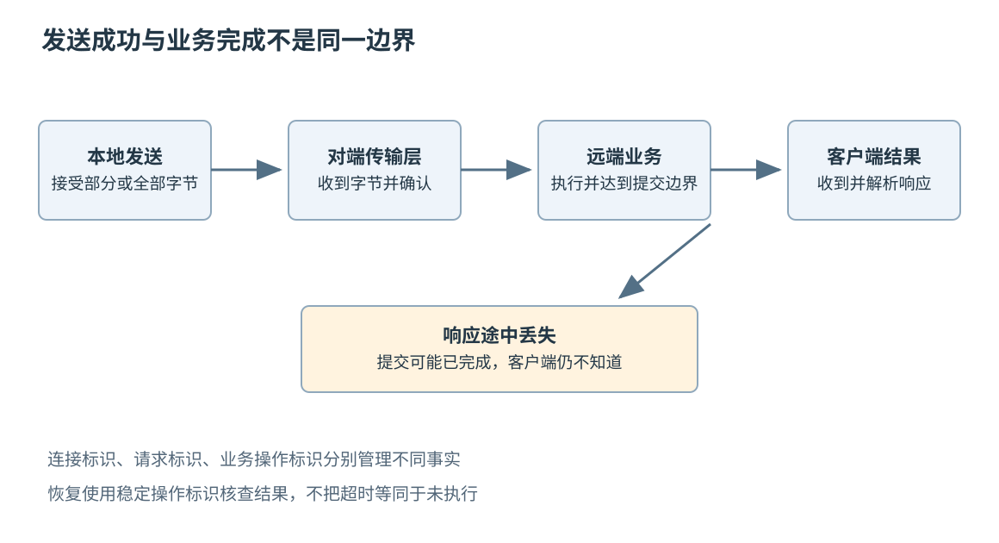
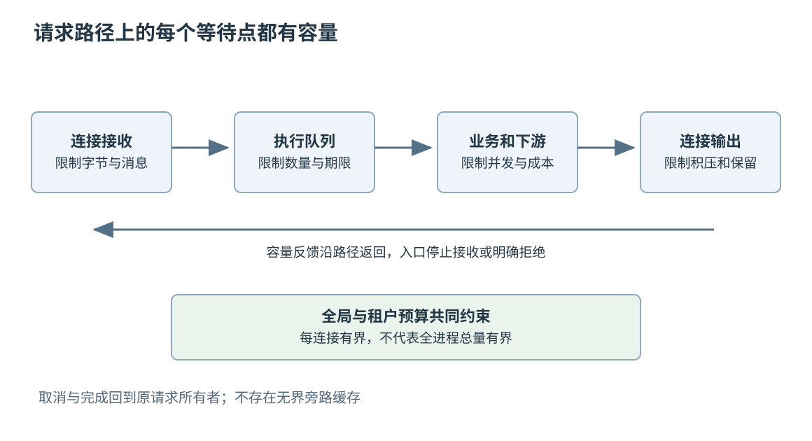
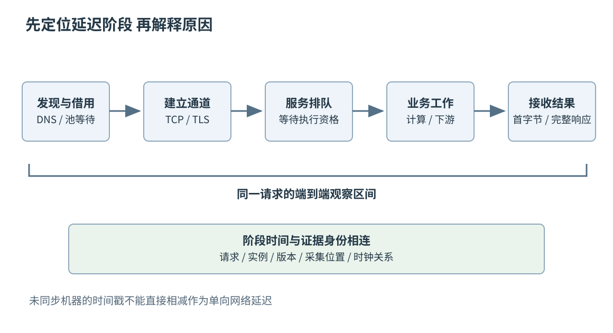

# 第三十三章 网络协议与高性能服务

全书正文初稿 · 第七篇 服务分布式系统与数据基础设施 · 核验日期 2026-10-03

网络服务把一台机器中的计算变成其他程序可以使用的能力。客户端交付一份请求，服务端解释它、访问资源，再返回结果。困难在于，这些阶段由不同执行者完成，中间有独立的队列、时钟和故障。客户端停止等待时，服务端可能尚未收到请求，也可能已经提交结果；连接仍然存在时，业务线程可能已经停止推进。一个看似普通的函数调用，一旦穿过网络，就拥有了本地调用没有的未知状态。

协议规定双方如何解释消息，服务实现决定怎样在资源有限、对端缓慢和故障发生时履行这些规定。高性能不是把每一个缓冲都放大，也不是换成异步接口就自然出现。它要求把连接、消息、执行任务与业务操作分开，知道每一层消耗什么资源，在哪个边界确认了什么事实。

第十九章已经解释就绪通知、异步完成和协程生命周期，本章不重复接口清单，而把它们放进完整请求路径。网络协议以所列 RFC 为稳定参照，实现细节按操作系统和库版本区分；资料核验于 2026-10-03。文中的时序、数字和故障场景均为教学推演，没有执行网络代码、抓包、压力测试或修改任何真实服务。

## 33.1 Socket TCP拥塞 超时与连接生命周期

### 33.1.1 Socket 是接口 连接是状态 消息是约定

**套接字**（socket）是操作系统向程序提供的通信接口。程序通过它建立端点、发送或接收数据，但接口本身不保证某一种业务语义。使用 TCP 的流套接字与使用 UDP 的数据报套接字，在边界、错误与顺序方面有不同契约，不能只因为都能调用 send 和 receive 就互换。

**传输控制协议**（TCP）向应用提供有序字节流。应用先写 100 字节，再写 200 字节，接收端不必得到两次同样大小的读取：可能先读到 80，再读到 220，也可能一次读到 300。发送调用、TCP 分段、IP 数据包与应用消息是不同边界。所谓“粘包”并不是 TCP 把消息处理错了，而是应用误把字节流当成带记录边界的通道。[S1]

因此应用需要**成帧**规则：例如固定长度头部携带负载长度、明确分隔符及转义方式，或使用已有协议的消息边界。接收解析器应能保存半条消息，也能在一次读取中依次取出多条；长度必须在分配前验证，限制消息大小、嵌套和解压后规模。第四章的数据表示和第二十六章的不可信输入边界，在网络入口同时成立。

一个服务还可能在同一连接中处理许多请求，或为同一业务操作建立多个连接。连接标识用于管理传输状态，请求标识用于关联一轮交互，业务操作标识用于识别重复效果。若把三者混成一个数字，重连后就很难判断“新的连接”是否仍在询问“同一个已经执行的操作”。

### 33.1.2 一次发送存在多层完成

发送接口返回成功，通常只表明这一调用接受了相应数量的数据，不证明远端应用已经读取，更不证明业务已经提交。在 Linux 的普通流套接字上，发送可能只接受部分字节；非阻塞缓冲不足时还可能暂时无法推进。程序需要保留尚未发送部分与其生命周期，等待适当通知后继续，而不是丢掉剩余数据或从头重复整个消息。[S2]

TCP 的确认表示对端传输层接收状态，应用级响应才有机会表达协议承诺；响应的具体意义还由服务定义。“请求已进入队列”“记录已写入进程内缓存”“数据已达到持久化条件”是三种不同确认。客户端应该根据实际承诺决定能否释放原始材料、向用户报告成功或发起下一步。

设教学操作的业务含义是更新设备配置并把版本号加一，第一次使版本 4 变成版本 5。服务端修改成功后，响应在返回途中丢失。客户端看到超时，此时若直接再次执行同一“加一”动作，会把未知状态变成第二次副作用；若使用稳定操作标识查询已有结果，就有机会恢复确定状态。TCP 的重传只维护当前字节流，不替应用完成跨连接的业务去重。

反过来，连接建立成功也不证明服务业务可用。操作系统可能已经完成握手，服务线程却排队严重；代理可能接受连接，后端却没有健康实例。健康检查和业务探测需要说明检查到了哪一层，不能把一个可连接端口作为所有能力的共同证明。

### 33.1.3 流量控制和拥塞控制保护不同对象

**流量控制**避免发送方压垮接收方的可用接收能力；TCP 的接收窗口 rwnd 是其中的机制。**拥塞控制**限制发送方对网络路径施加的在途负载，拥塞窗口 cwnd 是相应状态。经典 TCP 发送约束同时受两者影响，还要扣除已经在途的数据，不能把窗口大小直接当成每次调用能发送的字节数。[S3]

接收窗口变小，可能是对端应用消费不及时、接收缓冲受限或调度停顿；拥塞窗口收缩，则需要调查路径上的丢失、拥塞信号和恢复行为。两者最终都可能表现为吞吐下降，但处理方向不同。简单增加本地线程无法修复远端不读数据，扩大接收缓冲也无法消除瓶颈链路的持续排队。

**往返时间**（Round-Trip Time，RTT）描述某次往返观察的时间。假设一条教学路径的有效容量是 100 Mbit/s，RTT 为 40 ms，那么容量乘 RTT 得到约 4 Mbit，即 0.5 MB 的带宽时延积。这个数量帮助理解“为了持续填满路径，大致需要多少在途数据”，不是要求所有连接无条件分配同样大的缓冲，也没有包含丢失、协议开销与竞争流影响。

慢启动、拥塞避免和丢失恢复解释发送速率怎样适应网络；不同现代算法可以采用不同信号和增长方式。RFC 5681 给出经典机制，不能据此断言所有系统今天都使用同一算法或同一初始窗口。工程记录应包含实际内核、拥塞算法、连接复用方式与路径条件，避免把某次测量推广为“TCP 固定只能达到某个速度”。

### 33.1.4 超时属于哪一层必须先说明

建立连接超时、一次读写等待超时、空闲连接超时和完整业务截止时间，约束的是不同区间。只为每次读取设置五秒超时，可能让一个每四秒发送一个字节的对端无限拖住整条请求；只限制业务函数运行时间，也可能遗漏此前的 DNS 查询和连接池等待。

TCP 的重传超时根据往返观察与变化估计，超时后还会退避；它解决可靠传输中的重发时机，并不是产品希望用户等多久的默认答案。应用通常需要更明确的请求截止时间，过期后停止无用排队与后续工作。不能因为内核最终会报错，就允许业务资源无限占用。[S4]

**截止时间**是某项请求不再值得继续等待的边界。设用户请求预算为 300 ms，已在入口等待 70 ms、完成本地处理 30 ms，调用下游时最多还剩 200 ms，而且这部分还要为返回与收尾留余量。若下游再得到一份全新的 300 ms，逐层调用就可能把整体预算放大。

在本机应采用适合持续时间测量的时钟；跨机器传递期限时还要处理时钟偏差。可以传递剩余预算并在每一跳扣除实际耗时，具体框架有自己的表示方法。gRPC 的官方资料说明其传播机制会转换为剩余超时，但不同语言默认行为不同，例如 C++ 需要按接口启用相应传播。库的默认值应核对，不能只看其他语言示例。[S10]

### 33.1.5 连接建立与关闭都需要状态机

非阻塞连接返回“进行中”后，程序不能把第一次可写通知当成连接必然成功。在 Linux 中，TCP套接字的 connect 若立即返回0表示已经建立；若返回失败且错误是 EINPROGRESS，则进入等待完成的状态。收到适当就绪通知后，需要确认 getsockopt 调用本身成功，再检查 SOL_SOCKET 层的 SO_ERROR：值为0才表示连接建立成功，非零则给出失败原因。可写只提供进一步检查的时机，等待过程仍须受建连期限约束。[S5] 把失败连接误判为成功，会让错误延迟到后续请求阶段，增加诊断难度。

关闭也不只有“关掉文件描述符”一个瞬间。停止接受新请求、处理已有请求、发送剩余响应、关闭发送方向、等待对方结束和最终回收资源，可以是不同阶段。TCP 的 FIN 表示一个方向不再有新的字节，不意味着另一方向的业务一定结束；RST 表示异常复位，也不能自动回滚应用已经完成的外部动作。

TIME_WAIT 等协议状态帮助处理连接结束与旧报文，但出现大量此类状态不等于系统必然有泄漏。需要同时看连接创建速率、端口与地址范围、连接复用和具体状态寿命。另一方面，应用长期不关闭已经收到结束信号的连接，则可能是生命周期处理遗漏。应先确认状态含义，再判断资源是否异常。

一个连接对象被释放以后，迟到回调还可能到达。第十九章讨论的取消、完成与回收规则仍然适用；文件描述符数值还可能被新连接复用，因此不能只凭旧整数判断回调属于当前连接。通常需要对象所有权、代次标识或受控注册关系一起保证身份。

### 33.1.6 保活探测不能替代业务进展

**保活**探测用于发现某些失联状态。TCP keepalive、协议 ping 和业务心跳处在不同层次：传输层仍回应，不代表请求处理线程还能工作；业务进程回应简单 ping，也不代表它能访问关键数据库。选择探测点应从需要发现的失效类型出发。

TCP keepalive也不是所有连接默认拥有的快速检测器。RFC 9293要求提供该机制的实现默认关闭，并允许应用逐连接控制；实际启用状态、空闲间隔、探测次数与库行为都应核对。一次探测没有回应不足以证明对端已死，更不能从探测成功推导某个业务请求仍在推进。[S1]

空闲网络设备可能清除连接状态，客户端则仍保留旧套接字。连接池借出时的一次“看起来有效”检查，也不能消除检查后立刻失效的竞态。因此每次业务操作仍要处理传输失败，连接检查只降低部分失败概率。探测越频繁，发现越快，但也增加流量、唤醒与同步突发，第二十九章的低功耗设备尤其需要计算代价。

**面试追问：“send 成功后，服务端一定收到了请求吗？”** 不能这样推断。先说明具体接口返回表示接受了多少字节，再区分对端传输层确认、应用解析、业务提交和客户端收到响应。可靠业务需要在最后这些边界上建立协议。

**面试追问：“增大缓冲为什么有时让尾延迟更差？”** 缓冲吸收了短突发，也可能隐藏持续过载，让过时请求排更久。应同时观察吞吐、排队时间、内存和截止期内完成率，而不是只看发送是否不再阻塞。

图 33-1 请求的多个完成边界。响应在业务提交后丢失，客户端得到的是未知结果，不能从传输超时推导业务未执行。

## 33.2 DNS TLS HTTP RPC及协议演进

### 33.2.1 名字解析把逻辑身份与网络位置分开

**域名系统**（DNS）将名字组织为分层命名空间，通过不同类型的资源记录提供信息。客户端通常把查询交给解析器，解析器可能从缓存回答，也可能继续访问其他服务器。域名、IP 地址与服务实例不是同一个对象：同一名字可以对应多个地址，一个地址也可能承载多个逻辑服务。[S6]

缓存降低查询开销，却使变更不会瞬间到达所有使用者。记录的 TTL 约束通常的缓存使用与刷新时机，但应用自身缓存、连接池与已经建立的长连接还会影响实际切换。RFC 8767还允许递归解析器在无法及时刷新等条件下提供过期数据，因此TTL不是业务流量完成切换的硬上界。[S14] 把 DNS 记录改到新地址，不会自动把旧 TCP 连接迁移过去；如果所有客户端长期复用旧连接，新实例可能迟迟得不到相应流量。

解析失败也需要分类。名字不存在、暂时无法访问解析器、返回了不可达地址和后续 TLS 身份验证失败，是不同故障。日志只写“请求服务器失败”会把这些阶段混在一起。需要记录阶段、错误类别和必要的地址族信息，同时避免把用户敏感查询或完整凭据写入日志。

DNS 提供定位信息，不应独自承担应用认证。连接到了某个地址以后，仍要验证是否是预期服务，并检查自己是否有权调用目标功能。将服务发现结果直接当成可信身份，会把配置错误或解析问题扩大成安全边界失效。

### 33.2.2 TLS 保护通道 但不定义业务授权

**传输层安全协议**（TLS）通过握手建立安全参数并保护后续数据。常见证书部署中，客户端需要核验信任链、有效范围以及与目标服务身份的匹配；仅仅“启用了加密”不足以说明连接到的是正确对端。关闭证书校验也许让一次连接成功，却同时移除了重要认证条件。

TLS 的握手、会话恢复和应用数据传输有不同成本。连接复用可以摊薄握手，但必须保留正确的服务身份、代理边界与凭据上下文。若代理终止了 TLS，客户端到代理和代理到后端就是两段需要分别设计的通道，不能把前一段加密自动推广为全路径都满足相同保证。[S7]

TLS 1.3 的早期数据机制通常称为 0-RTT，它允许在特定恢复条件下更早发送应用数据，但有跨连接重放风险。不能把“更早发送”理解成“安全地提前执行任意副作用”。应用需要明确哪些请求允许重放，必要时禁用早期执行，并设计独立去重与顺序规则；单说某个 HTTP 方法幂等，也不自动覆盖所有业务和安全后果。[S7]

最后，通道认证与业务授权不同。一个拥有有效设备证书的节点，可能只被允许上传自己的遥测，不能修改其他设备配置。服务应把认证得到的身份绑定到明确的资源与操作权限，而不是在 TLS 建立后把所有消息都当成可信指令。

### 33.2.3 HTTP 语义与传输版本各管一层

**超文本传输协议**（HTTP）定义请求方法、状态、字段以及表示等语义。HTTP/1.1、HTTP/2 与 HTTP/3 以不同方式传输这些语义，因此升级传输版本并不应随意改变业务方法含义。理解这一分层，才能解释为什么接口迁移可以改变并发和队列行为，却仍需要保留缓存、条件请求与错误契约。

**安全方法**的语义本质上是只读的：客户端没有请求、也不期待由此改变源服务器的状态；**幂等方法**要求多个相同请求的预期效果与一次相同。它们不意味着服务器不能记录访问日志，也不意味着每次响应内容或状态码必须相同。例如删除已不存在的资源，可以返回不同响应，同时保持目标状态效果的幂等性。[S8]

方法名称不能替代实现责任。把有副作用的动作放在 GET 中，会让预取、缓存或重试产生危险后果；把 POST 换成 PUT，也不会自动让后端“追加一次”逻辑变成幂等。协议语义应与实际资源模型、条件检查和稳定操作标识一致。

状态码也不是唯一结果。网关超时可能发生在后端提交之后；某个成功状态可能只是接受了异步任务。客户端必须解析具体契约，区分请求无效、权限不足、临时不可用、操作尚未完成和结果未知。第三十四章会进一步讨论这些状态怎样影响分布式失败处理。

### 33.2.4 多路复用解决部分阻塞 也创造共享边界

HTTP/1.1 可以复用连接，但在同一连接上的传统流水线响应仍有顺序约束。HTTP/2 把交互映射成流，并将不同流的帧交错传输，减少一个应用响应必须等待前面完整响应的限制。它仍运行在 TCP 字节流之上，因此丢失造成的传输层有序交付等待可能影响同一连接上的多个流。[S9]

HTTP/3 基于 QUIC。QUIC 在传输层区分多个流，一个流缺失的数据通常不要求另一个流已经收到的数据等待同一个字节序列缺口；同一流内仍需按顺序交付，若丢失的一个包携带多个流的数据，这些流都可能等待补齐。连接级拥塞控制与流控额度、共享链路容量和应用执行队列也会产生相互影响。HTTP/3的QPACK还可能让引用动态表的字段块等待相关表更新，这是一种受约束的压缩依赖。说“HTTP/3 没有任何队头阻塞”比规范承诺得更多。[S11] [S12]

多路复用也改变容量计量。以前可以近似用连接数观察同时在途工作，后来一个连接可能承载很多流。只限制连接数而不限制流数、消息字节数和执行任务，就可能放进远超预期的负载。单连接故障还可能同时影响许多请求，需要评估失败影响范围与重试突发。

协议选择要看实际路径。握手、丢失、移动网络、代理支持、CPU 开销和现有运维能力都会影响收益。不能以“版本号更大”为性能结论，也不能把一条理想实验路径的结果当作所有部署的保证。先定义端到端目标，再通过相同工作负载与质量口径比较。

### 33.2.5 RPC 保留了函数外观 没有消除网络语义

**远程过程调用**（Remote Procedure Call，RPC）把请求编码、传输与结果解码封装为较接近调用接口的形式。接口定义语言和生成代码可以减少字段拼写与类型转换错误，但不能消除超时、重复、版本分歧和远端执行状态未知。

一个返回 `UNAVAILABLE` 的调用，可能尚未发出，也可能到达代理以后失败；客户端取消时，服务端还可能在执行已经提交的任务。框架错误码需要与操作语义一起解释，不应统一映射为“再调一次即可”。第十四章的错误分类，在远程边界还要增加可重试性和结果确定性两个维度。

流式 RPC 还要定义半关闭、方向、每条消息的所有权与应用背压。发送方持续写消息，而接收方把所有消息搬到无界业务队列，并没有形成完整流控；它只是把传输缓冲压力转移到了进程内存。最终容量必须约束真正昂贵的处理阶段。

gRPC 的期限文档明确指出，服务端应用仍负责停止为请求产生的后续活动。框架报告取消并不会神奇终止每一个数据库查询或计算任务。取消路径要能传播，又不能释放仍被异步执行者访问的缓冲；这同时依赖协议与第十九章的生命周期规则。[S10]

### 33.2.6 协议演进要覆盖旧读者和旧数据

增加一个字段，看起来比删除字段安全，却仍需要检查默认值、是否必填、未知枚举和旧客户端行为。字段不存在与字段显式为零，有时代表完全不同的业务状态。若编码方式没有保存存在性，服务就无法在接收后恢复这种区别。

Protocol Buffers 的 proto3中，采用隐式存在性的普通标量字段不能区分未提供与显式设置为默认值；需要这种区别时，可以使用显式optional等合适表示。消息类型字段本身具有存在性，因此不能概括成“proto3所有字段都没有存在性”。删除字段后应将其编号保留为reserved，并考虑保留原字段名以防文本接口误用；保留声明主要阻止未来定义复用，不会替运行时完成业务校验。[S13]

二进制proto3消息通常会保留未知字段，重新序列化时可继续携带它们，但转为JSON或只逐字段复制已知内容可能丢失这些信息。旧读者“能够跳过新字段”，不等于旧代理能以任意转换方式无损转发。字段改名对二进制编号语义的影响与对JSON名称的影响也不同，兼容评审必须覆盖实际经过的每一种表示。[S13]

兼容还包括语义与资源。旧客户端可以解析新增字段，但服务端若把超时单位从秒改成毫秒、把可选检查改成强制副作用，仍然会破坏契约；一个合法新消息体增大百倍，也可能让旧设备内存不足。第二十四章的版本演进原则，应同时落在编码、语义与容量三个层面。

**面试追问：“HTTP/2 为什么还会受丢包影响？”** 它提供应用层多流，但底层 TCP 仍按一条字节序列交付。某个缺口可能阻止后续字节交给上层，多个流因此共同等待；流多路复用没有移除传输层这一约束。

**面试追问：“有 TLS 还要做请求签名或权限检查吗？”** 是否需要额外签名取决于跨代理、存储与端到端验证需求，不能一概而论；资源权限检查则必须符合应用授权契约。TLS 保护相应通道，并不替服务决定某个身份能操作什么。

## 33.3 事件驱动 线程池 缓冲和背压

### 33.3.1 服务架构先决定工作在哪里等待

一个请求可能等待连接可读、完整消息、可用工作线程、下游响应或输出缓冲。线程模型只是等待的组织方式。每连接一线程容易理解，但线程栈、切换与共享锁会随规模增加；事件驱动把大量等待集中到较少执行线程，却要求处理函数不能长时间阻塞整个循环。

常见组合是 IO 线程负责连接状态与轻量解析，将需要明显 CPU 或阻塞资源的工作交给受控执行器，再把结果送回连接所属的上下文。这里的执行器是安排任务在哪里运行的组件。跨上下文交接必须附带所有权、取消状态和请求身份，否则线程池只是把数据竞争换了位置。

“线程越多，吞吐越高”只在原来确实缺少可运行工作或需要隐藏特定等待时可能成立。若瓶颈是 CPU，过多线程增加调度和缓存竞争；若瓶颈是数据库连接，额外线程可能只是排出更长队伍。应记录运行时间与等待时间，找出真正限制服务率的阶段。

### 33.3.2 事件循环需要公平预算

就绪通知告诉程序某项操作值得尝试，不代表必须一次处理完一个连接的全部工作。某个客户端持续发送大量数据，如果处理函数一直读取、解析、执行业务，其他连接的计时器与完成事件可能长期得不到机会。

可以为每轮规定字节数、消息数或处理时间预算，达到上限后把仍有工作的连接放入内部就绪队列，再调度其他连接。采用边缘触发时尤其要遵守第十九章的重新调度规则：主动暂停后，不能无条件等一个未必再次出现的外部边沿。公平性必须由外部通知与内部待办状态共同维持。

预算单位也有偏差。每轮处理十条消息，对十字节和十兆字节消息的成本完全不同；每轮处理同样字节，对压缩内容与复杂解析的 CPU 成本也不一样。实践中往往需要同时限制消息、字节与昂贵操作，把异常输入从普通流量中隔离。

### 33.3.3 有界队列使过载变成可处理状态

队列用空间换取等待，适合吸收有限突发，不能创造持续服务能力。若到达速率长期大于处理速率，无界队列会持续增长，直到内存耗尽或用户请求普遍过期。一个“从不拒绝”的入口，可能只是把明确拒绝变成更晚、更昂贵的失败。

设教学工作池每秒稳定处理 1000 项任务，突发一秒内到达 3000 项，开始时没有积压。简化均匀到达模型下，一秒后可能留下约 2000 项待处理；若随后没有新请求，清空仍约需两秒。若请求总预算只有 300 ms，保留所有任务就没有业务意义。这个模型忽略服务波动，只用于说明容量与期限必须一起考虑。

可采取入口拒绝、按优先级舍弃、合并可覆盖的最新状态或将异步工作转入明确持久队列。每种策略对应不同契约：遥测中的旧温度可能允许合并，账务命令则不能随意丢弃。拒绝结果应足够明确，让客户端知道是否可以重试、是否需要退避以及是否已产生副作用。

### 33.3.4 背压要到达实际生产者

**背压**是下游容量不足时，限制上游继续产生或提交工作的反馈。对TCP连接暂停读取，会随接收缓冲占用和窗口变化逐步限制对端继续发送，但不会撤销已经在途的数据；普通UDP套接字没有这项自动流控保证。限制并发 RPC，可以降低远端在途任务；减少消息代理消费，可以保护本地工作池。这些反馈路径不同，但目标都是阻止资源无限积压。

在多路复用连接上，还要分清单流与整条连接的控制。为一个慢流暂停整条TCP连接的读取，可能连带阻塞其他正常流及协议控制信息；能使用协议提供的流级额度时，应把它与连接级和业务级上限配合。应用已经收走的数据仍必须计入自己的缓冲预算，不能因传输窗口已经释放就视为处理完成。

只有最内层队列有上限还不够。如果队列满后，入口把请求转存到另一个无界列表，系统仍然无界。如果一个发送 API 很快返回，而内部写队列不断复制消息，调用者看到的“异步成功”只是成功把压力藏了起来。应画出每一段缓冲，明确容量、单位、所有者以及满时策略。

每连接上限也不能代替全局上限。十万个连接各允许积压 1 MiB，理论上就可能要求约 97.7 GiB 的缓冲，尚未包含对象与其他内存。需要同时约束单连接、租户、工作类型和进程总体资源，避免某一层合法配置组合出不可接受的总量。

图 33-2 背压应沿真实数据路径传播。每个队列都要有边界，取消和错误也要返回原请求的所有者，不能通过旁路无界缓存掩盖过载。

### 33.3.5 缓冲复用需要完整的生命周期证据

池化与零拷贝可以减少分配或复制，但增加共享与回收的约束。解析器返回指向接收缓冲的视图，业务任务排队以后，IO 线程若立即复用原缓冲，任务看到的就可能是下一条请求。一个更快的解析函数，不能弥补无效生命周期。

可以选择复制所需字段、转移整个缓冲所有权、使用受控引用计数，或让任务在缓冲有效期内同步完成。选择应考虑消息大小、保留时间、取消路径和峰值在途数量。引用计数解决“最后一个持有者何时释放”的一部分问题，不自动保证内容不可被并发改写。

输出缓冲同样需要明确完成边界。普通同步复制发送与零拷贝发送可能有不同的可复用时机；异步接口的取消请求也不等于设备或内核已经停止使用内存。应根据实际 API 的完成通知回收，而不是根据用户请求已经返回错误就回收。

例如Linux的MSG_ZEROCOPY会在内核不再持有相应用户内存后，通过套接字错误队列报告可复用范围。它允许底层退回复制，因而该通知既不保证实际省掉了复制，也不证明数据已发上线路、被对端读取或完成业务。零拷贝把部分逐字节复制成本换成页管理和通知成本，是否获益必须以具体负载验证，不能只凭接口名称推断。[S15]

### 33.3.6 过期请求应尽早离开昂贵路径

请求在队列里等到截止期以后，再启动完整计算，只会消耗资源并挤压仍有机会成功的请求。工作池取任务时可以重新检查期限，调用下游前也应检查剩余预算。清除过期工作，往往比简单扩大并发更能恢复有效吞吐。

但“停止计算”要服从业务状态。如果已经进入不可逆提交阶段，不能因为客户端断开就随意撤销一半；应让事务达到定义明确的终态，并保留可查询结果。取消是控制信号，完成与恢复策略仍由任务阶段决定。第三十四章会把这一问题与重试、幂等和事务边界联系起来。

限流、并发限制和熔断也各有对象。限流约束单位时间接收多少请求，并发限制约束同时占用多少工作资源；熔断在特定失败条件下暂时减少对问题依赖的调用。一个工具无法替代其他两个，阈值更不能脱离服务容量和用户目标随意复制。

**面试追问：“用了异步 IO，为什么线程池仍然阻塞？”** 异步只覆盖采用该接口的等待。同步 DNS、磁盘、锁、昂贵解析或下游库都可能阻塞；先按阶段观察线程时间，再决定迁移工作、改变接口或缩小临界区。

**面试追问：“队列满时应该阻塞还是拒绝？”** 取决于上游能否安全等待、剩余期限和资源依赖。不能阻塞唯一事件线程去等待一个又需要该线程处理完成的任务；可等待的后台生产者与需要快速响应的入口，也不必采用相同策略。

## 33.4 序列化 连接池 负载均衡与故障排查

### 33.4.1 序列化成本要沿着实际对象流计算

**序列化**把程序中的值变成可传输表示，反序列化把表示解释为可使用的值。性能成本不仅是输出字节数，还包括遍历、分配、编码转换、校验、压缩和对象生命周期。一个紧凑格式若需要大量随机访问或小对象分配，未必比较冗长但顺序处理的表示更快。

第四章已经说明结构体内存布局不能直接当作通用线路格式。网络服务还要限制解析资源：输入长度合法，不代表嵌套深度、字段数量或解压后规模合理。可以在进入昂贵解析前做基本边界检查，但不要把“前置快速检查通过”当作跳过完整验证的理由。

比较格式时，应使用同一业务信息和兼容要求。例如是否保存字段存在性、是否允许未知字段、是否要求规范编码、是否支持流式处理，都影响成本。只比较一个小整数对象的字节长度，再宣称某格式适合所有服务，是不完整的实验设计。

若签名、缓存键或去重依赖字节一致性，还要明确定义规范表示。两个语义相同的消息可能有不同字段顺序或编码选择，普通序列化不必天然产生跨实现稳定字节。不能把“同一进程这次输出一样”扩大为跨版本加密签名的规范。

### 33.4.2 连接池复用的不只是一个句柄

连接池减少反复建立连接、认证和初始化的成本，同时承担借出、归还、失效、空闲回收和关闭责任。池中的对象可能携带事务状态、会话参数、认证身份或协议未读数据，不能只要句柄存在就交给下一位调用者。

归还之前应确认连接适合再用。一个响应只读取了前半，剩余字节可能被下一次请求误读；某个数据库事务失败但尚未结束，后续业务可能继承错误上下文。协议库通常提供自己的重置或丢弃规则，应用应按约定处理，不能为了提高复用率把不确定状态留给下一个请求。

连接池本身也会排队。请求耗时上升时，如果只测远端响应时间而漏掉借连接等待，就会把本地容量不足误判为网络问题。应分别记录池等待、连接建立、实际交互与归还耗时，并限制等待者数量。池大小太小可能不足以覆盖正常并发，太大则可能压垮下游或增加空闲资源。

多路复用协议中，一个连接可承载多个请求，因此“池里有十条连接”不能直接推导“最多十个并发”。需要同时考虑每连接流上限、连接级流控、下游能力与故障影响范围。合理配置不是让所有上限都最大，而是把业务预算落实到每一层。

### 33.4.3 负载均衡的粒度决定公平性

**负载均衡**把工作分配到多个可选执行者。可以按连接选择后端，也可以由能理解应用协议的代理按请求或流选择。前一种开销与可见信息不同，后一种能做更细路由，却承担更多协议处理和运维责任。

如果客户端只有少量长连接，而每个连接被固定分配到一个后端，即使集群新增实例，也未必马上均衡已有流量。反过来，每个请求都随机换后端可能破坏局部缓存或会话假设。需要先说明希望分散的是连接数、请求数、CPU 工作量、字节量还是排队时间，这些指标不总一致。

轮询让请求数量较均匀，却不能保证成本均匀。一个压缩大文件请求和一个缓存命中请求的代价相差很大；最少连接也可能忽略连接中承载多少流。更复杂的策略可以利用在途量、延迟或负载反馈，但反馈有延迟和噪声，集中选择“当前最空闲”还可能引发同步聚集。

实例健康与路由资格应分开观察。新实例进程启动后，缓存、依赖和模型可能尚未准备好；退出实例应先停止接收新工作，再按期限处理在途请求。更新时的连接排空、服务发现传播与客户端缓存需要协调，否则一次正常发布也会形成重连与重试尖峰。

### 33.4.4 重试预算必须在整条调用链中可见

临时失败有时可以通过重试恢复，但每一层独立重试会放大负载。设三层调用各最多尝试三次，在一种最坏展开路径中，末端调用次数可能达到 3×3×3=27 次。此处的三次包含首次尝试，不是首次以后再重试三次。这个教学算式解释的是重复尝试的组合风险，不宣称所有框架必然这样展开。

应指定主要重试责任层，对可重试错误、稳定操作标识、总次数、总期限和退避方式达成一致。延迟中加入抖动可以减少大量客户端同时恢复时的同步尖峰，但不能把不可重复副作用变成安全重试。若结果未知，优先核查操作状态，而不是把每个超时都当成全新工作。

单请求最多尝试几次，只限制一个请求的展开；当大量请求一起失败时，仍可能产生接近该倍数的总流量。可以再给客户端或服务设置总体重试预算，限制重试相对原始请求的数量，并把过载时不应继续重试的语义传回上层。Google SRE给出过这种分层限制的实践，但具体比例需依据本服务容量确定，不能复制成通用默认值。[S16]

**对冲请求**是在某次请求较慢时发出额外尝试，以降低部分尾延迟。它也会增加实际工作量，并使取消失败与重复效果更难处理。只适用于有明确语义与资源预算的场景；当系统已经过载时，无限制对冲可能使尾延迟进一步恶化。第三十四章会讨论相应失败模型，而第二十七章提供用户目标与错误预算的判断框架。

### 33.4.5 故障排查应沿阶段收集证据

客户端说“请求花了两秒”，至少可能包含名字解析、连接池等待、TCP 建立、TLS 握手、请求发送、服务端排队、业务执行和响应读取。把整段时间都写成“网络耗时”，会让真正负责的模块无从判断。可以先建立阶段时间线，再关联同一请求在不同服务中的证据。

阶段不一定严格串行。连接复用可能省去建连，多个下游调用可能并行，流式服务还可能边计算边发送。Trace中父span经常覆盖子span，把所有span时长相加会重复计算；应寻找决定端到端完成时间的路径，并区分墙钟经过时间、CPU时间与重叠等待。

下表是一组调查入口，不是无需验证的故障判决。每个假设都需要与相同时间窗口中的日志、计数或受控实验对照。

| 可观察现象 | 优先核查的边界 | 不能直接得出的结论 |
| --- | --- | --- |
| 解析慢 建连快 | 解析器、缓存和名字配置 | 服务端业务一定慢 |
| 建连快 首字节慢 | 排队、握手后认证、应用和下游 | TCP 吞吐不足 |
| 首字节快 完整响应慢 | 输出速率、读取方、负载大小 | 计算阶段一定正常 |
| 同一实例尾延迟高 | 本地队列、CPU、锁和依赖 | 整个网络都故障 |
| 重试后请求量激增 | 重试层数、退避、超时和幂等 | 扩容即可根治 |
| 连接数低 内存仍高 | 多路复用流、缓冲和任务保留 | 连接管理没有问题 |

**首字节时间**只描述第一次观察到响应数据，不代表完整结果已可用；对于流式响应，还要检查后续间隔、总完成率与中断原因。服务器在开始发送以后再出错，可能已经不能改写最初状态，只能通过协议允许的终止或尾部信息表达，客户端需具备相应处理。

抓包可以帮助理解握手、重传和连接关闭，但采集位置会影响所见内容，分段与校验和卸载也可能让主机侧抓包呈现与线上帧不同的样子。加密通道通常不能直接从包中读出业务字段。采集应获得对应权限、限制内容与保留时间，不把排障当成可以随意收集用户通信的理由。

图 33-3 同一请求的阶段时间线。只有在明确起止点和时钟关系后，才能判断延迟来自哪一段；跨机器的单向时间不能直接用未同步时钟相减。

### 33.4.6 验证高性能时保留失败分母

一个服务在低负载下响应很快，不代表接近容量时仍保持相同延迟。测量需要记录负载生成方式、并发、消息大小、连接复用、预热、错误率和完成分母。只统计成功请求的平均延迟，会把最慢的超时样本排除，造成“系统越差，成功样本越漂亮”的错觉。

超时还意味着完整完成时间可能未知。客户端等到300ms放弃，只证明在观察期限内没有成功完成，不能把300ms当作远端真实完成耗时塞回分布。应单独报告超时与取消数量、观察截止规则及期限内完成率；若只展示成功样本分位数，就明确该条件分母，不伪装成全部请求的p99。

第二十章已经讨论尾分位数与实验可信度。网络服务还要关注客户端是否等待上次完成才发下一次请求：如果服务停顿时负载生成器也停止发请求，就可能漏掉现实持续到达所产生的排队。选择闭环还是按计划到达的负载模型，应依据真实使用场景，并在结果中明确说明。对于计划到达模型，需要保留计划发送时间与实际发送时间，否则生成器迟发的等待也可能被遗漏；生成器自身的容量上限同样是实验条件。[S17]

更高的原始吞吐也可能来自放宽持久化、减少校验或更早回复。性能比较必须保持同一正确性契约，明确测的是收到、接受、完成还是持久完成。用不同承诺换来的数字，不应呈现为同一服务的纯粹优化。

**面试追问：“新增十台服务器，为什么客户端仍访问旧节点？”** 先检查发现结果、客户端缓存、连接池和负载均衡粒度。已有长连接未必因实例列表更新而重新分配；应结合排空与连接更新策略，而不是只看注册表里已有新节点。

**面试追问：“怎样证明网络优化真的改善用户体验？”** 比较同一业务语义、相同输入和有效负载下的截止期内完成率、错误率与尾延迟，同时报告CPU、内存和下游压力。若只是把排队挪到另一个组件或提前返回尚未完成状态，用户承诺并没有得到同等改善。

## 来源与阅读边界

以下资料核验于 2026-10-03。RFC 编号是固定参照，不意味着包含其后所有扩展；系统与框架滚动文档只支持本文注明的机制。示例、算术和原创图为教学设计，代码未编译、未执行，没有实际网络性能结果。

- S1：[RFC 9293 TCP](https://www.rfc-editor.org/rfc/rfc9293.html)，字节流、连接状态与传输边界
- S2：[Linux send(2)](https://man7.org/linux/man-pages/man2/send.2.html)，发送返回及局部错误范围
- S3：[RFC 5681 TCP Congestion Control](https://www.rfc-editor.org/rfc/rfc5681.html)，经典窗口与拥塞机制
- S4：[RFC 6298 Computing TCP's Retransmission Timer](https://www.rfc-editor.org/rfc/rfc6298.html)，重传定时与退避
- S5：[Linux connect(2)](https://man7.org/linux/man-pages/man2/connect.2.html)，非阻塞连接与 SO_ERROR
- S6：[RFC 1034 DNS Concepts and Facilities](https://www.rfc-editor.org/rfc/rfc1034.html)，分层名字、解析与缓存基础
- S7：[RFC 8446 TLS 1.3](https://www.rfc-editor.org/rfc/rfc8446.html)，握手及早期数据重放边界
- S8：[RFC 9110 HTTP Semantics](https://www.rfc-editor.org/rfc/rfc9110.html)，方法、状态及幂等语义
- S9：[RFC 9113 HTTP/2](https://www.rfc-editor.org/rfc/rfc9113.html)，流与 TCP 上的多路复用
- S10：[gRPC Deadlines](https://grpc.io/docs/guides/deadlines/)，期限传播及应用取消责任
- S11：[RFC 9000 QUIC](https://www.rfc-editor.org/rfc/rfc9000.html)，流、连接与共享控制边界
- S12：[RFC 9114 HTTP/3](https://www.rfc-editor.org/rfc/rfc9114.html)，HTTP 映射与压缩依赖
- S13：[Protocol Buffers proto3 Language Guide](https://protobuf.dev/programming-guides/proto3/)，字段存在性、编号与演进
- S14：[RFC 8767 Serving Stale Data](https://www.rfc-editor.org/rfc/rfc8767.html)，DNS过期数据使用条件与TTL边界
- S15：[Linux Kernel MSG_ZEROCOPY](https://docs.kernel.org/networking/msg_zerocopy.html)，内存复用通知与传输完成的区别
- S16：[Google SRE Handling Overload](https://sre.google/sre-book/handling-overload/)，分层重试预算与过载反馈
- S17：[Gil Tene wrk2原始项目说明](https://github.com/giltene/wrk2)，计划到达计时与协调遗漏；未运行工具

[S1]: https://www.rfc-editor.org/rfc/rfc9293.html
[S2]: https://man7.org/linux/man-pages/man2/send.2.html
[S3]: https://www.rfc-editor.org/rfc/rfc5681.html
[S4]: https://www.rfc-editor.org/rfc/rfc6298.html
[S5]: https://man7.org/linux/man-pages/man2/connect.2.html
[S6]: https://www.rfc-editor.org/rfc/rfc1034.html
[S7]: https://www.rfc-editor.org/rfc/rfc8446.html
[S8]: https://www.rfc-editor.org/rfc/rfc9110.html
[S9]: https://www.rfc-editor.org/rfc/rfc9113.html
[S10]: https://grpc.io/docs/guides/deadlines/
[S11]: https://www.rfc-editor.org/rfc/rfc9000.html
[S12]: https://www.rfc-editor.org/rfc/rfc9114.html
[S13]: https://protobuf.dev/programming-guides/proto3/
[S14]: https://www.rfc-editor.org/rfc/rfc8767.html
[S15]: https://docs.kernel.org/networking/msg_zerocopy.html
[S16]: https://sre.google/sre-book/handling-overload/
[S17]: https://github.com/giltene/wrk2
