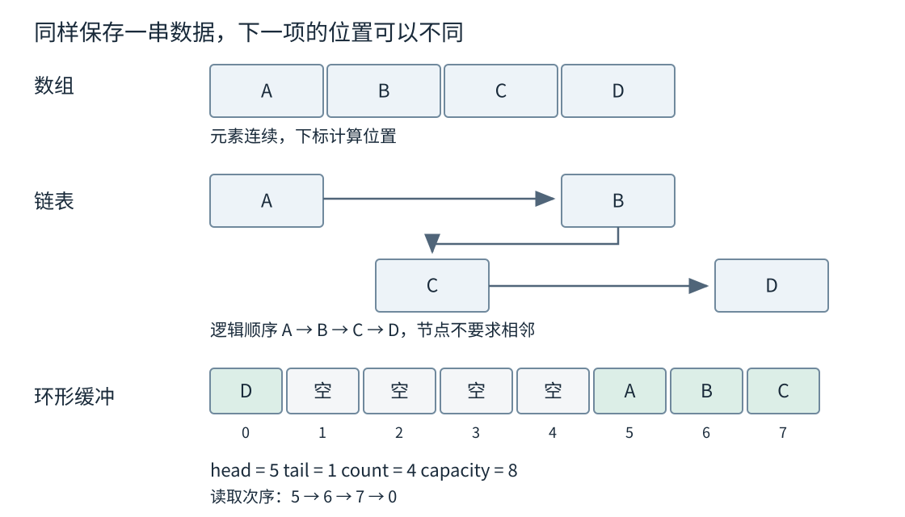
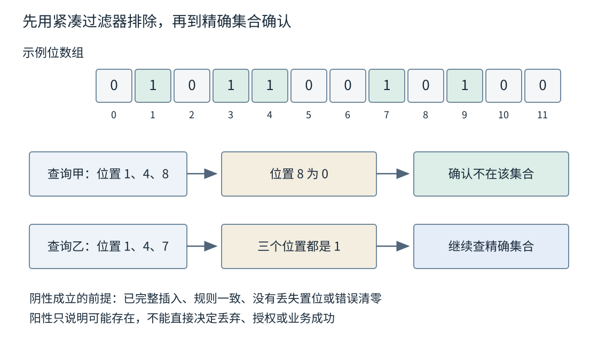
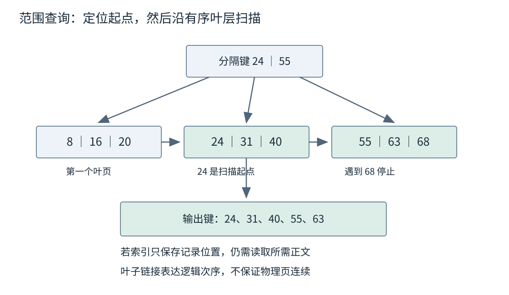

# 第二章 数据结构是怎样进入系统的

数据结构规定一组数据怎样组织，以及哪些操作能够以怎样的代价完成。它包含逻辑关系，也包含存储方式：队列规定先进入的元素先取出，但既可以由链表实现，也可以放在一段循环使用的数组里；索引规定怎样由键找到记录，但记录本身未必存放在索引节点中。

工程中的选择通常来自一组相互牵制的要求。记录是否连续读取，是否经常按编号查找，插入以后地址能否改变，是否要按范围输出，内存能否一次分配到位，都可能改变答案。只记“哈希表查找快”“链表插入快”，没有说明操作的起点、完整路径和失败方式，很容易把局部性质当成整项任务的保证。第一章给出的不变量与资源预算，在这里变成具体的布局、链接、容量和访问步骤。

## 2.1 数组 链表 栈队列与环形缓冲

### 2.1.1 顺序关系和连续存储是两件事

一个序列有第一个、第二个直到第 n 个元素，这是逻辑顺序。**数组**进一步把同类型元素连续放置，使元素位置可以由起始位置和下标计算出来。若每个元素占 s 个字节，在合法范围内，第 i 个元素的地址相对首元素偏移 i×s。这里的前提是确实处于同一个有效数组对象中，地址公式不是任意指针运算都合法的许可证。

连续布局为顺序扫描提供了明确的访问轨迹。处理完一项后，下一项通常紧邻它；同一批取入的数据可能包含多个即将使用的元素。其硬件收益取决于元素大小、访问顺序和缓存层次，第五章会继续说明。这里能够直接确定的是：结构没有要求每读一个元素就另外追随一条节点指针。

**动态数组**在固定数组的基础上管理可增长的存储。必须分清已存在元素的数量与已取得的空间：前者是 size，后者通常称为 capacity。预留一百个位置不表示已经构造了一百个业务对象，也不表示可以任意访问尚不存在的元素。C++20 的普通 `std::vector<T>` 提供连续元素存储，`vector<bool>` 是需要单独对待的特化；尾部插入有摊还常数复杂度，但一次扩容可能搬迁已有元素。[S1]

扩容首先是生命周期问题，其次才是性能问题。旧位置中的对象可能被移动或复制到新存储，原来保存的指针、引用或迭代器可能失效。即使一个地址的数值看起来还没有变化，也不能据此推翻接口规定的失效规则。保存下标可以避免某些地址问题，但如果中间发生插入、删除或重排，下标所指的逻辑记录仍可能改变。

可以把“记录身份”和“当前位置”分开：记录使用稳定 ID，数组保存当前排列，另有映射负责 ID 到位置的转换。这样迁移数组不会改变记录身份，却增加了同步更新映射的责任。若删除位置 4 后把末项搬来填洞，必须同时修改末项的映射；否则结构内部仍有元素，按 ID 查找却会找到错误位置。

### 2.1.2 摊还成本没有消除扩容尖峰

假设一个教学用动态数组满后把容量翻倍，从 1、2、4、8 一直增长。到容量达到 2 的某次幂时，历次扩容需要迁移的元素总数形成 1+2+4+… 的等比和，小于最终容量。再加每次追加自身的写入，一串 n 次追加的总工作量按 n 增长，所以可以把追加解释为摊还 O(1)。这是结构推导，不依赖输入随机。

这个证明没有说每次追加都一样快。某次增长仍可能迁移接近 n 个元素，还可能同时保留新旧两份存储。元素若拥有堆内存、文件资源或特殊移动逻辑，每次迁移的代价也未必是一个机器字。C++ 标准没有统一规定所有 `vector` 实现必须按两倍增长；这里选两倍是为了把摊还推导说清楚，不能拿它预测某个库的准确容量序列。

工程上，若能可靠估计批量规模，可以提前预留容量，把部分分配放到受控阶段。但估计上限不能来自未经验证的外部长度，过量预留也可能浪费内存。若每次追加前都仅预留“当前数量加一”，还可能破坏原本有利的增长策略。预留应服务于整个操作序列，而不是把每一次操作孤立地优化。

对有严格单次延迟要求的任务，应进一步考虑固定容量、分段存储、对象池，或者允许明确的超限返回。这些选择没有让成本消失，只是把分配、迁移或容量不足放到更容易控制的位置。选择固定容量以后，容量满时怎么办也成为接口的一部分。

### 2.1.3 链表把搬移变成了链接和定位

**链表**把元素放在独立节点中，用链接表达顺序。单向链表通常只记录后继，双向链表还记录前驱。节点在内存中可以分散，逻辑上的相邻不保证地址相邻。

若已经握有插入位置所需的节点，单向链表在其后插入一个节点，只需让新节点指向原后继，再让前节点指向新节点。删除也类似，但单向链表通常还需要前驱。双向链表通过额外的前驱链接简化局部摘除。这些局部链接修改是常数数量，前提是节点已定位、必要资源已准备好，而且没有并发观察到半更新状态。

“在第十万个元素前插入”却不等于“已知节点前插入”。如果必须从表头逐个走过去，定位就需要 O(n)；若先按键查找，查找成本也必须计入。完整操作还可能包括分配节点、构造对象、更新数量、通知观察者和释放旧资源。只统计改两条指针，往往漏掉真正主导耗时的部分。

链表也有空间账。若一个简化双向节点只保存 8 字节值和两个 8 字节链接，它的字段就有 24 字节；真实大小还受对齐、分配器和节点实现影响。这里不是 C++ 对指针宽度或 `std::list` 节点大小的保证，只是说明：小对象场景中，结构元数据可能比业务值更大。

链表仍有合适的位置。例如一个缓存已经用哈希索引找到节点，需要把它移到“最近访问”端，双向链表可以只改变链接，而不搬迁所有缓存项。它的价值来自已知节点与稳定顺序操作的组合。反过来，若任务主要是反复遍历全部小记录，连续数组可能更容易利用局部性，即使偶尔需要搬移。应比较实际操作比例，而不是给容器排列绝对名次。



图 2-1 三种布局表达同一个基本问题：逻辑上的下一项，怎样对应到实际可访问的位置。矩形宽度只作示意，不代表真实对象大小。

### 2.1.4 栈与队列首先是操作纪律

**栈**采用后进先出，适合保存尚未完成的嵌套工作：进入一层处理时压入上下文，退出时取回最近的上下文。深度优先搜索和表达式求值都可以利用这一纪律。这里的数据结构栈，不等于操作系统为线程提供的调用栈；前者可以存放在动态数组中，后者涉及执行环境和函数调用。

**队列**采用先进先出，适合表达等待处理的到达顺序。广度优先搜索把先发现的顶点先展开，任务通道把先排队的工作先交给消费者。先进先出只说明出队选择，不自动保证处理完成顺序：两个消费者取出任务以后，后取出的短任务仍可能先完成。

**双端队列**允许两端插入和删除。它可以实现普通队列，也可以用于工作窃取或单调队列等算法，但允许哪些操作还取决于上层契约。C++20 的 `std::deque` 支持随机访问和两端操作，却不承诺元素像普通 `vector` 那样整体连续。分段数组是常见实现方式，具体块大小和目录布局不是语言保证。[S1]

因此，栈、队列和优先队列之间最重要的差别，是下一次允许取出谁。名字中都有“队列”，不代表能互换。把先进先出的队列换成按优先级取出的堆，可能改善某类请求的等待时间，也可能使另一类请求长期得不到处理；这属于调度语义变化，不能只归为底层优化。

### 2.1.5 环形缓冲怎样区分空和满

**环形缓冲**用一段固定容量的数组循环保存数据。写到末尾后，下一次写入回到开头；读取位置也按同一规则前进。它适合容量明确的字节流暂存、采样窗口和任务通道，因为重复使用空间时不必搬移剩余元素。

设容量为 C。最直接的一种设计保存 head、tail 和 count：head 指向下一次读取位置，tail 指向下一次写入位置，count 表示当前有效元素数。不变量为 C>0，两个位置始终小于 C，且 0≤count≤C。count 为 0 表示空，为 C 表示满；head 和 tail 相等时，两种情况都可能出现，不能只靠这两个位置的相等判断。

另一种设计牺牲一个槽位，规定下一写入位置碰到读取位置时就算满；还有设计使用单调序号或附加翻转位区分状态。它们都能成立，但容量含义和整数回绕规则不同。不能把一种设计的满判断接到另一种设计的推进逻辑上。

下面的原创示例只保存整数，并采用计数方案。它用分支处理回绕，不计算可能溢出的 head+count。为突出队列状态，禁止复制和移动，避免讨论移出对象的额外有效状态。它是单线程说明代码，不是并发队列。

```cpp
// C++20 完整类示例；未编译、未执行。
#include <cstddef>
#include <optional>
#include <stdexcept>
#include <vector>

class IntRing {
public:
    explicit IntRing(std::size_t capacity) : slots_(capacity) {
        if (capacity == 0) {
            throw std::invalid_argument("zero capacity");
        }
    }
    IntRing(const IntRing&) = delete;
    IntRing& operator=(const IntRing&) = delete;
    IntRing(IntRing&&) = delete;
    IntRing& operator=(IntRing&&) = delete;

    bool try_push(int value) noexcept {
        if (count_ == slots_.size()) return false;
        slots_[tail_] = value;
        tail_ = next(tail_);
        ++count_;
        return true;
    }

    std::optional<int> try_pop() noexcept {
        if (count_ == 0) return std::nullopt;
        const int value = slots_[head_];
        head_ = next(head_);
        --count_;
        return value;
    }

    std::size_t size() const noexcept { return count_; }

private:
    std::size_t next(std::size_t i) const noexcept {
        return i == slots_.size() - 1 ? 0 : i + 1;
    }
    std::vector<int> slots_;
    std::size_t head_ = 0;
    std::size_t tail_ = 0;
    std::size_t count_ = 0;
};
```

以容量 3 手算：先放入 10、20、30，head 为 0，tail 回到 0，count 为 3；再放入 40 会返回失败。取出 10 后，head 变为 1，count 为 2；此时放入 40，覆盖的是已取出的槽位 0。之后依次读到 20、30、40。物理下标经历回绕，逻辑顺序没有改变。

示例在构造时取得全部整数存储，后续成功入队只赋值并更新索引。若推广为一般对象，就要重新考虑构造、移动和析构可能失败的顺序，以及槽位里究竟有没有活着的对象。第九章的对象生命周期和第十四章的异常保证会处理这些问题，不能把整数示例直接换一个类型名就宣称得到通用容器。

### 2.1.6 容量边界也是系统行为

环形缓冲满了以后，可以拒绝新元素、等待空间、覆盖最旧元素，或者将流量转移到别处。它们适用于不同语义：监控图保留最近采样可能允许覆盖；支付任务队列若静默覆盖就会丢工作；音频通道可能优先保持实时性，但仍需明确丢弃单位和计数。结构只能报告容量状态，业务必须决定后果。

假设输入稳定为每秒 600 项，消费者只能处理每秒 400 项，空队列有 1 024 个可用位置。忽略启动与离散时刻，积压每秒增长 200 项，约 5.12 秒填满。换成更长链表只能延迟暴露问题；只要长期进入量大于完成量，又不允许丢弃或拒绝，任何有限内存最终都会不够。这是由第一章资源预算得到的结论，不是环形缓冲特有的缺陷。

并发使用还要增加发布与读取关系。两个线程同时修改普通 count，即使它只是整数，也可能形成数据竞争；把所有字段改成原子变量，也没有自动证明“看到数量增加就一定能读到对应元素”。单生产者单消费者和多生产者多消费者的设计条件不同。第十七章与第十八章会讨论内存模型、线性化和回收，这里不把无锁性质附会到循环数组上。

### 2.1.7 面试追问要把操作起点说清楚

**“链表插入 O(1)，为什么很多程序仍用数组？”** 已知位置后的链接修改是 O(1)，定位、分配和遍历并没有一并变成常数。需要询问操作比例、对象大小与地址稳定性。若大量扫描、少量批量修改，连续存储很可能是更好的候选；若持续调整已索引节点的相对次序，链表才有明确优势。

**“预留足够容量后，数组指针就永远稳定了吗？”** 只能消除特定容量范围内的重分配风险，中间插入删除和销毁所有者仍会影响元素访问。合法的标准容器 swap 通常保留元素指针和引用，却会改变它们所属的容器及后续管理关系；不能把“原容器仍在”当成目标寿命的证明。稳定需求应表述成某个明确期间与操作集合，而不能只说调用过 reserve。

**“环形缓冲能把生产者变快吗？”** 它可以减少部分分配和搬移，但不能提高消费者的业务处理能力。要区分吞吐、排队等待和满时策略；若测量只统计成功入队，却遗漏拒绝率，就可能把丢弃当作提速。

## 2.2 Hash Table Bitmap Bloom Filter

### 2.2.1 哈希表把查找分成定位和确认

**哈希表**用哈希函数把键映射到一个较小的候选位置集合，再在候选中确认键是否相同。键可以是字符串、整数或复合记录；哈希值通常只是固定宽度的数。不同键可能产生相同哈希值，称为冲突，所以“哈希相同”不能替代“键相等”。

例如，把设备键 A17 和 B42 都映射到桶 5，并不导致两条记录必然互相覆盖。正确结构继续使用键比较，区分桶中的多个条目。原始键若被完全丢弃，只保存一个短哈希，就变成了允许碰撞风险的指纹结构，不能继续宣称提供精确字典语义。

哈希函数与相等关系必须相容：如果接口把两个键视为相等，它们就必须得到相同哈希。例如账号查询忽略 ASCII 大小写时，不能比较器忽略大小写、哈希器却直接区分大小写。否则两个等价键可能落到不同候选位置，查询路径无法发现已有记录。这也是 C++ 无序关联容器对键等价和哈希关系的要求。[S1]

哈希计算本身需要资源。对长度为 L 的字符串，若每次哈希都扫描完整内容，一次“平均常数查找”仍包含 O(L) 的字符工作。若键有共同长前缀，冲突后的相等比较又可能读很多字节。复杂度里的常数键模型适合分析桶组织，不应掩盖真实键长度。

### 2.2.2 冲突处理改变了访问路径

**链地址法**把同桶元素放进链或其他桶内结构。一次查询先定位桶，再检查候选。若哈希分布良好，元素数 n 与桶数 b 的比值 α=n/b 可用于描述平均桶负载；但单个桶仍可能远比平均值长。桶内不必真的使用独立分配的单向链表，抽象方法与具体布局仍应分开。[S2]

**开放寻址**把元素放在一张槽位表中。目标槽已占用时，按约定的探测序列继续找。线性探测每次向后走一个槽，具有相邻访问的特点，也可能形成连续的拥挤区。其他策略会使用不同步长或额外哈希。查询、插入和删除必须遵守同一探测规则，否则元素虽然在表里，查找也可能走不到它。

删除是看清不变量的好机会。假设三个冲突键依次占据槽 5、6、7，删除槽 6 后，如果直接把它标成“从未使用”，查询槽 7 的键可能在 6 提前停止。因此有的设计使用墓碑，表示这里曾有元素，查询需要继续；也有设计通过后移修复探测链。墓碑便于局部删除，却会让名义上空闲的表仍保留很长的探测路径，需要清理或重建。

装载因子在两类结构里含义不同：链地址法的平均桶长可以大于 1，普通开放寻址的有效槽位不能被无限填满。不能把某个实现选定的阈值推广成“哈希表的标准装载因子”。有些现代实现把控制信息与元素分开，先并行筛选一组候选再比较完整键。Abseil Swiss Tables 的维护者设计文档展示了这类元数据布局，但它是特定家族的实现说明，并非 `std::unordered_map` 的规范布局。[S3]

### 2.2.3 扩容 稳定性与对抗性输入

扩容通常需要按新桶数重新分布元素。即使用户只是插入一条记录，也可能触发一次与已有元素规模相关的工作。提前预留可以改变触发时机，但要把新旧结构同时存在的峰值空间和失败后的状态纳入预算。

C++20 对标准无序关联容器规定：rehash 会使迭代器失效，但不会使指向现存元素的指针和引用失效。[S1] 这项保证不是所有哈希表共同拥有的性质。紧凑地内联保存元素的其他实现，扩容时可能连元素地址一起改变。替换容器库时，只比较平均耗时而忽略地址稳定性，会使原来正确的调用代码失效。

哈希还面临输入分布问题。随机测试中桶很均匀，并不能证明外部用户构造的键也均匀。若大量键冲突，普通桶扫描可以退化成线性查找，整批插入可能累积成平方级比较量。应按照威胁模型选择哈希策略、限制键长度和请求规模，并保留耗时与碰撞异常的观测。加一个未经分析的随机种子，不自动等于具备密码学抗攻击能力。

长期保存哈希结果也要谨慎。某个标准库版本当前给出的哈希值，不应未经契约就写成跨进程或跨语言永久标识。要构建可持久化分片或内容寻址，需要明确算法、输入编码、版本和碰撞处理。第四章会解释编码一致性，第八章会说明二进制与版本边界。

### 2.2.4 位图利用的是值域而不是哈希运气

**位图**为一个有限整数值域中的每个候选保留一位。第 i 位为 1 表示 i 存在，为 0 表示不存在。对于范围 0 到 U−1，它需要约 U/8 个八位字节，而不是按实际存在数量 n 分配。边界明确且映射正确时，位图提供精确成员关系，没有 Bloom Filter 那样的概率误报。

如果 ID 被约束在 0 到 9 999 999，位图需要 10 000 000 位，也就是 1 250 000 字节，约 1.19 MiB。这是按位数计算的裸载荷，不含对象元数据。若实际存在九百万个 ID，这很紧凑；若只存在十个 ID，而最大 ID 接近一万亿，直接位图就极不合适。**决定空间的是值域 U，决定稀疏性的则是 n/U。**

位图还有集合计算优势。同一值域下，按机器字执行 AND 可以求交集，OR 可以求并集；遍历所有字的成本大致按 U/w 增长，w 为每字处理的位数。若最终要列出每个命中的 ID，还必须付出输出这些结果的成本，不能只报告一次位运算的时间。

可压缩位图通过保存连续区间、稀疏块或不同块表示缓解空间问题，代价是更新与访问逻辑更复杂。这里不把任何压缩格式视为通用最优方案。连续的大段 1、随机零散的 1 和冷热混合分布，对压缩率与解码工作有不同影响，必须带着实际数据分布比较。

位图也不是天然线程安全。两个线程分别设置同一个机器字中的不同位，若都执行普通“读取、按位或、写回”，其中一次更新可能覆盖另一次。即使逻辑位不同，物理读改写仍可能冲突。正确并发方案要按实际存储单位和发布规则设计，而不是按图上画出的单个位推断。

### 2.2.5 Bloom Filter 如何保留单向确定性

**Bloom Filter**用较小位数组近似表示一个集合。插入键 x 时，用 k 个哈希位置把对应位设为 1；查询时检查这些位置：只要有一位为 0，就能在结构条件成立时确认 x 不在已插入集合；全部为 1，只能说“可能存在”。其他键也可能把这些位置全部置 1，形成误报。[S4]

“不漏报”有明确范围：针对已经完成插入、使用相同哈希规则查询、位没有丢失或被错误清除的集合。它不是对整个数据库状态的无条件保证。数据库刚写入而过滤器尚未更新、查询使用了另一份过期过滤器、并发写丢掉一个置位，都可能让系统把真实存在的数据判断为不存在。此时违背的是集成条件，不能用数据结构定理为实现开脱。



图 2-2 Bloom Filter 的查询结果不对称。图中哈希位置是原创构造值，用于说明分支含义，不代表实际哈希函数。

普通 Bloom Filter 不能通过清零几个位置来删除一个键，因为这些位也可能由其他键共同使用。计数型变体用小计数器代替位，可以在正确记录插入删除次数的条件下递减，但必须处理计数器溢出、重复插入和误删。不能仅凭“可能存在”就删除一个从未确认插入的键，否则可能破坏其他键的证据。

### 2.2.6 从误报预算推回空间预算

用 m 位保存 n 个不同键，每键选择 k 个位置。为了估算，假设位置选择近似独立且均匀。一次置位没有碰到某个指定位置的概率是 1−1/m；kn 次选择后该位仍为 0 的概率为 (1−1/m)^(kn)，大规模下近似为 e^(−kn/m)。进一步近似把查询的 k 个位置视为独立，就得到误报率 p≈(1−e^(−kn/m))^k。[S4]

这是近似模型，有限大小下位占用和查询位置之间并不完全独立，实际哈希构造也有相关性。它适合估算初始预算，不是对任意输入和实现的精确概率担保。在模型中，使误报率较低的 k 约为 (m/n)ln2；k 必须取整数，更多哈希读取也要花 CPU 和内存访问成本。

例如给每键 10 位，取 k=7，代入模型得到约 0.82% 的误报率。若保存一千万个不同键，裸位数组为一亿位，即 12 500 000 字节，约 11.92 MiB。这些数是公式估算，未进行实验。若实际插入量翻倍却不扩容，每键可用位数相当于减半，误报率会明显上升；“建立时按一千万条配置”不是整个生命周期的容量保证。

误报率应换算成后续成本。设 90% 查询本来就不存在，精确查询每次假设成本为 8 个成本单位，过滤器查询为 0.2，误报率按 1% 预算。过滤后仍需精确查询的比例为 10%+90%×1%=10.9%，总平均成本模型为 0.2+0.109×8=1.072。这个示例说明它为什么可能有价值；单位是构造的工作成本，不是测得的毫秒。

如果绝大多数查询都真实存在，精确层又已在缓存里，过滤器可能只增加额外计算。相反，昂贵的不存在查询较多时，它才更有机会节省后续访问。应观测阴性比例、阳性后真实命中比例、过滤器大小与查询总耗时，而不是只展示一个误报率。

### 2.2.7 精确性要求决定组合方式

为导入记录去重时，如果要求一条新记录都不能丢，只能在过滤器阴性时快速确认“此前集合中没有”，在阳性时继续精确查找；不能把所有阳性直接丢弃。这样误报只增加一次精确查询，不改变结果。过滤器、精确集合和待提交记录之间仍须有一致的更新顺序，避免失败重试留下彼此矛盾的状态。

对一个不可变数据文件，可以在生成文件时同时建立过滤器，最后把两者作为同一版本发布。对不断更新的存储，必须另外说明过滤器何时反映新增，删除留下的旧置位能否接受，重建期间查询使用哪一代数据。旧置位通常只增加误报；遗漏新增则可能破坏阴性判断。这两个更新方向的后果不同。

**“哈希表也有冲突，为什么它还能精确？”** 因为它保留原始键并在候选中确认，冲突改变成本，不必改变正确结果。Bloom Filter 有意不保留足够信息来区分所有候选，接受误报来节省空间。

**“既然 Bloom Filter 没有漏报，能不能直接挡住所有数据库不存在查询？”** 只有过滤器覆盖了查询所对应的数据库版本，阴性才有这个含义。必须交代新增发布、重建切换与失败路径，不能只背一句概率性质。

**“位图和 Bloom Filter 都是位数组，为何用途不同？”** 位图的位与受限值域中的对象一一对应，空间随值域增长；Bloom Filter 的位被多个键共享，空间随容量和误报预算设计。相同物理材料承载的是不同语义。

## 2.3 Tree Heap Trie Union Find 与 Graph

### 2.3.1 树是层次关系 搜索树额外保存次序

**树**在无向图的通常定义中，是连通且没有环的结构。讨论有根树时，会指定一个根，每个非根节点有一个父节点，节点与后代形成子树。文件目录、语法结构和组织层次都可以用树表达，但这些树不一定按大小排序，也不一定平衡。

**二叉搜索树**额外要求键的次序与左右子树一致。采用唯一键的简单约定时，左子树的键都小于当前键，右子树都大于当前键。查询 37，先与根比较，若较小就排除整棵右子树，再继续比较。其成本取决于高度 h，通常写为 O(h)，并非只要叫树就必定是 O(log n)。

把已经有序的键 1、2、3、4 依次插入一棵不作平衡的普通搜索树，可能得到一条向右延伸的链。此时 h 按 n 增长，查找也退化为线性。平衡树通过额外约束控制高度，旋转是调整局部结构的一种基本操作：父子位置改变，但中序遍历得到的键序列保持不变。AVL、红黑树等采用不同约束，不能把它们的更新细节混成一套规则。[S5]

旋转不只是画图技巧。若节点还记录子树元素个数、区间最大值或其他聚合信息，旋转之后这些辅助字段必须一起更新。比如顺序统计树用左子树大小定位“第 k 小”，搜索次序即使仍正确，遗漏大小更新也会给出错误排名。增加一种快速查询，通常就增加一种需要维护的不变量。

重复键也需要策略。可以把同键记录放在一个节点的列表里，保存计数，或者使用“业务键、稳定记录 ID”的复合次序。仅规定“相等就总插右边”，再随意套用旋转，未必保留原来关于重复位置的假设。相等的定义应先于结构实现，排序比较也要保持一致。

### 2.3.2 堆只维护足够取出极值的次序

**堆**把全局排序要求减弱为父子之间的关系。以最小二叉堆为例，每个父节点的键不大于子节点，所以根一定是当前最小值；同一层的两个节点、不同子树中的节点之间，不要求完整排序。

完全二叉树形状使堆适合放在数组中。从 0 开始编号时，节点 i 的子节点位置为 2i+1 与 2i+2，父节点在 i>0 时为 floor((i−1)/2)。实际代码仍应避免先算出溢出的下标，再去判断它是否超界。使用尺寸和差值约束，可以在计算前判断子节点是否存在。

插入时把新值放到尾部，再与父节点比较并向上调整；取出最小值时，把尾元素放到根，沿较小子节点向下调整。堆高为 O(log n)，因此这两类修复只需经过对数层数。查看根是 O(1)，但寻找任意键并不是 O(log n)，因为堆只保证局部次序。[S6]

用键 4、9、7、15、12 构成一个最小堆，插入 3 时，3 先位于尾部，与父节点 7 交换，再与根 4 交换。最终根为 3，却不意味着数组其余部分已经从小到大。若调用者直接顺序输出堆数组，会得到合法堆布局，不会得到排好序的结果。

批量建堆可以从最后一个非叶节点向前做下沉，总成本为 O(n)。原因不是每个节点都走 log n 层：大多数节点靠近叶子，只能下沉很少层。粗略按高度分组，至多约 n/2 个节点无需下沉、n/4 个节点只处在一层之上，更高节点越来越少，总工作量收敛为 n 的常数倍。第三章的 Top K 会利用这种“只保留部分次序”的思想。

### 2.3.3 调度中的优先级变化需要额外结构

优先队列常用堆实现，例如取出最早截止的任务。若任务优先级永不改变，接口较简单；若允许取消任务或修改截止时间，就需要能从任务 ID 找到堆内位置，或者采用惰性失效。

索引堆保存 ID 到数组下标的映射，每次交换两个堆元素都同步修改映射。修改某任务优先级后，根据变化方向向上或向下修复。这样可以在定位之后保持对数级调整，但又出现一条跨结构不变量：映射记录的位置必须确实存放该 ID。

惰性失效则把新版本任务重新压入堆，旧版本先不删除。取出时与当前版本表比较，不再有效的条目直接丢弃。它避免了任意位置删除，却可能让堆积累很多废条目。若一个任务更新一万次却从未到期，逻辑上只有一个任务，物理上可能已有一万份调度条目。容量阈值与重建策略必须按物理条目数计算。

同优先级的顺序同样不能想当然。若必须保持到达次序，可以使用“优先级、单调序号”作为比较键；序号回绕和重启后的语义要另行规定。C++ 标准优先队列没有替业务承诺稳定排序，更没有把“到期后取出”变成“保证准时执行”。消费者繁忙、线程调度和任务耗时仍会影响实际完成时间。

### 2.3.4 Trie 用键的组成部分组织路径

**Trie**，常称字典树或前缀树，把键拆成一串符号，每条边对应下一符号，共同前缀共享路径。保存 `car`、`cat`、`dog` 时，前两个词共享 `c→a`，然后分别走向 `r` 和 `t`。节点还需要终止标志，才能区分“这个路径只是其他词的前缀”与“这个前缀本身也是一个键”。

查询长度 L 的键，需要依次处理它的符号。如果每个节点能够以常数时间选择对应子边，路径查找是 O(L)，但不能忽略子边表示：为每节点分配完整字母表数组会占空间；使用有序小数组或映射则可能增加选择成本。前缀补全在找到前缀后还要枚举其后代，输出十万个候选不可能只付前缀长度的成本。[S7]

符号单位应明确。对字节 Trie，UTF-8 文本按字节走边；对码点 Trie，先需要解码；用户看到的一个字符还可能由多个码点组成。精确前缀、大小写忽略和规范化后的前缀也可能不同。第四章的编码约定在这里直接影响“同一个键”和“同一个前缀”。

**压缩 Trie**或基数树会把没有分叉的一段路径合成一条带字符串标签的边，减少中间节点。查找时必须比较整段标签；插入到标签中间出现分歧时，需要把边拆开。压缩节省节点和链接，并没有取消对相关键字节的确认。

路由中的最长前缀匹配与“精确找到某个字符串”又不同。可以沿查询路径不断记住最近遇到的有效终止节点，最后返回最长的已存前缀。对 IP 地址等二进制键，应按约定的位前缀处理，不必先把地址格式化成人类字符串。结构应服从匹配语义，而不是服从输入恰好使用的展示格式。

### 2.3.5 并查集保存可合并的等价类

**并查集**维护若干互不相交的集合，核心操作是 find 与 union：find 返回某元素所在集合的代表，union 合并两个集合。它适合回答无向连通性或等价分组问题，例如已经把若干设备连接起来后，询问两个设备是否属于同一连通分量。

一种常见表示是父指针森林，每个集合的根指向自身。find 沿父指针走到根；union 先找两个根，再把其中一个接到另一个下面。若不加限制，反复错误方向合并也可能形成长链。按大小合并把较小集合接到较大集合，路径压缩则在查找时把沿途节点改接到更靠近根的位置。[S8]

按大小合并的直觉可以独立推导：一个节点因为所在集合被接到别处而增加一层时，它所在集合至少翻倍。元素总数最多 n，所以同一节点不可能因此增加超过 log₂n 层。再加路径压缩，可以得到更强的序列摊还界，常写为 O(mα(n))，这里把初始化的 n 次单元素集合建立也计入 m，因而 m≥n；α 是逆 Ackermann 量级的缓慢增长函数。这不是严格 O(1)，也不是每一次 find 都走相同数量的链接。

代表元只是结构内部选择，不能默认等于最早注册设备、最小 ID 或业务主记录。若业务需要这些属性，应在根上额外维护聚合值，合并时更新。路径压缩还会修改结构，所以从接口名字看像“查询”的 find，在实现上可能是写操作，这会影响并发、持久化和回滚。

普通并查集擅长不断合并，不擅长拆开。删除一条边后，原来连通的集合可能仍连通，也可能分裂；仅凭代表元关系无法还原原因。它通常也不保存一条具体连接路径。若需求变成“给出从 A 到 B 的所有中间设备”或“撤掉这条连接会怎样”，需要保留原始图或采用其他动态连通结构，不能不断给并查集追加布尔字段解决。

### 2.3.6 图的表示决定邻居怎样被读出

**图**用顶点表达对象，用边表达对象之间的关系。边可以有方向、权重或类型，也可能允许重边和自环。构建依赖图时，必须先约定方向：若 A→B 表示 A 完成以后 B 才能执行，就不能在另一处把同样的箭头解释为 A 依赖 B。

邻接矩阵用 V×V 个位置表示顶点对之间是否有边，适合值域固定、图比较稠密或者频繁测试任意两点是否相邻的情况。它需要 O(V²) 存储；如果每项只保存一位，常数可以较小，但数量级仍不变。枚举某点的邻居通常需要查看整行。

邻接表按顶点保存实际出边，整体空间通常为 O(V+E)，枚举一个顶点的邻居按其出度增长。这里“表”可以是链表、动态数组或压缩布局，不要求独立链节点。若用数组保存出边，扫描通常比频繁单点插入更自然；若用哈希集合保存邻居，则可能方便去重与成员查询，但增加元数据和哈希工作。[S9]

**压缩稀疏行**布局把所有邻接项放到一个大数组，再用 offsets 标记各顶点区间。构造一个四顶点有向图：0 指向 1、2，1 指向 2，2 指向 0、3，3 没有出边。可以保存 offsets=`[0,2,3,5,5]`，neighbors=`[1,2,2,0,3]`。顶点 v 的邻居在半开区间 `[offsets[v], offsets[v+1])` 中。最后一个 offset 等于边项总数，因此无邻居也能自然表示为空区间。

这种紧凑布局适合建立以后多次遍历的图，却不适合在中间不断插边而完全不付移动代价。可以先在可修改结构中收集，验证、去重和排序后再压缩发布；或者保留增量区，定期合并。两者都是把读取便利与更新成本分配到不同阶段。

无向边常在两个方向各存一项，所以业务边数与邻接项数量不同。权重数组也必须与邻居数组对齐，顶点编号必须在有效范围。若外部 ID 稀疏且很大，可以先映射为紧凑内部编号，但要保留反向映射用于错误报告和输出。一个算法的 O(V+E) 扫描，还依赖这些表示条件真实成立。

### 2.3.7 结构回答的是不同问题

树、堆、Trie、并查集和图常被列在同一张学习清单上，但它们保留的信息不同。搜索树保留全体键的相对次序，堆只保留足够选极值的局部次序，Trie 保留键前缀，并查集保留分组关系，图保留明确连接。想查询的信息若从未保存，后面就要重建或重新读取，而不是靠一种巧妙遍历凭空得到。

**“为什么堆不能像搜索树那样二分查找？”** 因为堆的两个子树之间没有键范围分隔。目标大于父节点时，两个子树都有可能包含它，无法像搜索树那样排除一边。

**“并查集的 find 近乎常数，为什么不替代图搜索？”** 它能快速回答已维护的等价类，不保存任意路径、距离或方向可达性。对于只增边的无向连通判定，它很合适；换成最短路径，输入中需要保留的信息已经不同。

**“Trie 查找只与键长有关，是否一定胜过哈希表？”** 还要计入每层子边查找、节点数量、指针访问和键分布。两者都需要处理键内容；若没有前缀查询需求，Trie 的结构开销可能没有换来有用能力。应说明是哪种查询需要共享前缀，才有可解释的选择依据。

## 2.4 B B+ Tree Skip List 与索引访问成本

### 2.4.1 当一次访问的单位变成页面

内存中的二叉树每次比较后只选择两个子方向之一。如果节点散布在许多页面，查找路径可能多次访问此前没有读取的页。存储系统里，一次读取往往带来整页或整块内容；只使用其中一个很小的键，会浪费已经取得的局部数据。

**B 树**通过在一个节点保存多个有序键，让一次节点访问能够区分更多子范围。若一个内部节点有 r 个分隔键，就能把键空间分为 r+1 个子范围。节点容量和最低占用规则帮助控制树高，标准 B 树要求所有叶子位于同一深度。不同教材对“阶”“度”的定义不完全一致，讨论容量时直接写最大子节点数、最小键数与根的例外更可靠。

常见的 **B+ 树**把内部节点主要用于导航，完整的叶层条目保存在叶节点，并按键序连接叶子。内部键可以再次出现于叶层，因为它们承担的是路标作用。点查找先沿树到叶子；范围查找先找到起点，再沿叶层依次读出后续条目。[S10]

“叶子保存数据”也要问是哪一种数据。它可以是完整记录，可以是记录 ID，也可以是主键或版本定位信息。二级索引叶子只保存定位信息时，找到索引条目以后还可能继续读表记录。把叶子画成几个键，不应误导读者以为业务所需全部列都已经在手中。

### 2.4.2 用一份页面账目估算扇出

**扇出**是一个内部节点能够指向的子节点数量。做一个刻意简化的布局：页面 4 096 字节，固定头部 128 字节，每个分隔键 16 字节，每个子页标识 8 字节，不考虑槽目录、压缩、空闲预留和其他字段。若有 r 个键，所需字节为 128+16r+8(r+1)，因此 r 最大为 165，子节点最多 166 个。

这个结果不是某个数据库的真实页面配置，而是一份能复核的尺寸推导。变长键、版本信息、校验信息和空闲空间会减小有效扇出；键前缀压缩等机制又可能改善它。页面大小相同，也不意味着叶子和内部节点能放相同数量的条目，因为两类条目的字段往往不同。

假设一亿条索引记录，每叶平均 100 条，则约有一百万个叶页；假设内部节点平均扇出为 100，上一层需要约一万个节点，再上一层约一百个，根再指向这一百个。根到叶经过四层节点。这里采用的是假定平均占用，不能用刚才算出的理论最大扇出替代它，再把四层说成任何运行状态的固定值。

四层节点也不等于每次都做四次物理磁盘读取。根和热门内部页可能已经缓存在内存，叶页也可能命中；反过来，读到叶子以后可能还要访问业务记录和溢出页。应把逻辑页访问、缓存未命中和实际设备 I/O 分开统计。后续数据库章节会把这条路径与缓冲池、事务和存储布局联系起来。

### 2.4.3 范围扫描把搜索变成定位加顺序读取

查询键在 `[24,68)` 内的记录时，B+ 树先定位第一个不小于 24 的条目。接着扫描当前叶页，读完后沿叶子链接继续，遇到第一个不小于 68 的键停止。上界是否包含应由区间约定决定，不能凭自然语言“到 68”推断。



图 2-3 范围查询包含起点定位、叶层扫描和可能的记录访问。叶层相邻不保证文件中的物理页面也连续，图中的横向箭头表达逻辑顺序。

在简化页模型里，可以把范围成本写成“到起点的树路径，加上承载结果的叶页数”，再加输出成本。如果每个结果还对应一次分散的表记录访问，后者可能远大于树路径。两棵树高度完全相同，查询一条记录和查询半张表的成本仍可能相差巨大。

复合键进一步改变可连续扫描的范围。索引按 `(tenant_id, timestamp, event_id)` 的字典序排列时，同一租户的时间区间通常形成一个连续段，event_id 解决同时间记录的次序。若只按 timestamp 查询所有租户，结果可能散布在多个租户段中。具体数据库也可能采用其他访问策略；结构层面首先要看目标结果在索引序中是否连续，不能只背“字段出现在索引里就能快”。

比较规则改变也会影响索引。字符串排序若随校对规则、大小写策略或版本而变化，旧的索引次序不一定继续适用。索引保存的是在特定比较关系下建立的结构；更换比较关系却不重新处理已有条目，会破坏搜索路径的依据。

### 2.4.4 分裂与合并让更新影响多个页面

插入一个键时，先定位目标叶页。若有空间，就按顺序加入；若页面超出容量，就需要分裂，把部分条目移到新页，并在父节点加入新的分隔信息。父节点也可能满，分裂向上传播；根分裂时，树高可能增加一层。

叶子分裂时，某个分隔键的副本可能留在叶层并进入父层；内部节点分裂的键移动规则则未必相同。删除以后可以向兄弟借条目或合并节点，但现实实现可能采用延迟清理、墓碑或不同最低占用策略。不能用一个三节点动画代表所有产品的精确算法。CMU 的教学实现将页面类型、叶层遍历和分裂合并明确分开，适合对照这些责任。[S10]

更新中间状态还涉及并发读者。如果先改变父节点入口，再让新页内容完整可见，读者可能走入未就绪页面；如果只更新叶子而父层没有跟上，查询又可能漏掉新范围。锁、版本和侧向链接等设计负责协调这些状态，不能因为树在单线程里正确，就宣称它可以被多个线程直接共享。

持久化还增加另一条边界：进程在修改了部分页面后崩溃，重启时应如何辨认已提交结构。日志、写入顺序和恢复机制不由 B+ 树这个名字自动提供。SQLite 的文件格式明确区分不同 B-tree 页面及其记录表示；PostgreSQL 也有自己的 B-tree 结构与维护机制。[S11]、[S12] 阅读具体实现时，应核对产品格式，不能把教学图当作磁盘解析规范。

### 2.4.5 跳表用多层有序链接缩短路径

**跳表**在一条有序链表上增加若干稀疏的上层链接。底层包含所有键，上层只让部分节点出现。查询从高层开始，能向前而不越过目标就前进，否则下降一层，最后到达底层候选。上层像稀疏路标，减少从表头逐项走到目标的工作。

经典随机跳表为新节点随机选择高度。若每升一层的概率为 p，某节点至少进入第 j 层的概率按 p 的幂次下降，节点的期望链接数形成 1+p+p²+…=1/(1−p)。例如 p=1/2 时，期望约两个层级的前向链接。这个推导只统计链接层数，未计节点头、分配与对齐。

随机层级在适当条件下带来期望 O(log n) 的搜索和更新，期望空间为 O(n)；最坏情况下仍可能出现很差的层级分布。Pugh 的原始技术报告讨论了这些随机平衡思路及扩展操作。[S13] 因此它与有确定高度约束的平衡树有不同的保证，不应把“期望对数”写成所有输入和随机结果下的最坏对数。

插入时需要记住每一层应该接在谁后面，再将新节点接入相关层；删除时修改同一组前驱链接。它的局部链接形式便于某些并发设计，但并不天然无锁，也不免除节点回收问题。线程沿旧链接读到已经释放的节点，仍会违反内存安全。

跳表可支持顺序范围扫描，也可通过增加跨度信息支持按排名定位。额外能力仍需维护额外字段。其层级通常更适合内存索引的链接组织；是否适合持久页、是否优于紧凑树节点，要看分配布局、缓存与更新模式。不能仅凭都具有 O(log n) 查找就认为它们的页面访问成本相同。

### 2.4.6 索引成本必须追到所需数据为止

**索引**是为了特定访问路径额外保存的组织方式。它可以指向已有记录，也可以包含查询所需字段。为每种查询都加一个索引，会增加空间、写入维护和恢复成本；索引数量不只是读取优化参数，也是每次更新要维护多少份派生状态的问题。

如果所需字段都能从索引条目中取得，可能减少回表读取，但具体数据库仍可能需要判断记录可见性。PostgreSQL 18 的 index-only scan 文档明确说明，可见性映射会影响是否仍需访问堆表。[S14] 因而“覆盖了列”与“执行中绝不碰表页面”不是同一个断言；后者需要按具体产品与运行状态验证。

对一个日志检索服务，可以按如下顺序建立成本账：首先是定位候选范围，其次是读取候选索引条目，再核对过滤条件和版本，最后取得正文并输出。若时间范围很大但最终只匹配少数正文条件，索引可能读取很多候选；若正文很大，带宽可能主导总成本。只报告树高三层或哈希查找一次，不能解释端到端延迟。

结构选择也随更新方式变化。整批构建、长期只读的数据可以排序后紧凑保存，用二分定位和连续扫描；持续插入、范围查询较多的数据适合比较有序动态索引；主要按精确键查询的数据可以比较哈希方案；大量不存在查询可以在精确索引前加入过滤器。这些是候选方向，最终还需按一致性、峰值内存和故障恢复要求筛选。

### 2.4.7 从复杂度追问到可验证的工程解释

**“B+ 树为什么常用于数据库，而不直接用红黑树？”** 页面访问一次可以取得多个分隔键，较大扇出减少层数，叶层有序组织便于范围读取。还要说明页面大小、平均占用和缓存状态，不能把理由简化为“磁盘喜欢 B+ 树”。内存型有序树也会利用多键节点，结构思想不专属于机械磁盘。

**“树高只有四层，查询为什么仍慢？”** 四层只描述导航深度。缓存未命中、范围内的候选数量、回表、版本检查、正文大小和并发等待都可能增加成本。应提供逻辑页数、物理读取、返回行数和等待分解，而不是重新计算一次 log n。

**“跳表比平衡树简单，是否应统一换成跳表？”** 先比较需要的保证。随机层高、额外链接、分配方式、范围访问和并发回收各有代价；特定实现更短，不代表在所有工作负载上更省空间或更快。替换前还要核对迭代器、地址稳定性和异常恢复语义。

**“选择数据结构时最重要的问题是什么？”** 先问必须保存哪些关系，再列出高频操作和完整路径，最后把规模换成实际资源账。精确成员关系、顺序、前缀、极值、连通性和范围，并不是同一个需求。选对结构，意味着保留了以后真正要问的信息，并把维护这些信息的成本放在系统能够承担的位置。

## 来源与阅读边界

核验日期：2026-10-03。C++ 基线为 C++20；规范参照使用固定公开草案 N4861，其与 C++20 DIS 的内容关系参见 [N4859 编辑报告](https://www.open-std.org/jtc1/sc22/wg21/docs/papers/2020/n4859.html)。课程网站用于核对经典结构性质，产品文档只支持相应产品的说明，不代表所有实现。全文布局、数字算例、容量策略、示例代码和插图为原创教学设计；没有执行 C++ 编译、运行、性能测量或并发测试。

- **S1 C++ 容器契约。** [WG21 N4861][S1]，重点 `[vector.overview]`、`[vector.capacity]`、`[deque.overview]`、`[unord.req]`。用于连续性、摊还增长和标准无序容器失效规则；不据此指定具体库的内部布局
- **S2 哈希表冲突处理。** [Sedgewick 与 Wayne 的 Hash Tables][S2]。核对链地址、开放寻址与装载因子的含义；本章不采用其中 Java 示例作为 C++ 代码
- **S3 特定紧凑哈希实现。** [Abseil Swiss Tables Design Notes][S3]。仅用于元数据筛选的实现实例
- **S4 Bloom Filter。** [Broder 与 Mitzenmacher 的作者公开论文][S4] §2。核对近似成员判断、概率模型和参数关系；本文公式明确标为近似，算例为自拟
- **S5 平衡搜索树。** [Balanced Search Trees][S5]。核对通过平衡约束限制树高和旋转保留有序关系
- **S6 堆与优先队列。** [Priority Queues][S6]。核对堆序、上浮下沉与线性建堆
- **S7 Trie。** [Tries][S7]。核对按符号路径查找与前缀查询；编码选择由本章另作约束
- **S8 并查集。** [Case Study Union Find][S8]。核对加权合并、路径压缩及摊还界的适用范围
- **S9 图表示。** [Undirected Graphs][S9]。核对邻接表与邻接矩阵的基本成本；压缩数组算例为原创
- **S10 B+ 树。** [CMU 15-445/645 2025 B+Tree 项目说明][S10]。核对内部页面导航、叶页条目、分裂与叶层迭代的责任区分；未运行课程代码
- **S11 SQLite 页面格式。** [Database File Format][S11] §1.6。只用于说明产品页面有精确定义，不推广为所有 B+ 树格式
- **S12 PostgreSQL B-tree。** [PostgreSQL 18 B-Tree Indexes][S12]。用于说明实际索引还包含维护和版本相关机制
- **S13 跳表。** [William Pugh A Skip List Cookbook][S13]，UMIACS–TR–89–72.1。作者技术报告，由马里兰大学存储库提供
- **S14 覆盖索引与可见性。** [PostgreSQL 18 Index-Only Scans and Covering Indexes][S14]。仅支持该产品的可见性映射边界

[S1]: https://www.open-std.org/jtc1/sc22/wg21/docs/papers/2020/n4861.pdf
[S2]: https://algs4.cs.princeton.edu/34hash/
[S3]: https://abseil.io/about/design/swisstables
[S4]: https://www.eecs.harvard.edu/~michaelm/NEWWORK/postscripts/BloomFilterSurvey.pdf
[S5]: https://algs4.cs.princeton.edu/33balanced/
[S6]: https://algs4.cs.princeton.edu/24pq/
[S7]: https://algs4.cs.princeton.edu/52trie/
[S8]: https://algs4.cs.princeton.edu/15uf/
[S9]: https://algs4.cs.princeton.edu/41graph/
[S10]: https://15445.courses.cs.cmu.edu/fall2025/project2/
[S11]: https://www.sqlite.org/fileformat.html
[S12]: https://www.postgresql.org/docs/18/btree.html
[S13]: https://api.drum.lib.umd.edu/server/api/core/bitstreams/17176ef8-8330-4a6c-8b75-4cd18c570bec/content
[S14]: https://www.postgresql.org/docs/18/indexes-index-only-scans.html
