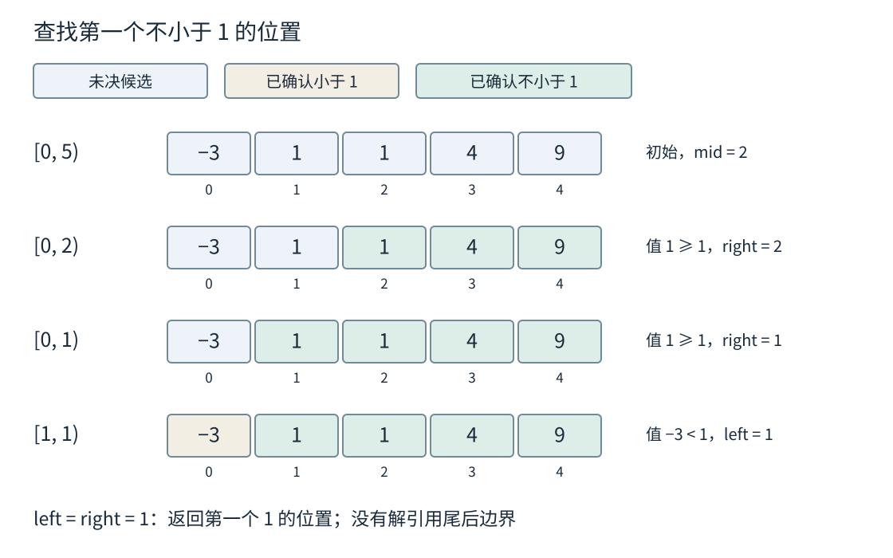
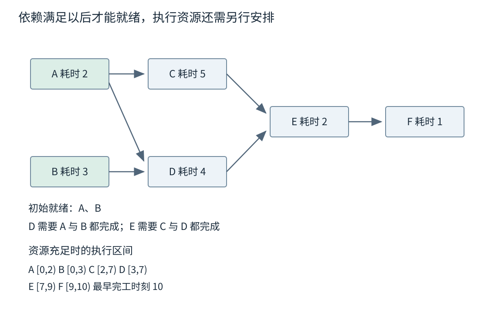
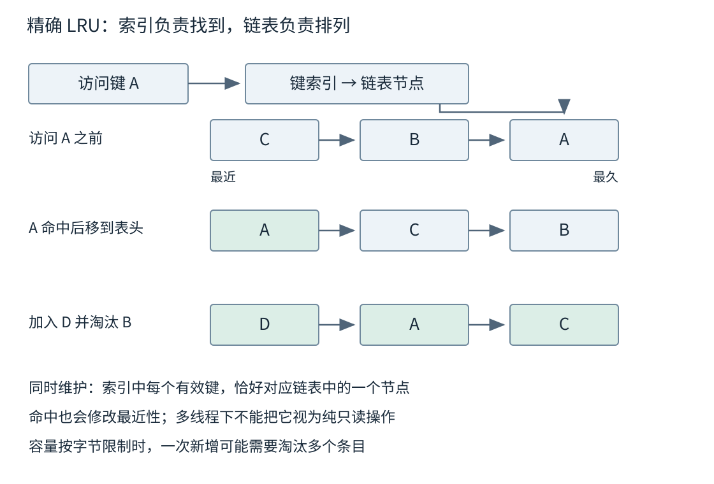

# 第三章 从算法选择到可解释的工程取舍

算法是一组有明确推进规则的计算步骤。它回答怎样从输入得到满足要求的输出；数据结构则决定步骤中需要的信息如何保存和访问。两者不能分开评价：同一个二分策略放在数组与链表上，比较次数可以相近，定位中间元素的成本却不同；同一张图采用不同表示，遍历边的工作也会改变。

工程中的算法选择，通常要同时解释正确性和代价。为什么这个候选可以被排除，为什么这个距离已经确定，为什么眼前的选择不会毁掉更好的未来，都是正确性问题。内存是否足够、失败后能否恢复、数据分布变化后是否仍可用，则决定这套步骤能否进入实际系统。下面把这些判断落实到排序、图、规划与缓存等常见任务中。

## 3.1 排序 二分与边界不变量

### 3.1.1 排序首先要定义什么叫在前面

**排序**按一套比较规则重排元素，使后面的元素不应排在前面的元素之前。编号升序、截止时间升序与风险等级降序是不同次序；同一记录可能同时含有这些字段，必须明确谁是主键、谁用于打破平局。

以事件记录为例，业务需要“按发生时间输出，同一时间按接收顺序输出”。有两种常见表达：只比较发生时间，使用稳定排序保留输入中的接收顺序；或者比较“发生时间、接收序号”这一复合键。后者把次序直接编码进比较关系，前者依赖输入本来就具有正确的接收顺序。如果输入已经被其他步骤打乱，稳定排序不会把丢失的次序恢复出来。

**稳定排序**只保证比较意义下等价元素的相对次序不变，不保证记录地址不变，也不保证重复运行时永远输出同一顺序。若输入来自无序遍历，而且没有稳定的平局规则，不同运行仍可能产生不同的等价项顺序。

C++20 的排序比较通常要求**严格弱序**。直观上，元素不能排在自己前面，先后关系要传递，“彼此都不在对方前面”形成的等价关系也要一致。[S1] 使用 `a.key <= b.key` 不符合要求，因为 a 与自身比较就为真。比较器每次读取会改变的外部计数，也可能使同一对对象在不同调用中得到相反结果。

浮点 NaN 是更隐蔽的例子。按普通小于关系，NaN 与 1 彼此都不小于，NaN 与 2 也彼此都不小于，但 1 与 2 并不等价。这样得到的“不可比就是等价”不具有需要的传递关系。如果排序域可能含 NaN，应先拒绝、分组或定义明确的一致次序，而不是让库猜测业务希望怎样排列。[S1]

比较器还要避免通过 `a.key - b.key < 0` 判断次序，因为减法可能溢出。直接比较字段，按需要依次比较平局字段，通常更容易说明。排序只是重复执行比较规则；规则本身错误，再成熟的算法也无法补救。

### 3.1.2 比较排序用什么工作换取有序

插入排序维护一个已经排好的前缀，每读入一个新元素，就把它插到前缀中的正确位置。逆序很多时，需要移动大量元素，最坏工作量为 O(n²)；输入已经接近有序或小到常数开销主导时，它仍可能作为有用的局部步骤。应说明“接近有序”的实际含义，例如逆序对较少，而不是只凭文件看起来整齐。

归并排序把输入分成两部分，分别排好，再不断比较两边当前最小的未输出元素，产生一个更大的有序段。合并总共 n 个元素需要线性工作，递归有对数层，因此总比较量为 O(n log n)。相等时优先取左段，可以保留原先相对次序。常见数组实现需要额外合并缓冲；链表或专门原地归并方案的成本则不同。[S2]

快速排序选择一个枢轴，把元素划分到相应区域，再递归处理需要继续排序的区域。划分均衡时高效，持续极不均衡时可能退化为 O(n²)。随机化可以给出期望分析，但不是每次运行的最坏界；大量重复键时，三路划分把小于、等于、大于分开，可以避免反复处理已经等价的整块元素。[S3]

堆排序先建堆，再反复取出极值完成排序，具有 O(n log n) 的最坏比较量和少量辅助状态；典型数组版本不稳定。它的访问路径、元素移动与常数成本和归并、快速排序不同。一个生产级排序实现可以组合多种方法，用深度限制或小区间策略控制坏情况，但具体组合属于实现。

C++20 规定 `std::sort` 的 O(n log n) 比较复杂度，并没有规定必须是某个名为“内省排序”的实现，也没有承诺稳定。`std::stable_sort` 提供稳定性，其复杂度与可用额外内存有关。[S1] 调用标准接口时应依据接口契约；解释某个库为什么快时，才进一步查看该版本源码和测量。

比较排序的 Ω(n log n) 下界也有范围：它针对只通过比较区分一般键的模型。计数排序利用有限整数值域，基数排序利用可拆分的固定表示，可以绕开这一模型，但会付出值域空间、多趟扫描或特定键格式的成本。它们不是证明了比较下界错误，而是使用了比较之外的信息。

### 3.1.3 真正昂贵的可能是比较和搬运

排序一百万个小整数与一百万个带长字符串的记录，虽然都可能进行 O(n log n) 次比较，实际字节工作并不一样。字符串在很长公共前缀以后才分歧时，一次比较需要读取很多内容；记录包含大量载荷时，交换记录也可能昂贵。

一种候选方案是排序记录下标，保留原始对象不动。它减少对象搬运，却使后续访问多一层间接定位；若最终必须顺序写出所有记录，仍要按排好的下标读取内容。另一种方案预先提取排序键，把昂贵规范化或字段解析只做一次，但需要额外存储，并确保缓存键与原记录对应。

如果输入大于内存预算，可以分块排序并写出有序段，再进行多路归并。每个段只保留当前可读的一部分，选择最小段首通常可用一个小堆。若同时归并 r 段，选择工作约为 O(log r) 每项，缓冲、文件句柄和读取批量则限制 r 的大小。归并路数并非越多越好，设备带宽和内存预算会改变合适的配置。

外部排序还要处理临时文件、失败清理与最终结果发布。中途失败时不能把半个结果当成完整文件，输入验证、排序规则版本和输出校验也应保留。排序算法证明输出有序，不等于证明整个文件任务具备安全覆盖和恢复能力。

### 3.1.4 二分查找是在寻找一个边界

**二分查找**反复把仍可能包含答案的有序区间缩小一半。它最可靠的理解不是“不断找中间值”，而是“维护左右两侧已经确定的性质”。以查找第一个不小于 x 的位置为例，答案是一个边界，可能位于任意元素之前，也可能恰好是尾后位置 n。

采用半开区间 `[left,right)` 保存尚未排除的候选元素，并维护：left 之前所有元素小于 x，right 及其之后的元素不小于 x；答案位置位于闭合的边界范围 `[left,right]`。初始 left=0、right=n，两侧都是空区域，因此性质成立。

取中点 mid。如果 a[mid]<x，那么 mid 以及它前面的候选都不可能是第一个不小于 x 的位置，所以把 left 设为 mid+1；否则 mid 仍可能是答案，因此把 right 设为 mid，而不是 mid−1。每一步都保留答案，并严格缩小未决区间。

```cpp
// C++20 完整函数示例；未编译、未执行。
#include <cstddef>
#include <span>

std::size_t first_not_less(std::span<const int> values, int key) {
    // 前置条件：values 在调用期间不变，按整数升序排列。
    std::size_t left = 0;
    std::size_t right = values.size();
    while (left < right) {
        const std::size_t mid = left + (right - left) / 2;
        if (values[mid] < key) {
            left = mid + 1;
        } else {
            right = mid;
        }
    }
    return left;  // 可以等于 size()；使用前仍需检查。
}
```

这里先求 right−left，避免把两个较大的下标相加。循环条件保证 mid<right≤size，所以访问有效；mid+1 也不超过 right。空输入直接返回 0。结果等于 size 时，表示没有元素满足条件，而不是返回了一个可以解引用的位置。

用 `[-3,1,1,4,9]` 查找 1：第一次 mid=2，值为 1，right 改为 2；第二次 mid=1，值为 1，right 改为 1；第三次 mid=0，值为 −3，left 改为 1。最后边界为 1，得到第一个 1。若在第一次遇到相等时立即返回，就只能得到“某个匹配”，没有满足“第一个”的契约。



图 3-1 二分中的证据逐步积累。图示与示例代码相同，右边界不包含在候选元素中，但它本身仍可作为返回边界。

### 3.1.5 边界定义比模板记忆更重要

第一个大于 x 的位置，与第一个不小于 x 只差一个谓词，却会改变重复值的处理。对于排序序列，相等区间可以由这两个边界组成；区间长度给出出现次数。不存在时两个边界相等，也不需要额外编造一个错误下标。

C++ 的 `lower_bound` 要求范围针对相应谓词已经分区，整体排序是一个足够而更强的常见条件；它的比较次数是对数级，但非随机访问迭代器上的移动总量可以是线性的。[S1] 因此对链表调用通用二分接口，不意味着得到了数组式的对数时间定位；有专门树索引的容器也应优先使用其成员查询接口。

二分也可以寻找单调可行性边界。设一组任务必须按原顺序装入至多 D 个批次，每批总重量不超过容量 C，重量均非负。若容量 C 可行，任何更大的容量也可行，因为原来的装法仍然有效。于是可以对 C 搜索最小可行值，每次按原顺序贪心装满当前批次，再开始下一批，判断需要多少批。

这里需要两层证明：容量可行性确实单调；用于判定的装箱过程在“保持原顺序、每批为连续段”的约束下不会比其他合法装法多用批次。如果允许随意重排、存在负重量或还有互斥规则，原判定就不一定正确。二分会忠实地加速一个错误判定，不会替它恢复正确性。

搜索上下界也需要可解释。下界至少为最重单项，上界可以取全部重量之和，但求和可能超出整数类型。应先有总量上限或检查加法，不能在发生溢出后再把错误总和交给二分。每次判定成本若为 O(n)，搜索数值范围宽度 W 的总成本约为 O(n log W)，不是忽略判定后的一句 O(log W)。

### 3.1.6 面试追问从返回值追到契约

**“二分为什么常有死循环？”** 常见原因是区间语义混用，导致某个分支没有严格缩小候选。例如两元素区间中选向下取整的 mid，却把 left 更新为 mid，可能原地不动。先写清返回的是元素还是边界，区间是否包含右端，再证明每步长度下降，比背多套模板可靠。

**“已经有 O(n log n) 排序，为什么还要考虑别的方案？”** 用户可能只要前十项，不需要完整次序；输入可能大于内存；比较可能很昂贵；还可能要求稳定或严格单次延迟。复杂度相同不代表资源路径相同，应按结果需求缩小必须完成的工作。

**“稳定排序能保证可复现吗？”** 它保留本次输入中的等价项次序。可复现还需要输入次序、比较规则和数据版本稳定。若这些不能保证，应增加确定的平局键，而不是依赖某次碰巧看到的顺序。

## 3.2 DFS BFS 图最短路 拓扑与依赖

### 3.2.1 遍历要说明何时算发现一个顶点

**深度优先搜索**（DFS）沿一条尚未走完的路径深入，直到没有新邻居，再退回前一个分支；**广度优先搜索**（BFS）先处理距离起点一条边的顶点，再处理两条边的顶点，按层向外推进。两者都需要记录已经发现的顶点，否则含环图会使搜索反复进入同一批节点。[S4]

DFS 可以用递归表达，也可以用显式栈。递归写法中，函数调用栈保存当前顶点、下一条待检查边和返回位置。改成迭代写法时，如果只把邻居全部压栈，能够完成某些可达性搜索，但不一定保留原来的进入和退出时机。需要后序处理、回溯路径或精确模拟递归时，栈帧还要保存“已经检查到第几个邻居”。

BFS 的普通实现应在首次入队时就标记已发现，而不是等出队才标记。假如同一层有一万个顶点都连到同一目标，推迟标记可能把这个目标重复入队一万次。虽然补充判断后仍可能得到正确可达集合，但队列规模和工作量已经改变，不再符合“每顶点入队一次”的分析。

采用邻接表，且每顶点和每边只处理常数次时，一次完整遍历为 O(V+E)。从单个起点出发，只会走到可达部分，但初始化整个 visited 数组仍可能需要 O(V)。如果需要覆盖不连通的整张图，还要在未访问顶点上启动新的搜索，形成一片搜索森林。

深度也属于资源。含几十万个顶点的长链可以让递归层数很大；图算法理论上需要 O(V) 辅助空间，不代表运行环境的线程调用栈允许这么深。显式栈让这部分容量更容易检查，但不会把空间需求变没。对不可信输入，应在进入昂贵遍历前检查顶点、边和嵌套预算。

### 3.2.2 BFS 的最短性来自分层顺序

BFS 在无权图或每条边代价相同的图上，可以找到最少边数路径。起点距离为 0，第一次发现的邻居距离为 1；在处理距离 d 的顶点时，未发现邻居会得到距离 d+1。FIFO 队列保证距离更大的候选不会抢在前一层之前展开。

为什么首次发现就能确定最少边数？如果某个顶点本来存在更短路径，那条路径的前驱应处在更早一层，早已被展开，从而应更早发现该顶点。与“现在才首次发现”矛盾。这个论证依赖队列纪律和统一的边代价，并不是 visited 数组本身带来的魔法。

保存每个顶点首次发现时的前驱，可以从目标沿前驱回溯到起点，再反转得到一条最短路径。最短路径可能不唯一，邻居枚举次序会影响返回哪条。若要求确定结果，可以固定邻居次序或约定平局规则，但预排序邻居本身也有成本。

多个源点可以一开始都以距离 0 入队，得到到最近源的最少边数；需要知道归属哪个源时，还应传播来源标识并定义距离相同时的归属。反过来，只想找到一个目标，可以在满足算法条件的首次发现或处理时停止，但应交代尚未完整计算其他顶点距离，不能把部分结果作为全图结果发布。

带权图不能直接照搬这个证明。起点直连目标的代价是 100，经过两条边的代价各为 1，BFS 偏好的单边路径并不是最低成本路径。“更少跳数”与“更小延迟”只有在明确模型下才相同。

### 3.2.3 松弛把已知路径传播到邻居

对带权图，**松弛**是检查“经过当前顶点再走一条边，是否得到更便宜的已知路径”。若从源到 u 的当前距离为 d[u]，边 u→v 的权重为 w，则比较 d[u]+w 与 d[v]；更小时更新距离和前驱。距离数组保存的是目前找到的上界，不一定已经是最终答案。

**Dijkstra 算法**在边权非负时，反复选择尚未确定、当前距离最小的顶点，确定它的距离，再松弛它的出边。[S5] 关键不是“每步选择小的看起来合理”，而是非负权重保证一条尚未走出的路径不能在后面通过负数把自己降到当前最小距离以下。

可以用反证来理解。假设取出的 u 仍存在更短路径，沿这条路径找到第一个尚未确定顶点 x。它的前驱已被处理，其出边应已把一个不大于该路径相应前缀成本的候选传给 x。由于余下边非负，x 的候选不会大于那条通往 u 的更短路径，总应排在 u 前面。矛盾说明 u 可以确定。

构造图 S→A 为 6，S→B 为 2，B→A 为 1，A→T 为 2，B→T 为 9。从 S 出发先得到 A=6、B=2；取 B 后，把 A 改为 3、T 改为 11；取 A 后，把 T 改为 5；再取 T，得到路径 S→B→A→T，总代价 5。若在第一次发现 A=6 时就把 A 设为永不更新，会得到错误结果。

堆有两种常见接法。索引堆直接降低已存在条目的键；另一种做法每次改进距离就插入一个新条目，旧条目保留，出堆时与当前距离比较并丢弃过期版本。后一种实现简单，但堆中最多可能保留 O(E) 条候选，不能继续用“每顶点一个堆节点”的空间账。

对于邻接表和二叉索引堆，可用 O((V+E)log V) 描述常见界；允许重复候选的实现则应按实际入堆数量写界，例如包含 O(E log(E+1)) 的堆操作成本，再加初始化与扫描。简单图中 E 与 V 的关系可进一步化简，多重边很多时则不应无条件省去区别。

### 3.2.4 负权 溢出和不可达都是结果的一部分

存在负边时，标准 Dijkstra 的“取出即确定”证明不再成立。源点到 A 为 2，到 B 为 5，B→A 为 −4，那么先确定 A=2 会漏掉经 B 到 A 的代价 1。不能只把堆比较器换成另一种形式修复这个前提问题。

Bellman–Ford 通过反复松弛边传播结果。没有相关负环时，一条最短简单路径最多经过 V−1 条边，因此完成足够轮次后可以得到相应距离；再检查是否还能改进，可用于发现源可达的负环。[S5] 标准实现最坏可达 O(VE)，所以换算法还会改变规模预算。

负环的影响也要按目标解释。只有当负环可从源到达，并且从这个环还能到达目标时，才可以反复绕环让到该目标的路径代价无限降低。图中其他不相关位置的负环，不自动使所有源到目标的查询都没有答案。“负环存在”“源可达负环”和“目标受负环影响”是三种不同信息。

如果图本身是有向无环图，简称 DAG，可以按拓扑序松弛每个顶点的出边，处理某点时它的所有前驱已处理。这样允许负边，仍可用 O(V+E) 完成距离传播，因为没有环需要反复返回。先利用问题已有的结构，常常比套最通用算法更有效。

数值表示同样会破坏推理。用最大整数代表无穷大时，不能直接计算“无穷大+w”；即使两个有限值各自能表示，它们的和也可能溢出。应在加法前检查上界，或采用明确的更宽表示和超限结果。将超限距离饱和为最大值，会把不同路径合并，只有契约允许这种信息损失时才成立。

浮点权重还会受舍入、NaN 和无穷影响。不要为了“容忍误差”随手写一个不传递的近似比较器放入堆。应按业务定义权重合法范围、是否允许无穷和比较规则，并单独处理误差验收。第四章会进一步说明数值表示边界。

### 3.2.5 拓扑次序把依赖变成可推进的工作

**拓扑排序**为有向无环图安排一个线性次序，使每条边都从较早顶点指向较晚顶点。它并不按数值大小排序，而是在满足依赖的前提下排列任务。一个 DAG 可以有多种合法次序，选择哪一种还可以受到优先级或可复现要求影响。[S6]

Kahn 方法统计每个顶点尚未处理的入边数，把入度为 0 的顶点放入就绪集合。取出一个顶点并完成排序输出后，逐条删除它对后继的依赖贡献；某个后继的剩余入度降到 0，就进入就绪集合。普通队列实现为 O(V+E)；若用小根堆每次选 ID 最小的就绪顶点，则需要额外对数成本来换取确定次序。

构造六项工作，约定 A→C、A→D、B→D、C→E、D→E、E→F，箭头表示前项完成后后项才允许开始。初始 A、B 就绪；处理 A 后 C 就绪，但 D 还在等 B；处理 B 后 D 才就绪；C 和 D 都完成后 E 才可以开始。只看“已经收到某一个前驱的通知”而不计其余依赖，会过早启动任务。



图 3-2 就绪表示依赖已经满足，不表示有执行资源，也不表示执行已经成功。图中时间为构造值，未包含通信、失败和调度开销。

若最终输出顶点数小于 V，说明还存在不能消除的有向环。但剩余顶点不一定全在环上，也可能只是被环阻塞的后继。要给用户有用的诊断，需要进一步找出具体环或强连通分量，展示哪些依赖互相等待。仅把所有未输出任务标成“循环成员”会误导排查。

### 3.2.6 从拓扑排序到真实调度还有距离

把拓扑算法用于执行时，只有前驱按契约成功完成，才能释放其依赖；排进线程池不等于完成。失败是否阻止后继、允许重试几次、取消如何传播、同一完成通知是否可能重复，都必须在状态机中定义。重复扣减入度可能让任务提前就绪，遗漏扣减则会让图永久停住。

依赖关系还不包含机器数量。如果刚才六项工作分别耗时 A=2、B=3、C=5、D=4、E=2、F=1，在资源充足并忽略开销时，A、B 同时开始，C 在时刻 2 开始，D 在时刻 3 开始，C、D 都在时刻 7 完成，E 到 9，F 到 10。最长依赖链给出 10 的完工下界，也在本例无限资源条件下可达到。

若只有一个执行槽，总工作量为 17，无法靠改变拓扑次序压到 10。若有两个槽但部分任务争用同一设备，图上看似可以并行的节点也未必能同时执行。关键路径、总工作量、资源约束和实际排队要一起考虑。

图在运行中改变时，还需要版本或冻结边界。新增一条依赖可能指向已经启动的任务，删除依赖可能让某项提前就绪。静态拓扑排序的正确性证明只覆盖它读取的那张图，不能自动为任意动态修改背书。配置校验与运行调度可以分开：先验证并发布不可变依赖版本，再按该版本执行。

### 3.2.7 面试追问应检查证明使用了哪个前提

**“DFS 和 BFS 都能找到路径，为什么 BFS 可以找最短路？”** BFS 的 FIFO 顺序让统一边代价下的距离按层递增。DFS 沿某条分支深入，可能先找到很长路径；它没有同样的最短性依据。把边换成不同代价后，BFS 的依据也随之失效。

**“Dijkstra 为什么不能在第一次发现目标时结束？”** 初次发现只获得一条路径，上界仍可能改善。在非负权条件下，目标以当前最小有效候选被取出并确定时，才可以结束该目标查询；惰性堆还要先排除过期条目。

**“拓扑算法卡住了，剩下的全是环吗？”** 不一定，环的后继也可能被阻塞。应先报告无法完成拓扑次序，再找出一个具体循环或强连通分量，区别根因节点和受影响节点。

**“给出 O(V+E) 就完成性能分析了吗？”** 还要说明图表示、初始化、邻居排序、调用栈、结果输出与持久化成本。遍历证明约束的是核心扫描，系统预算覆盖的范围可能更大。

## 3.3 贪心 动态规划 分治和字符串匹配

### 3.3.1 贪心需要说明为什么不用反悔

**贪心算法**每一步选择当前看来最合适的候选，选定后不回头枚举所有组合。它的吸引力在于状态少、推进清楚；它的风险在于局部最好并不一般地推出全局最好。能否使用贪心，取决于问题是否具有允许这类选择的结构。[S7]

考虑在一台机器上安排互不重叠的任务，每个任务占用半开时间段 `[start,finish)`，且 start<finish，也就是持续时间为正。目标是完成尽可能多的任务，任务不可拆分，价值相同。可以按结束时间升序处理，每次选择与已选任务兼容、结束最早的一项。

为什么不是选择开始最早或持续最短？一个开始很早、持续很久的任务可能挡住许多后续短任务；单独很短的一项也可能处于中间，分别与左右两项冲突。结束最早的策略则有交换论证：设某个最优安排的第一项为 B，贪心选 A，并且 A 不晚于 B 结束。把 B 换成 A 后，B 后面原来可安排的任务仍然可以接在 A 后面，任务数量不减。于是存在一个以 A 开始的最优安排，剩余问题可以继续同样处理。

这个证明明确使用了“价值相同、单机、只看时间不重叠”。若一项长任务价值 10，两项首尾相接的短任务各值 2，最大化数量会选两个短任务，最大化总价值却应选长任务。改变目标以后，原来的交换步骤无法保证价值不减，不能把原算法继续称为最优。

工程中的启发式也常采用贪心，例如优先处理估计耗时最短的请求。即使在完整约束下没有全局最优证明，它仍可能是合理候选，但应称为启发式，并说明用什么工作负载评价、哪些公平性或截止时间条件必须额外保证。算法名字不应替代证明或实验证据。

### 3.3.2 动态规划先把子问题的含义固定下来

**动态规划**把原问题拆成相互关联的子问题，每个子问题的结果保存下来，避免不同推导路径反复计算同一状态。它的关键不是画一个二维表，而是定义：一个状态已经知道什么、还允许做什么、返回值到底表达什么。只有状态保留了决定未来所需的信息，不同历史才可以被安全合并。[S8]

沿用任务时间段，但每个任务现在有价值。按结束时间排列任务，用 j 表示前 j 项，定义 `best[j]` 为“只从前 j 项选择互不重叠任务，能够得到的最大总价值”。再定义 p(j) 为 j 之前、结束时间不晚于 j 开始时间的最后一个任务下标；没有这样的任务时取 0，best[0]=0。

对第 j 项只有两类情况。不选它，最优值为 best[j−1]；选它，之前只能选择前 p(j) 项，最优值为 value[j]+best[p(j)]。因此：

`best[j] = max(best[j−1], value[j] + best[p(j)])`

这不是从公式列表中挑来的一条模板。两种情况覆盖所有合法方案，而且在选 j 的分支里，前 p(j) 项的最优选择与 j 的价值可以相加，所以状态递推成立。若任务之间还有组合奖励或切换成本，先前任务的身份可能影响未来，当前状态就不一定够用。

构造五项任务，允许一个结束时刻与下一个开始时刻相同：

| 任务 j | 时间段 | 价值 | p(j) | 不选 j | 选 j | best[j] |
|---|---|---:|---:|---:|---:|---:|
| 1 A | [0,3) | 5 | 0 | 0 | 5 | 5 |
| 2 B | [1,4) | 6 | 0 | 5 | 6 | 6 |
| 3 C | [3,5) | 5 | 1 | 6 | 10 | 10 |
| 4 D | [4,7) | 8 | 2 | 10 | 14 | 14 |
| 5 E | [5,8) | 9 | 3 | 14 | 19 | 19 |

最终值为 19。回看第五项，选 E 得到 19，于是转到 p(5)=3；选 C 后转到 p(3)=1；再选 A。得到 A、C、E，时间首尾兼容，价值为 5+5+9。表中的 19 是手算结果，未执行程序。

p(j) 可以在已排好的结束时间中二分取得，因此排序与全部前驱查询通常为 O(n log n)，递推本身为 O(n)。如果只报告“动态规划是线性”，会漏掉预处理；若还要输出被选择的任务，需要保存决定或能重新比较两分支，并规定平局时返回哪一个合法最优方案。

### 3.3.3 状态合并的条件决定答案是否可靠

假设任务执行前需要切换设备模式，切换时间取决于上一项任务的类型。两个历史都结束于时刻 5，总价值同为 10，但设备模式不同，后续可行任务可能不同。把它们都压成“当前最好价值 10”就丢掉了决定未来的信息，递推可能把不兼容的历史和未来拼在一起。

一种修正是把最后模式纳入状态，另一种是改变问题建模，使每条转移显式携带切换代价。两者都会增加状态数或转移数。动态规划的空间并不是由“使用一维数组还是二维数组”决定，而是由需要区分多少种未来行为决定。

**记忆化搜索**按递归需要计算状态并缓存，可能只访问可达部分；**自底向上填表**按依赖次序计算，通常更容易控制遍历与存储。这两种形式可以表达同一递推。若状态依赖存在环，简单递归加缓存并不足以解决，仍需固定点、最短路或其他处理；“写进 memo”不会自动终止自我依赖。

滚动数组节省空间，也要检查读取的是上一轮还是本轮。以每件物品最多选一次的背包为例，容量状态从大到小更新，才能防止同一件物品在本轮被重复使用；从小到大可能表达另一种允许重复选择的模型。改变循环方向不是纯粹性能优化，它可以直接改变问题含义。

背包常见 O(nW) 复杂度中的 W 是数值容量，输入保存 W 却只需要约 log₂W 位。因此这种算法称为伪多项式，不能因为写成两个循环就判断大整数容量也可承受。状态数量、每次转移成本、结果整数的位数和恢复路径所需空间，都需要进入预算。

### 3.3.4 分治怎样把独立部分接回来

**分治**把问题分成较小子问题，递归求解后合并结果。它与动态规划不是互斥的标签：分治强调如何拆分与组合，动态规划强调共享子问题结果。归并排序的两半通常没有重复子问题；某些递归若不断遇到同一个状态，则需要考虑缓存。

归并排序的成本可写成 `T(n)=2T(n/2)+O(n)`。每层合并的总元素数约为 n，层数约为 log₂n，所以总量为 O(n log n)。但“分成两半”本身不保证这个界：如果合并需要比较左右两侧每一对元素，合并项可能变成 O(n²)，总成本随之改变。[S9]

递归栈与额外数据也要分别计算。深度为 O(log n) 不代表总额外空间只有 O(log n)，因为每层可能持有切片副本或结果缓冲。若所有递归都复制自己的子数组，累计分配和峰值存活会受释放时机影响。用范围表示子问题可以减少复制，但范围所引用的存储必须一直有效。

可并行的子问题也不等于无限提速。总工作量描述所有任务加起来做多少，关键路径描述依赖链上至少经过多少。两半可以并行排序，但之后仍要合并；线程创建、任务粒度、共享内存带宽和合并串行部分都会限制收益。把递归调用全部投给线程池，还可能产生远多于可执行线程数的小任务。

分治思考的实际价值，在于找出能够独立处理的边界和合并需要保留的摘要。例如分别统计两段输入的总和，可以用两个和合并；求跨段最长连续区间，单个“本段最好值”可能不够，还需要边界前缀、后缀等信息。摘要必须能支撑合并，否则所谓拆分只是把困难藏到最后一步。

### 3.3.5 字符串匹配保存已经比较过的证据

**字符串匹配**在文本中寻找与模式相同的连续片段。若文本长度为 n、模式长度为 m，朴素方法从每个可能起点逐字符比较；遇到反复出现的相同前缀时，可能做 O(nm) 工作。输入越规律，有时反而越容易触发重复比较。

KMP 的核心是利用模式自身的前后缀关系。在已经匹配 q 个字符、下一字符失配时，不必把所有证据清零。已匹配部分的某个后缀，可能仍等于模式的一个前缀；保留这个长度，就知道下一次比较可以从模式的什么位置继续。[S10]

定义前缀函数 π[i] 为：模式前缀 `pattern[0..i]` 中，同时是其真前缀和后缀的最长长度。真前缀不包含整个字符串自身。模式 `ababaca` 的前缀函数依次为 `[0,0,1,2,3,0,1]`。例如 `ababa` 的最长相同真前后缀为 `aba`，长度 3；`ababac` 末尾是 c，找不到非空匹配前缀，所以为 0。

在文本 `abababaca` 中，前五个字符 `ababa` 已与模式匹配，q=5。下一个文本字符是 b，模式期待 c，出现失配。把 q 退到 π[4]=3，此时模式下标 3 处的字符，也就是第四个字符，是 b，可以直接与当前文本 b 匹配，q 变成 4。后续 a、c、a 继续匹配，最终在文本下标 2 找到完整模式。文本位置没有退回去重新读取前面字符。

前缀函数本身也能用相同回退关系线性构造。匹配时，文本位置只前进；匹配长度增加的总次数受文本长度限制，而失败回退每次严格减小匹配长度。因此反复回退的总量仍可摊还到 O(n)，加上模式预处理，总成本为 O(n+m)。证明统计的是整个过程，不声称每个字符只做一次比较。

### 3.3.6 匹配接口还要定义空模式和跨块状态

空模式应该返回什么，必须由接口规定。只找第一个匹配时，可以约定返回 0；枚举全部匹配时，也可以定义为 n+1 个边界，但这可能产生大量输出。遇到空模式后访问 pattern[0]，不能以“通常没有人这样调用”解释为正确行为。

找到一个完整匹配以后，如果要继续寻找重叠匹配，应把匹配长度退到相应最长真前后缀长度，而不是必然清零。模式 `aaa` 在 `aaaa` 中有两个重叠位置。如果接口只允许不重叠结果，则是另一种有意选择，需要写在契约里。

流式输入中，模式预处理结果、当前匹配长度和累计偏移可以跨块保留。块结尾没有匹配完整，不表示失败；下一个块可能补齐剩余字符。若底层按字节匹配 UTF-8，得到的是字节偏移；若先解码或规范化，再匹配码点序列，返回位置需要映射回原输入。第四章的数据表示约定决定这里的“相同”和“位置”具体是什么意思。

滚动哈希可以快速比较候选片段指纹，但相同指纹仍可能对应不同字符串。要求精确结果时，需要后续逐字符确认或其他能证明正确的机制；允许概率错误时，应明确误差模型。大量候选反复碰撞还会改变确认成本，不能把期望性能和无条件正确性混在一起。

朴素匹配、KMP 和其他搜索算法各有使用条件。模式很短、文本很小或者成熟库已经针对硬件优化时，理论线性算法未必在实测中更快。优先使用符合语义且可靠的库，再对真实负载判断是否需要专门实现。算法证明帮助识别坏情况，测量帮助确定常见情况的成本。

### 3.3.7 深问要把公式还原成选择空间

**“贪心算法怎样证明正确？”** 不能只说“每一步最优”。应展示交换、保持领先或其他可验证论证，说明任意最优方案都能调整为包含当前选择且不变差。证明用了哪些约束，也就说明了需求变化后哪些结论可能失效。

**“动态规划为什么不是暴力加一张表？”** 缓存确实避免重复工作，但前提是状态能完整描述未来。需要先说明状态含义、所有选择怎样分解、依赖如何终止，再统计不同状态与转移数量。错误的状态合并只会更快地得到错误答案。

**“为什么背包循环方向也算正确性问题？”** 因为同一轮是否能读取已经更新的状态，决定当前物品会不会再次被使用。程序的执行顺序正在表达递推关系，不能把它当作可随意交换的实现细节。

**“KMP 为什么不用回退文本？”** 失配时，已匹配文本的后缀与模式前缀之间的可能关系，已经编码在前缀函数里。回退匹配长度是在复用这些证据。还应说明空模式、重叠匹配和跨块输入，才算把算法接到了可用接口上。

## 3.4 Top K LRU LFU 与算法在系统中的组合

### 3.4.1 Top K 不一定需要知道全部次序

**Top K**要求保留按规则排名最靠前的 K 项，而不是给全部 n 项排好序。先问清“项”是什么：可以是得分最高的 K 条独立记录，也可以是频次最高的 K 个键。后者需要先聚合相同键的计数，不能把每条到达记录直接当成最终排名对象。

还要明确是否保留重复值、同分时怎么选、K 大于项数时返回什么，以及结果是否必须有序。本节先约定每条记录有唯一 ID，按“得分高者优先，同分按 ID”形成确定次序，返回 min(K,n) 条。如果 K=0，结果直接为空，不应继续访问堆顶。

完整排序再取前 K 项，成本容易解释，但做了不需要的后半部分排序。对一次性数组，可以考虑选择算法，把第 K 项应在的位置分隔出来；若只需要集合，前 K 项内部不用排序，若需要展示顺序再排这 K 项。C++20 无执行策略的 `nth_element` 只提供平均线性复杂度和分区结果，不保证两侧内部有序，也不是所有实现上最坏线性。[S1]

当 K 明显小于 n 或输入是流式时，可以维护一个大小不超过 K 的**最小堆**，堆根是当前入选项中最差的一项。新记录不优于堆根就丢弃；更优则替换根并修复堆。这里保留最大的 K 项却使用最小堆，原因是需要快速发现“最容易被淘汰的当前候选”。

处理前 i 项后的不变量是：堆恰好保存这 i 项中最好的 min(K,i) 项。新项若更差，不可能进入前 K；若更好，只需替换当前最差入选项。由此可以逐步证明最终结果，而不是只凭示例看起来对。

### 3.4.2 一个小堆也要把输出和更新算进去

对数值流 9、4、7、1、12、8，取最大的三项。前三项形成候选集合 `{4,7,9}`，最差候选为 4；1 被丢弃；12 替换 4，候选变为 `{7,9,12}`；8 再替换 7，最终为 `{8,9,12}`。如果要求降序输出，还需要得到 12、9、8，而不是直接输出堆数组。

维护过程的上界可写成 O(n log(K+1))，辅助存储为 O(K)，最终对 K 项排序再花 O(K log K)。当 K 很小，甚至一个紧凑有序小数组也值得比较，因为结构简单、移动范围受限；当 K 接近 n，完整排序可能更自然。大 O 帮助筛掉不合适规模，不能替实际常数成本做结论。

如果记录得分会改变，已经丢弃的项可能以后重新变得重要。必须说明查询是针对某个快照，还是持续维护动态排名。只保留 K 个候选而没有其他状态，无法在入选项分数下降以后知道谁应递补。动态 Top K 通常还需要保存其余候选、聚合表或可重新读取的数据源。

滑动窗口尤其容易隐藏这项工作。频次随事件进入而增加，随旧事件过期而减少。第二章的惰性堆可以处理部分候选更新，但旧条目会积累，还需要删除过期贡献、重建阈值和一致的时间基准。窗口“过去五分钟”也必须说明按事件发生时间还是到达时间，以及迟到事件如何处理。

### 3.4.3 分片合并要区分记录排名和聚合排名

若独立记录已经具有最终分数，每条只出现在一个分片，且各分片使用相同确定次序，那么各分片先取本地 Top K，再从候选并集中取全局 Top K，是成立的。一个未进入本地 Top K 的记录，在同分片内至少有 K 条比它更优，因而不可能成为全局必须保留的前 K 项。

这个论证不能直接用于分片内计数。构造两个分片：第一片 A 出现 100 次、X 出现 99 次，第二片 B 出现 100 次、X 出现 99 次。本地 Top 1 分别是 A 和 B，如果只传这两个结果，全局会丢掉总频次 198 的 X。X 在每片都第二，全局却第一。

要精确求全局高频键，必须在聚合阶段保留足够的信息，例如把同键计数按键汇总，再做 Top K；也可以采用有明确上下界的候选扩展协议。近似频次摘要能节省空间和通信，但其误差和遗漏条件应单独说明。不能把独立记录排名的正确性证明搬到计数聚合上。

分片数量、数据倾斜和网络字节也会进入预算。每片最多发 K 条候选，总候选数为分片数乘 K，只是独立记录方案的中间规模；它不包含原始扫描，也不自动保证各片耗时均衡。最终输出少，不代表计算和通信总量也少。

### 3.4.4 LRU 用一次局部更新维护最近性

**缓存**保存从其他地方取得或计算出的结果，以便之后复用。容量不足时，**淘汰策略**决定移除谁。LRU（Least Recently Used）移除最久没有被访问的条目，它用最近访问历史估计未来复用机会，并不保证总能选择未来最不需要的条目。

精确 LRU 常组合哈希索引与双向链表。索引从键找到节点，链表按最近到最久排列。命中时把节点移到表头；新增项放到表头；容量满时删除表尾，并同时删除对应索引项。平均常数哈希查询与常数数量链接修改，使常见的单项访问路径达到平均 O(1)，但哈希最坏情况、分配和对象析构仍要另计。

用容量 3、访问序列 A、B、C、A、D 手算，链表从“最近”到“最久”的变化为 A；B,A；C,B,A；A,C,B；D,A,C。最后淘汰 B，因为在 D 到来之前它最长时间没有被访问。只在写入时调整顺序、读取命中时不调整，就不是这里定义的 LRU。



图 3-3 LRU 的效率来自两个结构共同维护一条关系：每个有效键恰好对应链表中的一个节点。箭头仅表示最近性次序，不逐一绘制前后驱字段。链表不是孤立替代查找，而是与索引配合维护次序。

返回值的生命周期也是契约。返回缓存内部引用，可能在下一次淘汰后失效；复制返回值会增加成本；共享所有权可以延长对象寿命，但被淘汰对象仍可能占用内存。逻辑容量已经降到上限，不代表进程实际内存立刻释放到上限。

多线程下，读命中也会修改最近性链表。锁、分片或延迟更新可以改变争用，但分片 LRU 与全局精确 LRU 的淘汰结果未必一样。Redis 维护者文档说明它使用采样近似 LRU，而不是维护一个全局精确最近次序。[S11] 这是具体系统选择，不能把教材中的哈希加链表图当作所有缓存产品的真实实现。

### 3.4.5 LFU 保留频率 也要处理历史过期

LFU（Least Frequently Used）优先淘汰访问次数较少的条目。它希望保留长期反复使用的数据，但必须定义“次数”：从创建以来的累计次数、最近窗口内的次数，还是带衰减的估计次数。几种定义可能得到完全不同的淘汰对象。

一种理想化精确方案按频次分桶，每桶内再按最近性维护链表。键索引找到条目及其频次 f；访问后将它从 f 桶移到 f+1 桶，并更新最低非空频次。新条目从 1 开始，淘汰最低频次桶中最久未访问的一项。频次只是加一，且相关桶能常数时间找到时，普通命中路径可以只修改常数数量链接。

最低频次不是一个可以随意加一的字段。如果最低桶 f 因一次命中而变空，被移动项已经进入 f+1，所以此时可以把最低值更新为 f+1。可是，如果允许任意删除、TTL 批量到期或任意调整计数，下一个非空桶可能很远；扫描寻找它就不是常数时间。要维持更广接口下的高效操作，可能需要有序频次桶链或其他额外索引。

累计计数还会老化。一条昨日访问百万次、今天无人使用的数据，可能长期压住今天刚出现的新热点。可以按时间衰减、使用有限窗口或近似计数，但都需要重新定义语义和维护成本。计数器也有上限，简单无符号回绕可能把最热门项突然变成低频项，饱和又会失去高频之间的区分。

Redis 的 LFU 使用概率计数和衰减，属于近似策略。[S11] TinyLFU 则重点讨论**准入**：新候选是否值得进入主缓存，而不只是容量满了要踢走谁。[S12] 它们说明了一个重要边界：近期访问、访问频率、准入和淘汰是可以组合的不同决定，不能见到 LFU 三个字就假设实现与精确频次桶相同。

### 3.4.6 缓存命中率不是唯一目标

LRU 对一轮大范围扫描可能很敏感。假设缓存原来保存频繁访问的少数热点，随后一次性扫描远多于容量的数据，每个新项都进入缓存，就可能把热点全部挤掉；扫描结束后热点又需要重新加载。准入策略、分区或针对扫描的特殊处理可以改变这种结果，但也会影响新热点进入速度。

按条目数限制容量，在对象大小差异很大时不够。一个几字节结果和一个几兆字节结果各算一项，可能让实际内存预算失控。按字节淘汰时，插入一个大对象可能需要驱逐多项，因此一次 put 的时间应包含多次删除；不能继续无条件称为 O(1)。还要考虑索引、链表、分配器与外部持有对象的开销。

命中也不自动代表结果有效。缓存键需要包含影响结果的参数和数据版本，权限范围不同的查询不能误用同一份结果；TTL、写入失效和主动更新负责控制新鲜度。过期条目即使命中哈希索引，也不能按普通有效命中返回。LRU 或 LFU 只负责容量取舍，不负责证明数据仍然正确。

同一个慢结果被同时请求时，单靠缓存还可能触发多次重复加载。合并相同在途请求可以减少重复工作，但需要处理加载失败、取消、超时和等待者数量。负结果缓存也要定义生存时间：今天不存在的数据明天可能被创建，长期缓存“不存在”会掩盖新数据。

评价策略时，可以同时观察请求命中率、按字节命中率、避免的后端工作、更新开销、峰值内存和尾延迟。一次昂贵计算命中与一次很便宜读取命中，对系统收益不同。用真实访问轨迹或明确定义的合成负载比较，才可能解释为什么要增加某种复杂度。

### 3.4.7 把算法组合成一条可核对的数据路径

考虑一个原创的日志热点查询设计：系统接收带唯一事件 ID 的记录，统计某时间窗口内各错误码次数，返回排名前二十的错误码。需求还规定不丢合法事件、重复传输不重复计数、窗口外数据不计入当前结果。这里已经同时包含输入、去重、时间、聚合与选择，单一容器无法包办。

接收端先校验记录和时间单位，再进入有容量上限的任务队列。队列满时必须按接口拒绝或施加背压，不能无声覆盖。精确事件 ID 集合负责去重；若重复检查代价很高且不存在查询占多数，可以评估加 Bloom Filter，但阳性仍需精确确认，而且过滤器与去重集合必须使用一致版本。

聚合表按错误码保存窗口内计数，事件过期时移除它的贡献。对某个确定快照求 Top 20，可以遍历聚合表并维护二十项堆，再排序这二十项输出。这里堆维护的是已经聚合的错误码分数，避免把多条事件当成二十个独立错误码。若错误码数量很少，直接排序聚合结果也许更简单，应该先比较规模。

对相同窗口和版本的查询，可以缓存最终结果；缓存键必须包含窗口边界、过滤条件和快照版本。只把“最近五分钟”这几个字作为键，而没有实际时间或版本，会让不同查询共享不该共享的结果。缓存里的排名对象也应是不可变快照或有清楚所有权的值，避免底层计数更新悄悄改变已返回结果。

失败路径决定这些结构能否共同成立。如果已经把 ID 标为处理过，却在计数更新前失败，重试可能跳过这条事件，造成漏计；反过来，计数已经增加但 ID 尚未登记，重试可能重复计数。需要一个与存储和恢复能力相配的提交边界，或者可回放、可幂等的状态更新。这个问题超出了单个哈希表操作的正确性，后续事务与分布式章节会继续展开。

### 3.4.8 用证据说明取舍 而不是只报算法名称

解释一个方案时，可以按结果约束追到维护成本：排序是否真的需要全序，图是否有非负权或无环结构，动态规划状态是否完整，Top K 分数是否已经最终确定，缓存是否允许近似淘汰。每减少一项要求，可能减少工作；每增加一项保证，通常就增加状态、维护或验证成本。

验证可以利用小规模可枚举的基线。例如随机生成小数组，把二分结果与线性扫描比较；把 Top K 与完整排序的前 K 项比较；把小图最短路与独立算法对照。还应验证空输入、单元素、全相等、极端权重、不可达、循环依赖、零容量以及同分结果。若两个实现共享同一错误比较器，它们可能一起出错，所以基线也需要独立检查契约。

缓存可以用完整访问轨迹手算或建立简单参考模型，核对每次命中、移动和淘汰；注入分配失败、加载失败或取消，检查索引和次序结构是否一致。并发版本还需要额外分析交错与生命周期。这里给出的是验证方法，没有执行这些测试，也没有把手算轨迹称为产品验收。

**“流式 Top K 为什么只需 K 个位置？”** 对已经具有最终分数的独立记录，当前未入选项前面已有 K 个更优候选，后续新增只会让门槛不降，因此可以丢弃。若旧分数会下降、窗口会过期或需要跨分片聚合，这个理由不再完整，要增加状态。

**“LRU 和 LFU 哪个更好？”** 没有脱离访问轨迹的统一答案。LRU 适应最近性，累计 LFU 偏向历史频次，两者都可能被不同负载击中弱点。应先明确容量、对象大小、新鲜度和后端成本，再比较精确或近似维护方案。

**“哈希加链表都是 O(1)，为什么缓存访问仍然慢？”** 一次访问还可能包含锁等待、哈希长键、分配、析构、失效检查与后端加载。结构复杂度只是其中一段，必须让计时范围与用户实际等待的路径一致。

**“怎样让面试里的算法取舍显得可信？”** 给出能够复核的前提、一个说明机制的轨迹和一个推翻错误泛化的反例，再交代资源预算与未验证部分。能够解释为什么成立、什么时候不成立，才是把算法从题目带进系统的依据。

## 来源与阅读边界

核验日期：2026-10-03。C++ 以 C++20 为基线，使用固定公开草案 N4861。课程与作者教材用于核对经典性质；Redis 与 TinyLFU 只支持各自实现或论文的说明，不能推广为标准库保证。本章所有任务、图、访问序列、数值表和 SVG 都是原创教学构造。C++ 示例未编译、未执行；没有运行性能基准、缓存回放或图算法测试。

- **S1 C++20 算法契约。** [WG21 N4861][S1]，重点 `[alg.sorting]`、`[sort]`、`[stable.sort]`、`[alg.binary.search]`、`[lower.bound]`、`[alg.nth.element]`；浮点类型和比较另参见 `[basic.fundamental]` 与 `[expr.rel]`。固定版本身份参见 [N4859 编辑报告](https://www.open-std.org/jtc1/sc22/wg21/docs/papers/2020/n4859.html)
- **S2 归并排序。** [Sedgewick 与 Wayne 的 Mergesort][S2]。核对合并、复杂度与稳定性机制
- **S3 快速排序。** [Quicksort][S3]。核对划分、随机化分析与重复键三路划分；未使用其 Java 实现
- **S4 DFS 与 BFS。** [Undirected Graphs][S4]。核对可达性、BFS 最少边数和邻接遍历；本章没有复制课件图
- **S5 最短路。** [Shortest Paths][S5]。核对松弛、非负权 Dijkstra、DAG 次序与负环；复杂度按本章明确的数据结构分别说明
- **S6 有向图与拓扑。** [Directed Graphs][S6]。核对 DAG、拓扑次序和强连通分量；就绪调度与时长例子为本章构造
- **S7 贪心证明。** [Jeff Erickson Algorithms 第四章 Greedy Algorithms][S7]。用于核对交换论证的方法；本章使用自己的任务数值和反例
- **S8 动态规划。** [Jeff Erickson Algorithms 第三章 Dynamic Programming][S8]。用于核对子问题、记忆化和状态依赖；任务价值表与状态扩展讨论为原创说明
- **S9 递归与分治。** [Jeff Erickson Algorithms 第一章 Recursion][S9]。核对递归成本分析与分治原则
- **S10 字符串匹配。** [Substring Search][S10]。核对 KMP 的不回退文本性质和滚动哈希的碰撞边界；前缀函数算例为原创
- **S11 实际缓存淘汰。** [Redis Key eviction][S11]，核验时可见维护者文档。只引用采样 LRU 和带衰减概率 LFU 的设计，不声称锁定全部版本或配置
- **S12 准入与频率摘要。** [Einziger、Friedman、Manes 的 TinyLFU 论文][S12]。用于区分准入决策与已有条目的淘汰决策，不声称本文实现了该算法

[S1]: https://www.open-std.org/jtc1/sc22/wg21/docs/papers/2020/n4861.pdf
[S2]: https://algs4.cs.princeton.edu/22mergesort/
[S3]: https://algs4.cs.princeton.edu/23quicksort/
[S4]: https://algs4.cs.princeton.edu/41graph/
[S5]: https://algs4.cs.princeton.edu/44sp/
[S6]: https://algs4.cs.princeton.edu/42digraph/
[S7]: https://jeffe.cs.illinois.edu/teaching/algorithms/book/04-greedy.pdf
[S8]: https://jeffe.cs.illinois.edu/teaching/algorithms/book/03-dynprog.pdf
[S9]: https://jeffe.cs.illinois.edu/teaching/algorithms/book/01-recursion.pdf
[S10]: https://algs4.cs.princeton.edu/53substring/
[S11]: https://redis.io/docs/latest/develop/reference/eviction/
[S12]: https://arxiv.org/abs/1512.00727
