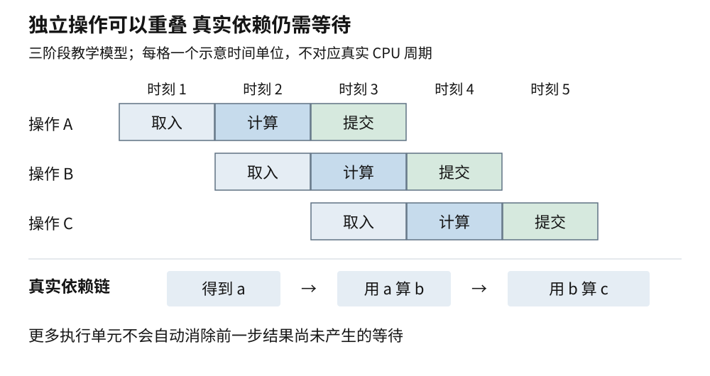
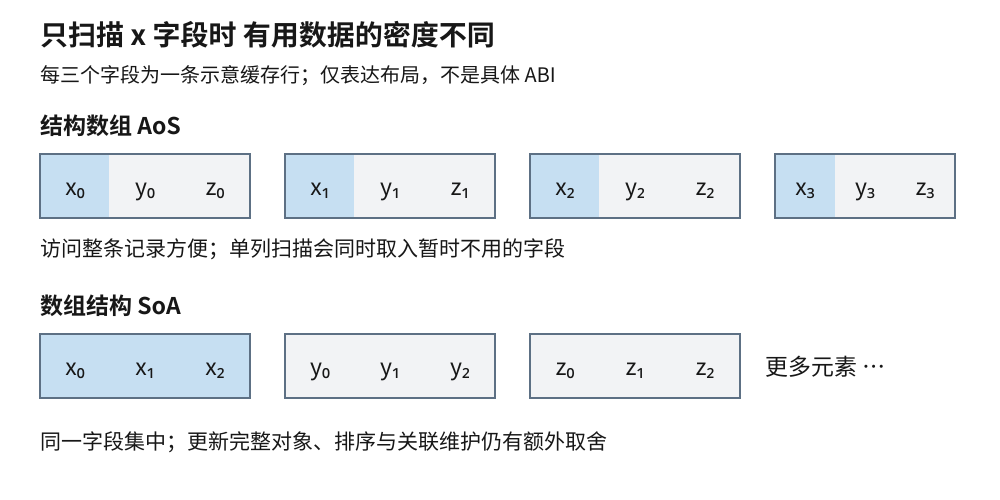
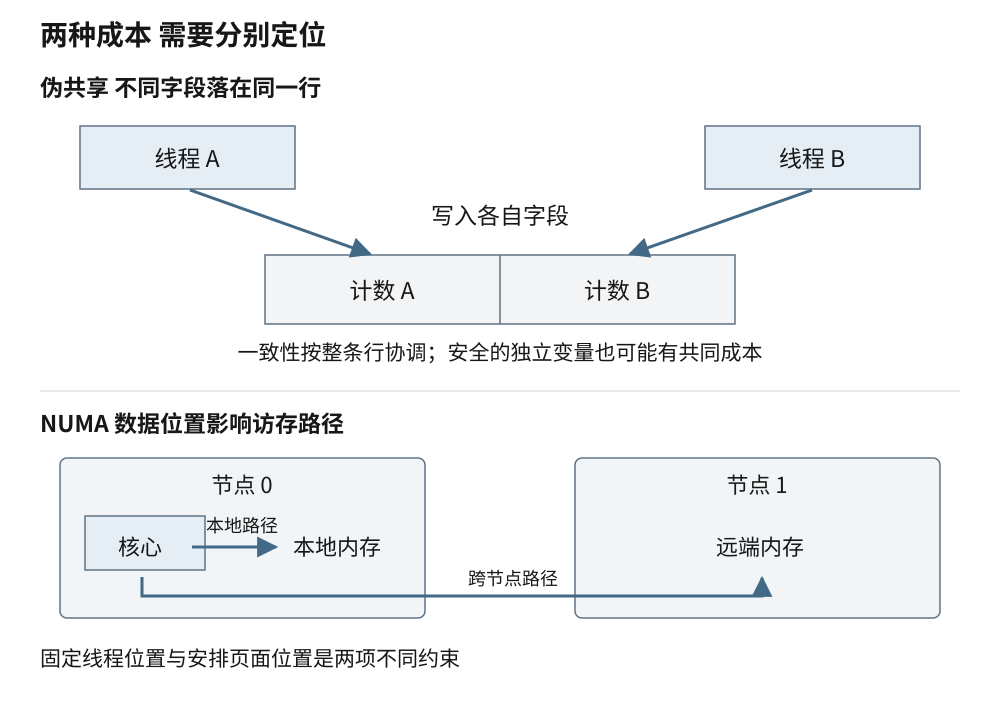

# 第五章 处理器与内存层次

**处理器**负责执行机器指令，**内存**保存执行所需的数据与指令。对程序员来说，它们提供了“读取一个值、做一次运算、写回结果”这样相对简单的接口；实际硬件却需要在成本、面积、能耗和速度之间取舍。运算单元等待数据时没有完成有用工作，数据准备好了却没有空闲执行资源，也会形成等待。

为了减少这些等待，现代通用处理器把不同指令的处理阶段重叠起来，预测接下来可能执行的路径，并让没有相互依赖的工作尽早进行。存储系统则把较小、较快的缓存放在较大、较慢的内存之前，使频繁使用的数据尽量靠近计算。它们改变的是实现成本，不是程序可以随意破坏的正确性规则。

同样是遍历一百万项，连续数组与分散节点可能产生不同的访存请求；同样是四个线程，各自修改一项数据也可能争用同一条缓存行。理解这种差异，需要把指令依赖、数据布局、核间共享和测量证据联系起来。本章使用简化模型说明关系，具体缓存大小、指令延迟和事件名称则必须查对应处理器的资料，不把某一代机器的数字当成普遍常量。

阅读本章只需先理解数组、指针和程序的读写操作。后面的 C++20 示例用来说明访问模式；其中的非拥有视图会当场解释，完整标准库用法见第十三章。

## 5.1 处理器流水线 分支预测与乱序执行

### 5.1.1 指令集规定接口 微架构实现接口

**指令集架构**描述软件可见的机器接口，包括指令的含义、寄存器、地址访问规则和异常等。**微架构**是实现这套接口的具体组织方式，例如一次能够取多少条指令、有哪些执行单元、缓存怎样连接。支持相同指令集的两款处理器，可以运行同一段适配后的机器代码，却未必以相同速度或功耗完成。

C++ 源码还不是机器指令。一个加法表达式可能被编译成加法指令，也可能被合并、提前计算或完全消除。编译器只需在语言规则允许的范围内保留程序要求的行为，不必保留每一行源码在机器上的对应动作。之后处理器又根据指令依赖和可用资源组织执行。观察性能时，需要区分源代码、最终二进制和实际执行，而不是按源码行数估算时钟周期。

**寄存器**是处理器指令直接操作的一类高速存储位置。机器接口中有程序可命名的寄存器，内部实现还可能提供更多物理寄存器，用来保存尚未提交的中间结果。说“变量放在寄存器里”只是某次编译与某段执行的结果，不是 C++ 普通局部变量的永久属性。寄存器不够、值需要跨越复杂调用，或调试构建采用不同策略时，编译器可能把部分值保存到内存。

处理器中执行一条机器指令的内部步骤，也不一定与指令数量一一对应。某些设计把指令拆成较小的内部操作，某些组合又可以被一起处理。比较不同指令集、不同指令选择时，不能仅用“退休了多少条指令”判断谁完成了更多业务工作。这里的**退休**指处理器确认某条指令的结果可以成为架构可见状态；它与操作系统中线程结束不是同一个概念。[S1]

### 5.1.2 流水线提高连续工作的吞吐量

**流水线**把工作分成若干阶段，让不同指令同时处于不同阶段。取指、译码、执行和结果提交可以作为教学模型，但真实处理器的阶段数与边界各不相同，也不保证每个阶段总是一周期完成。

假设一个简化的三阶段装置，每个阶段处理一项需要一个时间单位，阶段之间没有冲突。第一项要经过三个阶段，延迟为三个时间单位；填满以后，每个时间单位可以完成一项。三阶段没有把一项的固有延迟降成一个单位，而是让不同项的工作重叠，提高持续输入时的吞吐量。

这个区别适用于理解处理器的**指令延迟**和**吞吐能力**。一条乘法可能需要若干周期才得到结果，但乘法单元如果可以流水化，未必需要等待前一条乘法完成后才能开始下一条。反过来，如果第二次乘法必须使用第一次的结果，即使单元允许并行接收，也只能等待依赖满足。

设计算一个链式结果：先得到 a，再用 a 算 b，再用 b 算 c。三步构成真实的数据依赖，不能仅凭“处理器有很多单元”就同时完成。如果三组独立输入分别计算结果，硬件才有机会交错处理。算法中是否存在独立工作，会影响能否利用指令级并行。增加线程是另一层并行，不能自动解除单个线程内部的依赖链。

流水线还会遇到资源冲突。例如多条指令都需要同类执行端口，或者数据访问请求占满了内部队列。程序性能由多种约束共同决定：取来的指令够不够，操作数有没有准备好，执行单元能否接收，结果是否能及时离开。只看处理器标称频率，相当于只知道装置的节拍，却不知道每个节拍完成了多少有效工作。



图 5-1 流水线重叠与数据依赖。这是教学时间格，不表示任何真实处理器的阶段数、指令周期或测量结果。

### 5.1.3 分支预测减少等待 预测失败需要恢复

程序遇到条件分支时，要根据某个结果决定接下来执行哪条路径。如果等条件完全算出再取下一条指令，前端可能停下来。**分支预测**根据历史与其他信息猜测分支方向和目标，先准备较可能执行的工作。循环继续还是结束、某个条件是否成立、间接调用将去哪里，都可能涉及预测机制。

预测不是改变程序的业务决定。条件算出后，处理器必须判断此前的预测是否正确。若走错路径，就需要放弃相应的暂时工作，恢复到正确路径。错误路径上已经耗费的取指、执行或访存资源，可能降低有效吞吐。具体代价取决于微架构、依赖、错误发现时机和周围工作，不能统一说成“一个分支固定损失若干周期”。[S2]

预测准确率与输入排列有关。一个条件在长时间内几乎总为真，可能比较容易预测；按复杂模式变化的条件可能更难。即使两个数据集包含同样多的正数和负数，其排列不同，也可能让逐项过滤的执行成本不同。但“随机一定很慢”“排序后一定更快”都不是脱离程序的结论：排序本身有成本，编译器可能已经使用条件选择或向量掩码，硬件预测器也不只记录上一次结果。

有时可以把分支改成选择操作，让两条候选计算都执行，再选一个结果。这通常被称为无分支写法。它可能减少预测失败，也可能增加原本不用做的运算和内存访问。若其中一条路径含有除零、越界、外部调用或不可接受的副作用，更不能为了无分支而任意同时计算。优化必须先保留语言和业务语义，再比较成本。

**推测执行**比“猜分支”更宽泛，指在某些条件尚未确认时提前做工作。错误推测的结果不应按正常路径提交为架构可见结果，但缓存等微架构状态可能留下可被计时观察的差异。因而“结果回滚了”不等于“硬件里完全没有留下痕迹”。这里先建立性能与安全边界的区别，推测侧信道的防护属于安全专题，不能靠删除某一处普通 if 就宣称已经解决。[S2]

### 5.1.4 乱序执行利用独立工作 不替代同步

**乱序执行**允许某些后来的指令在较早指令等待数据时先执行，前提是处理器必须维护该指令集要求的可见行为。它要识别依赖、跟踪未完成工作，并处理异常与错误预测。常见的**寄存器重命名**会把同一个架构寄存器在不同时刻的值映射到不同内部位置，消除仅由重复使用名字造成的假依赖；真实的数据依赖仍然存在。[S1]

假设先从远处读取 x，再独立计算两个已经在寄存器中的数之和。后一个加法没有必要等 x 返回。相反，如果加法的一个输入就是 x，那么提前安排也不能凭空得到正确结果。对程序结构而言，缩短真实依赖链、让地址更早确定、暴露独立批量工作，往往比增加表面上的代码复杂度更有价值。

执行完成与退休仍是两个时刻。在常见的乱序设计中，后来的指令可以先算完，处理器却按程序顺序确认退休，以便处理错误预测和异常。即使一条写入指令已经退休，也不能据此断定其他核心已经看到该写入：**写缓冲区**可以暂存已经确认、仍在等待进入一致性存储系统的写入。Intel 手册中的相应微架构就是这样的实例。顺序退休不等于跨核心的所有内存访问都按一个全局顺序立刻生效。[S12]

乱序也不是无限窗口。未完成指令、访存请求和结果缓冲都占用有限资源；前面的慢操作堵住提交，后续能够提前做的工作会逐渐耗尽空间。因此，访问分散链表时“每个节点必须等上一个节点提供地址”的串行依赖，不能被无限的提前执行掩盖。下一节点地址什么时候能够确定，本身就是性能条件。

必须区分三个层次：C++ 允许编译器怎样变换程序，指令集规定其他执行者可以观察到哪些结果，微架构如何在内部达到这些要求。看到某处理器通常按某种顺序执行，不能倒推出存在数据竞争的 C++ 程序具有正确语义。两个线程通过普通变量无同步地通信，即使某台机器上长时间“看起来正常”，也没有因此获得语言保证。第十七章将从语言内存模型重新建立这个边界。

## 5.2 Cache Cache Line SIMD 与局部性

### 5.2.1 缓存保存近期可能再用的数据

**缓存**是在较快存储中保留数据副本或相关状态的机制。通用处理器通常具有多级缓存，靠近执行核心的层级往往容量较小、访问路径较短，更远的层级提供更大容量。L1、L2、L3 是常见层级名称，不承诺每款处理器都有相同层数、相同共享关系或相同包含关系。

访问在某层找到了所需数据，称为**命中**；没有找到，需要继续从其他位置取得，称为**未命中**。未命中不等于立即访问主存：数据可能在下一层缓存、其他核心的缓存或系统中的其他存储位置。缓存也可能同时处理多个请求，所以“未命中次数乘以一个固定延迟”通常不是整段运行时间。

缓存按照一定粒度管理数据，常见粒度称为**缓存行**。一条缓存行包含一段连续地址对应的数据以及有效性等状态。即使程序只读取其中一个小字段，相关传输和一致性维护也可能涉及整条行。缓存行大小是硬件属性；本章的 64 字节示意用于演算，不表示 C++、所有 x86 或所有 Arm 处理器都保证这个大小。

假定示例缓存行是 64 字节，每个记录字段是 4 字节。如果十六个连续字段恰好落在同一行内，顺序读取它们可能重复利用已经取得的行。若十六个字段分别位于十六条行中，同样读取 64 字节有用数据，涉及的行数却可能增加到十六。这里比较的是布局下的最少相关行数，不是承诺十六倍时间差；对齐、缓存原有状态、预取与并行请求都会影响实际成本。

缓存容量也不能只看总字节数。实际缓存通常把地址映射到有限数量的组，每组只能容纳一定数量的候选行，这称为组相联组织。多个常用地址反复落到同一组，可能在总工作量看似很小的情况下相互替换。容量不足、首次接触、地址映射冲突和共享引发的失效，都是不同的原因，不能把所有未命中都归结为“缓存太小”。[S1]

### 5.2.2 局部性需要围绕实际访问顺序设计

**时间局部性**指近期使用过的数据可能很快再次使用；**空间局部性**指访问一个位置后，附近位置也可能被访问。缓存利用这两种倾向，但程序必须真正产生这样的访问模式。把互不相关的大量内容放进同一个对象，不会自动改善局部性。

**工作集**是在某个时间窗口内反复需要的数据和指令集合。窗口可能是一批请求、一个计算块或一次迭代。如果工作集比相关缓存可承载的有效容量大得多，前面读入的数据可能在再次使用前已被替换。优化局部性，往往是在调整“同时需要多少数据”和“隔多久再次访问”，而不只是更换容器名。

例如，处理每条设备记录时只需要读取位置 x，却把设备名称、历史日志和完整状态都放在一个很大的结构中。**结构数组**把每条记录的所有字段放在一起，适合一次处理一个完整对象；**数组结构**把同一字段集中存放，可能更适合大批量只扫描少数列。前者常写作 AoS，后者常写作 SoA。两者是布局选择，不是语言类型好坏的判断。

当系统经常同时读取 x、y、z 时，把三个字段完全拆开又未必最省成本；当更新必须共同保持一个对象的不变量时，分散存放还会增加接口复杂度。可以按小块混合布局，使一块中的若干对象字段连续，兼顾批处理与局部更新。选型要把访问模式、更新责任、排序和序列化要求一并考虑。

分块处理的基本思路，是先把能够重用的一小组数据留在近处，完成与它相关的多次运算后再换下一块。矩阵计算经常这样安排，但缓存分块也可用于图像、解析和记录聚合。块大小需要结合元素尺寸、需要同时保留的输入与输出，以及并发线程共同使用的缓存资源选择。只把单个数组大小压进缓存，未必给其他必要内容留了空间。

### 5.2.3 预取隐藏一部分等待 也会占用资源

**预取**是在真正使用前尝试取来数据。硬件可以识别某些连续或有规律的访问，软件也可能使用专门指令或编译器接口给出提示。预取要提前得足够早，才能隐藏一部分访问延迟；提前得过多，又可能使数据在使用前被替换，或者增加无用流量。

顺序扫描数组时，后续地址较容易确定；沿指针访问节点时，下一地址往往依赖当前节点返回的内容。两类程序即使每次只读取一个整数，可提前发起的请求数量也可能不同。数据布局与依赖关系共同决定了访存并行性，不能只从循环迭代次数判断。

软件预取不是修复所有慢访存的通用办法。首先，热点可能受计算而非访存限制；其次，硬件预取也许已经足够；再者，额外请求会争用带宽、内部队列和缓存空间。应先证明存在可隐藏的等待，再观察预取是否真的减少了关键路径成本。不能把一条平台专用提示写进代码后，就以“更底层”作为有效证据。

同样，缓存未命中率下降也不保证吞吐提高。为了提高命中率而重复复制或重新排序数据，可能增加更多总工作。评估时应保留端到端目标：完成同一批合法请求用了多少时间、峰值内存增加多少、尾延迟是否变差。第二十章的性能实验将进一步区分这些指标。

### 5.2.4 SIMD 让一条指令作用于多项数据

**单指令多数据**，通常缩写为 SIMD，是让一条指令对多个数据通道执行类似操作的方式。例如把若干个浮点数分别相加，可以用一条向量加法指令描述多个独立加法。这里的“向量”指硬件数据通道组织，与 `std::vector` 容器不是同一件事。

SIMD 的有效宽度受指令集、数据类型、目标处理器和具体指令限制。能够容纳更多元素，不代表所有操作都能按相同比例提速。数据仍需要装入和写出，某些操作没有直接向量版本，控制分支可能需要掩码，剩余不足一组的尾部也要正确处理。源代码中连续的循环，只是让向量化更容易分析，不是成功证明。

编译器进行**自动向量化**时，需要判断变换是否保持语义，以及目标机器上是否划算。若输出与输入可能重叠，某次写入会改变后续读取，那么把多次迭代一起执行可能改变结果。编译器有时生成运行时范围检查，在满足条件时进入向量路径，否则使用标量路径；也可能直接放弃。LLVM 文档将这些合法性与成本考虑分别说明。[S3]

```cpp
// C++20 说明示例，未编译、未执行。
// 前提：三个范围长度一致，且 out 与输入范围互不重叠。
// 此代码只表达逐元素相加，不保证任何编译器必然生成 SIMD。
#include <cstddef>
#include <span>

void add_values(std::span<const float> a,
                std::span<const float> b,
                std::span<float> out) {
    for (std::size_t i = 0; i < out.size(); ++i) {
        out[i] = a[i] + b[i];
    }
}
```

`std::span` 在这里表达一段连续元素的非拥有视图：它记录访问范围，不负责延长元素寿命。这个函数并未检查三个长度，也未验证不重叠，调用边界必须落实注释中的前提。若公开接口不能依赖调用者满足条件，就需要入口检查或采用更易表达责任的接口。本例不应直接复制成不可信输入的接入层。

浮点归约尤其需要谨慎。逐项累加与分组累加可能改变舍入顺序；允许编译器重结合浮点运算，会改变原先需要保留的数值语义。不能先开启激进选项取得更好跑分，再把偏差视为“硬件小问题”。可接受误差应来自领域要求，并与第一章的绝对、相对容差和稳定性判断相连。



图 5-2 数据布局要与访问模式配合。色块是逻辑字段，线框是示意缓存行；不表示某个应用二进制接口（ABI）规定的实际结构体布局，也不包含性能测量。ABI 在第八章展开。

## 5.3 Cache Coherence NUMA 与内存带宽

### 5.3.1 一致性维护副本 不等于所有操作都同步

多核机器允许不同核心保存同一内存区域的缓存副本。**缓存一致性**用于协调这些副本的状态，使共享内存符合系统规定的可见行为。某核心准备写入一条行时，系统可能需要取得相应权限，并使其他副本失效或转换状态。具体协议、状态数量和通信组织属于微架构实现，不能把某一种教学协议当成所有机器的完整内部图。[S4]

容易混淆的是：缓存一致性主要涉及共享位置的副本关系，而**内存一致性模型**规定多个内存操作允许以怎样的顺序被观察。即使一个位置的写入能被一致地协调，也不能由此推导多个位置的访问自动满足程序需要的先后关系。语言层面的互斥、原子操作和先行发生关系，还需要独立建立。

例如一个线程先填充数据，再设置“已准备好”标志，另一个线程看到标志后读取数据。缓存能够搬运数据，不代表普通 C++ 变量就可以无同步地承担发布协议。处理器架构排序、编译器变换和语言数据竞争都必须满足要求。把标志改为 `volatile` 也不能自动产生跨线程同步；正确发布方式将在第十七章解释。

一致性也不要求每次写入都立即送回主存。最新内容可能保存在某个缓存中，由一致性系统在需要时提供。把“让其他核心看到”理解成“把所有缓存冲刷到内存”，会误导同步与性能设计。与外设直接交换数据时，还可能涉及另一套缓存维护、直接内存访问（DMA，即设备参与内存数据传输）和设备排序约定，不能直接照搬普通线程间共享的模型。

### 5.3.2 伪共享让独立变量产生共同成本

两个线程分别更新不同变量，逻辑上没有共享同一个值，却可能因为变量处于同一缓存行而互相影响。这种现象称为**伪共享**。一个线程写某字段、另一个线程只读同一行内的另一个字段，也可能产生这种成本，并不要求双方都写。一致性维护按行进行，不知道程序员认为哪个字段归哪个线程。某线程为了写自己的字段获得行状态，可能使另一线程使用同一行时增加通信与等待。[S5]

假设四个线程各自维护一个完成计数。若四个计数紧邻存储，它们可能落在同一条缓存行。即使各自更新的是独立原子变量，没有数据竞争，也可能不断转移行的写入权限。这说明“线程安全”和“扩展性好”是两个不同结论。反过来，若两个线程读写同一普通非原子变量，至少一方写入，且没有所需的先行发生关系，就首先涉及语言层面的数据竞争，不能仅称为伪共享。原子访问没有因此自动获得完整业务协议的正确性，但不能把它与普通变量的数据竞争规则混为一谈。[S13]

缓解方法包括减少共享写入频率、每线程先局部累计再合并、调整布局使高频写入区域分离。**填充**是在字段或对象间增加空间，降低它们落在同一缓存行的机会，但需要考虑对象起点对齐、数组元素间距和目标平台。仅在结构末尾加几个字节，不足以证明所有对象已经正确隔开。

填充也有成本：工作集更大，缓存能容纳的有用内容减少，更多页面和传输可能抵消收益。共享读多写少的内容放在一起，反而可能改善空间局部性。布局优化应围绕谁写、谁读、频率多高来决定，而不是把所有字段机械地放到不同缓存行。Linux 内核文档用行争用工具与字段布局分析说明了这种诊断过程。[S5]



图 5-3 两类跨核成本。上半图是同一行中不同字段的伪共享，下半图是访问不同内存节点的 NUMA 路径；二者原因不同，不能用同一个“缓存慢”概括。

### 5.3.3 NUMA 把内存位置带进成本模型

**非一致内存访问**，缩写为 NUMA，描述处理器访问不同内存位置时成本可能不同的系统组织。这里的“非一致”是访问距离与成本不统一，不是说数据可以随意不一致。系统通常把处理器和内存组织成若干节点，本地内存与远端内存经由不同路径访问。[S6]

一个程序虽然使用统一虚拟地址空间，背后的页面仍可能来自不同节点。线程在哪个核心执行、页面放在哪里、数据如何在工作线程之间流动，都会影响访存路径。NUMA 节点也不能简单等同于物理插槽：芯片组织、固件设置和平台拓扑会影响实际节点划分，应查询运行机器而不是根据插槽数推断。

在常见 Linux 默认配置下，匿名内存页面的物理分配通常受到首次实际触及页面的执行位置与内存策略影响。但“第一次调用分配器”与“第一次触发页面分配”不是同一时刻；内存复用、已经存在的页面、显式策略、透明大页和自动迁移等因素都会改变结果。因此，“谁 malloc，页面就永远属于谁”不是可靠规则。[S7]

设主线程先初始化全部数组，随后把不同片段交给多个节点上的工作线程。初始化触发的页面位置可能偏向主线程所在节点，而工作线程之后大量访问远端内存。让工作线程按自己的分工初始化数据，可能改善局部性；但若后续所有线程都反复读取同一份数据，问题又不同，需要比较共享、复制与通信成本。

固定线程位置也不是独立解答。**处理器亲和性**限制线程在哪些处理器上运行，内存策略影响页面从哪里分配；只调整一个方面，可能把线程固定到离数据更远的位置。并且系统调度需要平衡负载，过度固定可能让空闲核心无法帮忙。通常先识别主要数据归属和工作分区，再实验线程与内存一起安排的效果。

内存不足时，分配可能受允许节点集合和回退策略约束。某节点本地内存紧张，不等于整台机器没有内存；总剩余内存很多，也不等于受限制的任务能够成功分配。排障时要查看拓扑、策略、容器或控制组限制，以及实际页面分布。第六章将把这条路径接到虚拟内存与页面管理。

### 5.3.4 延迟 带宽与并发请求分别约束性能

**访存延迟**关注一个请求从发出到得到所需数据的等待时间；**内存带宽**关注单位时间能够传输多少数据。低延迟有利于串行依赖访问，高带宽有利于大量可重叠的请求。两者相关，却不能互相替代。沿一个指针链串行读取，即使机器提供很高的总带宽，也可能因为下一地址迟迟不确定而用不满。

一个简单估算能够说明关系。若某种访存路径的平均等待约为 100 纳秒，希望持续传输 10 GB/s 的有效数据，那么稳态下至少需要让大约 1 000 字节的数据处在等待完成的路径中，因为 10×10⁹ 字节/秒乘以 100×10⁻⁹ 秒等于 1 000 字节。以每次 64 字节计，量级约为十六个同时在途请求。这只是忽略协议开销、队列与其他瓶颈的示意下界，不是某台 CPU 的保证。[S8]

实际流量还可能大于程序显式读写的有用字节数。缓存行传输、写分配、回写、预取和一致性通信都会贡献流量。另一方面，缓存命中的重复读取不必每次都访问主存。因此，用“数组长度乘读取次数”估算带宽时，必须说明测量的是算法有用字节、某级缓存流量还是内存控制器传输量。

例如算法每个元素读取 8 字节、写入 8 字节，共处理一亿项，按有用字节计是 1.6 GB。若耗时 0.08 秒，算法有效带宽为 20 GB/s。这个算式没有证明常用于主存的动态随机存取存储器（DRAM）也恰好传输了 1.6 GB；若输入已经缓存、写入触发额外流量，硬件口径会不同。可以用有效带宽比较同一任务的完成成本，再用对应硬件事件解释额外流量。

增加线程通常先增加并发请求，之后可能接近某个共享瓶颈。超过这个点，更多线程不一定提高吞吐，还可能增加排队、缓存干扰和远端访问。此时“CPU 没有全部跑满”也不表示没有瓶颈：等待数据的线程仍然可能被统计为正在 CPU 上运行，而硬件执行资源没有全部做有用计算。软件 CPU 使用率与微架构资源利用率不是同一指标。

## 5.4 性能计数器和硬件差异的证据边界

### 5.4.1 计数器记录事件 不直接给出原因

处理器通常提供**性能监控单元**，用于统计某些硬件事件。事件可能涉及退休指令、周期、分支预测失败或某类缓存请求。Linux 的 perf 等工具可以通过操作系统接口收集部分事件；具体是否可用，取决于处理器、内核、权限、虚拟化环境和配置。[S9]

事件的名字很容易让人以为含义统一。例如“缓存未命中”究竟是哪一级、哪类访问、是否包含推测请求，必须看事件定义。不同处理器型号的同名事件可能不完全可比，某些事件有勘误或限制。厂商按处理器系列发布的事件目录，比记住某个原始编号可靠；原始事件编码不能跨型号直接照抄。[S10]

**每周期退休指令数**常写作 IPC，用退休指令数除以选定口径的周期数得到。较高 IPC 可能说明流水线利用较充分，但不等于算法更好。一个实现做了两倍无用工作，也可能获得较高 IPC；向量化后用更少指令完成更多业务元素，IPC 甚至可能下降而运行更快。比较时应先确认业务结果相同，再用 IPC 解释机器工作方式。

同理，分支错误率要说明分母是所有分支、某类分支还是业务记录数；缓存未命中率要说明哪些访问被计入。某次优化减少了大量容易命中的访问，剩余访问的未命中率可能上升，但未命中总数和时间仍下降。只有比例，没有分子、分母与完成工作量，容易误判。

### 5.4.2 采样 多路复用与运行环境会改变证据

硬件计数器数量有限。如果同时请求的事件超过可用资源，工具可能轮流安排测量，称为多路复用，并根据事件真正运行的时间缩放结果。Linux 接口提供启用时间和实际运行时间等信息。若程序阶段差异很大，某事件只在部分阶段采到的数据，缩放后未必代表完整过程；应查看覆盖比例，必要时使用可重复负载分组测量。[S9]

**计数**回答一段范围内发生多少事件，**采样**则在周期或事件达到条件时记录执行位置等信息，用于估计事件主要发生在哪里。采样存在开销和定位偏差：记录的指令位置未必总是引起事件的精确位置，支持精确事件采样的机制也有型号和事件限制。因此，一行源码旁边显示了很多样本，应被视为进一步调查的线索，不能直接证明这一行是唯一原因。

还要区分线程运行时间、整个进程消耗的 CPU 时间和墙钟时间。一个多线程任务在一秒墙钟内可能累计消耗多秒 CPU 时间；任务被抢占、等待 IO 或被限流，会改变墙钟结果。把热点函数的 CPU 样本占比当成用户请求耗时占比，会忽略离开 CPU 后的等待。第二十章会将计数器与端到端跟踪结合起来。

温度、功率限制、频率策略、同机其他负载和 SMT 都可能改变实验条件。**同时多线程**，即 SMT，允许同一物理核心向软件呈现多个逻辑处理器，利用原本闲置的部分资源；这些逻辑处理器仍共享某些硬件资源，不等同于多个完全独立核心。两次测试若线程数量相同，却被安排在不同物理核心或同核逻辑线程上，结果可能不具可比性。

混合核心机器还可能包含不同能力的核心类型。虚拟机中的逻辑 CPU 数、宿主物理核心数以及可见性能事件，又是不同层次的信息。记录环境时，应至少保留处理器型号与拓扑、操作系统与内核、编译器与优化选项、二进制版本、线程安排、数据规模和测量方法。必要时记录微码及缓解措施状态，但不能擅自关闭安全防护来换跑分。

### 5.4.3 用能够被反驳的假设安排测量

“这段程序慢，因为缓存不好”不是足够清楚的假设。更可检验的表述是：“热点按指针追踪分散节点，下一地址依赖当前读取；增大数据规模后等待增加，预计连续布局或批量处理能减少相关等待。”这个假设指出了机制、触发条件和可观察变化，也给出了可能否定它的证据。

可以先确认热点是否真的占据重要成本，再观察改变数据规模、输入顺序和线程数量后的趋势。若连续布局只在很大工作集上改善，可能支持访存解释；若数据规模很小仍然慢，则应检查分支、指令数量、依赖和分配成本。单个实验不能排除所有原因，但有方向的对照能逐步缩小范围。

厂商提供的自顶向下分析方法，会把流水线资源分为正常退休、错误推测、前端受限、后端受限等类别，再继续细分。这种层次化方式适合先判断主要限制再深挖，不适合把任意微架构的某个百分比当作通用评分。分类、事件和公式应以对应处理器及工具版本的文档为准。[S11]

即使后端受限，也要继续区分运算资源、数据依赖、缓存等待和内存流量。例如改进算术指令数量，无法直接消除指针依赖；减少主存流量，未必改善主要等待指令解码的程序。硬件指标的价值在于区分候选解释，而不在于让报告中每一项都“接近满分”。

实验应保留被否定的解释。如果调整布局后吞吐没有变化，而请求仍在等待外部设备，结论就是该硬件优化没有解决当前主要问题。无需继续寻找一个漂亮的局部数字来证明改动值得合入。工程上可解释的“不需要优化”，与可解释的性能提升同样有价值。

### 5.4.4 将局部改善放回完整系统

处理器优化最终服务于实际任务。解析器少用了若干周期，如果系统主要等待磁盘，端到端收益可能很小；降低平均批处理成本，如果必须积攒更大的批次，也可能增加单个请求等待。需要比较的是满足原约束后的收益，而不是脱离用户行为的峰值。

优化还可能改变维护成本。使用某种特殊指令集需要目标检测、适配实现和兼容回退；手写预取与布局填充依赖平台，后续维护者需要知道适用范围。若一个普通实现已经满足资源预算，复杂的专用路径应有足够稳定的收益和明确的验证条件。

记录结果时，可以按四个问题组织：改动保持了哪些正确性条件，实际减少了哪类工作或等待，在哪些负载和机器上观察到改善，在哪些条件下没有收益或出现退化。这样得到的是可复核的工程结论，而不是“数组永远比链表快”“宽向量一定更快”一类脱离条件的口号。

本章的分层模型也解释了为什么硬件知识不能替代上层设计。处理器再快，重复发送同一业务动作仍然是错误；缓存再一致，悬空引用仍然无效；内存带宽再高，无界队列仍可能耗尽资源。硬件帮助我们理解正确程序的成本，正确性边界仍由语言、接口与系统共同约束。

## 沿依赖 数据布局与共享路径排查

遇到吞吐下降，先保留输入规模、二进制版本和完整时间分布，再定位主要时间究竟在 CPU 计算、调度等待、IO 还是外部依赖。只有确认硬件执行成本重要，才进入缓存、分支与执行资源分析。

**单线程随着数据变大突然变慢。** 检查工作集是否跨越相关缓存容量、访问是否出现更长的地址依赖链，也检查分配、页面错误与算法路径是否同时改变。容量拐点可以支持缓存假设，不能独自证明是哪一级缓存。

**线程增加后吞吐先升后降。** 检查共享写入、行争用、主存带宽、NUMA 页面位置和负载分区。还要确认锁、队列和调度是否已成为主要成本，不能把所有多线程退化都称为伪共享。

**无分支写法更慢。** 比较原分支是否本来就容易预测，新写法是否执行了更多候选计算、增加了依赖或加载。查看实际二进制；源码中出现条件表达式不等于机器中一定存在条件跳转。

**向量化后只有小幅改善。** 检查负载是否主要受数据移动限制、循环尾部与短批次比例、范围检查和不对齐成本，以及浮点语义是否保持。不要先放宽结果验收来制造速度优势。

**换机器后结论失效。** 检查核心类型、缓存组织、内存配置、目标指令集、编译选项、事件口径和系统安全配置。先恢复可比条件，再判断是否需要平台专用路径。

## 面试中的一条追问链

**“为什么连续数组经常比链表遍历快？”**

连续布局通常提供较好的空间局部性，后续地址容易确定，硬件有机会预取和重叠访存；链表常含逐节点的地址依赖与额外指针。但节点大小、分配方式、实际工作集和每节点计算量都会改变结果，不能把“经常”回答成绝对结论。

**“它们不都是 O(n) 吗？”**

渐近分析描述成本随规模的增长，不包含所有硬件常数和访问路径。一次节点访问与一次已命中缓存的连续字段读取，并不必然花费相同代价。要说明计数对象，再测量符合实际负载的成本。

**“只要把数据放进缓存，就能解决？”**

还要看数据依赖、执行资源、分支和并行共享。缓存命中不代表运算没有延迟，容量能容纳也不保证不存在映射冲突。工作集应包含同时需要的输入、输出、索引和其他活跃内容。

**“四个线程各写一个计数，为什么仍然互相影响？”**

它们可能位于同一缓存行，产生伪共享。即使各字段通过原子操作保证正确，也可能有行状态迁移成本。应区分真实数据竞争、锁争用与伪共享，再用布局和访问证据定位。

**“那我给每个字段加很多填充？”**

先确认哪些字段确实被不同线程高频写入，再考虑局部累计、批量合并和布局分离。填充要同时处理对象对齐与间距，而且会增加工作集，不能无条件扩大所有对象。

**“在双插槽机器上固定线程就够了吗？”**

还要看实际 NUMA 拓扑、页面位置和数据流向。固定线程只约束执行位置，不保证数据已经在近处。需要联合分析初始化、内存策略、页面迁移与负载分区，且不能假定一个插槽必然对应一个节点。

**“怎样证明你的解释成立？”**

给出可比较的输入与二进制、完整运行时间、相关事件定义和环境记录，再提供能区分候选原因的对照。若推测是带宽受限，应观察规模与线程扩展趋势，并核对有用字节和硬件流量；若证据不支持，就缩小或撤回结论。

## 来源与阅读边界

资料核验日为 2026-10-03。本章以通用处理器的稳定原理为主，用 Intel、LLVM 与 Linux 官方资料核对实现边界。厂商页面、内核文档和事件目录会持续演进，使用时应核对目标型号与版本。代码未编译、未执行；图与数字例子是解释性模型，没有处理器跑分、计数器采集或 NUMA 实验结果。

- [S1 Intel 处理器架构与优化手册入口](https://www.intel.com/content/www/us/en/developer/articles/technical/intel-sdm.html)：指令集与微架构资料的官方入口。核验时页面更新于 2026-09-21；不同处理器的具体组织须查对应手册。
- [S2 Intel 对推测执行术语的说明](https://www.intel.com/content/www/us/en/developer/articles/technical/software-security-guidance/best-practices/refined-speculative-execution-terminology.html)：区分预测、推测、退休与微架构效应，避免把回滚解释成没有任何痕迹。
- [S3 LLVM 自动向量化文档](https://llvm.org/docs/Vectorizers.html)：合法性、别名检查、成本模型与浮点归约限制。滚动文档不是所有已发布编译器的能力承诺。
- [S4 Arm 内存访问排序介绍](https://developer.arm.com/community/arm-community-blogs/b/architectures-and-processors-blog/posts/memory-access-ordering---an-introduction)：用于区分一致性、排序和推测访问的作用，不能代替具体 Arm 架构手册。
- [S5 Linux 内核伪共享说明](https://docs.kernel.org/kernel-hacking/false-sharing.html)：共享行的判定、布局代价和诊断工具；本文没有执行相应工具。
- [S6 Linux 内核 NUMA 概念](https://docs.kernel.org/mm/numa.html)：节点、距离和调度背景；节点组织以实际平台为准。
- [S7 Linux NUMA 内存策略](https://docs.kernel.org/admin-guide/mm/numa_memory_policy.html)：策略作用域、默认分配与允许节点的关系，不把首次触及简化为永久分配承诺。
- [S8 Little 的排队关系原论文](https://doi.org/10.1287/opre.9.3.383)：用于说明稳态平均在途数量、到达率与平均等待的关系；本文的字节与时间演算是自行构造的简化示例。
- [S9 Linux perf_event_open 接口](https://man7.org/linux/man-pages/man2/perf_event_open.2.html)：计数、采样、多路复用、运行时间与权限限制，工具能力依内核和硬件而异。
- [S10 Intel 性能事件目录](https://perfmon-events.intel.com/)与[官方事件资料仓库](https://github.com/intel/perfmon)：按处理器型号查询事件定义和限制，不跨型号套用原始编码。
- [S11 Intel 自顶向下微架构分析](https://www.intel.com/content/www/us/en/docs/vtune-profiler/cookbook/2024-0/top-down-microarchitecture-analysis-method.html)：固定 2024.0 工具文档作为方法示例，不宣称当前所有型号和工具都使用同一公式。
- [S12 Intel 早期微架构优化参考手册卷二](https://cdrdv2-public.intel.com/821614/356477-Optimization-Reference-Manual-V2-002.pdf)：固定文档 356477-002，2.1.2、2.1.4.1 与 3.1 节提供顺序退休、依赖跟踪和退休后写入缓存的具体实例；不把旧型号的参数套到其他处理器。
- [S13 WG21 N4861 C++20 公开工作草案](https://www.open-std.org/jtc1/sc22/wg21/docs/papers/2020/n4861.pdf)：`[intro.races]` 核对数据竞争与原子操作边界；机器运行现象不能代替语言规则。

[S1]: https://www.intel.com/content/www/us/en/developer/articles/technical/intel-sdm.html
[S2]: https://www.intel.com/content/www/us/en/developer/articles/technical/software-security-guidance/best-practices/refined-speculative-execution-terminology.html
[S3]: https://llvm.org/docs/Vectorizers.html
[S4]: https://developer.arm.com/community/arm-community-blogs/b/architectures-and-processors-blog/posts/memory-access-ordering---an-introduction
[S5]: https://docs.kernel.org/kernel-hacking/false-sharing.html
[S6]: https://docs.kernel.org/mm/numa.html
[S7]: https://docs.kernel.org/admin-guide/mm/numa_memory_policy.html
[S8]: https://doi.org/10.1287/opre.9.3.383
[S9]: https://man7.org/linux/man-pages/man2/perf_event_open.2.html
[S10]: https://perfmon-events.intel.com/
[S11]: https://www.intel.com/content/www/us/en/docs/vtune-profiler/cookbook/2024-0/top-down-microarchitecture-analysis-method.html
[S12]: https://cdrdv2-public.intel.com/821614/356477-Optimization-Reference-Manual-V2-002.pdf
[S13]: https://www.open-std.org/jtc1/sc22/wg21/docs/papers/2020/n4861.pdf
