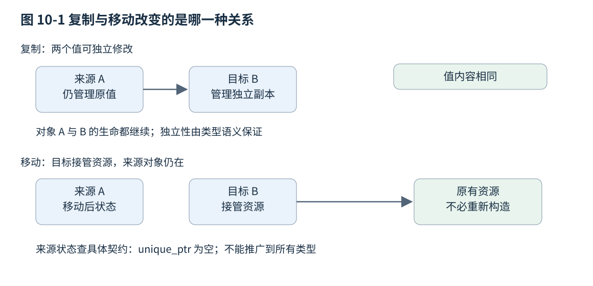
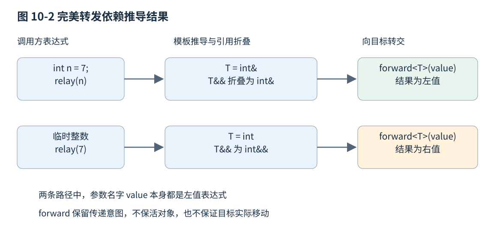

# 第十章 值语义与泛型参数传递

一个对象既可以被当作一份独立的值，也可以被当作某项资源的管理者。把一份配置交给另一个模块时，通常希望双方随后独立修改；把一条已经建立的连接交给任务队列时，却往往希望转移关闭责任。复制、移动和参数传递服务于这些不同关系。它们不是在每个函数旁边随意选择的性能标记，而是对象身份、资源责任和后续使用方式的表达。

本章以 C++20 为主线，使用固定工作草案 N4861 核对语言规则。涉及模板的部分会先建立必要的推导基础，再解释转发；完整的模板与约束机制见第十二章。涉及失败恢复时，先说明接口需要的保证，再联系第十四章的异常安全。所有代码都是说明示例，未编译、未执行；文中的结果是按所标版本规则推导的语义，不是工具输出。[S1]、[S2]

## 10.1 Copy Move 与特殊成员函数

### 10.1.1 一份值与一个对象的身份

**值语义**是一种设计约定：使用者主要关心对象表示的值，可以按值建立、传递、比较或替换对象，而不必追踪共享可变身份。两个整数都等于 7，不代表它们是同一个对象；两份字符串具有相同字符内容，修改其中一份也不应偷偷改写另一份。这里的“独立”首先是可观察行为上的独立，并不要求内部每一位都必须采用某一种物理复制方式。

因此，值语义不等于“类型里没有指针”。string 可以管理动态字符存储，仍然提供字符串值的行为；一个只保存整数的数据库记录句柄，却可能代表外部有身份的实体。是否采用值语义，要看复制以后两个对象怎样相互影响、相等意味着什么，以及资源责任如何分配。语言提供操作机制，业务语义仍由类型作者决定。

**复制构造**从已有对象建立一个新对象；**复制赋值**用已有对象的值更新另一个已经存在的对象。前者尚无旧值需要清理，后者必须处理目标原有状态、自赋值以及失败后的状态。语法里出现等号也未必是赋值：声明中的 `T b = a;` 是初始化，之后的 `b = a;` 才是赋值。[S1]

```cpp
// C++20 完整函数示例，未编译、未执行。
#include <string>

void independent_values() {
    std::string a{"north"};
    std::string b = a;  // 建立 b，复制构造
    b[0] = 'N';        // a 仍表示 "north"
    std::string c{"old"};
    c = a;             // c 已存在，执行复制赋值
}
```

不能由这段语义推导出“每次字符串复制一定调用一次分配器”或“复制赋值总会丢掉已有容量”。这些属于具体类型保证与实现策略的下一层。工程诊断应先确认值是否独立，再测量分配和数据搬运成本。若从一开始就把“复制”当成一条固定机器指令，后面很容易误解移动与复制消除。

### 10.1.2 移动提供重用资源的机会

**移动构造**与**移动赋值**通常从允许被消耗的对象取得资源，使目标建立需要的值，同时把来源留在类型规定的状态。它们不会把源对象的生命周期自动结束，也不会让源对象的地址变成目标地址。两个对象仍按各自生命周期销毁；改变的是它们各自持有的内容与责任。

```cpp
// C++20 完整函数示例，未编译、未执行。
#include <memory>
#include <utility>

void transfer_owner() {
    auto source = std::make_unique<int>(42);
    auto destination = std::move(source);
    // unique_ptr 的具体契约：source 变为空，destination 独占该整数。
    // 被管理的整数没有因为这个移动而重新构造。
}
```

这里可以说 source 为空，是因为 unique_ptr 明确规定了这种后置状态，不能据此断言所有被移动对象都为空。对于标准库类型，除非另有规定，移动后通常处于**有效但未指明的状态**：它仍满足该类型不变量，可执行不带额外前提的操作，但不能猜测业务内容。一个被移动的 vector 可以被销毁、赋予新值或查询状态；如果不知道它是否非空，就不能直接调用要求非空的 `front()`。自定义类型的移动后契约更需要作者说明。[S1]

“移动就是窃取一个指针”也不普遍成立。小字符串可能把字符直接放在对象内部；带固定数组的对象移动时可能逐元素处理；某些分配器不兼容的移动赋值可能需要重新建立元素。移动操作可以比复制便宜，也可能接近复制成本，甚至抛出异常。它首先是可选择的语义操作，复杂度与异常性质要逐类型核实。



图 10-1 值复制与资源责任转移。上方箭头表示复制来源，下方箭头表示资源拥有关系；两者都不表示所有类型的内部指针布局。

### 10.1.3 std::move 不执行移动

`std::move` 是一个转换工具，效果可概括为把表达式转换成适合参与移动选择的右值形式。它本身不分配、不释放、不搬运对象。真正执行什么，取决于后续初始化或赋值的重载决议，以及被选中操作的实现。[S1]

```cpp
// C++20 完整函数示例，未编译、未执行。
#include <string>
#include <utility>

void move_is_a_cast() {
    std::string text{"payload"};
    std::move(text);                 // 没有接收方，不会移动字符串资源
    std::string a = std::move(text); // 这里才选择相应构造函数
    const std::string frozen{"fixed"};
    std::string b = std::move(frozen);// const 通常使 string 的复制构造被选中
}
```

最后一行的关键不是“编译器不够聪明”，而是 `std::move` 不去掉 const。普通 string 的移动构造需要可以修改来源的 `string&&`，不能绑定 const 来源；复制构造的 `const string&` 可以接受它。把所有局部变量都设成 const，再期待任意处都能转移其资源，是两个不同的设计意图。

使用 std::move 还没有证明后续必然执行移动。例如一个类型只提供复制构造，复制的 const 引用仍可接收右值。更细的区别是“根本没有移动候选”与“移动候选被显式声明为删除”：后一种情况下，最佳匹配可能是被删除的移动构造，从而直接报错，而不是自动退回复制。默认生成而被定义为删除的移动操作还有专门的重载参与规则，不能把所有 deleted 情况混为一谈。[S1]

```cpp
// C++20 类型与使用片段，未编译、未执行。
#include <utility>
struct CopyOnly {
    CopyOnly() = default;
    CopyOnly(const CopyOnly&) = default;
};
struct ForbidMove {
    ForbidMove() = default;
    ForbidMove(const ForbidMove&) = default;
    ForbidMove(ForbidMove&&) = delete;
};
// CopyOnly x; CopyOnly y(std::move(x));  // 可由复制构造接收
// ForbidMove a; ForbidMove b(std::move(a)); // 不良构：最佳移动候选被删除
```

默认后被删除的移动构造则会被重载决议忽略。例如某个成员显式删除了移动构造，外层类的 `= default` 移动构造会因此无法定义；若外层复制仍可用，右值就可能改走复制。这条特殊规则同样适用于默认后被删除的移动赋值，不能推广到直接写下的 `= delete`。[S1]

```cpp
// C++20 对比类型，未编译、未执行。
#include <utility>
struct Member {
    Member() = default;
    Member(const Member&) = default;
    Member(Member&&) = delete;
};
struct Outer {
    Member member;
    Outer() = default;
    Outer(const Outer&) = default;
    Outer(Outer&&) = default; // 因成员的移动被删除而定义为删除，决议时忽略
};
void defaulted_move() {
    Outer a;
    Outer b(std::move(a)); // 选择 Outer 的复制构造
}
```

### 10.1.4 特殊成员函数是一个协作集合

默认构造、复制构造、移动构造、复制赋值、移动赋值和析构属于特殊成员函数。它们不是六个彼此独立的开关。类是否由编译器隐式声明某项操作、该操作能否定义成功、是否 trivial、异常说明是什么，都取决于基类、成员和用户已写下的声明。[S1]

对普通非 union 类，默认复制和移动按基类与成员逐项处理。成员是一个裸指针时，默认复制复制的是指针值，不会猜测它究竟是观察指针还是独占资源，也不会自动深复制目标。成员是 unique_ptr 时，默认复制通常因成员不可复制而不可用，默认移动则可转移该成员拥有的资源。把所有权放进正确的成员类型，会让默认操作更接近真正需要的行为。

用户声明析构函数会阻止隐式移动构造和移动赋值的生成，哪怕声明是 `~T() = default;`。这不等于“类型再也不能从右值构造”，因为复制可能仍接收右值。反过来，声明移动构造或移动赋值，会影响隐式复制操作，使相应复制操作被定义为删除。诊断时应看真实候选函数，而不能只问类里有没有一个 `&&`。[S1]

这里产生了三个常用设计建议。**零法则**建议把资源责任交给已有管理成员，让外层类型尽量不手写特殊成员函数；**三法则**提醒遗留类型的析构、复制构造和复制赋值往往需要一起考虑；**五法则**在可移动类型上把两个移动操作也纳入检查。它们是帮助维护不变量的工程规则，不是语言要求“写一个就必须把其余全写一遍”。[S3]

```cpp
// C++20 类型定义，未编译、未执行。
#include <string>
#include <vector>

struct Report {
    std::string title;
    std::vector<double> samples;
}; // 成员已提供值行为，通常不需要手写特殊成员函数。
```

零法则并不免除语义审查。若对象同时保存一个 vector 和指向该 vector 元素的缓存指针，逐成员复制后，缓存指针可能仍指向源对象的元素。若对象把 `this` 注册到外部回调表，普通移动也不会自动更新表内地址。此类自引用或外部身份说明：默认操作虽然语法上成立，业务不变量却可能不成立。此时可以重建关系，也可以明确禁用复制或移动，而不是为了满足容器接口强行补上函数。

### 10.1.5 手写移动时先画出失败与退出路径

独占资源包装器的移动至少要回答三件事：目标原先拥有的资源怎样释放，来源在转移后保存什么，来源和目标是不是可能是同一个对象。移动构造没有目标旧资源；移动赋值却有。这也是不能简单把构造函数体复制到赋值运算符的原因。

```cpp
// C++20 教学用类型，未编译、未执行；以 unique_ptr 展示责任，非生产封装建议。
#include <memory>
#include <utility>

class IntOwner {
    std::unique_ptr<int> value_;
public:
    explicit IntOwner(int n) : value_(std::make_unique<int>(n)) {}
    IntOwner(const IntOwner&) = delete;
    IntOwner& operator=(const IntOwner&) = delete;
    IntOwner(IntOwner&& other) noexcept
        : value_(std::move(other.value_)) {}
    IntOwner& operator=(IntOwner&& other) noexcept {
        if (this != &other) {
            value_ = std::move(other.value_);
        }
        return *this;
    }
};
```

这个例子有意展开两个操作，让责任可见；实际类若没有额外逻辑，可直接使用默认操作。自移动检查是本类型选择保留原值的策略，并非要求所有标准库对象自移动都保持原内容。对于需要支持的自移动场景，最基本的是遵守所承诺的有效状态与资源不泄漏，而不是未经说明承诺“移动到自己什么都不发生”。

需要深复制时，也要先定义复制意味着什么。复制文件描述符的整数、复制一个管理句柄的包装器、通过系统调用复制底层打开文件描述的引用、重新打开同一路径，是四种不同操作。是否共享文件偏移、是否继承访问权限、关闭如何协调，都超出了复制构造函数的语法。第七章讨论操作系统资源，第九章讨论所有权；本章的操作应建立在那些资源语义之上。

**面试追问：“有移动构造以后，复制是不是就过时了？”** 不是。快照、独立保存、同时保留原值都是复制的合理用途。移动适合调用方明确放弃原值后续用途，或临时结果即将结束的场合。避免无谓复制，不等于取消业务需要的独立值。

**面试追问：“为什么一个类加了析构日志以后，vector 扩容似乎更慢？”** 应检查用户声明析构是否阻止了隐式移动，右值构造是否转而选中复制，以及移动异常说明是否影响容器选择。还需区分日志自身、分配和元素搬运的成本。本章没有测量数据，不能仅凭现象断定某一原因。

## 10.2 Value Category 临时对象与生命周期延长

### 10.2.1 值类别属于表达式

**值类别（value category）**描述表达式求值的性质，不能直接等同于变量的声明类型。C++20 的基本类别是 lvalue、xvalue 和 prvalue。lvalue 与 xvalue 都属于 glvalue，强调表达式可确定某个对象或函数的身份；xvalue 与 prvalue 又合称 rvalue，供一组语言规则共同使用。[S1]

**lvalue** 常见于普通变量名和返回左值引用的函数调用。**xvalue** 表示身份仍可确定、其资源可以按相应规则被重用的表达式，例如对普通对象使用 std::move 的结果。**prvalue** 常见于数值计算结果以及返回非引用类类型的调用，它用来初始化对象或计算某些运算的值。这里的分类并不规定对象必须在栈还是堆，也不直接等同于能不能修改。

```cpp
// C++20 表达式分类示例，未编译、未执行。
#include <string>
#include <utility>

void categories() {
    int n = 1;
    const int fixed = 2;
    std::string text{"abc"};
    std::string&& alias = std::move(text);
    // n、fixed、text、alias：这些名字表达式都是 lvalue。
    // n + 1：prvalue；std::string{"x"}：类类型 prvalue。
    // std::move(text)、std::move(alias)：xvalue。
}
```

`alias` 的声明类型是右值引用，但名字表达式 `alias` 是左值。这不是规则的例外补丁，而是有意让一个已经取名、可能反复使用的对象访问入口不会在每次使用时被隐式消耗。需要继续转移其内容时，必须写明移动或转发意图。稍后完美转发正是处理这个“传进来是右值，取名以后是左值”的问题。

同样，const 左值仍是左值，不能修改不意味着它变成右值；字符串字面量是数组左值，也不是因为它写在表达式右侧就成为右值。用“能放在赋值号左边”作入门直觉有一定帮助，却不足以分析现代 C++ 重载。可靠方法是根据具体表达式形式和返回类型判定。

### 10.2.2 引用绑定决定哪些访问入口可建立

`T&` 通常绑定可修改的 T 左值；`const T&` 可以只读借用左值，也能在适用规则下绑定临时对象；`T&&` 可以绑定相应右值。这里暂时讨论 T 已经确定的普通引用，模板推导中的转发引用稍后另讲。

```cpp
// C++20 重载与调用片段，未编译、未执行。
#include <string>
#include <utility>
void inspect(const std::string&); // 只读借用
void consume(std::string&&);      // 可消耗来源，但仅凭声明不保证实际移动

void caller() {
    std::string name{"item"};
    inspect(name);
    inspect(std::string{"temporary"});
    consume(std::move(name));
}
```

consume 接收一个引用本身，还没有构造新的 string。若函数体只读参数，原对象可能完全不变；若它把参数 std::move 到成员中，才发生资源转移。用右值引用作为接收参数，是一项关于可消耗性的接口安排，不是执行记录。

因此，调用后能否继续用 name，应由 consume 的契约决定。调用点显式写 std::move 的价值在于提醒读者：这里允许被调用方消耗原值。继续析构或重新赋值通常合理，但继续假定它仍保存调用前的业务内容，就需要函数明确承诺。代码审查应该寻找“移动后又依赖旧值”的路径，而不是看到一次合法访问就全部禁止。

### 10.2.3 临时物化与直接构造

从 C++17 起，类类型 prvalue 的说明不能总画成“先创建一个临时对象，再把临时对象移动到目标”。在许多初始化中，prvalue 直接初始化最终结果对象；只有需要一个有身份的对象供引用绑定等操作使用时，才通过**临时物化转换**形成相应临时对象。C++20 延续了这套模型。[S1]

例如 `std::string text = std::string{"abc"};` 不要求建立一份额外 string 再移动给 text。分析代码时应先判断语言是否要求存在中间对象，再问能否消除复制。如果本来就只构造结果对象，即使把优化选项关掉，也不能要求实现额外调用移动构造来“展示全过程”。

临时物化不会让所有临时对象长期存在。通常情况下，临时对象在包含其创建点的完整表达式结束时销毁。对一条普通表达式语句，分号经常是这个边界；更复杂的条件、初始化与调用应按完整表达式规则分析，不能把“到分号”为所有语法的唯一判据。[S1]

```cpp
// C++20 函数体片段，未编译、未执行。
#include <string>
#include <string_view>
// 假定下列声明出现在函数体内：
// std::string owned = std::string{"abc"}; // owned 是结果对象。
// std::string_view view = std::string{"abc"};
// 上一行完整表达式结束后，临时 string 被销毁；view 不拥有字符。
```

第二个声明的问题不是“string_view 太小装不下”，而是转换得到的视图没有把来源对象的生命周期责任带走。临时物化、引用绑定、拥有型结果和非拥有视图是不同层面的机制；第十三章会从容器与视图接口继续检查它们。

### 10.2.4 生命周期延长只沿规定的语法发生

局部 const 左值引用直接绑定临时对象，可以使该临时对象持续到相应引用的生命周期结束；局部右值引用直接绑定也可触发适用的延长规则。延长是语言针对特定绑定和表达式形式规定的，不是“只要还有引用就不能销毁”的全局引用计数。[S1]

```cpp
// C++20 完整函数示例，未编译、未执行。
#include <string>

const std::string& echo(const std::string& value) { return value; }

void lifetimes() {
    const std::string& a = std::string{"kept"}; // 临时对象生命延长
    std::string&& b = std::string{"also kept"};
    const std::string& c = echo(std::string{"short"});
    // c 所指临时对象只活到上一行完整表达式结束，此处 c 已悬空。
}
```

echo 的参数绑定让临时 string 能覆盖本次调用，但函数返回同一个引用，并没有产生第二次延长。c 的声明不能沿着任意函数调用“追溯”出来源临时对象，再把它保活。这是许多 getter、链式接口和借用工具函数共同面对的风险。

返回局部临时对象的引用也不能把对象交到调用方继续活着。对本章 C++20 基线，在 return 中绑定到返回引用的临时对象不因返回而延长到调用方；返回的引用会悬空。后续标准对某些错误写法的诊断规则有所变化，不能把较新规则当作旧项目已有保护。

聚合初始化提供了更细的对比。在 C++20，引用成员通过花括号列表初始化绑定临时对象，与通过圆括号的聚合直接初始化，生命周期可能不同。前者可延长到聚合对象相应的生命范围，后者的临时对象通常只活到完整表达式结束；new 初始化中的引用成员也有只覆盖完整表达式的例外。这样的区别值得在库审查时查条款，但不适合成为依赖微妙语法保活的常规接口方案。[S1]

这里还要区分聚合绑定与构造函数成员初始化列表。在 N4861 中，构造函数用成员初始化器把引用成员绑定到临时表达式，本身就是不良构，不能当作另一种合法但短命的延长方式。另一个常见陷阱是 `const std::string& r = std::move(std::string{"x"});`：move 是函数调用，返回的引用不会接力延长实参临时对象，r 在该声明的完整表达式结束后悬空。[S1]

```cpp
// C++20 对比片段，未编译、未执行。
#include <string>
struct Borrowed { const std::string& value; };

void aggregate_binding() {
    Borrowed a{std::string{"longer"}}; // 本处花括号绑定延长临时对象生命
    Borrowed b(std::string{"shorter"});
    // b.value 的来源已在上一行末尾销毁，不能再读取。
}
```

更稳健的设计是：需要长期保存就保存拥有型值；只读借用则限制在一个可证明的调用范围；确实保存引用成员时，在类型契约中要求调用方提供足够长寿命的对象。对大型对象避免一次复制，可能值得精细管理生命；对几个字节的配置值，增加隐蔽悬空风险通常没有收益。

### 10.2.5 用类型与表达式两张纸诊断重载

分析一段代码时，可以先在每个变量旁写声明类型，再在每次使用旁写表达式值类别。两张记录不能合并。例如参数 `string&& s` 的声明类型允许右值绑定，但函数体里的 `s` 是左值；`std::move(s)` 是 xvalue，其类型仍保留相关 cv 限定，也就是 const 与 volatile 这类类型限定。重载决议看的是调用表达式，不能只看变量声明里出现的符号。

再单独画生命周期线：来源何时建立、临时物化何时发生、完整表达式在哪里结束、借用是否越过销毁点。这两步能把“为什么走复制”和“为什么悬空”分开处理。一个表达式正确选中了移动重载，仍可能把引用保存到寿命不够长的对象；一个安全的 const 引用调用，也可能产生意外的昂贵复制。语义正确与成本合适都需要证据。

**面试追问：“右值引用变量为什么是左值？”** 应回答“声明类型”和“名字表达式”属于两个维度。命名后可以反复访问，语言不会每次自动消耗它；std::move 或稍后的 std::forward 才明确改变传给下一层时的值类别。

**面试追问：“const 引用是不是万能的生命周期保险？”** 不是。它只在规定绑定形式中延长特定临时对象；通过函数返回引用、返回局部对象、保存视图或引用成员时都有边界。应该跟踪真正的所有者与销毁点，不能靠引用类型猜测存活。

## 10.3 转发引用 完美转发与引用折叠

### 10.3.1 先推导 T 再谈两个 &

函数模板用参数化的类型表达一族函数。调用时，编译器会把形参模式与实参类型进行匹配，推导模板参数，再形成候选函数。这里需要的最小模型是：`template<class T> void f(T)` 按值接收时，推导通常忽略实参类型的顶层 const，并对数组和函数作相应退化；`f(T&)` 保留引用所看到的对象类型，能推导出 const 信息，也可保留数组大小。完整推导、非推导上下文和约束在第十二章第一节展开。[S1]

```cpp
// C++20 推导说明，未编译、未执行。
template<class T> void by_value(T);
template<class T> void by_reference(T&);

void deduction() {
    const int n = 3;
    int a[4]{};
    by_value(n);       // T 为 int
    by_reference(n);   // T 为 const int
    by_value(a);       // T 为 int*
    by_reference(a);   // T 为 int[4]，参数是数组引用
}
```

推导不是让编译器遍历所有隐式转换来猜一个“最好用”的类型。两个形参都要求同一个 T 时，实参分别是 int 和 double，普通推导可能发生冲突，不会自动替读者发明一个共同业务类型。这一事实也解释了为什么某些包装函数直接调用能成功，套进模板后却推导失败。

### 10.3.2 转发引用的识别条件

在函数模板中，若参数形如 `T&&`，T 是本次推导中的不带 cv 限定的模板类型参数，这种形参可成为**转发引用**。遇到左值实参时，它的特殊推导规则让 T 推导成左值引用类型；遇到右值时，T 通常推导成相应非引用类型。`auto&&` 在常见推导上下文中也有类似作用，但花括号初始化列表等情形另有规则。[S1]

```cpp
// C++20 声明对照，未编译、未执行。
template<class T> void relay(T&&);       // T 在本次调用中推导，可为转发引用
template<class T> void readonly(const T&&); // const T&& 不是转发引用
void consume_int(int&&);                 // 固定类型右值引用

template<class T>
struct Box {
    void set(T&&);                        // 此处 T 已由 Box<T> 确定
    template<class U> void relay(U&&);    // U 在成员模板调用中推导
};
```

`Box<int>::set` 中出现的 `int&&` 不会因为它位于模板类里就接受任意左值。它不是针对这次函数调用待推导的那个模板参数。另一个边界是显式指定模板参数：普通的 `relay<int>(n)` 把 T 固定成 int 后，形参就是 int&&，不能再通过转发引用推导把左值 n 变成 int&。判断条件应围绕“哪一个参数、在哪一次推导中确定”，而不是只搜索文本 `T&&`。

### 10.3.3 引用折叠把推导结果变成合法引用

语言不允许通过普通声明创建一个需要单独存储的“引用的引用”对象，但模板替换、别名等类型构造会遇到引用组合，此时应用**引用折叠**。可以记成：只要组合里有左值引用，结果就是左值引用；只有右值引用与右值引用组合才保留右值引用。即 `& + &`、`& + &&`、`&& + &` 都得到 `&`，`&& + &&` 得到 `&&`。[S1]

对 `relay(T&&)` 调用，把过程拆成两步就很清楚。传入一个 int 左值 n，T 推导为 int&，把 T 代入 T&& 得到需要折叠的组合，最终参数是 int&。传入整数临时值，T 为 int，参数是 int&&。传入 const int 左值，T 为 const int&，参数最终是 const int&，const 并没有消失。



图 10-2 完美转发的三个步骤：推导、形成参数类型、按推导结果转交。图中只示普通 int 实参，不覆盖花括号列表等非普通推导情形。

引用折叠解决类型形成问题，并没有解决函数体中参数名是左值的问题。若写 `target(value)`，无论调用方最初传入左值还是右值，value 这个名字都会按左值参与下一次重载。若一律改成 `target(std::move(value))`，又会错误地允许下一层消耗调用方原本只按左值传入的对象。需要第三种选择：按最初推导结果决定传递方式。

### 10.3.4 std::forward 保存调用方的选择

`std::forward<T>(value)` 利用模板参数 T，把参数表达式转换成相应的引用形式。T 是左值引用时，结果保持左值；T 不是左值引用时，结果通常是右值。它与 std::move 一样是转换工具，不负责实际复制或转移资源。[S1]

```cpp
// C++20 完整包装器示例，未编译、未执行。
#include <utility>

void target(const int&);
void target(int&&);

template<class T>
void relay(T&& value) {
    target(std::forward<T>(value));
}

void calls() {
    int n = 7;
    relay(n); // T=int&，最终选择 target(const int&)
    relay(7); // T=int，最终选择 target(int&&)
}
```

这里“完美”指尽可能保持有关重载选择的类型和值类别信息，并不承诺透明复制任意语法、自动保留对象生命或消除全部开销。包装器若还有日志、锁、回调或类型转换，这些工作仍然存在；目标如果复制参数，forward 也不会阻止它复制。

多参数构造包装器常用参数包展开。参数包是零个或多个模板参数的集合，`Args...` 表示这些类型，`args...` 是对应参数，展开中的每项应使用自己的 Args 与 args 配对，不能只对整个包作一次粗略转换。

```cpp
// C++20 工厂函数示例，未编译、未执行。
#include <memory>
#include <utility>

template<class T, class... Args>
std::unique_ptr<T> make_owned(Args&&... args) {
    return std::unique_ptr<T>(new T(std::forward<Args>(args)...));
}
```

这是说明机制的工厂，普通业务代码通常直接用 std::make_unique。它没有增加并发安全，没有证明 T 的构造不会抛出，也没有让 T 若保存 args 的引用就获得永久有效性。构造参数被转发到对象里，可能是复制一个值，也可能只是保存借用；真正后置条件由 T 的接口决定。

### 10.3.5 完美转发的边界与过度泛化

花括号列表本身没有一个统一普通表达式类型。`relay({1,2,3})` 不能仅凭 T&& 推导出“某种容器”，而一个明确接收 `initializer_list<int>` 的函数可能可以调用。重载函数名也可能无法在无目标类型的上下文中唯一推导；位域不能像普通可寻址对象那样绑定所有引用。这些失败都说明包装层改变了推导上下文，不意味着语言应自动猜出调用意图。[S1]

另一个风险是转发构造函数过于宽泛。一个 `template<class U> Wrapper(U&&)` 可能比预期的 const 引用复制构造更适合接收某个非 const Wrapper 左值，随后却在成员初始化深处报错。模板构造函数本身不是复制构造函数，但仍能参与重载并抢走调用。解决方式通常是约束允许的源类型、排除本类型及相应派生关系，或者使用明确命名的工厂；第十二章会用 concepts 使这些边界可见。

不要把同一个右值参数无条件转发两次。第一次目标调用可能已经取走资源，第二次看到的是移动后状态。需要两个独立消费者时，应明确复制、共享或限制接口为可重复借用；“转发”不会复制消费权限。

```cpp
// C++20 反例框架，未编译、未执行。
#include <utility>
template<class T, class F, class G>
void risky_twice(T&& value, F first, G second) {
    first(std::forward<T>(value));
    second(std::forward<T>(value)); // first 可能已经消耗 value 的内容
}
```

包装器的返回类型也会改变语义。普通 `auto` 返回会按自己的规则推导值类型；`decltype(auto)` 更精确保留被返回表达式的类型和值类别，却也更容易把引用原样送出去。若返回局部变量的括号表达式，decltype(auto) 可能推导成引用而悬空。采用“更泛型”的写法之前，应先确定接口到底返回拥有型结果还是借用。

**面试追问：“std::move 和 std::forward 应怎样选择？”** 对已经确定要消耗的对象使用 move；在需要保持调用方原始传递方式的推导上下文中，用对应模板参数 forward。把 forward 当成通用更高级 move，或在普通 T&& 接口中随意填一个 T，都容易隐藏真实意图。

**面试追问：“转发引用为什么能接受左值，右值引用不是不能吗？”** 特殊的是模板实参推导：左值使 T 成为左值引用，再由引用折叠得到左值引用参数。推导完成后的类型依旧遵守普通引用绑定规则，不是绑定规则突然允许 int&& 接受任意 int 左值。

## 10.4 返回值优化 noexcept 与接口取舍

### 10.4.1 直接返回结果与命名返回值优化

按值返回让调用方拥有独立结果，通常比返回局部对象的指针或引用更容易正确。C++17 以后，应区分两种常被一起称为 RVO 的情况：一种是适用的同类型 prvalue 直接初始化结果对象，属于语言规定的对象构造模型；另一种是把有名字的局部对象直接构造到结果位置，称为**命名返回值优化（NRVO）**，在 C++20 仍是满足条件后允许而非无条件保证的消除。[S1]

```cpp
// C++20 类型与函数示例，未编译、未执行。
struct Token {
    Token() = default;
    Token(const Token&) = delete;
    Token(Token&&) = delete;
    ~Token() = default;
};
Token direct() { return Token{}; } // 适用直接结果构造，不要求复制或移动

struct Value {
    int number{};
};
Value named() {
    Value value{42};
    return value; // NRVO 候选；此类型在未消除时也可复制/移动
}
```

direct 能返回不可复制、不可移动的 Token，但析构等语义条件仍须满足，不能因此把析构函数删除。若把 direct 改成先定义具名 Token 再返回，该函数不能依赖可选 NRVO 来规避缺失的复制或移动。类型是否可返回，需要按具体返回表达式分析，不能笼统说“C++17 后一切都不需要移动构造”。

NRVO 允许省略带有可观察副作用的复制或移动，因此用构造函数打印日志看到的次数，不必在所有符合标准的实现与配置之间一致。若程序正确性依赖“每次按值返回必定记一条移动日志”，设计本身就依赖了不可保证事件。性能日志可以帮助观察某次构建，但不应代替规范保证。

### 10.4.2 为什么 return std::move(local) 常常适得其反

一个满足条件的局部对象按名字返回时，编译器可以做 NRVO；未做消除时，C++20 对相应返回上下文还提供隐式移动的重载决议规则。写 `return std::move(local);` 改变了返回表达式的形式，使它不再是那个可做 NRVO 的局部名字，常常反而要求从局部对象移动到返回对象。[S1]

```cpp
// C++20 完整函数示例，未编译、未执行。
#include <string>
#include <utility>

std::string preferred() {
    std::string result{"built"};
    return result;
}
std::string usually_worse() {
    std::string result{"built"};
    return std::move(result); // 不再满足通常的 NRVO 名字形式
}
```

这不是说 return 中永远禁止 move。若返回的是对象的某个成员而不是符合条件的局部对象，或者接口明确实现从外部状态取出值，是否移动要按实际语义决定。也不能把 C++20 对特定返回操作的规则推广到普通函数实参；向另一个函数传递一个具名局部对象时，通常仍是左值，除非明确转换。

C++20 这里的“隐式移动”是特定返回上下文中的重载规则。符合条件的实体包括自动存储期的非 volatile 对象，以及指向非 volatile 对象的局部右值引用或右值引用形参；返回表达式要是相应的名字表达式，也可以带括号。按值形参可以适用隐式移动，却不是 NRVO 候选；左值引用形参、静态局部对象和普通成员访问不能套用这条规则。const 对象并未一律排除，但 const 仍可能使最后选中复制。[S1]

N4861 规定先把符合条件的表达式当作右值做重载决议；只有第一次决议失败或未进行，才按左值再做一次。第一次已经选中可用的 const 引用复制构造，就不再寻找一个更合适的左值重载；第一次选中显式删除的最佳候选，也不算“决议失败后可退回”，而是使用该函数时报错。两阶段规则不是“移动失败就安全复制”的运行时恢复机制。

```cpp
// C++20 与 C++23 的语义对照，未编译、未执行。
struct LvalueCopy {
    LvalueCopy() = default;
    LvalueCopy(LvalueCopy&) {} // 只接受非 const 左值的复制构造
};
LvalueCopy return_parameter(LvalueCopy value) {
    return value; // C++20：右值决议失败后按左值复制；形参不可 NRVO
}
// 在 C++23 简化规则下，上面这条 return 不良构，不能依赖左值回退。
```

C++23 改为把可隐式移动的返回名字表达式视为 xvalue，取消上述左值回退，并改变部分引用返回与 decltype(auto) 场景；不能把它反向解释为 C++20 中“return 的名字一律已经是右值”。跨版本维护时，应把返回局部、返回参数、返回成员以及返回引用分别加入兼容测试，而不是只加一条 `-std` 选项后假定所有返回路径等价。[S5]

### 10.4.3 noexcept 是失败边界的承诺

`noexcept` 声明函数不会以异常逃出其边界。它不是“内部不能写任何可能抛出操作”，也不是“编译器证明它不会失败”。函数内部可以调用可能抛出的操作并自行处理；如果异常最终越过 non-throwing 函数边界，程序会调用 std::terminate。终止不是错误返回，不能指望外层 catch 像普通异常那样恢复。[S1]

`noexcept(expression)` 在声明里形成条件异常说明；`noexcept(expression)` 作为运算符时，则在不求值该表达式的前提下判断它是否可能抛出。这种不求值查询会影响类型特征与泛型选择，不意味着对应运行时计算已经成功执行。默认生成的移动操作通常可根据成员操作推导异常性质，不应一律手写一个未经证明的 noexcept。

```cpp
// C++20 泛型包装类型，未编译、未执行。
#include <type_traits>
#include <utility>

template<class T>
class Slot {
    T value_;
public:
    explicit Slot(T value) : value_(std::move(value)) {}
    Slot(Slot&&) noexcept(std::is_nothrow_move_constructible_v<T>) = default;
};
```

此例只说明声明形式；若没有需要显式声明移动的其他设计原因，默认成员推导往往更简单。`is_nothrow_move_constructible_v<T>` 检查从相应右值构造是否满足不抛条件，不能据此断言一定调用一个名字叫“移动构造”的函数，因为复制构造也可能接受右值。类型特征的名称是查询意图，真正判断仍由表达式规则决定。

### 10.4.4 容器为什么关心移动是否抛出

把 vector 元素从旧存储搬到新存储时，如果先移动了前几个元素，再在后一个元素的移动中抛出，旧存储里的那些前缀元素可能已经被改变。销毁新存储中的半成品，并不自动把旧值还原。这就是移动效率与失败恢复之间的冲突。[S4]

若元素可复制，容器在适用操作中可以采用复制建立新版本，失败时销毁新副本，旧元素保持不变；若移动保证不抛出，就可安全地逐项转移，不必担忧中途通过异常退出。std::move_if_noexcept 提供了一种相关选择：当移动可能抛出且可复制时，以 const 左值引用形式让后续操作有机会复制，否则提供右值引用形式。它不是容器全部异常保证的统一定义。[S1]

具体 vector 操作的保证仍需逐条查看，尤其是不可复制、移动却可能抛出的类型，不能一概承诺失败后保持原值。第十三章把扩容、插入位置、类型条件和失效规则联系起来，第十四章则解释基本保证与强保证。本章只强调：noexcept 可以使泛型算法拥有更多安全选项，但虚假承诺会把可处理错误变成程序终止。

以 N4861 的具体条款为例，`reserve` 对非 CopyInsertable 元素的移动构造抛异常保留例外；尾部插入单个元素时，元素满足 CopyInsertable 或 `is_nothrow_move_constructible_v<T>` 为真，才有该条款相应的“异常时无效果”保证，其他来源的异常另按条款判断。这里的 **CopyInsertable** 不只是存在一个复制构造函数，还要求通过该容器的分配器从 const 左值构造元素能成立，并满足来源不变、目标等价等语义。不能把类型特征测试直接当成所有分配器与容器操作的完整证明。[S1]

```cpp
// C++20 表达式说明，未编译、未执行。
#include <utility>
template<class T>
T relocate_one(T& source) {
    return T(std::move_if_noexcept(source));
}
```

这个单元素函数不代表完整的容器搬迁实现。完整实现还要管理原始存储、构造成功数量、回滚销毁以及分配器责任。把它单独展示，是为了隔离“选择哪种构造入口”这一问题，不让读者误以为一行工具函数已经给整个算法提供事务保证。

### 10.4.5 参数形式应来自保存与消费需求

只在同步调用期间读取一个较大对象，const 引用通常能表达借用；可低成本复制的小值按值传递更清楚。函数需要修改调用方对象时，非 const 引用表示有修改能力，但仍应说明修改范围与失败后的状态。函数要取得独占资源时，按值接收 unique_ptr 会让责任转移在类型里可见。通用包装器才是转发引用最典型的用途。[S3]

对于需要把 string 保存为成员的构造函数，按值接收后再移动是一个合理折中：左值调用方先复制成参数，右值调用方可移动或直接建立参数，内部再移动到成员。它减少了 const 引用与右值引用两套重载，但不保证总是最少操作；如果既有容量重用很重要、调用分布偏向左值，或者类型移动并不便宜，就要比较其他方案。

```cpp
// C++20 类型定义，未编译、未执行。
#include <string>
#include <utility>
class Label {
    std::string text_;
public:
    explicit Label(std::string text) : text_(std::move(text)) {}
    const std::string& text() const & noexcept { return text_; }
    std::string text() && { return std::move(text_); }
};
```

此处按对象的引用限定区分 getter：对存活左值提供只读借用，对非 const 右值返回拥有型 string，使调用方不必保存临时 Label 内部成员的引用。这种设计仍要审查 const 右值等剩余调用形式；例如可以进一步提供合适的 const&& 值返回，或删除不允许的临时调用。展示两个常用重载不是声称所有借用漏洞已经封闭。

评价接口时，最好把调用路径写清楚：有多少调用方已有左值需要保留，有多少调用方提交临时结果，有多少场景保存参数多久，是否跨线程或异步边界，分配次数和尾延迟是否真的成为瓶颈。只统计某段示例里出现几次 move，会把可读性、编译成本、代码尺寸和生命周期风险都排除在外。

**面试追问：“所有移动构造都应该 noexcept 吗？”** 应尽量让资源转移具备简单可靠的不抛实现，但只能在真实实现与成员操作支持时承诺。无法做到时，诚实保留可抛语义并设计失败保证，比写上 noexcept 追求容器速度更正确。

**面试追问：“按值返回大对象一定慢吗？”** 不能这样判断。适用的直接结果构造和 NRVO 可以避免中间对象，剩余移动也可能很便宜；但返回对象内部仍可能分配和计算。应分清标准保证、编译器此次选择和工作负载的测量，再决定是否改变接口。

**面试追问：“怎样排查一次意外复制？”** 先列出实参表达式类别和 const，确认参数是固定右值引用还是参与推导的转发引用；再检查特殊成员函数是否存在、是否 deleted、是否被用户声明析构抑制；随后检查包装层是否丢失转发，以及容器是否为异常安全选择复制。最后才通过受控构建与剖析确认实际成本，不能从 std::move 的字样直接推断已经移动。

## 来源与阅读边界

核验日期为 2026-10-03。章节叙述、示例与图由本项目原创组织。规范保证依据固定 C++20 草案，工程建议与设计历史单独标识；本章没有编译、执行或基准测试证据。

- S1：WG21 N4861，重点条款 `[class.copy.ctor]`、`[class.copy.assign]`、`[class.copy.elision]`、`[basic.lval]`、`[conv.rval]`、`[class.temporary]`、`[dcl.ref]`、`[temp.deduct.call]`、`[forward]`、`[lib.types.movedfrom]`、`[except.spec]`、`[vector.modifiers]`
- S2：WG21 N4859 编辑报告，用来核对 N4861 与 C++20 DIS 文本的关系；公开草案不替代正式出版文本与具体缺陷报告分析
- S3：C++ Core Guidelines，C.20、C.21、C.64、C.66 与 F.16—F.19；这些是设计建议，不是语言强制规则或性能测量
- S4：WG21 N2855，解释右值引用与异常安全的设计问题；旧提案用于背景，不替代 C++20 最终条款
- S5：WG21 P2266R3，说明 C++23 简化隐式移动所改变的规则，尤其是取消左值回退；本章 C++20 判断仍使用 N4861

[S1]: https://www.open-std.org/jtc1/sc22/wg21/docs/papers/2020/n4861.pdf
[S2]: https://www.open-std.org/jtc1/sc22/wg21/docs/papers/2020/n4859.html
[S3]: https://isocpp.github.io/CppCoreGuidelines/CppCoreGuidelines
[S4]: https://www.open-std.org/jtc1/sc22/wg21/docs/papers/2009/n2855.html
[S5]: https://www.open-std.org/jtc1/sc22/wg21/docs/papers/2022/p2266r3.html
