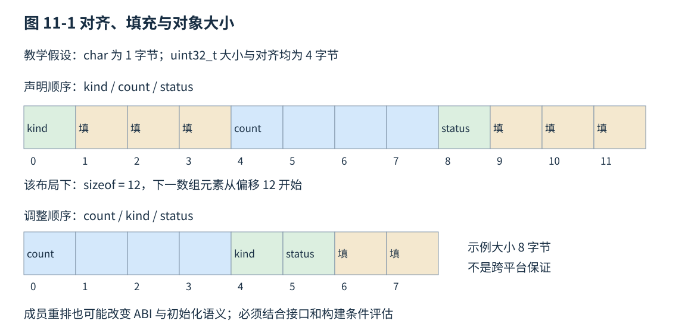
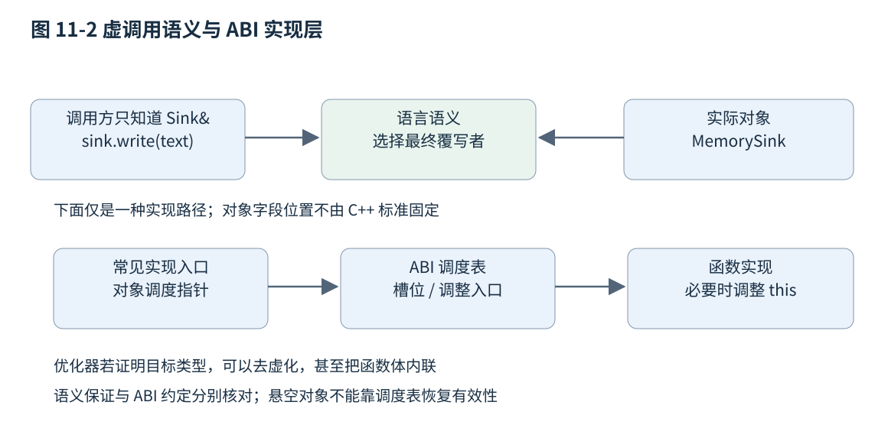

# 第十一章 对象模型与可观察边界

C++ 的对象模型连接了两种视角。源码视角里，有成员、继承、虚函数和类型转换；运行视角里，有字节、地址、对齐和调用入口。两者必须能相互解释，却不能简单画等号。标准规定程序可以依赖什么行为，ABI 规定某个工具链怎样把这些行为落实成二进制约定，优化后的机器代码则可能只保留完成可观察行为所需的部分。

理解对象模型，重要的不是记住一张“所有类都长这样”的内存图，而是知道一项判断依赖哪一层证据。对象大小可以在目标构建中查询，虚函数是否需要一次间接跳转可以检查生成代码，某次运行没有崩溃却不能证明越界访问合法。本章按 C++20 固定草案 N4861 讨论语言边界；ABI 图是明确限定条件的实现示意，不作为跨平台保证。所有代码未编译、未执行。[S1]

## 11.1 布局 Alignment Padding 与标准布局

### 11.1.1 对象表示 值表示与对齐

**对象表示**是对象占用的字节序列；其中参与表示对象值的位构成**值表示**。类型可能存在不参与值表达的填充位，类的成员之间也可能有填充字节。`sizeof(T)` 查询完整对象所需的存储大小，以 char 大小的单位计数；`alignof(T)` 查询类型的对齐要求。它们回答相关但不同的问题：需要多少空间，以及对象起始地址要满足什么约束。[S1]

对齐不是源码风格选项。处理器、指令集和 ABI 可能对某类访问要求特定边界，或者在不对齐时付出额外成本。语言也要求对象放在满足其类型对齐的存储中。某台处理器允许一次不对齐整数读取，并不自动让一个不符合 C++ 对象对齐要求的指针解引用变成正确程序。

`sizeof(char)` 总是 1，但这个单位含多少位要看 CHAR_BIT；普通网络协议里“一字节等于八位”的前提应明确核实。`int`、指针和 long 的大小也不能仅凭“64 位系统”猜测。固定宽度整数类型有助于表达宽度要求，但它们的可用性与布局仍须按目标环境确认，不能由 uint32_t 的名称推导整个结构体没有填充。

```cpp
// C++20 布局描述示例，未编译、未执行。
#include <cstddef>
#include <cstdint>
#include <type_traits>

struct Sample {
    char kind;
    std::uint32_t count;
    char status;
};
static_assert(std::is_standard_layout_v<Sample>);
constexpr auto object_size = sizeof(Sample);
constexpr auto object_alignment = alignof(Sample);
constexpr auto count_offset = offsetof(Sample, count);
// 不在这里断言任何跨平台固定尺寸或偏移。
```

这里使用 offsetof 的前提是相应标准布局类型与适用成员。在 C++20，对非标准布局类使用 offsetof 是有条件支持，不能把某个编译器只发警告的结果当作所有实现必须支持的承诺。对位域等也不能像普通可寻址成员那样随意查询和取址。[S1]

### 11.1.2 填充怎样进入一个数组

假定一个教学目标的 char 为一字节，uint32_t 大小和对齐均为四字节，且实现采用图示常见布局。Sample 的 kind 可放在偏移 0；为了让 count 从四字节边界开始，中间留出三个字节；count 占偏移 4 至 7，status 占偏移 8，末尾再有三个字节。这一示例中 sizeof(Sample) 为 12。若调整成员次序为 count、kind、status，同样假设下可以得到 8 字节。[S1]

这里尾部填充与数组有关：数组元素连续放置，第二个元素的起点需要继续满足 Sample 的对齐要求。sizeof 包括数组步进所需要的完整大小，而不只把业务字段大小相加。压缩掉尾部空间却仍用原类型数组步进，可能破坏后续元素对齐。



图 11-1 填充与数组步进的关系。12 字节和 8 字节是图中假设下的示例，不是 C++ 对 Sample 的固定规定。

成员重排可能减小尺寸，却也会改变 ABI、聚合初始化的位置含义、序列化代码的假设，以及缓存访问关系。如果结构体已经暴露给插件或持久化文件，重排不是无风险的内部优化。即使是纯内部结构，也应结合热点字段、访问批次和真实对象数量判断收益。减去四个字节只是布局变化，不自动等于端到端延迟改善。

`alignas` 可以为声明指定适用的对齐要求，例如让一块存储满足某类型或某个受支持的更严格对齐。它不能合法地弱化类型固有的对齐。另一方面，编译器扩展的 pack 或 packed 可能改变 ABI 布局，必须同时考虑成员地址、外部接口与目标访问限制；它们不是跨平台二进制协议的通用开关。[S1]、[S3]

对齐到缓存行还属于另一层问题。类型对齐可以帮助安排起点，但是否避免伪共享取决于对象间距离、实际缓存行大小、分配方式与哪些线程写哪些字段。第五章与第二十章会分析这些性能条件；不要把一个 alignas 声明直接解释为并发性能保证。

### 11.1.3 标准布局与可平凡复制是两个性质

**标准布局类型（standard-layout type）**满足一组便于推理布局与互操作的规则。对类而言，条件涉及非静态成员类型、访问控制、虚函数、虚基类以及继承层次等，不能压缩成“只要都是 public 就行”。**可平凡复制类型（trivially copyable type）**则关注哪些复制或移动操作是平凡的，以及析构等条件，关系到按字节保存和恢复对象表示的特定保证。[S1]

这两个集合相交，但不相同。一个有用户提供析构函数的简单类可能仍是标准布局，却不是可平凡复制；一个含不同访问控制数据成员的类可能满足可平凡复制，却不是标准布局。`struct` 与 `class` 的关键字选择也不决定这两个性质，它们最直接的区别之一是默认访问控制不同。

```cpp
// C++20 类型性质示例，未编译、未执行。
#include <type_traits>
struct LayoutOnly {
    int value;
    ~LayoutOnly() {} // 用户提供析构，不再是可平凡复制类型
};
class TrivialCopy {
public:
    int x;
private:
    int y;
};
static_assert(std::is_standard_layout_v<LayoutOnly>);
static_assert(!std::is_trivially_copyable_v<LayoutOnly>);
static_assert(std::is_trivially_copyable_v<TrivialCopy>);
static_assert(!std::is_standard_layout_v<TrivialCopy>);
```

对于符合条件的可平凡复制对象，标准允许把其底层字节保存到 char、unsigned char 或 std::byte 数组，再复制回来恢复原值；还规定了在相应条件下，把一个对象的字节复制给另一个同类型对象的值效果。这里有“非潜在重叠子对象”等边界，不能机械推广到基类子对象、任何生命周期状态或任意地址。[S1]

即使类型可平凡复制，也不能把它的内存直接当作稳定网络格式。指针值只在特定地址空间有意义，填充可能变化，端序和标量表示可能不同，版本升级后成员可能改变。规范中的“按字节复制同类型对象”解决进程内对象操作，协议设计需要另行规定字节序、字段长度、缺省值与兼容策略。

### 11.1.4 成员顺序 空对象与共享地址

在 C++20，非 union 类中同访问控制、非零大小的非静态成员，后声明成员按更高地址安排；不同访问控制组之间的分配次序则未指明。这一基线要与后续标准的规则变化分开。即使成员相对顺序有保证，也不表示成员之间没有填充，更不表示整个对象起点总是第一个业务成员的地址。[S1]

标准布局对象与其第一个适用的非静态数据成员具有专门的地址和指针可互转换关系，这使某些底层操作有依据；它不是“任意类都可以把对象指针解释成第一个字段指针”的许可。包含虚函数、继承层次或不满足标准布局条件时，不能继续套用这项有限保证。

完整的空类对象大小不能为零，否则同类型数组中的不同对象身份难以按语言规则区分。基类子对象可以在适用规则下不额外占空间，常称为空基类优化；C++20 的 `[[no_unique_address]]` 允许特定成员成为潜在重叠子对象，使空策略对象以及某些尾部空间有被重用的机会。它提供许可与语义规则，不承诺每个编译器、每个组合都实现相同大小。[S1]

若两个成员看起来具有相同地址，也不能因此把它们当作同一业务对象，或者假定它们互相可替代。对象身份、指针可互转换、同址存储和允许通过某类型访问，是几个不同条件。低层优化越依赖这些细节，越应把 static_assert、编译器布局报告和指定 ABI 文档放入构建证据，而不是依赖一张在其他平台测得的截图。

### 11.1.5 按字节比较为什么不等于按值比较

对一个有填充的结构体，两个对象的业务成员可以完全相等，填充字节却不同。因此 memcmp 不是任意结构体的值相等实现。浮点正零和负零、某些类型允许的多种表示，也会让按位相等和业务相等分离。反过来，一个合法的按值比较也可能忽略缓存字段或内部身份，是否相等取决于接口语义。

同样，`memset(&object, 0, sizeof object)` 不是通用的值初始化。全零位模式不必代表每种类型的有效零值，更不能代替 string、智能指针或带虚函数对象的构造。不变量不仅存在于字节里，还包含资源责任与语言对象状态；把内存清零可能破坏这些关系。

C++20 的 `std::bit_cast` 在大小相等、源和目标满足可平凡复制等条件时提供按位转换工具，比把不相关对象指针强制转换后解引用更直接地表达意图。它仍不是把任意位模式变成合法值的许可证；填充、不确定位和目标表示的约束仍须按固定版本条款核实。用于浮点编码分析时，应说明格式假设，用于协议解析时仍需验证输入。[S1]

**面试追问：“POD、标准布局、可平凡复制是不是同义词？”** 不是。旧代码里的 POD 把若干性质放在一起，新代码应询问真正需要的性质：要用 offsetof，还是要按字节保存恢复，还是要做聚合初始化。分别检查对应约束，比拿一个笼统名称替代全部条件可靠。

**面试追问：“为什么结构体大小比成员之和大？”** 从成员对齐、内部填充、尾部填充和可能的实现管理信息逐项解释，并注明目标 ABI。不能只回答“编译器自动补齐到八字节”，因为补齐尺度与布局条件都不是统一常数。

## 11.2 Virtual Function RTTI 多态与类型擦除

### 11.2.1 静态类型与动态类型

**静态类型**由源码中表达式的声明与类型规则确定；**动态类型**在相关运行时多态语境中描述被引用对象实际属于哪一个最派生类型。一个 Base& 可以引用 Derived 对象的 Base 子对象，引用表达式的静态类型仍是 Base，而对象在普通存续阶段的动态类型是 Derived。[S1]

**虚函数**使某些成员调用按动态类型选取最终覆写者。它解决的是“调用方只知道共同接口，具体行为由实际对象提供”的问题。一个文件输出器、内存输出器和网络输出器可以实现同一个写入接口，调用方不必为每种具体类型编写分支。

```cpp
// C++20 多态示例，未编译、未执行。
#include <string_view>

struct Sink {
    virtual ~Sink() = default;
    virtual void write(std::string_view text) = 0;
};
struct MemorySink final : Sink {
    void write(std::string_view text) override {
        // 教学片段：实际保存策略由实现定义，此处不保留借用。
        (void)text;
    }
};
void emit(Sink& sink) { sink.write("record"); }
```

override 让编译器检查此函数确实覆写基类虚函数，减少 const、引用限定或参数类型拼错后意外产生新函数的风险。final 限制进一步继承或覆写相应实体，并可能帮助优化器判断目标，但不是“写了 final 就保证内联”的指令。

默认实参属于静态调用接口，虚函数体的选择则属于动态分派。若基类与派生类为同一虚函数写不同默认实参，通过 Base 接口调用时，可能使用基类的默认值进入派生类实现。这种组合虽然可由规则解释，却很容易误导维护者，通常应避免让覆写层次改变默认参数含义。

### 11.2.2 虚表是实现约定 不是语言字段

许多实现用虚表和对象中的虚表指针支持虚调用。可以把常见路径想成：从对象相关子对象取得调度信息，选定对应槽位，再跳转到函数或调整入口。多重继承中，入口可能先调整 this，使目标函数看到正确子对象地址。这样的图能解释调试现场，但 C++ 语言标准没有规定每个对象必须有一个固定位置、固定大小的 vptr。[S1]、[S2]

Itanium C++ ABI 规定了虚表组件、地址点、偏移信息、RTTI 入口以及成员函数指针等二进制细节，被若干目标工具链采用；不能因为名字里有 Itanium，就认为只用于同名处理器，也不能因此推断所有 GCC、Clang 目标或 Windows 构建都采用它。具体目标、ABI 变种与编译选项必须另行确定。[S2]



图 11-2 虚调用的概念路径与一种常见 ABI 实现。实线表达语义选择，具体调度表形式和位置不由语言固定。

虚函数的成本不能只算一次间接跳转。对象大小、访问局部性、分支预测、是否能内联、数据是否分散，以及调用内本身的工作量都会改变效果。另一方面，编译器若能证明实际类型，可以去虚化甚至内联；源码中出现 virtual 不保证机器代码每次都查表。性能判断必须基于目标构建与工作负载，而不是背诵统一纳秒数字。

一个很小、极热且类型已在编译期确定的计算可能适合模板；一个需要运行时选择插件、频率不高的接口可能适合虚函数。把动态接口改成模板，会把成本转移到实例化、代码尺寸、编译依赖和二进制边界，不能只把其中一项叫作“零成本”。

### 11.2.3 RTTI 是受条件约束的类型查询

**运行时类型信息（RTTI）**常通过 typeid 与 dynamic_cast 使用。对于多态类型的适用 glvalue 表达式，typeid 可以给出动态类型信息；对于其他适用情形，通常反映静态类型。type_info 的 name 返回实现定义的文本表示，不能把它作为稳定的网络类型标识、数据库主键或跨编译器协议字段。[S1]

`dynamic_cast<Derived*>(base)` 可以对适用的多态层次进行运行时检查，失败时得到空指针；转换到引用失败时抛出 std::bad_cast。它还支持符合条件的侧向转换，不只是从父类向子类转换。普通明确的派生到无歧义可访问基类转换不一定需要运行时检查；把所有 dynamic_cast 都描述成“必须扫描全部继承树”不准确。[S1]

```cpp
// C++20 类型检查示例，未编译、未执行。
struct Node { virtual ~Node() = default; };
struct TextNode : Node { int characters{}; };
struct ImageNode : Node { int width{}; };

int text_length(Node* node) {
    if (auto* text = dynamic_cast<TextNode*>(node)) {
        return text->characters;
    }
    return 0; // 本示例把“非文本”映射为0，业务接口可选择更明确的结果类型。
}
```

这段转换不会验证 node 是否仍指向活对象。对悬空指针进行 RTTI 查询，不会把已经释放的内存变成可安全识别的对象。类型检查的前提仍包含对象生命周期和适用类型关系，不能作为任意地址的真实性检测器。

构建选项也可能关闭某些 RTTI 能力，这是实现提供的非完整默认配置，需要审查库依赖。若插件边界两边对 RTTI、可见性或运行时配置理解不同，问题可能出现在类型匹配和异常传播，而不是局部语法。有关二进制边界的约定应由第八章所述工具链证据支撑。

### 11.2.4 频繁向下转换常暴露接口缺口

一次 dynamic_cast 并不等于设计错误。编辑器、调试器、异构对象模型确实可能需要检查可选能力。但若每个调用方都重复“如果是 A 就做甲，如果是 B 就做乙”，共同接口可能没有表达真正的操作，或者候选集合实际上是封闭的，更适合 variant 与显式访问器。

选择虚函数时，新增类型往往自然，新增横跨所有类型的操作可能需要修改接口；选择有限 variant 时，新增操作可以通过新访问器组织，新增候选则可能影响所有访问器。这是演化方向上的区别，不是某种语法绝对高级。还要结合第三方扩展、数据尺寸和错误处理策略判断。

typeid 也不该成为绕过虚接口的万能分支。它回答类型身份，业务常需要的是能力，例如“能否取消”“是否支持随机访问”。能力接口、结果类型或显式协议版本往往比比较类型名字更稳定。把运行时类型名字写进持久化文件，等于把工具链实现细节升级成长期业务协议。

### 11.2.5 类型擦除把实现类型藏在稳定操作集合后

**类型擦除**是一种接口组织技术：调用方使用一个固定外层类型，而外层内部保存不同具体类型及调用它们所需的操作。std::function 是常见例子，它把满足条件的可调用对象包装成给定调用签名。类型擦除仍需某种动态调度和存储管理，只是具体机制由包装器实现，而不要求被包装类型显式继承一个公共基类。[S1]

一个最小的非拥有型回调可以由“上下文指针＋函数指针”组成。函数指针知道怎样把上下文恢复成原类型并调用相应操作；调用方只看固定签名。关键不只是隐藏类型，还要说明上下文属于谁、能活多久、线程是否安全以及回调是否可能抛出。

```cpp
// C++20 非拥有型擦除示例，未编译、未执行。
struct CallbackRef {
    void* context;
    void (*invoke)(void*, int);
    void operator()(int value) const { invoke(context, value); }
};
struct Counter { int total{}; };
void add_to_counter(void* context, int value) {
    static_cast<Counter*>(context)->total += value;
}
void synchronous_use() {
    Counter counter;
    CallbackRef callback{&counter, &add_to_counter};
    callback(3);
    // callback 只在 counter 存活期间使用，不保存到异步任务中。
}
```

这里 void* 转回 Counter* 合法性的依据是上下文确实来自一个存活 Counter，而不是“static_cast 会检查”。这个包装器没有空状态检查、所有权或并发策略，只用于展示机制。生产接口若允许空回调、保存到队列或跨动态库调用，需要补充相应契约，不能把这两字段照搬为通用安全库。

拥有型擦除还要保存销毁、复制或移动目标所需的操作，可能采用堆分配或小对象内嵌存储。小对象优化的阈值、适用条件和异常要求都属于具体实现，不可用一次 sizeof(std::function) 推导所有标准库的行为。C++20 的 std::function 对目标可复制性有相应要求；需要仅移动可调用对象时，要选择匹配标准版本与库支持的其他接口，而不是假定它天然接受任意捕获 unique_ptr 的闭包。

**面试追问：“虚函数一定比模板慢吗？”** 应区分单次调度、内联机会、布局和总体代码体积。虚调用可能去虚化，模板也可能产生大量代码并影响指令缓存。只有明确调用模式与构建证据后，才有可靠的性能比较。

**面试追问：“类型擦除是否就是 void*？”** void* 只是可能的存储入口。完整类型擦除需要保留执行固定操作所需的类型信息与责任，包括调用、销毁和可能的复制移动。没有这些配套约定的 void* 只是丢失类型约束，不是一个完整抽象。

## 11.3 继承组合 对象切片与析构边界

### 11.3.1 继承建立子类型关系 组合表达组成责任

public 继承通常表达调用方可以把派生对象当作基类对象使用。这个“可以替代”不只要求能编译，还要求派生实现遵守基类接口的前置条件、后置条件和不变量。若基类承诺任何非负长度都能设置，派生类却只接受偶数长度而没有改变接口，形式上的继承可能已经破坏使用者的推理。

组合把一个对象作为另一个对象的成员，表达“包含”或“借助它完成工作”。一个连接池包含互斥量，不表示连接池是一种互斥量；一个日志输出器使用文件，也不必继承文件流。组合通常使资源责任与替换策略更清楚，但不应机械禁止继承。接口多态、特定静态多态技术以及框架生命周期都有合理用途。

private 继承、空基类优化和模板技巧可能以继承表达实现细节，此时不宜向读者宣传为业务子类型关系。设计文档应把外部替代契约和内部复用机制分开，避免维护者依据类图猜错权限和生命周期。

### 11.3.2 基类子对象不是独立完整对象的复刻

派生对象内部包含基类子对象和成员子对象，但具体存储安排不必等于把几个完整对象原样拼接。实现可能利用基类尾部填充、共享虚基类，或安排额外调度信息。基类指针到派生对象起点的数值偏移也不总是零。正常的语言转换会完成必要调整，reinterpret_cast 却不能替代继承转换的语义。[S1]、[S2]

多重继承中，一个派生对象可能包含两个不同基类子对象；从派生指针分别转成两个基类指针，数值可能不同，但都合法指向相应子对象。菱形继承若不使用虚继承，可能含有两份共同基类；虚继承可让最派生对象共享一个虚基类子对象，同时引入不同的构造与地址定位规则。

虚基类由最派生类负责初始化，构造顺序也不由构造函数初始化列表的书写顺序任意控制。一般类的初始化遵循虚基类、直接基类、非静态成员等规定顺序，成员按声明顺序初始化，最后才执行构造函数体。析构反向处理相应子对象。把初始化列表重新排序以“先用后建”的想法不会改变这些规则。[S1]

```cpp
// C++20 初始化顺序反例，未编译、未执行。
struct WrongOrder {
    int first;
    int second;
    WrongOrder() : second(7), first(second) {} // first 仍先初始化，读取未准备值
};
struct CorrectOrder {
    int second;
    int first;
    CorrectOrder() : second(7), first(second) {}
};
```

真实类型中，这类问题可能表现为锁尚未构造就注册回调、资源指针尚未建立就创建视图，或引用绑定到尚未准备好的成员。修复应调整真实依赖与成员声明，而不是只消除编译器的 reorder 警告文本。

### 11.3.3 按值接收基类会发生对象切片

**对象切片**常指用派生对象初始化或赋值一个独立基类对象时，只保留其基类部分的值。新对象的完整类型就是基类，派生部分没有被隐秘保存在旁边等待虚调用找回。它不是对原派生对象做局部内存裁剪，而是建立或更新了另一个基类对象。[S1]

```cpp
// C++20 切片示例，未编译、未执行。
struct Shape {
    virtual ~Shape() = default;
    virtual int sides() const { return 0; }
};
struct Triangle : Shape {
    int sides() const override { return 3; }
};
int by_value(Shape shape) { return shape.sides(); }
int by_reference(const Shape& shape) { return shape.sides(); }
// 对同一 Triangle 实参，前者操作新建 Shape，后者借用原对象。
```

如果接口需要多态观察，通常通过引用或指针访问；如果需要多态拥有，则可以用合适的智能指针；如果需要复制保留动态类型，可提供返回拥有型结果的 clone 操作并明确深复制语义。把一个 `vector<Derived>` 转成 `vector<Base>` 也不是数组层面的子类型转换，两个容器的元素类型、步进与操作契约不同。

并非所有从派生到基类的值复制都是错误。有时业务有意提取公共信息，直接构造一个清楚命名的记录类型会比隐式切片更容易理解。问题在于调用者以为“仍然保留具体类型和行为”，接口却已经丢弃它。把多态基类的复制操作设为受保护或删除，是防止某些意外切片的设计手段，但也要考虑需要的 clone 与容器行为。

### 11.3.4 基类析构接口决定谁能安全销毁

若通过基类指针使用普通 delete 销毁动态类型不同的对象，通常要求基类具有适当的虚析构函数，否则会产生未定义行为；C++20 的 destroying delete 等规则有特定例外，不是普通接口可以忽略虚析构的理由。常用设计选择是：需要允许外部通过基类销毁，就提供 public virtual 析构；不允许这种销毁路径，就用 protected non-virtual 析构限制访问。[S1]、[S4]

```cpp
// C++20 正常多态拥有示例，未编译、未执行。
#include <memory>
struct Service {
    virtual ~Service() = default;
    virtual void run() = 0;
};
struct LocalService : Service {
    void run() override {}
};
std::unique_ptr<Service> make_service() {
    return std::make_unique<LocalService>();
}
```

智能指针不会一概修复错误析构设计。`unique_ptr<Derived>` 转成采用默认删除器的 `unique_ptr<Base>` 后，删除通常按 Base 指针接口进行，仍要满足相关虚析构要求。shared_ptr 在某些构造路径中可以保留原始具体删除动作，但这依赖控制块建立时已知的类型与删除器；若一开始只给它一个错误的 Base*，并不会魔法般重建丢失信息。因此不应拿某个 shared_ptr 示例证明基类析构可以随意省略。

纯虚析构函数并不免除定义要求：如果程序创建了相应派生类对象，纯虚基类析构函数也必须有定义，因为派生对象析构时仍会执行基类析构过程。把析构声明为 `= 0` 可以使类抽象，却不意味着基类清理步骤从调用链消失。通常直接用普通虚析构和其他纯虚操作更直观，除非有明确的抽象接口设计理由。

### 11.3.5 构造和析构中的多态有阶段边界

在基类构造函数执行期间，派生部分尚未完成初始化；在基类析构函数执行期间，派生部分已经退出。语言对这些阶段中的虚调用、typeid 和 dynamic_cast 规定了专门规则。构造或析构过程中针对当前对象的虚调用，不会任意分派到尚未建立或已经销毁的更派生层。[S1]

```cpp
// C++20 阶段行为示例，未编译、未执行。
struct Base {
    Base() { hook(); }
    virtual ~Base() { hook(); }
    virtual void hook() {}
};
struct Derived : Base {
    int state = 7;
    void hook() override { state = 9; }
};
// Base 的构造和析构阶段调用其阶段可用的实现，不调用 Derived::hook。
```

RTTI 也有同样明确的阶段界限：若 typeid 的操作数指称正在构造或析构的当前对象，它报告当前构造函数或析构函数所属的类；dynamic_cast 则把该对象视为这个类的最派生对象。这里的操作数静态类型必须属于当前类或其基类范围；借用同一完整对象的其他继承分支来查询，可能触发未定义行为，不能一概当作“转换失败返回空指针”。[S1]

把“初始化流程”设计成基类构造中调用派生虚函数，常与这种阶段规则冲突。可以改为完成构造后显式调用初始化方法，或者让工厂在对象完整建立后完成注册，但还要处理初始化失败和对象尚未发布的问题。工厂并不自动保证线程安全，外部不能在不变量建立前看到对象。

从构造函数或析构函数直接或间接地对当前正在构造或析构的对象发起纯虚函数的虚调用，行为未定义；不能期待它找到派生实现。这里说的是虚调用：显式使用限定名、抑制虚分派后调用一个已有定义的纯虚函数，适用的是另一条规则，不能混为一谈。更普遍的风险是把 this 传给外部注册表或启动异步任务：即便注册动作本身不调用虚函数，其他线程也可能在构造未完成时访问对象。第九章的生命周期与第十六章的发布同步要在这里一起满足。

析构中也不应安排依赖派生状态的回调。如果销毁过程通知观察者，必须说明通知发生在哪一层、对象哪些字段仍有效、观察者能否反向调用，以及是否允许重入。许多“偶发虚调用崩溃”其实首先是关闭协议或对象发布协议出了问题。

**面试追问：“析构函数为什么要 virtual？”** 只有需要通过基类接口多态销毁时才是这个关键要求；不是每个类都需要虚析构。回答应把所有权与删除路径说清，而不是背诵“有继承就必须 virtual”。

**面试追问：“构造函数中调用虚函数是否合法？”** 某些调用是合法的，但分派只遵守当前构造阶段规则，不会任意进入更派生层；纯虚调用和不适当跨分支访问还有危险。工程上应避免依赖尚未建立的派生行为，并把需要完整对象的动作放到明确阶段。

## 11.4 Undefined Behavior 语言保证与 ABI 实现实例

### 11.4.1 不同的未知有不同含义

**未定义行为（undefined behavior，UB）**表示标准不对相应行为施加要求。它不同于**实现定义行为**，后者要求实现选择并记录一种行为；也不同于**未指明行为**，后者允许在若干可能行为中选择而不必给出固定选择说明。程序**不良构**则涉及违反语法或语义规则，其中一些要求诊断，一些情形不要求诊断。把这些全部叫作“看编译器”会丢失最重要的边界。[S1]

例如，某些类型宽度依赖实现；特定表达式中不固定的求值选择不一定构成 UB；越界解引用、使用已结束生命周期的对象、数据竞争则可能进入未定义行为。前两类有标准允许的范围，后一类不能保证程序只是得到一个意外数值或在发生处崩溃。

编译器优化通常基于程序满足语言前提来推理。若程序通过有符号整数溢出判断“是否溢出”，而所用操作本身已经是 UB，优化器可以据合法执行的前提化简判断。问题不在于优化器应该“照源代码逐行做错”，而在于源码没有为该输入定义正确行为。第四章会说明整数边界，第二十二章会讨论诊断证据。

### 11.4.2 类型转换不创建访问权限

`reinterpret_cast` 可以表达某些底层指针转换，但转换成功不代表可以通过目标类型访问原对象。合法访问仍要满足类型可访问规则、对齐、对象生命和范围条件。一个 float 对象并不会因为地址被转换成 int* 就变成 int 对象。[S1]

```cpp
// C++20 反例与替代思路，未编译、未执行。
#include <bit>
#include <cstdint>
float f = 1.0f;
// auto bits = *reinterpret_cast<std::uint32_t*>(&f); // 不以此作合法别名访问
// 若目标环境两类型大小相等且满足bit_cast条件，可按位取得独立结果：
// auto bits = std::bit_cast<std::uint32_t>(f);
// 解释bits的IEEE754含义还需确认该实现的浮点格式。
```

标准允许通过 char、unsigned char 或 std::byte 等适用类型观察对象表示；这是一条特定的字节访问路径，不是对所有“同样大小”的类型开放互相别名。signed char 与 char、unsigned char 的地位也不能在 C++ 类型可访问规则中未经检查地等同。操作系统映射缓冲、网络接收区和 DMA 区域还要额外考虑对象创建、有效长度和硬件同步。

`std::launder` 也不是“让非法指针变合法”的通用函数。它服务于符合特定对象存在与可达性条件的对象替换场景，不能创建尚不存在的对象，不能补足错误对齐，不能修复越界或释放后的存储。若一个接口只有靠每次加 launder 才似乎能解释，首先应回到第九章重新画存储与对象生命周期。

### 11.4.3 共同初始序列和 union 规则不能随意外推

某些标准布局结构体有共同初始序列，标准允许在规定的标准布局 union 场景中，经另一个成员读取该共同序列中的相应字段。这条规则帮助实现一些带公共头部的联合表示，但有明确前提，不能推导为“两个结构体前几个字段一样，就能随便把指针互转后读取”。[S1]

union 同一时刻的活动成员、成员生命开始与结束、非平凡构造析构以及常量求值中的限制，都要分别处理。对普通业务状态，variant 往往能把标签与活动对象责任放在同一个类型里；手写 union 可以减少某些开销，却把更多正确性工作留给作者。

类似地，把 `char buffer[sizeof(T)]` 转成 T* 还没有自动满足全部条件：缓冲需要适当对齐，T 对象必须按适用创建规则存在，访问不能越界，销毁责任也要安排。C++20 的隐式生命周期类型规则确实允许一些操作隐式创建特定对象，但不能因此宣称任意字节数组在任意转换以后都已有任意 T。低层库应按具体操作查条款并用最小封装隔离，而非把模糊假设扩散到业务层。

### 11.4.4 ABI 证据应带着目标环境阅读

假设调试器显示一个多态对象开头有机器字大小的地址，地址指向一组函数入口，这与某种虚表实现相符；但从这段观察只能得出“该构建、该对象、该时刻的布局如此”。如果编译器采用不同 ABI，类增加虚基类，优化器消除对象，或对象正处于构造析构阶段，观察都可能改变。

Itanium ABI 文档提供数据布局、虚表布局和成员指针等明确规则，可以用来解释采用该 ABI 的构建。例如虚表地址点不必是整张虚表存储区域的最开头，偏移信息可帮助从基类子对象定位相关位置；成员函数指针也不应先验等同于一个普通函数地址。具体编码还受平台变体影响，不能把某个两字段示意当作所有架构上的 sizeof 保证。[S2]

Windows 的 MSVC 工具链有自己的目标布局、对齐与二进制兼容文档。给 DLL 用户公开 C++ 类，意味着公开其部分二进制约定，后续增加字段、调整虚函数表或改变运行时库设置都可能成为兼容风险。第八章已经把 API、ABI 与 FFI 分开；这里进一步说明，对象模型是 ABI 风险的具体来源之一。MSVC 工具集之间的二进制兼容也有链接器、运行库与 LTO 构建条件，不能只按语言标准版本判断。[S3]、[S6]

因此，对一个二进制故障，至少记录编译器及版本、目标三元组或平台架构、标准库与运行时版本、标准模式、优化与 LTO 设置、RTTI/异常开关、结构体打包选项和边界两端的构建方式。只写“都是 C++20、都是64位”不够；语言版本相同不代表二进制布局相同。

### 11.4.5 诊断从不变量走向地址证据

若一次虚调用崩溃，第一步应确认指针从哪里来、对象是否完成构造、是否已释放、是否被其他线程修改或销毁。第二步核对动态类型预期、基类转换是否正确、是否发生切片或跨 ABI 边界。第三步才解释调度指针和函数入口。直接“修复 vptr”可能暂时改变症状，却掩盖真正的写越界或释放后使用。

对布局错误，先把接口字段、对齐和 sizeof/offsetof 的目标值建立成可核查契约，再看原始字节。网络包若长度不足，应在构造高层对象前拒绝；不能靠把缓冲转成结构体指针，让解析、对齐、端序和生命问题一次性混在一起。长期持久化格式也应通过明确编码层与内存对象分离。

UBSan 可检查一部分运行时未定义行为类别，例如某些错误对齐、溢出或类型相关问题；ASan 关注一组内存访问错误；静态分析和编译警告提供另一种覆盖。工具覆盖有条件，执行路径未触达、优化方式不同、库未插桩或语言规则超出检测范围，都可能留下盲区。检测器没有报告，不是程序符合标准的完整证明。[S5]

诊断也不该把所有离奇行为都归因于 UB。文件损坏、协议不兼容、外部服务超时与硬件故障可以发生在语言行为完全有定义的程序里。可靠的证据链应能说明哪项不变量首先被打破、什么观察支持该结论、最小复现是否保留条件，以及修复怎样阻止同类失效。第二十二章与第二十三章会把这套工作进一步展开。

**面试追问：“程序在 x86 上运行正常，为何不能证明强转合法？”** 硬件容忍某次访问，只说明那条执行路径的机器行为没有立即失败。语言仍有类型、对齐、生命和范围前提，优化器也会使用这些前提。正确性需要这些前提成立，运行观察只能补充证据。

**面试追问：“知道虚表布局以后，能否手工调用虚函数？”** 在明确 ABI 和受控工具场景下可以研究实现入口，但业务代码应使用语言提供的调用方式。手工解释对象内存会绑定目标 ABI、构造阶段、this 调整和调用约定，还可能违反对象访问规则；它不是更高效的通用接口替代品。

**面试追问：“如何判断一项对象模型结论能否写进公共接口？”** 先分层：标准保证可以作为相应版本下的语言前提；ABI 文档保证只适用于明确支持的二进制环境；单次反汇编或尺寸观察只能作为该构建证据。公共接口若要跨环境，应缩小依赖或显式版本化，而不是把实现观察包装成普遍规律。

## 来源与阅读边界

核验日期为 2026-10-03。正文、示例和 SVG 为原创教学表达；没有执行 C++、记录对象地址或测量虚调用开销。所有尺寸图都明确标出假设。

- S1：WG21 N4861，重点为 `[basic.types]`、`[basic.align]`、`[class.prop]`、`[class.mem]`、`[class.virtual]`、`[class.cdtor]`、`[class.base.init]`、`[expr.dynamic.cast]`、`[expr.typeid]`、`[expr.delete]`、`[basic.lval]`、`[bit.cast]`、`[ptr.launder]`
- S2：Itanium C++ ABI 官方文档，数据布局、虚表布局与成员指针章节；只作为采用该 ABI 的实现实例
- S3：Microsoft Learn 的 MSVC 对齐说明，用于实现扩展与目标布局边界，不替代标准 alignas 的规范
- S4：C++ Core Guidelines C.35、C.67 等，提供多态析构与防止切片的工程建议
- S5：Clang UndefinedBehaviorSanitizer 官方文档，说明检测覆盖与配置；本章没有实际运行检测器
- S6：Microsoft Learn 的 MSVC 跨版本二进制兼容说明，用于链接器、运行库与 LTO 的实现边界

[S1]: https://www.open-std.org/jtc1/sc22/wg21/docs/papers/2020/n4861.pdf
[S2]: https://itanium-cxx-abi.github.io/cxx-abi/abi.html
[S3]: https://learn.microsoft.com/en-us/cpp/cpp/align-cpp?view=msvc-170
[S4]: https://isocpp.github.io/CppCoreGuidelines/CppCoreGuidelines
[S5]: https://clang.llvm.org/docs/UndefinedBehaviorSanitizer.html

[S6]: https://learn.microsoft.com/en-us/cpp/porting/binary-compat-2015-2017?view=msvc-170
