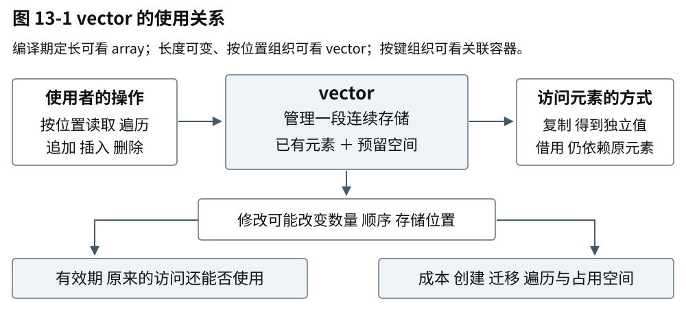
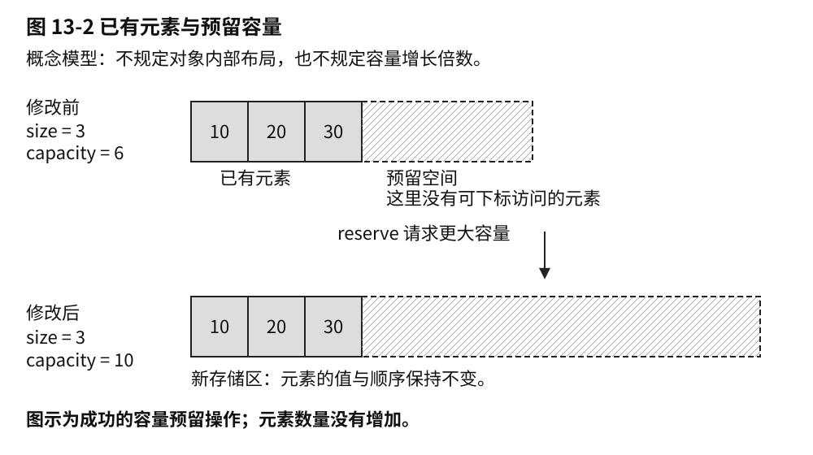
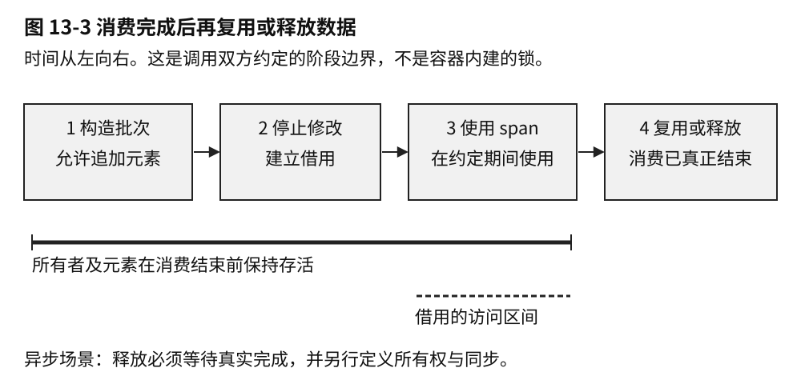
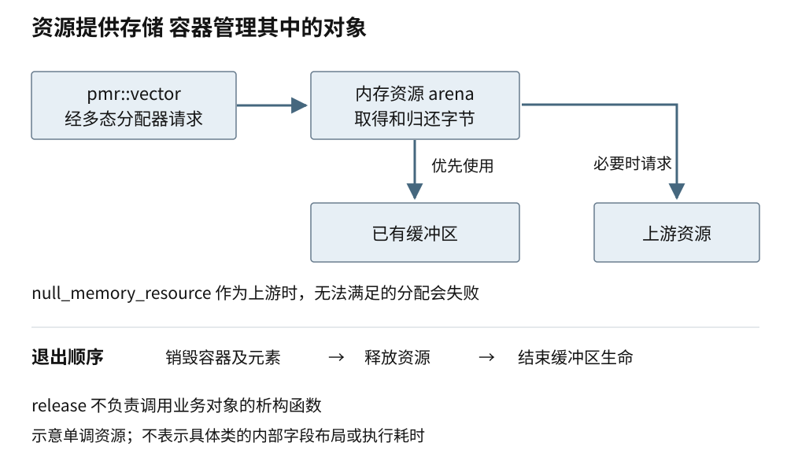

# 第十三章 标准库容器算法与分配

C++ 标准库把许多重复出现的数据管理问题写成了共同契约。容器负责保存对象，迭代器和范围表达可访问的元素，算法描述对这些元素执行什么操作，分配器参与存储取得与释放。理解这几层如何配合，比只记住容器成员函数更有用：同一个算法可能适用于不同容器，同一次修改也可能影响已有访问方式。

第二章从结构不变量解释了数组、哈希表和树；本章进一步看标准接口实际承诺了什么。我们先建立容器、算法与访问能力之间的关系，再完整分析 vector 的存储变化和借用有效期，随后把这些责任扩展到分配器、内存资源与常见值类型。对象活着、地址可用、内容仍对应原记录、并发访问满足规则，是需要分别确认的条件。

涉及复杂元素和泛型接口时，本章沿用第九、十、十二章的对象生命周期、复制与移动、模板和概念基础。尚不熟悉这些内容的读者，可以先读本章的整数与字符串例子，再回到对应章节补齐条件。

## 13.1 STL Container Iterator Algorithm 与 Range

### 13.1.1 标准库通过契约组合不同结构

通常所说的 STL，历史上指标准模板库的容器、迭代器、算法和相关设施。现代 C++ 标准库已经远超过这个范围，字符串、时间、并发和其他组件不能全部简化为 STL。这里关注的核心思想是：把“怎样保存”和“怎样处理”适度分开，让满足相同要求的类型可以复用算法。[S1]

**序列容器**按位置组织元素，例如 `array`、`vector`、`deque`、`list` 和 `forward_list`。它们并不都连续，也不都支持相同复杂度的位置访问。`array<T,N>` 的元素数量由类型中的 N 决定，`vector<T>` 可以改变数量，`deque` 支持高效两端操作，链式容器重视已定位节点的连接修改。选择需要结合高频操作和元素有效期，而不是看到名称就指定一种“最快容器”。

**有序关联容器**，如 `map` 与 `set`，按比较关系组织键，提供有序遍历和查找；`multimap`、`multiset` 允许等价键。比较器需要满足相应的**严格弱序**要求：不能把一个值判作小于自身，“小于”关系需要传递；两个方向都不判小所形成的等价关系也需要传递。因此，同一组键的比较不能前后矛盾，也不能在元素已经入容器后随意改变依赖的外部状态。若比较关系不再成立，搜索路径的依据就消失了。

**无序关联容器**使用哈希和相等关系组织键。它们通常适合精确键查找，但没有承诺按插入次序或哈希值排序遍历。不能因为某个测试里恰好输出相同顺序，就把它保存为序列化协议。稳定输出需要另行排序，或采用明确保留次序的数据模型。

**容器适配器**在已有容器上限制或重新组织接口。`stack` 表达后进先出，`queue` 表达先进先出，`priority_queue` 按优先关系取出元素。适配器不会替系统保证任务完成顺序、公平性或截止时间。底层操作纪律是调度设计的一部分，不是完整调度器。

使用标准容器仍需阅读异常和失效规则。例如，操作失败是否保留原状态，插入后旧迭代器是否仍可用，移动能否直接接管存储，都可能受元素类型和分配器影响。“用了标准库”减少了重复实现的负担，却没有免除调用者满足前置条件的责任。

### 13.1.2 迭代器能力限制算法能做什么

**迭代器**表示序列中的一个可访问位置，并提供在位置间移动的方法。它有时就是指针，有时是包含节点链接或额外状态的对象。解引用当前迭代器表示访问对应元素；推进迭代器表示走向后续位置。结束位置通常是一个不可解引用的边界，不是一项隐藏的最后元素。

用于写结果的输出迭代器则表达写入和推进能力，不必同时支持读取；例如追加适配器可以只接受新值。

传统算法常接收半开区间 `[first,last)`：first 包含在范围内，last 不包含。空区间可以由二者相等表示。这种约定便于拼接相邻区间，但仍要求从 first 能按照相应规则到达 last。把来自不同容器的两个迭代器随意拼成区间，不会因为类型相同就合法。

迭代器有不同能力。输入迭代器适合单向读取，未必能多次重读相同位置；前向迭代器增加多遍历要求；双向迭代器可以前后移动；随机访问迭代器支持常数复杂度的位置跳转与距离运算；连续迭代器进一步把相邻元素访问与连续对象地址联系起来。能力更强不是说每个操作都更快，而是允许算法依赖更多结构性质。[S1]

例如排序需要对元素进行比较、交换和重新组织。经典 `std::sort` 要求随机访问迭代器，因此不能直接把链表的 begin/end 交给它。`std::list` 提供自己的 sort 成员，利用节点连接完成排序。泛型算法与成员算法都合理，接口选择要匹配结构所能提供的操作。

反过来，一个算法做 O(log n) 次比较，不代表它只移动 O(log n) 次。对不支持随机跳转的有序序列进行通用二分查找，比较次数可以很少，却仍需多次推进迭代器，总推进量可能是线性的。对于有自己的树结构的 `map`，成员 lower_bound 能沿结构下降，不应只因为名字相同就换成通用算法。

算法适用性还涉及元素操作。可遍历不等于可修改，可修改不等于可交换。`map` 的键不能通过普通迭代器任意改成另一值，否则会破坏容器次序；`vector<const T>` 也不是把任何数据“设成只读”的通用方法。类型系统和算法约束会拒绝一部分不合法组合，但未被类型表达的语义条件仍需要人理解。

### 13.1.3 算法前提包括顺序和输出空间

很多算法把重要条件留给调用方。二分查找要求范围相对于相关比较满足分区条件；合并两个有序范围要求两边遵守同一比较关系；把结果写入输出迭代器，要求输出位置可写且空间足够。调用名称并没有隐含完成这些准备工作。

复制算法是一个典型例子。一个空 vector 调用 reserve(100)，仍然没有一百个已存在元素；把 begin() 当成容纳一百项的输出位置不合法。可以先调整元素数量，或者使用 `back_inserter` 这样的输出适配器，让每次赋值转换成追加操作。两种方案的对象构造和容量成本不同，应按需要选择。

**谓词**是返回判断结果的可调用对象；**比较器**定义元素间的次序。算法可能以与直观逐行代码不同的次数或顺序调用它们。若比较器通过计数改变自己的判断，或依赖正在被修改的外部状态，结果可能失去所需的语义性质。需要记录日志或统计时，应保证这些副作用不改变比较关系，并区分仪表化成本与原始性能。

删除算法也需要分清层次。传统 `std::remove_if` 会把保留元素整理到前部并返回新的逻辑结束位置，却不负责改变 vector 的实际 size。随后使用成员 erase 删除尾部对象，才完成容器层面的删除。C++20 的 `std::erase_if` 为相应容器提供更直接的组合接口，但失效与异常规则仍需按容器核对。算法返回一个位置，不等于容器已经完成所有资源管理。

如果选择带执行策略的算法，还需要另外核对允许的并行、向量化、函数对象行为和异常处理规则。不能把普通循环包进并行策略后，继续无保护地修改共享计数或调用依赖顺序的副作用。并行执行是额外契约，不是性能开关。本书在并发与性能章节分别展开其正确性与测量。

### 13.1.4 Range 把范围作为一个整体表达

C++20 的 Ranges 设施把范围本身纳入接口，通过概念约束说明访问能力。范围的起点是迭代器，终点可以是不同类型的**哨兵**，只要它们满足相应比较与终止关系。这样不必强迫所有输入都拥有与起点完全相同的结束表示。[S1]

Ranges 算法还可以使用**投影**，先从元素提取参与比较的部分。例如一组记录按其中的 timestamp 排序，投影表达“比较这个字段”，比较器仍表达字段的排序规则。它让数据结构与比较意图分开，不意味着省去了投影执行或字段访问的成本。

**视图**是满足特定范围与移动等要求、适合组合的一类对象。本章采用的 N4861 还要求默认可初始化，以及与元素数量无关的移动和析构等成本；它不是任意带有 begin/end 的容器的别名。许多常见视图只保存对已有数据的引用和少量处理状态，但不能把 view 一词定义成“永远不拥有任何东西”。某个具体视图拥有哪些状态、引用谁、何时计算，必须检查其类型与构造方式。

过滤和变换等适配器可以组合成惰性流水线：建立组合时通常没有立即物化全部结果，而是在遍历时逐步查找或计算。这能减少中间容器，也把求值时刻推迟到消费过程。源数据在创建视图后发生修改，下一次遍历观察到什么，就需要根据底层容器有效期和适配器自身规则判断，不能把惰性视图当作已经冻结的快照。

某些视图会缓存位置，某些输入只能消费一次；反复遍历不保证每次完全重复同一成本。谓词和变换函数捕获的外部引用，也必须保持有效。把一个“保存局部变量引用的 lambda”放入返回给调用方的视图，可能在真正开始遍历前就已经悬空。这里的问题发生在组合对象的生命与外部状态之间，不会因为管道语法简洁而消失。

Ranges 使用 borrowed_range 等机制区分某些范围对象销毁后，其迭代器是否仍可使用。对不满足借用条件的临时范围，部分算法会用 dangling 类型阻止误用返回位置；这是一层接口防护，不会证明底层元素永远存在，也不会使所有视图自动安全。C++20、后续缺陷修订与 C++23 对可接收临时对象的具体能力存在演进，迁移时应检查实际标准库版本，不用滚动文档替旧工具链作保证。

## 13.2 vector size capacity reallocation 与异常保证

`std::vector` 是 C++ 标准库提供的一种容器，用来保存和管理一组同类型的数据。它把元素按顺序放在连续存储中，元素数量可以在运行时改变，因此通常被称为动态数组。本节中的 vector 指这个容器，不是数学向量或机器学习中的嵌入向量；讨论以 C++20 的通常 `vector<T>` 为范围，不包括采用特殊表示的 `vector<bool>`。

理解 vector，需要分清它管理的存储、其中已经存在的元素，以及程序访问这些元素的方式。预留的空间不等于已经存在的元素；增加一个元素，有时还会迁移原有元素，使先前取得的地址失效。基本用法、有效期和性能由此联系起来。

### 13.2.1 vector 的用途与选择

文件里陆续读出的记录、一次测量得到的温度、等待显示的消息，都可以组织成一组有顺序的数据。程序通常要逐项处理它们，按位置读取某一项，或者在末尾加入新项。这些操作正是 vector 常见的用途：数量不必在编译时确定，又能让整批元素紧邻存放。

在标准库中，vector 属于按顺序组织元素的序列容器。它尤其适合整批遍历、按位置访问和尾部增长。如果长度在编译期已经确定，可以考虑 `std::array`；如果主要按订单编号等键来组织和查找数据，则要比较关联容器。频繁在中间插删、要求对象地址长期稳定时，也需要重新比较选择。数据数量会变，只是选择条件之一。



图 13-1 vector 的使用关系。读取和修改面向已有元素，容器负责管理承载它们的存储；修改还可能影响访问有效期和成本。图中不规定标准库的内部字段布局。

这些取舍最终要落到具体操作上。先从三个整数开始，看看创建、读取和追加分别改变了什么，再进一步区分容器中的元素与留给后续增长的空间。

### 13.2.2 基本操作与存储变化

**保存和读取三个数**

`std::vector<int>` 表示保存整数的 vector。尖括号里的 `int` 是元素类型；`std::` 表示这个类型来自 C++ 标准库。容器里的每一个整数叫一个**元素**，例如下面的 18、21 和后来加入的 24。C++ 把有类型、占用存储的数据实体称为对象，一个整数也是对象，不必是一条复杂记录。这里先关注 `readings` 这份读数列表的用法，暂不展开内存申请细节。

```cpp
// C++20 说明示例，未编译、未执行。
#include <vector>

int main() {
    std::vector<int> readings{18, 21};
    readings.push_back(24);
    const auto count = readings.size(); // 元素数量为 3
    const int first = readings[0];     // 第一个元素为 18
    int total = 0;
    for (int value : readings) {
        total += value;
    }
    return (count == 3 && first == 18 && total == 63) ? 0 : 1;
}
```

定义 `readings` 的语句创建容器并放入两个初始值。`push_back` 把一个值加入末尾，所以原来的顺序不变，列表变成 18、21、24。`size()` 告诉程序现在有几项；方括号通过**下标**访问某一项，下标从 0 开始，因此三个元素的有效下标是 0、1、2。`auto` 让编译器从表达式推导变量类型。范围 `for` 则逐项取值，这里将三个数相加。末尾检查元素数量、首项和总和；条件全部成立时返回 0，否则返回 1。

长度可变并不等于任何下标都可用。此时 `readings[3]` 已越过元素范围，普通下标访问不会替你做边界检查。`readings.at(3)` 会检查范围并在越界时抛出异常，也就是通过语言的错误处理机制中断当前正常路径。接收外部输入作为下标时，仍应明确检查规则，而不能把没有立刻崩溃当成访问合法。

容器也能保存字符串和自定义记录，不过一个 `vector<T>` 的元素类型固定为同一个 `T`。更复杂的类型会带来更复杂的创建、复制和销毁行为。先把整数版本理解清楚，后面再看这些行为怎样影响性能和失败处理。

**连续布局与容量预留**

上面的代码说明了怎样操作元素，但还没有解释容器如何为它们安排空间。运行中的程序需要内存来保存元素。通常的 `vector<T>` 将元素放在一段**连续存储**中：第一个元素之后紧接着第二个，再接着第三个。按下标查找不需要从头逐项走过去；顺序处理时，也能沿相邻位置前进。这样的布局让它适合批量计算、排序和与接受连续数据的接口交换内容。[S1]

连续不表示“所有有关的数据都挤在一起”。这里用 Record 代表自定义记录类型；`vector<Record>` 中的记录对象连续，如果每条记录还有自己单独保存的长字符串，那些字符仍可能分散在别处。现代处理器通常能从规律的访问中获益，但具体是否更快，还要看记录大小、间接访问和实际负载。C++ Core Guidelines 建议默认考虑 vector，是工程起点，不是对所有场景的速度保证。[S3]

现在回到追加操作。已有三个元素，又来了第四个，容器需要让新元素紧挨着原有元素。如果每次追加都只准备刚好够用的空间，就可能频繁更换整段存储。因此，vector 可以在现有元素之外预留空间。已有多少元素、当前存储能容纳多少元素，是两个不同的数：

- `size()` 是现在已经存在的元素数，也是可访问范围的依据
- `capacity()` 是当前存储在不重新分配的情况下能够容纳的元素数，可能大于 `size()`

`data()` 提供已有元素连续区的起始位置，便于把这段数据交给其他接口。它不会替你检查数量；空 vector 没有可访问元素，无论 data() 返回什么，都不能用它读取第一个元素。容器管理存储与其中元素，不表示标准规定它的内部必须保存某几个字段。[S1]

把列表想成一排连续的格子有助于理解，但要保留一个区别：预留格子不是已经存在的元素。一个空容器调用 `reserve(100)`，只是请求足以容纳至少 100 个元素的容量；它的 `size()` 仍为 0，不能立刻写 `v[0]`。要逐条追加，用 `push_back`；如果确实需要先有一百个整数元素，再逐项填写，可以使用 `resize(100)`，对这里的整数例子，新增加的元素初始化为 0。[S1]

文件头已经给出准确记录数时，一次预留通常比反复猜测更合理。若后续代码要逐个构造，也就是创建并初始化完整记录，则先预留再追加；若后续算法需要按下标填写现成元素，则先调整大小。两者表达了不同的工作方式。对复杂类型，提前创建一批随后又被覆盖的元素还可能产生额外成本。

当追加后的元素总数超过容量，原存储便不够用了。vector 会取得一块更大的存储，在那里构造所需元素，成功后释放原来的存储。这叫**重新分配**，日常讨论里也常称为扩容。容量究竟增长多少由实现决定；标准不要求每次都翻倍。



图 13-2 size 表示已有元素，capacity 还包括预留空间。下面展示重新分配前后的位置变化；容量数值只是示意，不代表增长公式。

到这里已经能看出 vector 的基本取舍：它提供简单的连续布局和方便的尾部增长，但增长有时会搬迁已有元素，中间插入或删除则可能需要移动后面的元素。对整批数据进行处理时，这常是值得接受的代价；要求对象始终待在同一个地址时，就需要更仔细地设计。

### 13.2.3 借用与有效期

**引用 指针与元素生命**

读取一个整数，可以把它复制到另一个变量，也可以保留对原元素的访问。两者不是一回事。`int first = readings[0]` 保存自己的整数值；`int& first = readings[0]` 中的 `&` 声明了一个**引用**，可以把它理解为原元素的另一个名字。引用不会自动复制元素，也不负责延长元素的生命。**指针**则保存对象的地址，程序可通过它找到原对象。

函数只想临时读取一份大记录时，借用原元素能避免复制。一个对象从开始存在到生命结束的时间，叫作它的**生命周期**。借用的便利带来时间条件：使用指针或引用时，原对象必须仍然存在，访问也必须仍然有效。这里的“借用”是对这种使用关系的描述，不表示 C++ 会自动替所有借用检查有效期。

例如，一个日志界面记住某条记录的地址，打算下一次刷新时读取。同一线程在这期间追加了一批日志，触发重新分配。vector 变量还在，记录内容也还在列表中，却已经处于新的存储位置；旧地址不能继续用。C++ 不会登记所有曾交出去的地址，再在搬迁后逐一更新。

下面刻意请求比当前容量更多的空间，用来明确这一边界，不依赖某家标准库的增长倍率：

```cpp
// C++20 说明示例，未编译、未执行。
#include <vector>

int main() {
    std::vector<int> values{10, 20};
    const int* saved = &values[0];
    const auto capacity = values.capacity();
    if (capacity == values.max_size()) return 0;

    values.reserve(capacity + 1); // 成功返回时必定重新分配
    // 此后不能再通过 saved 访问原元素。
    const int current = values[0];
    return current == 10 ? 0 : 1;
}
```

`const int*` 是用于读取整数的指针，`&values[0]` 取得第一个元素的地址。`max_size()` 给出这个容器能够支持的元素数量上限，检查它是为了不在上限处再加 1。预留请求成功后，旧指针失效；从当前容器重新取 `values[0]` 则仍能读到 10。这个例子没有解引用失效指针来制造崩溃，因为规则已经足以判定那样的访问不成立。[S1]

“成功返回”也有意义：申请内存和构造元素可能失败。后文会讨论复杂元素怎样影响失败后的保证。眼下先记住，vector 的生命、它所管理的存储以及其中某个元素的有效访问期，并不总是一起开始、一起结束。

把地址改成下标能解决一部分问题。若只是重新分配，稍后用下标访问当前容器，可以重新找到相同位置；若前面删掉一项，原来的下标 5 却可能指向另一条记录，排序也会改变对应关系。需要持续跟踪“同一张订单”时，通常应该保存不随排列改变的业务 ID，再通过查找找到当前对象。地址稳定、位置稳定和业务身份稳定，是三种不同的要求。

**迭代器与序列修改**

除了下标，C++ 算法还常使用**迭代器**来表示序列中的位置。它像一个可以向前移动的访问入口：`begin()` 指向起点，`end()` 表示最后一个元素之后的位置。`end()` 本身不指向元素，不能读取它；它主要用于判断遍历是否结束。

尾部追加若没有重新分配，原有元素的指针和引用可以继续使用，但原先的 `end()` 已失效，因为序列的终点变了。没有重新分配的中间插入，会使插入点及其后的指针、引用和迭代器失效，包括原来的 end；插入点之前的访问则保持有效。删除也会使删除位置及其后的迭代器和引用失效。若发生重新分配，原有元素的指针、引用和迭代器都失效。[S1]

最初例子中的范围 `for` 看起来没有写迭代器，但它在循环开始时会取得起点和终点。如果一边范围遍历同一个 vector，一边向末尾追加，即使提前预留了足够容量，也不能仅凭“元素地址没变”判定安全；追加后继续循环会再次使用原先的结束位置。

若任务只是处理最初的一批整数，并把副本附到末尾，可以直接表达这个范围：

```cpp
// C++20 函数体片段，需包含 <vector> 和 <cstddef>。
// 未编译、未执行。
std::vector<int> values{10, 20, 30};
const auto count = values.size();
for (std::size_t i = 0; i < count; ++i) {
    const int value = values[i];
    values.push_back(value);
}
```

`std::size_t` 是用于表达大小和下标的无符号整数类型。`count` 固定了本轮要处理的原始数量，每次从当前容器取值。局部变量 `value` 持有自己的整数，不依赖插入前的地址；新追加的元素不进入本轮范围。若把它改成引用，或让处理过程删除、排序原元素，就要重新分析，不能机械搬用这个循环。

做图像变换或批量清洗时，分别使用输入、输出两个容器往往更直接。删除遍历中的元素时，则可以使用 `erase` 返回的后续有效迭代器，继续正确的遍历。共同要点是让修改方式和遍历方式相配，而不是把所有安全性都寄托在预留容量上。

**视图与消费完成时间**

前面的借用只涉及一个元素。如果函数需要读取整段数据，C++20 的 `std::span` 可以把起始位置和元素数量组合成一个视图。**这种非拥有视图**提供访问已有数据的方式；它不保存一份独立副本，也不负责拥有和销毁这些元素。复制一个 span，复制的是访问入口与范围，而不是整段数据。[S1]

```cpp
// C++20 函数体片段，需包含 <vector> 和 <span>。
// 未编译、未执行。
std::vector<int> readings{18, 21, 24};
std::span<const int> view{readings};
const int first = view[0]; // 读取 readings 的第一个元素
```

这里的 view 覆盖三个已有元素，const 表示不能通过它修改整数。数据仍由 readings 管理；view 销毁不会销毁这些整数，复制 view 也不会为它们延长生命。如果 readings 重新分配，旧 view 不会自动跟到新存储中。

例如，音频处理模块生成一批采样值，再同步交给滤波函数，也就是等滤波函数处理完才继续向下执行。只要使用期间底层数据仍然存活，且没有发生使访问失效的修改，传递 `span` 就很自然。如果改成异步处理，提交后台任务后生产者便继续运行，消费结束时间不再是函数返回时间。后台任务复制了一个 `span`，生产者却可能已经开始复用保存采样值的缓冲区。若只是原地覆写，元素可能仍然存活，任务读到的却已经是下一批数据；若销毁容器或发生重新分配，视图会悬空。不同线程若在缺乏所需同步的情况下读写同一元素，还可能发生数据竞争，违反 C++ 的并发访问规则。这几种错误需要分别处理，复制视图都不能解决。



图 13-3 批次数据的一种使用约定。“停止修改”表示应用暂停影响读取的修改，不是 vector 内建的锁；异步读取必须等到真实完成后才能结束这段约定。

`span<const Sample>` 中的 Sample 表示采样值类型，const 表示不能通过这个视图修改元素；这个限制不能阻止其他持有者修改原容器，也没有提供线程同步。把类型写成只读，不能代替生产者与消费者之间的时序安排。

接口的选择可以从接收方真正需要什么出发。界面只显示标题和时间，复制这两个字段形成快照，往往比共享整份日志更省心。一个完整批次要交给后台处理，可以转移拥有它的对象，让接收方负责保留到任务完成。多个消费者确实需要同一批不可变数据时，再考虑共享所有权与同步。这里的所有权指负责保留数据并在适当时候销毁它的责任；共享所有权让多个持有者共同维持这段生命，共享的数据能否被安全修改仍需单独设计。

有时要求恰好相反：记录的地址要稳定，记录集合却频繁增长。`std::unique_ptr<Record>` 是独占管理一份 Record 的智能指针，通常在自身销毁时销毁所指向的记录。把这样的指针放进 `vector`，可以将指针自身的迁移与记录的存储分开；仅仅因为这个 `vector` 重新分配，被指向记录的地址不会随之迁移。不过，删除或重置相应智能指针仍会结束记录的生命。这种安排还有间接访问和通常的逐对象分配成本，适不适合需要结合访问模式判断。

### 13.2.4 元素迁移与异常保证

前面通过重新分配解释了旧地址为何失效。接下来再看搬迁本身：它不只是在另一处找够字节。元素是对象，构造和销毁决定它何时可供使用，并负责适当地取得和清理它管理的资源。容器取得原始存储和在其中构造元素，是相关但不同的事情。重新分配的简化过程因此是：取得新存储，在那里构造所需元素，成功后清理旧元素和旧存储。这个过程说明了地址为何改变，也带来一个更深的问题：构造到一半失败，容器该留下什么状态？具体实现可能使用专门优化，构造顺序还会受操作和别名关系影响，不能把简图当成实现源码。

对整数而言，搬迁似乎只是复制一些字节。一个记录类型却可能拥有字符串、缓冲区、文件句柄或其他资源。复制通常要建立可独立使用的新值；移动则允许新对象接管旧对象管理的资源，避免不必要的复制。类型的移动构造函数定义了新对象怎样完成这种接管，它也可能执行用户代码。连续存储没有抹去对象语义，不能对一般类型随意用逐字节复制函数 `memcpy` 代替正确的构造和销毁。

假如前几个元素的资源已转移到新位置，下一个元素的移动构造抛出了异常，想把全部东西原样放回去并不容易。恢复动作本身也可能失败。移动是否会抛出，因而会影响容器能够给出的异常保证。`noexcept` 表达函数不让异常逃出的承诺；它经常出现在相关讨论里，原因就在这里。WG21 的早期设计论文也专门分析过这个冲突。[S4]

为容器提供和回收存储的对象称为分配器，元素的创建也通过相关机制完成。就 C++20 的尾部单元素插入而言，满足复制插入要求，或者元素具有不抛出的移动构造时，相关条款提供异常后的无效果保证，也就是操作失败时容器保持本次操作前的状态；对于不满足复制插入要求的类型，如果移动构造抛出，效果可能未指定，不能依赖原内容仍然保持。[S1]

“复制插入”是包含分配器语义的库要求，不能只凭看到一个拷贝构造函数就判定满足。其他修改操作还要查看各自的条款。

实践中，可以先查看自己的类型是否真的需要手写复制、移动和析构。用合适的资源管理成员表达所有权，常常能减少特殊成员函数里的错误。如果必须自定义，就要把可能抛出的步骤和资源转移顺序说清楚。只有确实不会让异常逃出时，才应承诺 `noexcept`；异常若逃出不抛出函数，会调用 `std::terminate` 终止程序，给声明加一个关键字并不能修好资源设计。

默认分配器通常足够，但自定义分配器还可能影响两个容器之间转移存储的条件。这里谈的是把一个 vector 的内容移交给已经存在的另一个 vector，也就是容器的移动赋值，不是同一个 vector 扩容时搬迁元素。例如，不能不看分配器传播规则和实例是否相等，就断言任何 `vector` 移动赋值都只会交换几个指针。即使可以接管源容器的存储，目标容器原有元素的销毁成本也不能忽略。类型和分配器都是容器成本与失败行为的一部分。判断一次操作的成本，既要看管理存储的方式，也要看元素自身做了哪些工作。

### 13.2.5 容量规划与性能取舍

现在可以更准确地谈 vector 的快与慢。复杂度描述成本随数据规模怎样增长，不是某台机器上的毫秒数。尾部追加具有摊还常数复杂度：把一长串追加的总成本分摊到每一次上，平均的数量级不随已有元素数线性增长。它允许其中某次追加因重新分配而较慢。因此，离线文件转换关注的总体吞吐，与交互程序关心的一次卡顿，可能对同一实现给出不同评价。

用固定翻倍作简化模型，容量增长时迁移的元素数像 1、2、4、8 这样累加，增长到 N 个元素前的总迁移量仍与 N 同阶。这个推导解释了留出增长余量为什么有用，不表示标准要求两倍增长，也没有计算元素构造、分配器、内存页面或线程调度的真实代价。

可信的规模信息很有价值。文件头给出了记录数，或一帧处理中已经算出结果上限，一次合理的 `reserve` 可以减少后续重新分配。反过来，每追加一个元素就先调用 `reserve(size() + 1)`，可能把原本的增长余量逐步消掉。在按请求量提供容量的实现模型下，反复迁移会产生 1+2+… 的平方级成本。“主动管理容量”本身并不保证优化。

预留也占用内存。为应付极少出现的大批次，给每个连接都保留很大的容量，可能把单次延迟问题换成整体内存压力。调用 `clear()` 会销毁元素而保留容量；`shrink_to_fit()` 只是减少多余容量的请求，不能假定一定生效，若发生重新分配还会使旧借用失效。保留与释放都应服从实际使用周期。[S1]

要比较自然增长与一次预留，先确认两者产生的内容一致，再观察相同负载下的批次耗时、容量变化和峰值内存。关注偶发卡顿时，还要看慢批次分布，不能只报告平均数。记录工具链、标准库、优化选项、硬件、输入规模和重复次数，才能让结果有解释空间。给元素加计数器或日志会改变成本，这类仪表化结果最好与生产类型的计时分开。

对实时控制循环，预先分配更只是论证的一部分。元素内部还可能分配，其他调用可能阻塞，超限时也需要处理策略。一次 `reserve` 不能替整条调用链承诺最坏延迟。

### 13.2.6 沿修改和使用顺序排查

理解了存储、访问和成本之间的关系，就能按现象选择排查方向。出现乱码或崩溃，先找出故障位置使用的是哪一次取得的地址，再向前查期间发生过的容器修改。若只在大输入下失败，可以记录容量变化来寻找关联，但仍需定位具体的失效访问。相关性足以指路，不能独立证明原因。

没有崩溃、只是内容错位时，检查业务身份尤其重要。缓存的下标可能在删除或排序后合法地读到另一条记录，这类错误未必会触发内存工具。对象 ID、当前排序方式和更新时序，比多加一次边界判断更能解释现象。

若预留容量后问题依旧，要继续查结束迭代器、中间插入与删除；若引入异步任务后才出现，沿着任务实际完成时间追踪底层所有者。`span` 和裸指针都需要这条时间线。只有性能退化时，则把重新分配、元素构造和业务处理分开观察，避免把解码或绘制的成本都算到容器头上。

AddressSanitizer 是随编译器使用的内存错误检测工具，能帮助发现已执行路径中的多类越界、释放后使用等问题；标准库的调试迭代器模式也能诊断部分无效迭代器操作。[S5]、[S6] 工具没报错仍不能证明全部访问有效。例如容量以内但元素范围以外的写入，检测能力就取决于实现及配置。调试模式还可能改变容器表示和性能，排错构建的时间数据不宜直接当作发布版本结论。

### 13.2.7 面试中的一条追问链

**“已经 reserve 了，为什么仍然出错？”** 这个问题需要先补足上下文。预留的是多少、之后是否超出容量、错误发生在元素地址还是结束迭代器、期间是否有删除或中间插入？把这些条件补齐后，才能区分重新分配、位置失效和对象已经销毁。直接回答“不会扩容，所以安全”，遗漏的恰恰是重要边界。

追问可以顺着一个修复继续：**“那保存下标，不保存指针，可以吗？”** 如果只是跨过重新分配再找回同一位置，可以；若期间会删除或排序，就必须重新说明下标与业务对象的对应。由此能自然谈到稳定 ID、句柄表，或对修改范围施加约束。方案要解决的是实际身份需求，不能仅看代码有没有悬空指针。

再把消费改成异步：**“传 span 能否避免复制？”** 在底层存储存活、访问有效、并发规则满足的条件下，可以避免为传参而复制元素。但任务队列什么时候完成、谁保留批次、谁还能修改数据，都需要明确。接收方只要几个字段时，小快照可能更简单；需要整个批次时，可以考虑所有权转移。

于是会有更具体的性能问题：**“换成 unique_ptr 元素，或给移动构造加 noexcept，会更好吗？”** 前者把记录地址与容器存储分开，同时引入间接访问和分配成本；后者必须反映类型真实的异常行为，并可能影响容器在相关操作中的迁移选择和保证。两者解决的问题不同，不能只凭一个基准数字相互替代。

最后值得追问的是证据：**“你会怎样验证这个改动？”** 正确性上核对所有者、修改点和消费结束点，覆盖重分配、删除、异步完成等路径；性能上固定负载，校验输出一致，再比较延迟分布与内存。若只做了设计而没有执行，就把验证计划与已得结果分开说。


## 13.3 Allocator PMR 缓存局部性与失效规则

### 13.3.1 分配器管理存储 对象另有生命

**分配器**描述怎样为对象取得和释放存储，并参与标准容器的对象构造协议。它不是“创建对象”的同义词：取得足够字节后，还需要在正确位置开始对象生命；归还字节前，应按要求结束其中对象的生命。第九章已经区分存储与对象，这个区分在自定义内存管理中尤其重要。

默认分配器适合很多普通需求。只有当实际证据表明分配频率、归属、峰值或时延需要特殊控制时，才值得引入更复杂的策略。例如按请求集中管理临时对象、减少大量同尺寸节点的分配成本，或明确禁止某阶段继续取得堆内存。自定义策略仍需满足容器要求的对齐、数量、回收和相等性契约。

**分配器相等**不只是两个对象的地址相同，它关系到一方取得的存储能否由另一方按契约释放。容器移动赋值或交换存储时，必须考虑分配器是否传播，以及相关实例能否互相处理对方的分配。某些条件不满足时需要逐元素操作，某些不符合要求的 swap 甚至越过接口前提。不要把“容器通常只有几个字段”当成常数成本与合法性的证明。[S1]

这里的**传播**指容器操作是否把分配器本身也替换或交换。`allocator_traits` 统一查询这些规则，其中 `propagate_on_container_copy_assignment`、`propagate_on_container_move_assignment` 和 `propagate_on_container_swap` 分别控制复制赋值、移动赋值和交换。以 vector 为例，移动赋值若不传播且双方分配器不相等，就不能简单接管源存储，必须在目标的分配责任下处理元素。swap 则没有这样的逐元素回退承诺：若不传播分配器，双方分配器必须相等，否则是未定义行为。复制构造如何选择分配器是另一个问题，不能拿复制赋值的规则代替。[S1]

局部性同样不是分配器名称带来的保证。把节点放入同一池中可能减少分配元数据和空间分散，但实际遍历顺序仍可能完全不同，池中的空洞、对齐和长期存活对象也会影响布局。应把分配器选择与访问模式一起测量，而不是只比较 allocate 的微基准。

### 13.3.2 PMR 在运行时选择内存资源

**多态内存资源**通常缩写为 PMR。它通过 `memory_resource` 接口表达按字节数与对齐分配、释放的能力，`polymorphic_allocator` 再把这种资源接入标准容器。`std::pmr::vector<T>` 是使用相应分配器的 vector 别名，不是另一种元素布局。

它的重要价值是：使用不同资源的容器可以具有相同 C++ 容器类型，具体资源在运行时指定。调用方能够为一次解析或一批任务选择资源，而无需把具体资源类型一直传播到所有模板参数中。这种灵活性还带来资源指针的生命周期责任，容器并不因此自动拥有并延长资源对象的生命。

例如单调缓冲资源 `monotonic_buffer_resource` 适合一批临时分配共同结束的场景。它从已有缓冲区或上游资源取得空间，其单独 deallocate 按规范没有效果，不会回收对应小块；整体 release 或资源销毁时，才把从上游取得的块归还。调用方提供的初始缓冲区仍由调用方管理，release 不负责释放它，也不负责调用其中业务对象的析构函数。频繁删除一项再插入另一项，不一定重用前一项留下的空间；vector 多次增长还可能让旧缓冲区空间保留到整批释放。[S1]

因此，单调资源很适合按阶段构建后整体废弃的数据，却未必适合长期反复增删、希望单块马上回收的容器。池资源可以针对不同大小的分配管理可复用块，但它也保留上游分配与空闲块，不保证每次 deallocate 立即降低进程的常驻内存。

`synchronized_pool_resource` 协调资源自身的并发访问，`unsynchronized_pool_resource` 不提供同样的同步保证。这只回答多个线程能否共同使用资源的某些操作，不代表放在资源上的 vector、字符串或业务对象可以同时任意读写。分配器线程安全与对象线程安全仍是两层问题。



图 13-4 资源链与退出责任。图中资源不自动延长外部缓冲区生命，容器也不自动拥有资源对象。

### 13.3.3 资源寿命必须覆盖使用它的容器

资源通常应比使用它的容器更晚销毁。容器析构仍需要结束元素生命，并可能通过资源释放存储；若资源对象已经不存在，即使数据字节暂时还留在地址上，也不能继续调用失效的资源接口。手工调用 release 之前，也必须确保没有对象还依赖那些存储。

```cpp
// C++20 完整函数，未编译、未执行。
// 示例只构建和销毁一批整数，不把资源或容器返回给调用方。
#include <array>
#include <cstddef>
#include <memory_resource>
#include <vector>

void build_batch() {
    std::array<std::byte, 4096> buffer{};
    std::pmr::monotonic_buffer_resource arena(
        buffer.data(), buffer.size(),
        std::pmr::null_memory_resource());
    {
        std::pmr::vector<int> values{&arena};
        values.reserve(100);
        for (int i = 0; i < 100; ++i) values.push_back(i);
    } // 先结束 vector 及元素的生命
    arena.release(); // 再结束这一批存储的使用
}
```

这个例子用 null_memory_resource 作为上游，资源无法满足分配时会失败，不会自动回退到普通堆。缓冲区还需要为对齐留出空间；4096 字节并不在所有可能实现上保证一定容纳目标请求。本例也没有捕获分配异常，失败会按函数调用契约向外传播。设置固定缓冲区只能限定这条分配路径，不代表整段程序或元素内部从此不分配。

嵌套对象尤其容易漏掉。`pmr::vector<std::string>` 使用 PMR 管理外层元素存储，但普通 string 内部仍使用自己的分配器。若希望字符串字符存储也进入相应资源，需要使用支持相应分配器传播的类型与构造路径，例如 `pmr::string`，并检查实际如何构造元素。给最外层换个别名，不会自动捕获所有深层分配。

复制也不能靠直觉。不显式提供分配器而复制构造一个 PMR 容器时，容器调用分配器的 `select_on_container_copy_construction`，得到使用当时默认资源的分配器；它不默认沿用源容器的资源。这里说的不是复制 `polymorphic_allocator` 对象本身，直接复制该分配器会保留资源关联。显式提供目标分配器的容器复制构造，则使用指定的资源。[S1] 需要把“复制值”与“继续使用同一资源”分开设计。复制到长期存储，往往正是为了脱离短期批次资源；此时改变资源是需要的语义，而非异常情况。

PMR 容器的复制赋值和移动赋值均不传播资源，目标继续使用自己的资源；交换同样不传播。两个 `pmr::vector` 即使类型完全相同，若分配器所关联的资源比较不相等，也不能直接 swap。资源是否相等应按其接口判定，不要只比较资源指针，更不要把移动赋值与交换的前提混为一谈。[S1]

### 13.3.4 失效规则应写成操作期间的访问约定

容器选择可以用一组具体问题检查：哪些操作会增加或删除元素，是否允许重分配，谁保存位置，位置保存多久，能否同时修改。随后对照每种容器和每个操作的失效条款。不能只在团队规范里写“不要用裸指针”，因为迭代器、引用、视图和下标都可能承载类似风险。

普通 vector 重分配会影响所有指向元素的旧访问；不重分配的中间插入或删除，则需要按位置关系判断。标准无序关联容器 rehash 会使迭代器失效，却保留现存元素指针和引用。链式容器的某些修改保留其他节点访问，但已被删除节点的访问仍然失效。deque 又有自己的操作边界，不宜直接借用 vector 或 list 的记忆。[S1]

如果接口要求调用方长时间保留记录身份，可以返回稳定 ID，再通过受控查找获得短期访问；如果希望保留对象地址，可以比较独立对象存储与所有权句柄；如果消费时间不确定，可以转移或共享实际所有权。每个方案都需要定义删除、替换和完成时机。容器失效规则提供底层边界，应用还必须提供业务身份与并发约定。

## 13.4 string optional variant 等值类型与 span string_view 非拥有视图

### 13.4.1 字符串保存字节 单独约定文字含义

`std::string` 管理一串 char 元素，并在其接口约定中提供末尾零字符等能力。它不自动判断内容是否为 UTF-8，也不把 size 转换成用户看到的字符数量。第四章讨论的字节、码点与字素簇区别，在标准字符串中仍然适用。

普通 string 可以包含中间的零字符。把它的 data 交给只读到第一个零的 C 风格接口，可能丢失后续内容；相反，接收字符串视图的接口通常同时得到长度，可以表达中间零。接口连接处应明确接收的是带长度字节序列还是零结尾字符串，而不是把所有 char 指针视为相同格式。

许多实现使用短字符串优化，把较短内容直接放在字符串对象内部。但阈值、布局和是否采用这种优化，不是可移植接口保证。不能把“我试了十个字符没有分配”写成库级资源承诺，也不能因移动后某次地址没变，就长期保留原有字符指针。

字符串拼接与格式化同样有容量和失败成本。知道可信的最终长度时可以合理预留，但预留不应跳过长度上限与溢出检查。若只需要临时读取一小段已有字符串，可以使用视图；若需要保留到来源销毁之后，就需要拥有副本或另有明确所有者。

### 13.4.2 optional 把缺失与合法值分开

`std::optional<T>` 表示“没有 T”或“有一个 T”。它适合字段可缺失、查找可能没有结果、延迟构造等情况。与用 −1、空字符串或某个特殊时间作哨兵相比，缺失状态不必占用 T 本身的合法值域。

optional 自身拥有它所包含的 T 对象，其存储是 optional 对象的一部分；这不意味着 T 内部没有堆分配。例如 `optional<string>` 中字符串对象放在 optional 内，但字符存储仍可能由 string 自己管理。reset 结束所含 T 的生命，emplace 创建一个新对象，外部 optional 的生命却可能继续。

访问前必须知道当前有值。`value()` 在无值时按接口抛出异常，而普通解引用操作有存在值的前提，不能把它当成自动检查。如何把缺失转成错误、默认值或跳过，应由业务契约决定。`value_or` 提供默认结果，但调用表达式中的默认值参数通常仍先求值，不能把昂贵默认计算误当作只有缺失时才执行的惰性分支。[S1]

optional 只有“有或没有”，不能独自区分缺失原因。没有找到记录、权限不足、服务超时、记录格式损坏是不同结果；把它们全部折叠为 nullopt，会损失故障处理所需信息。第十四章会比较错误码、异常和 C++23 的 expected，避免把所有不成功情况都塞进一个空值。

### 13.4.3 variant 明确列出允许出现的状态

`std::variant<A,B,C>` 在同一对象中保存有限候选类型中的一个活动值，并记录当前是哪一类。它适合语法节点、协议消息或明确状态集合。使用者可以通过 `get_if` 检查某个候选，或用 `visit` 对当前候选进行分派，不必维护一个可能与真实对象不一致的手写类型标签。

variant 不会自动让所有状态转换都安全。替换活动值时，构造新候选可能抛出异常；某些操作与类型条件下，variant 可能进入 valueless_by_exception 状态。这个状态与“正常的空业务状态”不同。若业务本来允许无结果，可以显式加入 `monostate` 或其他状态类型；异常失去活动值仍需按接口保证处理。[S1]

有限候选集合有利于让编译器检查访问器能否处理每一种类型，但默认分支过于宽泛也可能掩盖新状态未被认真处理的问题。增加一种消息以后，除了让代码编译，还要考虑序列化版本、日志、指标、授权和恢复路径是否都理解它。类型覆盖是工程覆盖的一部分。

variant 与继承多态也没有绝对替代关系。候选集合相对封闭、希望按值保存时，variant 很自然；需要第三方持续增加派生类型、通过稳定接口调用时，可能需要虚函数或类型擦除。对象尺寸、访问方式、编译依赖和兼容边界都应纳入选择，第十一章和第四十二章会进一步展开。

### 13.4.4 非拥有视图缩短接口 不延长生命

`std::span<T>` 描述连续 T 元素，`std::string_view` 描述连续字符范围。它们通常只保留位置与长度等少量信息，不负责保持来源对象存活。复制一个视图复制的是访问描述，不会把原数据变成独立快照。

string_view 还不保证视图末尾恰好有零字符。截取一个长字符串中间的五个字符，视图的 data 仍指向原存储中的某个位置；把这个指针交给要求零结尾的接口，可能继续读取第六个字符及后续内容。必要时应使用同时接收长度的接口，或建立合适的拥有型字符串。

一个常见错误是返回局部 string 的 string_view。函数结束时字符存储的责任随局部对象结束，返回的长度和地址即使看起来合理，也不能继续使用。另一个较隐蔽的错误是在容器中保存很多 view，随后追加或修改提供字符存储的字符串。没有任何 view 对象被删除，但它们所依赖的地址或内容已经变化。

只读视图也只限制通过这个入口修改，不阻止其他别名改写来源，不提供线程同步。调用层面应写清：视图只在本次同步调用内使用，还是可能被保留；被保留时由谁提供生命保证；源对象允许哪些修改；消费者何时完成。无法提供可靠保证时，复制适量数据往往比维持复杂隐式借用更容易验证。

**“标准库值类型如何帮助设计？”** 它们把常见关系放入类型：string 拥有字符序列，optional 表达缺失，variant 表达有限候选，span 和 string_view 表达访问范围。它们没有替代业务含义；缺失原因、状态转移与生命周期仍需要接口约定。

**“为了性能，是否应把所有 string 参数改成 string_view？”** 先看函数是否保存参数、是否要求零结尾、是否修改内容，以及调用方来源能否持续有效。同步只读访问常适合视图，需要长期保留时应拥有数据或接收明确的所有权。避免复制只有在正确性条件成立后才有意义。

**“用了 PMR 和视图，能否保证零分配、零复制？”** 不能。外层与嵌套对象可能使用不同资源，视图中的适配器可能保留其他状态，算法也可能需要临时空间。要逐条核对实际类型与调用路径，并把设计预期与已执行的测量分开说明。

## 来源与阅读边界


资料核验日期为 2026-10-03。正文、示例和插图由本项目原创组织，未转载第三方配图。公开规范、工程建议与设计背景分别列出；本版没有代码执行、诊断输出或性能测量证据。

- **S1 C++20 规范参照。** WG21 [N4861 公开工作草案](https://www.open-std.org/jtc1/sc22/wg21/docs/papers/2020/n4861.pdf)，重点为 `[vector.overview]`、`[vector.capacity]`、`[vector.modifiers]`、`[container.requirements.general]`（含分配器感知容器要求表）、`[allocator.traits.types]`、`[span.overview]`、`[iterator.requirements]`、`[range.view]`、`[range.adaptors]`、`[mem.poly.allocator.ctor]`、`[mem.poly.allocator.mem]`、`[mem.res.monotonic.buffer]`、`[optional]`、`[variant]`、`[string.view]` 和 `[except.spec]`。用固定条款核对保证，不以当前滚动草案的新规则回填 C++20；它也不替代正式出版文本或后续缺陷报告分析。
- **S2 版本身份。** WG21 [N4859 编辑报告](https://www.open-std.org/jtc1/sc22/wg21/docs/papers/2020/n4859.html)，说明 N4861 与 C++20 DIS N4860 的内容关系。本章可执行形式的说明代码以 C++20 为基线；C++23 expected 仅作错误处理章节的交叉引用，旧项目需另行选择视图接口。
- **S3 工程建议。** [C++ Core Guidelines](https://isocpp.github.io/CppCoreGuidelines/CppCoreGuidelines#Rsl-vector)，关注 SL.con.2、SL.con.4 及资源管理建议。它是工程指南，不能作为特定负载的性能证据。
- **S4 设计背景。** WG21 [N2855 Rvalue References and Exception Safety](https://www.open-std.org/jtc1/sc22/wg21/docs/papers/2009/n2855.html)。用来理解移动与异常恢复的冲突，旧提案不替代 C++20 的最终接口条款。
- **S5 诊断工具。** LLVM [AddressSanitizer 文档](https://clang.llvm.org/docs/AddressSanitizer.html)。实际能力应结合工具版本、编译配置与执行覆盖核对。
- **S6 调试迭代器。** GCC libstdc++ [Using the Debug Mode](https://gcc.gnu.org/onlinedocs/libstdc++/manual/debug_mode_using.html)。尤其注意调试与非调试构建的兼容边界。

[S1]: https://www.open-std.org/jtc1/sc22/wg21/docs/papers/2020/n4861.pdf
[S2]: https://www.open-std.org/jtc1/sc22/wg21/docs/papers/2020/n4859.html
[S3]: https://isocpp.github.io/CppCoreGuidelines/CppCoreGuidelines#Rsl-vector
[S4]: https://www.open-std.org/jtc1/sc22/wg21/docs/papers/2009/n2855.html
[S5]: https://clang.llvm.org/docs/AddressSanitizer.html
[S6]: https://gcc.gnu.org/onlinedocs/libstdc++/manual/debug_mode_using.html
