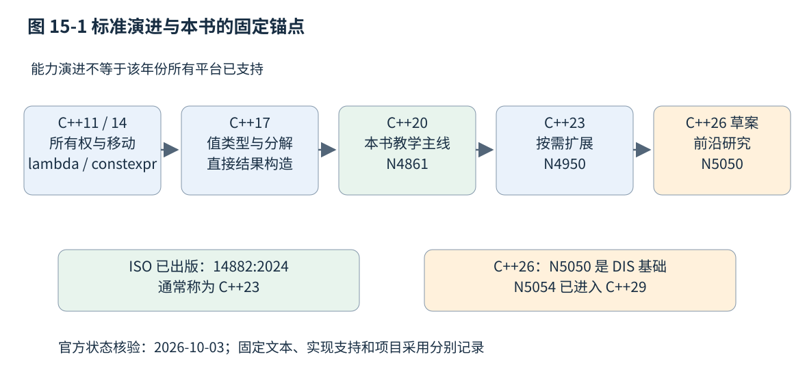
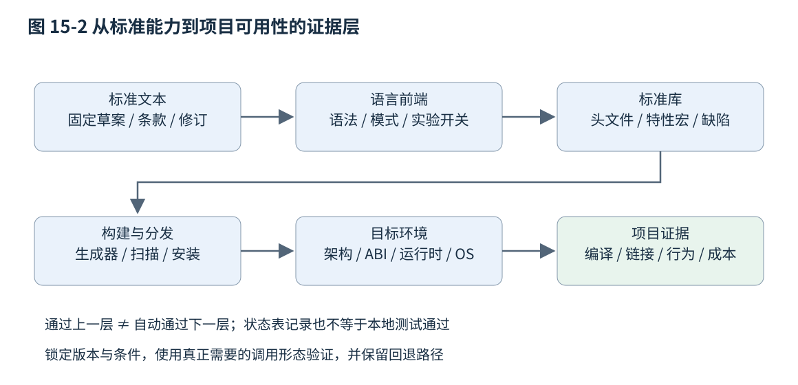

# 第十五章 标准演进与项目迁移

C++ 标准版本描述一组语言和库能力，不替项目回答“现在是否值得升级”。同一家公司可以同时维护受芯片供应商工具链限制的 C++14 固件、以 C++20 为主的服务，以及在内部工具中试用 C++23 的新库。这样的分层可能比统一追求最新版本更合理，前提是边界、依赖与验证责任足够明确。

截至本章核验日 2026-10-03，ISO 官方页面把 ISO/IEC 14882:2024 列为已出版版本，通常称为 C++23，下一版处于 DIS 阶段。WG21 的 N5051 编辑报告把 2026-06-01 的 N5050 说明为 C++26 最终工作草案与 DIS 基础；N5055 已把后续 N5054 标为 C++29 工作草案。本章以 N4861 对照 C++20、N4950 对照 C++23、N5050 对照 C++26 前沿，不用滚动“最新草案”把未来规则回填旧版本。技术内容冻结、编辑审查、会议批准与 ISO 正式出版是不同里程碑。[S1]、[S2]、[S3]、[S4]、[S5]、[S14]

迁移应从具体问题出发：降低所有权错误，改善泛型诊断，减少重复协议代码，还是获得某项库能力。先找到可以验证的收益，再确定最低标准与工具链组合。所有代码和配置片段均未编译、未执行；官网支持状态是带日期的资料核验，不能替代项目环境中的通过证据。

## 15.1 C++11 与 14 的资源 值语义和泛型转折

### 15.1.1 从手工清理转向类型承担责任

C++11 的重要变化不是新增几个缩写，而是让资源所有权与对象传递更容易由类型表达。unique_ptr 表达独占释放责任，shared_ptr 与 weak_ptr 表达特定共享与观察关系，移动语义让不可复制资源可以进入返回值、容器与任务对象。RAII 在更早的 C++ 中已经存在，C++11 扩展了标准工具与可组合性，不应说成“这一版才发明自动析构”。[S2]

旧代码里一个 T* 可能同时承担拥有、观察、可空和数组入口等多种含义。迁移第一步是识别真实责任，而不是把每个裸指针批量替换为 shared_ptr。同步借用仍可用引用或非拥有指针；只有需要共同延长生命时才考虑共享所有权；循环引用和跨线程对象内部同步也不会因 shared_ptr 出现而自动解决。第九章的所有权图比替换规则更有价值。

```cpp
// C++14 独占资源工厂示例，未编译、未执行。
#include <memory>
struct Document {
    explicit Document(int id) : id(id) {}
    int id;
};
std::unique_ptr<Document> make_document(int id) {
    return std::make_unique<Document>(id);
}
```

unique_ptr 在 C++11 已有，make_unique 则是 C++14 的库工具。若最低环境是 C++11，可以在明确的资源封装处采用相应构造方式或经审查的兼容辅助函数，不能不加标注就复制本例。版本差异需要落实到具体接口，而不是在所有权概念上人为划出两套互不相干的知识。

迁移到移动语义后，还应检查特殊成员函数。用户声明析构可能阻止隐式移动，浅复制拥有指针仍可能双重释放，默认移动也可能破坏对象内自引用。第十章说明了这些细节。新标准给出工具，不会猜出旧类作者没有写清的语义。

### 15.1.2 移动改变可表达的对象集合

没有移动机制时，为了进入某些按值接口，程序可能让一个本不应复制的资源包装器伪装成可复制，或者退回裸指针与手工责任约定。移动允许类型明确禁用复制，同时支持转移。一个拥有文件或任务状态的对象可以被交给另一个容器，而不要求制造第二个同等所有者。

这种能力不意味着每次看到 std::move 都会节省成本。const 对象、被删除的重载、移动可能抛出以及分配器关系，都可能改变实际操作。迁移评审应检查“调用方是否真的放弃旧值”“移动后状态是否可用”，再观察分配和复制数量。把全部返回语句改成 return std::move，反而可能妨碍命名返回值优化。

旧版容器接口和第三方库也可能对可复制性有额外要求。一个只移动闭包可以保有 unique_ptr，但不一定能交给要求可复制目标的 std::function。若迁移把回调所有权改成独占，需要同时更新队列、存储和取消接口，而不是只改捕获列表。

### 15.1.3 lambda 把局部行为带入算法

C++11 的 lambda 表达式使短小可调用对象可以在使用点定义，减少只为一次算法调用而建立独立函数对象类型的负担。捕获决定闭包保存值还是借用外部对象，调用签名决定它如何参与泛型接口。lambda 不是一段与生命周期无关的匿名代码，它本身也是对象，携带相应成员与责任。[S2]

C++14 的泛型 lambda 可以用 auto 参数表示一族调用；初始化捕获则可以把一个表达式结果放进闭包，例如转移 unique_ptr。它们提高适配能力，也把模板推导与所有权问题带入回调场景。

```cpp
// C++14 初始化捕获和泛型lambda示例，未编译、未执行。
#include <memory>
#include <utility>

void prepare_callback() {
    auto owner = std::make_unique<int>(7);
    auto read = [data = std::move(owner)] { return *data; };
    auto less_by_key = [](const auto& a, const auto& b) {
        return a.key < b.key;
    };
    (void)read;
    (void)less_by_key;
}
```

read 持有资源责任，离开作用域时会释放；如果把捕获换成引用而把闭包放进异步队列，原局部变量的生命可能不够长。less_by_key 的 auto 参数并不保证所有类型都有 key，错误仍发生在相关模板检查阶段；C++20 的 concepts 可以进一步让条件显式化。新特性之间有连续关系，理解早期机制仍是理解后续版本的基础。

### 15.1.4 constexpr 与并发模型开始进入共同语言

C++11 引入 constexpr，允许一组符合限制的表达式和函数参与常量求值；C++14 放宽函数体等限制，使编译期计算更接近日常程序。两版的差异不能用“加 constexpr 就在编译期运行”概括，具体调用仍受上下文与求值规则约束。第十二章以 C++20 说明后续机制，旧项目应使用其最低版本允许的写法。

C++11 同时建立标准化线程、互斥量、条件变量、原子操作与语言内存模型的重要基础。之前依赖操作系统 API 的项目因此有了更多可移植表达，但切换到 std::thread 并不会自动解决关闭协议、取消、数据竞争或最坏调度延迟。标准内存模型说明程序可以如何推理，操作系统仍决定具体调度与资源行为。

对遗留系统，这些能力往往比更新的语法更先带来收益。可以先把资源清理集中到 RAII、明确不可复制对象、消除无同步共享状态，再考虑大范围泛型或异步框架重写。现代化的次序应服从风险与收益，而不是按版本编号逐项打勾。

### 15.1.5 旧平台也可以采用现代设计

一个供应商只认证特定 C++14 编译器的设备项目，仍能使用值语义、明确所有权、范围检查、组合与可靠测试。不能因为没有 concepts、expected 或标准 span，就把裸数组和模糊返回码视为唯一选择；可以设计有限、明确且经验证的本地接口，同时避免无边界复制整个新标准库。

兼容层应尽量小。为少量需要的能力提供稳定内部名称，可以减少标准切换对业务代码的影响；但若为了模拟新版本而引入复杂宏、不同语义的同名替代和大量分支，维护成本可能超过收益。必须记录替代接口与标准接口的差异，尤其是异常、生命周期和边界检查。

**面试追问：“C++11 对工程最重要的变化是什么？”** 可以从资源可表达性解释：移动与智能指针使独占资源更容易安全组合，lambda 与类型推导改善算法接口，线程和内存模型为并发提供共同语言。回答应把机制连到责任与失败路径，而不只是列关键字。

**面试追问：“项目停在 C++14 就一定落后吗？”** 不能只按版本判断。受验证工具链或长期支持约束时，保持旧标准可能合理；关键是是否仍能控制安全、维护和交付成本，并有明确的升级条件，而不是无限期忽略已知缺陷。

## 15.2 C++17 的值类型与结构化表达

### 15.2.1 让缺失 候选与借用在类型中可见

C++17 的 optional、variant 和 string_view 为常见接口关系提供标准词汇。optional 表达可能缺失的值，variant 表达有限候选中的活动值，string_view 表达非拥有字符范围。它们减少了哨兵值、手写标签 union 和临时字符串的一部分负担，却没有自动确定业务含义或借用期限。[S6]

把“没找到”表示为 optional 可以避免用 −1 占用合法值域，但权限错误与服务故障是否也该变成无值，要看调用方是否需要区分原因。variant 可以让候选集合显式化，但添加候选仍会影响访问器、序列化和状态转换。string_view 避免复制字符，却不保活来源，也不保证零结尾。

```cpp
// C++17 值结果示例，未编译、未执行。
#include <optional>
#include <string_view>

std::optional<unsigned> lookup_level(std::string_view name) {
    if (name == "low") { return 1; }
    if (name == "high") { return 3; }
    return std::nullopt;
}
```

函数只在调用期间读取 name，并不保存视图，返回的是独立 unsigned 值。这个同步边界是它安全使用 string_view 的关键。若把 name 存入全局表以便以后使用，就需要改变所有权策略；升级语言版本不会替程序建立字符存储的生命保证。

### 15.2.2 结构化绑定提升表达 仍需检查复制

结构化绑定为返回多个相关值、遍历键值对和分解简单对象提供名字。它背后仍要按声明形式建立绑定对象，`auto`、`auto&` 与 `const auto&` 的选择可能决定是否复制以及能否修改原对象。不能仅因语法没有写出完整类型，就忽略对象生命与 const。[S6]

```cpp
// C++17 结构化绑定示例，未编译、未执行。
#include <map>
#include <string>

void increment(std::map<std::string, int>& counts) {
    for (auto& [name, count] : counts) {
        (void)name;
        ++count;
    }
}
```

这里按引用分解元素，count 对应容器中的映射值；map 的键仍有其 const 约束。若改成按值 auto 分解，修改的是相应副本，结果可能与作者意图不同。对于 tuple 风格协议与用户定义分解，还需要了解具体 get 与绑定规则。清楚命名能降低阅读负担，但不能抹平语义差异。

if 和 switch 的初始化语句也能缩小临时变量的作用域，使查找结果与分支处理更靠近。这样的改写通常比同时修改数据结构和控制流容易审查，可以作为逐步迁移的小批次。但若原变量在分支后仍被使用，就不是纯文本替换。

### 15.2.3 直接结果构造与 if constexpr 改变泛型写法

C++17 的 prvalue 语义使适用的同类型结果可以直接构造到目标，而不要求一个额外临时对象再复制或移动。这让某些不可复制、不可移动类型也能以相应形式按值返回。命名局部对象的 NRVO 仍然要与这种保证分开，第十章已给出完整条件。[S6]

这项变化支持更自然的值接口，但不能据此把全部返回引用改成值，或声称大对象返回完全无成本。内部数据建立、分配与计算仍然存在；不满足直接构造条件的表达式也要另行分析。迁移中应特别检查为旧编译器添加的过度 move 是否还合理。

if constexpr 让模板实现可以按编译期条件选择适用分支，不再要求每种类型都能实例化所有路径。折叠表达式简化参数包上的重复操作，内联变量帮助组织头文件中的相应实体。这些工具可以减少模板样板，却也可能让接口承担过多变化维度。第十二章把候选约束、实现分支与特化区分开，迁移应保持这种分工。

### 15.2.4 filesystem 与执行策略要带着边界使用

标准 filesystem 为路径与文件系统操作提供共同接口，减少一部分平台封装。路径编码、权限、符号链接、竞态与原子替换仍有平台和文件系统差异。检查文件存在再打开之间可能发生变化，不能因为使用标准库就消除检查与使用之间的竞态。部署还可能需要核实目标运行时与链接要求，不能仅看头文件存在。[S6]

C++17 的算法执行策略允许对部分算法表达顺序、并行或非顺序执行相关意图。它不保证任何规模下都创建多个线程，也不替回调处理共享状态同步。对于标准执行策略，用户函数异常与普通顺序算法调用可能有不同处理要求，需按具体条款核对，不能机械把一个可能抛出的串行回调放进并行接口。

这些执行策略与 C++26 的异步执行控制库不是同一代接口的简单改名。前者主要在既有算法调用中表达执行安排，后者提供 sender、receiver、operation state 等组合原语。它们都可能位于 execution 相关命名空间，却不能由头文件名推断语义相同。

### 15.2.5 小步替换需要检查行为等价

从手写“值＋标志”改成 optional，应确认默认状态、复制移动和序列化布局是否改变；从 char* 加长度改成 string_view，应确认是否需要零结尾、是否保存借用；从类型标签加 void* 改成 variant，应检查候选大小、异常状态和访问器覆盖。每一种替换都对应一组可核查条件，不应只追求代码行数减少。

一个有效迁移批次可以只替换内部同步只读字符串入口，同时保留外部 ABI；另一个批次再整理缺失值类型。把字符串视图、错误处理、线程模型和构建系统一次性改完，会让回归难以定位，也让回滚范围变大。

**面试追问：“C++17 最适合先迁移哪些部分？”** 优先选择能明确减少错误且边界有限的关系表达，例如独立结果、缺失值和受控同步借用。具体次序由现有缺陷、支持工具链和测试覆盖决定，不能固定成“先把所有循环改成结构化绑定”。

**面试追问：“切换 C++17 后是否可以删除所有移动构造？”** 不可以。保证直接结果构造只覆盖相应场景，容器迁移、赋值和其他参数传递仍可能需要移动。应逐项分析操作需要，而不是把一项返回语义变化泛化为整个类型系统变化。

## 15.3 C++20 与 23 的 Concepts Ranges Modules Coroutine 及库演进

### 15.3.1 Concepts 与 Ranges 把泛型关系放到接口上

C++20 的 concepts 与约束使模板接口能说明可用操作，ranges 将范围、迭代器、哨兵和算法要求更加系统地连接起来。它们可以改善错误位置，也能让算法直接接收范围和投影。真正的迁移价值是减少实现中未声明的假设，而不只是用管道符替换循环。[S2]

```cpp
// C++20 范围算法示例，未编译、未执行。
#include <algorithm>
#include <string>
#include <vector>
struct Item { std::string name; int priority; };
void order_items(std::vector<Item>& items) {
    std::ranges::sort(items, {}, &Item::priority);
}
```

投影把“按哪个字段比较”与排序机制分开。本例仍要求数据与比较关系满足排序前提，仍可能因为交换、移动或比较而产生相应成本，也没有承诺同优先级元素保持原顺序。若业务需要稳定排序，应选取符合版本和库支持的相应接口，而不是认为 ranges 前缀增加了所有语义保证。

视图通常惰性组合，求值时机可能从创建流水线推迟到遍历。迁移后若转换函数有副作用，重复遍历次数或过滤调用次数改变，业务结果就可能变化。view 也不是“全部不拥有”或“全部保活”的统一标签；来源寿命、borrowed_range 与适配器存储规则需要逐项分析。第十三章对此有完整展开。

### 15.3.2 Modules 改变构建依赖 不能只替换 include

C++20 模块提供以模块单元组织声明与可达性的机制，可以减轻文本包含与宏泄露的一部分问题。模块接口、实现单元、分区和头文件单元具有不同角色；命名模块也不等于把现有头文件改一个扩展名再统一 import。[S2]

构建系统需要知道哪些源文件提供模块、哪些源文件导入模块，以及构建顺序和模块制品位置。传统“所有源文件可以任意并行编译”的假设在这里需要依赖扫描补充。宏配置、预编译头、统一构建和生成代码可能与模块工作流相互影响。

模块制品通常与具体编译器、版本、目标和选项相关，不应当作跨工具链通用的稳定二进制头文件。分发源码接口、分发构建后的模块接口制品（常称 BMI），以及分发普通目标库，是不同交付方式。一个模块在作者电脑上可以 import，不表示包管理、安装导出和下游构建都已经可用。

2026-10-03 核验的 CMake 官方模块手册仍列有生成器和工具链条件，并注明头文件单元支持限制；import std 还具有独立支持条件与配置门槛。因此“编译器支持 C++20 modules”与“项目的 CMake、生成器、包与标准库模块组合能交付”必须分别验证。[S12]

C++23 标准库模块 std 与 std.compat 又是另一项库演进，不能因为语言模块属于 C++20，就认定任何 C++20 环境都提供 import std。迁移可以先对一个边界清楚的内部库试点，保留对外头文件兼容路径，再检验清洁构建、增量构建、安装和消费项目。

### 15.3.3 Coroutine 提供暂停机制 不替代调度系统

C++20 协程让函数通过 co_await、co_yield 与 co_return 参与可暂停、恢复的执行模型。编译器与 promise/awaiter 协议协作保存必要状态，协程帧承担跨暂停点的生命。它不自动创建线程，也不内置一个适合所有网络或 GUI 应用的调度器。[S2]

把回调代码改写成协程，可以让顺序依赖更接近普通控制流，但并不会取消异步所有权问题。引用参数、捕获对象和 this 是否覆盖最后一次恢复，取消后谁销毁帧，完成通知在哪个线程发生，都需要明确协议。第十九章会从帧、调度和取消继续分析。

C++23 的 generator 提供同步生成器相关库能力，使一部分迭代式产出不再需要项目手写完整协程返回类型。它不因此成为通用异步任务或网络执行器。语言协程、同步序列生成和异步调度是不同层，迁移文档应分别记录依赖与支持状况。[S3]

对长期运行服务，协程改写还需验证尾延迟、帧分配、取消收敛、错误传播和关闭时在途任务数量。只展示源码从十个回调缩成一个函数，不足以证明系统更可靠；状态仍然存在，只是由不同机制保存。

### 15.3.4 C++20 的库能力解决具体工程关系

span 把连续元素的地址与长度放到同一非拥有描述中，jthread 与 stop_token 提供线程退出与协作停止相关工具，atomic wait/notify 以及 latch、barrier、semaphore 等扩展同步表达。每一项都应与实际协议配合使用：span 不保活，停止请求不强制中断，notify 不等于条件已经成立。[S2]

format 带来结构化格式化接口，但可用性既受标准库实现影响，也受相关功能和缺陷修订覆盖影响。把日志改成某个现代格式化 API，还需要检查分配、异常、线程安全、敏感字段和异步缓冲生命。选择标准库能力能减少重复基础设施，却不省略运维契约。

C++20 还扩展了常量求值、比较、源位置和日历时间等能力。项目不必一次性启用所有新习惯，可以挑选最有价值的一组。把最低标准设为20只是允许这些机制进入代码，团队仍需对何时使用、公开接口允许哪些类型以及支持哪些平台给出具体约定。

### 15.3.5 C++23 增量能力与旧接口兼容

C++23 的 expected 把成功值与错误值组合成显式结果，print 提供格式化输出接口，mdspan 表达多维数据视图，ranges 增加一批适配和构造能力，显式对象参数改善某些成员函数的泛型表达。这些不是一个必须捆绑使用的包，项目可以按独立收益逐项采纳。[S3]

mdspan 的多维形状、布局映射与访问器有助于描述矩阵或张量存储，但它默认不替调用方拥有数据，也不自动把算法搬到 GPU；动态维度、步长与生命周期仍需检查。expected 不保证整个函数不抛，print 不等于完整日志系统，显式对象参数也不意味着所有成员函数都应重写。每项工具都应守住其职责。

从旧 `Result<T>` 迁移到 expected 时，需要对照成功状态、错误类型、访问失败、移动后状态和组合操作；如果旧类型与标准类型语义不同，可以在边界转换，而不是直接给它们起同一个别名。对公共 ABI，改变返回对象布局可能要求所有客户端重编译或进行版本化。

```cpp
// C++23 特性检测片段，未编译、未执行。
#include <version>
#if !defined(__cpp_lib_expected) || __cpp_lib_expected < 202211L
#error "This component requires expected with the C++23 monadic interface"
#endif
#include <expected>
```

这里检测需要的库能力等级，仍不等于完成库质量验证。头文件存在也不证明所有成员可用；特性宏符合要求也不能覆盖工具链已知缺陷或目标链接问题。应增加针对实际调用形态的编译、链接与行为测试，并把这些结果与官方状态表分开保存。

### 15.3.6 语言前端与标准库需要分别核验

Clang 可以与不同标准库组合，GCC 的前端与 libstdc++ 的版本也不应仅凭命令名推断，MSVC 工具集与 STL 更新同样需要核对。支持 concepts 的编译器，不一定配有项目需要的 expected、print、generator 或模块标准库制品。编译命令接受某个标准选项，最多证明接受该模式，不证明整个标准完成。[S7]、[S8]、[S9]、[S10]、[S11]

例如，2026-10-03 的 libc++ C++23 官方状态表把 expected 的组合操作提案列为已完成并标注版本17，同时还单独记录后续缺陷项。这个记录说明某项库能力的官方实现进度，不能转化为“所有使用 Clang17 的系统都可直接使用”，因为实际链接的可能是另一套标准库，或者使用了不同部署环境。[S10]

**面试追问：“C++20 的四大特性应该同时迁移吗？”** 没有必要。concepts/ranges主要影响泛型接口，modules影响构建与交付，coroutine影响异步生命与调度。它们有不同风险与验证方法，通常应分批试点，避免故障来源相互掩盖。

**面试追问：“为什么有 C++23 编译选项还找不到 expected？”** 先核对实际标准库、版本、头文件搜索路径、模式与特性宏，再看所需成员是否实现。前端与库支持是不同层，不能仅凭编译器品牌或IDE版本推断。

## 15.4 C++26 草案特性 工具链成熟度与迁移策略

### 15.4.1 先固定标准文本 再讨论特性

C++26 处于怎样的标准化阶段，应由 ISO 状态与 WG21 编辑报告共同解释。N5051 说明 N5050 是 DIS 的基础；N5055 又明确后续 N5054 为 C++29 草案，并记录 N5050 没有在某次 WG21 会议上单独获批，而上一已批准工作草案为 N5046。这里没有矛盾：编辑修订、DIS 文本准备与会议工作草案批准是不同程序动作。[S4]、[S5]、[S14]

因此，本文使用“以 N5050 为锚点的 C++26 草案”，不把它说成已经正式出版的 ISO/IEC14882:2026。读者未来看到正式出版或新的缺陷修订，应检查它们与本章锚点的差异，而不是只把页面里的年份改大。

提案编号也有版本。一个 PxxxxR0 的演示语法，可能在 R13 或最终纳入草案时已经改变；被委员会接受的设计方向，未必与某个实验分支的接口完全相同。应记录最终进入固定草案的条款，再把原提案用于解释背景。用搜索结果里最早的一篇教程作为新标准实现依据，风险尤其高。



图 15-1 本书的标准阅读锚点。时间线表示能力演进，不表示所有平台在该年份已经支持相应特性。

### 15.4.2 Reflection 与 Contracts 应从用途理解

N5050 纳入静态反射相关语言与库机制，包括 `<meta>`、反射信息与查询、拼接以及相关编译期生成能力。它有机会减少枚举名称映射、字段遍历和一部分重复适配代码。反射主要让程序在编译期取得语言实体相关信息，不等同于为任意运行时对象自动增加可变类型系统。[S4]

自动生成序列化代码尤其需要业务边界。能枚举字段，不表示字段都应该公开；能得到名称，不表示该名称是长期稳定协议；重排成员或改名也不应自动改变外部 Schema。采用反射时，应显式规定字段选择、版本号、权限、缺省值和兼容规则，避免把源码结构直接暴露成公共数据格式。

N5050 的契约机制可表达前置条件、后置条件和断言，并规定 ignore、observe、enforce、quick-enforce 等求值语义。具体使用哪一种有实现定义部分，不能假定“写了契约就一定进行检查”，也不能把违反契约自动等同于一个可恢复业务异常。第十四章的外部输入验证仍需保留。[S4]

契约中的检查表达式不应承担不可缺失的业务副作用，团队也需要统一检查策略、违反处理和生产配置。跨库若对检查启用方式理解不同，观察到的行为可能不同。更重要的是，契约表达了预期关系，不能凭语法证明所有调用者都满足关系或所有代码都内存安全。

### 15.4.3 执行控制 标准 SIMD 与固定容量容器

N5050 的执行控制库提供 sender、receiver、scheduler、operation state 以及完成通道等组合基础。它把值完成、错误完成与停止等关系纳入异步表达，有助于组织不同执行环境之间的工作。它不是把所有操作强制放进一个统一线程池，也不是一个命令即可替换现有网络框架的完整应用运行时。[S4]

迁移现有异步系统时，先映射任务何时启动、执行位置、完成线程、取消语义、在途对象生命和背压，再比较接口是否更清楚。第十九章讲的协程帧与结构化关闭仍然需要；执行控制库不会自动证明一个捕获了悬空引用的任务安全。C++17 的并行算法执行策略也不能当作这套接口的旧名字。

标准 SIMD 相关数据并行能力在 N5050 的 `[simd]` 中描述，可以表达对多个元素进行成组运算。特别需要注意，N5050 的组织使用 std::simd 命名空间及 basic_vec/basic_mask 等实体，早期 `std::experimental::simd` 或其他提案阶段接口不能直接冒充最终锚点语法。实际可用类型、ABI标签与目标指令集条件仍需按实现核验。[S4]

数据并行抽象不保证任何循环都会更快。数据布局、内存带宽、对齐、尾部元素、分支与数值误差都可能决定收益。应保留标量参照与多目标测试，并明确浮点归约或近似操作是否允许改变结果。第四十三章与第四十四章会把并行计算和硬件证据分开讨论。

inplace_vector 在固定对象容量内管理可变数量元素，元素存储位于容器对象内部；它适合明确有上限又希望避免容器自身动态扩容的一类场景。它不是 std::array 的别名，也不是永不失败的 vector：容量耗尽、元素构造抛出和对象移动仍有相应规则。若元素自身分配动态资源，外层固定容量也不能保证整条路径零分配。[S4]

### 15.4.4 库强化与安全回收有各自边界

N5050 为一批库操作引入 hardened preconditions 等规范表达。在强化实现中，适用的强化前置条件通过规定的终止性检查语义处理；非强化实现下违反相应前提仍可能是未定义行为。它提高部分错误的可诊断性，却不把所有容器访问都变成可恢复的越界异常，也不取代对象生命和线程同步规则。[S4]

安全回收库包含 hazard pointer 与 RCU 相关能力，针对访问与删除竞争提供标准化工具。对象从共享结构摘除，不代表所有读者已经停止访问；这些机制帮助安排何时真正回收，但不自动证明数据结构线性化、内存序、关闭协议或业务不变量正确。第十八章必须连同进展保证与回收成本一起阅读。

另一个容易被旧资料误导的变化是 memory_order::consume。N5050 的弃用条款 `[depr.atomics.order]` 将它保留为弃用枚举，并规定它在允许 acquire 的位置使用且具有相同含义。不能继续把 C++26 consume 教成独立的依赖排序语义，也不能说它把保证变弱；实际迁移更适合清楚表达 acquire 意图，并核实目标编译器已实现哪一版规则。[S4]

新标准还包含其他语言与库改进，本节选取与本书工程主题关系最紧密的能力。采用某项能力前，应查完整条款、已知缺陷与实现支持，不能把这几段概览当作替代规范的接口手册。

### 15.4.5 带日期的官方支持记录怎样解读

下表是 2026-10-03 实际查看官方页面得到的少量示例，目的在于展示支持状态的粒度。它不是对任意安装环境的验收，也不是整个标准的完整支持矩阵。页面可能包含开发中或未来发布分支的版本号，不能把表中出现某个版本号等同于该版本已在项目里可部署。

| 核验对象 | 官方页面当日记录 | 对项目意味着什么 |
|---|---|---|
| GCC 的 C++26 Reflection 主提案 | 标注 GCC16，另需 `-freflection`；后续修订另列未完成细节 | 不能仅加标准模式；需锁定修订与开关 [S7] |
| GCC 的 C++26 Contracts 主提案 | 标注 GCC16；页面整体提醒 C++26 支持仍属实验性 | 功能存在不等于稳定兼容承诺 [S7] |
| Clang 的上述 Reflection 与 Contracts 主提案 | 两项均标为 No | 不能把第三方实验分支等同上游支持 [S8] |
| libc++ 的 expected 组合操作 | 标为 Complete，版本17 | 只说明该库条目，仍需核对实际库与缺陷修订 [S10] |
| libc++ 的执行控制主提案、RCU与hazard pointer条目 | 状态或版本栏尚未给出完成标记 | 不能宣称已完成；需查看各条目和实际发行说明 [S11] |

MSVC 官方一致性页面分别组织语言与库支持，并链接 STL 的 C++23、C++26功能跟踪。对 Windows 项目，应以具体工具集与 STL 发行记录逐项核验，不能把其他编译器的支持状态挪用过去。本章没有为没有逐项核验的 MSVC 前沿特性填入推测版本。[S9]

状态表的“完整”也需要读脚注：有时主提案完成，而后续缺陷修订尚未全部覆盖；有时只对某目标可用；有时需要特定选项或运行时库。比较工具链时，应对照自己真正使用的那一小组功能，而不是把不同项目的勾选数相加当成质量排名。

### 15.4.6 支持矩阵至少跨越七个维度

项目证据应同时记录语言前端、标准库、标准模式与扩展选项、构建生成器、目标架构、ABI与运行时、操作系统或平台。再加上关键依赖和相关缺陷修订，才能形成可以复现的环境描述。开发机上的成功不自动覆盖交叉编译、旧系统部署或插件用户。



图 15-2 从规范能力到项目可用性的证据层。各层都应记录版本、条件和真实测试结果。

一个稳妥的特性探测应编译实际使用的调用形式，必要时链接并在目标环境运行，而不只判断某个头文件存在。交叉编译时不能把主机运行结果当作目标结果；需要在目标设备、仿真环境或经认可的测试设施中验证。对模块，还要测试安装后的独立消费项目与增量依赖变化。

特性宏能减少品牌硬编码，却不能代替缺陷规避表。若某编译器宣布支持但存在影响项目的已知错误，应把最小复现、受影响版本和替代路径记录在兼容层；修复版本验证通过后删除绕行。无期限保留猜测性的 `#ifdef` 分支，会逐渐把代码库变成无人能验证的组合系统。

### 15.4.7 一个受约束项目的迁移决策

考虑一个教学场景：设备端受供应商认证工具链限制在 C++14，桌面采集程序可升级，公共插件接口仍由外部团队维护。主要问题是资源泄漏、解析错误定位不足和大量重复模板诊断。这个场景没有测量数据，以下是决策过程示例，而不是对某个真实项目已完成的改造记录。

设备端先在既有标准内修正资源所有权与退出路径，保持认证边界；桌面程序以 C++20 为候选基线，优先引入受控 span、约束接口和明确关闭协议；解析模块若确实需要 expected，可在已验证的 C++23 环境中试点，但不要把新标准库对象直接扩散到外部插件 ABI。公共边界可继续采用稳定数据和结果约定。

这种分层不意味着任意混编都安全。共享头文件、内联函数、类型布局和模板定义必须保持单一定义与 ABI 条件；如果不同标准模式改变了相同公开实体的定义，链接成功也不能证明正确。最好通过明确组件边界隔离差异，并在支持矩阵中写清哪些组件可独立升级、哪些必须一起重编译。

modules 可以作为另一个独立试点，因为它主要针对构建成本和依赖组织，未必解决当前最昂贵的缺陷。C++26 反射如果仅服务于内部代码生成，可以先研究生成结果与协议稳定性，暂不要求生产代码直接依赖实验前端。是否进入主线，取决于收益、支持环境和回退成本。

### 15.4.8 迁移应有入口条件 验收与回退

开始迁移前，先保存一个可重建的基线：工具链与依赖版本、构建选项、测试结果、性能负载、制品和部署条件。然后把“升级标准模式”和“采用新接口”尽量拆开。前者可以暴露新诊断、已弃用接口和规则变化，后者会改变设计与行为；分开能更容易定位回归。

每个批次需要明确验收证据。所有权改写检查析构与异常路径，视图改写检查借用期限，ranges 改写检查求值次数与迭代失效，协程改写检查取消与关闭，模块改写检查干净构建、增量构建、安装和下游消费。构建速度、二进制大小、启动时间与尾延迟应采用可比较负载，不能凭主观感觉说“新版更快”。

回退也要有真实条件。若只改标准选项却没有改变持久化格式，回退可能相对简单；若反射生成的字段名已经进入外部协议，或新错误码已经被客户端保存，就需要兼容迁移而不是简单回滚提交。发布策略应把代码版本、数据版本和客户端能力分开。

最后，旧兼容路径何时删除应有条件，例如全部支持目标达到最低工具链、替代实现经过代表负载验证、外部消费者完成升级。永远保留两套实现会增加测试矩阵；过早删除则可能把用户赶出支持范围。标准演进真正成熟的使用方式，是让每项新能力承担一项具体工程责任，并有证据证明它做到了。

**面试追问：“C++26 已经完成技术工作，是否可以直接全项目切换？”** 不能只凭这一事实决定。还要区分 ISO 出版、固定草案、前端实现、库与构建支持，以及目标平台的质量证据。可在受控范围试点，对长期 ABI 或认证项目则应按其约束安排。

**面试追问：“你怎样向团队提出升级建议？”** 先说要解决的问题和可验证收益，再给出最低能力集、环境矩阵、分批方案、行为与性能验收以及回退边界。标准版本是方案的一部分，不是论证本身。

## 来源与阅读边界

资料核验日期为 2026-10-03。下列官方状态页面会继续更新，表中记录仅代表当日可见资料；没有把状态表当作本项目测试结果。正文、说明代码和插图为原创组织。

- S1：ISO/IEC14882:2024 官方状态页，已出版版与下一版 DIS 状态
- S2：WG21 N4861，C++20 固定公开规范参照；前文资源、泛型与库机制按此基线交叉核对
- S3：WG21 N4950，C++23 固定最终工作草案参照；`[expected]`、`[mdspan]`、`[print]`、`[coro.generator]`、库模块与特性宏
- S4：N5050 固定 C++26 草案，重点 `[meta.reflection]`、`[basic.contract]`、`[exec]`、`[simd]`、`[inplace.vector]`、`[saferecl]`、`[depr.atomics.order]`
- S5：N5055 编辑报告，标明 N5054 已属 C++29，说明工作草案会议批准与编辑版本关系
- S6：WG21 N4659，C++17 固定草案，用于值类型、结构化绑定、复制消除、filesystem与执行策略
- S7—S11：GCC、Clang、Microsoft、libc++ 官方语言与库支持记录；libstdc++ 另见其官方状态页 [S13]
- S12：CMake 官方 C++ modules 手册，具体工具链、生成器和标准库模块条件；应对照项目锁定的 CMake 版本阅读
- S14、S15：N5051 与 N4951 编辑报告，分别核验 C++26 与 C++23 固定工作草案身份

[S1]: https://www.iso.org/standard/83626.html
[S2]: https://www.open-std.org/jtc1/sc22/wg21/docs/papers/2020/n4861.pdf
[S3]: https://www.open-std.org/jtc1/sc22/wg21/docs/papers/2023/n4950.pdf
[S4]: https://www.open-std.org/jtc1/sc22/wg21/docs/papers/2026/n5050.pdf
[S5]: https://www.open-std.org/jtc1/sc22/wg21/docs/papers/2026/n5055.html
[S6]: https://www.open-std.org/jtc1/sc22/wg21/docs/papers/2017/n4659.pdf
[S7]: https://gcc.gnu.org/projects/cxx-status.html
[S8]: https://clang.llvm.org/cxx_status.html
[S9]: https://learn.microsoft.com/en-us/cpp/overview/visual-cpp-language-conformance?view=msvc-170
[S10]: https://libcxx.llvm.org/Status/Cxx23.html
[S11]: https://libcxx.llvm.org/Status/Cxx26.html
[S12]: https://cmake.org/cmake/help/latest/manual/cmake-cxxmodules.7.html
[S13]: https://gcc.gnu.org/onlinedocs/libstdc++/manual/status.html
[S14]: https://www.open-std.org/jtc1/sc22/wg21/docs/papers/2026/n5051.html
[S15]: https://www.open-std.org/jtc1/sc22/wg21/docs/papers/2023/n4951.html
