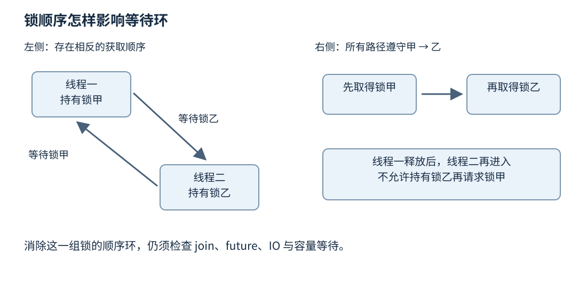
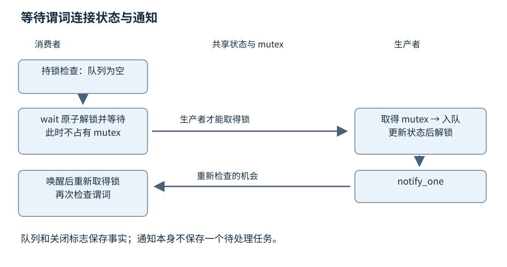
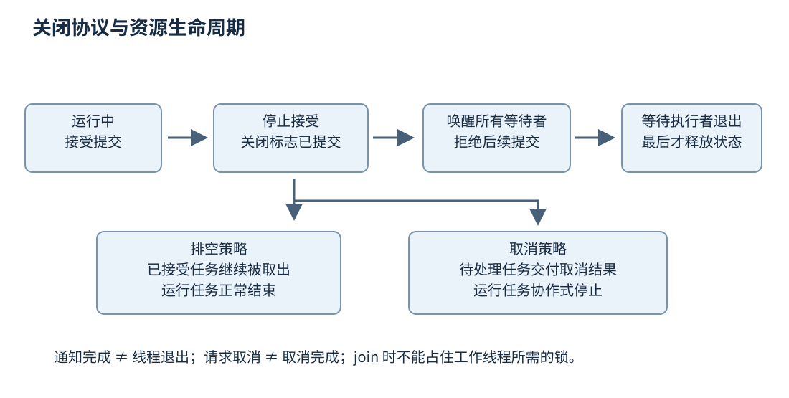

# 第十六章 同步原语与线程组织

**同步**是对多个执行者访问状态、取得资源和继续执行的条件作出约束。它首先解决正确性问题：谁可以修改数据，读者什么时候能依赖结果，对象什么时候可以销毁。线程只是执行工作的一种载体；创建更多线程，并没有回答这些问题。

一个后台服务通常同时包含几种等待。工作线程等待队列中出现任务，调用者等待任务结果，关闭流程等待工作线程退出，生产者可能等待队列腾出空间。这些等待的对象、唤醒条件和失败后果不同。把它们都写成“循环检查一个布尔值”，容易得到空转、丢失唤醒或无法关闭的系统。

本章以 C++20 为主线。语言与标准库规则使用固定草案 N4861，工程建议与实现接口分别标注来源。代码均为解释协议的教学片段，未编译、未执行；它们没有经过压力测试、故障注入或生产审计。对同步的解释先建立状态和生命周期，再选择 mutex、condition_variable、semaphore、future 等工具。[S1]

## 16.1 Thread Mutex RWLock 与死锁

### 16.1.1 线程执行任务 任务不等于线程

**线程**是具有自身执行序列的执行实体；**任务**是应用定义的一段工作，例如解析一份文件或计算一个分片。一个线程可以依次执行许多任务，一个任务也可以拆分到多个线程。任务数量反映业务工作量，线程数量反映允许多少执行者同时占用调度与运行资源，两者不应被机械地设为相等。

`std::thread` 对象管理一个线程关联，不代表线程的所有输入都自动归它所有。以值捕获的普通对象通常进入可调用对象自己的存储；以引用捕获的变量仍由原所有者负责。把局部字符串的引用交给后台线程后立即返回，问题首先是生命周期不够长，尚未轮到讨论锁是否正确。第九章的借用规则在这里继续成立。

线程启动、运行结束和线程对象销毁是三个事件。成功 `join()` 等到被代表的线程结束，并提供标准规定的同步关系；它不会自动修复线程运行期间的非法并发访问。对一个仍可连接的 `std::thread` 直接析构会调用 `std::terminate`，因此异常路径也必须有明确的收尾方案。`detach()` 只是切断线程对象对线程的连接责任，不会延长线程借用的对象生命周期，也不会提供以后重新等待它的通用入口。[S1]

C++20 的 `std::jthread` 把请求停止与自动连接结合起来。若析构时仍可连接，析构流程请求停止并连接线程。但停止是协作式请求：线程函数需要检查 `stop_token`，或者使用能响应它的等待操作。一个永远卡在外部阻塞调用中的线程，不会因为外层换成 `jthread` 就自动退出。自动连接减少遗漏，并不意味着析构一定快速或不会阻塞。[S1]、[S2]

停止令牌也不会自动唤醒普通 `condition_variable::wait`。C++20 提供接收 stop_token 的是 `condition_variable_any` 的相应等待重载；否则必须另行设计受锁保护的退出状态与通知。尤其不能仅在停止回调里调用普通条件变量的 notify，却让停止状态变化绕过检查与入睡之间的锁协议。通知若落在这个空隙，线程仍可能睡下，使 jthread 析构一直等待。第 16.2 节会展开这个空隙的来源。

任务设计应把输入、结果和执行者拆开考虑。例如，图像解码任务拥有一份输入缓冲，结果放入共享结果状态，线程池只负责取得任务并调用它。即使以后把执行方式改成异步 IO 加协程，输入所有权与结果责任仍然可以保留。相反，让每个任务随意创建分离线程，会把容量限制、取消和退出责任散落到整个程序。

### 16.1.2 互斥量保护的是不变量

**互斥量**允许同一时刻至多一个执行者持有某种独占访问资格。**临界区**是在这项资格下访问受保护状态的代码区间。它保护的对象通常不只是一个字段，而是一组必须共同成立的不变量。

设库存对象有 `available` 和 `reserved` 两个数量，业务要求它们非负，且两者之和等于当前批次总量。预订一次需要检查 `available`，再减少它并增加 `reserved`。如果只分别保护两次写入，其他线程可能在中间看到一个不满足关系的状态；如果检查不在同一临界区内，两个预订者还可能都认为最后一件库存可用。需要保护的是“检查并改变状态”的整个事务。

锁协议至少写清三件事：哪些字段由哪把锁保护，调用者进入函数前是否已经持锁，函数返回后交出的对象还能否被其他线程修改。一个成员函数内部加锁，只能保护这一次调用。调用者先调用 `empty()`，再调用 `pop()`，两次之间仍可能被其他线程改变状态。需要原子完成的业务动作，应作为同一个受保护操作提供。

锁也建立线程之间的可见性关系。对同一 mutex 的解锁与随后成功取得所有权的锁定之间存在标准定义的同步，使前一临界区内的相应操作能被后一临界区正确观察。不能把 mutex 简化为一个只负责“排队”的布尔值；自己用普通变量模拟锁，既缺少可靠排他性，也没有因此获得同步保证。[S1]

只读访问同样要遵守协议。如果写者持锁而读者不持锁，通常并不构成正确的互斥保护。读者写着 `const`，或者只读取一个机器字，也不使它自动脱离数据竞争规则。另一种合法设计是发布不可变快照，让读者持有一份稳定对象；那需要另外证明发布与回收机制，而不是悄悄省去读锁。

### 16.1.3 RAII 让锁的释放路径与作用域一致

`std::lock_guard`、`std::unique_lock` 和 `std::scoped_lock` 都能用对象生命周期表达锁的持有区间。RAII 的直接价值是正常返回、提前返回和异常退出都经过同一析构路径，减少手工配对 `lock()` 与 `unlock()` 的遗漏。[S3]

`lock_guard` 适合简单、不可中途改变的持锁区间。`unique_lock` 可以延后加锁、显式解锁和重新加锁，并把锁所有权交给需要操作它的等待接口。`scoped_lock` 能同时管理多把锁，配合标准库的多锁获取算法避免某些加锁顺序死锁；它不负责识别业务上所有等待依赖。

```cpp
// C++20 教学片段，未编译、未执行。
// 前提：所有对 value 的访问都遵守同一个 mutex 协议。
#include <mutex>

struct Counter {
    std::mutex mutex;
    int value = 0;

    void add_one() {
        std::lock_guard<std::mutex> guard(mutex);
        ++value; // 例中另行约束 value 不会溢出。
    }

    int snapshot() {
        std::lock_guard<std::mutex> guard(mutex);
        return value;
    }
};
```

这个例子的返回值是独立整数，因此离开临界区后仍可使用。若返回的是内部容器元素的引用，解锁以后其他线程可能修改或删除该元素。局部锁守卫只覆盖当前作用域，并不为返回的借用附带后续保护。设计接口时，可以返回副本、受控快照，或者把回调限制在持锁区间，但最后一种方案又必须审视回调是否会阻塞或重入。

临界区应该足够覆盖不变量，也应避免无必要的慢操作。可以先在锁外准备一个候选结果，再持锁检查版本并提交；也可以先在锁内取走一个独立任务，再在锁外执行任务。这里“缩短锁区间”需要保留重新验证步骤，否则准备期间状态可能已经改变。

特别要警惕持锁调用未知代码。用户回调可能再次调用当前对象，日志接口可能取得另一把锁，内存分配器和对象析构也可能进入其他同步路径。不能只看函数名短就假设它不会阻塞。好的接口把“修改受保护状态”与“通知外部世界”分成可解释的阶段，并明确阶段间允许什么变化。

### 16.1.4 读写锁用更复杂的协议换取并行读取

**读写锁**允许多个读者同时持有共享访问资格，而写者需要独占资格。C++ 的 `std::shared_mutex`、`std::shared_lock` 等工具表达这一类协议。适用前提是共享持有者确实不修改受保护状态，并且所有写入都服从独占访问规则。[S1]

“读取比例高”只是起点，不足以证明读写锁更快。一次共享加锁也可能修改锁的内部计数，许多核心同时读一个非常短的临界区时，锁本身会成为共享写热点。若普通 mutex 已经便宜，换成更复杂的读写锁反而可能增大开销。读临界区长度、竞争程度、实现公平策略和写入突发，都要进入比较。

不能从标准接口推导固定的公平性。某个实现可能偏向等待写者，也可能采用其他策略；标准没有为所有 shared_mutex 使用场景承诺线程按到达顺序取得锁。写者长期等待时，应核查实现与工作负载，不能只依据“读者很快”来排除饥饿风险。

从共享锁升级成独占锁也不是普通 shared_mutex 提供的原子操作。若先释放共享锁再取得独占锁，两步之间状态可能变化，必须重新检查。若在继续持有共享锁时直接请求同一对象的独占锁，则不能把它当成合法升级技巧。需要升级语义时，应使用有明确契约的专门设施，或者重新组织状态更新。

一个常见工程选择是读者取得不可变配置快照，写者构造新版本后整体发布。这样可能减少读写锁竞争，却把成本转移到快照复制、发布与旧版本回收。第十八章讨论的回收机制正是为这些后续责任服务。任何一种方案都要同时回答“读到哪一版”和“旧版活到什么时候”。

### 16.1.5 死锁是等待关系中的环

**死锁**指一组执行者彼此等待某些只有组内执行者继续前进才能满足的条件，导致这组执行者无法继续。最容易观察的形式是两把锁：线程甲持有账户锁 A，等待账户锁 B；线程乙持有 B，等待 A。任何一方都没有机会释放对方需要的锁。

预防这一类问题，可以为锁建立全局顺序，例如总按稳定账户标识从小到大取得锁。关键是所有路径都采用同一规则，包括异常恢复、查询、迁移与删除路径。仅在一次转账函数里排序，而日志回调里反向获取，仍然可能形成环。对象地址作为顺序键还需要有合法且稳定的排序方式，不能不加审查地比较无关对象的裸指针。

标准库提供的 `std::lock` 和多锁 `scoped_lock` 适合同时取得一组互斥量，但前提包括这些锁对象满足要求，且不能把同一把非递归 mutex 当成两把不同的锁传入。转账接口首先处理源账户与目标账户相同的情况，是业务校验，也能避免这一错误。[S1]



图 16-1 等待环与统一锁顺序。图示只证明这组锁的顺序关系，不证明整个程序没有其他等待环。

死锁还可以没有互斥量。容量为四的线程池里，四个工作线程各运行一个父任务，每个父任务提交子任务后调用 `future.get()`。如果子任务也必须在同一线程池执行，所有执行席位都被等待的父任务占住，队列里即使有可运行任务也没有线程执行。这是资源依赖导致的线程池饥饿死锁，单纯“把锁缩短”无法解决。

另一种退出死锁是主线程持有服务锁等待工作线程 `join()`，工作线程结束前需要这把锁写入最后状态。解决方向是先在锁内改变关闭状态，释放锁并唤醒线程，再连接线程；连接完成以后才能回收共享状态。不能在等待别人的时候占住对方完成所必需的资源。

### 16.1.6 从卡住现场还原等待图

诊断卡住不能只问“哪一行在等待”。应记录每个线程当前等待什么、已经持有什么、谁有责任满足它等待的条件。锁等待、队列等待、结果等待、网络调用和线程连接要放进同一张依赖图。多个相隔一段时间的堆栈快照有助于区分固定循环等待与缓慢但仍在前进的操作。

如果一个线程停在条件变量上，它可能正在正常空闲；若队列里已经有任务，却没有任何工作线程能取得任务，才需要进一步检查谓词、通知和锁。如果全部线程都在等待远端，问题可能是外部延迟与容量设计。如果一个线程持续消耗 CPU 却不完成工作，则可能是活锁或重试风暴，而非经典死锁。

高级面试常问：“使用递归锁是否可以解决死锁？”递归锁只允许同一线程按契约重复取得同一把锁，不能消除跨线程、跨锁或跨任务的等待环。它还可能掩盖重入发生时对象不变量尚未恢复的问题。应先解释为什么会重入、重入能看到什么状态，再决定这种访问是否本来就应该发生。

进一步追问“有超时就没有死锁了吗”，答案也是否定的。超时可以让某条等待路径有机会退出，但退出必须能正确撤销已持有资源、传播失败并避免立即重复形成同一环。所有线程同时超时、同时重试，可能把死锁转成活锁；业务操作部分完成后简单重来，还可能重复扣减或重复发送。

## 16.2 Condition Variable Semaphore 与等待谓词

### 16.2.1 条件变量等待状态改变的机会

**条件变量**是一种使线程在条件暂时不满足时阻塞、在收到通知后重新检查状态的设施。它不是条件本身，也不是一个自动记住所有通知次数的消息队列。真正的条件保存在应用状态里，例如“队列非空或者服务已关闭”。[S1]

**等待谓词**是对受保护状态进行检查的布尔表达式。它必须准确描述线程何时能够继续，包含正常工作与终止路径。消费者只等待 `!queue.empty()`，关闭时即使被唤醒，发现队列仍空又睡回去，便可能永远无法退出。把 `closed` 纳入谓词，才使关闭事件成为协议的一部分。

典型协议是：等待者先取得 mutex，检查谓词；若不满足，调用条件变量等待，原子地释放 mutex 并进入等待；被唤醒后重新取得 mutex，再检查谓词。写者在同一 mutex 保护下改变谓词所依赖的状态，然后通知可能受影响的等待者。锁与等待的衔接避免了“检查后、睡下前”出现无人再通知的空隙。

“原子地”修饰的是释放锁并登记等待这一步，不是把检查、睡眠、唤醒和重获锁包成一个不可分割的大操作。N4861 将一次等待分为三个原子部分：解锁并进入等待、解除阻塞、重新取得锁；这些部分与通知在同一个条件变量上服从一致的全序。并发等待同一个普通 condition_variable 的线程还必须使用同一 mutex。这个库保证连接了等待与通知，应用状态的可见性仍依靠约定的锁协议。[S1]

```cpp
// C++20 协议片段，未编译、未执行。
// mutex、cv、queue、closed 的生命期覆盖所有调用和通知。
std::unique_lock<std::mutex> lock(mutex);
cv.wait(lock, [&] { return closed || !queue.empty(); });
if (queue.empty()) {
    // 谓词为真且队列为空，在此协议下表示 closed 为真。
    return;
}
// 此处仍持锁；取得并移除一个任务之后，才在锁外执行它。
```

谓词版本可以理解为围绕无谓词 `wait` 的循环，而不能理解为“通知肯定意味着条件成立”。等待可能出现伪唤醒；即使唤醒确实来自写者，在当前线程重新取得锁之前，其他消费者也可能先取走任务。循环重新检查既处理伪唤醒，也处理多个竞争者争夺同一份状态。

### 16.2.2 通知不储存工作 共享状态才储存工作

假设生产者先入队，再通知，此时消费者还没有调用 `wait()`。这次通知可能没有唤醒任何人，但任务并没有丢失：消费者以后取得 mutex，看到队列非空，就不进入等待。可靠性来自状态可见且检查与入睡正确衔接，而不是要求每个通知都恰好对应一个已经睡着的线程。

相反，若消费者先在锁外检查一个原子 `ready`，发现为假；生产者将它设真并通知；消费者随后才进入条件变量等待，它可能错过唯一一次通知。把标志换成 atomic 解决了标志访问的数据竞争，却不自动解决条件变量协议中的丢失唤醒。必须让状态改变与等待注册形成正确的协调，最直接的写法是同一 mutex 下改变并检查谓词。

调用 `notify_one()` 本身不要求持有应用的 mutex。在许多简单设计中，先在锁内修改状态，解锁后通知，可以避免刚被唤醒的线程立即争用仍被持有的锁。也有对象销毁、通知者生命周期或特定协议要求把通知放在持锁区间的情形。选择位置之前，要证明通知调用发生时条件变量仍然存在，以及所有相关状态已按协议提交。[S1]

`notify_one()` 适合一次状态变化通常只允许一个同类等待者继续的情形。关闭会改变所有消费者和生产者的退出条件，通常需要 `notify_all()`。若同一个条件变量上混用彼此不同的谓词，通知一个任意等待者可能唤醒“条件仍不满足”的那一类，而真正可以继续的那一类仍睡着。可以分开条件变量，也可以在必要时广播并接受额外唤醒成本。

**惊群**指多个等待者被唤醒，却只有少数能取得实际工作，其他线程重新竞争锁并睡眠。广播的正确性可能更容易证明，但代价会随等待者数量增加。应先保证谓词与关闭正确，再依据实际竞争选择更精细的通知策略，不能为了少唤醒几个线程牺牲协议完整性。



图 16-2 条件变量的状态协议。通知提供重新检查的机会，mutex 连接状态检查、状态改变与继续执行。

### 16.2.3 超时是一次检查结果 不是绝对时间保证

定时等待让线程在条件成立或期限达到时重新取得控制权。它不承诺线程恰好在指定纳秒得到 CPU；调度延迟、锁竞争和系统负载都可能让实际返回更晚。对业务期限，应该使用单调时间来源表达经过时长，避免把日历时钟调整误当作资源预算变化。

循环中每次都调用相同的 `wait_for(100ms)`，可能使总等待远远超过一百毫秒，因为每次唤醒后又开始新的相对时长。更可控的方式是先计算一个绝对截止时间，再以 `wait_until` 反复等待同一个截止时间。谓词版本在返回时检查状态，可避免把“曾经达到计时条件”误读为“业务条件肯定未发生”。[S1]

这里说的是应用自己反复调用无谓词的相对等待。单次调用谓词版本 `wait_for(lock, duration, pred)` 已按同一截止时间组织内部循环，不会因每次伪唤醒而重置完整预算。无谓词版本返回 timeout 之后，业务谓词也可能已经为真，因为线程要先重新取得锁才能返回；谓词版本则在检测到超时后再检查一次 pred，返回值表达最终这次检查，而不是准确记录条件首次变真的时刻。[S1]

关闭与超时同时发生时需要明确优先级。例如请求进入队列前截止时间已到，应返回超时；请求已经成功入队以后，即使调用方随后超时，后台任务可能仍会执行。一个等待结果的超时并不自动撤回已提交任务，更不等于外部操作已经取消。接口应分别报告提交结果、执行状态和等待结果。

容量等待也要有期限。生产者在满队列前无限阻塞，可能把网络接收线程、GUI 线程或事务持锁线程一起拖住。给调用者提供立即拒绝、带截止时间等待或明确的异步等待方式，比隐藏一个无限等待更容易组合。哪一种合适取决于业务能否丢弃、重试和保持输入顺序。

### 16.2.4 信号量表达可以消耗的许可数量

**计数信号量**维护非负许可数量。成功 `acquire()` 消耗一个许可，`release()` 增加许可，数量不足时获取者等待。它适合表达“最多同时进行八次昂贵操作”“有多少个缓冲区可借用”或“有多少个已准备好的工作单元”。C++20 的 `counting_semaphore` 属于这一类设施。[S4]

与条件变量相比，许可是保存在同步对象中的状态。先释放一个许可、以后再获取，在数量限制内可以把这份可用性保留下来。但许可不携带业务对象：取得一个“任务可用”许可后，还需要通过正确的队列协议取得任务。不能因为信号量计数正确，就忽略队列内部并发读写。

互斥量与信号量也不是可以随意替换的同一东西。互斥量有持有者关系，锁的释放必须遵守所有权规则；信号量允许一个执行者获取许可，另一个执行者按协议释放许可，更适合生产与消费之间传递数量。二元信号量虽然常用于事件协调，也不意味着它自动具备所有 mutex 契约。

`release()` 不能让计数超过实现支持的最大值；`counting_semaphore<N>` 中的 N 表示要求支持的至少最大计数，不能把模板参数一概当成精确上限。`try_acquire()` 还允许伪失败，因此返回 false 不能被用来证明世界中绝对没有可用许可。涉及统计或策略时，应该把失败解释为本次未取得许可，而不是精确状态快照。[S1]

许可传递还包含可见性保证：N4861 规定 release 与观察到其效果的成功获取之间有相应的强先行发生（strongly happens-before）关系，使发布许可之前的写入能够被获取方使用。不过多个生产者操作同一队列时，许可只表达数量，并不代替队列槽位之间的互斥或原子协调。计数、数据结构和发布次序仍要一起证明。先行发生用来表达语言保证的跨线程顺序，基本推理见第十七章；强先行发生的完整定义以 N4861 的 `[intro.races]` 为准。[S1]

用两个信号量管理有界队列时，一个计数空槽，另一个计数已有元素。生产者先取得空槽许可，再写入队列，成功后释放元素许可；消费者反向处理。写入抛异常、关闭插入流程或取消等待时，已经取得的许可必须归还，且不能额外发布不存在的元素。这种设计可能高效，但它把异常安全变成数量守恒问题，不比条件变量版本天然简单。

### 16.2.5 一次汇合与重复阶段需要不同原语

**latch** 适合等待一组参与者完成一次性工作。计数降到零后等待者可以继续，它不会自动重置为下一轮。**barrier** 适合重复阶段：参与者在本轮完成后到达屏障，满足条件后进入下一阶段。C++20 把这些设施纳入标准库，但使用者仍需定义参与者数量、退出规则和每一轮共享数据的访问关系。[S4]

例如分片加载配置时，各线程加载独立部分，主线程需要等待全部完成，可以使用一次性汇合；而分步数值计算中，每轮先计算局部结果、汇合后读取其他分片的上一轮结果，更接近阶段屏障。只用一个普通计数器轮询，会重新遇到可见性、重置时机和忙等待问题。

latch 的 `count_down` 负责减少计数，`wait` 负责等待归零，`arrive_and_wait` 组合两步；减少量不能超过剩余计数。屏障则要区分 `arrive` 与 `arrive_and_wait`：到达不等于已经等完本阶段，前者返回的令牌要交给相应的 wait。`arrive_and_drop` 同时减少当前阶段和后续阶段的预期参与数，不是只跳过本轮。两者的析构都不能与仍在访问它们的线程并发。[S1]

这些设施还发布阶段结果。latch 的计数减少与被解除阻塞的等待返回之间、barrier 的到达与阶段完成步骤之间，以及完成步骤结束与被解除阻塞的等待返回之间，存在 N4861 规定的同步次序。barrier 的完成函数必须满足不抛调用要求；它适合在所有到达者本阶段的写入之后整理汇总状态。即使有屏障，进入下一轮后也不能任意覆盖其他线程还在读取的数据，数值算法仍需双缓冲或额外阶段来隔开读写。

参与者抛异常后没有到达预期屏障，其他线程可能永远等待。因此错误处理不是屏障之外的附加部分。设计时要决定错误如何传播、是否让剩余参与者结束、是否适合使用 `arrive_and_drop`，以及数据是否仍构成有效的下一阶段输入。不能在未知状态下简单补一次到达，把失败伪装成成功完成。

C++20 还提供原子等待设施，适合围绕某个原子值变化进行等待；第十七章会讨论它的可见性与 ABA 边界。原语选择的依据是状态模型：互斥访问、等待复杂谓词、消耗许可、等待一次完成、重复阶段汇合，各有自己的协议。把所有情形统一写成一个 `condition_variable` 当然可能实现，但会把原本由库表达的责任重新交给应用代码。

### 16.2.6 等待问题的回答必须包含关闭分支

面试追问“为什么条件变量必须用 while 而不能用 if”，完整回答应包含三个层次。等待可能伪唤醒；被通知后到重新持锁前条件可能被其他线程消耗；业务本身存在关闭、失败或取消等多个能让等待结束的状态。因此谓词不是防御性装饰，而是等待的定义。

继续追问“既然通知不存储，通知早了怎么办”，应说明由受保护状态保存工作，等待者在持锁情况下先检查状态；只要修改和检查遵守同一协议，通知发生在真正入睡之前并不必然导致问题。真正的漏洞是允许“已检查为假、尚未进入受协调等待”的窗口与状态改变无序交错。

再问“调用 notify_all 后能不能立刻销毁条件变量”，答案是不能据此推断安全。通知只让等待者有机会继续，等待者可能尚未恢复，也可能稍后再次访问相关对象。销毁前必须有完整的退出与生命周期证明，通常通过关闭状态、禁止新调用、唤醒、连接所有使用线程，再销毁共享同步对象。

## 16.3 Future Promise 任务队列与线程池

### 16.3.1 结果通道与执行策略是两回事

**future** 代表以后可以取得的结果，**promise** 是写入这个结果的一个入口。二者通过共享状态连接，共享状态可以处于未就绪状态，也可以保存值或异常。它们回答“结果如何交付”，并不单独决定“在哪个线程执行”“最多并发多少任务”。[S1]

`future::get()` 可能等待结果就绪，然后取得结果或重新抛出保存的异常。普通 future 是单次取得结果的接口，调用后不能继续把它当成同一份有效结果通道反复读取。`shared_future` 允许多个持有者观察同一共享结果，但它没有使结果对象内部的任意后续修改自动安全。

promise 提供者如果在没有设置结果时放弃仍未就绪的共享状态，观察者可能收到 `broken_promise`。这使“生产者消失”能表现为结果失败，而非无声永远等待。但应用仍应主动区分任务拒绝、取消、计算失败和内部故障，不能把所有正常关闭都委托给 broken_promise 解释。

结果置为就绪与成功等待结果之间存在库规定的同步关系。通过该结果通道发布的相应计算可以被观察者使用；但观察者不能在等待完成前任意访问生产者还在修改的旁路对象。future 不是给所有相关对象盖上“线程安全”印章，而是在特定操作之间建立关系。

### 16.3.2 async 的便利不能代替容量设计

`std::async` 可以根据启动策略安排工作。显式 `launch::async` 与 `launch::deferred` 含义不同，默认策略允许实现选择；延迟执行的工作由首次非定时等待启动，例如 wait 或 get，在发起该等待的线程中执行。定时的 wait_for、wait_until 不负责启动这种工作，而会报告 deferred 状态。因此不能看到 `async` 这个名字就假定已经创建后台线程，也不能靠不断定时轮询使 deferred 任务开始运行。[S1]

释放共享状态通常不能为等待其就绪而阻塞；N4861 给出的例外是：状态由 async 创建、尚未就绪，而且这次释放最后一个引用。对实际选择 `launch::async` 的调用，还规定异步线程完成与首次成功检测就绪的函数返回或最后释放共享状态的函数返回中先发生者同步。因此，一个被立即丢弃的临时 future，可能使看似连续启动的两次异步工作实际被析构等待串行化。应明确保存结果对象以及它们的生命周期，不能以“没有显式调用 get”判断代码没有阻塞。[S1]

这也解释了为什么不宜把 `async` 当成没有容量上限的通用线程池。输入请求可以每秒到达成千上万次，而每个任务可能等待远端很久；逐次启动策略不等于有界排队、优先级、拒绝策略或服务关闭。需要这些能力时，应选择具备明确契约的执行库，或先构造一个可审计的有界工作模型。

`packaged_task` 将一个可调用对象与 future 结果状态绑定。它执行时能把正常返回值或抛出的异常写入共享状态，适合作为任务包装的一部分。它通常具有移动语义；而 C++20 的 `std::function` 对存储目标有可复制要求，不能随意把只可移动的 packaged_task 直接塞进去。任务队列的类型擦除方案必须与所存任务的所有权模型相符，不能靠截掉编译错误来掩盖这个差异。

### 16.3.3 有界任务队列先给出契约

下面构造一个有界队列，保存 C++20 的 `std::function<void()>`。它仅演示队列协议，不是完整线程池。容量在构造后不变且大于零；成功提交的任务恰好被一次成功取出所转移；关闭后拒绝新提交，但允许消费者取完已入队任务；关闭且队列为空时，消费者得到结束信号。

对象的销毁不与任何成员调用并发。拥有者必须先停止外部提交、调用 `close()`、等待全部生产者与消费者离开接口，再销毁队列。队列不调用任务，任务异常由执行层负责；已关闭的拒绝提交以 false 表示。这里没有定时提交、优先级或取消已入队任务，这些能力需要扩充状态机后另外证明。

push 按值取得参数，false 只表示没有入队，不承诺恢复调用方先前已移动给参数的任务；任务包装或参数复制也可能在进入函数前抛异常。示例还要求所存可调用对象在复制、移动和析构时不重入此队列、不等待依赖此队列锁的操作，且析构不抛异常。任务函数体在锁外调用，并不能让包装对象的所有生命周期操作都自动远离锁。

```cpp
// C++20 教学类，未编译、未执行；仅说明关闭并排空协议。
#include <condition_variable>
#include <cstddef>
#include <deque>
#include <functional>
#include <mutex>
#include <optional>
#include <stdexcept>
#include <utility>

class BoundedTaskQueue {
public:
    using Task = std::function<void()>;

    explicit BoundedTaskQueue(std::size_t capacity)
        : capacity_(capacity) {
        if (capacity == 0) {
            throw std::invalid_argument("capacity must be positive");
        }
    }

    bool push(Task task) {
        if (!task) {
            throw std::invalid_argument("empty task");
        }
        {
            std::unique_lock<std::mutex> lock(mutex_);
            not_full_.wait(lock, [&] {
                return closed_ || tasks_.size() < capacity_;
            });
            if (closed_) {
                return false;
            }
            try {
                tasks_.push_back(std::move(task));
            } catch (...) {
                // 单元素尾部插入失败无效果，空槽仍可供其他生产者使用。
                lock.unlock();
                not_full_.notify_one();
                throw;
            }
        }
        not_empty_.notify_one();
        return true;
    }

    std::optional<Task> pop() {
        Task task;
        {
            std::unique_lock<std::mutex> lock(mutex_);
            not_empty_.wait(lock, [&] {
                return closed_ || !tasks_.empty();
            });
            if (tasks_.empty()) {
                return std::nullopt;
            }
            task.swap(tasks_.front()); // noexcept；把空目标交换给队首
            tasks_.pop_front();         // 此时移除的是空 function
        }
        not_full_.notify_one();
        return std::optional<Task>(std::move(task));
    }

    void close() {
        {
            std::lock_guard<std::mutex> lock(mutex_);
            closed_ = true;
        }
        not_empty_.notify_all();
        not_full_.notify_all();
    }

private:
    const std::size_t capacity_;
    std::mutex mutex_;
    std::condition_variable not_empty_;
    std::condition_variable not_full_;
    std::deque<Task> tasks_;
    bool closed_ = false;
};
```

代码里 `closed_` 不需要是 atomic，因为每一次读取和写入都由同一 mutex 保护。把它变成 atomic 也不会允许随意移走锁：队列大小、元素转移和关闭的接受边界仍然需要共同决定。这里的**线性化点**是把并发操作视为瞬时生效的逻辑边界：提交在 push_back 成功时接受任务，关闭在持锁写入 closed_ 时生效，拒绝在持锁观察到关闭时确定。它们不能在同一临界区中相互穿插；已经接受的任务即使尚未通知消费者，也必须被排空策略接住。

两种等待都包含关闭分支。消费者退出需要“关闭且无剩余任务”，生产者退出只要“已经关闭”。因此关闭广播两组等待者。若只唤醒消费者，满队列前等待的生产者可能没有机会观察拒绝状态；若消费者一见关闭就返回，则实现变成丢弃待处理任务，与本例排空契约不同。

取出任务发生在锁内，执行任务应发生在锁外。这既降低长任务占用队列锁的时间，也避免任务递归提交、记录日志或调用外部服务时把队列内部锁带入未知调用链。任务被取出后，它是否执行成功已经不是队列状态能够判断的事，需要单独的结果与错误通道。

容器增长可能分配内存并抛异常。该片段不承诺固定延迟或无分配；成功入队之后才发布“有任务”通知。失败路径重新通知一个生产者是必要的：假设多个生产者因队列满而等待，一个空槽只唤醒其中一个，它的入队却因分配失败而退出；若不传递这次检查机会，其他生产者可能在仍有空槽时一直睡着。这里依赖 deque 单元素尾部插入失败无效果，以及 function 的不抛移动构造，并不靠伪唤醒挽救协议。[S1]

pop 使用 function 的不抛 swap，让队首在移除前明确变空；不依赖移动后 function 必为空，并采用在固定规范中具有明确不抛声明的操作。返回值的移动构造在锁外进行。交换和插入的内部实现仍可能触及所存可调用对象，所以前面的不可重入约束仍然需要。最后销毁队列会销毁残留任务，却不会替它们执行或交付业务终态；拥有者必须确认消费者已实际排空，而不能把“所有线程都退出了”单独当作排空证据。

### 16.3.4 线程池还需要启动与收尾的所有权

**线程池**把一组执行线程与待处理任务组织起来。最小工作循环是不断从队列取得任务，取到结束信号就退出，否则在锁外执行任务。线程数量并不应该直接等于 `hardware_concurrency()`：该函数只是提示，可能返回零；容器配额、其他进程、任务是否阻塞以及外部资源容量都影响可用并发度。[S1]

线程池构造时也可能失败。例如已经成功启动三个线程，第四次创建抛异常。前面三个线程必须收到退出条件并被连接，不能在部分构造对象上继续借用即将析构的队列。一个常用实现策略是先构造稳定共享状态，再逐步启动线程，并为任何失败点准备关闭与连接路径。成员声明顺序与析构逆序需要和这份生命周期一致。

执行层必须决定任务抛出的异常去哪里。如果异常直接逃出线程入口，程序会调用终止处理；简单 `catch (...)` 后忽略，又可能让调用者永久等待结果。合理的做法是将异常放入任务结果状态，或者交给明确的错误处理策略，并保持工作线程的循环是否继续这一决定可见。[S1]

线程池自身也不能在自己的工作线程上不加区分地执行“等待所有工作线程退出”。若当前线程参与被等待集合，连接自身会失败，等待完成计数也可能永远缺少自己。销毁线程池的责任应放在明确定义的管理上下文，或者采用可以证明安全的异步收尾机制。让任意任务释放最后一个线程池所有权引用，往往会把这个问题隐藏起来。

### 16.3.5 队列容量也是资源预算

无界队列只是把拒绝服务的时机推迟到内存耗尽或延迟失控。若输入速率持续超过处理速率，积压量随时间增长，增加队列长度不能使系统恢复稳定。容量限制既约束内存，也约束最长排队时间的可能范围，但它不是单独的延迟保证，因为任务时长可以变化。

假设教学模型中每秒到达 120 个任务，工作线程合计每秒完成 100 个任务，初始队列为空，且这些速率保持不变。每秒净积压 20 个任务，容量 200 的队列大约十秒填满。这是确定性演算，不是实测结果；它说明长期供需不平衡不能靠“再多排一点”消除。

背压可以让提交者等待，也可以拒绝、丢弃旧任务、合并重复任务或降低质量。日志、支付请求和屏幕刷新不能采用同一种默认策略。屏幕刷新可能只需要最新状态，重复计算可以合并；具有外部副作用的请求则要给出明确失败或幂等重试契约，不能静默丢失。

队列容量按任务个数限制还可能不够。一个任务持有几百兆字节输入，另一个只有几十字节，即使数量相同，内存压力也不同。真实服务可能需要同时限制任务数、总字节数、租户占用与昂贵资源许可。容量模型应该围绕实际稀缺资源，而不是只有一个容易统计的整数。

### 16.3.6 结果等待为何能耗尽整个执行器

线程池嵌套等待的问题，核心在于任务依赖与执行资源被绑定。父任务需要子任务结果，子任务需要空闲工作线程，而所有线程都被父任务占住。增加线程数可能暂时推迟触发，却无法证明任意嵌套深度都安全。

可以把父任务后半段表示为完成后的续体，使等待期间释放线程；也可以让上层调用者在池外等待；某些任务运行时支持帮助执行其他就绪任务，但这种做法又引入重入、优先级和执行上下文契约。解决方式不应是未经解释地“检测到等待就随便执行一个任务”。

面试中问“future 是异步的吗”，应回答它是结果抽象，等待它通常可以阻塞当前线程，实际执行是否异步由生产者与启动策略决定。问“线程池能否保证任务按提交顺序完成”，应区分入队顺序、开始执行顺序与完成顺序。即使队列先进先出，多个工作线程上的任务耗时不同，完成顺序也通常不同。

## 16.4 关闭 取消 异常传递和背压

### 16.4.1 关闭是状态转换 不是一个布尔赋值

服务关闭至少需要区分停止接受新工作、处理已经接受的工作、停止执行者和回收资源。一个布尔值可以参与实现，却不足以表达所有对外语义。管理者要先选定关闭策略：排空已接受任务，还是取消尚未开始的任务；正在运行的任务如何处理；最晚什么时候结束。

排空关闭通常沿着“运行中 → 不再接收 → 排空中 → 执行者结束 → 已回收”推进。取消关闭则还需给待处理任务交付取消结果，并向正在运行的任务发送协作式请求。无论哪种策略，都应保证每个已接受任务最终有一个可观察的终态，而不是随着队列析构无声消失。



图 16-3 关闭流程中的责任顺序。排空与取消是不同策略，汇合点是所有仍可能访问共享状态的执行者已经退出。

重复调用关闭一般应有明确的幂等语义：已经关闭后再次请求不应重复取消结果或重复释放资源。与此同时，关闭与提交的竞争必须有线性化边界，让调用者知道任务究竟被接受还是被拒绝。不能先向调用者返回成功，随后发现正在关闭，就把任务丢掉而没有任何终态通知。

外部线程仍然持有对象裸指针时，即使工作线程已经连接，也不代表对象可以销毁。关闭协议还需要阻止新的入口调用，或者以共享所有权、租约或上层作用域确保所有调用者离开。等待线程结束解决一部分执行者，不解决未被纳入管理的访问者。

### 16.4.2 取消是请求与确认的两阶段关系

**取消请求**表达调用者不再需要继续完成工作，**取消完成**表达工作已经停止，或已经进入不会再访问相关资源的终态。两者之间可能经历清理、内核操作完成、撤销注册或提交已无法回滚的结果。收到取消请求后立刻释放任务输入，可能让尚未停止的执行者访问已释放内存。

`stop_token` 是协作式停止机制。令牌可以被检查，停止回调可以在请求发生时参与响应，但它不强行展开任意线程的栈，也不替应用回滚已发生的副作用。首次成功 request_stop 会同步调用已经登记的回调；若构造 stop_callback 时停止已经发生，则回调会在构造它的当前线程中、构造返回之前执行。回调抛出的异常会导致 terminate，因此回调的锁顺序、阻塞行为和所借用状态的生命周期都应被审查。[S1]、[S2]

销毁 stop_callback 也不是无条件的廉价注销。如果它自己的回调正在另一线程执行，销毁必须与该执行的结束协调，可能阻塞；若在正在执行该回调的当前线程内销毁，则不会等待自己。不要持有回调需要取得的锁再请求停止或销毁回调对象，否则同步调用或注销等待都可能形成死锁。停止状态保存到何时、回调借用对象保存到何时，是两份不同的生命周期责任。[S1]

对于可分块计算，可以在块之间检查停止请求，这给出可解释的响应粒度。块越小，响应通常越及时，但检查和调度开销可能增加。对于第三方阻塞 IO，则需要查接口是否支持取消、超时或关闭唤醒，并验证取消返回与完成通知的关系。把每个函数都加一个 token 参数，并不证明底层等待真的能被打断。

取消与成功可能竞争。一个任务可能在取消到达之前已经完成计算，甚至已经提交外部副作用。结果状态需要统一决定谁获胜，避免既设置成功又设置取消。应用可以规定“已完成结果优先”“取消截止前尚未提交则取消”等策略，但必须能在实现中找到对应的原子状态转换，而不能靠两个回调各自判断一次布尔值。

### 16.4.3 异常传播要保留任务与服务的层次

任务失败不一定意味着线程池失败。解析一份坏文件是任务错误，内部分配失败可能需要限流，队列不变量破坏则可能需要停止整个服务。把所有异常都吞掉，会失去故障边界；把所有异常都升级成进程终止，也可能使一次普通输入错误影响无关请求。

任务结果中可以保存 `exception_ptr`，在调用者取得结果时重新抛出，或者转为业务明确的错误类型。无论选择哪种方式，都应确保成功、失败和取消只有一个终态。日志是一种诊断输出，不是结果交付；写了一条错误日志并不能替代唤醒等待的调用者。

清理阶段也可能失败。关闭连接、刷新缓冲、写审计记录都可能有错误返回。析构路径通常不适合继续向外抛异常，尤其在已经处理另一个异常时。可以把可能失败的收尾提供为显式 `close()` 或 `finish()`，让调用者有机会处理结果，再让析构承担最后的安全释放。这样的接口分工比在析构里隐藏长时间等待与复杂错误更透明。

并发异常还需要保留关联信息。一个聚合任务启动十个子任务，其中两个失败，不能只留下最后写日志的那个错误就声称“所有工作结束”。应记录哪些子任务已终止、哪些仍需取消或等待、是否保留首个错误，以及最终结果如何反映部分完成。这与第十九章的结构化并发相互呼应。

### 16.4.4 取消和背压共同决定服务能否恢复

超时请求如果仍留在队列并最终执行，会消耗后续正常请求需要的资源。仅在调用者侧超时返回，可能让系统外表更快失败，内部却继续积压。任务在开始前可以检查自身期限，对已失去价值的工作按契约完成取消；正在执行的任务则要在安全点处理停止请求。

反过来，毫无约束地重试也会破坏背压。队列满后立即重试，把被拒绝的一次请求变成许多次竞争；远端变慢时各客户端同时加倍重试，可能延长恢复。应将重试预算、退避、幂等性与服务端的拒绝语义一起设计。线程数量只是其中一个参数。

可以用一个文档转换服务说明完整取舍。输入文件大小不同，转换过程占 CPU 与内存，输出写磁盘。服务可以限制总在途字节数和运行转换数；队列满时快速返回明确拒绝；已入队请求在开始前检查期限；关闭时停止接收，按配置排空或取消等待任务；运行中任务只在安全阶段响应取消；所有请求最终交付成功、失败或取消结果。

这个设计并未承诺任何吞吐数字。真正容量需要测量单任务资源分布、输出设备能力和混合负载下的尾延迟。第二十章会讨论如何避免只用均匀小文件测出一个漂亮平均值，再错误推广到真实大小分布。

### 16.4.5 一个关闭卡死案例的逐层定位

设服务平时运行正常，退出时偶发卡住。第一份线程堆栈显示主线程停在 join，三个消费者停在条件变量，另一个线程停在提交接口。不能据此直接断定“jthread 有问题”。先检查关闭是否在所有等待谓词中出现，以及关闭是否通知了所有相关条件变量。

若消费者谓词只有队列非空，关闭广播后仍会重新等待；修正谓词后，还要检查生产者在满队列时是否能看到关闭。若生产者的等待条件只有“有空槽”，且消费者选择取消关闭不再取任务，生产者依然不会退出。两种等待必须共同服从同一关闭状态机。

随后检查主线程是否仍持有队列锁进行 join。如果持有，工作线程无法重新取得锁观察关闭。最后核查队列和条件变量是否早于线程对象析构，以及外部提交线程是否仍在运行。单独修复某一条通知通常不能替代生命周期审计。

修复后的证据也不能只是“一次退出成功”。应该验证空队列、满队列、提交与关闭竞争、任务抛异常、工作线程启动失败、重复关闭和取消后延迟完成等路径。这里列出的是待验证状态空间的分析，不宣称本章已经运行这些测试。生产实现需要把这些路径转成可重复的测试和故障注入。

### 16.4.6 高级追问中的完整答案

“为什么不直接把线程杀掉？”因为线程可能持有锁、正在修改不变量、执行分配器或第三方库代码。强制终止没有为这些状态提供通用恢复协议。协作式取消通过约定的安全点结束，代价是必须设计响应与清理；对于无法合作的工作，进程隔离有时能提供更清楚的故障边界，但也仍需处理外部副作用。

“用了 RAII 和 jthread 是否就不会泄漏资源？”它们提高局部生命周期表达能力，但不能自动解决跨线程借用、循环等待、外部未完成操作和关闭顺序。RAII 析构若等待一个永远无法完成的线程，程序仍无法退出；共享指针循环引用也可能延长资源存在。应说明谁最终等待、谁停止接收、谁拥有共享状态。

“为什么有界队列可能反而造成死锁？”因为阻塞提交也是一种等待。任务持有资源 R，在满队列前等待空槽；消费者需要 R 才能处理已有任务。此时容量约束进入等待环。可以调整锁区间、使用不阻塞提交、让上层处理拒绝，或改变任务依赖。不能只把容量调大后宣称问题消失。

“怎样判断并发接口设计已经完整？”至少能解释每个状态转换，所有等待的正常与终止谓词，每个已接受任务的唯一终态，以及最后一次资源访问发生在何时。性能选择是在这份正确性协议之上比较，不能用线程数、锁种类或一次压测结果代替它。

## 本章资料与核验范围

[S1] 为 C++20 固定草案，重点使用 `[thread.thread]`、`[thread.jthread]`、`[thread.stoptoken]`、`[stopcallback.cons]`、`[thread.mutex]`、`[thread.condition]`、`[thread.sema]`、`[thread.latch]`、`[thread.barrier]`、`[futures]`、`[deque.modifiers]` 与 `[func.wrap.func.mod]`。草案与正式出版文本及缺陷报告存在版本边界，本章不以滚动草案反向改写 C++20 规则。[S2] 与 [S4] 是机制设计来源，规范性判断仍以 [S1] 为基线。[S3] 是工程指导，不是语言强制规定。

所有示例、容量演算和图示均为作者教学构造。代码未编译、未执行，没有实测性能结果；插图的渲染检查仅验证图面可读性，不构成并发算法验证。

[S1]: https://www.open-std.org/jtc1/sc22/wg21/docs/papers/2020/n4861.pdf
[S2]: https://www.open-std.org/jtc1/sc22/wg21/docs/papers/2019/p0660r10.pdf
[S3]: https://isocpp.github.io/CppCoreGuidelines/CppCoreGuidelines#S-concurrency
[S4]: https://www.open-std.org/jtc1/sc22/wg21/docs/papers/2019/p1135r6.html
