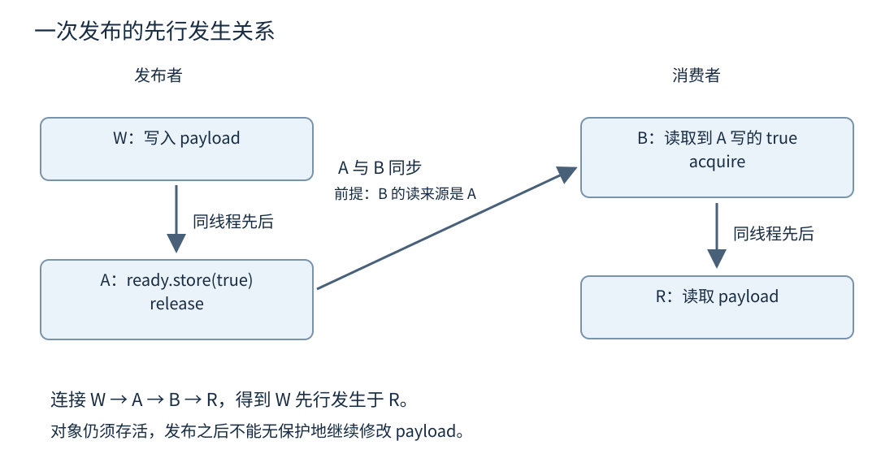
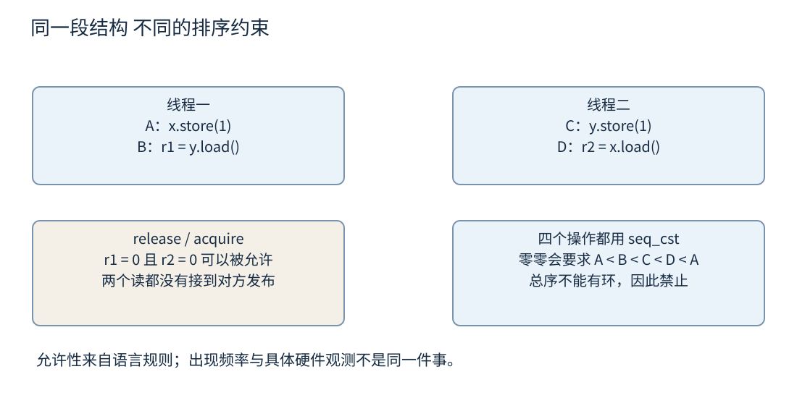
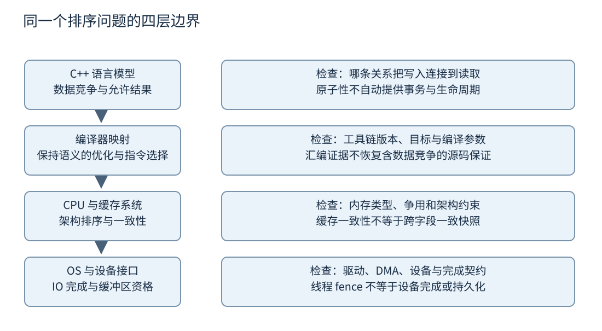

# 第十七章 从语言内存模型理解原子操作

**内存模型**规定多个执行者对内存的操作怎样相互关联，以及一个读取允许观察到哪些写入。它提供的是程序正确性的规则，不是某款处理器流水线的模拟器。程序先要在 C++ 规则中成立，之后才有意义讨论编译器生成什么指令、指令怎样在硬件上执行。

**原子操作**对其目标对象提供不可分割的访问与规定的排序性质。它解决了普通并发访问的一部分问题，但不会自动把一组字段变成事务，不会替裸指针延长对象生命，也不保证算法不会饥饿。选择一个 memory order，实际是在选择证明程序需要哪些关系；较弱的名字不等于较高级的代码。

本章固定以 C++20 的 N4861 为语义主线。C++26 只在专门的版本说明中引用 N5050，尤其不能把 consume 的新规则放回 C++20。所有 C++ 片段和 litmus 均未编译、未执行；允许结果来自规则推导，不是某台机器的观察记录。[S1]

## 17.1 数据竞争 先行发生关系与可见性

### 17.1.1 先确定发生冲突的是哪些访问

两个访问如果作用于同一内存位置，其中至少一个修改该位置，就需要考虑冲突；对象生命周期的开始或结束与相应存储上的访问，也可能形成冲突。多个线程只读取一个已经正确发布且保持不变的对象，与一个线程正在修改、另一个线程读取它，是不同情形。[S1]

**数据竞争**有精确定义。对本章普通多线程情形，可以从三个条件理解：存在潜在并发的冲突访问，其中至少一个不是原子访问，并且它们之间缺少标准要求的先行发生关系。数据竞争导致未定义行为，不能把它描述成“读取可能偶尔慢半拍，但其余仍按正常逻辑运行”。

**竞态条件**比数据竞争更宽泛，指结果不恰当地依赖执行时序。两个线程各用 atomic 读取余额、分别判断足够、然后各自扣款，可能没有数据竞争，却仍违反“余额不能透支”的业务要求。因此没有 data race 只是一个必要层次，不是完整正确性证明。

还要区分内存位置与缓存行。两个独立普通整数可以是不同内存位置，分别由不同线程独占修改并不必然造成数据竞争；如果恰好共享缓存行，它们仍可能互相引发一致性流量，这属于伪共享性能问题。反过来，同一变量恰好位于独立缓存行，也不会把非法无同步访问变成合法程序。

不要用“天然对齐”“机器字大小”“只写一次”绕过语言规则。平台可能提供某些不可撕裂访问，但普通 C++ 对象仍受数据竞争规则约束。只写一次的对象也需要把写入与读者正确连接起来，不能只凭两个线程启动时间相差几毫秒判断安全。

### 17.1.2 先行发生是一种关系 不是挂钟时间

**sequenced-before** 描述同一线程中语言规定的求值先后关系。**synchronizes-with** 描述某些同步操作之间建立的跨线程关系，例如合适的 release 与 acquire，或 mutex 的解锁与后续取得。**happens-before** 通常译为先行发生关系，用于把这些约束连接起来。[S1]

在本章不使用 consume 的示例中，可以沿同线程顺序与同步边逐段连接来建立证明：写入数据先于 release；对应的 acquire 与该 release 同步；读取数据又在 acquire 之后。因此写入先行发生于读取。N4861 对涉及依赖排序的完整关系另有细节，不能把这个方便的证明路径当作所有版本中全部正式定义。

现实时间上“线程甲先运行完这行、线程乙后运行到那行”，不自动等于语言中存在 happens-before。如果程序没有可用同步，调试器暂停、日志输出或偶然的调度延迟，都不能替接口建立原本缺少的契约。程序设计依赖的是被规范允许的关系，而不是一次观测到的墙上时钟顺序。

`join()` 可以提供一条直观的同步链：工作线程先写自己的结果，线程运行结束，调用者成功连接后读取结果。若结果在运行期间没有被别的线程非法访问，这是一种自然的发布方式。mutex 和 future 也能提供相应关系。原子 memory order 是建立关系的一种工具，并非每次跨线程通信都必须手写 acquire/release。

证明时最好给事件命名。把“应该看到新值”拆成 W、R、A、B 等明确操作，再指出哪一条标准规则连接它们。如果只有“CPU 会把缓存刷出去”这样的句子，通常还没有证明哪个读者读取了哪个发布事件，也没有检查对象是否仍在生命期内。

### 17.1.3 用一次发布建立完整证明

设发布者构造一份数据，消费者只在发布完成后读取，且发布之后数据不再改变。一个原子标志可以承担交接作用。

```cpp
// C++20 一次性发布示例，未编译、未执行。
// 初始化在两个线程启动前完成；仅一个发布者；发布后不再写 payload。
// 所有对象的生命期覆盖两个线程，结束后由外部管理者连接线程。
#include <atomic>

int payload = 0;
std::atomic<bool> ready{false};

void publish() {
    payload = 42;                                      // W
    ready.store(true, std::memory_order::release);     // A
}

int observe() {
    while (!ready.load(std::memory_order::acquire)) { // B
        // 仅用于展示语义；这里不是推荐的长期等待策略。
    }
    return payload;                                   // R
}
```

当消费者某次 acquire 读取到发布者 release 写入的 true 时，A 与这次 B 建立同步。W 在 A 之前，R 在 B 之后，因而 W 先行发生于 R；在已声明的单发布、无后续写入条件下，R 可以读取这份已发布数据。这里 payload 不必是 atomic，因为它的冲突访问已经被关系排序。[S1]

这个证明依赖“读取到哪个写入”。一个 acquire load 若仍然读到初始 false，就没有通过这次读取接上发布者的 release。也不能换成另一个互不相关的原子标志，然后声称 acquire 会自动接收所有线程的更新。内存序提供条件性的连接，不是全局广播口令。

循环也不保证实时进展。线程可能长期没有获得调度，硬件与实现的传播和前进保证需要按相应契约解释。语义正确不等于这段忙等待适合生产；第十六章的条件变量或本章后面的 atomic wait 更适合许多长等待场景。



图 17-1 一次发布的事件偏序。横向同步边以 acquire 实际读取对应 release 的值为条件，图中没有把所有原子操作连接成全局时间线。

### 17.1.4 发布只保护它覆盖的写入与时间段

若发布者写好 payload，设置 ready 为 true，随后又开始修改 payload，消费者看到 true 后的读取可能与第二次修改冲突。第一次发布不会永久冻结对象，也不会自动保护未来写入。解决方式可以是使用锁、不可变版本、独立对象所有权转移，或者有完整轮次协议的缓冲结构。

把 ready 在每轮开始改回 false，看起来像重复使用相同协议，却引入新的问题：消费者看到的 true 属于哪一轮，旧读者是否已经离开，发布者是否可以覆盖存储。这正是一次性交接不能直接推广为可重复邮箱的原因。重复使用通常需要版本号、消费者确认或多个缓冲区，并证明每次复用都在上一次读取结束以后。

发布指针同样有两个维度。release/acquire 可以保证消费者看见对象初始化，但对象不能在消费者仍使用它时被删除。`std::atomic<Node*>` 原子化的是指针值的访问，不是 Node 对象的生存期；第十八章将把发布证明与安全回收证明分开。

初始化 atomic 本身也要在合法生命周期中完成。把一个尚在构造的原子对象地址泄露给其他线程，不能用“后续都是原子访问”掩盖初始化并发。对象构造、发布、使用和销毁必须形成完整链条。内存模型的规则从来没有取消第九章的对象模型。

### 17.1.5 可见性必须落实到一个读取

“对其他线程可见”是方便的口语，但容易引出错误直觉。它不意味着每个核心某一瞬间都把所有字段更新成相同快照，也不意味着读者总能得到现实世界时间上最新的写入。正式推理要说明目标对象、相关修改顺序、读取来源和 happens-before 约束。

每个原子对象的修改有自己的**修改顺序**，即 modification order。它是该对象全部修改的一个总序。不同原子对象各有顺序，不能直接把它们拼成所有内存操作的一个统一总序。程序往往正是在“两个字段各自正确，但没有共同快照”的地方出错。[S1]

例如统计两个独立 atomic 计数，先读完成数，再读失败数，不保证两次读取来自同一个逻辑时刻。若需要恒等式“完成数加失败数等于处理总数”，可以通过锁获得快照，使用一个可原子更新的组合状态，或者采用带验证的快照协议。单独把每个字段声明为 atomic，不会自动保存字段之间的不变量。

面试中被问“没有看到最新值是不是缓存一致性坏了”，应先问有没有需要建立而未建立的语言同步，以及“最新”指哪一种顺序。硬件一致性并不保证应用随意组合不同变量的读取就得到一份逻辑一致快照；没有 happens-before 的 C++ 普通冲突访问甚至已经超出可讨论的合法结果范围。

## 17.2 Atomic CAS 与 Memory Ordering

### 17.2.1 原子读 写 与读改写承担不同工作

原子 `load` 读取一个值，`store` 发布一个值，**读改写**（read-modify-write，简称 RMW）操作把读取旧值与生成新值组成不可被其他同对象修改插入的操作，例如 `fetch_add`、`exchange` 和成功的 compare-exchange。每一步的原子性，并不自动把多个独立调用合成一步。[S1]

`counter.store(counter.load() + 1)` 包含一次读和一次写。两个线程可能都读取 5，再都写入 6，丢失一次增加。把两次操作都设成 seq_cst 也不能消除这个逻辑问题，因为它们仍允许按“读甲、读乙、写甲、写乙”的顺序交错。需要的是一个读改写操作，或锁住整个组合。

`fetch_add(1)` 返回修改前的值，且修改本身参与目标对象的修改顺序。若用途只是为独立事件累计数量，并且不借该计数发布其他数据，relaxed 常是候选。读者什么时候汇总、计数是否允许溢出、是否要求跨字段一致性，则仍由更大的协议决定。

标准原子类型不保证每一种类型与每一种大小都无锁实现。`is_always_lock_free` 和 `is_lock_free()` 用于查询相应保证或属性；原子操作可以在实现内部采用锁。即使某一种 atomic 是无锁的，调用它的整个算法也可能进行内存分配、阻塞 IO 或等待其他线程，因而不能据此给算法贴上 lock-free 标签。

### 17.2.2 CAS 比较成功才提交候选值

**CAS** 是 compare-and-swap 的常见简称，C++ 对应 `compare_exchange_weak` 和 `compare_exchange_strong`。它把当前原子值与 expected 比较；满足比较条件时写入 desired 并报告成功，否则保留原子对象的当前值，将比较所读到的值写回 expected 并报告失败。[S1]

因此 expected 同时是输入与失败输出。调用者在重试前通常需要依据更新后的 expected 重新计算 desired。若候选值依赖旧状态，却在循环外只计算一次，重试可能提交一个已经过时的转移。CAS 只检验所比较的表示，不会检查你的业务计算是否还适用于新状态。

C++20 的规则围绕值表示进行比较，不是调用类型的 `operator==`。浮点表示、联合体与有多种表示的类型会增加推理负担。共享状态编码常优先选择语义清晰的整数或受控组合，但组合尺寸、对齐和是否无锁仍需核查实现。不能为了避免一把锁，就随意把复杂对象的字节当成通用事务标识。

weak 允许**伪失败**：即使比较看起来相等，仍可能返回失败。它通常用于已经需要重试的循环；strong 不因这一原因失败，适合不想因为伪失败改变业务分支的单次尝试。strong 也不保证线程一定获胜，竞争者仍可能在它尝试前改变值，更不保证一次失败意味着整个高层操作永远不可完成。

### 17.2.3 用受限计数展示正确重试

下面的函数尝试把一个计数增加一，只在当前值小于限制时提交。所有操作均为 relaxed，是因为此处只证明计数状态转换，不使用成功作为其他对象初始化完成的信号。

```cpp
// C++20 CAS 教学片段，未编译、未执行。
// 前提：所有修改均保持 count 在 [0, limit]；limit 本次调用期间不变。
// 本函数不发布任务内容，不管理许可对应资源的生命周期。
#include <atomic>
#include <cstdint>

bool try_increment_below(std::atomic<std::uint64_t>& count,
                         std::uint64_t limit) {
    auto expected = count.load(std::memory_order::relaxed);
    while (expected < limit) {
        const auto desired = expected + 1; // expected < limit，故此处不溢出。
        if (count.compare_exchange_weak(expected, desired,
                                        std::memory_order::relaxed,
                                        std::memory_order::relaxed)) {
            return true;
        }
        // 失败已更新 expected；下一轮重新检查上限并计算 desired。
    }
    return false;
}
```

若两个线程都读到 7，上限是 8，一个线程成功把值改成 8，另一个线程的 CAS 失败后 expected 变成 8。第二个线程重新检查上限并返回 false，没有把计数推进到 9。若 weak 只是伪失败，expected 可以仍为 7，循环重新尝试，不把伪失败误认为容量已满。

成功 CAS 是这一计数增加操作的自然线性化点；返回 false 的判断则基于该次已观察到的计数状态。它不承诺下一瞬间仍然满，因为其他线程可能减少计数。这里的“尝试获取”语义是一次并发操作的结果，不是对未来容量的永久声明。

也不能把这段函数直接命名为“完整无锁资源池”。计数与真实资源必须保持对应，获取资源后异常退出要释放，使用者退出前不能销毁池。若资源选择本身还要遍历链表或等待锁，则整体进展保证与这个整数 CAS 循环不同。第十八章将进一步讨论这层区别。

### 17.2.4 成功与失败路径要分别证明排序

CAS 成功是原子读改写，失败是原子读取。成功可能同时接收旧状态的发布并发布新状态，因此可采用 acq_rel；失败没有写入，不能选择 release 或 acq_rel 作为失败内存序。N4861 的双序重载明确规定这一限制。[S1]

常见教学表格还会机械写“失败序不得强于成功序”。不要把不同标准年代的描述混为一谈：本章固定 N4861 的 CAS 先决条件中，没有这条旧式的通用限制，而是禁止 failure 为 release 或 acq_rel。内存序也不是一条可以随意按名字大小比较的强弱直线。具体双序组合仍要符合所选标准与工具链契约，并根据成功、失败两条路径分别论证。

单一 order 参数的重载有规定的失败序映射：若成功用 acq_rel，失败改用 acquire；若成功用 release，失败改用 relaxed；其他允许的情况沿用对应 order。不能以为“我只写一个 order，所以失败也进行 release”。这是 API 语义，不是实现随意选择。[S1]

失败路径为什么有时需要 acquire？考虑 expected 在失败后得到另一个线程刚发布的对象入口，而代码接下来要读取该对象已经初始化的内容。如果合法读取依赖失败 CAS 读到的发布，就需要适当的获取关系；如果失败后只是重新计算一个纯数值，不读取需要发布保护的其他数据，relaxed 可能足够。即使获得 acquire，指针对象的生存期仍必须独立保证。

一个可靠审查方法是分叉画图：成功之后访问哪些普通对象，失败之后访问哪些普通对象；每条访问依赖的发布事件分别是什么。只盯着成功提交的一行，往往会遗漏失败重试时最危险的指针解引用或状态读取。

### 17.2.5 原子对象与被指向对象不是同一对象

`atomic<T*>` 中的指针读写是原子的，`p->field` 的读写并没有因此变成原子。release store 指针、acquire load 指针，可以参与发布对象；若同时有人修改 field，仍需要同步。若有人删除对象，读者拿到地址也不能因此访问已结束生命周期的存储。

`atomic<shared_ptr<T>>` 是另一种工具。它把共享所有权的相关更新纳入专门契约，可以让读者取得一份保持对象存活的 shared_ptr；但 T 的内部可变状态仍不是自动线程安全，并且实现不一定无锁。把所有权安全、数据访问安全和进展保证分成三个问题，才能正确比较方案。[S1]

C++20 的 `atomic_ref` 可对满足条件的既有对象建立原子访问入口，但它不是随时混用普通访问的许可证。对象须满足所需对齐与类型要求，生命期要覆盖引用使用；只要还有引用该对象的 atomic_ref 实例存活，对该对象的访问就必须经由这些实例进行，而不只是“恰好有别的线程在操作时”才需要如此。把原有数据结构局部套一层 atomic_ref，需要审查所有别名路径，不能只修改当前看到的那一行。

如果结构中多个字段必须共同改变，优先问是否值得用一把 mutex 封装不变量。原子组合状态可能适合紧凑状态机，但尺寸、计数回绕、编码合法性和复杂重试会增加证明负担。没有测量证据时，“用了更多原子指令”不构成更高质量的设计。

### 17.2.6 原子等待仍然依赖值的协议

C++20 的 `atomic::wait(old, order)` 围绕读取结果与 old 的值表示比较等待，而不调用类型的自定义相等运算符。实现可能内部伪唤醒，但接口会重新读取并比较，只有观察到与 old 不同的值才返回。它让简单状态变化不必总用忙循环等待。[S1]

一次性发布可以先写普通 payload，再对标志进行 release store，随后 notify。消费者以 acquire wait 等待 false 改变，观察到 true 后读取 payload。同步来自读取与发布之间的内存序关系；`notify_one` 或 `notify_all` 本身不是发布普通内存的 release 操作。

```cpp
// C++20 一次性事件片段，未编译、未执行。
// 前提与前面一次性发布相同：ready 只从 false 变成 true，永不重置。
void publish_with_notification() {
    payload = 42;
    ready.store(true, std::memory_order::release);
    ready.notify_all();
}

int observe_with_wait() {
    ready.wait(false, std::memory_order::acquire);
    return payload;
}
```

这个设施不保存每一次中间变化。若值从 A 变成 B，又在等待者观察前变回 A，等待者可能没有观察到变化，这也是一种 ABA 问题。需要累计事件次数时，可以使用不会在相关窗口内回绕的代际计数或真正的队列，并证明计数范围；不要把一个反复翻转的布尔值当成可靠事件日志。

对 wait 使用的 order 也不能是 release 或 acq_rel，因为它围绕读取进行等待。标准没有把等待承诺为实时唤醒，也没有替你定义取消。关闭应当成为可观察状态，必要时改变值并通知所有可能等待的人，再在确认没有使用者后销毁对象。

## 17.3 Acquire Release Relaxed 和顺序一致性的适用边界

### 17.3.1 Relaxed 保留原子性 不承担跨对象发布

`memory_order::relaxed` 仍然提供原子访问、目标对象的修改顺序，以及适用的一致性约束。它不是“所有规则关闭”，也不允许把一次整数原子读取撕成互不相关的半个值。它没有自行提供常用于发布其他对象的 acquire/release 同步关系。[S1]

独立统计量是一个常见使用场景。例如多个线程记录已完成请求数，最后由管理线程在连接全部工作线程以后汇总。增加操作可只需要 relaxed 原子性；最终读取的时机还有 join 提供的同步。若管理线程在运行中读取，得到的是符合原子规则的一次观察，不必是与其他统计字段一致的快照。

引用计数常被用作 relaxed 的例子，但不能简化为“引用计数一律 relaxed”。增加已拥有对象的引用与最后一次减少后销毁对象，需要不同论证；取得第一个有效引用与内存回收竞争，又是另一类问题。成熟实现的顺序选择服务于完整所有权协议，不能从一句口诀复制到任意裸指针结构。

最危险的误用是普通 payload 加 relaxed ready。如果发布者写 payload，再 relaxed store 标志，消费者 relaxed load 看到标志后读 payload，缺少相应同步的普通冲突访问可以形成数据竞争。此时不能把“读到了旧 payload”列为一个普通、可接受的结果；程序已经有未定义行为。若想研究弱序允许哪些结果，应把 litmus 中相关共享访问都正确设计为原子。

### 17.3.2 Acquire 与 Release 是交接关系

release 的作用可以理解为把它之前的相关操作放到一条可供读者接收的发布路径上；acquire 在实际读取相应发布或符合条件的释放序列时接上路径，使之后的操作能够依赖它。关键是“实际读取”与“相应原子对象”，不是两个线程各写了一个正确单词就必然连接。

例如线程甲 release 写 x，线程乙 acquire 读 y，x 与 y 是不同且没有其他关联的原子对象，这两步不会因此直接同步。线程乙对 x 的 acquire 若读到初始值，也没有接收到后面的发布。一个读取可能拥有 acquire 语义，却在这次执行里并未从目标发布建立所需边。

acq_rel 常用于读改写，因为它既读取前一状态，又写入新状态。纯 load 不能用 release 或 acq_rel；纯 store 不能用 acquire、consume 或 acq_rel。各类操作能接受哪些参数由接口约束决定，不能把更长的名字当成更保险的通用选项。[S1]

release/acquire 也不是“把前面所有代码固定在前面、后面所有代码固定在后面”的源码排版锁。编译器依然可以做保持程序允许行为的变换。正确的解释是哪些跨线程结果受到限制；具体指令排列只是某次实现满足这些限制的方法。

### 17.3.3 释放序列可以通过读改写传递发布

**释放序列**是目标原子对象修改顺序中满足相应条件、不能再向后延长的一段连续序列。C++20 的 N4861 规定它以一个 release 操作为头，后续操作必须是原子读改写。较早标准中关于同线程普通原子写入的规则不能照搬到 C++20。[S1] [S2]

考虑状态从 0 开始。线程甲先初始化 data，再 release store 把 state 改为 1。线程乙执行 relaxed `fetch_add(1)`，它紧接该写入读取 1 并写入 2。线程丙 acquire load 读到这次读改写写入的 2。在这些前提下，丙可以通过以甲的 release 为头的释放序列接收甲的发布。

这里线程乙的 relaxed 读改写可以作为甲发布的中继，不意味着它替乙自己的其他普通写入提供 release。若乙在读改写之前写了另一个普通对象 extra，而丙也要读取 extra，就需要另行证明乙到丙的同步。发布传递不能任意把经过线程里的所有工作都打包进去。

如果在线程甲的 release 与线程乙读改写之间插入了一个不满足序列要求的普通原子 store，则应重新分析释放序列是否仍连接。尤其不能把“大家都操作同一个 atomic”当成永久连通链。CAS 失败是一次读取，不是修改，不会像成功 RMW 那样成为修改序列中的一个节点。

实际代码不宜仅凭肉眼看到值为 2 就认定知道来源。如果多个线程可能写同一个数字，或者计数发生回绕，数值相等并不能唯一标识发布事件。教学示例通过单一写入来源把读来源固定下来；真实协议需要状态机或代际规则支持这项判断。

### 17.3.4 顺序一致性提供更易解释的全局约束

`memory_order::seq_cst` 在相应 acquire/release 效果之外，为顺序一致性操作提供一个满足标准约束的单一总序。它让许多跨多个原子对象的推理更接近按顺序交错执行的直觉，是尚无明确弱序需求时很有价值的基线。[S1]

但总序不等于所有普通内存访问都自动安全。两个线程对同一个普通变量冲突访问，只在无关位置各执行一次 seq_cst 操作，仍可能缺少所需的同步连接。seq_cst 也不会把多次原子调用合并为事务，前面“load 加一再 store”的丢失更新仍然可能发生。

混合 seq_cst 与较弱顺序时，应按标准规则分析，而不是把所有操作都想象为参与同一条强序列。C++20 还调整了与强先行发生、栅栏等有关的约束；P0668 提供了设计背景。高级代码若依赖混合弱序与 SC 栅栏，应直接核对固定标准，而不是用某一张“CPU 指令映射表”代替证明。[S3]

从工程角度，先用易于证明的锁或 seq_cst 写出清楚协议，再在测量显示原子排序成本确实是瓶颈后考虑削弱顺序，是常见的合理路径。某些架构上两种顺序可能生成相同指令，另一些架构上则不同；源码更弱不保证最终更快，证明成本却已经增加。

### 17.3.5 用 Store Buffering 测试区分允许结果

**litmus test** 是把并发现象压缩成少量操作的教学或验证模型。它用来询问某种结果是否被给定内存模型允许，不是通过某次运行频率定义标准。下面所有共享变量均是 atomic，两个结果变量分别只由一个工作线程写，并在外部连接之后读取。

```cpp
// C++20 Store Buffering 语义片段，未编译、未执行。
// x、y、r1、r2 在启动前初始化；完成后由管理者 join 再检查 r1、r2。
std::atomic<int> x{0};
std::atomic<int> y{0};
int r1 = -1;
int r2 = -1;

void thread_one() {
    x.store(1, std::memory_order::release);
    r1 = y.load(std::memory_order::acquire);
}

void thread_two() {
    y.store(1, std::memory_order::release);
    r2 = x.load(std::memory_order::acquire);
}
```

在这个 release/acquire 版本中，`r1 == 0 && r2 == 0` 是允许讨论的结果：两个 acquire 都读取初始值，没有从对方的 release 建立同步边。把它理解成“程序用了 acquire 和 release，所以零零必定禁止”，正是忽略读来源的错误。[S1]

如果四个原子操作全部改为 seq_cst，零零结果会要求一个不可能的 SC 总序。线程一要求写 x 在读 y 之前；读 y 为零要求它在唯一的 y 写入之前；线程二要求写 y 在读 x 之前；读 x 为零又要求它在唯一的 x 写入之前。把这些约束连接，得到一个环，与总序不相容，因此零零被禁止。



图 17-2 Store Buffering 的结果证明。它展示语言模型允许性，既不声称每种硬件都能观察到零零，也不提供出现概率。

如果测试在某台机器上运行一亿次都没有出现零零，只能说明该测试在那些条件下没有观察到它，不能把语言允许结果变成禁止结果。若编译器把整个测试优化成了别的形式、结果读取没有同步、初始化与工作线程重叠，测试甚至可能没有测到原本想研究的模型。

### 17.3.6 Fence 需要桥梁 不是魔法刷新

**栅栏**是不直接关联一个特定目标值的排序操作。C++ 的 `atomic_thread_fence` 可以与原子操作组合建立特定同步关系；规则要求找到相应的原子写入、读取与读来源。只在两个线程各插一条 fence，而没有满足这些连接条件，并不能修复任意普通数据竞争。[S1]

例如 release fence 之前写 payload，之后 relaxed store 一个标志；消费者 relaxed load 实际读到该发布值，随后执行 acquire fence，再读 payload，可以在规定条件下建立栅栏同步。这种表达把排序与读写拆开，证明更容易遗漏，不应为了看起来“少一个 acquire”而默认采用。

`atomic_signal_fence` 的约束作用于同一线程与信号处理器的相关关系，不能被当成跨 CPU 的通用硬件内存屏障。编译器屏障、语言栅栏和硬件指令屏障也不自动同义；某条栅栏在某个平台可能不需要发出额外机器指令，却仍然约束编译器允许的变换。

对于设备寄存器、DMA 缓冲区或持久化存储，C++ 线程栅栏不等于全部需要的设备完成与缓存维护协议。设备访问受操作系统、驱动接口和架构内存类型约束，第二十八章及第三十章会在相应上下文继续讨论。普通 CPU 线程同步不能越过这些接口边界作出承诺。

### 17.3.7 Consume 的版本变化必须单独标注

C++20 的 N4861 仍包含 consume 与依赖排序规则，它试图通过值依赖传递所需约束。它与 acquire 的正式含义并不相同，依赖怎样经过表达式传播也有细节。许多实际工具链采取保守实现策略，但实现选择不能反过来抹掉所选标准文本里的区别。[S1]

C++26 固定草案 N5050 在 D.24.5 `[depr.atomics.order]` 中把 `memory_order::consume` 放入弃用内容，规定在允许 acquire 的地方允许 consume，并赋予相同含义。P3475R2 说明了这一调整背景。这是语义收敛到 acquire，不能描述成“C++26 把 consume 放松得更弱”。[S4] [S5]

因此本书新教学代码不依赖 consume 构造独立性能技巧。阅读 C++20 旧代码时，要按旧基线识别其依赖意图与实现支持；评估 C++26 迁移时，再采用 N5050 的 acquire 等价规则。以滚动在线参考页上的新说明直接审判十年前的旧代码，或者把旧依赖教程当成 C++26 新建议，都会混淆版本。

### 17.3.8 可复用单槽需要双向交接

一次发布只有生产者到消费者的关系，而可复用存储还需要消费者到生产者的关系。考虑恰好一个生产者、一个消费者、一个存放整数的槽，状态只有“空”和“满”。生产者只有取得空槽后才能写，消费者只有取得满槽后才能读；各自完成后，把资格交给另一方。

第一方向是生产者写槽，随后 release 把状态改为满；消费者 acquire 读取这次满状态，再读取槽。第二方向是消费者完成读取，随后 release 把状态改为空；生产者 acquire 读取这次空状态，再覆盖槽。前一方向保证初始化先于读取，后一方向保证上一轮读取先于下一轮覆盖。缺少后一条边，即使每次“写好以后发布”都正确，也不能证明存储复用安全。

初始空状态由启动前初始化提供。之后只有消费者能写空，只有生产者能写满，每一方都必须在当前轮完成交接后才能进入下一轮。正是单生产者、单消费者与严格交替的限制，使同一个布尔状态可以在这个窄协议里表达资格；若增加第二个生产者，它们可能同时看到空并一起写槽，必须重新设计独占获取机制。

假设消费者已经读取槽，但还在调用一个保存槽引用的回调。此时如果它就发布空，生产者可以覆盖槽，而回调仍在读。完成读取的边界必须包含所有借用者的最后一次使用，不能只指消费者函数里最直接的那一次赋值。把值复制到自己的局部变量后再释放槽，通常更容易证明，不过复制大型对象的成本需要另行比较。

这个协议也说明“原子标志反复改变就一定错误”过于粗糙。错误在于没有证明轮次、独占访问与最后使用。严格交替能够限制谁可以改变状态；通用事件计数则没有这种限制，短暂变化仍可能被错过。相同的布尔类型，在不同状态机里有不同的可靠性。

若用 atomic wait 降低空转，改变状态后还需要通知可能等待的另一方，等待者需要围绕自己的资格重新检查。关闭又引入第三类状态，不能简单用 true 同时表示“满”和“退出”，否则可能把不存在的负载当成数据。可以扩大状态编码或采用外部关闭协议，但必须重新审视每条普通访问是否仍有双向交接。

这里给出的只是受限单槽协议的证明思路，没有提交可直接部署的队列实现。泛化为多槽、多生产者、多消费者时，还会出现槽位代际、索引回绕、异常构造和回收等问题。第十八章的验证方法用于判断这些扩展是否真正保留了原有保证。

## 17.4 编译器重排 CPU 排序与 Cache Coherence 分层对照

### 17.4.1 语言先规定允许行为 编译器再实现它

**编译器重排**是方便的描述，实际优化不只交换两条指令，还包括消除读写、合并操作、把值保存在寄存器、向量化和跨函数推导。对没有未定义行为的程序，实现必须保持语言要求的可观察行为；程序违反数据竞争规则后，不能再靠“生成的汇编似乎没变”恢复保证。

例如一个线程用普通布尔值循环等待另一个线程改值，编译器可能根据合法程序的规则采用优化，不能要求它不断从内存重新加载一个没有同步的共享值。加 `volatile` 也不是 C++ 通用线程同步方案；volatile 的访问语义与 atomic 的并发契约不同。

汇编检查仍然有价值。它可以确认某个工具链、目标架构和编译选项下，原子操作使用哪些指令，某个微基准是否被删除，以及代码布局是否变化。但汇编是实现证据，需要附带具体版本和目标；它不是替代语言正确性证明的通行证。

正确研究路径是先写出事件关系，再判断实现必须阻止哪些结果，最后查看目标平台如何达到要求。反过来先记住某条指令“很强”，再给有数据竞争的源码找理由，会把语言与机器两个层次都解释错。

### 17.4.2 CPU 排序是架构契约与内部执行的结合

处理器内部可以乱序执行、推测访问、使用写缓冲和多级缓存，只要维持架构规定的可观察行为。架构内存模型讨论其他执行者能观察什么顺序，微架构讨论如何实现。两台支持同一指令集的处理器可以有不同内部机制，却都满足同一架构规则。

常见的 x86 普通可缓存内存访问与 Arm 等平台的排序差异，对代码生成很重要。但不能把“x86 较强”说成“任何无同步 C++ 代码在 x86 上都安全”，也不能把“Arm 较弱”理解为硬件随意损坏数据。编译器把 C++ 同步映射到目标架构所需操作，合法程序才获得跨平台承诺。

具体指令代价随微架构、数据位置、竞争者数量和缓存状态变化。一个 RMW 在独占缓存行上与许多核心争夺同一行时，成本可能不同；某条 fence 的影响还取决于此前有哪些未完成操作。不能把一次汇编中的指令数当成并发系统延迟的完整模型。

本章不提供“一条 release 永远编译成什么”的通用表，因为目标架构、内存类型与编译器版本都需要固定。若项目确实需要这张表，应逐项生成并核验，同时保留它属于实现观察的标记，不改变上层语义契约。

### 17.4.3 缓存一致性不提供跨变量事务

**缓存一致性**通常约束针对某个一致性位置的写入如何在多个缓存之间协调，使访问遵守相关架构的单位置规则。**内存一致性模型**则涉及不同位置访问的可观察顺序。第五章已经讨论缓存行与所有权流转；这里必须避免把一致性机制当成所有跨对象关系的替代品。

两份状态 x 与 y 即使各自的写入能被硬件一致地管理，线程仍可能在不同时间观察到不同组合。语言的 acquire/release、SC 与锁为程序增加必要约束；应用若需要事务性快照，还需设计更高层的协议。

“release 把缓存刷回内存，acquire 从内存重新读取”是误导性口诀。数据可以在缓存层级或核心间传递，满足同步不要求每次都先写回主存；acquire 也不意味着清空所有本地缓存。把同步理解为限制允许观察的关系，比把它想象成搬运全部字节更可靠。

硬件缓存行还可以把语言中彼此独立的变量耦合成性能竞争。多个线程分别修改自己的计数器，语言上没有共享修改同一变量，却可能因同一缓存行来回转移而变慢。修正布局可能改善性能，但它不增加或减少原本需要的语言同步边。第二十章会用实验方法区分这些原因。

### 17.4.4 内核和设备屏障有自己的适用域

Linux 内核屏障文档明确区分 CPU 屏障、编译器约束、设备访问与缓存一致性等问题。它面向内核代码和相应架构模型，不能直接把 `smp_*` 规则当成 ISO C++ 用户态程序的规范。内核有自己的访问宏、数据竞争约定与验证模型。[S6]

同理，读写内存映射设备寄存器需要使用平台或驱动规定的访问方式。普通 `volatile`、C++ atomic 与线程栅栏不能通用地保证设备已经完成操作、DMA 缓冲区可见或持久化写入已经落到掉电不丢失的介质。设备协议可能还需要读回、完成队列、特定屏障或缓存维护操作。

从用户态调用一个操作系统接口时，接口本身应规定缓冲区何时可复用、完成通知表示什么。不要依赖“系统调用很重，所以一定能同步一切”的猜测。某次调用可以完成内核工作，却没有为两个用户线程之间未经协调的普通变量访问提供你需要的 C++ 关系。



图 17-3 排序问题的分层检查。向下查实现成本，向上保留接口契约；设备完成与对象生命周期都不能被一条泛称“屏障”的操作包办。

### 17.4.5 从偶发读错到最小证明

设程序发布配置指针，读者偶尔看见不完整字段。第一步检查是否存在普通指针的并发读写，或虽然指针是 atomic，却仅用 relaxed 发布普通可变对象。第二步确认读取是否实际经过 acquire，以及发布之后对象是否继续被修改。第三步检查对象是否被提前销毁或地址复用。

如果初始化发布正确，但崩溃来自旧配置删除，增加更强 memory order 往往没有解决根因。release/acquire 负责使初始化可见，安全回收负责保证对象仍活着，二者不能互相替代。若问题是多个字段需要共同版本，单独把每个字段设成 seq_cst 也不必然提供一致快照。

检测工具可以提供证据。数据竞争检测器可能发现未建立同步的冲突访问，但一次没有报告不等于已经覆盖所有执行；弱序 litmus、状态空间检查和线性化测试针对不同错误类别。工具支持的原子操作、平台与注解边界也需要核实。第二十二章会继续讨论诊断工具，不在这里把任何单个工具称为正确性证明器。

最小化案例时，要保留出问题的对象生命周期、并发访问和读来源。删掉回收线程后崩溃消失，可能说明删除是关键，而不是说明原子顺序已经正确；加入日志后问题消失，可能只改变了调度。每一次改动都应提出并检验一个假设，不能把“出现频率变低”当成语义修复。

### 17.4.6 高级面试追问与回答链

“acquire 为什么不能单独保证看到发布者的新数据？”因为 acquire 的同步效果要接上符合规则的 release 或释放序列读来源。读到初始值、读错对象或读取没有发布关系的值，都不产生所需边。先指出读来源，再解释之前写入如何传到之后读取，答案才完整。

“所有变量都换成 atomic 就没有并发 bug 吗？”它可以消除部分普通数据竞争，却不保证多字段不变量、唯一任务完成、容器生命周期或锁外借用。纯 atomic 代码仍能丢失业务更新、形成等待环或访问已经删除的对象。原子性是局部操作性质，高层正确性需要协议。

“CAS 失败为什么不能忽略？”因为 expected 被更新，失败可能改变后续读取所依赖的对象与状态；weak 还可能伪失败。重试需要重新验证业务条件、重新计算候选值，并证明失败读取所需的 memory order。对指针算法，还要保证重试期间被解引用对象仍受保护。

“seq_cst 是否一定比 acquire/release 慢？”不能脱离目标平台与负载回答。某些操作可能采用相同指令，瓶颈可能在缓存行争用而非排序；某些平台的实现则确实需要额外约束。应先证明较弱顺序足够，再在正确、可重复的端到端实验中比较，不把猜测写成通用常量。

“怎样向评审解释一个弱序实现？”给出对象与所有者，列出冲突访问，画出每次发布与接收的关系，明确每个 CAS 分支和释放序列，最后单独说明复用、回收与进展保证。若证明只能依靠“这台机器一直如此”，应缩小支持范围并明确平台契约，或改用更清楚的可移植设计。

## 本章资料与核验范围

N4861 的 `[intro.races]`、`[atomics.order]`、`[atomics.types.operations]`、`[atomics.wait]`、`[atomics.fences]` 是本章 C++20 规则基线。释放序列与 SC 调整分别参考设计提案 [S2]、[S3]，不把提案动机代替正式规则。C++26 consume 说明仅使用 [S4] 与固定 N5050 [S5]。内核资料 [S6] 只支持分层边界说明。

所有事件图、CAS 计数与 litmus 都是作者教学构造。代码未编译、未执行；不存在本章实测硬件结果。图像渲染检查验证排版，不能验证语言模型证明或无锁算法的生产适用性。

[S1]: https://www.open-std.org/jtc1/sc22/wg21/docs/papers/2020/n4861.pdf
[S2]: https://www.open-std.org/jtc1/sc22/wg21/docs/papers/2018/p0982r1.html
[S3]: https://www.open-std.org/jtc1/sc22/wg21/docs/papers/2018/p0668r5.html
[S4]: https://www.open-std.org/jtc1/sc22/wg21/docs/papers/2025/p3475r2.pdf
[S5]: https://www.open-std.org/jtc1/sc22/wg21/docs/papers/2026/n5050.pdf
[S6]: https://docs.kernel.org/core-api/wrappers/memory-barriers.html
