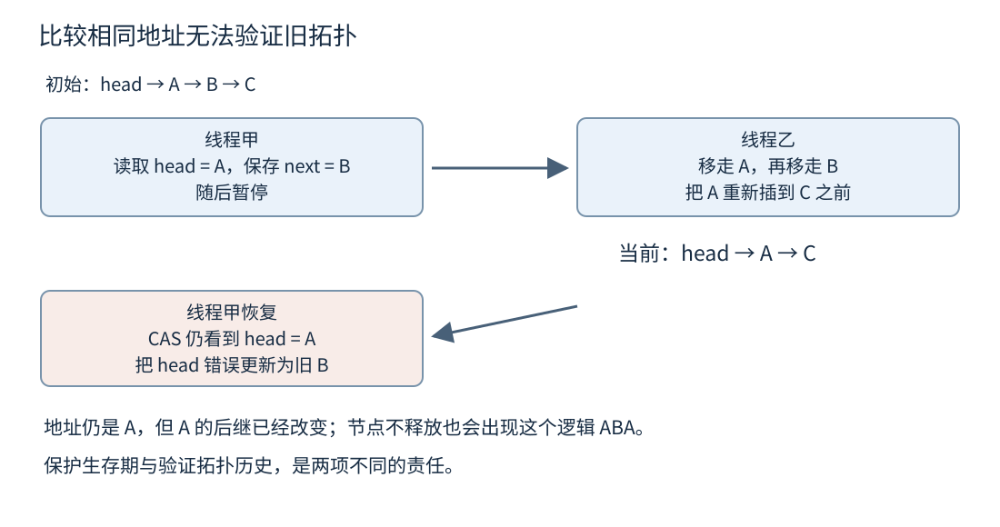
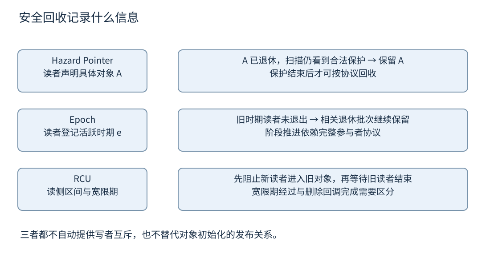
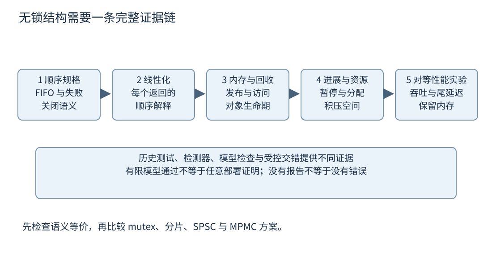

# 第十八章 无锁结构与安全回收

**无锁数据结构**尝试在某个执行者被暂停时，仍让其他执行者继续完成操作。它解决的是特定的进展问题，并不自动保证更低延迟、更少内存或更容易维护。没有出现 mutex 这个类型名，也不足以证明实现具有无锁进展保证。

**安全回收**回答另一个问题：一个节点已经从数据结构中移除以后，什么时候能够结束其生命周期并复用存储？移除通常改变“以后从哪里找到它”，却不会抹掉其他线程手里已经取得的指针。发布、逻辑删除、物理摘链与回收是不同事件，混在一起正是许多并发错误的来源。

本章在第九章的对象生命周期与第十七章的原子排序基础上讨论结构证明。C++20 仍以 N4861 为基线；C++26 的安全回收接口单独用固定 N5050 标记。所有交错、伪代码步骤和计算都是作者教学模型，未编译、未执行；没有把未经验证的算法包装成生产实现。[S1]

## 18.1 进展保证 Lock Free Wait Free 与饥饿

### 18.1.1 安全性与活性回答不同问题

**安全性**通常表达坏事不会发生，例如同一任务不会被取出两次，生命周期已经结束的节点不会再被解引用，队列不会凭空产生元素。**活性**表达有条件地最终会发生好事，例如有执行机会的操作最终能够完成。一个算法可以总是返回正确结果，却在某种调度下永远不返回；也可以非常快地完成错误操作。

进展保证必须说明所使用的模型。理论证明通常以参与者自己的计算步骤、可用原子原语与调度假设为单位，不自动约束操作系统抢占、缺页、机器故障或现实挂钟时间。声称“一百个步骤内完成”与声称“一百纳秒内完成”是完全不同的承诺。

也要明确一次操作何时算完成。一个有界队列的 `try_push` 可以快速返回“未提交”，这满足某种终止性质，但不意味着该业务请求已经得到处理。如果外层无限重试直到成功，外层接口的进展保证必须重新分析。不能把尝试操作的快速失败当成整个业务的有界成功时间。

最有用的起点是列出依赖：这个操作是否等待某个特定线程释放锁，是否等待另一个线程完成保留槽位，是否调用可能阻塞的分配器，是否同步等待回收。这份依赖清单比“代码里有没有 while”更能揭示真实的进展性质。

### 18.1.2 阻塞 无锁 与无等待的定义

在典型阻塞算法中，一个持有必要锁的线程若被长期暂停，其他依赖这把锁的线程也可能无法完成操作。**lock-free** 的核心是系统范围的进展：在模型允许的执行条件下，只要参与者持续执行相关步骤，就不能让所有操作永远都没有完成。它不承诺每个特定线程都及时完成。[S2] [S3]

**wait-free** 要求每个操作都能在有界数量的自身步骤内完成，界限的具体表达取决于算法、参与者数量与输入等模型参数，不能依赖其他线程“终于让出机会”。这是比 lock-free 更强的个体进展性质。被操作系统完全暂停的线程没有执行自己的步骤，因此理论 wait-free 也不是调度器给出的实时期限。[S2]

**obstruction-free** 表达较弱的条件：若一个操作获得足够长的独占执行机会，没有其他操作持续干扰，就能完成。多个参与者不断互相干扰时，它们仍可能都无法完成，需要额外竞争管理。把“单线程时能跑通”扩展成 obstruction-free 证明，也仍要说明从可达状态出发能否完成，而不是只测试初始空结构。

这些词在历史论文中偶有用法差异。阅读旧文时先看作者对 non-blocking、lock-free 等词的定义，再与现代常见进展层级对照。本章按上述系统进展与个体有界步骤区分，不用一个英文标签代替明确条件。

### 18.1.3 无锁仍然可以让某个线程饥饿

**饥饿**指某个参与者持续尝试，却长期得不到完成机会。一个 CAS 循环可能每次都被其他线程抢先更新；其他线程持续完成，系统满足某种 lock-free 进展，但这个线程自身仍可能一直失败。无锁没有自动提供先来先服务的公平性。

**活锁**则强调执行者仍在活动、调整或重试，却没有取得需要的有效进展。例如两个线程不断撤回并同时重试，使彼此反复失败。是否违反具体无锁保证，要看有没有其他操作完成，以及算法的证明是否排除无限无效交错。高 CPU 使用率不是工作完成的证据。

退避可以减轻竞争，让失败者暂停若干次尝试或等待一段时间；随机化也可能降低同步冲突概率。但它们改变的是竞争行为，不能不加条件地把 lock-free 升级成 wait-free。退避过长还可能增加尾延迟，调度暂停可能让看似合理的微秒预算失效。

公平也不是绝对免费的性质。排队锁或帮助机制可以让请求顺序更可控，却引入额外状态、写流量和生命周期责任。选择算法之前应先明确目标：避免持锁者被暂停阻塞所有人，限制每次操作步骤，还是满足某个实际延迟服务目标（SLO）。三个目标相关，但并不相同。

### 18.1.4 CAS 重试为什么有时能够证明系统进展

常见证明思路是：如果我的 CAS 因状态改变而失败，那么某个其他操作已经成功修改状态；若这种成功修改在有限次内能对应一个操作完成，就可以把我的持续失败与系统持续进展联系起来。证明关键不在“失败说明别人动了”，而在“这些变化最终代表有效完成”。[S3]

有些状态变化只是中间步骤，可能被反复撤销；有些 CAS 是为了帮助其他线程修复指针；weak CAS 还可以伪失败，不能把每一次 false 都记为别人成功。因此必须分析每种重试原因，证明无限重试不能只由无效中间变化组成，并说明底层原语的进展假设。

**帮助**是无锁算法中常见机制：一个线程看见另一个操作已提交足够的信息，可以替它完成后续结构更新。比如节点已经接到链尾，但尾提示指针尚未前移，后来的线程可以推进尾提示，而不是等待原线程恢复。帮助者必须能明确判断操作状态、拥有访问资格并避免重复交付结果。

帮助也会扩大对象生命期。描述符不能在发起者返回后立刻销毁，因为其他线程可能仍在读取它；结果回调不能由多个帮助者重复执行。一个只展示几行 CAS 的介绍往往省去了这些最重要的责任，因此不能直接视为完整实现。

### 18.1.5 算法核心无锁 不等于调用路径无锁

`std::atomic<T>` 的实现未必对所有 T 都无锁。需要核查相应类型、对齐、目标平台与 `is_lock_free` 属性。即使原子原语本身无锁，节点分配器、日志、对象拷贝或删除器可能使用锁，整个接口就不能仅凭核心循环声明完全无阻塞。[S1]

安全回收也会影响进展。某些方案可以让数据结构操作继续，但由于一个停滞读者而无法回收大量已删除节点；最终内存耗尽后，后续分配失败。算法在无限内存抽象下的进展，不能无条件推广到有限资源系统。应分别报告操作进展、回收进展与空间上界。

有界预分配结构减少运行时分配的不确定性，却需要定义满容量行为。若接口在满时返回失败，可以维持较短的尝试路径；若接口自旋等待消费者释放槽位，就显式依赖消费者前进，不再具有同样的无条件个体完成性质。

析构尤其容易被忽略。一个声称快速无锁的 `pop()` 若返回对象析构时调用网络关闭、全局缓存或复杂删除器，调用者观察到的总成本可能很大。讨论进展和延迟时，应标明边界包括哪些步骤，不能只测最便宜的内部 CAS 再把数字标成整个 API 成本。

### 18.1.6 选择无锁要从需求而不是身份标签出发

若临界区很短、竞争很低、线程数量有限，一把 mutex 往往容易证明、诊断和扩展。若持锁线程可能被长期抢占，其他线程必须继续处理，或某些执行上下文不允许阻塞，非阻塞结构才可能具有明确价值。具体环境的允许操作仍需要平台契约支持。

无锁结构也不等于低争用。所有线程仍可能争夺同一个头指针所在缓存行，失败的 RMW 造成额外流量。分片、单写者模型、批处理或减少共享，可能比把每次访问改成更复杂 CAS 更有效。先减少必须共同协调的状态，再选择协调机制，是更稳健的设计方向。

面试中问“lock-free 是否比 mutex 快”，应先拒绝把进展性质直接当成性能结果。说明竞争、任务长度、分配、回收、NUMA、线程超配和尾延迟都会改变成本，再提出对等语义的实验。拿不回收节点的无锁结构与每次完整释放资源的互斥结构比较，没有证明公平的性能优势。

## 18.2 ABA 问题和线性化点

### 18.2.1 CAS 看到相等 不代表历史没有改变

**ABA 问题**发生在一个值先是 A，被其他执行者改为 B，之后又回到 A；只比较当前值与旧 expected 的操作无法区分“没有变化”与“经历变化后碰巧相同”。危险不是字母相同本身，而是算法把相同值误当作某些历史条件仍然成立。[S3]

以链式栈为例，头原来指向节点 A，A 后面是 B。线程甲读取头 A，并准备以后把头改成 B。线程乙移走 A，又移走 B，再把 A 放回头部，此时 A 后继已经变成 C。甲的 CAS 只比较头地址，看到仍是 A 就可能成功把头改成旧 B，但 B 已经不再是合法后继。

这个例子即使不释放任何存储也能发生：同一个仍然活着的节点被摘下后重新插入，称得上逻辑 ABA。另一类 ABA 来自内存分配器复用地址：旧对象 A 被销毁，新对象恰好占据同一地址，裸地址相等却不是原来的对象。两类问题需要区分，安全回收不自动消除所有逻辑重插入。

不是每一个 A→B→A 都必然造成错误。如果操作只需要当前计数值，不依赖中间历史，返回 A 可能完全可接受。分析时应明确 CAS 成功所要验证的不变量是什么，以及值相等是否足以验证；不能把出现重复数值本身当成 bug 证明。

图 18-1 逻辑 ABA 的交错。此图不依赖释放存储，因此即使节点仍存活，旧拓扑假设也可能失效。

### 18.2.2 版本标签能检测变化 也有边界

一种办法是把指针或索引与版本号作为一个整体比较。每次结构变化增加版本，旧观察是 `(A, 7)`，经历变化后即使地址回到 A，当前状态也是 `(A, 10)`，CAS 可以识别不同。必须保证指针与标签作为同一个原子状态读取和修改，分别读取两个 atomic 不自动得到一致组合。

版本号会回绕。若相关操作可以无限期暂停，而其他线程可以无限次修改，有限位数标签不能仅凭“很大”提供数学上的永久不重复保证。可以依据系统约束证明暂停窗口内不可能回绕，或者选择其他机制；“实际概率低”应明确作为风险假设，而不能写成消除了 ABA。

宽 CAS 也受平台限制。双字组合可能没有无锁实现，对齐要求可能变化，把标签塞进指针高位或低位又会涉及地址表示、对齐和架构扩展。某个平台目前未使用的地址位，不等于可移植 C++ 永远可占用。设计应使用受支持的编码与库契约，而非凭位数印象偷取空间。

标签只验证结构状态是否经历变化，不能自动保护解引用。线程在执行带标签 CAS 之前已经读取了被释放节点的 `next`，即使 CAS 随后正确失败，非法访问也已经发生。因此需要先保证访问对象的生存期，再讨论标签能否检测拓扑变化。

### 18.2.3 线性化把并发历史对应到顺序规格

**线性化**要求并发对象的每次已完成操作，可以被理解成在其调用与返回之间的某个瞬间生效；这些瞬间形成一个满足对象顺序规格、并尊重非重叠操作真实先后关系的顺序。这个抽象帮助我们判断并发队列是否仍然像一个合法 FIFO 队列。[S4]

若入队 A 已经返回，随后另一个线程才开始入队 B，那么顺序规格要求 A 在 B 之前进入。若两次入队的调用区间重叠，可以允许其中任一种线性化顺序，只要之后出队结果与选择的顺序一致。不能以哪个线程先进入函数第一行，直接要求全部重叠操作按这个顺序完成。

历史中尚未返回的调用也不能一概当作没有发生：入队可能已经发布元素，只是在返回前暂停，另一个线程已经取走它。正式检查允许给必要的未完成调用补入合法返回，再从完成的部分寻找顺序解释；其余未完成调用可以不进入这份解释。只删掉所有未返回调用，可能把本来合法的历史误判成“凭空出队”。[S4]

**线性化点**是实现中用来解释操作生效的事件。栈的成功头指针 CAS 常是一个直观候选，链式队列的入队可能在新节点成功链接到原链尾时生效，而尾提示指针稍后才修复。具体位置取决于算法，不能把“最后一条 CAS”当成通用答案。

有些算法的线性化点依赖其他操作或整个历史，未必能为每条路径找到同一行固定指令。教学中可以优先选择易解释的例子，但审查时不应因为找不到单行就草率判错，也不能因为找到一条原子指令就宣称证明完成。需要将返回值、失败分支和所有可达交错都对应到规格。

### 18.2.4 队列历史中的三个不同错误

假设入队任务 A 完成，然后入队 B 完成，中间没有任何出队。随后两个不重叠的出队先返回 B，再返回 A，这违反 FIFO 顺序。即使两个任务最后都执行过，也不能说队列“总体没丢数据所以正确”。

第二类错误是两个出队都返回 A，B 没有返回。这是重复与丢失，通常可以用唯一任务标识发现。第三类错误是 A 的入队已经完成且没有出队移走它，稍后一个出队却返回空。如果接口承诺精确线性化的非阻塞出队，这个历史违反规格；如果接口明确允许保守失败，需要依据较弱规格判断，不能把两种接口混在一起测试。

操作日志应该记录调用开始、返回结束、参数、结果、线程标识和唯一操作编号。只记录“任务最后执行过哪些编号”，可以发现重复丢失，却不足以验证实时先后约束。反过来，日志记录本身也可能改变调度；它提供一次执行历史，不是覆盖全部可能历史。

一个历史检查器会尝试寻找满足顺序规格的排列，并保持非重叠操作先后。若没有合法排列，就找到反例；若找到，只证明这份被记录历史可解释。扩大测试规模不能消除这一证据边界，仍需结合结构证明、模型检查与生命周期检测。

### 18.2.5 逻辑删除 摘链 与回收必须分开

某些链表或集合先给节点打删除标记，使新操作不再把它当成有效元素，再由当前线程或帮助者将它从链接中摘掉，最后等待安全条件后回收存储。三个阶段可以由不同线程完成，时间上也可能相隔很远。

逻辑删除决定抽象集合是否包含元素，物理摘链减少遍历路径并阻止新的普通查找进入，安全回收则处理已经进入的读者。线性化点可能发生在逻辑删除标记成功时，而不是最终 `delete` 时。把释放内存当成删除操作生效点，往往会误解并发历史。

即使节点已经不可从头节点到达，另一个线程仍可能持有它的地址，或者通过它继续访问后继。摘链只改变未来路径，不能撤回已有引用。一个遍历需要同时保护当前节点与下一节点时，保护数量和交接顺序也必须证明，而不是默认一个 hazard slot 能覆盖任意长链。

回收也包含析构语义。节点里的字符串、句柄或回调捕获可能在析构时释放更多资源。若删除器会取得锁、回调其他组件或抛异常，回收执行上下文与失败约束都需要明确。只证明原始存储不再被读，还不足以保证析构不会破坏别的状态。

### 18.2.6 加强内存序不能修复所有 ABA

若错误来自 A 被摘下重插后后继改变，把所有原子操作改成 seq_cst 仍然允许该交错。SC 约束操作顺序，但不会给裸地址附加历史身份。同样，给头指针加 acquire 不会阻止其他线程删除当前节点。

面试追问“hazard pointer 能否解决 ABA”，完整答案应区分两层。它可以在正确使用的回收协议中防止受保护对象被回收并复用，从而排除一些地址复用 ABA；它不自动禁止仍存活节点被逻辑移除后再次插入。是否还需要标签、禁止重插或其他状态约束，要看算法实际依赖。

“加一个引用计数不就能保活吗？”若线程先读取裸指针，再对对象内部计数加一，对象可能在这两步之间被删除，增加计数已经访问无效存储。取得一个合法拥有引用本身必须有安全协议。`atomic<shared_ptr<T>>` 等设施可以承担相应所有权交接，但有其成本与进展边界，不能把手写裸计数当成同一契约。

### 18.2.7 将一份重叠历史实际排成顺序

用一份人工历史说明检查方法。队列初始为空，入队 A 的调用区间是时刻 1 到 6，入队 B 是时刻 2 到 4，第一次出队是时刻 5 到 7，返回 B；第二次出队是时刻 8 到 9，返回 A。这里的时刻只是编号，用于表达先后，不是测量单位。

这份历史可以线性化。A 与 B 的入队区间重叠，因此可以把 B 的生效点放在时刻 3，把 A 的生效点放在时刻 5.5。第一次出队在时刻 6.5 生效并返回 B，第二次出队在时刻 8.5 生效并返回 A。每个生效点都在自己的调用区间内，非重叠操作的先后得到尊重，顺序队列轨迹是空、B、B 后接 A、A、空。

有人会认为 A 在时刻 1 先进入函数，所以必须先出队。这个要求比通常的线性化 FIFO 更强，不能从“函数开始更早”推出来。若业务需要按外部请求序号严格排序，应该把序号与排序策略写入规格，而不是寄希望于并发调用自然保持到达顺序。

现在只改一个条件：A 的入队在时刻 1.5 就返回，而 B 在时刻 2 才开始。此时 A 必须先于 B 线性化；若仍没有其他出队，第一次出队返回 B 就无法解释。这是一个真正的 FIFO 反例，与调度是否复杂无关。

再把第一次出队返回值改成空，且 B 在时刻 4 已成功返回，第一次出队直到时刻 5 才开始。若期间没有其他消费者，强规格队列不能把这个空结果放在一个合法位置。若实现文档允许保守失败，则需要换成相应的弱规格检查，且上层不能把 false 用作排空完成证明。

真实历史可能有大量重叠操作，合法排列数量很大，检查器会使用剪枝和对象状态模型减少搜索。手工例子的价值，是说明验证目标并非恢复处理器实际执行的唯一顺序，而是寻找至少一个符合抽象对象契约的顺序解释。

## 18.3 Hazard Pointer Epoch 与 RCU 安全回收

### 18.3.1 退休表示不再公开 回收表示无人可能使用

**retire** 常译为退休或退役，表示对象已从公开结构中移除，进入等待回收的集合。**reclaim** 才是实际结束生命或归还存储。这两个阶段分离，使删除者不必立即证明所有读者都已经离开。

安全回收通常需要回答四个问题：读者怎样声明自己可能使用对象，删除者怎样阻止新读者合法进入旧对象，怎样识别旧读者全部结束，以及谁在什么上下文执行最后析构。不同机制的主要差别，就是这些信息以什么粒度被记录与观察。

回收系统还需要一个**域**或等价边界，把参与线程、被保护对象与退休记录关联起来。对象在一个域退休、读者却只在另一个域登记，通常不能形成所需保证。域的销毁也有生命周期要求，不能在仍有读者或待执行删除回调时先释放管理元数据。

发布证明仍然独立存在。回收机制保证读者不会用到已经被释放的对象，不一定替对象的初始化提供正确发布，更不会使对象内部的所有并发修改合法。选定方案之后仍要检查第十七章中的 release/acquire、锁或库提供的读取接口。

### 18.3.2 Hazard Pointer 保护明确的对象

**危险指针**，即 hazard pointer，让读者公开声明“我接下来可能使用这个对象”。删除者先把对象退休，再扫描保护记录，只有满足协议、确认没有需要保留的保护时，才能回收。它通常把保留粒度限制在明确被保护的对象，而不是一整段时期内所有删除对象。[S5]

读者不能简单地先取指针、后写入保护槽、然后直接解引用。指针取出与保护发布之间，删除者可能已经摘链并开始回收。因此典型取得流程包含：读取候选指针，建立保护，重新验证公开来源仍符合要求；验证失败就撤销或更新保护并重试，验证成功后才进入受保护访问。

这个“发布后再验证”的结构非常重要，但仅写出这些动作还不是完整内存模型证明。保护槽存储、公开指针的重读、退休与扫描之间需要满足回收算法规定的排序。把保护槽随意设为 release、扫描设为 acquire，并不能自动证明扫描一定看到保护；删除者可能根本没有读取到那次发布。应采用已审查的库实现或完整形式化证明，而不是从示意流程复制最弱内存序。[S6]

一个失败交错说明验证的价值：读者取到 A 后暂停，删除者把公开头从 A 改成 B 并将 A 退休，读者随后登记 A。如果回收协议保证了正确观察关系，读者重读来源会发现已经不是 A，于是不访问 A 并重新取得。没有验证，它可能把一个已经不再具备访问资格的地址当成成功保护。

保护还要延续到最后一次使用之后。把节点字段的引用返回给调用者，却在函数返回前清除 hazard，会让外层继续使用不受保护对象。接口可以返回值副本、返回携带保护所有权的句柄，或要求调用者持有保护范围；三种方式具有不同成本，但都必须将借用边界写明。

### 18.3.3 Hazard Pointer 的代价与停滞影响

保护记录需要内存，登记与清除产生写入，删除者需要收集或扫描记录，退休对象往往批量回收。批量大小影响吞吐、回收延迟与峰值保留内存。扫描一次很便宜的测量，不能代表线程很多、记录分散、NUMA 远端访问时的成本。

如果一个线程停在受保护节点 A 上，它通常至少会让 A 继续保留；它不必像某些 epoch 方案那样阻止同一域中所有后续退休对象回收。不过具体空间上界依赖每个参与者的保护槽数量、退休列表管理、扫描策略与链式引用规则，不能无条件说“停一个线程最多浪费一个节点”。

嵌套操作和遍历可能需要多个保护。读者保护当前节点后读取 next，要在当前节点保护仍有效时安全取得下一节点的保护，再决定是否释放旧保护。若后继链接可以变化或带删除标记，还需要相应验证。遍历越复杂，越不能只用一个“已经保护过头指针”的事实覆盖全部节点。

hazard holder 的获取也可能分配或访问共享管理结构。若项目要求操作路径无分配，可以预先取得或按线程持有记录，但必须处理线程退出、转移与重入。把回收库作为依赖时，应同时读取它的安全契约、性能边界和关闭方式，而不只是调用示例。

### 18.3.4 Epoch 用活跃区间批量判断安全

**基于纪元的回收**，常简称 EBR，以全局或分域的 epoch 与参与者活跃状态组织回收。读者进入受保护区间时登记自己所处的阶段，离开时报告不再持有相应旧对象；删除者将节点放入退休批次，等足够的阶段推进与旧读者退出后再回收。[S7]

直观地说，它不追踪每个读者具体指向哪个节点，而是追踪“这个读者可能仍持有某个旧时期取得的对象”。因此进入和离开区间可以很轻，许多删除节点一起被判定安全。代价是保护范围较粗，一个很慢的读者可能让大量无关退休节点继续保留。

一个经典风险是参与者进入临界区后暂停、阻塞在 IO 或永久不退出。只要算法把它视为仍可能使用旧节点，相关 epoch 就可能无法推进到允许回收的位置。其他线程仍可以进行逻辑更新，但退休内存不断增长，最终影响有限内存下的可用性。

进入区间的登记、读取 epoch 与访问公开指针的顺序也需要具体实现证明。不能仅凭“读者进入时写一个 active=true，退出写 false”就构成安全 EBR。更新者观察到哪些阶段、并发进入者属于哪一批、何时可以推进，都是算法的一部分。

变体可以改善某些停滞问题，但必须按具体方案描述。不能把某篇论文的抗故障性质扩展到所有带 epoch 名字的实现，也不能把无界内存假设下的操作进展等同于受限内存中的持续服务能力。

### 18.3.5 RCU 分离读者访问与延后回收

**RCU** 是 Read-Copy Update。它常用于读多写少的共享结构：更新者构造或调整一个新版本，按规定发布入口，将旧对象从新读者可进入的路径移除，再等待一个合适的**宽限期**后回收旧对象。宽限期的作用是让可能持有旧引用的读者完成其读侧区间。[S8]

这里“读、复制、更新”是概念名称，不意味着每次更新必须复制整棵结构。实际 RCU 算法可以采用不同更新方式；关键是读者访问、发布与延后释放之间的协议。RCU 自身也不提供所有写者之间的互斥，多个更新者通常还需要锁、CAS 或其他协调。

宽限期不是固定等待几毫秒。它取决于具体域和读者协议对安全点的判定；睡一段“看起来足够长”的时间不能证明所有旧读者结束。新进入的读者如果已经不可能取得旧对象，不一定需要纳入该旧对象的同一等待集合，这正是分离新旧访问资格的价值。

Linux 内核的 RCU、SRCU 以及用户态 RCU 有不同契约。是否允许读侧睡眠、怎样报告静默状态、是否支持嵌套与线程迁移，必须查选定变体。不能把某种内核 `rcu_read_lock` 的行为泛化成所有 RCU，也不能把 C++ 标准库前沿接口的 `lock` 名称误读为独占 mutex。[S8]

RCU 回调的完成与宽限期经过也要分开。等待旧读者结束不总等于此前排入的全部删除回调已经执行完；卸载组件、销毁域或释放删除器依赖时，需要相应回调排空契约。这个区别在关闭阶段尤其关键，单纯观察“目前没有读者”并不足以证明所有异步清理已经结束。

图 18-2 三种回收信息的粒度。图示帮助区分记录内容，不代表它们在所有实现中的性能排序。

### 18.3.6 静默状态不是线程恰好没有占用 CPU

**静默状态**意味着参与者已经不再持有某类受保护旧引用，具体定义由回收协议规定。线程被调度器换出、调用 sleep 或没有消耗 CPU，并不自动证明它已经放弃旧指针。它可能恰好停在解引用之前，仍需要旧对象存活。

在某些基于静默状态的用户态方案中，应用要主动登记线程、报告安全点，并在长时间离线前按契约退出参与。若忘记报告，回收可能停滞；若错误地报告，却仍把旧指针保存在栈上稍后使用，就破坏安全。正确报告依赖程序实际借用范围，不能只在一个看起来方便的位置调用函数。

异步代码尤其容易拉长区间。读者进入保护后 `co_await` 一个网络响应，等待可能持续很久；协程恢复还可能换线程，原来按线程记录的保护资格未必能随意转移。应在挂起前复制所需数据或取得适合跨挂起持有的所有权，不能把同步读侧区间不加分析地跨越任意异步边界。

回收域与线程注册也是资源。线程正常退出、取消、异常和进程关闭都需要释放或撤销参与记录。临时线程不断加入又退出，会改变元数据与扫描成本；只测固定线程数的长运行负载，可能掩盖这种管理开销。

### 18.3.7 C++20 库选择与 C++26 前沿接口

C++20 标准库没有本章讨论的统一 hazard pointer 与 RCU 标准接口，项目需要选择并审查第三方库、平台设施或特定实现。不得把标准内存模型允许构造某机制，误说成标准库已经提供该机制。[S1]

C++26 固定草案 N5050 的 `[saferecl]` 包含 RCU 与 hazard pointer。相关设计提案 P2530R3、P2545R4 可帮助理解用途与边界，具体接口与语义仍应以固定草案为准。草案包含功能不代表所有编译器和标准库已经完整实现，需要按目标环境核验头文件、特性测试宏、库版本与 ABI。[S6] [S9] [S10]

N5050 的 RCU 域用于保护范围，并不提供写者互斥。它还区分 `rcu_synchronize` 与 `rcu_barrier`：前者围绕相关读侧区间结束，后者围绕此前安排的回调完成，二者不是可以互换的同一个等待。删除回调与持锁资源交互可能导致死锁，标准接口也不能替用户删除器保证不阻塞。[S10]

hazard pointer 的保护与退休同样需要类型及使用前提；同一对象不能随意重复退休，保护句柄的生命期与使用区间必须相符。接口标准化降低了自写底层协议的必要性，但没有消除算法对逻辑 ABA、容器不变量、异常与关闭的责任。

### 18.3.8 从停滞读者推导空间预算

设一个教学系统每秒退休 50 万个节点，节点连同管理开销平均占 128 字节。若某种回收方案因旧读者停滞而让这些节点额外保留两秒，仅这部分退休数据就约占 128,000,000 字节。这个乘法是资源预算模型，不是某个 EBR 或 RCU 实现的实测空间上界。

模型有助于提出正确问题：最长读侧区间多长，退休速率是否突发，删除器是否也积压，扫描或宽限期推进是否占用独立执行资源。若删除回调依赖一个已经停止的线程池，即使所有读者都结束，回收队列也可能不再前进。

对延迟敏感路径，可以把部分回收工作分摊或转交后台，但必须限制后台积压，并定义退出时怎样排空。把回收成本移出热点线程，不意味着成本消失；它可能变成更高峰值内存、后台 CPU 或更长关闭时间。

比较 hazard 与 epoch/RCU 时，应同时看读侧成本、更新侧成本、停滞影响、空间保留和接口复杂度。只比较一次保护入口的纳秒数，很容易选出在真实关闭、慢请求和线程波动下不合适的方案。

## 18.4 无锁队列的验证 代价与互斥方案比较

### 18.4.1 队列名称之前先写顺序规格

队列首先是一个抽象对象。需要规定 FIFO 是全局顺序还是每个生产者内部顺序，容量是固定还是动态，满时阻塞还是返回失败，空时是否允许保守失败，关闭以后怎样处理已接受元素。不同答案代表不同对象，不能仅用“无锁队列”四个字把它们视为等价。

**SPSC** 表示单生产者单消费者，**MPSC** 表示多生产者单消费者，**MPMC** 表示多生产者多消费者。限制参与者数量能显著简化写入责任与竞争；一个正确 SPSC 环不能因为两个索引都是 atomic 就安全地增加第二个生产者。

元素类型也会改变契约。整数复制不抛异常、不管理外部资源；通用 T 的构造、移动与析构可能抛异常或执行复杂代码。队列在保留槽位后构造失败，必须决定如何恢复位置与通知后继。把某篇论文对简单值的证明直接套到任意 C++ 对象，可能漏掉对象模型里的关键步骤。

结果接口需要避免模糊。如果 `try_pop` 返回 false 只表示本次未取得元素，就不要让上层把它当成“系统此刻绝对空闲，可以销毁队列”。关闭与生产者停止需要独立协调，不能靠某次空读猜测不会再有任务。

### 18.4.2 SPSC 环形缓冲为何容易建立所有权

一个常见教学模型用固定数组、读索引和写索引组织 SPSC 队列，留一个槽区分空与满。生产者独占更新写索引，消费者独占更新读索引。生产者写好槽位后 release 发布新的写位置，消费者 acquire 观察到可读范围后读取元素；消费者读完后 release 推进读位置，生产者 acquire 确认可复用后才覆盖旧槽。

两个方向缺一不可。生产者到消费者的交接保护初始化先于读取，消费者到生产者的交接保护最后读取先于覆盖。数组里的普通元素可以在各自访问阶段由单方拥有，但这依赖精确的索引与范围协议。第十七章单槽的双向交接，在这里扩展为多个可分别移交的槽位。

索引回绕要按合法范围处理，不能使用会产生未定义有符号溢出的计数；单调计数加取模与有限索引循环是不同表示，容量判断公式也不同。若用代际序号区分同一槽的不同轮次，还要证明回绕不会混淆仍活跃的旧观察。

生产者读取自己独占写的索引，有时只需要 relaxed；读取对方发布的索引则承担 acquire 作用。缓存一份对方索引可以减少共享读取，但旧缓存可能导致保守的满或空判断，刷新策略与接口语义必须对应。不能单纯删掉 load 来提高微基准成绩，然后让调用者以为仍有原先强度的状态查询。

这里刻意不附上一个未经编译和模型检查的通用模板。真正实现还要处理对齐、异常、元素生命期、关闭与目标 atomic 的进展保证。教学结构足以解释为什么限制角色能简化证明，却不应掩盖从原理到生产库之间的验证工作。

### 18.4.3 MPMC 引入保留与发布的间隙

多个生产者不能同时把同一写索引视为自己的私有状态。它们往往先用原子操作保留位置，再构造元素并发布可读状态。保留成功与元素可读之间存在一个间隙；若生产者在间隙里被暂停，消费者是否能越过它、是否必须等它、是否改变全局 FIFO，直接影响语义与进展保证。

一个看似没有锁的队列，若消费者必须等待最早保留槽位的生产者完成发布，就可能被这个暂停线程阻塞。不能因为实现使用 fetch_add 和自旋，就自动称为 lock-free。需要看最坏可达交错，而不只看正常吞吐路径。

链式 Michael–Scott 队列通过哨兵节点、链接提交与帮助推进尾指针等方式组织并发。其入队生效与尾提示更新可以分开，后来的线程能够帮助恢复提示。原始论文同时给出非阻塞和双锁方案，是理解结构与取舍的原始资料。[S3]

但论文伪代码中的节点分配、释放、指针标签和机器假设必须结合现代 C++ 回收与内存模型重新审查。尤其不能照抄某行 `free(old_head)`，就认为任意 C++ 读者都不再可能持有旧头。原文的假设和后续实现环境决定它为什么安全，移植时必须重新落实这些前提。

### 18.4.4 验证要覆盖正确性 进展与资源

第一层是顺序规格与不变量证明：空满编码、节点可达性、唯一拥有者、元素发布前不可读、读取结束前不可覆盖。第二层是线性化：成功与失败操作分别在什么条件下生效，返回值是否符合顺序对象。第三层是内存模型：每个普通访问和每个回收点有什么同步与保护依据。

第四层是进展：逐一说明循环为什么重试，失败是否代表其他有效操作推进，帮助是否可能循环等待，分配与回收是否破坏声称的保证。第五层是资源：固定容量、退休列表、保护记录、回调队列、线程注册与关闭有没有上界或明确拒绝策略。

动态测试可以为这些层次提供不同证据。唯一任务编号与完整历史能找重复、丢失与顺序错误；内存错误检测器能找部分越界与释放后使用；ThreadSanitizer 主要检测数据竞争，并不保证发现全原子逻辑错误、全部 ABA 或线性化失败。它的支持平台和开销应按官方文档核查。[S11]

模型检查工具可以探索有限状态与弱内存执行，例如 GenMC 所支持的输入与模型。它能找到压力测试难以碰到的交错，但验证结果受程序建模、边界、支持语义与状态空间约束限制。不能把只验证了两个线程、两个节点、没有删除器的模型，直接说成任意部署已证明正确。[S12]

### 18.4.5 故意暂停比单纯增加线程更有针对性

随机压力测试有价值，但罕见窗口未必随着运行时长按直觉出现。可以在读取候选节点后、发布 hazard 前、成功保留槽后、链接节点后但修复尾提示前、退休后扫描前等关键位置插入受控暂停，观察其他线程是否仍能安全推进。

这类调度控制需要测试专用机制，不应该通过任意 sleep 的固定时长猜测线程到达。测试协调本身应使用可靠同步，并避免把本来想观察的弱序行为全部强制排序掉。针对生命周期的受控交错与针对硬件弱序的 litmus，通常需要不同测试设计。

回收测试应包含慢读者、退出线程、重复进入保护、嵌套调用、批量退休与最终关闭。若只在所有工作结束后统一释放节点，可能掩盖运行期回收错误；若从不复用地址，可能很难暴露地址复用 ABA。测试分配器可以有意识地增加复用机会，但仍需将这种构造标记为测试条件。

故障注入还要覆盖分配失败、元素构造异常和删除器的约束违例。若 API 宣称只能接受不抛异常的元素操作，应通过类型要求或清楚文档落实；不能在用户第一次传入一个会抛异常的对象时才发现保留槽位无法恢复。

图 18-3 无锁结构的证据链。性能测量位于正确性与接口等价性之后，不替代前面任何一个证明层次。

### 18.4.6 性能比较必须支付相同语义成本

比较无锁队列与 mutex 队列时，应保持元素类型、容量、关闭策略、错误处理、分配与回收语义一致。一个队列每次返回拥有对象，另一个只返回借用地址；一个每次释放节点，另一个把所有节点留到最后；这些都不是简单替换同步机制的公平比较。

负载至少区分生产者与消费者比例、突发程度、队列常空或常满、任务大小、跨 NUMA 节点和线程超配。低争用时原子循环可能便宜，高争用时重试与缓存行转移可能占据成本；阻塞方案可以让没有工作的线程睡眠，无锁轮询则可能消耗更多 CPU 与功耗。

指标也不应只有每秒操作数。需要观察单操作延迟分布、业务端到端延迟、失败提交次数、每成功操作的重试次数、退休内存峰值、回收延迟和关闭耗时。若极高吞吐伴随着一个线程长时间饥饿，平均结果可能掩盖用户真正关心的公平性。

批处理可以减少共享更新频率，例如一次发布多个已完成槽位；但它可能增加首个元素等待后续批次的时间。缓存行填充可能降低伪共享，却增加内存与 TLB 压力。没有一种局部优化在所有资源维度都免费，第二十章将给出设计可复现实验的方法。

### 18.4.7 一个队列迁移评审的完整结论

设服务的分析显示队列 mutex 只占少量 CPU，主要延迟来自任务执行与外部 IO。把队列换成复杂 MPMC 无锁结构，未必触及瓶颈，反而增加回收与关闭成本。更直接的候选可能是批量取任务、分片队列、减少共享或限制在途任务。

另一种情形是单个持锁者被抢占时所有低延迟路径都停顿，任务很短且队列操作在关键路径上。此时可以评估成熟的非阻塞库，明确它在所选平台上的进展、元素约束、分配与回收契约，再做对等负载比较。结论应写成“在给定条件下获得什么收益、承担什么风险”，而不是“无锁一定先进”。

迁移还需要回滚与诊断策略。线上出现退休内存增长时，要能区分真正泄漏、慢读者保留、回调执行器停滞与吞吐不平衡；出现 CPU 增高时，要能观察重试与空转，而不只看业务吞吐。一个难以观测的高性能结构，会把后续维护成本推给整个系统。

面试最后追问“什么情况下你会自己写无锁队列”，合理答案是先确定现有库不能满足的精确约束，并有能力投入规格、内存模型证明、回收审计、状态空间验证与长期维护。知道几条 CAS 指令和一次成功压测，距离这份责任仍然很远。

## 本章资料与核验范围

[S2] 与 [S4] 为进展与线性化原始论文；[S3] 为 Michael–Scott 队列原始论文，历史实验仅属于原文平台，不作为本书当前性能结论。[S5]、[S7]、[S8] 支持回收机制解释。[S6]、[S9] 是标准化设计背景，[S10] 仅用于 C++26 前沿规范。工具资料 [S11]、[S12] 说明能力与证据边界。

本章未提供自称生产就绪的无锁实现，没有执行编译、压力测试、模型检查或性能实验。所有交错与预算均为教学推导；插图原创并经过实际渲染检查，图面检查不等于算法验证。

[S1]: https://www.open-std.org/jtc1/sc22/wg21/docs/papers/2020/n4861.pdf
[S2]: https://cs.brown.edu/~mph/Herlihy91/p124-herlihy.pdf
[S3]: https://www.cs.rochester.edu/u/scott/papers/1996_PODC_queues.pdf
[S4]: https://cs.brown.edu/~mph/HerlihyW90/p463-herlihy.pdf
[S5]: https://research.ibm.com/publications/hazard-pointers-safe-memory-reclamation-for-lock-free-objects
[S6]: https://www.open-std.org/jtc1/sc22/wg21/docs/papers/2023/p2530r3.pdf
[S7]: https://www.cl.cam.ac.uk/techreports/UCAM-CL-TR-579.pdf
[S8]: https://docs.kernel.org/RCU/whatisRCU.html
[S9]: https://www.open-std.org/jtc1/sc22/wg21/docs/papers/2023/p2545r4.pdf
[S10]: https://www.open-std.org/jtc1/sc22/wg21/docs/papers/2026/n5050.pdf
[S11]: https://clang.llvm.org/docs/ThreadSanitizer.html
[S12]: https://plv.mpi-sws.org/genmc/
