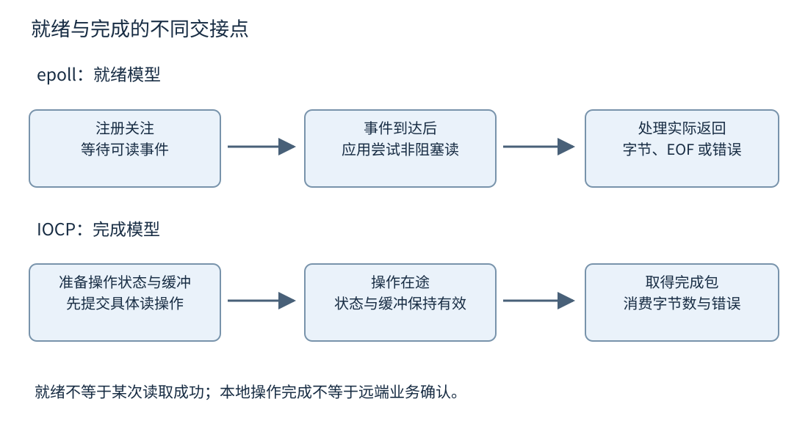
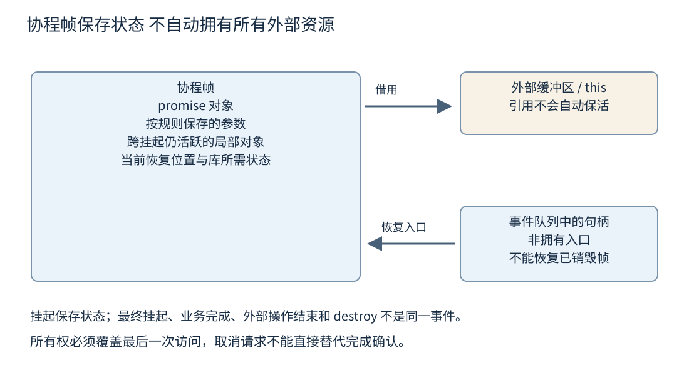
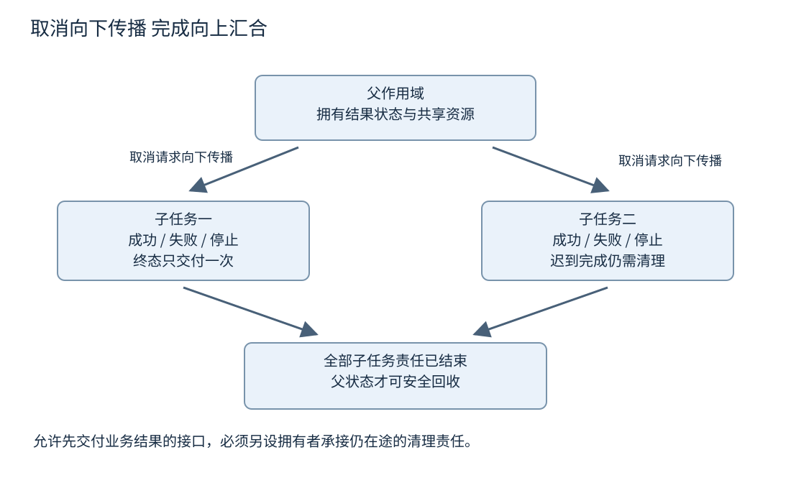

# 第十九章 异步 IO 协程与调度

**异步 IO**把发起操作与取得完成结果分开，使当前执行线程不必一直占在等待现场。**协程**允许函数保存状态并在挂起以后继续执行，使异步控制流可以写得接近顺序代码。两者能够配合，但不是同一种机制：操作系统负责 IO 契约，协程提供语言控制流，调度器决定后续工作在哪里运行。

一个完整异步操作至少有发起者、操作状态、外部事件来源和完成接收者。请求返回给发起者以后，缓冲区仍可能被内核使用；协程挂起以后，帧仍然保存局部状态；用户发出取消以后，完成事件仍可能到达。异步系统难点往往是这些生命周期交错，而不是少写几个回调。

本章以 C++20 协程规则 N4861 为主线，将 Linux epoll、Windows IOCP 与 io_uring 分别按其接口解释。C++26 执行控制只引用固定 N5050 作为前沿。所有代码与接口步骤均为未编译、未执行的教学示例，未在 Linux 或 Windows 上运行；接口能力与平台限制按核验日官方资料标注。[S1]

## 19.1 IO 多路复用 epoll 就绪通知与 IOCP 完成通知

### 19.1.1 阻塞 非阻塞 与异步分别描述什么

**阻塞调用**在操作暂时不能完成时，可以让当前线程等待。**非阻塞调用**在无法立即推进时返回一个相应结果，让调用者决定以后再试。**异步接口**通常允许提交一个操作，稍后从独立的完成路径取得它的结果。一个非阻塞 socket 加事件循环可以实现应用层异步流程，但非阻塞返回本身不是某次读操作已经完成的通知。

**IO 多路复用**使一个或少数线程能够等待许多 IO 对象的状态变化。它减少“一条连接专门占一个等待线程”的需求，却不消除连接状态、缓冲区和协议解析。收到可读通知后，应用仍要处理部分数据、消息边界、错误和连接关闭。

就绪模型问“这个对象现在值得尝试某种操作吗”，完成模型问“先前提交的这个操作现在以什么结果结束”。两者都可能支持高并发，但调用顺序与资源所有权不同。抽象库可以隐藏差异，底层适配层却必须保留它们的真实契约。

即使网络栈报告读或写操作完成，也要确认完成层级。一次发送完成可能只意味着系统接受了数据或不再使用某个用户缓冲区，不等于对端应用已经处理请求；文件写调用完成也不自动等于断电后数据持久。协议确认与持久化是更高层或另一接口的责任。

### 19.1.2 epoll 管理关注集合与就绪事件

Linux 的 epoll 维护应用注册的关注对象，并通过等待接口报告相关就绪事件。典型流程是创建 epoll 实例，使用 `epoll_ctl` 加入或修改关注项，再通过 `epoll_wait` 取得事件集合。epoll 本身没有替应用把 socket 数据读到业务缓冲区。[S2]

**水平触发**可以理解为只要相关就绪条件仍成立，就可能继续报告；**边缘触发**关注状态变化带来的通知。在边缘触发模式下，官方文档强调非阻塞描述符与持续处理到 `EAGAIN` 的使用方式，避免尚有未处理数据却又进入等待、没有预期新边缘唤醒的问题。[S2]

“读到 EAGAIN”不是忽略所有其他返回值。正数表示本次取得的字节数，应交给解析器累积；零可能表示流式读取已到 EOF；错误需要区分被信号中断、暂时不可读与真正失败。写操作也可能只写入部分缓冲区，需要保存剩余偏移并在后续可写时继续。

就绪是一个可能已经变化的观察。另一个线程可能先消耗数据，或者状态在事件返回后改变，因此事件循环使用非阻塞操作并正确处理 `EAGAIN`，比假定“一有事件这次读取一定成功”更稳健。错误与挂断事件也需要与尚未读取的数据一起按接口语义处理，不能只见挂断就无条件丢弃全部缓冲内容。

### 19.1.3 边缘触发的排空要求与公平性

若某个连接不断产生数据，事件处理函数一口气读到暂时无数据，可能长时间占住事件循环，使其他连接、定时器与取消响应延迟。正确性需要不丢失继续处理的机会，公平性需要限制一次处理的预算，二者必须一起设计。

一个常用思路是在用户态维护就绪工作列表：连接只要尚未确认排空，就保留为可继续处理的任务；一次最多处理某些字节或若干消息，预算用尽后轮转到其他连接，而不是直接忘记它并重新依赖下一个边缘。官方 epoll 文档也讨论了饥饿与就绪列表的问题。[S2]

`EPOLLONESHOT` 可以在一次事件交付后暂时禁用该关注项，使应用完成处理后显式重新激活。它有助于组织同一连接的处理责任，但不自动解决注册、关闭和重新激活竞争。忘记重新激活会让连接沉默；在状态尚未稳定前重新激活，则可能引入并发处理。

描述符编号还会复用。事件里保存一个整数 fd，并在异步任务稍后执行时仅凭整数查找连接，可能把旧事件错误关联到新连接。应结合连接对象生命期、代际标识、事件批次清理与 epoll 的实际注册语义设计，不能假设关闭某个编号会自动清除应用已经取出的所有旧事件。

### 19.1.4 IOCP 交付已提交操作的完成包

Windows 的 **IOCP**，即 IO Completion Port，把已关联句柄上重叠 IO 的完成包组织到一个完成端口，工作线程从端口取出结果。应用通常先准备缓冲区与 `OVERLAPPED` 操作状态，提交读写，稍后由完成路径取得字节数、错误与操作关联信息。[S3]

这与 epoll 的方向不同。epoll 通常先报告可尝试读，再由应用调用 read；IOCP 通常先提交具体读操作，再接收这次操作的完成。不能把一个可读事件当成已有缓冲区写入完成，也不能把完成包当成必须再次发起同一个读才算完成。

每个尚未完成的重叠操作需要符合接口要求的独立操作状态；缓冲区和 `OVERLAPPED` 在操作结束前不能随意释放、移动或重新用于不相容操作。`ReadFile` 的官方文档明确说明缓冲区在完成前的有效性要求。把它们放在已经返回函数的栈上，是典型生命周期错误。[S4]

提交调用可能报告操作立即完成，也可能报告正在进行。完成包是否仍会到达与句柄、操作类型及通知模式有关，例如专门设置的跳过同步成功通知模式会改变路径。适配层必须按所用 API 与标志处理，不能既在立即返回时完成一次，又在之后的完成包中再完成一次。[S4] [S5]

IOCP 的并发度设置约束关联工作线程的运行组织，不等于简单创建固定数量线程，也不保证每个完成回调总在同一个线程。完成包的排队与线程唤醒规则也不能被等同于业务请求严格按提交顺序完成。应用仍需要自己的顺序、线程亲和与公平策略。[S3]



图 19-1 就绪与完成的不同交接点。图中“完成”只针对相应本地操作，不隐含对端业务确认或持久化成功。

### 19.1.5 完成失败也需要消费并释放责任

`GetQueuedCompletionStatus` 返回 false 时，不能直接当成“没有事件”。如果取得了非空 `OVERLAPPED`，可能表示取到一个以失败状态完成的 IO；如果没有操作指针，则应按超时、端口状态或其他错误分析。成功标志、操作指针与错误码共同决定发生了什么。[S6]

失败完成仍然是一个终态，需要记录错误、解除该操作占用的缓冲区资格、唤醒等待者，并推进连接关闭或重试状态。忽略失败完成可能让在途计数永远不归零，最终关闭卡住；把失败当成零字节成功又可能误判协议 EOF。

`CancelIoEx` 请求取消匹配操作，但不会等待它们全部结束，也不能保证取消一定抢在正常完成之前。完成可能报告成功、取消或其他错误，应用仍需观察最终结果。请求取消后立即释放缓冲区或 `OVERLAPPED`，会把取消竞争变成释放后使用。[S7]

因此底层操作对象通常至少需要区分“尚未提交”“在途”“终态已确定”“完成已交付”“可回收”。实现未必用五个枚举值，但必须存在等价责任。一个简单的 `cancelled=true` 不能告诉内核是否仍在使用内存，也不能证明用户回调已经不会再到达。

### 19.1.6 用一个分帧协议检验接口理解

设消息头用四字节长度描述后续负载，消息长度可能超过单次接收缓冲区。epoll 报可读后的一次 read 可能只得到两个头字节，也可能得到两个完整消息加半个第三消息。解析器必须维护已收集头部、已知长度、剩余负载与最大合法长度，不能把一次通知等同于一条消息。

IOCP 读完成同样可能只得到请求范围内的一部分数据，具体取决于操作与句柄类型。应用仍要根据实际字节数推进解析状态，不会因为使用完成模型就自动获得消息边界。TCP 提供字节流，业务分帧仍由协议负责，第三十三章会进一步讨论网络协议层。

关闭时还要区分传输结束与协议完整。已经收到一半声明长度的负载就遇到 EOF，应报告截断或协议错误，不能把它当成正常空消息。取消发生在解析中途，可以丢弃未提交的内部状态，但不能撤回已经交付上层的消息，除非上层协议另有事务语义。

面试追问“epoll 是否比 IOCP 更底层、更快”，应说明它们是不同系统的接口模型，成本取决于具体负载与实现。更有意义的比较是相同业务、缓冲区策略、线程数和错误语义下的端到端资源与延迟，而不是根据通知名称给性能排座次。

### 19.1.7 把三次读取还原成两条消息

沿用四字节大端长度头，第一条消息的负载是六字节 ABCDEF，第二条是两字节 OK。人为构造三次读取：第一次只有头部前两个零字节；第二次取得剩余头部字节 0、6 和负载 ABC；第三次取得 DEF、下一条完整长度头 0、0、0、2 以及 OK。这是教学输入分段，不是抓包结果。

第一次读取以后，解析状态是“头部已收两字节”，不能读取尚不存在的长度字段，也不能把本次读取长度 2 当成消息长度。第二次先补齐四字节头，解出长度 6，检查它不超过业务上限，再把 ABC 放入负载累计区，记录还缺三字节。第三次先消费 DEF，交付完整 ABCDEF，然后继续处理同一个接收块里的下一条长度头与 OK，交付第二条消息。

事件循环在每次 read 返回正数后都推进这个解析器，解析器可以交付零条、一条或多条消息。调用者必须知道输入块中的哪些字节已经消费，哪些被保留。若把接收缓冲区的 span 直接交给上层长期保存，下一次读取覆盖缓冲区就可能破坏已经交付的消息；需要复制、转移拥有权或维持可追踪的借用期限。

若第二次头部声明长度极大，不能先按它分配内存再检查是否允许。应先验证长度编码、整数转换、总消息上限和连接预算，再决定分配或拒绝。如果协议允许零长度消息，要让该状态立即完成而不进入一个“等待至少一字节”的死循环。错误输入是状态机的一条普通路径，不能只在完整正常消息上推导控制流。

发送端也要保存部分完成。若十字节待发送数据第一次只被接受四字节，剩下六字节仍归操作状态持有；下次可写或下一次发送操作只推进剩余区间。完成字节数、协议消息完成与缓冲区可复用三者在具体 API 下可以有不同边界，适配器必须逐项落实。

## 19.2 Coroutine Frame suspend resume 与生命周期

### 19.2.1 协程是可挂起的函数状态

C++20 协程是可以在某些位置挂起、以后恢复继续执行的函数。`co_await`、`co_yield`、`co_return` 参与定义其控制流；编译器依据返回类型及其 promise 相关契约生成所需状态与操作。协程不自动创建线程，不自动注册 IO，也不自带一个通用调度器。[S1]

**协程帧**保存挂起后仍需要的状态，包括 promise 对象、按规则保存的参数以及跨挂起点仍活跃的局部对象等。它不应被想象成给每个协程分配一个完整操作系统线程栈。实现可以采用动态分配，也可以在满足条件时消除分配；帧大小与布局不是跨工具链固定 ABI。

协程调用通常返回一个由库定义的对象，例如 task、generator 或自定义结果句柄。这个返回对象的析构、移动与等待语义决定帧的管理方式，语言没有规定所有名为 Task 的类型都一样。`std::coroutine_handle` 是访问协程状态的非拥有式入口，本身析构不会自动销毁帧。

协程的 `promise_type` 也不是第十六章 `std::promise` 的同义词。它是编译器与协程返回类型之间的定制接口，决定返回对象、初始挂起、结果处理、异常处理与最终挂起等。库可以用它构造 future 风格任务，也可以构造惰性生成器，具体语义来自该库。

### 19.2.2 awaiter 的三个阶段决定控制权

在完成相关定制查找之后，一个 awaiter 通常提供 `await_ready`、`await_suspend`、`await_resume` 三个操作。`await_ready` 判断是否无需挂起即可继续；若需要挂起，`await_suspend` 获得当前协程句柄并安排后续恢复；恢复后，`await_resume` 取得结果或报告错误。[S1]

若 `await_ready` 返回 true，流程可以直接执行 `await_resume`，因此 `co_await` 不保证一定发生线程切换或异步排队。若 `await_suspend` 返回 bool，false 表示不保持挂起并继续恢复；若返回另一个协程句柄，语言支持向该协程转移恢复控制；void 返回则采用相应挂起路径。

更细的规则是：在调用 await_suspend 时，当前协程已经处于可以被恢复的挂起状态。因此 await_suspend 一旦把句柄发布给另一个线程，对方可能在 await_suspend 尚未返回时就恢复协程，甚至使 awaiter 随后被销毁。发布句柄以后继续访问 `this` 或帧中的字段，必须有独立的安全证明，不能以“当前函数还没有返回”假设它们仍然存在。

注册完成回调还可能同步触发。例如一个等待对象已经就绪，注册接口在当前线程立刻调用回调。适配层必须同时处理立即完成与稍后完成，避免丢失恢复、重复恢复或在尚未初始化完成状态时被回调使用。只测试真正慢 IO 的路径，常会遗漏这类重入问题。

### 19.2.3 帧保留局部对象 不自动保留所有借用

按值参数通常会按协程规则保存到状态中；引用参数仍然是对外部对象的引用。传入 `std::span`、`std::string_view` 或裸指针，只保存访问描述，并不会复制底层存储。函数挂起以后，调用者离开作用域可能使这些视图悬空。[S1]

```cpp
// C++20 风格接口示意，未编译、未执行。
// Task、OwnedBuffer、OwnedSocket、async_read_some 是假设库类型，非标准库接口。
// 假设 Task 保持帧直至操作终态，OwnedBuffer/OwnedSocket 真正持有相关资源。
Task<std::size_t> read_with_owned_state(OwnedSocket socket,
                                       OwnedBuffer buffer) {
    const auto bytes = co_await async_read_some(socket, buffer);
    co_return bytes;
}
```

这个接口形状把 socket 与 buffer 的拥有对象放在协程参数中，比接收短命局部数组的 span 更容易解释生命期。但它仍依赖 async_read_some 的契约：完成或取消确认之前必须保留帧，操作不能在协程被销毁后继续访问缓冲区。按值参数解决一条所有权边，不会自动解决外部回调与内核在途操作。

成员协程还可能借用 `this`。调用 `object.start()` 并取得一个任务，不表示 object 已被复制到帧；对象若在挂起期间销毁，恢复后的成员访问仍可能悬空。可以让外层作用域等待任务结束、显式传递稳定所有权，或者将需要的数据移入独立操作状态，具体选择取决于是否允许延长对象生命。

带捕获的协程 lambda 也需要特别审查。捕获内容属于闭包对象，不能仅因为按值捕获就推断它们一定作为独立拥有值自动迁入协程帧。立即调用一个短命闭包并保留其挂起任务，可能使后续访问依赖已销毁闭包。把必要状态作为显式按值参数传递给协程，往往更容易核查。[S1]

### 19.2.4 初始挂起 最终挂起与销毁不同

`initial_suspend` 决定协程在正式运行主体前是否先挂起。惰性任务可以在调用时只建立状态，直到有人启动或等待才执行；急切任务可能立刻开始，运行到第一个真正挂起点。哪一种适合取决于库契约，不能仅根据返回对象名猜测。[S1]

`co_return` 将结果交给 promise 的相应返回处理，之后进入收尾与最终挂起。最终挂起可以让结果接收者或外部拥有者有机会观察状态并最终销毁帧。抵达最终挂起不等于帧已经自动释放，返回对象析构也不一定具有你想象的等待语义。

`resume()` 与 `destroy()` 有严格前提。恢复已经处于最终挂起点的协程不合法；销毁操作要求协程处于符合要求的挂起状态，不能与另一个线程正在恢复执行它并发进行。空句柄、悬空句柄与仍有效的已完成句柄也不同，不能只用地址非零判断可以恢复。[S1]

如果一个外部 IO 回调保存了句柄，任务拥有者决定取消并销毁帧，必须先确保回调已经撤销或其最终完成被协调到不会再恢复该帧。句柄像一个异步借用入口，销毁帧不会自动遍历所有事件队列删除它。第九章的“地址不负责保活”在协程里仍然成立。



图 19-2 协程帧中的状态与外部借用。帧解决挂起状态保存，所有权边界仍由返回类型、参数与异步操作契约决定。

### 19.2.5 异常如何穿过挂起边界

协程主体未处理的异常通常交由 promise 的 `unhandled_exception()` 处理。库可以保存异常，在等待者取得结果时重新抛出，也可以采用其他明确策略。语言提供入口，并没有要求所有协程异常都自动跨线程到达某个调用者。[S1]

`await_resume` 可以把失败完成转换为异常或结果类型；`await_suspend` 本身抛异常也有专门的恢复与传播规则。编写适配层时，注册外部操作失败、分配操作状态失败与操作稍后失败是不同阶段，不能只在最终回调里设置错误。

更危险的是先成功发布句柄或提交外部操作，随后 await_suspend 的其他步骤又抛异常。此时同步异常路径与外部完成路径可能都试图继续协程。应把可能失败的准备放在安全发布之前，或使用有明确回滚与单次终态仲裁的机制，而不是仅在末尾补一个 catch。

析构清理要与异常传播协调。如果在途 IO 仍借用帧内缓冲区，异常离开协程主体并不自动使缓冲区可立即销毁。框架需要保证操作已经终止，或者把其状态转交给能继续活到完成的拥有者。这也是成熟异步库的取消与作用域管理比表面语法重要的原因。

### 19.2.6 跨挂起持锁会改变死锁与所有权问题

在 `co_await` 前取得普通 mutex，挂起后继续持有它，通常需要非常谨慎。若恢复发生在另一线程，普通 mutex 的拥有者规则可能被违反；即使始终在同一线程，协程挂起期间其他任务若等待同一把锁，也可能占住恢复所需执行资源，形成死锁。

可以先在锁内取得独立快照，解锁后执行异步操作，恢复后再加锁并检查版本是否仍适用。这个流程需要明确的重新验证，因为挂起期间共享状态可以发生变化。另一种设计使用具备协程契约的异步互斥设施，但它仍需处理取消、持有时间与公平性，不能自动消除所有等待环。

线程局部变量也不等于协程局部变量。协程如果迁移线程，恢复后看到的是当前线程的 thread_local 状态。请求身份、追踪上下文或临时分配器若需要随协程移动，应该使用明确传递的操作上下文，或选定框架提供的机制，而不是假设线程身份始终不变。

面试中问“协程为什么轻量”，可以说明它通常保存所需状态并把等待表示为挂起，避免每个等待操作独占一个 OS 线程。但帧分配、调度队列、回调注册和内核操作仍有成本；把一百万个挂起协程各自持有大缓冲区，并不会因为没有一百万个线程就自动节省内存。

## 19.3 Executor Scheduler 取消与结构化并发

### 19.3.1 执行位置与执行时间需要显式契约

**执行器**通常描述把工作交给某个执行环境的能力，**调度器**描述怎样安排工作开始或恢复。不同库对这两个词的接口划分不完全相同，应以具体契约为准。它们可以对应一个事件循环、线程池、图形用户界面（GUI）的主线程或特定硬件执行上下文。

协程挂起与恢复不自带这些选择。awaiter 可以直接在完成线程恢复协程，也可以把恢复排入指定队列，还可以同步继续。调用者需要知道是否允许内联执行、是否保持线程亲和、是否串行化同一对象的回调，以及调度失败如何报告。

例如 GUI 对象通常要求在特定线程访问。网络读完成发生在 IO 线程以后，协程如果直接继续更新窗口，就可能违反 GUI 契约。适配层需要显式切回相应调度环境。反过来，把 CPU 密集计算放在 GUI 或单线程事件循环里，会阻塞其他事件，即使函数内部使用协程语法也一样。

多线程事件循环还可能同时执行同一连接的不同回调。某些库提供 strand 一类串行执行保障，使关联处理器不会并发运行，但它不一定固定为同一条 OS 线程，也不一定提供所有独立提交之间任意想象的排序。需要按库文档区分串行性、亲和性和顺序性。[S8]

### 19.3.2 内联完成会带来重入与栈深问题

如果每一层异步适配都在结果已经就绪时立即调用下一层，深链可能在一次调用里连续执行许多工作。好处是减少排队与切换，代价是重入、栈深、公平性与不可预测的调用时长。接口使用者不能假定“调用异步函数以后，它的回调一定晚于当前函数返回”。

一个对象在调用注册函数前先把状态改到完整的“等待中”，通常比注册后才设置标志更安全，因为注册可能同步完成。若结果回调会销毁对象，注册调用返回以后再访问成员也需要证明对象仍存活。这与 await_suspend 句柄发布后不能随意访问自身，是同一类所有权问题。

调度器可以选择始终排队，或者在某些条件下内联；两种策略都有成本。始终排队增加队列操作与缓存切换，但更容易给出调用边界；内联节省调度但需要控制递归与预算。对低延迟系统，应该测量实际完成链长度与队列延迟，而不只是某一次 post 的耗时。

**公平预算**可以限制每轮处理多少完成项、多少字节或多少计算时间，让定时器和其他连接获得机会。预算耗尽时继续工作要被可靠重新排入，不能因为主动让出执行权而遗漏仍然就绪的任务。调度策略与 IO 边缘触发的语义因此需要一起设计。

### 19.3.3 取消必须沿操作树传播并最终汇合

取消是一种协作式请求。上层不再需要结果以后，可以向子操作传播停止意图，但每个子操作是否支持、何时完成、能否撤回副作用，都取决于其契约。标准 `stop_token` 可以传递请求，不能强制操作系统完成取消，也不自动解除第三方库的等待。[S9]

一个下载任务可能包含域名解析（DNS）、连接、传输层安全协议（TLS）握手、读取和写文件等子阶段。取消时需要停止当前阶段，防止开始后续阶段，并等待所有仍可能访问共享状态的操作进入终态。若 DNS 库不能取消，可以让其结果被安全忽略，但承载回调的状态仍要活到回调不再可能到达。

“只取最快结果”的并发竞速也需要处理失败方。第一个响应到达以后，父任务不能把其他请求的缓冲区立刻释放；它需要请求其余子任务停止，并按协议等待它们清理。否则逻辑上已经返回成功，后台仍可能访问离开作用域的数据。

完成与取消之间应有单一终态仲裁。成功、失败和停止通常只能交付一次，迟到完成需要被识别并安全清理。状态对象、结果消费者和在途资源可能在不同阶段释放，不能为了让回调“只执行一次”就过早回收它们共享的状态。

### 19.3.4 结构化并发把子任务生命期纳入作用域

**结构化并发**将并发子工作组织在明确的父作用域内，使父作用域不会在仍有未管理子任务时悄悄结束。子任务的完成、错误与取消沿结构汇合，借用关系也更容易限制在父作用域存活期间。它是一种任务生命周期组织原则，不是只要用了协程就自动具备的属性。[S9]

例如父任务同时请求两个独立数据源，等待两者完成后合成结果。如果其中一个失败，策略可以是取消另一个并等待其清理，再向上交付错误；也可以按业务选择收集两个结果。关键是无论哪条路径，父作用域都知道还有哪些子任务没有终止。

分离任务则把生命期转交给其他明确拥有者，例如长期运行的服务域。它不是必然错误，但必须有人负责错误、取消和最终回收。“fire and forget” 如果实际上意味着没有任何组件再负责，就把未完成工作与资源责任藏了起来。

结构化并发也不能使不合作的子任务立即结束。一个子操作永久阻塞，父作用域等待它就可能一直不返回。需要超时、隔离或可以安全脱离的外部拥有者时，应把这种例外作为显式设计，而不是让作用域析构暗中做无限等待。



图 19-3 请求取消与完成汇合。父任务可以先决定业务结果，但释放被子任务借用的资源仍须等到最后访问结束。

### 19.3.5 异步也需要背压

协程让等待线程数下降，容易诱使应用一次发起大量操作。每个操作仍占用帧、缓冲区、句柄、内核请求或远端容量。无限制地启动任务只是把第十六章的无界队列改写成无界在途状态，并没有消除资源压力。

背压可以限制并发操作数、总缓冲字节数、每连接待发送量、每租户预算和等待队列长度。大响应与小响应混合时，只限制任务数量往往不足。取消不再需要的请求还必须真正释放在途占用，否则上层看到“已经取消”，内部容量却迟迟无法归还。

在事件循环里不能用普通阻塞信号量随意等待容量，因为这个线程可能正是释放容量的完成处理者。应使用能够挂起任务而不占住执行线程的异步许可机制，或立即拒绝并让上层处理。许可的取得、提交失败归还、完成归还与取消竞争必须保持数量守恒。

系统关闭同样从停止接受新操作开始，随后请求取消或排空、继续驱动完成事件、等待在途计数归零，最后停止事件循环和销毁资源。如果先停掉负责交付完成的事件循环，再等待所有操作完成，就可能人为制造一个永远不能满足的等待。

### 19.3.6 C++26 执行控制与 C++17 执行策略不同

C++17 中算法的执行策略，例如并行执行策略，约束的是特定算法如何执行，不是一个通用异步 IO 调度框架。C++20 协程语言支持也没有自动补齐这套框架。应区分语言挂起机制、标准算法策略与库级异步执行组合。

C++26 固定 N5050 的执行控制设施，以 sender、receiver、operation state、scheduler 等概念组织异步工作。sender 描述操作及其可能完成方式，receiver 接收值、错误或停止，连接与启动建立操作状态及执行关系。P2300R10 是重要设计来源，具体纳入后的接口以 N5050 为准。[S10] [S11]

这些抽象有助于组合执行位置、完成渠道与取消环境，但不会自动把任意 OS IO 变成标准接口。平台仍需要适配器，operation state 仍必须活到契约允许销毁的时刻。所选标准库是否实现具体组件，需要单独核验，不能仅看编译选项写了 C++26。

本章不使用前沿库名称伪装 C++20 可直接编译代码。前面 Task 示例明确是库特定接口形状；学习其生命周期后，再对照目标项目所用库的 API，能避免把同名 task、executor 或 cancel 当成跨库通用契约。

### 19.3.7 一次超时竞速中的两条完成路径

考虑一个父任务并发等待网络响应与定时器。网络先完成时，父任务决定返回响应，随后请求定时器取消；定时器先触发时，父任务决定超时，随后请求网络取消。这个业务选择很简单，资源管理却不能只留下一个 winner 指针。

假设网络在时刻 a 完成，定时器回调已经在另一个执行线程排队，却尚未运行。父任务把网络标记为赢家，并请求取消定时器。取消接口可能告诉它“无法撤销已经排队的回调”，因此父任务仍须保留竞速状态，直到定时器回调到达并观察已经有赢家。迟到者不再交付业务结果，但要释放自己的在途责任。

反过来，定时器先赢时，网络取消请求可能与正常响应交错。响应可以被丢弃或交给策略处理，但读取缓冲区必须活到内核操作真正完成。若上层要求尽快看到超时，可以让业务结果先完成，同时把底层清理责任留在独立状态中；这意味着该接口的“返回”与“全部资源回收”不是同一个事件，应当明确，而不是隐瞒后台积压。

另一种结构化设计让组合操作等两个分支都进入终态以后再返回，其中输家收到取消请求后尽快结束。它更容易保证作用域结束时没有剩余借用，但超时返回的实际时刻可能晚于定时器触发。选择哪种语义取决于需求，不能同时无条件承诺严格返回期限、任意不可取消子操作与立即释放所有状态。

这个例子也说明 deadline 不是一个简单 timer 对象。它约束的是调用者愿意等待到什么时候，取消机制决定剩余工作如何停止，资源域决定迟到完成归谁负责。三个概念应该能分别在接口文档与状态机中找到对应位置。

## 19.4 Async IO 批处理 Zero Copy 语境及内核接口限制

### 19.4.1 提交队列和完成队列改变交互方式

Linux 的 io_uring 以提交队列与完成队列组织操作。应用准备提交队列项（SQE），内核处理后以完成队列项（CQE）报告结果；共享环与批量提交可以减少某些交互开销。提交项、完成项、用户关联标识与缓冲区生命周期共同构成操作协议。[S12]

完成项的结果字段按接口约定报告成功值或负错误码，不能沿用所有同步系统调用“返回 -1 再读 errno”的习惯。不同操作码、标志与内核版本支持不同功能，需要核查实际运行内核和库版本，不能只凭头文件定义存在就假定内核支持。

io_uring 也不等于所有工作都由硬件真正异步执行。某些操作可以立即完成，某些路径可能使用内核工作线程或其他机制；具体语义与文件类型、标志和内核实现有关。异步 API 描述发起者如何取得结果，不保证底层绝不阻塞某个线程。

多次完成、缓冲区选择、链接操作和零拷贝通知等特性，会改变“一次提交对应一个最终完成”的简单模型。适配层必须根据相应完成标志判断是否还有后续事件，不能收到第一条 CQE 就统一释放所有操作状态。例如多次接收通过 IORING_CQE_F_MORE 表示仍有后续完成；零拷贝发送的首条 CQE 若带该标志，还需等带 IORING_CQE_F_NOTIF 的通知确认相应内存可以复用。这里按各操作专页解释扩展，不能把概述页的简化一一对应模型套到全部操作。[S16]、[S17] 本文不宣称已经测试所有扩展或所有内核组合。

### 19.4.2 批处理用等待成本交换调用开销

**批处理**把多个请求或完成项集中处理，摊薄系统调用、队列管理和共享状态更新的开销。一次收取十个完成，可能比十次只收取一个更省固定成本；但若为了凑够十个而等待，最早到达的操作延迟也会增加。

可以用双条件控制：达到批量阈值就提交，或者最早等待项达到时间预算就提交。阈值与预算要结合负载波动，低流量时不能永远等不满的批次，高流量时也不能让单个连接占据全部批量位置。

批量完成处理还要注意回调成本。取出很多完成包后，在同一循环连续执行长回调，会延迟新的 IO 与定时器。可以将“收取完成并更新操作状态”与“执行较重业务续体”分开调度，同时保持必要顺序和背压。

批量不是压缩工作总量的魔法。每个字节仍需被协议处理、校验或发送，每个失败仍需交付结果。测量应该包含批次等待时间与端到端尾延迟，不能只报告每个系统调用平均处理了更多请求，就宣称用户体验更好。

### 19.4.3 零拷贝必须说明省掉哪一次复制

**零拷贝**通常表示在某条数据路径上避免特定的内存复制，不是系统中没有任何数据移动。磁盘、内存、缓存、设备与网络之间仍然要传输数据，协议头、加密、校验、对齐与设备限制也可能要求复制。

Linux `sendfile` 可以让文件与支持的输出对象之间的数据路径避免通常的用户态读入再写出；`splice` 围绕管道与支持的文件描述符进行数据转移。两者都有对象类型、偏移、长度与实现限制，不能把函数名理解为所有文件到所有目的地都无条件零复制。[S13] [S14]

`MSG_ZEROCOPY` 提供另一种语境：应用把缓冲区交给内核并承诺在允许复用前保持内容，内核稍后通过通知告知何时可以修改或复用。该标志是复制规避提示与通知契约，不保证每次都消除复制；有些路径会退回复制，并通过相应状态说明。[S15]

最重要的区别是零拷贝通知可能表示内核不再持有用户页面，不等于数据已经被对端应用处理，甚至不能一概等同于全部传输完成。缓冲区资格、网络传输、协议确认是不同事件。把其中一个完成用于另一个目的，会产生数据损坏或错误业务结论。

### 19.4.4 减少复制往往延长借用期限

普通复制发送可以在数据被系统复制后较早复用用户缓冲区；复制规避路径则可能继续借用原页面。吞吐上的收益可能伴随更多在途内存、更复杂的完成关联和更长的缓冲区占用。小消息还可能因为页面固定与通知处理开销而得不偿失。[S15]

假设应用有一块循环使用的发送缓冲，发送后马上填入下一条消息。改为零拷贝标志却不改变复用逻辑，内核可能仍在读取这块内存，发送内容就会被后续覆盖。正确改造需要为在途数据分配独立区域或引用计数，将每个通知映射到相应范围，直到资格归还后再复用。

通知可以批量合并或以不同顺序到达，关联键也可能回绕。因此不能只维护一个“最后收到通知编号”，就推定所有较小编号都安全，除非选定接口明确保证这种顺序。应按接口的区间、标志与回绕规则维护状态，并测试取消与连接关闭时的剩余通知。

注册缓冲区、固定页面或长期映射还会影响系统资源预算。它们可能降低重复注册成本，也可能占用难以回收的内存或受到权限与限额限制。优化报告应包含在途字节数与系统内存压力，不能把复制减少当成唯一目标。

### 19.4.5 接口限制需要按运行环境发现

内核支持、文件系统支持、设备驱动能力与运行权限是不同层次。某个 io_uring 操作在当前内核存在，不代表它对所有文件系统、所有标志都可用；容器或安全策略也可能限制相关接口。错误路径与降级策略是接口适配的一部分。

降级必须保持对外语义。异步读降级为线程池中的阻塞读，可以维持上层异步完成形状，但线程池容量、取消能力和关闭时长会不同。不能在降级后仍宣称相同并发上限或相同取消响应。如果后备方案会阻塞事件循环，通常需要重新组织执行位置。

探测可以结合明确特性查询、尝试受控操作与处理不支持错误；结果应关联实际内核、库、文件类型与参数。仅凭开发机测试成功，不能推断部署环境同样支持。动态网页文档的最新版接口，也不能代替项目固定版本的能力矩阵。

安全方面，缓冲区长度、偏移、整数溢出与未完成状态关联都是攻击面。高并发使同一个错误更容易变成跨请求数据混淆。无论底层接口多高效，应用仍需验证输入范围、限制在途资源，并确保完成事件不会被错误关联到另一个请求。

### 19.4.6 一个异步读取适配器的状态机审查

假设要把一个平台读操作包装成可 `co_await` 的任务。准备阶段先建立拥有缓冲区的操作状态，设置结果渠道与关联编号，再决定是否立即完成或提交。提交成功后，至少有一个明确拥有者保持状态存活；等待者挂起后，完成路径有权设置结果并安排一次恢复。

取消到达时只竞争终态或请求底层停止，不能无条件释放状态。若正常完成先获胜，取消路径需要接受已完成结果；若取消获胜，底层迟到完成仍必须被消费并解除借用。某些库把“用户结果已交付”与“操作资源可回收”拆成两个内部阶段，正是为了处理这段差距。

审查应穷举关键交错：提交立即失败，提交同步成功，回调在注册期间内联，回调与取消并发，取消返回后迟到完成，恢复任务排队时执行器关闭，以及调用者提前丢弃返回对象。每个交错都要能指出结果是否已交付、谁还持有缓冲区、谁会最后释放状态。

最后检查事件循环的停止条件。如果没有完成驱动，所有在途操作可能永远无法归零；如果停止后仍接受新任务，又会产生没有执行者的挂起帧。正确关闭通常先关闭入口，保持完成驱动，等待或转移全部在途责任，再销毁执行环境。顺序看似繁琐，却比线上偶发的双重恢复或退出崩溃更容易验证。

### 19.4.7 高级面试问题的完整回答

“用了协程为什么仍然阻塞？”因为协程只在真正的挂起点释放控制权，内部普通文件调用、锁等待或 CPU 计算仍可能阻塞当前线程。需要检查 awaiter 是否真的异步、底层是否支持以及工作是否运行在合适执行环境。

“epoll 通知来了为何仍然 EAGAIN？”因为就绪不是对某次读取成功的永久承诺，状态可能被其他执行者消耗或改变。应用应使用非阻塞操作并把 EAGAIN 当成协议中的正常暂时状态，再按触发模式保持后续处理机会。

“取消返回后可以 delete 操作对象吗？”只有接口契约明确证明底层不再借用它、没有回调会再访问或恢复时才可以。CancelIoEx 的请求返回不提供这种通用证明，协程 stop_token 也不提供。应等待最终完成或交给能承担迟到完成的所有者。

“零拷贝为什么可能更慢？”因为减少一次复制可能增加页面固定、通知、引用管理、缓存冷访问和在途保留。小负载、回环路径或不支持规避复制的设备还可能退回复制。应该用真实数据路径和同等完成语义测量，而不是只检查是否设置了某个标志。

“如何判断一个异步封装可靠？”能说清就绪或完成模型、所有权与挂起边界、同步完成与延迟完成、取消终态仲裁、执行位置、背压以及关闭后的最后一次访问。语法整洁是结果，状态与生命周期证明才是基础。

## 本章资料与核验范围

C++20 协程依据 [S1] 的 `[dcl.fct.def.coroutine]`、`[expr.await]` 和协程句柄契约。平台接口依据 Linux man-pages、Linux kernel 文档及 Microsoft Learn，动态文档均于 2026-10-03 核验。Asio strand 仅作为具体库契约示例。C++26 只用 P2300 设计材料与固定 N5050，不宣称 C++20 已具备相同标准库。

所有接口流程、帧图、分帧协议与状态机是作者教学构造。代码明确使用假设库类型，未编译、未执行；本章没有 IO 压测、内核能力探测或平台兼容性运行结果。SVG 渲染检查只验证图面可读。

[S1]: https://www.open-std.org/jtc1/sc22/wg21/docs/papers/2020/n4861.pdf
[S2]: https://man7.org/linux/man-pages/man7/epoll.7.html
[S3]: https://learn.microsoft.com/en-us/windows/win32/fileio/i-o-completion-ports
[S4]: https://learn.microsoft.com/en-us/windows/win32/api/fileapi/nf-fileapi-readfile
[S5]: https://learn.microsoft.com/en-us/windows/win32/api/winbase/nf-winbase-setfilecompletionnotificationmodes
[S6]: https://learn.microsoft.com/en-us/windows/win32/api/ioapiset/nf-ioapiset-getqueuedcompletionstatus
[S7]: https://learn.microsoft.com/en-us/windows/win32/api/ioapiset/nf-ioapiset-cancelioex
[S8]: https://www.boost.org/doc/libs/latest/doc/html/boost_asio/overview/core/strands.html
[S9]: https://www.open-std.org/jtc1/sc22/wg21/docs/papers/2020/p2175r0.html
[S10]: https://www.open-std.org/jtc1/sc22/wg21/docs/papers/2024/p2300r10.html
[S11]: https://www.open-std.org/jtc1/sc22/wg21/docs/papers/2026/n5050.pdf
[S12]: https://man7.org/linux/man-pages/man7/io_uring.7.html
[S13]: https://man7.org/linux/man-pages/man2/sendfile.2.html
[S14]: https://man7.org/linux/man-pages/man2/splice.2.html
[S15]: https://docs.kernel.org/networking/msg_zerocopy.html

[S16]: https://man7.org/linux/man-pages/man3/io_uring_prep_recv_multishot.3.html
[S17]: https://man7.org/linux/man-pages/man3/io_uring_prep_send_zc.3.html
