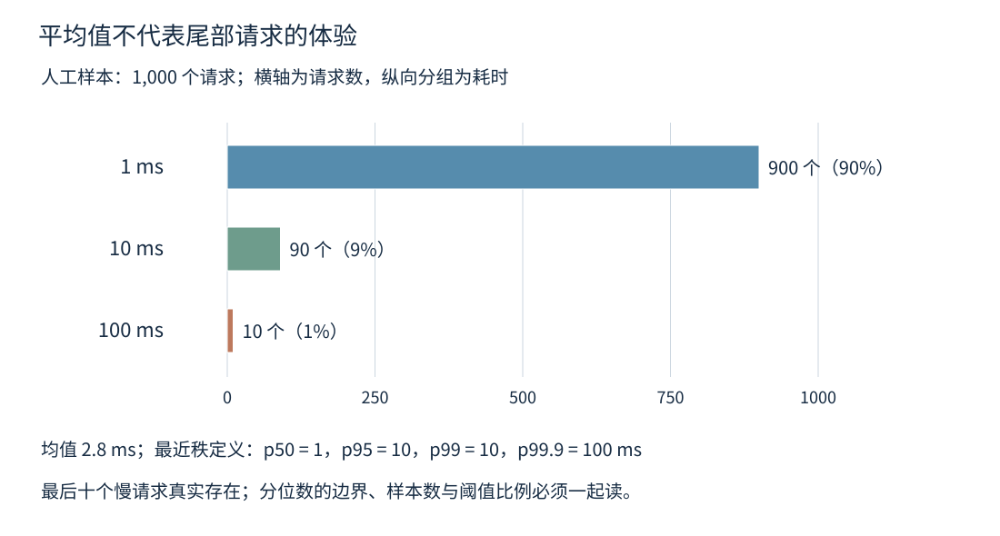
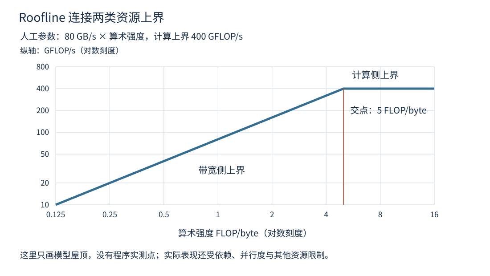
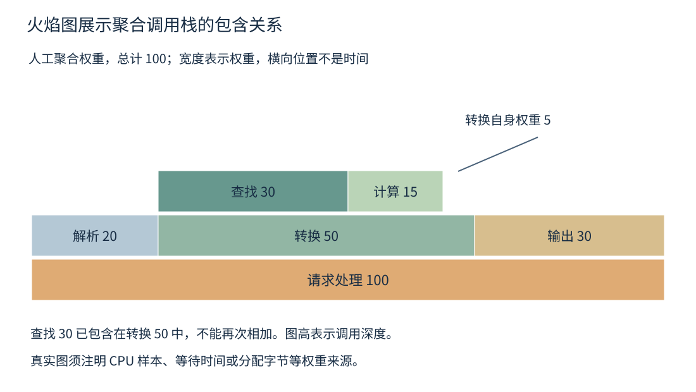

# 第二十章 性能优化是一套实验方法

**性能优化**是在正确性与资源约束不变或明确变更的前提下，通过可重复证据改善完成工作的成本。成本可以是用户等待时间、持续吞吐、CPU、内存、能耗或费用。没有固定工作内容与指标，“更快”可能只是少做了验证、漏掉了请求，或者把成本转移到了没有测量的地方。

**实验**需要一个可以被反驳的假设、可比较的基线、明确控制的变量和足以判断差异的观察。性能分析先回答时间和资源在哪里，再提出改动；测量结果与解释必须分开。某个计数器上升支持一个线索，不会自动证明根因；一次最快运行也不代表用户将稳定得到同样收益。

本章把延迟、负载、硬件与诊断工具组织成一条证据链。所有数字案例和三幅图均使用明确标注的人工数据或模型参数，不是本书运行所得。所有 C++ 片段未编译、未执行，所有命令未执行；工具行为按 2026-10-03 官方资料核验，不宣称已经在某个项目环境中得到可用结果。

## 20.1 Latency Throughput 尾延迟与排队

### 20.1.1 延迟与吞吐先确定测量边界

**延迟**是一项工作从指定开始事件到指定结束事件的经过时间。**吞吐量**是单位时间内完成的工作数量。处理器指令、函数调用、文件转换和网络请求都可以有这两个指标，但测量边界不同，数字不能直接互相替代。

请求延迟可以从客户端计划发送时开始，也可以从实际发出、服务器接收、进入工作队列或业务计算开始时计时。结束点可以是发送缓冲区已交给内核、客户端收到完整响应或客户端完成解析。报告必须写出起止事件，否则“延迟降低一半”可能只是排队时间被移出计时范围。

吞吐的分子也应说明是尝试、接受、完成、成功还是满足期限的有效请求。一个服务通过快速拒绝大量请求，使每秒返回数量增加，不等于成功处理能力提高。失败率、超时率与负载生成器实际发送量应该与吞吐一起报告。

**服务时间**是工作真正占用某个服务资源的时间，**排队时间**是等待该资源的时间，**响应时间**可以包含这两者以及网络等其他阶段。不同请求可能重叠，不能把每个请求 CPU 时间相加后直接当成墙上经过时间，也不能用 CPU 利用率解释全部外部等待。

### 20.1.2 平均值会隐藏少数昂贵请求

**分位数**描述数据分布中的位置。p50 是中位数，p99 对应约百分之九十九样本位于其下或不大于它的边界；具体有限样本算法可能插值或采用不同秩定义，跨工具比较需要固定算法与单位。尾延迟通常关注 p95、p99、p99.9 等高分位，而不是一个脱离样本量的“最慢百分之一”标签。

构造一千个请求：九百个耗时 1 ms，九十个耗时 10 ms，十个耗时 100 ms。平均值是 `(900×1 + 90×10 + 10×100) / 1000 = 2.8 ms`。用最近秩定义，比例 q（0 < q ≤ 1）的分位取排序后第 `ceil(q×N)` 个样本，p99 使用 q=0.99，则 p50 为 1 ms，p95 为 10 ms，p99 仍为 10 ms，p99.9 为 100 ms。

p99 没有落到 100 ms，不表示那十个慢请求不存在；它们恰好占最后百分之一。这说明分位边界与样本分布要一起读。真实报告可以同时给出直方图、超过业务阈值的比例和样本数，使读者知道高分位背后有多少实际观察。



图 20-1 人工延迟分布与最近秩分位数。数据仅用于演算，没有对应被测程序或硬件。

最大值也有用，但随样本量与观察时长增加而更可能出现极端事件。用两次运行的最大值直接比较，若一次只测十秒、另一次测一小时，就混入了不同的观察机会。尾延迟报告应固定或说明运行时长、请求数、超时截断与异常值处理方式。

### 20.1.3 分位数不能靠相加或平均合成

两个阶段的 p99 相加，通常不等于端到端 p99，因为最慢的请求可能不是同一批，请求间相关性也不同。需要端到端指标时，应直接记录完整请求时间；阶段数据用来定位成本，而不是用各阶段高分位机械拼接用户体验。

多个实例的 p99 取平均，也不是全体请求的 p99。一个实例处理一百次，另一个处理一百万次，它们对总体分布的权重完全不同。应合并可兼容的直方图、原始样本或支持合并的统计摘要，再计算总体分位，并记录近似精度。

超时与失败还会带来删失。只统计成功返回的请求，把超过五秒被客户端放弃的请求丢掉，可能使服务越差，成功样本的 p99 反而越漂亮。应单独报告超时比例，说明延迟是已完成请求分布还是包含截止时间的观测，并避免把未知真实完成时间伪装成精确五秒。

HdrHistogram 等工具支持宽动态范围与受控精度的直方图记录，但工具不替用户决定正确样本边界。记录范围过小、单位错误、合并不同精度或忽略溢出，都可能产生看似完整而实际有偏的统计。[S1]

### 20.1.4 排队使接近饱和时的延迟变化放大

当请求到达需要共享资源，而资源正在处理其他工作时，请求就排队。平均服务能力高于平均到达量，也不意味着每个请求都无需等待，因为到达和服务时长可能波动。接近容量极限时，剩余空闲时间减少，短暂突发更难被吸收。

Little 定律在满足相应稳定与平均量条件、统计边界一致时，将系统内平均数量 L、有效到达率 λ 和平均逗留时间 W 联系为 `L = λW`。它是一条流量守恒关系，不要求所有系统都服从某个特定服务时间分布，也不单独给出尾延迟。[S2]

教学例中，稳定完成率为每秒一千个请求，平均从进入系统到离开用时 0.02 秒，则相应平均在系统中的请求数为 20。若只统计等待队列中的数量，就应该使用排队等待时间而不是包含执行时间的 W；若把被拒绝请求算进到达率，却不算进系统内数量，边界已经不一致。

持续过载、观察窗口太短、积压还在增长或大量请求被丢弃时，不能把未经检查的短期均值直接代入公式预测稳态。它也不告诉你把线程数增加到 20 就一定达到这组目标，因为请求可能等待 IO，资源可能共享，系统并行度还有其他限制。

### 20.1.5 尾部风险会沿依赖与扇出放大

一个请求并发调用许多下游并等待全部完成时，端到端时间受最慢分支影响。即使每个分支大多数时候很快，分支数量增多也会增加遇到至少一个慢响应的机会。The Tail at Scale 从大规模服务角度讨论了这种尾部影响与对策。[S3]

用独立同分布的纯教学模型，若每个分支有 1% 概率超过某阈值，十个分支中至少一个超过的概率是 `1 - 0.99^10`，约 9.56%；一百个分支则约 63.4%。真实服务的分支可能共享机器、网络或缓存而高度相关，因此不能直接把这两个数字用作容量预测。

冗余请求或对冲请求有时可以降低等待最慢分支的风险，但它们增加总负载；在系统已接近饱和时，额外请求可能使所有人更慢。必须有预算、幂等性和取消机制，并把额外工作计入吞吐、资源与成本。不能只报告赢家延迟，把输家后台工作全部忽略。

超时层级也应协调。上游已经放弃的请求，如果下游继续占用稀缺线程很久，会把尾部问题传递给后续请求。第十六章和第十九章的取消与背压不是单纯正确性附属品，它们也决定系统在过载和慢依赖下能否恢复。

### 20.1.6 从业务目标选择比较方式

若目标是交互服务的 p99 不超过某阈值，比较方案时应在相同有效到达率与错误预算下看延迟，而不是分别把两个方案都压到各自最大吞吐再比较。若目标是离线批处理总时长，则应计入读取、转换、输出与收尾，而不只看中间最热循环。

还要定义可接受的资源交换。减少十毫秒但内存增加十倍，可能适合某种桌面任务，也可能不适合高并发服务。性能结论至少包含主指标、约束指标和适用负载。一个单数“提升百分之三十”往往隐藏了没有比较的维度。

面试追问“吞吐提高为什么延迟反而变差”，可以从更大批次、更多在途请求、接近饱和的排队、共享资源竞争和调度公平性解释。两者不是必然反向，也不是同一指标；应找出具体改变使哪些等待增长，再以端到端证据检验。

## 20.2 Benchmark 负载模型 热身和统计偏差

### 20.2.1 基准先声明一个可被证伪的问题

**微基准**集中测量很小的代码或数据操作，便于隔离机制；**组件基准**保留更完整的接口与资源；**端到端基准**覆盖用户实际路径。它们回答不同问题。微基准能证明某个受控循环变快，不直接证明服务尾延迟改善。

一个合格问题可以是：“相同记录集合、相同输出和分配策略下，按列扫描是否降低每条记录处理时间，并保持峰值内存在预算内？”一个不合格问题则是“哪个写法最牛”。前者给出了工作等价性与约束，后者容易在许多试验里挑一个最漂亮的数字。

先做正确性比较，确认结果、错误处理、精度与副作用一致。若优化启用快速浮点选项、允许近似或删除校验，应把语义变化作为新的方案说明，而不是藏在性能编译参数中。第二十三章的可信验证需要先于性能发布门禁。

数据集要描述大小、分布、重复率、排序状态、缺失值、命中率与输入有效性。只用均匀随机整数测 Hash Table，不能代表热键集中、长字符串或敌意碰撞输入；只用很小数组测内存算法，也不能代表超过缓存的工作集。

### 20.2.2 开放负载与封闭负载会提出不同压力

**封闭负载**常由固定数量客户端循环执行“发请求、等响应、再发下一个”。服务变慢时，客户端自然降低发出速率。它适合模拟固定并发用户或某些批处理，但不能无说明地当成固定外部到达率。

**开放负载**按独立于响应速度的到达计划产生请求，例如给定每秒到达率或某种随机到达过程。服务变慢时，输入压力仍然继续，能显露排队与过载行为。负载生成器本身必须有足够能力按计划发出，并记录未能按计划发送的延迟或丢弃。

两种模型没有一种永远正确，关键是匹配实际系统。真实用户会等待结果后再点击，某些后台消息源却不会因本服务慢而停止。可以同时测固定并发与固定到达率，但需要分开解释，不能将两张曲线的横轴都含糊写成“负载”。

并发数、到达率和批量大小还会共同决定在途数量。压测脚本中的一个参数从 100 改成 1000，可能同时改变排队、连接复用、缓存与数据分布。实验设计应识别这些联动，避免把多个变量的变化归因于某个代码修改。

### 20.2.3 协调遗漏会把停顿藏进没有发送的请求

**协调遗漏**，即 coordinated omission，常见于负载生成依赖上一请求完成的测试：服务停顿期间，生成器也停止产生后续请求，于是那些本来会在停顿中到达并排队的请求没有进入样本。只统计实际发出请求的响应时间，可能严重低估外部固定到达率下的体验。[S1]

例如原计划每十毫秒发一次请求，服务发生一秒停顿。一个只有单个在途请求的闭环生成器可能只记录一个约一秒的慢请求，而真实独立到达流会让许多请求在这段时间积累不同长度的等待。这个例子说明采样机制改变了被研究系统，不是要求所有业务都强行使用开放模型。

修正方向是选对负载模型，记录计划到达、实际发出与完成事件；如果生成器发不出，也要把生成器排队或漏发反映在证据里。某些直方图工具提供基于预期间隔的协调遗漏修正，但它依赖建模假设，不能从缺失数据中无条件恢复真实请求历史。

还有一种边界遗漏是服务器只测“工作线程拿到请求以后”的处理时间，完全没有测接收队列和任务队列。内核、线程池或连接池里的等待不是不存在，只是被排除出计时。排查尾延迟时，应把客户端端到端测量与服务端阶段追踪结合，而不是让某一个局部计时器承担全部解释。

### 20.2.4 热身是状态选择 不是把慢样本删除

热身可能使代码与数据进入缓存、建立连接、填充分配器缓存、完成懒初始化，或让系统进入稳定频率与温度状态。若目标是长期服务稳态，明确的预热阶段有意义；若目标是命令行启动或首次请求，冷启动成本就是要测的结果，不能被删除。

“跑到数字好看再开始记录”不是可重复的热身策略。应预先规定热身时长、工作量或可观测稳定条件，并对基线与候选采用相同规则。若温度持续上升、缓存占用持续变化或内存碎片逐渐增加，所谓稳态可能尚未形成。

缓存冷与热也不是一个统一开关。数据可以在 CPU 缓存里冷，却在 OS 页缓存里热；文件可以在本地缓存里热，而远端服务缓存里冷。强行清空系统缓存还可能需要权限并影响其他工作，不能作为所有实验的默认动作。应选择与目标场景相符的初始化流程，并记录无法控制的层次。

Google Benchmark 提供热身、重复运行、计时选择与随机交错等设施，但使用者仍须定义场景与边界。框架执行许多迭代只是提高测量便利，不会自动让一个不具代表性的数据集变成真实负载。[S4]

### 20.2.5 防止编译器删掉工作也要检查实际代码

若基准计算结果从未被使用，编译器可以删除计算；若输入是编译期常量，可能直接折叠结果；若每轮完全相同且结果无变化，还可能把工作提出循环。计时函数包围的源码不等于最终二进制真的执行了那段工作。

Google Benchmark 的 `DoNotOptimize` 与 `ClobberMemory` 可以帮助表达结果或内存对优化器的约束，但并非“禁用目标表达式所有优化”。官方文档明确提醒编译器仍可能进行某些变换。应结合最终汇编、输入生成方式和基准结构确认测到了所需工作。[S4]

```cpp
// C++20 + Google Benchmark 结构示意，未编译、未执行。
// data 由固定、可记录的运行时数据集建立；这里只表示计时循环的形状。
for (auto _ : state) {
    const auto result = transform_records(data);
    benchmark::DoNotOptimize(result);
}
```

这段结构本身没有证明 transform_records 每轮都执行相同数量的工作，也没有说明数据重用是否符合场景。若函数修改输入，下一轮可能处理已经转换过的数据；若每轮重建数据却不计入成本，又可能与生产路径不等价。应该明确准备、计算、结果消费和清理各自是否计时。

不要用到处添加 volatile 的方式强迫程序按某种慢路径运行。volatile 会改变访问语义，可能禁止生产代码中本来合法且重要的优化；它也不是线程同步。好的微基准保留真实优化空间，只防止把目标工作整体变成没有用途的死代码。

### 20.2.6 重复实验要覆盖不同层次的波动

一次循环中测一百万次操作，主要增加同一进程、相近系统状态下的样本，不等于一百万次独立实验。相邻请求可能共享缓存、批次、频率和排队状态，具有相关性。需要按问题选择多次进程运行、不同输入批次或不同机器重复。

如果总先运行旧版 A，再运行新版 B，缓存热身、温度、后台任务与频率漂移可能与版本绑定。可以随机交错或采用配对、平衡的运行顺序，使两者更均匀地经历系统状态。随机化不能消除所有噪声，却能减少固定顺序造成的系统偏差。[S4]

离群值不能只因难看就删除。先判断它是否来自测量失败、负载生成器故障或本就属于目标环境的暂停。若只关心专用机器稳态，可以按预先规则排除明确外部干扰，并另列被排除次数；若生产环境本就会被抢占，抢占造成的尾延迟可能正是要保留的事实。

应保存原始运行记录与环境信息，而不只保存最终平均值。CPU 型号、核心数、NUMA、内核、工具链、标准库、优化参数、链接方式、提交版本、数据集哈希与运行顺序，都可能解释重现差异。第二十一章的可复现交付在性能研究中同样重要。

### 20.2.7 统计不确定性与业务意义要同时判断

重复运行得到一组时间，可以估计均值或中位数差异及其不确定性。置信区间表达估计程序在相应模型下的不确定性，不是“百分之九十五请求都在这个区间”，也不应把均值置信区间与延迟 p95 混为一谈。[S5]

大量样本可以使很小的差异达到统计显著，但这个差异可能小于业务上有意义的阈值。反过来，一个很大的实际收益如果运行次数太少、噪声太大，估计也可能不稳定。报告应同时给绝对差值、相对变化、观察波动与预先关注的最小收益。

高分位尤其需要足够尾部样本。只有一百个观测时，p99 几乎由最末几个样本决定；报告到微秒后四位并不会增加信息。样本之间有关联时，不能简单把它们当作独立抽样计算很窄的区间。可以按运行或时间块分析，但重采样方法也需要与相关结构相符。

试验许多参数后只展示最佳组合，会产生选择偏差。可以用探索数据选方案，再在独立保留的数据与运行条件中确认；或者完整报告比较范围与选择规则。优化过程允许探索，但最终结论要让评审知道多少方案被试过、结果是否能在未参与选择的场景里保持。

### 20.2.8 一份可复核报告应让别人重做判断

一份简洁报告可以先写问题、基线和唯一主要改动，然后给工作负载、环境、正确性校验、原始指标与不确定性，最后给解释及适用边界。结论应区分“观察到什么”“推测为什么”和“还需要什么证据”。

例如“候选版本在固定大文件集合上耗时下降，CPU 样本中分配路径减少”是观察；“收益主要来自减少分配”是机制解释，需要通过分配次数、替代实验或进一步分析支持。若同时改变了布局、算法和线程数，就不能把全部收益归到其中一项。

没有测量时也可以做模型分析，例如预算上界或复杂度推导，但应标注它的假设。本文的分位数、带宽与 Amdahl 演算都属于这一类，不能放进“测试结果”表格冒充实测。工程可信度来自清楚的证据层级，不来自小数位或工具截图数量。

### 20.2.9 用配对数据识别小收益与环境漂移

构造五组人工配对运行，旧版耗时分别为 100、106、98、112、104 ms，新版分别为 96、101、94、107、100 ms。每一组使用同一数据批次与相近环境，组内顺序经过平衡。逐组差值是 4、5、4、5、4 ms，平均减少 4.4 ms；旧版均值 104 ms，新版均值 99.6 ms，按这两个均值计算相对下降约 4.23%。这是一份教学数据，没有对应真实版本。

若只拿旧版最快的 98 与新版最快的 94 比，可以得到另一个数字，却丢掉了配对结构；若拿旧版最慢 112 与新版最快 94 比，更会夸大收益。配对的价值在于把同一批输入和相近环境的变化放在一起，而不是要求每组绝对耗时完全稳定。

但五组差值并不足以宣称真实系统已经稳定提升 4.23%。还要问运行是否独立、顺序是否真能抵消温度变化、输入是否覆盖真实分布，以及这个小收益是否值得引入额外复杂性。该例只展示计算口径与比较逻辑，不提供一个未经计算的置信区间。

还可以出现所有组里新版都更快，但生产加权结果不改善的情况。例如测试给小文件和大文件相同权重，生产却几乎全部是新版稍慢的小文件。应先固定目标工作负载及其权重，再计算总体指标。不要事后调整权重，让候选版本的强项占更大比例。

如果候选是在二十种参数组合中选出的最好一组，确认实验应使用没有参与选择的运行与输入。探索阶段的最优值通常带有有利噪声，重新测量后回落并不神秘。公开选择过程和保留确认集，比隐藏所有不成功试验更有助于形成可信结论。

## 20.3 False Sharing Cache NUMA SIMD 与数据布局

### 20.3.1 伪共享是独立变量共享一致性粒度

**伪共享**发生在多个执行者访问逻辑上独立的数据，却因为数据位于同一缓存一致性粒度上而相互干扰，常见情形是不同核心分别写同一缓存行中的不同字段。语言层面可以没有数据竞争，硬件仍要协调缓存行所有权。[S6]

假设教学平台缓存行是 64 字节，八个各占八字节的线程私有计数器紧密排在一行中。每个线程只写自己的计数器，管理者在连接全部线程后读取结果，访问责任可以合法；但不同核心持续更新同一行，可能造成一致性流量。64 字节是示例假设，不是所有架构保证。

把计数器分开放置可能降低这种流量，却会增加数据占用。若计数器更新很少、读取常常整批进行，紧凑布局反而可能更合适。需要比较每成功操作耗时、共享访问事件与整体内存影响，不能看到 padding 就认为更快。

C++ 提供与硬件干扰尺寸相关的实现常量，但其值与可用性属于工具链和目标环境，不能把它直接当成跨库稳定 ABI 的永恒布局。跨二进制边界的结构布局需要版本控制。内部性能布局与公开接口兼容是不同层次的责任。[S15]

### 20.3.2 先减少共享写 再调整对齐

一个全局原子计数器若被所有线程频繁增加，即使独占一整条缓存行，仍然存在真实共享竞争。padding 只减少无关字段的干扰，不能让同一个计数器同时由许多核心独占修改。

可以让线程局部累计一段时间，再批量合并；也可以按分片统计，读取时聚合。这减少共享更新频率，但改变实时精度、读取成本与溢出处理。若业务需要严格即时总数，应明确是否允许滞后，而不是为了性能悄悄放松语义。

区分真实共享与伪共享需要看数据地址、字段关系与访问来源。Linux 文档讨论了使用 perf c2c 等证据定位缓存行争用的方法，但具体事件、处理器支持和权限需要按环境核查。一个泛称 cache-misses 的数字不足以单独证明伪共享。[S6]

实验可以只改变字段间距，保持算法、输入与线程角色不变；如果性能显著改变，再结合行级争用证据判断。若同时改变了分配器、线程绑定和批量大小，得到的结果难以归因。控制变量是硬件优化中同样重要的工具。

### 20.3.3 数据布局改变有效搬运量

第五章的 AoS 与 SoA 在这里可以转成实验假设。若每条记录包含许多字段，而热点只扫描其中一个字段，按列布局可能减少无用数据搬运；若热点每次处理完整记录，紧凑的对象布局可能更合适。布局效果来自具体访问模式，不来自缩写本身。

布局还影响预取、TLB、向量化和更新不变量。连续地址常让预取与 SIMD 更容易利用，指针追逐则可能形成地址依赖链；但将所有对象复制到紧凑缓冲再处理，也有一次整理成本。必须把准备与收尾纳入目标场景，判断重用次数是否足以摊薄它。

结构压缩可以减少带宽，也可能增加解码指令、非对齐访问或位操作；过度内联可能减少调用，却增大指令工作集。优化经常把压力从一个资源转到另一个资源，因此只看某个 miss 比例下降并不完整。

还应区分百分比与绝对工作量。缓存未命中率从 10% 降到 5%，如果总访问次数增到三倍，未命中总数仍可能增加。每请求字节数、指令数和总耗时比单独一个比率更容易连接到业务成本。

### 20.3.4 NUMA 把位置变成实验变量

**NUMA** 表示不同处理器或节点访问不同内存位置的代价可能不同。线程在哪个节点运行、页面在哪个节点分配、数据被谁首次触碰，以及后续迁移与系统策略，都会影响访问路径。Linux 提供相关内存策略，但策略范围、cpuset 限制与回退行为需要按文档解释。[S7]

“谁第一次写入就永远在哪个节点”是过度简化。首次触碰是常见默认分配行为中的重要因素，显式策略、已有页面、共享映射、内核自动迁移与资源不足都可能改变结果。实验应记录实际页面与线程分布，而不只记录初始化代码在哪个线程调用。

一个常见对照是所有数据由主线程集中初始化，随后分发到其他节点处理，与每个工作线程初始化自己将处理的分片进行比较。两者可能改变本地性，但也改变初始化并发与缓存状态，需要把研究问题限定清楚。

线程绑定可以减少迁移与某些噪声，也可能把程序固定到不合理拓扑，降低实际生产代表性。应说明是否使用物理核、超线程兄弟、跨插槽或受限容器配额。不能把“绑定以后最快”的结果当成默认调度部署的保证。

### 20.3.5 SIMD 的收益受合法性与瓶颈限制

**SIMD** 让一条指令描述多个数据通道上的操作，可能提高相同类型独立工作的吞吐。编译器自动向量化先判断变换是否合法，再评估目标机器上是否值得。指针别名、循环依赖、分支、数据类型与尾部处理都会影响结果。[S8]

若循环被内存带宽限制，增加向量宽度未必提高端到端速度；若循环存在长依赖链，也未必能充分利用多个通道。某些目标上的宽向量还可能影响频率或其他资源，具体结论要固定硬件与指令集合，不能按位数简单推导倍数收益。

浮点计算的重排、归约顺序与融合操作可能改变舍入。若为了向量化允许更宽松数学规则，应同时验证误差与业务容忍度。结果“几乎一样”需要明确误差指标，不应在测试脚本中只比较前几个样本就跳过数值正确性。

LLVM 的向量化诊断可以说明某个循环是否向量化及阻碍原因，但诊断是编译器决策证据，不是性能收益证据。确认生成向量指令以后仍应测量同一工作量的耗时、带宽与资源，因为更宽的计算并不能消除数据搬运或调度成本。[S8]

### 20.3.6 Roofline 把算术强度与上界连接起来

**Roofline** 是将计算吞吐上界与内存带宽上界结合的性能模型。**算术强度**表示每搬运一字节相关数据完成多少浮点操作，必须说明针对哪一层内存流量计数。原始论文使用 operational intensity，特别强调缓存过滤后到 DRAM 的流量；本章沿常见的“算术强度”说法，但每次都必须固定流量层级。一个常见形式是 `可达性能 ≤ min(计算峰值, 带宽 × 算术强度)`。[S9]

以人工模型为例，相关内存层带宽上界为 80 GB/s，计算上界为 400 GFLOP/s，两者都使用十进制单位。算术强度为 0.25 FLOP/byte 时，带宽侧上界为 20 GFLOP/s；强度为 2 时是 160 GFLOP/s；强度为 8 时带宽项达到 640，但计算侧把上界限制为 400。

两条上界的交点在 5 FLOP/byte。左侧提高数据重用、减少流量可能比增加计算单元更重要；右侧则需要考虑计算利用率。但位于某条上界之下并不自动证明唯一瓶颈，分支、依赖、并行度不足、指令吞吐或访问不规则都可能使程序远低于模型屋顶。



图 20-2 人工 Roofline 参数与理论上界。不是某款处理器规格，也没有被测程序性能点。

计算 FLOP 与字节数时应固定口径，例如融合乘加通常按两个浮点操作计数，但业务工作量不一定等同于指令条数；字节应对应所选内存层的实际或模型流量，而不是只数源码数组长度。若数据在缓存中重复使用，主存层与缓存层的算术强度可能不同。

### 20.3.7 带宽优化的演算与验证路径

假设每处理一条记录执行 16 次浮点操作，主存层模型流量为 64 字节，算术强度是 0.25。通过分块重用，流量理论上降到 16 字节，强度变成 1。沿前面的人工带宽屋顶，性能上界从 20 增到 80 GFLOP/s，这只是上界改善，不是承诺运行时间缩短四倍。

真实实现可能增加索引计算、复制、分块边界和临时内存，实际带宽也可能低于模型上界。验证应先检查数值输出，再记录端到端时间、相关内存流量、指令变化与多种数据规模。如果数据很小、本来已经全部命中缓存，主存模型就不适合解释它。

不同线程数也可能改变可用带宽。一个线程没有足够在途请求时可能用不满内存通道，增加线程能够提高吞吐；达到带宽极限后继续加线程，可能主要增加争用与排队。应测量曲线与资源，而不是只比较单线程和最大线程数两个点。

面试追问“缓存命中率已经很高为什么还慢”，可以依次检查关键依赖链、执行端口、分支、锁与调度、内存级并行性，以及指标口径。高命中率不意味着每次命中零成本，也不说明热点一定在被统计的缓存层。

## 20.4 Profiling perf Flame Graph 与端到端取舍

### 20.4.1 性能剖析先定位成本分布

**profiling** 是观察程序运行时成本分布的方法，包括采样、插桩、事件计数和追踪。采样以一定频率或事件条件记录执行位置，插桩在指定边界记录时间或次数，追踪保存事件顺序与关联。它们有不同开销与盲区，没有一种图能够回答所有问题。

CPU 忙但吞吐低时，可以先看执行热点与硬件事件；CPU 利用率低但延迟高时，应检查锁、IO、调度、连接池和队列等待。只采 on-CPU 栈可能看不到长时间睡眠的根因。不同 profiling 目标需要选择不同事件与观察范围。

还需要匹配二进制与符号。优化构建、内联、尾调用、帧指针省略、动态库与 JIT 都会影响栈回溯和归因。若符号来自另一个构建，图中函数名可能错误；若栈被截断，热点看起来会集中在不真实的边界。

剖析器本身改变系统。更高采样率、完整调用栈或大量追踪事件会增加开销，可能影响原本的尾延迟。应对比启用与未启用时的总体行为，记录丢样与缓冲区溢出，避免把诊断负担当成程序本来的瓶颈。

### 20.4.2 perf stat 计数 perf record 采样

Linux `perf stat` 汇总选定事件及运行统计，适合观察指令、周期、分支等总量；`perf record` 保存采样记录；`perf report` 分析记录中的热点与调用关系。具体事件名称、权限与支持情况依处理器、内核和工具版本而异。[S10] [S11] [S12]

```sh
# 教学命令，未执行；假设 bench_transform 与 corpus.bin 已在受控环境中准备。
perf stat -r 7 -e cycles,instructions,branches,branch-misses -- ./bench_transform corpus.bin

# 教学命令，未执行；调用栈方式需按构建与目标平台核查。
perf record -F 99 -g -- ./bench_transform corpus.bin
perf report
```

这些命令不是本书测试记录，七次重复和 99 Hz 也不是通用最佳参数。短运行可能收不到足够样本，长运行可能需要分阶段采集；默认调用栈方式未必能恢复优化构建的完整栈，DWARF、frame pointer 或其他方式有不同前提和开销。

硬件计数器数量有限，同时要求很多事件时可能发生多路复用，工具对部分时间运行的计数进行缩放。若负载阶段变化很快，缩放值不一定像完整同时测量那样可靠。应检查运行比例、事件分组、不可用或不支持提示，不能只复制最终数字。

权限不足时应解释采样范围受限，或采用已有授权下的其他证据。perf 的安全控制涉及可观测系统信息与权限，不应为了方便测量就随意放宽系统安全设置。官方安全文档说明了权限与风险边界。[S13]

### 20.4.3 计数器是线索 不是唯一原因

IPC 是退休指令数与相应周期数的比值，但不同指令完成的业务工作不同。向量化后用更少指令完成更多元素，IPC 可能变化却不能单独判定速度；等待内存、分支恢复、前端限制和依赖都可能影响它。

泛化的 cache-misses 事件不必对应你以为的所有缓存未命中。不同 PMU 的映射和可用事件不同，混合架构还有不同核心类型。分析应该查处理器文档与事件定义，并把计数器与代码、负载和时间联系起来。

相关性也不等于因果。一次优化同时减少分配和对象数量，发现 LLC miss 降低，不能直接断言全部收益来自缓存。可以设计保持对象数量而改变布局、保持布局而改变分配等对照，以缩小解释范围。实验往往不需要穷尽所有机制，但需要与结论强度相称的证据。

百分比热点会随其他部分变快而变化。函数 A 的绝对耗时不变，函数 B 优化后变短，A 在火焰图中的占比自然上升。不能看到 A 从 20% 变成 30% 就断定 A 回退；应该同时比较总时间与相应绝对成本。

### 20.4.4 火焰图的横轴通常不是时间

**火焰图**将聚合调用栈按栈关系排布，矩形宽度通常与对应样本权重有关，高度表示调用深度。普通 CPU 火焰图的左右位置主要用于把相似栈放在一起，不是从程序开始到结束的时间线；需要时间顺序时应查看相应追踪或 flame chart。[S14]

宽框表示它连同子调用覆盖较多样本，即包含成本；一个函数自身消耗的样本与包含子函数的总样本要分开。越高的框不代表越慢，红色也不普遍代表错误或温度。配色取决于生成器和模式，解释前先核查图例与权重来源。

教学图假设总权重为 100：解析占 20，转换占 50，输出占 30；转换中的查找占 30，数值计算占 15，剩余自身成本占 5。可以优先研究转换路径，但不能把“转换 50”与“查找 30”再加成 80，因为查找已经包含在转换之内。



图 20-3 人工权重火焰图。仅解释聚合调用栈，没有任何来自 perf 的真实样本。

off-CPU 火焰图、分配火焰图与 CPU 火焰图可以使用相似外观，却分别以等待时间、分配字节或 CPU 样本计权。把不同类型的宽度都称为“CPU 消耗”，会导致错误优化方向。每张图都应注明采集事件、观察时段、进程范围与单位。

### 20.4.5 Amdahl 演算提醒优化端到端边界

若基线端到端耗时 100 ms，其中目标部分占 30 ms，把这一部分加速两倍，其余不变，则新耗时是 `70 + 30/2 = 85 ms`，整体加速约 1.176 倍，而不是两倍。即使目标部分理想地降到零，整体最多达到 `100/70`，约 1.429 倍。

这是固定工作量、成本可按给定比例分解且其他部分不变的教学演算。真实系统中缓存、并行重叠、排队和资源竞争会让局部变化影响其他阶段；不能把模型当成所有并发系统的精确预测。但它能提醒我们先检查目标成本是否足以支撑预期收益。

端到端改善还可能来自减少工作，而不是把同样工作执行得更快。例如避免重复解析、缓存稳定结果、减少无用复制或批量处理。前提是保留业务正确性与缓存失效规则。最有价值的优化经常发生在算法和数据流层，而不是最底层的一条指令。

优化以后瓶颈也会迁移。解析变快后输出设备成为限制，增加解析线程可能没有收益；锁争用降低后内存带宽成为限制，再削弱 memory order 未必有效。每次较大改动后应重新观察完整成本分布，不能沿用过时的热点判断。

### 20.4.6 从一份慢请求报告走到可接受改动

设一个文档服务在高负载下 p99 上升，但 CPU 只在部分核心很忙。先确认客户端计时包含排队，错误与超时没有被漏掉，负载生成器没有饱和。再将请求拆成接收、排队、解析、转换与输出阶段，检查延迟增加发生在哪里。

若队列等待上升且单个调度线程很忙，候选可能是批量调度、减少共享写或分片；若转换阶段 CPU 样本集中在分配，候选可能是重用缓冲；若输出等待变长，更多计算线程可能只加重在途积压。每个候选都应针对现有证据，而不是一次同时换容器、线程池和 IO 框架。

以缓冲重用为例，应比较相同请求序列、相同正确输出与相同并发限制，记录吞吐、端到端 p99、分配次数、峰值驻留内存和关闭耗时。重用缓存如果一直保存历史峰值大小，可能降低分配成本却大幅增加内存；验收标准需要同时覆盖这一约束。

确认收益后仍要在不同大小分布、冷启动、低负载、持续运行与失败路径下检查。线上灰度需要相同指标与回退条件，不能把实验机上的一次提升当成永久保证。若收益小于噪声或只在不代表真实负载的输入上出现，应保留结论的不确定性，而不是勉强寻找一个能宣传的数字。

### 20.4.7 高级面试追问与证据型回答

“跑十次取最小值是不是最客观？”最小值可以在某些微基准中帮助观察较少外部干扰的下界，但它不是典型用户延迟，也不能代表尾部风险。应根据目标选择统计量，保留重复分布，并说明为什么这个统计量回答了问题。

“p99 降低就一定更好吗？”需要核查负载、成功率、超时删失、样本量、分位算法和资源变化。大量慢请求被拒绝或漏记时，p99 可以变好而服务实际更差。高分位只是完整服务指标的一部分。

“profiling 里最宽的函数一定先优化吗？”它是调查候选，仍要判断是否能安全减少成本、是否处于端到端关键路径、样本与符号是否可靠，以及改动会不会转移成本。有时最宽框是正常等待包装或不可减少的库工作，真正问题在上游重复调用。

“怎么证明性能回退来自某次提交？”固定可复现环境与数据，确认正确性，采用平衡或随机的配对运行，保留原始结果，必要时用版本二分定位，再以剖析与受控改动解释机制。一次前后比较只能提出怀疑，不能排除系统状态变化。

“优化完成的标志是什么？”是在声明的负载和约束下，正确性保持、收益可重复、证据与风险可审查，并且回归测试和运行指标能继续识别变化。它不是把所有热点消除，也不是追求一个脱离成本的最大跑分。

## 本章资料与核验范围

排队、尾部与 Roofline 依据原始论文 [S2]、[S3]、[S9]；工具及平台说明来自相关官方文档与作者资料，核验于 2026-10-03。全部数据与 SVG 是原创教学模型。代码未编译、未执行，命令未执行；图面检查不能替代运行、统计或平台验证。

[S1]: https://github.com/HdrHistogram/HdrHistogram
[S2]: https://pubsonline.informs.org/doi/abs/10.1287/opre.9.3.383
[S3]: https://research.google/pubs/the-tail-at-scale/
[S4]: https://google.github.io/benchmark/user_guide.html
[S5]: https://www.itl.nist.gov/div898/handbook/eda/section3/eda352.htm
[S6]: https://www.kernel.org/doc/html/latest/kernel-hacking/false-sharing.html
[S7]: https://docs.kernel.org/admin-guide/mm/numa_memory_policy.html
[S8]: https://llvm.org/docs/Vectorizers.html
[S9]: https://people.eecs.berkeley.edu/~kubitron/courses/cs252-S09/handouts/papers/RooflineVyNoYellow.pdf
[S10]: https://man7.org/linux/man-pages/man1/perf-stat.1.html
[S11]: https://man7.org/linux/man-pages/man1/perf-record.1.html
[S12]: https://man7.org/linux/man-pages/man1/perf-report.1.html
[S13]: https://docs.kernel.org/admin-guide/perf-security.html
[S14]: https://www.brendangregg.com/FlameGraphs/cpuflamegraphs.html

[S15]: https://www.open-std.org/jtc1/sc22/wg21/docs/papers/2020/n4861.pdf
