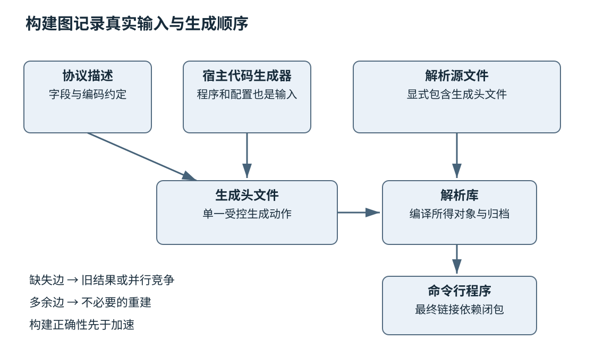
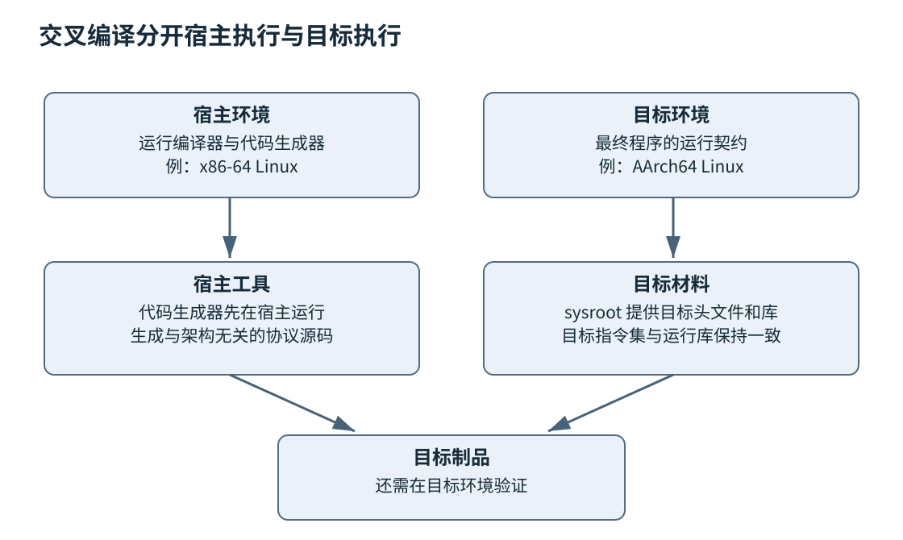

# 第二十一章 构建依赖与可复现交付

源代码是一组描述，交付给用户的却是一组实际字节。两者之间经过预处理、编译、链接、资源生成、依赖解析、打包和签名。第八章解释了单个程序如何变成可执行文件；本章关心更大的问题：当开发者、操作系统、依赖版本和目标设备都发生变化，团队如何知道自己构建的仍是想要的那个程序。

**构建系统**描述输入、动作、输出与依赖；**工具链**提供完成这些动作的编译器、链接器及相关程序；**包管理器**解决第三方组件的获取与配置；**交付记录**把制品与源代码、环境和验证证据联系起来。它们相互配合，却不能相互替代。锁住一个库的版本，不等于锁住了整个工具链；容器里构建成功，也不意味着不同日期生成的文件逐字节相同。

本章把构建看成一个可解释的依赖图，而不是积累命令行技巧。C++20 仍是语言主线，配置示例使用已有稳定 CMake 机制，不声称某个标准模式开关能证明全部语言与标准库功能可用。文中配置、命令和代码均未编译、未执行；它们用于说明契约，真实工程应补齐源文件并在选定支持矩阵上验证。工具资料按 2026-10-03 核验，滚动文档中的新能力不能反向当成旧版本保证。

## 21.1 CMake Targets Presets Ninja与增量构建

### 21.1.1 构建图首先回答哪些结果依赖哪些输入

设一个命令行程序读取一种自定义文件。程序包含解析库、业务库和入口，另有一个根据协议描述生成头文件的程序。源文件变动可能需要重新编译一个目标；公共头文件变动可能影响多个目标；生成器或协议描述变动，则必须先重新生成头文件，再编译使用它的代码。

把这些关系写成有向图，节点可以是文件或高层目标，边表示必须先具备的输入。构建器据此安排并行和增量工作。漏掉一条边可能导致偶发失败，也可能更危险地使用旧输出；多写一条无关边则扩大重建范围。正确性与速度并不独立：一个依赖不完整、偶尔省掉必要工作的系统，看上去很快，却不能可靠交付。

CMake 的配置阶段读取工程描述、检测环境并决定目标关系；生成阶段输出底层构建系统需要的规则；实际编译和链接由所选生成器对应的工具推进。Ninja 是强调快速执行显式构建图的底层工具，通常由 CMake 等更高层程序生成其输入。它不会因为看到一个目录里有源代码，就自行推断业务的全部依赖。[S1] [S4]

因此“CMake 编译失败”至少有三种含义：配置时找不到依赖，生成时不能表达目标关系，或者构建时编译、链接命令失败。先指出失败阶段，才知道应该检查缓存、目标属性、生成规则还是 C++ 源码。把所有失败都归咎于一个工具名称，会让诊断在错误层级兜圈。

### 21.1.2 Target把需求附着在真正拥有它的模块上

**Target** 是具有构建属性和使用要求的逻辑目标。可执行文件、静态库、共享库、仅传播接口要求的库，都可以成为目标。目标式配置的价值在于：模块自己说明需要哪些头文件、语言特性和链接依赖，使用者通过连接到该目标取得必要信息，而不是从全局变量里猜测。[S1]

`PRIVATE` 表示构建目标自身需要，`INTERFACE` 表示使用者需要，`PUBLIC` 表示两者都需要。判断依据不是“这是不是秘密”，而是使用接口是否依赖它。公共头文件出现了第三方类型，通常就把相关编译需求带给使用者；第三方组件只在实现文件内部出现，则应尽量留在实现侧。

```cmake
# CMakeLists.txt 教学片段，未执行；并非可独立构建的完整工程。
# 前提：src/parser.cpp、include/atlas/parser.hpp、src/main.cpp 已由工程提供。
cmake_minimum_required(VERSION 3.25)
project(AtlasReader LANGUAGES CXX)

add_library(atlas_parser STATIC src/parser.cpp)
add_library(Atlas::Parser ALIAS atlas_parser)
target_compile_features(atlas_parser PUBLIC cxx_std_20)
set_target_properties(atlas_parser PROPERTIES CXX_EXTENSIONS OFF)
target_include_directories(atlas_parser PUBLIC
    $<BUILD_INTERFACE:${CMAKE_CURRENT_SOURCE_DIR}/include>
    $<INSTALL_INTERFACE:include>)

add_executable(atlas_reader src/main.cpp)
target_link_libraries(atlas_reader PRIVATE Atlas::Parser)
set_target_properties(atlas_reader PROPERTIES CXX_EXTENSIONS OFF)
```

这个片段没有安装规则、测试和源文件实现，不能声称复制就能得到一个程序。`cxx_std_20` 表达至少需要相应标准级别的编译模式，不代表所有 C++20 库设施都已实现。`CXX_EXTENSIONS OFF` 是目标属性，不能假定它会像接口需求一样自动传给所有使用者，因此这里分别设置两个实际目标。

构建树中的头文件路径与安装后的路径也不同。把作者机器的绝对路径写进安装接口，会使包离开机器就失效。图中的目标依赖应尽可能指向有名字的组件；硬编码某台机器上的 `.a` 或 `.lib` 文件，虽然可能临时通过链接，却丢失了平台配置和传递需求。

静态库的实现依赖尤其容易误解。`PRIVATE` 不表示最终链接器永远不必看到这个库：静态归档并没有把所有外部符号解析完，最终可执行文件仍可能需要它的实现依赖。CMake 对相关链接传播有专门处理。工程设计时应区分编译使用要求是否暴露、最终链接闭包是否完整，而不是拿一个访问关键字概括两件事。

### 21.1.3 全局选项会让边界失去解释能力

在顶层无差别调用目录范围的包含路径、宏定义或选项，很容易得到“只在这个完整工程里能编译”的组件。某个库忘记声明依赖，但恰好从邻居的全局设置中捡到了头文件；一旦被其他仓库使用，缺失关系才暴露。问题不是目录命令绝对不能用，而是团队已经无法从目标本身读出其真正要求。

可维护的组织通常把工程自己的诊断选项限制在自己的目标，对外部依赖使用其提供的导入目标。公共接口仅传播使用者正确编译所必需的条件，而不强迫下游采用作者喜欢的全部警告。若库为了优化只在实现中使用特殊指令集，不应顺手把同样选项传播给所有客户代码，否则原本通用的使用者也可能生成部署机器不支持的指令。

宏定义还可能改变 ABI。假设一个宏决定结构体是否含有额外字段，库用一种值编译，调用方用另一种值编译，两者可能顺利通过各自的编译，却对对象大小和布局意见不一致。需要将影响接口的配置写成受控的公共要求，或者更好地把变化藏在稳定接口后面。仅让链接器找到同名符号无法发现全部配置不一致。

目标属性与配置差异还会被生成器表达式延迟求值。阅读配置时，应问表达式在什么目标、什么语言、什么构建配置下生效。不要把一长串表达式当成自证正确的技巧；若多个平台分支已经难以核对，可以把策略拆成有名的函数或接口目标，但仍要保持属性归属清楚。

### 21.1.4 Presets保存团队可重复选择的配置

**Preset** 保存一个有名字的配置入口，包括生成器、构建目录和缓存变量等。它使“使用调试配置”“使用交叉工具链”成为可审查的文件，而不是散落在聊天记录里的命令行。共享的 `CMakePresets.json` 与个人的 `CMakeUserPresets.json` 有不同用途：前者适合纳入版本控制，后者保存机器相关的本地选择，不应顺带提交个人路径或秘密。[S2]

下面用纯文本描述主要字段，避免把说明性注释混进必须满足 JSON 语法的文件。实际落地需要生成有效 JSON，并按使用的 CMake 版本核对 schema。

```text
教学配置说明，未执行；这是字段示意，不是可直接保存的 JSON。
共享配置名：linux-debug
生成器：Ninja
构建目录：${sourceDir}/out/build/linux-debug
缓存变量：CMAKE_BUILD_TYPE=Debug
缓存变量：CMAKE_EXPORT_COMPILE_COMMANDS=ON
构建预设：引用 linux-debug 配置预设
个人设置：编译器本地路径保存在个人预设或受控工具链文件
```

Preset 的 schema 版本与 CMake 可执行程序版本有关。选择较新的 schema 可能让某些开发机甚至不能解析文件，因此应明确最低工具版本。继承和条件可以减少重复，但过深继承也会让最终值难以判断。团队需要能回答“这一构建目录到底选了哪个编译器、哪个工具链、哪些选项”，而不是只知道按了某个 IDE 按钮。

CMake 缓存保存配置决策。切换编译器、目标架构或工具链时，复用旧构建目录可能保留不适用的检测结果。较稳妥的方式是为重要配置使用独立目录，或者按文档明确清理并重新配置。清理不应成为掩盖原因的习惯：先保存导致问题的配置与命令，再在新目录验证，才能区分缓存污染与真正的源码错误。

单配置生成器通常在配置时通过 `CMAKE_BUILD_TYPE` 选择 Debug 等配置；多配置生成器则在构建时选择具体配置。把两种工作方式混为一谈，可能以为正在测 Release，实际运行的还是 Debug。发布流水线应记录最终构建配置与实际编译命令，而不仅记录某个变量曾被设置。

### 21.1.5 增量正确性需要把生成文件当成一等输入

自动生成头文件、协议代码、资源索引和版本信息都属于构建图。若生成命令只写成每次手动执行的脚本，底层构建器不知道输入变化，也不知道何时可并行编译。正式规则要说明输出、输入、生成工具和必要副产物，使消费者等待真正需要的文件。

例如协议描述 A 生成头文件 H，源文件 X 包含 H。正确关系是 A 和生成器共同决定 H，H 再影响 X 的对象文件。若只写 X 依赖 A，却不写生成动作与 H，并行构建可能先编译 X。若多个目标各自无协调地生成同一个 H，又可能出现并发覆盖。增加等待时间不能修复这类依赖缺口。

依赖文件记录编译器观察到的头文件关系，使修改被包含文件也能触发重建。但编译器不会替自定义脚本记录它读取的任意配置文件；这些输入必须显式说明，或由脚本按受支持协议产生依赖记录。动态依赖支持也是具体工具能力，不是所有生成器对所有任务都等价。

**面试追问：“为什么全量编译成功，增量编译偶尔失败？”** 应先怀疑缺失输入、副产物冲突、并行顺序和配置残留，比较干净构建与增量构建所执行的命令。全量构建碰巧先产生了某文件，并不能证明依赖图完整。把并行度降为一可作为定位手段，却不能把串行成功当作修复证明。



图 21-1 构建图同时包含源文件、生成动作和消费关系。边表达必须满足的依赖，不表示所有节点都应被强制串行执行。

### 21.1.6 加速构建要测量关键路径

总编译时间不只取决于核心数。大量独立文件有并行机会，一个巨大的生成步骤、模板密集头文件或最终链接阶段却可能成为关键路径。盲目提高并行度会增加内存峰值，触发换页或进程被终止，反而拖慢构建。应分别观察配置、扫描、编译、链接和打包时间。

预编译头减少重复解析，但会扩大对共同头文件的依赖；unity build 合并翻译单元，可能节省前端成本，却可能暴露名称冲突或掩盖缺失包含；编译缓存重用既有结果，但缓存键必须覆盖影响输出的输入。任何加速方案都需要同时验证正确性、内存占用、冷启动与常见增量场景。

C++20 Modules 给构建图增加了模块接口生成与导入顺序。CMake 3.30 文档明确列出扫描支持的编译器与生成器组合，也记录限制；本章引用这一固定文档说明“支持矩阵必须核对”，不把它当成核验日所有版本的最新矩阵。支持普通模块、支持标准库导入、支持安装与消费模块包，是不同能力。[S5]

模块的二进制接口产物通常与编译器及配置紧密关联。不能因为两个工程都写 `import` 就直接共享任意 BMI，也不能据此承诺构建一定更快。应先以一个真实模块边界验证扫描、增量、调试、安装和依赖包，再决定迁移范围。语言机制的收益需要工具链兑现。

## 21.2 GCC Clang MSVC及编译选项

### 21.2.1 编译器名字不是完整环境标识

“用 Clang 编译”没有说明标准库是 libc++ 还是 libstdc++，链接器是哪一个，描述目标架构与系统等信息的目标三元组是什么，系统头文件来自哪里。GCC 也可能使用不同发行版补丁与运行库；MSVC 需要区分工具集、Windows SDK、运行时与构建模式。构建失败或 ABI 问题常发生在这些组合之间，而不是前端名称本身。

一个实用环境记录至少包含前端版本、标准库及其版本、链接器、目标架构、操作系统或 SDK、语言模式、关键优化与运行时选项。必要时还要记录 CPU 特性、异常和 RTTI 配置、结构体打包、静态或动态运行库、第三方补丁。记录不必让每次构建都手工填写，但应由流水线可靠采集并能与制品关联。

这种记录也决定测试矩阵的边界。若产品承诺同时运行在两种标准库或多个 Windows 工具集上，就必须有相应构建和运行证据；在一个 Linux 容器里尝试三个前端版本，只能覆盖其中一部分差异。编译器多样性很有价值，却不是跨平台验证的替身。

### 21.2.2 语言模式 诊断与优化各自解决不同问题

标准模式选择接受哪些语言规则与扩展；警告帮助发现可疑代码；优化改变生成代码的策略；调试信息帮助把机器状态对应回源码。这些维度可以组合，不能简单地分成“Debug 正确、Release 快”。带调试信息的优化构建常是线上诊断的重要工具。

GCC 的 `-Wall` 并不表示全部警告，Clang 和 MSVC 的警告集合也不是逐项对称。把所有编译器都塞入同一串选项可能直接失败，更可能悄悄丢失希望启用的检查。工程应为具体工具链维护经过验证的诊断策略，解释哪些警告是新增代码门禁，哪些旧问题有临时例外。[S6] [S8] [S9]

```cmake
# CMake 诊断配置片段，未执行；前提：atlas_parser 目标已定义。
# 只展示本工程目标的选项，不代表跨版本完整警告策略。
if(MSVC)
    target_compile_options(atlas_parser PRIVATE /W4 /permissive-)
elseif(CMAKE_CXX_COMPILER_ID MATCHES "^(GNU|Clang|AppleClang)$")
    target_compile_options(atlas_parser PRIVATE -Wall -Wextra -Wpedantic)
endif()
```

是否把警告当错误，要考虑依赖边界与编译器升级。对项目自己的新增代码建立严格门禁，可以快速阻止退化；把所有第三方头文件的新警告一律当错误，则可能让无关工具升级阻断交付。豁免应限定范围、说明原因和到期条件，而不是全局关闭一类能发现真实问题的检查。

`-O2`、`-O3` 等名称不构成跨编译器的等价实验。它们启用的策略随版本和目标变化，高优化级别也不保证所有程序都更快。第二十章的测量原则仍然适用：用目标负载测端到端指标，记录代码大小、内存、延迟分布和构建成本，再决定选项。[S7]

### 21.2.3 优化暴露错误不等于优化器制造错误

一个越界访问在调试构建中可能暂时没有破坏关键数据，在优化构建中却产生完全不同结果。数据竞争、悬空指针和未初始化值也可能被布局或调度变化放大。C++ 的未定义行为不能用“我在 Debug 见过它工作”来约束优化器。

诊断时应保留真正失败的优化制品和符号，同时构造可观测性更好的对照版本。若一换成 `-O0` 问题就消失，结论只是症状对配置敏感。下一步可以检查未定义行为、时序、初始化、内存布局和已知编译器问题，不能立刻认定编译器有缺陷。第二十二章会介绍如何把这些假设变成证据。

特殊优化选项还可能改变语义前提。例如激进浮点选项可允许超出通常严格浮点行为的变换；本来依赖 NaN、无穷值、舍入顺序或有符号零的算法，必须检查选项契约。性能优化若修改了数值允许误差，应在接口和测试中体现，而不是把结果变化藏在构建脚本里。

链接时优化把跨翻译单元信息交给优化器，可能改善内联与消除，也增加工具链一致性、内存峰值和链接时间要求。带中间表示的对象文件不应被当成永远通用的二进制归档。发布库是否分发这种形式，需要核查具体编译器与链接器的兼容承诺。

### 21.2.4 CPU基线决定制品能在哪些机器上运行

在开发机上使用本机优化选项，可以启用该 CPU 拥有的指令；部署机器未必拥有这些能力。结果可能不是速度略慢，而是在执行到相应指令时失败。产品需要明确最低 CPU 基线，并将可选加速与基线代码分离，通过可靠的特性检测选择路径。

交叉编译时尤其不能把宿主 CPU 当成目标 CPU。前端的目标参数、后端代码生成特性、所链接库的指令要求必须一致。主程序保持通用，不代表第三方库没有用了更高指令集。二进制包选择与包 ID 应体现相关差异，实际部署验证也应覆盖最低支持设备。

运行时分派本身需要验证：检测代码必须可在基线机器执行，不能先在检测函数里使用新指令；不同实现的数值结果与错误处理应满足同一接口；初始化与多线程访问必须安全。把一个编译选项从顶层挪到某个库，只是开始，并没有自动完成兼容设计。

### 21.2.5 多工具链检查是在寻找不同盲区

不同前端、标准库与静态分析器能报告不同问题。一个编译器接受代码，另一个拒绝，可能是标准规则、扩展、库支持、诊断严格度或缺陷的差异。应先缩小到具体声明与选项，再查固定标准和实现文档，而不是靠投票决定哪一个对。

对公共库，最有价值的检查常是一个独立消费者：只使用安装产物、公开头文件和公开配置，在新的构建目录中编译。它可以揭示未声明包含路径、错误导出宏、不可重定位包和忘记安装的文件。只构建库自己的测试，可能因为测试继承了内部环境而长期隐藏问题。

**面试追问：“开启 C++20 模式以后为什么还找不到某个库功能？”** 语言前端和标准库是独立实现维度，头文件、库版本、平台支持及特性宏还要满足条件。标准模式是必要配置之一，不能替代功能探测与实际用例验证。

**面试追问：“线上崩溃是否应立刻关优化重新发布？”** 先评估风险与回滚路径。对照构建有助于定位，但改变优化会同时改变性能、时序和布局。应保全原制品与符号，检查是否能回滚到已知良好版本，再用针对性修复和测试建立发布依据。

## 21.3 Conan vcpkg依赖锁定与二进制兼容

### 21.3.1 依赖版本是一张图而不是一串名字

应用直接使用 A 和 B，A 又使用 C，B 也使用 C。两个上游可能提出不同约束，最终解析到哪个 C，取决于包管理器规则、注册表内容、版本约束与覆盖设置。只在 README 写“A 版本 1”并不能说明最终图，更不能解释某天重新构建为何选中了新传递依赖。

**清单**描述希望使用什么；**解析结果**说明这次实际选择什么；**锁定机制**尽量把该选择保存下来；**缓存**保存已获取或已构建的材料。四者用途不同。缓存命中不证明内容可信，清单稳定也不证明解析结果稳定，锁文件存在则不代表工具链、系统包和所有下载内容都被它覆盖。

Conan 2 的锁文件用于约束依赖图中的配方版本与修订等信息；包二进制的选择还由设置、选项和包 ID 模型参与。vcpkg 的 manifest mode 用清单描述工程依赖，其版本选择涉及 baseline、最低版本约束与 overrides 等机制。两套系统不应被概括成同一种“锁文件语义”。[S10] [S11] [S12] [S13]

### 21.3.2 锁住依赖要能解释变化的来源

依赖升级最好表现为一个可审查变更：哪些直接和传递组件变了，为什么变化，是否有补丁、许可证或漏洞影响，二进制是否重建，测试覆盖哪些调用路径。只看清单上一个版本号变化，可能漏掉后面一串传递依赖。

对 Conan，应区分配方描述与包二进制。相同源码配方在不同编译器、运行时、选项或架构下可形成不同二进制；配方修订又可能改变构建过程。包 ID 模型如果遗漏一个真正影响 ABI 的选项，就可能错误复用缓存。锁定解决选择可控，正确包模型解决二进制适配，它们互补。

对 vcpkg，应理解 baseline 参与版本选择，并非所有依赖都按一句“最低版本”自动固定到某个上游标签。工程还需固定 vcpkg 自身及使用的注册表状态，记录 triplet（目标平台与构建配置组合）和 overlay（覆盖或补充默认材料的本地包、配置等）。一个本地 overlay 修改了库补丁，即使 manifest 没变，得到的也可能不是另一台机器上的同一组件。

在需要受限网络或离线构建的环境里，还要考虑源包镜像、访问权限和材料保留期限。不能把“今天缓存里有”当成灾备方案。可以为授权使用的依赖保留可验证材料及来源记录，但不得因为镜像方便就抹掉上游身份、完整性校验和许可证信息。

### 21.3.3 包ID不能代替ABI契约

**ABI** 描述二进制组件彼此调用时的约定，包括符号、调用约定、对象布局、异常、运行时和其他实现细节。两个包都叫 Release、都使用 C++20，并不能推导二进制兼容。第八章和第十四章已经解释过跨模块布局及分配释放的责任，本节将它们放回依赖交付。

考虑一个库返回 `std::string`，调用方销毁这个字符串。兼容性可能涉及标准库实现、字符串布局、分配器、运行时和构建宏。链接成功只能说明符号被解析，不能证明对象后续操作安全。跨工具链的稳定边界往往需要更窄的 C 接口、固定宽度字段、明确句柄和配套释放函数，但这些接口仍需要完整契约。

Microsoft 为一定范围内的 MSVC 工具集提供有条件的二进制兼容说明，同时列出链接器版本、运行时与链接时优化等限制。本章不把这些承诺推广成任意 MSVC 版本、任意选项、任意 C++ 库都可互换。实际发布应引用所用工具集的适用条款，并验证自己的导出边界。[S14]

头文件库也不等于没有兼容风险。它的代码在使用者侧编译，版本差异、宏和编译选项可能改变类型或内联逻辑；多个模块含有不一致定义，还可能触及单一定义规则。头文件库减少了某些预编译二进制分发问题，同时把一致性要求转移到消费者构建中。

### 21.3.4 Debug Release和运行时选择要贯穿依赖闭包

同一库的调试构建可能启用迭代器检查、不同分配器诊断或额外字段。某些环境允许在限定条件下混用，某些接口则不允许。工程不能仅凭文件后缀猜配置，更不能在找不到调试库时悄悄回退到发布库而不说明风险。

静态与动态运行时链接也不是简单的体积选择。内存、文件句柄包装、区域设置、错误状态及异常支持可能跨越模块边界。若一个模块分配、另一个模块释放，需要有受支持的共同约定；不具备时，应把释放操作送回拥有资源的组件。

一个合理的二进制包矩阵先由产品支持范围决定，而不是把所有选项做笛卡尔积。可以明确只支持某几种架构、运行时和编译模式，要求超出范围的消费者从源码构建或采用稳定边界。支持范围越宽，构建存储和验证责任越大，应把成本说清楚。

### 21.3.5 依赖更新不是一次机械替换

升级一个解析库，至少可能改变输入接受范围、错误码、性能、默认限制和序列化输出。升级一个加密库，还会影响策略、证书处理与平台支持。版本号只是入口，真正要检查的是自己依赖的行为契约。

可以先列出实际使用的 API、关键数据样本与重要错误路径，再比较旧新行为。二进制接口检查适合发现符号和布局变化，契约测试适合发现语义变化，负载测试适合发现资源回归。通过编译的升级仍可能改变协议输出；通过单元测试的升级仍可能在真实输入规模下内存暴涨。

安全补丁可能需要加速交付，但加速应减少不必要等待，不是省略所有验证。一个可用的应急路径会提前规定最小验证集合、灰度范围、监控和回滚条件。若依赖存在不兼容修复，应记录临时缓解措施与最终迁移计划，而不是无限期把“暂时锁旧版”当作完成。

**面试追问：“有锁文件就能复现构建吗？”** 只能按该工具的语义约束一部分依赖选择。还需锁定工具链、系统材料、选项、生成步骤和环境输入，并检查输出中的非确定性。依赖图复现与逐字节制品复现是不同层级。

**面试追问：“链接成功为什么仍会在释放对象时崩溃？”** 应检查分配释放责任、运行时、对象布局、标准库 ABI、跨模块生命周期和越界破坏。链接器通常不能证明这些动态契约。先保留匹配符号与制品，再缩小跨边界对象的创建和销毁路径。

## 21.4 Cross Compilation Toolchain Sysroot与可复现构建

### 21.4.1 交叉编译把构建机器与运行机器分开

**交叉编译**是在一种环境中产生供另一种目标环境运行的程序。构建过程中实际执行工具的机器，与最终程序运行的目标，必须分别命名。代码生成器要在构建机器上运行，生成出来的产品要在目标机器上运行；两者即使都由同一仓库产生，也不能使用同一个架构的可执行文件混过去。

工具链文件让 CMake 在配置早期知道目标系统、编译器和查找策略。**Sysroot** 是目标环境头文件与库等材料的一个根视图，帮助工具链避免无意拾取宿主系统的材料。它不是完整目标设备，更不自动包含启动加载器、驱动、运行配置和真实硬件能力。[S3]

假设在 x86-64 Linux 上为 AArch64 Linux 构建解析程序。前端应产生 AArch64 指令，系统头文件与库应来自目标基线，构建时运行的协议生成器却仍需是 x86-64 可执行文件。最隐蔽的错误往往不是编译器完全选错，而是某一条查找路径混入宿主库，或者测试步骤试图直接执行目标程序。

### 21.4.2 工具链文件必须明确查找边界

```cmake
# AArch64 Linux 工具链教学片段，未执行；路径均为占位路径。
# 前提：目标编译器和 sysroot 已由受控 SDK 提供并校验。
set(CMAKE_SYSTEM_NAME Linux)
set(CMAKE_SYSTEM_PROCESSOR aarch64)
set(CMAKE_C_COMPILER /opt/example-sdk/bin/aarch64-linux-gnu-gcc)
set(CMAKE_CXX_COMPILER /opt/example-sdk/bin/aarch64-linux-gnu-g++)
set(CMAKE_SYSROOT /opt/example-sdk/sysroot)
set(CMAKE_FIND_ROOT_PATH_MODE_PROGRAM NEVER)
set(CMAKE_FIND_ROOT_PATH_MODE_LIBRARY ONLY)
set(CMAKE_FIND_ROOT_PATH_MODE_INCLUDE ONLY)
set(CMAKE_FIND_ROOT_PATH_MODE_PACKAGE ONLY)
```

这里对程序采用宿主查找，对库、头文件和包采用目标根查找，是常见设计方向，不是适用于所有 SDK 的万能配方。工程若需要特殊宿主工具，应显式提供其路径或独立构建阶段。`pkg-config` 等辅助工具也可能有自己的搜索变量，必须检查它是否返回目标信息，不能只设置 CMake 就假定整个生态随之改变。

配置测试有的只编译，有的需要运行。交叉编译环境不能直接运行目标程序时，应采用已验证的目标属性、明确的预置结果、模拟器或真实目标执行，而不是为了让配置通过随意填写成功。预置结果也属于交付输入，需要记录出处和适用 SDK，错误结果可能把不存在的功能暴露给源码。

链接通过不等于目标上能运行。动态加载器路径、共享库版本、内核接口、CPU 特性、文件权限和部署位置都可能不匹配。交叉构建至少要分成“产生正确目标格式”和“在支持设备上完成行为验证”两层证据。模拟器能扩展覆盖，但不能替代所有硬件时序、驱动与设备交互测试。



图 21-2 交叉编译存在两条执行责任。Sysroot 提供目标材料，不把宿主工具自动变成目标程序，也不替代部署验证。

### 21.4.3 可重复流程与逐字节可复现需要分开承诺

“别人按说明也能构建”是重要起点，但**可复现构建**通常要求在定义的输入与环境条件下得到逐字节相同的指定产物。是否比较未经签名的二进制、压缩包或最终安装器，应事先说明；不能在结果不同后临时挑一部分相同文件宣布成功。Reproducible Builds 项目提供了这一概念的明确定义。[S15]

非确定性可能来自时间戳、绝对路径、文件枚举顺序、随机种子、区域设置、时区、压缩元数据、并发生成顺序和工具版本。相同源码与锁文件只是输入的一部分。容器镜像若只用可变标签选择，基础系统内容也可能随时间变化；即使固定镜像摘要，外部下载与宿主能力仍可能影响结果。

`SOURCE_DATE_EPOCH` 是让支持它的工具使用约定时间来源的机制之一，不是一个让所有软件立刻确定化的魔法变量。需要确认哪些工具遵守它、时间含义是什么、哪些输出仍含其他动态信息。路径归一化、稳定排序和受控归档参数也要按具体工具核验。[S16]

签名与时间戳服务常会给最终分发物引入不同字节。可以把确定构建的有效载荷与后续签名封装分开验证，记录两层摘要及关系。这样既能证明源码到程序的可复现性，也能保留发行身份。把签名文件随意去掉再比较，若未事先定义范围，就不足以证明完整交付流程可信。

### 21.4.4 一次有效复现要有独立性

在同一个目录里连续运行两次，并看到缓存命中，不足以说明干净环境可以复现。更有价值的是从已记录的材料开始，在隔离的构建目录或独立环境中重新生成，比较预先指定的产物。为了发现隐藏环境输入，可以有意识地改变无关路径、时区或文件顺序，观察是否仍保持承诺。

若摘要不同，下一步应定位差异而不是只报告失败。比较归档目录、元数据、目标文件、调试路径和代码段，判断差异来自时间、路径还是实际机器代码。只有理解差异，才能决定它是需要消除的非确定性、允许的封装差异，还是依赖或工具链不一致。

可复现性也不能证明源码没有恶意逻辑。它更直接回答“这份二进制能否由这些声明输入按该过程重建”。源代码评审、依赖审计、构建来源证明和签名验证解决其他问题。第二十四章会把这些证据组合为供应链完整性，而不是让单一哈希承担所有信任。

### 21.4.5 交付清单要服务下一位诊断者

一份可用的交付记录应把源码提交、依赖解析、工具链身份、构建配置、产物摘要、调试符号和验证结果关联起来。用户报告故障时，团队需要知道运行的是哪一个制品，能否找到完全匹配的符号，如何恢复同一配置，以及当时有哪些已知限制。

调试符号不一定随应用公开分发，但应按权限可靠保存，并能用制品身份准确查找。只保存源码标签、删除中间符号，可能让数月后的崩溃只剩一串地址。反过来，符号和构建日志可能包含内部路径或其他信息，也需要访问控制与保留策略。可诊断与最小暴露要一起设计。

构建缓存、依赖缓存和正式制品仓库应有不同信任与保留要求。开发缓存可以过期，正式发布不能依赖某位工程师机器里唯一的一份文件；临时构建可以失败重跑，正式制品身份则应不可被悄悄覆盖。相同版本号对应不同字节会破坏诊断、回滚和审计。

**面试追问：“如何把一个本地可编译工程变成可交付工程？”** 先把依赖与目标关系显式化，固定受支持工具链和配置，建立独立消费者与目标运行验证，再保存不可混淆的制品、符号和来源记录。可复现比较是更强证据，但应说明范围与尚未消除的环境输入。

**面试追问：“交叉编译最容易遗漏什么？”** 宿主工具与目标库混用、配置阶段执行目标程序、sysroot 与部署基线不一致，以及构建成功后没有真正的目标验证。正确回答要指出每一种失败在哪个阶段可观察，不能只背出一个工具链文件路径。

工程交付最终依靠一条连续的解释链：哪个需求决定接口，哪个目标拥有依赖，哪个工具链产生字节，哪个验证支持发布，哪个身份帮助故障回溯。构建越自动化，这条链越应当清楚，因为自动化会同时放大正确的规则和遗漏的规则。

## 来源与阅读边界

以下官方资料于 2026-10-03 打开核验。一般工程推理与示例为原创组织，不声称已完成编译、交叉运行或可复现性实验。滚动手册用于核对机制，CMake Modules 特别引用固定 3.30 文档作为支持受版本约束的例证。

- S1：CMake `cmake-buildsystem`，目标属性、使用要求和依赖传播
- S2：CMake `cmake-presets`，共享与个人预设及 schema 约束
- S3：CMake `cmake-toolchains`，工具链、sysroot 与交叉编译查找
- S4：Ninja 官方手册，构建图和增量执行机制
- S5：CMake 3.30 C++ Modules 文档，扫描、生成器与已知限制
- S6：GCC Warning Options，警告集合与错误策略
- S7：GCC Optimize Options，优化级别与选项语义
- S8：Clang Users Manual，驱动、目标和选项背景
- S9：Microsoft MSVC Compiler Options，编译器配置入口
- S10：Conan 2 Lockfiles，依赖图锁定的范围
- S11：Conan 2 Binary model，设置、选项与包二进制身份
- S12：Microsoft vcpkg Manifest mode，清单工作方式
- S13：Microsoft vcpkg Versioning reference，baseline 与版本选择
- S14：Microsoft C++ binary compatibility，受条件限制的工具集兼容
- S15：Reproducible Builds Definitions，可复现构建的定义
- S16：Reproducible Builds SOURCE_DATE_EPOCH，受工具支持约束的时间规范

[S1]: https://cmake.org/cmake/help/latest/manual/cmake-buildsystem.7.html
[S2]: https://cmake.org/cmake/help/latest/manual/cmake-presets.7.html
[S3]: https://cmake.org/cmake/help/latest/manual/cmake-toolchains.7.html
[S4]: https://ninja-build.org/manual.html
[S5]: https://cmake.org/cmake/help/v3.30/manual/cmake-cxxmodules.7.html
[S6]: https://gcc.gnu.org/onlinedocs/gcc/Warning-Options.html
[S7]: https://gcc.gnu.org/onlinedocs/gcc/Optimize-Options.html
[S8]: https://clang.llvm.org/docs/UsersManual.html
[S9]: https://learn.microsoft.com/en-us/cpp/build/reference/compiler-options?view=msvc-170
[S10]: https://docs.conan.io/2/tutorial/versioning/lockfiles.html
[S11]: https://docs.conan.io/2/reference/binary_model.html
[S12]: https://learn.microsoft.com/en-us/vcpkg/concepts/manifest-mode
[S13]: https://learn.microsoft.com/en-us/vcpkg/users/versioning
[S14]: https://learn.microsoft.com/en-us/cpp/porting/binary-compat-2015-2017?view=msvc-170
[S15]: https://reproducible-builds.org/docs/definition/
[S16]: https://reproducible-builds.org/docs/source-date-epoch/
