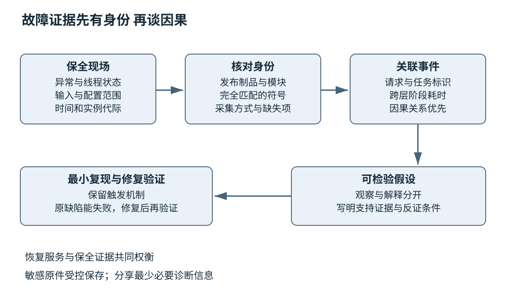
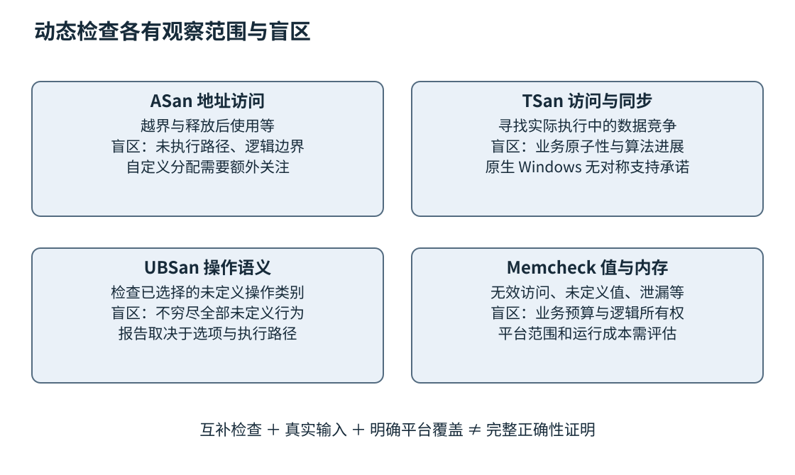

# 第二十二章 调试与故障证据链

调试的目标不是把程序停住，也不是找到一个看起来可疑的函数，而是解释失败如何产生，并用新的证据区分竞争假设。崩溃位置可能只是更早内存破坏的受害者；超时可能来自排队，也可能来自锁、网络或下游资源；重启以后恢复，最多说明某些运行状态被清空，并不自动解释原因。

**故障证据链**把用户症状、发生时间、运行制品、线程状态、输入、日志和代码关系连接起来。证据既要足够解释，也要忠实保留边界：没有采集到某字段，就不能编造其值；没有符号匹配，就不能把一个地址随意归给手头源码；只在一个样本上修复，就不能声称所有相似问题都已消失。

第二十一章的制品身份与调试符号，在这里变成诊断基础。本章先解释交互调试和现场保全，再讨论动态检查工具，最后把它们组织成最小复现与跨层定位方法。所有调试命令、编译命令和程序片段均未编译、未执行；示意场景不是真实事故报告，不含伪造的工具输出。工具能力按 2026-10-03 的官方资料核验。

## 22.1 GDB LLDB断点栈帧与符号

### 22.1.1 调试器通过映射把机器状态还原成源码线索

程序运行时拥有指令地址、寄存器、内存和线程状态。源码中的函数名、局部变量和行号不是机器执行必需的信息。**调试符号**保存二者之间的映射，使调试器能够把一个程序计数器解释成函数与源码位置，把某一段存储解释成一个变量。

这种解释需要匹配实际制品。相同源码经不同选项、链接顺序或工具链构建，地址和优化结果都可能改变。给崩溃转储加载“差不多同版本”的符号，可能比没有符号更危险，因为它会产生看起来很具体却不可靠的答案。构建身份、模块身份与符号身份应共同核对。[S1] [S2]

GDB 和 LLDB 都能控制程序执行、设置断点、查看线程与变量，但命令模型和平台集成不同。学习重点应是每个操作要回答什么，而不是机械把两套缩写逐字互换。界面再友好，也不会自动告诉你某个变量已经被优化消除，或某个栈帧来自内联展开。[S3] [S4]

### 22.1.2 断点应放在假设分歧的地方

**断点**让程序在满足位置及可选条件时停下。若怀疑一个请求长度被错误更新，最有用的位置可能是长度首次通过验证以后、进入分配以前，而不一定是崩溃行。好断点让两种假设产生可区分的观察：输入本来非法，还是内部后来破坏了已验证值。

函数名断点可能对应重载、模板实例或多处内联位置；源码行也可能对应多条机器指令，或者因优化而没有独立位置。设置以后应检查调试器实际解析到了哪些位置，而不是看到命令接受就假定它恰好覆盖了预想路径。[S5]

```text
GDB 会话命令示意，未执行；不是工具输出。
前提：已获得允许调试的本地教学进程及完全匹配的符号。
break parse_frame
run
bt
info threads
thread apply all bt
frame 1
info args
info locals
```

这个片段只展示观察顺序，`parse_frame` 是需由实际工程提供的函数。启动或附加真实服务会改变运行状态，必须在获准环境中操作。`run` 也可能触发程序本来的文件、网络或业务副作用，因此不能把所有调试命令笼统称为只读。

条件断点可以减少无关停止，但条件求值可能有成本，复杂表达式甚至可能调用程序函数。安全的诊断优先使用不会改变状态的简单值比较，并了解调试器如何求值。对高频路径，先用计数、过滤和窄范围复现，往往比在生产负载上逐次停住更可靠。

### 22.1.3 单步不是逐行执行的保证

源码一行可能含有多个调用，一次源级单步可能跨越多个机器指令；内联、公共子表达式消除和指令调度还会改变观察顺序。调试器显示回到上一行，不一定意味着源程序真的按文本倒退执行。优化构建中尤其需要结合反汇编、寄存器和有效的变量位置描述。

`step` 一类操作通常尝试进入调用，`next` 一类操作通常跨过当前层调用，`finish` 一类操作继续到当前函数返回。这些是调试控制策略，不等于把其他线程永远冻结。具体线程停止和恢复模式由调试器及配置决定，应核对正在使用的模式，不能凭一个界面按钮推断调度语义。

在 LLDB 中，可以通过断点、`thread backtrace`、`frame variable` 等命令查看相同层面的证据。表达式求值与变量读取也应区分：读取已有变量通常比调用对象成员函数更容易控制副作用。某些漂亮打印器会执行脚本或读取复杂对象结构，遇到堆损坏时显示失败，也不代表对象原本只是空值。

### 22.1.4 栈帧给出当前路径 不给出完整历史

**栈帧**表示一次活动调用的执行上下文。回溯从当前帧向调用者展开，帮助回答“现在位于哪条调用链”。它通常不是程序从启动以来的历史，也不会自动包含异步操作的发起链。一个回调被线程池执行时，栈上可能只有调度器与回调，看不到数秒前提交任务的业务函数。[S3]

优化可以内联函数、合并调用或消除变量；尾调用也可能改变可见帧。栈损坏、缺少展开信息或模块卸载会进一步影响回溯。面对截断或奇怪帧，应先评估回溯可信度，而不是把每一行都当成事实。寄存器、栈内存和模块映射可以支持交叉检查，但手工猜帧同样必须标成推断。

变量显示为 optimized out，表示当前调试信息与机器状态不足以提供该值，不等于变量运行时一定是零，也不等于编译器漏掉了必要工作。可以尝试从仍可观察的派生状态推断，但要明确不确定性；若重编译对照版本，应保留原失败配置，因为改变优化可能改变症状。

异步系统需要额外的逻辑关联信息。任务 ID、父任务 ID、连接代际和请求阶段能够连接发起与完成。第十九章解释的协程帧可能保存挂起状态，但语言协程并不会自动为所有工具提供完整异步调用链。具体库与调试器支持仍需核对。

### 22.1.5 观察点追踪谁改变了状态

**观察点**监控表达式或内存位置的变化，适合“值在某时刻已经坏了，但不知道谁写坏”的问题。硬件观察点通常利用处理器调试资源，数量、大小、对齐和可观察访问类型受平台限制；软件观察点可能需要更昂贵的执行监视。GDB 文档明确区分这些能力与限制。[S6]

假设对象中的长度本应始终小于缓冲容量，进入函数时却已经超过上限。若对象生命期稳定，可以在合法值建立后观察该字段的写入，寻找第一次违反不变量的位置。但若对象已经释放并被复用，同一个地址后来属于另一个对象，观察点命中不自动证明原对象被非法修改，需要结合分配和生命周期记录。

多线程场景也要注意观察会扰动调度。某些问题在断点下消失，并不能证明原推断错误；调试器暂停可能让竞争窗口关闭。可以转向低开销事件记录、专门的动态检查或可控调度复现。工具应服务假设，不必坚持所有问题都由单步解决。

### 22.1.6 卡住的程序需要查看所有相关线程

程序没有崩溃但不再推进时，单看当前线程往往只看到一个正常等待。应获取相关线程的调用栈，标出谁持有资源、谁等待什么、哪些队列仍有工作，以及负责唤醒的执行者是否还能运行。第十六至十八章的同步与进展概念在这里变成诊断语言。

两个线程分别等待对方持有的锁，是较直观的等待环；更隐蔽的是线程池全部被阻塞任务占满，而解除阻塞的任务也排在同一池里。此时没有传统“两把互斥锁相反顺序”，系统仍可能无法推进。诊断应画出资源与执行资格关系，不要只搜索函数名里有没有 mutex。

一次快照不能区分长等待与永久停滞。可以在获准环境中间隔采集多次状态，比较指令位置、等待对象、队列长度和完成计数是否变化。若一直停在同一位置，也要检查外部服务是否仍有可能回应；若位置变化却业务无进展，可能是活锁或反复重试，而不是死锁。

**面试追问：“崩溃在标准库里，是否说明标准库有问题？”** 不一定。非法迭代器、损坏对象、跨运行时释放和数据竞争都可能在标准库内部显现。先核对参数、对象生命期和最早破坏证据；只有排除调用契约问题并得到可靠复现，才有依据提出库缺陷。

**面试追问：“为什么加断点以后问题消失？”** 断点会改变时间和线程交错，也可能改变外部超时关系。应保留原配置，改用适合假设的低扰动观测或受控复现，而不是把消失当成修复。

## 22.2 Core Dump Crash Dump和现场保全

### 22.2.1 转储保存某一时刻的状态范围

**Core dump** 与 **crash dump** 是进程或系统状态的转储形式。它们让程序结束以后仍能离线分析线程、寄存器、模块和部分内存。保存哪些内容取决于平台、转储类型、配置与权限，不是所有文件都含完整地址空间，更不一定含有所有外部环境。

Linux 的 core 生成受资源限制、可写位置、进程属性和系统处理方式等影响，转储可能被交给系统服务而不是出现在当前目录。Windows 的用户态转储也需要相应收集配置，且有不同内容与大小选项。因此“崩溃一定有一个 core 文件”是错误预期。[S7] [S8]

本章不提供修改生产系统转储策略的即用命令。启用收集会影响磁盘、隐私与运行行为，应先明确授权、容量、保留期限和受影响应用。诊断流程应在测试环境演练，确认转储真的可以收集、读取和匹配，而不是等事故发生后才发现目录无权限或磁盘已满。

### 22.2.2 保全应早于可能破坏证据的操作

重启、覆盖发布、清空缓存或删除日志，可能缓解症状，也可能永久丢失现场。在紧急事故中，恢复服务与保全证据需要权衡，可以先保存成本可控的最小集合，再执行已批准的恢复动作。不能为了无限收集而扩大用户损失，也不能把所有恢复前的观察都省掉。

最小集合通常包括发生时间与时区、应用制品身份、进程启动时间、模块列表、异常或信号信息、相关线程状态、近期配置变化和请求关联标识。若允许获取转储，再附上其摘要、生成方式、原始存放位置与访问控制。日志和转储的复制过程应保持原件不变，分析使用副本。

一个文件名叫 `service_latest.dmp` 不足以区分多次事故。应以稳定事件标识关联材料，记录哪个实例、哪个启动代际、哪个构建、哪次收集。进程 ID 会复用，主机名会重建，容器也可能重启；把这些短期标识与时间、制品和实例身份组合，才能避免把不同事故拼成一条假链。

### 22.2.3 符号匹配是分析的入口门槛

Linux 生态常通过 build ID 或独立调试文件关联符号；Windows 使用与模块匹配的符号文件和符号路径机制。具体格式不同，但基本要求相同：符号属于这个二进制，模块映射属于这次运行。[S1] [S2]

发布后重新用同一标签编译得到的符号，不一定对应当时制品。构建输入可能变化，优化和链接也可能不同。最可靠的来源是当次发布保存的符号及身份记录，而不是事后“尽量还原”。若无法匹配，应明确降级为地址、模块偏移和有限机器状态分析，不应隐藏证据缺口。

符号服务器提高查找便利，也带来访问和内容信任问题。调试器可能支持自动加载脚本、扩展或从外部源获取材料，应在受控分析环境中配置可信来源。来自外部的转储、二进制和调试脚本不能因为“用于排障”就获得无限执行权限。

### 22.2.4 从异常现场向前寻找因果

转储中的故障指令告诉我们哪一次访问或操作最终不能继续。若它解引用一个明显不合理的地址，需要进一步区分：调用方传入坏指针，对象已经释放，指针字段被覆盖，还是对象类型解释错误。仅把访问前加一个空指针判断，通常只能覆盖其中很小一部分。

以析构期间崩溃为例，可以先核对对象身份和所有权：谁创建、谁移动、谁释放，是否可能重复销毁，所在动态库是否已卸载，成员是否被越界写覆盖。崩溃时刻的堆状态可能已很严重，真正首个错误在更早路径。动态检查器的价值之一就是把观察点提前到非法访问发生时。

若栈顶是主动终止函数，应查看触发原因。断言失败、未捕获异常、`noexcept` 违约和显式终止可能走到相似底层位置。需要结合错误消息、异常状态和调用路径区分。把所有终止归类为空指针，会丢掉接口契约失败的重要信息。

### 22.2.5 转储也是敏感数据

进程内存可能含有口令、会话令牌、个人信息、业务文档或解密后的内容。全量转储的风险往往高于普通日志。采集者应知道哪些数据可能被带入、谁有权限查看、保存多久、是否允许传给供应商，以及分析结束后如何按规则处理。

脱敏会改变证据。直接把所有字节清零可能让结构失真，无法继续定位；毫无筛选地上传又会扩大暴露。可采用受限环境分析、选择性转储、严格访问控制和必要字段提取等方式，但应说明每种方式牺牲了哪些诊断能力。敏感原件与可分享结论最好分开保存。

故障单中可以写“某长度字段越过约定上限”“某句柄已释放”，通常无需粘贴整个用户负载。确需分享输入样本时，先确认授权并构造保留触发条件的脱敏最小样本。对外协作需要传递足够技术证据，不等于传递全部运行内存。

### 22.2.6 现场记录应把观察与解释分栏

一份可靠记录可以先写观察：实例在某时间终止，制品摘要为何，信号或异常为何，某帧参数可读或不可读。再写解释：怀疑释放后使用，理由是该地址的分配记录与访问顺序。最后写待验证动作：用匹配配置重现该调用序列，启用适当检查器，确认第一次非法访问。

这种分离避免团队在后续讨论中把猜测抬升为事实。若新证据推翻原假设，应保留更正关系，而不是悄悄把旧记录改成“本来就知道”。工程事故的价值在于提高以后判断的质量，忠实的不确定性比过早的确定结论更有用。



图 22-1 现场材料只有在身份和时间关系可靠时才能支持因果判断。转储不是完整历史，日志也不是全部事实。

**面试追问：“有转储为什么还定位不了？”** 可能缺少匹配符号、关键内存未被保存、破坏发生在更早时刻，或者问题依赖未记录的外部事件。应明确缺什么，改善下一次采集或构造可复现路径，而不是重复打开同一份不充分材料。

**面试追问：“线上问题要不要先重启？”** 由用户影响、恢复风险和可用证据成本决定。若重启是已知安全恢复手段，可以先保存最小必要现场再恢复；若会造成数据风险或丢失唯一证据，则应按事故流程权衡。不能把“总先重启”或“绝不重启”当成普遍准则。

## 22.3 ASan TSan UBSan Valgrind的覆盖及盲区

### 22.3.1 动态检查把某些非法行为变成更早的报告

不少内存错误在普通运行中会长期潜伏，直到损坏关键状态或触发硬件、操作系统的检查才显现。越过一个数组末尾的写入，如果仍位于映射内存中，可能暂时成功。**动态检查**通过编译插桩或运行时监视，增加对访问、值和同步关系的观察，力求在错误接近发生点时报告。

这些工具不是同一个“大安全开关”。它们观察的状态不同，要求的构建方式不同，能运行的平台也不同。选择前应先问怀疑什么：越界或释放后使用、数据竞争、某些未定义操作、未初始化值，还是资源泄漏。工具覆盖与测试输入共同决定发现能力。

动态工具只观察实际执行到的路径。没有报告可能意味着没有相应错误，也可能是没有执行到、相关组件未插桩、工具看不懂自定义机制，或该问题根本不在检测范围。把一次绿色运行写成“证明内存安全”超出了证据。

### 22.3.2 ASan关注地址有效性的一部分

**AddressSanitizer** 通常在编译阶段插入访问检查，并以运行时元数据追踪可访问区域。它适合发现多种堆、栈、全局越界和释放后使用等问题，具体子功能受平台与选项约束。报告常同时给出非法访问与相关分配释放路径，比最终崩溃地址更接近因果。[S9]

ASan 不会自动理解所有业务边界。一个分配了容量 100 的缓冲区，逻辑上只允许访问前 20 个元素，访问第 30 个位置未必触碰工具所知的无效区。容器注解、标准库支持和其他检查可以补充部分情况，但“地址位于分配内”仍不等于“程序语义允许访问”。

```bash
# Clang 构建命令教学示意，未执行；不会在本书编写时编译或运行。
# 前提：受支持的本地测试平台、匹配运行时及 reader_test.cpp 已具备。
# 实际多目标工程还需为相关目标和最终链接一致配置。
clang++ -std=c++20 -O1 -g -fno-omit-frame-pointer \
  -fsanitize=address,undefined reader_test.cpp -o reader_test_asan
```

这不是完整项目配置，也不承诺任意 Clang 版本、操作系统与库组合都支持。编译插桩和最终链接都需要正确设置运行时。对独立构建的依赖还要检查插桩覆盖，不能只给主程序一个选项就假定全部内部访问可见。

ASan 会改变内存布局、分配回收和执行成本。它适合测试与诊断，但不能未经评估就把带诊断运行时的制品当普通生产加固版本。官方文档明确区分错误检测工具与生产安全保证。Windows 上的 MSVC ASan 有自己的支持范围，应读取相应文档，不把 Clang 某平台行为直接照搬过去。[S10]

### 22.3.3 TSan检查数据竞争 不证明并发算法正确

**ThreadSanitizer** 记录内存访问和它能识别的同步关系，用于发现数据竞争。第十七章给出的语言规则说明：普通冲突访问缺乏必要的 happens-before，可能构成数据竞争。TSan 的报告应结合读写位置、线程创建和同步路径理解，而不只是把其中一行换成 atomic。[S11]

原子操作使用错误可以没有数据竞争。例如先原子读取计数，再独立原子写入加一结果，仍可能丢失更新；两个原子字段组成的业务不变量也可能被破坏。无锁队列可能存在 ABA、生命周期或线性化错误，TSan 无报告不证明这些性质成立。

自定义同步、汇编、未插桩依赖和特殊运行时会影响可观察关系。有的遗漏会造成漏报，有的会让工具无法看见真实同步而报告可疑访问。处理报告时应先建立可解释的同步证明，再决定是否需要工具注解；不能因为代码“运行多年没事”就把报告直接屏蔽。

截至核验日，本章打开的 Clang TSan 支持列表列出特定的 Linux、Darwin、Android、FreeBSD 和 NetBSD 环境，没有提供对称的原生 Windows 支持承诺。测试计划因此不能写成“Windows、Linux 同样开启 TSan 即可”。Windows 专属路径需要另外的并发验证与工具方案，并明确剩余覆盖差距。[S11]

ASan 与 TSan 通常需要不同诊断构建，不能把所有 sanitizer 名字任意拼成一组。具体兼容组合应按编译器文档核对，保持独立构建目录和结果标识。否则一个配置失败后被脚本静默跳过，流水线仍可能给出误导性的全绿状态。

### 22.3.4 UBSan检测指定类别的未定义操作

**UndefinedBehaviorSanitizer** 提供多种检查，例如某些整数、移位、对齐和类型相关问题。实际启用集合由选项决定，名字里的 undefined 不表示穷尽 C++ 所有未定义行为。运行时恢复、终止或 trap 模式也会改变报告与后续执行方式。[S12]

有符号整数溢出与无符号模运算需要按语言语义区分。某些工具也提供对有定义但可疑行为的额外检查，这些诊断有工程价值，却不能把所有报告都称为标准层面的 UB。读报告时应确认检查名称和触发条件，再回到算法允许范围。

对解析器，长度先相加再比较很容易让检查本身失真。若无符号加法回绕，结果可能重新变小而通过上限判断；若有符号加法溢出，语言语义问题更严重。修复应改成先证明剩余空间或使用受检运算，而不是仅屏蔽 sanitizer 的报错。第二十六章会系统解释这类边界设计。

UBSan 没有报告同样不说明生命周期、资源协议和所有并发关系都正确。不同检查工具分工明确，最好把它们映射到风险清单，而不是用工具名称代替测试目标。

### 22.3.5 Valgrind Memcheck与未初始化值检查

Valgrind 是一组动态分析工具的平台，**Memcheck** 是其中关注内存访问、未定义值使用和泄漏等问题的工具。它与编译器插桩工具的实现路径不同，部署便利、运行成本与平台适用性也不同。不能把“Valgrind”与“所有类型错误检测”画等号。[S13]

Memcheck 对地址可访问性和数据是否已定义进行追踪，某些未初始化数据只有在影响控制流或外部可见操作时才引出报告。报错位置可能是条件判断，不是最早漏写的地方；应沿数据来源回溯，必要时使用来源追踪能力。单纯给变量随意赋零可能掩盖遗漏分支，真正修复需要说明这个值在所有合法路径上怎样产生。

Clang 的 **MemorySanitizer** 也是专门检查未初始化值使用的工具，但其平台和插桩要求与 ASan 不同，依赖覆盖尤其重要。ASan 检查地址有效性，不应被当成通用未初始化读取检测器。项目若确实面对这类风险，应按支持矩阵选择 MSan、Memcheck 或其他合适手段，而不是反复运行一个不覆盖它的配置。[S14]

泄漏报告也要结合所有权与进程寿命解释。进程结束时仍可达的缓存、真正失去引用的分配和循环所有权，处理优先级可能不同；长期服务的无界增长即使仍可达，也可以构成严重资源问题。工具分类提供线索，业务资源预算决定后果。

### 22.3.6 抑制规则必须是有期限的技术判断

第三方组件的已知问题、工具不支持的特殊机制或确有理由的例外，可能需要抑制。但每条抑制都在缩小视野，应限定到最小组件与具体诊断，记录原因、责任人、上游问题或到期条件。全局屏蔽一个错误类别会让以后新增问题一起消失。

自定义分配器尤其需要谨慎。若把整个大内存池视作一块永远有效区域，池内对象越界和释放后的访问可能逃过工具。可以在受支持的接口下添加正确注解，或提供使用常规分配器的诊断构建，但要明确诊断构建与生产路径有什么差异。

检查器报告优先修复最早且可信的错误。一个越界写之后可能产生几十个二次错误，逐个对后续崩溃加判断会让代码越来越复杂，却没有修复首因。保留首个报告、输入与配置，再验证修复后是否还有独立问题，通常比收集一屏告警数量更有效。



图 22-2 动态检查是互补的观察窗口。每个窗口都有配置和平台边界，任何一项无报告都不构成完整正确性证明。

**面试追问：“ASan通过了，为什么还有越界错误？”** 检查可能未覆盖相应执行路径或组件，访问可能仍位于工具认为可用的分配区域，或者自定义内存管理缺少注解。应比较逻辑边界与工具边界，不能把无报告当成反证。

**面试追问：“TSan无报告是否可以证明无锁队列正确？”** 不可以。还要证明线性化、进展和内存回收，测试合法并发历史与回收竞争。TSan主要提供数据竞争证据，不替代算法证明。

## 22.4 最小复现 日志关联与跨层定位

### 22.4.1 最小复现保留触发机制 而不只是删代码

**最小复现**是保留特定失败所需条件、同时尽量减少无关因素的材料。它可以是一个小程序、一段输入、一组请求顺序或一份配置。最小的目标是让因果更清楚，并不要求把真实分布式事故压缩成十行代码。

删掉一个模块后问题消失，至少有两种解释：这个模块参与根因，或者删除它改变了时序、布局和资源压力。每次缩减都应观察原来定义的失败判据，而不是只看“有没有崩溃”。若判据变了，最后得到的可能是另一个错误。

一个完整复现说明应包含输入与其来源、执行前提、精确构建身份、触发步骤、期望与实际差异、发生频率及失败判据。对偶发问题，还要说明统计口径：进行了多少次尝试、哪些尝试有效、是否有超时或中断。没有实际运行时，只能写计划与预期，不能填入虚构成功率。

### 22.4.2 建立假设表比同时修改五处更有效

假设超时来自连接池耗尽、下游变慢或事件线程被阻塞。三者可能都造成请求等待，但可观察预测不同：连接池耗尽时等待获取连接的时间增加；下游变慢时发送后等待响应的时间增加；事件线程阻塞时多个无关连接的处理都可能推迟。

先把总耗时分解为排队、资源获取、发送、下游等待、解析和回调等阶段，再选择能区分假设的观测。若同时增加连接数、换解析器、改线程数并延长超时，即使症状暂时消失，也不知道哪个变化起作用，甚至可能只把故障推迟到更大负载。

对照实验应尽量一次改变一个有意义因素，保持输入和配置可追溯。现实系统不能总做到完全控制，但仍可记录哪些条件不可控，并降低结论强度。诊断中的诚实不是保守措辞，而是防止把关联当因果。

### 22.4.3 日志需要连接状态转移

有效日志描述事件、身份和状态变化。对于异步请求，可以记录请求关联标识、操作阶段、连接代际、制品版本、结果分类与适当耗时。仅打印“开始”“结束”“出错”，在并发环境里几乎无法知道哪一对属于同一操作。

关联 ID 不等于随意把个人信息当键。可以使用不暴露业务内容的标识，并限制生命周期和访问。日志字段的高基数会影响存储与查询，完整负载则可能泄露秘密。应保存解释故障所需的最少内容，而不是认为“日志越多越可观测”。第二十七章会进一步讨论日志、指标与 Trace 的分工。

错误记录也要避免重复放大。底层记录一次、每层重新打印同一堆栈、网关再打印完整请求，可能让一次失败产生几十条看似独立的事故。可以保留稳定错误分类与原因链，由适当边界输出上下文，其他层用关联标识连接。

时间关系需要谨慎。不同主机的墙上时钟存在偏差，时钟校正也会影响比较；同一进程测量持续时间通常应使用适合测间隔的单调时钟。跨进程事件排序需要结合请求因果关系，不能仅把所有日志按毫秒时间戳排序就当成绝对执行历史。

### 22.4.4 跨层定位从症状到资源再到机制

一次服务响应慢，可以由应用队列、线程池、锁、内存压力、文件 IO、网络或下游共同造成。应先定位时间消耗在哪个边界，再深入该层。CPU使用率不高不等于系统空闲，线程可能全在等锁或 IO；CPU很高也不等于业务计算繁重，可能是自旋、日志格式化或失败重试。

对网络问题，应用超时不等于网络丢包。请求可能尚未离开本地队列，DNS或连接建立可能耗时，远端可能已完成而本地回调迟迟未执行。第三十三章会解释协议与传输细节，本章要求先把“在哪一步超时”写清楚，再选择抓包或系统观察。

内存增长也需要分层。进程的驻留内存、虚拟地址空间、分配器保留容量和业务活跃对象不是同一个指标。对象已经释放但分配器尚未还给系统，和真正失去引用的泄漏有不同证据；持续增长的缓存虽然可达，也可能违反预算。先统一指标含义，再决定是查所有权、分配策略还是工作集。

文件操作慢同样可能来自缓存、设备、同步持久化或队列拥塞。不要把一个函数栈停在 `write` 就认定硬盘故障，也不要把写入调用返回当成业务数据已经安全落盘。第七章与第三十五章提供相应系统语义，调试应使用那些语义解释证据。

### 22.4.5 用一个损坏消息场景完成推理闭环

设程序解析“长度头加负载”的消息，偶尔在拷贝负载时崩溃。最初事实只有：崩溃指令执行了内存访问，输入来自某连接，当前长度值很大。此时至少存在外部长度未验证、整数运算回绕、部分接收状态错乱、缓冲被提前释放、并发修改等假设。

先核对制品与符号，再获取本次消息状态：声明长度、已收字节、容量、解析阶段与缓冲所有权。若发现头部尚未完整就读取长度，应构造分段输入保留这个条件；若发现长度合法但缓冲已经释放，应追踪完成回调与关闭路径；若只有特定大值触发，则检查转换和加法边界。

为了区分“头部解析错”和“后续覆盖”，可以在长度完成验证后记录不可变的诊断摘要，并在提交拷贝前比较状态。诊断摘要不应直接泄露完整负载，也不能引入新的竞争。若对象本身可能被释放，向对象里再加一条日志同样不安全，需要在更可靠的生命周期边界采集。

假如最终静态推导发现“取消后释放缓冲，但内核完成事件仍可到达”的路径，修复应改变所有权与完成协议，而不只是跳过某一次回调。对应回归验证至少应覆盖正常完成、取消先到、完成先到、关闭与完成竞争，以及恰好一次释放。第十九章的生命周期契约和第二十三章的并发验证因此连成一条链。

这段推理是教学场景，没有声称某工具已经验证该根因。实际工程必须用真实复现、观察或充分的代码证据支持结论，并说明尚未覆盖的平台与交错。把合理故事写得再顺，也不能替代验证。

### 22.4.6 回放与二分各有适用前提

记录回放工具尝试保存影响执行的事件，使同一次失败可以重复观察，有的支持反向调试。rr 提供这类能力，但有具体 Linux、硬件和工作负载约束，不能把它描述为任意平台、任意分布式系统的完整时间机器。[S15]

即使能够回放一个进程，其外部服务、副作用、设备状态与隐私也需要控制。输入记录可能含敏感数据，回放若误连真实支付或控制系统会产生不应发生的动作。合适的复现环境应把外部副作用替换为受控响应，并明确这些替代是否保留原始失败机制。

版本二分依赖一个稳定的好坏判据，以及可构建、可运行的候选版本。测试偶发时，简单一次通过就标记好版本会把搜索带偏；中间版本因无关原因无法构建，也不能直接当成引入缺陷的坏版本。需要区分通过、失败和不可判定，并记录依赖环境是否随版本变化。

定位到某次提交不等于定位到某一行的全部责任。该提交可能只使已有缺陷更容易触发，也可能改变调用契约而暴露旧假设。分析应回到接口和状态转换，说明为何该变化产生可观察差异，而不是只把提交作者写进事故结论。

### 22.4.7 修复证据应比症状消失更强

一次完整修复应说明根因、修改如何恢复不变量、回归用例如何触发原缺陷、相邻路径如何检查，以及上线后如何观察效果。测试必须能够在有缺陷版本上给出预期失败，否则它可能只是在测试一个无关正常路径。

如果暂时只能缓解，例如限制输入、关闭可选功能或降低并发，应明确它降低什么风险、留下什么问题和何时重新评估。缓解可以是正确工程决策，但不能被重新命名为根因已解决。监控症状恢复与证明代码机制修复，是两种不同证据。

**面试追问：“日志已经很多，为什么仍定位不了？”** 常见原因是缺身份、缺阶段、缺制品关联或时间语义不清，也可能关键路径根本未记录。应补能区分假设的结构化事件，而不是无差别增加文本量。

**面试追问：“如何判断调试工作完成？”** 已有足够证据解释根因，修改与不变量对应，原失败可被回归捕获，相邻风险经过评估，发布和观察范围明确。若只能缓解，应把剩余问题诚实保留，而不是以一次不再崩溃作为唯一终点。

### 22.4.8 诊断交接要让别人能够继续推理

复杂问题可能跨越轮班、团队或供应商。交接材料不应只写“怀疑内存问题，请继续看”，而应说明目前已排除哪些假设、依据是什么、下一步哪项观察最能缩小范围。把失败输入、制品身份、符号、关键日志和复现说明连在一起，接手者才不必重新猜测环境。

结论还应有置信层级。直接观察可以写“转储中该线程等待这个对象”；推断可以写“结合两次快照，怀疑唤醒任务无法获得执行资格”；尚未验证的方案可以写“拟将完成处理移到独立执行域，需验证关闭顺序”。这种写法不是让报告变冗长，而是防止下一位工程师把计划当作已经完成的实验。

一个尤其有用的字段是反证条件：如果再次看到什么，就应放弃当前假设。例如怀疑单一锁导致全部延迟，但无该锁路径也出现同样延迟，则需要重新检查公共调度或资源层。没有反证条件的“可能是某某”很容易成为无法证伪的故事。

交接也包括风险。哪些命令可能暂停进程，哪些样本含敏感内容，哪些复现会产生文件或外部请求，哪些操作只能在隔离环境完成，都应明确说明。高质量诊断不是让所有人拥有更多权限，而是让所需证据以最小风险被取得和理解。

调试能力最终体现在证据的质量与推理的约束上。熟练命令可以缩短操作时间，真正可迁移的能力则是：知道什么值得观察，知道观察不能证明什么，并能把一次故障转化为以后更早发现同类问题的验证机制。

## 来源与阅读边界

核验日期为 2026-10-03。以下资料均已打开；未实际附加进程、采集转储、运行 sanitizer 或回放工具。所有场景与图为原创教学组织，工具平台范围须随采用版本再次核对。

- S1：GDB Separate Debug Files，独立符号与身份关联
- S2：Microsoft Symbols for Windows Debugging，模块与符号基础
- S3：GDB Backtrace，栈帧、线程和优化变量限制
- S4：LLDB Tutorial，断点、线程、变量和表达式操作
- S5：GDB Set Breaks，断点位置与多处解析
- S6：GDB Set Watchpoints，硬件和软件观察点限制
- S7：Linux core(5)，转储生成条件与内容限制
- S8：Microsoft Collecting User-Mode Dumps，Windows 用户态收集
- S9：Clang AddressSanitizer，检测类别、构建和限制
- S10：Microsoft AddressSanitizer，MSVC 专属支持范围
- S11：Clang ThreadSanitizer，数据竞争、平台和插桩边界
- S12：Clang UndefinedBehaviorSanitizer，各检查类别与运行模式
- S13：Valgrind Memcheck Manual，地址、未定义值、泄漏与抑制
- S14：Clang MemorySanitizer，未初始化值与依赖插桩要求
- S15：rr 项目官方说明，记录回放的用途及环境范围

[S1]: https://sourceware.org/gdb/current/onlinedocs/gdb.html/Separate-Debug-Files.html
[S2]: https://learn.microsoft.com/en-us/windows-hardware/drivers/debugger/symbols
[S3]: https://sourceware.org/gdb/current/onlinedocs/gdb.html/Backtrace.html
[S4]: https://lldb.llvm.org/use/tutorial.html
[S5]: https://sourceware.org/gdb/current/onlinedocs/gdb.html/Set-Breaks.html
[S6]: https://sourceware.org/gdb/current/onlinedocs/gdb.html/Set-Watchpoints.html
[S7]: https://man7.org/linux/man-pages/man5/core.5.html
[S8]: https://learn.microsoft.com/en-us/windows/win32/wer/collecting-user-mode-dumps
[S9]: https://clang.llvm.org/docs/AddressSanitizer.html
[S10]: https://learn.microsoft.com/en-us/cpp/sanitizers/asan?view=msvc-170
[S11]: https://clang.llvm.org/docs/ThreadSanitizer.html
[S12]: https://clang.llvm.org/docs/UndefinedBehaviorSanitizer.html
[S13]: https://valgrind.org/docs/manual/mc-manual.html
[S14]: https://clang.llvm.org/docs/MemorySanitizer.html
[S15]: https://rr-project.org/
