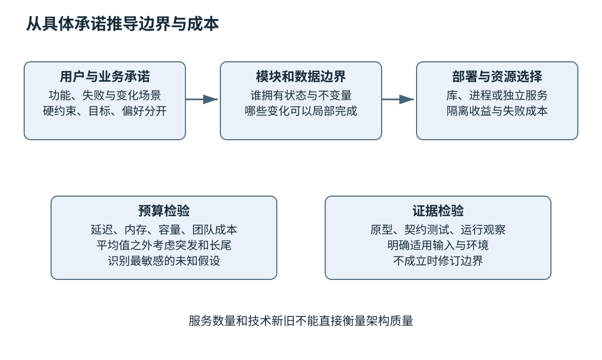
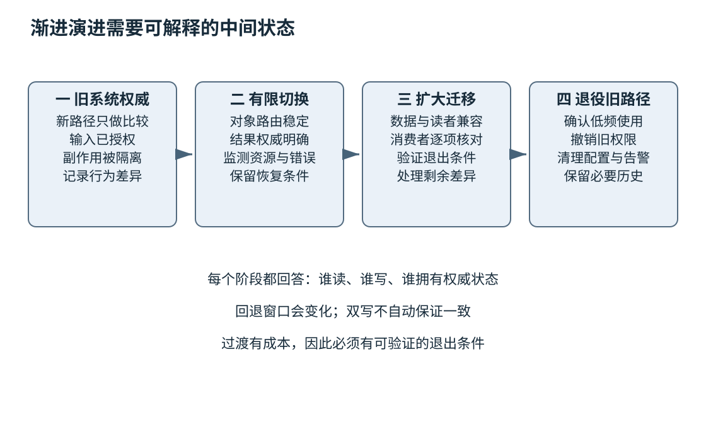

# 第二十五章 架构设计与长期演进

架构决定系统中哪些责任放在一起，哪些变化可以局部完成，哪些失败会扩散，以及团队需要为这些选择支付什么成本。它可以表现为模块、数据、接口和部署关系，也可以表现为看不见的约束：谁拥有某项数据，哪些操作必须原子完成，哪个边界不能泄露秘密，哪个变化必须兼容旧客户端。

架构图只是这些决定的视图。画出服务、数据库和消息队列，并没有解释它们为什么存在；选用流行框架，也不会自动获得可维护性。好的架构能够用具体需求说明边界，用证据检验重要假设，并为未来仍不确定的变化保留合理余地。

前面几章建立了构建、调试、测试和发布能力，本章把这些能力放回设计阶段。所有例子均为明确的教学场景，数字是用于推导的假设，不是测量结果或企业实践。代码片段未编译、未执行。官方资料与原作者材料核验于2026-10-03，架构模式被当成带条件的工具，不是必须采用的标准答案。

## 25.1 需求质量属性与模块边界

### 25.1.1 功能描述之外还需要运行和变化的约束

“系统支持上传文件”描述了功能，却没有说明文件多大、多少人同时上传、恶意文件如何隔离、失败能否续传，以及增加一种格式需要改哪些模块。这些约束直接影响设计。**质量属性**描述系统在性能、可靠性、安全、可修改性等方面的要求，不能被当成开发结束后再补的装饰。

“高性能”“高可用”“易扩展”都太宽泛。可以把要求写成场景：在什么环境下，由谁触发什么事件，系统如何响应，以什么尺度判断。SEI的质量属性工作坊方法强调从利益相关者的目标出发形成有优先级的具体场景，为架构取舍提供基础。[S1]

例如教学要求可以写成：在正常业务时段，一个已认证用户提交不超过20MB的文档，系统应在规定时间内完成接收或给出可解释失败；解析工作不得使其他租户的请求越过资源预算。这里还没有选技术，却已经暴露文件接收、异步处理、资源隔离和状态查询的需求。

### 25.1.2 把不能同时满足的目标摆到桌面上

更强隔离可能增加序列化和进程管理成本；更低延迟可能需要预留资源；更长兼容周期增加维护分支与测试矩阵；更丰富日志提高诊断能力，也增加隐私和存储负担。架构不是把所有好词同时写进文档，而是选择哪些目标必须保证，哪些可以退让。

应区分硬约束、目标与偏好。涉及安全或数据完整性的硬约束不能为性能随意让步；延迟目标可能允许在过载时拒绝部分工作；技术栈偏好通常比业务约束更容易调整。若把偏好写成不可讨论的前提，团队会在错误的范围里优化。

优先级也需要场景化。离线批处理可以接受几分钟完成，却不能悄悄漏数据；交互界面可能宁愿快速显示部分结果，也不愿等待完整分析。相同“可靠性”在不同业务里意味着不同响应，不能用一个统一百分比替代所有需求。

### 25.1.3 模块围绕稳定责任和变化原因划分

**模块边界**把一组相关责任封装起来，对外暴露必要契约。好的边界让常见变化尽量局部化，同时保留清楚的数据与控制关系。目录、命名空间和类只是实现手段，不自动形成真正独立模块。

考虑文档导入系统，可以按格式识别、解析、领域验证、存储提交和用户进度划分责任。新增一种文件格式主要影响解析适配；改变领域规则影响验证；更换存储应尽量不改变格式处理。若所有模块共享一个可随意修改的全局对象，即使目录分得很漂亮，变化仍会四处扩散。

“高内聚、低耦合”应落实到具体关系。内聚不是把所有数据访问放在同一个巨大工具类；耦合也不只统计include数量。两个模块若必须同步发布、共享内部表结构或依赖对方未说明的错误文本，就存在重要耦合，即使没有直接调用。

### 25.1.4 数据所有权常比调用方向更重要

谁可以读写某份数据，谁负责保持不变量，是架构中的核心问题。若订单状态可以被订单服务、报表任务和后台脚本随意修改，接口图再清楚也无法保证状态合法。需要明确权威写入路径、读取投影和例外操作的审计。

数据所有权并不要求每个模块都拥有独立数据库。模块化单体可以在同一个数据库中通过清楚的表与事务边界保持责任；服务也可能因为共享表而实际上无法独立演进。部署边界与数据边界有关，却不是一回事。

对于必须共同保持的业务不变量，应考虑是否需要位于同一事务或受控协议中。把一次原子操作拆成两个网络调用，会引入部分成功与恢复问题。若拆分的收益不足以支付这些复杂性，保留在同一边界可能更合理。第三十四至三十六章会深入分布式与事务机制。

### 25.1.5 依赖方向应该保护核心规则

核心业务规则如果直接读取环境变量、创建网络连接、调用具体数据库和写日志，就难以单独验证，也容易被基础设施变化牵动。可以通过适当接口把外部能力放在边缘，让核心规则接受明确输入并产生明确决策。

这种分离不是要求每个函数都有抽象父类。一个纯计算函数直接接收值，通常已经足够独立；一个小型命令行工具也不一定需要多层架构。抽象的价值在于隔离实际变化和副作用，而不是让代码看起来符合某张通用图。

依赖环值得特别关注。甲需要乙的类型，乙又回调甲的内部实现，测试或初始化就可能难以独立完成。可以寻找共同稳定概念、调整责任或引入明确消息边界，但不要仅通过前向声明隐藏环。编译依赖减少以后，语义上的循环责任可能仍然存在。

### 25.1.6 部署边界要承担它引入的失败

把模块放到另一个进程或服务，可以获得独立部署、资源控制或故障隔离，也引入网络延迟、序列化、超时、重试、版本混合与观测成本。进程边界不是免费的解耦器；若接口仍然细碎且相互循环，可能只是把原来的调用链变得更难诊断。

James Lewis与Martin Fowler对微服务的原始讨论描述了围绕业务能力和独立部署等特征；Fowler后来的Monolith First文章则讨论在边界尚不清楚时过早拆分的风险。这些是有背景的经验观点，不是证明所有新项目都必须单体或微服务的定理。[S2] [S3]

工程判断可以从需求出发：某解析器处理不可信文件，隔离进程即使部署不独立也可能有价值；某业务模块由同一小团队同步变更，拆为独立服务可能没有足够收益。先说清要隔离的失败或变化，再选择进程、库、线程还是部署单元。

### 25.1.7 用预算判断设计是否有基本可行性

设教学系统在高峰每秒接收100个解析任务，平均处理时间假设为0.2秒，且系统在讨论窗口内稳定。按平均在途量与到达率、停留时间的关系，处理阶段平均约有20个任务在进行。若每个任务平均占用10MB工作内存，仅这部分平均工作集就约200MB，还没有计入排队、缓存和运行时。

这些数字不是容量承诺。平均值不能覆盖长尾、大文件和突发，任务也可能在CPU或IO上竞争。推导的价值是发现数量级：若设计只允许两个工作槽，却承诺所有高峰请求都立即处理，就需要解释排队与拒绝；若允许无界并发，内存可能在突发时失控。

进一步可以分配预算：接收阶段限制字节，队列限制任务数和等待时间，解析阶段限制CPU与内存，输出阶段限制结果大小。预算跨层相加必须与用户目标一致，不能每层都认为自己可以独占全部延迟。第二十七章会把这些假设放入容量和SLO验证。

### 25.1.8 架构图应该标出关系的语义

同一张图里，实线有时表示调用，有时表示数据流，有时表示部署，读者很容易误解。应说明每个视图要回答什么，给箭头标出方向和关系，把人、外部系统、进程、模块和数据分别放在合适层级。

C4模型通过不同层次的视图帮助表达系统上下文、容器和组件等关系；其中container是架构中的可运行或可部署单元概念，不应直接等同Docker容器。采用任何画法都应优先保持语义清楚，而不只是复制图形样式。[S4]



图 25-1 架构从承诺推导边界，再用成本和证据检验。技术名称不能替代这种推理。

**面试追问：“什么时候应该拆微服务？”** 当独立部署、资源隔离、团队责任或特定故障边界带来明确收益，并且能承担网络、数据一致性与运维成本时。边界尚不清楚、所有变化仍需同步时，先改善模块边界可能更有效。

**面试追问：“怎样证明架构可扩展？”** 先说明扩展什么：吞吐、数据量、功能还是团队。再给出限制因素、资源预算、可独立扩展的边界和验证计划。仅画多个实例不能证明存储、锁或共享依赖不会成为瓶颈。

## 25.2 接口 数据模型 依赖注入与可测试性

### 25.2.1 接口要表达行为和责任

函数签名只表达接口的一部分。一个返回字符串的函数还需要说明编码、所有权、有效期、错误和线程安全；一个异步接口还需要说明何时完成、取消如何竞争、回调在哪执行、谁释放缓冲。第九、十四与十九章的规则在架构边界都必须保留。

接口应尽量让非法状态难以表示。把字节长度、元素数量与持续时间都用一个普通整数，容易混淆单位；把“已开始、已成功、已失败”拆成彼此独立的布尔值，就会允许“成功与失败同时为真”等无效组合。适当类型和状态机能减少隐式约定，但不能替代运行时验证不可信输入。

不要为了统一外观而抹平重要差异。一个本地无副作用查询和一个可能在远端提交支付的操作，不能只因为都返回future就被视为相同失败语义。超时后的状态、是否可重试和如何查询结果，应由接口明确说明。

### 25.2.2 数据模型应该保存业务含义

**数据模型**决定系统如何表示实体、关系和状态。字段不仅有类型，还有单位、允许范围、缺省与缺失含义。一个值为0的时间戳究竟表示纪元起点、未知还是未初始化，若没有说明，后续系统可能做出完全不同解释。

标识也需要作用域。用户ID在全局唯一、租户内唯一或某次导入内唯一，会改变索引和权限设计。把租户ID仅作为显示字段，而查询实际只按对象ID定位，可能产生跨租户访问风险。数据语义与第二十六章的安全边界直接相连。

状态模型应记录允许转换和转换责任。例如任务可以从排队到运行，从运行到成功或失败；取消可能只是请求，也可能最终确定为取消。不能因用户点了取消就立即删除所有状态，使稍后到达的完成事件无处归属。数据结构应服务真实过程，而不是只服务页面上的几个标签。

### 25.2.3 独立DTO避免把内部布局当外部协议

在进程内部，领域对象可以有复杂不变量和资源所有权；跨网络或长期存储时，通常需要明确的数据传输表示。直接把C++对象字节写到文件，会把填充、字节序、指针和ABI泄露出去。第四与第八章已经说明这种表示差异。

**DTO**即数据传输对象，可以只包含协议需要的字段，由边界适配为内部类型。适配过程负责长度、范围、编码和未知值策略，不应直接信任外部对象“看起来像内部结构”。内部领域模型也不必为了某个外部接口的历史拼写而到处携带兼容包袱。

分离会带来转换代码和复制成本，不能忽略。对高性能路径，可以设计受控视图或零拷贝方案，但必须保留生命周期与校验边界。架构上先明确谁拥有字节、谁保证格式，再考虑优化；不能用“避免拷贝”跳过安全证明。

### 25.2.4 依赖注入让构造与使用分开

**依赖注入**是由外部向对象提供其需要的协作者，而不是对象内部自行寻找或创建全部依赖。Fowler的原始文章讨论了构造、配置与使用的分离。它可以通过构造参数、函数参数、模板或工厂实现，不必引入大型容器框架。[S5]

```cpp
// C++20依赖注入教学片段，未编译、未执行；不是完整应用。
#include <chrono>

class Clock {
public:
    using time_point = std::chrono::steady_clock::time_point;
    virtual time_point now() const noexcept = 0;
    virtual ~Clock() = default;
};

class Expiry {
public:
    Expiry(const Clock& clock, Clock::time_point deadline) noexcept
        : clock_(clock), deadline_(deadline) {}

    bool expired() const noexcept {
        return clock_.now() >= deadline_;
    }
private:
    const Clock& clock_; // 非拥有引用：clock必须活得比Expiry更久
    Clock::time_point deadline_;
};
```

片段没有提供真实时钟、可控测试时钟和测试框架。它展示过期判断如何摆脱全局当前时间，同时明确被引用时钟的生命期。若需要跨线程修改假时钟，应另外设计同步；`const`成员函数不自动保证对象内部线程安全。

使用运行时虚接口有间接调用成本，模板注入则可能增加代码实例化和编译依赖。短小纯函数也可以直接传入当前时间值。选择应根据变化频率、性能和生命周期，而不是认定所有依赖都必须有一个I开头的接口。

### 25.2.5 组合根要集中管理资源生命期

依赖被注入以后，仍需要有人创建并销毁它们。**组合根**是在适当入口装配对象图的地方，例如程序启动或请求作用域建立阶段。集中装配有助于看清谁拥有数据库连接池、执行器、时钟和配置，并规定关闭顺序。

若任务依赖执行器，执行器又可能调用存储，关闭时就不能先销毁存储再等待任务完成。可以先停止接收新工作，再请求取消，等待在途操作达到可回收状态，最后释放依赖。第十九章的取消与完成规则不会因为采用依赖注入而消失。

服务定位器把依赖隐藏在全局查询中，可能简化调用签名，却让测试和生命期更难观察。它不是绝对禁止，但需要承认代价。显式参数过多则可能提示对象责任过宽，而不是立刻把所有参数塞回全局容器。

### 25.2.6 可测试性来自可控制输入与可观察结果

一个模块若只能通过启动完整系统、等待真实时间和人工看日志来验证，测试成本会很高。可测试设计提供适当控制点：输入、时钟、随机源、外部响应与调度边界；同时提供稳定结果、状态和错误信息。第二十三章的故障注入和确定性回放都依赖这些边界。

但不应为了测试暴露任意内部修改接口。公开“直接设置内部状态”的后门会破坏不变量，也可能进入生产代码。更好的方式是通过真实接口构造合法前提，或把纯逻辑分离成可直接测试的部分。必要测试钩子要限定范围并说明它对应哪个真实事件。

观测接口也需要稳定语义。测试若依赖内部容器顺序、线程数量或私有字段布局，合法重构会被大量无关失败阻碍。可以暴露领域状态、资源计数或诊断快照，但要区分产品契约与仅供诊断的信息，不让偶然实现细节变成永久承诺。

### 25.2.7 接口粒度影响性能与演进

过细的远程接口会形成多次往返，增加尾延迟与部分失败；过粗的接口则可能一次传递大量无关数据，并把多种责任绑在一起。应以常见业务操作和一致性边界决定粒度，而不是机械将每个对象方法映射成网络端点。

批量接口可以降低固定开销，但需要定义部分成功、排序、重复项和错误定位。分页接口需要说明游标有效期与并发变化的影响。流式接口需要背压、取消和资源上限。每一次为性能扩大接口能力，都应同步扩大契约与测试。

跨团队接口还要考虑发布节奏。若一个新字段要求所有消费者同一天升级，接口表面上有版本号，实际仍高度耦合。设计未知字段、缺省与能力协商时应优先考虑允许混合版本的过渡，而不是只优化新版本之间的理想状态。

**面试追问：“依赖注入是不是只为单元测试服务？”** 不是。它同时让依赖、配置和资源生命期显式化，帮助替换实现和组织责任。测试是收益之一，但抽象过度也有成本，应对应真实变化边界。

**面试追问：“怎样设计一个好的异步接口？”** 说明发起与完成、所有权、错误、取消、执行上下文、背压和关闭。仅返回future或task没有完成这些约定，调用方仍可能在超时后错误释放资源。

### 25.2.8 用提交接口检查超时语义

设一个接口叫submit，接收文档并返回任务ID。调用方在等待响应时超时，不能由此推断任务没有创建：请求可能未到达，也可能已提交而响应丢失。若调用方直接重试，每次都创建新任务，就可能重复执行昂贵解析或产生重复业务记录。

设计需要区分请求身份与任务身份。调用方可以提供在约定作用域内唯一的幂等键，服务端把它与已经接受的操作关联；重复请求按契约返回同一结果或明确冲突。但幂等键不能无限期免费保存，也不能让不同租户相互猜中。作用域、保留期、相同键配不同内容的处理和存储原子性都必须定义。

查询接口也要表达不确定性。查询暂时找不到任务，可能是请求未被接受，也可能是查询读取副本尚未看到提交；若接口承诺强一致查询，就要由实现满足，若允许延迟可见，就要给客户端明确等待与重试策略。用一个not_found字符串同时表示所有情况，会迫使调用者猜测。

取消接口则需要说明是撤回排队任务，还是请求正在运行的任务尽快停止；如果结果已提交，取消可能无法撤销副作用。任务状态查询应保留足够信息，让用户知道最终是成功、失败、取消还是状态尚未确定。把这些语义在接口阶段写清楚，可以避免以后用大量补丁弥补含糊契约。

这个设计不要求所有服务采用同一种幂等实现。重点是沿着一次真实失败追问：调用方现在知道什么，能够安全采取什么动作，服务端保存了哪份权威状态，哪些操作可以重复。接口如果回答不了这些问题，函数名再简洁也不完整。

## 25.3 兼容性迁移 技术债与系统拆分

### 25.3.1 兼容性有方向与维度

新版读取旧数据，与旧版读取新数据，是不同方向；源代码能重新编译，与旧二进制能直接加载，是不同维度；字段仍存在，与行为仍满足旧假设，也不是一回事。迁移计划必须说明支持哪些组合，不能只写“保持兼容”。

一个接口增加可选字段可能在二进制协议里安全，却在严格JSON消费者中被拒绝；改字段类型可能在某些取值范围内表现正常，超出范围才损失数据。Protocol Buffers的官方指南明确列出字段编号和类型演进等规则，也区分不同传输表示的兼容性。选择序列化工具以后仍需阅读其具体规则。[S6]

删除字段后复用旧编号或名称，可能把历史数据解释成新含义。兼容设计应考虑未知字段、保留标识、默认值和拒绝策略。工具允许解析成功，不代表业务语义仍然正确；反序列化只是迁移验证的一层。

### 25.3.2 迁移先建立可逆过渡 再删除旧路径

第二十四章用字段拆分解释了扩展、迁移、收缩。架构层需要进一步明确每一阶段的权威来源、读写路径、监控和退出条件。新旧系统同时存在时，谁决定最终状态，差异如何裁决，失败后恢复到哪里，都必须先回答。

影子读取可以让新实现接收相同输入并比较结果，但不承担正式副作用；双写则会产生真实状态，风险显著不同。若影子路径写数据库、发消息或触发外部操作，它就不再是无影响观察。设计时应把计算比较与业务提交分开。

迁移窗口越长，双路径维护成本越高，团队越容易忘记清理条件。应有明确消费者清单和退出证据，而不是凭“应该没人用了”删除。日志显示没有调用也可能是采样或观测缺失，关键旧客户端应结合版本和部署记录核对。

### 25.3.3 渐进替换需要一个可信转接点

**绞杀者模式**通过在旧系统外围逐步引入新能力，把部分请求转到新实现，最终减少旧系统承担的范围。Microsoft的架构文档说明这一渐进替换思路及其适用条件。转接层可以帮助控制迁移，但也可能成为瓶颈和单点，需要同样的可靠性设计。[S7]

转接点应能决定哪些请求走哪条路径，并保留一致的身份、权限和结果契约。按用户或对象稳定分配路径，可能比每次随机选择更适合有状态迁移；对于共享数据，还要确保两条路径不会用不兼容方式修改同一记录。

如果新系统必须频繁读取旧系统内部表并依赖其状态细节，外围替换未必真正降低耦合。可以先建立适配层，把旧模型翻译成新领域概念。所谓防腐层强调这种模型隔离，而不是简单再包一层HTTP。它需要处理语义映射、错误和一致性，也会带来维护成本。[S8]

### 25.3.4 技术债应以未来代价描述

**技术债**是对某些当前选择所带来未来维护成本的比喻。不是所有旧代码都属于债，也不是所有不够优雅的代码都值得重写。Fowler的技术债讨论区分了不同决策背景，提醒团队关注为什么产生债与如何承担后果，而不只是给代码贴标签。[S9]

一项可管理的债应说明：哪个变化因此变贵，发生频率和影响范围如何，有什么具体风险，偿还需要什么工作，以及暂不处理的后果。例如“每次新增格式需修改五个互相依赖的模块，平均还要同步发布两个客户端”比“架构太乱”更能支持决策。

偿还优先级可以结合变化频率、故障后果、阻塞程度和修复成本。长期不变、隔离良好的旧模块即使风格陈旧，也未必值得立即重写；经常变化且缺少测试的权限边界，则可能需要优先改善。技术债治理是资源分配，而不是追求代码审美统一。

### 25.3.5 重写需要比较迁移成本与剩余风险

重写可以摆脱某些结构限制，也会丢失旧系统积累的边界行为和隐含知识。新代码更整洁不等于功能更完整。应先识别必须保留的契约、历史样本、数据和运维能力，再评估是否能分阶段替换。

若选择整体重写，需要解释如何保持业务连续、迁移数据、验证差异、培训使用者和处理回退。旧系统在新系统开发期间仍可能继续变化，追赶目标会移动。没有明确范围与同步策略，重写容易变成长期双重维护。

有时最有效的改进是给旧模块加测试、隔离危险入口、替换一个高风险解析器或缩小权限。这些措施未必改变架构图的主干，却能显著降低实际风险。第二十六章的内存安全迁移将说明这种渐进策略。

### 25.3.6 拆分服务前先检查事务和团队边界

若每次业务变更都需要甲乙丙三个服务同时发布，拆分可能只是增加部署数量，没有带来独立演进。应检查接口是否按稳定业务能力划分，数据权威是否清楚，团队是否有能力独立测试、发布、值守和处理事故。

共享数据库并不必然错误，但它限制独立模式演进；完全独立数据库则把跨边界一致性移到协议层。选择要对应不变量，不能因为“微服务必须独立数据库”就拆掉原本必要的原子性而不补协议。Microsoft的微服务架构说明也明确列出复杂性、数据一致性和运维挑战。[S10]

服务数量本身不是成熟度指标。每个服务都需要配置、监控、证书、部署、备份、漏洞更新与责任人。团队若没有相应平台能力，过早拆分会把开发时间转移为协调与事故处理。第二十七章讨论的平台工程应当降低这些重复成本，但平台本身也有成本。

### 25.3.7 用迁移状态表检验遗漏

可以为每一阶段列出读者版本、写者版本、数据表示、路由规则和恢复动作。虽然实现可能很复杂，这张状态表通常能快速暴露不可能组合：旧读者仍存在，新写者却已经不再维护旧字段；新路由已全量，回退所需镜像或配置却被清理。

以解析服务替换为例，初始阶段旧解析器负责正式结果，新解析器仅处理脱敏或授权的同类输入做影子比较；中间阶段有限对象由新解析器正式处理，并保存两者差异；最后阶段确认兼容与资源预算后扩大使用，再清理旧路径。每阶段必须说明输入隐私、输出权威和副作用隔离。

比较结果不能只看成功率。旧解析器可能容忍非法输入，新解析器按规范拒绝；这种差异可能是修复，也可能破坏既有客户依赖，需要明确产品决策。架构迁移包含行为治理，不能仅让工程师根据哪个实现“更严格”自行决定用户契约。



图 25-2 渐进迁移通过中间状态降低一次性风险，也创造新的维护责任。过渡阶段必须有明确终点。

### 25.3.8 兼容承诺最终需要治理

支持旧版本多久、何时弃用、怎样通知使用者、哪些客户可以延长支持，都是产品和工程共同决定的问题。无限兼容会增加安全与维护成本，过短周期则可能伤害离线或受管环境。应以实际部署、风险和客户约束制定政策。

弃用不是在文档里写一句deprecated就结束。需要提供替代路径、迁移说明、可检测告警和支持期限，观察剩余使用，再按批准计划删除。对于无法远程更新的设备或离线客户，还要考虑分发与现场服务成本，不能只按照云端当天升级的假设设计。

**面试追问：“为什么双写不等于安全迁移？”** 两次写入可能部分成功、顺序不同或被不同版本解释。必须明确权威数据、原子性或补偿协议、差异检测与恢复。双写是一种机制，正确性来自完整协议。

**面试追问：“技术债怎么排优先级？”** 根据它造成的变化成本、故障风险、影响频率和偿还成本，选择能降低实际阻塞的项目。不能仅按代码年龄、行数或新技术偏好排序。

### 25.3.9 删除旧路径需要正面证据

迁移最后一步常被低估。新路径已经承接大部分请求，团队便认为删除旧代码只是清理；实际上删除会关闭一种恢复选择，也可能影响低频作业、历史文件和偶尔联网的客户端。判断依据应是已知消费者和数据范围，而不只是近期没有看到日志。

可以先让旧入口进入可观测的弃用阶段，记录不含敏感内容的使用计数与版本，再与部署清单和业务负责人核对。对于日志采样、离线设备或低频季度任务，应明确观察窗口为何足够，或采用其他证明。没有活动的观测与证明没有使用，是两种结论。

删除以后还要同步收缩权限、配置、监控和文档。旧数据库凭证、旧路由与无主告警如果仍然存在，会留下安全和运维成本。退役是一项完整交付：资源回收、访问撤销、历史材料保留和责任结束都要有明确记录，而不是只删除一个目录。

## 25.4 设计评审 AI辅助开发的责任边界 成本和沟通交付

### 25.4.1 设计评审围绕关键假设组织

设计文档不必覆盖每个类，但应包含目标、非目标、约束、关键流程、数据与权限边界、失败处理、迁移、验证和成本。评审者需要知道哪些假设已有证据，哪些只是估计，以及哪个假设失败会推翻方案。

例如方案依赖“解析任务可在200毫秒内完成”，应说明输入范围和依据；若只是粗略估计，可以先安排受控原型测量。方案依赖“所有客户端能在一周内升级”，则应核对实际客户端管理方式。技术图往往不是最危险的部分，未经核实的组织与部署假设才可能决定成败。

可以用反例驱动评审：某依赖持续变慢会怎样，消息重复会怎样，旧版本仍在线会怎样，租户故意提交大输入会怎样，负责人离开后谁能恢复。问题应指向设计中的具体责任，不是无限列举灾难让团队无法决策。

### 25.4.2 原型用于降低不确定性

**原型**是一项有明确问题和停止条件的实验，例如验证某种格式的解析成本、驱动是否支持目标设备、跨语言边界是否满足吞吐。原型成功的标准不是界面看起来完整，而是回答原先不知道的问题。

原型代码可能缺乏错误处理、权限和长期维护结构，不能因为演示顺利就直接转为正式系统。若决定复用，应补齐生产契约、测试、可观测性和交付要求。反过来，原型失败也有价值，它可能在投入大量开发以前排除不成立的方案。

性能原型应采用有代表性的输入和环境，区分热身、缓存、并发与尾部指标。不能从一台开发机的小文件结果推导全国范围生产SLO。第二十章的实验可信度在架构选择阶段同样重要。

### 25.4.3 AI可以扩大方案搜索 不能承担最终责任

AI适合帮助枚举候选方案、整理接口、起草测试、发现可能遗漏的错误路径。它也可能提出不存在的API、过时限制、未经验证的性能结论或不符合组织权限的操作。工程师需要把建议转成可核查假设，而不是把流畅文字当成证明。

第二十三章强调AI生成代码的独立验收，架构层还要审查问题定义。若提示只要求“设计高并发系统”，模型可能自动加入消息队列、分片和服务网格，却没有对应需求。应先给出用户目标、规模、约束和允许的运行复杂性，再比较方案。

NIST AI RMF强调风险治理、测量与责任安排。这里把它作为AI辅助工程管理的背景，不宣称采用某份框架就满足特定监管要求。具体组织仍需明确谁批准需求、谁验证代码、谁允许执行高影响动作，以及谁对发布负责。[S11]

### 25.4.4 生成权限与信息边界也是架构的一部分

AI工具如果能读取仓库、访问外部网站并执行命令，就不只是文本编辑器。设计应限制它接触的秘密、可写目录、网络目的地和发布权限，区分提出建议与执行动作。外部日志或文档里的命令不自动成为用户授权。

把生产凭证放进生成上下文，可能让一次错误建议或提示注入产生实际后果。更安全的工作方式是提供最小必要的脱敏材料，在受控环境验证，让高影响动作有明确批准和审计。权限越宽，验证与隔离成本越高，不能仅按生成速度评估工具价值。

人类评审也不能只看最终摘要。应查看真实差异、执行记录和未完成项，尤其检查有没有为满足表面结果而跳过错误处理、修改测试判据或扩大权限。工具提供的“已完成”是一条报告，需要由证据支持。

### 25.4.5 总成本包括运行 变化和认知负担

采购或云账单只是成本一部分。一个方案还会消耗开发、测试、值守、迁移、招聘培训、故障恢复和弃用时间。减少当前编码量却增加长期配置组合，可能让总成本上升。架构评估应至少说明主要成本来源和不确定性。

可以用场景比较：每新增一种格式需要改几个模块、跑哪些测试、发布哪些组件；每次依赖漏洞升级需要更新多少制品；一个故障需要几支团队共同定位。这样的变化成本比抽象地说“可维护性更好”更容易讨论。

认知负担也会影响可靠性。一个团队维护十种存储和部署方式，可能获得局部灵活性，却难以积累足够深的运行经验。统一平台能降低重复成本，但过度统一也可能迫使特殊负载采用不合适方案。应为常见路径提供良好默认，同时保留有证据的例外。

### 25.4.6 用敏感性分析避免伪精确预算

假设方案A初期实现更快，但每次客户定制都需要改核心；方案B前期多投入一段适配设计，后续定制更局部。关键变量是未来定制次数、变化范围和团队熟悉程度。与其给出没有依据的精确金额，不如列出在少量、中等和大量变化下的相对成本，并指出哪个阈值会改变选择。

资源成本也可以如此分析。若每任务平均内存翻倍，队列等待增加三倍，或者某依赖价格变化，设计是否仍可接受？敏感性高的假设值得优先测量。对不确定需求保留可替换接口，往往比提前实现所有可能功能更经济。

可逆性也是一种价值。容易替换的缓存实现可以晚些决定，长期存储格式与外部API则应更谨慎。不是所有决策都要同样深度评审，应把注意力集中在难以撤销、影响面大的部分。

### 25.4.7 沟通应把技术选择翻译成用户后果

向产品负责人说明方案时，可以说“先采用单进程模块，交付和排障较简单；若某类解析负载增长，将按已经保留的接口迁移到隔离进程”，而不是只列出模式名称。向运维交付时，需要说明容量、告警、恢复和权限；向库使用者交付时，需要接口、兼容与错误契约。

同一设计可以有不同视图，但不能有互相矛盾的承诺。销售材料说任何版本都兼容，工程文档却只支持最近两版，就需要在交付前解决。技术沟通的责任包括指出不能承诺的范围，而不只是让方案显得有吸引力。

第二十四章的ADR适合保存决定背景，运行手册保存操作，接口规范保存契约。设计评审结果应落到这些可维护材料，并与实际代码和部署保持联系。会议上说“大家都理解了”不能替代长期可查的证据。[S12]

### 25.4.8 交付以可运行 可维护和可解释为结束条件

一项架构变更完成，不只意味着新模块已经上线。需要确认旧路径按计划清理，数据迁移达到退出条件，测试和文档同步，运行责任已移交，未解决风险有人承担。若新旧系统长期并存却没有负责人，复杂性仍在增加。

可以用一次完整用户路径验证交付：从输入、鉴权、处理、持久化到错误与恢复，逐项确认边界由谁维护。再用一次未来变化验证可演进性：新增格式、更换依赖或升级协议时，预计修改范围是否与设计一致。架构价值最终应在这些具体变化中显现。

**面试追问：“设计评审应该看多少细节？”** 重点看会决定方案成败的假设、不可逆决策、边界和失败路径。局部实现可以留到代码评审，但数据权威、兼容、权限和恢复不能因为图太高层而被省略。

**面试追问：“AI给出了完整方案，工程师还做什么？”** 核实需求与事实，比较取舍，验证关键假设，控制执行权限，并对实际交付负责。完整文本不是完整证据，生成能力越强，独立判断越重要。

**面试追问：“什么是好的架构？”** 它在已知约束下以可承担成本满足重要承诺，边界和责任清楚，关键假设有验证，失败可恢复，未来变化有合理路径。它不以服务数量、图的复杂度或技术的新旧来衡量。

## 来源与阅读边界

2026-10-03打开核验以下官方与原作者资料。正文的容量数字、迁移场景和评审方法均为原创教学推理，未声称真实执行或企业采用。模式材料用于解释机制与权衡，不作普遍最优证明。

- S1：SEI Quality Attribute Workshop Collection，质量属性场景与优先级
- S2：James Lewis与Martin Fowler，Microservices，独立部署与业务边界
- S3：Martin Fowler，Monolith First，边界不确定时的演进讨论
- S4：C4 model官方说明，多层架构表达
- S5：Martin Fowler，Inversion of Control Containers and Dependency Injection，构造与使用分离
- S6：Protocol Buffers proto3指南，字段演进与兼容限制
- S7：Microsoft Strangler Fig Pattern，渐进替换
- S8：Microsoft Anti-Corruption Layer Pattern，模型转换与隔离
- S9：Martin Fowler，Technical Debt Quadrant，技术债背景与责任
- S10：Microsoft Microservices Architecture Style，运维与一致性成本
- S11：NIST AI RMF及核心说明，风险治理与责任背景
- S12：Michael Nygard，Documenting Architecture Decisions，决策记录

[S1]: https://www.sei.cmu.edu/library/quality-attribute-workshop-collection/
[S2]: https://martinfowler.com/articles/microservices.html
[S3]: https://martinfowler.com/bliki/MonolithFirst.html
[S4]: https://c4model.com/
[S5]: https://martinfowler.com/articles/injection.html
[S6]: https://protobuf.dev/programming-guides/proto3/
[S7]: https://learn.microsoft.com/en-us/azure/architecture/patterns/strangler-fig
[S8]: https://learn.microsoft.com/en-us/azure/architecture/patterns/anti-corruption-layer
[S9]: https://martinfowler.com/bliki/TechnicalDebtQuadrant.html
[S10]: https://learn.microsoft.com/en-us/azure/architecture/guide/architecture-styles/microservices
[S11]: https://airc.nist.gov/airmf-resources/airmf/5-sec-core/
[S12]: https://cognitect.com/blog/2011/11/15/documenting-architecture-decisions
