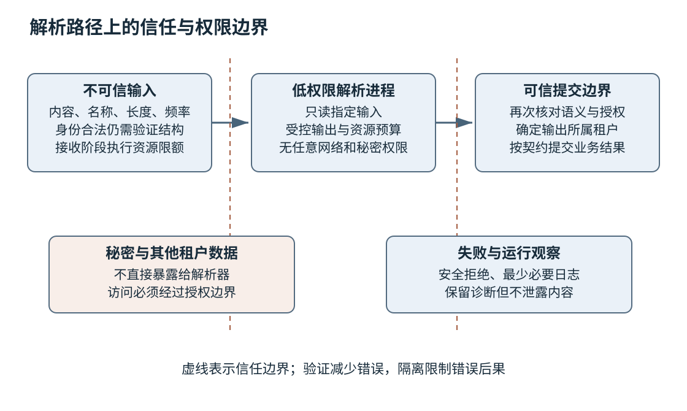
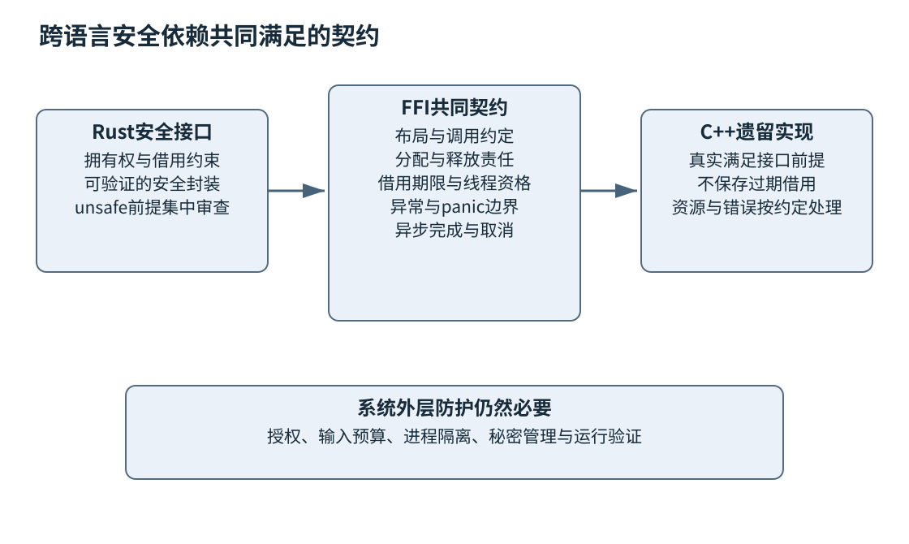

# 第二十六章 安全与内存安全工程

安全工程关心系统在输入不可信、身份可能被冒用、组件可能有缺陷的条件下，怎样仍然保护数据和操作权限。一个程序功能正确，并不意味着任何调用者都应得到它的结果；一个解析器能处理正常文件，并不意味着它能在任意字节与资源压力下安全退出。

内存安全是其中一个重要基础。越界、释放后使用、无效引用和数据竞争可能使程序行为脱离设计，但消除这些问题仍不能自动解决权限、业务逻辑、秘密泄露和资源耗尽。安全设计需要把语言、接口、进程、身份和运行流程连成多层防护。

本章只讨论防御设计、授权验证与负责任的漏洞处理，不提供针对真实目标的利用流程。所有C++与接口示例未编译、未执行，场景为教学假设。C++20语义以N4861为固定基线；Rust、互操作和安全配置按2026-10-03打开的官方资料解释，具体平台仍需核对所用版本。

## 26.1 威胁建模 信任边界与最小权限

### 26.1.1 先说明保护什么和谁能够影响它

**威胁建模**是在系统背景中识别可能损害资产的事件、路径与缓解措施。资产不仅是数据库里的秘密，也包括服务可用性、发布完整性、用户操作的正确执行和审计可信度。模型要说明假设，并在功能、架构或运行环境变化时更新。[S1]

一个文档转换服务可能接受任意用户文件，调用复杂解析库，写入临时目录，再把结果提供下载。需要保护的包括其他用户文件、宿主环境、服务资源和输出完整性。输入者可能控制文件内容、名称、大小和提交频率，却不应因此获得任意文件读取、网络访问或执行权限。

威胁分析不是列出世界上所有攻击。先画清数据如何进入、经过哪些组件、被谁读取与修改，以及哪些位置拥有高权限。再沿边界询问身份冒用、篡改、信息泄露、拒绝服务和权限扩大等风险，形成可验证的防护任务，而不是一张没人维护的术语表。

### 26.1.2 信任边界是验证责任发生变化的位置

**信任边界**表示两侧对身份、数据或执行环境的信任不同。浏览器到服务端是边界，主进程到插件是边界，受信构建到外部依赖也是边界。来自“内部网络”的消息也可能由已受损服务、错误配置或不受信租户间接控制，因此不能仅按网络位置取消验证。

跨边界时应验证身份、权限、结构和资源预算。身份回答是谁，权限回答能做什么，结构回答输入是否符合协议，预算回答这次操作可占用多少资源。四者相互补充：合法用户也能上传畸形文件，格式正确的数据也可能请求别人的资源。

边界还会被代理和缓存改变。网关认证后传给下游的身份信息，必须有可信传递方式和防伪约束；不能让外部客户端自行填写一个“内部用户ID”头部就被下游信任。缓存若没有把权限和租户作用域纳入键，也可能把合法生成的结果交给错误用户。

### 26.1.3 最小权限限制一次缺陷能造成什么

**最小权限**要求执行者只拥有完成任务所需的权限、资源范围和持续时间。解析进程如果只需读取一个已打开输入并写入受控输出，就不应拥有整个用户目录和任意网络访问。这样即使解析库有缺陷，影响也更可能被限制在较小范围。

权限应体现在实际机制上，而不只写在设计文档。运行身份、文件访问、网络目的地、进程创建、系统调用和秘密可见性都可能需要限制。具体措施依平台与威胁模型选择，不能假定某个容器或低权限账号天然隔离一切。

最小权限也有运行成本。临时目录、日志和更新过程需要足够权限才能正常工作；过宽权限危险，过窄且没有清楚错误路径也会造成运维人员临时放开全部限制。应提前设计所需能力、失败诊断与受控升级流程，让安全默认能够长期维持。

### 26.1.4 默认拒绝和逐次授权保护状态变化

授权不能只在登录时检查。用户是否能读取某对象、修改某配置或取消某任务，可能随角色、租户、资源归属和时间变化。OWASP授权指南强调最小权限、默认拒绝以及在适当位置验证请求权限，避免遗漏路径。[S2]

对象ID难猜不能替代授权。一个长随机标识降低枚举机会，却不意味着拿到它的人就应获得访问权。后台批量接口、导出、下载、搜索和状态查询都可能成为绕过路径，应按同一资源策略检查，而不是只保护主页面。

检查与使用之间也可能发生状态变化。权限检查通过后，资源归属或关键状态被另一操作改变，后续提交若仍按旧假设执行，可能违反约束。需要在恰当事务或版本条件下把授权相关状态与操作联系起来，不能把早先一次检查当成无限期凭证。

### 26.1.5 输入可信度不能因转换而自动提升

一个文件经过解压、JSON解析或数据库读取以后，内容仍可能来源于不可信输入。结构解析成功只表示符合某种语法，不代表路径安全、URL允许访问、字段属于当前用户或文本可以当命令执行。信任属性需要随数据流保留。

例如用户提供下载URL，服务端代为获取。除了URL语法，还需要控制允许的协议与目的地、重定向后的地址、解析与连接阶段的身份，以及响应大小与时间。这里不提供绕过方法，重点是说明“合法字符串”与“获准网络能力”之间仍有授权边界。

同样，文件名经过Unicode规范化或路径拼接以后，也需要按实际文件系统语义判断。字符过滤不能自动解决符号链接、目录变化和大小写规则。应尽量用受控目录、系统提供的安全文件访问能力和最小权限，而不是自行发明一组永远不完整的危险字符黑名单。

### 26.1.6 安全不变量需要可观察证据

可以把防护写成明确不变量：任何租户请求都不能访问其他租户对象；解析子进程不能访问秘密存储；超大输入在分配前被拒绝；未经授权的状态变更不会发生。随后为每条不变量安排代码审查、测试、配置核查和运行观察。

日志应帮助确认拒绝与异常，不应为了调试泄露完整令牌或用户内容。安全告警也需要可处置：谁负责、依据是什么、如何区分误报、采取什么受控动作。大量无人处理的告警不会自动形成防护。

模型应记录剩余风险与复核条件。某插件今天只有受信管理员安装，未来若允许普通用户上传，就改变了信任边界，需要重新评估。架构决定与安全模型相互影响，第二十五章的边界分析不能在上线后冻结不动。



图 26-1 缩小解析器权限与校验输入是互补防护。进程隔离限制后果，接口验证减少错误进入与传播。

**面试追问：“内部服务可以不做授权吗？”** 不能仅凭内部网络位置决定。要看调用者身份怎样建立、数据由谁控制、权限在哪一层执行以及边界是否可能被绕过。内部调用也需要明确且可验证的信任关系。

**面试追问：“为什么已经检查输入还需要沙箱？”** 输入检查与解析器都可能有遗漏，沙箱限制缺陷发生后的权限和资源影响。它不能替代正确实现，也不能被当成绝对隔离保证。

## 26.2 解析器 边界检查 整数和内存安全

### 26.2.1 解析先消耗字节 再建立语义对象

**解析器**把外部表示转换为内部结构。安全解析的关键是每一步都证明还有足够输入、字段值在允许范围内、资源消耗受控，并在失败时保持明确状态。不要在校验以前就把原始字节解释成具有复杂不变量的对象。

语法检查与语义检查不同。长度字段编码合法，但值可能超过业务上限；日期格式正确，但某个月没有这一天；对象ID类型正确，但不属于当前租户。OWASP输入验证指南区分了语法和语义约束，也强调尽早验证不可信输入。[S3]

解析失败应是普通结果之一，不应靠越界、断言终止或吞掉所有异常处理。对于流式输入，还要区分“还需要更多字节”和“已经非法”，并限制等待时间与累计内存。第十九章的部分读取与第二十二章的解析诊断在这里成为安全要求。

### 26.2.2 长度检查应避免让运算先出错

常见思路是检查offset加length是否超过size，但加法本身可能溢出。更稳妥的推理是先证明offset不超过size，再检查length不超过size减offset。这样减法处在已证明的非负范围，检查不需要先计算可能回绕的和。

同理，分配count乘element_size字节以前，要先证明乘法可表示并满足产品预算。可以在element_size非零的前提下比较count与最大允许字节数除以element_size。语言可表示上限与业务上限都要考虑，能装进size_t不意味着系统应该分配这么多内存。

C++20中无符号运算按模规则进行，有符号溢出则涉及未定义行为；不能把二者混成“溢出都自动报错”。整数转换、提升、符号混用和移位也需要按类型推理。工具能发现部分问题，设计应避免先做危险计算再检查结果。[S4]

### 26.2.3 一个有界读取函数展示证明顺序

```cpp
// C++20完整函数定义，未编译、未执行；不是完整程序，无main。
// 前提：bytes表示有效且在调用期间不被并发修改的字节序列。
#include <cstddef>
#include <cstdint>
#include <optional>
#include <span>

std::optional<std::uint16_t>
read_be_u16(std::span<const std::uint8_t> bytes,
            std::size_t& offset) noexcept {
    if (offset > bytes.size()) {
        return std::nullopt;
    }
    if (bytes.size() - offset < 2) {
        return std::nullopt;
    }
    const auto high = static_cast<std::uint32_t>(bytes[offset]);
    const auto low = static_cast<std::uint32_t>(bytes[offset + 1]);
    const auto value = static_cast<std::uint16_t>((high << 8) | low);
    offset += 2;
    return value;
}
```

先检查offset，再计算剩余长度，保证两个下标都位于视图中。使用32位无符号中间值使移位范围清楚，最终值不超过16位范围。只有成功读取以后才推进offset，因此失败时调用方的游标保持不变。这里的uint8_t、uint16_t和uint32_t要求目标实现提供对应精确宽度整数类型。

函数没有证明span来源有效。若调用者用悬空指针构造视图，或者另一线程并发释放底层存储，长度检查无法修复生命周期问题。span携带范围，但不拥有数据，C++20的普通下标访问也不会自动替用户完成运行时边界验证。第九与第十三章的借用规则仍然成立。

函数也没有解析完整协议。读到一个长度以后，还需验证业务上限、剩余消息、编码和状态，才能决定分配或继续读取。局部函数的正确性来自明确前提，整条解析链则需要保证这些前提一直成立。

### 26.2.4 避免把对象表示当作协议表示

把输入地址强转为结构体指针再读取字段，可能涉及对齐、对象生命期、类型别名、填充和字节序问题。即使某台机器上可以运行，也不能推导跨平台安全。对于固定二进制格式，逐字段读取并显式转换通常更容易审查。

`memcpy`可以在适当条件下复制对象表示，但不会自动把任意字节变成所有类型都有效的值。指针、枚举、布尔、复杂对象和含内部不变量的类型，都不能仅靠“拷贝成功”证明合法。解析边界应优先使用明确宽度的字节和整数，再构造已验证对象。

字符串还需要区分字节长度、字符数量与编码有效性。外部字节串不保证以零结尾，UTF-8中的一个字符可能占多个字节；把字节容量当字符容量，可能导致截断或越界。转换失败策略、嵌入零字节和非法序列都应在接口中说明。

### 26.2.5 资源安全与内存访问安全不同

一个解析器可以没有越界，却因声明长度巨大而耗尽内存；可以没有递归栈错误，却因深层嵌套消耗过多CPU；可以正确解压，却产生远大于输入的输出。应同时限制输入大小、嵌套深度、对象数量、输出大小、处理时间和累计工作量。

单个请求限额也不能替代全局或租户预算。一千个各自合法的小请求仍可能拖垮系统。配额、背压、排队上限和取消必须协调，拒绝应该在昂贵工作开始以前尽量发生。第二十七章将这些边界放入运行容量和多租户隔离。

限制应有明确计量单位和失败结果。若文档写最大10MB，需要说明十进制还是二进制单位、指压缩前还是解压后、包含头部还是只算负载。含糊上限可能让客户端与服务端作不同判断，产生重复提交和资源浪费。

### 26.2.6 所有权和并发是边界检查之外的基础

越界检查只保护当前范围，不能防止对象被另一条路径提前释放。异步解析如果把外部缓冲的视图保存到任务中，必须保证任务完成前存储有效且没有不兼容修改。把裸指针替换成span并不自动延长生命，把所有对象替换成shared_ptr也不自动消除数据竞争。

应该明确拥有者、借用者和可变访问资格。跨线程交付可以转移拥有权，或者使用受控共享和同步；取消以后仍可能有外部访问时，回收必须等待终态。第十七至十九章的规则正是防御内存错误的工程基础，而不只是并发性能知识。

内部容器操作也可能使引用失效。vector扩容、字符串修改或对象移动以后，保存的指针可能不再指向有效对象。安全审查需要沿着整个使用区间检查，而不是只在取得指针那一刻确认非空。

### 26.2.7 模糊测试和加固提供不同防线

第二十三章的模糊测试配合ASan、UBSan等工具，可以在大量输入中寻找实际错误；第二十二章已说明每项检查的覆盖与盲区。它们属于发现机制，不能替代解析不变量和完整平台验证。

编译器与系统加固，例如栈保护、地址空间布局随机化、不可执行内存及控制流相关保护，可以降低某些错误被利用的机会或更早终止。具体选项与效果受平台、链接方式和工具链支持影响，应依据实际文档验证，不能把一串选项复制到所有项目就宣称完成加固。[S5]

这些措施不恢复已损坏的数据，也不保证所有内存错误都被拦截。测试插桩运行时与生产加固机制还需区分，不能将ASan构建未经评估直接作为安全生产版本。最有效的组合是减少危险操作、验证边界、隔离权限、启用适用加固，并保留故障证据。

### 26.2.8 拒绝路径本身也必须可靠

输入非法以后，解析器应释放临时资源、停止不必要工作，并返回稳定错误。错误消息不应把完整敏感输入或内存内容回传给调用者。若每次拒绝都打印巨大日志，不可信输入仍可通过日志路径耗尽资源。

拒绝还应保持协议状态清楚。某些错误允许跳过一条消息继续，有些意味着流已经无法重新同步，应关闭连接。若错误后仍沿着不可信长度推进游标，可能进入另一个错误状态。恢复能力应来自协议设计，而不是凭经验“往后找下一个标记”。

**面试追问：“用了span为什么还会内存不安全？”** span表达范围和借用，不拥有存储，也不保证所有访问自动检查。来源、生命期、并发修改和具体访问前提仍需满足。

**面试追问：“为什么先检查size减offset，而不直接检查offset加length？”** 因为需要避免检查表达式先溢出。先证明offset在范围内，再用剩余空间比较，可以让每步运算都有清楚前提；乘法和类型转换也要同样处理。

### 26.2.9 沿一条消息逐项证明范围

设教学协议由两字节大端长度、一个类型字节和负载组成，长度只表示负载字节数。读取函数成功得到长度以后，不能立刻把剩余所有输入当成该负载，因为同一输入块可能还有下一条消息。应先确认类型字节存在，再验证声明长度不超过剩余范围与业务上限，最后只创建对应子范围。

若长度为零，要先明确协议是否允许。允许时应立即完成空负载消息，而不是进入等待更多字节的循环；不允许时应返回协议错误。若剩余字节不足，在完整文件解析中可判为截断，在流式解析中则可能只是需要更多数据。相同字节状态在不同输入完成契约下有不同结果。

分配可以进一步推迟。若上层只在本次同步调用中检查负载，可以使用已验证的视图；若要异步处理，就需要复制、转移缓冲拥有权或保留可证明的借用期限。是否零拷贝由生命周期决定，不由性能口号决定。

错误路径应记录最少必要上下文，例如解析阶段、偏移和错误类别，不需要返回整段原始输入。测试可以分别覆盖头部缺一字节、缺类型、恰好完整、长度超限、零长度和连续两条消息。再加入不同分段组合，验证同一合法字节流不因读取分块方式改变语义。这样的推导把局部范围证明、协议语义与资源责任连成完整链条。

## 26.3 Rust互操作 内存安全迁移与遗留系统防护

### 26.3.1 内存安全语言缩小需要人工证明的范围

Rust的安全子集通过所有权、借用和类型规则约束许多无效访问与数据竞争。它并不保证程序没有业务错误、泄漏、死锁、资源耗尽或权限缺陷。安全能力应按具体性质解释，不能用“Rust写的”替代系统威胁模型。

Rust允许unsafe操作来实现底层抽象、外部接口和硬件访问。unsafe并不关闭所有类型和借用检查，也不意味着代码必然错误；它表示某些前提需要由程序员保证。一个提供安全接口的封装，必须确保所有合法调用都不会因其内部unsafe破坏语言要求。[S6] [S7]

因此审查不能只数unsafe代码行。一个很短的错误封装可能把无效指针包装成安全引用，让大量看起来安全的调用受到影响。应关注每个不安全边界的契约、调用条件和证明，而不是认为把关键字藏进小模块就完成了安全。

### 26.3.2 FFI让两侧共同承担契约

**FFI**即外部函数接口，连接不同语言或运行时。Rust与C++相互调用时，双方需要就数据布局、调用约定、所有权、借用期限、错误和线程资格达成一致。Rust编译器不能验证任意C++实现，C++也不会自动理解Rust借用关系。[S8]

较窄的C兼容边界可以使用固定宽度字段、字节缓冲、长度和不透明句柄，但每一项仍要定义。指针非空不代表有效，长度非零不代表有足够存储；调用结束以后能否继续保存指针、能否并发调用、在哪一侧销毁，都属于接口的一部分。

`repr(C)`有助于按相应C ABI布局类型，但不把任意Rust类型变成跨语言通用对象。Rust的String、Vec和C++的std::string、std::vector不能因名字相似就按内存布局互换。接口应使用被支持的桥接表示，或显式转换。[S8]

### 26.3.3 分配与释放不能跨越未知运行时

谁分配、谁释放应由接口决定。Rust返回的不透明对象可以提供配套释放函数，C++调用方持有RAII包装以确保适时释放；反向同理。不能把一侧分配的指针交给另一侧不相容的free、delete或容器析构。

缓冲区接口可以由调用方提供空间，或由创建方返回拥有式句柄。前者要处理容量不足、输出长度和部分结果，后者要处理销毁、异常与库卸载。若长度与指针来自不同对象或不同时间，单独各自合法仍可能组成错误范围。

异步FFI比同步更复杂。借用指针跨调用返回后仍被使用，需要把生命周期扩大到完成事件；回调上下文在注销后是否仍可能到达，也必须说明。不能用一个同步签名包住异步内部实现，却让调用方按“函数返回即可释放”理解。

### 26.3.4 异常与panic要在边界内转换

C++异常和Rust panic具有各自的展开与终止规则，跨FFI行为依赖ABI和接口约定。稳健的边界通常把预期失败转换成明确结果，并避免让未约定的展开越过语言边界。`extern "C"`本身不会把所有异常或panic安全翻译成错误码。[S8]

C++侧可以在边界按契约捕获异常，Rust侧则需要根据panic策略与接口要求处理。并非所有panic都可被恢复，例如采用终止策略时不会按普通展开捕获；即使捕获某次panic，也不自动证明业务状态可以继续安全使用。

错误结果应保留稳定分类与必要诊断，不应把全部内部失败都伪装为用户输入错误。跨语言字符串的编码、有效期和释放责任也需要明确。第十四章的错误边界原则在这里仍然适用。

### 26.3.5 桥接工具减少样板 不能替代审查

CXX等工具通过受支持的类型与生成桥接代码帮助Rust和C++互操作，其官方文档明确规定不同类型的可传递方式和限制。它可以减少手写声明不一致，但不能证明被调用C++函数满足所有逻辑和生命期契约。[S9]

例如CXX对C++字符串的处理有专门规则，不能在Rust中随意按普通可移动值操作它；Rust Box等拥有式类型也有对应的生成桥接约定。工程应沿工具支持的类型模型设计，而不是在遇到限制时简单转成裸指针绕开保护。[S10] [S11]

桥接工具本身是构建和供应链依赖，需要固定版本、验证生成物与支持矩阵。升级Rust、C++编译器或桥接库后，应重新检查构建、ABI、错误和线程边界。第二十一与二十四章的交付要求不会因为跨语言工具自动生成而消失。

### 26.3.6 迁移优先选择风险集中且边界清楚的部分

一个大型C++系统通常无法立刻整体重写。可以优先评估接触不可信输入、历史内存缺陷集中、接口相对清楚的解析器或协议组件。这样更容易控制FFI边界，同时降低高风险代码暴露。选择仍需考虑性能、平台、团队能力和依赖可用性。

迁移前应保存旧行为样本与规范判据，区分必须兼容的有效输入和原本不应接受的异常输入。新实现更严格可能是正确方向，却需要产品与兼容决策；新旧差分只是发现变化，不能由旧实现自动定义全部正确性。

迁移过程中可先以影子方式比较，再有限切换，并保留受控恢复。影子路径也要遵守隐私与资源预算，不能把真实敏感文件随意发给外部服务。第二十五章的渐进替换与退役条件在内存安全迁移中同样重要。

### 26.3.7 遗留系统可以先降低暴露与权限

暂时不能迁移的组件，可以通过缩小输入格式、限制大小、隔离进程、减少权限、加强测试和修复高风险所有权来降低风险。适当使用RAII、拥有式容器、受检接口和更清楚的借用边界，仍能改善C++工程。

但这些措施的能力要如实说明。智能指针可以帮助资源管理，不能自动阻止对象内部越界；全程使用标准容器也可能保存失效迭代器；编译警告不能发现所有跨线程生命期问题。组合防护比给某个类型贴“安全”标签更可靠。

迁移计划应有可衡量进展，例如高风险入口中的不安全实现范围、已替换组件、FFI审查覆盖、剩余平台限制和历史缺陷回归。仅统计新语言代码行数可能激励迁移低风险样板，而留下真正危险的解析核心。



图 26-2 跨语言边界不会自动继承两侧各自的安全保证。安全接口需要把不安全前提封装并证明。

**面试追问：“把解析器改成Rust，系统就安全了吗？”** 它可以减少相应组件中的内存错误类别，但权限、资源、协议逻辑、依赖和FFI仍需验证。迁移收益应按减少的风险解释，不能泛化为没有漏洞。

**面试追问：“FFI最重要的契约是什么？”** 布局和调用约定、分配释放、指针与借用期限、线程资格、错误展开和异步完成。漏掉任何一项都可能让两侧各自看起来正确的代码组合成不安全系统。

### 26.3.8 用借用缓冲检验桥接是否健全

假设Rust调用一个C++解析函数，传入只读字节视图，期望函数返回时不再使用输入。这个契约需要C++实现不保存指针、不把它交给后台线程、不通过其他别名修改内容，并在调用期间遵守长度。Rust侧也必须保证输入在整个调用期间存在，不能让另一条路径并发销毁底层存储。

如果C++实现后来为了加速把解析推到线程池，原来的同步借用契约就被破坏，即使函数签名没有变化。正确演进可以改为接收拥有式缓冲，或者返回一个持有输入生命期的异步操作对象，并明确等待、取消与销毁。不能仅在文档里写“调用方多等一会儿”，因为等待时长不能证明后台访问结束。

类似地，返回一个指向内部缓存的字符串视图，需要说明下一次调用、对象销毁和并发访问是否使它失效。桥接工具可以限制类型用法，却无法自动读懂实现中的缓存替换策略。跨语言评审应沿着每一段借用从建立到结束检查，而不是只核对头文件和绑定声明相同。

## 26.4 秘密管理 认证授权 TLS和漏洞响应

### 26.4.1 秘密应有完整生命周期

**秘密**包括密码、API令牌、私钥和其他用于证明身份或获得权限的材料。安全管理不仅是“不提交Git”，还包括生成、分发、使用、审计、轮换、撤销和删除。每份秘密应有用途、拥有者、作用域与失效机制。[S12]

把秘密写在源码、镜像层、构建日志或测试样例中，会扩大可见范围。环境变量也不是天然秘密保险箱，进程、诊断、转储和平台配置可能暴露它。应根据威胁模型使用受控秘密服务或运行时注入，并限制哪些工作负载能取得哪些版本。

应用最好引用秘密身份或版本，而不在普通配置中复制实际值。日志可以记录“使用证书版本X”帮助排障，但不能打印私钥。第二十二章已经说明转储可能包含内存中的秘密，因此诊断流程也必须纳入秘密管理。

### 26.4.2 轮换需要同时考虑新旧使用者

轮换一个服务凭证时，先使新凭证可用、逐步更新使用者、确认旧凭证不再需要，再撤销旧值，是常见的过渡思路。具体顺序取决于服务是否允许双凭证、客户端缓存和连接持续时间，不能机械照搬。

泄露后的响应与计划轮换不同。若旧凭证正在被滥用，可能需要更快撤销并接受短暂影响；同时检查使用记录、受影响资源和后续持久访问。只从Git历史删除字符串，不能让已复制的凭证失效。撤销和影响调查必须独立完成。

长期共享凭证会使审计无法区分使用者，也扩大一次泄露的范围。可以采用独立工作负载身份和短期授权，前提是身份签发、信任关系和运行平台本身可靠。减少长期秘密不意味着不再需要安全治理，只是改变管理对象。

### 26.4.3 认证和授权不能混为一谈

**认证**验证调用者声称的身份，**授权**判断该身份能否执行具体动作。用户通过多因素登录以后，仍不应读取另一个租户的数据；服务间使用证书建立身份以后，仍需限制可调用接口与资源范围。[S2] [S13]

会话和令牌需要明确签发者、接收方、有效期与撤销策略。应用不能只解析令牌中的用户字段就信任它，还要验证适用的签名、来源、受众、时间和协议约束。具体实现应使用成熟库并按相应协议配置，避免自行设计认证格式。

用于登录校验的密码不应明文保存，也不应以可逆加密或普通快速哈希替代专门密码散列。OWASP密码存储指南给出算法与参数选择原则；本章不固定一个永远有效的成本参数，实际项目应按核验时建议、平台能力和威胁模型评估，并保留升级路径。[S14]

### 26.4.4 TLS保护传输 还需要验证对端身份

**TLS**为通信提供机密性与完整性等保护，TLS1.3的协议规则由RFC8446规定。加密连接并不自动保证连接到预期服务，客户端还需要验证证书链和服务身份等条件。RFC9525专门说明TLS服务身份验证。[S15] [S16]

“为了联调先关闭证书验证”如果进入正式环境，会破坏关键身份保证。正确做法是配置可信测试证书与预期主机身份，在受控环境解决信任链、名称、时间或代理问题，而不是把所有验证错误变成可忽略警告。

TLS终止位置也属于架构决定。若在网关终止，网关到后端的保护与身份传播需要单独设计；不能因为用户到网关加密，就推断所有内部传输都安全。双向TLS可以提供双方证书身份，但仍不替代业务授权。

### 26.4.5 TLS配置要随库与部署环境维护

协议版本、密码套件、证书算法和库支持会变化，应使用受维护库与当前受支持配置，避免手写加密协议。OWASP TLS指南提供配置原则，实际部署还需结合客户端兼容、组织要求与官方库文档核对。[S17]

TLS1.3的早期数据机制有重放方面的特殊约束，不能把可能产生不可重复副作用的操作无条件放入早期数据。是否启用及哪些请求可用，应由应用协议与风险决定。传输层优化不能替业务幂等作保证。[S15]

证书到期、信任根变化和自动续期失败都是运行问题。应监控有效期、验证续期和部署链路，并保留安全恢复方法。证书文件已经更新，不一定表示所有进程加载了新值；连接复用和多实例配置也需要观察。第二十七章的配置发布与运行验证适用于这里。

### 26.4.6 漏洞报告先验证范围和保护信息

收到漏洞报告时，先确认受影响产品、版本、配置与复现前提，保护报告中的敏感材料，并按授权流程安排验证。外部报告者提供的脚本或文件是待分析输入，不自动获得在生产环境执行的权限。应使用隔离、最小权限的环境进行必要复现。

影响评估要区分已证实与可能。一个崩溃可能构成可用性风险，但是否能进一步读取数据或执行代码需要额外证据；不能夸大，也不能因为尚未证明更严重后果就忽略。第二十二章的证据分层同样适用安全响应。

CERT/CC的漏洞披露指导强调报告、协调和修复相关流程。本章采用协调处理原则，不给出一套适用于所有组织、法域和漏洞的固定公开日期。披露节奏需要考虑受影响方、修复进展、风险和适用政策。[S18]

### 26.4.7 修复与通知应覆盖实际影响

安全修复应尽量针对根因并验证相邻路径。例如修复一个长度检查，要检查其他相同转换、失败清理和资源限制；修复授权遗漏，要检查同类下载、搜索与批量接口。只修报告中的一个输入，可能留下同一错误机制。

回归材料应保留必要触发条件并控制传播。对外公告需要说明受影响版本、修复版本、必要缓解与用户动作，但不应泄露用户数据或不必要的利用细节。具体内容与受众应由授权责任人确认，工程师提供准确技术事实。

第二十四章的SBOM和部署记录帮助判断哪些产品仍含受影响组件。修复主分支以后，还需回移维护版本、发布、推动更新并确认关键环境状态。安全响应结束条件不能只是合并了一个补丁，而应与实际风险降低对应。

### 26.4.8 把安全要求纳入正常工程节奏

安全评审最有效的时候，往往是接口与权限还容易改变的时候。新增上传、插件、跨租户查询、外部回调或AI工具调用，都应触发相应边界检查；依赖升级、编译器变化和部署方式改变，也可能影响既有防护。

安全门禁可以包括秘密扫描、依赖检查、关键授权测试、解析fuzz与适用加固核验，但不应把工具全绿当作终点。每项工具都有覆盖范围，异常和例外需要责任人。人类审查关注工具难以理解的业务权限、状态与后果。

**面试追问：“HTTPS为什么还会发生数据泄露？”** TLS主要保护传输过程，端点权限错误、日志泄密、恶意依赖、错误缓存和终止后的明文路径仍可能泄露。还要确认对端身份验证正确，而不是仅看URL前缀。

**面试追问：“密钥误提交后删掉文件是否足够？”** 不够。旧提交、缓存和他人副本可能已经保存它，应按范围撤销或轮换并调查使用情况。历史清理只减少继续传播，不能撤销已经获得的权限。

**面试追问：“如何评价一个系统的安全设计？”** 看资产与信任边界是否清楚，权限和输入预算是否最小化，关键不变量有何证据，内存与跨语言边界是否可审查，秘密与漏洞是否有完整生命周期。安全是持续受约束的工程过程，不是一种语言或一个扫描器的标签。

## 来源与阅读边界

2026-10-03打开核验以下资料。全章为防御与授权验证内容；未执行漏洞复现、网络测试、凭证操作或书中代码。配置与平台能力应以实际采用版本复核。

- S1：OWASP Threat Modeling，资产、假设、边界与持续更新
- S2：OWASP Authorization Cheat Sheet，最小权限、默认拒绝与逐请求检查
- S3：OWASP Input Validation Cheat Sheet，语法与语义验证
- S4：WG21 N4861，C++20整数、对象、视图和相关语言前提
- S5：OWASP C-Based Toolchain Hardening，平台相关生产加固
- S6：The Rust Programming Language，Unsafe Rust，额外能力与封装责任
- S7：The Rust Reference，Behavior considered undefined，unsafe仍需满足的规则
- S8：Rustonomicon FFI，布局、所有权、回调与展开边界
- S9：CXX官方概览，受控Rust/C++桥接
- S10：CXX rust::Box说明，拥有式桥接约束
- S11：CXX std::string说明，跨语言字符串限制
- S12：OWASP Secrets Management，秘密生命周期
- S13：OWASP Authentication，身份与会话防护
- S14：OWASP Password Storage，密码散列与更新原则
- S15：RFC8446，TLS1.3与早期数据重放约束
- S16：RFC9525，TLS服务身份验证
- S17：OWASP Transport Layer Security，部署配置原则
- S18：CERT/CC Vulnerability Disclosure Guidance，协调漏洞处理

[S1]: https://community.owasp.org/Threat_Modeling
[S2]: https://cheatsheetseries.owasp.org/cheatsheets/Authorization_Cheat_Sheet.html
[S3]: https://cheatsheetseries.owasp.org/cheatsheets/Input_Validation_Cheat_Sheet.html
[S4]: https://www.open-std.org/jtc1/sc22/wg21/docs/papers/2020/n4861.pdf
[S5]: https://cheatsheetseries.owasp.org/cheatsheets/C-Based_Toolchain_Hardening_Cheat_Sheet.html
[S6]: https://doc.rust-lang.org/book/ch20-01-unsafe-rust.html
[S7]: https://doc.rust-lang.org/reference/behavior-considered-undefined.html
[S8]: https://doc.rust-lang.org/nomicon/ffi.html
[S9]: https://cxx.rs/
[S10]: https://cxx.rs/binding/box.html
[S11]: https://cxx.rs/binding/cxxstring.html
[S12]: https://cheatsheetseries.owasp.org/cheatsheets/Secrets_Management_Cheat_Sheet.html
[S13]: https://cheatsheetseries.owasp.org/cheatsheets/Authentication_Cheat_Sheet.html
[S14]: https://cheatsheetseries.owasp.org/cheatsheets/Password_Storage_Cheat_Sheet.html
[S15]: https://www.rfc-editor.org/rfc/rfc8446
[S16]: https://www.rfc-editor.org/rfc/rfc9525
[S17]: https://cheatsheetseries.owasp.org/cheatsheets/Transport_Layer_Security_Cheat_Sheet.html
[S18]: https://www.kb.cert.org/vuls/guidance/
