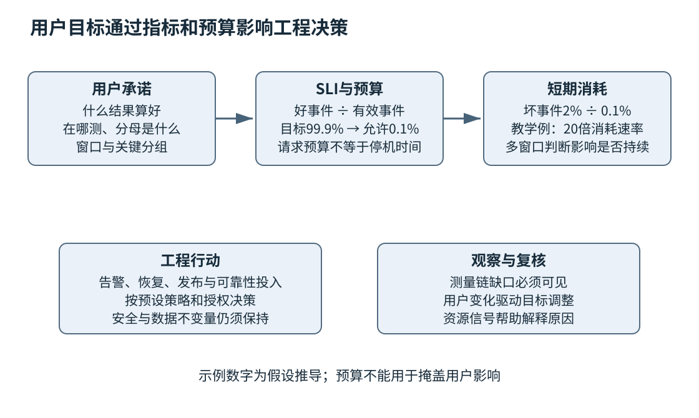
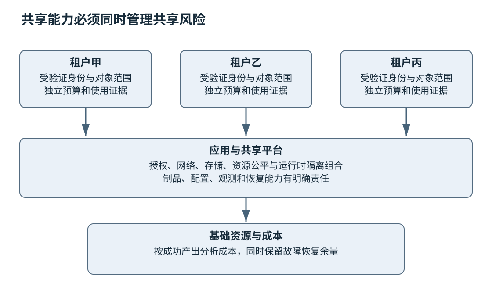

# 第二十七章 运行可靠性与平台工程

软件上线以后，正确性开始接受真实负载、依赖变化、设备故障和用户行为的持续检验。进程没有退出，不代表用户能够完成任务；服务器平均负载不高，不代表排队中的请求不会超时；发布工具显示成功，也不代表所有实例已经采用正确配置。

**运行可靠性**关心系统能否持续兑现用户承诺，以及失败时能否及时发现、限制影响并恢复。**平台工程**把重复的构建、部署、观测、权限和资源管理能力组织成可使用的服务，让应用团队更容易采取可靠做法。平台的价值应体现在交付与运行结果，而不是安装了多少组件。

本章用用户感知指标连接日志、指标、追踪、事故处理和容器平台。数字均为教学假设或算术推导，不是测量结果；没有执行集群命令、发布配置、注入故障或变更资源。资料按2026-10-03核验，Kubernetes等滚动文档用于解释稳定机制，不据页面当前版本推断所有历史版本均具备相同能力。

## 27.1 SLI SLO错误预算与用户感知

### 27.1.1 指标先对应用户能够完成什么

**服务级别指标**，即SLI，是对服务行为的量化观察；**服务级别目标**，即SLO，是在明确窗口内希望达到的指标水平。指标可以关注成功、延迟、数据新鲜度或正确完成比例，关键是与用户真正关心的结果相连。[S1]

“CPU低于百分之八十”可能是容量信号，却通常不是用户承诺。用户更关心搜索是否返回正确结果、文档是否在规定时间内完成转换、数据是否足够新。资源指标帮助解释为什么偏离目标，用户指标帮助判断是否已经产生影响，两者需要配合。

一个接口返回HTTP200也未必是好事件。它可能返回空白错误页面、过期数据或不完整结果。应先定义“好”的语义，再选择可测量代理。测量无法完美覆盖体验时，明确缺口并逐步改进，比挑一个容易变绿的指标更诚实。

### 27.1.2 分子 分母 窗口和测量位置都属于定义

以请求成功比例为例，需要说明哪些请求计入分母，哪些结果算成功，按什么时间窗口聚合，以及在哪一层观察。客户端、网关和应用看到的集合可能不同：请求在到达应用以前失败，应用日志里根本不存在；应用认为成功，客户端却可能超时未收到结果。

非法请求是否计入、用户主动取消怎样分类、限流是预期拒绝还是用户失败，都需要依据服务承诺事先约定。不能在事故发生后把不好的请求重新排除以改善数字。拒绝恶意输入与拒绝本应获得服务的合法请求，具有不同含义。

窗口可以是滚动窗口或日历周期，选择会影响预算和运营决策。短窗口灵敏但波动大，长窗口平稳却可能掩盖当前故障。SLO评估窗口与告警观察窗口可以不同，但二者关系必须清楚。

跨实例或跨时段计算请求成功率时，应汇总同一口径的好事件数与有效事件数，再相除；不能把流量不同的实例成功率直接取算术平均。窗口内没有有效事件时，比例没有定义，应报告无数据或按事先约定的低流量策略处理，不能把零除以零改写成100%成功。

### 27.1.3 请求预算与时间预算不能随意互换

若教学SLO是在30天内至少99.9%的有效请求成功，允许失败比例就是0.1%。假设窗口内恰有100万次有效请求，则对应1000次坏请求的预算。这里分母是请求，不是时间，不能直接写成“允许停机43.2分钟”而不说明流量分布。

30天乘以0.1%确实得到43.2分钟，但这只对应按时间计算、每个时刻权重一致的可用性口径。在请求口径下，高峰一分钟与低谷一分钟可能消耗完全不同预算。用户分布也可能不均匀，一个大客户受损可能被大量普通流量稀释。

因此需要按重要用户旅程、地域或服务等级适当拆分目标，同时避免产生无法管理的海量SLO。总体指标有助于看趋势，关键分组防止平均值掩盖严重局部影响。每个分组都应有实际决策用途。

### 27.1.4 延迟目标应直接描述足够快的事件

可以把“在300毫秒内成功完成的有效请求比例”定义为一个SLI，这同时要求成功和及时。若只统计成功请求的延迟，失败请求可能被排除，系统大量快速失败时指标反而很好看。应分别观察错误与延迟，或使用明确定义的组合好事件。

p95、p99等分位数描述分布位置，不代表每个用户的保证。把不同实例的p99取平均，通常不能得到全局p99，因为分位数不是可线性相加的统计量。要聚合分布，应使用可合并的直方图等合适方法，并理解桶边界与估计误差。[S2]

只看平均延迟会隐藏长尾。少数极慢请求可能对交互用户影响很大，对后台批处理则未必同样重要。指标应反映用户任务和请求组合，而不是机械追求所有服务使用同一个分位数。

### 27.1.5 错误预算支持可靠性与变化之间的决策

**错误预算**是目标允许的坏事件额度。它不是故意制造故障的配额，也不是剩余预算多就可以忽略用户投诉。它帮助团队讨论何时优先改善可靠性，何时可以承担适当变更风险。[S1]

预算策略应在事故前达成一致：消耗过快时是否放缓非必要发布，哪些安全修复仍需推进，如何处理外部依赖事故，谁有权接受例外。若预算只是月底报表，没有影响任何决策，它就没有发挥工程作用。

所有SLO都设成100%会使任何失败都超预算，但并不消除失败本身。目标应基于用户需求、成本和可达到水平。涉及数据完整性、安全或人身安全的不变量也不能被简化成“允许损坏百分之几”；SLO是运行管理工具，不替代这些硬约束。

### 27.1.6 消耗速率让短期故障及时可见

**预算消耗速率**可以用观察到的坏事件比例除以目标允许比例来理解。若允许0.1%，当前坏请求比例为2%，消耗速率就是20倍。它表示在类似流量与错误比例持续的假设下，预算会比目标节奏快得多地消耗。[S3]

若采用30天窗口、从完整预算起步并假设请求速率近似稳定，20倍速率对应约36小时消耗完整窗口预算。这只是帮助理解数量级的教学推导，真实滚动窗口、剩余预算和流量变化需要按实际计数计算，不能把36小时写成精准故障倒计时。

多窗口告警结合较长窗口确认持续影响、较短窗口确认仍在发生，可以减少短暂尖峰噪声并及时发现严重故障。具体阈值取决于目标、流量与响应能力，不应无思考地复制其他团队的数字。低流量服务尤其需要结合绝对事件数和关键任务失败。

### 27.1.7 SLO需要数据质量与定期复核

如果监控漏采、时钟错误或计数器重置被错误处理，SLO结果也会失真。无数据不应自动解释为零错误；业务完全不可达时，恰恰可能没有应用侧请求记录。应为测量链本身设计健康信号，并使用独立用户侧或合成检查补充关键盲区。

目标也需要随产品变化更新。某接口原来用于后台任务，后来进入结算页面，用户对延迟的容忍可能改变；数据规模增长后，旧目标可能不再代表可接受体验。修改目标应有明确依据和批准，不能仅为了让历史报表好看。

**面试追问：“99.9%的SLO意味着什么？”** 必须先说明测量对象、好事件定义、分母、窗口与位置。请求成功率和时间可用性不能在流量不均匀时随意换算，数字本身不是完整契约。

**面试追问：“错误预算用完是否必须冻结所有发布？”** 由事先约定的预算策略决定，通常应优先降低可靠性风险，但安全修复和恢复性变更可能仍需推进。预算支持决策，不替代风险判断。

图 27-1 SLO把用户结果与工程选择相连。预算有明确计量对象，资源利用率用于解释原因，不能代替用户结果。

### 27.1.8 把测量误差当成可靠性问题

设网关记录收到1000次有效请求，应用只记录到900次，其中899次成功。只看应用数据，成功比例约99.889%，虽接近99.9%，却不能因显示时四舍五入就判定达标；若另外100次在路由阶段已经失败，并假设899次成功都及时到达用户，入口口径的成功比例仅为89.9%。两个数字并非谁一定造假，而是测量位置和分母不同。SLO需要先选清楚承诺边界，再让数据与它一致。

重试还会改变计数单位。一个用户动作第一次失败、第二次成功，如果按所有服务调用计数，是一次失败加一次成功；若产品承诺用户动作最终完成，可以采用另一种有明确期限的任务级口径。但最终成功不能抹掉超出期限或产生重复副作用的事实。可以同时保存调用级诊断和用户任务级目标，避免把两者混成一个数字。

同样，后台数据管道不能只看HTTP请求。可以观察规定时间内完成的批次比例、数据新鲜度或缺失记录范围。没有用户在线点击不代表没有用户影响，早晨报表缺失和实时查询超时只是不同的服务承诺。

对关键SLI，可以用独立合成请求、客户端遥测或下游业务核对补充主采集路径。合成检查覆盖有限样例，客户端数据也可能有网络和采样偏差，因此它们主要用于发现不一致并帮助定位。测量系统也需要明确覆盖范围，不存在一个无需验证的绝对真值面板。

## 27.2 日志 Metrics Trace和事故复盘

### 27.2.1 三类信号回答不同问题

**日志**记录具体事件及上下文，适合解释某一次失败；**Metrics**即指标，把大量事件汇总为时间序列，适合观察趋势与告警；**Trace**即分布式追踪，以请求或任务的因果关系连接多个执行片段，适合分析跨服务路径。OpenTelemetry将这些作为不同信号组织，并提供统一采集与传播相关机制。[S4]

它们不是互相替代的三份同样数据。指标告诉团队错误率在上升，追踪帮助找到时间消耗在哪段链路，日志提供具体错误和状态。为三者保存适当关联标识，可以从总体影响进入代表性事件，而不必在海量文本里盲搜。

这也不意味着三者具有相同的完整性或交付保证。聚合指标通常无法还原单次请求；采样Trace不一定包含某次失败；普通诊断日志也不自动成为不丢失、不可篡改的审计记录。即使收集器配置了队列与重试，队列满、超出重试期限或存储故障仍可能丢数据。要用它们计算SLI或证明重要操作，应另行核对覆盖率、丢弃计数、保留与持久化契约。[S21]

**可观测性**的价值在于能够根据外部信号理解系统内部状态。装上收集器并不自动获得它：如果关键阶段没有语义、所有错误都叫failed、数据缺少制品与配置身份，仍然很难诊断。

### 27.2.2 指标类型和标签决定能怎样解释

计数器适合累计事件，如请求数和失败数；量表适合当前值，如队列长度和在途任务；直方图描述延迟、大小等分布。选择错误类型会导致无意义计算，例如把可增可减的队列长度当累计请求计数，或者对重启后的计数器直接做未经处理差值。

标签用于分组，但每个不同标签组合都可能产生独立时间序列。请求ID、用户ID、完整URL和任意错误文本具有高基数，直接作为指标标签可能使存储与查询成本失控。Prometheus的命名指南强调一致单位和可控制标签；具体系统仍需容量与保留策略。[S5]

可以将指标维度限制为服务、操作类别、结果分类、地域和受控版本等，把精细身份留在日志或追踪中。对租户级可观测需求，也要设计聚合、采样或分层方案，不能简单给每条指标增加所有租户和请求维度。

### 27.2.3 直方图要在关注阈值附近有分辨率

若SLO阈值是300毫秒，直方图只有100毫秒与10秒两个宽桶，就很难准确估计阈值附近比例。桶设计应对应实际延迟范围与决策需求；原生直方图等机制可能提供不同精度和成本，但支持与查询语义取决于所用版本。

对于经典累积直方图，如果预先在0.3秒设置桶上界，可以用该桶的区间新增计数除以总新增计数，直接统计“不超过300毫秒”的观测比例，不必先估算p99再判断。这里准确的是已记录样本的阈值分类，仍受漏采、时间窗和好事件定义约束；跨实例还必须保持相同单位与可兼容桶边界。分位数落在桶内时通常仍需要估计，不能把阈值计数的准确性推广到任意分位数。[S2]

多实例聚合时，应先按兼容表示合并计数，再计算所需分位数或阈值比例。已经在每个实例求出的分位数通常不能简单平均。还应注意成功与失败、不同操作和不同输入大小的混合，避免把本来分布不同的负载压成一个没有解释力的数字。[S2]

指标采样与窗口也会影响突发可见性。五分钟平均可能掩盖十秒拥塞，过短窗口则容易噪声过大。面向告警、容量规划和事故分析，可以保留不同聚合层级，但要说明每个图表的时间语义。

### 27.2.4 Trace依靠上下文传播连接因果

追踪通常由多个span组成，每个span表示一段操作，并保存父子或其他关联关系。上下文需要在网络、线程池、消息队列和异步回调之间传播，否则一条用户请求会断成许多无关片段。OpenTelemetry的传播机制解释了这种关联如何跨执行边界维持。[S6]

传播不等于盲目信任外部输入。来自不可信客户端的追踪字段需要按格式、大小和策略处理，不能让它任意决定内部敏感标签或无限扩大采集。与追踪一起传播的附加上下文也不应包含秘密或未经授权的个人数据。

采样降低成本，却引入观察偏差。头部采样在请求开始选择，可能错过后来才表现异常的请求；尾部采样等待更多结果后决定，但需要额外缓冲与处理。偏向保留错误或慢请求的样本，尤其不能直接用来计算全量错误率或延迟分布；需要独立计数，或具备明确抽样概率和校正方法。尾部采样也不能恢复此前已经丢弃的span。采样策略应兼顾异常保留、总体统计与资源上限。[S22]

### 27.2.5 日志要保留事件语义和安全边界

结构化日志可以统一事件名、时间、请求标识、阶段、结果分类与制品身份，方便机器查询。字段应有清楚单位和缺失含义，不能今天用duration表示毫秒、明天表示秒。日志格式变化也会影响告警和分析任务，应有兼容纪律。

记录应避免包含完整令牌、密码、私钥或不必要用户负载。脱敏不能只依赖查看界面遮盖，因为原始存储仍可能保留敏感值。第二十六章的秘密与权限要求同样适用于收集器、日志仓库和导出工具。

日志写入也有成本与失败模式。同步写大量日志可能拖慢关键路径，异步日志队列无界可能耗尽内存，队列丢弃又可能损失证据。应为日志系统设置容量、降级和丢失计数，让观测失败可见，而不是在最需要证据时悄悄沉默。

### 27.2.6 告警应召唤能够采取行动的人

告警需要说明发生了什么、影响范围、相关目标、查看入口和初步处置。一个CPU超过阈值的告警如果没有用户影响，也没有可执行动作，可能更适合作为容量提示；持续消耗关键SLO预算则可能需要立即响应。[S3] [S7]

多个底层症状可能来自同一事故，应适当聚合与抑制重复，避免值班人员同时收到数百条通知。告警不能只追求灵敏，还要考虑准确、及时和可处置。长期误报会消耗注意力，使真正事故更容易被忽略。

静默规则也要有范围和到期时间。临时维护期间关闭相关告警可以合理，但忘记恢复会制造长期盲区。告警配置应像应用配置一样评审、测试和记录，关键告警还应定期演练确认能够到达正确响应者。

### 27.2.7 事故处理中先稳定局面再扩展调查

事故响应需要明确协调、技术处置和沟通责任。早期应确认用户影响、建立共同时间线、限制并行无协调变更，选择风险可控的缓解措施。多个工程师同时修改不同参数，会让恢复与根因判断都更加困难。[S8]

第二十二章的证据保全在事故中仍然重要，但要与恢复紧迫性平衡。可以先保存必要制品、配置、日志和代表性状态，再执行已批准的回退、限流或功能关闭。恢复动作不应超出授权，也不能因为紧急就忽略不可逆数据风险。

对用户或业务方的沟通应区分已知影响、正在采取的措施和未确认原因。没有把握的恢复时间不能写成承诺。恢复以后还要确认积压、数据和下游状态，不能只因告警停止就认定所有后果结束。

### 27.2.8 复盘寻找系统条件与可验证改进

**事故复盘**记录影响、时间线、触发与促成因素、检测和恢复过程，以及后续行动。无责复盘强调理解当时信息和系统条件，避免把复杂事故简化为某个人“不够小心”；它不意味着没有责任或不处理故意违规。[S9]

“加强意识”“以后注意”通常难以验证。更具体的改进是为配置加入范围校验、使危险操作需要独立批准、补充取消竞态测试、改进回退兼容或减少告警噪声。行动应有负责人、优先级和完成证据，避免复盘只成为归档文件。

根因也未必只有一个。负载增加、限额缺失、监控盲区与错误恢复可能共同扩大事故。可以区分触发事件、使故障扩散的条件和延迟恢复的因素，分别安排措施。单一“根因”标签若掩盖其他可改进环节，会限制学习。

**面试追问：“日志、指标和Trace应该选哪一个？”** 应按问题组合。指标看总体与告警，Trace看跨阶段因果和耗时，日志解释具体状态。关键是语义和关联，不是把同样文本发送到三个系统。

**面试追问：“无责复盘是不是不追究任何问题？”** 不是。它避免以个人疏忽替代系统分析，同时仍明确行动责任和必要管理处理。目标是形成能验证的改进，降低下一次同类事故概率与影响。

## 27.3 Docker 容器编排 配置发布与容量

### 27.3.1 容器封装运行材料 不等于独立虚拟机

**容器镜像**提供分层文件系统和运行配置等材料，容器是在相应运行时与隔离机制下执行的进程环境。常见Linux容器共享宿主内核，不应被当成每个都携带完整独立内核的虚拟机。Docker在不同宿主平台上的实现还可能借助虚拟化层，具体边界需要核对。[S10]

容器提高环境一致性，但镜像不能包含所有运行条件。内核、CPU、挂载、网络、权限和外部服务仍会影响行为；可变镜像标签也不保证每次取得相同内容。第二十一与二十四章的工具链、制品摘要和来源记录仍然适用。

最小镜像可以减少材料与暴露面，但不能为了体积删除必要证书、时区数据或诊断能力而没有替代方案。镜像中不应烘焙长期秘密，运行身份和挂载权限应最小化。容器启动成功只证明进程被创建，不能证明服务准备就绪。

### 27.3.2 编排系统维护期望状态 应用负责业务语义

容器编排系统帮助调度、重启、服务发现和滚动更新。Kubernetes以资源对象和控制循环维护期望状态，实际状态需要时间收敛，也可能因容量、权限或依赖失败而无法达到。提交一份配置不是同步完成业务操作。

同一个Pod身份在生命周期内只绑定到一个节点，并不会原地迁移到另一节点；发生替换时，控制器可以创建新UID的Pod并重新调度。容器在原Pod内重启，与Pod被替换是两回事，应用不能把某个短期进程身份当成永久数据身份。[S14] 需要持久状态时，应使用明确的外部存储或卷机制，并理解其生命周期、访问模式和故障行为。PersistentVolume与声明、工作负载并非简单同生共死。[S11]

编排器重启失败进程，不能修复所有状态错误。若启动时反复读取同一个坏配置，重启只会形成循环；若每次重启都重复执行非幂等初始化，还可能扩大损害。应用启动、迁移和恢复逻辑必须按可重复执行设计。

### 27.3.3 Requests和Limits不是同一个概念

Kubernetes的资源request参与调度与资源分配判断，limit约束可使用范围，具体执行受资源类型与节点实现影响。常见Linux环境中CPU限制可能通过节流体现，内存超过可用限制则可能导致OOM终止等后果。不能把二者都理解成“预留了同样一块固定资源”。[S12]

request也不是使用量上限：节点有余量且limit等约束允许时，容器可以使用更多资源。CPU节流不等于杀死进程，内存限制也不是达到某条精确曲线就立即重启；终止之后是否重启还取决于适用的重启策略。排障时应区分节流、OOM终止与节点压力驱逐，而不是把所有现象统称为“容器自动恢复”。

设置过低request可能使节点容纳过多工作负载，争用时服务表现变差；设置过高则降低利用率并阻止调度。过低CPU limit可能增加尾延迟，内存limit过低可能让偶发大请求触发重启。应结合真实工作集和峰值验证，而不是按代码行数估算。

应用也应理解自己获得的资源。线程池按宿主物理核心数盲目扩张，可能远超容器可用CPU；缓存按宿主总内存规划，可能超过容器限制。资源发现与配置需使用实际运行契约，特别是多平台与不同运行时环境。

### 27.3.4 探针的三种问题需要分开回答

**Startup probe**帮助判断启动阶段是否完成，**readiness probe**判断当前是否适合接收服务流量，**liveness probe**用于识别需要重启的失活状态。它们触发的系统动作不同，不能把同一个复杂健康检查不加区分地复制到所有位置。[S13]

配置startup probe后，它成功以前不会执行liveness与readiness检查；startup或liveness连续失败达到阈值会导致相应容器被终止，再按重启策略处理。readiness失败本身不会重启容器，而是改变就绪与服务路由资格；这仍不是对既有连接、绕过Service的直连或所有代理行为的瞬时保证。

若下游数据库短暂不可用，所有应用liveness都失败并同时重启，恢复时会叠加连接风暴和缓存冷启动。这个依赖故障未必能通过重启应用解决。readiness也不能无脑移除所有实例，否则剩余流量可能无处可去；应按依赖是否严格必需、是否可降级和恢复成本设计。

探针本身应低成本、有时间上限且不泄露信息。高频运行昂贵查询会成为负载来源；检查线程仍活着也可能漏掉业务队列完全停滞。选择什么状态代表“可服务”需要应用语义，而不是平台替你决定。

### 27.3.5 优雅终止要与负载路由协调

停止实例时，应尽量先停止接受新工作，再让在途任务完成或按契约取消，最后释放资源。编排系统的终止宽限期、信号与端点更新机制提供一部分条件，但应用仍要正确处理信号、连接与后台任务。具体时序和例外应按所用版本与运行时核对。[S14]

路由更新并非瞬间到达所有客户端，已有长连接也可能继续发送请求。应用关闭流程需要容忍这段过渡，给请求明确结果，并在到达最终期限时执行受控策略。第十九章强调的“请求取消不等于资源立刻可回收”，在容器退出时仍然成立。

把宽限期设置得很长不能自动保证安全退出，设置得很短则可能反复截断工作。应基于任务最长允许时间、外部副作用和恢复机制决定，并通过第二十三章的故障与关闭测试验证。

### 27.3.6 配置发布需要版本与校验

配置能够改变超时、并发、路由、证书和权限，风险有时不低于代码。应验证类型、范围与组合约束，保存版本和批准记录，并能够确认每个实例实际采用哪一版。只知道控制面配置已更新，不代表应用已重新加载。

Kubernetes ConfigMap通过环境变量与挂载文件提供配置时，更新行为不同：环境变量不会在已有进程中自动变化，投射卷内容的更新也不是瞬时完成，更不自动让应用重新读取。使用subPath挂载的容器不会收到这类ConfigMap更新，不能把普通投射卷的行为直接套用过去。[S15]

热更新需要原子性。若多个字段共同保持不变量，逐字段更新可能暴露中间状态；可以先解析和验证候选配置，再按适当同步机制一次发布。失败时保留旧值并清楚报告，与第十四章的准备提交思想一致。秘密则应采用相应安全存储与访问控制，而不是当普通配置公开分发。

### 27.3.7 扩容是带延迟的控制过程

自动扩容根据指标调整副本数，但采集、决策、调度、镜像获取、启动和预热都需要时间。Kubernetes HPA是间歇运行的控制循环，不是负载上升一瞬间就产生可用容量。目标指标、最小最大规模与稳定策略会影响响应和振荡。[S16]

使用CPU资源利用率目标时，HPA中的百分比通常相对于相关资源request，而不是整台宿主机CPU，也不是容器limit；必要request缺失会使该指标无法正常参与计算。增加副本期望值也不等于增加节点容量，Pod可能仍在等待调度。因此要同时检查指标分母、控制器判断和最终就绪容量。

扩容也可能被共享瓶颈限制。应用副本增加，数据库连接或下游配额不变，可能让系统更拥塞。容量模型应包含整个关键路径，而不只计算应用CPU。若每个实例启动都拉取大量模型或建立很多连接，扩容过程本身也可能压垮依赖。

突发流量需要额外缓冲和准入策略。队列可以平滑短期波动，却不能无限吸收长期超载；排队越长，用户越可能超时并重试，进一步放大负载。应设置队列长度、等待期限、重试预算和拒绝策略，优先保护仍能在预算内完成的工作。

### 27.3.8 容量验证要覆盖退化与恢复

峰值吞吐测试只是起点。还需要观察长尾、内存峰值、依赖变慢、实例丢失、缓存冷启动和滚动发布期间的余量。满负荷运行时再失去一个实例，剩余容量是否足够，往往比正常状态的漂亮平均值更重要。

设教学系统有四个实例，每个在目标延迟内可处理约100请求/秒，正常流量为280请求/秒。失去一个以后名义总能力为300，余量只有20；若故障同时导致重试或缓存命中下降，可能立即超载。这里的100仅为教学假定，真实容量必须通过实际实验确定；本章没有测量，算术只说明容错余量应按故障状态计算。

负载测试还要避免协调遗漏：若客户端只在上一次响应后发送下一次请求，系统变慢时测试自身发送速率会下降，可能掩盖真实持续到达造成的排队需求。闭环模型并非必然错误，它适用于真实用户确实等待前次完成的场景；问题在于用它代表并不等待的外部到达。采用计划到达模型时，还应记录计划与实际发送之差、生成器自身饱和、超时及丢弃，避免只从迟到的实际发送时刻计时而漏掉等待。[S23] 第二十章的实验纪律与第二十三章的判据同样适用。

**面试追问：“容器内CPU不高，为什么请求还是慢？”** 可能有节流、队列、锁、IO或下游等待，也可能指标聚合掩盖瞬时问题。应关联实际资源限制、调度与阶段耗时，不能仅凭一个利用率排除容量问题。

**面试追问：“自动扩容能否解决所有过载？”** 不能。它有反馈和启动延迟，受共享依赖与配额限制，还可能放大冷启动负载。需要容量余量、背压、准入和受控重试配合。

## 27.4 平台工程 可观测性 成本和多租户隔离

### 27.4.1 平台应当把可靠做法变成容易使用的路径

**平台工程**面向内部开发与运行团队提供可组合的能力，例如创建服务、构建发布、秘密访问、观测和资源管理。CNCF平台白皮书强调平台需要围绕使用者需求组织，而不只是堆叠基础设施工具。[S17]

一个好的默认路径可以在创建服务时同时提供正确的制品身份、最小权限、基本指标、告警与回滚入口。这样应用团队不必每次从零拼装，也更容易满足组织约束。平台应清楚说明哪些保证由它提供，哪些仍由应用负责。

自助服务不意味着任何人都能执行任何动作。常规低风险操作可以自动化，高影响权限、数据删除或外部发布仍需适当批准。平台把策略做成可理解的接口与反馈，比隐藏在人工工单里的规则更容易长期执行。

### 27.4.2 平台也需要产品与可靠性责任

平台的使用者是开发与运维人员，他们同样有任务、痛点和反馈。若创建服务需要填写大量无关字段，或者每次失败只返回内部堆栈，平台可能把复杂性换了一个入口而没有减少。应观察完成任务的时间、失败原因、支持负担和用户满意度。

平台自身会成为共同依赖。构建系统、制品仓库、身份服务或观测控制面故障，可能影响多个应用。需要明确服务目标、容量、备份、升级与事故响应，避免把所有关键能力集中以后却没有相应可靠性投入。

标准化也要允许受控例外。高实时设备、GPU推理与普通HTTP服务可能有不同资源和部署约束。平台可以提供共同身份、审计与制品能力，同时允许经过评估的执行方式，避免用一个模板抹平重要差异。

### 27.4.3 观测系统有自己的成本与故障预算

日志、指标和追踪需要采集CPU、网络、存储和查询资源。采集越详细，成本和隐私风险通常越高。应按事件价值设置保留、采样、聚合和访问策略，而不是默认永久保存所有内容。

高基数标签、无界异常堆栈和大请求正文，可能使观测系统在事故时最先过载。可以限制单事件大小、缓冲和发送速率，保留关键错误与丢弃计数，并让应用在观测后端不可用时按明确策略运行。不能让日志服务故障直接拖垮全部业务请求。

成本优化也要保护诊断能力。删除所有低频事件可能正好删掉罕见严重问题的证据；采样只保留正常请求会扭曲判断。应由实际事故和查询需求反推数据价值，在成本与可解释性之间做可审查取舍。

### 27.4.4 单位经济性连接成本与有效产出

总账单上升可能因为业务增长，也可能因为效率退化。**单位经济性**把成本与有意义的产出关联，例如每个成功转换文档、每千次有效查询或每个活跃租户的成本。FinOps的相应能力说明强调用业务单位连接技术与价值判断。[S18]

分母需要是有效产出。若系统大量失败重试，按总请求数计算的单次成本可能下降，却没有让用户得到更多结果。可以同时观察成功任务数、重试与浪费成本，区分业务增长、配置变化和性能回归。

成本归属也有共享部分。控制面、空闲冗余、日志和网络出口不一定能精确分配到单个请求。可以采用明确分摊规则并保留估计范围，避免伪装成精确事实。预算应考虑峰值与故障余量，不能为了短期利用率消除所有恢复空间。

### 27.4.5 多租户隔离同时包括数据 权限与性能

**多租户**意味着多个用户群体共享一部分基础设施。租户可能是同一组织内团队，也可能是互不信任客户，所需隔离强度不同。需要分别讨论控制面权限、网络、存储、进程、秘密和资源争用，不能只创建一个命名空间就宣布隔离完成。[S19]

Kubernetes namespace提供资源命名与策略作用域，但不是独立内核或绝对安全边界。RBAC、网络策略、资源配额、运行时和节点隔离等机制需按威胁模型组合。网络策略是否实际生效，还依赖相应网络实现支持；配置文件存在不等于数据路径已经执行限制。[S20]

应用层也必须保持租户语义。数据库查询、缓存键、对象存储路径、异步任务和日志查询都应携带受验证的租户范围。基础设施隔离不能弥补应用把对象ID查错租户，应用鉴权也不能替代宿主权限与资源限制。

### 27.4.6 噪声邻居需要公平与预算机制

一个租户提交大量合法请求，可能消耗共享线程池、缓存、连接和磁盘，影响其他租户。按总CPU扩容不一定解决，因为瓶颈可能是单个锁或共享下游。需要按租户或服务类别设置并发、队列、速率与存储预算，并观察公平性。

简单先到先服务可能让大批量任务长期占据执行器。可以采用分队列、权重、公平调度或工作量估计，但这些策略也会影响延迟与吞吐。选择应对齐产品承诺，防止低成本请求被昂贵任务阻塞，同时避免某类工作永远饥饿。

限额不能只检查入口次数。单次请求的字节、计算复杂度和输出量可能差异巨大，应结合资源成本建模。拒绝与降级需要稳定错误语义，客户端应有退避与重试预算，避免限流反而触发更密集重试。

### 27.4.7 平台变更要限制共同故障范围

共享平台的一次配置错误可能影响所有应用，因此平台发布更需要分批、对照、恢复与权限分离。可以先在非关键环境验证，再按明确范围推广；观察应用级SLO而不只看平台组件健康。

平台版本与应用兼容需要管理。升级代理、证书、运行时或网络组件，可能改变连接、资源和权限行为。应有支持矩阵、弃用计划和必要回归，不能因为应用源码没变就认为没有风险。第二十四章的制品与变更审计在平台层同样重要。

灾备与隔离也要检验共同依赖。两个地域如果共享同一个不可用控制面或凭证服务，地理分散未必提供预期独立性。冗余的价值取决于失败是否真正独立，不能只按实例数量计算。

图 27-2 平台提供共享能力，同时管理共享风险。租户隔离是多层责任，成本优化应以用户结果和恢复余量为约束。

### 27.4.8 用一个过载场景连接整章

设文档服务发布新版后，部分大文件处理时间增加。总体CPU变化不大，但任务队列变长，部分用户等待超时后重试。若只看进程健康与平均CPU，团队可能认为服务正常；用户SLI却已经下降，预算消耗告警首先指出真实影响。

指标显示大文件类别的排队与处理延迟增加，Trace把时间定位到解析阶段，日志关联到新制品与特定配置。团队可以在保全必要证据后按已批准方案暂停推广或切回兼容旧制品，同时收紧受影响任务的准入，避免重试继续放大负载。具体动作仍需考虑数据与副作用，不能自动对所有事故照搬。

平台层检查发现每租户队列没有上限，少数大批量任务挤占了其他用户执行资格。即使修复新版解析性能，公平性缺口仍应处理。复盘行动可以分别覆盖性能回归测试、租户预算、告警分组与发布观察，而不是只写“以后发布前多测一下”。

最后通过成功任务单位成本和资源指标确认恢复没有靠无限扩容掩盖问题，通过用户SLI确认体验改善，通过回归测试保存缺陷。这个场景是教学推演，没有真实事故或实测数据，却展示了目标、证据、平台和成本如何形成同一工程判断。

**面试追问：“平台团队的价值怎样衡量？”** 看是否降低应用完成任务与安全交付的成本，减少重复劳动和故障，同时提供可靠、可理解的自助能力。组件数量和模板数量不是充分指标。

**面试追问：“每个租户一个namespace是否足够？”** 取决于信任与风险，通常还要组合权限、网络、存储、资源和运行时隔离，并保持应用层租户授权。命名空间本身不是绝对安全边界。

**面试追问：“如何同时控制成本和保证可靠性？”** 先明确用户目标和故障余量，再按有效产出分析成本，减少浪费、错误重试和无价值观测。不能通过隐瞒失败、取消隔离或耗尽恢复空间来换取短期账单下降。

## 来源与阅读边界

以下资料于2026-10-03打开核验。所有数量例子均为教学假设，未运行负载测试、修改集群、部署配置或进行事故演练。官方机制随版本与平台存在差异，本章未声称某个滚动文档标题对应当前已部署环境。

- S1：[Google SRE Workbook Implementing SLOs](https://sre.google/workbook/implementing-slos/)，用户指标与错误预算
- S2：[Prometheus Histograms and summaries](https://prometheus.io/docs/practices/histograms/)，分布聚合与分位数边界
- S3：[Google SRE Workbook Alerting on SLOs](https://sre.google/workbook/alerting-on-slos/)，预算消耗和多窗口告警
- S4：[OpenTelemetry Signals](https://opentelemetry.io/docs/concepts/signals/)，日志、指标与追踪
- S5：[Prometheus Metric and label naming](https://prometheus.io/docs/practices/naming/)，单位与标签基数
- S6：[OpenTelemetry Context propagation](https://opentelemetry.io/docs/concepts/context-propagation/)，跨执行边界关联
- S7：[Google SRE Monitoring Distributed Systems](https://sre.google/sre-book/monitoring-distributed-systems/)，用户症状与可行动监控
- S8：[Google SRE Workbook Incident Response](https://sre.google/workbook/incident-response/)，事故角色与处置
- S9：[Google SRE Postmortem Culture](https://sre.google/sre-book/postmortem-culture/)，系统性复盘与行动
- S10：[Docker What is a container](https://docs.docker.com/get-started/docker-concepts/the-basics/what-is-a-container/)，容器与运行环境
- S11：[Kubernetes Persistent Volumes](https://kubernetes.io/docs/concepts/storage/persistent-volumes/)，持久卷生命周期
- S12：[Kubernetes Resource Management](https://kubernetes.io/docs/concepts/configuration/manage-resources-containers/)，requests、limits及资源差异
- S13：[Kubernetes Probes](https://kubernetes.io/docs/concepts/workloads/pods/probes/)，启动、就绪与存活检查
- S14：[Kubernetes Pod Lifecycle](https://kubernetes.io/docs/concepts/workloads/pods/pod-lifecycle/)，终止与进程生命周期
- S15：[Kubernetes ConfigMaps](https://kubernetes.io/docs/concepts/configuration/configmap/)，不同消费方式的更新行为
- S16：[Kubernetes Horizontal Pod Autoscaling](https://kubernetes.io/docs/concepts/workloads/autoscaling/horizontal-pod-autoscale/)，控制循环与指标
- S17：[CNCF Platforms White Paper](https://tag-app-delivery.cncf.io/whitepapers/platforms/)，面向使用者的平台能力
- S18：[FinOps Unit Economics](https://www.finops.org/framework/capabilities/unit-economics/)，成本与业务单位
- S19：[Kubernetes Multi-tenancy](https://kubernetes.io/docs/concepts/security/multi-tenancy/)，控制面与数据面隔离
- S20：[Kubernetes Network Policies](https://kubernetes.io/docs/concepts/services-networking/network-policies/)，策略与网络实现前提
- S21：[OpenTelemetry Collector Resiliency](https://opentelemetry.io/docs/collector/resiliency/)，队列、重试与持久化的丢失边界
- S22：[OpenTelemetry Sampling](https://opentelemetry.io/docs/concepts/sampling/)，头部与尾部采样的范围
- S23：[Gil Tene wrk2原始项目说明](https://github.com/giltene/wrk2)，计划到达与协调遗漏；未运行该工具

[S1]: https://sre.google/workbook/implementing-slos/
[S2]: https://prometheus.io/docs/practices/histograms/
[S3]: https://sre.google/workbook/alerting-on-slos/
[S4]: https://opentelemetry.io/docs/concepts/signals/
[S5]: https://prometheus.io/docs/practices/naming/
[S6]: https://opentelemetry.io/docs/concepts/context-propagation/
[S7]: https://sre.google/sre-book/monitoring-distributed-systems/
[S8]: https://sre.google/workbook/incident-response/
[S9]: https://sre.google/sre-book/postmortem-culture/
[S10]: https://docs.docker.com/get-started/docker-concepts/the-basics/what-is-a-container/
[S11]: https://kubernetes.io/docs/concepts/storage/persistent-volumes/
[S12]: https://kubernetes.io/docs/concepts/configuration/manage-resources-containers/
[S13]: https://kubernetes.io/docs/concepts/workloads/pods/probes/
[S14]: https://kubernetes.io/docs/concepts/workloads/pods/pod-lifecycle/
[S15]: https://kubernetes.io/docs/concepts/configuration/configmap/
[S16]: https://kubernetes.io/docs/concepts/workloads/autoscaling/horizontal-pod-autoscale/
[S17]: https://tag-app-delivery.cncf.io/whitepapers/platforms/
[S18]: https://www.finops.org/framework/capabilities/unit-economics/
[S19]: https://kubernetes.io/docs/concepts/security/multi-tenancy/
[S20]: https://kubernetes.io/docs/concepts/services-networking/network-policies/
[S21]: https://opentelemetry.io/docs/collector/resiliency/
[S22]: https://opentelemetry.io/docs/concepts/sampling/
[S23]: https://github.com/giltene/wrk2
