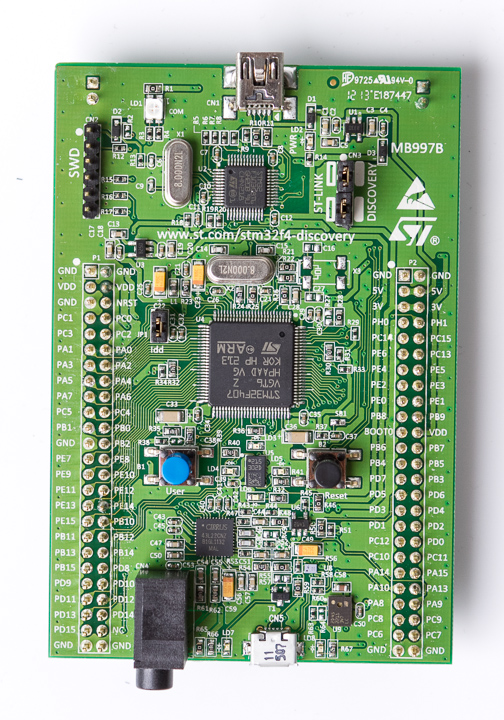
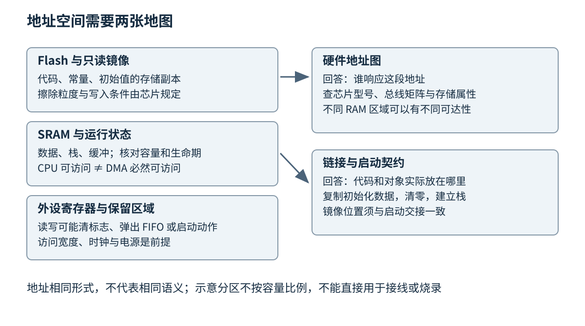
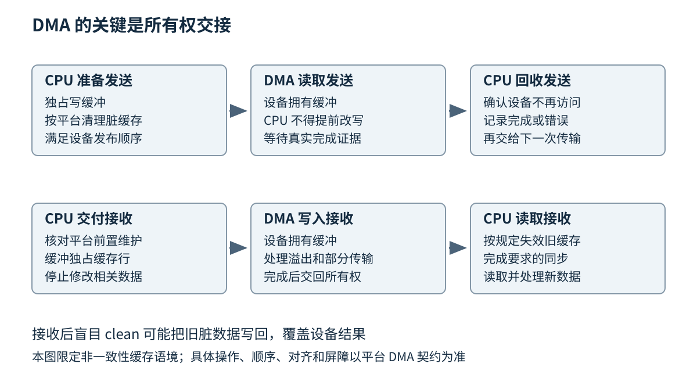
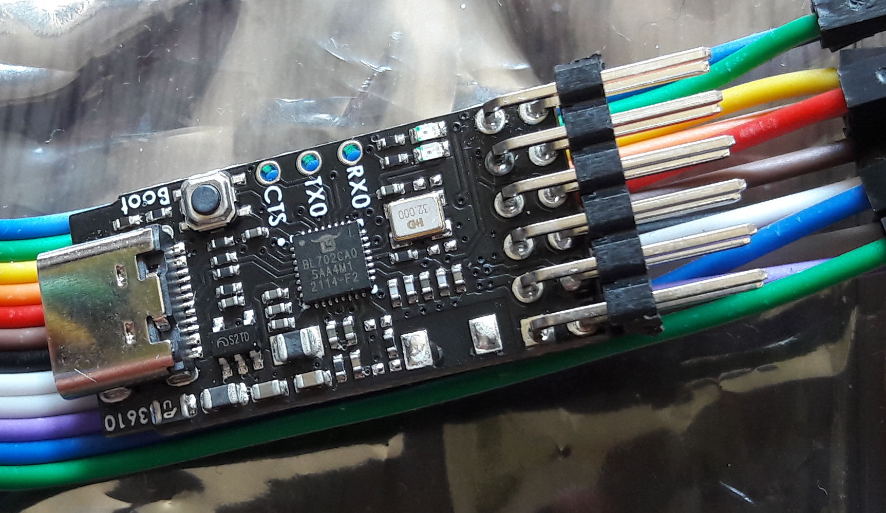
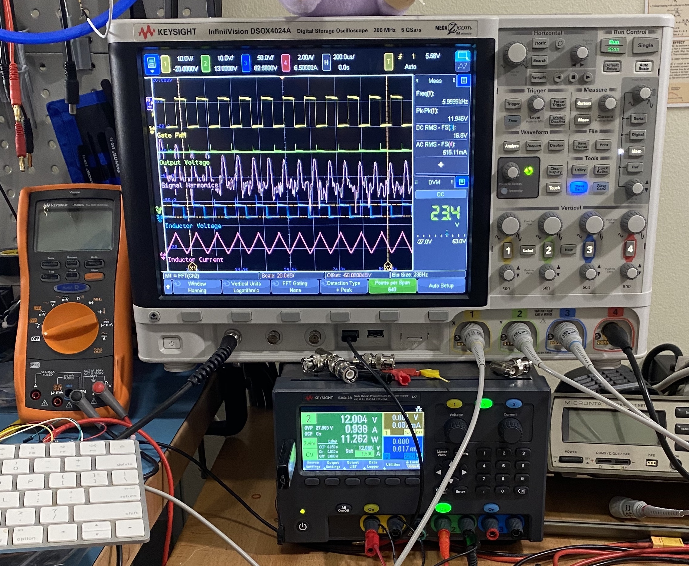
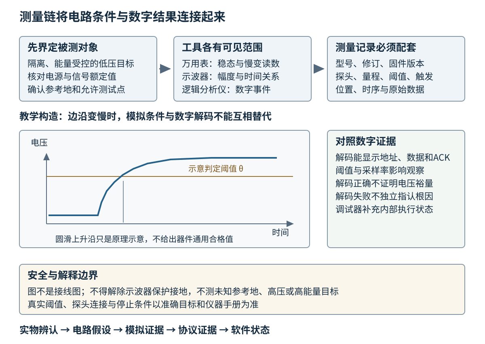

# 第二十八章 MCU 与固件的硬件边界

微控制器（Microcontroller Unit，MCU）把处理器核心、片上存储器和多种外设放进一个芯片，适合围绕传感、通信与控制持续运行。固件是与这些硬件能力紧密结合的软件。它既要遵守语言规则，也要遵守器件的供电、时序、总线和启动规则。一个数值正确的地址，在外设没有时钟时未必能正常访问；一段逻辑正确的通信代码，在电平不匹配时可能损坏器件。

第五章《处理器与内存层次》解释了处理器如何执行和访存，第七章《操作系统提供的执行与资源模型》讨论了操作系统资源。本章把观察点移到没有通用操作系统也能运行的设备。这里的“直接控制”并不意味着没有抽象，而是抽象最终必须落到可核查的寄存器、引脚和电路上。看懂这一层，才可能分清是程序写错、芯片配置错误，还是板级连接根本不满足条件。

读者可以把本章当成一次低压传感节点的首板评审：先用实物、物料表与原理图识别电源和信号，再用合适的仪器确认板级条件，最后解释中断、DMA 与启动行为。这里的首板调试（board bring-up）指逐项建立新板能可靠供电、退出复位、执行程序并访问外设的证据；它还不是产品已经可量产的结论。

本章用 STM32F4 文档说明部分 Cortex-M 系统的具体接口，用 Cortex-M7 的缓存接口说明带数据缓存时的额外责任。两者不是同一款芯片，不能把后一种能力套在前一种设备上。涉及数值的推演均为教学假设，不是板卡测试结果；所有技术代码均未编译、未执行，没有连接、驱动或烧录任何硬件。真实操作前必须逐项核对芯片完整型号、封装、板卡修订、电源与调试器电平，并阅读相应勘误。

## 28.1 板卡器件 内存映射与供电时钟

### 28.1.1 芯片 封装与开发板是三个层次

处理器核心是执行指令的部件，MCU 是把核心与其他电路集成后的芯片，封装则把裸片内部连接引出为可焊接的管脚或焊球。开发板在芯片之外加入稳压、时钟、连接器、按键、指示灯和调试电路。选购时看到的“支持 USB”“板载调试器”通常描述整个开发板，不应直接理解为主芯片每个引脚都能完成同样的功能。

同一家族的两个料号可能有相近的内核，却有不同的 Flash 容量、可用引脚和外设数量。相同芯片系列采用不同封装时，有些内部外设未必有足够引脚同时引出。软件配置工具允许选择某个外设，也不等于实际板卡把它连接到了可用接口。完整的硬件身份应至少包含料号、封装、硅修订和板级修订，而不是只记“某某 M4”。



图 28-1 开发板、芯片封装与连接器。照片中的绿色基板承载多个器件，中央较大的方形封装与上部的调试电路器件分别属于不同功能区，两侧成排的引出焊盘与排针位置用于连接板上信号；上、下边缘的 USB 连接器位置也不同。外观只能帮助辨认结构，不能替代原理图确认引脚和供电。照片：Teardown Central，STM32F4 Discovery，2013-06-18；[原始出处及授权记录](https://commons.wikimedia.org/wiki/File:STM32F4_Discovery_(9067300323).jpg)，[CC BY-SA 2.0](https://creativecommons.org/licenses/by-sa/2.0/)。原图未裁切、未改色，仅由版面等比例显示；该照片按原许可证使用，不表示整本书采用该许可证。[S1]

阅读开发板照片时，有一个很实用的分辨顺序：先识别板的外部连接，再确认哪些连接进入调试区、哪些进入目标芯片，最后用原理图落实每条信号。以 Discovery 系列为例，板上调试接口与用户 USB 功能是不同路径；产品页面也单独列出调试器和目标微控制器的功能。仅凭“电脑已经识别到一个 USB 设备”，不能推断用户固件的 USB 栈已正常工作。[S2]

### 28.1.2 从照片找到器件 再从原理图确认职责

从图 28-1 可以看到 R、C、U 等丝印，以及连接器、按键和金属封装，但外观不能给出阻值、容值、额定值或内部功能。**位号**把原理图上的器件、物料表（BOM）中的具体料号和 PCB 上的位置关联起来；**网络名**把同一个电气节点连接起来，即使它跨越多张图纸。读图时先找电源入口与参考地，再沿电源到 MCU，沿信号从连接器到收发器和引脚，最后查使能、复位与时钟。ST 的产品资料另行提供板级原理图；应按实物板号与修订匹配，不能把这张历史照片直接对应到任何新修订的器件清单。[S14]

下表是通用识读词汇，不是对照片逐件认定，也不表示该开发板含有表中所有器件。位号习惯会随公司与图纸规范变化，最终以图例、符号和料号为准。

| 器件 | 在低压板上的常见职责 | 读图与定位时先问什么 |
|---|---|---|
| 电阻 resistor | 限流、上拉下拉、分压、电流检测、终端匹配 | 阻值与功率容差是什么，是否串联或并联，0 Ω 是否只是装配选项 |
| 电容 capacitor | 去耦、储能、滤波、时序或晶振负载 | 接在哪两个节点，容量与耐压如何，是否有极性，不能仅按外观判断 |
| 二极管 diode | 指示、反向保护、钳位或续流 | 极性和具体类型是什么，正向压降及漏电会怎样影响被测节点 |
| MOSFET | 电源开关、负载驱动、电平转换的一部分 | 栅源电压是否足够，源漏与体二极管方向是什么，复位时栅极是否悬空 |
| 稳压器 regulator | 把输入电源转换为所需电压 | 是 LDO 还是开关稳压器，使能、输入余量、输出电容与负载条件是什么 |
| 晶体 crystal 与振荡器 oscillator | 提供时钟参考 | 无源晶体依赖芯片振荡电路，带电源的振荡器输出时钟，二者不可直接互换 |
| 收发器 transceiver | 在 MCU 逻辑接口与线路电气信号间转换 | 两侧电源域、使能和待机脚是否正确，控制器与物理层是否配套 |
| 隔离器 isolator | 在指定隔离边界两侧传递信息 | 两侧是否各有合适电源，隔离边界在哪里，调试线是否把两侧重新连通 |
| 连接器 connector | 提供可装配的机械与电气接口 | 针一、方向、额定电流、键位与线束针序是否一致 |

例如一个传感器读数恒为零，原理图上其供电可能经过由 GPIO 控制的负载开关。若只检查 I2C 地址，便跳过了“使能脚默认下拉、MOSFET 尚未导通”这条依赖。相反，节点电压正常，也还要确认信号上拉接到正确电源域。**器件识读的目的不是背封装，而是把一个软件前提落实为可检查的电路条件。**

原理图中的地符号也不是安全结论。数字地、模拟参考、机壳与保护接地可能有特定连接关系，隔离两侧更可能故意不导通。连通性必须来自设计资料与核查，不能因为都画着“地”就随手相连。本章只讨论与危险能量源隔离、由合规隔离低压源供电、额定和参考关系已确认的教学板；不涉及市电、汽车供电、大电池、动力负载或高压测量。

### 28.1.3 内存映射把地址交给不同硬件解释

**内存映射**规定处理器发出的地址由哪个存储器或外设响应。程序读取某段地址可能取得 SRAM 数据，读取另一段地址可能取得定时器计数器，再读取保留区域可能触发总线错误。地址形式相同，不意味着访问语义相同。

在普通 RAM 中，连续两次读取通常只是观察存储内容；在设备寄存器中，一次读取可能清除标志、弹出 FIFO 中的一个元素，或锁存一组测量值。RAM 通常允许一定范围的字节访问，而某个设备寄存器可能要求特定宽度和对齐。第五章讨论的“缓存普通内存以减少等待”，在设备寄存器上也不能未经确认直接应用，因为缓存可能隐藏硬件状态变化。

芯片参考手册中的地址图是第一张地图，链接脚本是第二张地图。前者描述硬件能在哪里响应，后者安排程序各部分应该放在哪里。可执行代码通常放在 Flash，已初始化全局变量在镜像里有初始值，启动时复制到 RAM，零初始化区由启动代码清零，栈则需要一片真实可写的存储。第八章《编译链接装载与二进制边界》中的链接概念在这里直接决定能否启动。



图 28-2 MCU 地址空间的教学分区。矩形不是按容量比例绘制，未给出可直接使用的寄存器地址。链接安排、总线可达性与访问副作用必须同时核对。

可执行文件的文件大小也不等于占用的 RAM。假设一个教学镜像有 96 KiB 代码和常量、6 KiB 已初始化可写数据、18 KiB 零初始化数据，再预留 8 KiB 栈及 4 KiB 消息缓冲，那么 Flash 与 RAM 的预算分别受不同项目影响。RAM 中至少要考虑 6+18+8+4=36 KiB，不能看到输出文件只有某个大小就认定内存充足。若已初始化数据的初始值同时储存在 Flash，还要把那一份算进相应镜像空间。

栈增长越界通常不会先给出友善错误。在没有内存保护或保护粒度不够的系统上，它可能覆盖邻接全局变量，让错误延迟很久才表现出来。递归、变长的局部缓冲、大型格式化函数和中断嵌套都会影响最坏栈需求。所谓“平均只用了一点栈”没有解释最深调用链与最深中断嵌套能否同时出现。

不同 RAM 区域还可能有不同连接关系。RM0090 对所覆盖的部分 STM32F4 器件区分普通 SRAM 与 CCM；其中 CCM 通过处理器的数据路径访问，并不是所有 DMA 主设备都能到达的普通 SRAM。把 DMA 缓冲放到“最快的内存”因此可能使传输失败，而不是更快。应按准确芯片的总线矩阵核查，不能凭地址看起来属于 RAM 就默认外设可访问。[S3]

### 28.1.4 GPIO 是可配置电路端口

**通用输入输出**（GPIO）允许软件读取引脚状态或控制输出，但一个 GPIO 并不是理想的零欧姆电源。输出驱动能力、输入阈值、最大注入电流和绝对最大额定值均由器件定义。绝对最大额定值描述避免损坏的边界，不是可以长期工作的推荐范围。

GPIO 常见配置包括输入、推挽输出、开漏输出、模拟功能和外设复用。推挽输出可以主动驱动高、低两种状态；开漏输出只主动拉低，高电平依靠外部或适当内部上拉形成。把两个可能相反的推挽输出直接连接，会让两端驱动器互相争夺电平。软件中把一端“暂时设成输入”也不能代替上电、复位和异常状态下的电气兼容设计。

输入引脚不连接任何确定电平时可能漂浮，读数会随噪声和环境变化。上拉或下拉提供弱偏置，但不能无限补偿长线耦合或接触不良。按键还会产生机械抖动：一次动作可能出现多个边沿。软件去抖是在一定时间窗口内判断稳定状态，硬件滤波则约束模拟波形；两者解决的问题相关，却不能把任意延时都称为可靠去抖。

引脚复用把同一焊盘交给不同内部功能。配置 UART 外设本身并不足够，还要选择对应引脚的复用编号、输出类型和适用速度。若板上该引脚还连着 LED、电平转换器或其他芯片，实际负载可能改变波形。诊断时应把“外设内部在发送”“复用器把信号送到焊盘”“板线把信号送到连接器”分成三个可观察的层次。

GPIO 的“速度”配置经常描述输出转换特性，而不是应用调用频率。更快的边沿可以满足高速时序，也可能增加振铃、电磁干扰和瞬态电流；因此没有必要把所有引脚都设到最高速度。对慢速按键和状态灯，额外的边沿速度一般没有业务收益，具体选择仍要根据器件说明和板级信号完整性验证。

LED 示例看起来最安全，也需要串联限流与正确极性。继电器、电机、阀门和大电容更不能由 GPIO 直接驱动；感性负载还涉及断电反冲、驱动器和保护电路。固件初学项目应限定在经过确认的低压开发板与隔离负载上。接入汽车、工业电源、市电或能产生运动的设备，必须先经过相应硬件与安全审查。

### 28.1.5 时钟树是各模块的共同时间基准

**时钟树**描述振荡源、锁相环、分频器以及不同总线和外设之间的时钟关系。主核频率只是其中一个节点。UART 波特率、定时器周期、ADC 采样节拍和 USB 时序可能使用不同分支，改变主核频率未必按同样比例改变每个外设。

一个定时器的教学推导可以写成：若输入计数时钟是 48 MHz，预分频有效除数为 48，计数器每微秒变化一次；若有效周期包含 1000 个计数，则周期为 1 ms。这是基于“有效除数”和“计数次数”的数学关系。具体寄存器是否保存除数减一、向上还是向下计数、更新事件何时生效，都要回到该定时器说明。不能把公式中的 48 直接复制成任意平台的寄存器值。

许多 MCU 为节能默认关闭部分外设时钟。此时寄存器访问可能没有预期效果，复位域也可能尚未释放。一个完整初始化顺序通常包含确认供电状态、开启所需总线时钟、解除外设复位、配置参数、清理旧状态，再使能功能和中断。各芯片有自己的顺序与等待条件，硬件抽象层（HAL）封装只是代为执行其中一部分。

提高主频还可能要求调整 Flash 等待周期和电压工作档位。晶振或锁相环需要稳定时间；若不等稳定标志就切换，可能出现启动偶发失败。反向降频也不是任意顺序都成立。时钟切换期间，依赖旧时基的延时和超时计算可能变化，因此动态调频必须有统一的时钟所有者及通知机制。

### 28.1.6 供电问题会伪装成软件错误

电源应被看作随时间变化的条件。平均电压合格不代表射频发射、Flash 编程或外设突发工作时没有短暂跌落。复位原因寄存器、欠压检测和电源波形可以帮助区分软件复位与供电复位。若每次开始某种高负载动作就重启，应先保护现场，再同时检查电流需求和控制流，而不是立刻把看门狗超时当成根因。

调试器也可能改变供电条件。有些板可由 USB 供电，有些调试口的目标电压脚只是电平参考，不能当成供电输出；有些跳线决定板上调试器与目标之间是否连接。把外部电源与 USB 直接并联可能反向灌电。任何实际接线都应先断电核对供电路径，按厂商说明使用，不通过试插来猜测。

深入追问时，“程序跑起来为何还要查电源”可以这样回答：运行成功只证明某一次环境满足了启动路径；负载变化、温度变化和供电瞬态可能让条件越界。要证明固件可靠，需要把启动成功、稳态工作和状态切换分别验证，并记录适用电压、负载和温度范围。软件测试覆盖率不能替代这些物理条件。

## 28.2 UART SPI I2C CAN USB和电气边界

### 28.2.1 先分清协议控制器与线路收发器

通信接口可以分成三件事：控制器决定帧与时序，收发器决定电信号如何进入线路，连接器提供机械连接。三者没有一一对应关系。一个九针连接器可能承载完全不同的协议；一个 USB 形状的接口也不能只凭外形推断电源方向、速率或可用功能。

MCU 上标为 TX、RX 的 UART 引脚通常是芯片供电域的逻辑信号，不能直接连接传统 RS-232 电压接口。CAN 控制器的发送与接收脚也不是 CANH、CANL，需要适当收发器。开发板可能已经集成转换电路，也可能只引出控制器信号。工程接线的第一项证据应是原理图与引脚电气参数，而不是某张网上的颜色接线图。

“都是 3.3 V”还不足以确认兼容。要比较发送端保证的高低电平与接收端阈值，检查两侧掉电时的行为、允许输入电压、上拉所在电源域和共模范围。部分引脚能容忍较高输入电压不等于所有引脚都能，更不等于芯片掉电时仍然允许外部信号。地参考也有适用范围，隔离系统不能随意用一根地线短接隔离边界。

### 28.2.2 UART 的字节流与误差累积

**UART**通过起始位、数据位、可选校验位和停止位传送字符，不单独传送连续时钟。双方必须约定波特率、数据位数、校验方式和停止位数。接收器根据起始边沿建立采样节奏，因此两侧时钟偏差和波形质量会影响采样位置。

设教学通信采用每字符 1 个起始位、8 个数据位和 1 个停止位，链路速率是 115200 bit/s，则每个八位数据字节占用 10 个线路比特，理想上限是每秒 11520 字节。一个 40 字节消息仅线路串行化就约需 3.47 ms，还未包含排队、软件调度、协议间隔和重试。因此“波特率是 115200，40 字节应该瞬间传完”忽略了实际帧开销。

UART 没有自动给应用消息划边界。一次读取可能得到半条消息，也可能得到数条连在一起的消息。应用协议需要长度、分隔符或其他可恢复的帧结构，并限制最大长度。校验错误和溢出错误也不能只计数后忽略：接收端应知道丢字节后如何恢复到下一条合法消息，而不是把后续所有字节都错位解释。

硬件流控通过专门信号表达接收能力，软件流控在字节流里插入控制字符，二者都有兼容要求。没有流控时，必须计算缓冲容量和最大处理间隔。假设接收端可能连续 20 ms 无法处理，上述线路约可到达 231 字节；256 字节缓冲看似足够，却只留下很小余量，若还存在突发或中断延迟，就可能溢出。缓冲计算必须采用最坏到达与服务模型，不能仅用平均速率。

串口乱码的排查也有顺序。先确认物理电平与共同参考，再检查波特率和帧配置，随后观察实际位宽，最后进入协议解析。若数据始终相似地错位，采样参数值得检查；若只有长消息尾部缺失，缓冲、处理预算或流控更可疑。这些只是定位假设，最终要靠波形和错误计数验证。

### 28.2.3 SPI 的时钟边沿与片选事务

**SPI**通常由控制器提供时钟，通过片选选择目标器件，使用独立发送和接收线路进行同步交换。全双工意味着在时钟推进时双方都能移出与采入数据，并不意味着每个收到的字节都属于业务结果。读取某个寄存器时，前面的命令字节可能同时收到无意义数据，需要按器件协议丢弃。

时钟极性描述空闲时钟电平，时钟相位决定在哪个边沿采样或改变数据。工程上不能只记“模式 0 常用”，而应同时核对目标器件的采样边沿、最高时钟、建立保持时间、片选到首个时钟的间隔，以及事务结束时片选何时释放。片选可能划定一整个命令，不一定可以在每个字节后抬高。

共享 SPI 总线还需要事务级互斥。两个任务若分别发送命令和数据，却只保护每个字节，就可能把目标器件看到的事务交错。锁应覆盖所需片选、参数切换与完整事务边界；不同目标器件可能使用不同模式与速率，所以“所有设备共用同一个初始化”并不可靠。

长线、过快边沿和地回流路径会引入振铃和延迟。降低时钟后错误消失只能说明时序或电气余量可能相关，不能证明错误已根治。应根据板级布局、线缆、输入负载和器件时序确认可用范围。SPI 作为板内接口的常见用法，也不自动授权把排针通过任意长电缆接到远端设备。

### 28.2.4 I2C 的共享线路需要模拟条件支撑

**I2C**用 SDA 和 SCL 两条线承载数据与时钟。常用双向模式采用开漏或相当的线与行为，设备拉低形成低电平，释放线路后由上拉恢复高电平。这种结构支持确认位和总线仲裁，也使线路电容与上拉电阻直接进入时序预算。NXP 的 UM10204 第 7 版明确给出各模式的时序与电气条件；本章不把不同模式的限制混为一个通用数值。[S4]

上拉太弱，高电平上升太慢；上拉太强，器件拉低时需要吸收更大电流。选值因此受到上升时间和低电平驱动能力两边约束。板上多个模块各自带上拉时，并联后的等效电阻可能比任何一块板标注的值都小。软件正确选择 400 kbit/s 也不能弥补线路实际无法在要求时间内上升。

I2C 地址还常因表示方式混淆。通常所说的七位地址不包含读写方向位，某些文档却把左移后的地址字节直接列出来。若器件文档给出地址字节与 API 要求的表示不同，读者不能靠“试着左移一位”长期维护系统；应在驱动边界明确命名地址类型并记录转换规则。

时钟延展允许目标在适用模式与实现支持下延长低电平时间，但主控制器的支持、超时和故障恢复仍需核查。总线一直低可能来自目标尚在事务中，也可能是短路、掉电器件钳位或控制器状态错误。所谓“发九个时钟恢复”是一类特定总线恢复策略，不是遇到任何低电平都应执行的通用动作；先确认没有其他控制器、引脚配置正确且电路允许，再按硬件与协议说明处理。

把传感器读失败看成单一错误码会损失重要信息。地址未确认、数据阶段未确认、总线忙超时、仲裁丢失与校验不符代表不同路径。驱动可以向上提供统一失败类型，同时保留细分诊断字段。这样的设计既不让业务代码依赖每个寄存器，又不会让维护人员只看到毫无方向的“通信失败”。

### 28.2.5 CAN 的仲裁不等于应用已经执行

**控制器局域网**（CAN）以报文为单位共享总线，标识符参与仲裁，也常承载消息类别含义。经典 CAN 与 CAN FD 的帧能力不同，控制器、收发器、网络配置必须共同支持所选模式。不能因为收发器商品页写了 CAN，就推断整条链路能够按某个 CAN FD 数据阶段速率工作。

高速 CAN 典型物理链路使用差分对和匹配终端。TI 的物理层资料说明了控制器、收发器、线缆与终端的分工，以及典型线形拓扑两端各设终端的安排。本章引用它解释边界，不把其中年代较早的具体节点数或距离表当作现代所有 CAN 方案的保证。[S5]

总线仲裁按位进行，获得较高仲裁优先级的报文可以先继续发送。这让关键消息获得机会，但低优先级消息在高负载下仍可能遭受较长等待。计算控制周期时，要考虑正在发送的帧造成的不可抢占阻塞、其他报文到达模式、位填充、错误与重传，而不是只按有效载荷字节数除以名义速率。

CAN 的链路确认表示总线上有接收节点确认了帧，并不证明目标应用已完成某个动作。接收过滤、软件队列、任务调度、权限判断或执行器故障都可能发生在它之后。若“设置参数”需要可靠完成，应有应用级事务标识、响应、超时和重试语义。重试一个“设置到指定值”与重试一个“再增加一次”具有不同后果，应在协议层明确幂等性。

错误被动、总线关闭等状态用于限制故障节点对总线的影响。恢复策略不能只做无限快速重启，否则会持续向异常线路施加负载，并掩盖根因。恢复次数、退避、告警和进入安全状态的条件属于系统设计。连接已有车辆或工业总线会影响其他设备，本章没有提供或执行任何向这类总线注入报文的操作。


图 28-3 CAN 接口适配硬件也可以做成扩展板。图为 Seeed CAN-BUS Shield V2，板上可见总线连接器、接线端子与扩展排针；官方资料说明它通过 SPI 接口的 CAN 控制器和线路收发器为主板提供 CAN 能力。它不是 USB-CAN 适配器，也不能只凭照片确定终端、电平或目标网络的接法。[S11] 照片：Seeed Wiki，2017-07-28；[原始文件页](https://commons.wikimedia.org/wiki/File:CAN_BUS_Shield_V2.jpg)，[CC BY-SA 4.0](https://creativecommons.org/licenses/by-sa/4.0/)。沿用原始照片字节，未裁切、未改色，仅等比例显示；图片保留原许可。[S12]

### 28.2.6 USB 是有枚举与传输类型的系统

**USB**不是把两根线当作更快 UART。USB 2.0 的设备由主机发现、枚举和配置，设备通过描述符声明接口与端点，数据传输受主机调度。端点是设备内部的数据通道抽象，接口可以组合端点实现一项功能；连接器外形与这些协议对象不是同一层。[S6]

控制、批量、中断和等时传输面向不同需求。USB 的“中断传输”不意味着设备任意时刻直接打断主机 CPU，它是总线协议中的传输类别。等时传输关注时序与带宽安排，其错误恢复语义不能照搬批量传输。选择类型前应明确数据能否重传、迟到是否仍有用，以及主机侧驱动如何提供这些结果。

把设备实现成虚拟串口可以复用主机接口，但仍保留 USB 枚举、驱动和连接生命周期。打开串口成功并不说明设备应用已准备好；设备复位可能让端口消失并重新出现；同一设备在不同电脑上未必使用同一端口名。上位机应通过经过验证的设备身份与握手重新建立会话，第三十一章《Windows Qt 与设备上位机》会继续讨论。

USB 供电与角色也必须独立核查。某个 MCU 带 USB 外设，不表示开发板具备主机所需的供电开关和保护；Type-C 连接器还涉及相应角色识别与电源协商设计，不能通过固定短接线或更换插头来假装支持。主机识别失败可能发生在电气连接、复位时钟、描述符、驱动匹配或应用握手任一阶段，诊断记录应保留失败所在阶段。

### 28.2.7 协议比较应围绕失败代价

为板内传感器选接口时，SPI 的独立片选和较直接时序、I2C 的共享引脚与地址管理，是成本和复杂度的不同分配；为外部设备选接口时，线长、噪声、隔离、连接器可靠性与维护方式往往比单纯峰值速率重要。协议不是按“先进程度”排成一列，而是把资源、可靠性与软件责任放在不同位置。

深入追问“既然有校验，为什么仍会控制错误设备”，答案至少有三层：校验只帮助检测一定类型的数据错误，不能证明报文来自可信发送者；链路接收成功不证明业务语义正确；设备身份、会话状态和目标参数仍可能配错。第二十六章《安全与内存安全工程》中的认证与授权，在设备通信里同样适用。

## 28.3 中断 DMA缓存与寄存器访问

### 28.3.1 中断把硬件事件变成受约束的执行入口

**中断**让处理器在允许的边界暂停当前工作，转而处理外部或内部事件；**异常**是体系结构对这类特殊控制转移更广义的组织方式。中断入口不是普通线程回调，它的可调用接口、栈使用、优先级和阻塞限制都取决于平台。

Cortex-M 的嵌套向量中断控制器（NVIC）管理外部中断与相关优先级设置。可实现的优先级位数随芯片而变，数字编码与紧急程度的方向也必须核对；在常见 Cortex-M 表述中，数值更小代表更高紧急程度。优先级分组还区分抢占和同级选择因素，不能只见一个整数就类推 RTOS 任务优先级。[S7]

中断响应时间包括事件被硬件识别、当前禁止或屏蔽条件解除、较高优先级处理结束、入口保存现场以及处理函数开始有效工作等阶段。芯片宣传材料中的最小入口周期不等于应用最坏响应时间。一个长时间关中断的临界区，可以轻易支配整体延迟。

中断处理的典型责任是取得必要状态、按规定应答事件、保存有限数据并通知后续处理。耗时解析、文件写入、阻塞等待和复杂日志一般不应塞进最高紧急度入口。把工作推迟并不是把责任丢掉：后续队列需要容量、溢出策略、唤醒时限和关闭协议。

应答顺序同样重要。有些状态要先读再清，有些写一清除，有些读数据寄存器会改变标志。若处理函数只清 NVIC 的挂起位，却没有解除外设仍保持的请求条件，退出后可能立即再次进入。反过来，提前清除硬件状态而没有保存相关信息，可能失去唯一的故障证据。

### 28.3.2 volatile 只解决寄存器访问的一部分

在嵌入式 C/C++ 工具链中，厂商头文件常用 volatile 限定寄存器访问，使编译器按其实现约定保留必要访问。但 ISO C++ 的 volatile 不是线程同步原语，不提供互斥，也不自动生成设备所需的所有总线屏障。硬件寄存器布局、访问宽度与顺序约束属于编译器扩展、架构和芯片接口共同规定的内容，不能用第十七章的普通原子对象规则替代。[S8]

最常见的陷阱是读改写。表达式“寄存器值或上一个掩码”通常先读整个寄存器，再计算，再写回。期间硬件可能更新其他位；某些位可能写一清除；保留位还可能有特殊要求。即便机器恰好使用一条指令，也不能证明它对该寄存器语义正确。

例如一个教学状态寄存器的第 0、1 位都是“写一清除”。软件只想清第 0 位，却先读到两位都为 1，再执行按位或并写回，结果可能把两项事件同时清除。正确策略应根据手册仅写需要清除的位掩码，并保留当时读取的状态供诊断。这个例子不对应可直接访问的真实地址。

```cpp
// 教学片段；未编译、未执行；不是可烧录固件。
// 前提：平台文档保证 status 是32位写一清除寄存器；所有位含义已核对。
// 缺少：芯片头文件、实际映射、时钟初始化、并发协议和错误处理。
void clear_selected_events(volatile unsigned int& status,
                           unsigned int verified_mask) {
    status = verified_mask; // 仅演示直接写掩码，不执行读改写
}
```

这一片段故意不提供寄存器地址，也不声称 unsigned int 在所有目标上都恰好 32 位。真正实现需要使用厂商规定的寄存器类型与访问接口，验证类型宽度、合法掩码、保留位和屏障要求。若两个执行上下文都会应答同一事件，还必须规定谁拥有应答权；换成 volatile 引用不会解决它们之间的争用。

设置或清除 GPIO 的专用寄存器可以避免对输出寄存器做共享读改写，但这只是芯片提供的特定原子操作能力。它不等于整个设备控制事务都是原子的，例如“先改变方向再拉高输出”仍可能暴露中间状态。定义所需不变量比笼统地说“使用原子寄存器”更重要。

### 28.3.3 DMA 把搬运交给另一个总线参与者

**直接内存访问**（DMA）让控制器在 CPU 不逐字节搬运的情况下，在外设和存储器之间传送数据。CPU 仍负责准备缓冲、配置传输、处理完成和回收资源。DMA 降低的是特定数据搬运的 CPU 参与程度，不会消除总线带宽、缓冲空间或同步需求。

一项 DMA 请求需要说明方向、源和目标、传输宽度、数量、地址是否递增，以及何时认为完成。外设数据寄存器地址可能固定，内存地址逐项推进；错误地让外设地址也递增，会访问相邻寄存器。传输数量的单位也可能是元素而不是字节，配置半字宽度时尤其容易重复乘二或遗漏乘二。

缓冲生命周期必须覆盖整个传输。把函数局部数组交给 DMA 后马上返回，会使 DMA 继续使用可能已复用的栈存储；提前把缓冲交给下一个任务，也可能在发送尚未结束时改写其中数据。应明确 CPU 拥有、设备拥有、完成待处理和空闲可复用等状态，所有权转换必须有真实完成证据。



图 28-4 非一致性缓存系统中的发送与接收路径。图示表达职责，不是通用调用顺序模板；具体清理、失效、屏障与对齐要求由架构、内存属性和 DMA 接口确定。

环形 DMA 常用于持续接收。硬件写位置与软件读位置共同描述可用数据，但读取计数寄存器时硬件仍可能推进，计数回绕与中断延迟也会造成歧义。设计要保证消费者能够判断发生了多少数据，而不是只比较两个可能相同的模数索引。如果生产者已经绕过消费者一整圈，索引相等不能自动理解为“没有新数据”。

双缓冲把当前硬件填充区与软件处理区分开，减少冲突，但处理必须在下一次复用前结束。若半块缓冲容纳 256 个样本、采样率为每秒 16000 个，教学模型中的处理窗口是 16 ms；任何连续阻塞超过这个窗口都值得调查。增大缓冲能延长处理窗口，却也增加数据交付延迟，因此选择取决于实际时限。

### 28.3.4 缓存一致性不是 DMA 的自动赠品

CPU 和 DMA 可能观察不同路径上的数据。在不具备硬件缓存一致性的系统中，CPU 刚写入的数据可能仍只在脏缓存行里，DMA 读到旧 RAM；DMA 写入的新数据也可能被 CPU 的旧缓存副本遮挡。缓存行不是某个缓冲的私有概念，因此维护粒度还可能触及相邻数据。

发送方向常需要在把缓冲交给 DMA 前，把 CPU 的脏数据按平台规定清理到可见存储，再确保必要排序；完成后才允许复用。接收方向更微妙：在设备写入期间，CPU 不应同时修改相关缓存行；设备完成后，需要按规定使旧副本失效，才读取新数据。有些平台还要求交付接收缓冲前先进行相应维护，防止原来的脏行以后覆盖设备新写入的结果。

不能把“DMA 完成后清理缓存”当作普适接收方案。若此时 CPU 缓存仍保留旧脏数据，清理可能恰好把旧值写回，覆盖 DMA 结果。安全顺序来自所有权协议与平台手册，不是背诵某两个函数名。将 DMA 区设为适当的非缓存属性可能简化一致性，却会改变性能和内存保护配置，也必须按平台要求验证。

CMSIS 的 Cortex-M7 数据缓存维护接口按地址提供 clean、invalidate 与组合操作，并标明相应地址对齐要求。这说明缓存维护有真实粒度，不能只拿一个任意字节指针就忽略邻接对象。对本文涉及的 Cortex-M7 接口，文档使用 32 字节边界；这不是所有 MCU 或所有处理器的缓存行通则。[S9]

假设一个 32 字节缓存行的前 12 字节是接收缓冲，后 20 字节是 CPU 正在更新的状态。若为了接收缓冲让整行失效，后半的脏状态可能丢失；若清理整行，前半又可能覆盖设备数据。最直接的设计改进通常是独占并正确对齐 DMA 缓冲，使其不与无关可写对象共享维护粒度，而不是在错误布局上增加更多缓存操作。

### 28.3.5 屏障区分排序 完成与可见范围

**内存屏障**约束某些内存访问之间的顺序；具体屏障是否还等待操作完成、作用于哪些访问域，取决于架构。CPU 普通内存写入、设备 MMIO 写入、缓存维护和指令同步是不同事情。一个接口名字里有 barrier，不意味着所有这些问题都已经解决。

DMA 描述符提供典型例子：先写缓冲地址和长度，最后设置“设备可用”标志。若设备在标志有效时还看不到前面的字段，就可能使用半初始化描述符。协议因此需要在发布所有权之前满足设备观察顺序，并在 CPU 回收时按设备完成协议取得结果。第十七章《从语言内存模型理解原子操作》给出的 acquire/release 推理有助于理解发布目标，但设备不是 ISO C++ 线程，正确实现仍需平台 DMA 与 MMIO 接口。

深入追问“单核 MCU 为何也会有并发问题”，可以回答：并发参与者不只 CPU 核心，还包括中断、DMA、外设状态机以及可能存在的调试器。单核只排除了一部分同时执行的 CPU 指令流，没有排除异步硬件改变状态。把这些参与者和各自的所有权画出来，往往比先猜该加哪种锁更有效。

## 28.4 安全测量 调试 首板启动与烧录

### 28.4.1 调试通路与业务通路彼此独立

**JTAG**是一类测试与调试访问体系中的接口，**SWD**是 Arm 生态常见的串行调试接口。它们让调试工具访问目标核心和调试资源，但是否存在、怎样引出、是否被安全配置限制，均由芯片与板卡决定。插上调试器不能证明接线方向、参考电压和复位线都正确。

调试连接应先确认地参考、目标电压参考、信号电平、接口针脚及线缆方向。不要将“接口上有电压脚”直接当作“调试器会给目标供电”。对于隔离系统和接地设备，还要考虑电脑、示波器与目标之间可能形成的非预期电流路径。这里的文字不是高压设备连接指南，实际带电测量应由具备相应能力的人按安全规程完成。

JTAG 或 SWD 能连通只证明调试访问路径的某一部分成立。处理器可能仍停在复位，Flash 内容可能不完整，启动地址可能错误，或者系统刚进入低功耗使调试可达性变化。按层记录结果比“连不上板子”更有用：工具能否识别调试端口，能否识别核心，能否读已知内存，能否停核，能否读取复位原因。



图 28-5 独立调试器的一种形态：Sipeed RV Debugger。照片可帮助识别 USB 端、板上桥接电路和目标侧排针；调试信号的定义与所用固件、目标芯片和电平有关，不能按导线颜色照接，也不能因外观相近就假定支持同一目标。照片：Popolon，2021-07-19；[原始文件页](https://commons.wikimedia.org/wiki/File:Sipeed_RV_debugger.jpg)，[CC BY-SA 4.0](https://creativecommons.org/licenses/by-sa/4.0/)。原始照片未裁切、未改色，仅等比例显示；图片保留原许可。[S13]

### 28.4.2 为一个明确问题选择测量工具

**万用表**回答稳态电压、断电连通性等问题，**示波器**记录电压如何随时间变化，**逻辑分析仪**把跨越阈值的信号还原成数字时序，**SWD 调试器**帮助观察核心、存储器与执行状态。这四类证据互补：逻辑分析仪能解码出一个字节，不证明上升沿和噪声余量合格；调试器能读寄存器，不证明连接器真的输出了正确波形。



图 28-6 测量工具的真实外观。示波器位于上部，橙色万用表在左侧，台式电源在下部。照片仅用于辨认工具类别；屏幕内容不属于本章教学实验，照片中的接线也不是操作示范。照片：Radarvector，2021-04-05；上游裁切：Pittigrilli，2022-12-21；[原始文件页](https://commons.wikimedia.org/wiki/File:Keysight_InfiniiVision_DSOX_4024A_and_digital_multimeter_and_power_supply_in_laboratory_use.jpg)，[CC BY-SA 4.0](https://creativecommons.org/licenses/by-sa/4.0/)。本书不再裁切或改色，仅等比例显示；照片保留原许可。[S18]

动手前应读具体仪器、表笔、探头和附件的手册，核对输入额定、测量类别、接地方式与完好状态，按整条测量链最受限的额定值工作。“板上只有 3.3 V”不保证其他接口、电脑 USB 或电源之间没有非预期回路。以下方法仅限前述隔离低压教学目标；不拆保护接地，不使用隔离变压器把台式示波器浮地，不把普通探头地夹接到未确认的节点。参考关系不明时先停止，请具备相应能力的人核查。

万用表用于首轮供电核查时，先在断电状态确认黑表笔在 COM、红表笔在电压/电阻口，选择正确的直流电压功能与量程，再按已审查测点测量。把留在电流口的表笔跨接电源会形成低阻通路，这是必须主动防止的错误。电流测量需改为受控的串联回路，并考虑保险丝、量程和负担电压；本章首板示例不要求读者拆线串表测流，而使用合适电源的限流状态和经评审的测量方案。电阻、二极管和通断检查必须在断电、断开其他供电路径并按设备规程确认电容放电后进行；不能在带电板上用电阻档寻找短路。[S15]

通断蜂鸣只是仪器阈值下的结果。电容充电可能使读数变化，板上并联支路会使在路电阻不同于单件标称值，半导体结还使表笔方向影响读数。测到低阻应记录稳定值、方向、等待时间和相同修订良板对照，不能只凭响声宣布芯片短路。万用表显示稳定的平均电压，也可能漏掉微秒级跌落。

示波器用于电源、复位与总线边沿时，先选择适合信号的探头及衰减，并使探头开关与通道设置一致；被动探头按手册完成补偿检查。设置可看清目标事件的垂直量程、时基、触发源和触发电平，保留触发前数据，记录是否开启带宽限制。普通接地式台式示波器的探头参考端通常连接保护地，各通道参考也通常互通；必须先确认目标参考点与之兼容。短而合适的参考连接可减少引线造成的假振铃，但不能以改善波形为由改变安全接地。[S16]

逻辑分析仪适合回答 UART 位宽、SPI 片选边界或 I2C 确认位是否符合约定。接线前核对输入允许电压、逻辑阈值及 USB 地参考，不能把“耐压不会坏”当成“能正确识别 1.8 V”。捕获时保留原始数字边沿、采样率、通道映射、触发与解码参数；采样率应给最短脉冲留足辨识余量，并用更高采样率复核关键结论，没有一个倍数能替代仪器与协议条件。解码器显示 NACK，还需要模拟波形区分未响应与阈值、毛刺问题。Saleae 官方资料明确区分输入阈值与过压保护，部分型号阈值固定，部分型号的可选阈值由全部通道共享，不能假定每路独立配置。[S17]

SWD 的选择则从目标内核、调试接口、工具支持与电压兼容开始，保存探针固件和工具版本。目标参考电压应实测并与工具报告相符，针脚和方向按板卡手册确认，连接失败时可以在厂商允许范围内降低调试时钟验证信号余量。低速连通只缩小问题范围，不能证明高速或脱机运行可靠；也不要把“解锁”或整片擦除当成默认排错动作。



图 28-7 同一故障的三种观察层次。电路条件、模拟波形和数字解码分别回答不同问题；调试器补充处理器内部状态。教学示意不代表一次实测，也不是接线图。

### 28.4.3 首板按供电 复位 时钟 执行与总线逐层放行

新板第一次上电前，先对照修订正确的原理图与 BOM 检查器件方向、焊接、跳线和连接器，再按设计允许的断电检查排除明显异常。只使用设计认可、带适当限流的隔离低压电源，预先约定电压范围、电流限值和停止条件。异味、异常发热、持续限流、反向灌电迹象、参考地不明或任一输入接近额定边界，都要求立即按台架规程断电并保留记录，不能通过加大电流上限“冲过去”。

随后一次只增加一个能力。先确认电源入口、稳压输出与使能，再看复位是否按规定释放；之后确认所选时钟源和启动模式，让最小固件提供一个有界、易观察的进展信号，最后才接入一条总线和一个外设。晶体引脚可能对探头电容敏感，不应把任意探头直接搭上去判断起振；优先使用芯片允许的时钟输出或合适测点，必要的振荡器测量需依器件推荐方案。最小固件运行过，也仍需核查独立上电和脱离调试器的启动。

下面是一组**原创模拟记录**，来自虚构的 3.3 V 传感节点，不是图 28-1 或图 28-6 中设备的实测值，也没有执行接线与上电。假设评审已确认安全测点和低压条件，目标是解释“启动日志正常，I2C 读不到传感器”。

| 观察阶段 | 模拟证据 | 可以排除什么 还不能断言什么 |
|---|---|---|
| 供电 | MCU 电源测点 3.29 V，传感器电源测点 0.02 V | 主核稳态供电存在；不能由它推出传感器已供电，也未覆盖瞬态 |
| 复位与执行 | 复位释放后出现预期进展计数，固件构建标识吻合 | 主核经过约定入口；不能证明所有初始化完成 |
| 时钟与总线 | SCL 有时钟，SDA 地址阶段未确认，记录了阈值和解码地址表示 | 主控制器尝试事务；NACK 不等于地址必错 |
| 原理图与状态 | 传感器稳压器 EN 默认下拉，当前固件没有执行板修订 B 的使能步骤 | 支持供电前置条件遗漏；还需核查真实 EN 波形和板级设计 |

诊断结论应停在证据允许的位置：优先验证传感器供电路径与板级初始化是否匹配，不先盲扫地址或提高总线速率。修正方案的验收也不能只有“读到一次”：应确认规定上电等待、掉电后再上电、传感器暂不可用时的超时和恢复，并归档修订、镜像标识、测点、仪器设置与原始捕获。若修正后仍偶发失败，再沿模拟上升时间、处理预算和总线恢复继续排查，而不是让第一个假设成为永久结论。

面试追问“串口有日志，为什么还测电源”时，完整回答是：日志证明某条执行路径发生过，传感器可能处于另一电源域；万用表先确认稳态条件，示波器再检查启动与负载瞬态，逻辑分析仪确认事务，调试器确认初始化状态。每件工具都对应一个能被推翻的假设，四种工具不需要在每个故障上全部使用。

### 28.4.4 断点会改变设备正在经历的时间

断点把处理器停下来，却未必让所有外设一起停止。定时器可能继续计数，DMA 可能继续覆盖缓冲，外部设备还在发送数据，看门狗也可能复位系统。某些芯片提供调试冻结选项，但必须逐项确认，不能默认“暂停软件等于暂停世界”。

因此单步能通过、连续运行失败，并不奇怪。单步可能给尚未稳定的外设增加等待，也可能让原本不会溢出的缓冲变满。调试器自动显示寄存器还有另一种影响：读取具有副作用的寄存器可能清除状态或消耗数据。调试界面需要区分普通状态、读清寄存器和 FIFO，避免观察动作改变要研究的证据。

硬件断点、观察点和跟踪资源通常有限。Flash 上断点的实现与 RAM 上插入指令的办法可能不同，优化后的变量也可能已不存在或被保存在寄存器中。第二十二章《调试与故障证据链》强调的符号匹配同样关键：需要把实际烧录镜像、链接映射、调试符号和源码版本对应起来，否则栈帧和行号可能形成错误解释。

对不能任意暂停的控制回路，可考虑有界事件缓冲、硬件时间戳和低侵入跟踪，在安全隔离环境中重放。日志也有成本：阻塞串口输出会改变中断延迟，过量日志会加重 Flash 磨损，输出敏感身份或密钥则引入安全问题。诊断设施本身必须有容量与保密边界。

### 28.4.5 启动是由一系列交接组成的

**Bootloader**是负责选择、验证并启动后续镜像的一段程序。芯片出厂 ROM 中的下载程序、项目自己维护的引导程序和应用固件是不同层次；它们的存储位置、更新方式与可信程度不同。芯片支持某种 ROM 下载协议，不等于产品已经实现安全的远程更新。

复位后的第一段执行依赖架构与启动配置。以 Cortex-M 类系统为例，向量表与初始栈、复位入口有紧密关系，但实际地址映射可能受启动引脚、选项配置或内存重映射影响。启动代码随后建立语言运行环境，初始化必要数据，再进入应用入口。若应用链接地址与引导程序实际交付地址不匹配，程序甚至可能在任何业务日志出现之前失败。

引导程序跳入应用也不是普通函数调用那么简单。中断、系统时钟、向量表、堆栈、外设和缓存状态都可能从上一阶段遗留。需要定义明确交接契约：哪些状态由引导程序恢复，哪些由应用重新初始化，何时允许中断，失败怎样返回恢复入口。直接照搬某款芯片的跳转片段到另一种架构，通常缺少这些前提。

ST 的 AN2606 按不同 STM32 产品列出系统内存启动条件、可用接口和相关引脚。这种按器件区分的结构本身就是重要提醒：不存在覆盖所有 STM32 的统一“按某个键即可通过任意串口烧录”步骤。正文不提供实际烧录命令；当前核验页面已涉及较新的修订，实施时应保存所用文档版本和准确适用表项。[S10]

### 28.4.6 烧录需要保护比镜像更广的状态

**烧录**把固件写入非易失性存储。Flash 通常按较大擦除单位清除，再按规定粒度编程，因此修改少量数据可能影响同一扇区中的其他内容。若配置、校准和应用共享擦除单元，一次看似正常的程序更新就可能毁掉设备独有参数。

镜像清单应明确每个区域的角色：引导程序、应用、配置、校准、身份、恢复数据及更新状态。擦除范围必须从清单和链接布局推导，不能把“整片擦除”当作无害默认选项。读保护、写保护、启动配置和一次性可编程位可能改变以后恢复能力，某些操作不可逆或伴随擦除，应单独审查。

烧录成功至少有多个层次：传输数据成功、Flash 编程过程未报告错误、回读或哈希与目标一致、镜像通过验证、复位后启动预期版本、基本自检和应用握手通过。工具显示一个绿色进度条往往只证明其中几层。设备发布证据应说明真正检查到了哪一层，而不是统一称为“刷机通过”。

掉电恢复设计也不能等到烧录失败后才补。更新过程中若旧镜像已擦除而新镜像尚未完整，唯一可用入口可能只剩 ROM 下载或独立引导程序。下一章将讨论双分区与试运行回滚；本章先确立原则：更新路径必须保留可解释、可验证的恢复状态，而且恢复不能依赖刚被破坏的应用本身。

### 28.4.7 把无法启动拆成可验证的假设

假设一块教学设备更新后没有任何串口输出。合理的分析不是立即重复烧录，而是先保存镜像、工具结果和复位信息，再区分供电复位、启动选择错误、镜像地址错误、早期异常以及仅仅串口配置错误。串口安静不等于 CPU 没有执行，它也可能已经在另一条路径中正常运行。

若调试器可以停核，程序计数器与异常状态可以帮助定位执行阶段；若总在复位入口附近，应检查复位来源、早期初始化和看门狗；若进入故障处理，应保留异常栈帧与相关状态，核对访问地址和总线权限；若应用主循环已运行而串口无波形，则沿时钟、复用、外设状态和板级线路逐层查证。这里每一步都是诊断设计，不是对某块真实板卡的测试记录。

若故障仅在脱离调试器后出现，应考虑供电来源变化、调试冻结、启动等待和复位时序。若仅在优化版本中出现，应检查未定义行为、初始化遗漏、错误 volatile 使用和时间假设，不能直接归罪于编译器。若仅在启用 DMA 或缓存后出现，应回到内存可达性、缓存行共享和所有权交接。

深入追问“会不会写寄存器是否足以称为固件工程师”，答案是寄存器知识只是入口。完整能力体现在能把语言对象、链接布局、处理器执行、外设状态、引脚电气和板级行为连成一条证据链；能说明正常路径为什么成立，也能说明中断、掉电、插拔和更新失败时系统会停在哪里。这样的解释才能支持后续实时性和设备生命周期设计。

## 本章资料与核验范围

[S1] Teardown Central，STM32F4 Discovery 实物照片，2013-06-18。[Wikimedia Commons 文件页](https://commons.wikimedia.org/wiki/File:STM32F4_Discovery_(9067300323).jpg)明确作者、原 Flickr 来源及 CC BY-SA 2.0，核验并下载于 2026-10-03。原始文件按独立图片授权使用。

[S2] STMicroelectronics，[STM32F4DISCOVERY 产品资料](https://www.st.com/en/evaluation-tools/stm32f4discovery.html)，核验于 2026-10-03。用于区分板级目标 MCU、调试器与 USB 功能，不以照片代替当前板卡原理图。

[S3] STMicroelectronics，RM0090，[STM32F4 系列参考手册](https://www.st.com/resource/en/reference_manual/rm0090-stm32f4xx-reference-manual-stmicroelectronics.pdf)，重点核对存储器与总线体系、GPIO 和 DMA。在线整本抓取受文件体积限制，已核对官方索引与可检索相关条目；实际实施须按具体料号查完整手册和勘误。

[S4] NXP，UM10204，[I2C-bus specification and user manual](https://www.nxp.com/docs/en/user-guide/UM10204.pdf)，Rev. 7.0，2021-10-01。核验于 2026-10-03，作为 I2C 线路、寻址与模式边界依据。

[S5] Texas Instruments，Steve Corrigan，[Controller Area Network Physical Layer Requirements](https://www.ti.com/lit/an/slla270/slla270.pdf)，SLLA270，2008-01。用于物理层分工与典型终端原理，不替代现代 CAN FD 器件的具体时序条件。

[S6] USB-IF，[USB 2.0 Specification 官方入口](https://www.usb.org/document-library/usb-20-specification)，核验于 2026-10-03。正文只讨论主机、设备、枚举和传输类别，不将 USB 2.0 与 Type-C/USB PD 混为同一规范。

[S7] Arm，[CMSIS-Core NVIC 文档](https://arm-software.github.io/CMSIS_6/latest/Core/group__NVIC__gr.html)，核验于 2026-10-03。网页为滚动版本，实现位数与优先级配置仍以目标芯片为准。

[S8] ISO C++ 公开固定参照，[N4861](https://www.open-std.org/jtc1/sc22/wg21/docs/papers/2020/n4861.pdf)，2020-04-01。仅用于限定语言 volatile 与并发语义的边界，不以 C++ 标准证明 MMIO 或 DMA 协议。

[S9] Arm，[CMSIS Cortex-M7 D-Cache Functions](https://arm-software.github.io/CMSIS_6/latest/Core/group__Dcache__functions__m7.html)，核验于 2026-10-03。用于缓存维护分类与该接口的地址对齐条件，不推广为所有 MCU 缓存结构。

[S10] STMicroelectronics，AN2606，[Introduction to system memory boot mode on STM32 MCUs](https://www.st.com/resource/en/application_note/an2606-introduction-to-system-memory-boot-mode-on-stm32-mcus-stmicroelectronics.pdf)，核验于 2026-10-03。在线内容为 Rev. 70 系列页面；本章仅引用按器件核查启动条件的原则，不提供可能跨修订失效的地址表。

[S11] Seeed Studio，[CAN-BUS Shield V2.0 官方资料](https://wiki.seeedstudio.com/CAN-BUS_Shield_V2.0/)，核验于2026-10-03。仅用于SPI控制器、CAN收发器与扩展板功能分工，不给出实物接线操作。

[S12] Seeed Wiki，CAN BUS Shield V2 实物照片，[Wikimedia Commons文件页](https://commons.wikimedia.org/wiki/File:CAN_BUS_Shield_V2.jpg)，2017-07-28，CC BY-SA4.0；原图1895×1263，未作内容修改。

[S13] Popolon，Sipeed RV debugger 实物照片，[Wikimedia Commons文件页](https://commons.wikimedia.org/wiki/File:Sipeed_RV_debugger.jpg)，2021-07-19，CC BY-SA4.0；原图1725×999，未作内容修改。只引用器件身份与图像授权，不采纳文件页未经制造商核对的芯片能力或旧价格描述。

[S14] STMicroelectronics，[UM1472 Discovery kit with STM32F407VG MCU](https://www.st.com/resource/en/user_manual/um1472-stm32f4-discovery-stmicroelectronics.pdf)，Rev. 9，2026-02-27；结合 [STM32F4DISCOVERY 板级资源入口](https://www.st.com/en/evaluation-tools/stm32f4discovery.html)，核验于 2026-10-04。用于手册、安全建议、供电选择与独立板级原理图修订的区分；通用元器件表不作为照片上逐件识别的证据。

[S15] Fluke，[How to Measure Resistance](https://www.fluke.com/en-us/learn/blog/digital-multimeters/how-to-measure-resistance)及 [Multimeter Dial Buttons Jacks and Display](https://www.fluke.com/en-ca/learn/blog/digital-multimeters/multimeter-dial-button-jacks-display)，核验于 2026-10-04。仅采用断电电阻检查、输入口与功能匹配原则；实际操作还须按所用型号手册。

[S16] Tektronix，[How to Use an Oscilloscope and Probe](https://www.tek.com/en/documents/primer/setting-and-using-oscilloscope)，核验于 2026-10-04。用于保护接地、探头补偿与量程设置的基本约束，不构成高压或浮地测量指南。

[S17] Saleae，[Supported Voltages](https://www.saleae.com/support/specifications-hardware/electrical-characteristics/supported-voltages)与 [Safety and Warranty](https://www.saleae.com/support/specifications-hardware/product-comparison-and-selection/safety-and-warranty)，核验于 2026-10-04。用于阈值、保护额定、共享阈值和 USB 地回路的区别；本章不推广其型号额定到其他仪器。

[S18] Radarvector，实验台仪器照片，2021-04-05；Pittigrilli 于 2022-12-21 作上游裁切。[Wikimedia Commons 文件页](https://commons.wikimedia.org/wiki/File:Keysight_InfiniiVision_DSOX_4024A_and_digital_multimeter_and_power_supply_in_laboratory_use.jpg)，CC BY-SA 4.0，核验于 2026-10-04。本书只作实物辨认，未把图中测量归为本章实验。

[S1]: https://commons.wikimedia.org/wiki/File:STM32F4_Discovery_(9067300323).jpg
[S2]: https://www.st.com/en/evaluation-tools/stm32f4discovery.html
[S3]: https://www.st.com/resource/en/reference_manual/rm0090-stm32f4xx-reference-manual-stmicroelectronics.pdf
[S4]: https://www.nxp.com/docs/en/user-guide/UM10204.pdf
[S5]: https://www.ti.com/lit/an/slla270/slla270.pdf
[S6]: https://www.usb.org/document-library/usb-20-specification
[S7]: https://arm-software.github.io/CMSIS_6/latest/Core/group__NVIC__gr.html
[S8]: https://www.open-std.org/jtc1/sc22/wg21/docs/papers/2020/n4861.pdf
[S9]: https://arm-software.github.io/CMSIS_6/latest/Core/group__Dcache__functions__m7.html
[S10]: https://www.st.com/resource/en/application_note/an2606-introduction-to-system-memory-boot-mode-on-stm32-mcus-stmicroelectronics.pdf

[S11]: https://wiki.seeedstudio.com/CAN-BUS_Shield_V2.0/
[S12]: https://commons.wikimedia.org/wiki/File:CAN_BUS_Shield_V2.jpg
[S13]: https://commons.wikimedia.org/wiki/File:Sipeed_RV_debugger.jpg

[S14]: https://www.st.com/resource/en/user_manual/um1472-stm32f4-discovery-stmicroelectronics.pdf
[S15]: https://www.fluke.com/en-us/learn/blog/digital-multimeters/how-to-measure-resistance
[S16]: https://www.tek.com/en/documents/primer/setting-and-using-oscilloscope
[S17]: https://www.saleae.com/support/specifications-hardware/electrical-characteristics/supported-voltages
[S18]: https://commons.wikimedia.org/wiki/File:Keysight_InfiniiVision_DSOX_4024A_and_digital_multimeter_and_power_supply_in_laboratory_use.jpg
