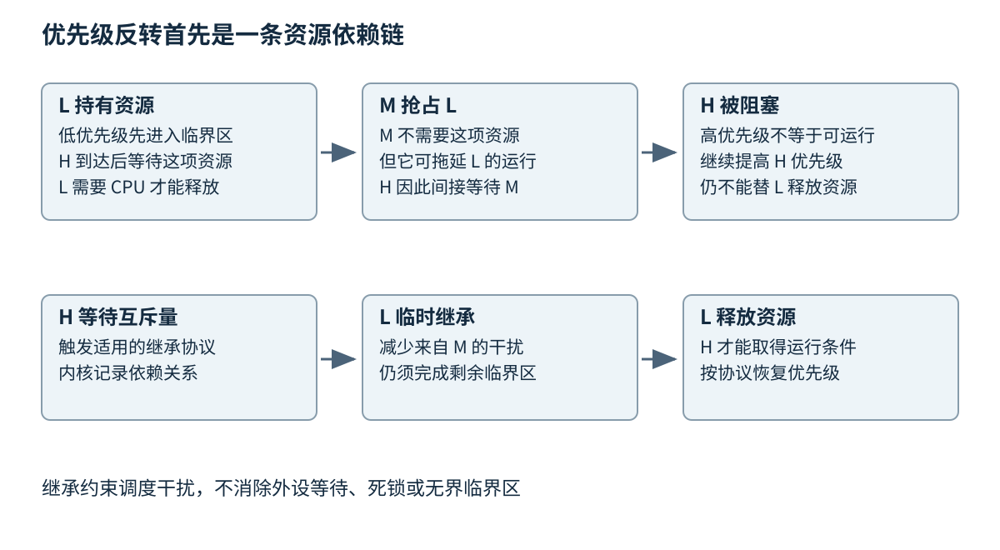
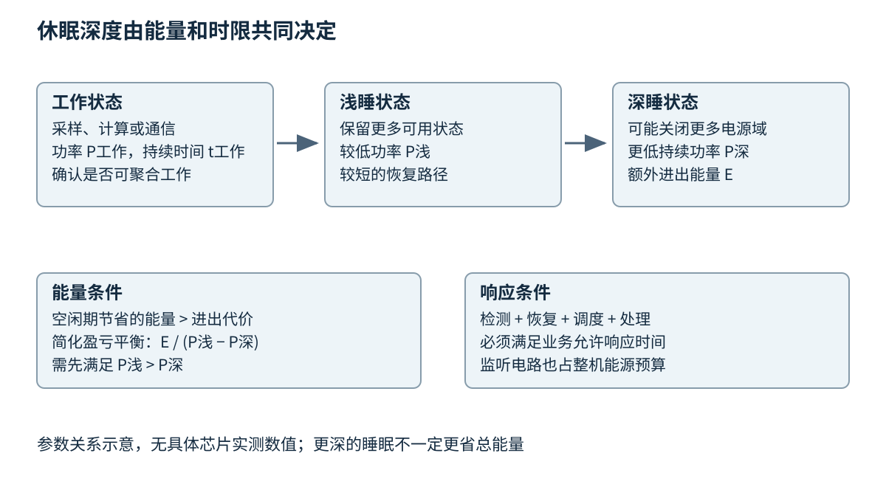
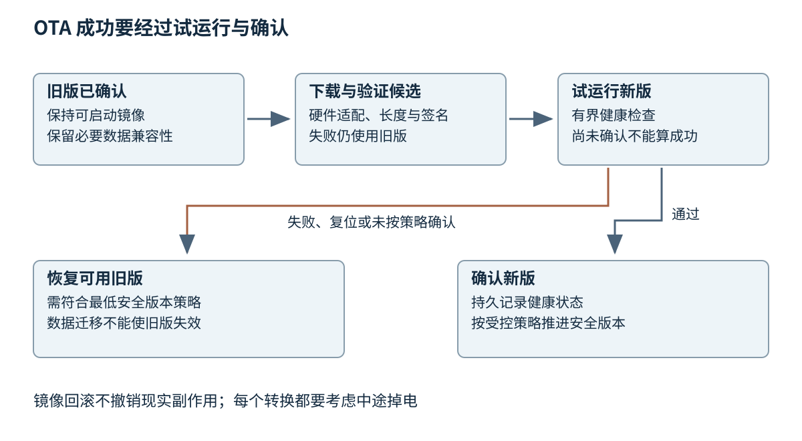

# 第二十九章 实时系统与联网设备生命周期

实时系统的正确性同时依赖结果和结果到达的时间。一条控制命令数值完全正确，却在执行器已经越过可控范围之后才到达，仍然可能是失败。联网设备还要在有限电池、断续网络、长期离线与远程更新之间维持这种正确性，因此不能把实时调度、低功耗和升级维护当成互不相关的附加功能。

第二十八章《MCU 与固件的硬件边界》已经解释了外设、中断和 DMA。本章在这些硬件事实之上讨论如何分配时间、能源与恢复能力。RTOS 提供调度和同步机制，但不自动给产品提供时限保证；安全启动验证镜像来源，但不自动证明控制行为安全；双分区留下旧镜像，但不自动保证旧版能够读取新版改写的数据。工程工作的重点是把这些机制连成完整契约。

本章将 Zephyr 3.7.0、ESP-IDF 5.2.6 的 ESP32 文档作为固定平台例子，FreeRTOS 与 MCUboot 则明确区分通用机制和实现限制。不声明这些版本是当前最新。所有时延、能耗、容量和故障场景都是可复算的教学模型，未执行设备程序、烧录、断电或故障注入，也不构成任何安全等级或行业认证证明。

## 29.1 RTOS任务 优先级反转 Deadline与WCET

### 29.1.1 任务就绪并不意味着任务正在运行

**实时操作系统**（RTOS）为任务切换、定时、同步和中断衔接提供机制。任务通常可以处于运行、就绪或等待状态：运行表示正在获得处理器，就绪表示具备运行条件但尚未获得处理器，等待表示必须先发生某个事件。把所有没有运行的任务都叫“阻塞”，会掩盖是 CPU 竞争还是资源依赖造成的延迟。

一个周期采样任务可能每隔 5 ms 被释放一次。这里的“释放”是一次工作获得执行资格；它随后可能因更高优先级任务而等待。任务开始、采样真正发生、计算完成和输出生效是四个时间点，测量其中一个不能代替其他几个。若采样由硬件定时器触发、DMA 传回数据，任务唤醒时间与物理采样时间尤其不能混用。

优先级决定某种调度规则下谁先得到处理器，不直接表示业务价值的全部排序。诊断任务可能很重要，但不一定需要压过每次采样；紧急停机可能必须由独立硬件与高紧急度路径完成，而不是仅靠一个普通高优先级软件任务。应从允许的最大响应时间、共享资源和失败后果推导调度，而不是按模块负责人意见给每个任务设“最高”。

Zephyr 3.7.0 区分协作式和可抢占线程等调度行为，并有各自配置选项。FreeRTOS 的调度选项、同优先级时间片和中断接口也有自己的规则。不能因为两个内核都叫 RTOS，就假定优先级数字方向、抢占点和 API 行为相同。[S1]

### 29.1.2 截止期 周期与最坏执行时间分别约束什么

**截止期**（Deadline）规定一项工作最迟何时完成。相对截止期从该工作释放时算起，绝对截止期是某个时间点。**周期**描述相邻工作释放之间的间隔；对非周期事件，通常需要规定最小到达间隔或到达包络。截止期可以短于、等于或长于周期；最后一种情形可能让同一任务的多次工作重叠，不能直接套用约束截止期的简单分析。

**最坏情况执行时间**（Worst-Case Execution Time，WCET）描述在明确硬件、代码与环境假设下，任务自身执行所需时间的上界。**响应时间**则从释放到完成，包含等待、被抢占和阻塞。一个只需运行 100 μs 的任务，可能在低优先级调度下等很久才完成。WCET 小不是响应时间小的充分条件。

硬实时通常要求在规定条件下不违反截止期，软实时允许某些迟到并以质量损失描述后果，另一些场景中迟到结果已经无用但偶发丢失可容忍。不同文献对分类细节可能不同，项目最重要的是把后果写清。例如“超过 20 ms 的传感结果不能再用于控制，但允许每小时最多多少次丢弃”比只写“准实时”更可验证。

平均执行时间不足以构建上界。数据相关分支、缓存未命中、Flash 等待、总线竞争、DMA、温度导致的降频和罕见错误处理都可能改变执行时间。最大观测值也只是已覆盖试验中的最大值，除非还有完整的覆盖与分析论证，否则不能直接命名为 WCET。

简单 MCU 上的静态时序分析可能较容易，复杂缓存、多核与动态频率让上界推导困难。实践中常结合静态控制流、测量覆盖、硬件计数和保守预算。这里的“保守”需要有理由，例如外设访问次数、最长循环次数和中断干扰上限，而不是在平均值后随意乘二。

### 29.1.3 利用率能筛掉坏方案 不能证明所有方案

设三个教学周期任务在单核上运行，执行预算分别为 0.4、1.0、2.0 ms，周期分别为 2、5、20 ms。总利用率为 0.4/2+1.0/5+2.0/20=0.5，意味着这些预算平均占用一半 CPU 时间。它是必要的容量视角，却没有检查任务释放相位、截止期、阻塞和中断。

若一个低优先级任务在某处关闭中断 3 ms，而最高优先级采样任务截止期只有 1 ms，整体利用率再低也不能补救这条阻塞路径。若后台任务每 20 ms 突发写 Flash 并让取指停顿，平均 CPU 图也可能掩盖短时失约。调度论证需要把不可抢占区间和硬件停顿一起纳入。

经典利用率界通常依赖明确假设，例如独立周期任务、单处理器、特定优先级规则、截止期与周期关系，以及可抢占性。离开这些假设，引用一个百分比阈值不能证明系统可调度。多核任务迁移、共享锁和自挂起引入额外问题，不能拿单核公式直接相加。

一个更有解释力的教学模型是固定优先级响应时间分析。设任务 i 的执行预算为 `C_i`，低优先级资源导致的有界阻塞为 `B_i`，更高优先级任务 j 的最小到达间隔与执行预算为 `T_j`、`C_j`。这里限定单核、固定优先级、可抢占、各任务相对截止期不大于自身最小到达间隔、没有释放抖动和未建模的自挂起；共享资源影响已由合适协议得到阻塞上界，其余干扰与调度开销也已计入预算。

从 `R_old = C_i + B_i` 开始，可迭代 `R_new = C_i + B_i + sum(ceil(R_old / T_j) * C_j)`。求和只遍历更高优先级任务，`ceil` 表示向上取整。每一项都表达响应窗口内可能遇到的更高优先级工作量。收敛到不超过截止期的固定点，才给出模型内的上界；若迭代已经超过截止期，这项分析没有证明任务满足要求。存在释放抖动、多核或任意截止期时，需要相应扩展，不能沿用同一公式。[S10]

例如教学任务的 C 为 1 ms、B 为 0.2 ms，上方只有周期 4 ms、执行 0.6 ms 的任务。从 R=1.2 ms 起算，下一次为 1.8 ms，再算仍为 1.8 ms，于是模型内固定点是 1.8 ms。如果截止期为 2 ms，模型给出满足条件的结果；如果加入一项 0.4 ms 的中断干扰，上界就可能超过截止期。公式结果只在列出的假设和预算真实成立时有效，不是实机合格证。

### 29.1.4 优先级反转来自依赖关系

**优先级反转**指高优先级任务因为需要某个资源而等待低优先级任务，此时中优先级任务又抢占了资源持有者，使高优先级任务间接受到中优先级任务拖延。真正需要分析的是依赖链，而不是优先级数值有没有排好。

考虑低优先级 L 正持有总线锁，高优先级 H 到达并等待该锁，中优先级 M 不需要这把锁却持续运行。H 无法执行，L 又得不到 CPU 去释放锁，M 便扩大了 H 的等待。只把 H 再调高不会改变它等锁的事实；忙等反而可能让 L 更难推进。

图 29-1 优先级反转的依赖。下行表示持锁者临时继承等待者的优先级后，中优先级工作不能继续按原关系拖延它。图中时间为关系示意，不是某个 RTOS 的调度跟踪。

**优先级继承**使持锁的低优先级任务在必要时临时获得较高优先级，让它更快完成临界区并释放资源。它不能让临界区消失，也不能把等待外部设备的时间变为零。若 L 在持锁期间等一个永远不回应的设备，继承再高的优先级也不会产生回应。

FreeRTOS 官方明确将其互斥量的优先级继承描述为基本机制，并说明这不能治愈所有优先级反转情形；二值信号量也不等价于带继承的互斥量。嵌套锁、同时持有多把锁以及优先级恢复细节必须按所用内核版本核查，不能从 API 名字推导完整优先级协议。[S2]

优先级上限协议则通过预先规定资源相关上限等规则限制阻塞，具体性质取决于协议变体和适用模型。无论采用哪种机制，工程设计仍应减少长临界区，避免持锁进行不可控 IO，并明确锁顺序。第十六章《同步原语与线程组织》的死锁分析与本节时限分析需要同时成立。

资源服务器是另一种组织方式：让一个任务独占某条总线，其他任务通过有界请求队列使用它。这样可以减少共享寄存器和锁，但请求队列自身也需要优先级或时限策略，否则一个长低优先级请求仍会阻塞后来的紧急工作。把 mutex 换成消息队列，改变了依赖形式，并没有自动消除阻塞。

### 29.1.5 中断与任务优先级必须共同设计

RTOS 通常只允许符合条件的中断调用指定的中断版本 API。某些极高紧急度中断不能调用会访问内核调度数据的接口，否则可能破坏临界区假设。应核对目标端口的可调用范围、优先级编码和退出时是否需要触发调度，不把任务函数直接搬到中断里。

事件通知、队列和信号量的语义也不同。事件位可以合并多次相同事件，计数信号量可以积累计数，有界队列保存实际消息。若业务需要知道每一个脉冲出现了多少次，用一个布尔标志会丢失次数；若业务只关心“最新温度可读”，排队保存每次更新反而可能造成过时积压。

任务周期实现还应区分相对延时与绝对节拍。做完工作后再睡固定时间，会把执行时间累加进周期并产生漂移；按上次计划释放点推进，可以维持相位，但超时后应明确是跳过过期工作还是追赶。无限补跑会在系统已经过载时制造更多负担。

超时的时钟基准应使用适当的单调时间概念，而不是可能被网络校时跳变的民用时钟。内核 tick 的量化、计数回绕和休眠补偿都会影响实际分辨率。规定“10 ms 超时”时，应说明是最早可醒、期望延时，还是有证明的最晚截止；一般睡眠 API 并不直接承诺最后一种含义。

### 29.1.6 用时间线解释偶发失约

假设采样任务偶尔晚了 8 ms。只记录该任务开始和结束，可能看到执行仍只花 200 μs，于是误判“算法没问题，无法解释”。更完整的时间线需要事件发生、硬件中断进入、中断退出、任务被唤醒、任务实际开始、结果提交和输出生效等点。

若中断及时但任务迟迟不能运行，调度或临界区值得检查；若中断本身晚到，应看屏蔽区间与更高紧急度来源；若任务已运行但等待总线，应看资源持有者和请求队列；若计算结束及时而输出晚，应看下游 DMA 与设备确认。这种分层可以防止把所有延迟都算到“调度器慢”。

深入追问“实时是不是越快越好”，答案是否定的。更快的平均执行可能来自更复杂的缓存与投机机制，也可能让最坏情况更难论证；极高频率增加功耗和温升，可能削弱持续运行预算。实时设计优先需要可解释的上界、足够余量和已定义的失约处理，然后再讨论平均性能。

## 29.2 低功耗 唤醒与持续监听预算

### 29.2.1 功耗状态必须说明保留了什么

低功耗状态不仅是“CPU 不运行”。不同状态可能关闭时钟、降低电压、切断电源域、保留部分 RAM，或只保留少量唤醒逻辑。更深休眠通常降低静态消耗，却可能增加进入和退出时间，并丢失更多状态。应按器件手册逐个列出保留内容、唤醒源与恢复工作。

系统休眠与设备运行时电源管理也不相同。前者围绕整个系统暂时无工作时选取状态，后者可以在系统仍运行时关闭某个空闲外设。Zephyr 3.7.0 将这两类机制分开描述，设备运行时管理还需要处理依赖关系，例如一个子设备工作时不能随意关闭它依赖的父设备。该固定版本的文档明确说明依赖关系尚不由运行时管理接口自动维护，驱动需要正确取得与释放依赖设备的使用权，不能假设内核已自动包办。[S3]

如果 UART 是唤醒来源，就不能在休眠时同时关闭其检测输入所需电路；如果深睡丢失 RAM，任务上下文也不能被当作还在原处。蓝牙、Wi-Fi、蜂窝和有线 PHY 各有自己的监听和连接维持方式，不能从 MCU 深睡电流直接推导整机待机电流。

图 29-2 休眠选择同时受能量与响应时间约束。图中的电流和时间仅用于表达参数关系，没有代表具体芯片的测量值。

### 29.2.2 能量预算应对整段工作周期积分

功率是单位时间的能量消耗。供电电压近似固定时，可以用各状态电流乘以持续时间估算一周期电荷，再除以周期得到平均电流。若电压不同或稳压效率显著变化，更合适的是分别计算能量并考虑转换损失。

设一个虚构传感节点每 60 s 工作一轮：5 ms 采样使用 8 mA，200 ms 无线发送使用 80 mA，其余 59.795 s 休眠使用 0.020 mA。各段电荷约为 0.04、16 和 1.1959 mA·s，总计 17.2359 mA·s，平均电流约 0.2873 mA。即使把采样算法执行时间减半，也只节省 0.02 mA·s；减少无线唤醒或改善重传更可能有显著收益。

若用名义 2000 mAh 电池简单相除，按未舍入的平均电流可得约 6962 小时，约 290 天。这只是理想容量除以理想平均电流的算术结果，不是续航承诺。温度、放电倍率、老化、自放电、截止电压、稳压损失、连接失败与电池峰值供电能力都会改变可用容量和实际寿命。

尤其要区分平均电流与瞬时峰值。平均不到 1 mA 的设备，发射时仍可能需要几十到几百毫安；高内阻电池可能在峰值负载下电压跌落而复位。增加休眠时间不能修复瞬时供电能力不足，固件与硬件必须共同考虑缓冲电容、供电网络和允许工作状态。

### 29.2.3 深睡只有超过盈亏平衡点才节能

进入和退出低功耗状态本身需要时间和能量。设浅睡功率为 P浅，深睡功率为 P深，进入与恢复额外消耗的能量合计为 E。如果 P浅 大于 P深，只有预计空闲时间足够长，使节省的持续功耗超过 E，深睡才有能量收益。简化盈亏平衡时间是 E/(P浅−P深)，还要满足响应期限。

例如教学参数中，深睡相对浅睡每秒节省 4 mJ，但每次进出额外消耗 0.8 mJ，则至少需要约 200 ms 空闲才有净收益。如果系统每 10 ms 都要处理一次事件，不应仅因为深睡电流最低就反复进入深睡。更好的方向可能是聚合工作、减少无意义唤醒，或选择保持关键外设的较浅状态。

唤醒延迟则由检测、振荡源恢复、时钟切换、外设初始化、调度和应用处理共同构成。若要求从外部信号到响应不超过 5 ms，而选定深睡状态恢复本身就需要 4 ms，剩给协议和业务的时间非常有限。选择状态必须把最坏恢复路径计入，不能只测一遍常温最快值。

### 29.2.4 Tickless 省去的是不必要的节拍唤醒

传统周期 tick 可以让系统频繁醒来检查时间，即使很久没有任务要运行。**无滴答空闲**（tickless idle）在条件满足时抑制不必要的周期节拍，借助合适定时源在下一个必要事件之前恢复，并补偿经过的时间。它不表示系统不再有时间，也不表示所有外设自动进入最省电状态。

Zephyr 的系统电源管理把空闲处理、策略选择与具体 SoC 的进入退出动作分开。这种分层提醒我们：内核能决定“可以睡多久”，板级实现仍要保证硬件定时器、唤醒中断和电源域行为与决策一致。驱动没有正确报告忙碌状态时，系统可能在 DMA 尚未结束时进入错误状态。[S4]

时间补偿也有误差来源。低功耗时钟精度、计数分辨率和唤醒提前量会影响下一次任务释放。长期周期任务若要求准确采样，可能需要独立硬件定时源或周期校准；联网时间校准又会消耗能量。因此时钟精度和电量是共同预算，不应在两个模块中各自假设对方免费提供。

### 29.2.5 持续监听与长续航存在真实取舍

“随时接收命令”和“绝大部分时间完全断电”不能无条件同时成立。设备若关闭了接收链路，就必须通过定期唤醒、外部唤醒电路或仍然工作的低功耗子系统发现命令。每种方案都改变可用延迟、误唤醒率和能源成本。

若每 10 s 唤醒一次查询命令，命令刚错过窗口时，等待可能接近 10 s，再加网络和处理时间。平均等待约半个周期只在到达相位等假设成立时有意义，不能用平均 5 s 代替最坏响应承诺。若每次查询还要重新建立无线连接与 TLS 会话，握手成本可能大于读取业务数据本身。

保持长连接可以减少重复握手，却需要维持无线关联、心跳和中间网络状态；缩短心跳有助于更快发现失联，但增加唤醒与流量。系统应从可接受的离线发现时间反推心跳策略，并考虑服务器集中唤醒大量设备造成的突发。设备、网关和云端三个层次需要协商，而不是让固件单独选一个常数。

重试尤其容易击穿预算。网络故障时每秒重连一次，可能使原本以休眠为主的节点持续发射。指数退避、抖动、最大尝试窗口和失败后降级策略应有明确上限；紧急事件又可能需要独立的优先传输通道。这些策略不能机械套用到所有事件，必须区分可等待遥测与有时限的告警。

### 29.2.6 测量应把仪器本身算进解释

测低功耗时要明确测量点：芯片电源、整块开发板输入还是电池端。板载调试器、指示灯、电平转换器和稳压器静态电流可能远高于 MCU 深睡本身。只读芯片数据手册上的最低值并乘电池容量，没有覆盖实际产品。

电流波形还需要足够的时间分辨率与量程。慢速平均读数可能漏掉发射峰值，量程切换可能引入压降或采样空洞。仪器串入线路会改变供电条件，因此出现重启时应检查测量方法是否影响被测对象。报告要保留仪器、带宽、供电、固件版本、网络状态和温度等条件。

深入追问“省电为什么不是把 CPU 频率降到最低”，可以从总能量回答：较慢执行延长活跃时间，外围与无线可能一直保持工作，反而增加一轮任务的能量；较快完成后休眠可能更省电。另一方面，高频需要更高电压或引入额外功耗，也可能不划算。比较的是完整任务周期的能量和时限，而不是单一瞬时电流。

## 29.3 OTA 双分区回滚 安全启动与设备身份

### 29.3.1 更新是带持久状态的事务

**空中升级**（Over-the-Air Update，OTA）泛指通过通信链路取得并安装设备软件的过程，不局限于无线。它需要回答镜像从哪里来、适用于哪种硬件、是否完整可信、什么时候切换、失败怎样恢复以及如何确认全体设备的状态。

一个最小可解释流程包括发现更新、核查策略、下载到非活动区域、验证、标记候选、重启试运行、健康检查、确认或回滚。每一步都可能断电、超时或重复执行，因此状态必须持久化且能恢复。把全部逻辑写成“下载完成后修改启动地址”，漏掉了大部分真正困难的失败窗口。

镜像元数据至少应绑定硬件适用范围、组件类型、版本或安全版本、长度、摘要以及签名所覆盖的内容。只签名二进制而不保护关键适配信息，可能让一份合法镜像被误用于错误设备。解析长度时还要做溢出、范围和分区边界检查，这延续第四章与第二十六章对不可信输入的要求。

### 29.3.2 双分区保留恢复材料 但不是完整恢复证明

**双分区**通常保留一个当前有效镜像和一个候选镜像。在下载候选时保持当前镜像可启动，可以减少中断风险。但 Flash 总容量、擦除单位、引导状态区和配置存储都会占空间，不能简单要求“应用小于 Flash 的一半”就宣布布局正确。

ESP-IDF 5.2.6 的 ESP32 OTA 文档明确区分 OTA 应用分区与 OTA 数据状态，并说明回滚配置与首次启动确认机制。本文借用其“试运行后确认”的思想，不把其具体分区名称、状态枚举或 eFuse 行为推广到所有 MCU。[S5]

图 29-3 升级状态机。决定镜像选择和确认结果的关键状态转换需要可恢复的持久记录；“恢复旧版”还要求旧镜像未被安全版本策略撤销，且数据格式仍兼容。

双分区可以有不同执行策略。有的平台能直接从两个槽位之一运行，有的平台必须交换或复制到固定执行地址，还有的平台把镜像加载到 RAM。MCUboot 文档区分这些模式，状态尾部和交换策略也影响可恢复性；因此 A/B 是布局概念，不能代替具体引导算法说明。[S6]

掉电测试应覆盖状态转换内部，而不只是下载过程。写入候选镜像时掉电、写入有效标志时掉电、交换某个扇区时掉电和第一次启动后尚未确认时掉电，恢复结果可能不同。状态记录应能区分旧、候选、部分写入和损坏，而不能让随机擦除值恰好表示“有效”。

### 29.3.3 健康确认必须验证真正需要的能力

新固件运行到主函数就立即确认成功，几乎没有验证维护价值。至少要说明产品赖以工作的关键条件，例如必需存储可读、必要外设可初始化、配置版本可接受、核心任务能周期运行，以及必要情况下仍可联系管理端。健康标准应适合设备实际职责。

但确认条件也不能无限严格。如果把“云端服务此刻必须在线”设为唯一成功条件，正常固件可能因外部网络故障不断回滚。可以区分本地必要条件、有限时间内的网络能力测试，以及上线后持续健康监测。必要时允许受控延期确认，但必须有上限和电量预算。

看门狗在此提供一部分失败检测：若新镜像卡死不能喂狗，复位后的引导阶段可以识别未确认状态并回退。然而“能喂狗”不证明业务正确，错误任务可能持续喂狗而关键采样已经停止。更稳健的监督方式需要各关键任务报告有意义的进展，监督者检查窗口内的完成条件，而不是所有任务都无条件刷新同一个计时器。

如果新镜像执行过具有外部副作用的动作，回滚也不能撤销它。设备可能已修改远端参数、校准执行器或改变用户配置，因此升级设计应避免在确认之前执行难以撤销的动作，或者明确记录并补偿。软件版本回退与现实世界恢复是不同问题。

### 29.3.4 数据迁移会决定旧版是否真的能回来

假设版本 A 使用配置格式 1，版本 B 启动时把配置就地改为格式 2，然后因其他故障回退到 A。如果 A 无法读取格式 2，双分区虽然保留了旧程序，设备仍无法恢复。这个失败不在镜像校验范围内，而在数据兼容协议中。

可用策略包括在试运行期间保留旧格式副本、使用向后兼容的增量字段、双写到独立区域，或把不可逆迁移推迟到确认后并明确放弃某些回滚能力。每种策略都有空间和复杂度成本。应把固件版本、配置模式版本和安全版本作为不同维度管理，不能只用一个整数同时表达。

校准、设备身份和用户数据应与可替换应用区分。更新过程不能因为镜像重新布局就默默覆盖这些内容，也不应把出厂参数当成可以重新生成的普通缓存。恢复出厂设置同样需要明确保留与删除范围，尤其是设备重新绑定、所有权转移和报废场景。

### 29.3.5 安全启动建立信任链

**安全启动**验证下一阶段代码是否满足已建立的信任策略。一个典型链条从较难被篡改的启动根开始，验证后续引导程序或应用签名，再交付执行。信任根如何保存、密钥能否轮换、调试访问如何限制，都与具体芯片和产品威胁模型相关。

安全启动、传输加密和 Flash 加密解决不同问题。TLS 保护传输通道的一部分安全属性；镜像签名让设备验证发布授权与内容完整性；Flash 加密帮助限制离线读取；运行时内存安全则约束已授权程序执行后的行为。拥有其中一种不能宣称其他威胁已经消失。

ESP-IDF 5.2.6 的 Secure Boot V2 对 ESP32 有明确芯片修订等适用条件。真实启用可能涉及不可逆的 eFuse 或调试限制，因此本章只讨论设计，不提供烧写熔丝或关闭调试的操作。产品进入量产前应在可恢复的专用样机上核验流程，并保留受控密钥与故障恢复方案。[S7]

签名私钥不应放进普通设备固件或调试日志。设备通常只需要验证材料或受保护的设备侧私钥，而发布签名权限应受到独立控制。密钥泄露时，必须知道哪些设备信任它、能否撤销、是否支持换根以及离线设备何时能够获取新策略。签名算法选择只是这一生命周期的一小部分。

### 29.3.6 回滚与防回滚需要共同设计

**功能回滚**帮助设备恢复到仍可工作的旧版本，**防回滚**阻止攻击者重新安装带已知漏洞或被撤销策略的旧版本。两者并不矛盾，但需要明确哪些旧版本仍被允许。一个已经被安全策略禁止的镜像，不能因为它还在另一个分区里就自动恢复使用。

可以把普通发布版本与单调安全版本分开：同一安全代内允许在兼容的发布版本间回退，修复重大漏洞时提高最低安全代。提高后旧安全代失效，恢复镜像也必须达到新下限。何时更新单调状态是关键，因为过早提高可能在新镜像尚未证明可用时消灭唯一可恢复旧版。

某些硬件单调计数资源具有有限写入次数或一次性位语义，具体预算由平台决定。不能把每次普通构建都映射为一次不可逆安全版本提升，也不能认为重新格式化配置就能降低硬件记录。这里的策略需要安全、发布和维修流程共同设计，不由单个升级函数决定。

### 29.3.7 设备身份不是一段公开序列号

设备标识可以用于区分记录，设备认证则要证明当前通信者有权代表该身份。公开序列号、MAC 地址或可读芯片唯一 ID 通常不能单独充当秘密。只让设备报告自己的编号，再接受所有命令，相当于把自报姓名当成身份凭证。

设备侧密钥应有生成、注入、保存、使用、轮换、吊销和报废流程。批量设备共用一个全局秘密会扩大单台泄露的影响范围；每台独立身份有助于限制影响，但增加制造、证书和恢复管理成本。安全元件或芯片隔离能力可以加强保存，却不能替代服务器端授权策略。

制造测试需要能关联硬件版本、固件、校准和测试结论，但不应把秘密写进普通可下载报告。服务人员可能需要读故障码，却不需要提取设备私钥；用户迁移设备所有权也不应等同于把生产维护凭据交给新用户。权限必须按操作与生命周期阶段分开。

NISTIR 8259A 将设备识别、配置、数据保护、接口访问、软件更新和安全状态感知作为相关能力讨论。它是风险导向的能力基线，不意味着照抄一份列表即可获得某种产品认证。本章采用它来提醒：维护与安全状态应是产品可观察、可管理的能力。[S8]

### 29.3.8 发布应能停下 并解释失败群体

分批发布减少一次错误影响全部设备的风险，但分组应覆盖硬件修订、网络环境、区域和关键配置，而不是只选最容易成功的样机。成功率分母必须明确：已分配更新、已下载、已切换、已确认和持续健康是不同群体。

设备长期离线时，服务器不能把“没报告失败”当作成功。更新状态要区分未接触、下载中、等待窗口、试运行、已确认、已回滚和需要维修。每一类都需要能解释下一步，而不是统一显示离线。

深入追问“签名正确的更新能否仍然危险”，答案当然是可以。签名证明授权来源和内容完整性，不证明程序没有缺陷、适合这块硬件、能满足时限或不会破坏数据。可信发布需要签名、适配检查、测试、灰度、健康确认和恢复策略共同成立。

## 29.4 HIL测试 故障安全和量产可维护性

### 29.4.1 在环测试把模型与真实执行放在不同位置

**模型在环**用模型检验模型之间的行为，**软件在环**运行实现软件并由模拟环境提供输入，**硬件在环**（Hardware-in-the-Loop，HIL）把真实控制硬件接到可控的仿真环境。HIL 的价值是让实际 IO、调度和固件参与闭环，同时避免直接驱动昂贵或危险的真实对象。

一个 HIL 台架通常包括被测设备、实时运行的被控对象模型、信号调理、通信接口、必要的负载模拟与故障注入设施。NI 的官方架构资料强调从被测设备需求出发设计信号路径；这里采用该分工解释方法，不复制其图表，也不为任何具体平台作性能保证。[S9]

仿真器也有实时期限。如果它不能按要求生成下一步输入，被测控制器看到的延迟就可能是台架造成的。模型步长、IO 延迟、时钟同步和数值误差必须记录，否则“控制器振荡”可能其实来自测试环境不满足闭环条件。

HIL 不等于真实环境的完整替身。连接器接触不良、温度循环、机械磨损、电磁干扰和特定传感器失效模式可能只被部分覆盖。测试报告应说明哪些物理机制被建模、模型在哪些范围有效，以及哪些还要通过环境试验或真实系统验证。

### 29.4.2 故障注入必须有独立的安全边界

故障注入有软件与物理层次。软件可以模拟丢帧、延迟、校验错误和传感值异常；物理注入可能涉及断线、短路、供电跌落或负载故障。后者必须由额定、隔离并经过审查的台架执行，不能通过临时跳线和手工短接带电端子实现。

测试计划应先定义允许能量、最大电压电流、互锁、紧急停止、隔离范围和恢复步骤。台架控制程序故障时，也不应无限维持危险输出。测试设备的“可编程”能力不代表任何操作都安全，实际故障注入仍需要相应硬件资质与安全规程。

对本章教学设备，可以在概念层定义输入在正常范围内跳变、某个通道停止更新、通信连续丢失若干周期、候选镜像校验失败等场景。期望结果不是只看“没有崩溃”，而是明确故障检测时间、告警、输出范围、恢复条件和是否留下诊断记录。本书没有执行这些场景，也没有把推演当作合格证据。

### 29.4.3 故障安全需要先定义安全状态

**故障安全**意味着在指定故障与风险分析下，系统进入或维持可接受的状态。安全状态不总是断电：有的设备需要继续通风，有的制动系统需要保持压力，有的工艺需要受控停机。应该由危害分析确定安全行为，不能把“异常就全部关闭”当作跨领域准则。

软件安全机制还需要考虑共同原因失效。如果同一个任务既执行控制又判断自己是否健康，再由它自己决定停止，某些错误可能同时破坏两项功能。独立监视器、外部看门狗或硬件联锁可以减少部分共同失效，但其独立性、覆盖范围与响应时间都要被证明。

看门狗复位只是一个动作。复位期间引脚会进入何种状态、执行器是否继续保持旧命令、设备重启是否产生瞬态输出，都属于安全论证。若设备在持续故障下每秒复位一次，重启瞬态可能比停机更危险，因此必须定义重复故障后的锁定或降级策略。

**失效静默**强调故障节点不再输出错误信息，**降级运行**允许在受限能力下继续提供服务，**故障后持续运行**要求特定故障下仍保留必要功能。它们对应不同冗余与成本，不能把术语当作质量等级排序。选择必须由产品危害和可接受服务损失决定。

### 29.4.4 验证结果需要能回到需求与配置

第二十三章《从测试到可信验证》讨论测试层级与证据。对设备系统，一条有效记录应能关联需求、测试输入、期望结果、固件哈希、硬件修订、台架版本、模型参数、测量条件和原始日志。缺少这些信息时，同样的“通过”可能是在完全不同环境下取得的。

测试应该覆盖正常边界与故障恢复两侧。例如缓存容量刚好达到边界、计数器回绕、接收队列满、外设超时后再次连接、更新中断后重新上电。仅验证“错误被检测到”不够，还要验证恢复以后不残留旧会话、旧 DMA、过时请求或不兼容配置。

覆盖率只表明代码或状态在测试中被触及的情况，不自动证明时限和物理风险已覆盖。一个分支执行过一次，不意味着它在最坏总线负载下也能及时执行；一条故障处理路径被调用过，不意味着所有导致该故障的物理模式都被覆盖。证据需要对应具体主张。

长期测试也要防止只累计小时数。若负载一直稳定，几千小时可能从未触及更新与断电交错；短时间内系统化枚举状态转换，可能更容易发现问题。两类测试互补：持续运行暴露累积泄漏和磨损趋势，定向故障探索边界条件，不应互相代替。

### 29.4.5 量产测试与现场诊断服务不同目的

量产测试关注装配、器件、连接和基础功能是否符合要求，通常受测试节拍与设备成本约束；研发验证关注设计本身；现场诊断关注已经部署的某台设备为何失效。用同一份长测试程序解决所有阶段，往往既拖慢生产又泄露过多维护能力。

制造流程应记录哪些检查由电测完成、哪些由固件自检完成、哪些依赖外部仪器。烧录后读取版本号只能证明软件能报告版本，不能证明每条模拟通道或通信线路都可靠。校准数据需要与设备关联，单位、有效范围和校准算法版本也应保存，而不是只存一组无上下文数字。

现场日志要在有限存储中保留最有价值信息。可以采用有界环形记录、事件分级、复位原因计数和少量故障快照，避免持续写 Flash。设备时间不可信时，应保留单调计数或相对时间，并标明是否已经校时。没有可信时间的日志仍可能有因果价值，但不能伪装成精确民用时间。

日志还应避免过度收集。设备身份可以使用受控的内部关联方式，访问令牌、无线密码、用户内容和私钥不应进入普通故障包。维修需要的信息与服务器管理秘密应分离，导出动作也要遵守用户权限。第二十六章的秘密管理边界在受限设备上尤其重要，因为泄露后更新与撤销可能很慢。

### 29.4.6 可维护性应覆盖退役而不止首次上线

一台设备可能在仓库中存放数年后才联网，可能跨越多个中间版本升级，也可能在云服务迁移后重新出现。兼容策略需要说明最旧支持版本、升级跳跃规则、证书有效期、时钟未校准时的行为和失去原服务后的恢复方式。不能只验证“从上一个开发版升级到今天”。

供应链变化还会带来兼容挑战。同型号替代料、Flash 容量、传感器修订或收发器差异可能影响时序与功耗。物料替换需要映射到可追踪的硬件版本，固件适配与测试矩阵才能知道哪些组合已经验证。看起来相同的外壳不能替代硬件身份。

设备报废时应处理用户数据、云端授权和设备凭据，避免旧设备仍被当作可信节点。某些秘密可被安全擦除，某些硬件身份无法重置，两种情形的服务器策略不同。停止安全更新也需要明确支持期与风险告知，这是一项产品生命周期责任，而不仅是仓库关闭后不再提交代码。

深入追问“RTOS、OTA 和 HIL 为什么放在同一章”，可以把它们连接成一条主线：RTOS 管当前时刻怎样完成任务，功耗管理决定什么时候还能继续工作，OTA 决定软件改变后如何保持可恢复，HIL 与维护证据说明这些主张在何种条件下成立。真正可部署的联网设备需要这四种时间尺度共同协调。

## 本章资料与核验范围

[S1] Zephyr Project，[Scheduling，3.7.0](https://docs.zephyrproject.org/3.7.0/kernel/services/scheduling/index.html)，核验于 2026-10-03。用于协作式与可抢占调度的固定版本例子；正文响应时间计算是带明确假设的作者教学推导。

[S2] FreeRTOS，[Mutexes](https://www.freertos.org/Documentation/02-Kernel/02-Kernel-features/02-Queues-mutexes-and-semaphores/04-Mutexes)与[官方互斥量说明入口](https://freertos.org/Real-time-embedded-RTOS-mutexes.html)，核验于 2026-10-03。用于基本优先级继承及其局限，不声称所有 RTOS 或所有版本行为相同。

[S3] Zephyr Project，[Device Runtime Power Management，3.7.0](https://docs.zephyrproject.org/3.7.0/services/pm/device_runtime.html)，核验于 2026-10-03。用于外设运行时电源管理及依赖关系。

[S4] Zephyr Project，[System Power Management，3.7.0](https://docs.zephyrproject.org/3.7.0/services/pm/system.html)，核验于 2026-10-03。用于空闲、策略与 SoC 低功耗操作的分工，不提供特定开发板的睡眠电流承诺。

[S5] Espressif，[Over The Air Updates，ESP-IDF 5.2.6，ESP32](https://docs.espressif.com/projects/esp-idf/en/v5.2.6/esp32/api-reference/system/ota.html)，核验于 2026-10-03。用于候选、首次启动确认与回滚/防回滚的分层。

[S6] MCUboot，[Bootloader design](https://docs.mcuboot.com/design.html)，核验于 2026-10-03。滚动文档，用于区分固定执行地址、交换、直接执行等模式；实施时须锁定具体 MCUboot 版本与配置。

[S7] Espressif，[Secure Boot V2，ESP-IDF 5.2.6，ESP32](https://docs.espressif.com/projects/esp-idf/en/v5.2.6/esp32/security/secure-boot-v2.html)，核验于 2026-10-03。用于芯片适用边界与信任链讨论；没有执行任何安全熔丝、凭据或调试权限操作。

[S8] NIST，[NISTIR 8259A IoT Device Cybersecurity Capability Core Baseline](https://csrc.nist.gov/pubs/ir/8259/a/final)，2020-05。用于设备生命周期安全能力的分类，不代替行业认证、法定合规或特定产品风险评估。

[S9] National Instruments，[The NI Hardware-in-the-Loop Test System Architecture](https://www.ni.com/en/solutions/transportation/hardware-in-the-loop/hardware-in-the-loop--hil--test-system-architectures.html)，核验于 2026-10-03。用于被测设备、实时模型与信号路径的结构说明；没有复制厂商图片或声称已运行台架。

[S10] Alan Burns、Robert I. Davis，[Response Time Analysis for Mixed Criticality Systems with Arbitrary Deadlines](https://www.cs.york.ac.uk/rts/static/papers/Burns2017b.pdf)，2017，第三节回顾约束截止期的固定优先级响应时间递推；本章只采用这一基础模型，并显式列出额外阻塞及开销预算，不讨论混合关键性扩展。

[S1]: https://docs.zephyrproject.org/3.7.0/kernel/services/scheduling/index.html
[S2]: https://www.freertos.org/Documentation/02-Kernel/02-Kernel-features/02-Queues-mutexes-and-semaphores/04-Mutexes
[S3]: https://docs.zephyrproject.org/3.7.0/services/pm/device_runtime.html
[S4]: https://docs.zephyrproject.org/3.7.0/services/pm/system.html
[S5]: https://docs.espressif.com/projects/esp-idf/en/v5.2.6/esp32/api-reference/system/ota.html
[S6]: https://docs.mcuboot.com/design.html
[S7]: https://docs.espressif.com/projects/esp-idf/en/v5.2.6/esp32/security/secure-boot-v2.html
[S8]: https://csrc.nist.gov/pubs/ir/8259/a/final
[S9]: https://www.ni.com/en/solutions/transportation/hardware-in-the-loop/hardware-in-the-loop--hil--test-system-architectures.html
[S10]: https://www.cs.york.ac.uk/rts/static/papers/Burns2017b.pdf
