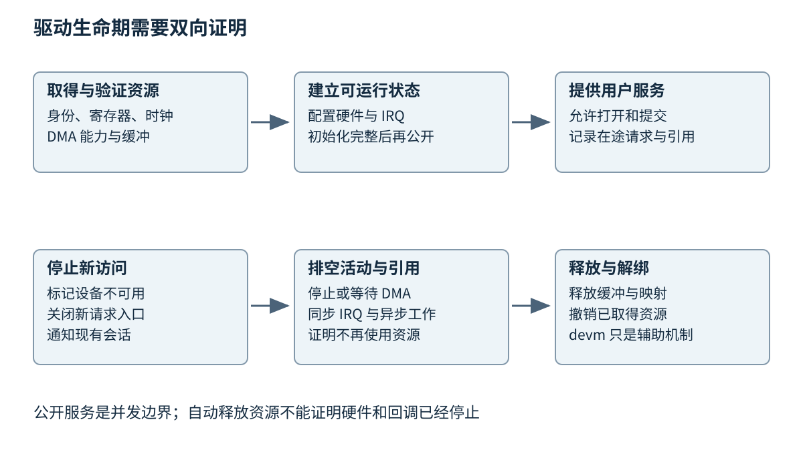
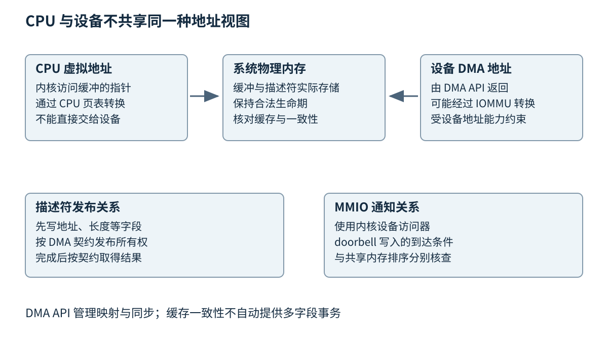

# 第三十章 Linux 内核驱动与系统软件

Linux 内核协调处理器、内存、设备与进程，让应用通过受控制的接口使用硬件。驱动是其中把设备协议与内核子系统连接起来的代码。它不仅把一个寄存器写成某个值，还要正确处理并发访问、热插拔、休眠恢复、错误回收和用户态契约。驱动中的一次越界写可能破坏与该设备无关的内核对象，因此影响范围远大于一个普通应用崩溃。

第七章《操作系统提供的执行与资源模型》介绍了资源抽象，第十七章《从语言内存模型理解原子操作》解释了语言级同步。本章讨论的是 Linux 自己的执行上下文、API 和内存排序规则。内核原语不是 std::mutex 的同义词，设备 DMA 也不是一个 ISO C++ 线程；理解相似的同步目标有帮助，但必须回到 Linux 与硬件共同定义的契约。

正文以 Linux 6.12 官方文档为主要固定参照，不把它称作当前最新内核。KVM 和 kdump 的部分引用使用核验日的滚动官方页面，并限制在基础分层。这里没有编译、加载、卸载内核模块，没有修改内核参数、设备绑定、权限或网络配置，也没有在真实系统执行故障注入。所有诊断案例均为推演，不能视为生产事故或实测记录。

## 30.1 用户态内核态接口与模块

### 30.1.1 权限边界不是一条函数调用边界

**用户态**与**内核态**描述处理器执行权限及相应操作系统约束。应用调用普通函数时仍在自己的执行环境中；系统调用通过规定入口请求内核服务，内核检查参数和权限，并在适当上下文中完成或安排工作。一次库函数调用可能触发零次、一次或多次系统调用，不能只看 API 名字判断跨界成本。

内核执行也不总属于某个系统调用。设备中断、软中断、内核线程和定时器回调都可能运行内核代码。它们能否睡眠、持有什么锁、是否有可用进程地址空间，条件各不相同。驱动作者看到“这段代码在内核里”还远远不够，必须继续确认它在哪一种上下文里运行。

用户态与内核态共享一台机器的资源，但并不共享同样可信度。应用传入的地址、长度和命令都可能错误或恶意；即使最初检查通过，用户空间内容也可能随后变化。驱动应通过适当的用户访问接口复制和验证数据，不能直接把用户指针当作可信内核对象解引用。

一个常见设计误区是先在用户内存里检查结构长度，再逐字段多次读取并执行。另一个线程可以在中途改变字段，形成检查时与使用时不一致。更易审计的方案通常是先按受限长度取得内核副本，对该副本进行一致性验证，再决定是否发起设备动作。大缓冲的映射或固定又有不同生命周期要求，不应为了少复制就取消边界检查。

### 30.1.2 用户接口需要长期承担兼容责任

Linux 的内核内部接口与用户空间接口具有不同兼容目标。官方驱动接口文档明确区分这两者：内部数据结构与 API 会演进，不能假定跨内核版本保持稳定的模块二进制接口；面向应用的用户接口则需要高度重视既有程序兼容性。[S1]

驱动暴露的 read、write、poll、mmap、ioctl、sysfs 或 netlink 各有适合的用途。流式数据可以自然映射到读写；可等待事件可以通过 poll 类机制连接事件循环；结构化控制消息可能适合专门协议。选择接口时应先考虑数据模型和生命周期，避免为了省事把所有操作都塞进一个未版本化的私有 ioctl。

**ioctl**允许对打开的对象执行设备相关控制操作，但其数据结构一旦成为用户 ABI，就需要考虑字段宽度、对齐、保留字段、扩展方式和 32/64 位兼容。把内核内部结构直接原样传给用户，会让内部重构受制于外部布局，还可能泄露未初始化的填充字节。

一个适当的控制请求可以使用固定宽度字段、明确结构大小或版本、限定标志位，并要求未知保留字段为零或按契约忽略。返回结果应区分参数不合法、功能不支持、设备已移除、暂时不可用和真实 IO 失败。用户应用才有可能做正确的重试与降级，而不是见任何错误都循环调用。

sysfs 通常用于表达设备模型中的属性，不宜变成传送任意二进制大块数据的私有隧道。debugfs 面向调试，不应被当作稳定产品 ABI。日志接口也不能替代结构化状态接口：应用从内核日志中正则匹配某个句子来判断业务完成，既脆弱又容易越过权限边界。

### 30.1.3 文件描述符承载会话与引用

设备节点看起来像文件，但它连接的是相应子系统和驱动方法。打开设备可以创建一个会话状态，后续读写通过文件对象找到该状态；同一设备的多个打开者可能共享硬件，但拥有不同缓冲、权限或订阅。驱动需要明确哪些状态属于设备，哪些属于一次打开。

关闭文件描述符不一定意味着设备动作瞬间停止。存在异步请求、映射、复制的描述符或内核持有的引用时，资源可能仍需保留。若用户发起 DMA 后立即退出，内核必须有取消、排空或独立完成责任，不能让进程消失带走设备仍在访问的缓冲。

阻塞读与非阻塞读应有清楚契约。没有数据时，前者可以等待，后者通常返回表示暂不可用的结果；设备移除、信号中断和结束状态是另外的情形。poll 报告可读之后，状态仍可能被另一个消费者改变，所以应用与驱动都要允许一次实际读取再次发现无数据，而不把就绪当作永久预约。

mmap 可以让用户态访问某些共享缓冲，减少复制，但也放大了生命周期责任。映射可能比创建它的文件描述符活得更久，进程可能 fork，设备可能被拔除。映射失效、缓存属性、页权限和设备继续访问条件都需要明确。把物理地址直接交给用户不会自动形成安全、可移植的零拷贝接口。

### 30.1.4 模块装载与设备绑定是不同事件

**内核模块**是可以按支持条件装入内核的代码和数据单元。模块初始化通常注册驱动或子系统能力，具体设备随后在匹配时执行 probe 等绑定流程。系统没有对应硬件时，模块也可能已经加载；一个驱动模块还可能绑定多个设备。因此“模块初始化成功”不等于“所有设备都初始化成功”。

模块退出需要解除注册和确保没有活跃使用者。模块引用计数帮助避免代码在仍被调用时卸载，但设备私有对象、异步工作和硬件 DMA 有各自生命期，不能只看模块引用归零就宣布全部资源安全。Linux 6.12 的 Driver Basics 说明了模块入口、退出及引用接口的基本责任。[S2]

模块签名与加载策略用于控制进入内核的代码来源，不证明代码没有逻辑缺陷。签名通过的驱动仍可发生越界、死锁或错误设备操作。开发和验证应使用隔离测试环境、明确匹配的内核构建配置与恢复手段，不能直接在承载重要业务的主机上加载未经验证的实验模块。

发行版可能维护额外的 ABI 策略或回补补丁，同一个上游版本号不代表内部接口完全一样。排查模块不兼容时，应保留内核发布字符串、配置、工具链、模块构建标识与符号信息。仅凭“都是 6.x”推断可用，比第八章里混用 ABI 更危险，因为失败发生在高权限执行环境。

### 30.1.5 进入内核的理由必须足够具体

有的设备工作可以通过现有通用驱动、标准接口或用户态库完成，并不一定要新增内核模块。新增内核代码的理由可能是与现有子系统深度集成、处理专用 IRQ/DMA、提供特定安全隔离或满足必要的硬件管理契约，而不是“内核态肯定更快”。

用户态实现便于隔离故障和更新，但需要评估设备访问权限、调度延迟与接口限制；内核态实现更靠近资源管理，也承担更严格的上下文和兼容责任。可把控制策略放在用户态，把最低限度的硬件机制放在内核，前提是两者之间的接口能够完整表达所需时序和安全约束。

深入追问“系统调用为什么不能传一个 C++ 对象指针”，可以从三层回答：指针只在特定地址空间和生命期内有意义；C++ 对象内部可能包含指针、虚表和不可稳定序列化状态；内核不能把不可信用户对象当作自己的对象模型。需要的是明确的数据 ABI 和校验协议，而不是跨边界共享语言对象的幻觉。

## 30.2 设备模型 驱动 IRQ DMA和内存屏障

### 30.2.1 设备模型组织发现 匹配与生命周期

Linux 的设备模型把设备、驱动、总线和类别等概念组织起来。总线层提供发现与匹配规则，驱动声明可以处理的设备，匹配成功后执行初始化。某些硬件能自描述，例如 PCI 或 USB 的枚举信息；某些板级设备依赖 Device Tree 或 ACPI 等固件描述来提供资源。[S3]

Device Tree 不是驱动代码，它描述硬件连接和资源。compatible 字符串帮助匹配，寄存器区域、中断、时钟、复位和电源资源则由相应绑定定义。随意修改描述让某个驱动强行匹配，不代表实际硬件满足该驱动假设。资源地址错配可能让驱动访问另一个设备或无效区域。

probe 不只是分配一个结构体。它需要取得资源、确认设备身份与版本、建立 DMA 能力、初始化硬件、注册中断并向上层公开服务。某些依赖尚未就绪时可以按框架机制延迟探测。若把暂时缺少依赖当成永远不存在，设备可能在启动时偶发失败；若无限立即重试，又可能浪费资源。

资源取得顺序与对外可见顺序应分开。驱动最好在核心状态完整建立后才让用户能够打开它；失败回滚则按已经取得的资源逐项撤销。暴露半初始化设备，会让其他线程在启动尚未结束时进入数据路径，使初始化代码也成为并发代码。

### 30.2.2 devm 简化释放 不替代停止协议

**托管设备资源**（devres，常见接口前缀 devm）让某些资源跟随设备生命期自动释放，减少失败路径中遗漏清理的风险。Linux 官方文档列出其用途与相应接口，但自动释放某块内存并不意味着异步执行者已经不再访问它。[S4]

假设驱动用托管分配取得缓冲，又启动了工作队列和 DMA。设备移除时若只依赖自动释放，工作函数可能还在运行，硬件也可能继续写入。这时问题不是资源是否最终被释放，而是释放发生得过早。必须先阻止新的使用者进入，再根据依赖关系协调现有请求、DMA、中断与工作队列，证明它们不再访问数据后才释放。具体顺序由设备协议决定，例如依赖完成中断的排空过程不能先失去所需通知。

错误回滚同样需要遵循已经启动的活动。若 probe 在注册中断之后失败，清理路径要考虑中断是否已经触发；若设置了设备可见标志之后失败，要考虑是否已有打开者。最稳健的审阅方式是把每一项资源旁边写上“谁可能正在使用它”与“如何证明使用结束”。

图 30-1 对外公开之前完成初始化，回收之前阻止新访问并排空在途活动。图示为生命期关系，具体 API 与顺序由子系统和设备协议决定。

热拔插让这些责任变得可见，但没有可拔连接器的设备也会经历解绑、复位、错误恢复与电源管理。remove 路径不能被当成只在程序结束时发生的普通析构。设备已经不可访问时，清理过程还必须避免继续读写 MMIO 等待一个永远不会出现的状态。

### 30.2.3 IRQ 上下文决定可以做多少工作

**中断请求**（IRQ）使内核响应设备事件。传统硬中断处理应快速判断是否属于本设备、取得必要状态、按协议应答，并把较长工作交给适当后续上下文。共享中断中，驱动不能假定每次进入都是自己的设备发出请求。

延后工作可以通过不同机制组织。线程化中断在适当条件下让主要处理在线程上下文执行，工作队列适合可睡眠的后续任务，网络接收还常使用 NAPI 轮询预算。不能把所有“下半部”理解成一种固定执行上下文，因为能否睡眠、抢占和并发行为随机制与内核配置改变。

锁也必须按上下文选择。普通 mutex 可能睡眠，不适合任意硬中断临界区；自旋类锁用于不能睡眠的短临界区，但不能在持有时调用可能阻塞的接口。可抢占实时内核配置 PREEMPT_RT 会改变某些锁类型的实现与执行属性，raw_spinlock_t 等也有特定用途。Linux 6.12 的锁类型文档明确讨论这些差别，不能把非 RT 内核经验无条件搬过去。[S5]

若进程上下文持有某把自旋锁时，被同 CPU 的中断打断，而中断又尝试获取同一把锁，就可能永远等不到当前被打断执行者释放。需要使用适当的中断保存与锁协议，而不是只说“这是一把自旋锁，所以不会死锁”。多核还要考虑其他 CPU 的并发访问，关闭本地中断不会自动排除它们。

### 30.2.4 CPU 地址 物理地址与 DMA 地址并不相同

第六章《地址空间与虚拟内存》解释了 CPU 的虚拟地址转换。驱动还面对设备使用的 DMA 地址，二者不能直接互换。IOMMU、主桥和设备地址能力可能使设备看到的地址与 CPU 物理地址不同。Linux DMA API 正是为了让驱动在这些平台差异之上建立正确映射。[S6]

**输入输出内存管理单元**（IOMMU）可以把设备发出的地址转换到受管理的物理内存，并提供相应访问隔离。它不等于 CPU 页表，也不意味着错误 DMA 自动无害；映射范围太宽、设备组隔离不足或软件错误仍可能扩大影响。设备只支持较窄地址宽度时，驱动还要设置与核查 DMA mask，而不是把 64 位 CPU 指针强转为 32 位寄存器。

DMA 映射分为一致性分配与流式映射等不同使用方式。前者常用于长期存在的共享描述符，后者常用于一段时间内交给设备的数据缓冲。具体一致性、同步与生命周期由 API 定义。取得一致性内存不代表字段发布顺序可以任意，也不表示可以在设备使用期间释放它。

流式映射需要提供正确方向，例如向设备发送、从设备接收或必要的双向使用。映射可能失败，错误必须在设备开始访问之前处理。CPU 与设备交替拥有缓冲时，需要按接口进行同步；取消与错误路径也要解除映射或完成回收。忘记映射失败与提前 unmap，都会把偶发系统压力变成数据损坏风险。

### 30.2.5 MMIO 是设备访问接口

**内存映射 IO**（MMIO）让设备寄存器出现在处理器可访问的地址区域中。内核驱动应通过相应映射与访问接口取得并访问这些资源，而不是把任意物理地址转成普通指针。访问器可以处理架构差异、字节序与规定的排序语义。[S7]

某些总线写入是 posted write，CPU 发出写并继续执行时，设备未必已经真正完成处理。特定设备和总线可能要求适当读回或其他同步手段确认写入到达。读哪个寄存器也要按设备说明，不能用会产生副作用或不可访问的寄存器作为通用“刷新”。

普通 memcpy 不一定适合 MMIO，普通指针解引用也不一定遵守设备访问宽度。设备寄存器还可能有写一清除、读清、只写或保留位约束。第二十八章的寄存器语义没有因为换到 Linux 就消失，只是应通过内核子系统的正确接口表达。

端序需要明确处于哪一层。CPU 本机端序、总线规范、设备描述符字段以及网络协议字节序可能不同。一段驱动在小端开发机上工作，并不能证明没有端序问题。对于定义为小端或大端的字段，应采用相应类型和转换，而不是依靠结构体在本机内存里的偶然布局。

### 30.2.6 内存屏障服务于明确的观察者

Linux 内核内存屏障区分 CPU 间共享、设备 DMA、MMIO 等不同关系。READ_ONCE/WRITE_ONCE 可以约束特定编译器访问变换，但不自动提供完整跨 CPU 的先行发生链；smp 屏障、DMA 屏障和设备访问器也不能只按名字相似就互换。[S8]

以发送描述符为例，CPU 先写缓冲 DMA 地址和长度，再把所有权位交给设备。所需证明是：设备观察到所有权改变时，也能按协议观察到先前字段。另一个问题是通知设备的 doorbell 写何时到达。前者涉及描述符内存发布，后者涉及 MMIO 通知；只解决其中一层可能仍失败。

接收完成方向则相反。CPU 先检查设备的完成或所有权状态，再读取设备写入的长度与数据；需要使用设备协议和 DMA API 规定的顺序。设备还可能只完成部分缓冲，错误状态也必须读取和解释，不能因为看到一个完成位就信任任意长度。

图 30-2 CPU 虚拟地址、系统内存与设备 DMA 地址。IOMMU 是可能存在的转换层，不能假定所有平台都有；描述符发布顺序与 MMIO 通知顺序分别需要验证。

缓存一致性只说明某些数据可按硬件规则保持一致，不自动给多字段更新提供事务性。两个字段分两次写入，设备可能看到中间状态；描述符上的所有权位、代数或队列头尾就是协议用来标明何时可读的边界。屏障应放在这条边界附近并解释它保护的关系，而不是在每个函数前后随意插入。

深入追问“x86 上一直没出错，为什么还要用 DMA API”，可以回答：测试平台可能恰好具有缓存一致性和简单地址映射，隐藏了代码的不可移植假设；DMA API 同时负责映射、地址能力、同步和生命周期，不能仅凭一次测试省略。迁移到带 IOMMU、非一致性缓存或不同内存布局的平台，问题才可能显现。

## 30.3 文件系统 块层 网络栈与eBPF观测

### 30.3.1 VFS 把文件语义交给不同实现

**虚拟文件系统**（VFS）为应用提供统一的文件操作入口，并把操作分派给具体文件系统。目录项描述名称到对象的关联，inode 表示文件系统对象，打开文件对象保存一次打开相关状态。它们相关但不相同：同一 inode 可以通过多个硬链接名字访问，分别打开同一文件也可以拥有不同偏移；dup 等共享打开文件描述的情况则会共享相应偏移。[S9]

文件路径解析可能命中内存中的目录项缓存，也可能需要访问底层存储。读取文件数据可能命中页缓存，也可能发起 IO。因而“read 调用很快”并不一定表示磁盘很快，可能只是读取的内容已经在内存里；相反，低 CPU 使用率也可能意味着线程在等待页或设备完成。

缓冲写通常先改变缓存中的数据，之后由回写机制提交底层存储。调用返回、文件系统提交、设备接受命令与数据在断电后可恢复，是不同层次。fsync 等接口用于请求规定的持久化语义，但结果仍依赖文件系统、挂载方式、设备实现和必要的元数据更新。不能把一次 write 返回成功直接解释为物理持久化完成。

原子性也需要指明对象。某个文件名替换可以具有命名空间层面的原子观察性质，但不自动让多个文件内容形成事务；日志文件系统可以帮助维护元数据一致性，也不意味着应用自己的多步更新自动可恢复。应用必须设计自己的提交记录、同步顺序和恢复逻辑，第三十五章会从数据存储角度继续展开。

### 30.3.2 块层将逻辑 IO 组织为设备请求

**块层**把块设备 IO 组织为请求并交给驱动。Linux 的 blk-mq 使用多队列机制减少单个共享队列带来的竞争，把软件提交路径与硬件队列组织起来。不同设备能力、调度策略和 IO 模式决定具体行为，不能认为“多队列”总能使吞吐按核数线性增长。[S10]

一个应用读操作可能被拆成多个块请求，多个邻接请求也可能合并；文件系统可能因为元数据或预读发出额外 IO。因此应用层请求数与设备命令数不必相同。只对比两端计数而不理解拆分合并，很容易把正常机制误判为丢失或重复。

IO 延迟可以分成应用等待、文件系统处理、队列等待、设备服务和完成通知等部分。队列深度增加可能提高设备并行利用率，也可能增加每个请求的排队时间。吞吐达到某个数值以后，继续增加队列深度未必有收益，却可能显著恶化尾延迟。

设一个教学服务每秒提交 20000 个存储请求，稳定状态中平均在途请求数为 40，在相应统计边界与稳定假设下，Little 定律给出平均驻留时间约 2 ms。这是平均关系，不证明最大延迟，也不告诉我们时间花在设备内部还是提交队列。若请求分布变化或系统不稳定，这个简化关系的解释也要调整。

### 30.3.3 网络栈中的排队并不只有一个地方

从网卡接收一帧到应用读取数据，路径可能经过 DMA 环、驱动处理、协议栈、socket 缓冲和应用队列。发送方向又可能经过应用缓冲、socket、排队规则、驱动队列和设备。每层都可能缓存、丢弃或延迟，单独观察链路速率不能解释应用吞吐。

NAPI 让网络驱动在中断通知和预算化轮询之间组织接收工作，避免每个包都要求一次独立中断所产生的开销。Linux 6.12 文档强调 poll 的工作预算与完成契约；这是一个资源调度机制，不等于把网卡永久改成无中断或把所有包处理搬到用户态。[S11]

GRO、GSO、TSO 等合并或分段卸载机制会改变软件观察到的包形态与计数。抓包位置不同，可能看到大于线路 MTU 的逻辑数据块或尚未由硬件填好的校验信息。不能看到本机抓包校验字段异常就直接断定线上报文损坏，应先核查卸载与捕获位置。

网络慢也不总在网络。接收线程没及时读取，socket 缓冲增长，流控反馈再降低发送速度，最终表现为链路未跑满。应用持锁、内存回收或磁盘写入都可能沿背压向前传播。第三十三章《网络协议与高性能服务》讨论连接与应用协议，本章关注内核路径如何参与这些现象。

### 30.3.4 eBPF 提供受约束的内核扩展与观测点

**eBPF**允许把符合特定规则的程序附加到内核中的某些挂接点，完成观测、过滤或其他受支持操作。程序类型决定可使用的上下文、辅助函数和能力；验证器分析程序是否满足相应安全约束，运行方式可能涉及解释或 JIT。它不是在内核里随意执行任意 C 代码的通道。[S12]

验证器接受程序，只说明它在对应模型下通过了所检查的条件，不证明业务逻辑正确、没有敏感数据泄露或性能开销可接受。收集每个网络包的全部内容可能触及隐私并压垮输出通道；一个高频挂接点上的昂贵统计也可能改变被测系统。观测需要权限、采样预算和保留策略。

maps 在 BPF 程序与用户态之间保存状态，ring buffer 等通道用于传送事件。它们也有容量和并发语义。事件通道满时会出现丢记录，统计程序应记录丢弃计数并在报告中说明，不能把剩余样本当作完整时间线。跨 CPU 事件排序也需要明确时间戳来源和重排策略。

BPF 类型格式（BTF）提供相关类型信息，CO-RE（Compile Once, Run Everywhere）利用这类信息进行适配，帮助程序适应某些内核类型布局变化，但不保证任意内核、程序类型和挂接点都兼容。配置、权限、辅助函数、字段语义和发行版补丁仍可能不同。可移植性方案应检测所需能力并有失败说明，而不是仅凭加载器运行成功便宣布长期兼容。[S19]

### 30.3.5 观测先提出能被证据区分的假设

假设某服务读取设备时 p99 延迟增加。合理的假设至少包括设备响应变慢、内核队列积压、完成中断未及时处理、线程调度受限、内存压力或用户态处理变慢。先定义各层时间边界，再选 tracepoint、计数器、调度事件或设备统计，能够减少盲目采集。

一个可用的关联键应能跟随同一请求经过关键层。若内核会拆分、合并或重试，请求 ID 的意义也会改变，需要保留父子关系，而不是简单拼接所有相同地址。指针地址尤其不适合作永久身份，因为对象释放后地址会复用。

事件时间差还要扣除时钟与记录误差。不同 CPU 或设备时钟可能需要同步，硬件时间戳与软件时间戳含义不同。用户态记录到“收到数据”的时刻包含线程实际被调度的延迟，不等于网卡接收时刻。报告应写清测量点，而不是统一使用“网络延迟”四个字。

观测工具没有发现问题，也不意味着问题不存在。采样可能漏过短事件，未启用的探针看不到路径，调试内核可能改变时序，丢事件可能集中发生在最忙时段。第二十二章《调试与故障证据链》提出的证据保全和替代假设，在内核诊断中同样重要。

### 30.3.6 把吞吐改善与资源转移分开

某项优化让系统调用次数降低，却增加了大缓冲的内存占用；另一项优化降低 CPU，却让设备队列更深并增加尾延迟。内核优化经常是在资源与等待位置之间重新分配成本，而不是把成本彻底消除。

零拷贝尤其需要准确描述“少了哪一次复制”。缓冲固定、页引用、DMA 映射、缓存一致性和完成通知仍有开销，而且缓冲不能立即复用。对于很小的数据，管理成本可能超过一次简单复制；对于大批量持续传输，减少复制才更可能划算。第十九章《异步 IO 协程与调度》的生命周期分析在这里继续有效。

深入追问“为什么应用层看到丢包，但 NIC 没有报错”，可以沿路径回答：硬件接收成功后，驱动预算、协议校验、socket 缓冲、应用队列或业务解析仍可能丢弃；反过来，应用层缺少响应也可能是对方根本没发。要在相邻层建立计数和时间对应，才能定位第一个证据断点。

## 30.4 虚拟化 容器隔离与内核故障定位

### 30.4.1 虚拟机和容器划出的边界不同

**虚拟机**提供一套可运行客体操作系统的虚拟硬件环境，客体拥有自己的内核；**容器**通常是共享宿主内核的一组受隔离与资源控制约束的进程。两者都可以改善组织与隔离，但隔离位置、管理成本和故障面不同。

KVM 把硬件辅助虚拟化能力暴露给用户态虚拟机监视器，通过系统、虚拟机和虚拟 CPU 等层次的文件描述符与 ioctl 组织接口。设备模型、镜像、管理策略和许多 IO 工作仍由相应用户态组件与内核子系统共同完成，KVM 本身不是一个包含全部管理功能的虚拟机产品。[S13]

客体中的一个虚拟 CPU 通常仍需要宿主调度资源。宿主忙碌时，客体可能观察到运行进展受限；客体显示高空闲也不能证明宿主没有资源争用。虚拟化性能诊断要同时看客体、宿主、设备和调度位置，不能只在其中一层调参数。

直通设备可以减少某些软件路径，但要求正确的设备隔离、DMA 映射与复位能力。IOMMU 组、共享硬件资源和设备固件仍影响安全边界。把一个 PCI 设备交给客体会改变宿主对它的控制，不能作为无风险的通用性能开关。

### 30.4.2 Namespace 隔离视图 cgroup 管理资源

**命名空间**（namespace）为一组进程提供某些资源的独立视图，例如进程 ID、挂载点或网络栈对象。它改变能看到和命名哪些对象，并不自动限制 CPU 或内存消耗。Linux manual pages 对各类命名空间分别说明，不能用“容器有 namespace”代替完整权限审查。[S14]

**控制组**（cgroup）按组统计和控制资源。cgroup v2 提供统一层次及相应控制器，可以影响 CPU、内存、IO 等资源行为。限制、权重和保护含义不同：权重通常表示竞争时的相对份额，限制则可能产生节流；内存压力与 OOM 行为也需要结合层次结构解释。[S15]

一个服务平均 CPU 使用率不高，仍可能被周期性 CPU 配额节流。它在短时间内用完预算后等待下个周期，造成尾延迟；增加线程数不一定有用，反而更快消耗配额。诊断应看节流时间与运行队列，而不是只看整机剩余 CPU。

同样，容器内“还有内存”可能与宿主全局或父 cgroup 限制不同。页缓存、匿名页、共享页和内核内存的记账需要按具体接口理解。只增加应用堆上限可能把问题推向内存回收或 OOM，应该同时理解工作集、限制和失效策略。

### 30.4.3 权限缩减需要多种机制配合

Linux capabilities 将部分传统超级用户能力拆分，但拥有某项能力仍可能具有很大影响；user namespace 会改变部分身份与能力的解释范围，也不是让所有内核攻击面消失。容器 root 与宿主 root 的关系必须根据实际配置判断，不能只凭用户名。

**seccomp**可以过滤系统调用，减少允许的接口范围，但它不是完整沙箱。官方文档也强调应与其他安全机制组合。文件访问策略、网络策略、设备权限和强制访问控制仍需独立配置；过滤某个系统调用名字不一定覆盖同类效果的其他入口。[S16]

只读根文件系统减少部分持久修改途径，但可写卷、套接字、宿主挂载与设备节点仍可能形成敏感通路。最小权限要围绕业务真正需要的对象与动作设计，而不是只勾选若干“安全选项”。第二十六章《安全与内存安全工程》的信任边界分析在这里变成具体内核对象边界。

共享宿主内核意味着内核漏洞和资源故障可能影响多个容器。容器隔离有价值，但面对高风险不可信代码时，应根据威胁模型评估是否需要更强的虚拟机或硬件隔离。这里讨论的是机制和选择依据，不提供绕过限制或修改安全配置的操作。

### 30.4.4 先区分 Oops Panic Hang与硬件故障

**Oops**表示内核检测到某种严重异常并输出诊断，系统可能继续运行，但状态可信度已受影响；**panic**通常使系统进入停止正常运行或按策略重启的路径；**hang**是系统失去预期进展的现象，可能由死锁、活锁、设备等待或硬件问题导致。它们不是同一个“蓝屏错误”。

内核栈中的最后一个函数未必是根因。被破坏的指针可能由更早的越界写造成，发生故障的读取只是首先碰到它的地方。若栈回溯自身损坏，更要结合寄存器、地址、内存分配信息和先前日志，不要把打印出的第一个驱动名当作结论。

硬件错误可能来自内存、总线、电源或设备固件。相同负载下跨软件版本重现、机器检查日志或设备健康信息有助于区分，但任何单条信号都不是绝对证明。切换内核后问题消失也可能是时序变化掩盖了硬件或驱动竞态，而不一定已经修复根因。

### 30.4.5 现场保全比反复重启更有价值

应尽可能保存第一次异常前后的日志、内核与模块构建标识、配置、符号、硬件信息和触发条件。第一次错误之后的后续异常可能只是连锁破坏，优先保留最早证据。自动重启有助于恢复服务，但可能覆盖循环缓冲，策略应在可用性与取证之间取得明确平衡。

kdump 借助预留资源和崩溃捕获内核等机制保存内存转储，需要事先配置与验证；并不是故障发生后运行一个命令就能补回完整现场。转储中可能包含凭据、用户数据与内核内存，保存和传输都需要受控权限与保留期。[S17]

若系统完全卡住，串口控制台、持久日志、硬件看门狗记录或远程管理能力可以提供不同层次的证据。但这些能力也可能影响安全与维护通路，必须在部署前审查。没有预置取证能力时，应诚实说明证据不足，而不是从最后一行日志编造确定原因。

### 30.4.6 工具分别覆盖不同错误类型

KASAN 主要帮助发现相应配置和模式下的越界、释放后使用等内存错误；KCSAN 用采样与插桩等机制帮助检测数据竞争；lockdep 跟踪锁依赖，帮助发现某些潜在死锁或不合法锁用法。它们的覆盖、开销和平台支持不同，不能用一个工具无报告证明所有并发与内存问题不存在。[S18]

调试选项可能显著改变内存布局与时序。某个故障只在关闭检测器后出现，不说明检测器没价值，而可能表明原有竞态对时序敏感；某个问题只在检测器开启时出现，也需要区分真实缺陷被揭露和测试环境资源不足。报告必须保留配置和开销条件。

最小复现应减少无关变量，同时保留触发问题所需的并发、负载和设备状态。删除一个看似无关的日志后故障不再出现，可能是日志改变了时序，而不是日志本身有逻辑错误。可以通过定向压力、故障注入和明确时间线进一步缩小，但本章没有实际执行这些操作。

### 30.4.7 回归定位需要可比较的两个世界

版本回退、补丁二分与配置差异比较可以帮助定位回归，但前提是好坏版本使用可比较的硬件、固件、工作负载和环境。设备固件升级、BIOS 改动、频率策略或容器限制变化都可能与内核变化同时发生。只比较源码提交而不记录环境，会产生错误因果关系。

假设教学网卡驱动在压力下偶发超时。可先检查提交队列是否还推进、完成队列是否出现、IRQ 是否到达、CPU 是否长期忙于软中断，以及设备是否报告错误。若提交持续、完成停滞而 IRQ 仍有无关事件，设备或描述符协议值得检查；若完成已写到内存但软件看不到，则缓存、屏障或队列索引假设可能错误。这些是可区分的诊断路径，不是预设结论。

修复还需要验证失效路径。一个补丁让正常发送更快，却在设备拔除时留下未完成 DMA，并不能称作正确修复；一个补丁只延长超时，可能减少报警但没有恢复进展。验收应围绕原始不变量与可观察完成条件，保存能够复现旧问题且验证新行为的证据。

深入追问“内核工程最难的是什么”，可以给出具体答案：同一对象同时受用户会话、异步工作、设备访问和内核生命期管理约束；同一错误可能跨越应用、调度、内存与硬件边界才显现。可靠的方法是逐项列出参与者、所有权、可睡眠上下文、观察顺序与结束证明，而不是靠背诵更多寄存器或系统调用名。

## 本章资料与核验范围

以下固定版本文档均于 2026-10-03 核验；它们描述 Linux 接口，不是 ISO C++ 保证。

[S1] Linux 6.12，[The Linux Kernel Driver Interface](https://docs.kernel.org/6.12/process/stable-api-nonsense.html)。用于区分内部接口与用户 ABI，不把发行版额外兼容政策视为上游保证。

[S2] Linux 6.12，[Driver Basics](https://docs.kernel.org/6.12/driver-api/basics.html)。模块入口、退出与引用责任。

[S3] Linux 6.12，[The Linux Kernel Device Model](https://docs.kernel.org/6.12/driver-api/driver-model/overview.html)。设备、总线与驱动生命周期。

[S4] Linux 6.12，[Devres](https://docs.kernel.org/6.12/driver-api/driver-model/devres.html)。托管释放不替代在途活动停止协议。

[S5] Linux 6.12，[Lock types and their rules](https://docs.kernel.org/6.12/locking/locktypes.html)。上下文与 PREEMPT_RT 差异。

[S6] Linux 6.12，[Dynamic DMA mapping Guide](https://docs.kernel.org/6.12/core-api/dma-api-howto.html)。CPU/DMA 地址、映射与同步边界。

[S7] Linux 6.12，[Bus-Independent Device Accesses](https://docs.kernel.org/6.12/driver-api/device-io.html)。MMIO 访问器与总线访问规则。

[S8] Linux 6.12，[Linux kernel memory barriers](https://docs.kernel.org/6.12/core-api/wrappers/memory-barriers.html)。CPU、DMA 与设备观察顺序的分层。

[S9] Linux 6.12，[Overview of the Linux Virtual File System](https://docs.kernel.org/6.12/filesystems/vfs.html)。VFS、目录项、inode 与打开文件对象。

[S10] Linux 6.12，[Multi-Queue Block IO Queueing Mechanism](https://docs.kernel.org/6.12/block/blk-mq.html)。软件提交与硬件队列的组织。

[S11] Linux 6.12，[NAPI](https://docs.kernel.org/6.12/networking/napi.html)。网络接收轮询与预算契约。

[S12] Linux 6.12，[eBPF verifier](https://docs.kernel.org/6.12/bpf/verifier.html)。验证器检查边界；正文观测方案为作者分析，不以验证通过证明业务安全。

[S13] Linux，[KVM API Documentation](https://docs.kernel.org/virt/kvm/api.html)，滚动页面核验于 2026-10-03。只使用文件描述符层次与能力探测等基础概念，未把滚动扩展倒推到 6.12。

[S14] Linux man-pages，[namespaces(7)](https://man7.org/linux/man-pages/man7/namespaces.7.html)，核验于 2026-10-03。命名空间的资源视图边界。

[S15] Linux 6.12，[Control Group v2](https://docs.kernel.org/6.12/admin-guide/cgroup-v2.html)。资源统计、控制与层次语义。

[S16] Linux 6.12，[Seccomp BPF](https://docs.kernel.org/6.12/userspace-api/seccomp_filter.html)。系统调用过滤与非完整沙箱边界。

[S17] Linux，[Documentation for Kdump](https://docs.kernel.org/admin-guide/kdump/kdump.html)，滚动页面核验于 2026-10-03。只讨论预配置崩溃取证机制，不提供系统修改命令。

[S18] Linux 6.12，[KASAN](https://docs.kernel.org/6.12/dev-tools/kasan.html)、[KCSAN](https://docs.kernel.org/6.12/dev-tools/kcsan.html)及 [Runtime locking correctness validator](https://docs.kernel.org/6.12/locking/lockdep-design.html)。检测器与锁验证的覆盖必须按实际构建配置核对。

[S19] Linux 6.12，[libbpf Overview](https://docs.kernel.org/6.12/bpf/libbpf/libbpf_overview.html)。BTF与CO-RE的类型布局适配边界，不作任意内核兼容保证。

[S1]: https://docs.kernel.org/6.12/process/stable-api-nonsense.html
[S2]: https://docs.kernel.org/6.12/driver-api/basics.html
[S3]: https://docs.kernel.org/6.12/driver-api/driver-model/overview.html
[S4]: https://docs.kernel.org/6.12/driver-api/driver-model/devres.html
[S5]: https://docs.kernel.org/6.12/locking/locktypes.html
[S6]: https://docs.kernel.org/6.12/core-api/dma-api-howto.html
[S7]: https://docs.kernel.org/6.12/driver-api/device-io.html
[S8]: https://docs.kernel.org/6.12/core-api/wrappers/memory-barriers.html
[S9]: https://docs.kernel.org/6.12/filesystems/vfs.html
[S10]: https://docs.kernel.org/6.12/block/blk-mq.html
[S11]: https://docs.kernel.org/6.12/networking/napi.html
[S12]: https://docs.kernel.org/6.12/bpf/verifier.html
[S13]: https://docs.kernel.org/virt/kvm/api.html
[S14]: https://man7.org/linux/man-pages/man7/namespaces.7.html
[S15]: https://docs.kernel.org/6.12/admin-guide/cgroup-v2.html
[S16]: https://docs.kernel.org/6.12/userspace-api/seccomp_filter.html
[S17]: https://docs.kernel.org/admin-guide/kdump/kdump.html
[S18]: https://docs.kernel.org/6.12/dev-tools/kasan.html
[S19]: https://docs.kernel.org/6.12/bpf/libbpf/libbpf_overview.html
