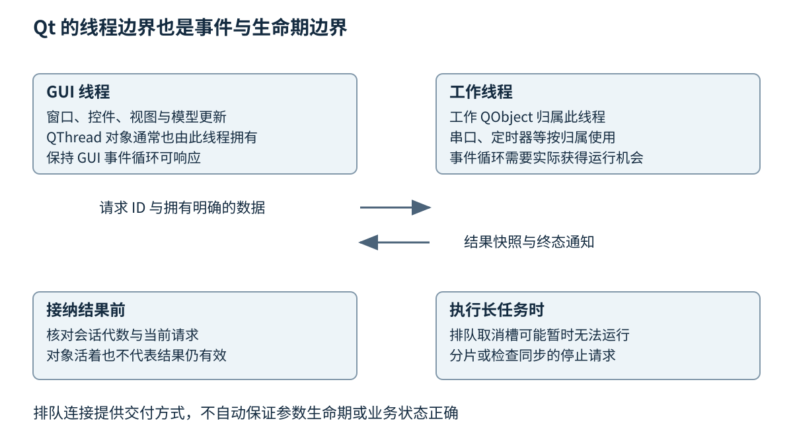
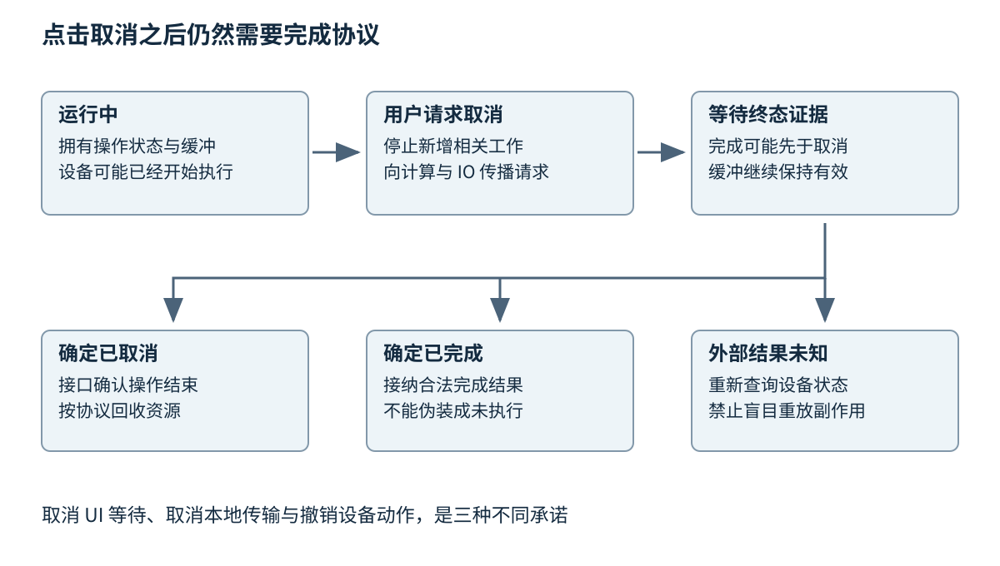
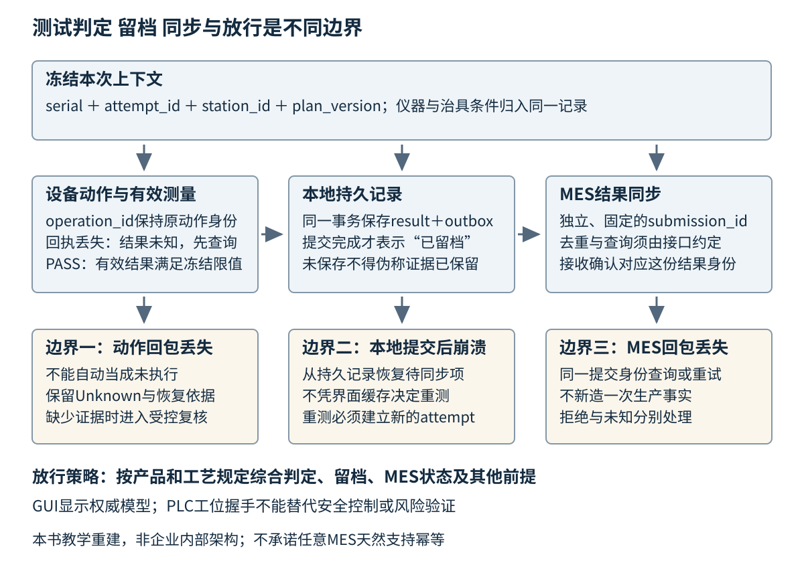

# 第三十一章 Windows Qt 与设备上位机

一台产品测试或校准工站通常连接扫码器、夹具、PLC、被测设备、测量仪器和制造执行系统。操作员扫入序列号后，软件要核对工单和工艺路线，确认当前测试方案，让设备在允许的条件下烧录、校准、采集，再把测量值、限值和判定保留下来。设备已经动作却丢了回复、测试记录刚保存电脑就崩溃、MES 已收下结果但确认丢失，都会让一个看似简单的“开始测试”按钮变成跨设备、跨进程的恢复问题。

**上位机**是相对于被连接设备而言的控制、配置、观察与维护应用，常运行在 Windows 工控机或其他桌面系统上。工业现场还会用它做数据采集、产线监控、设备调试和历史追溯。这些软件可能共享 Qt 界面、通信库和数据库，但不能混淆责任：高频采集是否完整、机器能否安全动作、工件是否符合限值、MES 是否接受工序结果，分别需要自己的证据。

本章以测试与校准工站解释 Windows、Qt 与设备接入为何必须一起设计，同时保留串口、CAN、USB、网络、安装和用户数据保护的基础。Win32 给出消息与窗口生命周期模型，Qt 提供跨平台对象、事件与界面机制；它们都不会自动提供工业流程状态机、物理动作幂等性或质量判定规则。第五十八章再把本章的边界连成一条完整工站链。

本章固定使用 Qt 6.8 系列官方文档，不从当前滚动文档反推 API；原有 Win32 与 Qt 资料按 2026-10-03 核验，新增工业资料按 2026-10-04 核验。工站、握手和数据样例均为原创教学设计，代码未编译、未执行；没有接入真实 PLC、采集仪器或 MES，也没有发送设备命令、安装驱动或完成安全验证。接线仍须服从第二十八章《MCU 与固件的硬件边界》的电平、供电与隔离限制。

## 31.1 事件驱动与工业应用职责

### 31.1.1 窗口是一项需要管理的系统资源

Win32 窗口由系统管理，并通过窗口句柄 HWND 引用。窗口类描述相应窗口的行为入口等信息，创建窗口产生实例，窗口过程接收并处理消息。窗口句柄不是 C++ 对象指针，也不自动保证某个应用对象仍然存活。

应用可以把窗口与自己的控制对象关联，但必须定义关联何时建立、何时解除。创建窗口的过程中就可能收到消息，因此不能假设创建函数返回后再初始化全部状态也安全。销毁过程中也可能收到后续生命周期通知，需要保证窗口过程在各阶段都能识别当前可用资源。

句柄可能被系统复用。一个后台线程记住旧 HWND，过很久再向它发送结果，不能仅凭数值仍然非空就确信它属于原窗口。可以把结果提交给一个生命期更稳定的应用分发器，再按会话与请求标识路由；也可以用明确拥有关系与取消排空协议，避免后台工作保留失效目标。

窗口、界面控件、业务模型和设备连接应有不同的身份。关闭一个设置对话框不一定要关闭整个设备会话；断开设备也不一定要销毁所有历史图表。若把这些生命期绑在同一个巨型窗口类里，后续添加多个窗口或多个设备时，很容易出现重复关闭、悬空回调和状态互相污染。

### 31.1.2 消息循环负责把事件送到处理入口

**消息循环**不断从线程的消息队列取得消息，进行必要转换，再分派到窗口过程。键盘、鼠标、窗口变化和应用自定义通知由不同路径进入这个模型。不是所有消息都先排队等待，同步发送还会产生不同调用关系。[S1]

GetMessage 的返回值需要分别处理：正值表示取得普通消息，零对应退出消息，负值表示错误。将它直接写成不区分错误的布尔循环，会把错误路径与正常取消息混在一起。下面只给出循环骨架，省略窗口创建与完整清理。

```cpp
// 教学片段；未编译、未执行；仅展示 Win32 消息循环分支。
// 前提：Windows SDK，当前线程已按设计创建窗口并拥有其消息循环。
// 缺少：窗口类、WndProc、创建/销毁流程、错误日志与资源清理。
#include <windows.h>
int message_loop_fragment() {
    MSG msg{};
    for (;;) {
        const BOOL status = GetMessageW(&msg, nullptr, 0, 0);
        if (status == -1) return 1; // 实际应用应保存 GetLastError 并有序清理
        if (status == 0) return static_cast<int>(msg.wParam);
        TranslateMessage(&msg);
        DispatchMessageW(&msg);
    }
}
```

这个片段不是完整桌面程序，也没有处理快捷键、无模式对话框等额外分派要求。它的价值是明确三类返回，不是鼓励把所有应用都压缩成同一个循环模板。GetMessageW 的具体契约以 Microsoft 文档为准。[S2]

事件驱动并不意味着事件处理函数可以无限工作。DispatchMessage 调用的窗口过程若执行几秒钟阻塞 IO，同一线程就难以及时处理绘制、键盘与关闭消息。用户看到“未响应”往往是事件循环被占住，而不是程序已经停止计算。

### 31.1.3 排队与同步发送具有不同生命期风险

PostMessage 把通知交给队列，返回时接收方通常还未处理；SendMessage 则等待相应处理完成，跨线程使用时需要特别考虑阻塞与重入。不能把两者理解为同一个函数的快慢版本。

应用自定义排队消息携带的数值参数被保存，不代表参数中指向的数据也被深拷贝；跨进程消息还须遵守平台的封送和参数限制。把栈上结构地址塞进消息然后返回，接收时该结构可能已经失效。可以使用稳定请求 ID，从受保护的拥有者处取结果，或采用明确分配、转移和释放协议。失败投递也要回收资源，不能只处理“消息最终有人读到”的路径。

同步消息则可能形成跨线程依赖环。界面线程等待工作线程完成，工作线程又同步向界面线程请求更新，双方都不能前进。即便没有显式等待，某些同步调用可能在当前调用尚未返回时触发其他消息处理，让对象被再次进入。

**重入**指某段逻辑尚未完成，相关逻辑又被调用。模态对话框、嵌套事件循环或显式处理消息都可能引入这种交错。一个函数前半段把状态改成临时不一致，随后打开对话框，期间另一个事件读取该状态，就可能出错。界面线程只有一个，并不能排除逻辑重入。

### 31.1.4 绘制应依据模型 而不是保存屏幕像素

窗口被遮挡、缩放或重新显示后，系统可能要求重绘。应用应根据当前模型重建画面，而不是假定先前画上去的线条会永久保留。输入事件改变模型并请求重绘，绘制过程读取一份一致状态，是更容易维护的组织方式。

在 Win32 绘制流程中，更新区域和相应绘制接口决定哪些区域需要处理；Qt 则提供更高层的绘制事件与调度。无论使用哪一层，都不宜在每次收到传感样本时立即强制同步重画全部窗口。数据显示频率与采样频率不一定相同，用户也通常无法从每秒数万次完整刷新中获得信息。

假设设备每秒产生 10000 个样本，界面目标是每秒 30 帧。每帧平均包含约 333 个新样本。合理方案是后台按需要保存原始数据，界面每次取得有界摘要或一段批量数据，再按像素宽度计算显示。把 10000 个样本各转成一次排队信号，会增加事件压力而不保证画面更准确。

降采样也必须保留业务含义。直接每隔固定点取一个样本可能漏掉窄脉冲；绘图用每个像素桶的最小值与最大值，常能更好地保留异常峰值。显示压缩与原始数据留存是两条路径，不能为了画面流畅默默丢掉用户期待的测量记录。

### 31.1.5 关闭请求不等于已经销毁

用户点击关闭通常先表达关闭意图，应用可以提示保存或启动有序停止，再决定是否销毁窗口。WM_CLOSE、窗口销毁通知与线程退出消息具有不同作用；Microsoft 的关闭窗口说明明确区分这些阶段，不能把收到 WM_CLOSE 就当成对象已经不存在。[S3]

设备应用关闭时需要决定：是否允许后台继续记录，是否要停止采集，是否要等待未完成写入，设备应该保持什么状态。一个“关闭窗口”按钮不应暗中等同于向真实设备下发危险停止命令，也不应在需要安全停机的产品中仅仅消失界面。行为要由产品协议与权限设计明确。

退出流程可先禁用新操作，再请求取消，显示有界进度，等待必要完成并释放资源。若外部设备不回应，应用需要超时、错误提示和可解释的退出策略，而不是永久阻塞 UI 线程。若保存失败，不能先删除旧文件再告诉用户磁盘满了。

深入追问“为什么要学 Win32，既然使用 Qt”，可以回答：框架把常见机制包装得更便利，但消息循环、线程归属、句柄生命期与系统权限仍决定行为边界。理解底层模型有助于解释重入、窗口关闭和平台插件问题，并不意味着每个项目都要直接重写 Win32 控件。

### 31.1.6 工业界面所处的位置决定完成条件

**数据采集**（Data Acquisition，DAQ）关注传感器或电信号怎样经采样、量程、触发、时钟和缓冲成为可用数据。**人机界面**（Human Machine Interface，HMI）关注操作员能否看懂设备状态、输入受约束的意图并得到反馈。**监控与数据采集系统**（Supervisory Control and Data Acquisition，SCADA）通常组织多设备的监视、趋势、告警及受控的监督操作。测试工站则围绕一个工件的一次执行，把步骤、测量和判定组成质量记录。它可以含有前三类功能，但“有实时曲线”并不足以把它称作完整测试系统。

例如连续采集电流波形时，DAQ 路径应说明采样率、丢样和触发关系；HMI 可以每秒刷新几次；SCADA 可以关注工站可用率和设备告警；质量记录则要绑定工件、步骤和当时的限值。若四条路径都只消费同一份已经降采样的 GUI 数组，界面依然流畅，却可能已经失去判断启动峰值所需的原始证据。该职责划分是本章的设计方法，不是对所有厂商产品边界的强制分类。

**制造执行系统**（Manufacturing Execution System，MES）在本章工站中提供工单、工序、允许路线和执行上下文，并接收质量结果。它不负责替本地 DAQ 保存每个瞬时样本，也不能因为网络在线就允许所有工件开测。本地需要同时回答“设备现在能做吗”和“该序列号按这个工单现在该做吗”；后一问题还要区分工件型号不匹配、工序尚未到达、版本被撤回和暂时无法查证。

Windows/Qt 的角色是监督流程和呈现证据，不应承担未经相应设计验证的硬实时闭环或安全功能。夹具互锁、危险能量切断、急停和防护门保护，应由适用的硬件、安全控制和风险评估承担。普通 PLC 也不能仅因名字中有“控制器”就被视为安全控制器。PC 可以请求启动并显示安全状态，不能用一个 GUI 布尔值绕过控制层许可；窗口卡住、进程消失或网络中断时，安全保护仍必须按独立设计工作。

### 31.1.7 从关闭窗口追问到工站放行

面试官问：“测试结束后立即关闭窗口，会丢什么？”回答应先确定“结束”的层次。设备停止输出只是动作层结束；最后一个样本仍可能在驱动队列，判定可能尚未完成，本地事务可能尚未提交。关闭流程应停止接纳新工件，等待或记录在途操作，保证已经接受的数据有去向，再释放对象。若设备结果未知，应留下待恢复身份，不能把窗口关闭当成一次正常测试终态。

继续问：“那等 MES 回复再关窗口就够了吗？”不够。先要有持久化本地结果和待发送记录，MES 回复丢失时才能按同一身份查询或重传。允许离线完成本地测试与允许工件进入下一工序是两项策略；某些产线允许留在隔离区等同步，某些必须停止开新件。这个决定由批准的路线和质量流程给出，不能由开发者为了消除等待提示自行放宽。

再问：“把所有等待都搬进线程就解决了吗？”线程只改变谁被阻塞。没有有限队列、状态身份、停止条件和可靠保存，错误仍在，只是界面看起来更顺畅。真正的验收是关窗之后仍能解释这一个工件、这一次尝试发生了什么，以及下一次启动可以安全接续哪一步。

## 31.2 Qt对象模型与工站流程

### 31.2.1 QObject 的对象树是一种拥有关系

QObject 在普通 C++ 对象机制上增加元对象、信号槽、事件与父子对象管理等能力。父对象通常负责销毁子 QObject，这让界面树和资源拥有关系容易表达。但它不是垃圾回收器，也不自动理解所有裸指针借用。

一个对象如果已经由父子树管理，就要谨慎与其他独占拥有方式混用。若把同一个对象同时交给不协调的智能指针和父对象，可能出现重复释放或错误销毁时序。反过来，保存一个 QObject 裸指针也不延长对象生命期，需要明确父对象是否可能先销毁它。

QPointer 可以在被观察 QObject 销毁后变空，适合某些非拥有观察关系，但它不能让跨线程任意访问变安全。检查指针非空与随后使用之间仍可能存在生命期和同步问题，尤其当对象销毁不受当前线程控制时。弱观察工具不能代替拥有与线程契约。

QObject 通常不按值复制，不能把有身份、事件队列与连接关系的对象当成普通可复制数据。跨线程传递时更适合发送拥有明确值语义的数据快照，例如字符串、字节数组或不可变结果结构。QObject 文档说明了父子关系、线程归属和删除等限制。[S4]

### 31.2.2 Signal 和 Slot 表达通知关系

**信号**表示对象发生某件事，**槽**是可以接收相应调用的函数入口。信号槽将发出方与接收方解耦，但是否立即执行、在哪个线程执行以及参数怎样保存，由连接类型与对象状态决定。

直接连接使槽在发射信号的调用线程中执行。排队连接把调用安排到接收对象所属线程的事件循环。自动连接在发射时根据当前调用线程与接收对象的线程归属决定方式，不能只比较“发送对象和接收对象创建时属于谁”。一个对象的成员函数被错误地从外部线程直接调用时，发射上下文也可能不同于读者想象。[S5]

排队调用需要参数能够按该连接机制保存与传递，用户自定义类型应满足相应元类型与复制要求。仅发送一个指向可变缓冲的指针，不会让缓冲自动独立，也不会保证它在槽运行时仍有效。大块数据可以使用共享只读拥有者等策略，但必须把可变写入与生命期说清。

连接形式也影响上下文生命期。把 lambda 连接到一个合适的 QObject 上下文，可以让连接随该上下文销毁而失效；无上下文地捕获窗口裸指针，则容易在窗口关闭后仍访问它。即使连接已断开，先前排队的活动是否仍可能到达，也要按接口与应用状态设计，不能把 disconnect 当作撤销一切既往副作用。

### 31.2.3 线程亲和性约束事件交付

**线程亲和性**描述 QObject 的事件归属于哪个线程处理。排队信号、定时器与某些异步 IO 依赖该线程的事件循环。如果线程没有运行事件循环，相关事件不会按预期被处理。把对象移动到另一个线程也需要符合父子关系与接口限制。

GUI 对象有更严格要求。Qt Widgets 中的 QWidget 及相关 GUI 操作应在 GUI 线程使用，不能让工作线程直接设置标签或绘制控件。工作线程可以计算结果，再通过有明确接收上下文的排队机制交给 GUI。这个原则是对象与平台契约，不是“加一把 mutex 就能跨线程画窗口”。[S5]

对象拥有父对象时，不能任意单独移动到别的线程；子对象会受到父对象线程归属约束。类的一个普通指针成员也不自动成为 QObject 子对象。构造函数里创建了某个无父对象的 socket，然后只移动外层对象，可能让两者仍处于不同线程。应核对真实对象树，而不是只看成员变量写在同一个类里。

定时器应在其所属线程按规定启动和停止，网络与串口对象也需要遵守所属线程规则。启动以后再随意移动对象，会让未完成操作的状态更难解释。更清晰的方法是在目标线程的初始化入口创建和配置相应 IO 对象，并在同一归属下有序停止。



图 31-1 QThread 对象、工作线程、工作对象与 GUI 的职责。信号箭头表示排队的数据交付，不表示允许跨线程直接调用 GUI。事件循环必须有机会处理这些交付。

### 31.2.4 QThread 对象不生活在它代表的工作线程

QThread 对象通常属于创建它的线程；它管理的实际执行线程在 run 中开始工作。把一个槽写成 QThread 子类成员，并不自动使这个槽通过排队连接在工作线程里执行。Qt 6.8 的 QThread 文档明确提醒对象归属与执行线程之间的区别。[S6]

两种常见组织方式各有适用范围。覆盖 run 可以承载明确的一段线程工作，但是否运行事件循环由实现决定；工作对象方式把 QObject 移到工作线程，让其槽、定时器和异步 IO 由该线程循环处理。前者不必被简单判为错误，后者也不能无条件解决所有取消问题。

如果工作对象的一个槽进入耗时几秒的计算循环，该线程仍然忙在这个槽里，后续排队的取消槽无法及时运行。此时可以把工作分成有界片段让事件循环重新获得机会，或使用适当同步的停止标志，由计算过程主动检查。取消设计应匹配真正的执行模型。

requestInterruption 是合作式请求，quit 主要作用于线程事件循环退出，都不会把任意阻塞系统调用或无限循环自动终止。强行终止线程可能让锁、缓冲和设备状态停在中间，通常不适合作为正常取消手段。第十九章《异步 IO 协程与调度》中的结构化结束责任在这里同样存在。

### 31.2.5 删除必须与事件及在途操作协调

deleteLater 将删除安排到相应事件处理阶段，适合某些不能在当前回调里立即销毁对象的场景。但它需要合适的事件循环生命期；把事件循环先停掉，再无条件指望所有延迟删除都马上执行，是不完整的退出设计。

Qt 为工作线程结束与工作对象删除提供常用连接模式，但真实应用仍要先停止 IO、处理完成通知，再安排对象销毁和线程结束。对象删除会清理一部分连接与待处理事件，不意味着设备已经撤销此前收到的命令。操作的外部结果必须通过自己的协议确认。

线程 wait 或 join 若发生在 GUI 线程，等待期间界面可能无法处理必要事件。如果工作线程的退出还依赖 GUI 回复，就形成死锁。可以采用异步关闭状态，让 GUI 保持事件处理，收到工作线程完成后再关闭最后资源；确有需要的有限等待也应证明没有反向依赖。

### 31.2.6 模型变化与视图通知是一项协议

Qt 的 Model/View 机制把数据模型与显示分开。模型提供行列、角色与索引，视图根据这些信息展示并响应变化。业务存储不应因为某个表格控件存在才存在，否则关闭窗口就可能丢掉仍需保存的测量数据。

QAbstractItemModel 并不是可以任意跨线程调用的线程安全容器。与 GUI 视图连接时，相关模型操作应在合适线程进行；后台线程准备结果，再通过排队通知让模型拥有者更新。插入、删除与重置需要使用正确的通知边界，使视图维护的索引和选择状态不失效。[S7]

批量更新比每个样本单独发变化通知更容易控制成本，但重置整个模型也可能清除选择、滚动位置和编辑状态。可以按实际变化范围发送通知，保持稳定的业务 ID，把“同一条测量记录”与“当前第几行”分开。排序或过滤以后，行号不是可靠身份。

深入追问“Signal/Slot 是否天生线程安全”，应该分层回答：框架支持某些跨线程连接和投递操作，但槽中的对象访问、参数生命期、接收事件循环和业务状态仍需正确设计。连接可用不等于整个调用链安全，尤其不能把直接连接当成自动跨线程切换。

### 31.2.7 让工作对象拥有流程 让界面拥有呈现

可把一个教学工站划分为下表中的责任。名称是本书构造的对象角色，不是 Qt 自带的类；是否实现为 QObject，要由事件交付需求决定。重要的是拥有关系和提交边界，而不是类越多越专业。

| 对象角色 | 拥有的事实 | 不应承担的责任 |
| --- | --- | --- |
| StationWorkflow | 当前尝试、冻结方案、步骤状态、接纳结果规则 | 直接绘制控件或绕过设备许可 |
| DeviceSession 与 InstrumentWorker | 设备身份、会话代际、IO、帧解析、仪器配置与完成通知 | 根据当前页面选择工件或决定整件合格 |
| MeasurementEvaluator | 原始值到工程量的转换、限值、单位、判定理由 | 从 UI 文本框临时取最新限值 |
| ResultStore | 步骤结果、整次结果、事务与待发送记录 | 在保存失败后伪造“已留档” |
| MesOutboxWorker | 重发、结果查询、回执和冲突处理 | 重新发起物理测试或静默改写结果 |
| StationViewModel 与 QWidget | 状态快照、操作意图、可读提示 | 在槽内写设备并把按钮颜色当业务状态 |

StationWorkflow 可以在一个专用事件线程串行推进状态，IO 对象在各自归属线程工作，存储任务由受控执行环境承担。不能把所有对象 moveToThread 后就认为架构完成：跨边界传递的应是持有数据的不可变结果，耗时操作必须有有界完成路径，数据库连接和驱动句柄应遵守各自线程契约。若工作对象正阻塞在仪器调用中，排队取消仍然进不去，需要驱动支持的取消方式或有界调用策略。

每次测试开始后冻结 TestContext。UI 的型号选择框、当前表格行和后续下载的新方案都不能改变它。工作对象据此调用步骤，判定器产生结果，ResultStore 完成保存后发出“已留档”；ViewModel 只反映这些事实。即使隐藏整个窗口，用相同输入驱动工作对象，也应得到相同的步骤和判定记录。这种独立性让故障恢复、自动运行和人工操作能够共享流程。

NI TestStand 的架构也明确分开结果收集和结果处理：引擎收集步骤结果，报告和数据库写入消费收集结果。它为这里的职责拆分提供了真实工具参照，但不意味着采用 Qt 或模仿类名就获得了 TestStand 的功能，更不意味着内存中的结果已经持久化。[S22]

### 31.2.8 一组固定身份贯穿一次工件尝试

工件序列号回答“哪一件”，attempt_id 回答“第哪次执行尝试”，station_id 回答“哪个工站”，plan_version 回答“按哪套冻结方案”，operation_id 回答“哪一个不可混淆的设备动作或测量步骤”；向 MES 递交整次结果另设固定 submission_id。工单和路线版本还应作为上下文保存；设备序列号、夹具和仪器身份进一步解释当时的条件。它们不能被某个 COM 端口号、窗口地址或数据库当前行号取代。

```text
教学上下文，非真实生产记录
serial=N240017    attempt_id=A0092    station_id=CAL-03
plan_version=NODE-CAL/7    order_id=WO-41    route_step=CALTEST
operation_id=A0092:write-cal:1    device_session=18
```

同一次写校准超时后，查询与允许的幂等重试仍带 A0092:write-cal:1；重新进行一次获准复测则产生新 attempt_id，并链接旧尝试。UI 会话代际可以变化，业务 operation_id 不能因此变化。否则自动重连会把“确认原动作”变成“再做一遍动作”。接收结果时，先按业务身份保存或归入待处理记录，再按当前页面身份决定是否显示；只丢弃迟到 UI 事件会丢掉仍有意义的生产证据。

结果至少有几个不同维度。**Failed** 表示在有效测量条件下未满足指定限值；**Invalid** 表示量程溢出、参考器失效、关键样本缺失等使这次判定不成立；**Unknown** 表示副作用或结果是否完成仍无法确认；**Rejected** 表示请求因身份、路线、权限或内容冲突被拒绝。还应分别保存执行错误、取消和 MES 同步状态，避免用一个整数把所有“不绿”压成产品不良。

例如写校准回复丢失是操作结果 Unknown；参考源证书已过期导致本次测量不可用于放行，是 Invalid；电流在有效测量中超过上限是 Failed；MES 拒绝重复身份对应不同内容，是提交 Rejected。后者不会自动把已经测出的数值改成 Failed。工件如何处置由质量流程决定，既不能把所有异常计入不良率，也不能为了良率把无效记录删掉。

### 31.2.9 判定一致性比跨线程调用方便更重要

面试官问：“为什么不在显示测量值的槽里顺便判断合格？”因为该槽可能只拿到降采样值，使用的是新加载限值，还可能在页面切换后接到旧设备结果。判定应由冻结上下文和原始结果驱动，保存测量值、单位、限值和比较规则；UI 只呈现判定证据。小程序也需要这条边界，不必先建立庞大框架。

继续问：“存储线程排队太慢，先亮绿灯可以吗？”可以显示“测量满足限值，等待留档”，但不能显示“工序完成并可放行”。若保存失败，应进入有明确处置的保持状态；需要节拍上限时，在开始前做容量检查和背压，不能把已经发生的质量证据作为可丢弃 UI 消息处理。

再问：“既然槽在一个线程串行运行，为何还需状态机？”因为串行执行不保证事件按业务因果到达。旧会话完成、新请求开始、取消和数据库回执可以交错。状态机核对事件身份与允许的前置状态，拒绝不可能的跳转；线程串行只是它的一项实现条件。

## 31.3 设备通信 PLC与数据采集

### 31.3.1 把界面状态与设备状态分别建模

一个设备应用至少有连接状态、操作状态与显示状态。连接可以是未连接、连接中、已连接、失联或恢复中；操作可以是空闲、运行、取消请求中、完成或失败；显示可以正在查看历史数据，也可以跟随实时数据。若只用一个布尔变量 connected 管理全部状态，会在交错事件中失去信息。

例如网络连接仍存在，但设备会话认证失败，不能显示“可控制”；采集已经停止，但本地文件仍在刷新，不能显示“全部完成”；用户切换到另一个设备，旧设备返回的成功结果也不能覆盖当前面板。状态应围绕可观察事实命名，而不是围绕按钮是否亮着。

一个请求应带有稳定请求 ID 和会话代数。重新连接或切换设备时推进会话代数，结果到达后核对它是否仍属于当前会话。这样可以丢弃过时呈现，但仍应回收旧请求资源，并记录外部动作可能已发生。忽略旧 UI 结果不是取消设备动作的证明。



图 31-2 取消请求、传输结束和设备结果是不同层次。界面不能仅凭用户点击取消，就把一项可能已经执行的设备写入描述成“从未发生”。

### 31.3.2 取消是一项请求 不总是一个结果

用户点击取消时，应用应首先停止提交新的相关工作，再向仍在运行的部分传播停止请求。CPU 计算检查停止标志，异步 IO 调用适当取消接口，设备协议则可能需要独立取消命令。每一层都有自己的完成条件。

Windows 的待决 IO 取消接口并不保证调用返回时所有操作都已经结束。某个操作可能已正常完成，也可能以取消结果完成；操作结构与缓冲仍须保持到相应完成被确认。Microsoft 文档明确要求正确处理这些竞争，而不能发出取消后立即释放所有存储。[S8]

串口写入也是如此。数据进入操作系统发送缓冲不等于目标设备执行完成；关闭句柄可能阻止后续传输，却不能收回已经在线路上的字节。对带副作用的命令，应设计事务 ID、查询结果或应用级取消语义。如果无法确定是否执行，应显示“结果未知”，并提供安全的重新同步方式。

取消按钮还应区分“停止等待”与“撤销动作”。对于读取历史文件，停止等待通常足够；对于更新设备固件、写校准或控制执行器，某些阶段不能安全中止，界面需要提前说明可取消窗口。不能为了统一 UI 文案让所有操作都声称随时可撤销。

### 31.3.3 串口应用的第一层是物理兼容

串口适配器可能输出逻辑电平 UART，也可能集成 RS-232 或 RS-485 收发器。USB 端相同并不表示目标端兼容。连接前应断电核查目标电压、TX/RX 定义、地参考、供电方向和隔离要求。下图中的适配器不是任何未知工业设备的通用安全接线方案。


图 31-3 USB 转 UART 适配器的真实外观。USB 端连接主机，另一侧排针用于目标侧串行连接，桥接电路位于包覆区域。照片只能识别器件形态，不能确定各针脚定义、电平、隔离或供电能力；不能按线色直接接线。照片：Sunmist，UART to USB adapter，2016-08-31；[原始文件与作者声明](https://commons.wikimedia.org/wiki/File:UART_to_USB_adapter.jpg)，[CC0 1.0](https://creativecommons.org/publicdomain/zero/1.0/)。照片内容未改，采用来源站点提供的1280×960等比例版本。[S9]

系统分配的端口名也不是设备身份。用户可能换 USB 插孔，驱动重装后端口名称可能变化，多个相同适配器还可能没有唯一序列标识。枚举结果应展示足够信息让用户选择，并通过设备协议握手确认目标。不得因为某个 COM 端口恰好存在就自动向它发送写入或运动命令。

Qt 6.8 的 QSerialPort 提供事件驱动读写与相应阻塞等待接口。事件驱动方式通过数据可读、写入进度与错误通知推进，阻塞方式可用于专用工作线程中的简单顺序逻辑，但不能把长等待放在 GUI 线程。所需串口参数和平台支持仍应核对。[S10]

### 31.3.4 字节到达事件不是应用消息边界

串口数据分批到达。readyRead 表示当前有更多数据可读，不承诺一次事件恰好对应一条设备消息。接收层应累积字节，解析层按长度、分隔和校验形成消息，再交给业务层。这样可以单独测试拆包、粘连、丢字节和恶意长度。

解析器必须有最大帧长、最大暂存与超时策略。若设备不断发送一个声称非常大的长度，应用不能无限扩容等待；若同步标记反复出现，需要有有界的恢复逻辑，避免每次扫描都从头开始导致平方级成本。第三十三章讨论网络流时会遇到同样问题。

发送也需要区分接受到缓冲、字节传出与设备确认。Qt 或系统报告写入进度，不应直接让 UI 显示“设置已生效”。可以把状态显示为“已提交”“等待设备确认”“设备确认成功”，让界面与真实协议层级一致。

假设读取任务每秒收到 2 MiB 数据，界面线程一次被磁盘对话框拖住 3 s，如果全部数据都排到 GUI 队列中，就有约 6 MiB 加对象与事件开销的积压。更好的方案是让数据管道具有独立有界缓存，界面按显示预算取快照；记录路径单独检查磁盘吞吐和背压。

### 31.3.5 CAN Adapter 与协议栈需要能力探测

CAN 适配器连接电脑与 CAN 总线，但它可能只支持经典 CAN，也可能支持 CAN FD；时间戳精度、硬件过滤、收发队列和错误报告能力都不同。USB-C 或九针外壳无法告诉用户这些能力，软件需要通过驱动与插件实际查询并展示。

Qt Serial Bus 使用相应 CAN 插件连接具体后端。QCanBusDevice 提供设备状态、读写帧与错误相关接口，但可用配置和后端能力并不完全一致。跨 Windows/Linux 的同一应用应把支持矩阵视为产品输入，而不是把所有可见枚举项都当作每个平台可用。[S11]

用户设置波特率、终端或监听模式前，需要知道当前设备是否允许在线变更，以及这会不会影响已有网络。连接车辆或工业控制网络不能默认具有主动发送授权；只读观察与写入控制应分开权限，离线回放与虚拟后端则适合大部分 UI 和解析测试。

CAN 帧标识符不自动标识唯一设备，链路 ACK 也不是业务确认。上位机需要理解所使用的高层协议、节点状态和命令语义。尤其是自动重连后，不应把旧发送队列原样重放到可能已经更换的目标上。设备身份和会话重建通过之前，写操作应保持受控。

### 31.3.6 USB 与网络也需要独立会话契约

USB 设备可以通过标准设备类、系统驱动、厂商 SDK 或通用用户态访问库接入，具体选择受设备描述符、平台驱动和权限影响。替换驱动可能影响其他程序或设备功能，不能为了让示例跑通就无条件更换绑定。接口被占用、设备拔除和取消完成都需要明确处理。

网络连接提供不同传输语义。TCP 是有序字节流，UDP 保留数据报边界但可能丢失、重复或乱序；TLS 提供安全通道相关能力，却不自动给业务命令幂等性。框架把这些接口统一为异步对象，不会替应用决定设备重启后旧会话是否有效。

网络超时要区分连接建立、握手、请求响应与空闲保活。用户点“连接”后永久转圈，是状态机缺少期限；每次收到任意字节都重置全部业务超时，也可能让一个不完整响应永久占住请求。应为不同阶段设置有界预算，并在日志中保留超时所属阶段。

重试会放大副作用。读取状态通常易于重试，写入目标值可以设计为幂等，要求“执行一次脉冲”则需要去重或结果查询。若操作在设备执行后、响应返回前断线，UI 不能凭超时就判断未执行。必须允许结果未知，并按协议重新同步。

### 31.3.7 让界面实时与数据真实分别成立

实时曲线可以降低刷新频率，保存路径却可能要求一条不漏。应明确哪些数据允许覆盖为最新值，哪些必须排队持久化，哪些在过载时必须报警。把所有通道共用一个无界队列，短期看似简单，长期会让内存压力成为隐藏故障。

背压应向能够减速的一层传播。设备支持降低采样率时，可以协商；设备不可暂停时，需要足够缓存和明确溢出策略；数据已丢失时应在记录中标出间隙，而不是无声拼接。显示连续平滑并不证明采集完整。

性能诊断可以分别测 IO 到达、解析、入库、模型更新与绘制耗时。若绘制只花 2 ms，而排队等待花 500 ms，优化绘图算法未必解决迟滞。若模型通知每秒数万次，减少通知频率比增加线程更有效。所有测量还应标注设备速率、数据形态和机器条件。

深入追问“后台线程完成后为何 UI 仍会显示旧结果”，可以给出因果链：多个请求并发完成顺序不等于发出顺序；排队结果可能晚于界面切换；对象仍存在也不代表该结果仍适用于当前会话。请求代数、明确状态转移和结果接纳规则，才是解决这个问题的核心。

### 31.3.8 PLC 握手需要动作身份和重启代际

PC 与 PLC 的接口不宜只约定 Start、Done 两个位。假设上次 Done 仍为 1，PC 重连后写 Start，随后读到 Done，就可能把旧完成当作新工件成功。一个教学握手可让 PC 写入命令序号、动作类型和参数摘要，PLC 接纳后回显 accepted_id；执行结束再报告 completed_id、状态和 plc_boot_id。完成信息在 PC 明确接收前保持可查询，下一次动作不得隐式覆盖唯一证据。

```text
教学时序，不是某品牌 PLC 的寄存器定义
PC  → PLC  Prepare(cmd=317, attempt=A0092, action=fixture, params_hash=H1)
PLC → PC   Accepted(cmd=317, plc_boot=9)
PLC → PC   Completed(cmd=317, plc_boot=9, fixture_ready=true)
PC  → PLC  Receipt(cmd=317, plc_boot=9)
```

Prepare 表示请求，Accepted 表示业务接纳，Completed 才表示约定动作的结果；四个消息都不替代独立安全链。PC 收到 fixture_ready 仍须遵守整机允许条件，PLC 也应在真正动作前检查许可。PLC 重启后 boot_id 改变时，PC 先核对当前夹具和工件，再对账在途命令。若 PLC 没有持久化命令历史，不能凭重启后的空状态断言旧动作从未执行。

Modbus 应用规范定义线圈、寄存器及功能码请求和正常或异常响应。写多个寄存器的正常回复确认该协议操作，不自带“校准完成”或“工件合格”的业务含义。[S16] 将握手映射到寄存器时，还要约定地址编号、缩放、跨寄存器字序、版本和快照一致性。规范中的 16 位数据编码不能替厂商决定两个寄存器如何拼成 32 位浮点数。

若命令由多次写入组成，可按设备接口约定先写影子参数、校验长度与摘要，最后提交序号，由 PLC 复制出一致命令再接纳；读取多块状态时可用版本号前后校验。这里的原子性必须由双方实现与测试证明，不能因为用了一个网络连接或某个功能码就声称全部寄存器与 PLC 扫描周期构成事务。对于只暴露简单 Start 位的旧设备，应公开无法精确恢复的边界，超时后停在受控人工核查，而不是无限自动重发。

### 31.3.9 OPC UA 订阅传的是带质量和时间的数据

OPC UA 的 DataValue 不只有数值，还包含 StatusCode 及源、服务器时间戳。Good、Uncertain、Bad 描述值的可用性，客户端至少应检查严重性；源时间与服务器收到或确认值的时间也不是同一个时刻。[S17] 本章工站因此将测量值、状态、时间来源和本地接收时间一起保存。把 Bad 的旧值画成连续实线，或用最新接收时间把缓存值装成新采样，都会误导操作员。

一个教学屏幕条目可以显示“夹具温度 24.1 °C，Good，源时间 10:12:30，本机接收 10:12:32”。这仍不自动证明温度适合当前测试；还要核对传感器身份、时间同步、方案允许的陈旧时长和测量用途。若源时间缺失，应保存缺失事实。若仅值不变化，源时间不更新不必然代表设备故障，应结合数据源约定和健康证据，不能用统一的年龄阈值误判所有量。

MonitoredItem 的采样、过滤、队列，与 Subscription 的发布是不同环节。服务器可能修订请求的采样间隔，且采样通常是尽力而为；队列大小为 1 适合取最新值，并不保证中间变化完整。[S18] 例如 DAQ 的峰值判定不能仅依赖每 500 ms 发布一次、只留最新值的监控变量。需要完整波形时，应选择有明确采样和传输契约的采集路径，再把摘要送给 HMI。

通知序号、确认及支持范围内的 Republish 可帮助处理丢失的通知，但重传队列有限，某些 Profile 的支持还有差异；它们不能替代无限期历史库，也不能证明 PC 崩溃前已经保存了通知。[S19] 自动重连时，应记录队列溢出或无法补齐的区间，恢复当前值后再按业务需要查询历史。连接恢复和数据完整恢复应在 UI 上分别呈现。

### 31.3.10 趋势 历史与告警不能压成一条曲线

历史访问回答“服务器存了什么”。OPC UA Historical Access 的原始读取会返回所存值、质量和时间戳，但历史库的保存规则可能包含压缩；它不保证保留传感器产生的每一个原始样本。[S20] 因此产品追溯应明确哪份文件或数据库保存本次测试的原始测量，历史趋势是否经过死区、压缩或插值。图中没有尖峰，可能是显示或保存策略造成的，不能直接证明工件没有异常。

告警则具有状态和操作员处理语义。OPC UA Alarms & Conditions 将 Active、Acked 等状态分开；某个告警已经回到非活动状态，仍可能需要确认，重连后的当前状态同步也有专门机制。[S21] 操作员点击“确认”表示处理了指定告警状态的通知，不等于物理原因消失，更不等于清除安全联锁或批准继续测试。应用应保存告警身份、事件或分支身份、状态变化和确认记录，不能只把列表行删除。

从工件序列号查询历史时，应首先展开所有尝试，显示每次方案版本、步骤结果、异常原因和处置链接，再按时间关联设备告警。时间接近只能作为关联线索；不同机器时钟可能有偏差，质量记录中的工件、操作和采集窗口身份才是主链。若只有某一刻 SCADA 温度值，没有本次采集上下文，就不能补造一份完整校准证书。

### 31.3.11 对通信超时的追问必须落到业务证据

面试官问：“已经收到 Modbus 写成功，为何仍显示等待？”因为它只确认协议写操作，PLC 可能尚未接纳或完成动作。继续查 accepted_id 和 completed_id，并核对重启代际，才能知道哪一步发生。若设备接口不能提供这些证据，应用应承认恢复能力有限。

继续问：“换成 OPC UA 订阅会不会自动消除丢数据？”不会。订阅解决变化通知和相应可靠交付机制的一部分，采样、过滤、队列、服务器能力和本地保存仍可能造成缺口。判定所需数据必须拥有独立完整性条件，质量状态不能在适配层被丢掉。

再问：“超时是不是直接判测试失败并重测最快？”只有有效测量不满足限值才是本章定义的 Failed。超时可能是结果未知，也可能使该次测量无效；先判断是否有未确认的物理副作用，再按批准流程追加一次新尝试。用自动重测掩盖 Unknown，会在校准写入、烧录或动作触发上制造比通信失败更难恢复的错误。

## 31.4 部署 质量记录与生产追溯

### 31.4.1 DPI 决定逻辑尺寸怎样落到像素

**每英寸点数**（Dots Per Inch，DPI）在桌面布局中与显示缩放密切相关。应用常使用逻辑坐标表达控件尺寸，再由设备像素比映射到物理像素。不能假定一个逻辑单位永远等于一个屏幕像素，也不能假定所有显示器采用相同缩放。

Qt 6.8 的高 DPI 文档解释了设备独立像素与设备像素比等概念。图像资源、字体与原生平台坐标之间可能需要转换；窗口跨显示器移动时也可能遇到缩放变化。像素级缓存如果不随比率更新，容易出现模糊或裁切。[S12]

Windows 的 DPI awareness 决定系统如何处理应用的坐标和缩放，Per-Monitor 等模式有具体行为与消息要求。混用原生窗口、第三方控件和 Qt 插件时，应确认各部分意识到同一套缩放约定，不能在框架已经缩放后再手工乘一次比例。[S13]

布局应优先使用内容与约束，而不是固定坐标。中文、英文和其他语言的文本长度不同，用户可以增大系统字体，工具栏图标也可能需要更高分辨率资源。一个按钮刚好容下开发机上的短字符串，不等于正式版本可读。

数值设备软件还要避免单位被裁切。例如温度输入框只显示数值却看不到摄氏或华氏标志，会产生真实操作风险。布局测试应覆盖长设备名、负值、科学计数法、极端范围和错误提示，不能只用最短占位文本验收。

### 31.4.2 可访问性需要语义而不只是颜色

**可访问性**让使用键盘、屏幕阅读器、放大或其他辅助技术的用户能理解并操作应用。标准控件通常已有基础语义，自绘控件则需要提供角色、名称、值、状态与动作。画出一个看起来像按钮的矩形，不等于辅助技术知道它是按钮。

Qt 6.8 的 Accessibility 文档说明框架如何通过可访问接口与平台辅助技术连接。应用仍要为自定义内容提供有意义的信息，测试焦点顺序、键盘操作和状态变化通知，而不是只依赖默认对象名称。[S14]

状态不能只靠颜色表达。红绿曲线应有标签或线型区别，连接失败应有文字与可读状态，选中项应有明确焦点提示。错误提示不能出现后立刻自动消失到屏幕阅读器尚未来得及读取；持续更新的数值也不能让辅助技术被每个样本淹没。

危险操作更需要可访问的确认与反馈。用户应知道操作对象、参数、范围和不可逆后果，键盘默认焦点不宜让一次回车就触发高风险动作。确认对话框不能弥补状态模型错误：即使用户确认，也必须确保执行时目标仍是确认时的设备和会话。

### 31.4.3 安装包是运行环境的一部分

开发机能启动，可能是因为 PATH、SDK、调试运行库或其他程序已经提供了依赖。交付必须在干净环境核查实际所需的 Qt 库、平台插件、图像格式插件、TLS 后端、驱动与运行库。只复制主可执行文件，通常不足以形成可靠部署。

Qt 的 Windows deployment 文档提供部署工具和插件相关说明，但自动收集依赖不是安全与许可审计的替代。软件需要知道带入了哪些组件、各自版本与许可证、是否可再分发，以及何时需要更新。静态与动态链接也可能产生不同许可义务，不能凭技术上链接成功推断法律条件成立。[S15]

插件搜索路径需要控制。把当前工作目录或任意用户可写目录无条件当作可信插件来源，会增加加载不可信代码的风险。应用配置文件也不宜悄悄指定任意动态库路径。部署设计应明确安装目录、用户数据目录、更新暂存目录和日志目录的权限与职责。

设备驱动安装还可能需要系统权限、签名与重启，不能让每次启动 GUI 都尝试提升权限或覆盖驱动。普通读数据的应用通常不应长期以管理员身份运行；需要特权的有限操作可以通过受控机制完成，并审计请求来源和目标。最小权限原则在桌面软件里同样重要。

### 31.4.4 更新程序应保护已运行版本与数据

更新流程需要可信下载、完整性与签名验证、适配检查、原子切换或可靠恢复，以及失败后的可启动版本。下载完成不等于安装完成，替换文件成功也不等于用户数据迁移成功。应用与更新器各自生命期必须明确，避免更新器在旧进程仍持有库时覆盖一半文件。

用户设置、测量记录、校准信息和缓存应有不同迁移策略。新版本可以重建缓存，却不能无提示删除原始测量；设置格式升级应有备份与兼容计划；回退程序后是否能读取已迁移数据，也需要测试。这与第二十九章设备 OTA 的数据回滚问题相通。

更新过程不应绕过用户权限和组织策略。企业环境可能有受控分发、代理和离线安装要求，个人用户则可能需要延期或查看变更。更新签名失败应停止并解释，不能用“网络问题”掩盖后继续运行未验证文件。

### 31.4.5 崩溃报告必须与符号和隐私同时匹配

崩溃转储、堆栈和日志只有与准确构建符号匹配才容易解释。每次发布应保存可追溯构建标识及符号，避免只留下一个可执行文件名称。优化、内联和不同运行库都会改变栈解释，第二十二章的现场保全原则仍然适用。

转储可能包含设备凭据、用户文档路径、测量内容和内存中的秘密，不能默认全部上传。应明确收集范围、用户同意、脱敏、访问权限和保留期。普通日志也要避免记录完整访问令牌或敏感数据包；诊断价值与最小收集应共同设计。

崩溃处理路径本身要足够简单。堆已经损坏时，尝试分配大量对象、调用复杂 GUI 或写入同一受损数据库可能再次失败。更稳健的方案通常依赖适当平台设施保存有限现场，把复杂处理交给后续独立进程或下次启动；具体实现仍需要平台验证。

应用重新启动后也不能直接重放崩溃前所有未确认命令。某些命令可能已经作用于设备，只是日志没来得及落盘。恢复应先重新识别设备和会话，查询实际状态，再决定是否继续。崩溃恢复的“连续体验”不能以重复物理动作作为代价。

### 31.4.6 文件保存要定义失败时留下什么

保存重要数据时，常见方案是写入同目录临时文件，完成必要验证与同步，再通过适当替换机制提交。但原子替换、断电持久性、目录元数据和跨文件系统移动的语义不同，不能把一个 rename 调用当作全平台事务。

应用应该保存原文件直到新结果真正可接纳，磁盘满、权限错误、杀毒软件占用、网络盘掉线和用户拔出存储都应有明确结果。错误信息应告诉用户哪份数据仍在、是否已部分保存、临时文件在哪里以及如何恢复，不能只显示一个不透明错误码。

配置文件也需要模式与校验。若启动时读取到损坏配置，直接覆盖为默认值可能永久抹去诊断与用户设置；可以保留原文件，使用受控默认配置启动，并解释哪些设置未加载。默认配置还应避免自动向设备发送高风险动作。

### 31.4.7 跨平台验收要包含平台失败方式

同一份 Qt 源码可以共享大量业务与界面逻辑，但 Windows、Linux 和 macOS 的串口权限、设备枚举、窗口行为、字体、安装签名和电源休眠通知不完全一致。平台适配层应尽量窄，测试矩阵却不能只覆盖编译成功。

可测试的架构通常把协议解析、设备状态机和数据模型从 GUI 事件中分离，让虚拟设备或记录回放驱动它们。界面测试再检查用户可见状态、取消、缩放和可访问性；真实硬件测试验证平台驱动、插拔、电平与时序。三类证据互补，模拟器通过不能证明实际接线安全。

一个完整教学验收场景可以是：连接虚拟设备，开始连续采集，切换页面，取消请求，立即重连新会话，让旧结果延迟到达，再关闭主窗口。应检查没有旧结果污染新设备、没有无界积压、没有悬空访问，退出后资源有明确终态。这是设计场景，未在本书编写过程中执行。

深入追问“桌面上位机是否只是几个表格和按钮”，可以从责任回答：它把不可靠外部设备呈现给真实用户，并承担操作意图、完成证据、数据保存和错误恢复之间的转换。好的界面不仅能发命令，还能诚实说明命令是否被接纳、是否生效，以及不确定时用户可以安全做什么。

### 31.4.8 本地质量记录和待发送队列应一起提交

测试结果至少应有测量原值或不可变原始文件引用、转换算法与单位、限值与比较规则、判定、时间、仪器及校准身份、异常和操作身份。只存最终 PASS 字符串，无法回答后来限值修改、仪器被发现失准或用户提出复测争议时的关键问题。文件摘要可以帮助发现内容变化，但不独自构成真实性或合法计量溯源证明。

本章采用一种原创教学提交方案：先确保原始数据文件按支持的文件系统契约可恢复，再在一个本地事务内写入尝试结果及 outbox 项。**Outbox** 是与业务记录一起持久化的待发送意图；后台发送者根据它向 MES 提交，而不是靠内存里一条“稍后上传”的信号。若波形在独立文件中，必须明确文件先落稳、事务后引用以及孤儿文件回收次序，不能假装跨文件与数据库天然原子。

| 故障窗口 | 已有证据 | 恢复责任 |
| --- | --- | --- |
| 设备已执行，回复丢失 | 本地有动作意图，未必有设备终态 | 用原 operation_id 查询；未知时保持工件，不盲目再动作 |
| 本地结果与 outbox 已提交，PC 崩溃 | 有可恢复结果与未完成发送意图 | 重启读回记录并继续发送，不重新测试 |
| MES 已接受，确认丢失 | 本地仍待确认，MES 可能已有结果 | 使用同一提交 ID 查询或幂等重传，核对内容后接纳原回执 |



图 31-4 同一工件尝试从设备动作、测量判定到本地结果与 outbox，再到 MES 回执的边界。Passed、已持久化和工序放行是不同事实；远端结果未知时须按稳定身份查询或依约重传。本图为原创教学重建，不是企业真实系统，也不是已执行测试或实测结果。

三种窗口中，“重试”的对象不同：第一种是查询或协议允许的同一动作重试，第二种是发送已有结果，第三种是确认已提交结果。必须给 MES 接口约定唯一键、相同 ID 同内容的处理和同 ID 不同内容的冲突行为。若对方不提供幂等或查询能力，不能单靠客户端 outbox 声称端到端恰好一次；需要一个能持久化去重的接入层，或者受控人工对账。

NI 的数据库示例把 UUT 结果与步骤结果分开查询，并把报告、数据库和离线文件作为可配置结果处理输出。[S23] 这说明完整结果处理并非生成一张报告截图。本章的 outbox 和崩溃恢复策略仍是另行提出的设计，不能把它写成 NI 产品或任意 MES 默认提供的保证。

### 31.4.9 复测与追溯依赖不可覆盖的证据

复测应增加一个 attempt_id，保存复测原因、授权或处置依据、前次尝试关系和新方案版本。原来的 Failed、Invalid、Unknown 以及后来解析 Unknown 的补充事实，都应可追溯。可以维护“当前有效结果”的投影视图供操作员使用，但它不能删除原始尝试，也不能把旧记录的限值替换成今天的限值。若需要纠正录入错误，应追加更正记录，明确谁因什么证据纠正了哪些字段。

结果查询应沿序列号进入，而不是要求操作员猜报告文件名。一个可解释的结果是：“A0091 因参考源无效而不可用于放行；A0092 按 NODE-CAL/7 完成并留档；MES 接纳待确认；工件仍在待放行位置。”这段信息比单一绿色圆点长，却防止把测量成功、存储成功和路线放行混成一件事。

面试官问：“数据库已有结果，为什么还可能不能放行？”因为存在质量决定、可靠留档、MES 接纳和现场放行几个独立事实。工序规则可能要求全部满足，也可能允许经过批准的离线模式；软件必须实施具体策略。继续问：“MES 回执丢了，改个 ID 再上传行吗？”不行，新 ID 可能被计作另一份结果。保留提交身份与内容摘要，先查询或同 ID 重传；内容冲突进入对账，不能覆盖。最后问：“这些规则如何验证？”需要定点中断、重启与重复提交证据，并检查每个工件的全部尝试和副作用次数，不能只演示一次顺畅流程。

## 本章资料与核验范围

[S1] Microsoft，[Using Messages and Message Queues](https://learn.microsoft.com/en-us/windows/win32/winmsg/using-messages-and-message-queues)，核验于 2026-10-03。Win32 事件循环、排队与同步消息。

[S2] Microsoft，[GetMessageW](https://learn.microsoft.com/en-us/windows/win32/api/winuser/nf-winuser-getmessagew)，核验于 2026-10-03。正值、零与错误返回需分别处理。

[S3] Microsoft，[Closing the Window](https://learn.microsoft.com/en-us/windows/win32/learnwin32/closing-the-window)，核验于 2026-10-03。关闭意图、销毁与退出的分层。

[S4] Qt，[QObject，6.8](https://doc.qt.io/qt-6.8/qobject.html)，核验于 2026-10-03。对象树、生命期、连接与线程归属。

[S5] Qt，[Threads and QObjects，6.8](https://doc.qt.io/qt-6.8/threads-qobject.html)，核验于 2026-10-03。GUI 线程、连接类型、事件循环与线程亲和性。

[S6] Qt，[QThread，6.8](https://doc.qt.io/qt-6.8/qthread.html)，核验于 2026-10-03。QThread 对象与其管理线程的区别、合作式停止及结束机制。

[S7] Qt，[QAbstractItemModel，6.8](https://doc.qt.io/qt-6.8/qabstractitemmodel.html)，核验于 2026-10-03。模型线程边界与更新协议。

[S8] Microsoft，[Canceling Pending I/O Operations](https://learn.microsoft.com/en-us/windows/win32/fileio/canceling-pending-i-o-operations)，核验于 2026-10-03。取消请求与完成回收的竞争。

[S9] Sunmist，[UART to USB adapter](https://commons.wikimedia.org/wiki/File:UART_to_USB_adapter.jpg)，2016-08-31，原作者以 CC0 1.0 发布；核验、下载于 2026-10-03，仅作真实器件外观识别。

[S10] Qt，[QSerialPort，6.8](https://doc.qt.io/qt-6.8/qserialport.html)，核验于 2026-10-03。事件与阻塞接口、状态和读写语义。

[S11] Qt，[QCanBusDevice，6.8](https://doc.qt.io/qt-6.8/qcanbusdevice.html)，核验于 2026-10-03。插件后端能力与设备状态，不承诺每个后端具备相同功能。

[S12] Qt，[High DPI，6.8](https://doc.qt.io/qt-6.8/highdpi.html)，核验于 2026-10-03。逻辑坐标与设备像素比。

[S13] Microsoft，[High DPI Desktop Application Development on Windows](https://learn.microsoft.com/en-us/windows/win32/hidpi/high-dpi-desktop-application-development-on-windows)，核验于 2026-10-03。平台 DPI awareness 与多显示器边界。

[S14] Qt，[Accessibility，6.8](https://doc.qt.io/qt-6.8/accessible.html)，核验于 2026-10-03。控件语义与辅助技术接口。

[S15] Qt，[Qt for Windows Deployment，6.8](https://doc.qt.io/qt-6.8/windows-deployment.html)，核验于 2026-10-03。依赖与插件部署；许可义务需按实际分发组件另行核查。

[S16] Modbus Organization，[Modbus Application Protocol V1.1b3](https://www.modbus.org/file/secure/modbusprotocolspecification.pdf)，核验于 2026-10-04。2012-04-26 版；功能码、数据模型、数据编码与正常或异常响应。握手状态机为本章教学设计。

[S17] OPC Foundation，[OPC UA Part 4 DataValue](https://reference.opcfoundation.org/specs/OPC-10000-4/7.11)，核验于 2026-10-04。值的质量、源时间戳和服务器时间戳；网页为 1.05 系列滚动规范。

[S18] OPC Foundation，[OPC UA Part 4 MonitoredItem model](https://reference.opcfoundation.org/specs/OPC-10000-4/5.13.1)，核验于 2026-10-04。采样、过滤、修订间隔、队列和溢出语义。

[S19] OPC Foundation，[OPC UA Part 4 Subscription model](https://reference.opcfoundation.org/specs/OPC-10000-4/5.14.1)，核验于 2026-10-04。发布、通知序号、确认、重传队列与支持边界。

[S20] OPC Foundation，[OPC UA Part 11 Read raw functionality](https://reference.opcfoundation.org/specs/OPC-10000-11/6.5.3.2)，核验于 2026-10-04。历史库所存值、质量、时间戳及保存规则边界。

[S21] OPC Foundation，[OPC UA Part 9 Concepts](https://reference.opcfoundation.org/specs/OPC-10000-9/4)，核验于 2026-10-04。告警活动、确认、条件分支与状态同步；不构成安全控制认证。

[S22] NI，[TestStand Report Generation and Customization](https://www.ni.com/en/support/documentation/supplemental/08/teststand-report-generation-and-customization.html)，核验于 2026-10-04。结果收集与报告生成分层；ResultList 位于内存。

[S23] NI，[Log Test Results to Databases with TestStand](https://knowledge.ni.com/KnowledgeArticleDetails?id=kA03q000000x0cNCAQ)，核验于 2026-10-04。结果处理输出与 UUT_RESULT、STEP_RESULT 示例；非 MES 幂等保证。

[S1]: https://learn.microsoft.com/en-us/windows/win32/winmsg/using-messages-and-message-queues
[S2]: https://learn.microsoft.com/en-us/windows/win32/api/winuser/nf-winuser-getmessagew
[S3]: https://learn.microsoft.com/en-us/windows/win32/learnwin32/closing-the-window
[S4]: https://doc.qt.io/qt-6.8/qobject.html
[S5]: https://doc.qt.io/qt-6.8/threads-qobject.html
[S6]: https://doc.qt.io/qt-6.8/qthread.html
[S7]: https://doc.qt.io/qt-6.8/qabstractitemmodel.html
[S8]: https://learn.microsoft.com/en-us/windows/win32/fileio/canceling-pending-i-o-operations
[S9]: https://commons.wikimedia.org/wiki/File:UART_to_USB_adapter.jpg
[S10]: https://doc.qt.io/qt-6.8/qserialport.html
[S11]: https://doc.qt.io/qt-6.8/qcanbusdevice.html
[S12]: https://doc.qt.io/qt-6.8/highdpi.html
[S13]: https://learn.microsoft.com/en-us/windows/win32/hidpi/high-dpi-desktop-application-development-on-windows
[S14]: https://doc.qt.io/qt-6.8/accessible.html
[S15]: https://doc.qt.io/qt-6.8/windows-deployment.html

[S16]: https://www.modbus.org/file/secure/modbusprotocolspecification.pdf
[S17]: https://reference.opcfoundation.org/specs/OPC-10000-4/7.11
[S18]: https://reference.opcfoundation.org/specs/OPC-10000-4/5.13.1
[S19]: https://reference.opcfoundation.org/specs/OPC-10000-4/5.14.1
[S20]: https://reference.opcfoundation.org/specs/OPC-10000-11/6.5.3.2
[S21]: https://reference.opcfoundation.org/specs/OPC-10000-9/4
[S22]: https://www.ni.com/en/support/documentation/supplemental/08/teststand-report-generation-and-customization.html
[S23]: https://knowledge.ni.com/KnowledgeArticleDetails?id=kA03q000000x0cNCAQ
