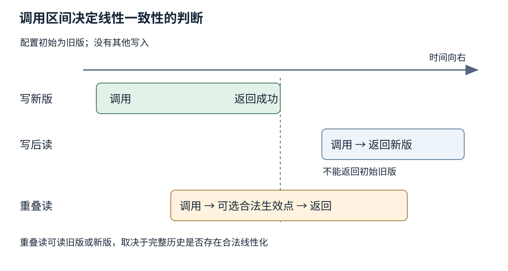
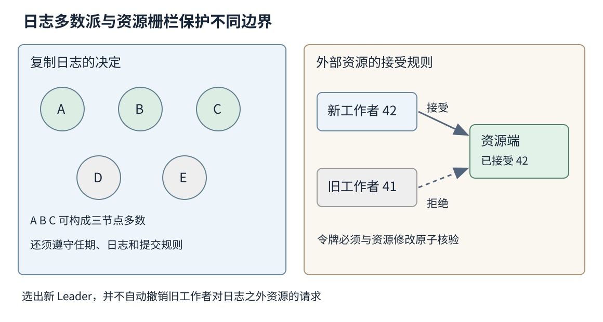
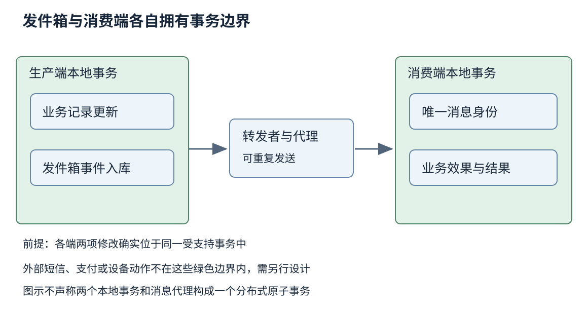

# 第三十四章 分布式正确性与中间件

分布式系统把一项服务交给多台能够独立运行、独立失败的机器。这样做可以扩大容量、缩短用户访问距离，也可以在部分设备停机时保留服务。但“多放一份数据”并不自动得到一个更可靠的整体：两份数据可能先后收到修改，两个执行者可能同时认为自己有权操作，客户端则可能在操作已经完成后收到超时。

第三十三章把网络请求拆成连接、传输与业务完成等边界。本章进一步追问：在这些边界之间发生失败时，系统可以向用户承诺什么？一个订单是否只创建一次，一项配置是否所有读者立即可见，一位失去领导权的工作者能否继续修改数据，都需要可以检验的规则。中间件的价值在于复用一部分规则与机制，而不是替应用取消这些问题。

下面的故障序列、业务标识和数字均为教学推演，不对应真实企业事故或实测结果。原论文采用其固定发表版本；产品行为分别注明文档版本，滚动页面以 2026-10-03 的核验内容为限。本文没有编译、执行服务代码或进行故障注入。

## 34.1 部分失败 时钟 顺序与一致性

### 34.1.1 部分失败让未知成为一种正常结果

在单个进程内部，函数返回值往往能够清楚表达这一调用是否完成；跨网络以后，观察者与执行者之间还有消息通道。**部分失败**指系统的一部分失效，其他部分仍在运行，而且不同参与者对失效的认识可能不同。服务端可以正常提交，而客户端到服务端的回程链路断开；数据库可以正常接收查询，而业务进程被长时间暂停。

设客户端提交操作号为甲的创建请求，等待截止后没有收到结果。此时至少有三种可能：请求没有到达，请求仍在执行，请求已成功但响应丢失。超时只能证明客户端没有在期限内取得答案，不能把三者缩成“创建失败”。如果接口把未知结果当成确定失败，调用者就会采取错误补救，例如重新分配操作号再创建一次。

因此一个可靠接口经常需要区分成功、确定拒绝和结果未知。成功要说明已完成什么；确定拒绝要说明是否保证没有产生副作用；未知则应提供稳定操作号、查询入口或重试规则。把这些状态明确呈现并不意味着体验差，反而能避免用一个看似简洁的错误码掩盖不可恢复的歧义。

排查时也应保留观察位置。同一时刻客户端记录“超时”、代理记录“已转发”、服务端记录“提交完成”，三份记录完全可能同时为真。请求号帮助拼接交互，业务操作号帮助识别同一意图，事务号帮助定位提交；它们的对应关系比统一写成一段“网络异常”更有用。

### 34.1.2 墙上时间与经过时间回答不同问题

**物理时钟**试图描述真实世界时间，但机器之间存在偏差，时钟速率也可能不同。校时还可能改变时间读数的推进方式。把甲机器的发送时间从乙机器的接收时间中直接相减，得到的负数不一定代表协议违背因果，可能只是时钟没有共同基准。

业务记录常需要日期时间，用于审计、到期展示或对外约定；计算本机超时时长则通常需要不会因墙上时间调整而任意倒退的计时来源。即使选择了单调时钟，也必须核对平台对休眠、虚拟机暂停和频率调整的具体规则。“单调”说明读数的顺序性质，不等于任意机器上的计时误差都有同样上界。

时钟同步应当携带误差预算，而不是一个“已开 NTP”的布尔结论。若规则要求租约在真实世界里互不重叠，证明中需要使用时钟偏差或漂移的界；若这些界无法维持，就应暂停依赖该假设的操作，或改用明确的通信确认。不能让监控告警停留在校时服务在线，而业务实际依赖的是更严格的误差条件。

中国工程环境中常见多机房部署、边缘设备和跨云链路，设备型号与虚拟化方式并不一致。统一写入北京时间便于展示，却不会改变分布式排序的数学问题；把 UTC 转成 UTC+8 也不会消除偏差。记录时区与时间单位，和设计正确的排序机制，是需要分别完成的工作。

### 34.1.3 因果关系比时间戳大小更基础

**先发生关系**描述事件之间可证明的因果顺序：同一进程中先执行的事件在前，消息发送在对应接收之前，这些关系还具有传递性。没有任何这类路径连接的两个事件，可以是并发事件。这里的并发表示缺乏因果顺序，并不要求它们在两块钟上显示完全相同的时间。[S1]

Lamport 逻辑时钟用计数器给事件编号；收到带时间戳的消息时，把本地计数推进到足够大的值，再记录接收事件。它保证因果在前的事件具有较小编号，但较小编号不反过来证明因果在前。为了得到确定排序，还可以用节点标识打破相同编号；这个人工全序便于处理，却不是找回了宇宙中唯一的真实先后。

一个实用例子是先创建文档，再发布指向文档的索引。读者若先看到索引、却读不到文档，系统破坏了应用期望的因果可见性。让所有消息都附带毫秒时间戳不能单独修复问题；需要传播依赖版本，或者在索引可见前确保依赖数据已经达到所需读路径。

向量时钟能够表达更多因果信息，但代价与参与者规模、动态成员和元数据回收相关。工程上是否值得使用，要看是否真的需要检测并发版本；若业务本来只允许一个经过共识的写入顺序，引入一整套向量版本可能增加复杂度而没有相应收益。

### 34.1.4 线性一致与顺序一致的差别在真实时间约束

**线性一致性**要求每个操作都能被解释为在调用与返回之间某个瞬间生效，并且形成的顺序符合对象本身的顺序规范。若写入已经返回成功，另一个随后才开始的读取就不能无缘无故退回更早状态。并发重叠的操作仍然可以按任一合法顺序解释，并非要求所有机器始终保存同一内存内容。[S2]

**顺序一致性**也要求存在一个合法的全局顺序，并保持各参与者自身的操作顺序，但通常不要求保持不同参与者之间的真实时间先后。甲写入后返回，乙稍后发起读取，若双方之间没有模型要求保留的额外顺序，顺序一致性可以允许某些在线性一致性下不合法的历史。它不能被简单翻译成“每条消息按顺序到达”。

以单个配置寄存器为例，初始值是旧版。管理员写新版并看到成功，然后另一个客户端开始读取且读到旧版；没有并发新写入时，这与线性一致性不符。若读调用在写返回前已经开始，即使读结果稍晚返回，读到旧版仍有可能合法。判断必须看调用区间，不能只按日志的返回时间排序。

线性一致是对外部历史的约束，不是“每次读必须发给 Leader”的定义。某些实现通过 Leader 协调读，另一些通过法定人数或受证明的读屏障完成。反过来，即使请求打到了自称 Leader 的机器，若它已经失去领导权而不知道，读结果也不一定满足线性一致性。

### 34.1.5 串行化描述事务 而最终一致描述收敛

**可串行化**（也称串行化隔离）讨论多个事务的并发结果是否等价于某个串行执行。一个事务可能操作多个对象，其完整读写关系才是分析单位。单个键的读写都是线性一致的，并不自动使“先读余额、再读额度、最后写入”的多步业务成为一个原子事务；中间仍可能穿插其他操作。

**严格可串行化**在可串行化基础上进一步保留不重叠事务的真实时间顺序。它与线性一致有紧密关系，但讨论范围不同：不能把面向单次对象操作的性质，直接当成任意多对象事务隔离的保证。第三十六章会用读写依赖解释这一区分，不把数据库隔离级别名称当成分布式系统中所有“一致性”的统一刻度。

**最终一致性**通常要求在没有新更新且更新能够继续传播等条件下，副本最终收敛。这个名称本身没有给出收敛期限，也不自动承诺读己之写、单调读或跨键因果关系。两个副本若永远无法交换信息，就没有理由凭空收敛；持续写入时，也不能仅用“最终”承诺某个用户多久看到自己的修改。

读己之写可以通过会话版本、定向读或等待副本追上指定位置来实现。单调读则避免同一会话先看到较新版本、后又倒退。二者都需要处理路由切换与客户端上下文，不是给缓存加一个过期时间就自然成立。接口应说清所提供的具体保证，避免使用没有边界的“强一致”“弱一致”代替规格。

### 34.1.6 CAP 应当落在分区期间的具体操作上

CAP 的经典问题是在允许通信分区持续、消息可能永久丢失的模型里，原子读写对象能否同时保证线性一致性与每个到达未失败节点的请求最终获得符合规范的响应。分区使两侧无法得知对方是否完成写入；若两侧都必须持续独立回答所有请求，就无法对任意历史维持同一个线性一致对象。等待通信恢复可以是现实策略，但在该故障模型中，恢复不能被假定必然发生。[S3]

这里的可用性不是月度成功率，也不是“能够返回一个错误页面”。拒绝请求可以是现实系统保正确性的合理策略，但不能把这种拒绝算作定理中所要求的操作可用性。P 也不是产品经理可以在机房断网时关闭的功能开关；它表达允许的故障环境，问题在于故障出现后仍要保留哪种承诺。

CAP 不能推出“任何系统都必须在三项中固定选两项”，也不能决定没有分区时的全部延迟取舍。一个系统可以让库存扣减等待多数派确认，让商品描述允许陈旧读取，让跨区推荐暂时使用本地结果。真正有意义的设计表应按操作列出不变量、失联时行为和恢复方式，而不是给整个公司系统贴一个 AP 或 CP 标签。

**深度追问：两个读接口分别叫强一致读和最终一致读，怎样判断文档是否足够？** 至少应问清对象范围、并发写入时语义、成功响应的持久化条件、故障时是否等待或拒绝，以及允许陈旧的界。只给形容词，无法据此写历史检查器，也无法确定用户遇到旧值时算故障还是契约允许。

图 34-1 写入返回之后才开始的读，受到线性一致性的真实时间约束；与写入重叠的读则需要依据可线性化位置判断。图中值与时序为教学设计，不是抓取记录。

## 34.2 复制 共识 Leader与分区故障

### 34.2.1 复制先回答复制什么 何时确认

**复制**把数据或操作传播给其他节点。复制完整页面、物理日志、逻辑变更和业务命令，各自携带的语义不同。页面复制接近存储格式，却受版本与布局约束；逻辑变更较便于异构消费，却需要重新解释类型、事务边界和顺序；业务命令若在不同节点重新执行，还必须处理时间、随机数与外部查询造成的不确定性。

同步与异步的区别需要落在响应条件上。某种“同步复制”可能只等远端收到内存数据，另一种等日志稳定写入，还有一种等状态机应用完成。三者对故障恢复和副本读的意义不同。写入已经复制，不等于查询路径已经应用；查询已经读到，也不自动证明系统承诺的故障后持久性。

异步复制让主节点可以较早回答，但主节点失效时，尚未传播的已确认写入可能丢失。切换到一个可连接副本，并不代表切换到了包含所有承诺的副本。恢复点目标应根据复制进度、确认条件与故障模型定义，不能用“有三份副本”替代计算。

Redis 官方复制文档特别区分异步复制与 WAIT 等待副本确认的作用；WAIT 并不会自动把一组实例变成具有强一致故障切换语义的系统，持久化配置也影响已确认写入能否保留。[S4] 这项提醒的普遍价值在于：增加确认人数，只改变机制的一部分，不能代替完整协议证明。

### 34.2.2 共识让参与者对决定达成一致

**共识**解决参与者在给定故障模型下对决定达成一致的问题。复制状态机把一系列经过一致决定的命令按顺序应用到各副本，使其逻辑状态保持相容。它的基础要求包括相同的初始状态与确定性的状态转移；命令若直接读取各节点自己的当前时间，节点即使采用相同日志顺序，也可能得到不同结果。

可以把必要的时间、随机种子或外部判断先作为命令内容确定下来，再进行复制。但这不代表共识层验证了业务事实本身：多个副本一致记录了一个错误价格，仍然是错误价格。共识保证参与者不各说各话，应用仍要负责输入校验、权限和业务不变量。

**安全性**要求不出现禁止的结果，例如同一已决定日志位置不能被不同副本应用为不同命令；**活性**要求系统能继续作出决定。网络很差时宁可暂时停止写入，可以保住安全性，却没有满足及时推进。设计评审要分别问“什么情况下会错”和“什么情况下会停”，避免把两类证明混在一起。

Raft 原论文采用非拜占庭的故障假设，并要求协议依赖的持久状态在规定位置保存。磁盘偷偷丢掉已经承诺持久化的数据、节点任意伪造消息或实现破坏日志规则，都不能靠“使用了 Raft”四个字排除。协议假设是生产环境需要维持的条件，不是论文中的装饰。[S5]

### 34.2.3 任期和日志约束共同限制 Leader

Raft 用任期区分领导阶段，通过投票选举 Leader。Follower 不仅要判断候选人的任期，还要按协议比较日志新旧；如果只按“谁最先发心跳”选主，就可能选出缺失已提交内容的节点。日志匹配、投票限制与提交规则一起支持已提交历史不被改写的性质。

正常写入由 Leader 追加日志、传播并在满足提交规则后推进状态机。需要特别注意，不能把任意旧任期日志条目在多数副本上存在，直接等同于当前 Leader 可以用计数方式宣布它提交。Raft 的提交规则对当前任期条目有额外条件，旧条目可随相应前缀间接得到提交确认。省略这个限定，容易画出看似合理却错误的选举示例。

多数派交集直观上让前后两次决定有共同参与者，但这个参与者还必须携带并遵守必要状态。没有持久投票记录，没有日志新旧限制，或错误地重置任期，交集本身就不能传递正确决定。理解算法不能停在“五台机器取三台”这句算术上。

成员变化也会改变多数派的定义。旧配置和新配置若随意各自生效，可能同时形成互不相交的决定组。应使用具体实现支持且经过验证的配置变更协议，例如原论文讨论的联合配置思路，而不是批量修改所有节点配置后期待它们同时重启。运维工具的变更顺序是协议的一部分。

### 34.2.4 安全不靠快 活性却离不开足够稳定的时机

在原论文模型内，Raft 的日志安全性不依靠消息必须在某个固定毫秒数内到达；严重延迟或错误时钟可以导致无法及时选主、反复选主，却不应该因此提交互相冲突的日志。活性则需要足够多节点可用、消息有机会及时往返，并出现能够维持稳定 Leader 的时期。[S5]

这不意味着超时随便设置。若心跳及磁盘持久化经常比选举等待更慢，健康节点也会反复怀疑 Leader。频繁选主又带来重试、日志追赶和缓存失效，进一步加重延迟。应结合磁盘尾延迟、CPU 饥饿、虚拟机暂停和网络变化调查，而不是看到 Leader 切换就只改网络设备。

反过来，把选举超时扩大到极长，虽然可能减少误判，却延长真实失败后的停顿。合理参数来自目标恢复时间和实际时延分布；原论文中的实验数字是其环境的例子，不是今日跨地域集群的通用设置。跨城多数派把链路延迟引入写入路径，也会改变合适的等待尺度。

假设五个投票节点分成三与二，能通信的三节点一侧有机会继续推进，二节点一侧不能独立完成同样的多数决定。这并不保证三节点侧立刻恢复：还要考虑当前任期、已有日志、磁盘与客户端是否能到达它。故障矩阵应记录“具备必要条件”和“已经观测到恢复”，不能把两者写成同一种成功。

### 34.2.5 法定人数相交还不是完整的读写协议

**法定人数**（quorum）是完成一项协议步骤所需的参与集合。在固定 N 个副本、写 W 份、读 R 份的简化模型中，R+W>N 可以保证这些读写集合存在交集。但它没有单独规定交集成员应返回什么、如何处理并发写、如何比较版本、如何处理只写入少数副本的未完成操作。

考虑三个固定副本甲、乙、丙，读写各需要两份；一个尚未完成的写入只把新值送到甲。第一次读甲、乙并返回新值；它返回后，第二次读乙、丙却返回旧值，而且期间没有其他写入。虽然 R+W>N，两次读仍形成无法线性化的新旧倒退：第一次读已经要求那次写入在其返回前生效，第二次读就不能再回到旧值。若读协议没有必要的传播或屏障机制，交集条件并不能排除此历史。这个例子不证明所有 quorum 协议都错误；它说明集合交集是证明中的部件，而不是完整结论。

真实实现还可能使用临时替代节点、动态成员或不同数据中心的确认策略。原先的 N、R、W 是否对应同一个固定集合，必须重新核对。版本用物理时间戳比较时，还会受时钟偏差影响。把“多数读加多数写”直接写成“任何情况下线性一致”，就是把缺失的协议步骤当成已经存在。

工程选型应阅读产品对特定 API、配置与失败条件的保证，而不是根据复制因子自行推导。读取带历史版本的快照、默认读最新值、允许陈旧的本地读，也可能在同一产品中同时存在。使用哪个接口，决定应用实际获得哪个契约。

### 34.2.6 副本读必须证明读到了合适的提交位置

从 Follower 读可以分担负载，但它可能落后于已提交日志，也可能已经收到日志却还没应用到查询结构。若接口承诺读己之写，可以携带写入返回的位置，并等待副本应用至少到该位置；若承诺更强的线性一致读，还要证明读取对应当前有效的顺序，而不是只满足某个旧会话版本。

即使只从 Leader 读，也有“旧 Leader 不知已经失权”的问题。Raft 原论文的只读处理需要知道已提交前缀，并确认自己仍获多数支持；新 Leader 通过先提交一个当前任期条目取得必要的提交信息，论文使用的是任期开始时的空操作条目。随后还要为只读请求确认多数支持，具体实现中的读屏障应等状态机应用到安全位置。纯本地读取若省去通信，通常需要额外的租约假设与实现约束。[S5]

**Leader 租约**通过有限有效期减少协调开销，但安全证明取决于租约授予、时钟误差或漂移边界、进程暂停以及新 Leader 何时可获得权利。原论文已经指出这种优化会把时间条件引入安全性。不能一边声称“协议正确性完全不依赖时钟”，一边在产品里加入未说明条件的本地租约读。

etcd v3.5 的 API 文档区分默认操作保证与允许陈旧的读取模式，Watch 又有自己的顺序和历史窗口条件。[S6] API 参数叫 serializable，不应因此被解释成任意业务事务都具有本章定义的可串行化隔离；名字相同不等于语义范围相同。本文仅用该固定版本文档说明需要逐接口阅读承诺，不推荐把旧版本直接当作新部署基线。

### 34.2.7 锁服务失效后 资源端仍要拒绝旧工作者

分布式锁通常用于给一段时间内的工作指定所有者，但持有者可能暂停很久，锁租约在此期间过期，新持有者开始工作，旧持有者随后恢复。只在执行前检查一次“我还持有锁”仍有检查与使用之间的空隙。外部文件、设备或数据库不会因为锁服务改变了状态，就自动撤回已经发出的旧请求。

一种常见防线是**栅栏令牌**：每轮所有权具有严格递增的代次，资源端记住已接受的代次，并拒绝更旧的写入。假设新工作者携带代次 42 已被资源接受，旧工作者的 41 即使迟到，也不能覆盖新结果。关键在资源端真正执行比较，而不是把数字只写进日志。

令牌生成与持久保存需要足够可靠，资源侧比较也必须与修改原子结合。若资源不支持该约束，就不能宣称加了一把分布式锁便消除了所有并发写入风险。对于发邮件、驱动物理设备之类外部副作用，还要结合业务操作号、状态查询和人工恢复策略设计，不能把栅栏概念生搬硬套。

**深度追问：共识集群选出了新 Leader，旧 Leader 是否就无法破坏任何资源？** 共识日志内的修改受协议限制；日志外已经发出或仍可发出的动作则需要相应资源端的权限、代次或幂等检查。控制面有一个正确的决定，不等于所有数据面执行者已经同步知道这个决定。

图 34-2 多数派保护复制日志的决定，栅栏令牌保护外部资源对迟到操作的接受。两道边界针对不同问题，不能互相替代。

## 34.3 消息队列幂等 重试 去重与事务边界

### 34.3.1 队列把调用时间解耦 但不会消除业务责任

消息队列允许生产者先交付消息，消费者稍后处理，适合削峰、异步执行和连接不同处理阶段。它把“现在能否完成业务”与“能否保存待办意图”分开，也让积压变成可以观察的状态。不过，队列不创造无限容量；消息保留期限、磁盘空间、消费者处理速率和重放成本仍需共同计算。

一条消息至少经过生产者创建、代理接受、代理达到确认条件、消费者取得、业务处理与消费位置确认。每一步的“成功”都需要说明对象。例如消费确认只告诉代理某条记录可以不再按相同方式投递，并不验证账本或外部设备真的达到了正确状态。

顺序也有范围。一个分区中的追加顺序，不等于跨分区存在共同全序；消息取得顺序，不等于并行任务完成顺序。按订单号分区可以便于同一订单串行处理，但一个超级热点订单仍可能限制单分区吞吐。为了扩容改变分区数时，还要核对键到分区的映射与迁移期间的顺序。

对国内常见的订单、设备事件、日志采集等场景，应先区分命令和事实。命令要求某件事发生，可能被拒绝；事实说明某件事已经发生，消费失败不能把事实本身撤销。把两者都命名为“事件”而不解释含义，会在重试、补偿和审计时制造歧义。

### 34.3.2 至少一次讲的是交付路径 不是无限可靠

**至多一次**允许丢失但不重复交付；**至少一次**承诺在声明的故障模型及存储、重试与保留条件成立时，已接纳的消息最终至少交付一次，但允许重复；**恰好一次**必须进一步说明在哪个边界观察效果。这里的交付不自动等于业务处理成功。自然语言里的“永不丢失”若脱离磁盘损坏、保留期与管理删除等故障范围，就不是有意义的工程承诺。

消费者先确认、后修改业务状态，确认后崩溃可能导致漏处理；先修改、后确认，修改后崩溃可能导致重投递。调整这两行顺序无法同时消除两个窗口。需要让业务状态与处理记录拥有合适的原子边界，或让重复修改具有同样效果。

Kafka 4.0 设计文档把发布持久性和消费处理语义分开，并说明在 Kafka 主题间处理时，事务可以把输出与消费位置更新纳入共同边界；外部目的地则需要相应协作。读取已提交事务的配置与失败后的应用状态恢复，同样是保证的一部分。[S7]

因此“代理支持恰好一次”不能自动证明扣款、短信和第三方接口各只发生一次。正确提问是：输入位置、内部状态、输出结果和外部副作用，哪些被同一协议控制？边界以外如何去重、查询和补偿？只有回答这些问题，语义名称才能转化成业务承诺。

### 34.3.3 幂等键标识同一意图 不能只取请求内容的哈希

**幂等**要求重复执行同一操作不增加预期副作用。把某条记录设置为指定版本的完整内容，可能天然接近幂等；“余额增加一百”则通常不幂等。即使状态最终相同，发送通知、计费或审计次数也可能不同，必须明确哪些效果属于承诺范围。

幂等键通常由客户端为一次业务意图产生，并在重试时复用。两个完全相同的请求参数，有可能代表用户确实想买两件相同商品；只对请求内容做哈希，会错误地合并不同意图。另一方面，同一幂等键带着不同金额再次到来，也不能默默当作第一次的重试，应拒绝冲突并留下可解释结果。[S8]

键还需要命名空间。不同租户或调用方可能使用相同局部编号，因此去重身份可由租户、操作种类与幂等键组合。记录中保留必要参数摘要、状态和结果引用，能够在重复调用时返回与第一次语义相容的答案。返回“已经存在”虽可能避免新增副作用，却未必足以让客户端确认这就是自己要找的结果。

保存期限应覆盖允许的重试、消息重放和灾难恢复窗口。若去重记录一天删除，而消息可以一周后重新消费，旧消息就可能重新生效。无限保存也有成本与数据保留约束，接口应明确定义窗口、过期行为和业务唯一约束，不能把任意 TTL 当作充分证明。

### 34.3.4 在途重复比事后重复更容易暴露竞态

“查询去重表，若不存在就执行业务，再写入去重表”不是安全的并发协议。两个工作者可以同时查到不存在，然后都执行副作用。这里的问题不在查询是否快，而在检查和状态变化之间没有原子性。去重表需要唯一约束、原子插入或等价的并发控制来决定谁获得处理权。

假设业务修改和去重记录都在同一个数据库中，可以让唯一键插入、业务变更与结果记录处于一个本地事务。事务提交前失败，两者都不对外成为完成结果；提交后失败，重试通过去重记录取回结果。数据库的约束与隔离级别仍需核对，不能只在应用内存中放一把锁来保护多个进程。

长任务可能采用“处理中、已完成、需人工核对”等状态，但不能让超时者简单删除处理中记录再开始一遍。原任务可能只是暂停，并没有停止。接管需要代次、租约和资源端防旧写机制，或者把昂贵计算与最终副作用分开，让最终提交仍可原子竞争。

外部副作用尤其困难：本地记录已完成而外部动作失败，会漏执行；外部动作完成而本地记录失败，会重复执行。若外部服务支持稳定幂等键，应把同一键一路传递；若支持查询，未知结果先查询；若两者都没有，就应承认无法仅靠本地事务提供同样强的保证，并定义核对与补偿流程。

### 34.3.5 重试是额外负载 需要预算与终点

重试对短暂故障有用，也会在过载时放大压力。三层调用各自最多尝试三次，在没有协调的坏情况下，下游一次用户意图可能遇到二十七次尝试。这个数字是乘法示例，不是任何框架的默认行为；它揭示应当在完整请求链路上计算尝试预算。

可重试性应由错误类别、操作幂等条件与剩余期限共同决定。参数非法、权限拒绝等确定错误通常不靠重复相同请求解决；临时不可用可能值得退避；超时则先承认结果未知，不能自动换一个新操作号。指数退避和随机扰动有助于减少同步重试，但不会修复错误的幂等设计。

还要限制并发在途尝试。为了降低尾延迟而同时发送多个请求，会主动制造重复执行的竞态，不能只依赖“正常情况下第二个很快取消”。取消可能在提交后到达。只有在读操作安全或写操作有完整去重协议时，才能评估这种策略的收益与成本。

重试应当有业务终点，例如总截止期、最大自动恢复窗口或需要用户确认的新状态。无限循环会把永久错误变成持续费用与积压。死信队列提供隔离与调查入口，但不等于错误已经修复；重新投递前应明确原因、修复版本与去重窗口，避免把同一个毒消息反复灌回主链路。

### 34.3.6 Outbox 解决本地双写 不替外部世界提交

业务常要在修改数据库后发布消息。若先提交数据库再发送，进程可能在中间崩溃，造成有数据没事件；若先发送再提交，事务可能失败，造成有事件没数据。两次独立操作无论怎样排序，都存在不能由本地异常处理完全消除的窗口。

**事务发件箱**（Transactional Outbox）把业务修改与待发送事件记录写进同一个数据库事务。事务成功意味着业务状态与发送意图共同存在；后台转发者再把事件送入消息系统。转发者发送成功但尚未标记完成就崩溃，仍可能再次发送，所以消费者通常还需要幂等处理。[S9]

Outbox 的原子性止于本地事务边界，它没有把数据库、代理和所有消费者突然合成一个全球事务。它提供的是可恢复的发布意图与重试基础。需要进一步监控发件箱最老未发送时间、积压数量、发布顺序和清理水位；若清理任务先于可靠交付删除记录，模式名称救不了丢失的意图。

事务日志变更捕获也可以承担转发角色，但仍要保留事务边界、恢复位置和 Schema 版本。按时间排序多行发件箱记录时，要警惕业务要求的顺序是否确实由该时间字段定义；不同事务分配时间戳和实际提交的次序未必相同。可以按聚合对象的显式版本建立可检验的顺序规则。

跨服务的长事务还可能采用补偿。补偿是一个新的业务动作，例如释放预留，可能失败，也可能因外部世界变化而无法完全恢复原状。它不是数据库回滚的异步同义词。应明确定义每个阶段已产生的事实、可逆条件与人工介入点，而不是把所有异常都丢给一个名叫“补偿任务”的队列。

图 34-3 业务修改与发件箱记录在生产端本地事务内；发送、确认和消费仍可能重复。消费端只有在去重记录与业务效果共享相应原子边界时，才能获得图示的保护。

### 34.3.7 失败诊断应围绕同一业务意图重建历史

出现重复订单时，首先寻找操作号是否在重试中改变、去重记录是否过早过期、唯一约束是否真正存在、业务效果是否落在另一个系统。仅看消息代理中是否有两条记录，无法判断业务应不应该重复；两条不同消息也可能都代表同一个业务意图。

出现漏处理时，检查代理确认是否早于业务提交，消费位置是否与输出原子更新，死信或过期策略是否移除了记录。若问题只在再均衡或工作者接管时出现，重点查看在途任务、旧工作者与提交代次。故障定位要把同一操作在各层的状态连起来，而不是分别看到各服务成功率很高就排除问题。

**深度追问：消费端事务已经提交，确认代理之前崩溃，恢复后怎么处理？** 允许消息再来；通过同一稳定消息身份查询或原子竞争去重记录，得到已完成结果，然后再确认。若业务效果发生在不支持这一事务的外部系统，答案必须继续说明外部幂等或查询协议，不能在“用了事务”处停止。

**深度追问：把所有操作都改成设置最终值，就没有重复问题了吗？** 不一定。旧重试可能把新值覆盖回去，所以还需要版本条件；通知、费用和审计也未必天然幂等。幂等说明同一操作重复的效果，不能替代不同操作之间的顺序控制。

## 34.4 缓存失效 服务治理和跨地域取舍

### 34.4.1 缓存保存可重建结果 却会影响正确性承诺

缓存把代价较高的计算或读取结果放在更近的位置，以减少延迟和源站压力。它常被称为性能组件，但只要用户会读到缓存，它就参与可见性与权限判断。缓存键遗漏租户、语言、权限上下文或版本，可能把正确的数据交给错误的人，命中率再高也没有意义。

**旁路缓存**通常由应用先查缓存，未命中再读源数据并回填。更新源数据后删除缓存，可以减少直接双写不同值的问题，却仍存在竞态：读者先取得旧值，写者提交新值并删除缓存，读者随后把旧值回填。一次删除并没有把所有在途旧读取取消。

可以使用版本标记、带条件的回填、明确的失效序列、较短有效期或根据业务要求重新设计读取路径。每种方案处理的故障范围不同。所谓“延迟双删”只是试图覆盖某个时间窗口，延迟选取若没有可靠上界，就不能证明所有旧请求已经结束。

缓存失效首先应由业务定义允许什么。商品介绍允许几十秒陈旧与权限撤销要求迅速生效，不能共用同一种默认策略。严重影响安全或金额的不变量，通常需要在权威操作路径再次核验，不能因为页面上缓存显示可用就直接授予权限或扣减库存。

### 34.4.2 雪崩 热点和穿透分别来自不同压力形状

许多键同时到期，可能让大量请求同时回源；一个热点键到期，可能让大量相同计算并行发生；大量不存在的键，则可能持续绕过有效缓存。中文工程讨论常用雪崩、击穿、穿透概括这些现象，但诊断仍要记录键分布、到期时间、回源并发和源站容量。

有效期加入随机扰动可以分散同步到期；同一键的在途请求合并可以减少重复回源；负缓存可以短暂记住确定不存在的结果。它们都有边界：随机扰动不解决长期容量不足，请求合并需要防止失败持有者永久占位，负缓存需要区分确定不存在与临时读取失败。

允许服务旧值再后台刷新，可以在源站抖动时保持部分功能，但旧值的最大年龄与适用范围应明确。返回旧商品说明与返回旧账户冻结状态不是相同风险。系统降级必须保留关键不变量，不能让“服务可用”成为继续提供不安全数据的理由。

冷启动也是容量事件。大量实例同时重启，本地缓存同时为空，可能把原来平稳的数据库压成故障。预热应有速率限制与优先级，启动过程不要无条件扫描整个数据集。比较缓存方案时，要把恢复阶段、失效突发与内存压力纳入，不能只比较稳定期命中率。

### 34.4.3 服务治理要限制故障传播 也要保留身份边界

**服务治理**通常包括服务发现、路由、限流、熔断、配置分发和身份控制。它们共同影响一次请求走向哪里、占用多少资源、何时停止尝试。注册中心显示实例健康，不代表实例刚接到的业务请求一定成功；注册表本身也可能过期，客户端必须处理实际调用失败。

配置分发需要版本与生效边界。若一半实例采用新超时，另一半仍采用旧重试策略，整体行为可能比任一单独版本更差。变更应能说明哪些实例已获取、已校验、已生效，必要时保留回退路径。配置 Watch 的消息顺序保证，不自动等于所有消费者同步完成重新配置。

限流保护速率，并发限制保护在途资源，熔断减少继续调用故障依赖。三者如果没有共同预算，也会打架：上游熔断恢复瞬间放入大量探测，下游刚好扩容预热，重试又形成新峰值。可以分阶段恢复、限制探测并发，并依据业务类别保留重要操作的资源。

治理组件还应坚持最小权限。拥有服务发现读权限不意味着能够改写路由，能发布普通配置不意味着能关闭鉴权。控制面错误可能一次影响很多服务，因此审计、变更验证与故障隔离同样重要。把控制面部署成高可用，并不能抵消一条错误配置被一致地传播给所有节点。

### 34.4.4 跨地域设计要同时画延迟和失效域

地域是网络距离与故障相关性的组合，不只是云控制台上的名称。把三个副本放在同一供电或管理故障域中，不能按照三次完全独立故障计算可用性；把它们跨城放置，又会把部分链路延迟放进复制与共识路径。副本数、故障域和确认条件需要在同一张图上讨论。

跨地域同步写可以减少某些地域故障时的数据损失窗口，但写延迟与可用性受必须参与的远端影响。异步跨地域复制可以保留本地写性能，却需要承认切换时可能缺失已确认变更。**恢复点目标**（RPO）描述可接受的数据恢复落后，**恢复时间目标**（RTO）描述恢复服务所需时间；它们不是副本配置的自动产物。

双活也不是一个足够具体的方案。若两个地域对同一库存同时承诺扣减，就需要跨区协调、预分配额度或能够证明安全的合并规则。给冲突记录采用最后写入胜出，可能让状态收敛，却无法收回已经卖出的超额商品。合并数学性质与业务不变量必须一致。

国内多云与异地容灾项目还需核对实际专线、云服务地域能力、数据分类与组织的合规要求。本文不把任何固定云组合视为普遍合法或普遍可用，也不提供具体法律结论。工程设计应让负责的安全与合规角色审阅真实数据流，并把允许的目的地写进部署约束，而不是在技术图完成后才补一行“满足合规”。

### 34.4.5 故障演练验证的是承诺 不是截图里的在线数量

一份有用的故障矩阵应包括单节点停止、节点暂停、单向网络中断、多数派失联、磁盘变慢、旧消息迟到、复制延迟与恢复重放。对每种故障分别规定哪些操作继续、哪些拒绝、哪些可能返回未知，以及恢复后怎样核对不变量。不同故障不应全压缩成“杀掉一个容器”。

正确性验证需要保留调用和返回区间、稳定操作号、结果以及必要的版本。检查器再根据明确定义的对象模型判断历史是否存在合法解释。检查器没发现问题只能支持本次观察范围，不能代替协议证明；测试历史不完整时，尤其不能把日志缺失当成操作未发生。

容量恢复也值得单独观察。积压开始下降，不表示所有过期操作都应该继续执行；副本追上日志，不表示所有缓存都已刷新；新地域接管成功，不表示旧地域已经无法产生副作用。恢复过程通常比“故障已经消失”更需要受控顺序。

**深度追问：系统最终数据相同，是否说明事故已经没有正确性影响？** 不一定。错误通知、重复发货、过期权限访问等历史副作用可能无法从最终数据库快照看出。正确性应同时检查最终状态、过程中的可见结果与不可逆效果，不能用最后一张一致的表格覆盖曾经违反承诺的事实。

分布式正确性的核心不是记住更多中间件名称，而是把承诺写到可以反驳的程度：哪个对象、哪段历史、哪种故障、哪个确认点。如果一项保证只能在正常网络和没有重试时解释清楚，它还没有覆盖系统最需要这项保证的时刻。

## 来源与阅读边界

下列资料于 2026-10-03 实际打开核验。原论文用于定义与机制；产品资料只支持所注明版本或滚动文档的相应边界，不是整套系统的正确性证明。原创例子、图与故障推演没有执行记录。

- S1：[Lamport 逻辑时钟论文][S1]，1978；因果偏序与逻辑时钟
- S2：[Herlihy 与 Wing 线性一致论文][S2]，1990；线性一致与其他正确性条件
- S3：[Gilbert 与 Lynch CAP 回顾论文][S3]，2012；服务模型、安全性与活性
- S4：[Redis 复制文档][S4]，滚动页面；异步复制与 WAIT 限制
- S5：[Ongaro 与 Ousterhout Raft 扩展论文][S5]；选举、提交、成员变化、读取与时间假设
- S6：[etcd v3.5 API guarantees][S6]；KV、允许陈旧读取与 Watch 的不同保证
- S7：[Apache Kafka 4.0 Design][S7]；Message Delivery Semantics 与 Using Transactions
- S8：[AWS Builders Library 幂等 API][S8]；请求身份、原子记录与迟到请求
- S9：[AWS Transactional outbox pattern][S9]；本地双写窗口与重复消息

[S1]: https://lamport.azurewebsites.net/pubs/time-clocks.pdf
[S2]: https://www.cs.cmu.edu/~wing/publications/HerlihyWing90.pdf
[S3]: https://groups.csail.mit.edu/tds/papers/Gilbert/Brewer2.pdf
[S4]: https://redis.io/docs/latest/operate/oss_and_stack/management/replication/
[S5]: https://raft.github.io/raft.pdf
[S6]: https://etcd.io/docs/v3.5/learning/api_guarantees/
[S7]: https://kafka.apache.org/40/design/design/
[S8]: https://aws.amazon.com/builders-library/making-retries-safe-with-idempotent-APIs/
[S9]: https://docs.aws.amazon.com/prescriptive-guidance/latest/cloud-design-patterns/transactional-outbox.html
