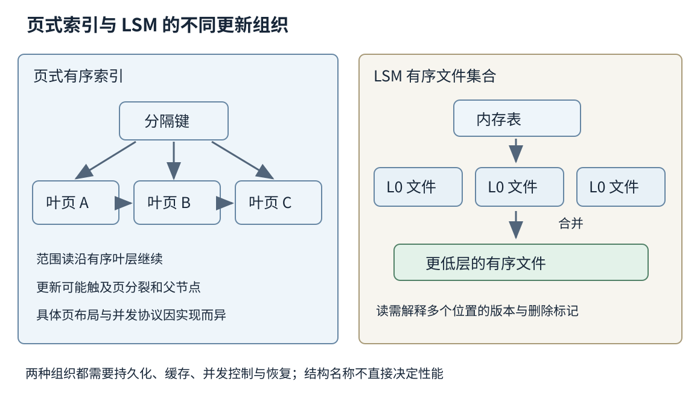
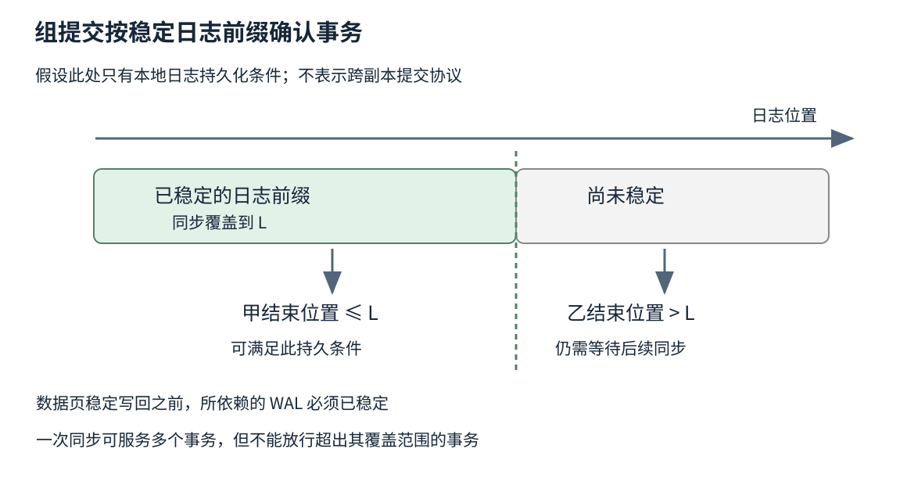
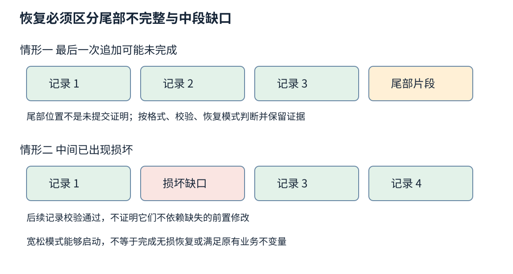

# 第三十五章 存储引擎与持久化路径

存储引擎负责把逻辑上的记录、索引和版本，组织为可以查找、修改并在故障后恢复的数据。上层看见的是“写入一个键”或“提交一笔事务”，下层接触的却是内存页、日志片段、文件元数据、块请求和设备缓存。它们的边界并不重合，这正是存储工程既关乎性能又关乎正确性的原因。

第三十四章讨论副本之间怎样确认同一决定。本章先缩小到一台机器：即使网络没有问题，一个成功写调用也未必表示数据已经进入稳定介质；一份完整文件也未必是数据库能够恢复的有效备份。持久化不是某个函数名的属性，而是一条从业务承诺到硬件行为都有条件的路径。

本文以通用机制为主，PostgreSQL 行为固定参照第17版文档，RocksDB、SQLite 与 Linux 页面注明其滚动资料边界，核验日期为 2026-10-03。容量和时间关系均为教学分析，没有对真实设备进行测试；文中操作顺序不是可直接执行的恢复脚本，也没有编译或执行数据库代码。

## 35.1 磁盘SSD块接口 IO与写放大

### 35.1.1 块设备隐藏了介质 却没有抹平介质差异

**块接口**让上层以逻辑块地址提交读写，而不直接管理介质中的每个物理位置。文件系统在此之上组织文件、目录、空间分配与元数据，数据库再把文件内部组织成页或日志。一次修改几个字节的字段，最终可能触及多个数据库页、日志块以及文件系统元数据。

机械硬盘读取不同位置需要考虑寻道和旋转；SSD 没有相同的机械运动，却仍有读写颗粒度、内部并行、擦除、映射和垃圾回收等限制。不能把“没有磁头”推导为任何大小、任何方向、任何队列深度的请求代价都相同。不同接口协议、控制器、介质和固件也会带来差异。

数据库页大小、文件系统块大小、设备逻辑扇区与内部闪存页，是不同层的单位。它们可能数值相同，也可能不同；数值相同仍不自动意味着原子写入边界相同。声称“一个页不会写坏一半”，必须有对应设备、文件系统和访问方式的明确保证，不能只看页大小可整除。

这一区分有助于诊断：逻辑读取一行，不等于设备只读取这一行；应用记录写入十兆字节，不等于闪存只发生十兆字节写入。先说明计量位置，后面的吞吐、放大率与寿命讨论才有共同分母。

### 35.1.2 SSD 把覆盖写变成映射和回收问题

常见 NAND 闪存不能像普通内存那样任意原地覆盖所有位。设备通常借助闪存转换层，把逻辑地址映射到新的物理位置，旧位置随后成为待回收空间。回收一个擦除单元时，其中仍然有效的数据可能需要先搬走，这些搬迁也消耗写入与内部带宽。

因此连续写入与随机覆盖，不仅影响主机请求排列，也影响设备内部有效数据的混合程度。空闲空间、保留空间、使用历史和写入分布，都会改变回收难度。刚开始向空设备写入的漂亮数字，未必代表接近稳定占用状态后的长期能力。

设备可以通过内部并行处理多个请求，但并行度有上限。大量小请求可能受命令和软件开销限制，大请求则可能占满带宽并影响其他请求等待。一个数据库日志的低尾延迟，与离线导入的最高吞吐，可能需要不同的 IO 组织方式。

写入寿命还应按实际设备规格和负载理解，不能把一种介质的参数推广给所有 SSD。WiscKey 原论文讨论了 LSM 的重复搬运如何影响 SSD，并用键值分离减少某些移动；本章借用其设计动机，不把2016年的实验倍率当作今日设备性能结论。[S1]

### 35.1.3 吞吐 IOPS 延迟和队列深度必须一起看

**IOPS**表示每秒完成的 IO 操作数，吞吐表示每秒搬运的字节数。相同 IOPS 在 4 KiB 与 1 MiB 请求下意味着完全不同的字节量；相同吞吐也可能来自少量大请求或大量小请求。任何比较都应说明请求大小、读写比例、顺序性和完成定义。

**队列深度**是同时在途的请求数量。适度并发可以利用设备内部资源，过量并发则可能主要增加排队时间。若某个教学系统每秒完成一万项、平均在途时间为一毫秒，在满足稳定系统与统计口径一致等条件下，平均在途量约为十项。这是排队关系的估算，不是给所有磁盘设置深度十的建议。

尾延迟还受日志同步、压缩、垃圾回收、检查点和其他租户影响。平均写入很快的设备，也可能在关键同步操作上出现长停顿。测量事务提交时，应包含它实际等待的同步边界；拿仅进入缓存的写入时间替代持久提交时间，会得出不相容的性能比较。

Linux 的多队列块层在软件队列与硬件队列之间分派请求，官方文档明确指出不能依赖块层或设备协议保证请求完成顺序。[S2] 程序先提交甲再提交乙，并不意味着甲必然先稳定完成；持久化依赖必须通过相应同步和顺序机制表达。

### 35.1.4 写放大需要沿路径逐层记账

**写放大**是相对于某个逻辑写入量，实际发生了多少额外写入。存储引擎可能写 WAL、数据页、索引与压缩结果；文件系统可能写日志和元数据；SSD 还可能搬移有效闪存页。不同工具报告的放大率，分子分母可能停在不同层。

设教学工作负载提交 1 GiB 有效键值，存储引擎因日志和合并向文件系统写出 5 GiB，设备内部最终编程量为 8 GiB。引擎对业务的放大是五倍，设备内部相对于主机写入是 8/5 倍，端到端则是八倍。不能把来自不同时间窗口或不包含相同数据范围的倍率直接相乘。

读放大描述为回答一次逻辑读取而访问的额外数据或结构；空间放大描述保存当前有效数据需要多少额外空间。它们常常相互牵制。更积极合并可以减少读取路径中的候选文件，却增加写入；保留更多旧版本有助于快照与恢复，却增加空间和扫描负担。

账本还应包含短时峰值。合并先生成新文件，再切换元数据，最后回收旧文件，意味着过渡期需要同时容纳两份。磁盘看似还剩百分之几，不一定足以完成下一次关键合并。容量告警应考虑可完成维护所需的余量，而不只是当前有效数据大小。

### 35.1.5 从写入接受到持久完成存在多个台阶

应用缓冲、操作系统页缓存、设备易失缓存和稳定介质，对进程崩溃、操作系统崩溃与断电的反应不同。数据离开进程堆内存，可以提高抗进程崩溃能力，却不意味着整个机器断电后仍在。持久性承诺必须说明面对哪种故障，以及设备是否兑现同步请求。

Linux 的 write 成功报告已写入的字节数，不直接提供数据已经持久的保证；fsync 则要求将对应文件的修改同步到存储设备，并等待设备报告完成。软件仍依赖文件系统、驱动、设备和部署配置的正确实现，不应把一层调用成功扩展为超出硬件故障模型的绝对保证。[S3]、[S4]

电池或电容保护缓存可以改变哪些状态在断电后可恢复，但需要明确产品规格、健康状态与实际配置。控制器有缓存不等于缓存有断电保护；云盘在客户端看来是块设备，其后还可能有网络复制与服务约定。不能从接口外观推断内部保护方式。

选择提前确认或异步持久化并不必然错误，例如可重建缓存可能允许丢掉最近更新；错误在于沿用更强的成功承诺却悄悄改变完成条件。性能优化记录应该把承诺变化与实现优化分开，让使用者知道换到了什么、放弃了什么。

### 35.1.6 存储瓶颈也可能在设备之外

数据库报告 IO 等待，不一定意味着设备带宽已经用尽。线程可能在等待日志互斥、队列槽位、压缩、文件句柄或配额；远端块设备还可能受到客户端限额和网络影响。反过来，CPU 使用率不高也不能排除压缩或单线程瓶颈，聚合平均值可能掩盖一个忙核。

排查应把提交速率、同步等待、块请求延迟、队列长度、后台合并和空闲空间放在同一时间线上。若每次延迟突增都伴随合并积压与写暂停，直接增加前台并发可能更糟；若块设备闲着而日志锁竞争明显，换更快磁盘也未必有效。

**深度追问：把 HDD 换成 SSD，为什么查询仍然很慢？** 先判断查询是否仍读了过多数据、是否被锁或 CPU 限制、是否发生远端请求或缓存失效。SSD 改变底层访问代价，不会自动修复错误计划、低选择性索引或不必要的全表扫描；这些问题将在下一章继续展开。

## 35.2 B+ Tree LSM Tree Bloom Filter与Compaction

### 35.2.1 页式索引把树高换成每次访问的信息量

B+ Tree 是面向有序查找的多路平衡结构。内部节点保存分隔键和子节点位置，叶节点保存索引项及相应记录或定位信息；按键有序组织的叶层便于范围访问。实际产品的页布局、叶链接和记录存放方式可以不同，不能凭一种示意图断言所有数据库有相同物理结构。

相对于二叉树，多路节点把更多分支放进一次页访问，降低树高。较大的扇出减少层数，却要求比较器、页内查找、缓存局部性和更新成本协同设计。根页与高层页常被缓存，实际一次查询的设备读取量未必等于树的全部高度。

索引键也需要空间。长字符串、重复前缀、附带列和指向数据的定位信息，都会改变一页能容纳多少项。主键若被多个二级索引携带，主键变长还可能放大整组索引。讨论索引成本不能只数“建了几个索引”，要看键宽、记录数与访问分布。

范围扫描通常先定位起点，再沿有序叶层前进。它避免对每一条记录都从根重新搜索，但未必避免后续回表：如果所需列不在索引里，仍要访问相应数据页。索引有序与数据页物理连续是不同性质，随机回表可能成为主要成本。

### 35.2.2 页分裂需要同时维护结构与恢复规则

一个页装不下新增项时，树可能分裂，把部分项移到新页，并更新父节点。父节点又可能满，结构变化向上传播。删除与整理也可能产生页合并或回收。读者看到的逻辑树在不断变化，而存储只提供分阶段写入，因此并发控制与崩溃恢复必须共同维护可达性。

不能先把父节点指向一个尚未有效保存的新页，再假定断电不会发生；也不能回收仍被读者使用的旧页。具体算法可以采用页面闩锁、旁路链接、版本或日志等组合，但都需要清楚区分短暂的结构保护与事务级隔离。下一章讨论的记录锁，不等同于这里保护内存页结构的锁。

插入顺序影响页占用和热点。递增键可能集中修改右侧叶页，便于局部写入，却可能形成并发热点；随机键分散修改，可能使工作集更大。为减少分裂预留页内空间，会增加初期空间占用，是否划算取决于未来更新分布。

因此“B+ Tree 适合读、LSM 适合写”只能作为提问起点。两者都可能被缓存、批处理和实现优化大幅改变表现；页式结构在写密集负载下也可能很好，LSM 的点查也可能很快。选择需要比较完整负载和维护成本，而不是把结构名当作性能排名。

### 35.2.3 LSM 把更新组织成多个有序层

**日志结构合并树**（Log-Structured Merge Tree，LSM Tree）把新更新先放入内存结构，并通过日志保护需要持久的部分；内存结构达到条件后刷成不可变的有序文件，后台再逐步合并。读取需要在内存与相关文件中寻找对当前快照有效的最新版本。[S5]

这个路径把许多零散更新批量化，能减少某些直接随机页修改，但代价并没有消失，而是移动到以后。相同键可能在多个文件里存在多个版本，查询要解释它们的关系；后台合并需要读取并重写数据；删除也常先留下删除标记，而不是立刻抹掉所有旧值。

内存表、不可变内存表和 SST 文件是不同状态。内存表被标记不可变，只表示不再接受修改，并不意味着已经持久；文件写出来，也不意味着它已经被可靠地纳入引擎当前版本。文件集合通常还需要清单或等价元数据说明哪些文件构成有效状态。

一条写入若绕过 WAL，只进入内存表，可能在崩溃后丢失；若 WAL 已满足承诺，即使对应 SST 尚未生成，也可能通过重放恢复。理解这一区分，才能解释为什么前台提交不必等待每次数据合并，以及为什么日志清理必须等到相应数据和元数据真正可恢复。

### 35.2.4 Bloom Filter 用少量空间排除不可能命中的文件

**布隆过滤器**（Bloom Filter）用位数组与散列，把集合成员查询变成廉价的预筛选。对正确构建、正确读取且未损坏的标准过滤器，回答“不在”可以排除相应集合；回答“可能在”仍需查真正数据。它允许假阳性，不应在这些前提成立时产生假阴性。

LSM 点查可能需要考虑许多文件，过滤器可以减少对不存在键的无效读取。它不直接返回值，也不负责判定当前快照应采用哪个版本；一个文件包含旧版本，并不代表这个键的旧值应该对当前读者可见。过滤器与版本选择、删除标记解释属于不同步骤。

误判率与位数、键数量和散列配置有关，增加过滤器内存也会挤占块缓存或其他元数据。若大部分查询本来就命中，额外过滤器访问未必总能降低总成本；若过滤器本身不在内存，还要计算读取过滤器的代价。RocksDB 官方文档还讨论了为 CPU 局部性组织过滤器的权衡，不能只套理想独立散列公式估算真实成本。[S6]

构建遗漏键、比较器与过滤器编码不一致、错误删除共享位或数据损坏，都可能破坏“不漏掉已存在项”的前提。读路径不应把一个未经校验的过滤器当成业务真相。范围查询需要的也是另外的范围裁剪或相应过滤机制，普通整键 Bloom Filter 不能直接回答任意区间是否为空。

### 35.2.5 Compaction 是长期服务能力的一部分

**合并整理**（Compaction）把多个有序文件合并为新的文件集合，并在安全条件下移除不再需要的版本。按层整理通常努力减少同一层范围重叠；分层累积再合并则可能减少部分重复重写，但保留更多候选数据。不同策略在读、写、空间放大之间选择不同平衡。[S7]

合并不是只有空闲时才做的可选清洁。如果前台持续产生新文件，而后台长期跟不上，读取候选文件增加、内存表刷盘受阻、空间余量下降，最终必须让写入减速或暂停。短时插入基准若在合并债务尚未显现前结束，就可能夸大可持续吞吐。

后台线程越多也不必然越好。合并需要 CPU、压缩缓冲、读带宽和写带宽，与前台查询共享资源；过量并发可能让提交尾延迟变差。调节需要观察积压量、预计工作量、层级大小和前台 SLO，而不是简单追求所有后台线程一直满载。

RocksDB 的 Write Stalls 文档明确列出内存表、L0 文件与待合并字节等压力来源。[S8] 本章不推荐具体阈值，重点在诊断顺序：先分清哪一种积压触发保护，再判断是资源不足、配置失衡、热点分布还是暂时突发。禁用保护只可能让系统更晚以更严重的形式失败。

### 35.2.6 删除标记和快照决定旧数据何时能消失

若新层只记录“删除键甲”，旧层还保存键甲的旧值，读取必须尊重删除标记，否则旧值会复活。合并过程中只有在确定相关旧版本不会从其他未覆盖文件中重新出现，并且没有需要这些版本的快照时，才能安全移除相应标记或数据。

长时间快照会保留历史可见性，也会延迟空间回收。一个只读导出任务看起来不修改任何记录，却可能让大量旧版本长期存在。这种成本不是读取本身的字节数能够解释的，需要将快照年龄、版本保留和后台回收进度放在一起观察。

键值分离让索引中只保存键与值的位置，可以减少合并时搬动大值，但值日志又需要回收，范围访问可能变成分散取值。WiscKey 就围绕这些问题提出设计。[S1] 引入这种结构应同时考虑回收一致性、读放大与备份边界，不能只引用“写得更少”作为全部评估。

数据在逻辑上删除，也不必然表示底层介质每份旧字节立即被物理覆写。快照、备份、副本、日志和设备内部映射都可能保留内容。涉及数据删除政策时，需要明确逻辑不可访问、保留期结束和介质处置各自的要求，不把一次 SQL 删除或合并完成当作所有层面销毁的证明。

图 35-1 页式索引维护可导航的树页，LSM 维护内存与多个有序文件版本。图示突出更新组织差异，不把任何一种结构直接标为性能赢家。

### 35.2.7 选择结构要写出负载与比较前提

比较引擎时应说明键和值的分布、点查与范围扫描比例、覆盖更新与新增比例、删除率、数据规模相对内存的比例，以及持久化条件。均匀随机键与极少数热点键可能导向不同结果；大值与小值也会改变压缩和合并的主要成本。

还应说明稳态与恢复态。某结构初始导入快，却在持续更新后产生高合并成本；另一结构稳定读取好，却在缓存冷启动时慢。只有覆盖生命周期，性能数字才对容量规划有意义。数据库从空库导入、运行数月和从备份恢复，不应被当成同一种实验。

**深度追问：Bloom Filter 没有假阴性，是否意味着数据库不会漏读？** 这个性质只约束正确过滤器对其对应集合的成员判断。错误路由、漏刷文件、清单损坏、快照选择错误或权限过滤错误，仍然可以让整体数据库漏读。局部结构的性质不能替代全路径正确性。

## 35.3 WAL Checkpoint崩溃恢复和校验

### 35.3.1 WAL 先保存恢复依据 再允许数据页越过持久化边界

**预写日志**（Write-Ahead Logging，WAL）记录足以在失败后恢复状态的信息。其核心顺序约束是：让某项数据页修改稳定落盘之前，恢复这项修改所需的日志必须先达到相应稳定条件。上层事务可以在日志满足提交承诺后返回，而不必立即把所有修改过的数据页写回。[S9]

日志可以记录物理变化、逻辑操作或二者结合，恢复过程也可以使用重做、撤销或版本过滤等不同方法。不能把某种数据库的日志格式直接当作 WAL 定义；WAL 定义的是重要的顺序关系，具体记录内容由恢复算法决定。

**日志序号**（LSN）用于标识日志中的位置。页面可记录已经反映到哪个日志位置，恢复时据此判断是否需要重做某项变化。这个做法帮助避免重复重放造成额外修改，但必须与日志记录语义一致：不是每个业务动作天然可以通过再执行一次达到相同效果。

WAL 与操作日志、审计日志也不同。打印一句“修改完成”通常不具备完整的恢复信息、记录边界和同步规则，不能作为崩溃恢复依据。审计关心谁做了什么，恢复日志关心如何从不完整物理状态重建有效状态；有些系统会关联它们，但职责不应混淆。

### 35.3.2 提交记录和组提交决定谁可以收到成功

事务在内存中完成修改，不等于已经提交。引擎需要根据协议记录提交决定，并让所需日志前缀达到持久条件，才可向要求持久提交的客户端报告成功。日志持久位置必须与每个等待事务的结束位置关联，不能因为“刚做过一次 fsync”就释放所有等待者。

**组提交**把多个事务的日志合并到同一次同步中。若同步稳定覆盖到位置 L，那么结束位置不超过 L 且满足其他提交条件的事务可以一起被唤醒。这摊薄同步开销，却不要求每个事务独占一次设备刷新。正确性依赖覆盖范围，而不是同步调用次数。

分组等待会引入额外排队，因此组越大并非越好。低负载时刻意等满大批次可能增加响应时间；高负载时允许适度聚合则可能提高有效服务率。还要防止一个事务同步失败时，其他事务仍被误报成功。错误路径与成功路径都需要按同一持久前缀判断。

异步提交是另一种契约：可能先报告提交，再让日志稍后稳定。它不等同于完全关闭恢复机制，但已返回结果可能在特定崩溃后丢失。产品选项应按固定版本文档解释，不能把“数据结构不会损坏”与“所有已确认事务都不丢失”当成一件事。

### 35.3.3 短写与目录同步是持久化协议的细节

一个 write 调用可以只写入请求的一部分；程序必须检查实际字节数，继续处理剩余范围，并区分中断、空间不足与 IO 错误。直接把返回非负当作整条日志已保存，会产生截断记录。多线程共享文件偏移或把一个记录拆成多次调用时，还要防止记录片段交错。[S3]

把语言运行库缓冲刷新到内核，不等于把内核缓存同步到设备。Linux fsync 对文件内容及相关元数据执行同步，但它不自动保证包含该文件的目录项也稳定。创建新文件、替换清单或重命名后，目录的持久化责任必须单独考虑；需要的具体顺序依赖操作、文件系统与平台。[S4]

一个常见设计思路是先完整写出新清单文件并核验写入，同步文件，再以原子命名空间操作替换名称，随后同步相关目录。但这只是需要审查的协议骨架，不是跨平台通用代码；还缺少错误恢复、同文件系统条件、并发访问、旧文件回收与目标文件系统语义。

重命名的原子可见性与断电后的持久性不同。读者在运行中只看见旧名或新名，不意味着断电后必然保留新名。类似地，文件已经关闭也不是持久化成功证明。SQLite 的原子提交文档展示了为什么存储软件必须显式陈述硬件与文件系统假设；本章不把其中针对其实现的假设推广为所有设备事实。[S10]

### 35.3.4 Checkpoint 缩短恢复路径 不是简单清空日志

**检查点**（Checkpoint）记录一个可用于减少重放工作量的恢复基点。系统可能把一定范围内的脏页推进到稳定存储，并保存恢复所需元数据；并发事务和新写入仍可能继续发生。检查点不必意味着在某一瞬间把所有东西完全冻结并复制一份。

若检查点太稀疏，恢复需要重放更多日志，日志空间也更大；太频繁则可能造成更多页面写回与 IO 峰值。PostgreSQL 17 文档说明检查点与 WAL 量、脏页写回和恢复时间之间的关系，还讨论全页写入对页面部分写入的保护。[S11] 这些是具体实现行为，不能因此说所有引擎都采用相同检查点算法。

一个检查点记录存在，不等于其声称的依赖文件都已可靠保存。发布检查点应当在必要数据和元数据满足条件之后；日志截断也必须等待没有其他恢复、复制、备份或快照使用者需要该范围。只看主库已经检查点完成，可能误删仍被落后副本或备份链依赖的日志。

维护机制之间会相互施压。检查点集中写脏页，可能与 LSM 合并、归档和备份抢 IO；过大的脏页量还会使系统在内存压力下突然刷盘。平滑维护需要预算与观察，不能只追求前台短时跑分，把所有欠账留到不可控时刻。

### 35.3.5 恢复解析首先要确定哪些字节构成有效记录

崩溃时日志尾部可能只保存了头、部分负载或缺少结束信息。日志格式通常需要长度、类型、校验和、序号或分片规则帮助识别边界。解析器读取长度之前先检查剩余字节，检查长度后再决定分配和读取，不能因日志“由自己写出”就跳过不可信输入处理。

文件尾部的不完整追加，与中间位置的损坏不同。尾部可疑字节可能来自尚未完成的最后一次写入；中段损坏则可能意味着已承诺历史缺失或介质问题。没有协议依据就跳过中段继续重放，可能让后续记录基于不存在的前提执行，得到看似能启动但逻辑错误的数据库。

RocksDB 的 WAL Recovery Modes 明确区分容忍尾部、绝对一致、按时间点恢复与跳过损坏等策略；文档也提醒，容忍尾部是一种启发式，系统不能单凭位置区分真实损坏和未完成写入。[S12] 这意味着“恢复成功”要附带使用的模式和丢弃范围，不能把宽松恢复的结果包装成无损恢复。

恢复过程中若再次崩溃，下一轮也应有定义明确的起点。重做应避免重复产生错误效果，恢复元数据更新也需要自身的持久化顺序。真正健壮的恢复协议要能承受恢复中的失败，而不是只证明从正常运行崩溃到第一次重启的那一段。

### 35.3.6 校验能发现某些错误 不能证明内容真实

**校验和**用较短摘要帮助检测数据传输或存储中的改变。CRC 适合发现多类偶然损坏，但不是密码学认证，也不能证明数据来自正确作者。攻击者如果可以同时修改负载与校验字段，通常也可以生成与错误内容相符的 CRC。

校验覆盖范围必须明确。只检查负载可能漏掉把正确负载放到错误页位置的情况；把页面身份、版本和长度纳入检查，可以帮助检测更多错位问题。但计算时数据已经错误、校验和也按错误数据产生，事后校验仍会通过，所以完整性检查不能替代上层不变量验证。

检测与修复也是两项能力。发现一个页损坏，需要可靠副本、备份或可重建信息才能恢复；多个副本若同步复制了同一逻辑错误，副本数量再多也未必提供正确答案。PostgreSQL 17 的数据校验文档说明其检查作用，本文不把开启校验描述为自动修复或防篡改机制。[S13]

故障后应保存证据与原始介质副本，避免反复使用会重写现场的修复选项。决定跳过记录或接受部分数据时，需要业务负责人理解丢失范围；恢复工具的“继续”按钮可能改变正确性承诺。日常工程可以提前准备恢复演练，但不能把生产数据上的破坏性试验当成普通诊断。

### 35.3.7 恢复后可见仍然不等于已重新稳定

恢复程序可能先在内存中重建索引，随后就允许查询。此时查询能够看到某个值，只证明当前运行实例能解释它，不必然证明刚形成的恢复状态已经全部稳定。若恢复依赖的原始日志尚在且可靠，系统也许能再次重建；若过早删掉日志，而新数据尚未稳定，第二次崩溃就可能丢失恢复依据。

因此开放读取、允许新的写入、发布检查点、删除旧日志与报告恢复完成，应按具体协议排序。不能因为一次 SELECT 返回了期望记录，就立即清理所有旧材料。用于生产验收的“恢复成功”通常还要包含结构检查、业务不变量、持久化状态与后续备份能力。

图 35-2 组提交以已经稳定的日志前缀为依据。事务乙的结束位置超出同步覆盖范围时，不能借事务甲的同步完成提前获得持久成功响应。

**深度追问：为什么日志里看到了提交记录，事务仍可能不算已持久提交？** 观察位置可能只是页缓存，记录还可能不完整或未满足配置的复制条件。需要知道有效记录边界、稳定日志位置与实际成功承诺；文本能够读到并不能单独回答这些问题。

**深度追问：恢复时尾部坏了，直接截断可以吗？** 必须依据引擎格式与恢复模式确认可丢弃范围，保留原始证据，并核查是否涉及已确认历史。尾部位置只是线索，既不是“必然未提交”的证明，也不是忽略任何校验错误的许可证。

图 35-3 尾部不完整记录与中段缺口需要不同的恢复判断。后续记录校验通过，也不能证明跳过前面损坏记录后仍满足事务依赖。

## 35.4 Buffer Pool Page Cache冷热分层与备份恢复

### 35.4.1 Buffer Pool 保存可解释的数据库页

**缓冲池**（Buffer Pool）是存储引擎管理的页或块缓存。它不仅保存字节，还管理页面身份、使用计数、脏状态、替换信息和并发保护。页被某个操作固定使用期间不能随意回收；最后一个使用者离开后，才有机会成为替换候选。

干净页可以在需要时重新读取，脏页则包含尚未写回的数据。淘汰脏页之前，需要遵守 WAL 顺序并处理写回结果，不能把“从缓存删除”当作无副作用释放内存。持续产生脏页的速度超过后台刷写能力，会让前台读取也被迫等待可用页面。

替换策略试图保留未来可能使用的数据，LRU 只是其中一种近似。全表扫描如果把所有扫描页都晋升为热点，可能驱逐真正频繁使用的小工作集。入场策略、扫描隔离、频率估计与冷热队列，可以减少这种污染，但都需要记录元数据与付出额外成本。

缓存命中率也有分母问题。大量廉价命中掩盖少量昂贵未命中时，整体命中率很高，用户仍然很慢。应分别观察请求类别、字节命中、块类型和等待代价，不能把一个总百分比作为缓存设计唯一指标。

### 35.4.2 引擎缓存和操作系统缓存可能保存不同表示

**页缓存**（Page Cache）由操作系统管理文件内容，缓冲池或块缓存则由引擎管理数据库语义。在压缩文件场景中，操作系统可能保存压缩字节，引擎保存解压后的块；它们看起来缓存了同一数据，实际却消除不同成本。简单相加或简单判为“浪费两份内存”都可能失真。

使用缓冲 IO 时，引擎读取可经过操作系统缓存；使用直接 IO 则可以绕开某些缓存路径，但仍受对齐、文件系统支持、请求大小和完成语义约束。直接 IO 不等于数据自动持久，也不等于所有内核与设备缓存都不存在。它改变的是特定路径，不是移除了整个存储栈。

RocksDB 的 Direct IO 与 Overview 文档讨论了块缓存、压缩表示及操作系统缓存的关系。[S5]、[S14] 本章不把其选项外推到其他引擎；实际设置前需要测量内存分布、压缩 CPU、读放大与工作负载，尤其不能只因数据库内存看起来多就盲目启用直接 IO。

内存预算还要包括连接、查询排序、哈希表、日志缓冲、过滤器与运行库。把机器总内存几乎全部交给缓冲池，可能迫使其他部分换页或触发资源限制。PostgreSQL 17 的资源文档也说明共享缓冲与操作系统缓存并存，以及某些工作内存按操作而非整个服务器计算的特点。[S15]

### 35.4.3 冷热分层应按访问价值而非文件年龄机械划分

热数据是对当前负载重要且频繁访问的数据，不一定是最近写入的数据。一张很早生成的权限表可能持续被读取，而刚写入的历史附件可能长期无人访问。按时间迁移适用于某些明显的时间序列负载，但不能当作所有场景的冷热定义。

分层可以发生在内存、SSD、HDD 与对象存储之间，也可以在不同压缩强度和索引粒度之间。越冷的一层通常需要接受不同的访问代价，但元数据、目录和热点索引仍可能需要留在较快层。数据对象迁移完成，不意味着相应查询规划已经知道它的实际位置与成本。

迁移过程需要处理读取、更新和失败。先复制数据，再验证可读取与版本一致，最后切换权威位置并回收旧副本，是需要实现细节支持的一般思路；如果先删旧副本而复制尚未可靠完成，分层就变成数据损失。状态迁移本身也要有可恢复记录。

成本比较应包含取回、请求、网络与重建费用。把冷数据放到低单价介质，却让每天的分析扫描反复全量取回，可能比保持热层更贵。应根据实际访问形状建立账本，价格与服务限制则按供应商、地域和核验时点单独确认，本章不提供易过期的价格数字。

### 35.4.4 复制不能替代具有时间隔离的备份

副本有助于应对部分硬件故障，却可能立即复制误删除、错误更新或恶意加密结果。**备份**的价值包括保留独立时间点与独立恢复材料，让系统可以回到错误传播之前。若所有副本与备份都受同一个可删除凭据控制，保护范围也比数量看起来小。

逻辑备份导出逻辑对象，便于跨部分版本或结构迁移，但可能耗时并需要额外重建索引；物理备份保存存储表示，恢复可以更贴近原系统，却更依赖版本、格式和完整文件集合。二者没有脱离目标的绝对优劣，需说明恢复粒度、兼容性与验证方法。

不停机复制一批数据文件，不一定得到某个一致时间点：前面文件可能来自较早状态，后面文件来自较晚状态。在线备份协议通常需要快照或日志配合，证明这组材料能够恢复成有效数据库。文件都复制成功与数据库可恢复，是不同的验收条件。

PostgreSQL 17 的持续归档文档把基础备份与必要 WAL 连续链结合起来支持时间点恢复；增量备份还会依赖此前的备份材料。[S16] 这里引用固定版本的机制，不给未经环境核对的生产恢复命令。真正执行时还需确认实例身份、时间线、密钥、配置和保留链。

### 35.4.5 恢复目标决定备份链如何保留

RPO 关注恢复能够落后多少，RTO 关注多久重新提供所需服务。备份频率、日志归档延迟、文件传输速度、日志重放量和索引重建时间共同影响它们。每天有一份备份，不自动意味着最多丢一天；若备份已坏或缺少必要密钥，实际恢复点可能更早，甚至无法恢复。

保留策略必须理解依赖图。删除一个旧基础备份，可能使后来的一串增量备份失去基础；删除一段归档日志，可能在看似连续的时间范围中留下无法跨越的缺口。清理任务应以“哪些材料仍被任何保留恢复点依赖”为依据，而不只按文件修改日期排序。

恢复演练应在隔离环境中进行，防止恢复实例误连生产队列、发通知或覆盖正式数据。演练读取成功之后，还应核对对象数量、关键业务约束、抽样校验和代表性查询，并记录使用的备份身份与恢复截止位置。演练本身也不能未经授权扩大敏感数据的访问范围。

一个合理的恢复报告会区分材料验证、引擎启动、数据核对与业务接入，每一步都有证据。只截一张数据库进程在线的图，不足以证明客户可以安全继续工作；反过来，一条核对失败也应明确影响范围，而不是笼统宣布全部数据损坏。

### 35.4.6 持久化设计最终要经得起第二次故障

存储系统的重要问题经常藏在交叉处：检查点完成但目录未同步，备份文件存在但日志缺段，页面校验正确但引用了错误版本，缓存里能读到但恢复依据已经删除。单个组件的成功标志，不能替代完整恢复链。

设计审查可以沿一条业务写入逐步追问：何时对其他事务可见，何时允许向客户端确认，何时抵御进程崩溃，何时抵御机器断电，何时被复制，何时进入可恢复备份。某些产品会让几个边界重合，另一些不会；关键是把实际条件写清，并在相应条件上观测。

**深度追问：有 WAL、三副本和每日备份，还会丢数据吗？** 会有超出各自保护范围的失败，例如异步确认后主副本共同丢失、误删同步扩散、备份链或密钥缺失。三个名词表示三组机制，不表示所有故障都被覆盖。应把故障相关性、确认点、保留时间与恢复验证放在同一份证据中。

存储工程师真正维护的是一组可以兑现的承诺：数据能够被解释、被找回、被及时访问，并且维护成本不会无限积累。下一章将这些页、日志与版本装进数据库执行流程，讨论一个 SQL 查询怎样变成计划，又怎样在并发事务中得到正确结果。

## 来源与阅读边界

以下来源于 2026-10-03 实际打开核验。固定论文和版本文档用于限定事实；滚动 Wiki 不代表已锁定某个二进制实现。图、算术与失败序列均为原创教学推演，无存储基准测试或断电测试结果。

- S1：WiscKey，FAST 2016，键值分离、写放大与回收权衡；不引用论文性能倍率
- S2：Linux blk-mq 官方文档，多队列与完成顺序边界
- S3：Linux write(2)，短写与写入完成语义
- S4：Linux fsync(2)，文件同步、目录项及错误
- S5：RocksDB Overview，内存表、文件、块缓存和压缩表示
- S6：RocksDB Bloom Filter，过滤器作用与空间、CPU权衡
- S7：RocksDB Compaction，合并策略与放大取舍
- S8：RocksDB Write Stalls，后台积压与写入保护
- S9：PostgreSQL 17 WAL Introduction，预写顺序与日志恢复
- S10：SQLite Atomic Commit，文件系统与设备假设
- S11：PostgreSQL 17 WAL Configuration，检查点和全页写入
- S12：RocksDB WAL Recovery Modes，尾部启发式与不同恢复模式
- S13：PostgreSQL 17 Data Checksums，数据校验的检测用途
- S14：RocksDB Direct IO，缓存路径与配置范围
- S15：PostgreSQL 17 Resource Consumption，缓存和内存预算
- S16：PostgreSQL 17 Continuous Archiving and PITR，基础、增量与WAL依赖

[S1]: https://www.usenix.org/system/files/conference/fast16/fast16-papers-lu.pdf
[S2]: https://docs.kernel.org/block/blk-mq.html
[S3]: https://man7.org/linux/man-pages/man2/write.2.html
[S4]: https://man7.org/linux/man-pages/man2/fsync.2.html
[S5]: https://github.com/facebook/rocksdb/wiki/RocksDB-Overview
[S6]: https://github.com/facebook/rocksdb/wiki/RocksDB-Bloom-Filter
[S7]: https://github.com/facebook/rocksdb/wiki/Compaction
[S8]: https://github.com/facebook/rocksdb/wiki/Write-Stalls
[S9]: https://www.postgresql.org/docs/17/wal-intro.html
[S10]: https://www.sqlite.org/atomiccommit.html
[S11]: https://www.postgresql.org/docs/17/wal-configuration.html
[S12]: https://github.com/facebook/rocksdb/wiki/WAL-Recovery-Modes
[S13]: https://www.postgresql.org/docs/17/checksums.html
[S14]: https://github.com/facebook/rocksdb/wiki/Direct-IO
[S15]: https://www.postgresql.org/docs/17/runtime-config-resource.html
[S16]: https://www.postgresql.org/docs/17/continuous-archiving.html
