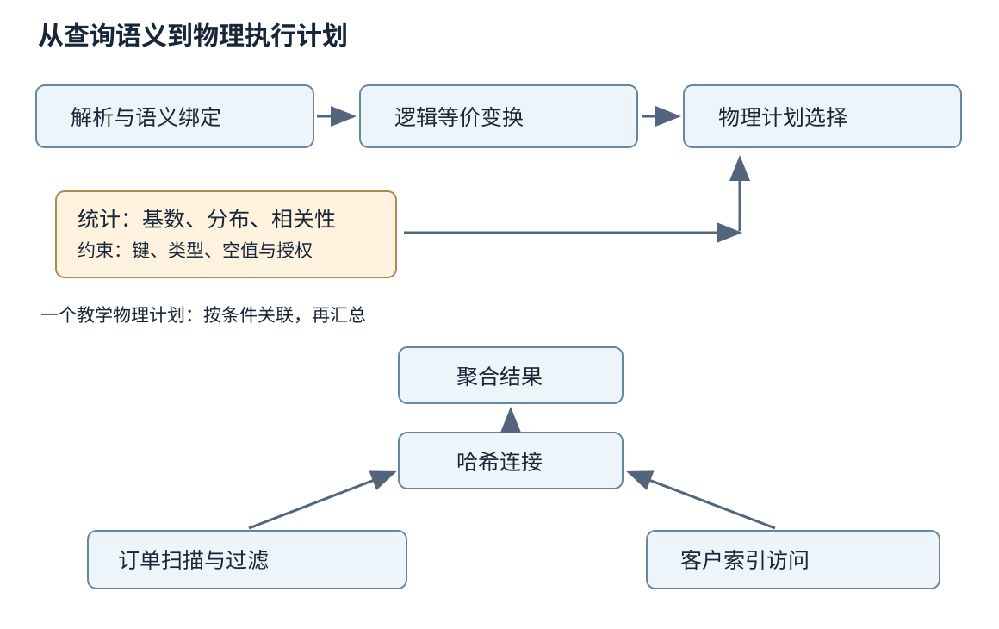
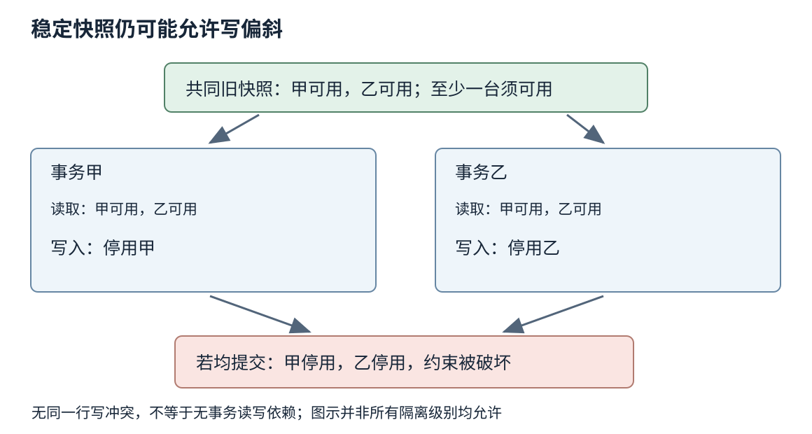
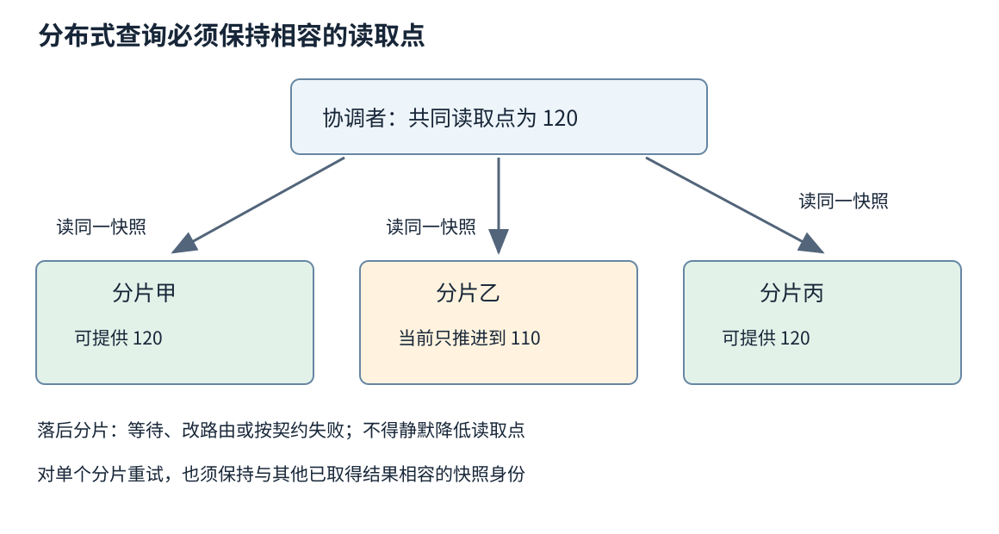

# 第三十六章 数据库内核与查询执行

数据库把数据组织、查询表达、并发访问和持久化组合成一种服务。使用者描述想得到哪些记录、怎样关联和汇总，系统再决定从哪些页读取、按什么次序执行、为并发事务保留哪些版本。数据库内核的困难在于：逻辑上等价的执行方法，资源代价可以差很多；看起来各自正确的事务，并发以后又可能破坏共同约束。

第三十五章说明了树、日志、缓存和恢复。本章把它们放进 SQL 的完整生命周期。一个慢查询可能来自估算错误，也可能来自锁等待；一个错误报表可能来自连接语义，也可能来自多个分片不共享快照。先分清这些层次，才能避免用“加索引”“换引擎”回答所有问题。

实现事实固定以 PostgreSQL 17 和 MySQL 8.4 InnoDB 文档讨论隔离行为；DuckDB、TiFlash 与 Spanner 的资料按实际打开的滚动页面解释机制，不宣称最新版本或通用默认值。核验日期为 2026-10-03。文中关系、计划和事务历史为教学构造，没有执行 SQL、启动数据库、编译执行器或进行性能测试。

## 36.1 关系模型 SQL解析计划与优化

### 36.1.1 关系模型约束意义 SQL还要处理重复与空值

**关系模型**用属性、元组与关系表达数据及其联系。模式规定字段及其类型，键帮助区分实体，约束表达哪些状态合法。把订单和订单明细分开，再用明确键关联，比把所有信息塞进一个不断增长的文本字段，更容易检查引用关系与更新影响。

SQL 的实际语义不应直接简化成数学集合。许多查询默认保留重复行，去重需要显式语义；连接两侧同一键出现多行时，结果可能按匹配组合扩大。若左侧有两条、右侧有三条同键记录，普通等值内连接可能得到六条组合，而不是自动“合成一条”。这个教学计数来自连接定义，不是某数据库的异常。

NULL 也不是零或空字符串，它使许多比较得到未知结果。WHERE 保留条件为真的行，未知通常不会被保留；因此用普通等号比较空值，不能代替专门的空值判断。聚合对空值的处理、唯一约束如何对待空值等细节还需按运算和产品核对，不能只背一句“NULL不参与比较”。

连接的意义决定哪些优化合法。左外连接需要保留没有匹配的左行，在右表条件放入 ON 与放入 WHERE，可能产生不同结果：后者可能滤掉补空的行。PostgreSQL 17 的表表达式文档用明确语义区分这些位置。[S1] 查询重写首先是等价性问题，然后才是性能问题。

### 36.1.2 解析成功只是理解查询的第一步

**词法与语法解析**把文本组织成语法结构，发现括号、关键字和表达式组合是否合法。接下来还需要名字解析与语义分析：表名指向哪个模式中的对象，列名属于哪张表，运算符接受什么类型，函数重载选择哪一个，以及隐式类型转换是否存在。

一个字符串形式合法的查询，仍可能引用不存在的列，或把文字日期交给不合适的比较。不同会话的搜索路径、时区、排序规则和参数类型，也可能让相似文本产生不同含义。排障记录只保存 SQL 模板而丢掉这些上下文，有时无法复现问题。

PostgreSQL 17 的解析阶段文档区分原始解析树与后续语义变换，并说明后者需要目录信息。[S2] 这解释了为什么解析阶段不只是把字符串拆成单词，也解释了 Schema 变更为什么可能影响已经准备好的语句或缓存计划。

参数化查询让参数作为数据处理，有助于避免把用户输入拼成语法；它仍不自动解决授权、超大输入和昂贵查询。允许用户选择排序列或表名时，标识符也不能随意当成普通参数占位符。数据库接口的安全边界与执行计划的资源边界，需要同时设计。

### 36.1.3 逻辑变换必须保留完整语义

**逻辑计划**描述筛选、投影、连接、聚合等关系运算；**物理计划**选择索引扫描、哈希连接、排序以及数据交换等具体执行方式。优化器可能先把过滤尽量推近数据源，再枚举连接顺序与访问路径，最终形成可执行计划。[S3]

过滤下推能减少后续处理的数据，但不是所有过滤都能任意移动。外连接、窗口函数、LIMIT、具有副作用或不稳定结果的函数，都可能限制变换。某个表达式提前求值还可能提前触发错误，是否允许取决于语言与产品规定。优化规则必须保留对用户可观察的结果，而不是只在常见数据上看起来相同。

投影裁剪减少不需要的列，能降低内存与网络成本；聚合提前执行则需要证明分组和连接不会改变计数。若订单金额被一对多明细连接重复展开，先求和与连接后求和可能不是同一件事。优化器能使用主键、唯一性与外键等信息，但前提是这些约束确实成立并被系统识别。

书写 SQL 的顺序也不等于物理执行顺序。把过滤条件写在前面，不意味着它必然先执行；使用子查询不必意味着系统会先物化它。理解计划应看优化后的算子与依赖，避免通过排版位置猜测成本。

### 36.1.4 基数估算是成本模型最容易失真的输入

**基数**在计划讨论中通常指某个算子预计输出多少行，**选择率**描述过滤后保留的比例。连接、排序和哈希表的成本，都依赖这些估计。把实际百万行估成几十行，可能让优化器选择反复做小范围探测，最终执行成大量随机访问。

统计信息可以包含总行数、不同值数量、常见值、空值比例与直方图。它们是数据的摘要，可能来自采样，也会随着数据变化过期。PostgreSQL 17 文档说明 ANALYZE 所维护的统计与估计方式，以及扩展统计对列间依赖的作用。[S4] [S5]

列间相关尤其重要。省份与城市并不独立，订单状态与完成时间也不独立。若简单把两个过滤比例相乘，就可能高估或低估组合条件。热门用户和冷门用户还可能有完全不同的结果规模，相同参数化模板不必适合同一计划。

诊断时先找估计与实际偏差首次显著扩大的算子，再向其输入追问。更新统计有时有用，但若偏差来自表达式、相关列或复杂连接，仅反复运行统计收集不一定解决。需要知道模型遗漏了什么信息，而不是把“统计已更新”当成正确计划的证明。

### 36.1.5 成本最小意味着在候选和模型内最小

成本模型把页访问、CPU 运算、排序、网络和其他资源转换成可比较的估计。成本单位一般不是直接的毫秒；参数和假设可能只是相对权重。优化器选择预计便宜的候选，不是在所有可能算法中证明了真实运行时间的全局最优。

连接表数量增加时，枚举全部顺序会迅速变贵，因此优化时间本身也是预算。有些系统对复杂查询采用启发式搜索或限制候选，避免规划比执行还慢。计划质量、规划成本和可预测性之间存在取舍，不能只要求“优化器应该自动找到最好”。

缓存状态、存储设备、并行可用资源和数据倾斜都会影响真实成本。为一次特殊查询调整全局代价参数，可能改变大量无关查询的计划。更稳妥的分析应把问题限定在工作负载与证据范围内，比较改写、索引、统计或资源配置分别改变了哪一项假设。

计划缓存也有生命周期。复用计划减少规划开销，却可能把适合典型参数的路径用到极端参数；Schema 和统计变化又可能触发重新规划。遇到“同一句查询有时快有时慢”，应保存参数分布、计划身份、缓存状态与等待信息，不要立刻断言数据库随机失常。

### 36.1.6 EXPLAIN 是观察工具 但执行型观察有副作用

普通 EXPLAIN 描述规划结果；带执行分析的形式可能真正运行语句。PostgreSQL 17 明确说明 EXPLAIN ANALYZE 会执行查询并收集实际行数与时间，因此修改语句及调用函数的副作用也可能发生。[S6] 在生产环境中，它不是天然只读的查看按钮。

计划应从数据流与调用次数一起读。一个内层节点每次返回一行，但被外层调用十万次，总工作并不小。PostgreSQL 的相关输出中，实际时间与行数在多次循环场景下按每次执行平均报告，需要结合 loops 理解；父节点时间又可能包含子节点，不能把整棵树的所有时间简单相加。[S6]

还应观察缓冲命中、实际读取、排序是否溢写、哈希分批、过滤掉的行以及计划之外的锁等待与客户端传输。执行分析本身有测量开销，而且不一定包括把全部结果发送给用户的时间。一个在服务器内部很快产生大量结果的查询，用户仍可能因网络和反序列化等待很久。

**深度追问：计划里出现全表扫描，是否一定缺索引？** 不一定。表很小、需返回多数记录、索引访问会大量随机回表，或者顺序扫描能更有效并行时，全表扫描可能合理。先看过滤比例、返回列、物理访问量与实际时延，再判断增加索引是否减少总成本。

图 36-1 查询先经过语义确定与等价变换，再选择具体算子。统计误差影响物理选择，却不能改变查询必须返回什么结果的契约。

## 36.2 执行器 Join向量化与索引选择

### 36.2.1 执行器把算子连接成数据流

**执行器**负责启动算子、请求或推送数据、管理中间状态，并在完成、取消或错误时回收资源。经典逐行迭代模型让父算子向子算子取下一行，组合简单；但逐行函数调用、类型判断和分支，也会在大量数据上积累开销。

批量模型一次传递一组值，摊薄接口成本，并让相同操作在相近内存上反复执行。它可以采用拉取或推送方式，也可以与流水线和任务调度结合。不要把“向量化”“列式存储”“推式执行”当成同一个概念：一个行存系统也可以批量执行，列式数据也可能被低效地逐行处理。

某些算子可以边读边输出，例如简单过滤；排序、部分聚合和构建哈希表则可能需要先积累状态。阻塞算子打断流水线，使内存和首行延迟变得重要。为了只取少量结果而添加 LIMIT，也未必能绕过此前必须完成的全量排序或全局聚合。

取消是执行器的一部分。客户端停止等待后，扫描、网络交换和临时文件仍可能存在。算子需要安全检查取消、传播错误并释放资源，同时不能破坏已进入提交阶段的事务。第三十三章关于异步生命周期的原则，在数据库执行树里同样适用。

### 36.2.2 三类连接算法各自利用不同条件

**嵌套循环连接**对外侧每条记录寻找内侧匹配。若外侧很小、内侧有高效索引，它可以很便宜；若两边都大且内侧需要反复扫描，成本可能急剧增长。重点不是看到 Nested Loop 就判错，而是看外侧实际行数、内侧访问方法和重复次数。

**哈希连接**通常为一侧的连接键建立哈希结构，再用另一侧探测，适合可按哈希处理的等值条件。构建侧大小、重复键分布、内存上限和溢写策略决定成本；哈希值相同还需要比较真实键，不能把散列碰撞当成连接相等。

**归并连接**利用两侧按连接键排序的输入推进，能够高效处理许多有序数据。若输入原本无序，排序成本需要计入；若某个键两边都有很多重复项，仍要生成相应组合，不能把线性推进误解成输出规模永远线性。输出本身很大时，任何正确算法都无法凭空不处理这些结果。

优化器还会考虑半连接、反连接及其他变体。问“某类连接最快”通常缺少条件；更有价值的问题是当前算法利用了什么性质，这个性质是否由实际数据满足，以及计划估算在哪一步低估了工作。

### 36.2.3 内存不足时溢写改变整条执行路径

排序可以先生成内存中排好的段，写到临时存储后再归并；哈希连接可以按哈希分区，把超出内存的部分写出再处理。**溢写**让查询有机会在有限内存下完成，却把更多读写、编码和调度加入关键路径，不是免费的安全网。

一个查询包含多个需要内存的算子，还可能有多个并行工作者。每个算子的上限若被误当作整个查询或整个服务的总上限，并发后内存需求会远超预期。资源预算应覆盖同时活跃的算子和会话，并为其他系统组件留空间。

数据倾斜会使平均估算失效。某个连接键占据大部分记录，按该键哈希分区后，一个工作者可能承担绝大多数数据。简单增加分区数未必拆得开这个热点，需要针对重键、分区策略或算法改变处理。把问题归因于“某台机器慢”，可能漏掉输入本来就不均匀。

临时文件也有配额、目录、权限和剩余空间。查询溢写失败时，应区分资源不足与数据损坏；调大内存可能暂时减少临时文件，但同时提高其他查询遭遇内存压力的概率。正确调优应比较全服务的成功率与尾延迟，而非只让一个查询独占更多资源。

### 36.2.4 向量化减少解释成本 SIMD只是可能使用的工具

数据库中的**向量化执行**通常是对一批同类型值进行处理。它可以把类型分派移出逐值循环，复用常量，使用选择向量表示哪些位置仍有效，并将空值状态单独保存。DuckDB 官方执行格式文档描述 Vector 与 DataChunk，以及平坦、常量、字典等不同物理表示。[S7]

这与第五章的硬件 SIMD 相关但不等同。批量循环可能被编译器或手写实现映射成 SIMD，也可能因字符串、分支或数据依赖而仍采用标量操作。反过来，逐行框架内部也可能在某个算子中使用 SIMD。不能只看产品宣传出现“向量”就断言每个步骤都执行同一类硬件指令。

批量大小影响缓存、调用摊销、首批结果延迟与暂存空间。较大的批次可以减少接口次数，但可能超出有效缓存或让取消响应变慢。字典编码可避免复制重复值，却需要额外间接访问；何时展开为平坦数组，是另一项取舍。

向量化也不修复逻辑错误。空值掩码、溢出处理、字符串排序与浮点语义必须和普通路径一致。为追求快而跳过某类边界值，会使查询在少量数据上正确、大规模或特殊输入时错误。优化应该在同一语义契约内比较。

### 36.2.5 索引选择取决于可用条件和访问范围

索引把某种访问模式变便宜，同时增加写入、空间与维护成本。组合 B-tree 索引按键序组织，前导列的约束通常决定能够直接缩小多少扫描范围。PostgreSQL 17 文档具体说明，前导等值条件以及第一个非等值列上的范围条件，可以限制相应扫描区间；更右侧条件仍可能用于过滤，而不一定缩小同样的区间。[S8]

这个规则应连同版本、索引类型与实现优化阅读，不能凝固成“没有最左列就绝对不能使用索引”。即使可以扫描整个索引，也未必比扫表便宜；其他索引类型或后续版本也可能有不同策略。判断要看实际访问路径，不要只背一个脱离上下文的口诀。

表达式、隐式转换和排序规则也会影响索引条件能否匹配。某个日期字段被包在函数里，已有普通索引未必能直接提供所需区间；一个字符串比较若采用不同排序规则，也不能随意复用另一种次序。可考虑重写谓词或相应表达式索引，但必须保持边界和时区语义。

**覆盖索引**保存查询所需列，有机会减少回表；但是否真正免去数据页访问还取决于可见性检查。PostgreSQL 17 的 Index-Only Scan 文档明确解释了可见性映射的作用：索引含全部列，并不保证每一候选项都无需访问堆页。[S9] 不同存储布局的数据库不能照搬这一具体机制。

### 36.2.6 索引维护和查询收益必须算同一本账

为每种查询新增一个索引，可能让单条读更快，却让所有写入维护更多结构，并增加 WAL、缓存竞争与备份体积。宽覆盖索引尤其可能复制大量负载。线上方案应计算读收益与写路径成本，而不是只在开发机上比较一条 SELECT。

索引还可能改变锁定与执行顺序，因此性能变更有时也影响并发行为。一个之前顺序扫描的更新，改成索引访问后，锁获取顺序可能变化；若业务依赖未经保证的执行次序，死锁形状会随之改变。必须把查询计划与事务设计放在一起审查。

**深度追问：加了索引，计划仍不用它怎么办？** 先核对谓词是否兼容、估计是否合理、回表规模和缓存条件，再检查索引成本是否真低。强制使用只适合有证据的受控诊断或经过评估的方案；它可能掩盖统计问题，也可能让未来数据分布下的性能更差。

**深度追问：查询很慢，但每个算子都显示很快，漏了什么？** 可能遗漏多次循环、等待锁、跨节点交换、队列时间、结果序列化或客户端读取；也可能错误相加或误读统计单位。需要从用户看到的起止点往里拆分，而不是只盯住计划树中的一个最大数字。

## 36.3 事务隔离 MVCC锁和死锁

### 36.3.1 事务把一组变化放进共同的成功失败边界

**事务**把若干操作组织成一个逻辑单元。原子性关心变化是否整体完成，持久性关心提交后在约定故障下能否保留，隔离性关心并发事务彼此能观察和影响什么。ACID 中的一致性常指约束与合法状态，不应直接替换为第三十四章的副本线性一致性。

数据库可以自动维护声明的唯一性、引用等约束，但它不知道未表达的业务规则。例如“至少有一台可接受任务的工作节点”若只存在于需求文档，系统不会自动阻止两个事务分别关闭不同节点。业务不变量需要由约束、隔离、锁或其他协议明确保护。

事务边界也影响外部世界。在事务里调用第三方接口，数据库回滚并不会回滚对方已经完成的动作。反过来，长时间等待外部响应会占住连接、版本和锁。第三十四章的发件箱与幂等协议，正是为了处理数据库事务之外的交付。

自动提交容易隐藏边界。多条语句依次执行，不代表它们自然属于同一个事务；连接池归还连接后，也不能假定下次借出仍保留同一个会话状态。应用需要明确何时开始、提交、回滚，以及异常后连接是否可安全复用。

### 36.3.2 MVCC 用多个版本表达谁能看见什么

**多版本并发控制**（Multi-Version Concurrency Control，MVCC）为数据保留版本和可见性信息，使读者能依据快照看到合适状态，而不是总与当前写者争夺同一份可变内容。实现可以把版本放在不同记录、链或撤销结构中，不能把一种产品布局当作 MVCC 唯一定义。

快照需要知道哪些事务或时间点的变化对自己可见。一个新版本已经存在于内存或磁盘，不代表当前读者可以使用它；未提交事务的变化通常还需要排除，自己事务的变化则可能可见。存储位置、提交状态与读者快照共同决定结果。

版本读减少某些读写阻塞，并不意味着没有锁。两个事务修改同一行仍需冲突处理，结构维护和唯一检查也有并发约束。MVCC 也不自动提供可串行化：稳定地读到一个旧快照，仍可能基于该快照作出与另一个事务冲突的决定。

旧版本回收受活跃快照影响。长时间不结束的事务即使暂时不运行查询，也可能保留资源或阻止回收，具体取决于是否已取得相应快照与产品实现。排查膨胀时，应查看事务年龄和快照持有，而不只看当前活跃 SQL 数量。

### 36.3.3 隔离级别名称必须连同产品版本阅读

SQL 隔离级别用允许或禁止的现象描述最低要求，产品可以提供更强行为。PostgreSQL 17 文档明确指出，其 Read Uncommitted 按 Read Committed 行为实现；Repeatable Read 不出现该文档定义的幻读，但仍可能发生串行化异常。[S10] 因此“可重复读一定有幻读”不是跨产品正确的结论。

PostgreSQL 17 的普通 Read Committed 查询按语句取得快照，连续两次查询可能看到其他事务新提交的结果。Repeatable Read 则在事务首个非事务控制语句处确定相应快照，并在后续查询中使用；写入若碰到某些并发已更新行，可能需要中止并重试整个事务。不能把 BEGIN 语句的墙上时间简单当成所有情况下的快照建立时刻。

MySQL 8.4 InnoDB 的默认隔离级别是 Repeatable Read，其一致性非锁定读使用相应事务快照，而加锁读、更新和删除的访问规则不同。对范围搜索，next-key 与 gap 等锁定机制会影响其他事务插入；唯一索引的唯一搜索又有更具体规则。[S11] [S12]

这意味着同一事务中普通查询与加锁查询可能基于不同的可见状态，不能把“我刚才 SELECT 看见了它”当作随后更新的全部依据。InnoDB 的普通一致性读通常在事务第一次此类读取时建立快照；显式一致快照启动方式还需按相应接口核对。本文不把 PostgreSQL 的快照时机移植给 InnoDB，也不把 InnoDB 的间隙锁解释成所有数据库防幻读的共同机制。实现比较必须固定版本、语句类别和事务设置。

### 36.3.4 写偏斜说明稳定快照仍可能破坏共同约束

设教学系统有工作节点甲和乙，要求至少一台保持接收任务。事务甲读取快照，见两台都可用，于是把甲设为停用；事务乙也读取相同旧状态，于是把乙设为停用。它们更新不同记录，没有直接覆盖彼此的字段，最终却可能两台都停用。

这种模式称为**写偏斜**：事务的写集合不同，但各自决策依赖另一事务修改的条件。在允许该历史的快照隔离实现中，“没有丢失更新”和“每个事务读到稳定快照”仍不足以保护跨行约束。完整判断需要考察读写依赖，而不只是是否同时写同一行。

一种办法是把相关不变量转成可被原子约束保护的共享资源，例如受控的容量记录；另一种是对必要范围按一致协议加锁，或者使用可串行化隔离并正确处理重试。选择哪种取决于约束结构、并发量和产品能力，不能简单要求给所有读都加一把全表锁。

仅给将要修改的自己的行加锁，未必保护“至少一台可用”这个跨行事实。若涉及当前不存在的记录，锁住现有行也不一定阻止新行加入条件范围。谓词与范围保护正是为了覆盖这些由“满足某个条件的集合”定义的依赖。

图 36-2 两个事务读取同一合法快照，再更新不同记录，可以构造出违反跨行约束的结果。此图描述允许写偏斜的隔离条件，不宣称所有数据库、所有级别都接受该历史。

### 36.3.5 锁保护的对象和持续时间决定行为

记录锁保护特定记录上的访问，范围或间隙相关机制可以保护潜在插入位置，表级锁则约束更大对象。还有保护缓冲页、哈希桶等内部结构的短期闩锁，它们与事务锁在目的和寿命上不同。日志写着“lock wait”，需要继续确定是哪个对象、哪个层次。

共享与排他只是理解兼容性的起点，实际产品存在更多锁模式及升级规则。读者若先拿较弱锁，再等待升级，多个事务可能互相阻塞。为了减少竞态而随意扩大锁范围，又会降低并发并延长尾等待。应当以不变量所需的最小正确范围设计，再测其代价。

锁的释放时机也重要。事务级锁通常与事务完成相关，某些会话级建议锁则可能跨越事务；PostgreSQL 17 的显式锁文档明确区分建议锁的会话与事务作用域。[S13] 连接池复用时，如果应用忘记释放会话级状态，下一个借用者可能继承意外行为。

数据库自动加锁同样可能死锁，应用没有手写 LOCK 并不能排除。索引维护、唯一约束、外键检查与多行更新都可能产生锁依赖。诊断应查看真实等待图和事务语句，而不是只搜索代码里是否出现某个加锁关键词。

### 36.3.6 死锁恢复应重试事务决策 而非只重跑最后一句

死锁意味着等待依赖形成环：甲持有资源一等待资源二，乙持有资源二等待资源一，或更多事务构成更长环。数据库可以检测环并中止一个参与者，让其他事务继续；也可能通过超时等策略结束等待。被中止的对象不应由应用随意猜测。[S13]

预防的一项常见方法是让相关事务按一致的资源顺序取锁，并尽量缩短事务中与一致性无关的等待。但索引与内部锁也会影响实际次序，因此这不是所有死锁都被数学消除的保证。保留完整错误处理仍然必要。

如果一个事务被要求回滚重试，通常需要从获取决策依据的起点重新执行。只重跑最后一条 UPDATE，可能继续使用已经过时的余额、库存或资格判断。重试应有次数、退避和业务期限，并沿用第三十四章定义的稳定操作身份，避免提交结果未知时制造第二次业务操作。

捕获死锁异常后继续在已失败事务中发送后续语句，行为因产品而异，可能全部失败或产生错误流程。连接归还池之前必须明确结束状态。把数据库错误统一转换为“稍后重试”而不保留事务是否已经终止的信息，会把恢复路径变成新的错误来源。

### 36.3.7 可串行化可能通过中止保持正确性

可串行化不要求数据库真的把所有事务一个接一个运行。实现可以并发执行，在锁或依赖检测中阻止不合法历史，并在必要时让某些事务失败重试。吞吐和延迟取决于冲突形状，不能单凭隔离级别名称判断一定慢多少。

PostgreSQL 17 使用可串行化快照隔离机制检查可能导致异常的依赖，其 SIReadLock 记录读依赖，并不像普通互斥锁那样直接阻塞写者。[S10] 因此看到名字包含 Lock，不能直接推出它参与普通锁等待死锁。不同数据库也可能使用不同实现，不应把这一行为推广为可串行化的定义。

应用仍需正确处理串行化失败，而且事务内外的副作用要可重试。可串行化保护数据库中参与相应事务的读写关系，不会自动将事务外缓存、消息或第三方支付纳入同一个串行世界。完整业务协议依然需要明确边界。

**深度追问：把隔离级别升到最高，所有正确性问题就解决了吗？** 它可以消除相应模型中的并发异常，但不能修复错误 SQL、未表达的外部副作用、错误权限或数据损坏。还要核对哪些操作真正处在该事务内，重试是否完整，以及产品所保证的对象范围。

**深度追问：可重复读已经防止幻读，为什么还不等于可串行化？** 幻读只是某类重复查询集合变化；串行化约束完整事务历史。写偏斜等跨事务读写依赖可以在每个事务都看到稳定集合时发生，因此不能用一项现象是否出现替代完整隔离证明。

## 36.4 分布式查询 HTAP及正确性验证

### 36.4.1 分布式计划把数据移动也变成算子

数据库横向分片后，查询不只选择本地扫描和连接，还要决定在哪里计算、如何交换数据。**分区裁剪**尽量只访问有关分片；**下推**让过滤或聚合靠近数据；**Shuffle**按键重新分发，使需要关联的记录抵达同一执行者。网络字节数与协调开销因此进入成本模型。

小表广播到多个节点，可以避免大表重新分区，但需要把每个接收者的内存和总网络量算进去；两张大表按同一键分布时可以减少交换，但不同查询未必共享这个优势。分布规则应服务重要工作负载，不能为了一个查询让所有其他写入和访问变差。

局部聚合后再全局合并，适合具有可分解状态的聚合。求平均时，不能简单平均各分片平均值，因为分片行数可能不同；应携带总和与相应非NULL值的计数等足够信息，再做正确合并；全部为空时还要保留SQL的空值结果，而不是除以零或强行返回零。[S18]不同层次的去重、近似算法与空值规则也必须保留语义。

分布式执行的完成时间还常受最慢任务限制。数据倾斜、热点分片、冷缓存与任务重试，会让平均工作者利用率看起来不高，却仍有长尾。扩大集群并不保证按比例加速，特别是当协调器、全局排序或输出带宽仍是单点瓶颈时。

### 36.4.2 一份查询结果需要相容的快照

如果查询先从分片甲读取转出前的余额，又从分片乙读取转入后的余额，可能看到一个从未真实存在的总额。每个分片单独返回已提交数据，不等于组合结果对应同一个数据库快照。跨分片只读也需要版本协调，不能因为“没有写”就忽略一致性。

一种设计是为查询确定共同读取时间或快照身份，并让各分片提供该点可见的数据。副本若尚未推进到所需位置，就需要等待、改路由或按契约失败；不能在查询中偷偷用不同新旧程度的快照拼接。时间戳如何生成、比较以及与提交顺序衔接，是完整协议的一部分。

Spanner 的官方资料讨论 TrueTime 与外部一致性之间的关系，重点是带不确定性的时间接口与事务协议协同，而不是单纯“所有机器时钟同步就强一致”。[S14] [S17] 其他数据库可以采用不同时间和顺序机制，不能把某系统的硬件条件视为分布式事务的唯一实现。

查询重试也要保持快照范围。某个分片响应丢失后，如果只重试这一分片却拿到了更新快照，其结果可能与已经缓存的其他分片输出不相容。应依据执行框架的快照和重试协议处理，必要时重新执行完整查询；不能只以“结果行数看着差不多”验收。

### 36.4.3 跨分片原子提交与隔离是两项责任

**两阶段提交**把参与者是否准备好与最终提交决定分开，旨在让多个参与者对同一事务共同提交或回滚。准备阶段的持久状态、协调者决定与恢复查询共同决定故障后怎样继续。它解决原子提交问题，不自动解决所有并发事务的隔离问题。Spanner 的官方读写路径资料也将跨分片提交协调与相应锁定、验证过程分别说明。[S17]

一个事务可以被原子地提交到多个分片，但其他事务仍可能用不合适的快照读出违反隔离要求的结果；反过来，各分片都使用很强的本地隔离，也不必然形成全局可串行化。跨分片的读写依赖、提交顺序和故障处理需要相容的整体协议。

准备后的参与者可能持有资源并等待最终决定。协调者状态不可靠或无法取得时，经典协议存在阻塞风险；把协调状态复制可以改善故障恢复，但仍要说明采用何种共识、失去多数时怎样处理。不能把“加一层Raft”当成对所有等待情形的取消。

工程上可以通过合理分片把经常一起修改的数据放在共同边界，减少跨分片事务，但不能靠拆事务隐去原有原子性要求。若选择业务补偿或异步工作流，应明确向用户改变的承诺，以及中间状态何时可见。架构优化不能把数据错误伪装成“最终会一致”。

### 36.4.4 HTAP协调事务与分析的不同资源需求

**混合事务分析处理**（Hybrid Transactional/Analytical Processing，HTAP）试图让事务写入与分析查询在较统一的数据体系中协同。事务负载偏重小范围访问、低延迟和并发修改，分析负载常扫描较多列与行，并执行聚合或连接。两者的内存布局、压缩与调度需求不同。

行式副本适合许多点访问，列式副本方便只读取分析所需列；通过复制把数据转成另一表示，可以降低分析对事务路径的直接影响，却引入复制进度、快照和 Schema 同步问题。“同一个数据库品牌”不意味着每条分析查询都已自动覆盖最新提交。

TiFlash 官方滚动文档说明，其列式副本异步接收数据，读取时通过验证复制进度并结合 MVCC，使读取覆盖请求时间戳所需的数据。[S15] 这是“异步复制也能通过读时协调提供特定快照保证”的实例；本文没有将其 Snapshot Isolation 误称为任意事务的严格可串行化。

HTAP 的资源隔离还需要 CPU、内存、IO 和队列控制。即使行列副本在不同节点，复制、网络和控制面仍可能共享资源。离线报表突然全量扫描，可能增加内存压力或延长事务写入后的可分析等待。评估应同时观测事务尾延迟、分析完成时间与数据新鲜度。

图 36-3 协调者选择同一读取点，各分片必须确认可以提供该点的数据。某副本落后时需要受控等待或其他契约允许的处理，不能静默替换成较旧快照。

### 36.4.5 正确性验证要区分查询错误与历史错误

查询正确性可以用小数据手工推演、参考实现、不同执行路径对比和变形关系验证。比如改变合法连接算法后结果应相同，添加确定为假的分支不应增加结果，某些聚合分解后应保持值。每种对照都需要成立的语义前提，不能随意对有序、浮点或含不稳定函数的查询套等价关系。

SQLLogicTest 的官方说明展示了用脚本化查询与期望结果检测 SQL 引擎的方法。[S16] 实际测试还需控制排序：没有 ORDER BY 的查询通常不承诺输出顺序，直接按行序比较可能误报；若忽略重复行，又可能漏掉连接或去重错误。比较器本身必须懂结果语义。

并发正确性则需要事务历史和允许模型。相同最终总额可能掩盖中途读到非法状态，不同最终值也可能来自允许的提交顺序。应记录开始、读写、提交、失败与未知结果，核对事务依赖和业务不变量。单线程参考数据库无法自动解释一个未记录调度的并发历史。

恢复与复制还需故障场景验证。测试可设计在提交前后、日志稳定前后或协调决定传播途中中断，但实际执行需要隔离环境、明确授权和恢复材料。本章没有运行这些测试，也没有把设计清单当成验证通过记录。测试范围与协议证明应互相补充。

### 36.4.6 调优结论需要同时保住语义与边界

一个声称提速的改动，应说明相同输入、相同结果要求和相同持久化隔离条件下改变了什么。取消排序、改成近似聚合、读延迟副本或降低隔离，可能是合理产品选择，却应被明确记为语义取舍，而不是同条件优化。

在中国常见的报表、交易服务与制造数据平台中，业务团队可能同时使用 MySQL、PostgreSQL 和分布式分析系统。相同 SQL 文本能运行，不代表空值、字符排序、日期解释、隔离和错误处理完全相同。迁移验证应保存代表性数据与边界案例，逐项确认，而不是仅靠一组普通查询结果一致就宣布兼容。

性能回归也需要同等谨慎。统计变化或数据增长可能改变计划，这是优化器对信息变化的响应，不必然是程序版本缺陷。应保留版本、计划、参数、统计概要、数据规模与资源限制，才能判断该修正估计、修改结构还是调整容量。

**深度追问：分布式数据库每个分片都有事务，是否就支持跨分片事务？** 不一定。需要共同的原子提交与隔离协议，并明确定义失败后的决定恢复、快照与读写冲突处理。把每个分片的成功字符串收集到一起，不会自动生成全局原子性。

**深度追问：HTAP 没有ETL，所以分析一定实时准确吗？** 不一定。仍需说明复制推进、读取快照、Schema 和查询语义。实时是延迟目标，准确是结果与契约相符，两者都需要分别测量；没有外部ETL不意味着没有数据传播与转换。

数据库内核把许多复杂机制藏在简洁接口后面，工程师的责任不是重新手写所有机制，而是知道接口背后承诺的范围。能沿计划解释工作量，沿事务解释可见性，沿故障解释恢复边界，才能把查询优化与数据正确性放在同一张地图上。

## 来源与阅读边界

以下资料于 2026-10-03 实际打开。PostgreSQL 17 与 MySQL 8.4 文档是固定产品语义参照，不等同于完整SQL标准原文；本文对标准层的介绍限于相关文档明确解释的范围。滚动来源不用于声明产品最新版本。

- S1：PostgreSQL 17 Table Expressions，连接、ON与WHERE
- S2：PostgreSQL 17 Parser Stage，解析与语义分析
- S3：PostgreSQL 17 Planner Optimizer，路径与计划选择
- S4：PostgreSQL 17 Planner Statistics，单列与扩展统计
- S5：PostgreSQL 17 Row Estimation Examples，采样和估计
- S6：PostgreSQL 17 Using EXPLAIN，实际执行、循环与计时边界
- S7：DuckDB Execution Format，当前滚动文档，向量与DataChunk
- S8：PostgreSQL 17 Multicolumn Indexes，多列索引的访问范围
- S9：PostgreSQL 17 Index-Only Scans，覆盖与可见性检查
- S10：PostgreSQL 17 Transaction Isolation，快照、异常与SSI
- S11：MySQL 8.4 InnoDB Transaction Isolation Levels，固定版本隔离与锁定范围
- S12：MySQL 8.4 Consistent Nonlocking Reads，一致性读与快照
- S13：PostgreSQL 17 Explicit Locking，锁、死锁与建议锁作用域
- S14：Google Cloud Spanner TrueTime and External Consistency，滚动资料，时间不确定性与协议
- S15：TiFlash Overview，实际落到stable滚动页面，副本进度与快照读
- S16：SQLite SQLLogicTest官方说明，结果对照测试机制
- S17：Google Cloud Life of Spanner Reads and Writes，跨分片提交与读取屏障
- S18：PostgreSQL 17 Aggregate Functions，AVG非NULL输入与空集合语义

[S1]: https://www.postgresql.org/docs/17/queries-table-expressions.html
[S2]: https://www.postgresql.org/docs/17/parser-stage.html
[S3]: https://www.postgresql.org/docs/17/planner-optimizer.html
[S4]: https://www.postgresql.org/docs/17/planner-stats.html
[S5]: https://www.postgresql.org/docs/17/row-estimation-examples.html
[S6]: https://www.postgresql.org/docs/17/using-explain.html
[S7]: https://duckdb.org/docs/current/internals/vector
[S8]: https://www.postgresql.org/docs/17/indexes-multicolumn.html
[S9]: https://www.postgresql.org/docs/17/indexes-index-only-scans.html
[S10]: https://www.postgresql.org/docs/17/transaction-iso.html
[S11]: https://dev.mysql.com/doc/refman/8.4/en/innodb-transaction-isolation-levels.html
[S12]: https://dev.mysql.com/doc/refman/8.4/en/innodb-consistent-read.html
[S13]: https://www.postgresql.org/docs/17/explicit-locking.html
[S14]: https://docs.cloud.google.com/spanner/docs/true-time-external-consistency
[S15]: https://docs.pingcap.com/tidb/stable/tiflash-overview/
[S16]: https://sqlite.org/sqllogictest/doc/trunk/about.wiki
[S17]: https://docs.cloud.google.com/spanner/docs/whitepapers/life-of-reads-and-writes

[S18]: https://www.postgresql.org/docs/17/functions-aggregate.html
