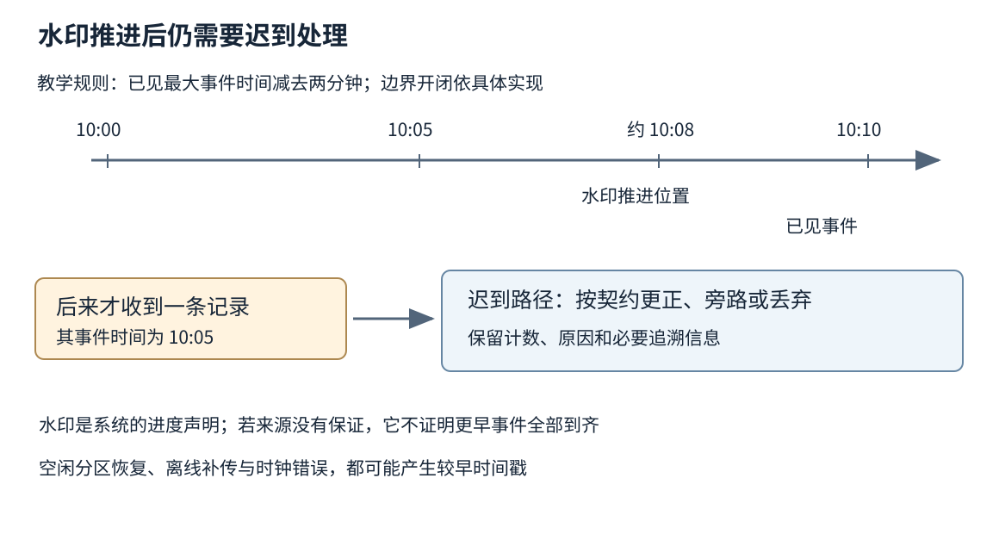
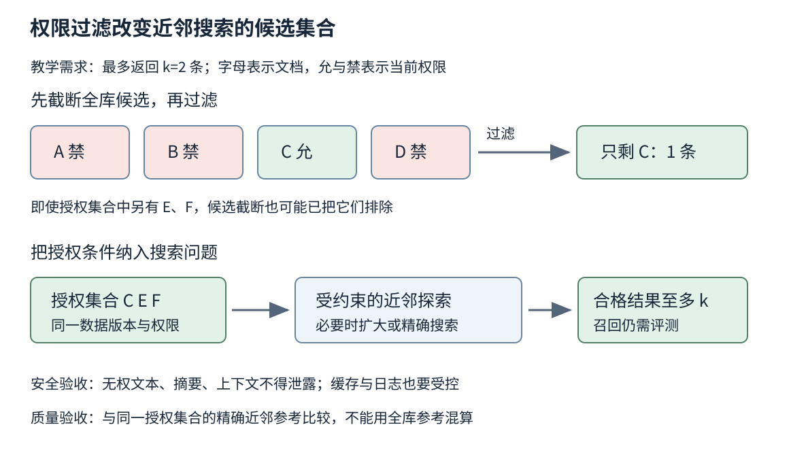
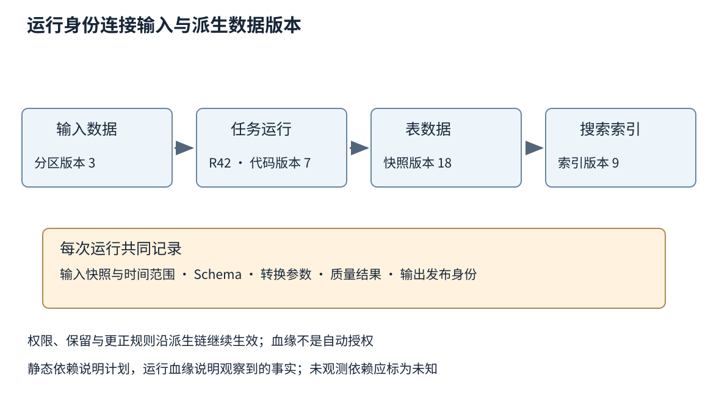

# 第三十七章 数据平台搜索与基础服务

数据平台把分散在业务系统、设备和文件中的记录，转成报表、检索结果、模型输入与可复用的数据服务。它的工作不止是搬运字节，还要保存字节的意义：某个时间指事件发生还是平台收到，某列金额以元还是分计量，一份文档由谁有权读取，一次任务重跑应覆盖还是追加结果。

搜索则从另一方向组织这些数据。用户并不总能给出主键，而是用关键词、描述或向量表达意图，系统需要在大量候选中寻找有关内容并排序。找到相似对象与找到有权访问、足够新、能够解释来源的对象，是必须同时满足的要求。

前几章的分布式确认、持久化、查询和事务仍然在这里起作用。本章讨论它们如何进入批流处理、搜索索引、数据治理与调度平台。文档核验于 2026-10-03，Flink 采用1.20文档分支，Elasticsearch采用8.15，Lucene采用9.12.3，Avro采用1.12.0，Airflow采用3.0.5；这些是机制参照，不是新部署版本推荐。其余滚动来源明确标注。图、事件与数据规模例子均为教学构造，没有运行管道、搜索基准或云端任务。

## 37.1 批流处理 数据质量与事件时间

### 37.1.1 批与流先区分输入边界 再讨论执行方式

**批处理**通常面对有界输入，系统能够知道这一批材料何时读完，再产出相应结果。**流处理**面对持续到来的输入，必须在尚未看见全部未来数据时更新状态和输出。两者不只是“每小时运行”和“每秒运行”的区别；把一份有限文件逐条处理仍是有界计算，把消息攒成微批也仍要面对持续输入的时间与恢复问题。

有界性影响算法。对有限集合可以等待全部输入后排序，对无界输入则需要窗口、持续索引或其他有界状态约束。一个“累计不同用户数”的无限精确集合会持续增长，不能只靠增加线程解决。是否允许近似、分时间范围或过期，应由业务定义。

同一逻辑转换可以在批和流上复用，但不代表两条路径自然等价。流路径可能按迟到规则丢弃记录，批路径可能读到事后修订；维度表在两次运行间变化，也会使结果不同。统一代码减少重复维护，统一语义还需要固定输入版本、事件时间、关联规则与更正政策。

例如订单日汇总既可持续更新，也可在次日核对。重要的是说明日界使用哪个时区、退款归入原订单日还是退款日、迟到付款怎样更正。没有这些定义，即使两个引擎都精确执行各自SQL，报表仍会互相矛盾。

### 37.1.2 事件时间与处理时间对应不同事实

**事件时间**是记录所描述事件发生的时间，通常来自数据中的时间戳；**处理时间**是某个处理节点实际处理它的时间。设备离线缓存、网络排队、消息重试和批量上传，都可以使两者相差很大。Flink 1.20 的时间概念文档明确区分这两类时间及其用途。[S1]

事件时间有利于把乱序记录放回业务发生顺序，但它的质量依赖时间戳来源。终端时钟错误、毫秒与秒混淆、时区解释错误，都可能把记录放到遥远未来或过去。处理时间容易取得，却让同一历史数据的重放时间不同，从而改变窗口归属。

平台可以保留发生时间、采集时间、接入时间与处理时间，用于分别分析设备延迟和平台延迟。这些字段需要清楚命名，而不是都叫 timestamp。把中国业务日期统一到某一时区可以避免日报边界混乱，但原始事件时间和时区信息也应按数据契约保留，不能靠丢弃偏移信息假装统一。

故障诊断先观察延迟来自哪一段。接入很及时但处理滞后，可能是平台积压；接入时记录已经很旧，可能是上游离线补传。二者的扩容、告警与补偿方向不同，不能把所有迟到都归因于流处理引擎慢。

### 37.1.3 水印是推进规则 不是全世界数据到齐的证明

**水印**（watermark）表示处理系统对于事件时间推进程度的声明，帮助窗口、定时器和状态清理决定何时继续。它可以来自来源提供的严格边界，也可以来自基于已见时间戳和允许乱序量的估计。没有来源保证时，水印超过某个时间不能证明真实世界所有更早事件都已经到达。[S2] [S3]

设一个教学管道按已见最大事件时间减去两分钟推进水印。当系统已经看见10:10的事件，水印可能推进到约10:08；之后一台离线设备上传10:05的记录，仍完全可能发生。水印规则没有让这条记录从现实中消失，它只是使该记录落入迟到处理路径。精确边界的开闭区间应按具体实现核对，不能从这个算术例子推导API细节。

多个输入汇合时，算子通常需要考虑较慢输入的进度。Flink 1.20 文档说明，空闲分区可能阻止整体最小水印推进，因而提供空闲检测；快慢输入差距过大，也可能导致下游状态积累。[S2] 把一个分区标为空闲，有助于推进，但它稍后恢复时的旧数据仍需按迟到规则处理。

如果为降低延迟而不断扩大“空闲”判定范围，可能把长期卡住的真实输入排除，形成更快但更不完整的结果。正确观察应同时包含水印、各来源接入量、空闲状态、迟到比例和业务完整性检查。只看水印一直向前，不足以证明数据健康。

### 37.1.4 窗口 触发 更正和状态清理是不同决定

**窗口**把事件划分到有限的逻辑范围，例如固定五分钟、滑动一小时或按活动间隔形成会话。**触发器**决定何时产生一次输出。窗口尚未关闭就可以先输出估计，后续记录再更新；这需要下游理解一条结果是新增、覆盖、撤回还是某个版本的快照。

Beam 的编程指南把窗口、水印、迟到数据与触发器分别描述。[S3] 工程设计也应该分别回答：怎样归属窗口，何时首次输出，允许多晚的更正，何时回收状态。如果把它们合成一个“窗口大小五分钟”，使用者无法判断第六分钟到来的旧记录会怎样处理。

迟到数据可以被丢弃、进入旁路审计、更新既有结果，或触发离线补算。选择取决于用途。实时监控可接受部分旧记录不再触发即时告警，结算报表则可能需要可靠更正。静默丢弃而没有计数和核对，会让平台成功率很高却持续产生偏差。

状态TTL应与这些语义一致。为防内存增长而把关联状态一天后删除，会改变两天后才到来的关联记录结果。若业务允许这种截止，应写进契约；若不允许，就要采用其他持久化与补算方式。TTL是资源规则，只有在业务同意其后果时，才是正确的语义边界。

图 37-1 根据已见事件推进水印后，仍可能收到更早的事件。平台需要明确迟到处理，不应把水印解释为现实世界的完整性证明。

### 37.1.5 检查点保护内部状态 端到端效果还需输出协作

有状态流任务会保存计数、关联缓冲、去重集合和源位置。**检查点**把这些状态与输入进度组织成可恢复的一致切面；任务失败后，可以回到相应状态并重放需要的数据。Flink 1.20 文档说明检查点与恢复模式，连接器文档则单独列出来源和输出端能提供的保证。[S4] [S5]

内部状态恰好一次，不等于每条记录只被计算过一次。失败后可能重新读取和计算，只是最终可观察状态按协议不重复生效。若用户函数在中间直接发送邮件，而邮件系统不参与检查点协议，恢复重放仍可能再次发送。第三十四章的外部幂等边界在流系统中没有消失。

输出端可以采用事务提交、幂等覆盖或按检查点发布文件集合等方式协作。每一种都需要稳定身份、失败恢复和版本规则。文件已经上传但检查点未完成时，文件是否对读者可见；事务准备成功但提交确认丢失时，恢复怎样判断，都是端到端保证的一部分。

检查点变慢还会影响恢复成本与状态保留。背压导致屏障等待、状态过大导致上传耗时、存储抖动导致失败，最终可能让最近可用恢复点越来越旧。告警不能只看任务进程在线，应关注最近成功检查点年龄、失败原因、恢复需要重放的范围与源保留期限。

### 37.1.6 数据质量需要解释哪些错可以阻断发布

数据质量包括结构合法、字段含义正确、关键值完整、唯一性、范围、引用关系与时效。合法JSON不意味着金额单位正确，行数与昨天接近也不意味着字段没有整体错位。质量规则需要从数据用途出发，尤其保留能够影响决策的业务不变量。

可以把原始输入保存为可追溯层，再把解析失败或业务规则失败的记录放进受控隔离区，而不是直接混入可消费结果。隔离区仍可能包含敏感信息，访问和保留期限不能比正式数据更随意。错误样例应脱敏，避免告警系统变成另一个泄露渠道。

质量检查还要定义发布门槛。关键主键缺失可能应阻断一个分区，少量非关键标签缺失则可以降级并附带质量标记。门槛应说明分母、统计范围与历史变化，不能只写“异常率不超过百分之一”而不说百分之一属于哪个数据集。

**深度追问：任务每天都成功，为什么日报仍可能漏数据？** 调度成功只说明任务按实现结束。它可能读取了尚未完成的分区、丢弃迟到记录、使用错误时区或漏掉新增来源。需要核对来源完整性、输出版本和业务对账，不能只看任务状态。

**深度追问：批流结果不一致，先相信哪一个？** 先固定输入版本、事件时间范围、维度快照、去重身份和更正规则，再比较。批处理并不天然正确，流处理也不天然近似；差异应由语义和证据定位。

## 37.2 倒排索引 检索排序与ANN边界

### 37.2.1 倒排索引把从文档找词改成从词找文档

**倒排索引**为词项保存包含它的文档集合，常称倒排列表；列表还可以保存词频、位置等信息。查询“电机 过热”时，系统可以寻找同时或分别包含这些词项的候选，而不必对每份文档重新全文扫描。短语查询还需要位置关系，只有文档ID集合并不够。

构建之前的**文本分析**决定如何把文字变成词项，包括字符规范化、分词和词项转换。索引时与查询时的处理需要相容，但不必在所有场景完全相同，例如查询侧可以进行受控同义扩展。Elasticsearch 8.15 文档把分析视为文本字段匹配的重要组成。[S6]

中文没有普遍显式的空格词界，行业术语、设备型号、全半角与中英文混写尤其需要核对。把“设备型号甲-01”拆成不合适碎片，可能让查询漏掉精确型号；把所有字符都当作关键词整体，又可能损失自然语言召回。可以为同一信息维护精确字段与分析字段，但应明确各自用途。

分词词典更新也会改变索引含义。查询侧立即使用新词典，而旧文档仍按旧词典建立索引，可能形成暂时不相容。变更需要评估是否重建索引、是否保留双路径，以及如何用真实但获准使用的查询样本验证；不能把词典文件替换当成没有数据迁移成本的小配置。

### 37.2.2 索引可搜索 持久保存与删除传播不是同一时刻

搜索引擎常把新写入积累后形成可查询段，再在后台合并。刷新让新数据进入搜索视图，合并整理多个段，持久化和复制又有各自条件。Elasticsearch 8.15 的近实时搜索文档解释了刷新与段可见性，不能据此把刷新等同于磁盘持久提交。[S7]

业务系统写入成功后，搜索暂时查不到，可能是索引传播或刷新尚未完成，而不是原始业务写入丢失。接口可以返回业务主键供直接查验，也可以在确有需要时等待特定可见性条件；不应为了让每个写入立即可搜而不加分析地强迫全系统频繁刷新。

删除与权限变更更敏感。原始文档删除后，旧索引、缓存、片段摘要和向量库可能仍保存副本。逻辑删除标记可以阻止当前搜索返回，但后台合并和备份保留另有过程。对外承诺“已删除”时，需要说明访问层面与保留政策，不能只检查一条源数据库记录。

重建索引也需要版本切换。先构建并校验新索引，再切换读取入口，能够减少半成品暴露；增量变更必须与全量基线衔接，否则切换时可能漏掉构建期间的更新。旧索引何时可回收，要考虑仍在运行的查询与回滚窗口。

### 37.2.3 相关性评分不是事实正确性的概率

**排序**在候选中决定哪些结果靠前。BM25 通过词项稀有程度、文档中的词频及长度归一化等因素估计文本相关性；词出现次数增加的贡献会饱和，而不是每多一次都等量加分。Lucene 9.12.3 的 BM25Similarity 文档明确描述相关参数的作用。[S8]

分数不是“这篇文章有百分之多少概率正确”，也不适合未经处理就在不同索引、查询和模型之间比较。文档集合变化会改变词频统计，查询增加一个词也可能改变得分范围。把某个固定分数阈值当成跨业务的可信度标准，容易产生错误筛选。

排序可以加入时效、质量或业务约束，但要区分相关性与业务规则。用户查找某型号维修说明时，最新发布的一篇泛泛文章不一定比旧版精确手册更合适。排序目标必须与查询意图及允许结果集合相符，而不是仅最大化点击量。

评价需要人工或业务定义的相关性标注与合适指标。精确率关注返回中多少相关，召回率关注相关对象找回多少，排序指标关注重要结果的位置。标注有不确定性，历史点击又受已有排名和展示偏差影响；不能拿旧点击日志当作不带偏见的真值。

### 37.2.4 向量检索依赖表示空间与距离定义

向量检索把文档、图片或其他对象编码为数值向量，再按距离或相似度寻找邻近对象。距离的意义依赖编码模型、训练目标、归一化与维度。两个向量维度相同，不代表来自同一个相容空间；模型升级后混用新旧向量，可能让数值计算正常却语义失效。

**精确最近邻**按指定度量比较完整候选集合，得到该度量下的前k项；它精确的是数学距离排序，不是“最有用答案”。如果嵌入模型没有表达设备版本、否定词或细微约束，最近的对象也可能业务上不相关。

余弦相似度、点积和欧氏距离之间的关系取决于归一化等条件，不能默认互换。零向量、异常数值与量化误差也需要处理。索引格式应记录模型身份、维度、距离及预处理版本，使后续重建和比较有依据。

同一文档被切成多个块后，检索对象也随之改变。块过短可能失去上下文，过长可能稀释主题；不同块重复命中同一文档，还会挤占结果名额。聚合回文档、保留来源位置与版本，是让检索结果能够被解释和核验的重要步骤。

### 37.2.5 ANN 用可测召回损失换取资源收益

**近似最近邻**（Approximate Nearest Neighbor，ANN）避免对所有候选做完整精确比较，以较低计算或延迟代价寻找足够好的邻近结果。HNSW 用分层图逐步搜索，较高层帮助快速定位区域，再在更细层扩展候选；这是其原论文讨论的核心机制。[S9]

近似意味着可能漏掉精确前k项。扩大搜索候选、提高索引构建质量或增加内存，通常可以改变召回与成本关系，但不能在没有测试的情况下承诺任意数据都达到固定召回率。数据分布、插入顺序、过滤条件、更新和量化都可能影响结果。

常见的 recall@k 可以按返回集合与同一查询、同一允许候选集合中的精确前k集合的交集大小，除以该参考集合大小计算。通常假设允许集合至少有k项且k为正；不足k项或参考集合为空时，应另行规定分母与样本纳入规则。若存在等距并列，应明确如何定义参考集合；若过滤或数据版本不同，比较就没有相同分母。检索召回率与最终业务答案正确率也应分开测量。

Elasticsearch 8.15 的kNN文档说明候选数量与近似精度、速度的关系。[S10] 这些参数名属于该版本实现，不是所有ANN库的共同接口。评价报告应保留索引、模型、过滤分布、硬件、并发与尾延迟，避免只呈现一个平均召回数字。

### 37.2.6 权限过滤既是安全边界 也改变召回问题

假设用户只能读取某个部门的一小部分文档。如果先在全库找二十个近邻，再把无权文档去掉，最终可能只剩一两条，即使允许集合中存在很多相关文档。增加最初候选数有时改善结果，却不能一般性保证得到足够的合格项。

把过滤结合到近似搜索过程，可以让搜索以符合条件的候选为目标，但算法如何穿越图、何时扩大探索、何时转为精确扫描，取决于实现。过滤越严格不必越快，图搜索可能需要探索更多节点才能找到足够合格候选。Elasticsearch 8.15 明确区分其过滤式kNN与事后过滤的结果数量问题。[S10]

安全约束不能作为可优化掉的普通相关性特征。无权限内容不得进入最终结果、摘要或提供给下游模型的上下文；服务端仍需可信地执行授权规则，并处理索引ACL陈旧。客户端隐藏结果不是访问控制，日志和调试预览也不能随意保存未授权文本。

在共享基础设施内做图遍历，是否允许算法内部触及其他租户节点，还取决于隔离模型。若要求物理或强逻辑隔离，就不能只依赖最终过滤。缓存键、结果总数、解释信息和时序侧信道也要纳入审查，尤其不要为诊断“为什么没结果”而向用户展示其无权知道的文档标题。

图 37-2 全库候选先截断再过滤，可能不足以找回允许集合中的前k项。安全授权与近似召回分别验收；候选扩充不是权限校验的替代品。

### 37.2.7 混合检索与重排仍受候选上限约束

词项检索擅长精确术语、编号和明确词面，向量检索可以找回不使用相同字面的相关表达。把两类候选合并再重排，可以覆盖不同失败模式，但分数尺度不同，不能直接假定一分BM25等于一分余弦相似度。可以校准分数，或采用基于名次的融合规则，并用任务数据验证。

重排模型通常只处理前一阶段交来的有限候选。相关文档从未进入候选集合，重排再精细也找不回来。管道评价应分解候选召回、权限合格率、重排质量与最终返回质量，才能知道改进应发生在哪一层。

**深度追问：精确向量搜索能否作为搜索质量的最终金标准？** 它可以作为同一向量空间与度量下评估ANN近似损失的参考，却不能证明语义相关、事实正确或满足用户意图。完整评价还需独立的相关性与业务正确性标准。

**深度追问：权限过滤后结果不足k条，直接放宽过滤可以吗？** 不能。应在同一授权集合内扩大探索、选择合适算法或诚实返回较少结果。安全约束不应为了凑齐结果数量而改变。

## 37.3 Schema注册 数据血缘 权限与治理

### 37.3.1 Schema 把字节含义变成可检查的契约

**Schema**描述数据结构、字段类型和某些约束。注册服务为模式提供可引用身份与版本，帮助生产者、消费者和历史数据使用者找到正确解释方式。它不只是一个字段表，而是跨团队变更时的协调材料。

结构相同也可能语义不兼容。金额从分改为元，设备温度从摄氏度改为华氏度，时间从发生时间改为上报时间，都可能保留同样的数值类型。兼容检查器通常无法从类型本身发现这些变化，因此字段说明、单位、来源与业务含义应一起版本化。

Avro 1.12.0 规范明确区分写入模式与读取模式，并定义模式解析规则；默认值用于读取缺失字段等演进场景，不意味着编码时可以随意省略字段。[S11] 类似细节应按具体格式核对，不能把一种序列化系统的“可选”规则移植到另一种。

模式身份还要与数据一起可追溯。仅在应用仓库里保留“当前schema”，几年后再读取旧文件可能已经找不到正确版本。注册表、文件头或元数据目录需要承担保留责任；删除旧模式前，应核对仍被哪些历史对象、备份或重放任务引用。

### 37.3.2 向后 向前与传递兼容回答不同升级问题

**向后兼容**通常指新读者能读取旧写者的数据，**向前兼容**则指旧读者能处理新写者的数据；具体支持的变化由格式定义。二者同时成立也不意味着业务语义自动兼容，只说明被检查的结构组合满足规则。

如果只验证新版本与上一版兼容，未必证明它能读所有历史版本。Confluent Schema Registry 文档区分普通兼容模式与transitive模式，后者把检查范围扩展到更早已注册模式。[S12] 对需要从头重放的任务，这个区别具有实际后果。

升级顺序也由兼容方向决定。新消费者先部署，之后生产者开始写新结构，和先升级生产者再等待旧消费者兼容，不是同一种计划。双写字段、保留旧解释、迁移状态与回滚窗口，需要与版本策略一起考虑。

所谓“新增字段一定安全”也不成立。新字段如果改变默认逻辑、成为下游授权条件、使消息规模过大或触发旧代码未处理的分支，仍会产生失败。兼容门禁应覆盖编码、行为和容量，不能只有schema编译成功一项。

### 37.3.3 血缘要能回答某个结果到底由哪次运行产生

**数据血缘**记录数据从哪些输入，经哪些转换，形成哪些输出。静态血缘描述预期依赖，运行血缘记录某次执行实际读取和写入的对象。只画“原始层→明细层→报表层”的架构图，难以回答昨天一个错误金额影响了哪些具体报表版本。

OpenLineage 的对象模型区分 Job、Run 与 Dataset，并通过运行事件关联输入、输出和补充元数据。[S13] 这种区分很重要：同一任务每天运行，逻辑工作相同，输入分区和输出版本却不同。任务名称不能替代运行身份。

细粒度血缘还应说明转换版本、输入快照、参数、时间范围与质量结果。列级血缘可以帮助定位敏感字段传播，但动态SQL、自定义函数与外部服务调用可能使自动提取不完整。界面显示一张图，不代表系统已经观察到所有依赖；未知部分应明确标注。

血缘也不自动证明数据正确。它可以告诉你错误从哪里来、影响哪里，却不验证每个转换符合业务语义。把血缘与质量检查、发布记录和所有者关联，才能形成实际可执行的影响分析，而不是只用于展示平台能力。

### 37.3.4 权限应随派生数据继续成立

原始数据受限，派生表、索引、缓存、导出文件和模型输入不应因为“已经加工”就自动变公开。简单去掉姓名，也可能通过其他字段重新识别个人；聚合结果在分组很小或可以重复对比时，也可能暴露细节。需要根据数据类型、用途和组织政策判断，而不是用一个统一脱敏开关解决。

访问控制应区分谁能够发现数据集、读取行列、执行计算、导出结果和修改权限。拥有看表结构的能力不等于能读全部内容；能运行受限报表也不等于可以下载底表。服务账号与人类用户的权限要分别管理，并避免共享一个全能凭据运行所有作业。

治理规则还要覆盖备份、测试环境和日志。为了排查异常而把生产样本复制到个人电脑，可能绕过正式平台所有控制。可以使用最少必要样本、受控环境和去标识材料；当确需处理敏感数据时，应取得相应授权并保留用途与访问记录。

中国工程环境中的数据分类、跨组织共享和跨地域处理应由组织的安全与合规机制审查。本章不提供具体法律结论，也不把技术脱敏直接等同于合规。平台应能表达目的地、用途、保留期与授权范围，供责任人作出有证据的决定。

### 37.3.5 删除和修正需要沿派生链传播

发现源数据错误后，修正源表只解决起点。下游快照、聚合、搜索索引与文件可能仍保留旧值，需要根据血缘确定重算或失效范围。若平台没有记录输入版本，可能无法判断哪个产物包含错误，只能全量重建，成本和风险都更大。

删除请求同样涉及多个时间层。当前查询不可见、缓存过期、索引清理、历史快照和备份到期，不是同一个事件。可以按既定保留政策阻止恢复后把已删除数据重新带回在线系统，但需要明确标记与恢复步骤，不能依赖操作者每次记得手工补删。

更正会影响消费者的解释。如果昨日报表从一千变成九百九十，应提供版本与更正原因，而不只是覆盖文件让两个团队各自保留不同截图。某些结果需要不可变发布版本加后续修订，另一些允许最新视图持续更新；选择应与实际使用责任相符。

血缘与删除元数据本身也可能透露敏感关系，不能无条件对所有人开放。审计记录需要可追责，却应避免收集超过目的所需的原始内容。治理是访问、保留和解释规则贯穿全链路，而不是收集越多元数据就越好。

图 37-3 同一个逻辑任务的某次运行，应关联具体输入、代码和输出版本。权限与更正沿派生链继续生效，血缘记录本身不证明数据正确。

### 37.3.6 治理需要可执行门禁与明确所有者

每个重要数据集应能找到负责其含义、质量和变更的人或团队。平台团队可以运行系统，却未必知道某个订单状态的新枚举是否业务合法。让所有问题最终都归到“数据平台维护人”，会造成技术人员无法作决定，业务人员又看不到影响。

可执行门禁包括结构兼容检查、质量阈值、权限核验、发布审批与过期清理。它们应尽量嵌入日常发布和运行流程，并有明确失败信息。如果门禁只报“数据不合规”而不说明字段、规则与责任方，使用者很容易绕开平台另建旁路。

**深度追问：注册了Schema、接入了血缘，数据就可信了吗？** 它们提供解释与追溯基础，但仍需质量证据、业务定义、权限和变更管理。模式合法的数据可以完全错误，血缘完整的管道也可以稳定地产生错误结果。

**深度追问：为了兼容旧消费者，永远不删除字段是否最好？** 不一定。长期保留会增加含义混乱、成本与敏感信息暴露。应先调查真实使用者和历史依赖，发布迁移窗口与版本计划，再按验证过的范围移除，而不是无限累积或直接破坏。

## 37.4 云存储 可扩展调度及平台成本

### 37.4.1 对象存储以对象为单位 不是远程本地文件系统

**对象存储**以键标识对象，通过服务接口读取、写入和管理。它适合保存大量不可变或整体更新的数据对象，目录层次常是键前缀的解释，而不必对应本地文件系统中的真实目录。把现成文件路径代码直接套在对象存储上，容易忽略请求成本与语义差异。

Amazon S3 官方文档说明，其对象PUT与DELETE后的读取和列表具有相应强一致保证，单键更新是原子的，但不提供多个键一起原子更新的通用事务。[S14] 这只是该服务文档的具体承诺，不能推广为所有兼容接口实现都相同，也不能继续沿用“对象存储一定最终一致”的旧说法。

一个任务需要写十个文件时，前五个已成功、后五个失败仍然可能发生。读取者若直接扫描目录前缀，就可能把半成品当完整分区。任务应先把文件写到受控版本，再通过清单或表元数据发布一个完整视图，失败后按引用关系处理遗留对象。

对象的复制和删除也不必等价于本地原子重命名。平台迁移路径时，应检查目标服务是否真的支持所需原子操作，或改用元数据指针协议。不能以一个SDK提供名为rename的方法，就推断底层具有同样崩溃和并发语义。

### 37.4.2 表格式用元数据把多个对象组织成快照

文件格式定义一个文件里的行列、压缩和编码，**表格式**进一步定义哪些文件共同构成一张表的某个版本，以及Schema、分区与删除信息怎样解释。只会读取Parquet等文件，并不代表系统知道哪一组文件是当前有效快照。

Iceberg 规范描述不可变元数据、清单、快照和提交时原子更新当前元数据引用的机制。[S15] 写者先准备新文件与元数据，再通过相应目录服务的条件更新竞争提交；读者固定所选快照，避免看到半次修改。具体原子能力由所用目录或元数据提交实现提供，不能仅靠普通对象列表模拟。

并发写者若基于同一旧版本构建更新，失败者需要核对冲突并按规则重试，而不是无条件用自己的指针覆盖别人。Schema和分区演进、删除文件语义与格式版本，也要求所有读写引擎具备相容能力。支持“打开某种表”不等于支持其每种读写特性。

快照保留会占用空间，清理则需要尊重仍被保留快照或活跃作业引用的文件。一个看似孤立的对象，可能是尚在提交中的写者刚上传的材料；过于激进的孤儿文件清理可能破坏正常任务。回收需要可靠引用判断、合理安全窗口与受控执行。

### 37.4.3 工作流调度先决定什么可以开始

**工作流调度器**根据依赖、时间或数据条件安排任务。一个有向无环图描述任务之间的先后，但箭头只表达已建模的依赖；若下游还依赖外部维度表或人工发布，而图中没有表示，调度器不会自己知道。

定时到点与输入完成也不同。凌晨两点启动日报，只在上游总能此前完成时才可能可靠；网络延迟、迟到分区或重跑都可能打破这个假设。可以让任务依赖明确的数据版本或完成清单，并设置等待截止和缺失处理，避免按墙上时间猜测材料是否齐全。

任务应该能安全重跑。Airflow 3.0.5 的最佳实践要求任务避免产生半成品，并考虑重试时结果一致；它也提醒用固定输入分区，避免重跑时读“当前最新”而得到不同结果。[S16] 这与第三十四章幂等原则相同，但对象从一条请求扩大成一份数据产物。

调度器显示失败时，外部写入可能已经成功；显示重试时，也可能仍有旧工作者在运行。需要作业身份、输出版本、提交协议与必要的栅栏，不能让两个尝试同时覆盖同一结果目录。仅为任务设置最大重试次数，不能消除未知结果。

### 37.4.4 资源调度决定任务放在哪里 与业务调度不同

工作流知道哪个任务具备开始条件，**资源调度器**则把待运行任务放到满足约束的机器上。它要考虑CPU、内存、加速器、存储、拓扑、亲和与反亲和，以及其他工作负载。Kubernetes官方文档以过滤和评分解释节点选择机制。[S17]

节点有空闲CPU，不意味着任务就能安排。任务可能要求特定GPU、同区卷、较大的单节点内存申请或安全标签；集群总资源足够，也可能因碎片化没有单台合格节点。排查Pending应查看具体约束与事件，不能只看到利用率低就认定调度器失灵。

请求资源用于调度预算，实际峰值可能更高。低估请求会让多个任务被挤到同一节点，随后共同争抢资源；过度申请又会降低利用率。批任务、低延迟服务和带大状态的流任务，对抢占、迁移和重启的承受力不同，不能只按统一优先级数字管理。

数据位置同样影响成本。把计算移近大数据集可能减少传输，但也可能使某区资源排队；跨区移动任务还涉及权限与数据驻留。调度决策应以真实数据访问和政策约束为前提，而不是把每台机器看成没有位置差异的空插槽。

### 37.4.5 回填 扩缩容与维护需要共享容量预算

**回填**重新处理历史时间范围，用于修正逻辑、补齐数据或构建新产物。它往往与实时任务同时运行，争抢输入服务、对象请求、数据库连接和输出写带宽。为回填直接开出数千个并行任务，可能让本来健康的实时链路超时。

可以按时间分片、租户和依赖设置并发配额，给当前服务保留预算，并观察最慢阶段。回填如果使用新逻辑，还要明确旧产物何时被替换、消费者怎样知道版本变更；若是补数据而不是改算法，则应固定原有规则，避免混入另一个变化维度。

扩容也需要时间与资源。状态流任务可能搬迁状态，搜索节点可能复制索引，分析节点可能预热缓存；新机器出现在列表中不意味着立即具备完整服务能力。扩容期间的网络与磁盘压力还可能短暂加重原瓶颈，应以可用容量和数据进度判断效果。

缩容与抢占则要考虑检查点、排空和重复工作。可中断实例的价格优势需要与恢复、重算和业务期限一起计算；一个经常在快完成时被中断的大任务，可能消耗更多总资源。平台应支持足够细的恢复或任务划分，而不是把所有失败都无脑从零开始。

### 37.4.6 平台成本应按有用结果与质量一起计量

平台账单由计算时长、存储容量、请求次数、网络传输、备份、索引、状态与维护共同构成。具体项目和价格依供应商、地域与时点变化，本文不提供固定单价。工程上可以先建立不依赖价格的资源账本，再代入当期合同和计费规则。

小文件常让请求、元数据与调度开销升高；合并文件可以减少这些成本，却需要额外计算和写入，并可能延迟新数据可见。强压缩节省存储与传输，却增加CPU；提高ANN召回可能增加内存和查询时间；保留更多快照提高恢复选择，也增加空间。这些变化应该在同一本账中比较。

有用的单位可以是每份按期且通过质量门禁的报表、每百万条完整处理的事件、每次满足权限与相关性要求的检索，而不只是每核每小时。若通过丢迟到数据或返回更少正确结果降低成本，分母已经改变，不能称为同质量效率提升。

成本归属还需任务、租户、数据集和运行身份。共享集群的总账下降，不代表每个业务都更有效；一个团队停止重要核对，可能让其他团队以后付出更大错误修复成本。配额、预算和告警应让责任人看得见原因，并允许在经过授权的紧急工作中有明确例外流程。

**深度追问：对象存储已经强一致，为什么还要表格式与目录服务？** 强一致通常说明相应对象操作的可见顺序，不能自动把许多数据文件与Schema一起原子发布。表格式和目录协议补充的是多文件快照、版本、并发提交与解释规则。

**深度追问：平台利用率越高，是否代表成本越低？** 不一定。过度利用可能导致重试、超时、维护积压和昂贵恢复。应观察满足时效、正确性和安全条件的有效产出，以及为峰值和故障保留的合理余量。

数据平台的成熟度最终体现在结果能否被解释：它来自哪个输入版本，依据哪个时间规则，哪些人可以使用，失败后怎样重建，成本为何发生。搜索与调度没有脱离这条主线，只是把“正确结果”的形态从一条记录扩展到了候选集合、持续状态和整条数据供应链。

## 来源与阅读边界

以下资料均于 2026-10-03 实际打开核验。固定版本文档用于机制教学，不作为部署升级建议；滚动页面的具体行为需在实施时按选定版本复核。所有图和教学例子原创，未运行作业或搜索测试。

- S1：Apache Flink 1.20 Timely Stream Processing，事件时间与处理时间
- S2：Apache Flink 1.20 Generating Watermarks，水印、空闲来源与对齐
- S3：Apache Beam Programming Guide，滚动文档，窗口、水印、迟到与触发
- S4：Apache Flink 1.20 Checkpointing，状态检查点与恢复
- S5：Apache Flink 1.20 Connector Fault Tolerance Guarantees，端到端保证条件
- S6：Elasticsearch 8.15 Text Analysis，文本分析与查询匹配
- S7：Elasticsearch 8.15 Near Real-Time Search，刷新与段可见性
- S8：Lucene 9.12.3 BM25Similarity，词频饱和与长度归一化
- S9：Malkov与Yashunin，HNSW原论文，分层图近似最近邻
- S10：Elasticsearch 8.15 kNN Search，近似候选、过滤与结果数量
- S11：Apache Avro 1.12.0 Specification，模式解析与默认值
- S12：Confluent Schema Evolution，滚动文档，兼容方向与传递检查
- S13：OpenLineage Object Model，滚动文档，Job、Run与Dataset
- S14：Amazon S3 User Guide，滚动文档，对象一致性与单键原子范围
- S15：Apache Iceberg Specification，滚动规范，快照与元数据原子切换
- S16：Apache Airflow 3.0.5 Best Practices，任务重试与固定数据分区
- S17：Kubernetes Scheduler，滚动文档，节点约束、过滤与评分

[S1]: https://nightlies.apache.org/flink/flink-docs-release-1.20/docs/concepts/time/
[S2]: https://nightlies.apache.org/flink/flink-docs-release-1.20/docs/dev/datastream/event-time/generating_watermarks/
[S3]: https://beam.apache.org/documentation/programming-guide/
[S4]: https://nightlies.apache.org/flink/flink-docs-release-1.20/docs/dev/datastream/fault-tolerance/checkpointing/
[S5]: https://nightlies.apache.org/flink/flink-docs-release-1.20/docs/connectors/datastream/guarantees/
[S6]: https://www.elastic.co/guide/en/elasticsearch/reference/8.15/analysis.html
[S7]: https://www.elastic.co/guide/en/elasticsearch/reference/8.15/near-real-time.html
[S8]: https://lucene.apache.org/core/9_12_3/core/org/apache/lucene/search/similarities/BM25Similarity.html
[S9]: https://arxiv.org/pdf/1603.09320
[S10]: https://www.elastic.co/guide/en/elasticsearch/reference/8.15/knn-search.html
[S11]: https://avro.apache.org/docs/1.12.0/specification/
[S12]: https://docs.confluent.io/platform/current/schema-registry/fundamentals/schema-evolution.html
[S13]: https://openlineage.io/docs/spec/object-model/
[S14]: https://docs.aws.amazon.com/AmazonS3/latest/userguide/Welcome.html#ConsistencyModel
[S15]: https://iceberg.apache.org/spec/
[S16]: https://airflow.apache.org/docs/apache-airflow/3.0.5/best-practices.html
[S17]: https://kubernetes.io/docs/concepts/scheduling-eviction/kube-scheduler/
