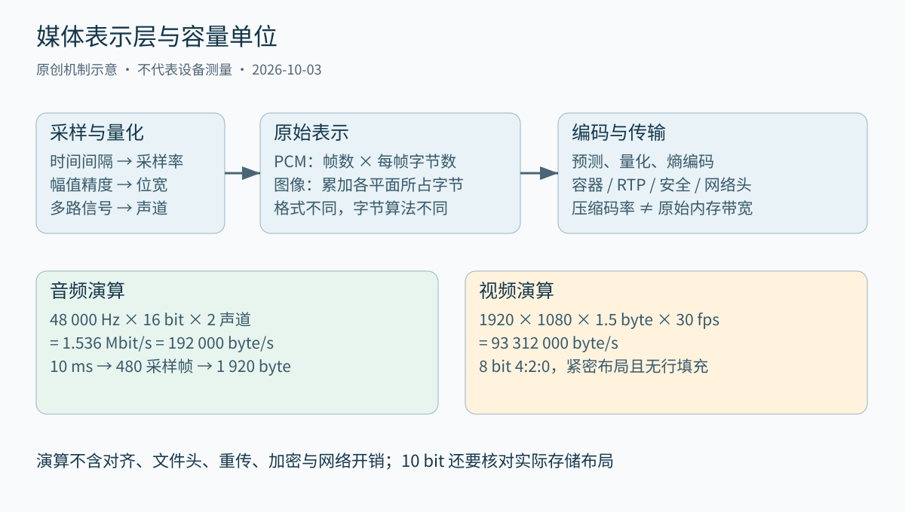
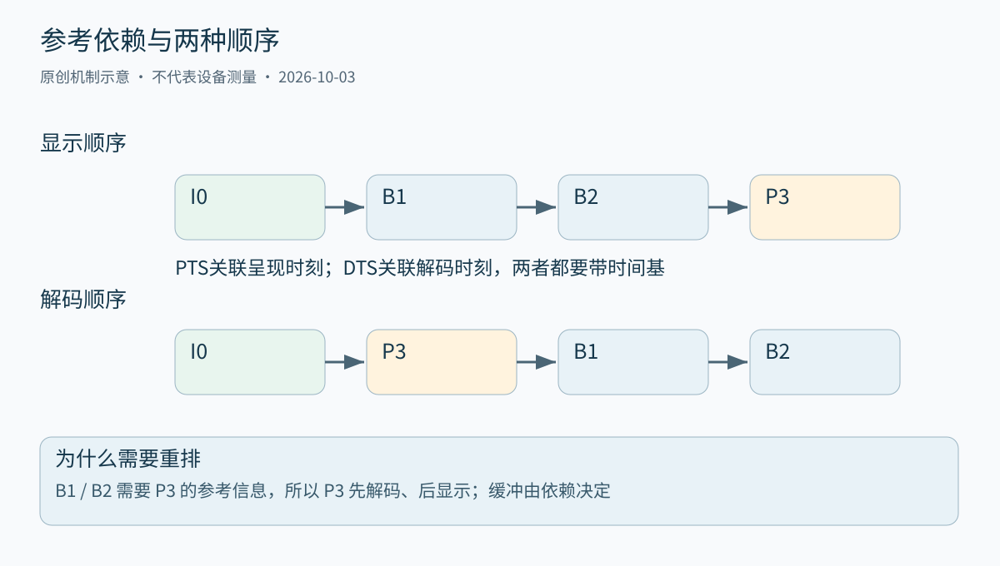
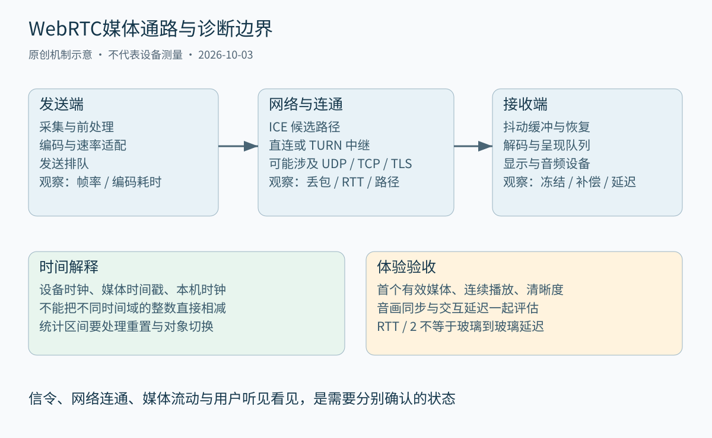

# 第三十八章 音视频系统与实时通信

音视频系统处理的是带有时间含义的信号。一个声音样本不仅有幅值，还属于某个采样时刻；一幅图像不仅有像素，还对应曝光时间、显示顺序和色彩解释。把这些数据当成普通字节成功传到另一端，只完成了任务的一部分。系统还必须在适当时刻，以正确的空间和时间关系重建声音与画面。

实时通信进一步要求系统在期限内交付仍有用的信息。文件传输可以等到所有字节齐全，远程会议中迟到几秒的声音却可能打断下一轮对话。实时并不等于没有缓冲，而是每一级缓冲都要服务于明确的播放期限。压缩率、清晰度、抗丢包能力、算力、功耗和延迟因此必须共同设计。

本章从数字信号表示讲到浏览器实时通信，不把某个编码器命令当成整个系统。数字演算与故障场景均为教学构造，未采集或传输真实媒体。命令和接口片段未执行，不能作为已经测试通过的配置。FFmpeg API 以 8.0 文档为明确参照，WebRTC API 以 W3C 2025-03-13 Recommendation 为参照；不同终端的实现能力需要另行验证。

## 38.1 采样 PCM颜色空间与压缩

### 38.1.1 采样把连续信号变成有时间间隔的序列

**采样**是在离散时刻观察信号，**量化**是把观察值映射到有限个数值等级。二者解决不同问题。提高采样率增加单位时间的样本数，提高位宽细化一个样本可表达的幅值；把位宽翻倍不会自动扩大可表示的频率范围，把采样率翻倍也不等于消除了量化误差。

经典低通信号采样定理的前提，是连续信号带限到某个最高频率，采样时刻理想且均匀，并采用相应理想重建。在这一模型中，采样率严格高于最高频率的两倍，可以避免频谱副本重叠。这里不是说任意现实声音只要标成某个采样率就能无损重建，也不能忽略最高频率恰好落在边界时的退化情况。MIT 的信号与系统课程把采样和混叠放在同一分析框架中。[S1]

现实模拟输入未必天然带限，所以模数转换前需要**抗混叠滤波**。已经折叠进目标频带的高频成分，通常不能在采样后简单用低通滤波识别并去除，因为它与合法低频具有相同的采样表现。实际滤波器有过渡带，采样率与通带边缘需要留出设计余量；过采样可以改变滤波器实现难度，但不取消滤波责任。

视频也在空间和时间上采样。细密格栅会产生空间摩尔纹，旋转物体可能因时间采样出现反向转动错觉。曝光时间、帧率、快门方式和传感器读出共同决定运动表现。提高输出文件的帧率，如果只是复制已有帧，并没有增加新采集的时间信息；插帧则引入估计，不能作为原始观测。

### 38.1.2 PCM的位宽 采样率与声道数要一起计算

**脉冲编码调制**（Pulse Code Modulation，PCM）用数字样本表示音频幅值。在未压缩、各声道每个样本使用固定存储位数的模型下，原始比特率为“采样率 × 每样本位数 × 声道数”。采样率的单位是每秒每声道的采样数，不是所有声道样本加起来的总数。

例如 48 000 Hz、16 bit、双声道 PCM，每秒负载为 `48 000 × 16 × 2 = 1 536 000 bit`，即十进制 1.536 Mbit/s，或 192 000 byte/s。十分钟是 115 200 000 byte，约 115.2 MB，约 109.9 MiB。以上均未计容器头、对齐、协议、冗余和文件系统开销；这是容量演算，不是网络抓包结果。

音频接口中的一个**采样帧**通常包含同一采样时刻的所有声道样本。上述格式的 10 ms 对应每声道 480 个样本，也就是 480 个采样帧，总共 1 920 字节。若程序把“480 个样本”误当成双声道合计数量，就会把时长或缓冲容量算错一倍。

有效位深与存储宽度还可能不同。24 bit 有效音频可能紧密放在 3 字节中，也可能装入 32 bit 容器。浮点音频的表示范围和内部处理余量也不同于定点 PCM，不能用“32 bit”直接推断模拟设备的有效动态范围。交错布局与平面布局只改变声道样本如何存放，不改变相同逻辑音频的时长；实际步长、字节序和对齐必须从接口契约读取。

### 38.1.3 量化 噪声与增益链不是同一个旋钮

量化把连续幅值映射到离散等级，误差会依赖输入和量化方式。在理想满幅正弦、均匀量化等假设下，可以推导常见的信噪比近似关系，但现实录音的麦克风自噪声、前置放大器、环境噪声和时钟误差不会因文件位宽增加而消失。工程报告应说明测的是数字量化模型还是整个采集链。

**削波**发生在信号超出可表达或设备允许的范围时。给已经削波的波形补更高位宽，不能恢复被截掉的峰值。增益控制需要在采集前端、数字处理和输出端之间分配余量；自动增益、压缩器和限幅器各有时间响应，过快可能产生“抽吸”感，过慢可能来不及避免过载。

降低位深时，可通过适当的**抖动**把与信号相关的量化失真转化为更可控的噪声。这里的抖动是量化处理中加入的微小噪声，与后文网络到达时间的抖动同名却不同义。降采样则要先限制超出新奈奎斯特频率的成分，再改变采样网格；直接隔一个样本取一个样本不具备普遍正确性。

音量小、背景噪声大和网络丢包造成的断续，应沿不同证据链诊断。若原始采集 PCM 已经削波，调大接收缓冲没有帮助；若音频在发送端完整、接收端补偿样本不断增加，应调查传输和播放期限；若只在扬声器外放时出现周期性回声，还要检查声学回声消除的参考信号、设备延迟与非线性失真。

### 38.1.4 RGB YCbCr 色域 传递函数与范围分别回答什么

**RGB**描述通过红、绿、蓝三种分量表示颜色的方式，但单独三个字母不足以确定颜色。还需要知道三原色的色度坐标、白点，以及码值与光之间的传递关系。**色域**描述所能表达的颜色范围；**传递函数**描述线性光量与非线性信号码值之间的映射；**量化范围**描述这些码值占用哪些数值区间。它们不能互相替代。

**YCbCr**通常把经过非线性传递处理的 RGB 分量转换为亮度相关分量与两个色差分量。严格讨论时，Y′ 是由非线性 R′G′B′形成的 luma，不应直接等同于物理线性亮度。不同标准使用不同系数与参数，软件界面中笼统的“YUV”常包含数字 YCbCr 格式，不应据此认定所有矩阵都一样。BT.709-6 为 HDTV 参数提供了明确参照。[S2]

同一组像素值，按错误色彩矩阵解释可能偏色，按错误范围解释可能灰黑或压暗，按错误传递函数显示可能出现亮度和对比度异常。常见的 8 bit 有限范围表示中，标称 Y′黑白范围为 16 到 235，色差分量有自己的标称范围；不能把这一约定扩展为所有图像、所有位深都使用这些数字。[S15]全范围转换还需要正确处理偏置、尺度、舍入与越界值。

HDR 也不是“更高位宽”的同义词。较高位深有助于细化码值，而高动态范围链路还依赖传递函数、显示能力、色调映射和相关元数据。把 HDR 数据按普通 SDR 曲线解释，会出现不符合预期的画面；只写一个色彩标签，却没有真正变换像素，也不等于完成了转换。标签告诉读者怎样理解数据，变换才改变数据本身。

### 38.1.5 色度子采样改变信息密度 不等于视频压缩器

**色度子采样**利用视觉对不同分量细节的敏感度差异，降低色差分量的空间采样密度。对常见逐行 4:2:0 图像，可以把一个 2×2 亮度区域理解为四个 Y′样本共享一对较低分辨率的 Cb、Cr 样本；实际色度采样位置仍有约定，不能只凭“4:2:0”就确定重建相位。

在宽高满足格式约束、8 bit 紧密存储且不计行填充的教学模型中，4:2:0 每像素平均 1.5 字节。1920×1080、30 帧/秒的原始数据率为 `1920 × 1080 × 1.5 × 30 = 93 312 000 byte/s`，即约 746.496 Mbit/s。RGB24 在相同条件下是每像素 3 字节，负载为其两倍。实际 GPU 表面还可能按行对齐、使用专用布局或额外平面。

10 bit 格式不能简单把上述内存大小乘以 10/8：码值可能按 16 bit 单元存放，也可能采用打包布局。计算磁盘压缩码率、CPU 内存占用、PCIe 传输量和 GPU 表面大小时，应分别使用所在层的格式。一个 4 Mbit/s 的压缩流，解码后占用的带宽仍可能高出很多。

桌面文字、彩色细线和设计图对色度细节十分敏感，4:2:0 可能让边缘产生彩色模糊。提高压缩码率无法恢复在色度降采样阶段已经丢掉的原始样本。排查“码率已经很高仍然文字发虚”，应先比较采集分辨率、缩放核、色度格式和显示缩放，再决定是否继续增加编码预算。



图 38-1 表示层决定容量算法。图中数字均为理想紧密布局的教学演算，不是编码器实测码率。来源：本章原创，依据采样模型和 38.1 节算式。

### 38.1.6 压缩把冗余和可容忍失真分开处理

**无损压缩**允许从压缩结果精确恢复输入数字样本；**有损压缩**用某种失真换取更小表示。无损数字压缩并不意味着采集过程没有噪声或量化损失，它只承诺相对于进入编码器的数字输入。反过来，有损编码的高主观质量也不代表像素或样本逐位一致。

图像相邻位置往往相关，视频相邻帧也往往相关。编码器通过空间预测、运动补偿等方法预测当前内容，再编码预测残差；变换把信息重新组织到便于处理的域，量化决定保留多少精度，熵编码利用统计分布压缩符号。熵编码本身通常是可逆的，有损主要不能笼统归咎于“变成二进制”。

**率失真取舍**关心有限比特怎样分配才能获得适合任务的质量。静态背景、快速运动、屏幕文字和噪声纹理的困难不同，同一码率下画面质量不能由分辨率一项决定。会议人脸可以容忍某些纹理损失，而医学、工业检测或测量用途不能直接照搬娱乐视频的视觉优化策略；是否允许有损必须由用途决定。

深入追问：“把采样率、位深和码率都提高，质量一定更好吗？”完整回答应分三层。前两项改变未压缩表示能力，编码码率改变编码器可用比特预算；如果源信号已经受限、前端削波或颜色解释错误，提高这些参数未必改善问题，还可能加重计算和网络拥塞。应先定位损失发生在哪一层，再选择能作用于该层的改动。

## 38.2 Codec H264 H265封装和FFmpeg

### 38.2.1 编码格式 编码器与容器承担不同契约

**编码格式**规定压缩比特流如何解释，**编码器**是产生这种比特流的实现，**解码器**负责重建样本。不同编码器可以产生符合相同标准的比特流，却具有不同搜索策略、速率控制、速度和质量。因此“使用 H.264”不等于已经指定某个库、某个硬件单元或某种编码质量。

**容器**组织一个或多个媒体轨道及其时间、索引和元数据。MP4、Matroska 等名称主要描述封装，不能只凭扩展名判断内部是什么视频编码。一个文件可能有多个音频轨道、字幕、封面或附件；只处理“第一个视频和第一个音频”未必符合用户需要。**解复用**从容器取出各轨道包，**复用**把编码包组织成输出容器。

因此更换容器与重新编码是两项不同操作。流复制可以避免解码再编码造成的额外有损变化，但仍受目标容器支持、码流表示、时间戳和元数据约束。某些输入输出还需要比特流格式适配；“没有重编码”不保证输出与输入逐字节相同，也不保证所有播放器都接受。

工程接口应明确交付的是容器字节、编码访问单元、网络包还是解码帧。若上游每次回调的单位只是任意字节块，下游不能假定“一次回调就是一帧”。第三十三章对成帧的要求在这里仍然成立，只是媒体还多了跨帧参考和显示时序。

### 38.2.2 H264与H265比较的是整套工具和部署条件

H.264/AVC 与 H.265/HEVC 都采用基于预测和残差编码的混合框架。H.265 引入更灵活的编码单元组织和多种编码工具，使某些内容与配置下的压缩效率更高；这种方向性不应被改写为“所有场景固定节省一半带宽”。比较必须控制内容、质量指标、编码时间、延迟和实现。

**Profile**约束可使用的工具集合，**Level**限制解码器需要承受的某些资源范围。一个设备宣称支持 H.264，还不足以证明它支持目标 profile、level、位深、色度格式、分辨率与帧率组合。硬件解码能力、操作系统接口、驱动及浏览器暴露能力也不是同一层，应通过实际目标矩阵确认。

ITU 官方目录在本次核验中将 H.264（06/2026）和 H.265（01/2026）列为有效版本。本章只讨论长期共有的编码思想，不依赖这两次修订的新增语法；已有部署使用旧版功能集合，并不因目录更新自动获得新能力。详细兼容必须回到具体码流约束和实现文档。[S3]、[S4]

选型还包括专利许可、实现许可证、分发方式与目标地区要求。技术上能够编解码不能代替合法分发判断。这里不提供许可法律结论；项目应把“标准能力”“产品实现”“分发权利”作为三个独立检查项，避免开发完成后才发现接收端或交付条件不允许使用。

### 38.2.3 帧间预测节省码率 也形成依赖和恢复边界

帧内预测利用当前图像已有区域，帧间预测利用参考图像。常用的 I、P、B 标签有助于介绍依赖，但完整标准的片、参考列表与刷新语义比三个字母更细。不能把所有 I 图像等同于独立随机访问点，也不能假定所有 B 图像都不会被其他图像参考。

**图像组**（Group of Pictures，GOP）描述一段预测结构。较长参考链可能减少重复编码，却扩大丢失传播、切换和随机访问的代价。**IDR**等刷新机制提供特定的参考重置语义；H.265 的随机访问机制还区分不同情况。录制切片、服务器切流和播放器起播需要知道允许从哪个访问单元开始，而不是只寻找文件里某个看似完整的图像。

发送关键图像会增加某个时刻的码量。若多人会议中大量订阅者同时请求刷新，源端和网络可能遭遇突发。无限重复请求关键图像，有时反而使队列更长。系统需要合并请求、限制频率，并把关键图像大小、发送节奏和拥塞反馈一起考虑。

这里的取舍与应用有关：文件转码可以用较大前瞻改善压缩；互动通信需要限制等待未来图像的时间；监控录像可能重视随机访问和存储；远程控制还关心操作后的第一幅新图像。不存在脱离场景的“最佳 GOP”。评估应包含起播、切换、突发丢包后的恢复和稳定运行四类状态。

### 38.2.4 PTS与DTS解释为何显示顺序不同于解码顺序

**显示时间戳**（Presentation Timestamp，PTS）说明媒体应在时间轴上何时呈现；**解码时间戳**（Decoding Timestamp，DTS）说明编码数据应在时间轴上的何时解码；它可以体现解码顺序，但不只是序号。具体存储形式由容器和接口决定，时间戳必须连同**时间基**解释。整数 9000 在 1/90000 秒与 1/1000 秒时间基中代表完全不同的时长。

教学结构中，显示顺序为 I0、B1、B2、P3，而 B1、B2 需要 P3 作为未来显示时刻的参考图像。解码器因此先得到 I0、P3，再得到 B1、B2。压缩包的到达或解码顺序不能直接作为显示顺序；解码器必须保存参考和待显示图像。这里省略开放 GOP、更多参考图像和具体标准语法，只用来解释重排。



图 38-2 参考依赖导致图像重排。横向位置表示各自序列中的先后，不表示本图已经指定真实 DTS 数值。来源：本章原创教学结构。

某些流没有 B 图像，也可能因采集、编码流水线、音频预热或封装偏移产生延迟，不能把“不使用 B 帧”当成零延迟证明。负时间戳或不同起始偏移也未必是坏文件；修复前要理解编码器预延迟、容器编辑关系和播放器约定。盲目把每轨第一个时间戳都改成零，可能破坏原本正确的音视频相对起点。

诊断时间戳应同时检查轨道时间基、包 PTS/DTS、帧呈现时间、持续时间和不连续事件。DTS 的排序要求与 PTS 重排不能混淆；可变帧率也不应强行按“帧编号除以一个固定帧率”恢复时间。对缺失时间戳的补偿只能依据已知契约，生成了数字不等于恢复了真实采集时间。[S5]

### 38.2.5 FFmpeg把各层连接起来 但不替项目决定策略

FFmpeg 提供命令行工具和多个库。libavformat 处理封装及输入输出，libavcodec 处理编解码，libavfilter 表达处理图，libswscale 和 libswresample 分别处理常见图像缩放格式转换与音频重采样。知道这些边界，有助于判断错误属于容器解析、解码、变换还是输出配置，而不是把所有失败都归为“FFmpeg 不兼容”。

在 FFmpeg 8.0 的发送／接收式编解码 API 中，输入包和输出帧不是一一对应关系。调用者需要按状态推进，处理 `EAGAIN`，在输入结束时按契约排空缓冲，并管理引用和生命周期。不能每送一个包就只接收一次，既不处理更多输出，也不处理暂时没有输出的情况。[S6]

正确封装应把状态机写清楚：普通推进、输入结束、排空、寻址后重置和错误退出分别有哪些合法调用。`EAGAIN` 不是“睡一会再试总会好”，而表示此时需要从接口另一侧推进的状态条件。寻址后还要处理解码器旧参考和队列中的旧帧，否则新位置可能混入旧画面。帧引用若提前释放或缓冲被复用，还可能形成看似随机的花屏。

下面仅展示检查输入信息的教学命令，未执行。前提是已安装相应 FFmpeg 工具、输入是授权且受控的本地文件、解析器运行在资源受限环境；实际需要的字段应按本机版本核对。

```text
ffprobe -v error -show_streams -show_format -of json input.mp4
```

这条命令的作用是观察轨道与容器信息，不会证明整个文件每个包和每帧都有效，也不会证明两端播放兼容。对不可信媒体，读取元数据本身也进入复杂解析器，仍需限制文件规模、协议访问、CPU、内存和运行权限。[S7]

### 38.2.6 参数调优前先固定输入 输出和质量口径

“转码后模糊”至少有三类解释：前处理已经降低分辨率或色度质量，编码器在给定预算下丢失细节，播放器用错误方式呈现。先保留输入信息、处理图、编码设置和输出信息，确认每个变化发生在哪一步，才能让调参有可解释结果。

速度预设通常影响编码器搜索复杂度和工具选择，量化或质量参数控制另一维度；不同编码器的参数数值不可直接横比。约束最大码率、缓冲模型和平均码率，又会改变短时间内比特怎样分配。所谓恒定码率还必须说明观察窗口和封装层，不能据此期待每个网络包或每帧大小都相同。

硬件编码能降低某些 CPU 成本，却引入设备支持、表面格式、上传下载和驱动路径。若每帧都在 CPU 与 GPU 间往返，硬件编码本身较快仍可能让端到端变慢。零拷贝也要指出省掉的是哪次复制：共享句柄、图像转换和同步仍可能花费时间，不能把接口名当成性能证据。

面试追问：“只换成 MP4，会提高画质吗？”完整回答是：容器变化本身通常不改善已经编码的图像细节；流复制不会重新生成更好像素，重新编码还有再次有损的可能。若此前的播放器因时间戳、颜色元数据或兼容问题呈现错误，正确封装可能修复表现，但应把表示修复与编码质量提升分开说明。

面试追问：“FFmpeg 解码得到的帧比输入包少，是丢帧吗？”不能仅比较次数判断。一个包可包含不同组织方式的编码数据，解码器可能缓存或重排，流末尾还要排空；只有把输入访问单元、实际输出、错误、显式丢弃和期望时间轴核对后，才能判断是否丢失有效内容。

## 38.3 音视频时钟 同步 抖动缓冲与延迟

### 38.3.1 同一个房间里的设备也可能有独立时钟

音频设备、摄像头、系统单调时钟和远端机器通常不是同一个振荡器。即使两个设备都标称 48 kHz，它们真实产生样本的速率也可能有微小差异。系统需要区分**时钟偏移**，即读数起点不同，与**时钟漂移**，即单位时间推进速率不同。只在开头减去一个偏移，不能消除长期漂移。

用简单线性模型，可以把某设备时间映射为参考时间 `t_ref = a × t_device + b`，其中 b 表示偏移，a 表示频率比例。实际估计包含噪声、调度延迟和突变，通常不能只拿两个回调时刻就认定精确映射。采集回调到达应用的时间也不等于样本真正进入设备的时间；曝光、驱动和排队已在之前发生。

教学上假设两个时钟相差 100 ppm，也就是每百万时间单位差一百个单位，那么十分钟累计差约 60 ms。这个数字只是模型演算，不代表所有设备的误差上限。它说明音视频刚开始同步、过一段时间逐渐错开的现象，需要调查速率关系，而不能一直增加固定视频偏移掩盖问题。

同步系统应保存时间戳属于哪种时钟、单位是什么、采样位置在哪里，以及映射何时更新。墙钟可能被校时，单调时钟更适合本机间隔测量；跨机器单调时钟又不能直接相减。第三十三章的网络时延和第四章的时间单位问题，在媒体同步中会同时出现。

### 38.3.2 RTP时间戳不是发送时间 也不是统一毫秒钟

**实时传输协议**（RTP）给媒体数据提供序号、时间戳和来源标识等信息。序号有助于识别丢失和乱序，时间戳关联媒体采样时刻；同一视频图像分成多个 RTP 包时，多个包可以共享时间戳。收到一个包时的本地时间，则是接收端自己的观察，两者不能混用。

RTP 时间戳的时钟频率由负载格式确定，起点通常不是统一零点，也不要求与机器墙钟直接一致。音频和视频轨道使用不同频率，不能拿两个原始整数相减判断口型差。RTCP 发送者报告提供 RTP 时间戳与 NTP 格式时间的对应关系，为跨媒体同步建立映射；它不会让不准确的采集标签自动变准确。[S8]

Opus 的 RTP 时间戳时钟使用 48 kHz，不能据此断言输入设备一定以 48 kHz 物理采样，也不能把应用侧重采样后的块数当成未经映射的设备时间。负载规范、编码器输入格式和设备采样时钟是三个层次。[S9]

时间戳还有回绕、流重启和来源切换。RTP 的有限位宽计数需要按协议规则比较，不能用普通有符号大小关系处理所有跨回绕场景。收到新源、设备重启或时间轴不连续时，应有明确状态转换，避免把巨大跳变解释成需要缓存几小时的正常媒体。

### 38.3.3 选择主时钟是选择谁为连续播放让步

播放器常选择音频播放设备作为主时钟，因为声音对短暂停顿和突兀拼接很敏感，而且设备按照自己的硬件节奏持续消耗样本。视频可以根据呈现时间选择等待、丢弃过期图像或重复上一幅图像来跟随音频。但这是一种常见策略，不是所有交互、专业制作和同步显示系统的唯一设计。

若设备实际消耗速度与输入略有差异，音频缓冲会缓慢变空或变满。通过小幅自适应重采样，可以调节消耗与生产的长期速率关系；突然删除一大块样本可能产生可闻断裂。控制器需要平滑和限幅，否则为了追踪网络抖动而频繁改变播放速度，也会损害听感。

视频同步需要知道允许的早到、迟到与刷新窗口。若所有迟到帧都排队显示，画面虽然完整，却可能越来越落后；若无条件丢帧，又可能破坏解码依赖或造成不必要的跳跃。通常应区分丢弃未编码采集帧、丢弃可跳过的编码单元和丢弃已解码的过期显示帧，这三种操作的安全条件不同。

诊断音画不同步时，先问偏差是恒定、随时间增长还是突发跳变。恒定偏差可来自采集或处理链固定延迟；线性增长提示时钟速率不一致；网络切换后跳变提示缓冲目标或时间映射重置。这个分类先缩小机制范围，再通过时间轴证据验证，不能把所有情况都统一命名为网络卡顿。

### 38.3.4 抖动缓冲用确定等待交换迟到概率

网络**抖动**描述包到达间隔相对原有节奏的变化。包可能乱序、成批到达或迟到。**抖动缓冲**在接收端暂存媒体，按时间轴重排和调度，给迟到数据一定的补救机会。它的目标不是让网络变快，而是用等待换取更连续的播放。

缓冲目标越大，更多迟到包能赶上播放期限，但交互延迟通常也越大；目标越小，反应更快，却可能频繁补偿丢失或丢弃迟到图像。自适应缓冲根据近期到达分布和播放状态调整目标，仍需要处理分布突变、异常值和恢复速度。用全通话平均抖动预测突然换网后的情况，往往不够可靠。

缓冲大小不能只按包数表达，因为不同包可能承载不同媒体时长。一个音频包可能包含不同数量的采样时段，一幅视频图像也可能被分成许多包。面向播放的预算最好转换为媒体时间，同时保留字节容量上限，防止异常时间戳或超大包耗尽内存。

如果某一段路径持续过载，缓冲不能修复生产速率长期高于消费速率的问题。以 30 帧/秒生产而只能处理 25 帧/秒的教学系统，每秒会多积压 5 帧；增大容量只是延后溢出，并继续增加等待。正确处理需要降低输入成本、增加有效处理能力或按策略舍弃过期工作，而不是把排队无限延长。

### 38.3.5 重传 纠错与隐藏错误都受播放期限限制

**重传**要求发送端再次发出缺失数据，它能否帮助取决于反馈、网络往返、发送排队和剩余播放时间。某包虽然最终收到，如果到达时相应音频早已播放，仍不能改善那一时刻的体验。根据 RTT/2 猜测单程时间也需要谨慎，上下行路径和排队可能不对称。

**前向纠错**（FEC）提前发送冗余，使接收端在一定丢失模式下恢复数据；它增加持续码量，不能免费获得可靠性。冗余过多可能进一步挤压拥塞链路，造成更多丢失。是否使用和使用多少，应结合损失相关性、突发长度、媒体重要性与速率控制，不能只按平均丢包率决定。

**丢包隐藏**（PLC）在缺少信息时估计可播放内容。音频可能延续短时结构，视频可能保持上一图像或由解码器做错误隐藏。它改善主观连续性，但没有恢复真正采集到的信息。质量报告应保留隐藏或补偿发生的比例，避免用户听到合成内容时，统计仍宣称“所有媒体均完整到达”。

视频参考损坏可能向后传播，所以恢复还涉及请求刷新或等待合适访问点。H.264 的 RTP 负载规范规定如何打包和分片，但不把完整网络、缓冲与恢复策略统一成一个固定实现。[S10]对关键片、普通片、音频和数据通道设置优先级，也应避免饿死控制流或制造超出链路能力的突发。

### 38.3.6 端到端延迟必须有起点和终点

“延迟 50 ms”没有定义测量边界时几乎不能比较。可能测的是网络往返、单个编码器调用、接收抖动缓冲，或者从光进入摄像头到屏幕发光的**玻璃到玻璃延迟**。音频又可以从声学输入测到扬声器输出，每个边界包括的设备和物理路径不同。

一个便于思考的分解是：采集积累、预处理、编码等待、发送排队、网络传输、接收缓冲、解码、渲染排队与显示扫描。阶段可能重叠，也可能共享资源，不能把不同样本的各阶段 p99 相加当成端到端 p99。第二十章的测量原则在此直接适用：按同一媒体单元建立关联，直接测完整路径，再用阶段指标解释。

若使用画面内时间码比较两台机器的屏幕，必须估计时钟同步误差；若使用同一高速摄像设备观察源事件与目标显示，还要计入观察设备的帧间隔和曝光不确定性。屏幕录制软件的时间戳并不天然等于显示器实际发光时间。方法应公开仪器、边界、样本数和误差，而不是只发布最好的一次截图。

面试追问：“把所有缓冲清空能否得到最低延迟？”清空可以丢掉旧工作，却未必持续降低新工作成本，还可能破坏解码参考、连续播放和同步。系统应为每个队列定义容量、过期策略和恢复点，以满足质量下限的最小稳定等待为目标；没有缓冲不等于没有设备、线程或网络中的隐式排队。

## 38.4 WebRTC采集 编解码 传输渲染和质量评测

### 38.4.1 WebRTC是协作的协议与接口集合

**WebRTC**为浏览器及其他兼容端点提供实时媒体和数据通信能力。它连接采集轨道、编解码、网络连通、安全传输、接收与播放等组件。W3C 规范定义浏览器 API，IETF 规范定义相关网络协议；它不是一个视频编码器，也不是某个服务器产品，更不承诺所有网络下固定延迟。[S11]

应用仍需承担身份、房间、权限、呼叫状态与**信令**。信令用于交换会话描述和连通信息，传输方式由应用选择；两端能够连上信令服务器，不证明媒体路径一定可达。把“WebSocket 已连接”作为“视频应该能出来”的唯一证据，会把两个独立故障域混为一谈。

**ICE**收集并检查候选路径，STUN 帮助发现映射等信息，TURN 提供中继。WebRTC 不能简化成“只走 UDP”：在现实防火墙和网络环境中，候选与中继路径可能涉及 TCP 或 TLS 承载。RFC 8835 对 WebRTC 传输要求作了说明，路径切换也可能改变 RTT、拥塞和吞吐特征。[S12]

媒体通常由 RTP/RTCP 相关机制承载并使用安全保护，数据通道有自己的消息、顺序和可靠性选项。可靠有序的数据传输适合某些控制或文件数据，但持续发送大文件仍可能与媒体争用网络资源。应用应定义数据通道背压、消息大小和生命周期，不能因为接口名中有“实时”就省略容量控制。

### 38.4.2 采集约束是请求 结果要从实际设置确认

浏览器媒体采集需要设备权限和相应安全上下文。`getUserMedia` 请求的视频尺寸、帧率或音频处理约束，不能全部当成最终设备事实；约束可以表达偏好或必须满足的条件，设备选择和失败处理也有自己的规则。应用应查看实际轨道设置，并处理设备断开、权限撤回、静音和轨道结束。[S13]

实际采集尺寸与发送尺寸可能不同。前处理会缩放、裁剪或旋转，编码器也可能因 CPU 或带宽限制下调分辨率和帧率。界面显示“高清模式已选择”，只能说明用户选择，不证明整个通话持续以那个规格发送。观测应区分请求设置、采集设置、编码输出和接收呈现。

音频预处理中的回声消除、噪声抑制和自动增益适合交谈，却不一定适合音乐、测量或专业录音。把同一声音经过设备、操作系统和浏览器三层相似处理，可能产生意外效果。应说明内容用途，记录实际启用状态，必要时通过受控对比判断处理是否损害目标信号。

资源释放也是采集系统的一部分。离开房间后停止应用使用的轨道、断开音频处理节点、关闭连接并清理预览，可以避免设备仍被占用和后台持续耗电。关闭一个 UI 窗口不自动证明所有媒体对象都停止；生命周期需要明确所有者，而不是依赖垃圾回收恰好及时发生。

### 38.4.3 协商成功不等于媒体链路可用

建立会话时，两端需要就编码能力、方向和相关参数形成兼容配置。应用必须处理异步协商、同时发起修改、候选到达顺序与重连。不能把会话描述当成可任意拼接的普通文本，通过替换一个字符串就假定完成所有能力约束。

诊断黑屏可按明确边界推进：采集是否有帧，发送轨道是否启用，编码是否产生输出，选定候选对是否传送字节，接收端是否收到媒体，解码是否输出帧，渲染元素是否真正呈现。每一步都能提出不同的下一项检查。没有解码帧时反复修改 CSS，没有发送字节时调整接收清晰度，都偏离了证据。

中继路径应作为正常部署能力规划。只在两台同网络设备间测试通过，不能覆盖对称映射、受限出口、移动网络变化和企业代理环境。TURN 服务需要考虑容量、地域、认证期限与滥用防护；诊断日志不应泄露长期凭据、完整私密地址或用户媒体。

连接状态也有不同层次：信令状态、ICE 状态、传输安全状态和轨道状态可能在不同时间改变。某个状态为 connected，通常不能证明对方真的听见声音。应用层应定义“可交互”的验收信号，例如双方媒体方向在合理窗口内有有效流动，同时避免把静音、静止画面和故障混淆。



图 38-3 实时媒体路径与观测边界。通路不限定为 UDP，箭头不承诺固定耗时。来源：本章原创，结合 WebRTC API 与传输规范所作工程分层。

### 38.4.4 拥塞控制与适配需要共同保护可用体验

发送目标码率必须响应可用链路，而链路估计有延迟和不确定性。突然提高码率可能先填满发送或网络队列，然后才通过反馈暴露。拥塞控制的目标不是一直用满某个套餐标称带宽，而是在竞争和变化条件下维持可持续发送及合理排队。

媒体适配可以降低码率、分辨率、帧率或复杂度，选择取决于内容。运动演示可能更需要连续帧率，静态文档可能更需要文字清晰度。优先级应来自实际任务，不能给所有视频固定一个分辨率阈值，就认为获得了统一质量策略。

**联播**（simulcast）发送多个编码表示供转发端选择，**可伸缩视频编码**（SVC）在一个编码结构中提供可选择的层。两者都可能帮助多接收端适配，但对编码器、转发节点、订阅策略和端点支持有要求。SFU 选择性转发并不自动等于完全零处理；分层切换、关键图像、带宽分配与统计仍需管理。

移动终端还会受温度、电量和后台策略影响。刚开始几分钟画质正常，随后帧率下降，可能是热限制而非网络变差。应同时观察编码时间、实际帧率、资源限制原因和候选路径，建立能区分 CPU／设备压力与带宽压力的证据。盲目提高目标码率不会解决编码器跟不上采集的问题。

### 38.4.5 统计指标要按对象 时间窗口与分母解释

WebRTC `getStats()` 返回多个相关对象，包括入站与出站媒体、编解码器、传输和候选对。统计值不是一张随意按相似字段名拼接的平表；应利用对象标识与关联字段，把某条媒体与它当前使用的传输和编码配置对应起来。实现可能不提供每一个可选字段，缺失不能一律替换为零。

本章引用的统计定义为 W3C 2025-09-25 Candidate Recommendation Draft，它仍是草案。`jitterBufferDelay` 等累计指标需要结合相应计数和窗口解释。例如同一对象在两个有效采样点之间，平均抖动缓冲停留可以由 `ΔjitterBufferDelay / ΔjitterBufferEmittedCount` 估算；必须处理计数为零、对象重建、计数重置与单位换算。[S14]

候选对 RTT、媒体相关 RTT 和本机解码时间来自不同测量边界。RTT 不能直接作为完整单向媒体延迟，抖动缓冲平均值也不包含所有采集和显示成本。累计总量除以从页面打开以来的时间，还会把未发送的等待阶段混入吞吐；报告应使用实际区间和明确对象生命周期。

丢包率也应说明分子、分母和观察位置。传输丢包、重传恢复、解码丢弃、渲染丢帧和用户可见冻结是相关但不同指标。最终业务质量至少需要连接成功率、首个有效媒体时间、连续播放、声音可懂度、视频清晰度与交互延迟这些不同维度，不能只用“平均码率达标”作为成功判据。

### 38.4.6 质量评测应保留内容 时间与主观任务

客观图像指标可以帮助比较编码，但必须先对齐空间、时间、颜色和有效画面范围。将错开一帧的序列直接逐像素比较，可能把时序问题解释成压缩失真；只比较成功解码的帧，又可能隐去长时间冻结。音频评价也要确认电平、带宽、对齐与丢失补偿条件。

峰值信噪比等像素误差指标不完全对应人眼感受；感知指标依赖模型、训练或设计条件，也不能保证适用于所有屏幕内容和用途。更高的平均客观分数，可能伴随更长首帧等待或更差交互。指标选择应反映用户任务，会议要看可懂度和轮流说话，远程操作要看反馈时间，文档协作要看文字是否可辨。

测试矩阵应覆盖稳定带宽、突发丢包、乱序、路径变化、弱设备、热状态以及长时间运行。网络故障注入只是模型，必须说明注入位置、分布、方向和持续时间；平均丢包百分比相同，独立随机丢失与连续突发的后果可能完全不同。不要把模拟器配置误写为真实用户网络分布。

对隐私敏感内容，应优先使用授权测试素材与合成图样。统计系统可以保存时序、计数、格式和匿名化关联，未必需要持续上传原始音视频。若确实要留媒体用于故障复现，采集范围、访问、保留时长与用户授权需要明确，不能以“排障”为由无限保存通话内容。

### 38.4.7 综合诊断与深入面试追问

设一个教学场景：通话连接成功，接收码率没有明显下降，但画面越来越落后，声音基本连续。合理调查顺序是先确认真实端到端偏差，再看采集、编码、发送和接收队列的年龄；比较生产与消费帧率，检查解码器与渲染线程耗时，并核对视频时间戳映射。码率正常并不能排除解码吞吐不足或显示队列持续积压。

若记录显示接收已解码帧持续增加，但呈现频率下降，重点应转向渲染、窗口状态、主线程占用和显示策略。若编码输出帧率已经下降，而 CPU 或热限制证据同步出现，应先降低编码工作或调整内容规格。若发送队列年龄与候选对 RTT 同时上升，则再调查拥塞、路径切换和反馈响应。以上是条件化诊断，不是假造某次测量结果。

**追问：“WebRTC 为什么仍可能高延迟？”** 因为标准提供组件与协作规则，不控制摄像头曝光、编码前瞻、设备算力、网络排队、接收缓冲和显示扫描的全部上界。需要先界定目标和网络条件，再逐层预算并实测。把 WebRTC 与某个固定毫秒数绑定，忽略了实现和环境。

**追问：“UDP丢包就只能接受，TCP才可靠，因此会议该用TCP吗？”** UDP 本身不提供重传和有序字节流，应用协议仍可实现受期限约束的反馈、重传、纠错与隐藏。TCP 的可靠有序交付对某些任务有价值，也可能让迟到信息阻塞后续数据；真实 WebRTC 又可能为连通性采用不同路径。选择必须结合截止时间、丢失容忍和部署网络，而不是给协议贴绝对好坏标签。

**追问：“提高抖动缓冲后卡顿少了，改动是否成功？”** 只能说明一个维度可能改善。还应检查交互延迟、口型差、长时间漂移、缓冲收缩行为和弱网恢复。若目标是互动对话，减少冻结却让双方总是抢话，可能没有满足整体任务。按照第二十章的方法，保持测试内容和条件可比，报告质量与延迟的联合结果。

**追问：“如何证明颜色错误发生在编码前？”** 可以在授权受控素材上记录采集格式和色彩元数据，保留编码前的代表性帧，再分别按明确矩阵、范围和传递函数呈现；随后比较解码输出及播放器路径。若错误在编码前已存在，换编码器不能修复源信息；若数值正确而元数据丢失，则应修复解释链。没有原始参考时，应承认结论的不确定性，不能凭肉眼猜出唯一根因。

音视频工程的核心能力，是同时维护数值、依赖、时间与体验四套关系。字节已经送达、解码没有报错、帧率看起来正常，都只是局部证据。真正可靠的系统能够解释一段媒体从哪里采样、怎样变换、何时到达、为何显示，并在资源不足时按事先定义的优先级降级。

## 本章资料与核验范围

资料核验日期为 2026-10-03。采样与容量为数学模型；色彩参照 BT.709-6；编码版本状态来自 ITU 目录，不把目录当成全部语法细节；FFmpeg 8.0 API 与滚动命令行文档分别标注。WebRTC Recommendation 与统计 Candidate Recommendation Draft 的成熟度不同。正文未运行媒体工具、编码测试、浏览器通话或真实弱网实验，三个 SVG 均为原创机制示意。

[S1]: https://ocw.mit.edu/courses/res-6-007-signals-and-systems-spring-2011/resources/lecture-16-sampling/
[S2]: https://www.itu.int/rec/R-REC-BT.709
[S3]: https://www.itu.int/rec/T-REC-H.264
[S4]: https://www.itu.int/rec/T-REC-H.265
[S5]: https://ffmpeg.org/doxygen/8.0/structAVPacket.html
[S6]: https://ffmpeg.org/doxygen/8.0/group__lavc__encdec.html
[S7]: https://www.ffmpeg.org/ffprobe.html
[S8]: https://www.rfc-editor.org/rfc/rfc3550.html
[S9]: https://www.rfc-editor.org/rfc/rfc7587.html
[S10]: https://www.rfc-editor.org/rfc/rfc6184.html
[S11]: https://www.w3.org/TR/2025/REC-webrtc-20250313/
[S12]: https://www.rfc-editor.org/rfc/rfc8835.html
[S13]: https://www.w3.org/TR/mediacapture-streams/
[S14]: https://www.w3.org/TR/2025/CRD-webrtc-stats-20250925/

[S15]: https://www.itu.int/dms_pubrec/itu-r/rec/bt/R-REC-BT.709-6-201506-I!!PDF-E.pdf
