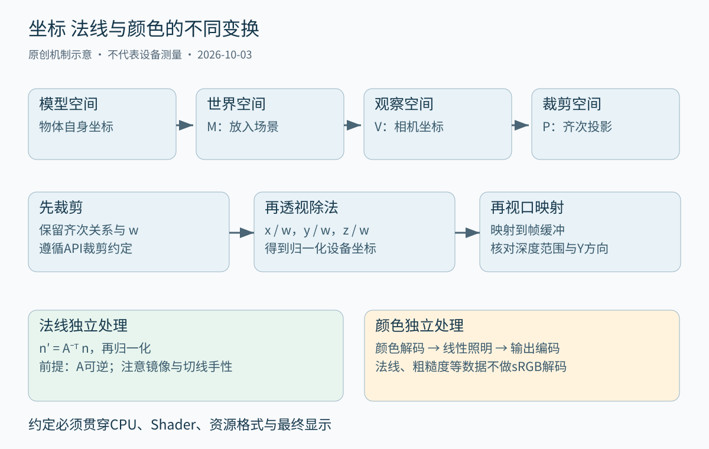
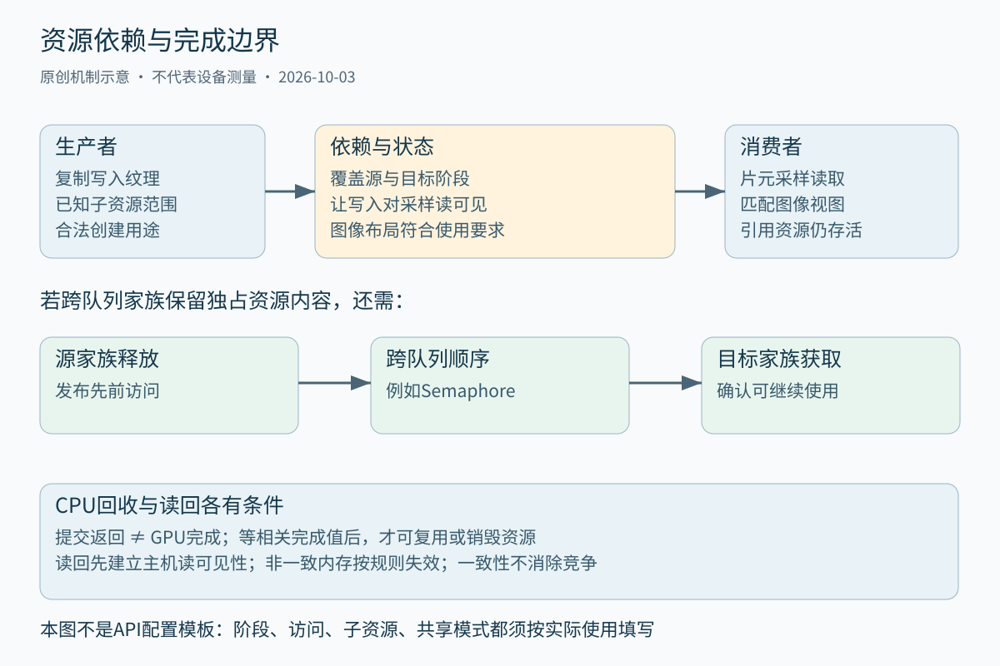
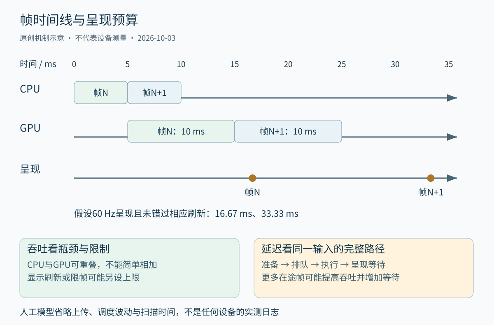

# 第三十九章 图形管线与GPU渲染

图形渲染把场景描述变成可以显示的图像。场景描述包含几何、材质、光源、相机与时间状态，图像则是有限数量的像素。二者之间需要投影、可见性判断、光照近似、采样和色彩转换，还需要把这些工作正确地安排到 CPU、GPU 和显示系统上。几何公式正确，不代表资源访问没有竞争；GPU 很忙，也不代表用户看到了流畅画面。

**图形管线**是这些阶段及其数据关系的组织方式。现代 GPU 可以并行处理大量顶点、片元和计算任务，但工作之间仍然有依赖，内存仍然有容量与可见性约束。理解图形工程，必须把数学模型、接口契约和执行时间线连在一起，避免只靠画面“看起来差不多”判断正确性。

本章以光栅化为主线，讨论 OpenGL 与 Vulkan 的状态、资源和同步模型，再把性能归入完整帧预算。OpenGL 采用 4.6 Core Profile、2022-05-05 规范修订作为固定参照；Vulkan 教学接口以 1.3 功能范围为基线，规范和 Guide 的滚动页面于 2026-10-03 核验，不把页面里的所有新扩展当成 1.3 核心能力。所有数字均为教学演算，未运行图形程序、Shader、驱动基准或 GPU 调试器。

## 39.1 坐标变换 光照采样和渲染数学

### 39.1.1 坐标是相对于基底的描述

一个三维点的三个数值，只有连同坐标系才有意义。模型空间便于描述物体自身，世界空间把多个物体放在共同场景中，观察空间把几何表达为相对于相机的位置。**模型矩阵**、**观察矩阵**与**投影矩阵**分别承担相应变换，不能仅凭矩阵是 4×4 就判断其作用。

本章采用列向量约定，写作 `p_clip = P × V × M × p_model`，最右侧变换先作用。采用行向量的程序可以得到同样几何结果，但需要调整乘法顺序与矩阵表示。行主序、列主序描述矩阵元素的内存排列，行向量、列向量描述代数约定，二者有关联但不是同一个选择。移植时只转置数组而不统一约定，常会使局部例子偶然正确、组合变换却错误。

**齐次坐标**用额外分量统一表示仿射变换。普通点通常写成 `(x,y,z,1)`，方向写成 `(x,y,z,0)`，于是平移影响点而不影响方向。经过投影后 w 不必保持为 1；齐次表示中比例相同的四维坐标可以对应同一个三维点。PBRT 第四版对坐标变换和齐次表示提供了可核对的推导。[S1]

调试变换时，应先用原点和三个基向量验证平移、轴向和尺度，再验证相机观察方向与组合顺序。直接对复杂角色模型检查“为什么看不见”，容易把导入单位、左右手坐标、矩阵转置和裁剪问题混在一起。一个明确标轴的简单几何体，往往比更多打印日志更能定位约定分歧。

### 39.1.2 裁剪 透视除法和视口映射是不同步骤

投影输出首先位于**裁剪空间**。图元需要依据相应 API 的裁剪规则处理，然后通过透视除法计算归一化设备坐标，例如 `x_ndc = x_clip / w_clip`。最后才由视口映射到帧缓冲坐标。不能提前把所有顶点除以 w 再自行按普通立方体裁剪，尤其是在图元跨越相机附近或 w 符号变化时。

透视投影使远处同样大小的物体覆盖更小屏幕区域，投影中的除法负责这种关系。正交投影适合某些工程视图与界面，它不按距离缩小物体，但仍需要明确裁剪区间和深度。选择投影模型是决定图像表达方式，不是单纯修改一个“透视开关”。

OpenGL 默认裁剪深度惯例与 Vulkan 默认惯例不同，相关控制功能还能改变某些映射。以常见默认情况说，OpenGL 归一化设备深度为 −1 到 1，Vulkan 为 0 到 1；不能将一套投影矩阵未经核对直接搬到另一 API。视口 Y 方向、图像行方向与正面绕序也需分别检查，简单把图像上下翻转未必解决剔除与深度错误。[S2]、[S3]

深度缓冲中的值一般不是世界距离的线性刻度。透视投影下精度分布与近远裁剪面有关，近裁剪面设得过小，会让远处相近表面更难区分。反向深度等技术可在特定深度格式和投影约定下改善精度，但要同时改变投影、比较方向、清除值以及依赖深度的后处理，不能只把比较函数翻转就宣称完成迁移。

### 39.1.3 法线必须保持与切平面正交

**法线**描述表面局部朝向，光照、剔除辅助判断与材质计算都会使用它。它虽然也有三个分量，却不能在所有情况下像位置方向一样直接乘模型矩阵。假设线性变换为 A，原法线 n 与切向量 t 满足 `nᵀt = 0`，变换后要求 `n′ᵀAt = 0`。当 A 可逆时，选择 `n′ = A⁻ᵀn` 可以保留这个正交关系。

这就是**逆转置法线矩阵**的来源。只有旋转或某些可归一化消除的统一尺度等特殊条件下，直接使用原线性矩阵才可能得到等价方向。非均匀缩放是最容易暴露错误的情况：沿一个轴拉伸模型，却按同样方式拉伸法线，会让表面看起来像被错误照亮，而不是简单拉长。

法线插值以后通常需要重新归一化；长度不再为 1 的法线会改变点积的数值含义。零尺度导致变换不可逆，不能继续求逆再期望浮点运算给出有意义结果。负尺度或镜像还可能改变定向和绕序，需要把几何面法线、着色法线与正面判定一起核对，而不是在某个 Shader 中随意乘一个负号。

**切线空间法线贴图**用局部切线、副切线和法线构成基底，再把纹理中编码的方向转换到参与光照的空间。UV 镜像、切线手性、法线贴图通道约定和压缩格式都可能影响结果。诊断时可以先显示变换后的法线颜色，再关闭法线贴图比较；若仅在镜像 UV 区域出现接缝，应优先检查切线基底，而不是调光源强度。

### 39.1.4 光照模型需要一致的空间和能量含义

**光照计算**估计从表面射向观察方向的光。最简单的漫反射模型用表面法线与入射方向的夹角调节响应；更完整的模型使用**双向反射分布函数**（BRDF）描述入射光怎样分布到出射方向。模型中的量需要统一单位、空间与方向约定，不能把材质颜色、光源功率和屏幕码值都当成可随意相乘的三个数。

渲染方程把自发光与各入射方向的反射贡献联系起来，其中包含 BRDF、入射辐射亮度和投影余弦等因素。实时渲染通常通过有限光源、环境贴图、预计算或采样近似它，而不是对每个像素精确积分所有光路。PBRT 的光传输方程讨论可以帮助区分物理量和算法近似。[S4]

材质参数应具有明确含义。粗糙度控制微表面分布相关特征，不等于“亮度反过来”；金属度工作流是一种实用参数化，也不覆盖所有混合材料、薄膜和介质现象。所谓物理基础渲染仍依赖近似、参数范围和输入校准，不能因为用了 PBR Shader 就推断结果具有工程测量精度。

常见错误来自空间混用：世界空间法线与观察空间光方向做点积，或者把未归一化向量直接作为方向。可以构造一个固定法线平面，让光源按已知方向移动，观察响应是否符合预期；再逐项加入法线贴图、环境光和阴影。每次只引入一种机制，才有机会把错误归因到具体步骤。

### 39.1.5 线性色彩决定加法和混合是否表达光

灯光累加、物理反射和多数过滤运算需要在线性光相关空间中进行。sRGB 等图像编码的码值是非线性的，直接把两个码值相加或求平均，不等于把对应光量相加或平均。第三十八章已经区分传递函数与色域，这里需要把区别落实到纹理读取、Shader 工作空间和输出转换。

以标准 sRGB 曲线的理想黑白平均为例，先解码为线性值后平均得到 0.5，再编码约为 0.735；直接平均码值得到 0.5，解码回线性约为 0.214。这个数学例子说明，同样写“取平均”，在不同数值域表达不同结果。真实显示还涉及环境与显示校准，此处只比较编码运算，不提供主观亮度预测。[S2]、[S5]

颜色纹理可以需要 sRGB 解码，法线、粗糙度、金属度、遮挡或深度等数据纹理通常不应被当成颜色做相同解码。把法线贴图标成 sRGB，数值会先被非线性变换，方向自然错误。渲染目标的编码转换也应只在正确边界发生，重复编码会变亮，漏掉编码可能变暗。

透明度还需要说明是直通 alpha 还是预乘 alpha。预乘表示把颜色先乘覆盖或透明权重，能使某些滤波和合成更自然，但要求混合因子与数据约定一致。边缘黑边不一定是压缩质量差，也可能是透明像素颜色、预乘约定或过滤空间不匹配。诊断时应同时检查纹理内容和混合状态。

### 39.1.6 光栅化与纹理采样都在近似连续量

**光栅化**判断图元覆盖哪些采样位置，并为片元提供插值后的属性。片元不是最终像素的同义词：一个像素可能有多个覆盖样本，也可能被多个图元重复处理，部分片元最后因深度或模板测试被丢弃。用屏幕像素数估计全部 Shader 工作量，需要考虑覆盖、过度绘制和采样方式。

透视投影后的属性插值通常需要**透视校正**。简单说，屏幕重心权重不能直接用来线性混合投影前纹理坐标；要结合各顶点的 1/w 做校正。沿倾斜平面画棋盘纹理，如果错误使用仿射插值，会出现随视角变化的扭曲。接口也允许选择平面或其他插值语义，应依据数据含义决定。

纹理放大时，插值重建有限样本；缩小时，一个屏幕像素可能覆盖许多纹素，需要低通性质的过滤。**Mip层级**预先保存不同尺度表示，降低远处纹理闪烁和带宽，但生成过程也应使用合适的数值空间。法线等方向数据不能不加考虑地沿用普通颜色平均。

**各向异性过滤**帮助处理倾斜表面上不同方向尺度差异较大的采样足迹。MSAA 主要改善几何覆盖边缘，不会自动解决所有材质高频、阴影或时间变化的锯齿。抗锯齿方案应匹配误差来源；把多重采样数加大，却不处理高频法线或时间不稳定，可能花费更多带宽而问题仍在。

图 39-1 坐标、法线与颜色有各自的转换规则。箭头表示概念依赖，不宣称硬件严格串行执行。来源：本章原创，结合齐次坐标推导和图形规范。

### 39.1.7 数学问题应先用不变量定位

画面错误可以通过一组不变量分类：刚体旋转应保持长度与夹角，法线应垂直于切平面，静态相机下静态几何不应逐帧漂移，同一材质在等价坐标变换后应维持一致光照。验证这些性质，比盲目交换矩阵乘法顺序更有信息量。

深入追问：“顶点和法线都乘同一个矩阵，为什么球缩放后高光错了？”答案应指出非均匀缩放不保持角度，普通方向变换不能维持法线与变换后切平面的正交；使用可逆线性部分的逆转置并归一化，再检查负尺度、切线基底和光照空间。仅回答“法线要 normalize”不够，归一化只能修复长度，不能修复错误方向。

深入追问：“透视除法为什么不能由顶点Shader随手提前做掉？”因为裁剪、插值以及后续阶段依赖齐次信息与 w；提前丢掉这个信息可能破坏跨裁剪面图元和透视校正。若特定效果确实手工操作位置，需要证明它仍满足管线约定，而不是把某个简单三角形显示正常当成普遍正确性。

## 39.2 OpenGL Vulkan Shader与资源绑定

### 39.2.1 图形API规定可观察契约 不规定唯一硬件布局

**图形 API**提供创建资源、描述状态和提交绘制的方式。API 阶段便于推理，但不能把一张管线图直接当作 GPU 芯片上独立模块的精确排列。驱动可能编译、重排或合并内部工作，只要满足接口的可观察要求。性能结论需要目标设备证据，不能由接口调用数量直接推断。

**Shader**是在可编程阶段执行的程序，例如顶点着色器变换顶点，片元着色器生成片元相关输出，计算着色器处理更一般的数据。Shader 的输入输出、执行频率、资源访问和同步能力受阶段与 API 约束。不能把片元 Shader 想成按屏幕从左上到右下逐像素运行的普通循环。

同一个 Shader 源程序经过编译，可能产生不同指令、寄存器用量和访存行为。动态分支如果同组执行单元走不同路径，可能损失并行效率；少写几行代码不等于指令更少，更不等于帧时间更短。第四十四章将进一步讨论通用 GPU 计算的执行与数据布局，本章重点是图像生成、资源依赖与帧完成。

### 39.2.2 OpenGL把许多选择保存在上下文状态中

OpenGL 的**上下文**保存大量图形状态。绘制命令使用当时的程序、顶点输入、纹理和采样器、帧缓冲、深度、混合、视口等配置。一个模块如果修改状态却未履行调用约定，后续模块可能在完全不同的位置呈现错误，因此渲染器应明确状态所有权，而不是依靠“上一个函数应该已经设置好”。

OpenGL 4.6 Core Profile 的对象包括缓冲、纹理、程序、顶点数组和帧缓冲等，现代接口也提供直接对象访问等方式减少部分绑定式编辑，但绘制所需状态仍有明确来源。创建一个缓冲对象不等于已经把它的内容以正确格式接到顶点输入；纹理对象存在也不等于采样单元、采样器和 Shader 关联正确。[S2]

OpenGL 的传统命令模型为很多操作提供较隐式的管理，驱动也可能为更新正被使用的资源安排等待或内部替换。它不代表应用永远无需同步：持久映射、图像读写、存储缓冲等场景都有专门可见性与屏障要求。应根据资源访问类别查规范，不能把“同一上下文依次调用”泛化为所有内存访问都已安全完成。[S17]

调试状态泄漏时，可以给每个渲染通道声明输入状态和输出状态，或者由集中状态缓存保证实际设置与预期一致。调试版本还可在关键边界验证绑定、附件完整性与错误信息。到处保存恢复所有状态虽然容易理解，却可能增加成本，也无法替代跨线程上下文使用约束。

### 39.2.3 Vulkan要求应用显式表达更多生命周期和依赖

Vulkan 把实例、物理设备、逻辑设备、队列、命令缓冲和资源等对象分开。应用查询设备能力，创建所需对象，将命令记录到命令缓冲，再提交给队列。它给应用更多控制，也把内存分配、同步、资源布局和生命周期的更多责任交给应用。

**图形管线对象**组合 Shader 与一部分固定功能状态；哪些状态可以动态设置、哪些功能可用，需要按版本、扩展和实际设备能力判断。Vulkan 1.3 提供本章讨论的部分现代接口基线，但 API 版本号不能代替所有 feature、limit、format 和队列属性查询。滚动文档出现某个扩展名称，也不证明目标设备支持。[S6]

显式 API 不会自动比另一 API 快。如果应用为了省几次驱动状态检查，却引入过多提交、过宽屏障、频繁内存分配或 CPU 等待，可能更慢。它的收益来自能根据已知工作负载组织并行与资源，而不是函数名称更底层。迁移目标应绑定可测瓶颈，不应把重写接口本身当成绩。

工程抽象也需要恰当。把 Vulkan 再包装成一个隐式全局状态机，可能丢掉显式依赖优势；把每一层资源细节都暴露给业务，也会使项目难以维护。通常应让场景代码描述需要什么，让渲染后端掌握资源状态、提交与回收，边界使用可检查的声明。

### 39.2.4 资源绑定把Shader里的名字连接到真实存储

Shader 中声明“读取一幅纹理”只描述接口，不会凭空生成数据。应用还必须创建资源、提供内容、定义视图和采样方式，再把它绑定到对应位置。**纹理视图**可以选择格式、层级和切片，**采样器**控制过滤与寻址，资源存储则承载实际数据。这些概念分开，才能复用相同图像的不同访问方式。

Vulkan 的**描述符**描述 Shader 如何访问缓冲、图像和采样器等资源；描述符集布局和管线布局形成接口契约。集合编号、绑定编号、描述符类型、数组数量、阶段可见范围与实际 Shader 必须相容。把缓冲内容写对，却绑定到错误集合，结果仍可能完全无关。[S7]

可以把一个教学材质设计成三类数据：每帧相机矩阵、每物体变换与每材质纹理。它们更新频率不同，适合不同的组织与复用策略。这不是规定必须三个描述符集，而是说明按生命周期分组可以降低重复更新，也使资源责任更清楚。动态偏移或其他方案还要检查对齐、范围和设备限制。

描述符本身的生命周期不等于它引用资源的生命周期。GPU 仍可能通过已提交命令访问旧绑定，应用不能因 CPU 已经切换到下一材质就销毁图像。对绑定后更新、部分绑定、动态索引等机制，只有启用并满足相应 feature 与使用规则才可依赖；不要把高级扩展例子套到普通描述符上。

### 39.2.5 CPU结构体与Shader布局必须逐字段核对

CPU 的 C++ 结构体布局受类型、对齐与填充规则影响，Shader 缓冲布局又有自己的规则。名称相同、字段顺序相同，不证明二进制布局相同。三分量向量尤其容易让人误以为一定紧接十二字节后放下一个字段，矩阵的主序、步长和数组间距也需要明确。

正确做法是选择并记录接口布局规则，结合 Shader 反射或编译产物核对每个字段偏移、数组步长与缓冲范围；CPU 侧使用显式对齐和静态断言等方式保持契约。不能通过随意在结构体末尾补几个字节，修复所有字段偏移。第八章的 ABI 思维在这里延伸到 CPU 与 GPU 的二进制边界。

数值精度也属于接口。某些移动路径支持不同精度或格式选择，压缩法线、半精度浮点或归一化整数节省带宽的同时会改变误差。世界坐标很大时，把绝对位置直接存入单精度可能损失小位移；可使用局部坐标、相机相对表示或更高精度的 CPU 场景状态，但要保持各阶段转换一致。

诊断某个对象的矩阵时好时坏，应检查动态缓冲偏移是否对齐、环形缓冲是否提前覆盖、CPU 与 Shader 是否对矩阵采用同一约定，再调查浮点精度。画面随并发帧数改变，通常比“颜色一直稍偏”更提示生命周期问题。不同症状需要不同证据，不能都归因于驱动。

### 39.2.6 绘制组织在状态切换和可见性之间取舍

每个绘制调用有 CPU 记录、驱动处理和 GPU 调度等成本，因此批处理、实例化和间接绘制可以减少某些固定开销。**实例化**适合共享几何或材质而参数不同的对象，**间接绘制**让绘制参数来自缓冲。它们减少的是特定管理成本，不会自动减少像素着色、纹理读取或三角形总量。

按材质排序可以减少状态变化，按深度排序不透明物体可以帮助早期深度拒绝，按空间组织又有利于剔除与流式加载。这些目标可能冲突。把整个城市合成一个巨大网格，绘制次数少了，却可能失去细粒度可见性剔除，导致更多看不见的几何也被提交。

透明物体通常还受混合顺序影响。简单前后排序无法精确处理相互穿插的透明几何，顺序无关透明等方法又有不同近似与资源成本。不能为减少 draw call 随意重排依赖混合顺序的对象。优化前先写明哪些重排保持画面语义，再决定批次边界。

深入追问：“十万次绘制合成一次，是不是一定更快？”不是。要看原瓶颈是否为 CPU 提交，合并后是否增加不可见工作、材质分支、索引范围、更新成本或内存占用。应固定场景、相机和质量，用 CPU 提交时间、GPU 各通道时间及可见对象比例共同检验；绘制次数只是线索，不是优化目标本身。

## 39.3 命令缓冲 同步 GPU内存和帧分析

### 39.3.1 命令记录 提交 执行和显示有四个完成点

CPU 记录命令，表示把将来要做的事情写入可提交形式；提交成功，表示工作已交给队列接受；GPU 完成，表示相关执行和访问达到指定同步点；显示完成，还涉及呈现系统与扫描输出。它们是不同事件。一个提交函数返回很快，不能证明 GPU 很快，更不能证明显示延迟很低。

Vulkan 命令缓冲有初始、记录、可执行、待执行等生命周期状态及相应使用约束。命令池、命令缓冲和队列调用还涉及主机侧外部同步要求。多线程记录通常需要按线程或职责组织命令池，不能让多个线程无保护地修改同一受外部同步约束的对象。[S8]

如果某帧使用了顶点缓冲、纹理或描述符，这些对象及其被访问的存储必须至少活到相关 GPU 工作完成。C++ 对象离开作用域只说明 CPU 所有者结束，不能证明设备已经停止访问。RAII 在图形系统中常需要接入**延迟销毁队列**，等 fence 或时间线进度确认后再真正回收。

同样，命令缓冲可以被重用不等于它引用的所有状态都可以任意改写。动态资源内容、绑定对象和记录方式各有约束。调试时若加入一次全设备等待后错误消失，说明同步或生命周期值得调查，但全等待只是诊断线索，不是最终性能方案。

### 39.3.2 执行顺序与内存可见性要分别证明

GPU 上的工作可以流水和并行。两个命令按顺序记录，不等于前一命令的全部内存写入在后一命令所有阶段都已经可见。**执行依赖**约束哪些操作必须先完成到什么程度；**内存依赖**还约束写入的可用性与后续访问的可见性。Vulkan 规范明确区分这些概念。[S9]

常见访问危险包括读后写、写后读和写后写。前一个读尚未结束就覆盖数据，需要防止覆盖过早；前一个写产生的数据被后续读使用，还需要让结果对正确访问类型可见。不能因为三种危险都叫“需要同步”，就为它们随意使用完全相同的屏障。

**管线屏障**中的源阶段和目标阶段约束执行范围，访问掩码描述涉及的访问类型，缓冲范围或图像子资源范围限定数据。源阶段写错，可能没有覆盖真正生产者；目标访问写错，可能没有让结果对消费者可见。将所有范围都设成最宽，可能作为某些定位手段，却容易牺牲并行，也不能修复错误布局或对象生命周期。

这里的“可见”不是屏幕可见，也不是 CPU 已经能读到的同义词。它是某类内存访问能观察到写入结果的 API 概念。应在依赖记录中写出生产者、消费者、资源范围、阶段与访问，再映射为具体屏障；先复制一段屏障代码再猜它适合什么，容易产生无法审查的同步逻辑。

### 39.3.3 一个传输到采样的例子如何拆出必要条件

考虑教学场景：先把纹理数据复制到图像，再在片元 Shader 中采样。必须先确认图像创建用途支持复制目标与采样，内存绑定正确，初始与目标布局符合操作，复制范围和像素格式相容。同步只能约束合法资源操作，不能让错误创建参数变合法。

在同一队列的常见路径中，复制写作为生产者，片元 Shader 采样读作为消费者；需要相应执行与内存依赖，并按实际旧布局转到适合采样的布局。图像屏障要覆盖真正更新的 mip、数组层和方面。只屏障第零层，却采样了新上传的其他层级，会留下未证明安全的访问。

如果资源由不同队列家族使用，且采用独占共享模式并需要保留已有内容，还要按规则处理**队列家族所有权转移**。常见方式包括源队列释放、通过 semaphore 建立跨队列顺序、目标队列获取。所有权转移不能替代跨队列执行依赖，单纯有 semaphore 也不能自动补上所有需要的布局和所有权操作。[S10]

同一家族的不同队列，不因为是不同队列就必然需要队列家族转移，但仍要正确同步；并发共享模式改变所有权要求，也不取消访问依赖。丢弃旧内容的特殊路径有不同条件，不能把“从未定义布局开始”当成可以随时无视正在进行的访问。每次丢弃都应证明旧内容不再需要且操作不与其他使用竞争。

图 39-2 同步回答多个独立问题。图示不是可直接复制的 API 配置，实际阶段、访问掩码、子资源和共享模式必须由资源使用决定。来源：本章原创依赖拆解。

### 39.3.4 Fence Semaphore与屏障各自连接不同边界

**Fence**常用于让主机知道某次提交相关设备工作已经完成，以便重用帧资源或回收内存。**Semaphore**主要连接队列工作之间的依赖，时间线信号量还允许用单调进度值表达多次完成并与主机交互。它们不是能在任意位置互换的“等待按钮”。[S11]

等待 fence 可以确认其覆盖的执行完成，却不会自动让设备写入对主机读取可见。读回路径还需要覆盖实际设备写入到主机读的内存依赖，例如以相应写阶段和访问类型为源、主机读为目标的屏障；再等待完成，并在非主机一致内存上按规则使映射范围失效。主机可见只说明存在可访问映射条件，不说明缓存一致，也不说明没有数据竞争。[S9]、[S10]

帧内屏障把生产者和消费者连接起来，跨队列信号量连接各队列工作，主机等待则控制 CPU 的回收与复用。把每个通道后面都插入主机等待，可以把危险隐藏在全串行执行中，同时失去流水优势。更合理的设计是只在确实需要 CPU 观察结果或复用资源时等待。

呈现也有自己的同步与资源生命周期。交换链图像数量、CPU 允许提前准备的帧数、GPU 在途工作数量不是天然相同的概念。获得一个可用图像，并不表示任意上一帧资源已经安全重用；应将“图像何时可绘制”和“某组帧资源何时空闲”分别追踪。

### 39.3.5 GPU内存管理首先管理归属 用途和峰值

Vulkan 资源对象与承载它们的设备内存是相关但不同对象。实际设备提供不同内存类型与堆，主机可见、主机一致、设备本地等属性可以有不同组合，不能把“独立显卡”和“集成显卡”简化成两套固定内存规则。应查询目标设备并依据用途分配。[S12]

通常不宜为每个小资源都做一次底层设备内存分配。**子分配**从较大的内存块中划分区域，降低分配次数并便于管理；它同时需要处理对齐、类型兼容、碎片和回收。资源别名复用可以减少峰值。为让同一区域先后承载不同内容，要证明先前访问已经结束、旧内容已不再需要，并满足相应别名与同步规则。不同资源对象本身可以同时存活，不能仅凭“上一通道已经提交”就重用存储。[S13]、[S18]

教学预算中，一张 3840×2160、每像素 8 字节的颜色图像，基础层紧密容量为 66 355 200 字节，约 63.28 MiB。若同时保留三个同规格图像，约 189.84 MiB，还没有计深度、多重采样、其他中间目标、对齐和驱动开销。图像看似只有“一个对象”，资源成本却可能显著。

多级纹理在二维尺寸每级减半、直到很小且忽略边界的理想模型中，全部 mip 约为基础层的 `1 + 1/4 + 1/16 + … = 4/3`。这个近似不应照搬到任意数组、三维纹理、块压缩小层级或实际设备分配。容量预算要用资源描述和查询结果校验，再加上上传暂存、旧新版本并存和帧在途造成的峰值。

### 39.3.6 映射和一致性不等于允许同时改写

**映射**让 CPU 获得访问某段设备内存的地址。对非主机一致内存，CPU 写入后通常需要按规则刷新范围，设备写入后 CPU 读取前需要相应失效操作；具体顺序还要满足执行依赖。`vkFlushMappedMemoryRanges` 的范围与 `nonCoherentAtomSize` 等规则相关，解除映射本身不自动刷新未发布的写入。[S14]

即使内存是主机一致的，CPU 也不能在 GPU 正在读同一位置时任意覆写。缓存一致性解决不同访问者怎样观察值，数据竞争和生命周期仍需单独解决。常见动态缓冲策略是按在途帧划分片段或使用带完成标记的环形缓冲，写入前确认目标区域不再被设备使用。

读回也有成本。每帧为了显示调试数字而等待 GPU 并映射结果，可能把原本并行的 CPU 与 GPU 串行化。可以延后读取几帧前的计数，或使用异步读回与可用性检查，代价是统计不是当前瞬间。必须明确调试信息允许滞后多少，不应为了看上去实时而破坏被测系统。

如果画面错误只在多个在途帧时出现，应审查每帧常量、描述符、上传缓冲和临时图像的复用时刻。单帧模式正常只能说明某些重叠访问被消除了，不证明资源设计正确。根治需要把每一份数据的最后使用点和安全回收点写进实际管理结构。

### 39.3.7 帧图把资源依赖变成可检查的数据

**帧图**或渲染图把一帧的通道、资源读写和先后关系表达成图。深度预通道生成深度，后续光照读取它；后处理读取颜色并产生新颜色；最终合成写入可呈现目标。显式图有助于发现未初始化读取、无用通道、资源生命周期和可并行区间。

图的价值取决于声明是否真实。Shader 通过隐藏绑定读了一张没有声明的图像，或者插件在图外改写资源，自动屏障就可能缺少必要依赖。框架需要约束外部访问，或者提供明确的导入、导出和状态交接接口。自动生成同步不是免于理解同步，而是把理解集中到可验证的规则中。

资源别名分析需要完整覆盖在途帧、外部持有和异步队列。两个通道在拓扑顺序上不相邻，不代表其设备执行时段一定不重叠；两个逻辑纹理名称不同，也不保证底层存储不同。帧图编译器应把分配、使用和回收计划与执行依赖共同生成，而不是分别优化后再期待它们恰好相容。

调试构建可以给通道、命令缓冲和资源设置可识别名称，保存每个资源的生产者与消费者。这样一份抓帧里的“第 217 个绘制”才有机会映射回具体阴影、材质或后处理。可观察性应在架构中保留，不能等复杂场景已经黑屏时再补。

### 39.3.8 帧分析先找关键路径 再解释计数器

CPU 时间和 GPU 时间属于不同执行时间线，不能只围绕提交函数测墙钟就得到 GPU 执行成本。GPU 时间戳查询还受支持阶段、时间戳有效位、计时周期和可用性等条件约束；读取查询结果时强制等待，又可能扰动流水。工具报告也要说明抓帧或插桩带来的改变。

RenderDoc 等抓帧工具可以帮助查看调用、状态、资源和结果，但支持范围与实际功能依 API、平台和版本而定。本次核验使用其官方项目仓库确认工具定位，未运行抓帧，也不宣称所有驱动问题都能重放。[S15]硬件计数器工具另有设备与权限限制，不能把某一厂商指标名称视为跨平台同义词。

定位瓶颈可先做受控扰动：降低分辨率后 GPU 时间显著下降，支持像素相关成本较重要这一线索；减少物体数量后 CPU 提交明显下降，支持绘制组织成本相关；替换简化材质后变化明显，支持 Shader 或纹理访问相关。每一种都只是证据，仍需排除改变遮挡、缓存和质量产生的其他影响。

不能把 GPU 利用率高简单理解为算术单元饱和。等待内存、带宽、纹理、光栅或同步都可能表现为忙。计数器应与通道时间、资源流量和改变一个变量的实验配合。第二十章对“相关计数不等于唯一原因”的提醒，在高度并行的 GPU 上尤其重要。

## 39.4 实时渲染质量预算及跨平台兼容

### 39.4.1 帧预算应从体验期限倒推

稳定 60 次／秒呈现的理想周期约为 16.67 ms，120 次／秒约为 8.33 ms。这个周期不是允许 CPU、GPU 和所有等待各自使用这么多再相加，而是完整流水需要在目标节奏下交付图像。不同阶段可以重叠，最终受关键路径和可用并行度限制。

假设教学系统每帧 CPU 准备 5 ms、GPU 执行 10 ms。如果合理流水且没有其他瓶颈，稳态吞吐可能主要受 10 ms 阶段限制；某次输入到对应画面显示的延迟，却仍包含准备、排队、GPU 和呈现等待，不能直接写成 10 ms。帧率与交互延迟相关，但不是同一个指标。

**帧时间分布**比平均 FPS 更能反映卡顿。多数帧很快而少数帧极慢，平均值仍可能漂亮。应观察超预算比例、高分位、连续慢帧长度与输入到显示延迟，说明场景、相机路径、热身、着色器缓存和运行时长。加载、首次进入效果区和稳定巡航应分别统计。

预算还需要余量。把所有静态通道测得的平均时间精确填满 16.67 ms，没有为粒子突发、系统调度、流式上传和热限制留下空间。余量不是浪费，而是吸收变化的容量；应根据目标设备和最坏可接受场景确定，不能将桌面高端显卡的余量直接推广到移动端。

图 39-3 帧吞吐、执行时间与交互延迟不是同一指标。所有长度与数字为教学示意，未测量任何 GPU。来源：本章原创预算模型。

### 39.4.2 几何 像素 带宽和提交成本不能用一个旋钮优化

几何密集场景需要关注顶点变换、剔除、索引与几何缓存；高分辨率后处理可能受像素着色或带宽限制；大量小物体可能首先压满 CPU 提交；复杂材质可能增加纹理访问、寄存器压力或指令成本。降低同一个参数，对不同瓶颈的影响不同。

**细节层级**（Level of Detail，LOD）根据投影误差或任务需求选择几何与材质复杂度。以屏幕误差为基础比固定世界距离更容易适应不同视场角和分辨率，但也需要迟滞或过渡策略防止来回切换。工业尺寸标注和精密轮廓显示还需要业务精度约束，不能只以“肉眼不明显”决定简化。

**遮挡剔除**减少被其他物体挡住的工作，但查询或计算自身也有成本。若每次都等 GPU 返回可见性再让 CPU 决定本帧绘制，可能因同步失去收益。保守使用历史结果、层次深度或 GPU 驱动等方案各有假阴性风险和时延约束；错误剔除导致物体消失，通常比多画一点更严重。

动态分辨率降低像素工作，不一定改善 CPU 提交或顶点瓶颈。分辨率反复剧烈跳变还会影响文字、时间重建与 UI。控制策略应使用平滑反馈和上下限，把调整作用在合适通道上，并确认当前瓶颈确实随像素数量变化。

### 39.4.3 阴影 反射和时间重建都是带条件的近似

阴影贴图从光源视角记录可见性，再在主视图中比较。分辨率有限、投影和深度精度会产生锯齿、自阴影或悬浮感；偏移参数是在误差之间取舍，过大可能让接触阴影消失。把偏移无限调大只消除了一个症状，没有提高几何精度。

屏幕空间反射和环境遮挡只能使用当前屏幕或相关缓存中的信息，屏幕外、被遮住和不存在于缓冲中的几何需要其他策略。用户看到边缘突然消失的反射，不一定是随机 bug，也可能是算法信息范围的边界。产品应决定是否接受这种近似，还是需要额外数据和预算。

时间抗锯齿、时间上采样和某些去噪利用历史帧降低当前成本或噪声。它们依赖正确运动向量、深度、曝光与遮挡变化判断。新显露区域没有可靠历史，透明物体、粒子和屏幕特效的运动也可能不符合普通几何假设。拖影不能只靠降低历史权重解决；首先要检查历史是否被正确定位和拒绝。

算法质量评估应包含静态细节、慢速相机运动、快速转向、遮挡揭露和高对比边缘。只截一张静态图比较，无法发现时间闪烁与拖影。渲染工程中的“图像正确”通常同时具有空间和时间维度，质量预算也应覆盖两者。

### 39.4.4 跨平台兼容是一张能力矩阵

跨平台不是把工程编译通过就完成。需要记录图形 API 与版本、扩展与 feature、纹理格式、附件格式、采样数、资源限制、Shader 编译器、驱动、窗口系统与显示能力。能力查询失败或不支持某功能时，应有明确回退或拒绝条件，不能继续使用未定义结果。

移动 GPU 与桌面 GPU 在执行和存储组织上存在多种差异，一些采用基于分块的渲染方式，对附件保留、读回和通道组织特别敏感；但不能据此断言所有移动芯片完全相同，或所有桌面设备都没有类似特征。平台优化应有实际设备与工具证据，并避免把某厂商经验写成 API 保证。

Shader 跨语言或中间表示转换也需要验证资源布局、精度、内建变量、坐标和插值语义。相同效果在两个后端上图像略有不同，可能来自允许的浮点差异，也可能是真正语义错误。应先定义容忍度和关键不变量，再用参考图、数值检查和功能测试区分，不宜要求所有平台逐像素完全相同。

Vulkan 的 portability 相关机制帮助描述某些平台能力边界，但并不让每项 Vulkan 功能自动变成原生同等实现。项目应列明最低功能集合与增强路径，避免启动时只检查一个版本整数就选择最复杂渲染器。[S6]兼容层、驱动更新与设备丢失恢复，也应进入发布验证范围。

### 39.4.5 首帧卡顿与资源流式加载需要独立预算

Shader 编译、管线创建、纹理解压和上传往往具有冷启动成本。稳定场景跑得快，不代表首次打开地图或切换材质时也流畅。应将准备成本尽量移到可控阶段，合理预热或缓存，并保留版本、设备与驱动变化时缓存失效的正确策略。

缓存不是任何机器间都可以复用的通用二进制保证。需要按实际 API 和驱动契约处理兼容性，遇到失效能够安全重建，不能为了避免卡顿而使用来源或格式不可验证的缓存。对用户而言，偶发长暂停与启动等待是不同体验，项目应明确愿意在哪个阶段付出成本。

**流式加载**按需要逐步引入几何、纹理和其他资源。它不仅是后台读磁盘，还包括解压、格式转换、CPU 内存、上传暂存、GPU 容量与对象替换。若所有后台任务在同一帧完成后一起上传，平均后台吞吐不错仍可能产生大帧尖峰。需要给每帧工作量与在途资源设定预算。

旧资源不能在新资源开始加载时立即回收，也不必永远保留到整个场景结束。应明确低质量占位、完成替换与最后使用点，按 GPU 完成状态释放旧对象。大场景资源管理将在第四十章进一步展开；本章的同步和生命周期约束是它的底线。

### 39.4.6 正确性验证与性能验证不能互相替代

Vulkan 验证层能发现许多无效使用、对象生命周期和同步问题，其诊断关联规范中的有效使用条件。它是开发工具，覆盖范围和运行开销需要认识；没有报告错误，不等于算法、所有 Shader 内存访问和全部时序都已证明正确。官方 Guide 明确说明了有效使用与验证机制。[S16]

正确性测试可以先使用可控小场景覆盖深度、混合、颜色、资源更新、重建和设备丢失路径；性能测试则应覆盖代表性大场景和目标设备。开启昂贵验证运行得到的时间，不应直接发布为发行版性能；关闭验证后运行快，也不允许忽略已经报告的非法访问。

抓帧会改变调度、资源持有和时序，某些竞争可能在抓帧时消失，某些性能成本也会改变。应把可重放帧用于状态与数据观察，把长时间时序采样用于帧分布和热点，必要时结合设备日志与最小复现。任何单一工具都只观察系统的一部分。

回归结果应保存构建配置、场景资产版本、相机路径、画质设置、分辨率、设备和驱动，并区分首次运行与缓存命中。若资产内容在两次测试中变化，哪怕程序版本只改了一行，也不是严格相同工作负载。第二十章的实验纪律同样适用于“改个 Shader 看看快不快”。

### 39.4.7 综合诊断与深入面试追问

教学场景中，一个渲染器从单帧在途改成三帧在途后吞吐提高，却偶尔出现材质错乱。合理优先级是检查动态常量、描述符和纹理生命周期：CPU 是否覆盖仍被前帧读取的数据，描述符是否在不允许的时机更新，上传缓冲是否过早复用。增加在途帧扩大了重叠窗口，不能把问题简单归为“多缓冲让 GPU 不稳定”。

若加入全设备等待后错乱消失，这支持存在时序相关错误，但仍需定位具体资源。可以给每次分配、更新、最后提交和完成值建立关联，检查哪个区域提前回收；然后用最小必要依赖修复。把全等待永久留下，也许恢复正确，却牺牲吞吐并掩盖架构缺陷。

**追问：“同一Vulkan队列提交的命令为什么还要屏障？”** 因为提交或记录顺序不是所有阶段和所有内存访问的完整依赖。需要根据生产者与消费者的阶段、访问和资源范围，证明先后与可见性；某些依赖由已有机制提供，不能机械重复，但缺失时也不能靠顺序猜测。

**追问：“Fence已经完成，为什么CPU读回仍可能错误？”** 先核对 fence 覆盖的是否真是那次写入，再检查是否建立了设备写到主机读的内存依赖，并核对内存属性、读回范围、映射有效性以及非一致内存的失效要求。完成通知与缓存管理是不同层次；同时还需排除 Shader 越界、格式解释或资源被其他工作再次修改。

**追问：“GPU时间从12ms降到9ms，帧率为什么没变？”** 可能原本被垂直同步、帧率上限或 CPU 限制，也可能呈现节奏没有跨过下一个阈值。改动仍可能增加质量余量或降低功耗，但必须实测确认。应同时报告完整帧间隔、CPU关键路径、GPU时间与显示限制，不能仅以FPS是否变化决定优化有无价值。

**追问：“显存还有空余，为什么不把所有纹理都常驻？”** 空余是某个时刻的观察，加载峰值、并发应用、系统保留、格式转换和在途替换会改变可用预算。更大工作集还可能影响缓存与带宽，移动设备另有功耗和热约束。正确策略是按可见性、使用概率和稳定预算管理驻留，保留失败与回退路径。

图形工程的成熟判断，不是能把所有效果同时打开，而是知道每个效果需要什么数据、产生什么误差、占用哪段预算，且能证明资源在正确时间被正确访问。数学、API 和帧时间线只有一起成立，画面才能既可信又稳定。

## 本章资料与核验范围

核验日期为 2026-10-03。OpenGL 固定参照 4.6 Core Profile 2022-05-05；Vulkan 选定 1.3 范围说明基础机制，滚动官方文档中的更新与扩展需按目标环境重新核查。PBRT 第四版用于数学与辐射度量背景。RenderDoc仅核对官方工具定位，未安装运行。本章没有已编译Shader、可运行工程或GPU实测；公式、容量与时序图均为教学模型。

[S1]: https://pbr-book.org/4ed/Geometry_and_Transformations/Transformations
[S2]: https://registry.khronos.org/OpenGL/specs/gl/glspec46.core.pdf
[S3]: https://docs.vulkan.org/guide/latest/depth.html
[S4]: https://pbr-book.org/4ed/Light_Transport_I_Surface_Reflection/The_Light_Transport_Equation
[S5]: https://pbr-book.org/4ed/Radiometry,_Spectra,_and_Color/Color
[S6]: https://docs.vulkan.org/guide/latest/versions.html
[S7]: https://docs.vulkan.org/spec/latest/chapters/descriptorsets.html
[S8]: https://docs.vulkan.org/spec/latest/chapters/cmdbuffers.html
[S9]: https://docs.vulkan.org/spec/latest/chapters/synchronization.html
[S10]: https://docs.vulkan.org/guide/latest/synchronization_examples.html
[S11]: https://docs.vulkan.org/guide/latest/synchronization.html
[S12]: https://docs.vulkan.org/spec/latest/chapters/memory.html
[S13]: https://docs.vulkan.org/guide/latest/memory_allocation.html
[S14]: https://docs.vulkan.org/refpages/latest/refpages/source/vkFlushMappedMemoryRanges.html
[S15]: https://github.com/baldurk/renderdoc
[S16]: https://docs.vulkan.org/guide/latest/validation_overview.html

[S17]: https://github.com/KhronosGroup/OpenGL-Refpages/blob/main/gl4/glMemoryBarrier.xml

[S18]: https://docs.vulkan.org/spec/latest/chapters/resources.html#resources-memory-aliasing
