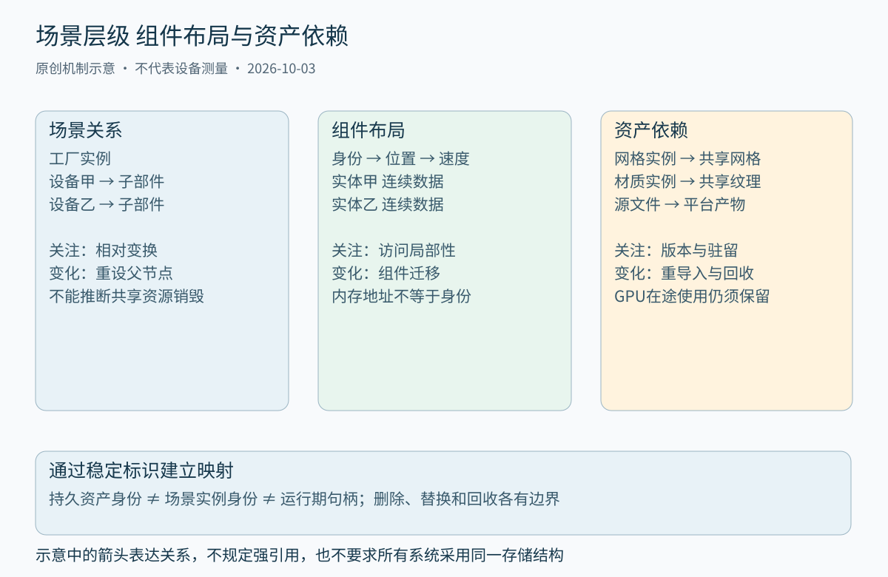
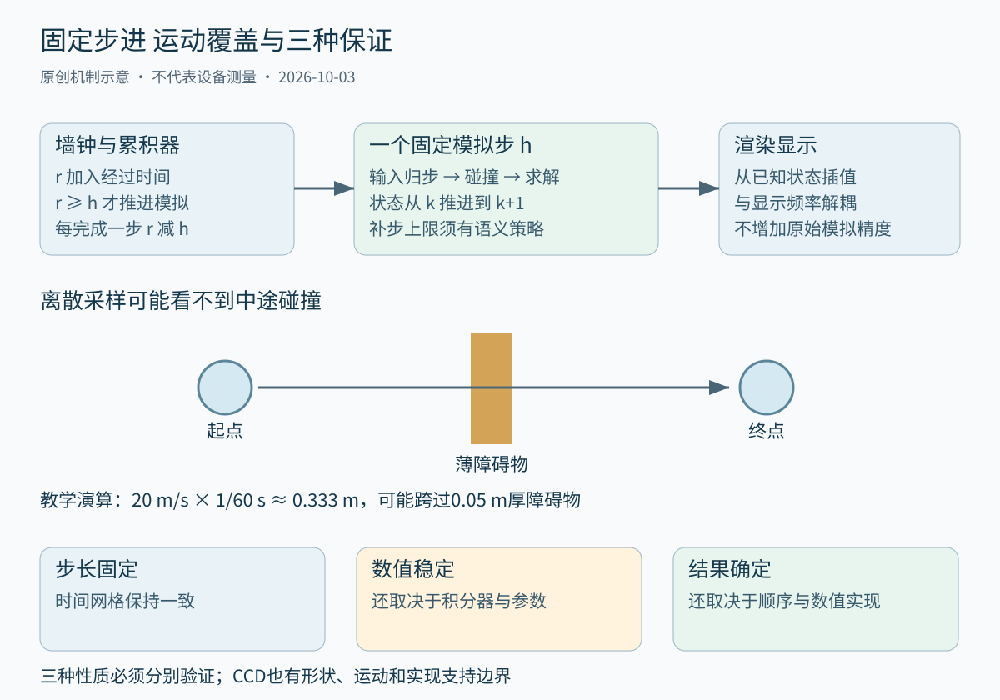
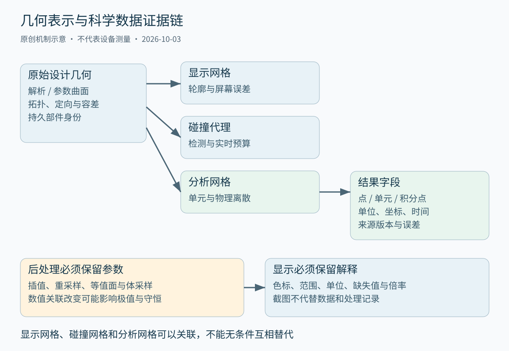

# 第四十章 游戏工业仿真与可视化引擎

**引擎**是把场景、资源、时间、交互和执行系统组织成可复用运行环境的软件。游戏引擎强调互动反馈和内容生产，工业仿真强调模型、边界条件与结果可信度，可视化引擎强调把复杂数据转换成可理解的视图。它们共享图形、数学和系统技术，但成功标准不同：画面逼真不证明物理计算准确，计算结果准确也不证明颜色映射和交互呈现没有误导。

一个完整引擎不仅包含渲染器。它还要决定对象是谁、由谁持有、何时更新、怎样加载和撤销、哪些状态可以并行访问，以及发生部分失败后如何恢复。第三十九章已经建立 GPU 资源和帧时间线，本章把这些约束接到场景、物理、几何和资产生产过程上。

所有场景与数字均为教学构造，没有运行引擎、物理求解、CAD 布尔运算或科学计算。本章按 2026-10-03 实际读取的一手资料核验；Unity Entities 使用 1.3 文档，ParaView 使用明确的 5.12.0 指南及个别已标明版本的接口说明；Box2D、Open CASCADE 和 OpenUSD 资料分别说明读取范围，不把滚动网页误称为固定旧版手册。

## 40.1 场景图 ECS资源与生命周期

### 40.1.1 场景图描述关系 不等于所有对象的所有权树

**场景图**用节点与关系组织空间对象。常见层级中，子节点保存相对父节点的变换，世界变换由祖先链组合得到。装配中的螺栓可以跟随部件移动，角色手中的工具可以跟随手骨骼，这使编辑与运动描述更自然。关系的含义必须明确：空间父子、资源引用、逻辑归属和生命期所有权不一定是同一条边。

若规定所有子节点随父节点销毁，适合某些私有附属对象，却可能误删被其他场景共享的资源。一个网格可以被一千个实例引用，纹理又可以被多个网格材质共享，这些关系形成有向图，不应为了方便遍历强行复制成树。应分别记录场景实例、资产定义和运行资源的身份与归属。

层级更新也有代价。父变换改变后，后代世界变换需要更新；可以使用脏标记、版本号或按拓扑顺序批量求值，避免每次查询都沿祖先链重复计算。缓存必须知道依赖是否失效，不能只看节点自身参数是否改变。深层级、高频编辑与循环依赖都应有明确处理规则。

重新设父节点有两种常见语义：保持局部变换，因而改变世界位置；保持世界变换，因而重新计算局部变换。编辑器应明确选择，计算还需要父变换可逆。若模型包含非均匀缩放和旋转，组合后可能出现剪切，不能假定任意矩阵都能无损还原成简单位置、旋转、尺度三项。

### 40.1.2 ECS把身份 数据和行为分开

**实体组件系统**（Entity Component System，ECS）把实体作为身份，组件保存某一类数据，系统处理满足条件的实体集合。实体可以同时拥有位置、速度、渲染描述和碰撞形状，而不必通过一条庞大继承链表达全部组合。这有利于批量处理和功能组合，但并没有规定唯一内存布局或调度器。

一种实现采用**原型**，把组件类型集合相同的实体归为一组，按块紧密保存各组件数组。Unity Entities 1.3 的 archetype 与 chunk 文档说明了这种设计：同一原型的组件按对应数组组织，实体移动或删除时可能发生存储重排。[S1]这只是一个具体实现参照，不能据此断言所有 ECS 都使用相同块大小或迁移方式。

另一类实现可能为组件类型使用稀疏集合，再在查询时求交集。前者常有利于遍历一组经常共同使用的组件，后者可能在某些增删和稀疏关系上更方便。真正选择应比较查询模式、组件大小、结构变化频率、缓存命中和开发复杂度，而不是只问“是不是 ECS”。

身份与地址分离非常重要。实体的组件位置会因压缩存储、原型迁移或分配变化而改变，长期保存裸指针容易失效。带代际的句柄可以帮助识别槽位复用，但代际回绕、序列化身份和跨世界引用仍需额外设计。一个运行期整数 ID 通常不能直接当成跨文件、跨进程永久身份。

### 40.1.3 ECS的收益取决于工作负载而非缩写

若每帧对大量位置和速度做相同计算，连续布局可以减少无关字段读取并提高缓存效率；若系统需要频繁沿任意关系追踪对象，查询结果高度零散，局部性优势可能消失。ECS 不会自动把业务算法变成 SIMD，也不会自动让系统之间不存在写冲突。

组件越小越多，不一定越好。过度拆分可能增加查询、间接访问和同步成本；把所有内容装进一个巨型组件，又可能使许多系统读取不需要的数据。合适粒度来自访问关系与变更关系：一起遍历、一起拥有相近生命周期的数据可以考虑靠近，独立更新的数据应避免不必要耦合。

**结构变化**指实体组件集合、存在性或相关存储组织发生变化。在原型型实现中，增加或删除组件可能导致迁移，使迭代器和组件引用失效，并在并行调度中需要安全交接。Unity Entities 1.3 文档将结构变化与同步点成本明确区分，不能当成普通字段写入。[S2]

常见策略是在稳定读取阶段记录结构修改命令，到明确边界再统一应用。这样更容易组织任务，但并不让修改没有成本，也会改变“现在添加组件”何时可观察。事件消费者应知道它看到的是当前阶段快照还是已经应用的最终状态，避免依赖未定义的执行顺序。

面试追问：“把对象继承改成 ECS 就能提高性能吗？”完整回答应说明原瓶颈和访问模式。只有数据布局、遍历、批处理与调度真正改善了关键路径，性能才可能受益；迁移和查询成本可能抵消收益。应固定场景行为与结果，用实体数量、系统耗时、缓存、结构变化和峰值内存共同比较。

### 40.1.4 系统调度需要读写依赖与阶段语义

引擎通常把输入、逻辑、动画、物理、变换传播、剔除和渲染准备组织成阶段，但这些阶段并非所有项目都固定同序。动画驱动角色与物理驱动角色，对位姿写入的归属不同；同时让二者无协调地覆盖位置，可能出现抖动或能量注入，不能通过“谁最后运行谁赢”长期解决。

并行调度需要知道系统读哪些组件、写哪些组件，以及是否访问隐藏全局状态。两个只读系统可以并行，一个写入位置而另一个据此构建碰撞代理，就存在数据依赖。Unity Entities 1.3 的系统说明提供了一种具体系统组织参照，但业务层仍需定义更新顺序和语义。[S13]

把事件改成队列并不自动解决顺序。碰撞事件、输入事件、销毁事件和资源完成事件可能来自不同线程或时间域；需要规定事件属于哪个模拟步、对哪个对象版本有效、能否重复以及在对象销毁后怎样处理。事件携带裸指针跨阶段，比携带可验证身份更难安全管理。

渲染器常读取一份稳定场景快照，而模拟继续推进下一步。快照可以减少写冲突，但会增加复制、版本和可见延迟。只复制一层对象却保留可变资源指针，仍可能读到半更新状态。快照边界应覆盖真正会改变的依赖，而不是只给最外层容器加一个 const。

### 40.1.5 资源状态机要覆盖加载 失败 替换与回收

资产文件、CPU 解码对象、GPU 资源和场景实例是不同对象。一个纹理文件在磁盘存在，不等于已读入内存；读入压缩字节，不等于解码成功；上传提交，不等于 GPU 已可使用。资源管理器应明确这些状态及其转换，而不是只有一个含糊的 loaded 布尔值。

可采用“未请求、加载中、CPU就绪、上传中、可使用、失败、待回收”等概念状态，具体实现可以更细。每个转换要说明所有者、取消方式、错误信息和可重试条件。取消加载后，后台任务可能仍在完成 IO；不能立刻释放它仍会写入的缓冲。第三十九章的提交与完成边界在这里继续有效。

资源替换还涉及旧新版本并存。编辑器重导入材质后，可以在新版本完整就绪时原子切换逻辑引用，旧版本等最后一个消费者结束再回收。若一边改写原资源，一边让渲染线程读取，用户可能看到只更新一半的材质组合。热更新首先要保持一致状态，其次才是缩短等待。

引用计数有助于表达共享占用，却不能自动处理循环引用、资源预算或设备在途访问。缓存为了加快下次使用主动保留资源，也不应伪装成业务持有。应区分强持有、弱观察、缓存驻留和设备最后使用点，让“为什么这张纹理还没有释放”可以得到具体答案。

图 40-1 三种关系承担不同责任。线条不代表所有关系都是强引用，也不意味着父节点销毁就销毁共享资产。来源：本章原创架构示意。

### 40.1.6 场景描述与运行时表示可以不同

编辑友好的数据格式需要可读、可合并、可追踪身份和丰富元数据；运行时表示需要紧凑、快速加载、适合目标平台并支持批量访问。让二者完全相同可能简化初期开发，也可能让运行时背负大量编辑历史，或让编辑器被迫直接操作不稳定内存布局。

OpenUSD 提供层、引用、变体和按需载入等场景组合机制，其 Stage 表达组合后的场景描述。本次读取的官方 release 页面标为 26.08，正文只借它说明“多源场景描述经过组合形成视图”这一设计，而不把 USD 当成完整游戏逻辑、绑定系统或物理求解器。[S3]

转换过程应保留可追溯映射。例如一个 CAD 部件被拆成多个渲染网格，点击其中任意网格仍应能回到原始部件身份；一个源材质生成不同平台纹理，构建系统要知道它们属于同一逻辑资产的不同产物。没有这层关系，编辑、错误报告和增量重建都会退化成文件名猜测。

深入追问：“能否直接把运行期实体 ID 写入工程文件？”可以作为某种受控格式的一部分，但必须定义稳定性、冲突、导入合并和失效规则；很多运行期 ID 只是可复用槽位，不适合永久引用。更稳妥的设计通常区分持久资产身份、场景实例身份与当前运行期句柄，并维护显式映射。

## 40.2 空间索引 碰撞 物理和时间步进

### 40.2.1 空间索引把全对比较变成候选筛选

场景有 n 个对象时，直接检查每一对可能产生 `n(n−1)/2` 次比较。空间索引用位置、范围或层级组织对象，帮助快速筛掉不可能相关的对象。**轴对齐包围盒**（AABB）易于比较，**包围球**对旋转稳定，**有向包围盒**可能更贴合几何却需要更复杂测试。包围体选择是在维护成本与筛选精度之间取舍。

**包围体层次结构**（BVH）将对象分组，父包围体覆盖子对象；查询与某个父节点不相交时，可以跳过整个子树。规则网格、四叉树、八叉树和排序扫描等方法，也适合不同分布与动态程度。不能简单按维度选择“3D一定八叉树”，还要考虑对象大小差异、密度、移动和查询类型。

包围体必须保守包含实际几何或本阶段需要考虑的运动范围。漏包围会漏检，是正确性问题；包围过大通常造成更多候选，是性能问题。旋转后的 AABB 需要重新计算或使用可靠保守界，不能只变换原盒的两个对角点就假定仍覆盖全部角点。

Box2D 的 Collision 文档介绍了形状查询、距离、时间碰撞与动态树等机制，可作为二维实现参照。[S4]二维中的具体结构和形状支持不能原样推广到三维三角网格、柔体或 CAD 曲面，但“粗筛选后精确判定”的分层思想可以通用。

### 40.2.2 粗检测与精检测使用不同精度契约

**粗检测**产生可能碰撞的候选对，通常宁可多报，也不能遗漏符合模型的真正碰撞。**精检测**再针对具体形状求是否接触、距离、接触法线和接触点。粗检测盒相交不代表几何一定相交，不能直接把它当成用户界面中“零件干涉”的最终结论。

精检测算法取决于形状。球、胶囊、盒等有专门结构，凸形可以使用支持映射相关方法，凹形常需要分解或层次网格。一个渲染网格可能有退化三角形、重复面或非封闭边界，并不天然适合稳定碰撞。为了实时性而采用简化碰撞代理，需要记录它与视觉形状的差异。

**接触流形**把局部接触压缩成适合求解器使用的有限接触信息。保持跨步接触身份有助于利用前一步的求解结果，但网格特征切换、形状重建或误差容限不一致可能造成接触点跳动。看起来静止的物体持续微抖，不一定是渲染插值问题，也可能是接触几何或约束求解不稳定。

物体间的碰撞过滤属于语义。层、掩码、关联关节和触发器可以决定哪些对需要求解、哪些只产生事件。错误过滤可能表现为物体穿过墙，却与数值积分无关。排查时先确认候选对是否存在，再看精检测与求解，避免一上来就把时间步缩小十倍。

### 40.2.3 离散碰撞会错过两个时刻之间的相交

**离散碰撞检测**在有限时刻检查形状状态。如果物体在一步内从障碍物一侧移动到另一侧，起点和终点都未重叠，中间碰撞可能完全漏掉，这通常称为穿隧。教学例中，物体速度 20 m/s，时间步为 1/60 s，一步移动约 0.333 m；厚 0.05 m 的障碍物显然可能被跨过。例子只用于说明尺度关系，不是某引擎必然失败的测试结果。

**连续碰撞检测**（CCD）考虑运动轨迹或扫掠形状，求某段时间内可能发生的接触，常涉及**碰撞时刻**（TOI）。射线检测只是其中一个受限近似：有体积物体的碰撞不能总用质点射线替代，旋转运动也不能总用平移扫掠覆盖。算法支持范围、迭代容限与退化情况都需要核对。

CCD 不是打开以后永远不穿透的总保证。引擎可能只对某些物体类型或碰撞对启用，可能把部分问题交给推测接触，也可能对极端尺寸、速度或旋转采用近似。Box2D 官方模拟文档明确讨论离散运动和连续检测适用路径，使用时必须查所选版本，而不是照搬旧版标志名称。[S5]

降低时间步可以减小单步运动，却增加计算量，仍不能替代正确形状与适用算法。实时系统可以对高速关键对象使用更严格检测，对普通慢对象使用较便宜路径；这种分级应来自风险与预算。工业安全相关模拟若要求可靠碰撞上界，需要更严格的模型、验证和误差说明，不能仅依赖游戏引擎默认配置。

### 40.2.4 刚体求解是受约束动力学的数值近似

刚体模型把物体看作形状不变的质量分布，用位置、朝向、线速度、角速度和惯性描述运动。外力与力矩改变动量，碰撞和关节施加约束。这个模型不描述真实材料的全部变形、破坏、接触微观过程或流体效应；视觉上像金属的物体，不因此拥有真实金属材料模型。

接触通常要求物体不能继续沿接触法线互相穿入，摩擦限制切向运动，恢复系数影响碰撞后的相对速度。实时引擎通过迭代冲量等数值方法近似满足这些条件，有限迭代、时间离散和误差修正会产生残余。增加迭代次数可能改善约束，却增加成本，也不能修复错误质量、单位或几何。

质量比很大、长关节链、薄小物体和强刚度约束可能更难求解。若一个物体质量以千克输入，另一个误用克，系统会出现错误尺度；若视觉模型缩放了一百倍而碰撞、质量和惯性未同步，结果同样不可信。单位应作为数据契约保存，不能只放在美术或仿真人员口头约定里。

直接每帧改写动态刚体位置，相当于绕过一部分动力学过程。角色控制、运动学物体与外部驱动需要明确怎样向求解器提供目标、速度或约束。把“纠正位置”当成无代价操作，可能给接触系统注入能量，产生堆叠爆炸或抖动；应检查输入与求解器的交接，而不是只调阻尼遮盖。

### 40.2.5 固定时间步分离模拟时钟和渲染时钟

**固定时间步**让模拟每次推进相同时间 h，渲染则按实际显示节奏运行。常见设计累计经过时间，足够一个 h 就推进一步，可能一帧推进零步、一步或多步。它使输入采样、约束参数和误差比较更可控，但不保证计算自动满足实时预算。

渲染可以在相邻模拟状态之间插值，使低于或不同于显示频率的模拟看起来连续。插值显示的是两个已知状态之间的估计，通常带来相对于最新模拟状态的额外显示滞后；外推则预测未来，可能在碰撞或突发输入时出错。不能把这两者都称为“提高物理帧率”。

若模拟一次 h 所需墙钟时间长期超过 h，系统会不断积累欠账，试图补更多步又占据更多时间，形成常说的追赶失控。可以限制一帧最多补多少步、降低非关键工作或改变时间推进策略，但每一种都会影响时间语义。丢弃积累时间让程序响应恢复，不意味着模拟仍忠实经历了全部真实时间。

输入也需要分配到具体模拟步。把本帧鼠标增量完整应用到每个补步，会重复输入；只在渲染帧更新输入，又可能让网络回放依赖显示频率。应把输入转换为带步号或明确时间戳的命令，规定按下、持续、释放和模拟暂停时怎样处理。

### 40.2.6 固定步长不自动保证数值稳定

考虑角频率 `ω > 0`、步长 `h > 0` 的无阻尼弹簧模型 `x″ = −ω²x`。显式 Euler 用旧速度更新位置、旧位置更新速度。把状态缩放为 `(x, v/ω)`，一步变换矩阵具有特征值 `1 ± iωh`，其模为 `sqrt(1 + (ωh)²)`，任何非零 h 都大于 1。即使 h 永远固定，非零初态的振幅仍会在这一离散模型中增长。

这个演算不是说任何游戏物理都使用显式 Euler，而是证明“时间步固定”不足以推出稳定。半隐式 Euler 对这个简单线性系统有不同性质，在 `0 < hω < 2` 的范围内具有相应线性稳定性；边界、其他系统、碰撞和复杂约束需要另行分析。稳定也不等于能量精确守恒或结果误差足够小。

**子步进**把一个外层时间段分成更多小步，能提高对运动和约束变化的分辨能力；提高求解迭代次数则更充分处理某一步的约束，二者不是完全等价。具体引擎如何在子步更新碰撞、力和事件，需要查实现契约。不能把一次参数调整的效果泛化成所有求解器的定律。

工程上应分开检查稳定性、准确度、收敛性和实时性。物体没有爆炸说明没有明显发散，不证明它的轨迹足够准确；减小 h 后结果趋于稳定值，是有价值的收敛证据，却仍依赖模型和参考解。工业计算需要将模型误差、离散误差和求解误差分别讨论，不能用画面流畅代替验证。

图 40-2 时间步进与碰撞覆盖范围。固定 h 只固定离散时间网格，不承诺积分稳定、无穿隧或跨平台逐位一致。来源：本章原创机制图与弹簧模型推导。

### 40.2.7 确定性需要控制整个状态演进路径

**确定性**必须先给出范围：同一进程重复运行相同输入、不同线程数、不同编译配置、不同 CPU 或不同平台，要求可能逐步增强。随机种子相同和时间步相同，只固定了部分因素；对象创建顺序、容器遍历、任务归约顺序、浮点收缩、数学库与事件顺序都可能影响结果。

Box2D 当前官方文档描述了它为多线程和跨平台确定性采取的专门措施，包括创建顺序和浮点相关限制，同时提醒库的确定性不自动使应用确定。本章不把这一实现承诺推广到所有物理库或任意构建配置。[S5]项目应记录实际版本、编译器选项和适用平台，再验证自己的完整输入到状态路径。

网络锁步、回放和回滚需要保存稳定输入与足够状态。只记录玩家按键，而不记录随机生成、外部脚本结果或资源加载影响，就可能无法重现。回滚还要求撤销期间产生的音效、粒子、统计和业务副作用得到妥善处理，不能把模拟状态回退当成所有外部效果已自动消失。

检验时可以在定义好的步号记录规范化状态摘要，定位最早分歧，再检查该步之前的输入与对象事件。摘要相同不证明每个字节相同，浮点量化摘要又会隐藏小差异，所以需要说明摘要范围和容忍度。不要等画面已经明显不同才开始比较最后一帧。

### 40.2.8 物理问题的诊断应按证据分层

物体穿墙时，先确认单位与形状，再确认粗检测是否给出候选，精检测是否找到接触，CCD 是否适用于该对，最后才检查求解和位置更新。若根本没有候选，对求解迭代次数做参数扫描没有意义；若接触正常但之后被逻辑代码强制移走，也不是检测算法漏碰撞。

堆叠抖动时，可以检查接触流形稳定性、质量比、时间步、睡眠策略、碰撞代理和外部位姿写入。模拟停止推进但渲染仍在错误插值，也可能让静态物体看起来抖动。诊断应同时记录模拟状态与显示状态，避免只看屏幕结果就把问题归入物理库。

面试追问：“固定60Hz并固定随机种子，为什么回放仍不同？”完整答案包括未记录外部输入、对象顺序或多线程归约不同、浮点实现差异、资源完成事件进入模拟、初始化未定义数据等。应先限定确定性范围，再找到第一个状态分歧；不能用每隔几秒强制同步最终位置，声称已经证明了确定性。

## 40.3 CAD几何 网格与科学可视化边界

### 40.3.1 几何模型与拓扑关系回答不同问题

**计算机辅助设计**（CAD）需要表达形状、尺寸、连接和设计关系。几何描述点、曲线和曲面在空间中的位置；拓扑描述哪些顶点、边、环、面和壳相互关联。两个面看起来贴在一起，不证明它们在模型中共享一条边；一条曲线也可能被不同方向和参数范围的边引用。

**边界表示**（Boundary Representation，B-rep）用边界几何及其拓扑描述实体。平面、圆柱、圆锥等解析曲面能够紧凑表达特定形状，非均匀有理B样条（NURBS）等参数曲线与曲面能表示更广泛设计。参数曲面本身可以延伸很大范围，实际面通常还依靠修剪边界定义有效区域。Open CASCADE Modeling Data 文档明确区分几何、拓扑、位置与定向。[S6]

“解析几何”或“精确CAD模型”不意味着计算使用无限精度实数。交线求解、投影、拟合和布尔运算仍受浮点误差与容差约束。几何容差说明允许的近似关系，不能因为增大容差让一次运算成功，就推断模型更正确。容差过大可能把本应分离的细小特征合并。

模型有效性要检查闭合、定向、退化、自交、边面参数一致性等条件，具体规则依内核和用途。显示器能画出一堆三角形，只说明显示数据可处理，不证明它构成合法实体或能用于体积、加工和布尔运算。可视预览不能替代几何内核检查。

### 40.3.2 三角网格是离散表示 不能恢复全部设计语义

**三角网格**用顶点与三角形连接近似表面，适合 GPU 光栅化、某些碰撞和网格算法。它可以很好地呈现一个圆柱，却未必保存“这是一个精确圆柱、半径多少、与哪个特征同轴”的设计语义。仅凭三角形数值重建原始 CAD 参数，一般是额外拟合问题，而不是无损解包。

CAD 到显示网格的过程称为**离散化**或**曲面三角化**。可用弦高／线性偏差、角度偏差等控制误差，复杂曲率区域通常需要更多细分。Open CASCADE 的 Mesh 文档区分边界和面内部的偏差约束，并提醒过小偏差会增加网格规模。[S7]正文不将文档中的默认角度直接推荐给所有模型。

选择偏差时必须说明单位和用途。同样写“0.1”，在毫米模型和米模型中相差一千倍；视图预览的像素误差要求，与制造尺寸或干涉判断的几何容差也不是同一件事。可以为显示生成多个细节层次（Level of Detail，LOD），同时保留原始几何用于精确查询，避免用低精度显示网格回答高精度测量问题。

边缘裂缝可能来自相邻面各自离散化时边界采样不一致，也可能来自浮点精度、索引或法线问题。修复时应确认是几何裂缝还是着色接缝；提高平滑法线能够掩盖视觉硬边，却不能把未闭合网格变成水密实体。外观修复与几何修复必须分开记录。

### 40.3.3 显示网格 碰撞网格与分析网格不可互换

显示网格优先考虑轮廓、法线、纹理和渲染成本；碰撞网格强调查询稳定性与实时预算；**计算机辅助工程**（CAE）的分析网格则服务于数值离散，需要考虑单元类型、质量、边界条件和所求物理量。三个网格可以来自同一设计模型，但优化目标不相同。

一个外观足够平滑的表面三角网格，不自动提供有限元体单元；一个适于刚体碰撞的凸包，也不能直接用于细小凹槽的应力分析。反过来，数值求解用的高阶单元可能包含曲边和内部自由度，显示时若只画角点直线三角形，会忽略一部分表示能力。

工业可视化应把设计几何、分析离散、求解结果和显示代理关联起来。用户点击某个屏幕三角形时，需要知道它对应哪个原始面、分析单元或部件版本。若网格简化后仍沿用旧单元索引，可能把正确数值标注到错误位置，比明显崩溃更难发现。

面试追问：“CAD文件导入后看起来正确，为什么体积计算不对？”可能显示网格不是封闭体，单位错误、定向不一致、拓扑无效、重复壳或容差问题也可能影响。应明确体积是由原始 B-rep、三角网格还是分析单元积分得到，再用对应有效性和单位检查，不能用画面外形作为唯一证明。

### 40.3.4 科学数据必须保留采样位置 关联和单位

**科学可视化**把测量或求解结果映射为可观察图像。数据不只是一个浮点数组，还包含几何、拓扑、采样位置、单位、时间和有效性。结构化规则网格、非结构网格、点云与自适应网格，对插值和邻接的假设不同，不能只按数组长度相近就拼到一起。

字段可以关联顶点、单元、面、积分点或整个数据集。可视化工具包 VTK（Visualization Toolkit）的文件文档明确区分 POINT_DATA 与 CELL_DATA 等关联方式。[S8]有限元积分点的应力若被外推到节点，已经经过后处理；不能把插值后的节点最大值与原积分点值不加说明地比较。

规则体数据还需要原点、间距和方向。三个轴的采样间距不相同，体素就不是立方体；忽略方向矩阵，会让可视化看似完整却与真实空间旋转关系不符。数值字段的单位必须随数据保留，速度矢量、压力标量和无量纲系数不能使用相同图例而不给名称。

**缺失值**、无效单元和超出定义域应有明确表示。把缺失数据填成零，可能在颜色图上生成虚假低值区域；对数映射中的非正数也不能静默取绝对值。可视化应保留掩码与异常状态，让读者区分“实际为零”“没有测量”“计算失败”和“超出色标范围”。

### 40.3.5 插值与重采样会改变数据的解释

从单元值转换为点值，常见办法是对邻接单元进行某种平均。ParaView 5.11.0 的 Cell Data to Point Data 文档说明其平均邻接属性的基本行为。[S9]这种转换有助于平滑显示，却不自动保持原字段的守恒、极值或不连续界面；算法选项和单元权重仍应按实际使用确认。

例如两个体积不同的单元分别保存密度，直接对密度作算术平均，与先计算各单元质量再除以总体积，通常不同。教学例中，体积 1 m³ 与 3 m³、密度分别 2 kg/m³ 与 6 kg/m³，总质量为 20 kg，总体积 4 m³，整体平均密度是 5 kg/m³；简单平均为 4 kg/m³。这个算式说明物理量与权重决定运算语义，不是推荐所有点插值都使用体积平均。

重采样到规则体素网格可以方便 GPU 处理，却增加新的空间采样误差。若原数据在界面有跳变，平滑插值可能制造原模型不存在的中间值；稀疏点云插值到密集网格，也没有增加实际测量信息。图像更平滑与证据更充分不是同一回事。

误差报告可以区分原模型误差、测量／求解误差、重采样误差和显示误差。把颜色图缩放到高分辨率，只改善最后一种可能的像素表现，不能恢复前面丢失的信息。用户若要数值结论，应提供对应数据与处理参数，不能要求他们从屏幕颜色反推高精度数值。

### 40.3.6 颜色 等值面和体绘制影响读者看到什么

**颜色映射**把标量范围映射为颜色，**透明度传递函数**控制体数据不同取值如何参与可见结果。色标范围、线性／对数尺度、截断、缺失值颜色和单位都应明确。ParaView 5.12.0 的颜色映射手册区分这些设置及其联动，不能把软件自动选出的范围当成科学结论。[S10]

对比两个工况时，如果每幅图都按自身最小最大值自动拉伸，相同颜色可能代表不同数值。这样适合观察各自内部结构，却不适合直接比较绝对大小。应依据比较问题选择共享范围，保留色标，并注明有无截断；不要为了让图像更“有冲击力”去掉这些解释。

**等值面**提取字段达到某阈值的几何近似，阈值改变就改变被显示结构。网格分辨率和插值方式决定局部形状，不能把提取出的平滑表面当成比原数据更精确的边界。**体绘制**沿视线采样并累积颜色与不透明度，采样步长和传递函数会影响可见性，遮住某区域不代表那里没有数据。[S11]

流线常按某个时刻的向量场积分，轨迹线则描述粒子随时间演进，二者在非定常流场中不相同。可视化标注应说明种子位置、积分方向、时间和步长等关键条件。类似地，变形放大图需要写明放大倍数，否则用户可能把可视效果误解为真实位移。

图 40-3 几何表示与科学证据链。各路径可以关联，却不能无条件替代；右侧处理须保存参数、单位和来源版本。来源：本章原创数据边界图。

### 40.3.7 可视化结果需要可追溯而非只有截图

一张可信图像应能追溯到数据集、网格或几何版本、时间步、字段、单位、过滤链、相机与色标。相机本身也影响可见结论：某个高应力区域可能在背面，裁剪平面可能去掉关键结构。截图是展示产物，不是完整分析记录。

ParaView 的数据加载和时间序列说明提示，文件序列、数据时间与显示更新需要正确组织。[S14]以文件名字典序读取 `1、10、2`，或者把静态几何与另一个时间步字段组合，可能生成形式合法但语义错误的画面。读取器成功返回，只证明格式被接受，不证明工程关联正确。

验证可以使用有已知解析关系或守恒性质的小数据集，检查坐标、插值、极值、总量和色标是否一致。随后再处理复杂真实数据，保留处理脚本或配置及其版本。这样当结果改变时，能区分源数据更新、算法更新与显示设置变化，而不是只比较两张图“感觉哪里不一样”。

深入追问：“换更平滑的插值后热点消失了，可以说设计更安全吗？”不可以。插值改变了数据呈现或后处理，未改变原始设计与求解结果；热点消失可能来自极值平滑、采样不足或遮挡。应回查原位置数据、关联方式、网格收敛和分析假设，必要时由相应领域专家评估，不能由视觉美观推导安全结论。

## 40.4 编辑器 资产流水线和大场景性能

### 40.4.1 编辑器把用户操作变成可验证的事务

编辑器是内容生产系统的一部分。选择、拖动、修改属性、导入和删除都需要明确结果与失败边界。用户拖动一个部件时，程序可能同时改变局部变换、约束目标、包围体和渲染快照；若只有其中一部分成功，界面显示与保存状态就可能分歧。

**命令／事务式编辑**把一次有意义的操作组织为可应用、可撤销和可重做的变化。撤销记录可以保存前后值，也可以保存足够恢复的差量；不能简单认为所有操作都能通过“再执行一次逆运算”恢复，因为浮点累积、删除、外部文件和拓扑变化可能不可逆或有副作用。

连续拖动通常应合并成一个用户可理解的撤销项，而不是产生几千条微小移动。事务提交时要验证对象身份与版本，避免用户操作期间后台导入替换对象后，把旧目标变化应用到新资源。选择状态、预览状态与持久模型状态也应分开，取消预览不应留下半个已保存修改。

**撤销**不等于立刻释放相关 CPU/GPU 数据。旧资产版本可能仍被撤销历史或设备在途帧持有，编辑器需要预算这些保留成本。反过来，无限保存完整世界快照会让长期编辑耗尽内存。应在产品可理解的范围内定义历史容量、压缩与失效条件，并在会丢失历史时明确提示。

### 40.4.2 资产流水线保存输入 规则和派生产物

**资产流水线**把建模、图像、声音和其他源内容转化为引擎可消费的产物。一个源模型可能经过格式解析、坐标与单位转换、网格检查、材质映射、LOD生成、碰撞代理生成、压缩和打包。每一步都应有输入、输出、工具版本、参数、错误与日志，不能只留下最终二进制。

**增量构建**依赖正确的依赖图。缓存键不仅要包含源文件内容，还应包含导入器版本、相关参数、目标平台和被引用资源。若材质依赖纹理，而缓存只看材质文件时间戳，纹理更新可能无法触发正确重建。内容哈希识别内容变化，不自动证明生成过程确定或依赖已完整声明。

派生产物应尽量可重建，人工编辑应落在有明确归属的源数据或覆盖层。直接修改生成网格，下一次导入可能被覆盖；为了保留改动而禁止重建，又会让源与产物逐渐脱节。编辑器应让用户看见改动作用在哪一层，而不是只提供一个模糊的“保存”。

导入还涉及信任边界。复杂文件解析器、图片解码、脚本和插件可能处理不可信内容，资源数量、递归引用、解压后大小与外部路径应有限制。一个资产文件不应默认有权执行任意脚本或访问网络。可视化工具仍然是软件系统，第二十六章的输入与供应链原则没有因文件是“三维模型”而失效。

### 40.4.3 交换格式保留了什么 必须逐项确认

glTF 2.0 定义了场景、节点、网格、材质、动画与资源引用等运行时传输相关结构，是常见图形资产交换格式。它有明确坐标、数据访问与材质约定，但不承诺保存任意建模工具的全部编辑历史、CAD参数、约束或专有 Shader 网络。[S12]

因此“导出成功”至少需要分成格式有效、语义保留和目标显示正确三层。源工具中的程序材质可能被烘焙为纹理，约束动画可能被采样为关键帧，单位和轴向可能被变换。每一步都可能合理，但应让用户知道哪些信息变成派生近似，哪些仍可编辑。

导入时还需要保持身份和依赖。重新导入同一资产，如果根据数组下标给节点分配身份，源文件中插入一个节点就可能让所有后续覆盖指向错误对象。可以依据稳定源标识与明确匹配策略维护映射，对无法可靠匹配的变更报告冲突，而不是静默把旧修改套给另一个零件。

验证交换质量可以用已知尺寸、轴向、材质和动画的受控样例，检查变换、法线、切线、颜色、透明度与时间。不能仅凭复杂示例“看起来像原文件”就宣布全格式兼容。扩展支持也应按目标矩阵声明，未知必需扩展不能被忽略后仍报告完全成功。

### 40.4.4 大场景把空间可见性与资源驻留结合起来

大场景无法把所有资源都按最高质量永久留在内存。**分区**把空间或逻辑场景划分为可管理单元，**流式加载**根据相机、运动趋势、任务和优先级逐步加载，**驻留管理**决定哪些资源暂时保留。单元太小会增加元数据、调度和碎片，太大又会引入不必要内容，边界需要按使用模式设计。

可见不等于马上可用。一个区域可能已经进入视野，但磁盘读取、解压和 GPU 上传尚未完成；可以使用较低 LOD、占位材质或延迟精细显示。优先级应让最影响体验的资源先到达，同时限制后台并发和上传峰值。无限预取只会把未来可能需要的资源挤占当前必需资源。

相机快速转向和传送是困难情况。根据平滑运动预测的预取不一定有效，需要设计冷路径的质量降级和可恢复状态。用户在编辑器里跳到一个远处部件，也不应等待整条路径上的所有区域加载；跳转与连续漫游具有不同请求语义。

实例化和共享资源可以降低重复数据，但不取消每个实例的变换、可见性、选择、物理和元数据成本。数百万个同网格实例，几何存储也许很小，实例管理仍可能很重。应分别预算几何、纹理、实例状态、空间索引、CPU任务和 GPU绘制，而不是只报告压缩包大小。

### 40.4.5 大坐标和多尺度会暴露浮点精度边界

在很大的绝对坐标附近，单精度浮点相邻可表示数之间的间隔会变大，小位移可能被舍入掉。对城市、地理或大型装配，远离原点时物体抖动、拾取不稳和接缝错位，可能首先是表示问题，而不是相机插值算法不够平滑。

**相机相对坐标**让渲染使用相对相机的较小数值，**局部坐标系**按区域或部件维护相对位置，CPU 可以用更高精度保存全局关系。若采用原点重定位，物理、音频、粒子、导航、缓存和外部坐标映射都必须一起处理，不能只平移渲染节点而让碰撞世界留在旧原点。

多尺度还影响容差。一个系统既处理千米范围又处理微小间隙，固定世界单位 epsilon 很难适用于所有运算；但给每个模块随意设不同 epsilon，又会产生彼此矛盾的边界判断。应按运算、尺度和误差来源设计容差策略，保留绝对和相对尺度的依据。

CAD精确测量与实时显示可以使用不同数值表示，只要映射清楚。屏幕拾取先用显示代理快速找到候选，再回到原始几何做更精确查询，是一种可解释分层；直接把屏幕像素反投影误差当作CAD模型尺寸误差则不正确。工具应显示结果精度和测量依据，避免给用户虚假的小数位可信度。

### 40.4.6 性能剖析需要同时观察编辑与运行

游戏运行期关注帧时间、输入延迟、加载与稳定性，编辑器还关注导入、搜索、选择、属性修改、撤销和保存。一个运行很快却每改一个材质都重建全项目的引擎，内容生产效率仍然很差。两类工作负载应分别设置可复现基线，不能只靠演示场景帧率评价整个系统。

剖析应沿资产到显示的完整路径记录：等待 IO、解压、转换、分配、上传、场景合入、索引更新和渲染。每一层都可以有队列，后台工作把 CPU 平均占用压满后，还可能影响前台交互。需要保留前台优先级和并发预算，不能把“异步”理解成不消耗用户正在使用的资源。

教学诊断中，移动相机时偶发长帧，可能由新区域资产完成后集中合入、空间树重建、着色器首次创建或 GPU 上传等待引起。先把长帧与资源事件对齐，再分别限制合入量、采用增量索引或提前准备管线。没有时间线证据时，不应把所有尖峰统一归为垃圾回收或显卡性能不足。

优化报告必须同时检查语义。减少物理更新频率可能降低CPU成本，却改变碰撞和反馈；降低科学数据LOD可能提高交互速度，却影响局部极值可见性；合并网格可能降低提交成本，却破坏编辑选择或剔除。只有把结果质量和功能约束保留，性能改善才与原任务可比。

### 40.4.7 综合架构与深入面试追问

设一个教学需求：在大型工厂模型中漫游、选择设备、查看温度字段，并允许编辑装配关系。合理架构可以让持久场景描述保存设备身份与装配关系，运行实体组织交互与批量状态，原始 CAD 保留精确几何，显示网格承担渲染，字段数据携带采样位置、单位和时间，资产管理器负责分区驻留和版本替换。

这些组件通过稳定身份关联，而不是共享一个巨型可变对象。选择代理返回设备身份，再查询相应几何与字段；重新导入模型时验证身份映射和数据版本；修改装配时以事务更新关系，并在安全阶段重建必要索引。这样不仅便于并行，也能解释用户看到的数字来自哪一版模型。

若温度颜色突然改变，先检查字段时间、单位、点／单元关联与色标范围，而不是先调整材质。若设备消失，检查加载和剔除，再检查资源生命周期与渲染状态。若编辑撤销后碰撞位置不正确，检查事务是否同时恢复了模拟代理与空间索引。架构边界只有落到可观察状态，才真正帮助诊断。

**追问：“为什么不能让场景图同时负责ECS布局和资源缓存？”** 可以在小系统里集中实现，但三者的关系和变化频率不同。空间父子变化不应迫使共享纹理复制，组件批量存储迁移不应改变持久身份，缓存淘汰不应等同删除场景对象。明确边界能减少这种耦合；是否分模块则取决于规模，而不是必须套某种架构名词。

**追问：“用了双精度，几何布尔运算就一定正确吗？”** 不一定。输入拓扑无效、退化相交、容差不一致、算法鲁棒性和条件数仍然重要。更高精度降低某些舍入误差，但不修复错误模型或语义；应检查输入有效性、运算前提、结果拓扑与容差传播，并保留失败状态。

**追问：“科学可视化也用游戏渲染器，是否可以直接信任画面？”** 渲染器可以是显示后端，但必须保护单位、采样位置、字段关联、数值映射和误差。后处理色调映射、自动曝光、时间平滑或艺术材质可能改变颜色含义；科学色标路径需要明确控制，不能把视觉增强与数据变换混用。

**追问：“大场景内存峰值为什么远大于最终常驻量？”** 因为导入源字节、解码中间结果、压缩转换、上传暂存、旧新资产版本、撤销历史和在途GPU资源可能同时存活。应以时间线记录这些生命周期，限制并发和峰值，而不是只对最终网格大小加一个固定比例。

引擎工程最终要维护的是多种模型之间的契约。对象模型决定身份和责任，时间模型决定状态何时成立，几何和物理模型决定近似什么，数据模型决定数值如何解释，资源模型决定工作在什么预算内完成。边界清楚，游戏、工业仿真和科学可视化才能共享底层能力，同时保持各自需要的可信度。

## 本章资料与核验范围

本章核验日期为 2026-10-03。Unity Entities 1.3、glTF 2.0和ParaView 5.12.0为明确版本参照；Cell Data to Point Data的说明来自5.11.0接口页，未声称所有后续版本细节相同。Open CASCADE旧版入口实际重定向到标注8.0.1的现行文档，因此只引用实际页面并说明版本；OpenUSD release页标为26.08；Box2D按核验日滚动文档说明概念，项目仍需核对所用发行版的接口与支持条件。未执行物理／CAD／引擎代码，所有机制图为原创。

- [S1] Unity Entities 1.3，Archetypes concepts；[S2] Unity Entities 1.3，Structural changes concepts
- [S3] OpenUSD 26.08，Introduction to USD；[S4] Box2D，Collision
- [S5] Box2D，Simulation；[S6] Open CASCADE 8.0.1，Modeling Data
- [S7] Open CASCADE 8.0.1，Mesh；[S8] VTK，Simple Legacy Formats
- [S9] ParaView 5.11.0，Cell Data to Point Data；[S10] ParaView 5.12.0，Color maps and transfer functions
- [S11] ParaView 5.12.0，Displaying data；[S12] Khronos，glTF 2.0 Specification
- [S13] Unity Entities 1.3，Systems introduction；[S14] ParaView 5.12.0，Loading Data

[S1]: https://docs.unity3d.com/Packages/com.unity.entities@1.3/manual/concepts-archetypes.html
[S2]: https://docs.unity3d.com/Packages/com.unity.entities@1.3/manual/concepts-structural-changes.html
[S3]: https://openusd.org/release/intro.html
[S4]: https://box2d.org/documentation/md_collision.html
[S5]: https://box2d.org/documentation/md_simulation.html
[S6]: https://occt3d.com/dev/doc/overview/html/occt_user_guides__modeling_data.html
[S7]: https://occt3d.com/dev/doc/overview/html/occt_user_guides__mesh.html
[S8]: https://docs.vtk.org/en/latest/vtk_file_formats/vtk_legacy_file_format.html
[S9]: https://www.paraview.org/paraview-docs/v5.11.0/python/paraview.simple.CellDatatoPointData.html
[S10]: https://docs.paraview.org/en/v5.12.0/ReferenceManual/colorMapping.html
[S11]: https://docs.paraview.org/en/v5.12.0/UsersGuide/displayingData.html
[S12]: https://registry.khronos.org/glTF/specs/2.0/glTF-2.0.html
[S13]: https://docs.unity3d.com/Packages/com.unity.entities@1.3/manual/systems-intro.html
[S14]: https://docs.paraview.org/en/v5.12.0/UsersGuide/dataIngestion.html
