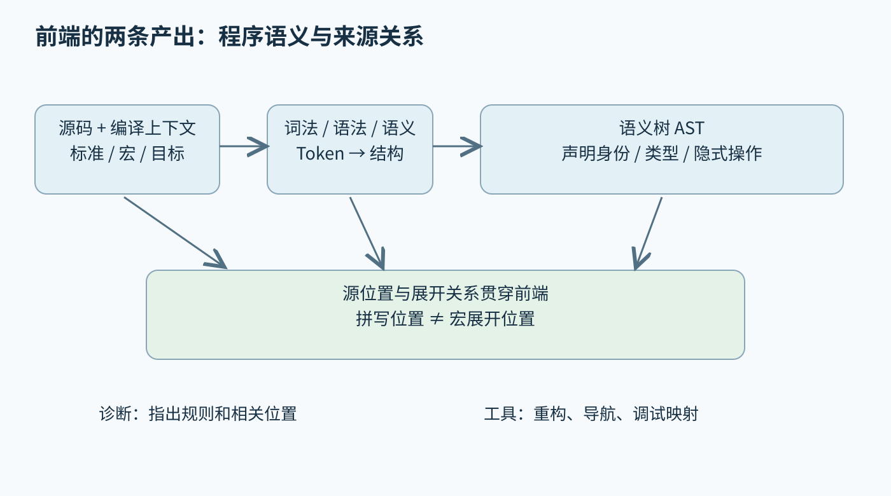
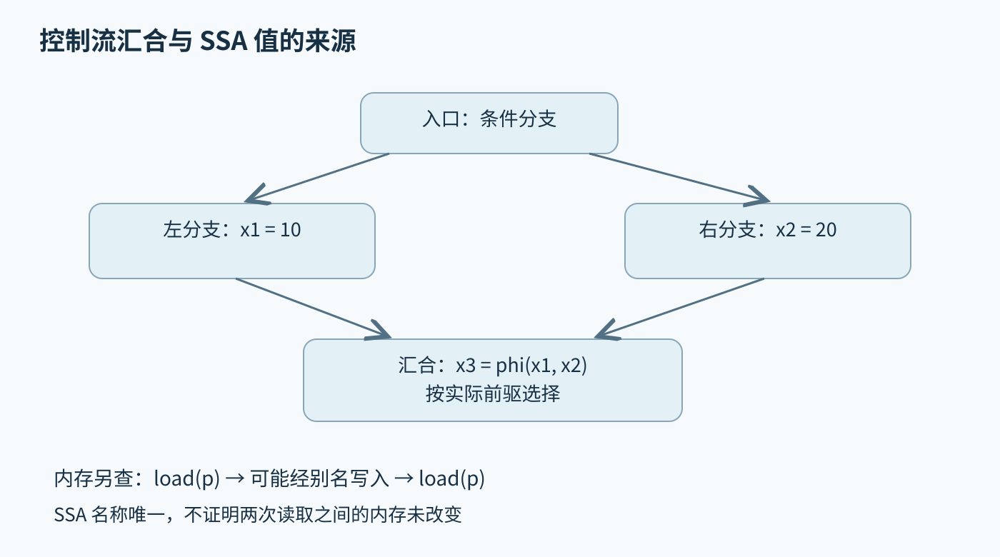
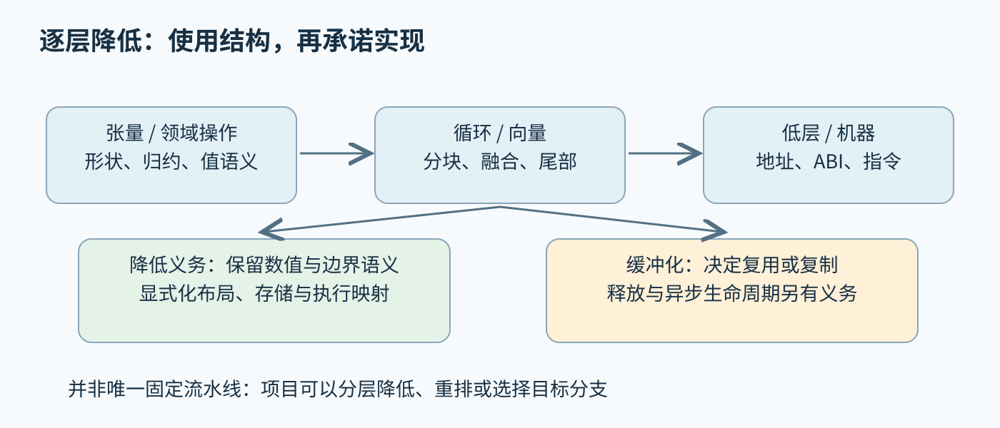

# 第四十一章 编译器与语言实现

**编译器**把一种程序表示翻译成另一种程序表示，同时保持语言要求的可观察行为。它不一定直接产生机器码：源码到字节码、张量运算到循环、查询表达式到执行计划，都包含编译问题。编译器工程的核心不是把字符替换成指令，而是在不同抽象层之间保留足够的语义，让分析能够证明变换合法，让后端能够选择适合目标机器的实现。

一个完整语言实现还包含诊断、运行时、链接约定、调试信息与工具接口。语法接受正确只回答“这是怎样的程序”，优化正确回答“允许怎样改变”，代码生成正确回答“机器实际执行了什么”。三者各自需要证据。第三章的图与数据流算法、第八章的编译链接装载，是理解这些层次的重要基础。

本章以 C++20 的源语言边界和 LLVM 18.1.8 的固定文档为主要参照；Clang 内部设计与 MLIR 页面为 2026-10-03 核验的滚动文档，只用于已明确的机制，不承诺任一 LLVM 发行版都具有相同 API。文中 IR、算式与变换均为未执行的教学示意，未编译程序、运行优化器或测量编译性能。

## 41.1 Lexer Parser AST类型系统与诊断

### 41.1.1 词法分析把字符流变成有位置的记号

**词法分析器**（Lexer）识别标识符、关键字、字面量、运算符与分隔符，输出称为 Token 的记号。其价值是把字符编码、空白和词法边界的复杂性从语法规则中隔离。Token 除了类别，通常还保存原始拼写或可定位原文的范围；数值字面量的拼写、后缀与解析后的值也不应过早混为一体。

词法规则必须处理最长匹配、转义、注释、换行与非法输入。例如同一段字符究竟是一个复合运算符还是两个单字符符号，要由语言的词法规则和上下文处理机制决定。不能只写一组正则表达式，再按任意顺序匹配，就认为得到了完整的 C++ 词法器。原始字符串、预处理记号和宏展开会增加状态与来源信息。

**源位置**不是附加装饰。错误高亮、调试行号、覆盖率、重构和宏展开追踪都依赖它。一个标识符可能在宏定义处拼写，在另一个文件的调用处展开；诊断应区分这两类位置。把所有生成的 Token 都标到当前文件行首，虽然仍可能生成正确机器码，却会破坏几乎所有开发者工具。[S1]

处理不可信源码时，词法器还需要资源预算。超长字面量、深度嵌套注释形式或大量无效字节，可能让工具消耗异常内存。工程上应定义最大合理输入、错误恢复策略和位置计数溢出处理。词法器的健壮性不仅服务于编译，也服务于编辑器中每次尚未完成的输入。

### 41.1.2 语法分析解决结构而不是所有语义

**语法分析器**（Parser）根据语法把 Token 组织成表达式、声明和语句等结构。优先级规定不同运算符怎样结合，结合性规定同级运算怎样分组。以普通算术示意，乘法优先于加法意味着加法节点的一侧可以包含乘法子树，并不意味着机器必须按树形顺序逐个执行所有节点。

递归下降、Pratt 解析、LR 系列等方法服务于不同语法与工程需求。手写递归下降便于定制错误诊断，生成式解析器便于从规则组织语法；二者都可能实现成熟语言，也都可能因为回溯、错误恢复或歧义处理不当而性能不佳。选型应考察语法变化频率、可维护性与工具场景，而不只比较算法名称。

C++ 不是把上下文无关语法交给一个黑箱就能完成解析的简单例子。某个名字是否表示类型、模板参数的依赖关系，以及声明和表达式的歧义，都可能需要语义信息。成熟前端通常让语法分析与语义分析相互协作，但仍保持职责边界：解析器不能随意以“暂时看起来像”代替最终的语言判定。

面对缺失右括号，立即停止最容易保持实现简单，却让编辑器只能报告一个错误。错误恢复可以跳到分号或右花括号等同步点，也可以插入带错误标记的节点继续分析。恢复后的树不是合法程序的证明；后续阶段应识别错误节点，避免把一个缺失记号放大成数百条无关诊断。

### 41.1.3 抽象语法树保留语言结构和语义身份

**抽象语法树**（AST）保留对语言理解有意义的结构，通常省略部分标点与纯语法中间层。具体语法树更关注原文结构，AST 更关注声明、表达式与语义关系。要做无损格式化，AST 往往还需要配合 Token、注释和原始文本，而不能假定只要有树就能重建逐字一致的源码。

名字的文本相同不代表语义身份相同。两个局部作用域都可以声明名为 count 的变量，重载函数可以共享名字，模板实例还能产生相关却不同的实体。语义树需要把名字引用绑定到相应声明，或者保留尚未解析的依赖引用。仅用字符串替换实现重命名，会把这种身份关系丢失。

隐式转换、临时对象、构造与析构等语义也可能出现在 AST 中，尽管源码没有直接写出对应调用。保留它们有助于代码生成与静态分析，但工具遍历时必须决定要看语法层还是语义层。例如统计用户写出的函数调用，与统计最终语义上的调用关系，会得到不同结果；两种统计都可能合理，前提是问题定义一致。

AST 的内存布局影响大型工程的响应速度。节点分配、字符串驻留、类型共享和延迟加载都会改变内存占用与局部性。若一个语言服务器占用过大，应先区分保留源码、预编译头、多个翻译单元、索引与临时分析的成本，再决定压缩哪个结构；“把指针都换成整数”不是无条件有效的修复。

### 41.1.4 类型系统表达哪些程序有意义

**类型系统**规定值、表达式和操作之间的兼容关系。类型检查并不只是检查变量声明与赋值是否同名；它还涉及重载选择、转换、成员访问、返回类型、泛型约束和表达式类别。类型错误的意义是程序不能按语言规则获得需要的解释，而不是编译器“找不到一种可以运行的机器指令”。

C++20 中对象类型、引用类型、cv 限定与值类别共同影响接口选择。一个表达式具有某种类型，不足以回答它能否绑定到某个引用参数。模板约束可以改善接口表达与诊断，但 Concepts 不会让所有实例化相关错误都自动变成约束失败；约束检查的边界与实例化主体中的错误需要分别理解。[S11]

类型检查与数据表示也应分层。源语言中的有符号整数类型附带运算语义，后端中的固定位宽整数则通常通过不同指令和标志表达有符号解释、溢出规则与比较方式。若前端把源语言的检查溢出算术错误地降低为普通模运算，后端再正确也无法补回已丢失的语义。

设计领域语言时，形状、单位、地址空间或所有权都可以成为类型或约束的一部分。更多静态信息有助于提早拒绝错误，但会增加推导、类型等价与错误解释的成本。合理的问题是哪些不变量值得静态表达、哪些需要运行时守卫，而不是认为类型越复杂系统就越安全。

### 41.1.5 名称查找与实例化决定编译上下文

**名称查找**把使用点的名字映射到候选实体，重载决议再依据参数和规则选择目标。作用域、可见声明、命名空间与依赖上下文都参与这个过程。一个头文件单独编译通过，并不意味着它在不同包含顺序、宏定义或语言模式下仍然代表同一个程序。

模板让部分工作延迟到实例化阶段。非依赖部分与依赖部分有不同的检查时机，错误可能跨越定义与使用两个位置。高质量诊断应展示关键实例化路径，并突出真正失败的约束或表达式，而不是只列出最外层“没有匹配函数”。这也是编译器维护源位置与语义身份的实际价值。

**编译上下文**至少包括语言标准模式、目标平台、包含路径、宏定义、模块与预编译产物，以及实现定义的选项。错误地复用另一个上下文中的 AST 或类型缓存，会产生难以复现的诊断甚至错误代码。增量编译缓存键不能只有源码文本哈希，还要覆盖会改变语义的外部输入。

诊断某个模板只在 CI 失败时，可先保存完整编译命令和预处理后的必要证据，再检查编译器版本、标准库、目标宏与头文件解析路径。直接删改模板使当前机器通过，可能掩盖真正的工具链分歧。对于模块缓存尤其应记录生成方与使用方的兼容要求，不能把模块文件当成长期跨版本交换格式。

### 41.1.6 诊断是一种有层次的接口

编译诊断应指出问题的位置、违反的规则，以及帮助理解的相关位置。错误、警告与提示表达不同承诺：错误阻止按当前模式完成翻译，警告指出可疑行为或额外约束，提示补充候选声明和展开路径。警告是否启用、是否提升为错误属于工程策略，不等同于语言规范新增了禁止规则。

一条好的类型不匹配诊断，应把“期望什么”和“实际是什么”放在相关表达式旁；一条好的重载失败诊断，应筛选关键候选和失败原因。把所有内部类型和推导步骤原样打印出来，信息虽然多，却把寻找根因的工作转嫁给用户。可解释性要求前端保存足够语义，又在展示时主动压缩无关分支。

**修复建议**比错误说明更危险，因为用户可能一键应用。补上括号、增加转换、改变 const 或插入移动操作，都可能改变程序含义。自动修复应限定在语义足够明确、文本范围可安全编辑的情形，并把多个相关编辑作为一个可审查事务。宏定义、多配置条件编译和生成文件需要额外谨慎。

编译器测试不应只检查“输出有 error 字样”，而要覆盖错误位置、关键说明和恢复后的行为。诊断文本也不宜成为所有下游工具解析语义的唯一通道；结构化格式更利于 IDE 和持续集成稳定消费。对开发者工具来说，诊断质量与合法程序的编译速度同样是产品能力。

### 41.1.7 从前端故障证据回答深入追问

“为什么编辑器说错，命令行却能编译？”最先检查的是两者是否使用同一编译上下文。语言服务器可能缺少正确编译数据库、系统头文件或目标参数，也可能正在分析未保存的缓冲区。只有上下文一致后，才值得把问题缩小到前端版本、缓存失效或编辑器协议处理；先否定其中一方通常会走弯路。

“语法正确为什么还不能生成代码？”因为语法只建立结构，名称解析和类型系统还要确定每个操作的含义；某些程序在语义检查通过后仍然会因未满足链接要求而失败。比如函数调用能够解析到声明，不证明最终制品包含对应定义。应区分诊断出现在哪个阶段，以及前一阶段究竟保证了什么。

“能否直接用 AST 做所有优化？”可以在 AST 上做适合语言结构的变换，但控制流、别名、寄存器和目标指令等问题需要更合适的表示。源级结构过早抹平会失去语义，长期保留所有语法细节又会让低层分析复杂。多个 IR 层级的意义，是让每类推理发生在信息足够、复杂度可控的地方。

图 41-1 前端同时产出可编译的语义结构和可解释的来源关系。箭头表示信息依赖，不代表所有实现都按独立进程分阶段运行。来源：本章原创。

## 41.2 中间表示IR与SSA控制流数据流与优化正确性

### 41.2.1 中间表示需要自己的语义契约

**中间表示**（IR）是编译器内部用于分析和变换的程序语言。它可以比源码更显式，例如把隐式转换与控制流写清，也可以比机器码更抽象，例如使用无限数量的虚拟值名。IR 的语法、类型与操作语义共同构成契约；把 IR 看成“容易打印的汇编”会忽略其中最关键的正确性规则。

LLVM IR 有文本形式与位码形式，二者是表示与序列化方式的区别，不是两套独立的程序语义。模块包含函数、全局对象与其他信息，函数由基本块组成。目标三元组与数据布局等信息影响代码生成和内存表示；仅看到 IR 中没有具体物理寄存器，不能推断该模块完全与平台无关。[S2]

设计 IR 时应问：哪些事实需要显式化，哪些事实允许分析得到，哪些事实降低后再也无法恢复？例如数组边界、张量形状、异常路径、对象析构和原子访问，各自可能决定优化是否合法。用普通函数调用隐藏所有领域操作，会让通用优化器缺少可利用信息；随意添加不真实的属性则会让它合法地产生错误结果。

IR 验证器检查结构和部分局部语义，如类型匹配、终结指令与定义使用关系。通过验证不代表与源码等价，也不代表运行时不会访问越界。验证器回答“这个 IR 是不是该语言中的合格程序”，等价性验证回答“这次变换是否保留了原程序承诺”，二者不能互相替代。

### 41.2.2 基本块与控制流图描述执行路径

**基本块**是一段从入口进入、沿内部顺序执行并在末尾决定后继的指令序列。**控制流图**（CFG）以基本块为节点，以可能的控制转移为边。循环不一定对应源码里的一个 for，异常路径也不一定写成普通条件分支，因此不能用源码缩进代替控制流分析。

若从函数入口到块 B 的每条可达路径都经过块 A，则 A **支配** B。支配关系回答某个定义是否在使用之前必然发生，也为循环识别和代码移动提供基础。后支配关系则从退出方向看哪些节点必然经过，但异常、不返回调用与无限循环会使简单直觉失效，分析必须采用明确的图模型。

考虑一个计算只在条件成立时执行。把它移动到分支之前，除了操作数必须可用，还要证明额外执行不会引入不允许的效果。即使计算结果最后没有使用，除零、越界访问、异常或可观察读写仍可能改变程序。支配是结构条件，安全推测执行是语义条件，两者都满足才有资格讨论收益。

变换 CFG 时，新增或删除一条边可能改变 phi 输入、支配树、循环信息和可达性。局部文本上只改了一行分支，并不意味着可以保留所有分析缓存。编译器故障常来自“变换本身看起来对，但后续分析还相信旧图”；这种错误会延迟出现，给定位带来很大干扰。

### 41.2.3 SSA让值的来源清晰但不消除内存

**静态单赋值形式**（SSA）要求每个 SSA 名称只有一个定义。源码变量在不同位置被赋值，可以转换成多个不同名称；控制流汇合处用选择来自相应前驱的机制连接。它使定义到使用的关系显式化，有利于常量传播、值编号与稀疏数据流分析，却不意味着运行时只允许给内存写一次。

以未执行的抽象 IR 为例：左分支定义 x1 为 10，右分支定义 x2 为 20，汇合处定义 x3 为 phi(x1 来自左边，x2 来自右边)。phi 的含义依据实际经过的前驱边选择值，不是把两边都算完再调用普通函数。一个块有多个 phi 时，它们在语义上也不能当成任意顺序的破坏性赋值。在 LLVM 中，phi 的每个输入使用发生在对应入边上；因此左分支的定义无须支配整个汇合块，只须满足这条入边上的使用约束。[S2]

循环头的 phi 可以选择进入循环时的初值，或者上一轮从回边送来的更新值。这样得到的定义使用图可以包含循环关系，而每个名称仍只有一个静态定义。“单赋值”描述程序中的定义位置，不是说循环中的该指令只执行一次。混淆静态结构和动态执行次数，会误解所有循环优化。

SSA 主要使显式值更容易分析，指针指向的内存仍有读写、别名与生命周期。将可提升的局部槽位转换为 SSA 值很有效，但地址逃逸、别名访问或其他约束可能阻止提升。不能把某个 alloca 没被消除直接归咎于优化器弱；需要先查它是否满足变换的合法前提。

### 41.2.4 数据流分析把路径信息归纳为可计算事实

**数据流分析**沿控制流传播事实，例如一个值可能是什么常量、一个变量是否存活、某个定义是否能到达当前点。每个块提供传递函数，汇合点按问题需要合并信息，循环通常通过迭代达到不动点。分析使用有限抽象来控制成本，因此它通常是保守近似，而不是对所有运行状态逐个枚举。

以常量传播为例，一个值可能尚未知、确定为某常量，或可能取多个不同值。两条路径分别提供 3 与 3，可以保留常量；提供 3 与 4，就必须放弃“总是 3”的断言。这里合并规则来自正确性要求。为了优化得更积极而随意保留其中一个分支的常量，会直接破坏程序语义。

**活跃性分析**把后续使用需求沿控制流逆向传播：如果某个值以后还可能被读取，在相应路径上就不能过早覆盖它。它与寄存器分配密切相关。别名分析则回答两个内存引用是否可能指向重叠存储；“无法证明不重叠”并不等于它们一定重叠，但优化器常需要以可能重叠的方式处理。

保守不意味着所有优化都必须放弃。可以增加运行时守卫：证明某次调用的区间不重叠时进入快速路径，否则保留原实现。这样的版本化把静态不确定性变成可检查条件，但守卫本身、指针比较合法性、代码体积与分支代价都要计入。更多路径也意味着更多正确性测试义务。

### 41.2.5 优化证明依赖整数 浮点与副作用语义

**优化正确性**要求变换后的程序在源程序定义的行为范围内满足相应语义承诺。普通整数代数不能未经限定移植到所有语言操作。固定宽度无符号运算、有符号溢出未定义、检查溢出抛错与饱和算术，是四种不同模型；同一个重写规则可能在其中一种成立，在另一种失败。

例如把比较式中的加法移走，必须考虑溢出与位宽。C++20 有符号溢出不具备无符号模回绕的承诺；优化器可以利用合法程序不触发该未定义行为的前提。但前端给 LLVM 指令添加 nsw 等语义标志，必须真有依据，不能把它当成“请尽量加速”的提示。在 LLVM 18.1.8 中，带 nsw 的整数加法发生有符号溢出会产生 poison。错误标志相当于给证明提供了不成立的前提。[S2]、[S11]

浮点运算还涉及舍入、NaN、无穷、带符号零和异常环境。重新结合 `(a+b)+c` 与 `a+(b+c)` 可能改变结果。允许近似或重结合的编译选项，是调用者改变了可接受行为范围的一部分，必须进入构建与科学验证记录。不能因为单元测试误差小，就反推所有输入下都允许这些变化。

移除“结果没人用”的操作也要区分纯值与副作用。普通算术结果可丢弃，不代表任意加载、原子访问、volatile 访问、可能抛出的调用或 I/O 都可消除。正确的死代码删除需要理解操作语义、控制依赖和内存效果；文本中的变量是否在后面出现，只是远远不够的粗略线索。

### 41.2.6 未定义行为 poison与freeze不能相互混称

源语言未定义行为、LLVM 的 undef 与 poison 是相关但不同的概念。它们服务于语言实现与变换推理，不能统一解释成“某个随机数”。undef 的不同使用不保证观察到同一值；poison 则通常随运算传播，把它用于条件分支或解引用的地址等位置会触发未定义行为。产生 poison 本身与立即触发未定义行为不能混同。[S2]

LLVM 18.1.8 的 freeze 用于把 undef 或 poison 转为一个该次结果稳定的非 poison 值，后续对同一结果的使用保持一致；这不保证两次独立 freeze 的结果相等。它不是补救任意错误程序的安全检查，也不能恢复已经发生的无效内存访问。对 undef 或 poison 指针做 freeze 也不会获得可安全解引用的地址。插入 freeze 会改变允许的行为集合，是否需要和能否移动它，都必须依据具体变换证明。

一个常见错误是把有条件执行改成无条件计算再 select，以为最终没选中的值一定无影响。若无条件计算包含立即未定义行为或其他不可推测副作用，这样的改写可能已经非法；即使只涉及 poison，也要逐项核对 select 的语义和后续用途。控制流等价不是把分支改成一个选择符号那么简单。

实际开发中，应把最小失败例保存在优化前后的 IR 层，记录标志、属性、目标和流水线。先判断源程序是否本来已有未定义行为，再判断 IR 是否准确表达了源码，最后检查具体 Pass 的变换。跳过中间层会让应用错误、前端错误与优化器错误互相冒充。

### 41.2.7 变换验证需要正例 反例和边界

优化测试至少有三种证据。结构测试检查预期重写有没有发生；语义测试检查合法输入的结果与副作用；边界测试检查规则不该应用时确实没有应用。只检查输出 IR 中某条指令消失，会奖励过度优化；只运行少数样例，又可能永远碰不到触发错误的值或路径。

差分测试可以比较不同优化级别、不同编译器或参考解释器，但必须明确被比较的程序处于共同定义域。含未定义行为的输入不能用“另一个编译器这样算”作为真值。浮点允许误差、异常行为、随机性和并发也需要单独规定，否则差异可能只是合法实现选择，而非误编译。

深入追问：“SSA 已保证每个值唯一，为什么公共子表达式不能无条件消除重复 load？”因为 SSA 名称唯一不意味着内存没有变化。两次 load 之间可能有经别名写入、外部调用或同步相关效果。需要证明读取的是同一可观察状态，并满足访问语义，才可以复用结果。

深入追问：“验证器通过是否足以合并一个优化补丁？”不足。验证器不会证明等价性，也不说明收益。补丁应交代合法性前提、失败反例、分析失效处理与测试覆盖，再以可信测量证明目标场景收益；若测量未做，就只能报告实现和静态推理的结果。[S7]

图 41-2 SSA 的值流与内存效果是两组需要共同检查的关系。图中常量只是教学示意，没有执行对应 IR。来源：本章原创。

## 41.3 LLVM Pass后端寄存器分配与代码生成

### 41.3.1 Pass把分析与变换组织成可组合流水线

**Pass**是作用于某层 IR 的分析或变换单元。分析计算事实，变换改变程序；一个变换可以依赖若干分析，也可能使它们失效。LLVM 的模块、调用图强连通分量、函数与循环等层级，让不同工作在适当范围内运行。把全工程分析重复塞入每个局部 Pass，可能让编译时间随工程规模显著恶化；例如在每个函数处理时重新扫描全部函数，会产生平方级的重复工作。

新 Pass Manager 中，变换通过保留分析的声明告知框架哪些缓存还可信。没有改变 IR 时保留全部分析较自然；改动后仍声称全部保留，则必须有充分依据。维护分析结果与让它失效后重算是两种选择，前者更高效但实现义务更重，不能仅为了减少时间就保留陈旧数据。[S3]、[S4]

Pass 的顺序会改变可见机会。内联可能暴露常量，常量传播又可能使分支消失，简化后的循环更容易向量化；反过来，过度展开可能增加代码体积并隐藏某些结构。这类阶段排序问题说明，局部最优重写组合起来不一定全局最优，但顺序差异绝不能改变程序的合法语义。

开发自定义 Pass 时应把适用前提写成明确检查，并在调试模式保留变换前后可重放的 IR。不要让“当前流水线之前恰好会做某件事”成为隐蔽前提；如果前提必须成立，就声明要求、执行规范化或拒绝变换。框架升级和插入新 Pass 时，这类隐含依赖最容易失效。

### 41.3.2 指令选择把合法运算映射到机器能力

**指令选择**为 IR 运算寻找目标机器指令序列。一个乘加可能对应独立乘法与加法，也可能对应特定融合指令；选择取决于语义、类型、目标特性与代价。指令数量少不一定更快：延迟、吞吐、端口竞争、编码大小和数据依赖都影响最终成本。

目标机器可能不直接支持某种位宽、向量类型或操作，因此需要**合法化**：把不支持的运算拆分、扩展或转换成支持的形式。合法化不是允许改变含义，而是寻找另一种实现。例如宽整数操作拆成多个机器字时，要正确传播进位；浮点库调用还必须匹配目标 ABI 与精度约定。

LLVM 提供不同代码生成基础设施，SelectionDAG 与 GlobalISel 等路径的支持程度随目标与版本变化。不能仅凭看到一个框架名称就承诺目标后端已经覆盖所有功能。工程上应固定版本、目标特征与选择路径，阅读实际生成的中间机器表示和汇编，才能解释某个运算为什么没有使用预期指令。[S5]

目标特性还影响制品部署。构建机器支持某扩展，不代表所有部署机器都支持；盲用本机特征可能生成启动即非法指令的二进制。运行时分派或多版本函数可以扩大适用范围，但需要可靠探测和回退路径。编译器“成功生成”仅表明在所声明目标条件下完成翻译。

### 41.3.3 寄存器分配处理活跃区间与硬件约束

**寄存器分配**把大量虚拟值映射到有限物理寄存器。两个同时活跃且不能共享位置的值形成冲突；某些指令还要求特定寄存器类别、固定参数位置或成组寄存器。图着色与线性扫描是理解问题的常见模型，实际生产分配器通常结合启发式、拆分与目标约束。

寄存器不足时，常见处理是把部分值**溢出**（spill）到内存，并在需要时重载；拆分活跃区间或重新计算也可能减少这种开销。溢出不等于程序申请了一个用户可见的堆对象，通常由后端安排栈槽等存储。代价取决于热度、局部性、循环位置与重载频率；把冷路径的值溢出一次，与把内层循环的累加器反复溢出，后果完全不同。

减少临时变量的源码写法不保证减少寄存器压力。编译器关心的是优化后同时活跃的值，而非源码变量名的数量。展开循环、软件流水和内联可能增加同时活跃的中间结果；适度重计算反而可能比保留一个长期活跃值便宜。寄存器、指令数量与内存流量之间存在真实取舍。

分析某次优化为何变慢，应检查是否增加 spill、是否跨调用保留更多值，以及机器指令的活跃范围是否变长。不能见到更多 load/store 就认定是用户内存访问增加，它们也可能来自分配器。将源码、优化后 IR、机器表示和汇编对应起来，才能把变化归因到正确阶段。

### 41.3.4 指令调度与栈帧必须遵守机器和ABI

**指令调度**在不违反依赖与可观察效果的前提下安排指令顺序，以隐藏延迟、利用执行资源或减少冲突。它既受数据依赖限制，也受内存、控制与异常等语义限制。源代码相邻不意味着机器指令相邻，机器可乱序执行也不意味着编译器可以忽略语言和 ABI 约束。

**栈帧**容纳溢出槽、局部存储、保存的寄存器和调用所需信息，具体组成依目标与优化而变。函数序言和尾声需要满足栈对齐、调用者/被调用者保存规则，以及可能的栈探测和安全机制。一个函数独立返回数值正确，不证明它在复杂调用链、异常展开或调试器中仍正确。

调用边界把抽象值映射为寄存器、栈参数与隐藏参数。结构体返回可能使用额外指针，变参调用可能采用特殊约定，向量参数的处理也可能随 ABI 变化。不能用某台机器上一段反汇编推导所有 C++ 函数都按同样方式传参。跨语言与插件设计将在第四十二章继续展开。

深入分析崩溃时，若错误出现在函数返回或异常展开，可同时核对栈对齐、保存寄存器、展开表与外部函数签名。只检查被调用函数的第一条指令往往找不到根因，因为栈或寄存器破坏可能发生在更早的边界。ABI 是调用双方共享的契约，不是链接器自动修复的细节。

### 41.3.5 调试信息也是变换后的正确性产物

**调试信息**把机器地址、变量位置和内联关系映射回源码，帮助调试器解释正在执行的程序。优化可能消除变量、合并表达式或移动指令，因此某个源码变量不一定始终具有可读取存储。显示“已优化掉”可能是诚实结果，胡乱提供一个过期地址反而更有害。

内联会让一个机器栈帧包含多个源级调用层次，循环展开会让同一源位置对应多份指令。编译器需要保存这些来源关系，而工具也必须接受它们不是一对一映射。单步调试出现跳行，不必立刻解释成控制流错误；应先区分源码视图与优化后的执行布局。

代码覆盖率、采样剖析与错误报告同样依赖准确映射。一次优化若把热点归到错误函数，会误导后续性能决策；即使程序数值输出正确，也产生了严重工具质量问题。审查编译器补丁时，需要考虑变换是否保留或正确更新调试位置信息，而不能把它全部留给“发布后再说”。

对于 JIT，机器码地址还会被创建、替换和回收。调试器及剖析器需要获知代码区域的生命周期，符号不能在代码已卸载后继续指向旧对象。这里的正确性是跨编译器、运行时与工具的协议问题，不能只通过静态目标文件中的一份符号表解决。

将 JIT 嵌入宿主时，还要区分 IR 对象、编译上下文与可执行代码的寿命。LLVM 18.1.8 ORC 用 ThreadSafeModule 与 ThreadSafeContext 管理模块相关的上下文所有权和访问锁，用 ResourceTracker 跟踪可移除的代码资源。由此可见，保存查得的裸函数地址并不能延长代码寿命；宿主必须在卸载前协调所有调用者，使活动调用结束且不会再调用旧地址。宿主回调、相关数据与调用 ABI 也必须在使用期间有效。[S10]

### 41.3.6 编译时间和代码质量需要共同预算

优化器本身也消耗 CPU、内存与等待时间。复杂别名分析、全程序内联和路径敏感推理都可能改善运行代码，却让开发循环或在线编译变得不可接受。编译器通常为分析深度、内联规模和变换迭代设置预算，以有限计算获得实用收益，而不是穷尽所有等价程序。

**优化等级**是实现提供的策略集合，不是跨编译器统一的性能刻度。更高等级可能增加代码大小、改变布局或触发不适合某个负载的变换；大小优化也不总是使运行更慢，因为更小的工作集可能改善指令缓存。选择应由目标负载的端到端测量支持。

基于剖析的优化能够利用实际热度与分支分布，但剖析数据必须代表部署场景。陈旧或偏斜的样本可能强化错误假设；负载分布变化也可能让既有布局不再合适。需要记录样本来源、版本、训练工作负载和验证工作负载，避免把同一份输入同时当作优化依据与独立收益证据。

当编译时间突增，应拆分前端、实例化、优化、代码生成和链接的时间，不要一律归因于“模板太多”。一个误配置的 Pass 可能反复重算全模块分析，一个异常大的生成函数可能放大分配器成本。阶段级证据可以决定是调整源码结构、流水线预算，还是修复工具链回归。

### 41.3.7 最小复现应沿表示层逐步收缩

编译器缺陷报告需要精确工具版本、完整关键选项、目标、输入和预期行为。源码最小复现便于说明语言含义，IR 最小复现便于隔离优化器，机器 IR 则有助于后端问题。越低层的复现越容易缩小搜索范围，但也越需要证明它确实表达原问题，而不是缩减时引入了新错误。

“关闭某个 Pass 后恢复正常”是重要线索，却不是充分归责。该 Pass 可能只是暴露了已有错误的属性、陈旧分析或源语言未定义行为。应比较最后一个可信表示和第一个不可信表示，逐步确定在哪个变换后语义首次改变，再检查依赖的前提是否成立。

深入追问：“为什么同样的 IR 换目标后性能不同？”目标指令、合法化、寄存器资源、缓存与代价模型都可能不同，ABI 和数据布局也会改变实现。IR 层操作数量相等不代表执行成本相等。合理回答应给出候选机制，再说明需要哪些汇编与性能证据来验证，而不是只说某架构更先进。

深入追问：“自己的 Pass 可以直接返回保留全部分析吗？”只有确实没有破坏任何相应分析，或者已正确维护所有受影响结果才可以。返回值是给后续优化使用的事实承诺，不是性能开关。无法完整证明时，保守失效通常比潜在误编译更合适。[S4]

## 41.4 MLIR多层中间表示和领域编译器

### 41.4.1 多层表示让高层事实晚一些消失

**MLIR**是构建可扩展编译基础设施的方法与框架，通过可组合的操作、类型、属性和区域表达不同抽象层。它的价值在于允许张量、循环、向量、设备执行与低层操作逐步共存和降低。MLIR 不是一种自动优化所有模型的编译器，也不是给 LLVM IR 换一种括号写法。

高层矩阵乘法包含维度、迭代空间与归约信息，降低为普通加载、乘加和跳转后，这些信息不一定容易恢复。如果先在高层完成分块、融合或布局选择，就能直接利用结构；如果过早降低，后续优化器可能只能猜测源码意图。相反，长期停留高层又无法决定精确地址与机器指令。

多层设计因此需要明确**降低边界**：何时丢弃张量值语义，何时显式分配存储，何时确定并行执行映射，何时固定目标 ABI。每一步都应说明保留了什么、消除了什么、增加了哪些条件。层级越多，调试与测试成本越高，不能仅因为框架允许就为每个小变换创建一种新表示。

领域编译器的成功常来自一组清晰约束：输入形状、允许的数据类型、布局、别名、数值精度与目标设备。把这些约束写成可验证的接口，比宣称“支持所有程序”更可交付。超出范围的输入应明确报错或走可靠回退，不能悄悄按最方便的假设生成代码。

### 41.4.2 Dialect Operation Region与接口承担不同职责

**Dialect**组织一组相关操作、类型和属性；**Operation**是基本语义单元，可以有多个输入、输出和嵌套区域；**Region**容纳块与内部结构。区域的执行意义由所属操作规定，并非所有区域都是普通函数控制流。理解这种层次，是避免把图式表达错误当作顺序执行的前提。[S6]

在 MLIR 的 SSA 控制流区域（SSACFG）中，块参数可以表达控制流汇合处的值传递，承担类似传统 phi 的角色。它把前驱传入值与后继参数直接连接，并遵守相应支配与作用域约束。Graph 区域则不把操作的文本顺序当作执行次序，不能机械套用同一种块内支配直觉。嵌套区域中的值是否可以引用外部值、是否可以逃出区域，受具体规则和接口限制，不能靠文本上“变量名可见”判断。

**Trait**和接口使通用基础设施能够查询操作的性质，而不必认识每一种领域语义。例如内存效果、类型推导、循环结构或缓冲化行为都可以成为可查询信息。声明一个操作没有副作用必须真实；否则通用删除或重排逻辑可能合法地移走本来不可移动的计算。

操作验证器检查维度一致、属性合法与区域结构等不变量，但复杂算法正确性仍需要独立证明。设计自定义 Dialect 时，应先写清语义和非法情况，再实现漂亮的打印格式。没有语义文档的紧凑 IR，往往只是把源程序歧义转移到另一个文件里。

### 41.4.3 Lowering是受约束的语义转换

**降低**（Lowering）把高层操作映射为较低层操作，并逐步接近可执行实现。MLIR 的 Dialect Conversion 以目标合法性、重写规则和类型转换组织这一过程。完全转换要求所有输入操作被目标接受为合法；部分转换可以保留原有且未被显式标为非法的操作。这里的“合法”取决于转换目标的声明，并不自动证明语义等价，二者也都不能混为“已经成功生成最终代码”。[S8]

类型转换可能不是一对一替换。一个高层张量参数可能降低为包含指针、偏移、形状和步长的描述信息，多个值之间的关系也需要调整。函数签名、调用点、返回值与区域参数必须一致变换。只替换函数内部的类型，而忘记调用边界，是常见的局部正确、整体失败。

动态形状意味着部分信息到运行时才可知。编译器可以产生形状检查、循环边界计算和专门化分支，但这些守卫必须覆盖快速路径使用的所有假设。例如分块要求维度整除时，要处理尾部或证明整除；把一个测试模型恰好满足的尺寸当成所有输入的属性，会产生静默错误。

转换失败应指出剩余不合法操作及原因，而不是在末尾报一个难以理解的机器错误。逐层保存可读 IR 与源码来源，有助于把问题定位为不支持的类型、缺失的重写、错误的合法性声明或前面已经破坏的不变量。降低流程的可诊断性是框架可用性的关键。

### 41.4.4 Bufferization把值语义连接到存储复用

张量值常以不可变结果的方式表达：某次操作产生一个新值，不要求立刻确定其物理地址。**缓冲化**（Bufferization）把这种表达连接到可读写缓冲区。它决定何时复用已有存储、何时需要拷贝，以及缓冲对象怎样通过接口传递。它并不是简单把类型名字 tensor 改成 memref。[S9]

假设一个操作产生更新后的张量，而原张量稍后还要被读取。若直接原地写入，后续读取就会看到新内容，破坏值语义。若缓冲区可写，并能证明旧值不再需要或具体访问关系允许安全复用，则可避免分配与拷贝。关键是定义使用、别名与读写冲突，不是“最后一个源码变量名看起来不用了”。

存储复用与释放又是不同责任。某个缓冲化过程选择了结果落在哪块内存，不自动意味着它已经安排所有释放路径。异常、分支、跨函数转移与设备异步执行都会影响生命周期。MLIR 当前文档也明确区分 One-Shot Bufferize 与后续所有权相关释放处理，不能把前者完成当作无泄漏证明。

优化内存时应同时考虑峰值容量、复制流量与重新计算成本。保留一个很大中间张量可能减小算术，却增加带宽和峰值；融合计算可能减少写回，却增加寄存器或共享存储压力。第四十三、四十四章将从硬件与数值角度分析这些成本，这里首先要求变换保留正确的值语义。

### 41.4.5 融合 分块与向量化各自有合法前提

**融合**把相邻计算放在更接近的执行范围，减少中间结果的物化；**分块**把大迭代空间拆成适合缓存或设备局部存储的小块；**向量化**让多个元素以目标并行指令处理。三者经常结合，但没有一个是只要能套模板就必然正确且更快的变换。

融合可能改变执行顺序与峰值工作集。生产者结果若被多个消费者使用，融合进其中一个消费者可能造成重复计算；原来可并行的工作也可能被串起来。涉及归约或浮点重结合时，还需要数值语义允许。减少一块中间内存，并不能单独证明端到端时间一定下降。

分块需要处理边缘、步长与布局。向量化需要合法的访存、尾部掩码或清理路径，以及符合源语义的异常和浮点行为。一个维度为动态值的张量，在大部分输入上整除向量宽度，不代表可以省掉尾部处理。针对固定形状专门化时，守卫、缓存键和回退版本必须一起进入设计。

多层 IR 可以让这些条件更容易表达，但不会替作者证明所有领域假设。良好的优化说明应列出输入前提、改变的数据移动和执行映射，再列出验证策略。若只展示降低后指令变少而没有说明旧值、边界和精度，证明链仍是不完整的。

### 41.4.6 领域编译器需要成本模型与回退边界

**成本模型**估计候选实现的计算、访存、通信和调度代价，用于选择算法与参数。静态模型可以快速排除明显不合适的方案，自动调优可以根据真实设备补充信息；二者都受负载分布、测量噪声与搜索成本约束。模型给出的是选择依据，不是硬件性能保证。

领域输入往往有多样形状。为每个形状生成一个版本会增加编译时间和代码缓存，统一版本则可能错失局部优势。合理的专门化策略应限制版本数量，优先覆盖高频形状，并给稀有输入保留可验证通用路径。缓存键需要包含语义相关参数、目标能力、编译器与运行时兼容信息。

回退不是失败的掩饰，而是明确支持范围的一部分。前端不认识某种操作、目标缺少某种类型，或资源预算不足时，可以拒绝编译或转交可靠实现。静默降精度、悄悄改变布局假设或继续执行部分转换结果，都不能当成正常回退。

发布前还应验证跨层责任：高层运算定义是否与参考实现一致，降低是否覆盖全部边界，运行时是否正确分配和同步，二进制是否匹配目标，错误信息能否返回用户输入位置。领域编译器往往不是缺一个优化，而是缺这种能贯穿全链路的责任划分。

### 41.4.7 用一条完整证明链回答编译器设计题

深入追问：“为什么不能直接把神经网络或查询计划全部转成 LLVM IR？”可以直接降低，但高层形状、布局、迭代域和算子关系一旦消失，后续优化就更难利用。多层 IR 的收益是把相关变换放在事实仍显式的阶段；代价是更多转换与验证。是否采用它应由实际优化需求决定。

深入追问：“融合后的程序误差变大，是编译器缺陷吗？”先查允许的数值契约：融合是否引入融合乘加、归约顺序变化、低精度中间值或不同近似函数。若超出约定，即使更快也属于错误；若在约定内，仍需判断是否满足应用质量要求。性能合法和应用可接受是两层评估。

深入追问：“如何证明一个新后端可交付？”需要把语法和语义测试、IR 验证、变换反例、ABI 测试、目标特性覆盖、调试信息与性能回归连起来。几段演示程序成功，只能说明局部路径可运行。可交付意味着支持范围已定义，边界可诊断，失败可复现，且每项承诺都有相应证据。

图 41-3 多层降低让结构信息在合适的阶段被使用。示意流程可按项目重排或分支，缓冲化和设备映射没有适用于所有编译器的唯一顺序。来源：本章原创。

**本章资料**

- [S1] [Clang Internals Manual](https://clang.llvm.org/docs/InternalsManual.html)，滚动文档，核验日期 2026-10-03；来源管理、诊断和前端结构
- [S2] [LLVM 18.1.8 Language Reference](https://releases.llvm.org/18.1.8/docs/LangRef.html)，模块、SSA、内存及 poison/freeze 语义
- [S3] [Writing an LLVM Pass，18.1.8](https://releases.llvm.org/18.1.8/docs/WritingAnLLVMNewPMPass.html)，Pass 接口与保留分析声明
- [S4] [Using the New Pass Manager，18.1.8](https://releases.llvm.org/18.1.8/docs/NewPassManager.html)，分析层级、缓存和失效
- [S5] [LLVM Target-Independent Code Generator，18.1.8](https://releases.llvm.org/18.1.8/docs/CodeGenerator.html)，后端阶段和寄存器分配；其中历史示例不能视为当前命令保证
- [S6] [MLIR Language Reference](https://mlir.llvm.org/docs/LangRef/)，操作、块参数和区域语义
- [S7] [LLVM Testing Infrastructure Guide，18.1.8](https://releases.llvm.org/18.1.8/docs/TestingGuide.html)，结构回归测试基础设施
- [S8] [MLIR Dialect Conversion](https://mlir.llvm.org/docs/DialectConversion/)，合法性与部分/完全转换
- [S9] [MLIR Bufferization](https://mlir.llvm.org/docs/Bufferization/)，值语义到缓冲区、复制和释放责任

- [S10] [ORC Design and Implementation，18.1.8](https://releases.llvm.org/18.1.8/docs/ORCv2.html)，上下文所有权、并发访问与代码资源移除
- [S11] [C++20 工作草案 N4861](https://www.open-std.org/jtc1/sc22/wg21/docs/papers/2020/n4861.pdf)，[expr.pre]、[temp.constr.atomic] 与 [temp.deduct]；用于区分源语言运算、约束和实例化错误的边界

[S1]: https://clang.llvm.org/docs/InternalsManual.html
[S2]: https://releases.llvm.org/18.1.8/docs/LangRef.html
[S3]: https://releases.llvm.org/18.1.8/docs/WritingAnLLVMNewPMPass.html
[S4]: https://releases.llvm.org/18.1.8/docs/NewPassManager.html
[S5]: https://releases.llvm.org/18.1.8/docs/CodeGenerator.html
[S6]: https://mlir.llvm.org/docs/LangRef/
[S7]: https://releases.llvm.org/18.1.8/docs/TestingGuide.html
[S8]: https://mlir.llvm.org/docs/DialectConversion/
[S9]: https://mlir.llvm.org/docs/Bufferization/
[S10]: https://releases.llvm.org/18.1.8/docs/ORCv2.html
[S11]: https://www.open-std.org/jtc1/sc22/wg21/docs/papers/2020/n4861.pdf
