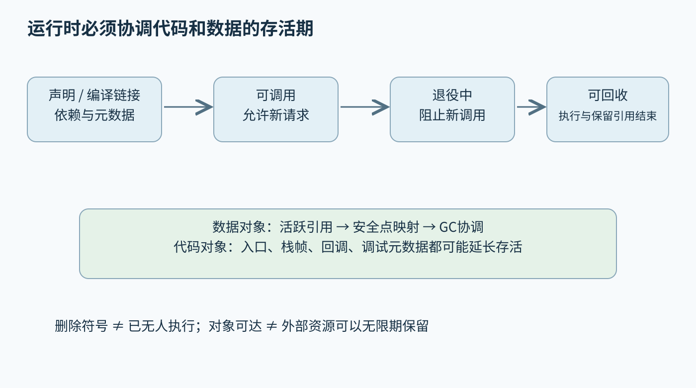
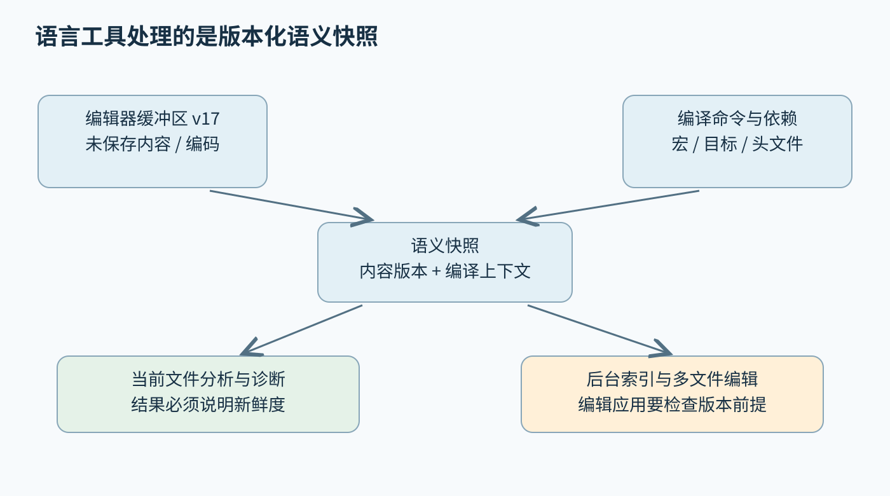
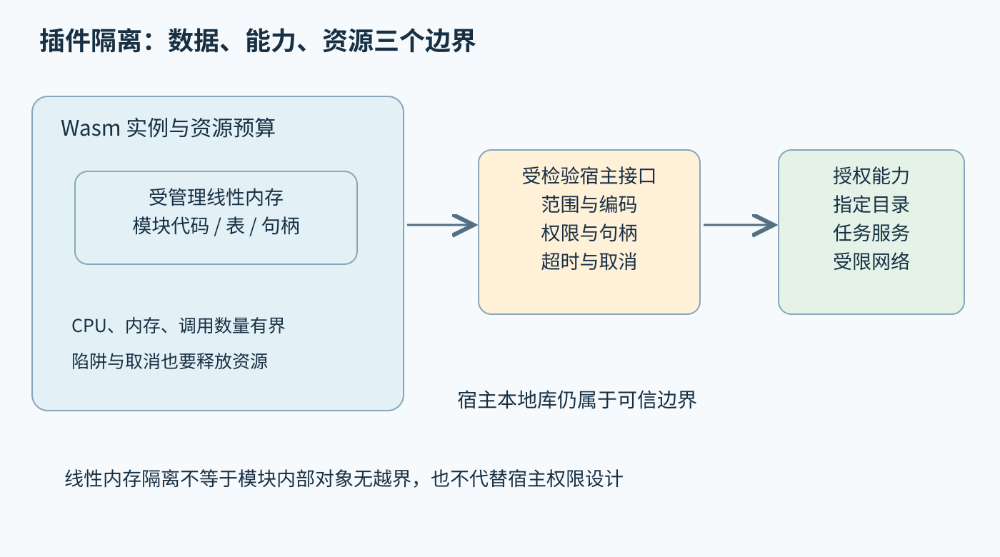

# 第四十二章 运行时互操作与开发者工具

**运行时**是程序执行期间共同维护语言语义和资源状态的软件设施，包括内存管理、调用分派、异常传播、代码装载及调度等能力。它可以很小，也可以包含解释器、即时编译器与垃圾回收器。使用本地机器码不意味着没有运行时；使用垃圾回收也不意味着可以忽略资源释放和外部对象的生命周期。

**互操作**把不同语言、运行时或二进制模块连接起来。边界两侧必须对表示、所有权、错误、线程和版本达成共同约定。开发者工具则把这些程序语义转为导航、诊断、重构和可观察信息。能调用一个函数、显示一个跳转结果或运行一个插件，都只是局部成功，不能代替对完整生命周期和失败路径的设计。

本章承接第四十一章。C++采用 C++20；LLVM ORC 与 GC资料固定为18.1.8，LSP采用3.17，Python C API采用3.12系列文档，其他项目的滚动资料以2026-10-03核验为准。文中接口形状、状态转换和算式均为未执行教学示意，未构建绑定、运行JIT、加载插件或执行安全测试。

## 42.1 JIT AOT GC与运行时接口

### 42.1.1 AOT与JIT改变编译时机和可用信息

**提前编译**（AOT）在部署或执行之前完成主要代码生成，**即时编译**（JIT）在程序运行期间生成可执行实现。二者不是速度高低的同义词。AOT可以把大量优化成本放在构建阶段，JIT可以利用实际类型、形状和热度，但要承担冷启动、编译线程、代码缓存与运行时错误处理的成本。

解释执行、AOT与JIT也可以组合。启动时先解释，热点函数用快速编译器处理，再对持续热门路径做更强优化，是一种分层执行策略；预编译大部分代码，运行时只专门化少量参数，则是另一种设计。选择取决于服务寿命、尾延迟、代码更新频率和平台限制，而不是“动态语言必须JIT”。

JIT可利用运行时事实，但必须区分事实的有效范围。一次调用的数组长度是常量，不意味着以后所有调用都同长；当前对象只有一种类型，不意味着未来不会出现别的子类。专门化代码需要守卫与失效机制，或者在接口上明确只接受满足条件的输入。

比较执行方式时，应把总成本写成启动准备、编译、执行与回收几部分。一个只运行数毫秒的命令可能无法摊销高强度JIT，长期服务则可能从热点专门化获益。只截取稳定态循环，不报告冷启动和代码缓存增长，会给使用者错误的选型依据。

### 42.1.2 JIT链接不仅是把字节放进可执行内存

机器码运行之前需要完成符号解析、重定位、依赖装载和相关运行时登记。LLVM ORC把符号、编译及物化等工作组织起来，支持不同程序表示和链接关系；它提供构建JIT的基础设施，不自动提供某种语言完整的类型系统、GC或安全模型。[S1]

**物化**可以包含生成代码、链接目标文件、建立跳板与注册元数据。返回可调用入口之前，应确保入口的执行协议成立：直接入口所需依赖须已就绪；延迟编译也可以先返回受控跳板，由首次调用触发物化并按契约处理失败。否则一个地址虽然非空，调用时仍可能进入尚未就绪的代码或数据。并发编译尤其需要把“已有符号声明”“正在生成定义”“可安全执行”区分为不同状态。

执行内存还有权限和缓存一致性要求。不同平台对写入、执行、代码签名或指令缓存维护有不同规则，不能用一个可写数组强转函数指针作为通用实现。W^X等策略要求尽量避免同一内存同时可写可执行；运行时应通过目标平台支持的机制完成状态切换并控制写入来源。

JIT需要明确符号可见性与查找范围。把整个宿主进程所有导出符号无差别暴露给插件，会扩大能力和耦合；同名符号在多个模块存在时，也必须有确定查找规则。工程上应像管理动态库一样管理这些边界，而不是让任何名字都“找到第一个就调用”。

### 42.1.3 推测优化需要守卫与状态恢复

**推测优化**在明确可检验的假设下选择更快实现。例如观察到某个调用点经常接受一种类型，可以先检查类型，再走内联快速路径；不符合时返回通用分派。守卫并不是统计上足够准确就可以省略的检查，它是优化合法性的一部分。

**去优化**（Deoptimization）把正在执行的优化代码恢复到较通用的执行状态。它需要知道源级变量、解释器栈帧或基线代码在某个位置应具有的值。有些值已被常量化或消除，必须通过元数据重建；有些对象尚未真正分配，可能需要在恢复时物化。

去优化点不能随意选在程序中任意字节位置。运行时要知道哪些副作用已经发生，哪些异常路径仍可走，哪些值能够恢复。若快速路径已经向外发送消息，再回到一个会重新发送的位置，就会重复外部效果。状态恢复必须遵守程序的可观察历史，而非只把寄存器拷贝回一个数组。

诊断去优化风暴时，要观察触发假设、输入分布与重新编译策略。短暂多态、不断变化的形状或过于激进的守卫可能使运行时反复生成又丢弃代码。修复可以是更宽泛的专门化、限制版本数或降低优化层级；盲目增加编译线程可能只加剧CPU争用。

### 42.1.4 GC追踪可达性 不等于确定性释放资源

**垃圾回收**（GC）识别不再需要保留的受管理对象并回收其存储。追踪式收集器从根集合沿引用图确定可达对象；引用计数通过引用变化追踪拥有关系。不同方案在暂停、吞吐、循环处理、元数据和碎片方面有不同成本，不能用“有GC”推断某种统一行为。

对象不可达与外部资源应立即关闭是不同命题。文件、锁、事务、设备句柄和网络连接通常需要明确释放时机；等待下一次GC可能长时间占用稀缺资源。C++20中的RAII与受管理语言中的显式关闭协议，可以与GC共存，分别承担外部资源和内存存储的责任。

**可达**也不等于业务上仍然有用。缓存、事件订阅、全局集合或未注销回调可以保持对象可达，导致内存持续增长而收集器没有错误。诊断这类泄漏要找保留路径和根，而不是只看分配速率。相反，错误的本地绑定可能没有把仍需使用的对象登记为根，让GC过早回收它。

移动式GC会改变对象的物理地址，因此本地代码不能默认长期保存裸指针。句柄、固定对象或受约束的借用期是常见方案。固定过多对象可能影响压缩效果，句柄增加间接访问，复制会增加流量；互操作接口需要根据数据大小、调用持续时间和并发方式选择。

### 42.1.5 安全点 根与写屏障是编译器运行时协议

**安全点**是运行时能够以约定方式检查或协调线程状态的位置。收集器需要在这些位置知道活跃引用在哪里，可能通过栈图、寄存器映射或影子栈获得。编译器优化会移动值和消除局部变量，因此不能把源码变量表当成机器执行时的根集合。[S2]

对会移动对象的收集器，安全点之后的引用必须对应移动后的地址。仅在调用前把一个指针登记为根，却在调用后继续使用寄存器里缓存的旧地址，仍可能错误。编译器和运行时需要共同规定哪些操作可触发收集，怎样更新引用，以及本地调用期间允许哪些对象状态。

**写屏障**是对象引用写入时维护收集器不变量的机制，例如记录某些跨代引用或并发标记所需信息。这里的“屏障”不应与CPU内存栅栏直接混称：两者可能在实现中相关，但目的和协议不同。绕过写屏障进行裸内存写入，可能让收集器看不到新边，破坏可达性判断。

安全点的放置也影响延迟。长时间运行且没有可响应检查点的本地循环，可能拖延暂停或取消；过密检查又增加执行开销。诊断暂停时间需要区分收集本身、等待线程到达安全点、根扫描与外部调度影响。一个“GC暂停200毫秒”的总数不足以判断应该改哪一层。

### 42.1.6 代码缓存和卸载有自己的生命周期

JIT生成的代码也是资源。模块被逻辑删除之后，可能仍有线程正在其中执行、栈帧等待返回、回调保存入口地址，或剖析器持有符号映射。此时立即释放代码页，相当于释放仍被使用的数据对象，会产生延迟崩溃。

安全卸载通常需要先停止新调用，再等待在途执行和外部引用结束，最后注销元数据并释放相关资源。入口跳板、代际编号和执行引用计数等机制可以帮助管理，但实现必须覆盖递归、异常、异步回调与重入。仅把一个符号从查找表删除，不证明旧函数指针已经消失。

代码缓存还可能保存不同输入专门化的版本。若形状或类型组合很多，缓存增长就可能吞噬运行时节省的内存。回收策略应同时考虑热度、重新编译成本和安全退役条件。缓存命中统计必须区分“找到版本”与“该版本仍满足当前目标和依赖条件”。

持久化缓存需要比源码哈希更多的信息。编译器版本、目标特征、运行时ABI、优化选项、依赖内容以及相关安全策略，都可能影响缓存可用性。把某次机器码直接存盘，下次不校验就装载，并不是可复现编译；它还引入制品可信度与完整性问题。

### 42.1.7 运行时故障应按状态边界归因

深入追问：“JIT函数第一次调用慢，是否说明生成代码差？”不能直接这样判断。第一次调用可能承担解析、编译、链接、缓存分配与页面触达；稳定态慢才更直接关联执行代码。应分别记录物化时间与执行时间，说明是否预热，避免把两个指标合成一个模糊的‘速度’。

深入追问：“用了GC为什么仍然内存泄漏？”对象可能一直由合法根持有，也可能本地资源不受GC管理，或绑定层错误保留引用。应检查堆保留路径、外部内存和回调注册表，而不是假设收集器一定失效。若崩溃发生在GC之后，还要反向检查根缺失、旧地址和移动期间的本地借用。

深入追问：“删除JIT模块后还能调用之前取得的函数指针吗？”只有运行时契约明确保证其代码和依赖继续有效时才可以。逻辑卸载与物理回收必须分离，调用者需要拥有相应存活保证。这个问题与普通共享库卸载、插件回调和异步任务退出有相同的生命周期结构。

图 42-1 代码资源和数据对象都需要跨线程生命周期协议。状态图只表达责任边界，不代表LLVM提供全部策略。来源：本章原创。

## 42.2 LSP索引 静态分析和重构

### 42.2.1 LSP把编辑器与语言理解解耦

**语言服务器协议**（LSP）定义编辑器与语言服务之间的请求、响应和通知。补全、跳转、诊断与重命名等能力可以由同一个语言服务提供给多个客户端，减少为每种编辑器重复实现语言语义的成本。协议规定如何交流，不保证服务器一定理解所有语言特性。

LSP 3.17使用JSON-RPC消息模型，并通过初始化阶段的能力协商确认双方支持的功能。请求有响应，通知按协议不发送对应响应；取消请求也不意味着原请求可以永远悬挂。理解这些生命周期，比只会发送一份JSON更重要，否则取消、关闭和并发编辑时容易留下状态泄漏。[S3]

传输消息的字节长度与文档位置的字符计量是两件事。前者涉及UTF-8消息内容长度，后者由协议位置编码约定决定。把语言库中的字符串长度直接用于两者，可能在ASCII样例正常，却在中文或非基本多文种平面字符出现时错误。协议实现应在边界明确单位。

服务器还要限制请求大小、索引工作量与并发数量。大型工作区打开时，同时到达的文件通知、诊断与补全请求可能形成队列。交互请求应有可取消和合理优先级策略，但不能为了快就读取半更新的语义状态。响应速度来自调度与增量设计，也来自清楚的一致性边界。

### 42.2.2 文档版本和位置编码决定编辑是否正确

编辑器中的未保存内容与磁盘文件可能不同。语言服务器应以协议同步的当前文档状态为基础分析打开文件，并跟踪版本。增量更新描述的是特定状态上的文本改变，不是可以任意换序执行的补丁。丢失或重复应用一次更新，会让后续所有位置悄悄偏移。[S4]

LSP 3.17允许协商位置编码，并保留UTF-16作为规定的兼容默认。位置中的character表示该编码的代码单元偏移，不是屏幕上显示的字形数；一个合成字形或表情可能占多个代码单元。服务端内部使用UTF-8字节偏移完全可行，但必须可靠转换。[S5]

一个分析请求开始后，用户可能继续输入。结果返回时应判断它对应的快照与当前文档是否兼容；诊断可以被更新替换，文本编辑则尤其需要防止应用到错误版本。不能把“结果是刚收到的”误认为“它依据的内容就是最新的”。并发系统中的时间顺序不能替代版本身份。

排查重命名改错位置时，可保存消息顺序、文档版本、选定编码和相关文本片段，并构造同时包含中文、表情与换行差异的最小样例。不要先怀疑名称解析：若编辑范围整体偏移，问题可能只在位置换算；若位置正确却改错实体，才更像语义身份错误。

### 42.2.3 编译数据库是语言服务的输入而非附属配置

对C++来说，同一文件在不同宏、包含路径、目标和语言模式下可以形成不同语义。**编译数据库**记录翻译单元的编译命令，让工具获得接近真实构建的上下文。没有它，语言服务可能采用推断或回退命令，结果只能反映那个回退环境中的程序。[S6]

头文件没有唯一独立编译命令，它可能被多个目标以不同选项包含。服务器需要选择或推断一个适用上下文，并向用户提供诊断线索。若某头文件在测试目标和生产目标中有不同条件编译，单一视图无法同时代表所有配置；这属于输入多样性，不应通过删掉警告掩盖。

编译命令还包含驱动程序、工作目录和系统头文件发现方式。交叉编译时，目标平台与sysroot尤其重要。用宿主机器的默认头文件解释嵌入式源码，可能得到看似精确但完全错误的类型尺寸与可用接口。工具应记录最终采用的命令，而不是只显示“已加载工程”。

缓存失效也要覆盖这些外部输入。源码未变，但宏定义、生成头文件或编译器资源目录变化，可能需要重新解析。诊断持续陈旧时，应确认依赖监测是否完整，再决定是否清缓存。反复全量重建可以暂时恢复，却不能修复缺失的失效机制。

### 42.2.4 索引回答全局查询但需要新鲜度边界

**符号索引**保存声明、定义、引用和部分关系，使工具无需每次从头解析整个工程就能回答导航与搜索。clangd将符号身份与引用等信息组织为可查询数据，并可结合当前打开文件的动态信息和后台索引。[S7]

索引不是完整AST的简单压缩。它通常舍弃大量局部细节，以换取查询速度与空间效率；需要精确类型上下文的操作可能仍要解析相关文件。找到一个名字的候选定义与证明某个表达式绑定到该定义，是两种精度不同的问题。用户界面应避免把模糊搜索结果包装成确定语义结论。

后台索引可能落后于编辑状态。合理设计应让当前文件的新信息覆盖或合并旧数据，同时保留版本和来源。远程索引还需要路径映射、源码版本与访问范围一致；否则跳转可能指向不存在的路径或另一个提交的行号。高速查询没有解决这些身份问题。

判断索引是否健康，可以观察完整度、新鲜度、构建失败文件和查询延迟，而不只看索引文件大小。一个索引很小可能因为压缩优秀，也可能因为半个工作区解析失败。面对跨模块引用缺失，应先查哪些翻译单元进入索引，以及相关宏配置是否覆盖。

### 42.2.5 静态分析在抽象状态上推理路径

**静态分析**在不执行目标程序的情况下推断行为。数据流分析可追踪空值、未初始化、资源状态等事实，路径敏感分析进一步区分条件分支。Clang Static Analyzer提供路径敏感分析与相关缺陷检查，但任何具体检查器都有建模与可扩展性边界。[S8]

分析器不能通常穷尽任意程序的全部状态，因此需要抽象、合并和预算。抽象过粗会报告实际上不可能的路径，模型遗漏则可能漏报真正问题。**误报**与**漏报**不仅来自算法强弱，也来自库函数契约、宏配置、调用图范围和环境模型是否准确。

对自定义资源接口，分析器若不知道create返回所有权、release结束生命周期，就难以可靠判断泄漏和重复释放。提供注解或模型可以改善结果，但这些声明也需要维护：接口行为变化而模型未更新，会产生错误信心。分析规则和业务代码一样需要版本化测试。

审查一条告警时，应沿路径验证条件是否同时可满足、资源状态是否变化、库模型是否符合实际。若确属误报，抑制应尽量局部，并留下原因与对应版本。全局关闭一类检查也许能让报告变短，却可能把真正缺陷一并隐藏；告警数量下降不等于软件质量提升。

### 42.2.6 重构应维护语义而不只是文本一致

**重构**是在目标行为约束下改变程序结构。重命名需要找同一实体的相关声明和引用，抽取函数需要处理自由变量、控制流、异常与返回值，改变签名则需要更新调用者。文本搜索是收集线索的方法，不能独立承担语义变换的正确性保证。

宏、模板、条件编译和生成文件让重构更复杂。宏展开中的引用可能没有一个可直接编辑的唯一拼写位置；当前配置不可见的分支仍可能使用同一接口；生成文件的手工修改可能在下一次构建时被覆盖。工具应解释覆盖范围，对不确定位置保留审查，而不是以成功弹窗抹去这些限制。

多文件编辑最好作为有版本前提的事务呈现。应用前检查文件是否仍与分析快照兼容，处理冲突，提供可回退记录，再进行构建和相关测试。一次编辑操作全部成功写盘，不代表重构完成；真正的验收是目标行为与接口约束仍然成立。

自动生成修复也应接受同样要求。把裸指针改成智能指针、增加移动或改变异常声明，可能影响所有权与ABI，不是机械清理。工具应说明改变了哪些契约，用户或审查流程再决定是否接受。可用性不是把所有候选变换都自动执行，而是让人能够判断和撤销。

### 42.2.7 工具可用性要测等待和错误恢复

语言服务的质量包含首个结果时间、输入后的响应、后台工作对交互的影响、峰值内存、崩溃恢复与结果可信度。只报告全量索引吞吐，可能掩盖补全等待数秒的体验；只优化当前文件，又可能使全局导航长时间陈旧。应根据真实工作流规定优先级和预算。

深入追问：“LSP已经标准化，为什么换编辑器仍有差异？”客户端和服务端支持的能力子集、位置编码协商、UI展示、取消策略与扩展行为可能不同。协议减少重复集成，不保证所有组合具有完全相同功能。诊断应查看实际协商和消息，而不是仅比较插件版本号。

深入追问：“静态分析没有告警，可以证明没有内存错误吗？”一般不能。分析范围、预算、模型和检查器能力都有限，还需要动态检测、测试与审查补充。若工具针对受限语言子集给出形式化保证，也要明确假设与环境，不能把局部证明外推到整个程序。

深入追问：“重命名为什么需要编译命令？”因为同一名字在不同上下文可能表示不同实体，宏和条件编译还决定哪些声明存在。没有正确上下文，工具难以证明所改的是同一语义对象。一个可靠工具宁可说明无法覆盖的配置，也不应承诺它没分析过的范围。

图 42-2 工具结果必须关联其输入快照。网络到达时间不等于语义新鲜度，磁盘内容也不等于正在编辑的内容。来源：本章原创。

## 42.3 C ABI FFI Python绑定 Rust边界

### 42.3.1 C ABI是受平台约束的共同语言

**外部函数接口**（FFI）允许不同语言调用函数或交换数据。常见做法是在边界采用C风格接口，因为其表达较简单、工具支持广。但C ABI仍然依赖目标平台、调用约定、类型布局和编译选项，不能把它理解成跨操作系统、跨架构统一的字节协议。

C++中的extern "C"主要表达语言链接，不会把函数中的std::string、异常、模板或对象布局自动变成稳定C接口。一个导出函数名字容易查找，不代表另一语言知道参数怎样表示和谁负责释放。二进制兼容需要检查所有参数、返回值、隐藏状态与异常路径。

面向长期兼容的接口常使用不透明句柄、固定含义的标量、显式长度和版本化结构。对象内部可以继续用C++20的RAII与容器，外部只通过创建、查询、操作和销毁函数访问。这样把实现布局变化限制在模块内部，但句柄有效性与并发规则仍需明确。

传输协议与同进程ABI也不同。进程内的指针只对相关地址空间和生命周期有意义，不能直接序列化发送给另一进程或另一机器。跨进程接口需要对象标识、编码与验证规则。把一块结构体内存直接复制出去，只在严格限定的布局与环境下才可能成立。

### 42.3.2 所有权和分配器必须成对约定

每个跨边界值都应回答：谁拥有它，谁能修改它，能保存多久，怎样释放？输入指针可能仅在调用期间借用，也可能被库异步保存；返回指针可能指向新分配对象、内部缓存或调用者提供的缓冲。相同C类型可以表达完全不同的生命周期，签名本身不够。

常用策略是由分配的一侧提供对应释放函数。尤其跨不同运行库、堆实现或构建配置时，另一侧直接使用自己的delete或free可能不匹配。即使当前平台恰好允许，也应把这一条件写入契约，而不是让调用者从实现细节推断。

返回字符串时，可采用“查询所需长度，再由调用者分配并传入缓冲”的模式，也可以返回带显式销毁函数的拥有对象。前者要处理两次调用之间内容变化与容量不足，后者要管理释放和并发访问。没有一种模式自动正确，关键是把长度是否包含终止符、失败时写入多少等细节定义完整。

异步借用尤其危险。一个C++临时vector的数据在函数返回后失效，而外部库可能仍在后台使用。安全接口可以要求调用者保持存活到完成回调，或由库复制/接管所有权；选择必须可观察、可取消并可验证。仅在文档里写“不要太早释放”而不给完成信号，不足以形成可用契约。

### 42.3.3 表示 编码与错误通道必须显式

跨语言结构需要规定字段宽度、对齐、填充、枚举取值与布尔表示。固定宽度整数类型也必须在目标中确实存在，并说明单位与范围。裸指针加长度还要检查乘法溢出、地址有效范围与元素布局；调用者声明长度100，不意味着被调用者可以自动相信有100个合法对象。

字符串应说明UTF-8、UTF-16或其他编码，以及能否包含零字节、是否保证有效编码和是否需要正规化。字节长度、代码点数与显示字形数不可混用。对于不可信输入，边界应先完成范围与编码验证，再把它转换为内部更强类型，避免错误扩散到深层算法。

错误通道可以是状态码加输出参数、显式错误对象或受约定的异常转换。跨不支持的ABI传播C++异常会破坏调用栈假设；稳健C边界通常捕获内部异常并映射成明确状态，同时保证输出参数处于约定状态。错误信息内存也需要所有权规则，不能返回指向临时字符串的指针。

线程局部“最后错误”接口方便兼容某些调用风格，但在异步、回调和重入时可能被覆盖。返回独立错误对象更容易关联请求，却增加分配和销毁责任。接口设计应考虑调用模型，而不只是模仿现有库的函数名。

### 42.3.4 回调 重入与关闭必须纳入协议

**回调**让被调用方稍后调用调用者提供的函数。接口除了函数指针，通常还需要用户上下文、线程约定、异常规则和注销方式。回调在调用线程同步发生、在内部工作线程发生，或在事件循环中发生，会对锁和对象生命周期产生完全不同的要求。

若注册回调时持有应用锁，而库同步回调又尝试取得同一把锁，就可能死锁。若回调允许重入库，还要定义哪些操作在回调期间安全。不能简单地认为“这个函数平时线程安全，所以从任何回调中调用都安全”；线程安全、可重入和信号安全不是同一保证。

注销回调应说明返回时是否保证所有在途回调结束。如果只阻止新回调排队，调用者仍不能立即销毁上下文；需要完成屏障、引用计数或显式等待。关闭流程还要避免等待当前正在执行的回调自身，形成自我等待。许多退出崩溃来自这个边界，而非核心算法。

可用的接口文档应描述从注册到活跃、注销中、静默和释放的状态，以及失败后还能做什么。测试应覆盖注册后立即取消、回调内关闭、重复注销和并发销毁。只测一次正常回调，无法建立长期服务中的安全性。

### 42.3.5 Python绑定要同时管理两套对象模型

Python绑定把C++对象包装为Python可访问对象，还要处理引用、转换、异常与解释器状态。pybind11等工具能生成大量胶水代码，但不能从一个裸指针自动知道正确所有权。返回值策略与保持存活关系必须匹配真实对象来源，否则可能产生重复释放或悬空引用。[S9]

返回父对象内部成员的引用，需要保证父对象在子视图使用期间仍存活；即使父对象存活，内部容器重分配仍可能让元素地址失效。保持父对象引用只能解决一部分生命周期，不能阻止所有内部修改。对外暴露非拥有视图时，应明确哪些操作会使它失效，或选择复制以降低风险。

本章以CPython 3.12常规执行模型为例，访问Python对象通常需要正确线程状态和GIL。长时间纯本地计算可以在满足条件时释放GIL，但释放期间不能随意操作Python对象、改变引用计数或回调Python。退出该区域时重新取得所需状态，异常和析构路径也必须正确。[S10]

Python后续版本的自由线程构建和子解释器能力需要单独核验，不能把3.12经验直接当成普遍保证；也不能认为有GIL就保护了所有C++共享对象。绑定释放GIL之后，原来串行的本地代码可能暴露数据竞争。线程安全必须按真正共享的状态逐项检查。

### 42.3.6 Stable ABI与零拷贝各有条件

Python的**Limited API**与**Stable ABI**服务于跨版本二进制兼容，但它们不等于任意扩展都能通用于所有Python、操作系统与处理器。使用范围、最低版本、平台与依赖库仍需符合条件；文件名带abi3也不会让不合规的二进制自动变得稳定。[S11]

升级绑定时应分别验证源代码可编译、模块可装载、函数行为和并发模式。只检查导入成功会漏掉布局、所有权或线程模型变化。依赖某个绑定库内部ABI的多个扩展，还可能因编译选项和版本不一致产生交互问题，需要在发布矩阵中覆盖共同使用场景。

**零拷贝**表示某段数据避免了特定边界上的复制，不代表没有成本或约束。数组缓冲要检查dtype、字节序、维度、步长、连续性、对齐、可写性和拥有者存活。一个切片可能步长为负或不连续，不能直接把其起始地址交给只接受连续数组的本地函数。

调用期间不复制但后台仍保存视图，还要延长拥有者生命周期并协调修改。若计算在GPU上，Python包装对象存在也不证明设备操作已完成。合理的零拷贝接口应说明借用期和同步责任；为了省一次复制而引入不可控悬空，通常不值得。

### 42.3.7 Rust边界把unsafe义务留在最小范围

Rust可以通过C风格ABI与C++等语言互操作，但借用检查器不会自动验证外部代码是否遵守指针和别名承诺。**unsafe边界**的任务是检查并封装这些前提，再向安全调用者提供可成立的接口。给函数加unsafe不是防护措施，而是把证明责任转交给调用方。

repr(C)有助于采用与C兼容的布局规则，但不会把任意Rust类型变成合法FFI值。String、Vec、普通Rust引用或含复杂不变量的枚举，不能不加说明直接当作C结构共享。构造切片时尤其需要证明指针有效、对齐、长度合理、位于合适分配范围，并满足借用期和可变访问规则。

panic和C++异常跨边界时，需要匹配展开ABI与运行时约定。Rust官方资料区分允许展开的ABI与不允许展开的边界；panic=abort仍会终止进程，catch_unwind也不能捕获终止式panic。不能一概说panic总会变成错误码，也不能认为任何C++异常都可安全穿过Rust。[S12]

深入追问：“Rust包装住C库后是否已经内存安全？”只有包装层完整维持安全API承诺才成立。若允许用户同时获得两个可变视图、让回调访问已释放上下文或把不合法长度传给切片构造，安全外观仍可能隐藏未定义行为。正确答案应列出所有权、别名、线程、展开与生命周期的证明义务。

## 42.4 Wasm隔离 扩展系统与工具可用性

### 42.4.1 WebAssembly提供受定义的执行模型

**WebAssembly**（Wasm）定义可验证的模块、指令与执行语义，允许多种源语言编译到共同目标。模块可以由解释器、JIT或AOT实现执行，因此Wasm不是某一种编译方式。可移植性来自受约定的模块语义与宿主接口，不意味着任意本地程序无需修改就能迁移。[S13]

线性内存把可访问数据表示为受管理范围内的字节空间，Wasm中的地址计算不能直接获得宿主任意地址。控制转移也受模块与类型规则约束。运行时可能用显式检查、保护页或其他合法实现完成这些保证；应用不应依赖某种具体检查指令布局。

Wasm隔离宿主，并不自动修复模块内部的所有对象错误。两个源语言对象可以同处一块线性内存，一个对象的越界写若仍在线性内存整体范围内，可能破坏另一个对象。把有内存错误的C++程序编成Wasm，有助于限制部分跨边界影响，但不会自动使业务数据正确。

模块可以导入宿主函数，导出可调用入口。实际能力由链接进来的接口决定：没有导入就不能凭空获得文件或网络访问，有了宽泛宿主函数则可能拥有很大权限。理解隔离时，应同时查看核心执行规则和宿主赋予的能力，而不是只检查文件扩展名是否为.wasm。

### 42.4.2 宿主接口是沙箱真正的信任边界

**能力式接口**把插件能做什么限制为明确获得的对象和操作。与传入一个“任意读取路径”函数相比，传入只能访问某个授权目录或特定文档的句柄，更容易限制影响范围。WASI和具体运行时提供相关机制，但正确配置仍由宿主负责。[S14]

宿主处理线性内存中的指针和长度时，必须验证范围、整数运算与编码；验证之后还要考虑内存增长或重入导致的视图失效。不能把客体传来的偏移强转成宿主指针。若宿主函数内部使用不安全本地库，Wasm验证也无法替它检查所有参数契约。

返回句柄需要防伪造和生命周期管理。一个简单递增整数可以表示对象索引，但删除重用后，旧句柄可能指向新对象；代际编号或不可混淆标识有助于避免这种混用。句柄还应限制可调用操作，防止插件把只读文档句柄当成具有写权限的对象。

外部效果应可审计和限流。即使每次调用都合法，插件仍可能在循环中持续发起网络请求或产生大量输出。边界应把权限、配额与取消一起考虑。沙箱限制了访问路径，但没有替应用决定什么频率、数据量和目的属于可接受使用。

### 42.4.3 资源隔离需要内存 CPU和宿主调用预算

验证通过的Wasm模块仍可能无限循环、频繁分配或制造大量宿主调用。**资源隔离**为内存、表、实例、执行时间与外部操作设置预算，使一个插件不会拖垮整个服务。内存上限与CPU预算是不同维度，限制其中一个不能代替另一个。

Wasmtime提供燃料和纪元中断等机制用于控制执行，但配置、计量方式和性能影响不同。燃料可以按运行时定义的计量消耗触发停止，纪元机制依赖宿主推进相应状态；它们不应被未经校准地当作精确的墙钟计时器。[S15]

长时间宿主调用也需要自己的取消与超时。如果客体进入一个阻塞网络函数，Wasm指令计量未必能在函数内部强制终止该本地工作。宿主接口应采用有界、可取消的实现，或者将可能阻塞的工作放入更强隔离的进程。否则CPU预算看似完整，真正耗时却逃到边界外。

资源回收应覆盖陷阱、取消和超限退出。一个插件被终止后，它已开启的文件、事务、任务和订阅由谁关闭，需要明确定义。Wasm实例销毁不必然取消所有外部异步工作；生命周期协议必须跨过宿主接口，才能避免后台任务继续消耗资源。

### 42.4.4 插件协议需要版本 功能协商和失败隔离

**扩展系统**让外部模块在受控位置增加行为。插件入口需要版本、能力和数据模型约定，不能只导出一个同名函数就认定兼容。版本号最好对应清晰契约：哪些字段可新增、未知字段怎样处理、旧插件能否拒绝新功能，以及宿主是否提供降级路径。

采用同进程本地插件可以减少边界开销，但崩溃和内存错误可能影响整个宿主。独立进程提供更强故障边界，代价是IPC与部署复杂度；Wasm可以限制一部分执行与内存能力，但仍依赖运行时和宿主实现。选型应来自威胁模型、性能和运维要求，不是某种格式天然解决所有安全问题。

插件更新要处理在途请求与状态迁移。新版本加载成功，不意味着旧版本可以立即卸载；外部句柄、回调和未完成任务可能仍依赖它。可以采用版本并存、排空旧请求、迁移显式状态和回滚等方式，但需要把迁移失败视为正常可能性，而非假设更新永远成功。

数据格式应避免隐含本地布局。结构大小字段、显式编码与功能查询可以改善兼容，但不是随意增长接口的许可证。新增权限、新的外部效果或不同错误语义可能是实质变化，即使函数签名未变也需要重新评估。二进制可装载与行为可替换是不同承诺。

### 42.4.5 可观察性不能暴露过多或隐藏根因

运行时与插件系统至少应记录模块身份、版本、请求关联、资源使用、错误类型和生命周期状态。错误信息要区分输入校验失败、模块陷阱、宿主调用失败和运行时内部故障，避免所有情况都变成“插件异常”。明确分类才能决定重试、隔离、回滚或修复输入。

调试符号和源码映射可以帮助定位，但可能包含路径、业务数据或内部实现细节。生产环境应控制访问与保留范围，对外返回稳定错误标识，对授权诊断保留足够现场。把全部堆内容或参数无差别写入日志，虽然方便排查，却会扩大数据暴露。

性能指标也需要层次。插件总延迟可能来自排队、编译、序列化、数据复制、执行或宿主服务。只采样客体CPU会漏掉等待和边界成本；只看总时间又无法判断优化对象。可使用跨边界关联标识建立时间线，但采集本身的开销与敏感数据范围也要受控。

调试环境和生产环境差异需记录。禁用优化、启用检查或改变中断频率，可能显著影响行为与性能。一个问题只在生产出现时，应保存版本、目标、权限和资源限制，再逐步缩小差异，而不是先把所有保护开关关掉以求“更接近原生速度”。

### 42.4.6 安全承诺必须包括运行时和供应链

Wasm模块验证只说明模块满足相关结构与类型约束，不证明它没有恶意业务逻辑，也不证明运行时不存在漏洞。JIT、系统接口、宿主绑定和依赖库共同构成可信计算基。部署应固定可追溯版本、评估安全更新，并为高风险插件考虑额外进程和操作系统隔离。

预编译缓存或序列化运行时代码还需要可信来源。某些运行时的本地缓存格式假设输入由相同可信工具产生，不能把任意外部文件当作普通Wasm字节码导入。安全审查应区分标准模块验证路径与内部制品装载路径，不能因为两者都被称为“模块”就共用信任级别。[S16]

测试沙箱时，要覆盖恶意长度、无效编码、句柄重用、取消中回调、超限分配和长时间宿主调用。测试通过只是已测条件下的证据，不是绝对安全证明；威胁模型应明确攻击者能够控制哪些输入，以及隔离承诺不涵盖哪些侧信道与平台风险。

当一个扩展需要更多权限，应通过明确接口和审核扩大能力，而不是暴露通用执行命令函数来图方便。一个可以执行任意宿主命令的导入，可能让精心构造的内存沙箱失去主要意义。边界的安全性取决于最终授予的权力，而非边界使用了多少层抽象。

### 42.4.7 从互操作到扩展系统建立共同验收标准

深入追问：“Wasm是否等于安全容器？”不能这样等同。它提供特定执行与内存隔离，宿主权限、资源预算、运行时漏洞和外部效果仍需管理；容器又有另一套操作系统隔离机制与风险。应依据需要保护的资产和攻击面选择组合，而不是用一个标签代替威胁模型。

深入追问：“插件能装载和调用，为什么还不能发布？”因为正常路径没有覆盖版本协商、错误转换、在途卸载、回调注销、资源超限和宿主权限。可发布的接口应让调用者知道何时可用、失败后处于什么状态、何时可以销毁，以及怎样恢复。缺少这些约定会把问题推迟到最难重现的退出阶段。

深入追问：“一次FFI调用太慢，是否必须取消隔离？”先拆分序列化、复制、调用次数、批量粒度与实际计算。增加批处理、复用缓冲或减少重复转换，常能在保留边界的情况下改善性能。取消隔离会改变风险，应作为有证据的架构取舍，而不是第一个优化动作。

无论边界是C ABI、Python包装、Rust安全接口还是Wasm宿主调用，验收都可以围绕同一组问题展开：表示是否明确，所有权能否证明，线程与取消是否一致，错误是否可恢复，权限与资源是否受限，版本是否可兼容。把这些问题回答清楚，才真正完成了“连接两个系统”。

图 42-3 隔离边界需要同时限制数据、能力与资源。图中的授权目录和任务句柄是接口设计示意，没有创建真实权限或运行插件。来源：本章原创。

## 本章资料与核验范围

- [S1] [LLVM ORC Design and Implementation，18.1.8](https://releases.llvm.org/18.1.8/docs/ORCv2.html)
- [S2] [Garbage Collection with LLVM，18.1.8](https://releases.llvm.org/18.1.8/docs/GarbageCollection.html)
- [S3] [LSP 3.17官方规范源文档](https://raw.githubusercontent.com/microsoft/language-server-protocol/gh-pages/_specifications/lsp/3.17/specification.md)
- [S4] [LSP 3.17 didChange定义](https://raw.githubusercontent.com/microsoft/language-server-protocol/gh-pages/_specifications/lsp/3.17/textDocument/didChange.md)
- [S5] [LSP 3.17 Position定义](https://raw.githubusercontent.com/microsoft/language-server-protocol/gh-pages/_specifications/lsp/3.17/types/position.md)
- [S6] [clangd Compile Commands](https://clangd.llvm.org/design/compile-commands)
- [S7] [clangd Index Design](https://clangd.llvm.org/design/indexing)
- [S8] [Clang Static Analyzer](https://clang.llvm.org/docs/ClangStaticAnalyzer.html)
- [S9] [pybind11 Return Value Policies](https://pybind11.readthedocs.io/en/stable/advanced/functions.html)，滚动文档，仅采用所有权策略原理
- [S10] [Python 3.12 Initialization, Finalization, and Threads](https://docs.python.org/3.12/c-api/init.html)
- [S11] [Python 3.12 C API Stability](https://docs.python.org/3.12/c-api/stable.html)
- [S12] [Rustonomicon FFI](https://doc.rust-lang.org/nomicon/ffi.html)，滚动文档，核验展开与表示边界
- [S13] [WebAssembly核心规范概览](https://webassembly.github.io/spec/core/intro/overview.html)，所读滚动页标注3.0；本章只使用核心模块与执行概念，不假定全部新提案普遍可用
- [S14] [Wasmtime Security](https://docs.wasmtime.dev/security.html)
- [S15] [Wasmtime Interrupting Execution](https://docs.wasmtime.dev/examples-interrupting-wasm.html)
- [S16] [Wasmtime Serializing Modules](https://docs.wasmtime.dev/examples-serialize.html)，预编译制品的可信来源要求

[S1]: https://releases.llvm.org/18.1.8/docs/ORCv2.html
[S2]: https://releases.llvm.org/18.1.8/docs/GarbageCollection.html
[S3]: https://raw.githubusercontent.com/microsoft/language-server-protocol/gh-pages/_specifications/lsp/3.17/specification.md
[S4]: https://raw.githubusercontent.com/microsoft/language-server-protocol/gh-pages/_specifications/lsp/3.17/textDocument/didChange.md
[S5]: https://raw.githubusercontent.com/microsoft/language-server-protocol/gh-pages/_specifications/lsp/3.17/types/position.md
[S6]: https://clangd.llvm.org/design/compile-commands
[S7]: https://clangd.llvm.org/design/indexing
[S8]: https://clang.llvm.org/docs/ClangStaticAnalyzer.html
[S9]: https://pybind11.readthedocs.io/en/stable/advanced/functions.html
[S10]: https://docs.python.org/3.12/c-api/init.html
[S11]: https://docs.python.org/3.12/c-api/stable.html
[S12]: https://doc.rust-lang.org/nomicon/ffi.html
[S13]: https://webassembly.github.io/spec/core/intro/overview.html
[S14]: https://docs.wasmtime.dev/security.html
[S15]: https://docs.wasmtime.dev/examples-interrupting-wasm.html
[S16]: https://docs.wasmtime.dev/examples-serialize.html
