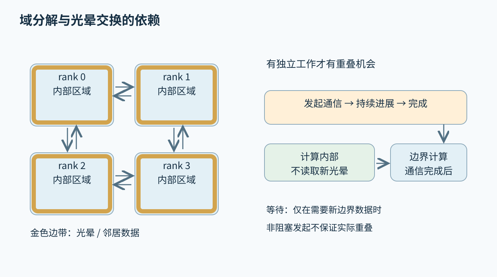
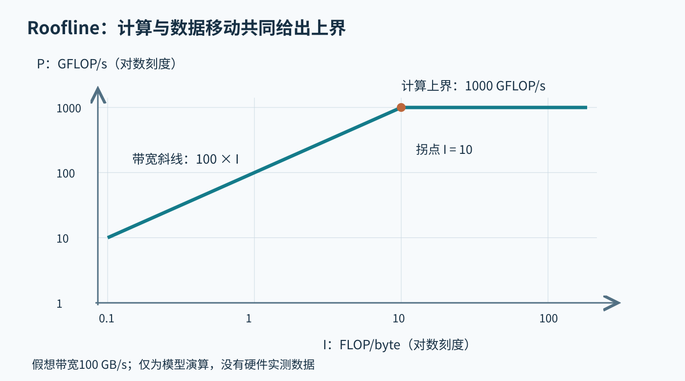
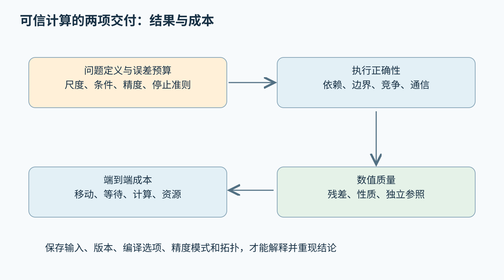

# 第四十三章 并行数值计算与 HPC

**高性能计算**（HPC）利用并行处理、数据局部性和高效数值算法，在可接受时间与资源预算内解决大规模计算问题。它不只追求每秒多少次浮点运算，更要保证所求问题、误差要求与输出解释一致。一个更快却不满足收敛条件的求解器，或者吞吐很高却重复计算错误边界的并行程序，都没有完成原来的科学任务。

并行数值工程需要同时维护两类正确性：执行上没有竞争、遗漏和错误通信，数学上没有超出允许的近似与误差。第一章的误差与线性代数基础、第二十章的实验方法，是本章的必要准备；第四十四章再将相同推理落实到CUDA设备执行。

本章以C++20为语言基线，OpenMP 5.2和MPI 4.1为固定规范参照，不把规范中存在的能力等同于每套编译器、MPI库和集群均已支持。浮点资料采用CUDA 12.4.1归档说明，数值库概念参照BLAS/LAPACK官方资料。所有数字、矩阵和时间模型均为未执行的教学演算，未运行并行程序、数值库、MPI作业或性能基准。

## 43.1 浮点误差 稳定性 BLAS稀疏与稠密运算

### 43.1.1 浮点数用有限精度近似实数

**浮点表示**用符号、有效数字和指数覆盖较大数值范围，但可表示的数是离散的。相邻可表示值的间隔随数量级变化，不能用一个固定绝对误差描述所有输入。十进制中简单的0.1也未必能在二进制浮点中精确表示，输入转换本身就可能带来舍入。

对满足正常范围等前提的一次基本运算，常用模型是计算结果等于精确结果乘以`1+δ`，其中δ受到精度相关界限约束。这个模型有适用条件；溢出、下溢、次正规数、NaN和异常环境需要额外分析。把机器epsilon直接当成任意完整算法的最大相对误差，是错误的外推。

**融合乘加**（FMA）对乘加组合只进行一次最终舍入，可能比独立乘法和加法更准确，但也可能与后者产生不同的位模式。编译选项、目标指令和表达式收缩规则因此会影响结果。数值代码应明确是否允许融合和重结合，而不能把不同结果都归为硬件错误。[S1]

诊断异常数值时，应先追踪第一个非有限值或显著误差出现的位置，区分输入范围、舍入累积、相消和算法失稳。最后一个NaN通常只是传播终点。对中间量加入有意义的范围和不变量检查，比只在最终输出打印更多小数位更有帮助。

### 43.1.2 条件数描述问题 稳定性描述算法

**条件数**衡量输入扰动可能引起多大的输出变化，它属于问题本身及所选度量。**数值稳定性**描述算法面对舍入等扰动的表现；其中常用的后向稳定性要求计算结果可解释为较小输入扰动后的精确解。条件差的问题即使由稳定算法求解，输出仍可能对微小输入变化非常敏感；增加线程不能改变这个事实。

**前向误差**比较计算结果与真实结果，**后向误差**问计算结果是否等于某个轻微扰动输入的精确解。在线性系统中，小残差通常与某种后向准确性相关，但前向误差还受到矩阵条件数影响。不能看到`Ax̂−b`很小，就立即声称x̂一定接近真实解。[S2]、[S3]

以两个几乎平行的方程为例，右端项轻微变化可能让交点移动很远。这不是浮点格式“偶尔不可靠”，而是输入信息本身不足以稳定确定交点。工程上应同时报告残差、条件估计和输入测量误差，让下游知道结果有多少可信数字。

选算法时应考虑问题结构。对称正定、一般稠密、稀疏非对称和最小二乘问题有不同方法与前提。忽略结构可能浪费资源，假定不存在的结构则可能直接失败。求解失败时，先检查前提和尺度，再决定更换分解、预条件或精度，通常比盲目增加迭代次数有效。

### 43.1.3 归约顺序改变误差传播路径

**归约**把多个输入合成较少结果，例如求和、最大值或点积。实数加法满足结合律，有限精度浮点加法通常不满足。并行归约会改变计算树，从而改变舍入发生的顺序；没有数据竞争，也不保证与串行循环逐位相同。

一个未执行的理想化说明是：大正数与大负数先相加再加小数，可能保留小数；先把小数加到大正数上，小数可能在舍入中消失。是否出现这种现象取决于具体表示和数量级，但其机制说明“输入相同、加法次数相同”不足以保证相同结果。

成对求和用更平衡的树，补偿求和追踪部分舍入损失，更高精度累加则增加可保留信息。它们在不同输入下有不同误差和成本，不能统一称为完全精确。若编译器被允许任意重结合，补偿算法依赖的运算次序也可能被破坏，因此算法与编译语义必须共同验证。

可复现还分层：同一次构建和固定线程数稳定，同一机器不同线程数稳定，跨处理器逐位一致，是强度不同的要求。固定归约树可以改善部分确定性，但目标指令、FMA和数学库仍可能不同。需求应明确到哪一层，避免为不需要的逐位一致付出过大成本，或把弱保证误当成强保证。

### 43.1.4 BLAS级别体现计算与数据复用结构

**BLAS**定义常见线性代数基本操作接口。一级以向量操作为主，二级以矩阵向量操作为主，三级以矩阵矩阵操作为主。级别不是质量等级，而是运算结构分类；实现库可以针对目标硬件优化，但调用者仍要提供正确尺寸、布局和参数。[S4]

向量加权相加对每个元素只做少量算术，却要读写多个数值，常受到内存带宽限制。矩阵向量乘法可重复使用输入向量，但矩阵元素通常只参与有限次运算。矩阵乘法则能让同一块输入参与多次乘加，合理分块后有更高数据复用潜力。

使用BLAS的价值不仅是省去手写循环。成熟实现通常包含分块、打包、向量指令和线程调度等复杂工程；自行写出数学等价的三重循环，并不自动具有相同性能。另一方面，对很小矩阵、特殊稀疏结构或融合算子，通用调用开销与数据转换也可能占主导，需要端到端比较。

库的峰值测试不能直接外推到整个应用。尺寸、转置、批量、数据驻留位置和线程设置都可能改变表现。评估时应记录实际调用分布，检查是否在大量小调用之间反复分配与复制，再决定采用批处理、重排算法或保留库实现。

### 43.1.5 布局 步长与整数接口影响数值库正确性

矩阵的数学索引与内存布局是不同概念。行主序与列主序决定连续元素方向，**leading dimension**描述相邻相应列或行的实际存储跨度，可能大于逻辑尺寸。子矩阵视图和填充布局尤其不能把这个参数简单写成“矩阵宽度”。

转置参数通常改变库如何解释已有存储，不一定先生成一份转置副本。错误的布局和步长可能在方阵上偶然得到形似合理的结果，在非方阵或带填充视图上立即失败。一个可靠测试集应包含非方阵、转置组合、非紧密步长、边缘尺寸与已知结果。

大型问题还要核对接口整数宽度。不同BLAS实现可能提供不同整数ABI，尺寸、索引和leading dimension的类型必须与所链接库一致。C++使用64位size_t，不代表把它随意转换为库的32位int没有风险。容量乘法应先检查溢出，再分配和调用。

输出别名也需遵守库契约。数学上可以写C等于A乘B，不意味着输出存储允许任意与输入重叠。调用前应明确哪些参数可共享底层缓冲，哪些需要独立存储。对于错误结果，先验证布局与别名，往往比怀疑浮点精度更有收益。

### 43.1.6 稀疏格式节约零元素也增加间接访问

**稀疏矩阵**利用大量元素为零的结构，避免存储和处理所有位置。CSR用行偏移、列索引和值描述各行非零元素，CSC按列组织，COO直接保存坐标。格式选择影响遍历方向、更新、并行划分与库支持，并非压缩率最高的格式一定最快。

稀疏矩阵向量乘法的每个非零通常只有少量算术，却需要读取值、索引和间接访问向量。索引自身消耗带宽，不规则访问降低缓存复用，行长差异造成负载不均。于是矩阵“存储少”不等于硬件容易高效执行，也不保证比同尺寸稠密表示快。

块稀疏格式利用局部稠密结构，减少索引并改善向量化，但可能存入块内显式零。重排序可以改善局部性或减少分解填充，却会增加预处理和映射成本。若矩阵反复使用，预处理更容易摊销；若只计算一次，复杂变换可能得不偿失。

稀疏输入还需定义重复坐标、排序和显式零的语义。两条相同坐标是累加还是覆盖，不同接口可能不同；并行汇总顺序也会影响浮点结果。验证时应先规范数据模型，再测试空行、极长行、非对称结构和索引越界，不应只使用规则网格产生的友好矩阵。

### 43.1.7 混合精度需要残差和收敛证据

**混合精度**让不同阶段使用不同表示或累加精度，以降低带宽与计算成本。例如低精度完成部分分解，高精度计算残差，再迭代修正。它能否达到目标精度取决于问题条件、算法和误差传播，不能由某个低精度硬件峰值单独决定。

低精度输入的量化误差无法总由高精度累加消除。若两个接近的输入在转换时已变成同一个值，后续更精确的乘加也无法恢复丢失信息。应区分存储精度、乘法精度、累加精度和最终输出精度，避免只用一个“FP16”或“FP32”标签概括整个算法。

深入追问：“残差下降就证明解越来越准吗？”通常是有价值证据，但仍需结合条件数、残差计算精度与停止准则。接近机器极限时，递推残差可能与真实残差偏离，可按算法需要重新计算；病态问题中，小后向误差仍可能对应较大前向误差。

深入追问：“并行后末位变化是否可以忽略？”先判断变化来源是否为允许的舍入顺序，还是遗漏、竞争和未初始化。再用明确的误差度量与应用容差验收，而不是只看差异小。正确的工程顺序是先证明执行与输入契约，再评估数值近似是否可接受。

## 43.2 SIMD OpenMP任务和负载分配

### 43.2.1 SIMD利用数据并行但需要依赖证明

**单指令多数据**（SIMD）让一次指令处理多个元素。可向量化循环通常具有规则访问和可并行迭代，但语法上独立的下标不一定意味着存储不重叠。两个指针可能别名，某一轮写入也可能影响下一轮读取，编译器必须证明安全或生成运行时检查。

例如逐元素计算out[i]依赖in[i]，在输入输出独立时易于并行；若out实际上指向in的偏移位置，就可能形成跨迭代依赖。接口可以禁止重叠，或实现安全回退，但这种承诺必须真实。错误地告诉优化器“绝不别名”，不会提高正确性，只会让错误更难定位。

向量宽度不是全部。尾部处理、非对齐访问、分支掩码、数据打包和数学函数实现都会影响收益。对于不足一组宽度的小输入，准备开销可能超过计算；对于稀疏不规则访问，更多通道也可能大部分在等待数据。应先理解瓶颈，再选择向量化策略。

OpenMP的simd构造表达相应并行执行语义与限制，不是忽略真实依赖的万能开关。C++20也不能默认拥有后续标准中的标准化SIMD库接口；目标指令扩展、编译器自动向量化与OpenMP支持需要在具体工具链中分别核验。[S5]

### 43.2.2 OpenMP区分线程团队与工作分配

**OpenMP**通过指令、运行时和环境控制描述共享内存并行等执行方式。parallel构造建立线程团队，工作分配构造将循环或任务分给团队成员。创建团队与分配一次循环是不同动作；反复在很小循环外创建并行区域，可能把启动与同步开销放大。

数据共享属性决定变量由多个执行单元共同访问，还是拥有私有副本。private并不一般意味着从原值复制初始化，firstprivate才表达相应初始化含义；shared也不自动提供同步。一个指针变量被私有化，不意味着它指向的数据也被深复制，需要区分指针对象与底层存储。[S6]

使用default(none)等方式可以迫使关键共享决策显式化，但不能代替正确设计。共享数组不同元素的访问可能没有逻辑竞争，却仍有伪共享；私有大数组则可能消耗大量线程栈或内存。属性选择同时影响语义与资源，应依据数据生命周期和访问集合决定。

并行区域中的异常、提前退出和取消都有规范限制，不能把串行控制流随意搬进去。跨线程汇集错误通常需要记录线程本地状态、在安全同步点整合，再由外层决定退出。某个线程抛出异常并不自动使全部团队以C++栈展开方式安全停止。

### 43.2.3 调度策略平衡局部性与不均匀工作

**静态调度**以预先确定方式分配迭代，开销较低且较易保持局部性；**动态调度**让线程逐步领取工作，更适合迭代成本不均，但增加协调和潜在数据迁移。guided等策略调整领取粒度，同样需要与负载分布匹配，不能仅凭名字判断一定更优。

若每个迭代做相似工作且访问连续数据，静态连续分块往往容易利用缓存和NUMA放置。若少数迭代特别昂贵，固定均分会让其他线程在末尾等待；此时动态或更细分块可能改善尾部。粒度过细又让调度成本、缓存行争用和队列流量占主导。

均分迭代数不等于均分工作量。稀疏矩阵按行分配时，行长可能相差几个数量级；图算法的邻接表长度和条件分支也会造成差异。可以用非零数、估计代价或历史测量作为划分权重，但预估成本本身和输入变化也应计入。

诊断不均衡应记录各线程有效计算、等待和处理量，而非只看平均CPU使用率。全部核心100%可能在自旋，部分核心空闲也可能是带宽已饱和。先分清等待原因，再决定调度策略，能避免用更多线程掩盖更深层瓶颈。

### 43.2.4 任务图表达依赖 不承诺固定执行顺序

**任务**将工作描述为可由运行时调度的单元，适合递归、不规则和具有依赖图的计算。任务被创建不代表立即在新线程上运行，也不保证按创建顺序完成。程序必须对规范允许的调度都正确，不能依赖某次运行恰好使用的线程与时序。[S7]

depend等机制用数据位置与依赖类型建立任务关系。OpenMP 5.2常见任务依赖规则涉及先前生成的兄弟任务，不能把它想成运行时自动扫描任意层级、任意内存访问的全局依赖分析。依赖标识选错、对象提前失效或任务层级不符合规则，都可能使图与实际数据流不一致。[S6]

任务的共享输入必须存活到任务完成。创建任务的函数返回、循环局部对象销毁或容器扩容，都可能破坏捕获的数据。不带depend子句的通常taskwait等待当前任务在此之前生成的直接子任务；taskgroup等待区域产生的子任务及其规定集合内的后代。二者都不会仅因名字包含wait或group，就自动完成任务另行提交的MPI、GPU或其他外部异步工作。[S6]

任务粒度决定并行机会与调度成本。过粗会留下长尾，过细会使任务创建和依赖维护超过有效计算。可以在递归规模较小时转为串行，在规则子问题中使用循环分块；混合方法往往比坚持全部任务化更实用。关键是保持清晰的完成与资源回收边界。

### 43.2.5 Reduction消除共享更新冲突 不保证固定舍入树

将共享sum由多个线程直接累加通常产生竞争；原子累加可以保护单次更新，但序列化和缓存争用可能很昂贵。reduction让执行单元维护部分结果，再组合为最终结果，适合具有相应组合语义的操作。它改善共享更新方式，不自动让任意操作具有结合性。

OpenMP 5.2对一般归约的组合位置和顺序不作固定承诺，因此浮点结果可能随执行条件变化。即使循环采用静态调度，也不能仅凭这一点保证归约逐位确定。若需要严格次序，应设计显式树或采用满足所需可复现等级的算法。[S6]

自定义归约需要正确的初始值、组合函数和对象生命周期。最大值归约的初始元素、空输入含义、NaN处理和单位都应说明；某些操作不是简单“给一个lambda就能并行”。组合器若访问额外共享状态或抛出未处理异常，还可能破坏本来独立的归约过程。

对性能比较，应同时报告数值策略。把串行补偿求和与并行普通求和比较，只报加速比却省略误差要求变化，会混淆算法收益和标准放宽。合理的比较可以研究两种取舍，但必须让读者知道它们完成的数值契约是否相同。

### 43.2.6 NUMA与嵌套并行决定线程是否接近数据

**NUMA**系统中，访问本地和远端内存可能具有不同延迟与带宽。线程绑定、页面放置和初始化方式会影响数据所在节点；常见操作系统的首次触达策略是一种实现行为，需要按实际平台核验。把数组全部由一个线程初始化，再平均分给所有节点，可能造成远端访问集中。

线程亲和性帮助稳定执行位置，但错误绑定也可能让线程挤在少数核心，或与设备、网络中断争用。应把线程数、硬件线程、物理核心、NUMA节点和进程分布分别记录，不能用一个“64线程”标签概括机器拓扑。内存带宽饱和后继续增加线程，可能只增加开销。

调用多线程BLAS时，还要考虑外层OpenMP或任务运行时。每个外层线程都启动一组库线程，会形成过度订阅，增加切换和内存压力。通常需要明确由哪一层承担并行，或使用经过验证的嵌套策略，而不是让各库按各自默认值独立扩张。

混合MPI与OpenMP时，每节点进程数又影响数据复制、通信和NUMA局部性。一个进程使用整个节点不必然最优，多个进程也不必然浪费；应基于工作集、网络接口和线程支持实测。拓扑选择是计算、内存和通信三方面共同的决策。

### 43.2.7 并行性能问题要先排除语义变化

深入追问：“加一个parallel for就够了吗？”只有迭代依赖、共享状态、异常、资源存活和数值组合都满足要求时，才可能正确。之后还要看任务大小、带宽与调度成本。语法接受只说明编译器识别了指令，不证明循环适合并行，也不证明已经加速。

深入追问：“线程数翻倍为什么更慢？”可能已经带宽饱和，可能出现过度订阅、NUMA远端访问、伪共享或更重同步，也可能负载太小。应比较有效工作、访存和等待的变化，结合线程绑定与库设置定位。把所有退化都归为锁竞争会遗漏大部分数值代码问题。

深入追问：“任务依赖已经声明，为什么仍访问释放内存？”依赖规定任务先后，不自动拥有被引用对象。对象可能在等待范围之外被销毁，依赖位置也可能只是一个已经失效的地址。需要把依赖图与所有权图共同审查，确保任务完成之前数据和用于描述依赖的存储都有效。

## 43.3 MPI通信 分解 扩展性和故障

### 43.3.1 MPI进程通过通信上下文交换数据

**MPI**定义消息传递和相关并行协作接口。通常每个进程拥有独立地址空间，进程在通信器中有秩（rank），消息通过源、目标、标签与通信上下文匹配。rank不是固定机器编号，一个机器可运行多个rank，同一进程在不同通信器中也可以有不同编号。

**通信器**不仅列出参与者，还隔离消息匹配上下文。库为自己的内部通信使用独立通信器，有助于避免与应用消息意外匹配。随意复用标签并不能完全代替上下文隔离，尤其多个模块和并发算法同时工作时，通信身份必须可追踪。

MPI数据类型描述消息中的元素与布局，可以表达非连续存储。它不是把任意C++对象直接序列化的机制：对象内部指针、虚表和所有权关系不会自动变成远端可用含义。发送复杂对象时，应定义可传输数据表示，接收端再重建必要状态。

发送完成与接收完成也不同。标准发送返回后可以按规范重用发送缓冲，但不能由此推断接收方已经完成后续计算。非阻塞操作则需要请求完成后才能重用相关缓冲。通信接口中的“完成”必须绑定到具体操作和本地资源责任，不能泛化为全系统同步。

### 43.3.2 点对点正确性不能依赖隐藏缓冲

阻塞发送可能利用内部缓冲，也可能等待接收方配合，具体行为受消息大小、实现与资源状态影响。两个进程都先发送再接收，在某个小消息测试中成功，不证明不存在死锁；消息变大或缓冲耗尽后，双方可能互相等待。[S8]

可靠设计应安排不会形成循环等待的顺序，使用适当的配对通信，或先发布接收并管理非阻塞请求。改变发送模式可以帮助暴露对缓冲的错误依赖，但调试成功仍需要回到协议证明。不能把增加MPI缓冲当成修复所有消息死锁的方法。

消息匹配应清楚规定标签、数据类型和数量。通配源接收便于动态工作分配，却可能让执行顺序不确定，也可能使某些来源长期得不到服务。若算法要求公平或固定顺序，需要应用层机制；MPI消息匹配语义不自动提供所有业务调度保证。

排查挂起时，应收集所有rank的状态、等待的消息和已经发出的操作，而不只看一个进程的栈。死锁是一组互相等待的关系。单个rank停在Recv可能完全正常，真正问题是另一个rank没有进入应有分支，或者用了不同通信器和标签。

### 43.3.3 非阻塞通信只创造重叠机会

**非阻塞通信**将发起与完成分离，使应用有机会在通信进行期间执行独立计算。发起返回并不表示数据已经发送或接收完毕。发送缓冲在完成前不能被修改，接收缓冲在完成前不能读取或写入；请求对象也需要按规范完成和释放。[S9]、[S14]

通信与计算是否实际重叠，取决于MPI实现、网络硬件、进展机制和应用调用模式。MPI 4.1区分相关进展保证，不能从函数名前缀I推断网络一定由后台线程持续推进。长时间不进入MPI的纯计算区域中，通信进展可能需要额外条件。[S10]

一个合理的光晕交换流程是：发布邻居接收和发送，计算不依赖边界数据的内部区域，等待必要通信完成，再计算边界。若内部区域太小，或网络进展没有与计算重叠，收益可能有限。若提前计算依赖未到达数据的边界，则是错误，不是“更激进的异步”。

诊断重叠应观察时间线，而不是只比较发起调用耗时。Isend返回很快可能只是把工作推迟到Wait；总通信成本并未消失。实验应分别测独立通信、独立计算和组合流程，并保持输入、缓冲和同步边界一致，才能判断重叠程度。

### 43.3.4 域分解用计算体积换通信表面

**域分解**把网格、粒子或矩阵的工作和数据分配到多个进程。规则网格常按空间块划分，每个块保留邻居边界的副本，称为光晕或ghost zone。更新内部点只依赖本地数据，边界点需要交换相邻信息，因此划分形状直接影响通信量。

以三维立方子域边长L、单层邻接模板为教学模型，本地计算量约随L³增长，需要交换的面元素约随6L²增长，表面与体积之比约为6/L。子域越小，通信相对计算越重。这是强扩展最终受限的重要原因之一，不是网络厂商某个带宽数字能完全消除的问题。

真实算法还要考虑角和边、模板半径、多个场量、消息聚合以及网络拓扑。非规则网格需要图划分，目标可能是均衡工作并减少跨分区边；粒子密度变化则需要动态重分配。重新划分会迁移数据和重建通信关系，必须比较后续收益与调整成本。

分解正确性应检查每个全局元素归属唯一、光晕来源正确、边界条件一致，以及周期性连接是否准确。结果只有分区边缘异常时，优先检查索引映射、消息尺寸和迭代版本，而不是先调整数值求解器。错误的旧光晕有时会表现为收敛变慢，而非直接崩溃。

图 43-1 分解和重叠必须尊重数据依赖。四块图是二维示意，正文6/L演算属于另行说明的三维立方模型，二者不混用。来源：本章原创。

### 43.3.5 集合通信的参与 顺序和归约语义必须一致

**集合通信**让通信器中的进程共同执行广播、散集、聚集、归约等操作。它表达一种全局数据关系，允许实现选择树、环或其他算法。集合操作不是任意点对点消息的替代名称，参与者、参数与匹配次序都有具体要求。

同一通信器上的集合调用必须按匹配的顺序发生。某些rank先广播再归约，另一些先归约再广播，可能死锁或构成错误程序。不能依靠集合函数“里面大概有屏障”修复不一致；不同集合也不都提供应用想象的全局完成时刻。[S11]

非阻塞集合允许多个操作在途，但仍要遵守顺序和缓冲生命周期。阻塞与非阻塞版本不是可任意互相匹配的同一调用。不同通信器可以表达独立通信域，帮助安排复杂依赖，但共享底层数据时还需要应用同步。[S12]

MPI归约允许利用结合性及相应交换性重排计算，浮点加法因此可能得到不同末位结果。需要严格顺序的应用应显式建立所需求值方案，并接受相关代价。将用户操作声明可交换也必须真实；错误声明可能使实现选择语义不合法的组合顺序。[S13]

### 43.3.6 混合线程程序要核对MPI提供的支持级别

MPI与线程结合时，初始化应请求所需线程支持并检查实际提供值。SINGLE、FUNNELED、SERIALIZED和MULTIPLE表达不同调用约束：只有一个线程、仅调用MPI_Init或MPI_Init_thread进行初始化的主线程调用、多个线程但串行进入，以及允许多个线程并发调用。请求某级别成功返回，不代表一定得到该级别。[S14]

MPI_THREAD_MULTIPLE不是性能保证，也不自动解决同一通信器上并发集合的顺序问题。应用仍需确保操作匹配、缓冲不冲突、请求对象不被错误并发使用。内部锁、进展线程和网络队列可能使高线程支持成本较大，应按实际调用需求选择。

如果OpenMP工作线程只做本地计算，由一个明确线程处理MPI，可能只需要较低支持级别；如果任务任意迁移并在多个线程发起通信，就要重新审查。不能把“平时只有一个线程调用”当作证明，因为错误路径或回调可能在其他线程进入MPI。

退出阶段应先完成在途通信和相关工作，再释放通信器与运行时。某线程进入Finalize时，另一个线程仍持有通信请求或准备发消息，可能导致挂起或无效使用。混合程序的关闭协议应把线程池、设备工作和MPI生命周期放在同一张依赖图里审查。

### 43.3.7 故障恢复不是把错误处理改成返回即可

集群作业可能因进程退出、节点故障、文件系统或网络问题中断。MPI错误处理器可决定如何报告某些错误，但设置MPI_ERRORS_RETURN不意味着失效进程已被替换，也不保证应用在所有错误之后还能继续原来的通信。恢复能力取决于错误类别、实现与采用的明确机制。[S14]

**检查点**保存足以恢复计算的状态。它应包含进度、分区、随机状态、关键参数和必要数据，而不只是某个输出数组。多个rank保存的数据必须属于一致逻辑时刻；把不同迭代的本地文件混合恢复，可能得到可运行但科学上错误的状态。

写检查点也需要提交协议。临时文件、完整性校验、元数据清单和最后的完成标记，有助于区分完整检查点与崩溃时的半成品。恢复流程应验证版本与输入身份，并允许退回上一份完整状态。检查点存在不等于它可恢复，恢复演练是独立验收项。

深入追问：“一个rank挂了，其他rank捕获错误继续算行不行？”只有算法和运行时具有明确的失效检测、通信域修复与数据恢复方案时才行。否则缺失数据和不完整集合关系会破坏全局状态。普通错误码让故障可观察，不能自动把分布式算法变成容错算法。

## 43.4 Roofline Amdahl数据移动与科学结果验证

### 43.4.1 Roofline建立算术与带宽的上界模型

**Roofline模型**把计算吞吐上限与数据移动上限放在同一坐标系，帮助判断优化方向。若操作强度I为每字节完成的浮点操作数，带宽B以字节每秒表示，计算上限P以浮点操作每秒表示，则可达性能受到`min(P, B×I)`约束。它是上界和瓶颈模型，不是精确运行时间预测器。[S15]

强度的分母必须说明是哪一层数据流量。DRAM、末级缓存、一级缓存或主机设备链路各有不同带宽和字节数，不能用源代码读写次数配某条不相干带宽曲线。缓存命中、写分配、压缩和重复加载都会使实际流量偏离最简单估算。

计算峰值也需要说明数据类型、指令组合和资源范围。双精度向量峰值、低精度矩阵单元峰值和普通标量峰值不能互换。以理想FMA每次计两次浮点操作是常见约定，但算法统计必须一致。拿低精度峰值评判双精度科学程序，会得到没有意义的利用率。

模型的拐点位于P/B，表示要触及计算上限所需的强度。若实际点远低于带宽上界，可能存在延迟、访问不规则、并行度不足或执行依赖；若在带宽斜线附近，减少数据移动通常比减少少量算术更有潜力。模型提供候选解释，仍需计数器和时间线验证。

### 43.4.2 用明确假设计算数据移动预算

以双精度向量更新`y[i]=a×x[i]+y[i]`为未执行教学模型，每元素一次乘法与一次加法，按常见约定计2 FLOP。若x读取8字节、y读取8字节并写回8字节，忽略缓存额外流量和标量a的摊销，强度约为2/24，即1/12 FLOP/byte。

若某假想系统对该访问方式可持续达到100 GB/s，模型带宽上界约为8.33 GFLOP/s。这里GB采用10⁹字节，数值不对应任何实测机器。若性能远低于这个数，应核查实际流量、工作集和并行度；若缓存反复复用，不能继续把全部流量都当作DRAM流量。

对方阵乘法C=A×B，传统算法约有2n³次浮点操作。在极理想的边界模型下，A和B各读取一次、C只写一次且无需读取旧C，双精度流量为24n²字节，强度约n/12。这个估算说明复用潜力随尺寸增长，不保证有限缓存机器真的达到最小流量。

若C需要读取旧值，或者分块导致输入重复装载，流量会增加；打包、转置和设备传输也应纳入相应端到端边界。将理想流量下界直接当成实际字节数，会低估数据移动、夸大操作强度，进而误判带宽利用率和瓶颈。一个可审查的性能报告应同时列理论预算、计量边界和实际观察。

图 43-2 原创Roofline教学图。双对数坐标中P≤min(1000,100I)，P单位GFLOP/s、I单位FLOP/byte；示意曲线没有代表任何硬件基准。来源：本章独立演算，模型依据[S15]。

### 43.4.3 Amdahl定律说明固定工作量的串行限制

**Amdahl定律**分析固定总工作量下的理想加速。若串行比例为f，其余部分在p个处理单元上理想均分，忽略新增开销，加速比为`1/(f+(1−f)/p)`。在f>0时，当p无限增大，上限为1/f；f=0的理想模型则没有这一有限上限。该模型首先提醒人们寻找无法并行的部分，而不是承诺实际会达到这条曲线。

取教学值f=0.05、p=64，分母为0.05+0.95/64，理想加速约15.42，按64个处理单元计算效率约24.1%。即使95%的串行时间对应工作都能理想并行，仍远低于64倍。新增通信、同步和负载不均会进一步改变实际结果。

f并不是某个程序永远固定的标签。输入规模、算法、I/O方式和缓存行为变化，都会改变串行基线的时间构成。不能从一个小输入估出f，再无条件预测所有大规模问题。若并行版本还更换算法或数据结构，也应说明比较包含了哪些变化。

所谓超线性加速也可能有合理原因，如每个处理单元的子问题进入缓存，或并行算法减少了搜索工作。它不违反模型，因为模型假设的工作量和每步成本已发生变化。正确做法是解释变化并报告总资源，而不是只庆祝加速比大于p。

### 43.4.4 强扩展与弱扩展回答不同问题

**强扩展**固定全局问题规模，增加资源，观察完成时间下降；**弱扩展**随资源增长扩大总问题，使每个处理单元承担近似固定工作。前者回答一个既定任务能否更快完成，后者回答更大问题能否在类似时间内完成。两者的效率定义和曲线不能直接互换。

强扩展下，每个子问题变小，通信启动、同步和串行部分相对更大；弱扩展下，局部计算可能保持稳定，但全局归约、网络拥塞和I/O仍可能增长。保持每rank网格数相同，不保证整个应用时间恒定，因为有些操作依赖全局规模。

通信时间常用`α+βn`作简化模型，其中α表示启动相关成本，βn表示与消息字节数相关的传输成本。小消息受启动影响大，大消息更关注带宽；真实系统还有拥塞、多跳、协议切换和进展成本。模型帮助决定聚合与分块，却不能替代网络实测。

扩展报告应包含每节点进程与线程数、绑定、输入规模、迭代次数、通信量、时间分布和基线选择。仅列“用了1024核，达到多少TFLOP/s”，无法判断是否值得增加资源。对实际用户，完成时间、核心小时、能耗和排队等待可能比单一效率更重要。

### 43.4.5 优化应从减少移动和等待开始建模

数值工作经常花在数据搬运而非算术。融合循环可以减少中间数组读写，分块可以复用缓存，批处理可以摊销调用与通信启动，重排序可以改善局部性。每种变换也有成本：融合增加寄存器压力，分块增加边界处理，批处理可能增加等待延迟。

减少全局同步有时比减少几次乘法更有效。迭代求解器的全局归约可能限制大规模扩展，通信避免或流水化算法可以改变同步结构，但也可能改变数值稳定性和停止准则。优化不能只比较单轮时间，还要比较达到相同精度所需的总迭代数。

数据应尽量留在将继续使用它的资源附近。CPU、GPU和节点间反复搬运中间结果，会吞掉局部内核加速。端到端分析需要包括预处理、打包、传输、计算、回传和输出；某个内核快十倍，不意味着整个求解流程快十倍。

优化记录应提出一个可检验假设，例如“这次变换减少一次全量写回”或“这次分解降低跨节点边数”，再说明应变化的流量或等待指标。若时间改善而预期指标不变，应重新解释收益来源，避免把偶然噪声保存为长期经验。

### 43.4.6 科学结果验证需要误差 不变量和独立参照

验证数值结果首先要定义度量。逐元素绝对误差适合固定尺度，相对误差适合跨数量级比较，近零值通常需要混合阈值。向量范数、残差、守恒量或领域观测值可以提供更贴近问题的判断，但任何阈值都应来自数据尺度与业务要求，而不是照抄一个通用epsilon。

独立参照可以是解析解、小规模高精度求解、不同算法或受信任实现。用同一段代码在一个线程和多个线程运行，能发现部分并行错误，却可能保留同一个数学缺陷。参考实现也要说明适用条件，不能因为运行较慢就自动被视为真值。

**变形性质**提供不依赖完整真值的检验：线性算子应满足相应线性关系，置换输入并逆置换输出应保持问题等价，某些守恒系统应维持总量。浮点下需要容差，非线性或离散算法也有各自限制。性质应由数学模型推导，而不是事后挑选能通过的条件。

随机算法还应保存随机源、种子、分布和并行流划分。固定种子不保证改变线程数后使用相同序列，也不保证统计质量；不同线程若错误复用相同子流，结果可能高度相关。验证既要检查重现，也要检查统计假设和科学结论是否成立。

### 43.4.7 性能结论必须与数值契约共同发布

性能测量应报告工具链、库版本、编译选项、硬件拓扑、精度模式、线程/进程设置、问题规模和计时边界。预热与稳定态需要区分，初始化和数据传输是否计入也要说明。重复运行的分布比一个最好数字更能反映可交付性能。

深入追问：“Roofline点很低，能否断定代码没有向量化？”不能。低于上界可能来自访问延迟、不规则数据、依赖链、资源不足、同步或错误流量估计。向量化是候选因素之一，应检查编译报告和指令，再结合计数器判断。一个二维模型不会唯一定位所有瓶颈。

深入追问：“GPU算子快20倍，应用只快1.3倍，优化失败了吗？”要看原占比、传输和新开销。若算子本来只占一小部分，端到端上限就有限；若频繁回传抵消收益，可以调整数据驻留与流程。应先用时间分解解释1.3倍，再决定继续优化哪里。

深入追问：“最快的版本误差略大，可以发布吗？”需要在预先约定的误差、收敛和应用质量范围内验收，并记录精度与编译选项变化。若超出范围，应修复或重新取得需求决策；不能用速度为未经批准的结果变化辩护。高性能计算的交付物是可信结果及其成本，两者必须同时成立。

图 43-3 数值质量和执行成本共同构成验收。图中各层可以迭代反馈，顺序用于表达证明责任，不表示只能最后才测性能。来源：本章原创。

## 本章资料与核验范围

- [S1] [Floating Point and IEEE 754，CUDA 12.4.1归档](https://docs.nvidia.com/cuda/archive/12.4.1/floating-point/index.html)
- [S2] [LAPACK Accuracy and Stability](https://www.netlib.org/lapack/lug/node72.html)
- [S3] [LAPACK线性方程误差界](https://netlib.org/lapack/lug/node81.html)
- [S4] [Netlib BLAS官方说明](https://www.netlib.org/blas/)
- [S5] [OpenMP 5.2 simd Construct](https://www.openmp.org/spec-html/5.2/openmpse60.html)
- [S6] [OpenMP 5.2完整规范](https://www.openmp.org/wp-content/uploads/OpenMP-API-Specification-5-2.pdf)，数据属性、归约和任务依赖
- [S7] [OpenMP 5.2 Task Scheduling](https://www.openmp.org/spec-html/5.2/openmpse77.html)
- [S8] [MPI 4.1点对点通信语义](https://www.mpi-forum.org/docs/mpi-4.1/mpi41-report/node68.htm)
- [S9] [MPI 4.1非阻塞通信语义](https://www.mpi-forum.org/docs/mpi-4.1/mpi41-report/node75.htm)
- [S10] [MPI 4.1 Progress](https://www.mpi-forum.org/docs/mpi-4.1/mpi41-report/node48.htm)
- [S11] [MPI 4.1集合通信正确性](https://www.mpi-forum.org/docs/mpi-4.1/mpi41-report/node172.htm)
- [S12] [MPI 4.1非阻塞集合通信](https://www.mpi-forum.org/docs/mpi-4.1/mpi41-report/node145.htm)
- [S13] [MPI 4.1 Reduce](https://www.mpi-forum.org/docs/mpi-4.1/mpi41-report/node130.htm)
- [S14] [MPI 4.1正式报告](https://www.mpi-forum.org/docs/mpi-4.1/mpi41-report.pdf)，线程支持与错误处理；HTML导航页自标为非正式转换
- [S15] [Williams、Waterman、Patterson，Roofline原始技术报告EECS-2008-134](https://www2.eecs.berkeley.edu/Pubs/TechRpts/2008/Archive/EECS-2008-134.pdf)

[S1]: https://docs.nvidia.com/cuda/archive/12.4.1/floating-point/index.html
[S2]: https://www.netlib.org/lapack/lug/node72.html
[S3]: https://netlib.org/lapack/lug/node81.html
[S4]: https://www.netlib.org/blas/
[S5]: https://www.openmp.org/spec-html/5.2/openmpse60.html
[S6]: https://www.openmp.org/wp-content/uploads/OpenMP-API-Specification-5-2.pdf
[S7]: https://www.openmp.org/spec-html/5.2/openmpse77.html
[S8]: https://www.mpi-forum.org/docs/mpi-4.1/mpi41-report/node68.htm
[S9]: https://www.mpi-forum.org/docs/mpi-4.1/mpi41-report/node75.htm
[S10]: https://www.mpi-forum.org/docs/mpi-4.1/mpi41-report/node48.htm
[S11]: https://www.mpi-forum.org/docs/mpi-4.1/mpi41-report/node172.htm
[S12]: https://www.mpi-forum.org/docs/mpi-4.1/mpi41-report/node145.htm
[S13]: https://www.mpi-forum.org/docs/mpi-4.1/mpi41-report/node130.htm
[S14]: https://www.mpi-forum.org/docs/mpi-4.1/mpi41-report.pdf
[S15]: https://www2.eecs.berkeley.edu/Pubs/TechRpts/2008/Archive/EECS-2008-134.pdf
