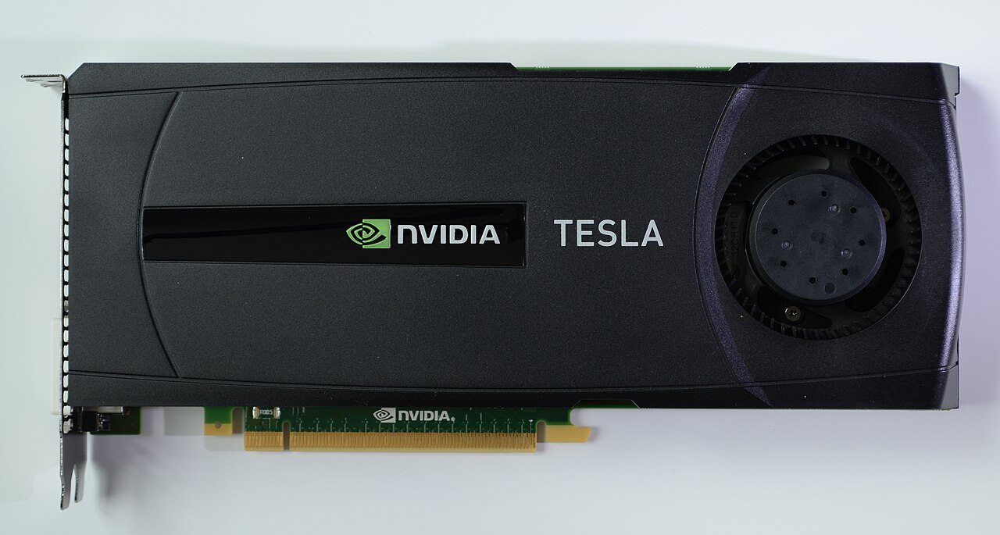
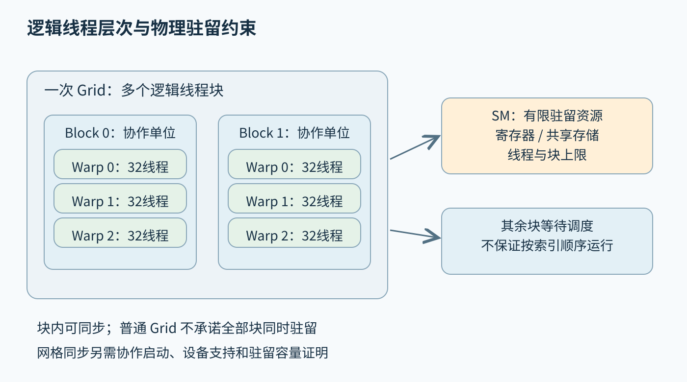
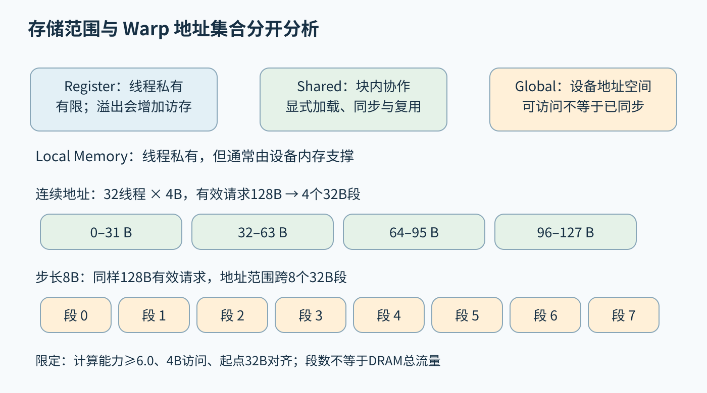
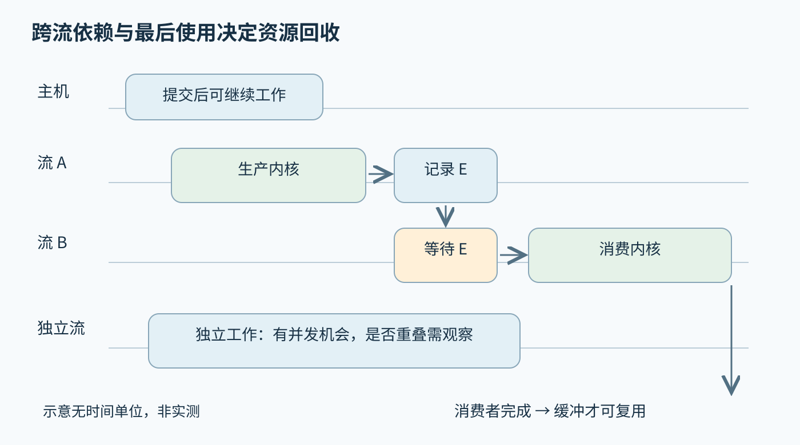

# 第四十四章 CUDA 编程与 GPU 性能

**GPU计算**把大量可并行工作映射到具有高吞吐执行资源的处理器。**CUDA**提供NVIDIA设备上的编程、运行时与工具生态，使程序能够组织设备线程、管理数据和提交计算。GPU不是把CPU函数放到另一块芯片就自动变快的工具；执行组织、数据移动、同步与数值要求必须一起设计。

GPU上的许多线程共享有限的寄存器、局部存储和访存通路。工作分得足够多，可能帮助隐藏等待；分得不合适，也可能产生大量空闲通道、随机访存和同步开销。第四十三章的浮点、归约与Roofline方法仍然适用，本章进一步明确CUDA执行层次及其内存和完成边界。

本章语言主线为C++20，设备接口固定参照CUDA Toolkit 12.4.1归档文档，PTX参照其中的ISA 8.4；不宣称这套版本为当前最新，也不推断它支持本章照片中的历史设备。Nsight与Compute Sanitizer采用2026-10-03核验的滚动官方资料，只说明工具职责。所有代码形状、索引和资源演算均未执行，未运行CUDA程序、驱动查询、性能分析或GPU基准。

## 44.1 GPU线程组织 SIMT Warp线程束 Block线程块与Grid网格

### 44.1.1 设备模型和真实硬件是两个观察层

CUDA把CPU侧称为主机，把参与计算的GPU称为设备。主机准备数据和调用，设备执行内核；统一内存与一致地址空间等机制可以改变部分数据管理方式，但不会取消设备能力、资源预算和同步要求。理解程序时应先画清谁在执行、数据在哪里，以及完成由什么事件证明。

真实加速卡包含芯片、板级存储、供电、连接器和散热组件，芯片内部再有多种执行与存储资源。外观照片有助于认识实物，却不能显示每个线程块怎样分配，也不能证明显存容量、带宽、计算能力或某条指令是否可用。硬件身份和特征应来自官方资料及运行时查询。

下图是Commons明确登记的真实摄影，作为历史GPU加速卡形态示例。它不是AI生成示意，也不是本章实验机器。照片中的风扇与外壳说明散热和板卡形态，正文后面的Warp、Shared Memory和Tensor Core等机制分别受架构与接口条件约束，不能全部套在这块历史产品上。

图 44-1 NVIDIA Tesla 2075历史加速卡实物。摄影：[Raysonho @ Open Grid Scheduler / Grid Engine](https://commons.wikimedia.org/wiki/User:Raysonho)，[原始文件页](https://commons.wikimedia.org/wiki/File:NvidiaTesla2075.JPG)，[CC0 1.0](https://creativecommons.org/publicdomain/zero/1.0/deed.en)。来源页作品日期为2012-06-03，EXIF另记2012-06-17，准确拍摄日未进一步确认；2024-04-07由Pittigrilli裁剪。此处使用官方1280像素缩略图，未另裁剪、调色或生成内容。照片不提供现代CUDA支持或设备能力证明。

### 44.1.2 Thread Block与Grid表达逻辑工作组织

**线程**执行内核中的一份程序实例，拥有自己的索引和局部状态；**线程块**（Block）把一组线程组织为可共享部分资源并同步的协作单位；**网格**（Grid）包含一次内核启动的线程块。索引可以使用一维、二维或三维形式，便于映射数组、图像或体数据。[S1]

逻辑维度不等于硬件几何。二维线程块不意味着芯片上有一个对应矩形执行区域，三维网格也不保证按空间相邻顺序调度。程序利用索引确定负责的数据，运行时和硬件决定何时在哪个资源上执行。把blockIdx递增看作时间顺序，会产生不可靠的跨块依赖。

线程块数量通常远多于能同时驻留的块数，设备分批调度它们。每个块所需线程、寄存器和共享存储影响驻留数量。一个块一般在同一流式多处理器（SM）上执行其生命周期，但这不意味着每个SM只运行一个块，也不意味着所有线程同时发射指令。

启动配置要满足设备和内核的限制。总线程数、单维限制、共享存储和寄存器资源都可能约束可用配置。选择某个常见块大小只能作为起点；必须结合问题尺寸、尾部、访存模式和资源占用，不能把“256线程最优”当作跨架构定律。

### 44.1.3 索引正确性先于并行规模

一维常见全局索引由块索引乘块大小再加线程索引得到。这个公式只提供映射，不自动检查越界；当数据长度不是块大小整数倍时，尾部线程必须受条件约束。长度为零、极小输入和很大输入都应单独考虑，避免空网格或索引溢出问题。

**网格跨步循环**让线程按整个网格线程数为步长处理多个元素。未执行的概念式为：初始i取全局索引，步长s取网格线程总数，只要i小于n就处理元素并增加s。它让网格大小与数据长度适度解耦，也便于复用线程，但需要保证步长非零及索引算术不溢出。

选择索引类型时，应在乘法之前提升到足够宽类型，而不是先以窄类型溢出再转换。二维布局还要检查行跨度乘以行号的范围，pitch以字节还是元素为单位也必须明确。GPU越界错误有时不会立即报告，可能污染其他缓冲后在后续调用中才显现。

块内屏障会影响边界处理方式。若只有有效索引线程进入计算，而块中还有线程需要共同通过屏障，不能把屏障随意放进仅部分线程满足的条件分支。常见做法是所有参与线程按一致控制流到达屏障，无效元素用中性值或受保护的加载处理；具体归约还需证明中性值正确。

### 44.1.4 SIMT与Warp解释分支和通道利用率

**SIMT**让程序员以线程形式表达工作，硬件把线程组织为线程束（Warp）执行。CUDA当前讨论的Warp由32个线程组成，块内线程按规定的线性线程编号分组。Warp大小与SIMD指令的抽象相近，但线程各有逻辑状态，不能把一个Warp直接等同于一条C++向量对象。

当同一Warp内线程走不同分支，设备需要处理各自活跃的路径，可能降低有效通道利用率。分支是否昂贵取决于路径工作量、活跃掩码与实际生成代码；一致分支可以很便宜，极短分支也可能通过谓词执行。删除所有if并不必然提高性能，反而可能增加无用计算和非法访问风险。

从Volta开始的独立线程调度改变了过去部分程序依赖的隐式Warp同步行为。不能因为线程属于同一Warp，就假定共享内存写入后无需同步便可被其他线程安全读取。Warp级通信应使用符合参与掩码和语义要求的同步或集合原语。[S1]

深入追问：“32个线程总是同时到达同一条源码行吗？”不是可依赖的程序保证。分歧、调度和编译优化都会影响执行，源行也不是机器指令单位。正确程序应依赖明确定义的同步和集合参与规则，而非观察到的锁步现象。

### 44.1.5 Block是常见协作边界 SM是资源分配边界

块内线程可以通过共享存储和块级屏障协作，因而适合分块计算、局部归约和数据重排。SM拥有可驻留线程束、寄存器文件和共享存储等有限资源。一个块的需求越大，可同时驻留的其他块可能越少，这把算法分块与硬件调度联系起来。

普通网格中的不同块应能以任意合法次序执行。若块A忙等块B设置标志，而所有可驻留位置都被类似A的等待者占满，B可能根本无法开始。原子操作保护标志，也不解决这种调度资源死锁。跨块生产消费必须采用具有进展保证的设计。

分成多个有依赖的内核是常见稳健方案：第一阶段完成后，下一阶段读取结果。也可以在满足专门要求时使用协作式启动和网格同步，但不能把两种模型混用。减少一次启动是性能目标，不足以授权引入没有保证的全网格自旋屏障。

更后续架构还提供线程块集群等能力，其驻留和同步范围有额外规则。本章不把这些能力当成所有CUDA设备的默认性质。遇到某个高级接口，应先确认版本、计算能力和启动要求，再决定它能否替代已有的块或内核边界。

### 44.1.6 Warp与Block同步必须匹配参与集合

**块级屏障**`__syncthreads()`协调同一线程块中的参与线程，并为其前面的相关共享与全局访问提供块内可见性保证。它不等待其他块，也不是主机等待GPU完成的API。条件分支中的屏障只有在满足整个块一致参与的要求时才可使用；不能让部分相关线程跳过。[S1]

**Warp级同步**`__syncwarp(mask)`针对掩码所描述的线程建立相应同步与内存顺序。掩码不是“希望参与的线程列表”，而是必须与实际参与和调用规则一致。部分Warp、分歧分支和提前退出都需要仔细分析，不能在任何地方复制一个全1掩码就认为安全。

Shuffle等Warp集合操作在寄存器值之间交换数据，但参与掩码和源线程有效性仍然重要。某些原语名称中有sync，并不意味着它同时为任意先前共享内存访问提供完整通用屏障；应按具体函数契约区分值交换和内存同步。依赖共享存储的算法不能只靠函数名字判断。

诊断同步错误应检查每个屏障的参与者、控制流、访问集合与重复迭代次数。挂起可以来自不一致参与，结果偶发错误也可能来自漏掉写后读或读后写屏障。工具能够发现部分问题，但算法仍需要清楚说明每次同步保护的具体数据阶段。

### 44.1.7 网格同步要求协作启动与容量证明

Cooperative Groups提供表达线程组协作的接口，但创建组对象不自动改变启动方式。要在内核中使用合法的网格级同步，需要设备和平台支持协作启动，并采用`cudaLaunchCooperativeKernel`或相应驱动接口。普通三尖括号启动不能仅靠调用grid.sync就获得同样保证。[S1]、[S2]

协作网格大小还受可同时驻留块数约束，取决于SM数量、内核寄存器和共享存储需求、块大小及相关限制。应使用目标设备与实际内核的占用率信息计算可接受范围，并检查启动结果。把另一个内核或另一块GPU的容量常数复制过来，可能使启动失败。

所有需要参加网格同步的线程必须满足组的集体调用要求，工作分支和退出路径也要一致设计。协作启动解决一种重要的跨块同步前提，不意味着任意循环等待、数据竞争或错误掩码都会被修复。同步范围扩大后，数值与资源生命周期责任仍然存在。

深入追问：“为了少启动几个内核，能否让所有块等待一个全局计数器？”普通启动下不能默认安全，因为没有所有块同时驻留与向前推进的保证。应选择多阶段内核，或在已验证的协作启动容量与参与规则下设计网格同步，再比较实际收益。

图 44-2 逻辑工作组织与物理驻留约束分开表示。图只画部分线程束与块，不代表特定芯片SM数量或完整资源规模。来源：本章原创。

## 44.2 Register Shared Global Memory与Coalescing

### 44.2.1 寄存器保存线程私有值 Local Memory未必在片上

**寄存器**承载线程私有的许多标量和中间结果，低延迟且避免显式访存，但数量有限。源码中的局部变量不一定各占一个寄存器，也可能被优化掉、拆分、复用或溢出；数组索引、取地址和编译器决策都可能影响实际分配。

CUDA所谓**Local Memory**表示线程私有地址空间，不表示物理位置靠近执行单元。它通常由设备内存支撑并经过相关缓存，寄存器溢出和某些局部数组可能落在这里。看到local这个名字就把它当成共享存储一样的片上高速空间，是常见误解。[S3]

寄存器用量与占用率之间有取舍。强行限制寄存器可能让更多Warp驻留，却增加溢出加载和存储；允许更多寄存器可能减少访存并提高单Warp效率。正确目标是缩短内核或端到端时间，不是把寄存器数量压到最小。

排查局部数组变慢时，应检查编译资源报告和实际访存指令，确认是否出现spill或local访问，再分析索引是否可静态展开、临时值是否长期活跃。不要只把数组从函数里挪到全局变量，后者会改变共享与竞争语义，可能用错误换取表面速度。

### 44.2.2 Shared Memory是显式管理的协作存储

**共享存储**（Shared Memory）供同一块内线程合作使用，常用于数据复用、转置、局部归约和通信。它由程序显式安排加载、使用和同步，不是自动保存所有热点数据的普通缓存。声明了共享数组，并不意味着读取它之前数据已经由其他线程准备好。

共享存储通常按bank组织，多个线程的访问若映射到冲突位置，可能被拆成更多服务步骤。冲突与bank宽度、访问宽度、地址模式及广播等规则有关，不能把任何多个线程访问同一bank都一概判为相同代价。需要按目标架构和访问类型分析。[S3]

转置是典型例子：全局内存希望相邻线程访问连续位置，共享存储希望读写布局避免严重bank冲突。适当填充一列可以改变映射，但它是针对具体布局的技术，不是所有共享数组都应该无条件加1。填充还消耗容量，可能影响块驻留数。

共享存储的阶段复用需要读后写屏障。第一阶段所有线程完成读取之前，下一批写入不能覆盖仍被使用的数据。只在加载之后加屏障，可能解决写后读，却漏掉迭代之间的覆盖问题。双缓冲可以增加重叠机会，但也使每个缓冲的状态与参与者更复杂。

### 44.2.3 合并访问关心同一Warp的一次访存集合

**合并访问**（Coalescing）把同一Warp线程的一组全局访存合成尽量少的事务。关键是同一条相关指令下各活跃线程访问哪些地址，而不是单个线程沿时间方向是否连续。让每个线程独自连续扫一大段数据，也可能使同一时刻的Warp地址相隔很远。

以CUDA 12.4.1最佳实践中计算能力6.0及以上的4字节访问模型为例，32个线程读取连续且合适对齐的128字节范围，可由4个32字节段服务；起点错开导致跨越更多段时，需要更多事务。这里描述访问合并模型，不把每个事务都直接等同一次DRAM物理突发。[S3]

若只有部分线程活跃，或访问为广播、缓存命中与不同数据宽度，实际请求和传输情况会改变。合并不是一个仅由数组类型决定的布尔属性，应该依据地址集合和相关存储层观察。向量类型也不会自动修复错误的线程映射。

诊断带宽效率时，区分程序请求的有效字节与硬件实际传输的字节。吞吐很高却有效工作少，可能是加载大量不用的数据；请求量小却等待很长，可能是随机访问延迟和并行度不足。两者需要不同优化，不能看到带宽计数就直接下结论。

### 44.2.4 数据布局和线程映射需要共同选择

**结构体数组**（AoS，Array of Structures）把一个对象的多个字段放在一起，**数组的结构体**（SoA，Structure of Arrays）把多个对象的同一字段放在连续数组中。若一个Warp只读取所有对象的x字段，SoA更容易产生连续访问；若每个线程都使用对象的全部字段，AoS也可能有合理局部性和接口便利。

布局选择还影响CPU预处理、数据传输、文件格式与其他内核。为一个热点内核转换布局可能值得，但转换成本和额外副本必须计入端到端。若每个阶段在AoS与SoA间来回切换，局部访存收益可能被搬运完全抵消。

二维数据通常要让相邻线性线程映射到连续存储维度，并正确处理行跨度。块形状16×16和32×8都含256线程，却可能有不同Warp行分布、边界利用率与共享存储模式。不能只比较线程总数，忽略哪一维在内存中连续。

对于不规则数据，可考虑排序、压缩、分桶或改变工作分配，让同Warp处理相似访问与分支。但预处理成本、负载变化和额外索引也需要验证。优化的根本问题是怎样组织真实工作，而不是把所有数据机械地改成一种格式。

### 44.2.5 分块复用减少全局流量但增加资源压力

**分块计算**让线程块先把需要的数据片段载入共享存储或寄存器，再进行多次使用。例如矩阵乘法中，一个输入元素参与多个输出累加，可以通过块内复用减少重复全局加载。收益来自减少数据移动与提高运算强度，不是共享存储天然使任何访问都更快。

块越大，复用机会可能越多，但共享存储、寄存器和边界浪费也会增加。每线程计算多个输出可以提高寄存器复用，同时增加活跃累加器数量。分块参数需要在算术强度、占用率与指令吞吐之间平衡，不能只追求最大的tile。

部分架构和工具链提供异步数据搬运与流水线相关机制，可让下一批数据准备与当前批计算重叠。使用它们必须满足对齐、大小、内存空间、完成等待和设备能力要求；发起异步复制后立即读取目标，依旧是错误。不能把更高级指令当作自动插入全部同步的编译器服务。

验证分块首先检查边缘tile、非整除维度和小尺寸。性能友好的整齐方阵常隐藏越界、未初始化中性值和错误同步。确认结果正确后，再比较实际全局流量、共享存储冲突和寄存器使用，建立收益与成本的因果关系。

### 44.2.6 主机内存 统一内存与传输完成需要分开

离散GPU常通过互连与主机交换数据，传输带宽和延迟可能远弱于设备内部存储。**锁页主机内存**可以支持某些高效异步传输路径，但它消耗系统资源，不宜无限扩大。普通可分页内存可能需要暂存或同步处理，函数名含Async不保证任意参数下都不阻塞主机。[S4]

**统一内存**简化一部分地址与迁移管理，但并不保证数据始终位于理想位置，也不消除缺页、迁移、容量超限或同步成本。CPU和GPU交替触碰同一工作集可能造成反复移动，预取和访问建议的作用也受平台能力与访问模式限制。

**统一虚拟寻址**与统一内存又不是同一件事。地址可以在统一空间中被识别，不表示所有位置都可由所有处理器直接、同样高效地访问。多GPU对等访问、主机映射与原子可见性均有条件，必须按实际设备和分配类型核验。

异步复制期间，源与目标缓冲必须保持有效，并遵守访问限制。CPU向正在传输的源写入新内容，或过早读取未完成的目标，会破坏结果。对象析构和缓冲池复用应绑定完成事件或等价机制，而不是绑定“提交API已经返回”。

### 44.2.7 原子 顺序和作用域共同决定通信正确性

**原子操作**保证特定访问的不可分割性，**内存顺序**规定其他访问与它的排序关系，**作用域**规定相关保证覆盖哪些参与者。设备内、块内与系统级作用域不同；内存处于global空间，并不自动使一个块级原子对其他块提供完整原子通信保证。[S5]

CUDA 12.4.1中传统原子函数的相应接口具有其规定的作用域，通常采用relaxed排序；不能把一次atomicAdd当成发布所有先前普通写入的通用屏障。若用标志发布数据，应使用满足范围与顺序要求的原子协议，并让消费者以匹配方式读取实际发布的值。[S1]

内存栅栏约束调用线程相关访问顺序，不能独自充当所有线程到齐的屏障。volatile也不提供完整原子性、跨线程同步或生命周期保证。正确发布还需要匹配的通信、适当作用域和对象访问规则，不能把fence、volatile与轮询任意拼在一起就认定安全。

跨CPU/GPU或多GPU通信尤其要确认系统级原子对分配类型与硬件连接是否受支持。扩大作用域不会让本来不支持的内存自动变成合法共享介质。即使内存顺序完全正确，普通跨块忙等仍可能缺乏调度进展，必须同时证明安全性和活性。

图 44-3 存储范围和访问效率是两组问题。事务示意限定为正文所述模型，未绘制特定芯片的真实缓存拓扑。来源：本章原创。

## 44.3 Kernel Stream Event Graph和同步

### 44.3.1 Kernel启动成功不代表计算已经完成

**内核**（Kernel）是在设备执行的程序入口。主机启动调用通常把工作提交到相关执行队列后返回，设备可能稍后才开始和完成。主机函数调用时间因此不能直接当作内核执行时间；设备端错误也可能在后续同步或API调用时才被观察到。

错误检查应覆盖启动配置和异步执行两个阶段。无效配置可能较早报告，非法访问等执行错误可能延迟出现。诊断时应把错误与相应提交和完成点关联，不能仅依据最后一个报错API名称判定它就是根因。把所有操作每次都全设备同步可以缩小范围，却会改变性能与并发。

主机与设备各有可运行的代码范围和可用库能力。某个函数能以C++20编译，不意味着能在设备调用；设备代码、主机代码与双目标函数的约束需要按工具链核对。使用模板和标准库也要检查设备适用性，不能只凭头文件可包含就判断支持。

发布制品还涉及目标架构的机器码与PTX表示。PTX是虚拟指令集，最终执行需要兼容驱动和目标的处理；包含PTX不保证所有未来或过去GPU均可运行。应明确构建目标、驱动兼容与回退策略，避免在部署机器上才发现没有可用设备映像。

### 44.3.2 Stream提供顺序 不承诺独立硬件队列

**流**（Stream）表达一系列具有提交顺序的设备操作。同一流中有依赖关系的工作按相应顺序执行，常可无需主机中间等待就连接复制与内核。不同流可以有并发机会，但不保证同时运行，也不保证永远分配独立执行资源。[S6]

跨流共享数据时，需要显式依赖或其他已定义同步。如果流A生产结果，流B读取同一缓冲，单纯主机先调用A再调用B不一般构成足够的跨流设备依赖。可以记录事件并让B等待，或采用适当更强同步，但应选择覆盖实际依赖的范围。

默认流有legacy与per-thread等不同语义，编译设置和接口使用方式影响行为。legacy默认流与其他相关流之间可能产生隐式同步，而非阻塞标志等又有例外。不能把某个项目默认配置下的顺序关系当成全部CUDA程序共有属性。[S7]

增加流数量只有在存在独立工作和资源余量时才可能获益。若一个内核已占满关键资源，更多流可能只排队；若共享带宽成为瓶颈，并发还可能让每个任务更慢。应观察吞吐、延迟与公平性，而不是把流数量当作CPU线程数的直接替代。

### 44.3.3 Event表达完成位置并连接依赖

**事件**（Event）可以记录某条流执行到特定位置的状态，供主机查询、等待，或让其他流建立依赖。它不是把整个设备冻结的一面旗帜，而是与记录位置及相关工作关联。事件对象的重用、记录次数与生命周期应遵守接口规则。[S8]

典型跨流链是：A提交生产内核，A记录事件E，B等待E，再提交消费内核。这样主机可继续准备其他任务，而消费者不会过早读取。若B等待的是错误的一次记录，或缓冲在E之后又被另一个生产者覆盖，事件本身并不能修复逻辑错误。

设备时间测量可使用合适的计时事件，但需要确保开始、结束及所测工作有明确顺序，并等待结束事件完成。其他流的并发工作、系统调度和缓存状态都可能影响时长。事件计时回答的是定义好的设备区间，不包括所有主机准备和队列外等待。

缓冲池可以把“可复用”与完成事件绑定。生产结果被下游多个流使用时，只等待生产完成不够，还要等所有消费者结束。生命周期应跟随最后一次使用，而不是第一次写入完成；这一点与第三十九章渲染资源延迟回收相同。

### 44.3.4 复制与计算重叠需要多个前提共同成立

要把主机设备复制与计算重叠，通常需要合适的硬件并发能力、可用传输引擎、锁页主机缓冲、正确的流安排，以及真正独立的数据片段。满足其中一个条件不保证重叠发生。统一内存迁移和可分页暂存还可能引入额外阻塞，需要按实际路径观察。[S3]、[S4]

**双缓冲**让一块数据参与计算时，另一块准备或传输下一批输入。缓冲状态至少要区分可写、传输中、计算中和可复用；同一缓冲不能因数组下标轮转就自动视为安全。若还要异步回传结果，回传完成也属于复用条件。

分片太小会增加启动和事件开销，太大则降低流水深度并增加延迟。合理分片要平衡传输时间、计算时间和可用并发资源。理想流水上限受最慢阶段约束，不能把传输和计算时间简单相减后承诺获得那个加速比。

诊断没有重叠时，查看时间线中的主机阻塞、默认流依赖、分配释放、隐藏同步和资源饱和。一个额外的设备同步、频繁分配或不合适的内存类型，可能把整个流水串行化。先找实际依赖与阻塞点，比盲目增加流更直接。

### 44.3.5 CUDA Graph把可重复工作图作为提交单位

**CUDA Graph**用节点和依赖描述可重复执行的设备工作流程，通常通过构建或捕获形成图，再实例化为可执行图并启动。它可减少反复提交许多小操作的主机开销，也让依赖结构更明确，但不会自动改变节点内部算法或消除必需的数据依赖。[S9]

图捕获不是记录任意宿主行为的通用录像。支持哪些API、跨流怎样加入捕获、哪些同步或资源操作不合法，需要按版本和捕获模式核验。捕获失败后应检查具体限制并整理工作边界，不能假定把所有调用包在begin/end之间就能得到正确图。

图节点中的指针和参数需要在执行时仍然有效。捕获时存在的临时缓冲不因进入图就自动延长生命周期，反复启动也可能需要更新参数和资源状态。更新能力有接口与拓扑约束，不能把任何新流程都当成已有图的廉价参数替换。

评估Graph时要分开图构建/实例化成本和重复启动收益。只有执行次数和工作模式足以摊销前期成本时，它才可能改善总体时间。对单次大内核，主机提交开销未必是瓶颈；对频繁动态变化的图，维护成本也可能显著。

### 44.3.6 分配 释放和取消必须连接执行时间线

传统设备分配释放接口可能带来同步与管理开销，流有序分配和内存池提供另一类组织方式。但异步分配不是放弃生命周期管理：使用必须位于合法分配之后，释放必须位于全部使用之后，跨流操作仍需相应依赖。具体API与支持条件需要查目标版本。[S14]

C++20的RAII可以管理设备句柄与缓冲所有权，却不自动知道GPU最后一次使用何时结束。析构函数立即释放正在使用的资源会出错；析构中无条件全设备同步又可能造成延迟或死锁风险。可以让资源进入延迟回收队列，由事件或执行器负责最终释放。

取消通常先停止继续提交，再处理已在途工作与结果去向，不应假定有一个对所有普通内核都安全的即时撤销按钮。长内核若需要可控响应，可以在算法上分阶段或设计明确检查点，但其开销、同步和可恢复状态必须一起定义。

多设备程序还要记录分配所属设备、当前上下文与实际消费者。指针数值看起来一样不代表在另一个设备上具有相同可访问性。故障处理中若切换设备后释放错误资源，可能让原始异常被新的清理错误掩盖；资源对象应保存必要的设备身份和释放策略。

### 44.3.7 同步设计要区分排序 可见性 完成与回收

排序说明操作之间允许的先后，可见性说明读取能否观察到适当写入，完成说明某个操作结束，回收说明没有后续使用者。四者相关但不等价：记录生产完成事件不代表所有消费者结束，栅栏不代表其他线程到齐，主机提交顺序也不自动等于跨流执行顺序。

深入追问：“在每个内核后加cudaDeviceSynchronize能否保证正确？”它可以建立较强完成边界并帮助定位部分异步错误，但不能修复内核内部竞争、错误索引或非法屏障参与。它还可能抹掉并发并改变测量。正确性首先来自每层协议，而不是在外层反复等待。

深入追问：“使用Event后是否可以马上free缓冲？”要看事件记录在哪个位置，以及是否覆盖所有使用者。生产完成只允许消费者开始读取，只有最后消费者完成才能回收。异步传输的主机缓冲也遵循同样规则，不能只关心设备指针。

深入追问：“两个Stream为什么没同时跑？”可能存在显式或隐式依赖、资源不足、硬件限制、提交不及时，或单内核已饱和设备。不同流提供并发可能性，实际并发必须由时间线确认。若结果相同但时序不同，应先核对依赖，而不是把调度顺序写死进程序。

图 44-4 事件连接跨流依赖，最后使用完成决定回收。图中的长度只为排版，没有毫秒单位，不是实际剖析时间线。来源：本章原创。

## 44.4 Occupancy Tensor Core Nsight与优化取舍

### 44.4.1 Occupancy衡量驻留Warp比例而非设备忙碌比例

**占用率**（Occupancy）通常指每个SM驻留活跃Warp数相对于其支持上限的比例。它影响可用于隐藏延迟的执行上下文数量，但不直接表示算术单元有多少时间在有效工作。一个占用率很高的内核，仍可能让大量Warp等待相同内存或屏障。[S3]

理论占用率由块大小、寄存器、共享存储与设备限制推算，实际占用率还受工作量、尾部、负载不均和执行阶段影响。理论50%与实际50%相近，不证明没有其他瓶颈；理论很高而实际很低，则需要检查网格规模、长尾和分布。

教学演算：假设一个SM有65,536个32位寄存器、最多64个Warp，每块256线程、每线程64个寄存器。忽略分配粒度和其他限制，一块需16,384个寄存器，最多容纳4块，即32个Warp，寄存器约束下的占用率上界为50%。这些是假想资源条件，不对应照片或某款GPU的完整规格。

真实计算还要考虑寄存器分配粒度、每SM块数和线程数上限、共享存储、内核属性与架构规则。一个寄存器用量微小变化可能跨过资源分配门槛，但强行降低也可能导致溢出。应使用目标工具的资源信息和实际时间验证，而不是只做整数除法后宣布最优。

### 44.4.2 隐藏延迟需要可发射工作而非单纯更多线程

GPU利用多个Warp在某些工作等待时调度其他就绪工作，帮助隐藏延迟。但若所有Warp都依赖同一个长链结果，或都等待带宽饱和的内存系统，增加驻留数的帮助有限。**指令级并行**和Warp级并行可以互补，二者都受资源与依赖限制。

循环展开可能暴露更多独立操作，减少分支开销，也可能增加代码体积和寄存器压力。每线程处理更多数据可能提高复用，却让单线程依赖链变长。选择需要比较实际发射效率、内存流量和spill，不能仅以源码指令条数判断。

当内核受带宽限制且已经充分利用相关通路，进一步增加占用率可能没有收益。若受延迟或可发射Warp不足限制，适度提高占用率可能有帮助。将某个stall原因百分比机械地排第一就优化，也可能误导：只有它确实阻止有效发射并影响总时间时，才构成重要瓶颈。

深入追问：“占用率从50%降到25%，为什么更快？”可能是减少spill、提高数据复用、减少同步或增加每Warp有效计算，使较少上下文足以隐藏剩余延迟。需要用资源和时间证据解释，不能据此反向得出低占用率永远更好的结论。

### 44.4.3 Tensor Core加速的是符合条件的矩阵运算

**Tensor Core**是支持特定矩阵乘加等操作的专用执行资源，不是让所有浮点指令自动变快的通用开关。可用数据类型、形状、布局和精度模式随架构及库版本变化。程序应查询能力并选择受支持路径，不能从“这是一块NVIDIA卡”推断所有相关模式存在。

成熟库如cuBLAS及其相关接口可在满足条件时选择合适实现。算法选择还受矩阵尺寸、工作区、对齐和计算模式影响；某个标志允许使用，不代表每次调用一定使用同一种内核。调用库通常比直接手写低层矩阵指令更稳妥，但仍需要检查数学与资源契约。[S10]

输入表示、乘法精度、累加精度和输出类型必须分别记录。TF32、FP16、BF16等模式具有不同有效精度与范围，使用FP32累加并不恢复输入被舍去的信息。科学计算、训练与推理可以有不同误差要求，应依据任务验收，而不是只选择硬件宣称的最大吞吐数字。

对于小尺寸、稀疏、非规则或大量数据搬运的工作，专用计算单元可能不是主要瓶颈。重排和填充矩阵以满足高速路径也有成本。应比较达到相同质量要求的端到端时间，并明确是否改变精度、稀疏条件或其他假设。

### 44.4.4 Nsight Systems先定位整个流程的等待

**Nsight Systems**用于观察CPU、CUDA API、设备执行与其他系统活动的时间关系，适合寻找提交空洞、复制、同步和跨组件等待。它帮助回答GPU为什么没有工作、CPU是否被某个调用阻塞，以及多个流是否真正重叠。[S11]

时间线中的空白不等于设备性能差。可能是主机预处理太慢、任务粒度过小、I/O未到达、默认流同步或等待外部资源。应从关键路径向前追踪数据和提交来源，而不是只在最长内核里修改指令。端到端优化可能发生在CPU批处理或数据驻留策略上。

标记应用阶段有助于把业务批次与设备工作联系起来，但标记范围要有明确含义。一个主机范围结束时，异步设备操作可能仍在执行；不能把该范围长度当作完整批次完成时间。应同时保留设备事件或结果完成的关联信息。

采集会增加开销并可能改变调度，长时间全量追踪也会产生大量数据。应先选择代表性窗口，记录采集配置，再用低干扰计时确认结论。工具截图适合提供证据，但若没有工作负载、版本和测量边界，漂亮时间线仍然不能支撑可复现结论。

### 44.4.5 Nsight Compute深入内核但需要理解重放

**Nsight Compute**收集内核级资源、吞吐、访存、占用率和调度等指标，适合验证某个具体优化假设。不同架构可用指标不同，同名汇总也可能依赖具体资源组合。应阅读当前工具对计数器与分母的定义，避免把一个百分比当成跨机器统一分数。[S12]

硬件不能同时收集任意数量的计数器，工具可能采用内核、应用或范围重放等方式完成采集。重放会影响缓存、内存保存恢复与并发，某些工作对外部状态或时间敏感时还需要特别处理。剖析模式下的时间不能无条件替代正常运行时间。

分析可以从一个可检验假设开始：访问合并是否减少了事务，分块是否降低了DRAM流量，寄存器限制是否增加了local访问，分支重排是否提高了有效通道利用率。只收集相关指标通常比一次打开所有项目更容易解释，也可降低采集扰动。

优化后需要同时检查正确性和端到端收益。某个计数器更漂亮，可能只是把工作转移到另一个层级；单内核更快，也可能增加前处理、图更新或传输成本。应保留变换前后的相同负载、配置和数值验收结果，建立完整证据链。

### 44.4.6 Compute Sanitizer与边界测试补充人工推理

**Compute Sanitizer**提供检查内存访问、共享存储竞争、初始化及同步等问题的工具。各检查器有各自覆盖范围，例如Racecheck侧重相应共享存储访问风险，不能把其无告警结果当作全设备所有数据竞争都不存在的证明。[S13]

测试输入应覆盖零长度、一个元素、Warp边界、块边界、非整除维度、大索引和不同布局。只测试256或1024这样的整齐长度，很容易遗漏尾部条件、掩码和屏障参与错误。还应覆盖不同流交错、缓冲复用与提前退出路径。

随机输入可扩大覆盖，但参考结果与容差必须可靠。浮点差异可能来自FMA和归约顺序，也可能来自竞争、未初始化或错误索引；不能看到微小差异就全部归为舍入。先用整数或可精确构造的小例子检查映射与同步，再验证真实精度模式的数值表现。

工具运行本身也受设备、驱动和版本限制，需要记录实际检查器、选项及结果。本章没有运行任何检查器，因此所列内容是验证方法与边界说明，不是已通过测试的CUDA实现。教材中的机制解释不能替代项目自己的独立验收。

### 44.4.7 GPU优化应交付可解释的端到端取舍

一个可交付优化应说明原瓶颈、变更、正确性前提、观察指标与最终收益。例如减少一次全量回传、合并多次小启动、改进Warp地址集合或降低溢出，都有可预期的证据。先写清假设，再测量，可以避免把时钟变化、缓存热度或后台负载误认为算法收益。

深入追问：“原子计数正确，为什么消费者仍读到旧数据？”原子性只约束对应操作，发布数据还要满足内存顺序、作用域和读到相应发布值的关系。若使用传统relaxed原子充当完成标志，协议可能不完整；若作用域仅为块，也不能覆盖其他块。进一步还要核对缓冲是否过早复用。

深入追问：“Tensor Core峰值很高，为什么模型没有同倍加速？”实际工作可能受输入布局、非矩阵算子、传输、启动或精度约束限制；库也不一定为所有形状选同一高速路径。应按端到端时间分解，再验证真正使用的计算模式，而不是用峰值比值直接预测应用加速。

深入追问：“怎样判断该继续手写内核还是使用库？”先看库是否满足语义、精度、布局和批量需求，再测调用边界是否主导成本。手写适合有明确可利用特殊结构或融合机会的场景，但要承担版本、数值、同步与性能维护。最终标准是同一质量要求下的总成本与可靠性，而非代码越底层越专业。

**本章资料**

- [S1] [CUDA C++ Programming Guide，12.4.1](https://docs.nvidia.com/cuda/archive/12.4.1/cuda-c-programming-guide/index.html)
- [S2] [CUDA Runtime Execution Control，12.4.1](https://docs.nvidia.com/cuda/archive/12.4.1/cuda-runtime-api/group__CUDART__EXECUTION.html)
- [S3] [CUDA C++ Best Practices Guide，12.4.1](https://docs.nvidia.com/cuda/archive/12.4.1/cuda-c-best-practices-guide/index.html)
- [S4] [CUDA Runtime API同步行为，12.4.1](https://docs.nvidia.com/cuda/archive/12.4.1/cuda-runtime-api/api-sync-behavior.html)
- [S5] [PTX ISA 8.4内存一致性模型](https://docs.nvidia.com/cuda/archive/12.4.1/parallel-thread-execution/index.html#memory-consistency-model)
- [S6] [CUDA Stream API，12.4.1](https://docs.nvidia.com/cuda/archive/12.4.1/cuda-runtime-api/group__CUDART__STREAM.html)
- [S7] [CUDA默认流同步行为，12.4.1](https://docs.nvidia.com/cuda/archive/12.4.1/cuda-runtime-api/stream-sync-behavior.html)
- [S8] [CUDA Event API，12.4.1](https://docs.nvidia.com/cuda/archive/12.4.1/cuda-runtime-api/group__CUDART__EVENT.html)
- [S9] [CUDA Graph API，12.4.1](https://docs.nvidia.com/cuda/archive/12.4.1/cuda-runtime-api/group__CUDART__GRAPH.html)
- [S10] [cuBLAS，CUDA 12.4.1归档](https://docs.nvidia.com/cuda/archive/12.4.1/cublas/index.html)
- [S11] [Nsight Systems User Guide](https://docs.nvidia.com/nsight-systems/UserGuide/index.html)，滚动页面，核验日期2026-10-03
- [S12] [Nsight Compute Profiling Guide](https://docs.nvidia.com/nsight-compute/ProfilingGuide/index.html)，滚动页面，核验指标与重放边界
- [S13] [Compute Sanitizer官方说明](https://docs.nvidia.com/compute-sanitizer/ComputeSanitizer/index.html)，滚动页面，核验检查器范围

- [S14] [CUDA Stream Ordered Memory Allocator，12.4.1](https://docs.nvidia.com/cuda/archive/12.4.1/cuda-runtime-api/group__CUDART__MEMORY__POOLS.html)

[S1]: https://docs.nvidia.com/cuda/archive/12.4.1/cuda-c-programming-guide/index.html
[S2]: https://docs.nvidia.com/cuda/archive/12.4.1/cuda-runtime-api/group__CUDART__EXECUTION.html
[S3]: https://docs.nvidia.com/cuda/archive/12.4.1/cuda-c-best-practices-guide/index.html
[S4]: https://docs.nvidia.com/cuda/archive/12.4.1/cuda-runtime-api/api-sync-behavior.html
[S5]: https://docs.nvidia.com/cuda/archive/12.4.1/parallel-thread-execution/index.html#memory-consistency-model
[S6]: https://docs.nvidia.com/cuda/archive/12.4.1/cuda-runtime-api/group__CUDART__STREAM.html
[S7]: https://docs.nvidia.com/cuda/archive/12.4.1/cuda-runtime-api/stream-sync-behavior.html
[S8]: https://docs.nvidia.com/cuda/archive/12.4.1/cuda-runtime-api/group__CUDART__EVENT.html
[S9]: https://docs.nvidia.com/cuda/archive/12.4.1/cuda-runtime-api/group__CUDART__GRAPH.html
[S10]: https://docs.nvidia.com/cuda/archive/12.4.1/cublas/index.html
[S11]: https://docs.nvidia.com/nsight-systems/UserGuide/index.html
[S12]: https://docs.nvidia.com/nsight-compute/ProfilingGuide/index.html
[S13]: https://docs.nvidia.com/compute-sanitizer/ComputeSanitizer/index.html
[S14]: https://docs.nvidia.com/cuda/archive/12.4.1/cuda-runtime-api/group__CUDART__MEMORY__POOLS.html
