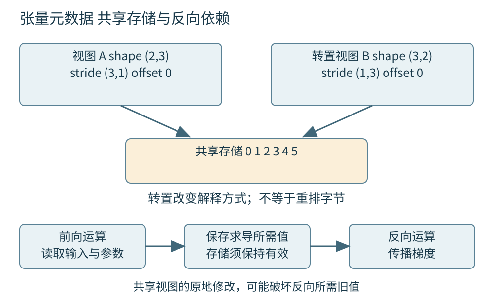
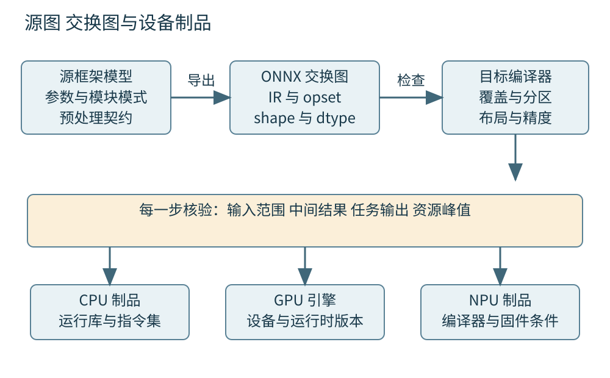
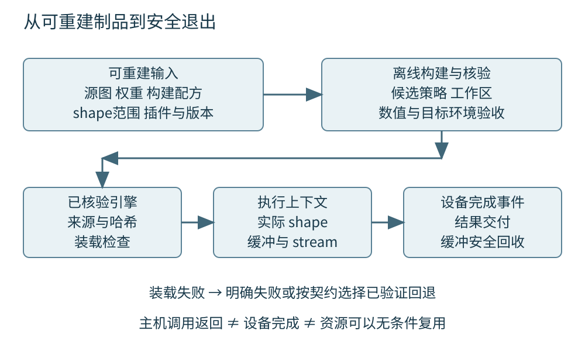

# 第四十五章 训练与推理软件栈

训练把数据、损失函数和更新规则转化为模型参数；推理使用已经选定的参数处理新输入。二者共享张量运算，却承担不同的状态、内存与交付责任。训练程序能在一台机器上降低损失，不代表导出的模型能在另一台设备上保持相同语义；模型文件能够加载，也不代表输入布局、预处理和运行时版本已经相容。

**AI软件栈**是从模型表达、自动微分、图表示与编译，到算子库、设备运行时和部署接口的一组分层。各层解决不同问题：框架方便表达，交换格式保存计算含义，编译器选择实现，运行时安排内存和执行。工程师需要知道一次错误产生在哪一层，以及上一层的哪些假设必须传给下一层。

本章承接第四十一章的编译中间表示和第四十四章的设备执行。PyTorch机制以2.6固定版本文档为参照，ONNX结构以1.17.0仓库标签为参照；TensorRT使用实际读取的10.x文档分支说明机制，该分支不是某个小版本的冻结快照。ONNX Runtime文档按核验日滚动页面使用。这里没有运行模型、导出程序或性能测试，所有张量和容量数字均为教学构造。

## 45.1 Tensor Autograd计算图与PyTorch Runtime

### 45.1.1 张量既有数值含义也有存储契约

**张量**在本章中指带类型和维度的多维数组对象。一个四维对象可以表达一批图像，也可以表达注意力头；仅看维数无法知道各轴含义。工程接口至少应说明shape、轴语义、dtype、device，以及允许的布局。把高度与通道交换后，元素数量可能完全相同，程序仍能执行，却已改变输入含义。

shape是各轴长度；stride描述沿某轴前进一步需要跨过多少存储元素；storage offset是逻辑首元素相对于底层存储起点的偏移。对普通稠密步长视图，元素地址可按“基地址加上元素字节数乘以偏移与各索引步长之和”理解。这个模型要求索引合法，不能直接套到压缩稀疏格式、设备专有分块格式或任意重叠写入。

dtype不仅是文件里每个元素占几字节，还决定表示范围、舍入与运算规则。device则影响指针能在哪里解引用、复制是否异步以及执行由谁负责。C++20里的普通指针和span不能自动表达这些契约；把GPU地址装进一个主机视图并不会使CPU能够安全读取。跨语言边界要传清元数据与所有权，不能只传“地址加长度”。

### 45.1.2 视图可以改变形状而不搬动数据

考虑按行连续存放的2×3教学矩阵，其元素依次为0至5，步长为(3,1)。转置得到shape为(3,2)、步长为(1,3)的视图：逻辑坐标(1,0)仍引用原存储中的1。转置并没有把内存重排成新的行连续次序，因此“数学上已转置”和“物理上连续”是两件事。

PyTorch2.6将许多切片、转置操作定义为共享底层数据的视图；reshape可能返回视图，也可能复制，调用者不应依靠它永远属于其中一种。contiguous是否分配新存储则取决于目标连续性是否已经满足。[S1] 这说明优化不能只数运算符：一行看似简单的重排，可能引入整张激活的读写。

广播还可能用零步长让多个逻辑位置引用同一元素。只读访问可以节省存储，原地写入却需要格外小心，因为逻辑上不同的位置未必是独立对象。诊断数值错乱时应同时打印轴含义、shape、stride、偏移和别名关系；只比较元素总数或指针是否非空，无法证明布局正确。

布局契约还要包括对齐和允许的连续格式。例如NCHW按批次、通道、高度、宽度说明轴的逻辑次序，channels-last说明某种存储组织，二者不能仅凭名称判断为同一维度置换。自定义算子若只处理行连续数据，应在入口拒绝不满足条件的输入，或者显式转换并记录代价；静默假设连续，往往会让方阵或batch为1的样例掩盖错误。

### 45.1.3 自动微分记录的是求导所需依赖

**自动微分**依据运算的局部导数和链式法则计算导数，不是对源代码做数值差分。反向模式通常从标量损失向输入传播向量雅可比积，使参数很多、输出较少的训练问题无需显式构造完整雅可比矩阵。它仍要求每个参与求导的运算有正确导数定义。

以教学表达式y=x×w、L=(y−t)²为例，反向传播需要误差y−t以及乘法的相关输入。前向结果只占一份输出，并不能说明反向只需要同样大小的存储。某些中间量需要保留到反向完成，某些可以重算。PyTorch的Autograd根据实际执行建立图，并保存具体求导公式所需数据。[S2]

动态图的优势是Python控制流能决定本次实际运算路径，但一次前向只记录已经走过的路径。一个分支没有执行，不意味着它已被导出、编译或验证。损失不可导点的约定、自定义反向实现和原地修改也属于正确性边界。训练不收敛时，自动微分引擎存在并不等于梯度在业务上必然正确。

### 45.1.4 梯度累积与原地修改改变状态边界

梯度是状态的一部分。连续多次反向传播通常会把结果累积到参数的梯度缓冲，而不是自动替换成最新一份。梯度累积可以模拟较大的有效批量，但需要明确损失缩放、累积步数、最后不足一组的样本权重，以及何时更新参数。若每个微批损失已经取均值，再不加说明地相加，学习率的有效尺度就可能改变。

原地更新还涉及别名和保存值。假设反向公式需要前向的输入，而程序在反向之前通过另一个视图改写了那块存储，旧值便不再存在。框架可以用版本计数等机制发现一部分违规更新；绕过受支持接口、错误的自定义算子或不正确的外部内存生命周期，仍可能破坏求导前提。[S2]

判断“梯度为零”时，要区分数学结果恰为零、参数没有参与本次图、张量被detach、梯度被清除，以及低精度下溢。它们需要不同修复。保留计算图也不是通用解法：无意保存每一步损失张量及其图，会让整段训练历史仍被引用，使显存随步数增长。应根据诊断目的保存标量统计或明确需要的状态。

### 45.1.5 评估模式与关闭求导是两个开关

训练态与评估态描述模块的行为选择，例如Dropout是否随机屏蔽、BatchNorm是否使用训练时的统计更新；是否记录梯度描述Autograd的工作。PyTorch2.6的eval与no_grad、inference_mode彼此不是同一个机制。把模型设为eval并不会自动关闭梯度记录，关闭梯度也不会自动让所有模块进入评估态。[S2]

inference_mode还会对生成张量的后续求导使用施加更强约束，不能把它视为“更快的no_grad且没有差异”。例如先做一段不需要梯度的特征准备，再让结果参与需要记录的训练计算，就应核对这种跨模式流动是否允许。功能可运行与是否按预期求导必须分别确认。

一个常见线上偏差来自预处理一致、权重一致，却漏掉模块模式切换。另一种偏差来自验证阶段意外更新运行统计，进而影响后续训练。定位时应比较完整模式、缓冲区、随机性和dtype，不能只检查state_dict中的可训练参数。模型状态包括持久缓冲；“权重相同”常常只是相似性的一个子条件。

### 45.1.6 运行时负责派发内存和异步执行

运行时把一个框架算子派发到适合dtype、设备与布局的实现；实现可能来自库、生成内核或自定义扩展。Python调用返回的时间不必等于设备工作完成的时间。PyTorch2.6的CUDA语义明确区分入队与执行，非默认stream之间的依赖需要正确建立。[S3]

缓存分配器会保留已经申请的设备内存以便重用，因此进程占用、分配器保留量和仍被活跃张量使用的量不应混为一谈。释放一个Python引用不保证马上把内存交还驱动，更不保证异步工作不再访问它。对自定义C++扩展，RAII析构点与设备最后使用点要建立明确联系。

计时也要注明边界。测量主机调用耗时，可能主要测到派发和提交；设备事件通常刻画某条设备时间线的一段；用户端延迟还包括数据准备、复制和排队。为诊断强制同步可以缩小异步报错位置，但长期每步全同步会改变原程序的重叠机会。第四十四章的stream和event规则在框架层仍然成立。

图 45-1 张量描述与求导图是两种相互关联的结构。两个视图可以共享存储，反向节点又可能需要该存储中的前向值；生命周期不能只按表面对象数量推断。

### 45.1.7 从显存上涨追问到完整证据链

**追问：“每个训练step之后都清空梯度，为什么显存还持续上涨？”** 清空梯度只处理一种状态。还应检查是否把带图的loss或输出放进容器、是否无意保留反向图、输入shape是否不断触发新的缓存，以及当前观察是活跃分配还是分配器保留。先确认增长是否随固定shape重复步骤继续发生，再定位仍存活的对象与分配来源。

**继续追问：“调用清缓存后下降，能否证明没有泄漏？”** 不能。它可能只是归还空闲缓存，也可能使碎片或增长暂时不明显。应把活跃张量、缓存池、外部库工作区和进程总占用对应起来；若存活引用持续增长，清缓存并未修复原因。若增长最后稳定，则还需判断稳定值是否落在并发容量预算内。

**再追问：“把reshape换成view就一定更快吗？”** view需要布局满足条件；失败时不能靠强制解释相同内存来绕过。reshape可能为了正确性复制。正确判断是先证明目标shape与stride相容，再检查下游访问成本：一个零复制视图若迫使后续算子做低效跨步读取，也可能比一次显式重排更慢。

## 45.2 ONNX导出 动态Shape与算子覆盖

### 45.2.1 交换格式保存图契约而不是整个研究环境

**ONNX**是表达机器学习计算图的交换格式。模型包含图、输入输出、初始化张量、算子及版本等信息，使不同工具能围绕同一计算语义协作。它不是Python虚拟机，也不是把任意训练脚本、文件读取、网络请求和控制逻辑原封不动打包的容器。

ONNX1.17.0的IR区分模型的IR版本、算子域及其opset导入、生产工具版本和模型自身版本。图节点通过值名连接，节点输出遵循单赋值要求；控制流可以通过专门算子和子图表达，而不是允许普通数据依赖图随意成环。[S4] 这些结构便于检查和优化，但不自动证明某个设备能执行所有节点。

部署契约还应包含图外内容：分词器或图像变换、标签映射、归一化常量、截断策略、输出解释与后处理。若图接受已经归一化的张量，而线上直接送入原始像素，格式检查可能完全通过。文件扩展名与“导出成功”只能说明取得了一种制品，不能替代端到端契约。

### 45.2.2 导出必须说明捕获了哪些执行路径

导出器需要把源框架表达变成目标图。基于一次示例输入跟踪的路径，可能把某些Python分支、循环次数或由样例决定的值固定下来；符号捕获则需要表达或约束动态部分。PyTorch2.6文档区分不同ONNX导出路径，因此本书不把某个导出参数、默认值或支持范围当成跨版本恒定接口。[S5]

示例输入为长度128的序列时，某段Python逻辑也许选择“短序列算法”。若导出结果只包含该分支，后来把轴标成动态，并不能凭空补回长序列分支。动态维度声明说明哪些长度可以变化，不是证明所有依赖这些长度的控制流都已正确保留。

工程上应先写清模型的可导出边界，把Python预处理、模型张量计算和业务控制分开。对条件分支要检查目标图是否表达了条件，或者导出契约是否明确限制了输入范围。无法导出的算子应形成明确错误或受控替代，而不是在日志角落里忽略警告。导出报告应与真实目标运行时的接受结果一起保存。

导出前后还应保存常量来源。由输入张量计算出来的尺寸、由Python读取出来的尺寸和模型配置中的固定维度，可能在捕获过程中走不同路径。检查目标图时，应确认本该随输入变化的量仍是运行时数据，而本该固定的模型配置没有变成可被请求任意覆盖的输入。两类错误都不是靠增加测试次数自然消失的。

### 45.2.3 动态维度需要关系约束

**动态shape**表示某些尺寸在运行时决定，不表示任意rank、任意长度和任意轴组合都合法。教学输入token_ids为(B,S)，mask也为(B,S)，两者的B和S应一致。若分别给四个轴独立范围，即便每个单轴都在允许区间内，组合仍可能违反模型语义。

矩阵乘法还要求收缩维度相容；reshape要求元素数量与目标关系一致；切分与分组要求相应整除条件。符号名称、导出约束和运行时检查需要共同承载这些事实。ONNX形状推导能够推断一部分信息，却不能把所有数据相关关系都静态解决，也不能代替真实输入检查。

输出shape有时依赖输入数值而不只是输入尺寸，例如保留下来的候选框数量或非零元素数量。此时只看输入shape并不一定知道输出缓冲需要多大，运行时要支持相应分配协议或采用有界输出设计。把“动态输入”与“数据相关输出”分开，才能解释为什么同一批尺寸下仍可能出现内存和同步差异。

### 45.2.4 算子名称相同不等于执行语义相同

算子覆盖至少有四层：格式能否表达、导出器能否生成、运行时能否接受、目标后端能否以目标dtype和shape执行。一个后端支持MatMul，不代表支持每种批量广播、每种输入类型、零长度维度或每个opset中的定义。自定义域的算子还需要对应实现随部署包到达目标环境。

版本转换不是单纯改一个整数。某些算子的属性、输入形式、广播规则或边界行为随opset变化，必须保持等价改写。若转换器不知道怎样表达原语义，拒绝比生成外观可运行但意义改变的图更安全。自定义插件还需定义序列化版本、shape推导、dtype协商和异常路径。

分区执行可能掩盖覆盖缺口。ONNX Runtime通过Execution Provider声明支持的节点或子图，并将工作分配给相应后端。[S6] 一部分节点回退到CPU后，整体仍可能返回正确结果，但中间张量搬运、同步与内存副本会改变性能。验收需要记录实际分区图，不能把“GPU Provider已注册”当成“全部在GPU执行”。

### 45.2.5 等价验证应从中间张量缩小差异

导出验收应覆盖输入范围与模型语义。先使用固定、可追踪的输入比较源模型和目标模型的输出；再覆盖最小、典型、最大尺寸，非整齐长度、掩码边界、空候选和异常值。测试数据要经过相同预处理，并明确源模型所用模式与精度，否则比较对象从一开始就不同。

数值比较同时需要绝对误差与相对误差。接近零的基准值不适合只用相对误差，较大值又不适合只用一个极小绝对阈值。对于排序、分类与生成，还应比较任务结果和关键决策边界。两个logit仅差很小，也可能在近似平局时交换顺序，因此元素误差小不能单独保证业务结果稳定。

如果整模型差异明显，可以逐段暴露中间结果，定位第一处超出容差的算子。先核查布局、广播、常量、插值坐标或掩码语义，再研究低精度差异。误差从输入起就很大通常支持契约问题；某个归约后才扩大则提示数值或算子实现问题。诊断应提出可证伪假设，而不是看见不同就归咎于GPU。

对生成模型，逐字输出不一致也不能立即说明转换失败。应先固定分词、采样参数与停止规则，必要时比较同一前缀条件下的logit或概率，再追踪差异怎样影响选择。如果第一步选择发生微小变化，之后输入前缀也随之改变，整段文本便不再是在比较相同条件下的数值计算。

### 45.2.6 模型文件和外部权重都是不可信输入

模型加载会触及反序列化、内存分配、文件路径解析以及可能执行的扩展代码。PyTorch2.6在没有传入pickle_module参数时，默认令torch.load使用weights_only=True限制反序列化，并明确对额外全局对象放行需要信任判断。[S7] 限制反序列化能力有帮助，但不能把任意来源的文件自动提升为可信代码或可信数据。

应将“来源可信”“字节完整”“格式合法”“资源可承受”“计算结果符合任务”分别验证。哈希可以确认拿到的是某份字节，不能证明发布者可靠；签名可以证明由某个密钥签发，不能证明模型没有错误。加载前还应限制文件总量、张量尺寸、外部数据路径与目标目录，避免越界引用或异常大分配。

模型中要求下载并执行的自定义代码，应作为独立代码供应链审查。遇到加载失败，直接关闭安全选项或允许全部未知对象，等于改变信任边界。生产部署更适合在受限构建环境验证制品，记录审查后的插件和运行时依赖，再进入服务环境；不应让在线请求自行选择任意模型路径或远端仓库代码。

图 45-2 源模型、交换图和设备引擎是不同制品。输入契约与版本清单贯穿各阶段，每次转换都需要针对目标环境重新验证。

### 45.2.7 从动态导出故障追问部署契约

**追问：“导出时声明了batch轴动态，为什么batch从1变成4就失败？”** 先看图中的其他常量和reshape是否仍固定为1，再核对运行时profile、关联输入的batch、插件支持范围与实际分配。声明动态轴只提供一项信息，不会自动重写所有由样例输入固化的计算。

**继续追问：“换一个更高opset是不是就能解决？”** 可能增加可表达的算子语义，也可能超出目标运行时支持。应先确认失败发生在导出、格式校验、解析、分区还是执行，再选双方支持且保持原语义的版本。没有证据时不断升级，只会同时改变更多变量。

**再追问：“输出接近就可以发布吗？”** 还需要覆盖动态范围、模式、前后处理、异常输入、加载安全及资源峰值。若产品依赖阈值或排序，应检查误差是否改变决策。允许哪些差异应在比较前规定，不能看到结果之后不断放宽容差直到通过。

## 45.3 训练数据流水线 优化器检查点及训练推理差异

### 45.3.1 数据流水线决定设备实际看见的样本

**训练数据流水线**把存储中的记录变成设备可消费的批次，通常包含读取、解码、筛选、变换、采样、拼批和传输。它既影响吞吐，也定义样本分布。数据增强、标签对齐或随机采样出错，可以使GPU持续满载，却把训练推向错误目标。

map-style数据集按索引取样，iterable-style数据集按迭代产生样本，二者在分片和重启上的责任不同。PyTorch2.6明确提醒，多worker中的IterableDataset副本若没有正确区分读取范围，可能重复产生相同数据。[S8] worker数量增加不自动意味着覆盖更多样本，反而可能把重复样本悄悄计入epoch。

数据版本、过滤规则和预处理版本应与训练记录绑定。某个坏样本被跳过也应留下计数与原因，否则训练成功可能以系统性丢失某类数据为代价。流式数据难以简单用“第几个epoch”描述进度，应使用明确分片、偏移、窗口和采样策略。性能指标中的样本每秒，需要说明是读取记录、有效训练样本还是经过重复与填充后的张量行数。

### 45.3.2 预取和固定页内存受总资源预算约束

预取用队列把CPU准备与设备计算重叠，固定页内存可以帮助设备传输路径，但二者都不是免费加速。更多worker可能复制更多元数据，占用CPU、文件描述符与共享内存；更深队列会增加常驻批次和被取消后仍做的无效工作。应把数据准备时间分解后再决定增加并行度。

教学流水线每批解码8ms、传输3ms、计算12ms。完全串行要23ms；理想重叠稳态受最长阶段12ms限制，但启动、收尾、资源争用和同步会使实际值不同。这个演算只说明可能隐藏哪些成本，并不是实测速度。若解码变为20ms，仅优化传输不能消除供给不足。

异步复制还要求源缓冲在复制完成前保持有效，目的缓冲在消费者开始前已经准备好。固定页内存不等于无须同步，统一内存也不等于从不搬运。诊断GPU间歇空闲时，应关联数据队列水位、CPU工作、存储延迟和复制事件；只看平均GPU利用率无法区分输入饥饿与模型自身的串行阶段。

### 45.3.3 优化器状态决定训练更新的连续性

**优化器**根据参数、梯度与自身状态产生下一组参数。普通梯度下降、带动量方法和自适应方法对历史信息的依赖不同。参数张量只是训练状态的一部分；动量、二阶统计、参数组、学习率调度进度以及混合精度缩放状态都会影响下一步更新。

因此“恢复权重”和“恢复训练”不同。若只加载相同参数而重新初始化优化器，第一步前向输出可以相同，后续轨迹仍可能不同。参数重命名、增删层或参数组重排时，还要核查优化器状态与目标参数的映射。PyTorch2.6的优化器资料专门讨论状态加载和映射适配，不能把状态字典存在当作映射正确。[S9]

容量估算也应拆分参数、梯度、主精度副本、优化器状态、激活和临时工作区。所谓“每个参数多少字节”取决于优化器、存储dtype、是否分片与是否有额外副本，不存在适用于所有训练配置的固定倍数。先用实现清单算出理论项，再用实际分配核验，才能解释为什么仅按权重文件大小选卡会失败。

优化器更新还存在跨参数一致性。若一次step只更新了一部分参数就发生故障，不能把这份内存状态当作完整的新步骤继续保存。正常训练代码往往把step视为一个逻辑边界，但框架执行并不因此获得数据库式事务回滚。可恢复设计应依靠已完成的一致检查点，并明确失败后从哪个边界重新开始。

### 45.3.4 混合精度改变计算路径也改变失败方式

**混合精度**让不同运算或状态使用不同数值格式，以兼顾容量、速度和误差。输入存储dtype、乘法精度、累加精度、输出dtype和优化器主参数dtype可以不同。把整个模型统一转成半精度，与按照算子策略选择精度，不是同一项变更。

FP16与BF16都常用16位存储，但指数与有效位分配不同。BF16保留较大动态范围，不能因此推出每个值都更精确；FP16能表示的最大有限值和较小梯度又可能成为限制。梯度缩放把损失乘上尺度来缓解小梯度下溢，更新前需解除缩放；它不能修复前向已产生的无穷值或错误的损失定义。[S10]

若还要裁剪梯度，应在语义正确的尺度上进行。累积多个微批时，缩放、检测非有限值、裁剪、更新和调度器推进必须形成一致步骤。某次更新因溢出跳过，学习率是否仍前进需要明确策略。验收不能只看loss最终有限，还应查看溢出频率、梯度分布、收敛轨迹以及独立验证集结果。

### 45.3.5 两种检查点解决不同问题

**恢复检查点**将训练状态持久化，以便故障后继续；**激活检查点**在反向时重算部分前向，以减少需长期保留的激活。前者主要交换IO、存储与丢失进度，后者交换计算与显存。名称相近，却不能互相替代：启用激活重算不会自动生成可恢复文件。

激活重算要求重新执行与原前向在求导所需意义上相容。随机数、全局计数、可变模块状态或跨设备移动都可能破坏这个前提。PyTorch2.6文档说明了随机状态保存与不同checkpoint实现的边界。[S11] 把任意有副作用的函数包起来，不能保证既省内存又保持梯度。

恢复检查点则要声明一致性切点：参数更新之前还是之后、梯度累积到哪一步、数据已消费到哪里。若参数来自step100而优化器来自step99，这份包可能各文件都能读，却不是一个可续训状态。分布式保存还要说明哪些分片属于同一次提交，只有全部必要分片校验完成后才发布为可用检查点。

### 45.3.6 可恢复不等于逐位复现

恢复训练至少应找回模型状态、优化器与调度器状态、必要随机状态、数据进度和训练配置。若没有保存采样器与流偏移，恢复后可能重复或跳过数据；若异步预取队列已经提前消费外部流，仅记录最后完成的step还不够，需要定义已确认样本边界。

逐位复现要求更强条件，包括运算实现、归约顺序、设备和软件版本、随机源以及调度行为。分布式规模改变、不同库算法或低精度路径都可能产生细微差异。工程目标可以是精确续接，也可以是统计上可接受的继续训练，但必须明确选择，不能把“文件已成功加载”宣传成“完全同轨迹恢复”。

可靠保存通常先写临时位置、核对完整性，再发布可见清单；同时保留至少一个已知可用代际，避免最新文件损坏使全部进度失效。真正的恢复验证需要在隔离环境从检查点启动并检查下一步状态，本章没有进行这样的运行验证。生产设计必须把这项演练算进验收，而不是只观察保存函数没有报错。

### 45.3.7 从训练正常到推理异常的追问

**追问：“训练显存很大，推理一定只剩权重大小吗？”** 不是。推理减少梯度、优化器和部分激活保存，却仍需要输入输出、激活、库工作区、并发上下文及生成模型的KV缓存。长输入或高并发下，动态状态可能成为主要容量项。第四十七章将进一步计算生成服务的驻留成本。

**继续追问：“只恢复权重后loss差不多，是否可以忽略优化器？”** 这只能说明已观察到的一段输出接近。下一步更新依赖历史状态，数据顺序与调度进度也会影响轨迹。若故意重新开始优化，应记录为新的训练阶段，而不是声称无损恢复。

**再追问：“增加worker使吞吐下降，为什么？”** 可能CPU过度订阅、存储争用、复制元数据、共享内存不足或拼批成为串行瓶颈。应检查每阶段耗时和队列，而不是继续加worker。优化的目标是让有效样本稳定供给设备，同时保持采样与恢复语义。

## 45.4 编译执行引擎 TensorRT与跨设备部署

### 45.4.1 图编译把数学关系降低为设备工作

**降低**是逐步把较高层算子转换为更接近设备执行的表示，例如把归一化展开成归约与逐元素运算，再选择分块、布局和具体内核。它与第四十一章的编译原则相同：先保持语义，再在允许的数值与资源约束下选择更好的实现。

图优化可以折叠常量、消除不必要转换、融合相邻算子和规划内存。每项优化都有合法性条件。推理态BatchNorm可以在条件满足时与线性变换折叠；训练态统计依赖当前批次，就不能简单采用相同常量化。浮点加法重新结合可能改变结果，允许近似的配置需要进入验收记录。

内存规划根据张量生存区间复用缓冲，但只适用于旧值不再需要且没有未完成设备访问的情况。主机图上“最后一个消费者已提交”，不一定等于设备上“最后一个消费者已完成”。控制流、动态输出和并行stream会扩大证明范围。图看起来更短，并不能代替依赖、别名与误差方面的正确性论证。

### 45.4.2 即时编译和提前编译有不同交付成本

即时编译可以根据实际输入与设备选择实现，代价是首次调用、守卫失败后重编译和缓存管理。提前编译把部分工作移到构建阶段，能减少在线编译的不确定性，但需要预先确定更多形状、目标和依赖。两者可以组合，并不是只能选其一。

PyTorch2.6的编译体系区分图捕获、AOT Autograd和后端生成；TorchInductor是其中一个后端。[S12] 编译入口返回对象，不表示所有代码都已成为单一设备图。图中断、Python副作用、数据相关分支和不受支持操作可能使执行仍包含多段图与解释执行。

动态场景需要观察编译缓存是否稳定。若每种长度都触发新变体，短期基准可能把热路径测得很好，生产冷请求却不断付出编译成本。应记录首用、稳态、shape切换与缓存失效的表现。缓存键还必须包含会改变语义或生成代码的版本和配置，不能仅用模型文件名复用旧结果。

图捕获中的守卫表示优化成立的前提，例如某个维度、dtype、设备或对象性质符合观察条件。守卫不成立时，系统必须重新选择路径或重新编译，而不能继续使用已经失效的假设。运维上应把守卫失效频率与输入分布联系起来：少数固定形状的专门化可能合理，无界增长的变体则可能成为延迟和内存问题。

### 45.4.3 TensorRT构建阶段与执行阶段应分开管理

TensorRT把网络定义、权重与构建配置转成针对目标条件优化的引擎。构建时可以比较不同实现策略，执行时使用选定的计划和上下文安排推理。构建通常需要时间、设备资源与临时内存，因此不应默认放进每个在线请求路径。

同一引擎与多个执行上下文也有不同状态边界。上下文承载运行shape、激活与执行相关状态；并发请求不能未经契约确认就同时改写同一上下文和缓冲。TensorRT10.x文档还区分工厂对象、日志对象、引擎和上下文的生命周期，异步设备错误也可能在较晚调用中被观察到。[S13]

构建工作区预算会影响候选实现，运行内存预算则还包含权重、上下文和在途请求。减小工作区可能排除更快策略，却不能保证总运行内存按同样比例下降。诊断构建失败要保留解析、shape约束和策略选择日志；诊断执行失败要记录实际输入与上下文配置，不能把两种阶段的错误混成“模型不支持”。

### 45.4.4 优化profile是范围承诺而不是无限动态

TensorRT动态shape机制通常在构建时为输入设置允许范围及优化点，运行时选择覆盖实际输入的profile并设置尺寸。最小、最优和最大尺寸分别承担合法范围与优化提示的职责，不是三份任意可互换的输入样例。[S14]

教学服务常见序列为128至512，偶尔需要4096。一个覆盖全部范围的宽profile可能简化管理，却未必让常见形状获得最合适实现；多个窄profile可能改善专门化，又增加选择、缓存与资源管理复杂度。应按真实分布取舍，不能仅以“支持最大长度”为目标。

所有关联输入都要满足同一请求的约束，profile范围内也不能违背矩阵维度、插件限制或数据相关输出要求。输入变化后还要正确更新输出shape和缓冲容量。旧缓冲足够容纳上一批，并不证明下一批安全。零长度、最大长度和接近边界的组合必须单独纳入部署验收。

### 45.4.5 设备引擎不能当成通用模型格式

交换图与设备引擎承担不同兼容承诺。ONNX保存可交换计算表示，TensorRT引擎包含针对构建环境选择的执行内容。能在一台机器反序列化的引擎，不能未经核对就承诺在另一平台、GPU架构或运行时版本上工作。

TensorRT10.x资料提供版本兼容与硬件兼容机制，但需要特定构建配置，并存在适用范围与性能取舍。[S15] 因此本书不把“开启兼容”解释为任意新旧版本双向运行，也不把同一GPU品牌解释为二进制兼容。安全更新和插件ABI变化还需结合目标小版本的支持矩阵重新核验。版本兼容plan可能携带运行时或插件，反序列化会在宿主进程加载并执行其中的代码，因此仍须核验制品信任，不能因它叫模型引擎就当作无行为的数值文件。[S15]

发布包应保留可重建的源图、权重、构建配方和目标清单，而不是只保留最后一份engine。设备差异较大时，为各目标生成制品通常比盲目追求一份二进制更可控。C++20作为宿主语言基线，不规定厂商SDK的ABI；编译器、标准库、链接方式和插件依赖仍要由构建系统锁定。

图 45-3 引擎生命周期包含构建、核验、装载、执行和退出。原始图与构建清单支持重建，设备完成事件约束缓冲与上下文的回收。

### 45.4.6 跨设备部署应比较完整路径

跨设备部署往往需要重新选择算子实现、布局、精度和调度。CPU可能适合小批、低并发或不规则工作；GPU适合足够并行且传输可以摊销的计算；NPU通常有更严格的算子、布局和编译条件。不存在只由峰值算力决定的通用排序。

性能验收应覆盖预处理、格式转换、传输、设备计算和后处理，以及冷启动与持续运行。若核心算子从10ms降到4ms，却新增两次各4ms的数据搬运，总路径可能更慢。这是教学加法，不是某类设备实测。把图切得更碎，还可能使每次同步的固定开销超过算子节省。

部署决策还涉及错误与退出路径。目标后端不可用时，是明确失败、降级精度还是切换CPU，应由产品契约决定。静默回退可能维持正确性却破坏延迟承诺；静默切换不同数值模式也可能改变结果。应将实际后端、降级原因和模型版本放进观测记录，使“能运行”和“按承诺运行”可以区分。

C++宿主与运行时的边界应有明确的错误模型。解析失败、内存不足、输入不合法和设备执行失败，应转化为可区分状态，并保留请求与制品标识。析构路径不能任意抛出异常，跨动态库接口也不应假设双方共享同一异常ABI。只有把第十四章的错误传播和第九章的资源所有权带入模型部署，设备故障才不会变成不可解释的进程退出。

### 45.4.7 从一份引擎追问可重建交付

**追问：“同一个ONNX在两台GPU上生成不同engine，是构建不可靠吗？”** 不必然。优化器可能根据设备、工作区、可用策略与测量选择不同实现。可靠交付要求输入制品与构建环境可追踪，输出满足相同契约；若还要求字节相同或固定策略，需要额外约束，不能把数学结果等价与二进制相同混在一起。

**继续追问：“为什么模型热身后很快，发布后仍频繁超时？”** 可能真实shape未被热身覆盖、在线仍发生编译、profile切换或缓存失效，也可能容量和排队才是主因。应关联请求形状、实际后端、编译事件、装载事件和设备时间线，而不只重跑固定输入的内核基准。

**再追问：“怎样证明一次模型迁移完成？”** 需要目标环境可加载、输入范围与算子覆盖明确、输出与任务质量通过预先约定的验收、资源峰值和延迟预算可接受，并保留回滚和重建材料。软件栈的每次转换都是一份新的工程承诺，不能只用一个导出成功的绿色标记结束工作。

部署制品清单可以按责任拆成三类信息。语义类记录权重、图、前后处理和输入范围；执行类记录编译器、运行时、驱动、插件及构建选项；验收类记录比较基准、数据版本、误差门槛和目标设备。发生回归时，这三类信息使工程师能够判断变化来自模型本身、执行环境还是验收条件。只保存一个压缩包和发布日期，通常不足以支持这种归因。

## 本章资料与核验范围

本章共28个正文分节，围绕四项软件栈主题展开。PyTorch固定参照2.6，ONNX IR固定参照仓库v1.17.0；TensorRT10.x分支及ONNX Runtime页面按核验日读取，不能据此宣称任意当前版本行为。张量地址、流水线和迁移例子是作者构造，没有执行模型、导出、训练、反序列化或设备基准。安全部署需要另行核对目标小版本的维护状态与安全公告。

- [S1 PyTorch 2.6 Tensor Views][S1]；[S2 PyTorch 2.6 Autograd mechanics][S2]
- [S3 PyTorch 2.6 CUDA semantics][S3]；[S4 ONNX v1.17.0 IR][S4]
- [S5 PyTorch 2.6 ONNX exporter][S5]；[S6 ONNX Runtime Execution Providers][S6]
- [S7 PyTorch 2.6 Serialization semantics][S7]；[S8 PyTorch 2.6 DataLoader][S8]
- [S9 PyTorch 2.6 Optimizers][S9]；[S10 PyTorch 2.6 Automatic Mixed Precision][S10]
- [S11 PyTorch 2.6 Activation checkpointing][S11]；[S12 PyTorch 2.6 Compiler][S12]
- [S13 TensorRT 10.x How TensorRT Works][S13]；[S14 TensorRT 10.x Dynamic Shapes][S14]
- [S15 TensorRT 10.x Version and Hardware Compatibility][S15]

[S1]: https://docs.pytorch.org/docs/2.6/tensor_view.html
[S2]: https://docs.pytorch.org/docs/2.6/notes/autograd.html
[S3]: https://docs.pytorch.org/docs/2.6/notes/cuda.html
[S4]: https://github.com/onnx/onnx/blob/v1.17.0/docs/IR.md
[S5]: https://docs.pytorch.org/docs/2.6/onnx.html
[S6]: https://onnxruntime.ai/docs/execution-providers/
[S7]: https://docs.pytorch.org/docs/2.6/notes/serialization.html
[S8]: https://docs.pytorch.org/docs/2.6/data.html
[S9]: https://docs.pytorch.org/docs/2.6/optim.html
[S10]: https://docs.pytorch.org/docs/2.6/amp.html
[S11]: https://docs.pytorch.org/docs/2.6/checkpoint.html
[S12]: https://docs.pytorch.org/docs/2.6/torch.compiler.html
[S13]: https://docs.nvidia.com/deeplearning/tensorrt/10.x.x/architecture/how-trt-works.html
[S14]: https://docs.nvidia.com/deeplearning/tensorrt/10.x.x/inference-library/dynamic-shapes-basics.html
[S15]: https://docs.nvidia.com/deeplearning/tensorrt/10.x.x/inference-library/version-compatibility.html
