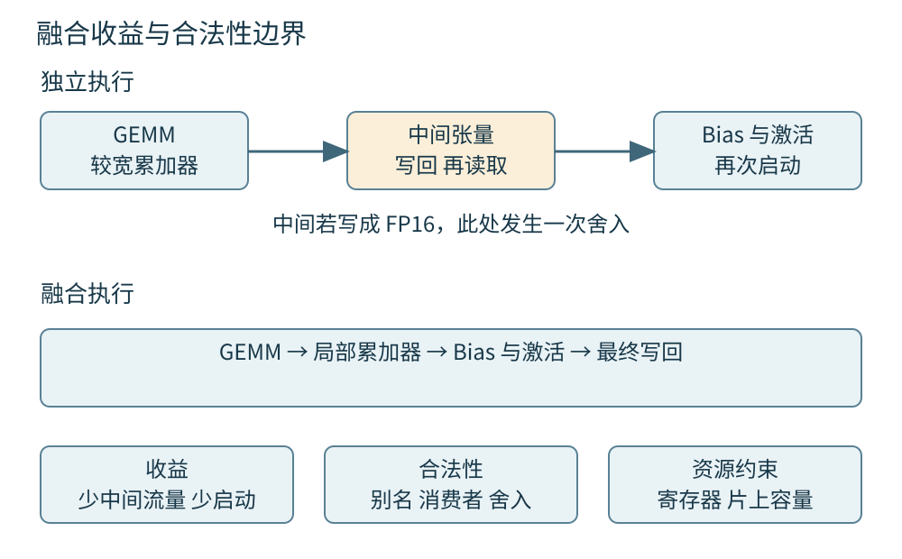
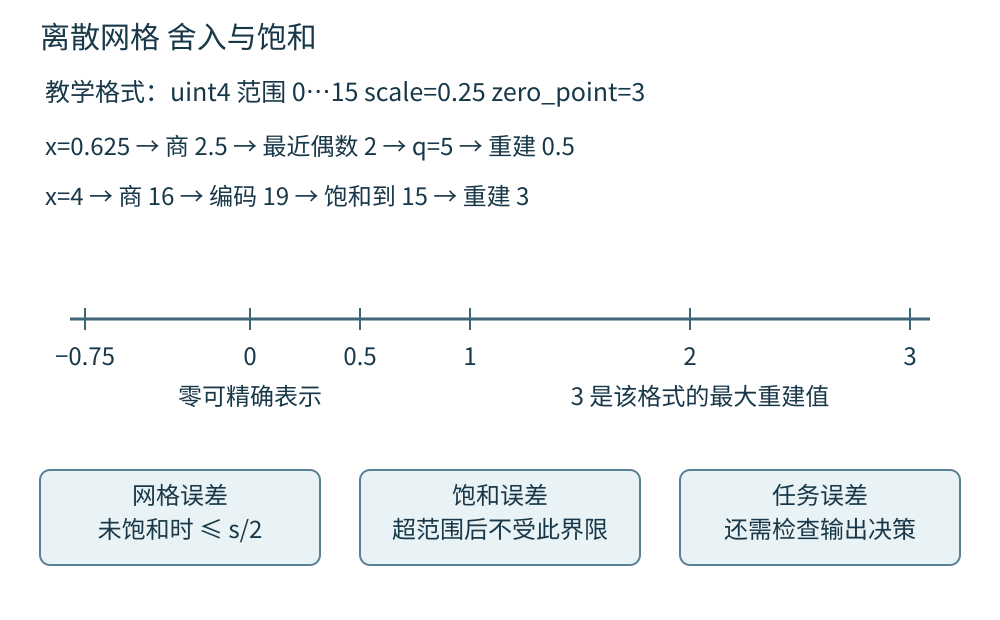
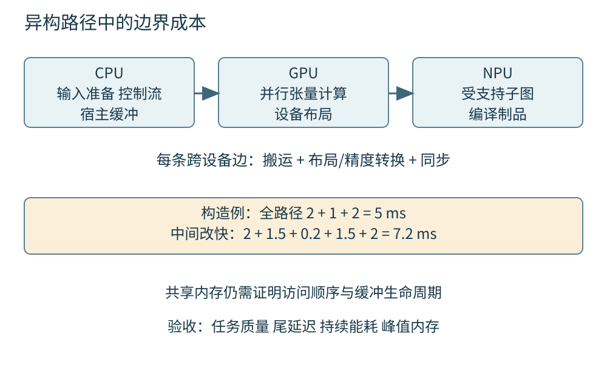

# 第四十六章 算子量化与异构优化

模型最终通过算子访问内存、执行运算并产生输出。算子优化的价值，在于用更少的时间、能量或存储完成同一项被允许的计算；困难则在于“同一项计算”包含布局、边界、精度、掩码和设备生命周期，而不只是纸面公式。一次融合可以减少显存读写，也可能改变舍入点；一次量化可以缩小权重，也可能让关键样本跨过错误的决策阈值。

**量化**用有限的离散表示近似原数值，**异构优化**把工作分配给具有不同计算与内存特征的设备。本章先建立GEMM与Attention的输入输出契约，再讨论融合、量化和设备协同。第四十三章的数值误差与Roofline、第四十四章的GPU执行、第四十五章的图和制品边界，是这里判断取舍的依据。

数学与尺寸例均为教学构造。PyTorch接口限定2.6，ONNX量化舍入以QuantizeLinear第21版条目为参照；FlashAttention使用论文2205.14135v2说明算法思想。Triton main、oneDNN和ONNX Runtime等页面为核验日滚动资料，OpenVINO使用2025文档树，不承诺任意设备或版本支持。没有运行内核、调优、量化或实测能耗，文中伪代码也未执行。

## 46.1 GEMM Attention布局和数值验收

### 46.1.1 GEMM的契约从矩阵形状开始

**GEMM**是通用矩阵乘法运算，典型形式为C←αop(A)op(B)+βC，其中op可以选择原矩阵或转置。若op(A)为M×K、op(B)为K×N，结果就是M×N；α和β是标量，原C是否参与计算由β等条件决定。Netlib BLAS的DGEMM说明给出了这一基本契约。[S1]

神经网络线性层通常包含矩阵乘法与偏置，但权重可能按输出维×输入维存放。调用时必须区分逻辑转置和存储次序。假设输入X为(B,Din)，权重W为(Dout,Din)，输出通常由X乘W的转置得到(B,Dout)。只看到两个指针与三个整数，不足以判断实际调用方向。

性能讨论常用约2MNK次浮点运算估计稠密乘加工作量，但应说明一次乘加按两次运算计数，并排除或另计偏置、缩放与激活。这个估计帮助比较计算量，不证明每条指令都以同样方式执行。小K、细长矩阵、批量很小或大量边缘块时，启动、访存和并行度可能比理论运算量更重要。

退化尺寸和标量也属于契约。K为0时没有乘积项，输出如何处理仍取决于β及接口定义；β为0时，不能因为复用了通用公式就无条件读取未初始化的C。实现若错误读取旧C中的NaN，即使随后乘0，也可能污染结果。边界分支要依据目标库或自定义接口的明确规则，不能只靠通常的代数直觉。

### 46.1.2 leading dimension不是逻辑行列数的别名

矩阵的leading dimension或stride描述物理存储间距。一个逻辑3×4子矩阵可以来自每行宽度为8的较大缓冲；它的行跨度仍是8，而不是4。这里采用行主序例子；Fortran BLAS DGEMM按列主序解释leading dimension，不能把行跨度不加转换地填入所有接口。传错跨度时，前一行可能看起来正确，后面的行却读到填充或其他样本的数据。方阵、连续输入和batch为1经常掩盖这种错误。

批量矩阵乘法还要说明批次之间的跨度、是否允许广播、是否存在独立指针数组。零批次跨度可能表示共享只读矩阵，不代表每批都拥有独立可写结果。转置、切片或分组以后，原来的连续性假设可能失效。接口应明确支持的布局，入口检查和转换成本应被纳入端到端测量。

分块格式会进一步改变地址解释。oneDNN资料展示将通道拆成内层块以改善向量化与复用的布局，逻辑维度与填充后的物理维度可能不同。[S2] 直接对全部物理元素施加自定义变换，如果把填充零改成非零，可能破坏下游约定。布局描述必须随张量走，不能靠“元素都是float”推断任意内核都能接手。

### 46.1.3 分块用局部复用减少昂贵数据移动

朴素矩阵乘法对每个输出独立读取一行A和一列B，容易重复访问相同数据。**分块**让一组输出共同使用已加载的A块和B块，在寄存器、共享内存或缓存中重复利用。沿K分段累加后，再把输出块写回较慢存储。这是在容量限制下提高数据复用的基本方法。

块越大并不总越好。更大的输出块需要更多累加器，可能增加寄存器压力；更大的输入块可能占用更多共享内存，减少并发驻留；边缘块还可能多算大量无效元素。Triton矩阵乘法教程把块尺寸、指针步长、执行顺序与调优分开讨论，体现了这些相互约束。[S3]

教学矩阵M=130、N=70，若输出tile为64×64，则需要3×2个tile，最后一行与最后一列都有尾部。实现必须掩码读取和写入，或采用满足契约的填充方案。不能因为“大多数尺寸能被64整除”就省略边界；也不能用对地址取模替代输出掩码，否则不同程序可能写入同一逻辑元素。

### 46.1.4 Attention是两次乘法与归一化的组合

**缩放点积注意力**可以写成O=softmax(QKᵀ/√D+M)V，其中Q的查询长度为L，K和V的键值长度为S，M表示掩码或偏置。若每个头的Q为(L,D)、K为(S,D)、V为(S,Dv)，得分矩阵为(L,S)，输出为(L,Dv)。batch和head维需要另外说明，不能把L与S永远视为相同。

掩码语义是高频移植错误。布尔值可能表示“允许参与”，也可能表示“屏蔽”，不同接口并不统一。PyTorch2.6的scaled_dot_product_attention中，布尔True表示该元素参与注意力；浮点掩码则加到得分中。[S4] 从另一接口复制同一块mask内存，必须先转换含义与广播形状。

因果掩码还需考虑查询与键值的绝对位置。增量解码时L可能为1而S很长，不能未经核对就把一个左上角三角矩阵当成目标对齐方式。padding位置、滑动窗口和位置编码同样影响允许看见的历史。数值看起来稳定，无法证明注意力没有读到未来信息或其他请求的数据。

注意力接口中的dropout参数还需单独管理。PyTorch2.6的该函数按传入dropout_p应用随机丢弃，调用者在评估时应给出相应的零概率，而不是假设外围模块eval会改写所有函数参数。[S4] 数值对照时若两边随机掩码不同，差异首先来自不同计算条件，不应直接归入内核误差。

### 46.1.5 稳定softmax依靠重标定而不是盲目扩大类型

对一行得分s，softmax元素为exp(sᵢ)/Σexp(sⱼ)。直接求指数可能溢出，而同时减去该行最大值m不改变精确实数下的比例：分子分母都乘上exp(−m)。计算exp(sᵢ−m)后再归一化，可以降低指数溢出的风险，但输入中的NaN、无穷或全掩码行仍需定义处理。

分块归一化要保持相同的全行尺度。设旧块统计为最大值m和指数和l，新块为m₂与l₂，则合并最大值m′=max(m,m₂)，合并和l′=exp(m−m′)l+exp(m₂−m′)l₂。对未归一化的加权V累计量也做相同重标定，最终除以l′。这是把两个局部和换到共同基准的代数关系。该写法要求有效统计量处于所定义的数值域；空块或全屏蔽块应单独处理，避免让负无穷相减产生NaN后再指望乘零消除。整行没有有效位置时，必须遵循接口声明的输出或错误规则。

如果每块先独立softmax后直接拼接，所有块各自和为1，得到的总分布就不对。上述重标定解释了为什么不必始终保留整张L×S得分矩阵。FlashAttention论文利用分块与这种统计合并降低高带宽内存读写，保持的是目标注意力算法，而不是承诺与任意浮点实现逐位相同。[S5]

### 46.1.6 数值验收需要误差分布和困难样本

**数值验收**首先规定参考实现、允许误差和输入范围。参考可以是经过检查的高精度实现或成熟库，但参考本身也有dtype、舍入和算法选择，不能无条件叫作绝对真值。比较GEMM时应覆盖不同M、N、K、转置、非连续stride、边缘块和特殊标量，而不是只测一个整齐方阵。

绝对误差反映值差，相对误差反映与参考幅度的比例，两者通常需要组合。还应观察最大值、分位数、均方误差和误差集中在哪些位置。强消减会让真实结果接近零，单纯相对误差可能异常大；反过来，平均误差很小也可能掩盖少数灾难性输出。

Attention还需要掩码正确、概率归一化、padding不泄漏、长序列稳定和任务输出验证。用全部随机正值测试，往往无法暴露大动态范围、正负抵消或极端logit问题。验收集合应从真实使用约束出发，并包含人为构造的边界样本。论文或教程展示的误差门槛只是相应实验条件，不能直接成为本产品门槛。

乘法精度与存储类型也需分别记录。例如某些硬件路径可以让FP32接口使用较低有效位的乘法与较宽累加；输出仍是FP32，不意味着内部所有步骤都具有相同精度。验收应记录计算模式、累加策略和允许的近似指令。只比较输入输出dtype，无法解释升级库以后出现的细小数值回归。

### 46.1.7 从高吞吐GEMM追问真实算子价值

**追问：“一个内核的TFLOPS更高，为什么模型没变快？”** 可能这个GEMM不是关键路径，也可能测量遗漏重排和同步，或生产矩阵形状与基准不同。先用相同输入分布比较整段模型时间，再核对该内核节省是否足以影响总预算。算力计数高也可能来自额外填充计算，而不是更多有效工作。

**继续追问：“Attention输出几乎一样，掩码还有必要专门测吗？”** 有。普通随机输入可能让被错误允许的少数位置贡献很小。应构造未来位置或padding位置具有显著值的样本，确认其确实不影响结果，并验证长短查询的对齐。数值相近与信息可见范围正确是不同性质。

**再追问：“FlashAttention是否把注意力计算量从平方降为线性？”** 对本章讨论的精确稠密注意力，主要改善中间存储和IO组织，基础乘法工作量仍随查询与键长度乘积增长。线性注意力、稀疏注意力和截断窗口改变的是另一组算法或输入假设，不能只因都节省内存就混称同一机制。

## 46.2 Kernel Fusion Triton与手写CUDA取舍

### 46.2.1 融合省去中间结果的物化

**内核融合**把原本分开的运算组合进一次或较少的设备执行，使中间结果留在寄存器、共享内存或局部计算状态中，而不必写回再读入全局内存。常见例子是矩阵乘法之后的偏置和激活，或逐行softmax中的最大值、指数、求和与除法。

假设两个逐元素运算连续处理N个元素，第一步输出只供第二步使用。独立执行时要写出再读取N个中间元素；若每元素4字节，理想融合可以省去约8N字节中间流量，另可能少一次启动。这个估计不含输入输出本身、缓存命中和额外临时值，不能直接换算成固定加速倍数。

Triton的fused softmax教程以一行能放入片上资源的特定矩阵范围说明收益。[S6] 这个限制很重要：当行太长、寄存器不足或需要跨块归约时，融合可能必须采用多阶段设计。不能把一个小矩阵上的单内核实现无条件扩展到所有序列长度。

### 46.2.2 融合合法性先检查依赖别名和舍入

融合必须保留所有消费者需要的值。若中间张量同时被另一分支使用，就不能简单删除其物化；可以重算、输出额外结果或改变整张图，但每种做法都有成本。若输入和输出可能别名，提前写入也可能覆盖尚未读取的数据，尤其在广播视图和原地接口中。

数学等式也不是逐位浮点等式。原图先把GEMM结果写成FP16，再读回加偏置；融合实现若保留FP32累加器并直接加偏置，便移除了一个舍入点。结果可能更接近实数公式，但仍与原逐算子执行不同。是否允许这种差异应由数值契约决定，不应借“优化”隐藏精度变化。

随机数、原子操作和可观察副作用进一步限制重排。融合Dropout时，随机数与元素的映射需要满足约定；改变并行归约树可能改变累加顺序；自定义日志、计数器或状态写入不能被当成纯数学运算随意消除。图编译器的合法性分析与内核作者的入口约束共同决定优化范围。

### 46.2.3 Triton程序实例仍需要明确索引和边界

**Triton**是一种用于编写设备计算内核的语言与编译工具。本章讨论的是triton-lang的内核语言，不是名称相近的NVIDIA Triton Inference Server。程序员通常以一组元素或一个tile为单位表达计算，再由编译器组织到具体硬件执行。

更高层的写法并不会取消索引责任。每个程序实例对应哪块输出、怎样根据stride找到输入、尾部如何掩码、归约轴和输出轴如何对应，仍需明确。编译期常量可以帮助专门化，也意味着某些参数改变会触发新变体。自动调优探索候选配置，不能证明所有候选在所有输入上都正确。

入口包装层应检查dtype、shape、布局、device、对齐及别名支持，并为不支持情形选择明确回退。教程中的断言常常只覆盖教学范围，移植进服务时还要补齐空维度、极大尺寸、整数地址溢出和资源不足。仅复制内核正文而忽略包装层，容易让局部正确实现变成不安全接口。

### 46.2.4 手写CUDA增加控制也增加维护责任

手写CUDA可以直接使用设备专有机制，精细安排共享内存、同步、流水与warp协作；代价是更高的索引、同步和架构适配负担。Triton可以减少一部分模板代码，但并不保证生成最优指令，也不能自动修复错误的并行算法。二者都应与成熟库和编译器自动融合方案比较。

选择依据是差异是否值得长期持有。若主要收益来自库已经支持的epilogue，优先用库接口通常能减少维护面；若模型存在特殊布局或融合模式，可以考虑可维护的专用内核；若需要特定硬件指令或无法表达的同步，手写CUDA可能有合理性。不能把“自己写”当成性能工程的完成标志。

维护成本包括多设备测试、编译器升级、数值回归、调优缓存、诊断工具和备用路径。还应有负责人解释每项不变量，而不是只保留一段在某张卡上曾经快过的代码。C++20宿主代码与CUDA语言、编译选项和设备架构目标是不同维度，标准版本一致也不能消除工具链差异。



图 46-1 融合减少中间读写与启动，收益受寄存器、片上容量和合法性限制。移除一次低精度写回，也可能改变舍入位置。

### 46.2.5 性能证据必须覆盖冷态和生产形状

内核基准应固定输入内容、shape分布、dtype、设备、软件版本与计时边界，并区分编译、调优、热身和正式测量。若一个方案包含首次调优，另一个使用已经缓存的策略，比较首次调用和稳态时需要分别列明，不能择优拼接不同口径。

短内核测量容易受启动、主机调度和设备同步影响。重复很多次可以提高计时信噪比，却也改变缓存、功耗和并发条件。应先解释测到的是设备执行、主机提交还是完整请求，再用适当方法关联。第四十四章的事件计时与第四十七章的端到端SLO衡量的是不同边界。

调优集和验收集也应分开。只选择最有利于某个tile的尺寸，会把专门化效果误当成普遍收益。应覆盖高频、长尾和边界形状，报告退化范围以及何时回退。一次设备型号上的性能优势，只能成为在该环境继续评估的证据，不能直接写成跨厂商结论。

### 46.2.6 从融合变慢追问资源压力

**追问：“少了两个kernel launch，为什么更慢？”** 融合可能增加寄存器和共享内存需求，降低并发驻留，产生spill，或把原本适合不同分块的运算强行放在一起。应比较流量、寄存器、片上占用和关键路径，而不是只数kernel数量。

**继续追问：“拆成两段一定可以解决吗？”** 不一定。拆分重新引入中间读写，也可能降低复用。可以尝试缩小tile、分段归约、保留库GEMM仅融合epilogue，或针对shape选择不同路径。每种方案都需在同一数值契约下验证。

**再追问：“新版本编译器生成更快结果，能否直接更新？”** 仍应回归边界、精度和目标设备，检查缓存键与预编译制品是否失效。生成代码属于部署实现，编译器更新可能改变融合、舍入和资源使用。更快是发布理由之一，不是跳过验收的理由。

## 46.3 量化 校准 精度性能和误差分布

### 46.3.1 线性量化需要尺度零点舍入和饱和

**线性量化**用整数q近似实数x。一个常见仿射形式是q=clamp(round(x/s)+z,qmin,qmax)，重建值为x̂=s(q−z)。这里s是有限正尺度，qmin和qmax是目标表示范围，z是该范围内的整数零点。零点使实数0可以准确对应某个整数编码，而不是简单地给所有数增加业务偏置。

round与clamp必须有具体定义。ONNX QuantizeLinear第21版的整数路径对x/s采用最近偶数舍入，并按整数类型范围饱和。[S7] 这不是所有语言默认round函数的统一语义。尤其不要把“先对商舍入再加整数零点”随意改成其他运算顺序，而不检查半整数边界与实现规则。

下面是说明步骤的教学伪代码，未执行，不属于任何框架API；输入的非有限值应由外围契约另行拒绝或处理，不能交给未说明的强制类型转换。

```text
要求 scale 有限且大于 0
scaled = x / scale
rounded = round_to_nearest_even(scaled)
shifted = rounded + zero_point
q = clamp(shifted, q_min, q_max)
x_hat = scale * (q - zero_point)
```

真实内核可能把部分步骤变成定点乘法、移位和特定指令，但应先证明它符合所选量化规范。简单把float强制转换成整数，通常既没有相同舍入，也没有可靠的饱和语义。

### 46.3.2 量化误差由网格误差和截断误差组成

设教学格式为无符号4位整数，范围0至15，s=0.25、z=3。实数0映射到q=3并准确重建；x=0.625时，x/s=2.5，最近偶数舍入为2，得到q=5，重建0.5，误差为−0.125。x=4时，未截断编码为19，饱和到15，只能重建3，误差为−1。

在没有饱和且采用最近舍入时，理想线性网格上的绝对重建误差不超过s/2；发生截断后，这个界限不再适用。减小s可以细化网格，却同时缩小固定整数范围能覆盖的实数区间。扩大范围能容纳更多异常值，又可能让大量普通值共享更粗的格点。

因此误差不能只用“位数减少一半”理解。数据分布、零附近密度、尾部与下游敏感性共同决定量化后果。若一个稀少的大值控制重要分类边界，把它当作无关异常值截掉可能造成严重错误；若它来自损坏输入，盲目扩大尺度也可能浪费正常分布的精度。先判断数据来源，再选择校准策略。

### 46.3.3 逐张量逐通道与分组量化解决不同离散度

**逐张量量化**让整个张量共享尺度与零点，元数据少、实现简单；**逐通道量化**为选定轴的每个切片分别设参数；**分组或分块量化**在更小的参数组上共享尺度。粒度越细，越能适应局部动态范围，通常也增加元数据、索引和内核处理成本。

“逐通道”必须标明轴。权重从(Dout,Din)转置为(Din,Dout)以后，对应输出通道的量化轴也要随语义变化，不能只复制旧axis整数。分组大小、最后不足一组的处理、尺度dtype和打包顺序也属于制品格式。两个文件都写INT4，仍可能完全不能互换。

对称量化常选z=0，让正负值围绕零表示；非对称量化可以适应偏移分布。某些规范还故意不用有符号类型中的最负编码，例如LiteRT部分权重规范使用−127至127并要求零点0，而激活使用另一组约束。[S8] 这是具体运算规范的选择，不能把INT8类型范围与所有量化方案实际使用范围混为一谈。

低位打包还要规定一个字节中两个4位值的顺序，以及有符号值怎样扩展到更宽类型。逻辑元素数量为奇数时，最后半字节可能是填充；计算不能误把它算进有效权重。文件尺寸正确但解包次序相反，会让某些对称测试看不出问题，因此应构造非对称且可手算的小张量验证格式。

### 46.3.4 整数乘法仍需要正确的累加与重标定

若x≈s_x(q_x−z_x)、w≈s_w(q_w−z_w)，点积的实数近似为s_xs_wΣ(q_x−z_x)(q_w−z_w)。整数编码不能直接相乘求和后就当作实数结果；零点修正和尺度因子是语义的一部分。零点为0的权重可以减少某些修正项，但激活零点未必为0。

累加器位宽也要独立选择。INT8输入常配更宽整数累加，但宽累加器不是绝对不溢出：上界取决于收缩长度、输入偏移范围以及实现是否在中间阶段用更窄表示。教学激活差值最大255、权重绝对值最大127时，单项绝对积可达32385，K项最坏绝对和按32385K估计，再与累加器范围比较。

偏置应换到与累加器匹配的尺度，输出若继续量化则需要重标定到s_y，并按规定舍入、加输出零点和饱和。逐输出通道权重量化意味着不同输出通道的乘积尺度可能不同。LiteRT规范为相应卷积偏置规定输入与权重尺度乘积，正体现了这种单位一致性。[S8] 忽略偏置尺度，可能让无偏置测试全部正确、有偏置模型却大幅偏离。

### 46.3.5 校准集合应代表部署会遇到的激活

**校准**通过代表性输入观察激活分布，选择量化所用范围或尺度。静态量化把激活参数离线确定并写入制品；动态量化在运行时根据当前数据求取部分参数，增加计算成本，也改变每次请求的量化条件。两者都需要明确哪些张量被量化以及目标后端是否真正支持相应路径。

最小最大值策略覆盖观察范围，分位数策略可以舍弃部分尾部，基于分布距离的策略则采用另一种误差目标。ONNX Runtime量化资料列出MinMax、Entropy和Percentile等校准方法。[S9] 这些名称不提供任务正确性保证，方法选择应由独立验证集和错误样本分析支撑。

校准输入必须经过与线上一致的预处理，并覆盖长度、语言、图像亮度或其他重要分层。训练集、校准集和最终评测集各有职责，不能反复用最终评测结果选择尺度后仍声称完全独立。校准缓存应绑定模型、预处理、张量命名与量化配置；更换权重后机械沿用旧缓存，会失去原先的分布依据。

分布漂移会使已验证尺度失去代表性。新相机、文本域变化或更长上下文都可能改变激活范围。监测应尽量采用受控统计而不是保存原始敏感输入，观察饱和比例与质量代理信号，并在明确触发条件下重新评估。线上自动改变尺度会改变制品行为，若采用这种设计，也必须记录参数版本与回滚方式。

### 46.3.6 QAT与混合精度需要落实到实际执行

**训练后量化**在既有权重上确定离散表示；**量化感知训练**在训练过程中模拟量化影响，使参数有机会适应误差。常见fake quantization在浮点训练图中模拟量化与重建，实际求导通常采用相应近似。它并不意味着训练期间所有计算已经变成真实整数内核。

QAT得到的图仍需正确导出和降低。ONNX Runtime资料区分以量化算子表达的QOperator与在张量边界表达量化、反量化的QDQ形式。[S9] QDQ图便于显式表示数值边界，但实际后端可能融合成整数执行，也可能部分落回浮点。检查图中出现Quantize节点，不能证明设备获得预期吞吐。

混合精度可以把敏感归约、归一化或输出层保留在更高精度，同时量化大部分权重或乘法。选择应看局部误差怎样传播到任务结果，而不是要求所有层统一位数。权重量化、激活量化、KV缓存量化和优化器状态压缩分别改变不同对象；容量收益和数值风险不能相互代换。



图 46-2 量化必须一起指定整数范围、尺度、零点与舍入。图中0.625的网格误差和4的饱和误差不同，二者不能用同一个s/2界限解释。

### 46.3.7 精度回归需要找到最先放大的误差

量化失败时，先排除预处理、布局、零点和尺度加载错误，再研究不可避免的近似损失。模型整体平均误差大，可以通过中间激活对照找到第一处显著差异；若某层的饱和率突然增高，可能是校准分布不匹配，也可能是上游已经产生错误输入。

应分开统计每层误差、不同输入群体的任务质量以及关键输出的稳定性。余弦相似度很高不代表绝对值正确，均方误差低也不代表排序前几名不变。对阈值决策，特别要看靠近阈值的样本；对生成，需观察同一前缀下概率变化与最终任务结果，而不是要求所有随机采样文本逐字一致。

修复可以是重新校准、改变粒度、调整范围、保留少数敏感算子高精度，或修复后端覆盖。不能只不断增加容差，直到已有制品通过。若问题仅出现于特定设备，应检查其整数指令、打包布局和重标定实现，而不是把所有偏差都归因于“低位模型天生不准”。

### 46.3.8 从INT4文件追问端到端收益

**追问：“权重从16位降到4位，显存就一定降到四分之一吗？”** 仅权重原始数据项理想上是四分之一；尺度、零点、打包对齐、临时反量化、激活、工作区和KV缓存仍存在。若运行时先展开成高精度权重，常驻与峰值也会不同。要分别报告文件大小、装载峰值和稳态设备占用。

**继续追问：“为什么低位模型比半精度慢？”** 可能设备没有相应高效指令，内核需要解包与反量化，shape不适合，或者QDQ未融合而增加转换。压缩存储与低位计算加速是两项独立能力。应看实际算子分区与数据流，而不是只看模型标签。

**再追问：“校准误差小，可以跳过任务评测吗？”** 不可以。局部误差可能在后续层放大，少量饱和可能集中在关键样本，生成与排序也可能对微小变化敏感。发布门槛应同时规定数值、任务质量、分层退化和资源收益，并保留可回滚的高精度基准。

## 46.4 CPU GPU NPU端侧部署与协同

### 46.4.1 设备选择先问工作集和截止时间

**异构系统**包含不同执行单元，各自擅长的并行形态、访存方式和能量预算不同。CPU适合复杂控制和较小工作集，GPU提供大量并行吞吐，NPU通常为特定张量计算与数据流设计。但这些只是架构倾向，具体结果取决于算子、尺寸、精度、编译器和整机约束。

同一模型在大批离线任务与单请求交互中可能应选不同设备。小输入的加速器计算很短，数据准备、唤醒和传输却可能占主要时间；长时间持续任务还会遇到热限制。设备标称TOPS必须连同精度、稀疏假设与峰值条件理解，不能直接换算成每秒完成多少用户请求。

选择过程应固定任务验收与真实负载，再比较端到端延迟、吞吐、功耗、内存峰值和支持范围。若一个候选方案必须改变模型或精度，应单列质量差异。只有在相同任务结果边界下，性能与能效数字才具有可解释性；否则比较的是两种不同产品行为。

### 46.4.2 图分区的边界可能比算子本身昂贵

把一个算子放到最快设备，不一定得到最快整图。若A与C在GPU，中间B在CPU，执行会增加GPU到CPU和CPU到GPU的数据交换，并可能等待设备完成。分区边界还会带来布局转换、dtype转换、内存分配和调度开销，代价与中间张量大小有关。

OpenVINO2025文档中的异构执行说明了按设备支持情况拆分图和分配子图的机制。[S10] 这种能力扩大可执行范围，不意味着任意拆分都划算。一个后端覆盖率很高的模型，若缺失的恰是高频路径中搬运量最大的节点，仍可能比全CPU方案更慢。

教学管线A、B、C分别耗时2、1、2ms。若把B迁到另一设备只需0.2ms，却新增两次各1.5ms传输，总时长从5ms变成7.2ms。数字是构造演算，用于提醒分区优化应计算边界成本。应优先寻找可留在同一设备的连续子图，而不是逐节点贪心选择最短内核时间。

图切分还会影响失败边界。前一设备已经产出部分中间结果，后一设备装载失败时，系统需要决定是否重用前段结果、重新执行全部管线或直接失败。复用必须绑定输入与模型版本，不能把上一次请求残留的缓冲当成可用缓存。为追求低延迟省略版本标识，可能把性能问题升级为跨请求数据错配。

### 46.4.3 共享地址空间不等于共享完成状态

CPU与加速器可能共享物理内存或统一地址表示，但仍存在缓存一致性、访问权限、同步和资源寿命。一个地址在两侧都能表示，不等于两侧可以同时无约束读写；零复制也不表示零缓存维护、零映射成本或没有带宽竞争。

外部缓冲接入设备时，要说明谁拥有内存、谁负责释放、布局是否满足设备、何时允许再次写入，以及完成通知的范围。摄像头产出的图像缓冲可能还在由GPU读取，采集线程就不能因为提交函数返回而直接覆盖下一帧。这个问题与第三十九章的渲染资源回收具有相同生命周期结构。

双缓冲或环形缓冲可以重叠采集和推理，但槽位数量应根据在途上限与失败路径确定。超时、取消和设备错误都必须最终回收槽位；仅给正常路径增加event，异常路径仍可能永久占用资源。诊断“偶发结果像上一帧”时，应先核对版本标识与完成关系，再怀疑模型随机性。

### 46.4.4 端侧部署要接受编译与算子约束

端侧NPU或专用加速器常通过编译器将模型转为设备可接受的图与内存计划。支持条件可能涉及固定或有限动态shape、量化格式、对齐、算子组合和内存容量。相同网络在桌面GPU运行成功，不证明它能直接落到移动或嵌入式设备。

应将不支持节点、自动替代和回退分区可视化。某次转换工具报告“成功”，可能只是生成混合执行图，而不是全模型在目标加速器上运行。若后处理包含不规则排序、非极大值抑制或动态循环，可考虑明确分离宿主处理，但需要把复制和同步算进预算。

设备制品还绑定编译器、运行时、驱动或固件条件。应保留原始模型与转换配方，并在目标设备核对加载、质量和持续运行。使用C++20构建宿主不改变这些兼容条件。若厂商升级影响已有编译缓存，应有重新编译和回滚计划，不能只凭文件后缀仍相同继续装载。

### 46.4.5 持续性能与瞬时峰值不同

端侧设备受到电池、散热、其他应用和实时任务的共同约束。冷机短时间跑出的峰值，可能在持续负载后因频率或功耗管理改变而下降。验收应覆盖足够长的实际使用场景，记录温度状态、频率、供电条件和前后台竞争，而不是只看一次最短时间。

能耗可以按一次有效任务或单位时间统计，两种口径回答不同问题。高功率设备若更快完成工作并进入低功耗状态，单任务能耗未必更高；低功率设备若需要更久且占用整机资源，也未必更省。仅用芯片峰值功率乘以理想内核时间，会漏掉主机、内存和等待阶段。

实时系统还要区分平均延迟与截止时间违约。若视觉模块必须在下一次控制更新前完成，偶发长尾比漂亮平均值更重要。可以降低输入分辨率、限制工作队列或选用更小模型，但这些会改变质量或丢帧行为，应由应用契约明确接受。不要把未经说明的静默降级称为自动优化。



图 46-3 异构性能按完整路径计算。设备算子更快，只能抵消其节省的时间，不能自动隐藏图分区带来的搬运与同步。

### 46.4.6 协同调度要控制共享资源争用

CPU预处理、GPU模型和NPU辅助任务可以并行，但它们可能共享内存带宽、电源预算和缓存。把所有单项并发度都调到最大，反而可能让整机争用加重。应识别真正可独立的阶段以及共享瓶颈，而不是把“设备不同”当成资源互不影响。

有界队列能把输入速率与处理能力连接起来。视频场景可以按产品要求丢弃旧帧，批处理可以阻塞上游，交互请求则可能需要拒绝或降级。无界排队只会把算力不足转成更大的内存占用和更旧的结果。队列中的每份数据还可能持有设备缓冲，背压因此也是内存安全的一部分。

调度器应知道截止时间、优先级、工作量估计与取消状态。一个已经过期的结果不应继续消耗后续推理资源；但已经提交的设备工作也未必能立即抢占。取消应区分“停止后续提交”“不再交付结果”和“设备已停止使用缓冲”，三者不同时发生。资源只能在最后一种条件满足后复用。

### 46.4.7 从端侧回归追问可维护部署

**追问：“NPU利用率低，是否说明应该增加batch？”** 不一定。任务可能受输入、内存、分区或短算子限制，交互和实时任务也可能没有等待凑批的余量。应先核对设备实际执行比例与整个请求时间线，再判断是否可以增加batch而不违反截止时间。

**继续追问：“共享内存平台为什么仍出现copy算子？”** 可能设备要求不同布局、对齐或dtype，也可能运行时需要独立生命周期的缓冲。共享物理内存并不自动满足每个算子的输入契约。删除copy之前必须证明布局相容、访问依赖正确且所有者允许共享。

**再追问：“一套模型怎样适应很多终端？”** 保留共同语义制品，按设备能力生成受控变体，记录精度与性能适用范围，运行时选择已经验证的目标。遇到未知设备应使用有明确定义的备用路径或报告不支持。一个无法解释版本与回退行为的万能包，往往比少量可追踪变体更难维护。

部署验收还应包含资源紧张条件。主存接近预算、设备同时处理其他工作、输入突发和取消密集时，分配与队列行为可能与单请求完全不同。一个只在空闲设备上通过的模型，尚未证明能在产品环境稳定运行。测试报告应明确观察窗口与未覆盖条件，避免把可用演示扩展成未经验证的可靠性承诺。

## 来源与阅读边界

本章四主题28个三级分节。GEMM形状、分块尾部、softmax合并、量化网格和分区时间均为人工推导或教学构造；唯一伪代码明确未执行。未复制外部性能图或把论文加速结果当成本章实测。Triton、oneDNN、LiteRT与ONNX Runtime资料按读取时页面说明机制，不固定最新设备排名、吞吐或价格。实际部署应以目标模型、编译器、运行时和设备的独立验收为准。

- [S1 Netlib BLAS DGEMM，矩阵乘法契约、尺寸与α/β][S1]
- [S2 oneDNN Understanding Memory Formats，滚动文档，分块布局与填充][S2]
- [S3 Triton Matrix Multiplication，main滚动教程，分块、stride与边界][S3]
- [S4 PyTorch2.6 scaled_dot_product_attention，mask、dropout和精度边界][S4]
- [S5 FlashAttention论文2205.14135v2，分块归一化与IO组织][S5]
- [S6 Triton Fused Softmax，main滚动教程，融合与片上容量限制][S6]
- [S7 ONNX QuantizeLinear第21版条目，整数范围与最近偶数舍入][S7]
- [S8 LiteRT 8-bit quantization specification，滚动规范页，权重与偏置约束][S8]
- [S9 ONNX Runtime Quantize ONNX models，滚动文档，校准、QDQ与误差调试][S9]
- [S10 OpenVINO2025 Heterogeneous Execution，异构图分区机制][S10]

[S1]: https://www.netlib.org/lapack/explore-html/dd/d09/group__gemm_ga1e899f8453bcbfde78e91a86a2dab984.html
[S2]: https://uxlfoundation.github.io/oneDNN/dev_guide_understanding_memory_formats.html
[S3]: https://triton-lang.org/main/getting-started/tutorials/03-matrix-multiplication.html
[S4]: https://docs.pytorch.org/docs/2.6/generated/torch.nn.functional.scaled_dot_product_attention.html
[S5]: https://arxiv.org/html/2205.14135v2
[S6]: https://triton-lang.org/main/getting-started/tutorials/02-fused-softmax.html
[S7]: https://onnx.ai/onnx/operators/onnx__QuantizeLinear.html#quantizelinear-21
[S8]: https://developers.google.com/edge/litert/conversion/tensorflow/quantization/quantization_spec
[S9]: https://onnxruntime.ai/docs/performance/model-optimizations/quantization.html
[S10]: https://docs.openvino.ai/2025/openvino-workflow/running-inference/inference-devices-and-modes/hetero-execution.html
