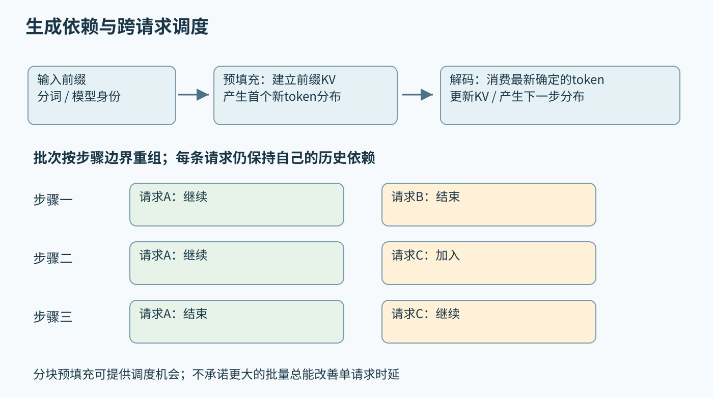
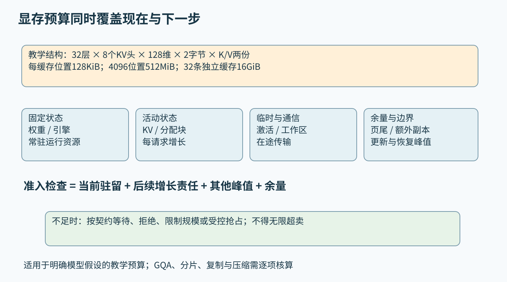
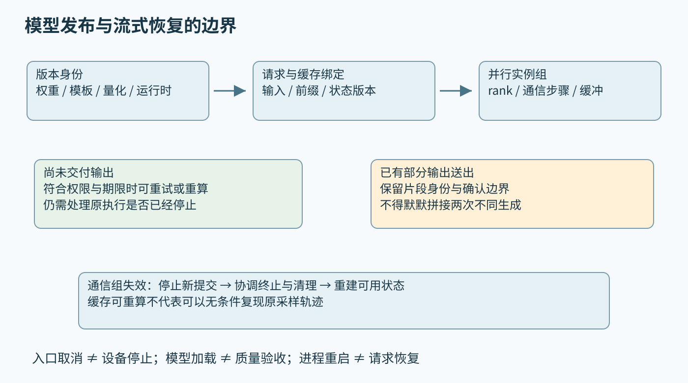

# 第四十七章 模型服务与分布式 AI 系统

模型服务把一份已经可以执行的模型变成多人同时使用的系统。它接收请求、分配资源、生成结果、处理取消，并在软件和硬件变化时保持可解释的行为。单次推理快只是其中一项条件：请求可能在进入设备前等待很久，长输出可能持续占用显存，某个节点失败可能使整个并行组无法完成下一步。

**Serving**强调的是在线交付责任。模型、算子和设备分别正确，不代表队列、缓存、通信和版本切换也正确。本章以常见自回归生成模型为主要案例，并把它与普通无状态推理区分。第四十五章讨论的制品契约、第四十六章的数值与设备边界，在这里成为服务容量和故障恢复的前提。

本章用vLLM 0.8.5、NCCL 2.27.3与Triton Inference Server 2.52归档文档说明具体机制，论文按所引固定版本阅读，不声称这些版本是当前部署首选。教学数字不对应任何真实模型报价或设备基准；没有启动服务、下载权重、运行模型或执行通信实验。

## 47.1 生成请求 KV缓存 预填充 解码与批处理

### 47.1.1 一次生成请求是一段持续更新的状态

普通分类服务可以把一批输入交给模型，取得固定形状输出后结束。自回归生成则反复根据已有前缀求下一个token的分布，再选择新token加入前缀，直到达到停止条件。每一步都依赖前面的选择，因此请求不是一次独立矩阵计算，而是一段有状态的执行过程。

请求状态至少包含规范化后的输入、模型与分词器身份、采样参数、已经生成的token、停止规则、随机状态或重现所需信息，以及当前资源归属。字符数、字节数和token数并不相同；对多模态输入，图像等内容还会经过模型特定编码，不能用用户可见文字长度估计所有工作量。

生成器可以一次返回多个候选，也可以使用不同解码算法，这会改变驻留状态和完成条件。本章先分析一条普通自回归序列。推测解码、不同注意力结构或多模态路径可以改变一次设备执行处理的token数，但不能因此省略对最终可交付序列的依赖和一致性检查。

### 47.1.2 预填充处理已知前缀 解码继续扩展它

**预填充**（prefill）处理已经知道的输入token，为后续生成建立所需状态，并通常计算第一个新token的概率分布。输入位置已知，使许多运算可以批量组织。随后**解码**（decode）消费最新确定的token，更新状态并产生下一步分布。不要机械画成“预填充之后还必须再做一个无条件解码步骤，才能得到首token”。PagedAttention论文对两阶段的定义明确包含这一点。[S1]

二者的性能形态常有差别。较长预填充能形成较大的矩阵运算；小批量解码每步新增工作较少，却可能读取大量权重与历史状态。于是同一张卡在两阶段面对的瓶颈不同。长上下文注意力、很大的并发批次或特殊模型又会改变这一判断，不能把“预填充永远算力受限、解码永远带宽受限”当作定律。

一次用户请求的首token时间还包含鉴权、预处理、分词、排队、状态准备和发送。只测设备预填充时间，无法解释前端已经等待数秒的情况。诊断时应记录阶段切点，而不是让所有耗时进入一个名字模糊的“推理时间”。

### 47.1.3 KV缓存保存计算状态 不保存完整推理能力

**KV缓存**保存注意力中的键和值，使生成新token时不必把全部历史位置的相关投影重新计算。它是特定模型、前缀和执行条件下的派生状态，并不是数据库里的键值业务记录，也不是可以随意跨模型复用的长期记忆。第四十六章中的Q、K、V在这里有了跨步骤生命周期。

对普通稠密缓存，可用每token约2×L×Hkv×D×b字节建立预算：L是需要缓存的层数，Hkv是KV头数，D是每头维数，b是每元素字节数，2代表K和V。这里应使用KV头数，而不是直接填查询头数。分组查询注意力或多查询注意力会改变二者关系；滑动窗口、不同层结构、压缩和其他模型结构也可能需要不同公式。

教学模型取L=32、Hkv=8、D=128、b=2，每token为131072字节，即128KiB。4096个已缓存token约占512MiB，32条彼此独立、同样长度的缓存合计16GiB。每条再增长512个缓存位置，会再增加64MiB。它还没有包含权重、激活、工作区、页尾浪费、元数据、分配器保留或并行副本。

输出计数与已写入KV的位置也可能相差一个当前待消费token，容量说明应明确计算的是缓存位置还是已经发送的输出。预算最好以实现的实际驻留位置为依据，并为下一步增长留余量，不能只看请求进入时的输入长度。

### 47.1.4 分页管理改变分配方式 不消除有效状态

如果为每个请求一次性预留最大上下文的连续缓存，短请求会占住用不到的空间，动态释放又可能留下难以利用的碎片。**分页KV管理**把逻辑序列划成固定大小块，通过块表映射到物理缓存块，按需分配。PagedAttention据此允许注意力访问不连续存放的缓存。[S1]

这种做法减少大块连续预留与外部碎片，仍可能有最后一块未用满的内部空间。块太小会增加索引与管理成本，块太大又增加页尾浪费。分页也没有让有效K、V数值凭空减少；上下文增长仍会带来容量和访问成本，不能把分页当作低位量化或线性注意力的同义词。

共享块还需要引用与写入规则。多个序列共享同一前缀时，已经固定的部分可以被共同引用；即将分叉并修改的部分必须建立独立状态或合适的写时复制。回收条件还包括最后一次设备访问完成，不能仅因主机引用计数降到零就立刻交给另一请求写入。分配器正确性与设备时间线必须共同审查。

### 47.1.5 前缀复用需要证明输入与执行条件相容

前缀缓存复用的是相同计算前提下已经得到的KV。可见文字相同，不一定代表token相同；聊天模板、特殊token、分词器、模型版本、适配器和多模态内容都可能改变结果。只用文本字符串做缓存键，容易把语义不同的请求错误合并。

vLLM 0.8.5的V1设计将父块哈希、本块token和低秩适配（LoRA，即附加的模型适配参数）标识、多模态输入哈希等附加信息纳入块身份，并说明哈希碰撞风险与更强哈希的选择。[S3] 这是一种具体实现参照，不表示采用某种哈希就获得数学上的绝对无碰撞，也不表示租户权限自动进入了缓存隔离。

多租户系统还要决定是否允许共享、共享哪些前缀、谁可观察命中，以及命中时延是否暴露其他请求的信息。安全策略可以要求租户命名空间或禁用跨租户复用。缓存内容即使只是中间张量，也与用户输入有关，应纳入访问、保留与清理责任，不能因不是原始文本就视为无敏感性。

### 47.1.6 连续批处理在步骤边界重组工作

普通动态批处理将若干独立请求合并成一次执行，提高设备利用率；它通常需要为凑批付出等待。Triton归档文档把动态批处理用于无状态模型，并将有状态序列的调度另行说明。[S12] 对一个完整生成请求做固定批处理，如果必须等待最长序列结束，已经完成的槽位和后来到达的请求就可能无法及时利用资源。

**连续批处理**在迭代边界重新选择活跃请求：完成者退出，新请求在条件允许时加入，未完成者保留自己的状态继续下一步。Orca论文以迭代级调度解释这种机制。[S2] 不同请求可以处于不同生成位置，但每条序列内部的自回归依赖仍在；连续批处理不等于把同一请求的未来token全部并行算完。

**分块预填充**把长输入的预填充分成较小工作段，与已有解码请求共享调度机会。它可以减少长预填充对输出间隔的阻塞，也可能增加管理与重复访问，并推迟长请求首token。vLLM 0.8.5所引页面将该功能标为实验性；这里采用其思想，不推广当时的默认参数。[S4]

调度器因此要同时处理token预算、缓存预算、优先级和公平性。单纯优先短请求可能使长请求饥饿，单纯先来先服务又可能形成长队头阻塞。策略应依据服务目标选择，并记录不同长度与租户的等待分布，不能只展示总吞吐。

图 47-1 自回归依赖与跨请求批处理是两个层次。图中步骤用于解释调度，不表示每个执行框架具有相同内核边界。来源：本章原创。

### 47.1.7 从缓存不足追问真实容量

**追问：“权重只占一半显存，为什么并发一高就OOM？”** 另一半并非全部可用于新请求。已有KV、增长空间、激活峰值、工作区、通信缓冲、图执行缓存和分配器保留都在竞争。应把按请求增长的项与固定项分开，再检查失败时的长度分布和在途步骤。

**继续追问：“打开分页与前缀缓存就能无限接请求吗？”** 不能。分页改善分配，复用减少特定重复计算与状态，两者都受工作负载和相容条件限制。没有共同前缀的长输出仍会持续增长。准入控制必须基于剩余预算与承诺的生成上限，而不是只看当前空闲字节。

**再追问：“缓存命中率更高，性能就一定更好？”** 可能命中了短前缀，却把长请求路由到很忙的实例；也可能为共享付出额外同步或转移成本。应同时比较节省的预填充工作、队列等待、KV驻留和最终SLO。命中是局部事件，用户体验是整条路径的结果。

## 47.2 Serving队列 SLO容量和成本

### 47.2.1 服务指标必须从用户可见边界定义

**首token时间**（TTFT）可定义为客户端发出请求至收到首个有效输出token的时间；服务端也可定义自己的入口口径，但两者不能混在同一分布里。空的协议事件、角色说明或心跳不应偷偷算成有效内容。起点、终点、失败样本与分词口径都要写清。

**每输出token时间**（TPOT）的一种请求级定义是，在输出token数n≥2时，用首末token时间差除以n−1。只有一个token的请求不适用该除法，应单独统计。**相邻token间隔**则记录每一对相邻输出的时间差。请求级平均TPOT很小，仍可能夹着一次很长停顿；多个token被网络合并送达时，接收时间也未必等于设备生成时间。

完整请求延迟、成功率、输入token吞吐、输出token吞吐和满足目标的请求比例分别回答不同问题。不能把预填充token与解码token直接相加，当作同质工作量比较两套服务。vLLM指标页分别暴露队列、预填充、解码和生成token等统计，实际字段与聚合仍需按版本核验。[S5]

### 47.2.2 队列把到达过程与执行能力连接起来

请求到达并不均匀，执行成本也不相同。一个短输入短输出与一个长文档长输出，可能占用完全不同的显存和设备时间。按每秒请求数设置固定容量，只在请求分布较稳定且边界明确时才有解释力；负载变化后同样QPS可能对应完全不同压力。

队列不是免费吸收流量的空间。排队请求会占用输入缓冲、连接和元数据，已经预填充却等待解码的请求还会持有大量KV。到达速率长期超过可交付速率时，无界队列不能提高完成能力，只会不断扩大等待和资源占用。应同时限制条数、字节数、token预算和最大等待年龄。

Little定律可用于稳定观察窗口中的平均关系：平均在途数约等于有效到达率乘平均逗留时间。教学服务每秒接受20个请求、平均在系统内停留5秒，对应平均约100个在途请求；这个平均数不直接给出p99，也不保证面对突发时不会超过容量。若有拒绝、取消或积压持续增长，必须重新检查统计边界和稳态条件。

### 47.2.3 准入要为后续增长留空间

生成请求被接纳后还会继续消耗资源。若只按当前输入KV分配，许多请求同时增长到上限时就可能超过预算。准入设计应明确采用保守预留、动态增长加抢占，还是限制生成长度等策略。保守预留降低利用率，乐观增长则需要可接受的抢占和重算成本，没有一种选择可以免除容量责任。

总预算应分成固定模型状态、活动请求状态、临时峰值、通信与运行时开销以及安全余量。教学预算中若可用于KV的空间为20GiB，上一节32条4096位置缓存已经占16GiB；每条再增长512位置共增加2GiB，还没有计算页尾和额外副本。只凭“现在还剩4GiB”便再收同样一批请求，会把未来增长重复出售。

暂停或抢占某请求可能释放设备缓存，但恢复时需要重算或搬回状态。vLLM文档明确讨论抢占与重算对端到端延迟的影响。[S4] 因此容量策略要报告抢占率、重算token、恢复等待和最终失败，而不能把请求没有立即崩溃当作SLO已经满足。

图 47-2 显存预算示意。128KiB每缓存位置来自本章指定的教学结构；不能直接套用到所有模型、并行切分或缓存压缩方案。来源：本章原创。

### 47.2.4 批量吞吐与交互时延需要一起取舍

更大批量有机会摊销权重读取和启动开销，也可能使一次迭代更长。对解码而言，批量增加后每秒总输出上升，单个用户的token间隔却可能变差。对预填充而言，等待凑批增加首token时间。吞吐与时延应画在同一负载条件下比较，而不是分别挑出最好的一次。

可以定义**合格吞吐**，例如每秒满足预先声明的TTFT、输出间隔与成功条件的请求数，同时公布总到达、拒绝和失败数。DistServe论文围绕时延目标与goodput研究预填充和解码资源分配。[S14] 本书使用这一评价思路，不照搬论文中的设备、阈值或加速倍数。

测量应覆盖长度混合、突发、冷缓存、低并发与持续高负载。只用固定长度离线请求灌满设备，适合测一种饱和能力，不能直接代表交互产品。还要说明压测是否按固定速率独立发起请求，还是等待上一次完成再发送；后一种闭环负载可能在系统变慢时自动减少施压，掩盖真实到达下的排队。

### 47.2.5 多租户和优先级不能只靠请求条数

租户配额应反映其实际资源影响。可以限制输入规模、最大生成量、并发驻留、设备时间或某种经过校准的成本单位。只限制请求条数，会鼓励少量超长请求占满服务；只限制token总量，又可能漏掉不同模型、图像输入或长上下文带来的成本差异。

优先级需要与公平和饥饿控制一起设计。高优先请求可以优先获得尚未提交的资源，却未必能立即抢占已在设备执行的长内核。承诺“任何时候都立即响应”之前，要检查调度粒度与最长不可抢占段。低优先级工作也应有明确的等待、降级或拒绝结果，不能无限悬挂。

前缀感知路由可以让请求靠近已有缓存，但热点前缀可能使单实例队列过长。应在缓存收益与负载分散之间比较预计完成时间，必要时接受一次重算来避免热点。缓存不是新的单点调度权威，实例失败或模型换代后仍需有可解释的退路。

### 47.2.6 成本应按成功交付和完整资源计算

自托管服务的成本包括设备占用、CPU与内存、网络、存储、空闲余量和运行维护。某张卡的每小时费用除以理想峰值token数，只描述极窄条件，不能代表真实请求的完成成本。付费API也应区分输入、输出、缓存命中、工具费用和重试，价格需要另按实际购买时点核验。

用构造例子说明口径：若一段观察窗口的全部可归因成本为120元，共有80个满足验收的任务，则合格任务平均成本为1.5元。分母不能换成100个尝试请求后宣称每个成功任务只需1.2元。失败和取消消耗的资源仍属于交付成本，除非报告明确采用另一种核算边界。

优化还可能改变质量。更小模型、低位缓存或更短输出能降低资源使用，但若任务成功率下降，应一起报告。合格成本与第五十六章的任务评测连接起来：先规定什么算可接受结果，再计算得到这些结果用了多少资源，避免用更便宜的错误答案取得漂亮指标。

### 47.2.7 过载时要阻止重试放大

过载保护应在昂贵预处理、模型装载或KV分配之前尽量发现无法承担的请求，给出可区分的拒绝原因和重试建议。队列满、租户超额、模型暂不可用与输入永不合法，不应全部返回同一种可立即重试错误。拒绝本身也有成本，入口层需要保护连接和解析资源。

重试应有总期限、尝试次数和全局或租户级预算，并避免多层同时重试。Google SRE的公开实践明确讨论资源型容量度量、客户端限流与重试预算。[S11] 其具体阈值属于相应系统经验；本书采用的是控制反馈放大的原则，不把某个百分比当作通用配置。

**追问：“服务变慢时自动增加重试，为什么更容易雪崩？”** 原请求可能仍在运行，重复请求继续消耗预填充与缓存，队列进一步增长，再触发更多超时。应先确认取消和完成状态，降低无效到达，并只对合适失败重试。模型服务仍受第三十三、三十四章的部分失败与有界工作原则约束。

## 47.3 并行策略 NCCL拓扑 通信与分布式推理

### 47.3.1 数据副本扩大服务容量 不直接分摊单份权重

**数据并行服务副本**让多份模型实例分别处理不同请求。每份副本通常拥有自己需要的权重和运行状态，由入口或调度层分发工作。它可以增加总容量并形成独立故障域，但不会因为有四份副本，就自动把某一份模型的权重内存除以四。

一个模型能够放进单卡，并且单请求时延满足需求时，多副本有时比把每次推理拆到很多卡上更简单。后者会引入同步通信，而副本可以独立推进不同请求。反过来，单份模型放不下、单请求算力不足或有其他约束时，就需要模型内部并行。vLLM分布式文档提供张量与流水并行的具体配置参照。[S6]

服务副本也不是完全无状态。KV、前缀缓存、已发送位置和在途请求都可能绑定实例。负载均衡器把同一条生成流的后续操作随意送到另一副本，会丢失上下文或迫使重建。应区分可重新路由的新请求与需要会话连续性的活动请求，并明确实例退出时如何排空。

### 47.3.2 张量并行把一个算子拆给多个设备

**张量并行**沿矩阵或张量维度划分权重与计算。以Y=XW为例，按W的输出列划分，各设备可计算相应输出片段；若后续算子需要完整输出，则还要汇集。按收缩维划分时，各设备先得到部分和，再通过归约形成正确结果。切分维度决定通信形态，不能只说“平均分模型”。

注意力头、前馈层和词表输出各有适合的切分方式。查询头与KV头数量不同、头数不能整除设备数、某些状态必须复制时，显存并不严格按设备数反比下降。层归一化、残差与输出选择还可能要求特定数据布局或集体通信，所有参数和缓存项都应单独列账。

小批量解码中，每层计算较短，频繁通信的固定延迟可能变得突出。增加卡数虽然减小每卡算术量，却可能增加同步和跨节点开销。应该比较完整迭代时间，而不是只看每卡GEMM更小、更快。并行度是一项端到端配置，不是越大越好的资源标签。

### 47.3.3 流水并行划分层 专家并行划分可选计算

**流水并行**把不同层放在不同设备组上，请求经过各阶段依次处理。它减少单个阶段需要持有的层权重，却引入阶段间传输、负载不均与流水空泡。多个微批或请求可以填充流水，但一条自回归序列的下一步仍需要前一步最终结果，不能把训练流水的直觉完全照搬到低延迟生成。

阶段划分应按实际时间和状态容量，而不只是层数。某些层有更大的计算、通信或激活需求；相同层数不保证时间相等。调度还需处理不同输入长度，避免最慢阶段让其他设备长期等待。阶段失败时，这组分布式状态通常需要共同处理，而不是简单把坏卡从列表里删去。

**专家并行**常用于混合专家模型，把不同专家参数放在不同设备上，按路由结果分发token。它可能需要多对多的数据交换，并面临专家负载偏斜、容量限制和路由开销。专家数量多不表示每个token使用全部专家，也不表示通信成本随活跃专家数简单线性变化。

这些策略可以组合。一个服务实例内部采用张量与流水并行，外部再部署多个副本；特定层还采用专家并行。组合后的rank、通信组、参数所有权和故障域应画清楚，否则某个“并行度为8”的配置很难说明究竟用了哪些资源和保证。

### 47.3.4 集合通信描述数据关系 也规定参与契约

**NVIDIA集合通信库**（NCCL）提供面向GPU的集合通信。AllReduce把各rank的同位置数据归约后交给所有参与者；AllGather按rank顺序汇集各自片段；ReduceScatter将归约结果分片交给参与者。这些操作承担不同的数据布局责任，选错操作不会因为所有卡都收到一些数值而变得正确。[S8]

调用者要保证参与rank、数量、类型、操作和顺序相容。某个rank走入错误分支，少调用一次集合操作，其他rank可能挂起；数量或类型不匹配还可能造成错误结果或内存问题。每个rank的日志应记录通信组、逻辑步骤和操作序号，避免只从最后一个报错者推断根因。

NCCL的stream操作通常异步执行，成功入队不等于通信完成。group模式还可以推迟实际提交；非阻塞group返回处理中状态时，必须先按文档确认提交完成，再安排相关CUDA操作。[S9]、[S10]、[S15] “主机函数已返回”“设备队列已接收”“数据可安全复用”是不同事件，缓冲生命周期必须与最后一个事件绑定。

集合归约也可能改变浮点求和顺序。改变并行度或通信算法以后，末位差异应先按数值契约分析；如果差异很大，则要排查切分、类型、索引和通信匹配。第四十三章的归约稳定性与第四十六章的质量验收，在多卡模型里仍然适用。

### 47.3.5 拓扑决定哪些通信能够经济地发生

GPU之间可能通过设备互连、PCIe交换结构、主机内存或跨节点网络通信。看见设备都在同一台服务器里，不代表任意两张卡的路径与带宽相同；看见网络标称速率很高，也不能忽略消息启动、共享链路和GPU到网卡的路径。实际部署应记录设备、NUMA节点和网络接口的关系。

对需要频繁同步的张量并行，较低时延的紧密连接通常更重要；对阶段间较粗粒度传输，流水布局有不同取舍。这是建模倾向，不是无条件部署规则。链路竞争、模型形状和具体实现都会改变结果，应使用与生产消息尺寸和并发相近的观察进行验证。

简化通信模型可写为启动成本加传输字节数除以有效带宽，再考虑同步与竞争。教学传输512MiB，若有效速率确为25GB/s，纯字节搬运项约21.5ms；这里GB是十进制、MiB是二进制。这个数尚未包含协议、排队和布局转换，更不是某条真实链路的测量。混用Gb/s与GB/s会再引入八倍错误。

容器、驱动、通信库与网络插件必须彼此相容。只在一个rank上更新库或模型制品，可能让通信错误在很远的调用点才出现。比起反复改变超时，首先核对所有参与者的版本、身份和可达路径通常更有效。

### 47.3.6 预填充与解码分离引入新的状态传输边界

**预填充—解码分离**把两阶段安排在不同资源池，分别选择并行度与调度策略。这样可以减轻长预填充对解码间隔的直接干扰，但必须把已有KV等必要状态交给解码侧，并解决状态布局、目标版本和准入衔接。DistServe论文将带宽感知放置与两阶段资源配置一起研究。[S14]

分离不是免费删除竞争。源端在传输完成前要保留状态，目标端接收时需要容量，网络承受额外流量。若预填充侧只追求快速产出，而解码侧已经满载，就会把队列变成大量等待转移的KV。应在两阶段之间建立有界信用或其他背压协议，明确谁为等待中的状态负责。

缓存迁移还要绑定请求身份、模型版本、位置编码和张量分片约定。一个地址或块号只在原实例的分配器语境中有效，不能跨节点直接当成同一对象。迁移失败后要说明继续在原实例执行、重新传输、重算还是终止；不能同时让源和目标都以为自己是唯一输出者。

是否采用分离，应比较目标时延、负载分布、缓存规模、网络成本和故障复杂度。轻量单卡服务可能不值得增加这一层；大规模异质工作负载则可能从独立调度中受益。论文证明一种设计在其条件下有效，并不等于每个模型服务都必须沿相同架构升级。

### 47.3.7 通信组失败后先恢复一致状态

一个rank失效可能让其他参与者等待永远不会出现的集合调用。仅在入口重试请求，无法修复内部通信组。NCCL文档区分异步错误查询、通信器终止与重建，并要求应用协调健康rank；错误后的在途操作不能继续假定结果正确。[S9]、[S16]

恢复流程应先停止向失效组提交新工作，再按受支持协议终止活动通信、处理设备与缓冲，最后重建组和模型状态。对非阻塞通信器与并发调用的限制必须遵守，不能让一个线程随意销毁另一个线程正在使用的对象。超时只说明等待超出预算，不单独证明远端已经安全停止。

**追问：“少一张卡后继续用剩余卡，为什么不是自动容错？”** 原切分可能缺少权重和KV，rank映射与集合关系也已改变。即使通信库支持缩减参与者，应用仍需恢复缺失数据、重新选择有效并行方案并重新验收状态。通信域修复与模型计算恢复是两个层次。

## 47.4 模型版本灰度 故障恢复和端到端观测

### 47.4.1 发布版本是一组共同生效的契约

一个可追踪模型版本应包含权重、结构、分词器、输入模板、前后处理、量化参数、适配器、设备引擎和运行时条件。仅替换权重文件而保留不相容模板或旧量化缓存，会让“模型名称相同”的请求具有不同含义。制品身份应能追溯到完整配置，而不只依赖一个容易复用的目录名。

请求在接纳时应绑定明确版本，并让缓存、设备工作和输出记录保持一致。长生成过程中切换部分权重或模板，通常不再属于任何已验收模型。若需要特殊在线更新协议，必须另行定义其一致性；普通灰度发布更适合让既有请求结束，由新请求选择新版本。

缓存命名空间也随语义版本改变。旧KV、旧前缀哈希和旧编译结果不能只因shape相同就复用。回滚需要恢复相容的一整组制品与配置，而不是仅把权重文件名改回去。第四十五章的可重建清单在这里承担发布和追责作用。

### 47.4.2 装载成功之后还需要就绪证据

模型装载可以包括文件读取、反序列化、权重复制、设备内存规划、编译与热身。进程能响应健康检查，只证明进程存在；权重读完也不保证目标shape、插件和设备路径已经可用。应区分进程存活、模型装载、目标版本就绪与能够接纳更多工作的容量状态。

Triton归档文档区分NONE、EXPLICIT和POLL等模型控制模式，并明确警告轮询可能观察到仓库的部分更新。[S13] 这说明文件变化检测不自动提供全套制品的事务性发布。工程上应先形成完整、校验通过的候选版本，再通过受控方式使其可见，并检查实际服务身份。

热身输入要覆盖计划接纳的关键路径，但不应被描述为完整验收。一个固定batch的热身没有覆盖全部动态范围、长上下文或异常请求。新旧模型同时驻留还会增加峰值内存，发布计划必须给这段重叠留预算，否则“零停机升级”可能先触发资源不足。

### 47.4.3 灰度比较要覆盖质量与系统行为

**灰度发布**将有限、可控制的流量交给候选版本，观察其质量、时延、失败和资源行为，再决定扩大、保持或回退。比较应使用一致分层：输入长度、任务类型、租户、语言和设备路径可能显著影响结果。随机分流有助于减少偏差，但小样本和稀有失败仍需要谨慎解释。

影子请求可以让候选版本处理相同输入而不向用户返回结果，但它仍会消耗资源，也可能接触敏感数据。若模型链条还能调用外部工具，影子执行必须禁止未授权副作用，不能因为输出不展示就认为没有实际影响。数据转发、保存与访问范围应服从原有授权。

回滚条件应在放量之前确定，例如错误预算消耗、分层质量退化或设备内存峰值超限。只观察平均时延下降，可能漏掉某种长请求大幅变差。模型效果与系统稳定性由不同指标描述，任何一侧异常都应能阻止继续扩大流量。

### 47.4.4 流式输出形成不可简单撤回的边界

生成流可以分段发送，但服务器内部“生成”“进入发送缓冲”“客户端收到”和“用户看见”仍是不同阶段。连接断开时，服务器可能不知道最后哪一段已经被客户端接受。若直接从头重试并把新文本接到旧文本后面，用户可能得到重复、矛盾或不同采样轨迹混合的结果。

协议应为请求和输出片段提供可识别身份，并说明支持从哪个边界继续。续传已有、持久保存的输出片段，与重新计算一条生成轨迹是不同服务。若只提供重新生成，应明确它是一份新结果，不假装是原流无缝继续。已经发送的内容不能由服务端简单回滚收回。

恢复KV也需要合法前缀和一致执行条件。已有输入与已确认token可以支持重算派生状态，但要继续得到相同输出，还可能需要采样状态、算法与数值确定性条件。只恢复token列表并设置相同随机种子，不足以无条件承诺跨硬件、跨并行度逐位续接。

图 47-3 模型服务的恢复对象包括请求、输出、缓存和并行组。图中的重算是有条件的策略，不等于自动重发已经产生的内容。来源：本章原创。

### 47.4.5 取消需要传到真正占用资源的位置

用户取消、入口超时、调度器移除、设备工作结束与缓存释放并不同时发生。取消协议应阻止新的步骤，标记不再交付结果，并在最后一次设备访问完成后回收状态。已经提交的内核未必能够立即抢占，不能在入口返回取消成功时就把它使用的内存交给新请求。

分布式实例还需让各rank对请求状态达成足够一致的理解。某rank提前跳过一次集合操作，其他rank仍按原调度调用，就可能使整组挂起。取消通常应在规定的协调边界生效，而不是每个设备线程独立看到布尔标志就立即退出。

资源统计要区分仍执行但不再交付的工作、等待清理的缓存和真正可用空间。否则调度器可能在取消高峰中反复超卖内存。对客户端，取消确认也应说明的是服务端已接受停止请求，还是执行与清理已经完成，避免把不同保证藏在同一个状态词里。

### 47.4.6 观测应把请求阶段与设备组关联起来

一条请求时间线应能连接入口、鉴权、分词、排队、预填充、缓存分配、各次解码、通信和发送。高层Trace提供因果关联，设备事件和性能采样解释具体执行；它们的时钟与计量边界可能不同，需要校准或标注，不能将所有时间戳直接相减。

常用运行信号包括等待与活动请求数、输入输出长度、缓存占用与命中、抢占与重算、各阶段时延、通信错误、版本分布和取消后的无效工作。vLLM 0.8.5的指标定义展示了这些层次，并包含版本迁移和弃用说明。[S5] 仪表盘应绑定采集版本，字段同名也不能假定统计方法永远不变。

日志不应默认保留全部提示词、输出、图片或KV内容。多数容量诊断可以先用长度、哈希身份、阶段状态和受控统计完成；确需保存样本时，应有目的、权限、脱敏和保留期限。vLLM所引旧版安全指南还明确提醒其内部节点通信不面向不可信网络。[S7] 外部API有鉴权，不表示内部通信、模型管理和缓存传输自动受到同样保护。

### 47.4.7 用完整请求解释局部优化的得失

设教学系统更新内核后，固定输入的设备计算下降20%，线上首token却变慢。合理诊断应先比较队列、真实长度分布、编译与热身、缓存命中、批处理等待和并行通信，再判断内核是否属于关键路径。负载增长或准入策略改变，可能完全抵消局部节省。

**追问：“所有GPU都很忙，为什么合格吞吐下降？”** 设备可能在重算、处理已经取消的请求、做低收益搬运，或者用更大批次换取了不可接受的输出间隔。忙碌程度不等于有效交付。应把成功且满足目标的请求与实际消耗对应起来。

**继续追问：“一个rank慢，能否只重启它？”** 要先检查当前并行组是否允许独立恢复，以及它拥有的权重、KV和通信步骤怎样重建。未经协调的局部重启可能让健康rank继续等待旧参与者。故障处理必须遵循组状态与请求状态，而不是只看进程是否重新出现。

**再追问：“什么时候可以说模型服务完成迁移？”** 当新版本在明确输入范围下满足质量与SLO，资源峰值可承受，缓存和通信边界正确，故障、取消和回滚路径有可检查证据，才形成一份完整交付。启动命令成功、指标面板亮起或某个benchmark更快，都只是其中一部分。

## 本章资料与核验范围

下列原始资料于2026-10-03实际读取。论文用于说明机制，未移用其加速倍数；旧版框架文档只承担明示版本的参照，不是当前安全部署建议。KV容量、队列、成本与传输时间均为教学构造，未执行模型、服务、NCCL通信或故障实验。

- [S1 PagedAttention，2309.06180v1][S1]；[S2 Orca，OSDI 2022][S2]
- [S3 vLLM 0.8.5 V1 Prefix Caching][S3]；[S4 vLLM 0.8.5 Optimization and Tuning][S4]
- [S5 vLLM 0.8.5 Production Metrics][S5]；[S6 vLLM 0.8.5 Distributed Serving][S6]；[S7 vLLM 0.8.5 Security Guide][S7]
- [S8 NCCL 2.27.3 Collective Operations][S8]；[S9 NCCL 2.27.3 Communicator APIs][S9]
- [S10 NCCL 2.27.3 Stream Semantics][S10]；[S15 NCCL 2.27.3 Group Calls][S15]；[S16 NCCL 2.27.3 Communicators and Fault Tolerance][S16]
- [S11 Google SRE，Handling Overload][S11]
- [S12 Triton Inference Server 2.52归档，Model Configuration][S12]；[S13 同归档，Model Management][S13]
- [S14 DistServe，OSDI 2024][S14]

[S1]: https://arxiv.org/html/2309.06180v1
[S2]: https://www.usenix.org/system/files/osdi22-yu.pdf
[S3]: https://docs.vllm.ai/en/v0.8.5/design/v1/prefix_caching.html
[S4]: https://docs.vllm.ai/en/v0.8.5/performance/optimization.html
[S5]: https://docs.vllm.ai/en/v0.8.5/serving/metrics.html
[S6]: https://docs.vllm.ai/en/v0.8.5/serving/distributed_serving.html
[S7]: https://docs.vllm.ai/en/v0.8.5/deployment/security.html
[S8]: https://docs.nvidia.com/deeplearning/nccl/archives/nccl_2273/user-guide/docs/usage/collectives.html
[S9]: https://docs.nvidia.com/deeplearning/nccl/archives/nccl_2273/user-guide/docs/api/comms.html
[S10]: https://docs.nvidia.com/deeplearning/nccl/archives/nccl_2273/user-guide/docs/usage/streams.html
[S11]: https://sre.google/sre-book/handling-overload/
[S12]: https://docs.nvidia.com/deeplearning/triton-inference-server/archives/triton-inference-server-2520/user-guide/docs/user_guide/model_configuration.html
[S13]: https://docs.nvidia.com/deeplearning/triton-inference-server/archives/triton-inference-server-2520/user-guide/docs/user_guide/model_management.html
[S14]: https://www.usenix.org/system/files/osdi24-zhong-yinmin.pdf
[S15]: https://docs.nvidia.com/deeplearning/nccl/archives/nccl_2273/user-guide/docs/usage/groups.html
[S16]: https://docs.nvidia.com/deeplearning/nccl/archives/nccl_2273/user-guide/docs/usage/communicators.html
