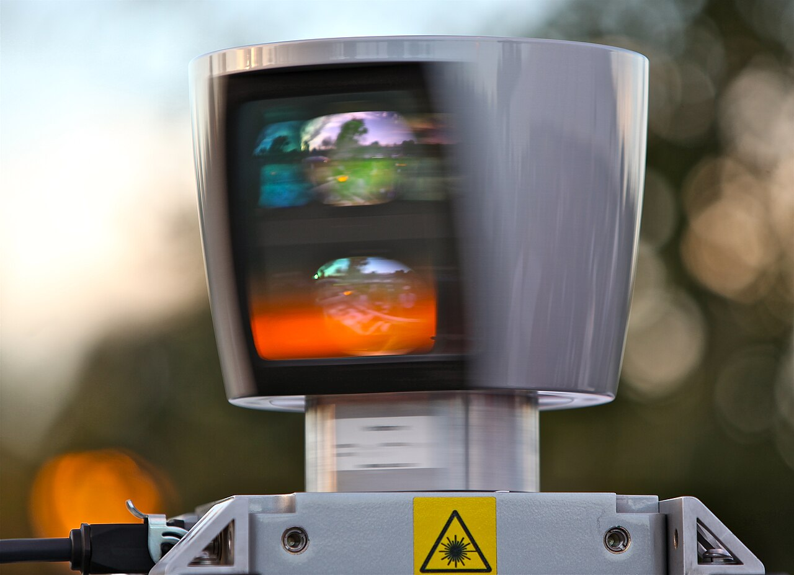
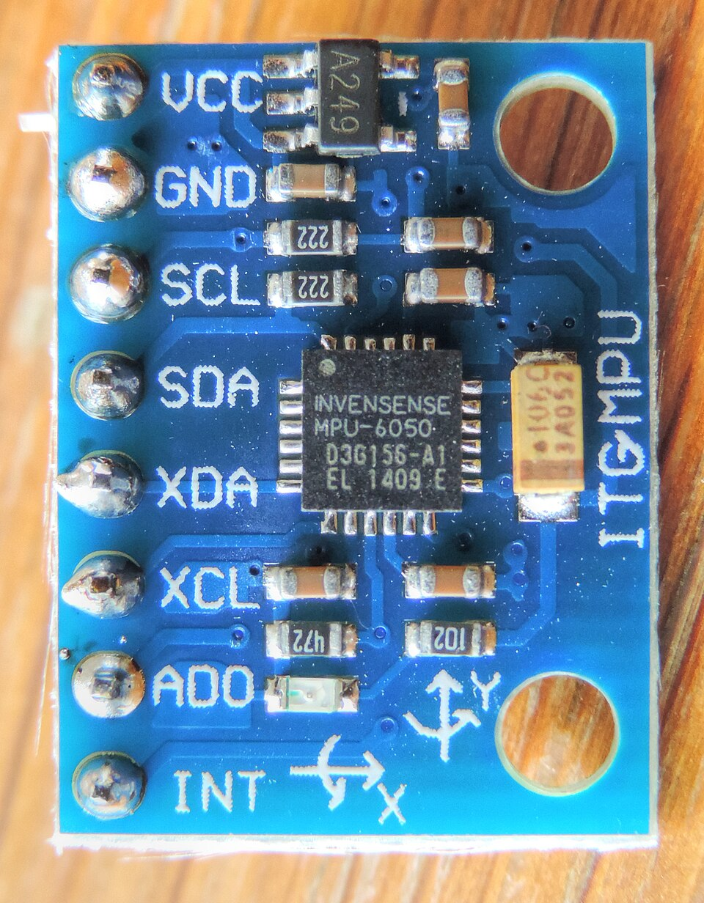
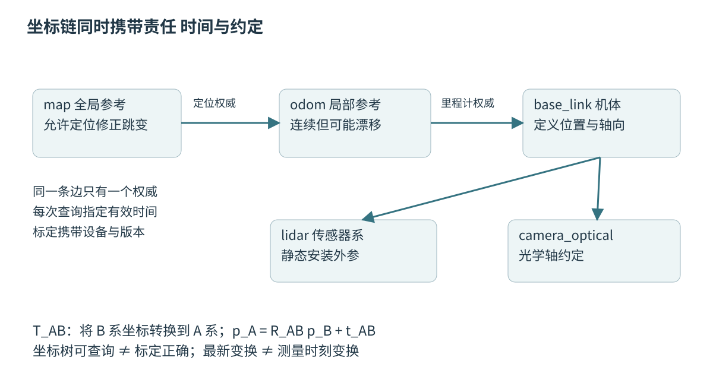
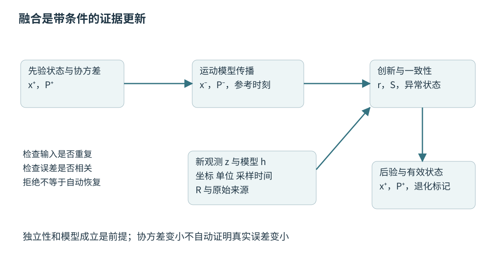

# 第四十八章 传感器坐标时间与系统集成

机器人通过传感器获得关于世界的证据，通过执行器改变世界。二者之间隔着电气接口、驱动、时钟、坐标变换、估计和控制。把几条数据流接起来，只能证明字节能够传输；要使系统真正理解这些字节，还必须回答数据测到了什么、在哪里测得、何时成立、误差多大，以及数据失效时谁有权让机械运动停止。

**系统集成**不是最后阶段的接线工作，而是维护上述语义契约的工程活动。同一个浮点数，在一个模块里可能是度，在另一个模块里可能是弧度；同一个时间戳可能代表曝光开始，也可能代表驱动接收完成。算法即使分别正确，组合后仍可能产生稳定而错误的结果。本章先认识硬件与测量链，再建立空间、时间和概率的共同语言。

第一章的线性代数与统计、第四章的单位与时间是本章基础；第五十章继续讨论定位与地图，第五十一章讨论闭环控制。涉及 ROS 的消息与接口以 Jazzy 为参照，C++ 表达以 C++20 为主线。文中数值与故障情境均为教学构造；没有进行实际通电、执行器运动、标定采集或控制程序测试。

## 48.1 LiDAR Camera IMU Encoder电机与传感链

### 48.1.1 一次测量经历的不只是一个传感器

**测量链**从物理量开始，经过敏感元件、模拟前端、采样、数字处理、总线传输、驱动转换和应用消费，才形成算法可使用的观测。温度、振动、电源、安装刚度和线缆都会影响它。数据包具有正确校验和，只能说明某一段传输没有检测到损坏，不能证明测量没有饱和或安装没有松动。

应为每种观测定义一个最小契约：测量对象、量程、单位、轴向、采样时刻、有效位、状态位、标定版本以及不确定度。某些设备只提供原始计数，转换系数属于驱动；另一些设备内部已经滤波或融合，输出值不再是独立原始测量。若下游不知道这一区别，就可能重复滤波、重复补偿，或者把相关的输出当成独立证据。

一条健康的数据链需要同时监控数值与过程。数值方面检查范围、跳变、饱和与物理一致性；过程方面检查序号、采样间隔、传输延迟、设备重启和配置改变。静止不等于数据冻结，数据不断更新也不等于设备正常。最好保留“新测量但无效”和“没有新测量”两种不同状态。

工程诊断应先建立逐段可观察性。若点云断续，不应立即调整匹配算法；先看设备序号是否连续、驱动是否丢包、发布是否积压、消费时年龄是否超限。只有把缺失发生的位置查清，才能选择改善物理链路、调度资源还是算法容错。

### 48.1.2 LiDAR给出距离采样 而不是直接给出完整世界

**激光雷达**（LiDAR）通过发射与接收光信号估计距离，再结合发射方向形成空间点。飞行时间、相位或调频连续波等测量机制各有条件，机械旋转与固态扫描也不是相同结构。常见点云包含位置、强度、通道和时间等字段，但字段是否存在以及具体含义必须查对应设备与驱动文档。

点云稀疏、遮挡、玻璃、深色表面、雨雾和多路径都可能使观测不完整。没有返回点，不等于前方没有物体；有返回点，也不一定对应期望的第一表面。反射强度通常受距离、入射角与厂商处理影响，未经标定不能直接把不同雷达的数值当成统一材质属性。

扫描需要时间。一帧旋转点云的各点可能在不同瞬间采集，移动平台又在这一帧内平移和旋转。若全部点都使用帧结束时的位姿，直墙可能被重建成弯墙。这类**运动畸变**需要逐点时间和足够准确的运动估计进行补偿；仅提高点云发布频率不一定缩短实际扫描窗口。

ROS Jazzy 的 LaserScan 明确区分第一束光的时间戳、相邻测量的时间增量和相邻扫描之间的时间间隔。[S3]扫描间隔不必等于一帧内实际采集持续时间。它是二维扫描消息，不是任意三维雷达的统一时间定义。使用 PointCloud2 或厂商私有消息时，需要重新确认每点时间、点顺序和参考时刻。

图 48-1 旋转式 LiDAR 的一种真实外形。照片有助于认识设备与安装位置，不用于推断测距精度、接口针脚或当前产品性能。摄影：Steve Jurvetson，2009-10-24；[Commons文件页][P1]，采用 [CC BY 2.0][L1]；使用官方1280像素缩略图，仅等比例缩放。

### 48.1.3 相机记录光强 投影模型决定几何解释

相机图像首先是经过曝光、读出和图像处理形成的光强观测。**内参**描述焦距、主点和所选畸变模型等内部投影关系，**外参**描述相机相对其他刚体或坐标系的位置与姿态。像素坐标本身不是米，单个像素也不能直接给出唯一深度；深度需要双目、多视角、主动测距或额外场景假设。

针孔模型将相机坐标中的三维点投影到图像平面。近似写成 u=fₓX/Z+cₓ、v=fᵧY/Z+cᵧ，前提是点处于对应模型的有效视域且畸变已经正确处理。广角与鱼眼通常需要不同模型。错误镜头模型可以在图像中心表现良好，却在边缘留下有方向性的残差。

**滚动快门**逐行曝光，因此不同图像行对应不同时间；**全局快门**也仍有曝光区间和读出延迟。高速旋转时，把整张图当成同一瞬时投影会产生几何误差。自动曝光、自动对焦、防抖和图像裁剪还可能改变测量条件；标定时的分辨率与运行时重采样不一致，必须同步更新内参。

图像质量指标不只包括清晰度。时间戳语义、曝光时长、增益、压缩和去噪处理都可能影响特征稳定性。面试追问“相机分辨率翻倍，定位一定更准吗”，应回答有效纹理、运动模糊、标定误差、算力与时延可能先成为瓶颈；更高像素数只是改变了信息与成本的候选上限。

### 48.1.4 IMU测量角速度与比力 不能直接读取位置

**惯性测量单元**（IMU）通常包含三轴陀螺仪与三轴加速度计。陀螺仪输出与角速度相关，加速度计测的是**比力**，并非直接给出世界坐标下的位置二阶导数。在理想模型中 f=Rᵀ(a−g)，其中 R 把机体系向量旋到世界系，a 是世界加速度，g 是重力向量。静置时 a=0，读数一般不会是三个零。

由角速度积分得到姿态，由比力结合姿态和重力恢复平动加速度，再积分得到速度和位置，每一步都会传播误差。小小的姿态偏差就可能把重力的一部分错当成水平加速度。假设误差恒定为0.01m/s²，忽略其他因素，十秒后位置误差项为0.5×0.01×10²=0.5m。这是简化演算，不是某款IMU的性能声明。

IMU 还存在零偏、噪声、尺度因子、轴不正交、温漂和饱和。传感器标称采样率不等于有效带宽，内部低通会带来相位延迟；振动可能通过非理想采样混叠到低频。增加采样频率有时有益，但不能替代机械安装、电源和抗混叠设计。

Jazzy 的 Imu 消息规定加速度与角速度单位，并为缺失估计和未知协方差保留特定约定。[S4]这些约定需要由消费者正确解释。不能把全零协方差当成“绝对没有误差”，也不能把设备输出的欧拉角不经顺序与坐标核验直接写进四元数。

图 48-2 小型 IMU 模块的一种外形。板上的芯片、连接位置与安装孔帮助读者识别设备；照片不提供接线依据，也不代表工业级校准或安全等级。摄影：© Nevit Dilmen，2014；[Commons文件页][P2]，采用 [CC BY-SA 3.0][L2]；使用官方960×1232缩略图，仅等比例缩放，图像继续保留原许可。

### 48.1.5 编码器测的是轴运动 车体位移仍需模型

**编码器**把旋转或线性运动转换成可计数、可解码的信号。增量式常利用A、B相位关系判断方向，再累计增量；绝对式直接编码某个量程内的位置。分辨率、精度、重复性与多圈能力是不同参数，不能把“每圈多少计数”直接等同于角度测量准确度。

增量式编码器还需要明确计数规则。厂商所说脉冲数、线数与四倍频后的计数数可能不同。轴角到轮位移还依赖减速比、轮径、安装位置与符号。编码器装在电机轴上时，齿隙和机械柔性可能发生在测量点之后，因此电机轴准确跟踪不证明负载端完全跟踪。

轮式里程计常依据左右轮增量和轮距推算车体运动，但这需要近似无侧滑、轮地接触及几何参数有效。急转、湿滑、悬空和轮胎压缩会破坏假设。左右轮读数一致却车体不动并不矛盾，轮子可能在打滑；仅凭编码器不能消除这一不可观测情形。

速度估计可由固定时间内的计数差得到，也可由相邻边沿间隔得到。低速时前者量化明显，高速时后者对时间分辨率与中断能力要求较高。滤波能够平滑数值，但会引入延迟，必须向控制器说明。第五十一章给出编码器实物与反馈链的进一步解释。

### 48.1.6 电机与驱动器把控制量转换成有约束的作用力

**电机**是机电能量转换器，**驱动器**负责按控制接口调节电压、电流或其他电气量。上层发送的“速度”不一定直接驱动功率级：设备可能内部已经包含电流环、速度环和保护逻辑。接口应明确命令模式、单位、限幅、更新周期、保持行为和失联后的状态。

理想直流电机模型中，转矩与电流相关，反电动势与转速相关；实际系统还受电阻、电感、摩擦、温度、供电和机械负载限制。命令转速不是立即达到的事实。额定值、峰值、允许持续时间与热限制也不可互换，短时能够输出的转矩不代表能长期维持。

执行反馈至少要区分请求命令、驱动器接受的命令、实际电流或速度、故障状态。上层把命令截断了，积分器却仍按原命令累计，会导致恢复后过冲。若只能读取“目标速度”而没有实际反馈，就不能宣称已经验证闭环跟踪。

实际通电涉及运动、夹伤、倾覆、过热与电气风险。软件停止消息只是安全链中的一个环节，真实执行器必须有经过风险评估的硬件使能、限位、急停或独立保护边界。本书不把电脑上的仿真停止、ROS进程退出或析构函数执行完毕当成机械已经安全停稳的证明。

### 48.1.7 从异常现象反推测量链的故障位置

设一个教学情境：机器人原地转向时点云错层，直行时却基本正常。候选原因包括雷达时间偏移、IMU轴向错误、外参旋转偏差、扫描运动补偿缺失和机械晃动。它们都可能被匹配算法“吸收”为位姿误差，所以单看最终轨迹不易区分。

可先比较异常与角速度的相关性：若错层随旋转速度增加，时间或旋转外参值得优先检查；若反向旋转时误差反号，固定时差更有解释力；若停车后仍有固定倾斜，则安装或外参问题更可能。这里是诊断推理，不是仅凭一个症状就下结论。

再把证据分层：原始测量与时间、驱动转换后的数据、变换查询结果、融合创新量、最终运动结果。每层保留配置版本与序号，避免拿不同运行的数据拼成因果链。观察日志要使用原采样时间，同时保留接收时间以定位排队问题。

深入追问：“多个传感器都在线，系统为什么仍不可信？”因为在线状态只证明通信或设备响应；同源时间错误、共同安装松动、重复使用同一观测或相同环境失效，可能使它们一起给出一致但错误的结果。集成需要验证信息的独立性与模型前提，而不仅是设备数量。

## 48.2 坐标系 TF标定 时间同步和单位

### 48.2.1 坐标是物理量的表达方式 不是物体本身

同一个空间点可以在雷达系、车体系和地图系中有不同坐标。必须同时保存“坐标值”和“它在哪个坐标系表达”，否则一个三元组没有完整物理意义。本章规定 T_AB 将B系坐标转换为A系坐标，即 p_A=R_AB p_B+t_AB；从C到A的组合为 T_AC=T_AB T_BC。此记号的下标语义要贯穿全链路。

主动旋转描述把向量或物体转到新方向，被动变换描述改变观察坐标基。二者经常使用相似矩阵，却可能互为逆。常见错误是库函数名叫“旋转”就直接混用。接口文档应写出一条可手算的例子，如B系原点在A系的位置，以及B系单位x轴变换后指向哪里。

刚体变换的逆并不是把平移逐项取负：R的逆为Rᵀ，而逆平移为−Rᵀt。只在没有旋转或特殊方向时，简单取负才偶然正确。这个错误在直行调试中可能隐藏，到机器人旋转后才表现为障碍物绕错误中心运动。

四元数也必须注明分量顺序、左右乘、旋转方向和归一化要求。q与−q表示同一个三维旋转，直接逐分量相减不适合作姿态差。姿态插值与误差估计应使用适合旋转几何的方法，并处理接近半周旋转等数值边界。

### 48.2.2 单位和轴向在接口入口处统一

REP 103 给出ROS常用SI单位、右手坐标约定和机体系轴向：x向前、y向左、z向上；相机光学系常用z向前、x向右、y向下。[S1]这些是明确约定，并非所有硬件默认如此。惯导可能使用北—东—地（NED）坐标，车辆供应商可能规定y向右，驱动必须完成可追溯转换。

不要在多个消费者中分别“顺手乘一下”。如果一份角速度在驱动层从度每秒变成弧度每秒，融合层又转换一次，数值仍然有限但会严重错误。应在设备边界做一次显式转换，保存原始数据用于诊断，并使接口名、类型和注释反映最终单位。

单位变换还作用于协方差。若长度由毫米变为米，数值乘10⁻³，方差要乘10⁻⁶；旋转坐标时，三维协方差按RΣRᵀ变换。只转换均值而不转换不确定度，会让估计器对某些方向产生错误置信度。含位置姿态交叉项的六维误差转换，还必须遵循选定误差参数化和参考点定义。

C++20可以通过强类型包装区分角度、距离、时间点和时长，并利用chrono表达时间单位；普通double不能提供这些语义保护。类型检查也不代替来源核验，错误轴向装进正确类型仍会出错。接口测试应包含单位量级、符号、坐标转换逆运算与已知静态关系。

### 48.2.3 TF树维护空间关系 还需要唯一权威

TF相关机制帮助查询指定时间的坐标变换，但变换树不会自己决定哪一个算法是正确权威。两个模块同时发布同一父子关系，即使数值相近，也可能因时间和更新频率不同形成抖动。每条边应有明确发布者、估计来源、更新频率和失效策略。

REP 105将odom理解为短期连续、可能累积漂移的参考，将map理解为长期全局参考、允许定位修正造成跳变；常见链条为map→odom→base_link。[S2]局部控制通常需要连续状态，而全局定位需要消除漂移，二者通过不同边的责任分离。地图修正不应偷偷改写轮速积分历史。

传感器刚性安装外参通常作为静态关系，但静态只表示当前配置期间不随运动变化，不表示永远不会失效。拆装、碰撞、温度变形或安装支架松动都可能需要重新验证。机械结构可变的关节关系则由编码器与运动学更新，不能误标成静态变换。

查询失败可能因为树不连通、请求时间早于缓存、未来外推、发布延迟或时钟域错误。把失败请求改为“最新变换”虽然能消除报错，却改变了测量时刻，尤其在运动中可能悄悄引入系统误差。正确做法是确定所需时间和容许等待、丢弃或预测策略。

图 48-3 坐标图中的边具有不同责任。T_AB统一表示从B到A；图中的连线不代替实际变换方向、时间戳与权威发布者契约。来源：本章原创。

### 48.2.4 标定是带条件的参数估计

**标定**利用已知约束估计测量模型参数。相机内参、相机与IMU外参、雷达安装姿态、轮径和时间偏移都是不同问题；一次求解成功不能代替对所有参数的识别。观测需要充分激励相关自由度，始终只在平面内做相似运动，某些空间参数可能很难区分。

标定结果应携带设备身份、镜头与分辨率、温度或工况、采样配置、算法版本、原始数据、残差和验证集。残差小只说明所选模型能解释当前数据；若模型自由度过多、数据覆盖不足或参数之间高度相关，仍可能在新运动下失败。应使用独立数据检查投影、几何和时间一致性。

Kalibr的相机—IMU标定说明将空间和时间参数联合估计，并强调IMU内部参数、运动激励与时间戳质量等前提。[S5]这一工具说明提供实践参照，但不能理解为输入任意日志即可自动得到可信结果。目标板尺寸、平整度、运动模糊和时钟问题都可能成为误差来源。

深入追问：“在线标定能否代替安装精度？”只能在足够可观测、模型成立且有可靠验证的条件下补偿部分偏差。持续估计外参还可能把真实动态、时间错误或数据关联错误吸收到外参中。部署应限制参数变化、报告置信度，并在校准异常时保留可回退的已验证配置。

### 48.2.5 采样时刻 接收时刻和处理时刻必须分开

设相机在t₀开始曝光，t₁结束曝光，t₂完成读出，t₃驱动收到数据，t₄算法开始处理。选择哪一个作为图像时间戳取决于设备和模型。把t₃当成测量时刻，相当于把总线与操作系统抖动误当成运动；这类误差随负载变化，难以用一个固定外参修正。

时钟之间可用近似关系t_host=αt_device+β描述：β是偏移，α体现速率差。只在启动时减一个常数并不能长期校正漂移。同步方案需要说明误差界、重新同步、设备重启、计数器回绕和链路异常，而不只给出“支持PTP”或“已用NTP”的标签。

硬件触发有助于使曝光或采样相位对齐，但不自动统一两个设备报告的时间基准。反过来，时钟同步也不保证曝光同时发生。最好在采样附近进行硬件时间戳，保留同步状态，并把剩余时间不确定度纳入估计和延迟预算。

一个教学量级：平台以2m/s运动，10ms固定时差可产生约2cm平移错位；以1rad/s旋转时同样时差约为0.01rad角差，距离10m处的横向影响约0.1m。后者解释了为什么远处点云对时间误差尤其敏感；这些只是小角度近似下的几何估计。

### 48.2.6 时间同步不能用无限等待换取整齐

多传感器融合常需要把不同频率观测对应到同一状态时间。**精确同步**要求满足严格时间关系，**近似同步**允许一个窗口内配对；窗口越大，凑齐数据越容易，却也可能把不同时刻的世界拼在一起。同步器应该暴露匹配时间差、等待时间和丢弃原因。

高频IMU可以用于在低频相机或雷达时刻传播状态。插值依赖两侧数据，可能增加等待；外推依赖运动模型，距离最后观测越远风险越大。不能把二者都叫“对齐后没有误差”。晚到观测可丢弃、用于固定滞后平滑，或者回滚后重新传播，选择取决于内存与时限。

ROS时间支持仿真与回放，可能暂停、跳跃甚至倒退；稳态时钟适合测量本机等待期限，系统时间适合与外部时间基准关联。[S6]应明确状态估计使用的时间域与安全监控使用的时间域。仿真暂停不应让真实设备的失联保护也停止计时。

队列必须有界，且界限应同时包含条数和年龄。积压一百条“可靠到达”的IMU数据仍可能对当前控制毫无帮助。系统应区分完整历史处理与在线新鲜度需求，在过载时执行预先规定的丢弃、降采样、重置或降级策略，而不是悄悄延长闭环时延。

### 48.2.7 空间 时间 单位应作为一个联合契约检查

一个点p(t)要投到另一传感器图像上，需要正确的几何外参、该时刻的动态位姿、成像模型以及单位。只查其中一项很容易得到“每个模块都正常”的结论。应记录输入坐标系、源时间域、目标时刻、标定版本和转换链，使每一次投影能够被解释。

教学诊断可以先在静止状态检查轴向与尺度，再在低动态日志中检查固定偏差，最后比较不同运动方向和速度的残差模式。静态误差、随速度变化的误差和随温度变化的误差，对应不同候选机制。此处是离线分析思路，实际硬件运动仍须经过现场安全程序。

配置更新也需要一致性边界。若相机内参已更新而外参消费者仍持有旧版本，同一帧可能被不同模块解释成不同几何。可将标定作为带版本的不可变快照，输入帧绑定配置版本，切换时清理不再兼容的缓存，并明确旧日志如何获取旧配置。

面试追问：“TF查询能成功，为什么融合仍失败？”成功只证明系统能找到一条按缓存规则可计算的变换链；不证明轴向、单位、时间戳、外参或发布权威正确。应检查转换后的物理一致性及残差结构，不能把接口返回成功作为物理模型正确的替代证据。

## 48.3 概率估计 Kalman及多传感器融合

### 48.3.1 状态是待估计量 观测是有关它的证据

**状态估计**根据有限且有误差的观测推断系统状态。状态可以包含位置、速度、姿态、IMU零偏或其他缓慢变化参数；观测则可能是距离、像素、轮速或角速度。把传感器输出字段全部拼成一个结构体，并不等于完成融合，必须说明每个观测如何约束状态。

动态模型写成xₖ₊₁=f(xₖ,uₖ)+wₖ，测量模型写成zₖ=h(xₖ)+vₖ。这里w和v表示模型与测量的不确定性，不应理解为所有现实误差都真的服从独立高斯白噪声。系统偏差、离群点、延迟和错误关联可能违反这些假设，必须单独处理。

贝叶斯观点把已有信息形成的先验，与新观测的似然结合，得到后验。先验不只是“上一次估计值”，还包括不确定度和变量之间的相关性。新观测如果重复使用已经融合过的同一原始数据，就不能再次按独立似然处理，否则会人为缩小后验不确定度。

选择状态维度也是工程取舍。加入零偏能描述长期漂移，却增加可观测性与数值要求；忽略显著零偏会让过程噪声承担不合适的责任。先定义需要预测什么、哪些量影响测量，再决定状态，而不是因为某个滤波库支持十五维就默认使用十五维。

### 48.3.2 协方差表达联合不确定度

对于误差向量e，协方差Σ=E[(e−E[e])(e−E[e])ᵀ]描述各分量变化及其相关性。对角线是方差，非对角线描述共同变化。把所有非对角项设为零是在假设各分量不相关；一般分布下，不相关并不意味着独立。这种对角近似可能不符合经过积分和坐标转换的实际估计。

二维位置的不确定度可以画成椭圆。椭圆长轴说明某个组合方向约束较弱，而不只是x误差大或y误差大。沿长直走廊观察平行墙时，横向位置可能受约束，沿走廊方向却弱得多；一个统一“定位置信度90%”无法完整表达这种方向性。

高斯模型的协方差不是有界安全包络，三倍标准差也不是任何情况下都不会超出的硬上限。分布可能有长尾、离群点或错误模式，估计器还可能过度自信。安全相关决策需要结合模型有效性、故障检测和独立保守边界，不能只取一个概率椭圆就宣称障碍外一定安全。

协方差矩阵应保持对称和半正定。浮点误差、错误雅可比或更新公式可能破坏这些性质。诊断时可关注对称性、对角非负、分解失败和条件数等信号，但这些检查只能发现部分数值问题；一个数值合法的协方差仍可能描述了错误的统计模型。

### 48.3.3 Kalman滤波把预测和校正分成两步

采用线性模型xₖ₊₁=Fxₖ+Buₖ+wₖ、zₖ=Hxₖ+vₖ，并假设零均值过程噪声与测量噪声在不同时刻互不相关、彼此不相关且与初始状态误差不相关。常见Kalman递推在这些条件下先预测均值与协方差：x⁻=Fx⁺+Bu，P⁻=FP⁺Fᵀ+Q；收到观测后计算创新r=z−Hx⁻，创新协方差S=HP⁻Hᵀ+R，再以K=P⁻HᵀS⁻¹更新x⁺=x⁻+Kr。这里Q和R分别对应所选离散模型中的过程与测量噪声协方差。[S8]

公式中的矩阵逆是数学写法，实现时通常应通过适合的线性方程求解得到增益，而不是显式构造逆矩阵。维度、单位与条件数需要检查。稳定计算协方差可采用Joseph形式P⁺=(I−KH)P⁻(I−KH)ᵀ+KRKᵀ，这里后验误差为(I−KH)e⁻−Kv，在预测误差与本次测量噪声不相关时得到该式；若两者相关，不能漏掉交叉协方差项。

一个标量教学例子：先验位置为10m、方差4m²，独立观测为12m、方差1m²，则K=4/(4+1)=0.8，后验均值为11.6m、方差为0.8m²。它说明更可信的观测获得更大权重；它不说明实际多传感器系统总能用简单加权平均代替运动和观测模型。

“最优”必须带上条件。线性、高斯及正确统计模型下，Kalman滤波具有明确的最优估计性质；非线性、错误协方差或关联错误会改变结论。报告中应写清使用的模型与近似，不能把算法名称当成结果可信的充分理由。

### 48.3.4 非线性姿态估计需要局部误差表达

机器人状态包含旋转，而旋转不属于普通欧氏加法空间。**扩展Kalman滤波**在当前估计附近线性化模型，利用雅可比传播局部误差；这要求线性化点足够合理，模型在局部有解释力。初始姿态相差很大时，局部近似可能无法靠几次更新自动恢复。

**误差状态滤波**将名义状态与小误差分开，例如名义姿态用单位四元数，小姿态误差用三维局部参数。校正后把误差注入名义状态，并相应处理误差定义与协方差。左扰动和右扰动对应的雅可比与坐标不同，不能从两份资料中各抄一半。

零偏常作为慢变量传播，过程噪声反映其可能变化。若运动缺乏激励，某些姿态、重力与加速度计零偏可能难以分离。静止数据可以帮助初始化部分量，但不能从只有重力方向的加速度计观测推断完整全局航向。

无迹Kalman滤波通过有限样本点传播非线性分布近似，粒子滤波用带权样本表示更一般分布。它们改变的是近似方法与计算成本，不会免除坐标、时间、噪声或可观测性问题。方法选择应依据非线性程度、状态维度、多峰性和实时预算。

### 48.3.5 噪声参数不能脱离采样与滤波配置

IMU规格可能给出噪声密度，估计器需要的却是某个时间步下的离散噪声。二者转换依赖连续随机过程模型、采样间隔和抗混叠假设。Kalibr的噪声模型分别讨论白噪声与零偏随机游走，以及离散化时不同的时间尺度关系。[S7]不能把同一个数字不加单位地复制到所有Q、R字段。

对连续白噪声，离散采样值与积分增量的方差具有不同时间关系；“采样更快所以噪声一律更小”是错误概括。内部滤波还会引入时间相关性，连续多个输出可能不再独立。只对静置记录算一个样本标准差，未必足以描述动态工况和长期零偏变化。

Allan偏差等方法可帮助观察不同时间尺度的噪声行为，但仍受数据长度、温度稳定和模型选择影响。标定报告应记录频率、滤波、量程与温度，而不是留下一个没有上下文的噪声参数文件。运行时改了滤波配置，原参数可能需要重新验证。

调大Q有时让滤波器更愿意接受观测，调大R有时让它更依赖预测，但“让轨迹看起来平滑”不是统计标定。应检查创新均值、方向、时间相关性和实际误差，区分噪声不匹配与系统偏差。用很大的协方差掩盖错误外参，只会让故障难以解释。

### 48.3.6 融合需要拒绝异常 也需要识别共同原因

常用异常筛选依据创新及其协方差，例如考察rᵀS⁻¹r是否异常。它衡量观测与当前预测在统计尺度上的一致性，但阈值需要模型、维度与目标误报率支持。当前预测已经错误时，正确观测也可能被拒绝；连续拒绝后应有重初始化或降级策略。

多传感器并不必然带来独立冗余。轮速和某个融合里程计可能都使用同一编码器，相机与雷达可能共享错误时间基准，两个神经网络可能来自相同训练分布。融合前要画出原始信息来源，而不是只按消息topic数量统计独立观测。

故障处理需要区分瞬时离群、连续偏移、数据中断和模型退化。瞬时离群可以拒绝；连续偏移要检查标定或零偏；长时中断需要让协方差增长并限制依赖它的行为；方向性退化要保留该方向不确定度。统一把所有问题转换成“最后一次值”会使下游看不到风险累积。

深入追问：“融合后协方差变小，是否证明更准确？”不能。重复信息、错误独立假设和错误线性化都可能让协方差虚假缩小。必须对照独立真值或一致性分析，检查实际误差相对预测不确定度的关系，并记录何种场景下这种关系失效。

### 48.3.7 估计输出必须包含有效范围与退化状态

位置和姿态只是输出的一部分。消费者还需要参考时间、坐标系、协方差、所用传感器状态、重定位事件和有效期限。Jazzy的Odometry消息将pose与twist的参考框架作了区分。[S9]若自定义接口把这些信息丢掉，控制器很难判断自己看到的是连续局部估计还是刚刚跳变的全局修正。

估计器可以报告正常、初始化、退化、暂失和失败等应用状态，但每种状态应有可检查进入与退出条件。恢复不应仅因收到一帧数据就立刻宣布正常；应验证连续一致性、配置和时间有效性。状态机的具体阈值必须来自系统需求，而不是教材给一个通用毫秒数。

日志应保留创新、拒绝原因、关键协方差、时间偏差、状态重置与传感器可用性。只存最终轨迹，会丢掉诊断“为什么相信这次观测”的依据。原始日志、滤波状态和评价真值还应防止信息泄漏，不能在实际线上不可获得真值时把它喂给估计器。

图 48-4 融合是一条证据更新链。图中异常检查不保证识别所有故障，输出不确定度也不是机械安全边界。来源：本章原创。

## 48.4 仿真 日志回放 SIL HIL与现实差距

### 48.4.1 仿真模型首先要回答验证什么

**仿真**使用计算模型代替部分真实世界。它可以验证接口、算法逻辑、场景行为或时序，但不同目的需要不同模型。调试坐标链时，精简刚体和理想传感器可能已经足够；评估湿滑制动距离时，轮地接触、载荷、驱动与制动模型则成为关键。

模型应有范围说明：哪些物理量近似，哪些未建模，参数来自哪里，哪些输出已与现实比较。视觉上逼真的场景可能仍使用简单碰撞体和理想雷达；反过来，画面朴素的动力学模型可能对某个有限问题更可靠。渲染逼真度不能作为物理准确度的代理。

ROS与Gazebo版本组合需要核验。Jazzy文档指向相应兼容组合，Gazebo Harmonic官方安装说明是本章使用的明确版本参照。[S11]、[S12]这说明软件集成范围，不表示所有插件与硬件模型都通过验证。项目仍要固定具体包版本、物理引擎参数与传感器插件配置。

模型一旦用于决策，就需要误差预算。若仿真接触摩擦误差足以改变是否滑移，针对这种场景的结论应标注不确定，或者通过保守范围分析补充。不能只报告“仿真通过”，而不说明哪些现实机制被省略。

### 48.4.2 日志回放重现观测 不会自动重现闭环世界

**日志回放**向软件重新提供过去记录的观测，适合比较感知、定位和诊断逻辑。ROS2 bag工具支持记录与播放通信数据，但是否包含所有topic、正确QoS、静态变换和时间信息取决于记录配置。[S10]记录文件存在，不等于一次运行已经可完整复现。

回放中的传感器数据来自当时真实走过的轨迹。如果新控制器选择另一条路径，后续日志不会相应改变。把这类开环回放称为“验证新控制策略在真实世界能成功”，会混淆因果关系。它可以验证控制输出对既有输入的反应，却不能完整评价该输出改变环境后的后果。

应保存原始数据、配置、地图、标定、软件构建身份、随机种子和记录缺失信息。即便输入完全相同，多线程调度、浮点顺序或外部服务也可能导致不同结果。复现可以分为数值近似、事件顺序一致和逐位一致，项目必须说明要求哪一种。

日志还涉及隐私与容量。相机可能记录人员和场所，定位日志可能透露路径。工程上应按授权范围采集和保留，并在共享前处理敏感内容；在缺乏同意时，不能把“为了调试”当成无限收集的理由。本章仅说明记录设计，没有采集或上传任何现场数据。

### 48.4.3 SIL把生产软件接进受控测试闭环

**软件在环**（SIL）让待验证软件与模拟环境交互。相比纯算法单元测试，它可以包含实际消息接口、状态机和部分部署结构，观察一次软件决策如何影响后续模拟输入。但只要设备与环境仍由模型提供，其结论就受到模型误差限制。

SIL中的时间推进可以按墙钟运行，也可以按仿真时间加速。逻辑正确性测试常允许暂停和单步，时限测试则需要明确CPU、调度和通信是否与目标平台相当。十倍速仿真中每步都完成，不意味着真实设备上的最坏执行时间满足控制期限。

故障注入要定义位置和持续时间。丢一个雷达数据包、冻结整个topic、让时间戳倒退和制造外参偏移是不同故障。通过命名场景与配置版本，可比较系统是否按预期检测、降级和恢复。不能把简单随机噪声当成已经覆盖所有真实设备故障。

测试结果应同时记录任务指标与保护反应。例如导航是否到达目标，以及定位失效时是否及时停止依赖失效估计的行为。只评价成功率，可能奖励“冒险继续前进”的实现；只评价停止次数，又可能让系统永远停着。两类指标需要根据用途共同定义。

### 48.4.4 HIL验证真实计算与接口 仍不是整机安全证据

**硬件在环**（HIL）把真实控制器、接口或部分设备接入模拟负载与环境。它有助于暴露目标CPU调度、驱动、总线、看门狗和输入输出时序问题。参与的硬件边界必须说清：只有控制板在环，与真实驱动器和功率级也在环，风险与证据范围不同。

模拟器需要在控制器可接受的时限内提供输入，否则控制器面对的是测试平台过载而非预定场景。电气电平、隔离、负载仿真和故障注入方法也要由有资质的工程人员设计，不能把桌面计算机随意接到实际功率设备上。这里不给出通电接线或执行器操作步骤。

HIL可以验证某些失联保护与接口行为，却未必覆盖真实制动、摩擦、机械断裂、碰撞、热失效或人的反应。若没有真实执行机构和物理场景，不能据此声称实际停止距离已经测得。证据应明确测试装置代替了哪些部分。

真实试验需要独立的风险评估、隔离区域、硬件保护、授权人员和停止程序。软件测试成功后仍应按受控递进方式验证，而不是直接把参数下载到有人活动的设备上。物理安全边界必须在软件失效时仍有合理作用，不能与被测试软件共享所有故障原因。

### 48.4.5 从仿真到现实要寻找模型遗漏的方向

**现实差距**包括几何、动力学、传感、时间和环境行为差异。理想IMU可能没有温漂，模拟相机可能没有自动曝光切换，轮胎摩擦可能被设为常数，网络可能没有突发排队。这些遗漏会使系统在仿真中形成不现实的确定性。

域随机化通过变化参数帮助软件面对更宽输入范围，但随机分布应有物理和场景依据。随意扩大所有噪声有时会增加鲁棒性，也可能使测试失去解释力，或者避开真正困难的相关失效。真实问题常以组合形式出现，如雨天同时影响视野、路面摩擦和反射，而非彼此独立变化。

应把现场发现反向用于模型修正：记录差异、提出机制假设、在模型中构造可控复现、再验证修正是否解释原现象及独立数据。仅把参数调到某一条日志表现良好，可能是在过拟合。一个修正最好能够预言另一种工况下会发生什么。

深入追问：“仿真跑了一百万公里，是否等于一百万公里真实验证？”不等于。场景分布、模型有效性、相关性、反馈行为和失效机制不同，不能直接把里程相加。应说明仿真覆盖了哪些需求与风险假设，哪些仍需要其他证据。

### 48.4.6 集成验收要保留分层证据

一份可用的集成报告应把设备识别与配置、空间标定、时间同步、数据有效性、融合一致性、闭环接口和故障反应分别记录。它们可以在不同测试层完成，但必须能追溯到同一个软件与硬件配置。没有配置身份的“通过截图”难以支持后续变更判断。

验收指标应包含分布与尾部，而非只有平均值。时间同步平均误差小，偶发跳变仍可能破坏运动补偿；平均定位误差小，狭窄通道中的方向性退化仍可能影响规划。记录运行持续时间、失败样本、工况范围与排除条件，避免选择性展示成功片段。

故障恢复也是验收对象。设备重启后计数器归零、时间源切换、静态外参重新发布或地图重载，都可能使旧缓存继续有效却语义失效。恢复流程需要规定何时清空、何时重新初始化、何时允许下游重新使用输出；“自动重启进程”只是其中一个动作。

本书中的实物图、公式和机制图用于帮助识别这些边界，没有替代设备手册、计量报告或安全认证。读者在真实项目中应把每一个概念转化成可检查的接口字段、状态与证据，而不是仅在设计文档中列出传感器品牌和算法名称。

### 48.4.7 综合诊断与深入面试追问

设一台教学移动平台在回放中定位稳定，上线后急转时漂移，同时控制日志出现旧数据积压。合理分析应先检查真实与回放的时间源、每点扫描时间、队列策略和负载，再比较标定与运动模型。回放慢速运行可能隐藏了调度超时，理想模拟也可能隐藏真实振动，不能直接认定算法数值有问题。

**追问：“把所有消息时间戳改成接收时刻，能否解决不同设备时钟？”** 只能统一一个软件时间标签，不能恢复真实采样时刻。传输和排队延迟被引入测量模型，负载变化还会使它不再是固定偏移。应建立时钟映射、靠近采样打点并保留接收时间作为诊断信息。

**追问：“为什么静止标定很好，运动融合很差？”** 静止时对时间误差不敏感，某些外参或零偏也缺少激励；运动后滚动快门、扫描畸变、动态延迟和机械柔性才显现。应比较残差与速度、方向、温度的关系，并以独立动态数据验证。

**追问：“滤波器什么时候应停止输出？”** 输出可按接口继续提供预测，但必须标注预测时长、不确定度和退化状态；下游是否可继续使用取决于需求。安全相关控制不能在观测长期丢失后无限使用看似平滑的预测，更不能把“没有报异常”当成有效性条件。

**追问：“实物图能帮助到哪一步？”** 它让初学者分辨模块、传感器外壳、安装位置与执行机构，建立现实参照；型号规格、引脚、量程、标定与防护能力必须来自对应版本手册和检验。认识外形是入门，理解测量契约才是系统集成的基础。

## 本章资料与核验范围

以下资料均于2026-10-03实际读取。ROS相关源码使用Jazzy分支作为发行版范围；分支和Wiki仍可更新，项目应进一步固定提交与包版本。REP公开网页遇访问限制，采用官方仓库公开原文独立核验。Kalman公式与数值为本章按标准线性估计模型推导；没有执行滤波、标定、仿真或硬件程序。

- [S1] ROS REP 103，单位与坐标约定，官方原文
- [S2] ROS REP 105，移动平台坐标语义与权威
- [S3] ROS common_interfaces Jazzy，LaserScan消息
- [S4] ROS common_interfaces Jazzy，Imu消息
- [S5] ETH Zürich ASL Kalibr，Camera IMU calibration，页面修订日期2023-05-24
- [S6] ROS 2 Design，Clock and Time，设计说明，接口以实际发行版为准
- [S7] ETH Zürich ASL Kalibr，IMU Noise Model
- [S8] Stanford EE363，The Kalman filter，2008—2009年冬季讲义
- [S9] ROS common_interfaces Jazzy，Odometry消息
- [S10] ROS rosbag2 Jazzy，README中的记录与回放语义
- [S11] ROS 2 Jazzy，Setting up a robot simulation，官方源码
- [S12] Gazebo Harmonic，Installing Gazebo with ROS

[S1]: https://raw.githubusercontent.com/ros-infrastructure/rep/master/rep-0103.rst
[S2]: https://raw.githubusercontent.com/ros-infrastructure/rep/master/rep-0105.rst
[S3]: https://raw.githubusercontent.com/ros2/common_interfaces/jazzy/sensor_msgs/msg/LaserScan.msg
[S4]: https://raw.githubusercontent.com/ros2/common_interfaces/jazzy/sensor_msgs/msg/Imu.msg
[S5]: https://github.com/ethz-asl/kalibr/wiki/camera-imu-calibration
[S6]: https://design.ros2.org/articles/clock_and_time.html
[S7]: https://github.com/ethz-asl/kalibr/wiki/IMU-Noise-Model
[S8]: https://ee363.stanford.edu/archive/lectures/kf.pdf
[S9]: https://raw.githubusercontent.com/ros2/common_interfaces/jazzy/nav_msgs/msg/Odometry.msg
[S10]: https://raw.githubusercontent.com/ros2/rosbag2/jazzy/README.md
[S11]: https://raw.githubusercontent.com/ros2/ros2_documentation/jazzy/source/Tutorials/Advanced/Simulators/Gazebo/Gazebo.rst
[S12]: https://gazebosim.org/docs/harmonic/ros_installation/
[P1]: https://commons.wikimedia.org/wiki/File:Velodyne_High-Def_LIDAR.jpg
[P2]: https://commons.wikimedia.org/wiki/File:GY-521_MPU-6050_Module_3_Axis_Gyroscope_%2B_Accelerometer_0487.jpg
[L1]: https://creativecommons.org/licenses/by/2.0/
[L2]: https://creativecommons.org/licenses/by-sa/3.0/
