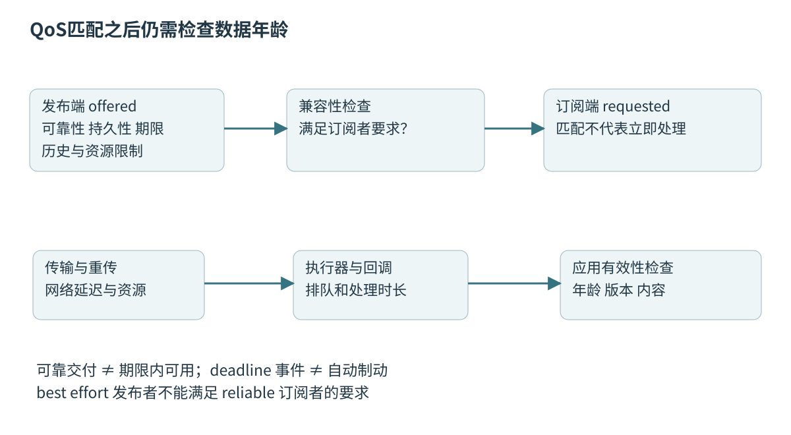
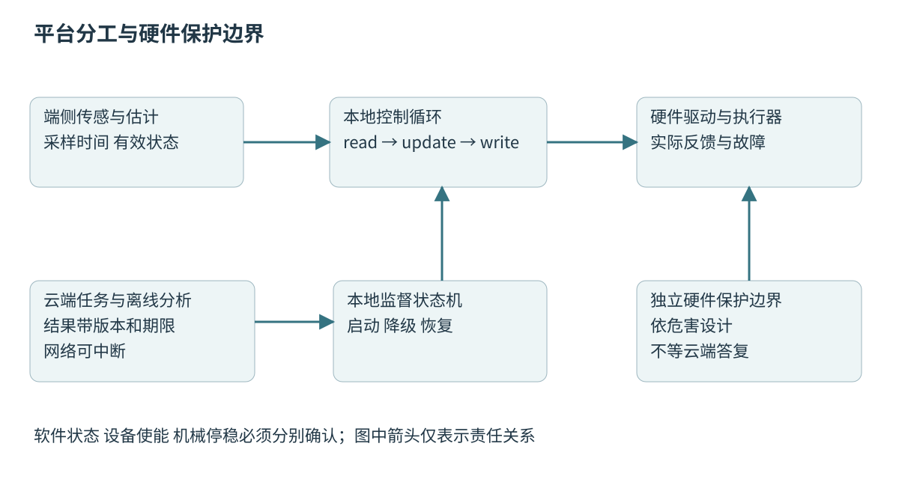

# 第四十九章 ROS 2 中间件与机器人软件平台

ROS 2 是组织机器人软件的一组通信、运行和开发基础设施。它让传感器驱动、定位、规划、控制和可视化通过约定接口协作，但不会自动使这些模块具有正确的物理语义、确定的执行时限或合格的安全边界。理解框架的关键，是区分“数据如何表达”“通信如何发生”“回调何时运行”和“谁负责真实硬件”四件事。

第四十八章已经规定坐标、时间、单位和有效性。本章把这些契约放进软件图，讨论发现、QoS、生命周期、部署和驱动资源。正文采用 ROS 2 Jazzy 文档范围；官方分支和 ros2_control Jazzy 网页仍随维护更新，不等同于固定补丁版本。C++20作为本书语言主线，但依赖包自己的语言标准和ABI要求必须另行核验。

所有命名、时延预算与故障场景均为教学构造。本章没有启动ROS图、修改网络、执行控制器或连接真实执行器。概念上的实时与安全要求必须在实际平台上获得相应证据。

## 49.1 Node Topic Service Action与执行器

### 49.1.1 Node是逻辑参与者 不是线程或进程的别名

**节点**（Node）是ROS图中的逻辑计算参与者，可以发布、订阅、提供服务、执行Action以及持有参数。[S1]一个节点可以位于独立进程，也可以与其他节点共享进程；一个进程可以有多个线程，某个节点的回调也可能由多个线程执行。因此节点数不能直接用来估计进程隔离、CPU并行度或故障影响范围。

划分节点首先看职责与接口稳定性。把设备解码与设备状态放在一个驱动节点通常便于维护，把重计算感知与高频控制放在相同回调路径却可能增加耦合。过度拆分同样有成本：序列化、发现、配置和跨模块状态管理都会增加。合理边界来自数据流与故障边界，而不是每个类都包装一个Node。

命名空间用于组织名称，重映射用于连接不同部署。它们改善复用，却不是权限系统。两台机器人若都使用同一公共命令名，可能意外收到彼此控制信息；仅改变可视化节点显示名并不能消除topic冲突。部署应给出设备身份、命名空间、域和桥接规则。

进程退出、节点销毁和设备断电也不是同一事件。一个节点被卸载后，其他节点可能仍持有旧目标；硬件驱动器可能继续保持最后命令。责任边界应明确到实际资源和状态，而不能只在图上画一个方框就认为故障已经隔离。

### 49.1.2 Topic适合数据流 但数据流需要新鲜度规则

**Topic**让发布者按类型向订阅者发送样本，适合图像、点云、状态与周期性目标。它表达的是数据流，不天然表示某个业务事务已经完成。发布函数返回时，消息可能仅进入本机中间件；不能据此推断订阅回调已执行，更不能推断机械已到位。

消息应包含足够的语义：采样或生成时间、坐标系、单位、序号或版本、有效状态，以及必要的不确定度。某些标准消息已经有部分字段，剩余语义仍需接口文档。一个名为velocity的浮点数，到底是车体前向速度还是某轮角速度，不应靠上下游作者默契决定。

高频状态通常更关心最近有效值，事件流则可能要求每条事件被处理。两者不能简单共享同一“队列深度10”的经验配置。旧速度状态堆积会增加反馈延迟；丢掉“开始执行”和“结束执行”中的一条事件又可能破坏业务状态。协议设计需要先区分样本与事件。

若应用需要完成确认，可增加显式状态与关联身份，或选择更适合的交互方式。不要用“我收到了自己发出的topic”作为远端已执行证据。可靠通信保证、应用状态机和物理反馈属于三个不同层次。

### 49.1.3 Service表达有限请求 响应不能消除不确定结局

**Service**提供请求—响应交互，适合短时查询或有限配置动作。客户端发送请求后等待响应，但响应丢失时，服务端可能已经执行。客户端超时不等于服务端没有执行，所以带副作用的操作应考虑请求身份、幂等性、结果查询和重试策略。

例如“把目标位置设为绝对坐标X”在一定版本规则下容易做成幂等，“当前位置再前进一米”重复执行却会累计效果。接口即使都只含一个浮点数，重试风险完全不同。对重要动作可以使用操作ID并保存执行状态，而不是用可靠QoS替代业务去重。

服务回调应避免长期阻塞执行器线程。耗时标定、导航或机械动作更适合交给后台状态机，并用Action或另一个查询接口报告过程。服务响应“已接受”与“已完成”必须在字段和文档中区分，不能让不同调用者自行猜测。

服务端重启还涉及旧请求。Jazzy QoS文档说明服务采用volatile持久性的重要性，以避免重启后处理不合时宜的历史请求。[S3]即使传输层配置正确，应用仍应验证请求期限与设备状态，尤其不能把过期运动命令当成当前授权目标。

### 49.1.4 Action管理长任务 取消只是一个请求

**Action**围绕目标、反馈和结果组织长时间任务，适合导航、轨迹执行或其他需要进度与取消语义的过程。ROS 2设计中，一个目标有自己的身份和状态，取消请求被接受后还会经历取消处理，最终进入相应终态。[S2]发送取消并不意味着所有工作已瞬间停止。

目标抢占需要应用策略。新导航目标到来时，是排队、拒绝、取消旧目标后切换，还是允许并行？一个执行器通常不能同时接受两个互相矛盾的轨迹，但某些独立计算任务可以并行。框架提供交互机制，不能代替业务资源仲裁。

反馈应反映可解释的进度与状态。百分比在未知总工作量的规划任务中可能没有明确意义，剩余距离也不必单调下降。结果应包含成功、失败或取消原因及关键配置身份，使重试能够判断是否适合。不要把“回调没有抛异常”当成目标已满足。

面试追问：“取消Action可以作为急停吗？”通常不能。取消走正常通信与回调调度，可能受网络、进程失效和执行器阻塞影响；真实设备停止还受物理能力限制。急停或独立保护应由经过风险评估的安全链承担，Action取消只能作为任务管理的一部分。

### 49.1.5 Executor决定回调何时运行

ROS 2中的**执行器**（Executor）调度订阅、计时器、服务等回调；这里的执行器是软件调度概念，与电机等物理执行机构不同。Jazzy执行器文档描述等待集合和回调调度，以及单线程、多线程等组织方式。[S4]数据已经到达中间件，不表示回调立即获得CPU。

单线程执行器使同一执行器中的回调依次运行，容易理解共享状态，却会让一个慢回调阻塞其他工作。多线程执行器提供并行机会，但实际并行还受回调组、锁、CPU、操作系统与依赖关系限制。线程数翻倍并不会自动把端到端延迟减半。

在订阅回调里同步等待某个服务，而服务响应回调又只能由同一被阻塞的执行器处理，会形成死锁或饥饿。异步请求把等待从调用栈中移开，但仍需管理对象生命期、取消、超时和响应关联。不能把future存在误认为系统必定能够完成它。

执行顺序也不能假定为严格按消息时间戳先后。不同实体、不同中间件队列和不同回调组有各自就绪关系。若算法要求“先处理IMU再处理相机”，应在应用层按采样时刻组织有界队列或明确调度，而不是依赖碰巧观察到的回调顺序。

### 49.1.6 Callback group是并发约束 不是完整数据保护

**互斥回调组**限制同组回调不并行执行，**可重入回调组**允许并行，包括在条件满足时同一回调的多个实例。[S5]这些约束只作用于由相关执行器调度的回调，不自动保护后台线程、设备线程或其他直接访问共享对象的代码。

如果所有回调都留在同一个互斥默认组，即使用多线程执行器，也可能仍表现为串行。相反，把它们全部改成可重入可能暴露竞态。正确做法是画出共享状态与读写关系，决定哪些回调可并发、哪些需要快照、锁或单一写者，再建立回调组。

锁的持有时间比“有没有加锁”更重要。订阅回调持锁做图像解码，控制回调即使优先级更高也可能等待；若还发生优先级反转，尾部延迟会更加复杂。可把重计算放到锁外，对结果采用版本化交换，避免高频路径等待不可控工作。

C++对象还要活得足够久。回调捕获this并注册到执行器后，销毁节点相关对象前必须保证不再有在途回调访问它。shared_ptr可以帮助管理拥有关系，却可能形成循环，weak_ptr需要处理对象已不存在。并发安全与生命周期安全是相邻但不同的证明义务。

### 49.1.7 参数更新需要验证和生效边界

ROS 2参数由节点持有，参数接口支持声明、读取与修改等操作。[S6]参数不是没有约束的全局变量。速度限值、滤波频率和设备地址一旦改变，可能影响多个状态与资源；节点应验证取值范围、组合约束和当前是否允许修改。

多参数更新尤其需要一致性。轮径与减速比共同决定换算系数，只更新其中一个会产生瞬时不合理配置。可以在非实时线程验证并构造完整不可变配置，在明确边界一次切换。原始参数请求成功、配置构建成功和控制环实际采用新配置，最好有可追踪版本。

某些参数只能在Inactive状态修改，某些可以在运行时平滑切换。增益突变、目标坐标系改变或地图切换，都可能要求重置内部状态或重新规划。应根据物理后果制定流程，而不是为了“支持动态参数”允许任意时刻任意更改。

深入追问：“为什么参数服务返回成功，行为却没变？”可能只有存储值改变，工作线程仍使用旧副本，也可能新值被另一层限幅或覆盖。应追踪请求版本、接受结果、生效周期和最终控制输出，使配置变化可观察，而不只打印一个成功日志。

## 49.2 DDS QoS发现 生命周期和通信诊断

### 49.2.1 DDS与RMW划分可替换边界

**DDS**（Data Distribution Service，数据分发服务）是一类数据分发标准，ROS 2通过**RMW**（ROS Middleware，ROS中间件接口）抽象连接具体中间件实现。OMG DDS 1.4是本章关于数据分发与QoS的标准参照。[S7]ROS消息、节点和Action是应用框架概念，DDS participant、writer与reader是中间件概念，不应简单逐个等同。

RMW抽象使上层代码能够在不同实现之间迁移，但不保证所有默认值、性能、资源限制和高级特性完全一致。共享内存、发现模式、loaned message、传输配置和安全功能都可能有实现差异。项目应记录ROS发行版、RMW实现、DDS版本及配置文件。

“ROS 2使用DDS”也不意味着一切消息都必然走同一个网络传输路径。同进程通信、共享内存或其他实现策略可能减少序列化和网络开销。诊断时应确认当前路径，而不是仅凭topic名称推断它在网卡上应有对应数据包。

不同供应商的互操作需要类型、名称、QoS与配置兼容，并通过真实组合验证。标准兼容是一项有范围的声明，不能据此省略大消息、重启、网络分区和负载情况下的集成测试。中间件升级也可能改变时序，即使应用源码没有变化。

### 49.2.2 发现成功与数据通路成功是两件事

**发现**让参与者知道通信对象的存在与接口信息。DDS环境可能涉及组播、单播、发现服务器或静态配置，具体由实现与部署选择。能在图中看到节点，不代表数据面端口、类型匹配和QoS都正常；反之，工具图缓存滞后也不一定表示应用已经停止通信。

ROS_DOMAIN_ID用于逻辑通信域的组织，Jazzy文档解释它与发现及端口分配之间的关系。[S8]域ID不是密码，不提供身份认证或保密。把机器人分到不同域可以减少误发现，却不能替代网络隔离与DDS安全策略。

跨主机通信应检查绑定网卡、路由、组播支持、容器网络、地址转换、防火墙和安全配置。某台机器上有多个网卡时，发现可能通过可达地址进行，而数据通路选择了另一地址。只有检查实际端点与网络路径，才能解释“本机能通，跨机不能通”。

诊断不应先关闭所有防护。先收集发行版、RMW、域、端点和日志，在受控环境确认是哪一项阻断；必要配置修改要遵守项目授权。临时把网络完全开放可能让症状消失，却也扩大机器人命令面的风险，不能作为正式修复。

### 49.2.3 QoS匹配是一份双方共同满足的合同

**服务质量**（QoS）描述可靠性、历史、持久性、期限和活性等通信政策。Jazzy按订阅者请求与发布者提供的能力进行兼容判断，所有参与兼容性的政策都必须满足。[S3]同名同类型topic仍可能因QoS不兼容而没有消息。

可靠性中的best effort允许丢失，reliable会利用重传等机制增强交付。典型兼容方向是reliable发布者可满足best effort订阅者，而best effort发布者不能满足reliable订阅者。这个方向关系常解释“驱动正常发布，但调试工具收不到”。工具本身也有QoS，不能假定观察者不影响结果。

durability中的transient local用于向迟加入者保留符合历史设置的样本，volatile通常只处理加入后的新数据。晚加入订阅者想获得保留历史，需要双方配置支持；它不是任意持久数据库，也不表示发布者重启后所有历史仍可恢复。

应用应从语义选择配置。静态地图与传感器流、状态快照与一次性命令不同。给所有topic统一reliable和大深度，可能增加内存、重传与旧样本滞留。给所有topic统一best effort，则可能破坏必须完整处理的应用事件。QoS选择是约束取舍，不是单向升级。

### 49.2.4 Reliable不等于及时 也不等于业务只执行一次

可靠传输解决的是特定通信条件下的交付问题，实时性解决的是数据是否在期限前可用。链路丢包时重传有助于完整性，却可能让旧帧占用带宽和缓冲；消费者处理不过来时，即使没有网络丢包也会积压。应用必须另外检查数据年龄。

history的keep last限制保留最近N个样本，keep all仍受中间件资源限制。深度不是单一全系统队列长度，驱动、发布端、网络、接收端和应用层都可能另有缓冲。只把订阅深度改成1，不能保证整条链只保留一个样本。

deadline与liveliness事件可以提供发布节奏和通信活性线索，但不会自动调用制动，也不证明传感值真实有效。持续发布错误的零值可能完全满足deadline。保护状态机应结合消息时间、序号、内容与设备状态，而不是只看中间件是否报告连接存活。

深入追问：“可靠QoS能否保证命令只执行一次？”不能直接保证业务层exactly once。服务重试、客户端重启、应用重复提交与处理完成后的响应丢失仍可能发生。需要命令ID、幂等策略、状态持久化或结果查询，并定义崩溃恢复后的语义。

图 49-1 QoS兼容、可靠交付与按时消费是不同检查点。示意中的队列上限不是ROS通用默认值。来源：本章原创。

### 49.2.5 生命周期管理启动次序和可恢复边界

**受管节点生命周期**通过配置、激活、停用和清理等状态转换，组织资源准备与工作启动。ROS 2设计文档描述Unconfigured、Inactive、Active和Finalized等主要状态。[S9]实际rclcpp实现中，普通订阅或自建线程是否在Inactive停止，仍需开发者正确约束，不能只改变状态标签。Jazzy的LifecycleNode模板实现中，普通订阅仍通过rclcpp::create_subscription创建，生命周期状态不会替这些回调和任意后台线程自动建立停用屏障。[S18]

配置阶段适合验证参数、建立缓冲和准备不依赖运行使能的资源；激活阶段应确认依赖已经有效，再允许对外提供工作输出。若定位尚未初始化、时钟尚未同步或硬件模式不正确，驱动与控制不应仅因进程存在就立即开始运动。

停用与清理需要反向处理在途工作。先阻止新请求，完成或取消已有任务，确认回调和设备线程退出，再释放被它们使用的资源。销毁共享缓冲后才取消计时器可能太迟；计时器取消本身也不一定意味着当前回调已经结束。

生命周期状态机只是软件组织工具，不是整机安全证明。Active可以包含不同业务模式，Inactive也可能仍有设备功率。要明确状态与硬件使能、命令保持、制动及独立保护之间的映射，并通过适当层级验证，而不是把状态名解释成物理保证。

### 49.2.6 通信诊断应沿证据链逐层缩小

“收不到消息”可以拆成发现、名称类型、QoS匹配、数据传输、回调调度和应用校验六类问题。首先确认发布端是否真的产生新样本，其次看端点是否互相匹配，再检查接收端中间件与执行器。仅凭topic列表出现名称，无法排除后面几层。

“消息很慢”则需要多个时间点：源采样、发布、接收、回调开始与处理结束。它们必须在可比较的时钟域或经过已知映射。端到端年龄大可能来自源设备内部处理，也可能来自订阅回调被其他工作阻塞；优化错误层只会增加复杂度。

观察工具还可能改变系统负载。订阅高带宽图像、打印每条消息或打开多个可视化窗口，会增加序列化、网络与CPU压力。应记录诊断工具是否参与，以及使用采样、统计与低开销追踪降低扰动。被工具“治好”或“弄坏”的问题都需要解释这种观察效应。

教学故障中，设备每秒稳定发布30帧，显示却每隔数秒卡顿。可能是大消息重传、日志同步刷盘、回调组锁竞争或GPU同步。下一步应寻找帧年龄与各阶段耗时的共同尖峰，而不是仅凭平均频率正常就排除软件调度。

### 49.2.7 Security保护参与者身份和通信权限

ROS 2的DDS安全集成涉及身份认证、访问控制和密码学保护。[S10]安全配置需要为参与者指定可执行的操作范围，维护证书和权限文件，并处理过期、吊销与配置错误。开启安全相关环境变量并不自动使任意部署安全，失败行为和实际策略必须验证。

命名空间、域ID和网络位置都不能替代身份。若一个未授权节点能够发布运动目标或修改参数，即使包的格式完全合法，也会产生物理后果。应把高权限控制与只读遥测分开，使用最小权限，并对跨网关的消息进行类型、范围、期限和身份验证。

安全与可用性可能相互影响。证书过期导致通信失败，错误权限阻止状态回报，认证开销改变启动时间，都需要纳入故障处理。不能为“保证机器人不断线”而默认在认证失败时回退到不受保护通信；这会让攻击者可通过制造失败获得更大权限。

面试追问：“内网机器人为什么还需要Security？”内网可能有维修电脑、无线接入、错误配置和被攻陷设备；控制接口的后果与网络是不是公网无关。威胁建模应从资产、信任边界与可达性出发，再选择保护措施，而不是用网络名称代替分析。

## 49.3 组件部署 实时内存分配与延迟

### 49.3.1 组件组合改变部署成本 也改变故障范围

**组件组合**允许多个节点实现装载到同一进程，减少独立进程带来的通信和管理成本。Jazzy组合文档区分不同的装载与部署形式。[S11]同进程可以为数据传递提供更高效路径，但是否真正避免复制，仍取决于接口、消息所有权、启用配置和消费者数量。

共享进程也共享地址空间与许多资源。一个越界写可能损坏其他组件，一个异常退出可能使整个容器停止，一个全局锁可能影响看似独立的节点。若设备控制需要独立故障边界，就不能只因通信速度更快而把所有功能塞进同一个进程。

独立进程增强某些故障隔离，却不隔离共享CPU、内存带宽、磁盘、GPU或内核。感知进程大量换页仍可能影响控制进程，日志写满磁盘仍可能影响系统。部署图应同时描述进程、线程、CPU、设备和资源预算，不能只画节点连线。

选择可以分阶段：初期保持职责清楚的接口，通过测量识别大消息复制与调度瓶颈，再考虑组合；对高风险、第三方或不稳定模块保留更强隔离。组合与拆分都要重做延迟、故障与恢复测试，因为部署结构本身是行为的一部分。

### 49.3.2 所有权决定能否安全地减少复制

图像和点云很大，复制成本可能显著，但“零拷贝”必须说明在哪些边界没有复制。应用到中间件、同进程订阅、跨进程共享内存和设备DMA是不同边界。减少某一段复制，不表示从传感器到GPU全过程都零拷贝。

**借用消息**（loaned message）让应用在支持条件下使用由中间件管理的存储，涉及借出、发布或归还以及资源上限。ROS 2的设计说明讨论这种所有权模型。[S12]具体RMW、消息类型和发行版本是否支持，仍需核验；不能把接口存在等同于当前配置实际走了该路径。

借用存储的生命周期必须覆盖所有合法访问。发布或归还后继续保留裸指针，可能读到已复用内容；一个消费者长期持有资源，也可能耗尽池，使生产者无法取得新缓冲。应规定最大在途数量、归还时机和资源不足时行为。

多消费者还带来可变性问题。若一个订阅者原地修改共享图像，另一个订阅者可能观察到非预期结果。可将消息视为不可变样本，必要时由需要修改的一方复制；有时明确的一次复制，比复杂共享所有权更容易保证正确和可预测。

### 49.3.3 实时路径必须有可分析的资源上限

**实时**关注任务是否在规定期限前完成，而不只是平均速度快。硬实时、软实时与不同后果等级需要不同证据。ROS 2实时设计资料指出动态分配、缺页和不受控同步等活动可能破坏时间可预测性。[S13]使用ROS 2或C++本身都不构成实时保证。

启动阶段可预分配缓冲、建立连接、触达必要内存并验证容量，但预热不是万能。运行时消息长度、容器扩容、字符串拼接、日志、异常路径和库内部缓存都可能继续分配。代码审查与运行追踪应同时覆盖正常和错误路径，尤其是过载时最容易忽略的路径。

有界队列需要明确满时政策。阻塞生产者可能把延迟传播到设备采集；丢最旧样本适合某些状态流，却不适合必须逐条确认的事件；拒绝新请求需要向调用者返回可处理结果。容量选择要依据峰值输入和最长消费间隔，而不是凭常见默认值。

操作系统调度、CPU频率变化、热降频、IRQ、内存带宽和驱动阻塞同样重要。线程优先级高不等于可以无限占用CPU，实时线程也不能让故障诊断和保护路径完全饥饿。任何实时配置修改都需要在授权环境内按平台指南验证，本章不提供直接修改设备的操作指令。

### 49.3.4 端到端延迟需要按依赖链计算

一条控制链可能依次经历采样、设备处理、传输、回调等待、估计、规划、控制与驱动写入。总延迟不是某一个节点的耗时，也不是各节点平均值简单相加后就能代表最坏情况。队列等待与触发相位可能决定大部分尾部延迟。

教学预算中，传感周期20ms，采集到回调等待最多8ms，估计4ms，规划10ms，控制及发送3ms，则新观测进入最终命令的处理链预算为25ms；若事件恰好错过采样，还要考虑额外接近20ms的采样相位。此数字只是解释预算组成，不是任何平台的建议指标。

串行相关阶段的最坏时间可以保守相加，但并行阶段应按实际依赖路径分析；分位数通常不能简单相加得到总链相同分位数。各阶段可能因同一次CPU过载共同变慢，也可能发生相位耦合。测量需要联合时间线，而非只拿几张独立直方图拼结论。

时间戳还要区分源时间与本机计时。跨机时钟误差若大于希望测量的网络延迟，直接相减会产生误导。可以同时报告同步精度、本机阶段时长与端到端年龄，在证据不足时明确区间，不输出虚假的微秒级精度。

### 49.3.5 高频控制与后台工作通过快照交接

典型系统把低频配置、网络任务和重计算放在非实时上下文，高频控制循环只读取已经验证的状态或目标快照。快照应完整且版本一致，避免控制器同时看到新轨迹位置和旧轨迹时间。双缓冲、单写者队列或特定实时缓冲工具都只是实现选择。

快照交换需要内存可见性和生命周期保证。指针原子替换并不意味着被指向对象以后可以任意改写；旧对象也不能在控制线程仍可能读取时立即释放。C++20的原子、RAII和停止令牌可以帮助表达部分关系，但不会自动推导整个实时所有权方案。

控制目标应携带参考时间、有效期限和模式。后台规划十秒后才返回一条基于旧地图的轨迹，即使对象格式正确，也应因版本或年龄失效而拒绝。完成的计算结果必须重新验证当前前提，不能因为“任务成功”就覆盖更新的目标。

停止流程也应跨边界设计：拒绝新目标，通知工作线程取消，等待在途访问到达可确认边界，再释放资源。若取消耗时不可控，安全路径应有独立的超时与硬件保护策略。把所有析构都放在高频线程上可能引入隐藏的释放和等待成本。

### 49.3.6 日志和可观测性不能拖垮被观察系统

定位通信问题需要日志，但逐条打印高频IMU、点云或控制值会产生格式化、锁、内存分配和IO。实时路径更适合记录固定大小事件到有界缓冲，再由低优先级线程格式化与写盘。缓冲满时应统计丢失，不能悄悄假定日志完整。

日志要记录关联身份：目标ID、消息序号、配置版本、设备重启次数和时间域。仅有一串“收到”“处理完”难以连接跨节点事件。状态转换日志往往比每周期相同文本更有价值，但仍需要足够采样保留问题发生前后的趋势。

追踪数据也应说明开销。开启某项追踪后周期抖动增加，需要量化观察本身的影响。可以在代表负载下比较开启与关闭状态，并根据风险选取采样率、缓冲容量与保留窗口。不能把调试模式测出的指标直接当成生产配置，也不能因为生产关闭日志就放弃故障证据。

深入追问：“系统平均CPU只有30%，为什么控制仍超时？”可能是单核心热点、优先级反转、突发同步IO、内存带宽竞争、长不可抢占区或相位集中。整机平均值隐藏了关键线程的等待；应查看关键路径、最长阻塞与每核时间线。

### 49.3.7 性能结论需要固定行为与部署矩阵

比较两种Executor或RMW前，应固定消息内容、大小、频率、消费者数量、QoS、硬件和网络条件。只比较空消息吞吐量，无法直接推断大点云链性能；只测同进程也不能说明跨无线网络行为。吞吐量、端到端年龄、抖动、丢失、峰值内存和恢复时间应共同报告。

性能优化还可能改变语义。减小队列让数据更及时，但增加丢弃；把reliable改成best effort减少重传，却改变交付条件；降低传感频率降低CPU成本，却可能减少控制信息。只有在满足同一任务约束时，前后数字才具有可比性。

版本矩阵应包含应用构建、ROS包、RMW、DDS、操作系统、内核、编译器、标准库和配置。C++20编译成功不说明第三方二进制ABI兼容，也不说明所有依赖可以在实时线程中使用。动态组件混用不兼容版本，可能在运行时才发生装载或内存错误。

面试追问：“如何证明零拷贝优化有效？”先界定减少了哪一段复制，记录消息所有权和实际启用路径，再比较CPU、内存带宽、峰值驻留和端到端延迟，同时检查多消费者、资源池耗尽与退出路径。只有吞吐增加而生命周期变得不可控，不能视作完成优化。

## 49.4 ros2_control驱动接口及端云分工

### 49.4.1 ros2_control把控制算法与硬件访问分开

**ros2_control**组织控制器、硬件组件及其接口，使控制算法能够通过统一的状态与命令接口访问设备。硬件可以抽象为Actuator、Sensor或System，具体表达应按设备组成选择。[S14]这不是自动生成可靠驱动的工具，电气通信、标度转换、设备状态与故障处理仍由硬件实现承担。

控制器通常读取状态接口并输出命令接口；硬件层负责把测量转换成约定单位，并把命令转成设备协议。关节位置、速度和力矩可能来自不同传感来源，某个接口存在不代表硬件真正支持对应闭环模式。驱动必须声明实际能力和限制。

机器人描述中的关节、传动和接口名称应与实际安装一致。软件中左右轮交换、减速比倒置或转矩符号错误，都可能在接口层表现为合法数值。应通过离线模型与受控验证逐级检查，不能把URDF加载成功当成机械映射正确。

本章只解释结构，不编写或运行能够使真实电机运动的控制插件。真实设备集成必须有授权的现场程序和硬件安全边界，尤其不能让软件示例中的默认命令在接通设备时意外成为有效目标。

### 49.4.2 read update write循环各有时间语义

典型控制链由硬件read取得状态，控制器update计算命令，硬件write发送命令。Controller Manager的Jazzy文档说明这种周期组织与相关运行行为。[S15]三个步骤的执行顺序不意味着测量在read时才发生，也不意味着命令在write返回时已经产生机械作用。

read应明确提供最新完整采样、带时间的历史样本还是上一周期快照。若总线异步更新，控制线程可能在固定周期读取缓存；缓存年龄与设备状态必须被检查。没有新样本时，不应把旧值重新盖上当前时间伪装成新观测。

update使用的周期长度应与真实执行间隔一致，尤其对积分与微分计算。线程晚醒后仍固定使用理想周期，会改变控制器实际行为；直接使用任意大间隔也可能违反离散模型。应根据控制设计规定超期检测、状态处理与降级，而不是靠框架自动兜底。

write需要区分发送成功、设备确认与实际输出。设备拒绝命令、总线缓冲、模式不匹配或驱动器内部限幅，都应反馈给控制或监督层。闭环分析应使用实际可施加的输入范围与延迟，不能把理想命令当成物理输入。

### 49.4.3 资源认领避免相互覆盖 模式切换需要连续性

多个控制器可能需要读取同一状态，但同一个可写命令资源不能被互相冲突地同时控制。资源认领和控制器管理帮助表达这一关系；具体接口与切换能力依ros2_control版本和硬件实现而定。[S15]应用还需要定义谁有权启动控制器，以及失败时恢复到什么状态。

位置、速度和力矩模式之间切换尤其敏感。切换前后控制器内部积分状态、目标位置和设备保持行为不一致，可能产生突变。**无扰切换**要求新控制器初始化到与当前实际状态相容的工作点，并在必要时采用平滑目标或反馈跟踪。

切换是多步骤状态变化：请求、验证资源、准备硬件、停用旧控制器、激活新控制器、确认实际模式。若中途失败，应有明确回滚或安全停止路径，不能出现软件认为新模式生效而设备仍执行旧模式的半完成状态。

深入追问：“资源冲突检查通过，为什么仍可能有两个命令源？”可能另一路绕过了控制器管理直接写设备，也可能网关或设备内部脚本仍在发送目标。应把所有具有实际写权限的路径纳入所有权图，框架内的检查只覆盖它知道的资源。

### 49.4.4 硬件生命周期必须处理部分初始化与错误

硬件组件可能在初始化成功后配置失败，也可能在激活过程中只启动了一部分轴。生命周期应把部分拥有的资源准确记录，失败路径能够撤销已经发生的步骤。官方Jazzy硬件组件文档提供实现与生命周期接口参照。[S16]、[S17]项目必须补充设备特有的状态映射。

连接成功不代表设备可运动。驱动器可能未使能、未回零、有故障锁存或处于维护模式。状态接口应暴露必要信息，上层不要仅凭TCP连接或总线响应就设置“ready”。回零涉及真实运动风险，必须通过独立授权和现场程序完成，不能由一般节点启动隐式触发。

read或write失败后，处理方式取决于错误后果：暂时通信缺失可以触发有界重试，持续超时需要失效状态，设备故障可能需要人工确认才能恢复。无限自动重启可能反复产生使能脉冲或失去故障证据，不能把“自愈”作为不受限制的重新激活。

软件无法确认硬件已经停稳时，应报告未知或未确认状态。不能因为最后一条停止命令发出，就释放现场隔离或宣称恢复完成。实际安全论证需要关注断电后的惯性、垂直轴重力和储能等物理机制，第五十二章将进一步讨论。

图 49-2 机器人平台需要同时画出数据流与故障边界。云端失联时，本地应按事先定义的策略工作或停止；独立保护不能依赖云端答复。来源：本章原创。

### 49.4.5 端侧负责时间敏感闭环 云端承担有边界的服务

**端云分工**依据时限、带宽、隐私、算力与失联后果选择功能位置。快速反馈、设备保护和必须在失联时执行的反应，通常需要在本地具备足够能力。云端适合某些任务分配、数据管理、离线分析和模型更新，但具体边界取决于系统用途。

网络延迟具有波动和中断可能，云端平均响应快不能替代最坏条件分析。远程规划结果返回时，端侧应检查地图版本、起始状态、时间有效性和约束；过期结果不能因为签名合法就直接执行。身份正确与内容适用于当前世界是不同判断。

失联策略不一定都是原地断电。有些设备需要受控减速，有些需要保持负载，有些需要退出特定区域；选择必须来自危害分析和硬件能力。不能把一个通用“网络断开立即切电”的规则适用于所有机械系统。

数据上传与模型更新也需要权限和资源预算。原始相机与位置记录可能敏感，后台上传可能占用与控制共享的链路。端云系统应明确授权范围、传输优先级、带宽上限与离线缓存，避免为了收集更多数据而损害本地任务。

### 49.4.6 升级和回滚要保护数据与控制契约

机器人升级可能同时改变消息定义、QoS、标定格式、地图、控制器和设备固件。只检查每个包能启动不够，还要检查跨版本通信与配置解释。滚动升级期间新旧节点共存，某个字段默认值变化就可能改变行为，即使序列化兼容。

发布包应包含可追踪构建身份、依赖、配置和适用设备范围。回滚不仅恢复二进制，还要考虑配置迁移、地图格式、设备状态与持久目标是否可逆。新版本写入旧版本无法理解的文件后，简单替换可执行文件可能无法真正恢复。

更新应在明确允许的状态进行，避免执行中的轨迹被中途更换控制语义。对于重要状态，可先检查依赖与资源，再准备新版本，在受控边界切换并验证健康；失败时保持可解释状态，而不是无限重试和反复激活。

维护后重新验证哪些内容取决于变更影响。仅修改日志也可能改变实时路径，DDS配置变化也可能改变延迟，驱动修复可能改变单位或时间戳。因此影响分析应沿依赖链展开，不能按“只改了一行”决定无需回归。

### 49.4.7 综合故障定位与深入面试追问

设一个教学系统升级后定位正常、规划正常，但底盘偶发停顿。应确认硬件是否报告错误，再沿read、update、write、命令年龄和控制器切换记录查证。若刚好伴随新可视化订阅者加入，可能是可靠大消息传输或资源竞争；若伴随参数更新，则需检查锁与生效边界。

**追问：“为什么多线程执行器没有改善延迟？”** 回调可能在同一互斥组，或者共享同一把锁，也可能瓶颈在设备、网络或GPU。先找到可并行部分和等待来源，再调整线程与组；盲目增加线程可能增加竞争与抖动。

**追问：“Lifecycle节点进入Inactive是否保证不再发运动命令？”** 不自动保证。普通发布、后台线程、在途回调以及驱动器保持策略仍需应用实现约束。应验证状态转换与所有命令路径的映射，并由独立安全边界处理软件失效。

**追问：“把控制器搬到独立进程就安全了吗？”** 获得部分地址空间与崩溃隔离，但共享CPU、内核、供电和物理设备的共同原因仍在。还需要资源限制、通信有效性、设备保护和系统风险分析，不能把进程边界等同于安全等级。

**追问：“最重要的ROS 2集成能力是什么？”** 是能把一个现象定位到语义、传输、调度、资源或硬件状态，并拿出时间与版本证据。熟悉命令行工具有用，但真正可维护的平台依赖清楚的所有权、时限、失效与恢复契约。

## 本章资料与核验范围

核验日期2026-10-03。发行版范围固定为Jazzy，分支与官方文档可随维护变化；ROS 2 Design文章用于设计背景，不冒充特定补丁版本的完整实现承诺。没有执行ROS程序、修改网络安全配置或测试真实设备。

- [S1] ROS 2 Jazzy，Nodes；[S2] ROS 2 Design，Actions
- [S3] ROS 2 Jazzy，Quality of Service settings；[S4] ROS 2 Jazzy，Executors
- [S5] ROS 2 Jazzy，Using Callback Groups；[S6] ROS 2 Jazzy，Parameters
- [S7] OMG，Data Distribution Service 1.4官方规范入口
- [S8] ROS 2 Jazzy，The ROS_DOMAIN_ID
- [S9] ROS 2 Design，Managed nodes；[S10] ROS 2 DDS-Security integration
- [S11] ROS 2 Jazzy，Composition；[S12] ROS 2 Design，Zero Copy via Loaned Messages
- [S13] ROS 2 Design，Introduction to Real-time Systems
- [S14] ros2_control Jazzy，Hardware Components与接口类型
- [S15] ros2_control Jazzy，Controller Manager
- [S16] ros2_control Jazzy，Writing a Hardware Component
- [S17] ros2_control Jazzy，Lifecycle of a Hardware Component
- [S18] rclcpp Jazzy，LifecycleNode模板实现，普通订阅与受管发布器的区分

[S1]: https://raw.githubusercontent.com/ros2/ros2_documentation/jazzy/source/Concepts/Basic/About-Nodes.rst
[S2]: https://design.ros2.org/articles/actions.html
[S3]: https://raw.githubusercontent.com/ros2/ros2_documentation/jazzy/source/Concepts/Intermediate/About-Quality-of-Service-Settings.rst
[S4]: https://raw.githubusercontent.com/ros2/ros2_documentation/jazzy/source/Concepts/Intermediate/About-Executors.rst
[S5]: https://raw.githubusercontent.com/ros2/ros2_documentation/jazzy/source/How-To-Guides/Using-callback-groups.rst
[S6]: https://raw.githubusercontent.com/ros2/ros2_documentation/jazzy/source/Concepts/Basic/About-Parameters.rst
[S7]: https://www.omg.org/spec/DDS/1.4
[S8]: https://raw.githubusercontent.com/ros2/ros2_documentation/jazzy/source/Concepts/Intermediate/About-Domain-ID.rst
[S9]: https://design.ros2.org/articles/node_lifecycle.html
[S10]: https://design.ros2.org/articles/ros2_dds_security.html
[S11]: https://raw.githubusercontent.com/ros2/ros2_documentation/jazzy/source/Concepts/Intermediate/About-Composition.rst
[S12]: https://design.ros2.org/articles/zero_copy.html
[S13]: https://design.ros2.org/articles/realtime_background.html
[S14]: https://control.ros.org/jazzy/doc/ros2_control/hardware_interface/doc/hardware_interface_types_userdoc.html
[S15]: https://control.ros.org/jazzy/doc/ros2_control/controller_manager/doc/userdoc.html
[S16]: https://control.ros.org/jazzy/doc/ros2_control/hardware_interface/doc/writing_new_hardware_component.html
[S17]: https://control.ros.org/jazzy/doc/ros2_control/hardware_interface/doc/lifecycle_of_a_hardware_component.html

[S18]: https://raw.githubusercontent.com/ros2/rclcpp/jazzy/rclcpp_lifecycle/include/rclcpp_lifecycle/lifecycle_node_impl.hpp
