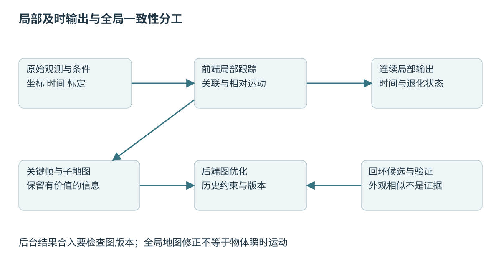
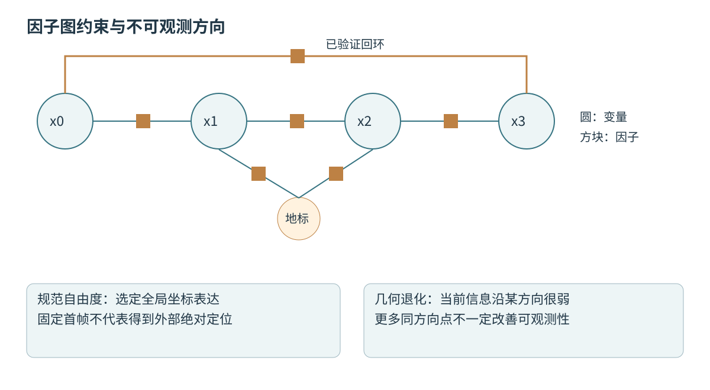
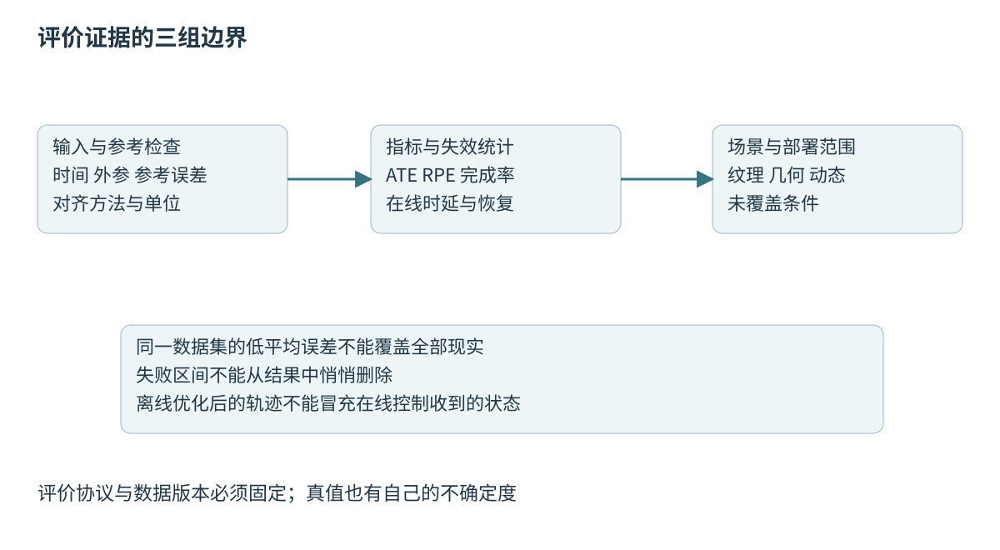

# 第五十章 感知定位与 SLAM

**感知**从传感数据推断环境中的几何、对象和状态，**定位**估计自身相对于某个参考的位置与姿态，**同时定位与建图**（Simultaneous Localization and Mapping，SLAM）则在地图未知或需要更新时联合估计轨迹与环境。这几个问题相互支持，也相互传递误差：错误位姿会使地图错层，错误地图又可能把后续定位拉向错误位置。

SLAM并不是把一段点云“拼起来”那么简单。它必须决定哪些测量来自同一物体、哪些物体相对世界稳定、哪些状态可由当前数据识别，以及什么时候应承认自己不知道。一个视觉上闭合的地图仍可能尺度错误，一条平滑轨迹仍可能持续漂移，优化器报告收敛也不证明找到了真实世界。

第四十八章的坐标、时间、标定与概率模型是本章前提。下文采用固定版本论文与官方项目资料解释机制，不给出未经执行核验的运行结果。OpenCV使用4.10.0，Ceres使用2.2.0源码文档；其他滚动项目资料明确限于核验日。所有数值与故障场景均为教学构造，没有运行数据集、SLAM或现场采集。

## 50.1 感知前处理 特征关联和模型误差

### 50.1.1 感知输出必须保留观测条件

传感器输出不是没有上下文的数组。图像带有曝光、镜头模型和光学坐标，点云带有扫描时间、采样方向与返回机制，IMU带有轴向、量程和滤波。前处理应先验证这些条件，再决定去畸变、裁剪、降采样和异常剔除。输入无效时，最重要的输出有时是明确失败状态。

**前处理**的目的，是让后续模型所依赖的假设尽可能成立，同时控制计算成本。它不是越多越好：强去噪可能抹掉几何边缘，过度降采样可能删除窄障碍，图像增强可能改变直接法的光度关系。每一步都应说明保留什么信息、牺牲什么信息以及是否改变噪声相关性。

还应分开原始观测与派生表示。把经过运动补偿和滤波的点云称为“原始数据”，会使后续诊断无法判断错误来自设备还是算法。保存处理版本、输入来源和必要参数，能够让一个异常点回溯到采样时刻及相应标定。

识别任务与几何任务也可能需要不同数据。语义网络希望图像尺寸和颜色符合训练分布，几何匹配则需要准确内参与像素位置。若两条分支共享预处理，应明确裁剪、缩放与坐标映射，防止框的位置在可视化上看起来合理，却投影到错误三维方向。

### 50.1.2 点云降采样要保护几何约束

**体素降采样**把空间划成小单元，再以代表点或统计量替代其中大量点，减少匹配成本。体素尺寸影响可保留的几何尺度：单元越大，速度可能越快，但薄结构、边缘和局部曲率更容易丢失。它不是一个与场景尺度无关的通用常数。

离群点剔除依据邻域密度、距离或统计关系判断异常。稀疏远处目标本来就点少，若按近处密集数据设置阈值，可能把真实物体删除。地面去除同样依赖平台姿态、坡度和场景假设，不能把所有近似平面都当作可通行地面。

扫描运动补偿需要把不同时间点转换到共同参考时刻。补偿所使用的运动估计本身可能有误差，因此补偿后的点云并非无误差真值。若先用错误轨迹补偿，再让匹配器拟合，优化可能得到较小残差却持续积累偏差。

实际诊断可比较未补偿与补偿点云在静态结构上的残差，以及误差随角速度和距离变化的模式。若补偿仅在某个旋转方向改善，可能存在时间符号或坐标方向错误。降低体素尺寸只会增加计算，通常不能修复这种系统性错误。

### 50.1.3 视觉特征提供可重复对应 不是物体身份保证

**特征点**通常是局部图像中能够重复检测与描述的位置，如角点或具有明显纹理的区域。描述子帮助在不同帧之间寻找候选对应，但相似描述子不证明来自同一物理点。重复窗格、货架和地砖可能产生大量外观相似候选。

特征分布比数量同样重要。一千个点集中在画面一角，对某些姿态方向的约束可能不如均匀分布的较少特征。远处点对平移的视差较弱，过近点又容易快速离开视野。前端应关注视差、空间分布、跟踪寿命和几何残差，而非只追求检测数量。

匹配通常结合描述距离、运动预测、几何约束与鲁棒估计。随机抽样一致性（RANSAC）通过抽样寻找得到较多一致支持的模型，但模型本身要正确，内点阈值要符合噪声尺度。动态物体占据大部分画面时，最大一致集合可能是运动物体，而不是静态世界。

OpenCV 4.10.0的标定与三维重建资料提供本质矩阵、基础矩阵、PnP与相关鲁棒求解接口参照。[S1]调用这些接口前仍要确认输入是畸变像素、去畸变像素还是归一化坐标，避免重复乘内参或混用单位。

### 50.1.4 直接法依赖光度模型 学习特征依赖数据分布

**直接法**利用像素强度或其变换关系估计运动，通常依赖某种光度一致性假设。曝光变化、响应曲线、暗角、反射和动态遮挡会影响残差。几何标定准确也不代表光度模型成立，必要时应估计曝光相关参数或采用适当鲁棒策略。

特征法通常对部分光度变化更宽容，但同样受模糊、弱纹理和重复外观影响。两者不是绝对优劣关系：不同场景、相机和算力预算下，信息利用与鲁棒性取舍不同。混合方法可能结合优点，也增加状态和调参复杂度。

学习型特征、深度或匹配器可改善某些困难场景，但其输出仍带有训练分布与模型误差。网络置信分数未必是经过校准的概率，不能直接当成测量协方差。若用于几何优化，需要验证分数与实际误差的关系，并处理分布外场景。

面试追问：“网络给出深度，单目尺度问题是否就消失？”网络引入了从训练数据学来的尺度先验，可能在相似分布上有用，但不等于传感几何提供了可验证绝对尺度。镜头、场景或物体尺寸变化可能使先验失效，应明确这种尺度来源。

### 50.1.5 ICP通过交替关联与变换估计配准

**迭代最近点**（ICP）反复建立源点与目标点之间的对应，再估计变换并更新。点到点方法最小化点间距离，点到平面方法利用表面法向，可能在合适条件下更快收敛。PCL官方ICP教程展示这一配准机制，但其示例成功不代表任意初始位姿都能成功。[S2]

ICP通常是局部方法，初值、重叠比例、几何结构和错误对应都影响结果。两堵相似墙面可能让配准停在错误平移处，走廊可能沿轴向约束很弱。代价下降只能证明对当前对应与模型的拟合改善，不能自动证明物理对应正确。

法向估计也有尺度选择。邻域太小容易受噪声影响，太大会跨越边缘，把多个表面混为一谈。点到平面残差的单位与点到点相同，但约束方向不同；应考虑法向质量、距离权重、异常点和动态区域。

稳健实现需要对齐失败的明确信号，例如有效对应不足、重叠过低、条件数异常或增量超过可解释运动范围。不能只看某个`hasConverged`布尔值；终止条件也可能是迭代上限或增量变小，而非找到了足够可信的姿态。PCL的默认收敛判据实现就允许在相应配置下，将达到迭代上限报告为收敛。[S13]

### 50.1.6 数据关联错误与测量噪声不是同一种误差

**测量噪声**是在对应关系正确时，观测围绕模型产生偏差；**错误关联**则把一个物体的观测解释成另一个物体。后者可能形成结构化大误差，甚至在重复场景中形成看似非常一致的错误模型。简单调大高斯协方差难以恰当处理。

鲁棒核降低大残差的影响，但如果错误关联在当前错误位姿下残差很小，它仍可能被保留。需要将外观检索、几何验证、运动一致性与时序证据结合。必要时保留多个假设，直到更多观测能够区分，而不是过早给出唯一确定位置。

数据关联与状态估计相互依赖：更好的位姿帮助筛选对应，更好的对应改善位姿。初始化错误可能把系统锁入错误循环。粗到细、多初值、重定位和独立传感约束都可以帮助，但必须控制计算预算与错误接受风险。

诊断时应保留关联数量、残差分布、几何覆盖与被拒绝候选，而不只保存最终位姿。若失败前内点数量突然增加，未必是好事，可能刚好匹配到了大片重复结构。工程判断要看信息质量和一致性，而不是让一个计数替代可信度。

### 50.1.7 动态环境要求区分短期观测与长期地图

传统静态SLAM假设用于建图的环境点固定在世界中。行人、车辆、移动货架和开合门会违反这一假设。语义分割可以帮助识别潜在动态对象，但“车”可能停着，“墙上的屏幕”可能显示变化内容，类别不等于即时运动状态。

可利用多帧几何一致性、运动分割和长期观测统计决定哪些信息进入地图。动态物体观测仍可能对避障有用，只是不应被错误当作永久定位地标。因此感知地图、定位地图与规划障碍层可以使用不同生命周期，而通过时间和坐标关联。

长时间部署还面对季节、光照、装修和设备移动。地图更新应区分真正环境变化与定位错误造成的假变化；若定位已经偏离，直接把新观测写进地图可能进一步污染参考。可使用冻结地图、候选更新、独立验证和版本发布流程降低风险。

深入追问：“删掉所有动态类别就一定更稳吗？”不一定。过度删除可能使可用几何不足，静态类别也可能移动，语义误检还会删除有价值信息。应把语义作为证据之一，结合运动一致性，并在有效信息不足时报告退化。

## 50.2 里程计 定位 地图与回环

### 50.2.1 里程计估计相对运动 漂移是累计结果

**里程计**根据相邻或局部观测估计运动，常以连续方式更新位姿。轮式、视觉、激光与惯性里程计使用不同观测，但都可能因有限噪声与模型偏差累积误差。短期轨迹平滑不代表长期位置准确，漂移也不必均匀随距离增长。

局部运动估计可以依赖上一帧、局部窗口或局部地图。逐帧匹配简单，但参考本身不断变化，误差容易累积；帧到局部地图利用更多结构，却需要管理地图更新和相关性。若把由当前数据建立的地图又当独立真值使用，会低估不确定度。

定位通常把当前观测与已有地图或外部参考对齐。地图可以减少漂移，但地图误差、过时与坐标定义会进入输出。一个高精地图并不使定位天然高精，传感器视野、匹配可观测性和动态遮挡仍决定当下信息质量。

第四十八章的odom与map职责适合承接两类结果：局部连续运动用于短时反馈，全局修正用于长期一致性。将回环造成的全局跳变直接送给需要连续输入的控制器，可能产生突变命令，所以软件接口必须报告修正与参考框架。

### 50.2.2 单目 双目 RGB-D与惯性约束各有条件

理想单目几何在缺少绝对尺度信息时，只能恢复到相似变换意义下的结构与轨迹。把场景和相机平移同时按同一尺度放大，图像投影可以保持一致。因此单目重建中的“1”不能未经尺度来源说明就标成1m。

双目通过已知基线引入尺度。在校正后的标准双目模型中，深度关系为Z=fB/d，其中f为以像素计的焦距，B为基线长度，d为非零像素视差，Z与B使用相同长度单位。远处视差小，同样像素误差对应更大深度误差；基线与内参误差也会传播。RGB-D直接提供深度相关观测，但存在量程、反射、边缘和时间同步问题，不是无条件真值。

IMU能提供与真实时间和加速度单位相关的约束，在足够激励和正确模型下帮助视觉惯性系统恢复尺度与重力方向。然而低激励、恒速或近纯旋转运动可能使初始化困难，零偏与重力也可能耦合。不能把“装了IMU”当成任意运动下尺度可观测。

ORB-SLAM3论文v2展示视觉、视觉惯性与多地图系统的一种完整组合。[S3]本章借它说明传感配置和状态管理的工程联系，不把论文数据集上的精度数字泛化到任意设备、场景或部署。

### 50.2.3 关键帧是保留信息的决策

**关键帧**是被保留用于持续跟踪、建图或优化的代表帧。选择条件可以涉及视差、运动、跟踪质量、时间间隔和新场景信息。每帧都保留会增加优化与内存负担，保留过少又可能使几何基线不足或丢失重定位线索。

关键帧之间的连接可以表达共视、相邻运动或回环关系。共视意味着观察了一些相同地标，不等于时间上相邻；一张很早的关键帧可能为当前场景提供重要约束。ORB-SLAM论文v2讨论跟踪、建图、重定位与回环共享特征的一种设计。[S4]

删除关键帧也不是简单释放图片。相关地标、约束、描述子和地图坐标可能依赖它；滑动窗口边缘化会把部分历史信息压缩成先验。必须保持图结构和信息的一致性，不能删掉变量后还留下访问其内存的前端引用。

关键帧策略应与资源预算一起评价。高动态时需要更多信息，却也可能正是处理最困难时；固定数量窗口可限制成本，但并不保证每种场景都有足够约束。系统应报告信息不足而不是为了保持帧率无声丢弃关键观测。

### 50.2.4 地图表示服务于不同问题

稀疏特征地图便于定位和优化，但难以直接回答整片空间是否可通行；点云地图表达表面采样，仍需解释未观测空间；占据栅格将空间状态离散化，适合某些导航任务；距离场有利于距离查询与轨迹优化。地图形式应依据消费者需求选择。

**未知空间**不等于空闲空间。没有点可能因为未观测、遮挡或传感失败。构建可通行地图时，通常需要光束穿越或其他明确证据支持空闲判断，并保留观测时间。把点云投影后所有无点格子都标为空，会制造危险通道。

地图还需要参考坐标、分辨率、时间范围、设备与标定版本。不同楼层或多机器人地图融合时，同名map并不保证同一原点与朝向。地图拼接需要估计或已知的变换、置信度与冲突处理，不能只把文件放进同一目录。

地图更新后的消费者需要一致切换。定位仍使用旧版地标、规划已经使用新版障碍时，两者可能对同一位置产生不同解释。版本化地图与明确更新边界，有助于保持任务可复现，也使回滚具有实际意义。

### 50.2.5 回环候选必须经过几何验证

**回环**是在经过一段运动后，再次识别到已经访问的区域，并利用新增约束修正累计漂移。外观检索通常只产生候选，几何验证再判断两次观测是否真能由一致空间关系解释。相似走廊或重复货架会使候选检索高分，但并非同一地点。

回环验证需要足够数量和分布的对应、合理变换、与已有运动及地图关系的一致性。单目系统可能需要考虑尺度关系，带绝对尺度的系统则不能任意缩放来让错误回环看起来一致。接受规则应按系统模型定义，而不是通用地使用一个固定内点数。

一个错误回环可能把整张地图拉坏，后果往往比暂时漏掉回环严重。鲁棒核、可切换约束或多假设机制可减轻影响，但都不能替代前端验证。应记录候选、拒绝原因、接受证据和优化前后变化，支持事后撤销或重新评估。

面试追问：“地图闭合了，是不是SLAM正确？”闭合可能来自真实约束，也可能来自错误强约束。应检查局部几何、独立参考、残差和受影响区域，不只看起点终点重合。强行让轨迹闭合本身不会创造正确证据。

### 50.2.6 重定位与地图切换应报告不连续

**重定位**在跟踪丢失后重新确定当前在已有地图中的位置。它可能需要全局检索与多个候选，耗时与错误风险不同于正常局部跟踪。找不到可靠候选时应保持未知，不能为了维持输出频率选择一个任意最相似位置。

丢失期间可以维持局部惯性或轮式预测，但不确定度会增长。重新定位成功后，全局位姿可能出现跳变；若直接改写局部参考，控制器可能把跳变误当成真实瞬时运动。应区分全局修正与连续局部状态，并通知依赖全局地图的路径重新验证。

多地图系统可能在失去跟踪后建立新的局部地图，再在有足够证据时合并。合并涉及坐标和尺度对齐、重复地标、约束冲突与版本管理。它提升恢复能力，却增加状态复杂度，不能把地图合并接口成功当成所有历史关系都已经正确。

诊断时应记录跟踪丢失开始、预测持续时间、候选地图、最终匹配证据和输出跳变。这样可以区分“连续小漂移”和“重定位到错误区域”两种完全不同的失败。后者常表现为突然很自信地出现在另一个相似地点。

### 50.2.7 局部SLAM和全局优化可以不同频率运行

前端需要及时给出局部运动，后端可以较低频率优化更长历史。二者通过版本化状态与地图交换信息，不能在同一对象上无协调地同时写位姿。后台全局优化完成时，当前机器人已经继续运动，结果必须通过定义好的参考变换合入。

Cartographer官方算法说明将局部轨迹构建、子地图与全局约束优化联系起来。[S5]这是一种具体架构示例，体现了短时计算与长期一致性的分工；不同SLAM系统可以采用不同窗口和图结构，不必复制同样参数。

后台结果过期不一定完全无用，但合入前必须验证它对应的图版本和依赖。某条回环后来被撤销，旧优化结果却又覆盖当前地图，会产生难以复现的状态反复。任务取消、代际标记与不可变快照在这里与一般并发系统同样重要。

图 50-1 SLAM同时维护及时性与历史一致性。全局修正必须通过明确版本与坐标关系合入，不能被控制器误解为瞬时物理运动。来源：本章原创。

## 50.3 滤波优化 因子图与可观测性

### 50.3.1 滤波与平滑保留不同范围的未知量

**滤波**主要估计当前状态及其与保留变量的关系，**平滑**利用更长时间范围的数据联合估计历史状态。两者都可以基于概率模型，不应简单说滤波“只看现在”、优化“才有概率”。它们的主要差别在保留的信息、线性化与计算组织。

扩展Kalman滤波可以增广地标或克隆状态，但状态与协方差规模增长会带来成本。滑动窗口优化限制保留状态数量，把旧状态的信息压缩进先验；全局图则可能长期保留关键位姿与回环关系。选择取决于实时预算、历史修正需求和信息结构。

滤波更新通常更自然地按数据到达组织，优化可以反复线性化同一批测量。反复线性化有助于处理非线性，但需要足够好初值和计算预算。边缘化后的先验通常固定在某个线性化条件下，不能随意改变变量定义后继续当成完全一致的历史证据。

实际系统可以混合：高频惯性传播提供即时预测，局部优化给出校正，全局图处理回环。关键是明确各层状态、相关性和合入语义，避免把同一测量经多个路径重复融合。算法组合越多，越需要画出信息来源图。

在关键帧之间，IMU往往有大量高频采样。**预积分**把这些采样对相对旋转、速度和位置的约束压缩到关键帧间因子，避免每次优化都从头积分全部原始数据。它需要处理参考偏置、噪声传播以及偏置改变后的校正，并非把加速度做一次简单平均。Forster等人的流形预积分论文给出了这一建模及一阶偏置校正方法。[S12]时间间隔、坐标与重力约定错误，会在压缩后的因子里持续传播，难以通过增加视觉特征补救。

是否保留原始IMU也取决于重新积分与诊断需求。若偏置变化超出局部校正有效范围，某些实现需要重新积分；若原始数据已经丢弃，就必须接受相应近似或重置。预积分降低重复计算，却不消除数据质量、时间同步与模型验证义务。

### 50.3.2 因子图把变量与约束显式连接

**因子图**是由变量节点与因子节点组成的二部图。变量表示待估计的位姿、地标或偏置，因子表示观测或先验对这些变量的约束。GTSAM官方教程用定位、位姿图与地标SLAM解释这一组织方式。[S6]图的边不是执行顺序，而是概率或代价依赖。

若各观测在给定相关状态后满足所建模的条件独立关系，后验可以分解成因子的乘积；取负对数后得到代价项之和。高斯噪声下常形成加权平方残差。错误独立假设会让这种分解过度计算信息，因子数量多并不必然更可信。

例如相邻位姿之间有里程计因子，相机位姿与地标之间有重投影因子，远隔时间的位姿之间可有回环因子。固定首位姿的先验主要用于选择坐标规范，绝对定位观测则提供真实外部参考；二者的物理意义不同。

因子图使诊断能够落到局部约束。总误差上升时，可以按因子类型、传感器和时间查看残差，寻找哪类模型不一致。但总误差低仍可能来自错误关联或错误权重，不能只用一个优化代价值作为地图质量总分。

### 50.3.3 非线性最小二乘求解局部近似问题

常见目标写成最小化Σρᵢ(rᵢ(x)ᵀΩᵢrᵢ(x))，其中rᵢ为残差，Ωᵢ为信息权重，ρᵢ为鲁棒损失。Gauss–Newton在当前估计附近线性化残差，Levenberg–Marquardt加入阻尼以控制步长。Ceres 2.2.0文档说明残差块、参数块、损失函数和求导机制。[S7]

权重使不同单位的残差可比较。像素残差、米制点云距离和角度残差不能未经尺度处理直接相加，然后期待优化器理解物理意义。白化通常用噪声协方差的分解将残差转换到相应统计尺度，相关噪声需要保留适当非对角关系。

雅可比必须与变量扰动定义一致。自动微分减少某些手推错误，但不会纠正错误坐标、错误残差或错误单位。数值差分可用于有限范围检查，步长过大产生截断误差，过小又受舍入影响；在旋转流形上检查还应使用相应局部更新方式。

求解器终止原因需要解读。步长很小可能表示收敛，也可能表示病态、强约束或局部极值；达到时间上限只说明预算耗尽。工程报告应保留初值、终止原因、迭代次数、残差变化与可观测性信息，而不是统一打印“优化成功”。

### 50.3.4 稀疏结构让大问题可计算

SLAM中的一条观测通常只连接少数变量，因此雅可比和近似信息矩阵常具有稀疏结构。合理排序与消元可以降低时间和内存，错误排序却可能产生大量填充。稀疏不是输入非零项少就自动快速，还取决于图连接方式与求解策略。

**光束法平差**（Bundle Adjustment，BA）联合调整相机位姿与三维地标，使重投影误差符合所选模型。在这个问题中，可以利用位姿与地标的块结构消去部分变量，形成较小的Schur补系统。消元并不丢弃这些变量的信息，但会改变剩余变量之间的连接。若大量相机共同观察同一结构，消元后图可能更稠密。

增量方法尝试复用未受新观测显著影响的分解与线性化结果，减少每次从头计算。它仍需决定何时重线性化、何时重排序，以及如何处理大回环造成的广泛变化。不能把“增量”理解成每次更新都固定常数时间。

C++实现还要管理图、值、线性化缓存和后台任务的生命期。一个因子引用已释放的标定参数会造成内存错误，引用仍存活但版本已改变的参数则会造成更隐蔽的语义错误。不可变配置与显式版本有助于同时保护两类边界。

### 50.3.5 可观测性决定哪些量能由数据识别

**可观测性**讨论在给定模型和输入条件下，能否由观测区分不同状态。若两组状态对全部可用观测产生相同结果，它们之间的差异就不能靠这些观测恢复。不可观测不是求解器不够强，而是信息本来不足。

仅有相对几何观测、没有重力方向或其他绝对方向约束的SLAM，可以整体平移或旋转而不改变相对观测，这称为规范自由度。固定第一帧是在数学上选定表达坐标，不是测得了真实地理位置。单目还可能有尺度自由度；增加不同传感器会改变可观测结构，但必须重新分析前提。

在常见无绝对位置和航向辅助的视觉惯性模型下，全局平移与绕重力方向的全局航向仍不可观测。OpenVINS文档讨论相应四维不可观测子空间，以及不一致线性化可能导致虚假信息增益。[S8]这不是宣称所有视觉惯性导航系统（VINS）配置都有完全相同自由度，加入全球导航卫星系统（GNSS）或其他绝对参考会改变问题。

几何退化是另一个层次：系统通常可观测，但当前场景或运动使部分方向约束弱。长走廊、单平面、低视差和缺乏激励都可能让信息矩阵接近奇异。应区分全局规范自由度与当前退化，不能用强先验把所有弱方向硬压成确定结果。

图 50-2 因子表达观测关系，不创造不存在的信息。固定一个参考位姿消除坐标规范自由度，不等于获得真实外部定位。来源：本章原创。

### 50.3.6 一致性比看起来平滑更重要

**估计一致性**关心报告的不确定度与实际估计误差是否相容。过度自信的估计器可能轨迹平滑，却在错误方向给出很小协方差，导致下游过度依赖。过度保守同样有成本，会让系统频繁拒绝可用信息或停止任务。

线性化点变化可能破坏原本的不可观测结构，使滤波器错误地认为自己获得了某个全局方向的信息。First-Estimate Jacobian等方法尝试保护相应结构，但有其适用模型与近似取舍。[S8]不能把“固定雅可比”简化成任何非线性系统都应采取的通用优化。

创新一致性可以通过归一化统计观察，状态误差一致性需要独立参考和对应协方差。真实数据中的非高斯、时间相关和真值误差会影响统计解释。不要机械地把每个超阈值点都判为算法错误，也不要因为平均值落在区间内就忽略连续异常。

深入追问：“为什么加入更多因子后误差反而增大？”可能新因子关联错误、单位或协方差错误，也可能重复信息导致过度自信，或初始化与线性化改变了局部解。应做按来源的消融与残差分析，明确是哪一种机制，而不只是调整求解器迭代次数。

### 50.3.7 退化检测要连接到系统行为

退化检测可以综合特征分布、视差、几何覆盖、信息矩阵特征值、创新和传感健康状态。任何单一指标都有盲区：点数多不代表方向丰富，残差小不代表对应正确，信息矩阵条件数还受尺度与参数化影响。应在统一单位与模型下解释这些指标。

退化不是简单的好坏二值。沿走廊方向不确定度增长，但横向仍可用；视觉丢失而IMU短期传播可用；全局定位未知而局部避障仍有部分能力。系统可以按有效能力降级，但必须有明确时间和空间边界，不能把部分可用扩大成任务整体安全。

恢复条件需要证据持续成立。刚出现一个新特征或一次低残差匹配，不足以立即消除长期积累的不确定度。可以要求连续几何一致性、独立传感支持和合理状态跳变，再重新开启依赖高质量定位的行为。

对外接口应报告退化方向、状态时间、有效期限和重置事件。下游规划与控制根据这些信息收紧速度、扩大余量或停止。SLAM模块不应在内部默默更换坐标或重置尺度，让消费者继续把输出当作同一连续测量。

## 50.4 数据集真值 场景覆盖和退化检测

### 50.4.1 数据集是有限证据 不是部署环境的替身

公共数据集提供可复现输入与评价条件，有助于比较实现、发现回归和验证基本机制。但它的传感器、运动、天气与场景分布都有边界。某算法在一个室内数据集表现良好，不足以说明能在高振动户外车辆或低照度仓库长期稳定运行。

KITTI里程计基准提供明确序列与评价方法，EuRoC提供视觉惯性采集及参考信息，TUM RGB-D提供相应室内RGB-D评价资源。[S9]、[S10]、[S11]它们服务不同问题，不能只取排行榜上的一个数字作跨任务直接比较。

训练、调参和最终评价应分开。若不断根据同一测试序列调阈值，测试集就逐渐变成开发集。学习组件还要确认训练数据是否与评价场景重叠，地图是否提前使用了测试轨迹，以及是否利用了部署时不可得的标注。

数据使用许可与隐私也应核验。公开可下载不等于任意再分发或商业用途均不受限制。本章仅引用官方说明，没有下载、运行或重新发布数据集，也没有将论文结果写成作者自己的实验结果。

### 50.4.2 真值本身有坐标 时间与误差

所谓**真值**通常是更高可信度的参考测量，而非数学上完全无误差。动作捕捉、测量级GNSS、激光跟踪或人工标注都有自身精度、遮挡、时延和坐标转换问题。评价前应检查参考装置与被测传感器的外参和时间对应。

某个数据集可能在部分区域提供高质量参考，其他区间没有同等质量。参考插值可以方便比较，但不能创造在原采样间隔内不存在的信息。急转时用粗采样线性插值姿态或位置，可能把参考误差误算成算法误差。

轨迹对齐也有语义。使用刚体变换对齐可以消除任意初始坐标选择；使用相似变换还会调整尺度，适合某些单目评价，但会掩盖绝对尺度误差。评价应明确使用只含旋转和平移的SE(3)刚体对齐，还是额外允许统一缩放的Sim(3)相似对齐，以及是否允许逐段重新对齐。

EuRoC官方说明也列出了自动曝光、动态运动影响激光跟踪以及传感与参考同步的已知限制。[S10]这些公开限制是评价协议的一部分，不能因为数据集广泛使用就忽略。

一个常见错误是按数组下标比较两条轨迹，而不是按时间匹配。不同发布频率、启动延迟或丢帧会让对应关系错位，得到看似剧烈的定位误差。应先验证时间覆盖与匹配容差，再谈算法性能。

### 50.4.3 ATE RPE和完成率描述不同性质

**绝对轨迹误差**（ATE）通常考察对齐后估计轨迹相对参考轨迹的整体偏差；**相对位姿误差**（RPE）比较某个时间或距离间隔内的相对运动误差。它们分别突出全局一致性和局部漂移，具体计算、对齐与统计方式必须说明。

ATE较低可能因为评价路径短、允许尺度对齐或后处理用了完整未来信息。在线控制真正得到的是当时输出，离线全局优化后的最终轨迹不能不加区分地用于证明在线精度。需要分别报告在线状态、延迟校正与最终平滑结果。

失败也必须进入评价。只在成功跟踪片段上算平均误差，会奖励频繁丢失但幸存片段很准的系统。应报告完成率、失效次数、无输出时长、恢复时间、错误回环与初始化失败，并说明误差统计如何处理这些区间。

深入追问：“A算法ATE更低，能否说它一定更好？”要先看传感配置、对齐方式、计算预算、延迟、完成率和场景条件。若它依赖离线全局优化或频繁重启，可能不适合需要连续实时定位的任务。评价指标必须与用途一致。

RPE可以用相对变换清楚表达。设估计位姿为Tₑ(t)，参考位姿为Tᵣ(t)，分别计算区间起终点之间的相对运动，再比较两者的变换差。区间选0.1s、10s或100m，会突出不同频率的误差；同一算法的结论可能随区间改变。旋转误差与平移误差应分别报告，且注明单位，不能把度与米直接平均成一个没有物理意义的分数。

按上述相对位姿定义计算RPE时，给整条轨迹左乘同一个全局刚体变换，会在相对变换中相消，因此任意全局坐标原点本身不改变RPE。对ATE等绝对位置比较，选用起点、终点或全轨迹拟合对齐会影响结果；逐段重新对齐或调整尺度还可能隐藏部分漂移。评价工具应把这些选择写成固定协议，并保留原始未对齐轨迹，使其他人可以按不同用途重新评价。

### 50.4.4 场景覆盖应围绕失效机制组织

场景可以按纹理、照明、几何、动态物体、运动强度、传感器污染和通信状态划分，但各维度并非独立。低照度常伴随长曝光与运动模糊，雨雾可能同时影响视觉与激光，长走廊可能同时产生几何退化和外观重复。组合覆盖比简单列举单因素更有解释力。

应根据风险和用途选取关键组合，而不是试图穷举所有世界。每个场景说明预期信息、主要失败机制、允许行为与评价证据。比如重复货架场景重点看错误重定位与回环接受，而不仅是平均帧率。

现场数据可以补充公共集缺口，但应保留失败与边界样本，不能只录顺利运行。数据选择过程需要记录，以防评价集长期偏向“传感器干净、光线充足、路线熟悉”的条件。没有覆盖某个环境，应明确适用范围，而不是以未观察到失败代替证明。

测试集也需要版本化。修改标定、剔除异常真值或改变时间匹配规则会影响历史比较，应记录原因并必要时重新计算基线。否则算法没有改，指标却因评价工具变化而变好，容易造成错误研发决策。

### 50.4.5 消融实验把改进定位到具体机制

**消融实验**有控制地移除或替换某个组件，观察结果变化。例如关闭回环可检查全局修正贡献，固定外参可检查在线标定影响，替换前端可检查关联质量。一次消融应尽量只改变一个明确机制，否则因果解释会变弱。

算法有随机抽样、并行调度或初始化敏感性时，应考虑重复运行与分布，而不是选择最好的一次。仍需报告失败，不要只比较成功样本均值。重计算方法若消耗更多CPU，也要同时比较时延和资源，避免把额外预算误当纯算法优势。

消融并不总能简单相减。组件之间可能存在交互：IMU改善初值后，视觉匹配才变得可靠；移除IMU导致整个前端进入不同失败状态，差值不能单独解释为IMU提供了多少厘米精度。应结合残差、关联和状态变化解释。

本章没有运行这些实验，提出的是如何设计证据。论文引用只说明某项机制已有公开研究，不构成本书对性能、复现率或特定硬件的承诺。真正实验报告应给出脚本、配置、环境和可审查结果。

### 50.4.6 部署监控应发现评价集之外的问题

部署后的监控需要持续检查输入健康、跟踪质量、地图一致性、计算时限和状态重置。仅记录最后位姿无法发现“同一条直路上协方差越来越小但地图错位”的问题。可保留低开销统计以及触发式原始片段，兼顾诊断与资源、隐私约束。

监控阈值应依据场景和模型解释。特征数低在白墙前可能预期发生，特征数突然异常高在重复结构中也可能危险；单一固定阈值容易产生大量误报或漏报。将多个指标与系统当前模式结合，通常更有解释力。

地图与标定变化需要触发相应复核。更换相机、改变雷达安装、更新图像处理或修改时间源，都会影响旧地图与模型。在线监控不能替代变更前验证，但可帮助发现未预料的影响，并为回滚保留证据。

图 50-3 评价必须同时说明准确度、可用性、时限和适用场景。未覆盖的场景属于证据缺口，不能被单个平均误差隐藏。来源：本章原创。

### 50.4.7 综合诊断与深入面试追问

设教学系统在普通房间准确，在长走廊中沿前进方向漂移，而横向误差较小。应先检查几何约束是否沿走廊方向不足，再看视觉视差、轮滑与IMU激励。强行增加匹配迭代可能降低残差，却无法增加不存在的信息；系统应保留方向性不确定度并约束行为。

**追问：“回环后全局误差下降，控制却抖了一下，问题在哪？”** 可能把全局修正直接作为连续局部位姿交给控制器。应维护map与odom职责、报告修正事件，并按需要重新验证路径，不能用低通平滑掩盖未定义的参考变换。

**追问：“优化器收敛但地图错误，下一步看什么？”** 检查关联、尺度、时间与坐标、权重、规范自由度和初始解，再按因子来源观察残差。收敛只说明数值终止条件满足，错误模型也可以得到非常稳定的极小值。

**追问：“GNSS加入后所有状态都可观测吗？”** 不一定。观测维度、天线杆臂、时间同步、运动激励、遮挡、多路径和航向来源都影响可观测性。某些绝对位置观测减少全局平移自由度，但不自动解决全部姿态、偏置和局部几何问题。

**追问：“如何向规划器表达我快要迷路了？”** 输出带方向的不确定度、跟踪状态、输入健康、参考时间与有效期限，并定义状态转换语义。规划器可以据此收紧可行动作或请求停止；一个仍持续更新却没有质量标记的位姿，比明确失效更难安全使用。

## 本章资料与核验范围

核验日期2026-10-03。论文固定采用所列版本，OpenCV4.10.0与Ceres2.2.0为明确技术参照；PCL、GTSAM、OpenVINS和Cartographer资料按实际读取的滚动页面说明机制，不宣称固定软件性能。没有执行技术代码、数据集或实物实验。

- [S1] OpenCV4.10.0，Camera Calibration and 3D Reconstruction
- [S2] Point Cloud Library，How to use iterative closest point，页面标记1.15.1-dev
- [S3] Campos等，ORB-SLAM3，arXiv:2007.11898v2，2021
- [S4] Mur-Artal等，ORB-SLAM，arXiv:1502.00956v2，2015
- [S5] Cartographer ROS，Algorithm walkthrough，官方项目文档
- [S6] Frank Dellaert，Factor Graphs and GTSAM，官方教程
- [S7] Ceres Solver2.2.0，Non-linear Least Squares，固定tag源码文档
- [S8] OpenVINS，First-Estimate Jacobian Estimators
- [S9] KITTI，Odometry benchmark，官方评价页面
- [S10] ETH Zürich ASL，EuRoC相关数据集官方入口
- [S11] TUM，RGB-D SLAM Dataset，官方说明
- [S12] Forster等，On-Manifold Preintegration for Real-Time Visual-Inertial Odometry，arXiv:1512.02363v3，2016，重点参照第六节
- [S13] PCL 1.15.1-dev，DefaultConvergenceCriteria实现，核验日期2026-10-03

[S1]: https://docs.opencv.org/4.10.0/d9/d0c/group__calib3d.html
[S2]: https://pointclouds.org/documentation/tutorials/iterative_closest_point.html
[S3]: https://arxiv.org/abs/2007.11898v2
[S4]: https://arxiv.org/abs/1502.00956v2
[S5]: https://google-cartographer-ros.readthedocs.io/en/latest/algo_walkthrough.html
[S6]: https://gtsam.org/tutorials/intro.html
[S7]: https://raw.githubusercontent.com/ceres-solver/ceres-solver/2.2.0/docs/source/nnls_tutorial.rst
[S8]: https://docs.openvins.com/fej.html
[S9]: https://www.cvlibs.net/datasets/kitti/eval_odometry.php
[S10]: https://projects.asl.ethz.ch/datasets/euroc-mav/
[S11]: https://cvg.cit.tum.de/data/datasets/rgbd-dataset

[S12]: https://arxiv.org/html/1512.02363v3
[S13]: https://pointclouds.org/documentation/default__convergence__criteria_8hpp_source.html
